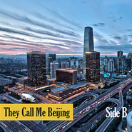

They Call Me Beijing (Side B)
============================

|  |  |
| :--: | :-- |
| [ They Call Me Beijing (Side B)](https://emumo.xiami.com/album/2100291958) | **艺人**: [CandyBox](../index.md) **语种**: 其他 **唱片公司**: 独立发行 **发行时间**: 2016年06月06日 **专辑类别**: 精选集 **专辑风格**:  **播放数**: 3781 **收藏数**: 23 **评论数**: 4  |

## 简介

This album is dedicated to the city called Beijing. 

## 曲目

## 评论

|  |  |  |  |
| :-- | :-- | :-- | :-- |
|  [虾米用户](https://emumo.xiami.com/u/291895352) 已打碎了曾经的梦 不想再... 2019-06-01 12:21 赞(0) 踩(0) | 
帝都菜鸟composer给跪
 |
|  [虾米用户](https://emumo.xiami.com/u/1736088)  听 2016-03-16 20:24 赞(0) 踩(0) | 
会比较喜欢6:00am这张感觉是几张专辑听下来最喜欢的一张了~音色感觉都很成熟，氛围感也挺强可能因为我本身比较喜欢House~
 |
|  [虾米用户](https://emumo.xiami.com/u/6345340) 向死而生 2016-03-13 05:20 赞(0) 踩(0) | 
棒~
 |
|  [虾米用户](https://emumo.xiami.com/u/12161298) 天涯海角，有缘再见如果愿... 2016-03-13 00:12 赞(0) 踩(0) | 
nice
 |
