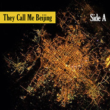
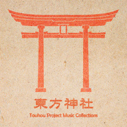

CandyBox
============================

|  |  |
| :--: | :-- |
| [ CandyBox](https://i.xiami.com/coconutcandy) | **播放数**: 2663119 **粉丝数**: 473 **评论数**: 40 **地区**: China 中国大陆 **风格**: 轻音乐 Easy Listening  |

## 档案

新浪微博 @-CandyBox-

## 专辑

| 名称 | 语种 | 唱片公司 | 发行时间 | 专辑类别 | 专辑风格 |
| :--: | :-- | :-- | :-- | :-- | :-- |
| [ U.TO.PIA](./albums/2104427828.md) | 其他 | 独立发行 | 2019年01月09日 | 录音室专辑 | 轻音乐 Easy Listening |
| [ 200% Sweetness](./albums/2105657318.md) | 其他 | 独立发行 | 2018年12月01日 | 录音室专辑 | 迪斯科 Disco |
| [ Zoo Park](./albums/2105657312.md) | 其他 | 独立发行 | 2018年05月31日 | 录音室专辑 | 电子 Electronic |
| [ They Call Me Beijing (Side B)](./albums/2100291958.md) | 其他 | 独立发行 | 2016年06月06日 | 精选集 |  |
| [ Cento Diary No.2](./albums/2100294292.md) | 其他 | 独立发行 | 2016年03月16日 | EP, 单曲 | 新世纪音乐 New Age |
| [ They Call Me Beijing (Side A)](./albums/1112779156.md) | 其他 | 独立发行 | 2016年03月11日 | EP, 单曲 | 轻音乐 Easy Listening |
| [ Kitten’s Day Out](./albums/2100273520.md) | 其他 | 独立发行 | 2016年02月09日 | EP, 单曲 | 轻音乐 Easy Listening |
| [ A Christmas Cento](./albums/2100250308.md) | 其他 | 独立发行 | 2015年12月24日 | EP, 单曲 | 轻音乐 Easy Listening |
| [ Journey (Phase I)](./albums/1630402722.md) | 其他 | 独立发行 | 2015年12月08日 | 精选集 | 浩室舞曲 House, 融合爵士 Jazz Fusion |
| [ 東方神社Touhou Project Music Collections](./albums/2100235030.md) | 其他 | 独立发行 | 2015年11月10日 | 精选集 | 放克电子 Electro (Electro-Funk) |
| [ Dragonlady(Groove Mix)](./albums/2100229876.md) | 其他 | 独立发行 | 2015年10月30日 | EP, 单曲 | 科技舞曲 Techno |
| [ Heart of SwordJourney of Bravery](./albums/1318305983.md) | 其他 | 独立发行 | 2015年10月20日 | 原声带, 影视音乐 | 轻音乐 Easy Listening |
| [ Piano](./albums/113776955.md) | 其他 | 独立发行 | 2015年05月18日 | 合集, 杂锦 | 器乐独奏 Solo Instrumental, 轻音乐 Easy Listening |
| [ Streaming Summer](./albums/1231395383.md) | 其他 | 独立发行 | 2015年05月12日 | 录音室专辑 | 新世纪音乐 New Age |
| [ Whisper to You轻音乐](./albums/1612951694.md) | 其他 | 独立发行 | 2015年04月15日 | EP, 单曲 | 轻音乐 Easy Listening |
| [ Twinkle Stage](./albums/2013371770.md) | 其他 | 独立发行 | 2015年01月10日 | 精选集 | 放克电子 Electro (Electro-Funk) |
| [ Game Sound Remix](./albums/1213083353.md) | 其他 | 独立发行 | 2014年10月12日 | 录音室专辑 | 电音流行 Electropop |
| [ Journey to the West西行记](./albums/812685696.md) | 其他 | 独立发行 | 2014年10月07日 | EP, 单曲 | 放克电子 Electro (Electro-Funk), 民族融合新世纪 Ethnic Fusion New Age |

## 评论

|  |  |  |  |
| :-- | :-- | :-- | :-- |
|  [虾米用户](https://emumo.xiami.com/u/311140404)  2020-08-19 23:37 赞(0) 踩(0) | 
不知道还在么&amp;hellip;&amp;hellip;很喜欢你remix的luv letter 8bit风格 
 |
|  [虾米用户](https://emumo.xiami.com/u/2165528)   2019-04-02 03:15 赞(0) 踩(0) | 
来凑个
 |
|  [虾米用户](https://emumo.xiami.com/u/46731324) We are all m... 2018-04-22 21:41 赞(0) 踩(0) | 
为啥我搜不到聚聚的微博 
 |
| ⇒ |  [虾米用户](https://emumo.xiami.com/u/29817522) ⭐ 2018-10-11 21:10 赞(0) 踩(0) | 
现在名字是-CandyBox-
 |
|  [虾米用户](https://emumo.xiami.com/u/3817709) 电视柜音乐人 2017-05-23 22:30 赞(1) 踩(0) | 
很喜欢！干干净净。
 |
|  [虾米用户](https://emumo.xiami.com/u/85521428)  2017-04-27 20:55 赞(0) 踩(0) | 
希望继续高产
 |
|  [虾米用户](https://emumo.xiami.com/u/39089376) live a life! 2017-04-18 17:24 赞(0) 踩(0) | 
还有什么a
 |
|  [虾米用户](https://emumo.xiami.com/u/3584048)  2017-01-12 22:26 赞(0) 踩(0) | 
椰子聚聚真人超帅！
 |
|  [虾米用户](https://emumo.xiami.com/u/8559958) Paralyzed 2016-07-14 21:17 赞(1) 踩(0) | 
椰子聚聚好像很喜欢D调
 |
|  [虾米用户](https://emumo.xiami.com/u/8559958) Paralyzed 2016-07-03 22:00 赞(1) 踩(0) | 
想买椰子的专辑
 |
|  [虾米用户](https://emumo.xiami.com/u/132901604)  2016-05-28 02:31 赞(1) 踩(0) | 
好厉害
 |
|  [虾米用户](https://emumo.xiami.com/u/120221172) True Blue. 2016-03-12 21:39 赞(1) 踩(0) | 
椰子聚聚我喜欢你啊
 |
|  [虾米用户](https://emumo.xiami.com/u/7594713) trust no one 2016-03-10 12:55 赞(1) 踩(0) | 
牛逼！
 |
|  [虾米用户](https://emumo.xiami.com/u/18709016) 暂无签名~ 2016-02-06 02:47 赞(0) 踩(0) | 
ಥ ౪ ಥ
 |
|  [虾米用户](https://emumo.xiami.com/u/44311959)  2016-01-31 14:14 赞(1) 踩(0) | 
为了椰子专门下载虾米(๑°ㅁ°๑)‼✧
 |
|  [虾米用户](https://emumo.xiami.com/u/54078462) 鱿鱼一根 2015-10-24 00:06 赞(1) 踩(0) | 
爱你~椰子（づ￣3￣）づ╭❤～
 |
|  [虾米用户](https://emumo.xiami.com/u/10209393) 旺旺雪饼真好吃呀 2015-10-11 16:47 赞(1) 踩(0) | 
跪舔椰子聚聚
 |
|  [虾米用户](https://emumo.xiami.com/u/29817522) ⭐ 2015-07-07 17:49 赞(1) 踩(0) | 
卧槽 椰子一直在出新歌
 |
|  [虾米用户](https://emumo.xiami.com/u/45519482)  2015-06-29 20:19 赞(0) 踩(0) | 
还会出歌吗
 |
|  [虾米用户](https://emumo.xiami.com/u/8770940)  2015-06-07 22:39 赞(1) 踩(0) | 
椰子，你的两块壳好大~好硬~
 |
|  [虾米用户](https://emumo.xiami.com/u/8770940)  2015-06-07 22:35 赞(0) 踩(0) | 
椰子椰子~
 |
|  [虾米用户](https://emumo.xiami.com/u/246720) 感谢一路陪伴，2Ever... 2015-05-31 20:00 赞(0) 踩(0) | 
呀！爱死了。
 |
|  [虾米用户](https://emumo.xiami.com/u/11452874) 暂无签名~ 2015-05-19 15:36 赞(0) 踩(0) | 
手动赞
 |
|  [虾米用户](https://emumo.xiami.com/u/445876)  2015-05-19 11:57 赞(0) 踩(0) | 
天啦噜什么时候发了这么多(゜д゜)
 |
|  [虾米用户](https://emumo.xiami.com/u/5706373)  2015-04-17 04:39 赞(0) 踩(0) | 
椰子 (ง •̀_•́)ง
 |
|  [虾米用户](https://emumo.xiami.com/u/8142216)  2015-03-18 07:47 赞(0) 踩(0) | 
卧槽椰子
 |
|  [虾米用户](https://emumo.xiami.com/u/11643877) 姑且听之 2015-03-16 23:44 赞(0) 踩(0) | 
<a href="http://emumo.xiami.com/u/37636589" target="_blank" rel="nofollow" name_card="37636589">@Coconut4U</a> 椰子菊苣我把你的音乐传到youtube上了,不介意吧_(:з」∠)_
 |
|  [虾米用户](https://emumo.xiami.com/u/11643877) 姑且听之 2015-03-12 11:24 赞(0) 踩(0) | 
原来是国人大神,太赞~
 |
|  [虾米用户](https://emumo.xiami.com/u/12709358) 88虾米 2015-03-04 01:27 赞(0) 踩(0) | 
熟悉的音乐 2333
 |
|  [虾米用户](https://emumo.xiami.com/u/11500417) SigNalized～ 2015-01-10 00:45 赞(0) 踩(0) | 
椰子巨巨好～
 |
|  [虾米用户](https://emumo.xiami.com/u/9644664) 你好   虾米 2014-12-30 22:38 赞(2) 踩(0) | 
东热给跪了
 |
|  [虾米用户](https://emumo.xiami.com/u/1248436) 福伯 2014-12-30 02:58 赞(2) 踩(0) | 
Tokyo hot
 |
|  [虾米用户](https://emumo.xiami.com/u/41367901)  2014-12-22 23:27 赞(0) 踩(0) | 
可怕的椰子，噫
 |
|  [虾米用户](https://emumo.xiami.com/u/44311152) maimai玩家 2014-12-22 16:50 赞(0) 踩(0) | 
椰子么么哒
 |
|  [虾米用户](https://emumo.xiami.com/u/9544437)  2014-12-11 04:16 赞(0) 踩(0) | 
椰子爷爷
 |
|  [虾米用户](https://emumo.xiami.com/u/1847292) 我改不了签名 2014-12-02 13:31 赞(0) 踩(0) | 
还不错哦
 |
|  [虾米用户](https://emumo.xiami.com/u/9158083) like the cig... 2014-09-11 18:03 赞(0) 踩(0) | 
我是给tokyo hot 跪了~-，-~
 |
|  [虾米用户](https://emumo.xiami.com/u/26464186)   2014-08-07 23:22 赞(0) 踩(0) | 
跪舔椰子聚聚
 |
|  [虾米用户](https://emumo.xiami.com/u/37636589)  2014-06-28 01:06 赞(16) 踩(0) | 
我刚入驻了虾米音乐人，欢迎大家来我的个人主页，收听我的最新音乐
 |
| ⇒ |  [虾米用户](https://emumo.xiami.com/u/59937254)  2016-07-19 10:29 赞(0) 踩(0) | 
介绍两个外国的艺人，音乐很棒    栗コーダーカルテット     I Am Robot and Proud     Cécile Corbel
 |
