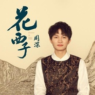

花西子
============================

|  |  |
| :--: | :-- |
| [ 花西子](https://emumo.xiami.com/album/5021017031) | **艺人**: [周深](../index.md) **语种**: 国语 **唱片公司**: 花西子 **发行时间**: 2020年06月29日 **专辑类别**: EP, 单曲 **专辑风格**: 国语流行 Mandarin Pop **播放数**: 1321 **收藏数**: 17 **评论数**: 2  |

## 简介

五音十二律，宫商角徵羽。

传统音律，成就了东方音乐，

如今仅字谱在流传，声音已被遗忘；

钟鼓之音，琴瑟和鸣。

民族乐器，奏出了歌舞升平，

如今也渐渐失传，少人问津。

为传承东方声乐文化，守护东方之音，

花西子携手四位东方知音，共创了一首歌。

方文山老师，引诗落笔，谱写东方词。

陈致逸老师，移宫换羽，再现西子调。

于连军老师，以匠为声，独奏民族乐 。

这首歌，将由周深唱给你听，

她的名字，叫《花西子》。

## 曲目

- [花西子MV](./5021017031/yhNNJO97b70.md)

## 评论

|  |  |  |
| :-- | :-- | :-- |
|  [虾米用户](https://emumo.xiami.com/u/230803304) 三观正又爱国的成都宝藏男... 2020-07-18 13:48 赞(0) 踩(0) | 
深深的声线确实很好听 很容易把听众带入那个画面里去
 |
|  [虾米用户](https://emumo.xiami.com/u/269924289) 我还没想好要写什么... 2020-07-06 23:29 赞(1) 踩(0) | 
这个也没有版权啊
 |
