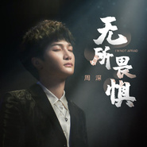

无所畏惧
============================

|  |  |
| :--: | :-- |
| [ 无所畏惧](https://emumo.xiami.com/album/5022410054) | **艺人**: [周深](../index.md) **语种**: 国语 **唱片公司**: 巨人网络 **发行时间**: 2021年01月10日 **专辑类别**: EP, 单曲 **专辑风格**: 国语流行 Mandarin Pop **播放数**: 35 **收藏数**: 3 **评论数**: 1  |

## 简介

巨人网络旗下经典休闲手游《球球大作战》2021年度资料片主题曲将于2021年1月10日正式上线。 友情与爱的加持，会给予我们无所畏惧的勇气与果敢，在人生的征途里，去战胜的各种各样的“怪兽”与难题。一如主题曲《无所畏惧》所表达的的那样：“爱会延续，点亮希望灯火，让我能在未知旅途中无所畏惧，一直走到尽头。”这首旋律昂扬恢宏，具有浓烈的音乐剧风格的主题曲《无所畏惧》，由曾为平昌冬奥会、南非世界杯、IAAF（国际陆上竞技联盟）等制作官方主题曲的国际知名作曲家Shin Myungsoo与为《Spider-Man: Into the Spider-Verse》、《Spider-Man: Homecoming》、《Ice Age: Collision Course》等多部好莱坞电影主题曲作词人Ali Dee (Ali Theodore)为资料片量身定制，由华语新锐音乐人关手、陈红鲤联手打造中文版歌词，周深倾情演唱，细腻婉转的空灵声线融入大气磅礴的旋律，配合全新制作的年度剧情CG《无所畏惧》，亦让大家一起，随着咕噜咕噜和他的朋友们，重返充满魔幻色彩的波拉哩，带着无所畏惧的勇气，踏上驯服狂躁的巨龙，战胜卡奥斯率领的邪恶势力，拯救王国的冒险之旅。

## 曲目

- [无所畏惧《球球大作战》2021年度资料片主题曲](./5022410054/bfNuo2r31a0f.md)
- [无所畏惧 (伴奏)](./5022410054/nn7wktcfd3e.md)

## 评论

|  |  |  |
| :-- | :-- | :-- |
|  [虾米用户](https://emumo.xiami.com/u/444439329)  2021-01-16 21:47 赞(0) 踩(0) | 
球球不倒 oh yeah
 |
