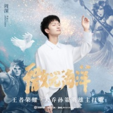
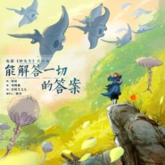
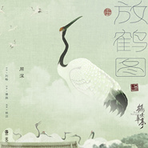
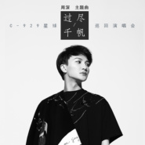
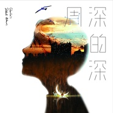
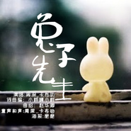
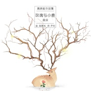
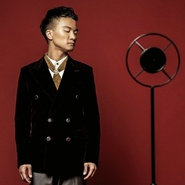

周深
============================

|  |  |
| :--: | :-- |
| [ 周深](https://i.xiami.com/zhoushen) | **播放数**: 212749741 **粉丝数**: 175893 **评论数**: 2486 **地区**: China 中国大陆 **风格**: 国语流行 Mandarin Pop  |

## 档案

周深，1992年9月29日出生，贵州贵阳人，新生代歌手。浙江卫视《中国好声音》第三季学员，所属那英团队。 
2014年，参加浙江卫视《中国好声音》第三季第二期，以一首齐豫的《欢颜》获得导师们的赞赏；9月1日在《中国好声音重返巅峰》节目，带着一首《美错》，赢得了陈晓东和王治平的充分的肯定；10月7日，参加《好声音总决赛》，凭借《贝加尔湖畔》获得“中国好声音”年度金曲  。2015年春节大年初一北京卫视春晚献唱多语版《Let it go》支持北京申办冬奥会 。2015年4月为电影《何以笙箫默》片头片尾配唱人声SOLO《You Are My Sunshine》 。7月发行首张翻唱专辑《回味》并举办新专辑首唱会 。 
周深祖籍湖南，小时候跟随父母到贵阳定居。2010年，周深从六中毕业到乌克兰求学。 
在初中时，由于自身嗓音特别，所以都不敢在同学面前唱歌。直到高中之后在一次校园歌唱大赛，荣获冠军。自那以后，周深开始被大家熟知，在校园里渐渐有了名气。也因此一位学长主动找到周深，邀请周深演唱自己的原创歌曲《雨后你不见了》，也让周深开始重新找回唱歌的自信 。 
高考过后，周深远赴乌克兰求学，最开始选择了还感兴趣的医学专业，后来周深决定还是选择自己喜欢的音乐专业，转到了国立音乐学院  。 
2010年进入网络语音平台YY唱歌，后为2080天籁歌手。 
2014年周深参加第三季《中国好声音》 ，以一首齐豫的《欢颜》获得导师们的盛赞；10月7日登台《好声音盛典之夜》凭借《贝加尔湖畔》  ，获得好声音年度金曲奖  ；11月1日，那英青岛演唱会，担任助阵嘉宾 。参加了多场好声音演唱会，包括北京工体(9月26日)、香港红磡(11月11日)、上海大舞台(12月20日)、澳门跨年(12月31日)等。 
2015年1月3日参加好声音台北小巨蛋演唱会，2月7日参加好声音深圳演唱会；春节期间参加录制了北京卡酷少儿春晚、城市春晚，并于大年初一北京卫视春晚献唱了多语版《Let it go》支持北京申办冬奥会 ；随后2月23日-3月10日周深参加了“文化中国四海同春”艺术团慰侨活动赴大洋洲五城市演出 ；4月为电影《何以笙箫默》片头片尾配唱人声SOLO《You Are My Sunshine》 ；5月代表“中国好声音”前往伦敦参加当地“The Voice”总决选，并担任评审及表演嘉宾 。7月发行首张翻唱专辑《回味》并举办新专辑首唱会。 "> 周深，1992年9月29日出生，贵州贵阳人，新生代歌手。浙江卫视《中国好声音》第三季学员，所属那英团队。 
2014年，参加浙江卫视《中国好声音》第三季第二期，以一首齐豫的《欢颜》获得导师们的赞赏；9月1日在《中国好声音重返巅峰》节目，带着一首《美错》，赢得了陈晓东和王治平的充分的肯定；10月7日，参加《好声音总决赛》，凭借《贝加尔湖畔》获得“中国好声音”年度金曲  。2015年春节大年初一北京卫视春晚献唱多语版《Let it go》支持北京申办冬奥会 。2015年4月为电影《何以笙箫默》片头片尾配唱人声SOLO《You Are My Sunshine》 。7月发行首张翻唱专辑《回味》并举办新专辑首唱会 。 
周深祖籍湖南，小时候跟随父母到贵阳定居。2010年，周深从六中毕业到乌克兰求学。 
在初中时，由于自身嗓音特别，所以都不敢在同学面前唱歌。直到高中之后在一次校园歌唱大赛，荣获冠军。自那以后，周深开始被大家熟知，在校园里渐渐有了名气。也因此一位学长主动找到周深，邀请周深演唱自己的原创歌曲《雨后你不见了》，也让周深开始重新找回唱歌的自信 。 
高考过后，周深远赴乌克兰求学，最开始选择了还感兴趣的医学专业，后来周深决定还是选择自己喜欢的音乐专业，转到了国立音乐学院  。 
2010年进入网络语音平台YY唱歌，后为2080天籁歌手。 
2014年周深参加第三季《中国好声音》 ，以一首齐豫的《欢颜》获得导师们的盛赞；10月7日登台《好声音盛典之夜》凭借《贝加尔湖畔》  ，获得好声音年度金曲奖  ；11月1日，那英青岛演唱会，担任助阵嘉宾 。参加了多场好声音演唱会，包括北京工体(9月26日)、香港红磡(11月11日)、上海大舞台(12月20日)、澳门跨年(12月31日)等。 
2015年1月3日参加好声音台北小巨蛋演唱会，2月7日参加好声音深圳演唱会；春节期间参加录制了北京卡酷少儿春晚、城市春晚，并于大年初一北京卫视春晚献唱了多语版《Let it go》支持北京申办冬奥会 ；随后2月23日-3月10日周深参加了“文化中国四海同春”艺术团慰侨活动赴大洋洲五城市演出 ；4月为电影《何以笙箫默》片头片尾配唱人声SOLO《You Are My Sunshine》 ；5月代表“中国好声音”前往伦敦参加当地“The Voice”总决选，并担任评审及表演嘉宾 。7月发行首张翻唱专辑《回味》并举办新专辑首唱会。

## 专辑

| 名称 | 语种 | 唱片公司 | 发行时间 | 专辑类别 | 专辑风格 |
| :--: | :-- | :-- | :-- | :-- | :-- |
| [ 望Expectation](./albums/5022580870.md) | 国语 | 支付宝 | 2021年01月25日 | EP, 单曲 | 国语流行 Mandarin Pop |
| [ 我，江湖](./albums/5022605519.md) | 国语 | 网易云音乐 | 2021年01月23日 | EP, 单曲 | 国语流行 Mandarin Pop |
| [ 归处](./albums/5022568350.md) | 国语 | 劲焱文化 | 2021年01月22日 | EP, 单曲 | 国语流行 Mandarin Pop |
| [ 无所畏惧](./albums/5022410054.md) | 国语 | 巨人网络 | 2021年01月10日 | EP, 单曲 | 国语流行 Mandarin Pop |
| [ 天涯尽处](./albums/5022391982.md) | 国语 | 白鲸音乐 | 2021年01月08日 | EP, 单曲 | 国语流行 Mandarin Pop |
| [ 相守](./albums/5022360577.md) | 国语 | 软星科技 | 2020年12月29日 | EP, 单曲 | 国语流行 Mandarin Pop |
| [ 江湖觅知音](./albums/5022213663.md) | 国语 | 博轩音乐, 劲焱文化 | 2020年12月18日 | EP, 单曲 | 国语流行 Mandarin Pop |
| [ 和光同尘](./albums/5022201970.md) | 国语 |  | 2020年12月16日 | EP, 单曲 | 国语流行 Mandarin Pop |
| [ 海上蝶](./albums/5022148751.md) | 国语 | 网易云音乐 | 2020年12月07日 | EP, 单曲 | 国语流行 Mandarin Pop |
| [ 画绢](./albums/5021995951.md) | 国语 | 劲焱文化 | 2020年11月22日 | EP, 单曲 | 国语流行 Mandarin Pop |
| [ 起风了](./albums/5021402938.md) | 国语 | 宽娱数码 | 2020年09月03日 | EP, 单曲 | 国语流行 Mandarin Pop |
| [ 我是你的谁](./albums/5021348530.md) | 国语 | 腾讯音乐, JFJ Productions | 2020年08月25日 | EP, 单曲 | 国语流行 Mandarin Pop |
| [ 微光海洋](./albums/5021224688.md) | 国语 | 腾讯游戏, 腾讯音乐 | 2020年08月03日 | EP, 单曲 | 国语流行 Mandarin Pop |
| [ 周深“晚安 明天见”TME live 超现场](./albums/5022239936.md) | 国语 | 腾讯音乐 | 2020年07月29日 | 现场专辑 |  |
| [ 化身孤岛的鲸](./albums/5021175419.md) | 国语 | 劲焱文化 | 2020年07月25日 | EP, 单曲 | 国语流行 Mandarin Pop |
| [ 荒原星火](./albums/5021086462.md) | 国语 | 网元圣唐娱乐 | 2020年07月16日 | EP, 单曲 | 国语流行 Mandarin Pop |
| [ 影](./albums/5021041607.md) | 国语 | 华策音乐 | 2020年07月06日 | EP, 单曲 | 国语流行 Mandarin Pop |
| [ 与卿](./albums/5021035296.md) | 国语 | 华清飞扬网络 | 2020年07月03日 | EP, 单曲 | 国语流行 Mandarin Pop |
| [ 花西子](./albums/5021017031.md) | 国语 | 花西子 | 2020年06月29日 | EP, 单曲 | 国语流行 Mandarin Pop |
| [ 天地为念](./albums/5021001336.md) | 国语 | 宽娱数码 | 2020年06月28日 | EP, 单曲 | 国语流行 Mandarin Pop |
| [ 不想睡](./albums/5020849674.md) | 国语 | 声众网络科技 | 2020年06月08日 | EP, 单曲 | 国语流行 Mandarin Pop |
| [ 话语](./albums/5020757517.md) | 国语 | 网易云音乐 | 2020年05月27日 | EP, 单曲 | 国语流行 Mandarin Pop |
| [ 拂衣归](./albums/5020672106.md) | 国语 | 网易云音乐 | 2020年05月19日 | EP, 单曲 | 国语流行 Mandarin Pop |
| [ 瞳·出类拔萃](./albums/5020600273.md) | 国语 | 万普拉斯科技 | 2020年05月14日 | EP, 单曲 | 国语流行 Mandarin Pop |
| [ 暗示](./albums/2108388145.md) | 国语 | 网易云音乐 | 2020年04月29日 | EP, 单曲 | 国语流行 Mandarin Pop |
| [ DNF官方动画第二季推广曲](./albums/2108357028.md) | 国语 | 腾讯游戏 | 2020年04月13日 | EP, 单曲 | 国语流行 Mandarin Pop |
| [ 爱若琉璃电视剧《琉璃》主题曲](./albums/5021438882.md) | 国语 | 欢瑞世纪 | 2020年04月01日 | 原声带, 影视音乐 | 国语流行 Mandarin Pop |
| [ 昙花一现雨及时](./albums/2108246023.md) | 国语 | 芒果TV | 2020年03月18日 | EP, 单曲 | 民谣流行 Folk Pop, 国语流行 Mandarin Pop |
| [ 雪花落下](./albums/5020319502.md) | 国语 | 中英音乐 | 2020年03月10日 | EP, 单曲 | 电视原声 Television Music, 国语流行 Mandarin Pop |
| [ 渴望遇见](./albums/2106072663.md) | 国语 | 文成郑来君音乐工作室 | 2020年02月16日 | EP, 单曲 | 国语流行 Mandarin Pop |
| [ 请笃信一个梦](./albums/2105745932.md) | 国语 | 光线传媒 | 2020年01月17日 | EP, 单曲 | 国语流行 Mandarin Pop |
| [ 听我说Listen to Me](./albums/2105723057.md) | 国语 | 支付宝 | 2020年01月08日 | EP, 单曲 | 国语流行 Mandarin Pop |
| [ 能解答一切的答案](./albums/2105722992.md) | 国语 | 光线传媒 | 2019年12月27日 | 原声带, 影视音乐 | 国语流行 Mandarin Pop |
| [ 愿Wish](./albums/2106059049.md) | 国语 | 完美青春OST, 华纳音乐 | 2019年12月23日 | EP, 单曲 | 国语流行 Mandarin Pop |
| [ 不群](./albums/5022244316.md) | 国语 | 网易云音乐, NEGIA纳吉音 | 2019年12月21日 | EP, 单曲 | 国语流行 Mandarin Pop |
| [ 念念有词青春重置计划 Part.2 原来都是葛大为](./albums/5022237482.md) | 国语 | 智慧大狗, 环球唱片 | 2019年12月07日 | EP, 单曲 | 国语流行 Mandarin Pop |
| [ 触不可及](./albums/2105842696.md) | 国语 | 卓然声声 | 2019年11月21日 | EP, 单曲 | 国语流行 Mandarin Pop |
| [ 放鹤图](./albums/2105431060.md) | 国语 | 谭旋音乐工作室, 希瓜音乐 | 2019年11月11日 | EP, 单曲 | 国语流行 Mandarin Pop |
| [ 愿得一心人](./albums/2105422101.md) | 国语 | 太合音乐 | 2019年11月08日 | EP, 单曲 | 国语流行 Mandarin Pop, 原声 Soundtrack |
| [ 过尽千帆周深C-929星球巡回演唱会主题曲](./albums/2105407793.md) | 国语 | 梦响强音 | 2019年11月05日 | EP, 单曲 | 国语流行 Mandarin Pop |
| [ 海藏](./albums/2106080527.md) | 国语 | 爱奇艺 | 2019年10月23日 | EP, 单曲 | 国语流行 Mandarin Pop |
| [ 东游](./albums/2105354111.md) | 国语 | 馨香沐喜文化 | 2019年10月17日 | EP, 单曲 | 国语流行 Mandarin Pop |
| [ 情意结](./albums/5022252202.md) | 国语 | 一起嗨文化 | 2019年09月06日 | EP, 单曲 | 国语流行 Mandarin Pop |
| [ 不再流浪电影《罗小黑战记》治愈推广曲](./albums/5021248769.md) | 国语 | 卓然声声 | 2019年08月28日 | EP, 单曲 | 国语流行 Mandarin Pop |
| [ 直破穹苍](./albums/2105041321.md) | 国语 | 上海阅文信息技术 | 2019年07月28日 | EP, 单曲 | 国语流行 Mandarin Pop |
| [ 为爱追寻](./albums/2104973214.md) | 国语 | 勇士传奇 | 2019年07月06日 | EP, 单曲 | 国语流行 Mandarin Pop |
| [ 拙慕](./albums/5022255595.md) | 国语 | 奔跑怪物 | 2019年05月28日 | EP, 单曲 | 国语流行 Mandarin Pop |
| [ 蜕](./albums/5021250661.md) | 国语 | 上海阅文信息技术 | 2019年04月12日 | EP, 单曲 | 国语流行 Mandarin Pop |
| [ 此生惟你](./albums/2104655563.md) | 国语 | 听见时代 | 2019年03月08日 | EP, 单曲 | 国语流行 Mandarin Pop |
| [ 缘起《白蛇：缘起》电影推广曲](./albums/5021245822.md) | 国语 | 卓然声声 | 2018年11月30日 | EP, 单曲 | 国语流行 Mandarin Pop |
| [ 对不起](./albums/2104135320.md) | 国语 |  | 2018年10月16日 | EP, 单曲 | 国语流行 Mandarin Pop |
| [ 梅香如故 (独唱版)](./albums/5022239935.md) | 国语 | 仁溪文化 | 2018年09月30日 | EP, 单曲 | 国语流行 Mandarin Pop |
| [ 可它爱着这个世界](./albums/5021247305.md) | 国语 | 梦响强音 | 2018年09月29日 | EP, 单曲 | 国语流行 Mandarin Pop |
| [ 神都夜行录](./albums/2104042043.md) | 国语 |  | 2018年09月18日 | EP, 单曲 | 国语流行 Mandarin Pop |
| [ 梅香如故](./albums/5022253594.md) | 国语 | 仁溪文化 | 2018年08月23日 | EP, 单曲 | 国语流行 Mandarin Pop |
| [ 念](./albums/5022247795.md) | 国语 | 浣沙文化 | 2018年08月15日 | EP, 单曲 | 国语流行 Mandarin Pop |
| [ 没有说完的故事](./albums/2103907805.md) | 国语 | 索雅音乐 | 2018年08月10日 | EP, 单曲 | 电影原声 Film Score, 国语流行 Mandarin Pop |
| [ 来不及勇敢](./albums/2103775178.md) | 国语 | 光线彩条屋 | 2018年07月06日 | EP, 单曲 | 国语流行 Mandarin Pop |
| [ 梦留别](./albums/2103773117.md) | 国语 | 腾讯游戏 | 2018年06月29日 | EP, 单曲 | 国语流行 Mandarin Pop, 中国风 China-Wave |
| [ 云裳羽衣曲](./albums/2103764175.md) | 国语 | 种子音乐 | 2018年06月27日 | EP, 单曲 | 中国风 China-Wave |
| [ 等着我](./albums/2103713110.md) | 国语 | 星外星音乐 | 2018年05月20日 | EP, 单曲 | 国语流行 Mandarin Pop |
| [ 花开周深2018巡回演唱会宣传曲](./albums/5021246312.md) | 国语 | 梦响强音 | 2018年05月08日 | EP, 单曲 | 国语流行 Mandarin Pop |
| [ 无关](./albums/2103696213.md) | 国语 | 听见时代 | 2018年04月27日 | EP, 单曲 | 国语流行 Mandarin Pop |
| [ 水形物语The Shape of Water](./albums/2103604685.md) | 国语 | 卓然声声 | 2018年03月13日 | EP, 单曲 | 国语流行 Mandarin Pop |
| [ 如果你爱我](./albums/2103480126.md) | 国语 | 畅和文化 | 2018年01月10日 | EP, 单曲 | 国语流行 Mandarin Pop |
| [ 垃圾别烦我](./albums/2102963652.md) | 国语 | 千和世纪 | 2017年11月30日 | EP, 单曲 |  |
| [ 深的深](./albums/2102884088.md) | 国语 | 华宇世博 | 2017年11月06日 | 录音室专辑 | 国语流行 Mandarin Pop |
| [ 何处是天涯](./albums/2102878995.md) | 国语 | 中润开元 | 2017年10月24日 | EP, 单曲 | 国语流行 Mandarin Pop, 古风 GuFeng Music |
| [ 不说话电影《大护法》概念曲](./albums/5021248290.md) | 国语 | 霍尔果斯 | 2017年06月21日 | EP, 单曲 | 国语流行 Mandarin Pop |
| [ 浓情淡如你](./albums/2102761572.md) | 国语 | 看见音乐 (上海) | 2017年06月15日 | EP, 单曲 | 国语流行 Mandarin Pop, 古风 GuFeng Music |
| [ 黎明的翅膀](./albums/2102735505.md) | 国语 | 腾讯 | 2017年04月21日 | EP, 单曲 | 国语流行 Mandarin Pop |
| [ 回声](./albums/2102691438.md) | 国语 | 灿星文化 | 2017年02月10日 | EP, 单曲 | 国语流行 Mandarin Pop |
| [ 妳](./albums/2102412595.md) | 国语 | 灿星文化 | 2016年10月25日 | EP, 单曲 | 国语流行 Mandarin Pop |
| [ 临安初雨](./albums/2100377051.md) | 国语 | 听见时代 | 2016年08月08日 | EP, 单曲 | 国语流行 Mandarin Pop, 古风 GuFeng Music |
| [ 大鱼](./albums/2100340412.md) | 国语 | 光线影业 | 2016年05月20日 | EP, 单曲 | 国语流行 Mandarin Pop, 中国风 China-Wave |
| [ 兔子先生](./albums/2100234200.md) | 国语 | 独立发行 | 2015年11月07日 | EP, 单曲 | 民谣流行 Folk Pop, 国语流行 Mandarin Pop |
| [ 回味](./albums/2102684226.md) | 国语 | 梦响当然 | 2015年08月20日 | 录音室专辑 | 国语流行 Mandarin Pop |
| [ 玫瑰与小鹿](./albums/2100174865.md) | 国语 | 阿里音乐 | 2015年08月08日 | EP, 单曲 | 国语流行 Mandarin Pop |
| [ 放心去飞](./albums/1431005373.md) | 国语 | 独立发行 | 2015年04月02日 | EP, 单曲 |  |
| [ Unravel](./albums/1127770465.md) | 日语 | 独立发行 | 2015年02月14日 | EP, 单曲 |  |
| [ 平凡之路](./albums/1027681146.md) | 国语 | 独立发行 | 2015年01月12日 | EP, 单曲 | 国语流行 Mandarin Pop |
| [ 偶然](./albums/312047037.md) | 国语 | 当然娱乐 | 2014年12月03日 | EP, 单曲 | 国语流行 Mandarin Pop |
| [ 漂洋过海来看你 周深翻唱精选Vol. 2](./albums/1109572252.md) | 国语 | 独立发行 | 2014年08月01日 | 精选集 | 国语流行 Mandarin Pop |
| [ 化身孤岛的鲸 周深翻唱精选Vol. 1](./albums/706617729.md) | 国语 | 独立发行 | 2014年04月23日 | EP, 单曲 | 国语流行 Mandarin Pop |
| [ Let It Go (九语男版)](./albums/1609312279.md) | 国语 | 独立发行 | 2014年02月20日 | EP, 单曲 |  |

## 评论

|  |  |  |  |
| :-- | :-- | :-- | :-- |
|  [虾米用户](https://emumo.xiami.com/u/441418052) 老阿姨也是小朋友呀 2021-01-31 14:58 赞(0) 踩(0) | 
干净的嗓音
 |
|  [虾米用户](https://emumo.xiami.com/u/363320268) 刚签名就是告别！ 2021-01-23 13:42 赞(0) 踩(0) | 
关注你了。
 |
|  [虾米用户](https://emumo.xiami.com/u/31239710)  2021-01-22 15:15 赞(0) 踩(0) | 
喜欢你的声音你的歌，永远支持你。
 |
|  [虾米用户](https://emumo.xiami.com/u/407423775) 段俊菠 2021-01-09 16:54 赞(2) 踩(0) | 
您好，周深，谢谢您，我特别喜欢听您的歌曲。
 |
|  [虾米用户](https://emumo.xiami.com/u/446574834)  2021-01-09 16:17 赞(0) 踩(0) | 
太好听啦
 |
|  [虾米用户](https://emumo.xiami.com/u/9370768) 很久很久以前... 2020-12-30 23:05 赞(0) 踩(0) | 
是男是女啊
 |
| ⇒ |  [虾米用户](https://emumo.xiami.com/u/322057597)  2021-01-01 16:03 赞(0) 踩(0) | 
男孩子
 |
| ⇒ |  [虾米用户](https://emumo.xiami.com/u/407423775) 段俊菠 2021-01-09 16:55 赞(0) 踩(0) | 
男人
 |
| ⇒ |  [虾米用户](https://emumo.xiami.com/u/407423775) 段俊菠 2021-01-09 16:55 赞(0) 踩(0) | 
男扮女装
 |
|  [虾米用户](https://emumo.xiami.com/u/374076407)  2020-12-24 19:15 赞(1) 踩(0) | 
周深是神仙吧？他怎么那么会唱？！
 |
|  [虾米用户](https://emumo.xiami.com/u/446380760)  2020-12-21 14:37 赞(1) 踩(0) | 

 |
|  [虾米用户](https://emumo.xiami.com/u/322057597)  2020-12-16 19:58 赞(2) 踩(0) | 
之前那个蓝色的头像多好看咋给换了呢？
 |
|  [虾米用户](https://emumo.xiami.com/u/445781582)  2020-12-14 14:33 赞(1) 踩(0) | 
 好好聽
 |
|  [虾米用户](https://emumo.xiami.com/u/446212311) 一只养喵的喵 2020-11-30 18:02 赞(3) 踩(0) | 
从卡布到周深 从布丁到生米 愿你永远快乐歌唱属于自己的歌 默默为你祝福
 |
|  [虾米用户](https://emumo.xiami.com/u/374457099)  2020-11-28 21:27 赞(0) 踩(0) | 
赞
 |
|  [虾米用户](https://emumo.xiami.com/u/445989676) 如果音乐足够动人 2020-11-21 10:38 赞(0) 踩(0) | 
有趣的灵魂从来与外表无关
 |
|  [虾米用户](https://emumo.xiami.com/u/260102619)  2020-11-19 11:44 赞(3) 踩(0) | 
无限可能，加油！
 |
|  [虾米用户](https://emumo.xiami.com/u/178176102) 找一首歌… 2020-11-19 09:16 赞(0) 踩(0) | 
男的？？？？？
 |
|  [虾米用户](https://emumo.xiami.com/u/18114482)  2020-11-11 23:34 赞(1) 踩(0) | 
希望你能保持初心，发光发亮吧
 |
|  [虾米用户](https://emumo.xiami.com/u/6258934)  2020-11-11 06:36 赞(3) 踩(0) | 
周深，你的一首翻唱歌微风细雨打动了我，让我关注你的每一首歌，关注你这个人。个人非常欣赏你在演唱方面的才华，对比你参加好声音时的表现，真的看到你正在渐入佳境，把每一首歌不论翻唱还是原唱都赋予新的内涵，新的生命。真心希望你秉持以情演绎歌曲，辅以你独特的演唱技法，不断前进，实现你歌史留名的事业高峰。看了你之前的大部分视频，你活泼单纯，阅历尚浅。多积淀人生阅历，少参加综艺活动，保护天赋好声音，延长艺术生命，以成熟、专业的诠释、演绎每一首歌曲，让观众看到一个更成熟、敬业的你，不断进步，在音乐史上深深地刻上你的名字。也希望各方媒体和唱片公司，歌迷多多爱护周深，这样的人才不多，让我们珍惜。
 |
|  [虾米用户](https://emumo.xiami.com/u/50160009)   2020-11-04 17:34 赞(0) 踩(0) | 
深深换个封面设计师吧，歌是好听，封面太那个了
 |
|  [虾米用户](https://emumo.xiami.com/u/324868023) 音乐没有国界 2020-11-04 17:22 赞(0) 踩(0) | 
如果当时周深选择了齐秦当老师，齐秦一定会给他写歌。这期好声音相信很多人以经看出来了，齐秦玩不过她们几个更没有那英她们背后的势力。齐秦是我国少有的音乐制作人，也是一个很单纯的人所以做了一期马上就下去了。虽然现在周深很火以经成了华语乐坛一个很亮的星，但如果有像齐秦老一辈港台音乐制作人写歌，那出来的作品绝对是精品。可惜没有如果！
 |
|  [虾米用户](https://emumo.xiami.com/u/194405805)  2020-11-01 20:09 赞(0) 踩(0) | 
天籁之音！！！！！！！！
 |
|  [虾米用户](https://emumo.xiami.com/u/409593313) 你爱过狗吗？会说人话的那... 2020-10-29 13:24 赞(0) 踩(0) | 
最棒的周深，本人非常nice，现场版大鱼犹如天籁，一生追！ 
 |
|  [虾米用户](https://emumo.xiami.com/u/358017786)  2020-10-25 16:49 赞(1) 踩(0) | 
支持深深，你的歌我都爱听 
 |
|  [虾米用户](https://emumo.xiami.com/u/444990090)  2020-10-22 23:40 赞(0) 踩(0) | 
你的歌百听不厌，生日快乐！ 
 |
|  [虾米用户](https://emumo.xiami.com/u/411681023)  2020-10-22 00:17 赞(1) 踩(0) | 
周深给我红
 |
|  [虾米用户](https://emumo.xiami.com/u/444456871) 山有木兮木有枝 心悦君兮... 2020-10-21 20:13 赞(1) 踩(0) | 
深深你可以唱撒野吗？我想如果你唱撒野的话会很好听     
 |
|  [虾米用户](https://emumo.xiami.com/u/307231095)  2020-10-18 15:48 赞(0) 踩(0) | 
愿美好与你同在~
 |
|  [虾米用户](https://emumo.xiami.com/u/73773450) 我还没想好要写什么... 2020-10-18 15:08 赞(0) 踩(0) | 
我听歌真的几乎没哭过，但是第一次听深深唱大鱼，忽然就哭了。虽然现在听深深的歌已经习惯了 但是他每首歌我都喜欢听，最喜欢的还是大鱼
 |
|  [虾米用户](https://emumo.xiami.com/u/210068359) 电影人，摄影师，艺术家，... 2020-09-29 23:20 赞(3) 踩(0) | 
大幺蛾子生日快乐！
 |
|  [虾米用户](https://emumo.xiami.com/u/1975635)  2020-09-29 23:15 赞(2) 踩(0) | 
深深生日快乐 不知不觉已经喜欢你六年啦
 |
|  [虾米用户](https://emumo.xiami.com/u/441827287) ☁ 2020-09-29 20:25 赞(2) 踩(0) | 
一个字 绝
 |
|  [虾米用户](https://emumo.xiami.com/u/48658719) 风吹散，说晚安，不再见。 2020-09-29 16:54 赞(3) 踩(0) | 
求周深的《千千阙歌》和《永远同在》，大神传一下吧！
 |
|  [虾米用户](https://emumo.xiami.com/u/48658719) 风吹散，说晚安，不再见。 2020-09-29 16:47 赞(0) 踩(0) | 
生日快乐
 |
|  [虾米用户](https://emumo.xiami.com/u/336018387)  2020-09-29 12:59 赞(2) 踩(0) | 
生日快乐 深深
 |
|  [虾米用户](https://emumo.xiami.com/u/278044875) 愿此生所爱，皆无山海. 2020-09-29 12:20 赞(1) 踩(0) | 
深深崽崽生日快乐！！！
 |
|  [虾米用户](https://emumo.xiami.com/u/311293918) 听一首歌想一个人 2020-09-29 12:12 赞(0) 踩(0) | 
生日蒙恩！要开心哈
 |
|  [虾米用户](https://emumo.xiami.com/u/431660181)  2020-09-29 12:11 赞(1) 踩(0) | 
我超喜欢周深唱歌，听他歌整个人忘记烦恼 
 |
|  [虾米用户](https://emumo.xiami.com/u/268859176)  2020-09-29 11:47 赞(0) 踩(0) | 
生日快乐 祝愿你越来越好，平安和顺，快乐幸福(≧&amp;omega;≦)
 |
|  [虾米用户](https://emumo.xiami.com/u/309115696) 我还没想好要写什么... 2020-09-29 11:42 赞(0) 踩(0) | 
愿美好与你同在
 |
|  [虾米用户](https://emumo.xiami.com/u/443872420)  2020-09-29 11:22 赞(1) 踩(0) | 
又是一年929，祝深仔生日快乐！星途璀璨！
 |
|  [虾米用户](https://emumo.xiami.com/u/628198) 暂无签名~ 2020-09-29 11:21 赞(0) 踩(0) | 
生日快乐！！！
 |
|  [虾米用户](https://emumo.xiami.com/u/25435694)  2020-09-29 11:19 赞(0) 踩(0) | 
深深，生日快乐，感恩相遇，感谢有你，愿你开开心心，身体健康，做你想做的，我们一直在你身边哦
 |
|  [虾米用户](https://emumo.xiami.com/u/441499042) 再见，虾米音乐 2020-09-29 11:15 赞(0) 踩(0) | 
生日快乐
 |
|  [虾米用户](https://emumo.xiami.com/u/353645610)  2020-09-29 10:57 赞(0) 踩(0) | 
可爱纯洁如天使，谢谢你下凡来抚慰我们受伤的心灵！请你再坚持一下下，多陪伴我们长长久久！
 |
|  [虾米用户](https://emumo.xiami.com/u/19090279)  2020-09-29 10:54 赞(0) 踩(0) | 
喜欢周深的声音！听周深的歌总是能让我的情绪冷静下来！治愈心情的良药！希望深深继续坚持下去，继续为我们带来更多的好歌！生日快乐！天天快乐！
 |
|  [虾米用户](https://emumo.xiami.com/u/49873796) 我还没想好要写什么... 2020-09-29 10:48 赞(0) 踩(0) | 
深深小天使，生日快乐(๑˙❥˙๑)
 |
|  [虾米用户](https://emumo.xiami.com/u/245602853) 人生本过客，何必千千结 2020-09-29 10:46 赞(0) 踩(0) | 
生日快乐！
 |
|  [虾米用户](https://emumo.xiami.com/u/445063034)  2020-09-29 10:46 赞(0) 踩(0) | 
我们的小王子生日快乐！未来可期！永远开心快乐！
 |
|  [虾米用户](https://emumo.xiami.com/u/349529196) 倒流回最初的相遇 2020-09-29 10:39 赞(0) 踩(0) | 
&lt;深深生日快乐很开心能够认识你，谢谢你选择了唱歌。[url=/u/49479260]@周深 [/url]&gt;&lt;49479260&gt;
 |
|  [虾米用户](https://emumo.xiami.com/u/426638415)  2020-09-29 10:33 赞(0) 踩(0) | 
生日快樂啊～周深！自從聽了你的歌，就喜歡上！加油哦～～     
 |
|  [虾米用户](https://emumo.xiami.com/u/377667399) 痛苦或快乐…都是获得 2020-09-29 10:33 赞(0) 踩(0) | 
深深我们深深爱你唱的歌，加油
 |
|  [虾米用户](https://emumo.xiami.com/u/33301522) 艾米 2020-09-29 10:32 赞(0) 踩(0) | 
生日快乐   
 |
|  [虾米用户](https://emumo.xiami.com/u/445094989)  2020-09-29 10:29 赞(0) 踩(0) | 
我的卡布男神，生日快乐！
 |
|  [虾米用户](https://emumo.xiami.com/u/84894220)  2020-09-29 10:26 赞(1) 踩(0) | 
深呐，生日快乐呀~ 也祝你早日找到属于你的幸福，每天都开开心心的搞笑，认认真真的唱歌支持你~~
 |
|  [虾米用户](https://emumo.xiami.com/u/444781005)  2020-09-29 10:25 赞(0) 踩(0) | 
一直支持 
 |
|  [虾米用户](https://emumo.xiami.com/u/444212909)  2020-09-29 10:23 赞(0) 踩(0) | 
跟爱豆一天生日好开心   
 |
|  [虾米用户](https://emumo.xiami.com/u/410175639)  2020-09-29 10:22 赞(0) 踩(0) | 
你的音色好美，生日快乐 
 |
|  [虾米用户](https://emumo.xiami.com/u/410336570) 喜歡你的笑、認真的男人最... 2020-09-29 10:20 赞(0) 踩(0) | 
&lt;深深、卡布叻 今天是你的生日在這裡㊗️福你生日快樂那是當然的！然後還要祝福你早日找到幸福、要很很很很很很很很很很很很幸福的那種噢⋯⋯非常非常非常非常高興的、很大聲很大聲很大聲的說我喜歡的歌手是周深。真的還好認識了你讓我此生無憾   [url=/u/49479260]@周深[/url] &gt;&lt;49479260&gt;
 |
|  [虾米用户](https://emumo.xiami.com/u/431749934)  2020-09-29 10:20 赞(0) 踩(0) | 
骨灰级粉。何时来杭州开演唱会？？？？啊啊啊？？？
 |
|  [虾米用户](https://emumo.xiami.com/u/4318607) 再也不见 2020-09-29 10:19 赞(0) 踩(0) | 
崽崽 妈妈爱你 哈哈哈哈哈哈哈哈崽崽 多开演唱会啦 相信妈妈总有一次可以抢到票的
 |
|  [虾米用户](https://emumo.xiami.com/u/316398244) 找个小哥哥 2020-09-29 10:19 赞(0) 踩(0) | 
只混韩圈和欧美圈的女孩，遇到了周深，从此一发不可收拾 谢谢深深，我第一个喜欢也是唯一一个喜欢的华语流行歌手，祝你越来越来好，越来越强！坠可爱的小星星生日快乐    
 |
|  [虾米用户](https://emumo.xiami.com/u/13418921) 寂寞为骨音乐做髓 2020-09-29 10:14 赞(1) 踩(0) | 
深深生日快乐啊！
 |
|  [虾米用户](https://emumo.xiami.com/u/23034979)  2020-09-29 10:13 赞(0) 踩(0) | 
爸爸爱你
 |
|  [虾米用户](https://emumo.xiami.com/u/32561545) 咦，你来啦！ 2020-09-29 10:12 赞(0) 踩(0) | 
深深生日快乐呀
 |
|  [虾米用户](https://emumo.xiami.com/u/441557360)  2020-09-29 10:11 赞(0) 踩(0) | 
喜欢你的贝加尔
 |
|  [虾米用户](https://emumo.xiami.com/u/333879577) Jay，SuperJun... 2020-09-29 10:09 赞(0) 踩(0) | 
深深生日快乐呀
 |
|  [虾米用户](https://emumo.xiami.com/u/269568929) 12人的盛世，9人的辉煌 2020-09-29 10:08 赞(1) 踩(0) | 
周深哥哥生日快乐呀！未来也要越来越好哦
 |
|  [虾米用户](https://emumo.xiami.com/u/16807556)  2020-09-29 10:06 赞(0) 踩(0) | 
卡布深深生日快乐！
 |
|  [虾米用户](https://emumo.xiami.com/u/2562859)   2020-09-29 10:05 赞(0) 踩(0) | 
你唱我就一直听，愿天天开心，深深生日快乐！！
 |
|  [虾米用户](https://emumo.xiami.com/u/230803304) 三观正又爱国的成都宝藏男... 2020-09-29 10:01 赞(0) 踩(0) | 
祝深深弟弟生日快乐
 |
|  [虾米用户](https://emumo.xiami.com/u/406050209)  2020-09-21 00:09 赞(1) 踩(0) | 
唯一追的星星
 |
|  [虾米用户](https://emumo.xiami.com/u/44874862) 晚安虾米网易云账号Sky... 2020-09-17 14:00 赞(1) 踩(0) | 
求BW上的unravel
 |
|  [虾米用户](https://emumo.xiami.com/u/443799239) 圣洁怜世惜薄命，纯善染尘... 2020-09-16 18:30 赞(1) 踩(0) | 
真是颜值与实力并存，智商和情商双高，永远支持你哦
 |
|  [虾米用户](https://emumo.xiami.com/u/402348096)  2020-09-15 21:45 赞(1) 踩(0) | 
歌声太美了
 |
|  [虾米用户](https://emumo.xiami.com/u/335005215)  2020-09-14 18:09 赞(0) 踩(0) | 
啊哈啊啊啊
 |
|  [虾米用户](https://emumo.xiami.com/u/285863212)  2020-09-14 08:50 赞(1) 踩(0) | 
还以为是声音有磁性的女生 
 |
|  [虾米用户](https://emumo.xiami.com/u/2796166) 最爱莫文蔚..... 2020-09-13 01:01 赞(1) 踩(0) | 
加油~~很喜欢你~~
 |
|  [虾米用户](https://emumo.xiami.com/u/11579254)  2020-09-12 11:22 赞(4) 踩(0) | 
为什么是女声 我感觉这是不正常的
 |
| ⇒ |  [虾米用户](https://emumo.xiami.com/u/276479856) @晚安虾米音乐/公众等你 2020-09-15 22:32 赞(0) 踩(0) | 
我也感觉
 |
| ⇒ |  [虾米用户](https://emumo.xiami.com/u/316398244) 找个小哥哥 2020-09-29 10:22 赞(0) 踩(0) | 
<q><b>晚安虾米音乐/公众说：</b></q>
 |
|  [虾米用户](https://emumo.xiami.com/u/443856784) 我还没想好要写什么... 2020-09-11 21:43 赞(1) 踩(0) | 
我永远也唱不好这首歌 
 |
|  [虾米用户](https://emumo.xiami.com/u/422826960)  2020-09-07 00:56 赞(4) 踩(0) | 
天籁之深，如此纯净美丽的声音，无意中听到了你唱的漂洋过海来看你，原本对这首歌没什么，唯独喜欢上了你唱的版本，一直在找是谁，终于看到你越来越多的作品，对春游家族里的小深深印象深刻，化身孤岛的鲸和雪花落下太动听了，也许只有你唱才会这么好听。
 |
|  [虾米用户](https://emumo.xiami.com/u/444792266)  2020-09-02 00:39 赞(0) 踩(0) | 
好空灵纯净的嗓音 
 |
|  [虾米用户](https://emumo.xiami.com/u/444694471)  2020-08-26 15:46 赞(3) 踩(0) | 
周深你的《青春环游记》也好看
 |
|  [虾米用户](https://emumo.xiami.com/u/252184268)  2020-08-26 12:18 赞(0) 踩(0) | 
觉得周深的声音很好听。
 |
|  [虾米用户](https://emumo.xiami.com/u/234263693) 晚安～毛线 2020-08-21 15:52 赞(0) 踩(0) | 
爱他
 |
|  [虾米用户](https://emumo.xiami.com/u/444162253) 一个女孩纸 2020-08-21 12:49 赞(0) 踩(0) | 
永远支持周深
 |
|  [虾米用户](https://emumo.xiami.com/u/444313730)  2020-08-20 11:03 赞(2) 踩(0) | 
给深深换照片了 
 |
|  [虾米用户](https://emumo.xiami.com/u/413799071)  2020-08-18 21:24 赞(0) 踩(0) | 

 |
|  [虾米用户](https://emumo.xiami.com/u/444162253) 一个女孩纸 2020-08-18 13:00 赞(0) 踩(0) | 

 |
|  [虾米用户](https://emumo.xiami.com/u/444162253) 一个女孩纸 2020-08-18 12:57 赞(0) 踩(0) | 
米来米啦 米来米系
 |
|  [虾米用户](https://emumo.xiami.com/u/444162253) 一个女孩纸 2020-08-18 12:56 赞(0) 踩(0) | 
深深！！
 |
|  [虾米用户](https://emumo.xiami.com/u/444162253) 一个女孩纸 2020-08-18 12:55 赞(0) 踩(0) | 
永远支持你！！！
 |
|  [虾米用户](https://emumo.xiami.com/u/444162253) 一个女孩纸 2020-08-16 12:31 赞(0) 踩(0) | 
&lt;[url=/u/49479260]@周深 [/url]好喜欢周深&gt;&lt;49479260&gt;
 |
|  [虾米用户](https://emumo.xiami.com/u/444162253) 一个女孩纸 2020-08-16 12:30 赞(4) 踩(0) | 
周深我一直追你，虽然我是个孩子 ，我学钢琴都学你的大鱼 
 |
|  [虾米用户](https://emumo.xiami.com/u/441127245) l 2020-08-15 17:33 赞(0) 踩(0) | 
周星星。
 |
|  [虾米用户](https://emumo.xiami.com/u/429821941)  2020-08-13 22:49 赞(0) 踩(0) | 
热评怎么回事，周深长得不差啊
 |
| ⇒ |  [虾米用户](https://emumo.xiami.com/u/443799239) 圣洁怜世惜薄命，纯善染尘... 2020-08-14 10:20 赞(0) 踩(0) | 
他以前没有现在这么帅的啦
 |
|  [虾米用户](https://emumo.xiami.com/u/126404200) 我还没想好要写什么... 2020-08-13 15:28 赞(0) 踩(0) | 
周深   
 |
|  [虾米用户](https://emumo.xiami.com/u/443312276)  2020-08-11 07:05 赞(0) 踩(0) | 
我好喜欢周深 
 |
|  [虾米用户](https://emumo.xiami.com/u/335966125) 我还没想好要写什么... 2020-08-10 23:06 赞(0) 踩(0) | 
周深，超级喜欢你
 |
|  [虾米用户](https://emumo.xiami.com/u/423501764) 来自古代的无敌神器，奥利... 2020-08-07 22:01 赞(1) 踩(0) | 
又换头像了，牛掰！
 |
|  [虾米用户](https://emumo.xiami.com/u/410336570) 喜歡你的笑、認真的男人最... 2020-08-07 12:26 赞(0) 踩(0) | 
好看啊⋯⋯就是帥
 |
|  [虾米用户](https://emumo.xiami.com/u/410336570) 喜歡你的笑、認真的男人最... 2020-08-07 12:23 赞(0) 踩(0) | 
&lt;太棒了終於換頭像了耶⋯⋯[url=/u/49479260]@周深[/url] &gt;&lt;49479260&gt;
 |
|  [虾米用户](https://emumo.xiami.com/u/443799239) 圣洁怜世惜薄命，纯善染尘... 2020-08-07 11:48 赞(0) 踩(0) | 
头像换了耶，太棒了
 |
|  [虾米用户](https://emumo.xiami.com/u/2796166) 最爱莫文蔚..... 2020-08-03 00:52 赞(0) 踩(0) | 
加油呀~~~不错呀~ 一把好声音~
 |
|  [虾米用户](https://emumo.xiami.com/u/443253663) 风雨同周深情不移 2020-07-29 22:39 赞(1) 踩(0) | 
可以給深深换一张那個更可爱的照片吗？因为现在已经变得变得更可爱了啊❤️求求了
 |
| ⇒ |  [虾米用户](https://emumo.xiami.com/u/277538886) 风雨里做个大人，阳光下做... 2020-08-07 10:31 赞(0) 踩(0) | 
头像我已经帮忙换了哦
 |
| ⇒ |  [虾米用户](https://emumo.xiami.com/u/444313730)  2020-08-20 11:04 赞(0) 踩(0) | 
<q><b>Steven_枫说：</b></q>
 |
|  [虾米用户](https://emumo.xiami.com/u/443253663) 风雨同周深情不移 2020-07-29 22:38 赞(0) 踩(0) | 
可以給深深换一张那個更可爱的照片吗？因为现在已经变得变得更可爱了啊❤️
 |
| ⇒ |  [虾米用户](https://emumo.xiami.com/u/277538886) 风雨里做个大人，阳光下做... 2020-08-07 14:43 赞(0) 踩(0) | 
我已经帮虾米换了一张头像
 |
|  [虾米用户](https://emumo.xiami.com/u/431793159)  2020-07-29 10:39 赞(0) 踩(0) | 
能驾驭各种风格，听他的歌会上瘾，综艺节目里很可爱搞笑
 |
|  [虾米用户](https://emumo.xiami.com/u/322057597)  2020-07-28 22:38 赞(0) 踩(0) | 
 深深
 |
|  [虾米用户](https://emumo.xiami.com/u/423127354)  2020-07-28 22:11 赞(0) 踩(0) | 
英雄所见略同
 |
|  [虾米用户](https://emumo.xiami.com/u/24195194)  2020-07-27 06:49 赞(3) 踩(0) | 
2020年的周深一路开挂，高产啊！
 |
|  [虾米用户](https://emumo.xiami.com/u/441127245) l 2020-07-21 19:13 赞(0) 踩(0) | 
 
 |
|  [虾米用户](https://emumo.xiami.com/u/427957540)  2020-07-18 22:50 赞(0) 踩(0) | 
支持小本家 俄喜欢你的作品 
 |
|  [虾米用户](https://emumo.xiami.com/u/230803304) 三观正又爱国的成都宝藏男... 2020-07-18 13:46 赞(0) 踩(0) | 
深深的名片的照片换张帅气点的
 |
| ⇒ |  [虾米用户](https://emumo.xiami.com/u/277538886) 风雨里做个大人，阳光下做... 2020-08-07 15:50 赞(0) 踩(0) | 
我已经帮忙换了
 |
|  [虾米用户](https://emumo.xiami.com/u/41751754)  2020-07-18 10:46 赞(1) 踩(0) | 
虾米终于有周深了 
 |
|  [虾米用户](https://emumo.xiami.com/u/430736355)  2020-07-09 16:07 赞(0) 踩(0) | 
上天给饭吃，周深
 |
|  [虾米用户](https://emumo.xiami.com/u/288462589)  2020-07-07 17:16 赞(0) 踩(0) | 
&amp;bull;o&amp;bull;
 |
|  [虾米用户](https://emumo.xiami.com/u/79627532) 好久不见:） 2020-07-06 09:32 赞(0) 踩(0) | 
刚才看你的资料 才知道你也是9.29的生日啊 莫大的缘分呐 太喜欢你的声音了 尤其是大鱼 这首歌 
 |
|  [虾米用户](https://emumo.xiami.com/u/247396833)  2020-07-05 23:35 赞(1) 踩(0) | 
很治愈的声音。
 |
|  [虾米用户](https://emumo.xiami.com/u/256316731)  2020-07-04 16:04 赞(0) 踩(0) | 
好爱你，周深
 |
|  [虾米用户](https://emumo.xiami.com/u/261237101)  2020-07-04 11:42 赞(0) 踩(0) | 
2020年6月，洛阳铲挥起来！
 |
|  [虾米用户](https://emumo.xiami.com/u/40201062)  2020-07-03 07:48 赞(0) 踩(0) | 
确实好听的声音
 |
|  [虾米用户](https://emumo.xiami.com/u/326182963) 小飞侠小摩托千纸鹤ARM... 2020-07-01 18:54 赞(1) 踩(0) | 
因为闺蜜而来听深深的歌没想到喜欢上了！千万不要让我闺蜜看到
 |
|  [虾米用户](https://emumo.xiami.com/u/410336570) 喜歡你的笑、認真的男人最... 2020-06-29 02:45 赞(0) 踩(0) | 
&lt;認真的男人就是帥[url=/u/49479260]@周深[/url]  &gt;&lt;49479260&gt;
 |
|  [虾米用户](https://emumo.xiami.com/u/410336570) 喜歡你的笑、認真的男人最... 2020-06-29 02:44 赞(0) 踩(0) | 
歌好聽、人好帥、讚每一首都循環中❤️
 |
|  [虾米用户](https://emumo.xiami.com/u/256649848) 我还没想好要写什么... 2020-06-28 00:50 赞(0) 踩(0) | 
加油！天籁般的歌声！超级喜欢！
 |
|  [虾米用户](https://emumo.xiami.com/u/441177378) 我和世界怎么相处！ 2020-06-26 22:55 赞(0) 踩(0) | 
地球仍然转重,世间依旧善变,而我会一直爱你
 |
|  [虾米用户](https://emumo.xiami.com/u/441177378) 我和世界怎么相处！ 2020-06-26 22:55 赞(1) 踩(0) | 
就把深深藏在我心中
 |
|  [虾米用户](https://emumo.xiami.com/u/441177378) 我和世界怎么相处！ 2020-06-26 22:35 赞(2) 踩(0) | 
爱深深
 |
|  [虾米用户](https://emumo.xiami.com/u/443468703) 发呆是唯一不用付费的宇宙... 2020-06-22 12:17 赞(3) 踩(0) | 
周深不是娘，声音好听难道是他的错吗请不要说他娘了
 |
|  [虾米用户](https://emumo.xiami.com/u/88072080)   2020-06-12 08:13 赞(3) 踩(0) | 
深深唯一追的星就是深深&amp;hearts;️
 |
|  [虾米用户](https://emumo.xiami.com/u/356580377)  2020-06-11 12:40 赞(2) 踩(0) | 
天籁！听到你就相信真的有天堂！听到你就觉得人间是值得！
 |
|  [虾米用户](https://emumo.xiami.com/u/324663470) 我还没想好要写什么... 2020-06-02 10:12 赞(1) 踩(0) | 
周扬,深邃的声音
 |
|  [虾米用户](https://emumo.xiami.com/u/1230646)   2020-06-01 22:07 赞(0) 踩(0) | 
专辑封面也太丑了把
 |
|  [虾米用户](https://emumo.xiami.com/u/293102382) 我还没想好要写什么... 2020-05-27 21:28 赞(0) 踩(0) | 
声音又好听，长得又帅，我好羡慕周深哥哥哦，爱死你了
 |
|  [虾米用户](https://emumo.xiami.com/u/8445822) 不必记得我 2020-05-27 06:04 赞(0) 踩(0) | 
居然没有《亲爱的旅人啊》，虾米真的很令人失望！
 |
|  [虾米用户](https://emumo.xiami.com/u/431591925) 45岁近视秃顶油腻男在虾... 2020-05-26 22:34 赞(0) 踩(0) | 
最喜欢《等着我》和《此生唯你》，加油
 |
|  [虾米用户](https://emumo.xiami.com/u/333847391) 我还没想好要写什么... 2020-05-26 13:10 赞(0) 踩(0) | 
这是gg还是mm
 |
| ⇒ |  [虾米用户](https://emumo.xiami.com/u/429890655)  2020-07-13 23:04 赞(0) 踩(0) | 
是很可爱的小哥哥哟
 |
|  [虾米用户](https://emumo.xiami.com/u/427771760) 少问别人为什么，多看看自... 2020-05-25 23:35 赞(1) 踩(0) | 
虾米音乐什么时候更新下该歌手相关内容？怎么说现在也火了 这么大的商机拱手送人真的不心疼吗
 |
|  [虾米用户](https://emumo.xiami.com/u/402153527)  2020-05-24 11:23 赞(0) 踩(0) | 
听周深的歌，就好像在听故事，总能直击人心！
 |
|  [虾米用户](https://emumo.xiami.com/u/337205736)  2020-05-19 15:49 赞(1) 踩(0) | 
周深、我看过《歌手。当打之年》！
 |
|  [虾米用户](https://emumo.xiami.com/u/337573061)  2020-05-17 23:24 赞(0) 踩(0) | 
真的非常喜欢周深的声音，有点像梁静茹，我觉得周深唱《纯真》也会非常好听。
 |
|  [虾米用户](https://emumo.xiami.com/u/283639799)  2020-05-16 12:29 赞(0) 踩(0) | 
找不到白蛇(緣起)
 |
|  [虾米用户](https://emumo.xiami.com/u/4269740) 等风来不如追风去 2020-05-12 14:47 赞(1) 踩(0) | 
这不是被天使吻过的声音，这就是天使的声音
 |
|  [虾米用户](https://emumo.xiami.com/u/352575109) 我才不会喜欢你。 2020-05-10 16:31 赞(0) 踩(0) | 
虽然周深越来越帅了，可主页还是这张照片。歌唱得好好，声音还和以前一样好听。 
 |
|  [虾米用户](https://emumo.xiami.com/u/11463043) 我的心里，永远住着一只小... 2020-05-09 07:48 赞(0) 踩(0) | 
主页这张照片好像大伟哥 
 |
|  [虾米用户](https://emumo.xiami.com/u/11463043) 我的心里，永远住着一只小... 2020-05-09 07:46 赞(0) 踩(0) | 
我特么吹爆
 |
|  [虾米用户](https://emumo.xiami.com/u/4269740) 等风来不如追风去 2020-05-08 18:42 赞(1) 踩(0) | 
今天也是爱深深的一天 
 |
|  [虾米用户](https://emumo.xiami.com/u/338750286)  2020-05-07 19:12 赞(2) 踩(0) | 
虾米可以多争取点周深的曲目资源嘛
 |
|  [虾米用户](https://emumo.xiami.com/u/427449534)  2020-05-06 08:00 赞(2) 踩(0) | 
干净的声音
 |
|  [虾米用户](https://emumo.xiami.com/u/84340788)  2020-05-05 13:59 赞(1) 踩(0) | 
虾米还不让让人发表不满评论了？
 |
|  [虾米用户](https://emumo.xiami.com/u/297834417) pu 2020-05-02 20:05 赞(1) 踩(0) | 
哪里有周深的达拉崩吧呀。。虾米我不爱你了。。
 |
|  [虾米用户](https://emumo.xiami.com/u/342196065)   2020-05-02 12:46 赞(0) 踩(0) | 
超级喜欢深深的歌！老阿姨来报到
 |
|  [虾米用户](https://emumo.xiami.com/u/44532391)  2020-04-30 18:34 赞(4) 踩(0) | 
这里周深的歌太少啦
 |
|  [虾米用户](https://emumo.xiami.com/u/442375538) WE ARE ONE 2020-04-28 13:56 赞(3) 踩(0) | 
虾米换张照片吧好吗    
 |
|  [虾米用户](https://emumo.xiami.com/u/16219027) 闻声拾音，乐此不疲 2020-04-28 10:00 赞(4) 踩(0) | 
一早就听过周深的名字，听嗓音看容颜始终无法确定男女...直到听到ta的那首歌了解了ta更多的背景与过去...然后，了然。纵然如此那又如何，如此唯美的嗓音与独特演绎不成劣势反成最大的幸事...微微闭上双眼我宁可沦陷在这场入心的沉醉中 ...  周深。
 |
|  [虾米用户](https://emumo.xiami.com/u/312157803)  2020-04-27 22:12 赞(1) 踩(0) | 
是男的么？没有他意，声音干净，清澈，我一直以为是，，，
 |
| ⇒ |  [虾米用户](https://emumo.xiami.com/u/439250414)  2020-05-05 15:12 赞(0) 踩(0) | 
是的哦，男生
 |
|  [虾米用户](https://emumo.xiami.com/u/353453076)  2020-04-27 10:22 赞(3) 踩(0) | 
宝藏男孩 天籁之音 
 |
|  [虾米用户](https://emumo.xiami.com/u/348411959)  2020-04-25 22:47 赞(1) 踩(0) | 
每次发现一首好音乐，都很庆幸，就像经历了一场旅行。☕
 |
|  [虾米用户](https://emumo.xiami.com/u/363124829)  2020-04-25 10:49 赞(1) 踩(0) | 
深深最棒
 |
|  [虾米用户](https://emumo.xiami.com/u/50381389)   2020-04-24 23:42 赞(2) 踩(0) | 
居然被淘汰了，意难平
 |
|  [虾米用户](https://emumo.xiami.com/u/327846592)  2020-04-24 16:37 赞(3) 踩(0) | 
？？？一直都以为他是个女的，这个声音太有迷惑性了
 |
|  [虾米用户](https://emumo.xiami.com/u/239634135)  2020-04-23 07:59 赞(1) 踩(0) | 
看了大家的评论，赶紧去翻了深深的近照，怎么可以这么帅！
 |
|  [虾米用户](https://emumo.xiami.com/u/38750214) 我还没想好要写什么... 2020-04-21 14:25 赞(3) 踩(0) | 
声音太独特了，好听，空灵
 |
|  [虾米用户](https://emumo.xiami.com/u/410069732) 喜爱夜晚的零静 2020-04-20 04:14 赞(2) 踩(0) | 
最近听到周深的一首歌曲，｛自己按门铃自己听｝是我目前最喜爱的歌曲。支持你油加油
 |
|  [虾米用户](https://emumo.xiami.com/u/363796341)  2020-04-18 18:57 赞(1) 踩(0) | 
周深，我爱你，我只爱你
 |
|  [虾米用户](https://emumo.xiami.com/u/363796341)  2020-04-18 18:52 赞(2) 踩(0) | 
周深，我爱你！
 |
|  [虾米用户](https://emumo.xiami.com/u/46955692)  2020-04-17 17:19 赞(2) 踩(0) | 
这是个男的？
 |
| ⇒ |  [虾米用户](https://emumo.xiami.com/u/550021)  2020-04-19 12:10 赞(0) 踩(0) | 
我也很多的问号？
 |
|  [虾米用户](https://emumo.xiami.com/u/378681004) 原来你是我最想留住的幸运 2020-04-16 22:35 赞(2) 踩(0) | 
我嘞个去，一直以为是个妹子
 |
| ⇒ |  [虾米用户](https://emumo.xiami.com/u/550021)  2020-04-19 12:10 赞(0) 踩(0) | 
我也有很多的问号？
 |
|  [虾米用户](https://emumo.xiami.com/u/68604270)   2020-04-16 12:02 赞(3) 踩(0) | 
从B站跨年晚会开始第一次听到周深歌声，太干净太治愈了，谢谢你选择唱歌，我会一直陪着你唱下去 PS：虾米也请给深深换张最近的照片吧，谢谢啦
 |
|  [虾米用户](https://emumo.xiami.com/u/371952560) 喜欢听歌的小姐姐 2020-04-16 00:24 赞(6) 踩(0) | 
可以换张照片吗？现在的造型好看多了
 |
|  [虾米用户](https://emumo.xiami.com/u/356837180)  2020-04-15 22:59 赞(2) 踩(0) | 
支持深深
 |
|  [虾米用户](https://emumo.xiami.com/u/356837180)  2020-04-15 22:58 赞(3) 踩(0) | 
希望周深可以在音乐道路上一直走下去。
 |
|  [虾米用户](https://emumo.xiami.com/u/441266353)  2020-04-14 19:04 赞(2) 踩(0) | 
深深支持你哦！加油，成为更好的你。
 |
|  [虾米用户](https://emumo.xiami.com/u/14371089)  2020-04-13 23:42 赞(2) 踩(0) | 
好想和他一起去KTV唱这首歌
 |
|  [虾米用户](https://emumo.xiami.com/u/341277400) 无限近似于透明的蓝 2020-04-13 17:19 赞(4) 踩(0) | 
一想到有一天周深可能会被自己的粉丝瞎吹吹没了，我心里就一股凉气往上窜
 |
|  [虾米用户](https://emumo.xiami.com/u/442142803)  2020-04-12 14:31 赞(3) 踩(0) | 
这张照片很朴质，保留吧
 |
|  [虾米用户](https://emumo.xiami.com/u/442142803)  2020-04-12 14:30 赞(2) 踩(0) | 
专辑深的深里面的歌，每次聆听，都是满满的感动❤️
 |
|  [虾米用户](https://emumo.xiami.com/u/196774791) 如风岁月  似水流年  ... 2020-04-12 08:19 赞(4) 踩(0) | 
一鸣惊人的《达拉崩吧》就是技法和创造融合的代表。各种不着痕迹的技巧组合，伴随文字的爆破感，像一颗颗照明弹，在耳边陆续炸开
 |
|  [虾米用户](https://emumo.xiami.com/u/442157335)  2020-04-11 12:34 赞(3) 踩(0) | 
从好声音开始，就喜欢上了深深的声音，纯净无暇，让人见识了什么是天籁之音。大鱼的发表让我彻底入坑。后来的声入人心，让人惊艳绝绝，好喜欢深呼晰组合呀！今年的歌手更是让深深大火一把，见到了深深的多面性，希望深深越来越好！
 |
|  [虾米用户](https://emumo.xiami.com/u/440713779) 我还没想好要写什么... 2020-04-10 22:36 赞(2) 踩(0) | 
深深最棒最赞最可爱
 |
|  [虾米用户](https://emumo.xiami.com/u/43668689)  2020-04-10 22:24 赞(2) 踩(0) | 
爱深深
 |
|  [虾米用户](https://emumo.xiami.com/u/274707218)   2020-04-10 22:17 赞(2) 踩(0) | 
宝藏男孩，加油！
 |
|  [虾米用户](https://emumo.xiami.com/u/431460402)  2020-04-10 11:33 赞(3) 踩(0) | 
我喜欢他唱歌
 |
|  [虾米用户](https://emumo.xiami.com/u/358017786)  2020-04-09 15:28 赞(3) 踩(0) | 
深深，你的歌是真的好听，继续加油永远支持你
 |
|  [虾米用户](https://emumo.xiami.com/u/372991589) 开始自闭(＝) 2020-04-08 21:14 赞(3) 踩(0) | 
等不及了，为什么还不是周五，我好想听那首未发表的《自己按门铃自己听》。   
 |
|  [虾米用户](https://emumo.xiami.com/u/75041556) 有趣的灵魂 2020-04-08 11:12 赞(0) 踩(0) | 
周深给老子
 |
| ⇒ |  [虾米用户](https://emumo.xiami.com/u/431460402)  2020-04-10 11:34 赞(0) 踩(0) | 
不要乱说话
 |
|  [虾米用户](https://emumo.xiami.com/u/410862645)  2020-04-08 01:18 赞(1) 踩(0) | 
潮男子深深要求虾米给换封面！
 |
|  [虾米用户](https://emumo.xiami.com/u/441455663) 宇宙的米奇√V家的小月亮... 2020-04-07 10:06 赞(2) 踩(0) | 
鼓掌
 |
|  [虾米用户](https://emumo.xiami.com/u/42167039) 深深深爱的每一天 2020-04-06 15:06 赞(2) 踩(0) | 
想形容这个声音，但是却发现所有的语言都太过苍白。一百个听众，一百种意境，只能用心倾听，一切尽在不言中。此生能听过如此美好的音乐，弥补了好多遗憾。深深加油！
 |
|  [虾米用户](https://emumo.xiami.com/u/91549876)  2020-04-05 13:54 赞(2) 踩(0) | 
深深唱的《相思》也太好听了吧
 |
|  [虾米用户](https://emumo.xiami.com/u/350832086)  2020-04-04 16:39 赞(2) 踩(0) | 
给我们的小土豆换一批照片吧 
 |
|  [虾米用户](https://emumo.xiami.com/u/57480740)  2020-04-04 12:55 赞(1) 踩(0) | 
超爱周深   
 |
|  [虾米用户](https://emumo.xiami.com/u/196774791) 如风岁月  似水流年  ... 2020-04-03 16:40 赞(3) 踩(0) | 
周深不属于治愈系歌手，但他的歌不管抒情还是伤感，你总能听出点希望，觉得没有什么伤痛是过不去的
 |
|  [虾米用户](https://emumo.xiami.com/u/441868421)  2020-03-31 17:34 赞(3) 踩(0) | 
如果这不是被天使亲吻过的声音，那就只可能是天使本身的声音。
 |
|  [虾米用户](https://emumo.xiami.com/u/441870379) 极简 2020-03-31 15:20 赞(1) 踩(0) | 
深深！我来了！
 |
|  [虾米用户](https://emumo.xiami.com/u/77256190) 岂能尽如人意，但求无愧我... 2020-03-31 00:35 赞(3) 踩(0) | 
周深，宝藏男孩。未来可期！
 |
|  [虾米用户](https://emumo.xiami.com/u/441847715)  2020-03-30 22:51 赞(1) 踩(0) | 
相信你会越来越好 也希望你越来越好     
 |
|  [虾米用户](https://emumo.xiami.com/u/429111807)  2020-03-30 16:18 赞(1) 踩(0) | 
这张照片好年轻啊哈哈哈哈哈哈哈哈
 |
|  [虾米用户](https://emumo.xiami.com/u/23126997)  2020-03-29 21:55 赞(1) 踩(0) | 
周深的歌太少了吧，版权问题？
 |
|  [虾米用户](https://emumo.xiami.com/u/335830603)  2020-03-29 11:18 赞(3) 踩(0) | 
能多一点周深最近各种类型节目的歌曲吗？ 
 |
|  [虾米用户](https://emumo.xiami.com/u/336145289)  2020-03-28 19:10 赞(1) 踩(0) | 
声音与与外貌无关
 |
|  [虾米用户](https://emumo.xiami.com/u/285893565)  2020-03-28 01:18 赞(4) 踩(0) | 
想捂着不让人发现的宝藏男孩 担心他不红又怕他太红 
 |
|  [虾米用户](https://emumo.xiami.com/u/1192824) （づ￣3￣）づ╭❤～ 2020-03-22 17:11 赞(25) 踩(0) | 
老天赏饭吃的小深深，终于大火了～太好听了
 |
|  [虾米用户](https://emumo.xiami.com/u/12503198) 音乐是人类最伟大的成就 2020-03-21 11:00 赞(80) 踩(0) | 
产后抑郁症，听他的歌时心情会平静很多。希望他本人能看到我这条评论，知道他有多么的闪耀
 |
| ⇒ |  [虾米用户](https://emumo.xiami.com/u/336837613)  2020-07-27 20:04 赞(0) 踩(0) | 
姐姐要开心鸭，要努力地生活啊  
 |
|  [虾米用户](https://emumo.xiami.com/u/333864649) 明知故犯 2020-03-18 23:12 赞(14) 踩(0) | 
刚刚看了当打之年。白墙。白光。和你的声音一样。干净得让人移不开眼。加油呀(ง &amp;bull;̀_&amp;bull;́)ง
 |
|  [虾米用户](https://emumo.xiami.com/u/3316916)  2020-03-18 21:54 赞(2) 踩(0) | 
还有很多很多超美正的翻唱，快收进虾米吖吖吖
 |
|  [虾米用户](https://emumo.xiami.com/u/346929293) 开心快乐每一天是人生中最... 2020-03-18 19:48 赞(3) 踩(0) | 
我们是在欧洲的一帮华人（德国）我们也特别喜欢深深更喜欢听你的每一首歌。深深加油我们爱你
 |
|  [虾米用户](https://emumo.xiami.com/u/408371109)  2020-03-18 18:02 赞(1) 踩(0) | 
你这版权真的。。。
 |
|  [虾米用户](https://emumo.xiami.com/u/441369700)  2020-03-16 13:05 赞(4) 踩(0) | 
周深一路走来很不容易。没有随随便便的成功。努力的让人看起来毫不费力
 |
|  [虾米用户](https://emumo.xiami.com/u/358398097) 我有音乐怎会寂寞 2020-03-16 01:53 赞(2) 踩(0) | 
上帝吻过他，赐予他天籁之音。
 |
|  [虾米用户](https://emumo.xiami.com/u/283673015)  2020-03-14 14:28 赞(3) 踩(0) | 
莫名地听深深的歌都想哭，总觉得一边听着我深的歌，能感受到满满的安全感，只想在这温暖治愈的歌声里，放松自己，想好好哭一场。导致自己每次听完都眼含热泪。
 |
|  [虾米用户](https://emumo.xiami.com/u/272119671) god pray 2020-03-14 01:00 赞(3) 踩(0) | 
加油！你一定会更好！会在音乐的道路上越走越好，有很多人都喜欢你，喜欢你的声音！
 |
|  [虾米用户](https://emumo.xiami.com/u/9103905) 五月天 周杰伦 Nell... 2020-03-07 22:02 赞(3) 踩(0) | 
可爱/皮/性感/怼·深深 在线索命 
 |
|  [虾米用户](https://emumo.xiami.com/u/246379185) 雨季不再來。 2020-03-07 21:46 赞(3) 踩(0) | 
很棒。用自己的力量杀出一条血路。在那个圈子里能脱颖而出。难能可贵的坚持了。希望越来越好。
 |
| ⇒ |  [虾米用户](https://emumo.xiami.com/u/440915708)  2020-05-15 20:38 赞(0) 踩(0) | 
不过还是要警惕饭圈那一套，目前看来有点苗头了
 |
|  [虾米用户](https://emumo.xiami.com/u/431097724)  2020-03-06 20:17 赞(8) 踩(0) | 
深深，歌手加油！ 
 |
|  [虾米用户](https://emumo.xiami.com/u/327667052) 即使走得再慢，蜗牛也不会... 2020-03-06 14:37 赞(4) 踩(0) | 
哈哈哈深深超可爱的(*•̀ᴗ•́*)و&nbsp;̑̑
 |
|  [虾米用户](https://emumo.xiami.com/u/333233483)  2020-03-03 21:13 赞(2) 踩(0) | 
天秤座哎，嘿嘿嘿嘿
 |
|  [虾米用户](https://emumo.xiami.com/u/352520275)  2020-03-03 17:59 赞(2) 踩(0) | 
为了周深把虾米下下来了    真的是宝藏啊    真人比头像更帅哦！！
 |
|  [虾米用户](https://emumo.xiami.com/u/342196065)   2020-03-03 15:47 赞(1) 踩(0) | 
天籁之音
 |
|  [虾米用户](https://emumo.xiami.com/u/425955964)  2020-03-02 20:42 赞(3) 踩(0) | 
刚刚入坑！最喜欢周深对唱歌的热忱，那种热忱真的让我太感动了好听好听好听！
 |
|  [虾米用户](https://emumo.xiami.com/u/440935495)  2020-02-28 14:53 赞(0) 踩(0) | 
实力派！！！
 |
|  [虾米用户](https://emumo.xiami.com/u/316137080) Hhhhhhhhhhhh... 2020-02-25 22:31 赞(2) 踩(0) | 
每次听到他唱歌都被惊艳到 空灵，干净 仿佛拂去了心里的尘埃 
 |
|  [虾米用户](https://emumo.xiami.com/u/225159535) 眼睛休息爱好者 2020-02-25 19:27 赞(0) 踩(0) | 
太久不上虾米 某Q找不到在这里意外发现了好多深深～不愧是你！虾米！
 |
|  [虾米用户](https://emumo.xiami.com/u/35568339) weirdo 2020-02-25 02:26 赞(1) 踩(0) | 
深深可可愛愛
 |
|  [虾米用户](https://emumo.xiami.com/u/85948912) 每一天都是最年轻的一天！ 2020-02-24 10:12 赞(1) 踩(0) | 
2015以后深深的资料呢，照片呢？呜呜呜，快给加上吧，啊啊啊！
 |
|  [虾米用户](https://emumo.xiami.com/u/23696021) 曲终人散~却写下不会结束... 2020-02-22 17:41 赞(3) 踩(0) | 
虾米你给我把照片换掉
 |
|  [虾米用户](https://emumo.xiami.com/u/23217278) Rock 2020-02-22 16:18 赞(2) 踩(0) | 
周深 一个埋藏在大雨深处的精灵‍♂️ 绽放吧
 |
|  [虾米用户](https://emumo.xiami.com/u/191249801)   2020-02-20 20:18 赞(0) 踩(0) | 
亲，想听周深唱 holly henry的 white knuckles[色][色]
 |
|  [虾米用户](https://emumo.xiami.com/u/429803074) 城南花已开 2020-02-16 15:28 赞(0) 踩(0) | 
深深！
 |
|  [虾米用户](https://emumo.xiami.com/u/344738321) 我还没想好要写什么... 2020-02-15 01:38 赞(1) 踩(0) | 
我是有一天无意间点到了歌手资料，惊了 
 |
|  [虾米用户](https://emumo.xiami.com/u/9103905) 五月天 周杰伦 Nell... 2020-02-15 01:01 赞(3) 踩(0) | 
深啊 你啥时候再开演唱会啊 我一定去 
 |
|  [虾米用户](https://emumo.xiami.com/u/50353566) 说好一起到白头 你却偷偷... 2020-02-14 23:20 赞(1) 踩(0) | 
   支持你 forever
 |
|  [虾米用户](https://emumo.xiami.com/u/332996633) 这个人还没想好说什么..... 2020-02-11 16:51 赞(4) 踩(0) | 
给深深换个照片吧哈哈哈
 |
|  [虾米用户](https://emumo.xiami.com/u/431180236)  2020-02-10 05:48 赞(0) 踩(0) | 
还有好多周深的歌没有，哎
 |
|  [虾米用户](https://emumo.xiami.com/u/431091222) 大海捞针 2020-02-08 19:31 赞(1) 踩(0) | 
換照片，謝謝！
 |
|  [虾米用户](https://emumo.xiami.com/u/435225114) 想听自己想听的歌 2020-02-08 05:02 赞(1) 踩(0) | 
希望在海外能听到虾米上他所有唱过的歌，特别是他参加的综艺比赛的参赛曲目。
 |
|  [虾米用户](https://emumo.xiami.com/u/356520544)  2020-02-07 18:58 赞(0) 踩(0) | 
祝平安喜乐～歌手也加油呀！
 |
|  [虾米用户](https://emumo.xiami.com/u/178552314) 我还没想好要写什么... 2020-02-07 18:05 赞(0) 踩(0) | 
今晚坐等你的节目哈哈哈
 |
|  [虾米用户](https://emumo.xiami.com/u/418515814)  2020-02-07 13:15 赞(1) 踩(0) | 
我可太稀饭周深了
 |
|  [虾米用户](https://emumo.xiami.com/u/439906642)  2020-02-04 12:36 赞(3) 踩(0) | 
深深 我已沉沦在你的声音里出不来了
 |
|  [虾米用户](https://emumo.xiami.com/u/403331422) 音乐是我的救赎 2020-02-03 23:55 赞(72) 踩(0) | 
盼望周深可以在音乐的梦想之路上一直走下去 他的歌声給这个世界带来了那么多美好，给人们带来那么多温暖与希望 很感激于他的努力与坚持，感激于他对每一部国内作品的诠释，让我这个音乐上的老古董第一次开始可以接受国内流行乐了。也盼望他可以像自己说的那样，继续探索美声与流行的结合 作为听众的我们遇到你是如此幸运 
 |
|  [虾米用户](https://emumo.xiami.com/u/375537097) 我心由音而涟，我情随乐而... 2020-01-30 20:58 赞(1) 踩(0) | 
有点梁静茹的味道
 |
|  [虾米用户](https://emumo.xiami.com/u/375537097) 我心由音而涟，我情随乐而... 2020-01-29 14:40 赞(4) 踩(0) | 
看了最近综艺，刚刚认识他，有些才华，值得期盼
 |
|  [虾米用户](https://emumo.xiami.com/u/427771760) 少问别人为什么，多看看自... 2020-01-27 21:57 赞(52) 踩(0) | 
周深，这个我一想到就会嘴角上扬的男孩子唱歌似天籁般惊艳❤每次观众或者后台的老歌手都是一脸不可思议的陶醉看过很多勤深深组合幕后视频觉得这个男孩子怎么可以这么可爱真正了解后才知道深深坚强的让人心碎歧视，误解，冷落，嘲讽，暗恋女孩的拒绝让这个本身内向的男孩更加沉郁心疼感谢那英老师，没有您，就没有《贝加尔湖畔》虽然最后深深被导师您亲手淘汰但看到您和深深相拥痛哭我便什么都释怀了，和你们一起哭成泪人没有您就没有今天的深深一日为师，终生铭记！深深，是你让我感觉自己回到学生时代，是你在我难过的时候给我希望想做一次小女生，对你说深深，我们喜欢你❤
 |
|  [虾米用户](https://emumo.xiami.com/u/36762936)   2020-01-23 16:45 赞(220) 踩(0) | 
请虾米给他换一批照片好吗哈哈哈哈我们小土豆已经变白变瘦变美丽了
 |
| ⇒ |  [虾米用户](https://emumo.xiami.com/u/353284323)  2020-03-25 20:42 赞(0) 踩(0) | 
赞同
 |
| ⇒ |  [虾米用户](https://emumo.xiami.com/u/441873609)  2020-03-31 23:48 赞(0) 踩(0) | 
哈哈哈哈哈哈哈哈小土豆已经剥皮了
 |
| ⇒ |  [虾米用户](https://emumo.xiami.com/u/74811612)  2020-04-04 17:34 赞(0) 踩(0) | 
小土豆也超可爱的哈哈~ 
 |
| ⇒ |  [虾米用户](https://emumo.xiami.com/u/36762936)   2020-04-04 17:57 赞(0) 踩(0) | 
<q><b>眸中有星星✨说：</b></q>
 |
| ⇒ |  [虾米用户](https://emumo.xiami.com/u/36762936)   2020-04-04 17:59 赞(0) 踩(0) | 
最近感觉都要变颜粉了&amp;hellip;&amp;hellip;虾米你长长心 
 |
| ⇒ |  [虾米用户](https://emumo.xiami.com/u/36762936)   2020-04-06 00:32 赞(0) 踩(0) | 
&lt;[url=/u/86]@虾仔[/url] 请来听听群众的呼声 &gt;&lt;86&gt;
 |
| ⇒ |  [虾米用户](https://emumo.xiami.com/u/74639208) Music is per... 2020-04-12 07:16 赞(0) 踩(0) | 
這個照片也很好看
 |
| ⇒ |  [虾米用户](https://emumo.xiami.com/u/36762936)   2020-04-12 13:39 赞(0) 踩(0) | 
<q><b>Kevin说：</b></q>
 |
| ⇒ |  [虾米用户](https://emumo.xiami.com/u/442375538) WE ARE ONE 2020-04-28 13:55 赞(0) 踩(0) | 
哈哈哈哈哈哈，麻烦换一张吧
 |
| ⇒ |  [虾米用户](https://emumo.xiami.com/u/439250414)  2020-05-05 15:11 赞(0) 踩(0) | 
哈哈哈哈哈哈哈小土豆时期也超可爱的！
 |
| ⇒ |  [虾米用户](https://emumo.xiami.com/u/356242619)  2020-05-22 23:33 赞(0) 踩(0) | 
我刚刚看到也是同感
 |
| ⇒ |  [虾米用户](https://emumo.xiami.com/u/442797197)  2020-05-29 12:29 赞(0) 踩(0) | 
请换照片啊！啊啊啊啊啊啊啊啊！！ 
 |
| ⇒ |  [虾米用户](https://emumo.xiami.com/u/326182963) 小飞侠小摩托千纸鹤ARM... 2020-07-01 18:55 赞(0) 踩(0) | 
哈哈哈哈哈
 |
| ⇒ |  [虾米用户](https://emumo.xiami.com/u/102504540) 见过大海就再也忘不掉啦！ 2020-07-12 23:37 赞(0) 踩(0) | 
米附议！！！（虾米快成弃儿 
 |
| ⇒ |  [虾米用户](https://emumo.xiami.com/u/36762936)   2020-08-09 12:11 赞(0) 踩(0) | 
哇 终于舍得换了 （这张太好看了吧QAQ
 |
|  [虾米用户](https://emumo.xiami.com/u/36129415)  2020-01-23 07:05 赞(3) 踩(0) | 
非常喜欢你的好声音！加油！新年快乐！
 |
|  [虾米用户](https://emumo.xiami.com/u/375187935)  2020-01-22 12:08 赞(4) 踩(0) | 
与李克勤合作认识了周深  声好听 我喜欢
 |
|  [虾米用户](https://emumo.xiami.com/u/288412624)  2020-01-17 19:06 赞(3) 踩(0) | 
喜欢你的歌，加油哦！
 |
|  [虾米用户](https://emumo.xiami.com/u/10916490) 张孑仁 2020-01-10 07:30 赞(1) 踩(0) | 
男的女的
 |
| ⇒ |  [虾米用户](https://emumo.xiami.com/u/336623840)  2020-01-19 13:57 赞(0) 踩(0) | 
何必发出这样的疑问 每个人都有自己的特点 不必惊讶 若他的歌声能为你所喜爱那就听一听他的歌 如果不可接受 就多听听你喜爱的歌手就好了
 |
| ⇒ |  [虾米用户](https://emumo.xiami.com/u/12060646) 水无一日 2020-02-02 15:48 赞(0) 踩(0) | 
可以自己百度哦。
 |
|  [虾米用户](https://emumo.xiami.com/u/30664246) 幸福 2020-01-09 22:11 赞(1) 踩(0) | 
与你同年同月同日生，同样的性格内向，你已走向阳光，我却还在黑暗平凡的活着！
 |
|  [虾米用户](https://emumo.xiami.com/u/187487409) 随意 随缘 2020-01-08 04:29 赞(3) 踩(0) | 
感谢你一直都在坚持歌唱❤️上天的礼物
 |
|  [虾米用户](https://emumo.xiami.com/u/3171078) 只爱一个人安静听歌的深海... 2020-01-07 02:00 赞(1) 踩(0) | 
我求你把B站唱的千与千寻ED放出来啊啊啊！
 |
|  [虾米用户](https://emumo.xiami.com/u/9879051)  2020-01-06 23:29 赞(2) 踩(0) | 
能不能上传下周深的新歌《触不可及》，非常好听，可惜虾米都没有资料<a href="http://emumo.xiami.com/u/38918617" target="_blank" rel="nofollow" name_card="38918617">@方小猪Kellen</a> <a href="http://emumo.xiami.com/u/2871" target="_blank" rel="nofollow" name_card="2871">@虾小编</a> <a href="http://emumo.xiami.com/u/11111371" target="_blank" rel="nofollow" name_card="11111371">@虾小宝</a>
 |
| ⇒ |  [虾米用户](https://emumo.xiami.com/u/38918617) 你相信我，我相信你 2020-01-07 05:24 赞(0) 踩(0) | 
音乐人 信任用户不能上传
 |
|  [虾米用户](https://emumo.xiami.com/u/339169009)  2020-01-06 22:24 赞(0) 踩(0) | 
喜欢你的歌，你的声音！加油 
 |
|  [虾米用户](https://emumo.xiami.com/u/433745602)  2020-01-04 21:57 赞(0) 踩(0) | 
对于现在的周深而言，艺术人格很重要，哪怕是“娘”。 
 |
|  [虾米用户](https://emumo.xiami.com/u/361164275)  2019-12-24 18:24 赞(0) 踩(0) | 
想安静的时候就会把周深的歌搜出来，放着听。
 |
|  [虾米用户](https://emumo.xiami.com/u/317579901) 好好听歌(ง •̀_•́... 2019-12-21 22:54 赞(0) 踩(0) | 
真的是被上帝亲吻过的嗓音啊！ 
 |
|  [虾米用户](https://emumo.xiami.com/u/30479257) 我还没想好要写什么... 2019-12-21 14:19 赞(1) 踩(0) | 
现在好喜欢周深 不管是性格还是唱歌都好喜欢好喜欢
 |
|  [虾米用户](https://emumo.xiami.com/u/342857242)  2019-12-20 12:35 赞(4) 踩(0) | 
这里收集的歌还是太少了，周深的曲风很多变的，特别是这两年的合作曲。推荐惊艳的《末日飞船》和《彩色的黑》
 |
|  [虾米用户](https://emumo.xiami.com/u/424158829)  2019-12-20 02:08 赞(0) 踩(0) | 
声音空灵美妙，乍一听觉得婉转优美细品后又觉得干净纯真
 |
|  [虾米用户](https://emumo.xiami.com/u/126450618)  2019-12-14 12:41 赞(0) 踩(0) | 
你会火
 |
|  [虾米用户](https://emumo.xiami.com/u/409722943) 哇哈哈 2019-12-09 18:09 赞(0) 踩(0) | 
相近的年纪，不同的生活，但有一丝相似的情感……
 |
|  [虾米用户](https://emumo.xiami.com/u/433639529)  2019-12-09 16:07 赞(1) 踩(0) | 
最喜欢深深
 |
|  [虾米用户](https://emumo.xiami.com/u/2796166) 最爱莫文蔚..... 2019-12-03 01:36 赞(2) 踩(0) | 
加油~~~~
 |
|  [虾米用户](https://emumo.xiami.com/u/432902304)  2019-12-01 13:43 赞(0) 踩(0) | 
周深深这个首页图像太逗了，哈哈哈，感觉比本尊胖了那么多
 |
|  [虾米用户](https://emumo.xiami.com/u/406940260)  2019-11-29 01:33 赞(2) 踩(0) | 
他的声音绝了，清澈明朗，会让人想到天朗气清，惠风和畅。
 |
|  [虾米用户](https://emumo.xiami.com/u/366281307)  2019-11-24 17:45 赞(0) 踩(0) | 
为了收藏周深的歌才登陆进来，声音绝美，试耳机首选～
 |
|  [虾米用户](https://emumo.xiami.com/u/314483310) 唯音乐对我始终忠诚。 2019-11-24 10:57 赞(3) 踩(0) | 
看了《我们的歌》，活捉周深这个爱皮爱玩的逗比 
 |
|  [虾米用户](https://emumo.xiami.com/u/406278367)  2019-11-23 17:42 赞(0) 踩(0) | 
今天才知道周深是男生，不是妹子
 |
|  [虾米用户](https://emumo.xiami.com/u/259764356) 我还没想好要写什么... 2019-11-21 17:52 赞(1) 踩(0) | 
最开始听以为是女的，后面看节目才知道是男的。喜欢听他的声音唱中国风古典慢歌，比这几年很多出道的人气女歌手都唱得好
 |
|  [虾米用户](https://emumo.xiami.com/u/431010721) Whatever 2019-11-20 21:36 赞(0) 踩(0) | 
我的深啊，换个头像嘛~换个可爱点的，符合你的气质
 |
|  [虾米用户](https://emumo.xiami.com/u/6820570) 这是语言的变调，承接醒来... 2019-11-19 20:43 赞(2) 踩(0) | 
声音好棒，性格好皮
 |
|  [虾米用户](https://emumo.xiami.com/u/403479300) 我还没想好要写什么... 2019-11-19 13:37 赞(0) 踩(0) | 
发不了消息，就评论给你喽！哈哈 就是想表达一下对你的喜爱！
 |
|  [虾米用户](https://emumo.xiami.com/u/274216871)  2019-11-17 11:22 赞(0) 踩(0) | 
当年我和亦迅一样吃惊，原来是周先生唱的，失敬
 |
|  [虾米用户](https://emumo.xiami.com/u/18732368)  2019-11-16 22:35 赞(1) 踩(0) | 
真好听，我以为是女生唱的，很深情，如果电视剧爆了，有机会成为年度金曲。
 |
|  [虾米用户](https://emumo.xiami.com/u/426480626)  2019-11-15 09:50 赞(0) 踩(0) | 
一直以为是个女生，结果是男生。太有才了
 |
|  [虾米用户](https://emumo.xiami.com/u/427557930)  2019-11-11 19:38 赞(0) 踩(0) | 
声音好迷人
 |
|  [虾米用户](https://emumo.xiami.com/u/2796166) 最爱莫文蔚..... 2019-11-11 00:19 赞(0) 踩(0) | 
加油！！！！！
 |
|  [虾米用户](https://emumo.xiami.com/u/432000398) 我还没想好要写什么... 2019-11-10 23:00 赞(3) 踩(0) | 
焦虑的时候每天都是深深的歌声陪我睡觉
 |
|  [虾米用户](https://emumo.xiami.com/u/18767675) 再見了 Isabella... 2019-11-10 03:18 赞(1) 踩(0) | 
第一次知道周深是某天無聊開著電視換臺 突然《中國好聲音》裏他在唱《歡顏》吸引了我 真的太美妙了 從那以後我就一直在搜索他唱的那個版本的《歡顏》～然後就到了《大魚海棠》 歌配電影 真的絕美～ 
 |
|  [虾米用户](https://emumo.xiami.com/u/431908115)  2019-11-09 13:27 赞(2) 踩(0) | 
深深，一个被好声音舞台辜负的男人，一个金子在哪里都会发光的男人～
 |
|  [虾米用户](https://emumo.xiami.com/u/283350922)  2019-11-06 18:31 赞(1) 踩(0) | 
天啊之前超爱大鱼 现在才知道原唱是个男的 
 |
|  [虾米用户](https://emumo.xiami.com/u/4762314)  2019-11-06 10:17 赞(2) 踩(0) | 
一边上学一边录歌，独自在外，每天自己做饭，凌晨三点还发微博的那个少年，终于在录了四年歌后，走上舞台，让很多的人听他唱歌。在追逐梦想的路上，一刻也没有停歇的周深，愿你越来越好，最最好的会唱歌的普通人！
 |
|  [虾米用户](https://emumo.xiami.com/u/342038768) pucikaka don... 2019-11-05 00:03 赞(3) 踩(0) | 
仙嗓
 |
|  [虾米用户](https://emumo.xiami.com/u/333634268)   2019-11-01 21:54 赞(0) 踩(0) | 
听声音是真真的没听出来
 |
|  [虾米用户](https://emumo.xiami.com/u/431034949)  2019-10-24 18:50 赞(2) 踩(0) | 
空灵出尘的声音，感谢有你
 |
|  [虾米用户](https://emumo.xiami.com/u/230803304) 三观正又爱国的成都宝藏男... 2019-10-21 09:06 赞(1) 踩(0) | 
支持下周深
 |
|  [虾米用户](https://emumo.xiami.com/u/279462990) 歌如人生 2019-10-20 11:24 赞(3) 踩(0) | 
太能玩了！嗓音在他那里是可以变得溫柔串音轫有余，美声爆发气磅礴，更是男儿本身真声音！人才，别具一格的人才！
 |
|  [虾米用户](https://emumo.xiami.com/u/356271474)  2019-10-16 21:38 赞(0) 踩(0) | 
喜欢周深的歌
 |
|  [虾米用户](https://emumo.xiami.com/u/405490746)  2019-10-09 15:20 赞(0) 踩(0) | 
周深唱“我爱你中国”气势宏大
 |
|  [虾米用户](https://emumo.xiami.com/u/430038622) 霸天虎 2019-09-22 16:25 赞(1) 踩(0) | 
最开始听周深的歌震惊之余会感叹，这曼妙的声音竟然是个男孩子唱出来的，现在惊奇怎么有这么多人不知道周深是男孩子，其实是因为时间久了已然忘记当初自己也曾对他的性别感到惊讶，但不管怎么样都是出于对他的喜欢吧。希望他发展的越来越好，出更多好听的歌，给我们带来更多享受。
 |
|  [虾米用户](https://emumo.xiami.com/u/287493571)  2019-09-19 16:44 赞(1) 踩(0) | 
支持周深，喜欢他独特的声音  
 |
|  [虾米用户](https://emumo.xiami.com/u/13479399)   2019-09-15 11:43 赞(0) 踩(0) | 
小百灵鸟 我的小天使啊   
 |
|  [虾米用户](https://emumo.xiami.com/u/325205625)  2019-08-30 20:42 赞(0) 踩(0) | 
好
 |
|  [虾米用户](https://emumo.xiami.com/u/23753401)  2019-08-25 07:45 赞(34) 踩(0) | 
我……我听了三年的周深，今天，才知道竟然是男的！但是，还是很喜欢他的歌声。
 |
|  [虾米用户](https://emumo.xiami.com/u/24667214)   2019-08-18 23:00 赞(1) 踩(0) | 
疗愈
 |
|  [虾米用户](https://emumo.xiami.com/u/408246630)  2019-08-05 19:45 赞(2) 踩(0) | 
声音给我感觉很治愈
 |
|  [虾米用户](https://emumo.xiami.com/u/343049513) come on 2019-07-29 17:28 赞(2) 踩(0) | 
好听
 |
|  [虾米用户](https://emumo.xiami.com/u/724385) 享受音乐的时光 2019-07-29 11:19 赞(2) 踩(0) | 
你荒城渡什么时候上线？麻烦快点，在虾米听不到难受。
 |
| ⇒ |  [虾米用户](https://emumo.xiami.com/u/424353040) 我还没想好要写什么... 2019-08-29 16:48 赞(0) 踩(0) | 
酷我和QQ要二十块钱才能试听，唉
 |
|  [虾米用户](https://emumo.xiami.com/u/8980794) 仅仅是不可缺少的喜爱而已 2019-07-24 02:44 赞(1) 踩(0) | 
什么时候出专辑？好期待
 |
|  [虾米用户](https://emumo.xiami.com/u/427064225) 练琴练琴练琴(ง ˙o˙... 2019-07-19 13:25 赞(1) 踩(0) | 
感觉好好这歌好听
 |
| ⇒ |  [虾米用户](https://emumo.xiami.com/u/18732368)  2019-11-16 22:37 赞(0) 踩(0) | 
鹤唳华亭的主题曲，跟电视剧主题很配，真惨的主角
 |
|  [虾米用户](https://emumo.xiami.com/u/346899093)  2019-07-18 21:45 赞(2) 踩(0) | 
深哥，听了你5年歌，一样安静
 |
|  [虾米用户](https://emumo.xiami.com/u/298169299) 音乐神圣，亵渎不可。 2019-06-23 18:34 赞(8) 踩(0) | 
周深真是越来越棒，越来越可爱了呢 ，是仙男本人没错了  
 |
|  [虾米用户](https://emumo.xiami.com/u/221357714)  2019-06-16 20:28 赞(2) 踩(0) | 
时间会证明你与郭沁合作的《大鱼》必将成为经典，立贴为证！
 |
|  [虾米用户](https://emumo.xiami.com/u/18258704) 宇子 2019-06-16 03:42 赞(1) 踩(0) | 
深哥不能唱个美声的吗？
 |
| ⇒ |  [虾米用户](https://emumo.xiami.com/u/426134150)  2019-06-17 20:05 赞(0) 踩(0) | 
蒙面唱将里边找
 |
| ⇒ |  [虾米用户](https://emumo.xiami.com/u/39084625) 暂无签名~ 2019-06-24 18:07 赞(0) 踩(0) | 
他在声入人心唱的都是美声，但是都在Q音了
 |
|  [虾米用户](https://emumo.xiami.com/u/351134673) 音乐美化生活 2019-06-13 16:08 赞(8) 踩(0) | 
喜欢你的声音   喜欢你的性格   知道是你唱的以后，再听歌，也没觉得周深是女生。
 |
|  [虾米用户](https://emumo.xiami.com/u/41130394) 暂无签名~ 2019-06-13 09:30 赞(0) 踩(0) | 

 |
|  [虾米用户](https://emumo.xiami.com/u/404970170) 我还没想好要写什么... 2019-06-11 14:07 赞(4) 踩(0) | 
您的声音整得很疗愈，谢谢您。请问新加坡能买到您的CD吗？淘宝上不能邮寄过来啊…… 
 |
|  [虾米用户](https://emumo.xiami.com/u/10559122) 我还没想好要写什么... 2019-06-09 23:28 赞(3) 踩(0) | 
周深是个男孩子吗，一直听着感觉是个女孩子
 |
|  [虾米用户](https://emumo.xiami.com/u/325374787)  2019-06-06 11:17 赞(1) 踩(0) | 
！
 |
|  [虾米用户](https://emumo.xiami.com/u/424992620)  2019-05-26 10:30 赞(1) 踩(0) | 
療癒的聲音
 |
|  [虾米用户](https://emumo.xiami.com/u/259438775) 一曲肝肠断，天涯何处觅知... 2019-05-19 20:23 赞(1) 踩(0) | 
哎呀呀，原来以为是女的唱的 
 |
|  [虾米用户](https://emumo.xiami.com/u/239401172) 认识我搜wyy1eo 2019-05-12 01:38 赞(0) 踩(0) | 
嘻嘻要是能在重庆认识你就好了
 |
|  [虾米用户](https://emumo.xiami.com/u/357302084)  2019-05-03 18:22 赞(1) 踩(0) | 
东京食尸鬼、
 |
|  [虾米用户](https://emumo.xiami.com/u/355377518)   2019-04-27 20:40 赞(0) 踩(0) | 
老大，你男的女的？  
 |
|  [虾米用户](https://emumo.xiami.com/u/376869541)  2019-04-26 23:41 赞(0) 踩(0) | 
你的嗓音条件很好很特别，但是歌词编曲不够高级，希望提高这方面能力后给听众更多惊喜
 |
|  [虾米用户](https://emumo.xiami.com/u/43492923) 行到水穷我才开始害怕，夕... 2019-04-24 16:23 赞(0) 踩(0) | 
-
 |
|  [虾米用户](https://emumo.xiami.com/u/53771286) 原来在快乐当中不必明白快... 2019-04-14 12:39 赞(0) 踩(0) | 
我们等着你发芽 
 |
|  [虾米用户](https://emumo.xiami.com/u/229644)  2019-04-14 09:10 赞(0) 踩(0) | 
今天听朋友们说我才知道
 |
|  [虾米用户](https://emumo.xiami.com/u/262086690)   2019-04-14 00:52 赞(0) 踩(0) | 
超级喜欢他的歌声，太牛了，好多歌女歌手都很难唱好   
 |
|  [虾米用户](https://emumo.xiami.com/u/422980370)  2019-04-10 17:56 赞(1) 踩(0) | 
你真的是那个周深吗？哇！不敢相信
 |
|  [虾米用户](https://emumo.xiami.com/u/422980370)  2019-04-10 12:09 赞(0) 踩(0) | 
刚才给你发私信，怎奈我的等圾还不够，所以在此在写遍喽，不用谢我，这部电影我看过那个小女孩和大鱼的故事让我深有感触看哭了所以是我要谢谢你，你唱的很好听也把我听哭了，我己经关注你了你的歌我都会去听也会支持你的。
 |
|  [虾米用户](https://emumo.xiami.com/u/15173764) 我还没想好要写什么... 2019-04-07 22:25 赞(2) 踩(0) | 
让我想起张信哲
 |
|  [虾米用户](https://emumo.xiami.com/u/66823378)  2019-04-07 15:14 赞(0) 踩(0) | 

 |
|  [虾米用户](https://emumo.xiami.com/u/338851264)  2019-04-06 19:43 赞(1) 踩(0) | 
确认过眼神，是我想拥有的嗓音
 |
|  [虾米用户](https://emumo.xiami.com/u/83898222)   2019-04-05 21:32 赞(0) 踩(0) | 
客气
 |
|  [虾米用户](https://emumo.xiami.com/u/7829883) 在哪呢……等你好久了 2019-04-05 16:31 赞(0) 踩(0) | 
和我同一天生日 
 |
|  [虾米用户](https://emumo.xiami.com/u/338196910) 我还没想好要写什么... 2019-03-31 23:00 赞(2) 踩(0) | 
昨天无意看到周深和郭沁合唱的大鱼的片段，深深迷上这特别的嗓音了，我还以为是个女生打扮成男孩的样子，谁知道他真真正正是个男生来着 爱听粤语歌的我以前几乎不会特意去搜国语歌来听（除了陈淑桦以外），昨晚破天荒地去搜了周深的几首歌来听，听得欲罢不能，这声音真的太美了，每一字每一句词的高低深浅错落都拿捏得正到好处。周深，你就是我心目中的灵魂歌手！
 |
|  [虾米用户](https://emumo.xiami.com/u/338196910) 我还没想好要写什么... 2019-03-31 22:49 赞(3) 踩(0) | 
声音真的特别美，是的，是“美”！
 |
|  [虾米用户](https://emumo.xiami.com/u/55696342)  2019-03-30 12:34 赞(1) 踩(0) | 
很喜欢他的声音。每一首歌都是奔着他的好嗓子来听得～
 |
|  [虾米用户](https://emumo.xiami.com/u/406140868) 川妹 2019-03-29 17:27 赞(0) 踩(0) | 
/
 |
|  [虾米用户](https://emumo.xiami.com/u/174814464)  2019-03-28 12:39 赞(0) 踩(0) | 
我的小深深 真的特别美的嗓音 。
 |
|  [虾米用户](https://emumo.xiami.com/u/374538105) 天使会为了世界负了你，而... 2019-03-27 16:30 赞(1) 踩(0) | 
大鱼是我一直循环的一首歌曲，非常喜欢，也喜欢你唱的每首歌。别不在意别人怎么说，做最好的自己，你要知道在你背后有很多爱你和支持你的人，加油，我们的卡布男神! 
 |
|  [虾米用户](https://emumo.xiami.com/u/421515468) 简简单单，快快乐乐 2019-03-27 07:56 赞(0) 踩(0) | 
有段时间《大鱼》一直是我睡前单曲循环听的歌曲，声音好听，旋律优美！顶赞
 |
|  [虾米用户](https://emumo.xiami.com/u/2796166) 最爱莫文蔚..... 2019-03-25 11:50 赞(1) 踩(0) | 
加油~~~
 |
|  [虾米用户](https://emumo.xiami.com/u/345017640)  2019-03-24 10:16 赞(1) 踩(0) | 
只有一个周深，我感觉我又多了一位偶像、嘻嘻
 |
|  [虾米用户](https://emumo.xiami.com/u/44469505) 爱在苍茫大地 2019-03-24 10:10 赞(2) 踩(0) | 
新一代越来越中性化了 不再阳刚和妩媚
 |
|  [虾米用户](https://emumo.xiami.com/u/378767997)  2019-03-21 14:34 赞(4) 踩(0) | 
周深跟霍尊好比两个充满仙气的神仙
 |
|  [虾米用户](https://emumo.xiami.com/u/295196164) 这一生这一次为自己抬起头... 2019-03-20 17:36 赞(1) 踩(0) | 
2018年最值得庆幸的是在srrx认识你，感谢相遇，真是一个拥有有趣灵魂小孩，妈妈（噗……姐姐爱你 
 |
|  [虾米用户](https://emumo.xiami.com/u/338587024)  2019-03-18 12:54 赞(3) 踩(0) | 
图片集可以更新一下嘛？？？？？
 |
|  [虾米用户](https://emumo.xiami.com/u/175933028) 缘起两相为意，不喜；缘落... 2019-03-18 09:59 赞(1) 踩(0) | 
我听了两个星期，知道周深是男的。不过无所谓，这声音真是太好听了，听到听不下来
 |
|  [虾米用户](https://emumo.xiami.com/u/12734631)  2019-03-13 21:18 赞(6) 踩(0) | 
声音承载了足够的感情，又何必分男女呢。
 |
|  [虾米用户](https://emumo.xiami.com/u/280297110)  2019-03-13 12:11 赞(0) 踩(0) | 
嗓音无与伦比，太特别。
 |
|  [虾米用户](https://emumo.xiami.com/u/352300500)  2019-03-12 13:08 赞(1) 踩(0) | 
一直以为是女生 
 |
|  [虾米用户](https://emumo.xiami.com/u/5499555) 花有重开日，人无再少年。 2019-03-10 19:37 赞(0) 踩(0) | 
周深在蒙面唱将猜猜猜那萌萌的声音，我作为一个老爷们都受不了。 
 |
|  [虾米用户](https://emumo.xiami.com/u/328669297) 我还没想好要写什么... 2019-03-09 14:49 赞(0) 踩(0) | 
‍♂️
 |
|  [虾米用户](https://emumo.xiami.com/u/377948271) 心情不好就听歌 2019-03-06 21:59 赞(0) 踩(0) | 
我也以为是个女的，嘿嘿，我也是九月二十九的  
 |
|  [虾米用户](https://emumo.xiami.com/u/314641061)  2019-03-05 17:11 赞(0) 踩(0) | 
好听的不得了喜欢你的声音   
 |
|  [虾米用户](https://emumo.xiami.com/u/358483323) 随心而动 2019-03-04 18:45 赞(0) 踩(0) | 
加油(ง •̀_•́)ง
 |
|  [虾米用户](https://emumo.xiami.com/u/349084759) 此生无憾 2019-03-02 03:52 赞(1) 踩(0) | 
唱的真好
 |
|  [虾米用户](https://emumo.xiami.com/u/355242457)  2019-02-17 00:01 赞(0) 踩(0) | 
周深加油
 |
|  [虾米用户](https://emumo.xiami.com/u/412213549)  2019-02-14 19:13 赞(3) 踩(0) | 
周深的履历，让人感到爱好和专业合一的重要，倘若要做好自己，努力与方向是多么重要
 |
|  [虾米用户](https://emumo.xiami.com/u/284191871) 雨夜花落  若水凝烟 2019-02-14 08:07 赞(0) 踩(0) | 
还以为周深来这了就能听好多他的歌曲了刚才进去一看还是很多歌不能听的真的晕晕呢就因为我在欧洲吗特别喜欢周深的歌曲我都在YouTube听他的歌
 |
|  [虾米用户](https://emumo.xiami.com/u/295196164) 这一生这一次为自己抬起头... 2019-02-12 06:29 赞(0) 踩(0) | 
粉了粉了，我的小深深 
 |
|  [虾米用户](https://emumo.xiami.com/u/27084453)  2019-02-11 21:37 赞(0) 踩(0) | 
贵阳的，哈哈，老乡啊！
 |
|  [虾米用户](https://emumo.xiami.com/u/324619625)  2019-02-09 17:45 赞(0) 踩(0) | 
说真的我觉得他比那英还厉害
 |
|  [虾米用户](https://emumo.xiami.com/u/279308567) 生活不易，且行且珍惜 2019-02-07 15:10 赞(2) 踩(0) | 
加油，一切尽在不言之中。
 |
|  [虾米用户](https://emumo.xiami.com/u/400524112)  2019-02-02 22:23 赞(2) 踩(0) | 
深深好棒＾０＾~
 |
|  [虾米用户](https://emumo.xiami.com/u/343912042)  2019-02-02 06:19 赞(0) 踩(0) | 
真喜欢你的声音，好听！每天都放你的歌
 |
|  [虾米用户](https://emumo.xiami.com/u/300118165)  2019-02-01 23:45 赞(0) 踩(0) | 
听他的声音会上瘾
 |
|  [虾米用户](https://emumo.xiami.com/u/48541718) Keep it simp... 2019-01-29 22:51 赞(0) 踩(0) | 
深深啊深深啊深深啊！什么时候来南京啊！虽然你不来我也回去你在的地方等你啊✧٩(ˊωˋ*)و✧
 |
|  [虾米用户](https://emumo.xiami.com/u/51674191)  2019-01-26 08:06 赞(3) 踩(0) | 
是会上瘾的那种声音 顺便听他的歌做事儿运气特别好 以后开刀也听周深吧
 |
| ⇒ |  [虾米用户](https://emumo.xiami.com/u/6098936) 哎呦，卡了唉~ 2019-01-27 10:08 赞(0) 踩(0) | 
啊哈哈~你给别人开刀吗？ 好巧，我也喜欢奇犽
 |
|  [虾米用户](https://emumo.xiami.com/u/355111015) 我还没想好要写什么... 2019-01-24 10:08 赞(0) 踩(0) | 
他是真的厉害
 |
|  [虾米用户](https://emumo.xiami.com/u/18651427)  2019-01-23 13:50 赞(2) 踩(0) | 
从好声音喜欢到现在，我不是个坚持的人也从不坚持，并且不关注，但是这货总能在万千歌曲中脱颖而出让我抬头看看歌手是谁，啊，又是这货，啊又是这货，一次次的，从惊奇到习惯，希望多多的词曲作者能给这货写歌多多的原唱。毕竟是他，总能在一堆歌里莫名其妙的唱哭我，毕竟是他，让我改变了对一个城市的看法。
 |
|  [虾米用户](https://emumo.xiami.com/u/306056895)  2019-01-22 08:51 赞(2) 踩(0) | 
空灵的声音，太纯净了。希望深深可以再自信一点，期待更好的作品
 |
|  [虾米用户](https://emumo.xiami.com/u/337571502)  2019-01-20 18:58 赞(1) 踩(0) | 
人妖吧？
 |
| ⇒ |  [虾米用户](https://emumo.xiami.com/u/355111015) 我还没想好要写什么... 2019-01-24 10:09 赞(0) 踩(0) | 
天生的，哪来人妖之说
 |
|  [虾米用户](https://emumo.xiami.com/u/319226727)   2019-01-19 21:26 赞(2) 踩(0) | 
天哪，我的老天爷，闭着眼睛，幻想过应该是个可爱的妹子，原来是男孩子
 |
|  [虾米用户](https://emumo.xiami.com/u/50342380) 小太阳☀，守拙以清心，淡... 2019-01-14 01:29 赞(1) 踩(0) | 
听了两年才知道周深是个男人
 |
|  [虾米用户](https://emumo.xiami.com/u/410578047) 这位小哥哥很帅什么都没留... 2019-01-13 16:14 赞(1) 踩(0) | 
啊啊啊！大鱼超级好听
 |
|  [虾米用户](https://emumo.xiami.com/u/2521128) 昵称和签名都回不去了。。... 2019-01-12 16:21 赞(4) 踩(0) | 
白蛇缘起推广曲啥时候能上 
 |
|  [虾米用户](https://emumo.xiami.com/u/298522010)  2019-01-11 20:12 赞(1) 踩(0) | 
我太爱这首合唱绝唱版
 |
|  [虾米用户](https://emumo.xiami.com/u/188888057) 人分两类，迷人乏味 2019-01-11 15:09 赞(3) 踩(0) | 
周深发出声音的那一刻，全身的鸡皮疙瘩都起了，好像是灵魂被唱醒了吧。
 |
|  [虾米用户](https://emumo.xiami.com/u/51674191)  2019-01-11 08:29 赞(1) 踩(0) | 
卡布
 |
|  [虾米用户](https://emumo.xiami.com/u/412127113) 快乐每一天 2019-01-09 21:44 赞(2) 踩(0) | 
为了深深才注册了你的声音值得全世界痴迷   
 |
|  [虾米用户](https://emumo.xiami.com/u/48541718) Keep it simp... 2019-01-08 22:19 赞(2) 踩(0) | 
深深真的越来越好了呀
 |
|  [虾米用户](https://emumo.xiami.com/u/374266696)  2019-01-08 20:31 赞(2) 踩(0) | 
周深，你又拍《白蛇》这部电影了。
 |
|  [虾米用户](https://emumo.xiami.com/u/208796323) 醒着做梦的人 2019-01-07 08:54 赞(0) 踩(0) | 
声音简直太好了
 |
|  [虾米用户](https://emumo.xiami.com/u/314129118)  2019-01-06 15:36 赞(1) 踩(0) | 
一直以为他是女的 
 |
|  [虾米用户](https://emumo.xiami.com/u/255175947)  2019-01-06 09:37 赞(0) 踩(0) | 
喜欢卡布很久了！卡布加油呀！
 |
|  [虾米用户](https://emumo.xiami.com/u/31782321)  2019-01-06 02:00 赞(0) 踩(0) | 
最喜欢的还是第一次在b站听的那首歌化身孤岛的鲸，加油(ง •̀_•́)ง
 |
|  [虾米用户](https://emumo.xiami.com/u/349676048)  2019-01-05 21:37 赞(1) 踩(0) | 
我的心情和其他评友一样，怎么是男的………？
 |
|  [虾米用户](https://emumo.xiami.com/u/1294544)  2019-01-05 14:29 赞(0) 踩(0) | 
万年单曲循环。只想说，我已“深深”沉醉，无法自拔。
 |
|  [虾米用户](https://emumo.xiami.com/u/315210886) 五月天 等我攒钱去听你的... 2019-01-04 21:44 赞(1) 踩(0) | 
看了声入人心，真的很喜欢深深，加油，你在我心中是最棒的，希望你音乐之路越走越远，越走越广，同时也能不忘初心，做那个你真正想成为的歌手，作曲人和自己<a href="http://emumo.xiami.com/u/49479260" target="_blank" rel="nofollow" name_card="49479260">@周深 </a>
 |
|  [虾米用户](https://emumo.xiami.com/u/136249032) 与你相遇 好幸运。 2019-01-04 20:46 赞(0) 踩(0) | 
学过美声就是不一样
 |
|  [虾米用户](https://emumo.xiami.com/u/39879516) 小王子说 爱一定开在某个... 2019-01-03 14:32 赞(0) 踩(0) | 
发生了什么 昨天还在听今天怎么很多歌都没版权了 
 |
|  [虾米用户](https://emumo.xiami.com/u/408649281)  2019-01-02 03:29 赞(0) 踩(0) | 
初中的时候听了他的星象仪（全国华人歌手只有他的翻唱），觉得这个人好厉害，后来听了他的unravel，彻底被他圈粉，觉得这样的人理应该得到更多支持才是，加油周深老哥！你的歌很好听
 |
|  [虾米用户](https://emumo.xiami.com/u/451249) Miles to Go 2019-01-01 21:39 赞(0) 踩(0) | 
听其他比较火的歌没什么感触 但觉得他翻唱的一首time to say goodbye很极品
 |
|  [虾米用户](https://emumo.xiami.com/u/346782986) 虾米不会倒 2019-01-01 18:57 赞(0) 踩(0) | 
我的天，你居然是男的。。。大鱼骗了我。。。
 |
|  [虾米用户](https://emumo.xiami.com/u/307398443)  2019-01-01 10:27 赞(0) 踩(0) | 
我觉得挺好的呀，干净清爽，不喜欢网红脸，也不喜欢娘炮。声音空灵清澈，好好听歌不行吗
 |
|  [虾米用户](https://emumo.xiami.com/u/256541823) 冬天来了，春天还会远吗 2018-12-30 19:48 赞(1) 踩(0) | 
一开始听大鱼的时候觉得歌手的嗓音很纯净，之后得知歌手是男生的时候确实吓了一跳……但他的歌确实越听越喜欢，非常有灵气又纯净的嗓音。如果说一个人的心灵与外貌无关的话，那么嗓音与性别的关系就那么重要吗？
 |
|  [虾米用户](https://emumo.xiami.com/u/337187245)  2018-12-30 07:19 赞(0) 踩(0) | 
好嗓，天生尤物
 |
|  [虾米用户](https://emumo.xiami.com/u/326162533)  2018-12-27 20:37 赞(0) 踩(0) | 
那么，新年快乐，深深。第2019个
 |
|  [虾米用户](https://emumo.xiami.com/u/326162533)  2018-12-27 20:36 赞(0) 踩(0) | 
第2018个
 |
|  [虾米用户](https://emumo.xiami.com/u/326162533)  2018-12-27 20:36 赞(0) 踩(0) | 
深深加油(ง •̀_•́)ง
 |
|  [虾米用户](https://emumo.xiami.com/u/326162533)  2018-12-27 20:36 赞(0) 踩(0) | 
很喜欢他
 |
|  [虾米用户](https://emumo.xiami.com/u/270050640)  2018-12-26 00:05 赞(1) 踩(0) | 
第2014个
 |
|  [虾米用户](https://emumo.xiami.com/u/96784320)  2018-12-25 17:47 赞(1) 踩(0) | 
好听   
 |
|  [虾米用户](https://emumo.xiami.com/u/201461725) 一生温暖纯良，不舍爱与自... 2018-12-23 14:02 赞(1) 踩(0) | 
干净的嗓音
 |
|  [虾米用户](https://emumo.xiami.com/u/374422163)  2018-12-22 16:17 赞(0) 踩(0) | 
希望深深越来越好，这样的声音值得被更多人听到 
 |
|  [虾米用户](https://emumo.xiami.com/u/355973826)  2018-12-22 13:44 赞(0) 踩(0) | 
加油，周深！支持好声音！！
 |
|  [虾米用户](https://emumo.xiami.com/u/406694701)  2018-12-19 22:17 赞(0) 踩(0) | 
声音好听，真好 
 |
|  [虾米用户](https://emumo.xiami.com/u/409390328) 我还没想好要写什么... 2018-12-18 22:56 赞(0) 踩(0) | 
想听雪落下的声音，什么时候可以放啊
 |
|  [虾米用户](https://emumo.xiami.com/u/409390328) 我还没想好要写什么... 2018-12-18 22:56 赞(0) 踩(0) | 
真好听，天使吻过的声音
 |
|  [虾米用户](https://emumo.xiami.com/u/43213713) 音乐，意境和治愈。探索者... 2018-12-18 21:32 赞(0) 踩(0) | 
以为是萌妹\(//∇//)\让我想起了いかさん（男声炸裂）
 |
|  [虾米用户](https://emumo.xiami.com/u/244930958)  2018-12-11 11:26 赞(1) 踩(0) | 
昨天偶然看到微博上蒙面唱将中“雪落下的声音”，才刚刚认识这个嗓音，简直惊为天人！他的嗓音太纯净了，清澈透明，像轻纱一般飘飘渺渺，但该有的质感他都有，太好听！虾米什么时候能收下这首“雪落下的声音”？我就不用一遍遍看视频了 
 |
|  [虾米用户](https://emumo.xiami.com/u/350268310) 夏洛特烦恼 2018-12-11 09:06 赞(0) 踩(0) | 
艺术家周深
 |
|  [虾米用户](https://emumo.xiami.com/u/255179314)  2018-12-10 22:57 赞(2) 踩(0) | 
想听《雪落下的声音》，蒙面唱将里听到简直惊艳，太好听了
 |
|  [虾米用户](https://emumo.xiami.com/u/219560000)  我喜欢的你不一定喜欢，... 2018-12-08 16:43 赞(3) 踩(0) | 
宝藏男孩  
 |
|  [虾米用户](https://emumo.xiami.com/u/248521039)  2018-12-08 14:37 赞(2) 踩(0) | 
好想虾米可以买下来身骑白马的版权，最后那个闽南语的气声部分真的是惊艳，太棒了
 |
|  [虾米用户](https://emumo.xiami.com/u/409551634) 我们都活在这一世界，同生... 2018-12-07 09:27 赞(1) 踩(0) | 
就这样说吧，他的歌我都看了，基本都不是他唱的，比如东京食尸鬼的主题曲，明明是時雨唱的
 |
| ⇒ |  [虾米用户](https://emumo.xiami.com/u/219560000)  我喜欢的你不一定喜欢，... 2018-12-08 16:44 赞(0) 踩(0) | 
没有谁规定说不可以翻唱啊？  
 |
| ⇒ |  [虾米用户](https://emumo.xiami.com/u/409413507)  2018-12-17 20:14 赞(0) 踩(0) | 
感觉那首歌很奇怪，第一次听的时候是周深本人唱的，第二次也就是前段时间听的时候是原唱的声音，现在又是他本人的翻唱，不知道为什么，原唱的声音和他的声音差别挺大的，我还是能分出来的，不过他的其他歌都没问题，是他唱的，周深只是声音特别。但那就是他的本音，看过他现场就知道确实是他唱的。
 |
|  [虾米用户](https://emumo.xiami.com/u/401950775) 向阳而生…… 2018-12-05 17:50 赞(0) 踩(0) | 
加油
 |
|  [虾米用户](https://emumo.xiami.com/u/2277335)  2018-12-03 20:49 赞(2) 踩(0) | 
声音这么好听就算了，还好深情！！！！天呐
 |
|  [虾米用户](https://emumo.xiami.com/u/339538327)  2018-12-03 18:30 赞(1) 踩(0) | 
听了两年大鱼，今天才知道周深是男的！不过声音真的太好听了
 |
|  [虾米用户](https://emumo.xiami.com/u/361174939)  2018-12-03 08:56 赞(1) 踩(0) | 
唯一一个男生唱女生觉得一点都不娘，还很好听的歌声。声音太有魅力！
 |
|  [虾米用户](https://emumo.xiami.com/u/3566813) 菩萨，祝您身体健康！34... 2018-12-03 00:16 赞(1) 踩(0) | 
这次蒙面彻底刮目，必须关注啦！
 |
|  [虾米用户](https://emumo.xiami.com/u/18250991) 我还没想好要写什么... 2018-12-02 23:25 赞(0) 踩(0) | 
内容已删除
 |
| ⇒ |  [虾米用户](https://emumo.xiami.com/u/376924937)  2018-12-03 19:26 赞(0) 踩(0) | 
你能不能最终下歌手   难道你长得像男的你就是个拉拉？？恶不恶心
 |
| ⇒ |  [虾米用户](https://emumo.xiami.com/u/376924937)  2018-12-03 19:27 赞(0) 踩(0) | 
<q><b>未栖说：</b></q>
 |
| ⇒ |  [虾米用户](https://emumo.xiami.com/u/306019649)  2018-12-04 14:30 赞(0) 踩(0) | 
你绝对是猪，还是吃粪喝尿的最脏的类型
 |
| ⇒ |  [虾米用户](https://emumo.xiami.com/u/9968343) 別回頭，向前走～ 2018-12-05 22:38 赞(0) 踩(0) | 
懂不懂的尊重，只会做在背后指指点点的键盘侠，气质也好不到哪里去！！！
 |
| ⇒ |  [虾米用户](https://emumo.xiami.com/u/18250991) 我还没想好要写什么... 2018-12-06 00:52 赞(0) 踩(0) | 
<q><b>小白很白说：</b></q>
 |
| ⇒ |  [虾米用户](https://emumo.xiami.com/u/18250991) 我还没想好要写什么... 2018-12-06 00:59 赞(0) 踩(0) | 
<q><b>未栖说：</b></q>
 |
| ⇒ |  [虾米用户](https://emumo.xiami.com/u/18250991) 我还没想好要写什么... 2018-12-06 01:03 赞(0) 踩(0) | 
<q><b>北极苔原虎说：</b></q>
 |
| ⇒ |  [虾米用户](https://emumo.xiami.com/u/9968343) 別回頭，向前走～ 2018-12-07 15:20 赞(0) 踩(0) | 
<q><b>北极苔原虎说：</b></q>
 |
| ⇒ |  [虾米用户](https://emumo.xiami.com/u/221652341) 愿你历尽千帆，归来仍是少... 2018-12-11 23:02 赞(0) 踩(0) | 
<q><b>北极苔原虎说：</b></q>
 |
| ⇒ |  [虾米用户](https://emumo.xiami.com/u/221652341) 愿你历尽千帆，归来仍是少... 2018-12-11 23:08 赞(0) 踩(0) | 
<q><b>北极苔原虎说：</b></q>
 |
| ⇒ |  [虾米用户](https://emumo.xiami.com/u/221652341) 愿你历尽千帆，归来仍是少... 2018-12-11 23:10 赞(0) 踩(0) | 
<q><b>北极苔原虎说：</b></q>
 |
| ⇒ |  [虾米用户](https://emumo.xiami.com/u/221652341) 愿你历尽千帆，归来仍是少... 2018-12-11 23:12 赞(0) 踩(0) | 
<q><b>北极苔原虎说：</b></q>
 |
| ⇒ |  [虾米用户](https://emumo.xiami.com/u/18250991) 我还没想好要写什么... 2018-12-12 15:57 赞(0) 踩(0) | 
<q><b>秋霖说：</b></q>
 |
| ⇒ |  [虾米用户](https://emumo.xiami.com/u/18250991) 我还没想好要写什么... 2018-12-12 15:59 赞(0) 踩(0) | 
<q><b>北极苔原虎说：</b></q>
 |
| ⇒ |  [虾米用户](https://emumo.xiami.com/u/221652341) 愿你历尽千帆，归来仍是少... 2018-12-12 19:51 赞(0) 踩(0) | 
<q><b>北极苔原虎说：</b></q>
 |
| ⇒ |  [虾米用户](https://emumo.xiami.com/u/221652341) 愿你历尽千帆，归来仍是少... 2018-12-12 19:56 赞(0) 踩(0) | 
<q><b>秋霖说：</b></q>
 |
| ⇒ |  [虾米用户](https://emumo.xiami.com/u/221652341) 愿你历尽千帆，归来仍是少... 2018-12-12 20:01 赞(0) 踩(0) | 
<q><b>北极苔原虎说：</b></q>
 |
| ⇒ |  [虾米用户](https://emumo.xiami.com/u/18250991) 我还没想好要写什么... 2018-12-13 21:52 赞(0) 踩(0) | 
<q><b>秋霖说：</b></q>
 |
| ⇒ |  [虾米用户](https://emumo.xiami.com/u/18250991) 我还没想好要写什么... 2018-12-14 15:45 赞(0) 踩(0) | 
<q><b>秋霖说：</b></q>
 |
| ⇒ |  [虾米用户](https://emumo.xiami.com/u/221652341) 愿你历尽千帆，归来仍是少... 2018-12-16 01:04 赞(0) 踩(0) | 
<q><b>北极苔原虎说：</b></q>
 |
| ⇒ |  [虾米用户](https://emumo.xiami.com/u/18250991) 我还没想好要写什么... 2018-12-17 20:59 赞(0) 踩(0) | 
<q><b>秋霖说：</b></q>
 |
| ⇒ |  [虾米用户](https://emumo.xiami.com/u/18250991) 我还没想好要写什么... 2018-12-17 21:00 赞(0) 踩(0) | 
<q><b>秋霖说：</b></q>
 |
| ⇒ |  [虾米用户](https://emumo.xiami.com/u/221652341) 愿你历尽千帆，归来仍是少... 2018-12-18 22:12 赞(0) 踩(0) | 
<q><b>北极苔原虎说：</b></q>
 |
| ⇒ |  [虾米用户](https://emumo.xiami.com/u/221652341) 愿你历尽千帆，归来仍是少... 2018-12-18 22:13 赞(0) 踩(0) | 
<q><b>北极苔原虎说：</b></q>
 |
| ⇒ |  [虾米用户](https://emumo.xiami.com/u/221652341) 愿你历尽千帆，归来仍是少... 2018-12-18 22:19 赞(0) 踩(0) | 
<q><b>北极苔原虎说：</b></q>
 |
| ⇒ |  [虾米用户](https://emumo.xiami.com/u/184873457)  2018-12-22 12:57 赞(0) 踩(0) | 
姑娘劝你善良。
 |
| ⇒ |  [虾米用户](https://emumo.xiami.com/u/241857341) 步履不停 2018-12-24 15:11 赞(0) 踩(0) | 
  哥们算命的？我也是算命的，专门看脸相的，咱们切磋切磋？请问你算什么东西？
 |
| ⇒ |  [虾米用户](https://emumo.xiami.com/u/18250991) 我还没想好要写什么... 2018-12-24 21:56 赞(0) 踩(0) | 
<q><b>Leslie说：</b></q>
 |
| ⇒ |  [虾米用户](https://emumo.xiami.com/u/241857341) 步履不停 2018-12-24 23:16 赞(0) 踩(0) | 
<q><b>北极苔原虎说：</b></q>
 |
| ⇒ |  [虾米用户](https://emumo.xiami.com/u/18250991) 我还没想好要写什么... 2018-12-25 15:07 赞(0) 踩(0) | 
<q><b>Leslie说：</b></q>
 |
| ⇒ |  [虾米用户](https://emumo.xiami.com/u/404465533) 。 2018-12-28 22:02 赞(0) 踩(0) | 
同性恋怎么了？比起性取向更让人害怕的是对自己的言行不负责任的喷子 
 |
| ⇒ |  [虾米用户](https://emumo.xiami.com/u/18250991) 我还没想好要写什么... 2018-12-28 23:07 赞(0) 踩(0) | 
<q><b>高兴的大树说：</b></q>
 |
| ⇒ |  [虾米用户](https://emumo.xiami.com/u/18250991) 我还没想好要写什么... 2018-12-30 23:35 赞(0) 踩(0) | 
<q><b>说：</b></q>
 |
| ⇒ |  [虾米用户](https://emumo.xiami.com/u/18250991) 我还没想好要写什么... 2019-01-02 12:11 赞(0) 踩(0) | 
<q><b>说：</b></q>
 |
| ⇒ |  [虾米用户](https://emumo.xiami.com/u/18250991) 我还没想好要写什么... 2019-01-04 19:39 赞(0) 踩(0) | 
<q><b>说：</b></q>
 |
| ⇒ |  [虾米用户](https://emumo.xiami.com/u/408649281)  2019-01-06 04:01 赞(0) 踩(0) | 
<q><b>北极苔原虎说：</b></q>
 |
| ⇒ |  [虾米用户](https://emumo.xiami.com/u/408649281)  2019-01-08 13:36 赞(0) 踩(0) | 
<q><b>秋霖说：</b></q>
 |
| ⇒ |  [虾米用户](https://emumo.xiami.com/u/408649281)  2019-01-08 13:37 赞(0) 踩(0) | 
<q><b>高兴的大树说：</b></q>
 |
| ⇒ |  [虾米用户](https://emumo.xiami.com/u/408649281)  2019-01-08 13:38 赞(0) 踩(0) | 
<q><b>雕骨。说：</b></q>
 |
| ⇒ |  [虾米用户](https://emumo.xiami.com/u/408649281)  2019-01-08 13:38 赞(0) 踩(0) | 
<q><b>Leslie说：</b></q>
 |
| ⇒ |  [虾米用户](https://emumo.xiami.com/u/404465533) 。 2019-01-08 16:23 赞(0) 踩(0) | 
<q><b>小町说：</b></q>
 |
| ⇒ |  [虾米用户](https://emumo.xiami.com/u/404465533) 。 2019-01-08 16:24 赞(0) 踩(0) | 
<q><b>高兴的大树说：</b></q>
 |
| ⇒ |  [虾米用户](https://emumo.xiami.com/u/241857341) 步履不停 2019-01-08 20:37 赞(0) 踩(0) | 
<q><b>小町说：</b></q>
 |
| ⇒ |  [虾米用户](https://emumo.xiami.com/u/221652341) 愿你历尽千帆，归来仍是少... 2019-01-12 16:13 赞(0) 踩(0) | 
<q><b>小町说：</b></q>
 |
|  [虾米用户](https://emumo.xiami.com/u/144689446) everyday is ... 2018-11-27 17:27 赞(0) 踩(0) | 
time to say goodbye 
 |
|  [虾米用户](https://emumo.xiami.com/u/409369032)  2018-11-25 17:04 赞(0) 踩(0) | 
歌太少了
 |
|  [虾米用户](https://emumo.xiami.com/u/409314817) 问君能有几多愁?恰似一江... 2018-11-25 01:35 赞(0) 踩(0) | 
和百度上的那周深图片不一样？
 |
|  [虾米用户](https://emumo.xiami.com/u/409314817) 问君能有几多愁?恰似一江... 2018-11-25 01:31 赞(0) 踩(0) | 
图片与实物不符合啊！
 |
|  [虾米用户](https://emumo.xiami.com/u/254542411)  2018-11-24 21:43 赞(1) 踩(0) | 
声音真的好听
 |
|  [虾米用户](https://emumo.xiami.com/u/212559285)  2018-11-21 23:11 赞(0) 踩(0) | 
惊艳，一直喜欢《卷珠帘》。我九一年的，但是五音不全，听了周深的歌感觉整个人 更不好了。
 |
|  [虾米用户](https://emumo.xiami.com/u/402028219)  2018-11-19 09:10 赞(1) 踩(0) | 
就声音不说。唱的也好啊
 |
|  [虾米用户](https://emumo.xiami.com/u/180509390)  2018-11-17 22:00 赞(1) 踩(0) | 
厉害了，除了声音特别以外，唱功也不厉害
 |
|  [虾米用户](https://emumo.xiami.com/u/1975635)  2018-11-14 15:59 赞(0) 踩(0) | 
一人血书求time to say goodbye   
 |
|  [虾米用户](https://emumo.xiami.com/u/289771719) 想找个人好好谈一次不会分... 2018-11-02 23:25 赞(1) 踩(0) | 
这么有实力和特色的歌手为什么不红？ ？ ？
 |
|  [虾米用户](https://emumo.xiami.com/u/404200284) 保持冷漠 适度撒娇 不动... 2018-11-01 22:14 赞(0) 踩(0) | 
声音不错
 |
|  [虾米用户](https://emumo.xiami.com/u/343602062)  2018-10-13 10:26 赞(3) 踩(0) | 
一个干净，又让人听了舒服的嗓音。
 |
|  [虾米用户](https://emumo.xiami.com/u/115340444) 庭玮 马来西亚人 EXO... 2018-10-06 00:01 赞(4) 踩(0) | 
希望虾米可以快点拿到周深的《可它爱着这个世界》的版权，太好听了    
 |
| ⇒ |  [虾米用户](https://emumo.xiami.com/u/297584220) 梦里梦花似梦，情到情深如... 2018-11-14 22:53 赞(0) 踩(0) | 
还有《蓝色降落伞》
 |
|  [虾米用户](https://emumo.xiami.com/u/339191478)   2018-10-04 15:41 赞(2) 踩(0) | 
❤
 |
|  [虾米用户](https://emumo.xiami.com/u/320614918)  2018-10-03 22:25 赞(0) 踩(0) | 
我喜欢你，只是你
 |
|  [虾米用户](https://emumo.xiami.com/u/113208140)  2018-10-03 13:45 赞(60) 踩(0) | 
听了这么久的大鱼，如果今天不点进来我会一直认为周深是女的
 |
|  [虾米用户](https://emumo.xiami.com/u/189508449)  2018-09-29 19:57 赞(1) 踩(0) | 
生日快乐
 |
|  [虾米用户](https://emumo.xiami.com/u/16970865)  2018-09-29 18:07 赞(3) 踩(0) | 
周深是属于那种耐看型的，骨子里很迷人的男人。如红酒越品越有味道。
 |
|  [虾米用户](https://emumo.xiami.com/u/4956040) 但行蠢事 莫问前程 2018-09-29 16:19 赞(0) 踩(0) | 
生日快乐
 |
|  [虾米用户](https://emumo.xiami.com/u/2784523) 暂无签名~ 2018-09-29 15:58 赞(0) 踩(0) | 
跟我同天生日，特別的周深，生日快樂!
 |
|  [虾米用户](https://emumo.xiami.com/u/344952631)     谢谢冷落，感谢不... 2018-09-29 15:22 赞(0) 踩(0) | 
生快
 |
|  [虾米用户](https://emumo.xiami.com/u/17449055) 风和音乐哪个更自由？ 2018-09-29 13:50 赞(2) 踩(0) | 
生日快乐！
 |
|  [虾米用户](https://emumo.xiami.com/u/309537743)  2018-09-29 13:06 赞(1) 踩(0) | 
生日快乐天天开心o(≧v≦)o
 |
|  [虾米用户](https://emumo.xiami.com/u/356208823)  2018-09-29 10:12 赞(1) 踩(0) | 
生日快乐
 |
|  [虾米用户](https://emumo.xiami.com/u/2297940) 我还没想好要写什么... 2018-09-29 10:01 赞(2) 踩(0) | 
据说是生日呢，周深生日快乐吖OuO
 |
|  [虾米用户](https://emumo.xiami.com/u/72205108) We never rea... 2018-09-29 10:00 赞(2) 踩(0) | 
生日快乐
 |
|  [虾米用户](https://emumo.xiami.com/u/375537097) 我心由音而涟，我情随乐而... 2018-09-28 22:31 赞(1) 踩(0) | 
集邓丽君，梁静茹，王菲的唱腔于一声，奇怪这个男生是怎么发出来的？
 |
|  [虾米用户](https://emumo.xiami.com/u/357318870) 我还没想好要写什么... 2018-09-27 10:33 赞(0) 踩(0) | 
内容已删除
 |
| ⇒ |  [虾米用户](https://emumo.xiami.com/u/333903781) 永远有 心里 2018-09-27 20:12 赞(0) 踩(0) | 
你知道什么是天生吗？你妈生你真是浪费这世上的米
 |
| ⇒ |  [虾米用户](https://emumo.xiami.com/u/406504557) 很多事不需要理由 2018-10-30 20:04 赞(0) 踩(0) | 
……三观真自我
 |
|  [虾米用户](https://emumo.xiami.com/u/222677042)  2018-09-25 17:15 赞(1) 踩(0) | 
看了照片我惊呆了 我心目中是一个美丽的少女
 |
|  [虾米用户](https://emumo.xiami.com/u/52630705) 日謹一日 2018-09-24 17:55 赞(1) 踩(0) | 
從中國好聲音開始，一直看著周深不斷前行，真好呀。
 |
|  [虾米用户](https://emumo.xiami.com/u/2850233)  2018-09-21 22:49 赞(1) 踩(0) | 
听完天猫精灵这首歌后才找到虾米里面来！尼玛，看到简介才知道歌手是个男孩子
 |
|  [虾米用户](https://emumo.xiami.com/u/357084285) -如果世界太危险，只有音... 2018-09-21 21:52 赞(1) 踩(0) | 
你的作品真的是很好听，声音开口跪
 |
|  [虾米用户](https://emumo.xiami.com/u/401159861)  2018-09-17 15:11 赞(1) 踩(0) | 
太喜欢这个声音了，和常石磊一样的灵魂歌手
 |
|  [虾米用户](https://emumo.xiami.com/u/321740383)  2018-09-17 13:25 赞(1) 踩(0) | 
一开始我也以为是女孩子，声音好听，特别
 |
|  [虾米用户](https://emumo.xiami.com/u/26031585)  2018-09-13 15:44 赞(1) 踩(0) | 
国宝级的声音~~想看你直播，听你唱《问命笺》
 |
|  [虾米用户](https://emumo.xiami.com/u/376852655)  2018-09-09 23:38 赞(1) 踩(0) | 
哇！我也是贵州的，老乡，你的声音真不赖，好好听！！  
 |
|  [虾米用户](https://emumo.xiami.com/u/268020431)  2018-09-07 14:39 赞(1) 踩(0) | 
我。。。惊呆了？？！！今天才知道周深是男的！！只听过他的几首歌，但是一直不知道长什么样，甚至都脑补出周深的样子，是一个让人看了很舒服的美女....结果一搜，不敢相信自己的眼睛 (⊙ˍ ⊙)
 |
|  [虾米用户](https://emumo.xiami.com/u/353279371)  2018-09-07 13:12 赞(1) 踩(0) | 
这尼玛是男的 
 |
|  [虾米用户](https://emumo.xiami.com/u/402425181) ✨ 2018-09-03 20:54 赞(1) 踩(0) | 
深深每首歌都是那么的好听~《大鱼》听了N遍还是好好好好好好听呀！!
 |
|  [虾米用户](https://emumo.xiami.com/u/402425181) ✨ 2018-09-03 20:53 赞(1) 踩(0) | 
最近一直在循环《梅香如故》，也有追《如懿传》ya~
 |
|  [虾米用户](https://emumo.xiami.com/u/402425181) ✨ 2018-09-03 20:52 赞(0) 踩(0) | 
深深~我来惹~
 |
|  [虾米用户](https://emumo.xiami.com/u/297982258)  2018-09-01 13:28 赞(0) 踩(0) | 
可以唱些日漫歌曲
 |
|  [虾米用户](https://emumo.xiami.com/u/342038768) pucikaka don... 2018-08-31 10:07 赞(0) 踩(0) | 
加油永远支持
 |
|  [虾米用户](https://emumo.xiami.com/u/327726878) 愿忧愁易溶于水。 2018-08-26 18:53 赞(0) 踩(0) | 
&lt;非常非常喜欢周深，不管是声音还是长相。。别说什么口味特别，我就是喜欢这样的啊。。希望听到越来越多的作品。。祝越来越好[url=/u/49479260]@周深 [/url]&gt;&lt;49479260&gt;
 |
|  [虾米用户](https://emumo.xiami.com/u/400889356)  2018-08-25 23:15 赞(2) 踩(0) | 
空谷幽兰 ，很喜欢你的作品
 |
|  [虾米用户](https://emumo.xiami.com/u/85008772)  2018-08-23 19:50 赞(0) 踩(0) | 
卧槽，才知道是男性，一直以为是女性!!!!
 |
|  [虾米用户](https://emumo.xiami.com/u/96047026) 是谁说过'生命是一处纯白... 2018-08-21 22:52 赞(1) 踩(0) | 
想听周深版的可能否
 |
|  [虾米用户](https://emumo.xiami.com/u/33358720)  2018-08-15 21:45 赞(1) 踩(0) | 
最爱周深
 |
|  [虾米用户](https://emumo.xiami.com/u/29327251) 可爱不是长久之计 可爱我... 2018-08-14 16:43 赞(10) 踩(0) | 
从中国好声音他第一次上台翻唱齐豫的《欢颜》就被他摄人魂魄的声音打动了，再到合唱的《贝加尔湖畔》直接转粉，虽然在好声音舞台上没得到前面的名次，但那么多没被选中的选手中里只有他的声音成为了一种&amp;ldquo;三月不知肉味&amp;rdquo;余音绕梁的独特存在！用最近看明日之子里李宇春说的话讲，会唱歌的那么多只有做到极致才能让人记住（忘记原话），而他就是极致，他就是自称一派非常有自我风格的人，现在一听就能知道是他了。在《大鱼》没出来之前，他唱了《化身孤岛的鲸，高晓松老师的《玫瑰与小鹿》，依然纯净空灵如梦如幻！之前的虾米号找不回来了，新号登录后赶紧来补上关注和评论   好了，去听歌啦！
 |
|  [虾米用户](https://emumo.xiami.com/u/180859164) 九锥唯9团饭。唯EXO，... 2018-08-14 12:43 赞(0) 踩(0) | 
所以ta到底是男生还是女生 
 |
|  [虾米用户](https://emumo.xiami.com/u/256005979) 。 2018-08-07 21:14 赞(0) 踩(0) | 
不是。。。女的。。。
 |
|  [虾米用户](https://emumo.xiami.com/u/380060983)  2018-07-31 00:43 赞(4) 踩(0) | 
周深的嗓音是天使给他的礼物
 |
|  [虾米用户](https://emumo.xiami.com/u/218310458)  2018-07-29 07:49 赞(0) 踩(0) | 
玫瑰与小鹿这首，我的午睡曲。
 |
|  [虾米用户](https://emumo.xiami.com/u/54766944) 追寻在风里，诗意地栖息 2018-07-26 23:09 赞(2) 踩(0) | 
宛如天籁。相信大家都会喜欢上你独特清灵的嗓音
 |
|  [虾米用户](https://emumo.xiami.com/u/297020171) 爱虾米的一切！ 2018-07-23 13:53 赞(0) 踩(0) | 
第一次听到大鱼，还是我家儿子告诉我的，从此以后，就喜欢上你的声音了，加油，你是最棒的！
 |
|  [虾米用户](https://emumo.xiami.com/u/93334136) 这世界那么大，总有属于你... 2018-07-22 21:46 赞(0) 踩(0) | 
酷!
 |
|  [虾米用户](https://emumo.xiami.com/u/192139329) 我还没想好要写什么... 2018-07-21 23:38 赞(1) 踩(0) | 
周深的声音，是这个时代的幸运 
 |
|  [虾米用户](https://emumo.xiami.com/u/2925861)  2018-07-21 19:47 赞(1) 踩(0) | 
让女声相形见绌的奇声。
 |
|  [虾米用户](https://emumo.xiami.com/u/295834298) 愿你垂垂老矣，我可明我心 2018-07-16 21:53 赞(0) 踩(0) | 
男的？？？excuse me？？？
 |
| ⇒ |  [虾米用户](https://emumo.xiami.com/u/403684256) 露西说，弟弟是哥哥的重播 2018-10-27 10:18 赞(0) 踩(0) | 
k, you’re excused.
 |
|  [虾米用户](https://emumo.xiami.com/u/378342016)  2018-07-12 08:51 赞(0) 踩(0) | 
很喜欢
 |
|  [虾米用户](https://emumo.xiami.com/u/376622322)  2018-07-11 14:41 赞(0) 踩(0) | 
风雨同周 深情不移~
 |
|  [虾米用户](https://emumo.xiami.com/u/328113354) 虾米支持者 2018-07-10 21:03 赞(2) 踩(0) | 
我的声音和他的差不多，我也想去学医(现实逼迫)，但我也是喜欢音乐，但是就在他成为我榜样的时候&amp;hellip;&amp;hellip;我的声音变低了&amp;hellip;&amp;hellip;高音瞬间难了几百倍&amp;hellip;&amp;hellip;
 |
|  [虾米用户](https://emumo.xiami.com/u/256541823) 冬天来了，春天还会远吗 2018-07-09 11:41 赞(0) 踩(0) | 
能唱出这种音域真是很厉害了！
 |
|  [虾米用户](https://emumo.xiami.com/u/300158787)  2018-07-08 22:35 赞(0) 踩(0) | 
太棒了，每一首都好听到爆。心情不好或烦躁的时候，听一听深深的歌，很快就能平静下来，很治愈。当然，心情好的时候听，心情会一直好下去。
 |
|  [虾米用户](https://emumo.xiami.com/u/377314505) 音乐是上帝给我最好的礼物 2018-07-06 04:48 赞(0) 踩(0) | 
声如其人
 |
|  [虾米用户](https://emumo.xiami.com/u/377643023)  2018-07-05 00:34 赞(0) 踩(0) | 
深深可以换背景图了哦
 |
|  [虾米用户](https://emumo.xiami.com/u/41079309)  2018-07-04 22:07 赞(0) 踩(0) | 
唱功的确很强，只可惜不是个人喜欢的风格。。。
 |
|  [虾米用户](https://emumo.xiami.com/u/376637710) 我还没想好要写什么... 2018-06-28 15:04 赞(0) 踩(0) | 
错过深深的每一天都像损失了一个亿，幸好现在还不晚   
 |
|  [虾米用户](https://emumo.xiami.com/u/376898046) 对不起我最爱的人 2018-06-27 01:18 赞(3) 踩(0) | 
深深，谢谢你为我女儿高考加油！她真的超常发挥了，我也喜欢你的声音，干净，清透，加油！有机会来新疆玩，这里有绿色草原蓝色天空，透明的湖水，一句话，这里污染小。
 |
|  [虾米用户](https://emumo.xiami.com/u/1988912) morning :)* 2018-06-26 06:34 赞(3) 踩(0) | 
几次在荧幕上看到周深同学，采访，综艺，帮唱&amp;hellip;&amp;hellip;诶？你有点gentlemen 意味哦，善良可爱就是你啦，手动点赞。
 |
|  [虾米用户](https://emumo.xiami.com/u/374291454)  2018-06-24 11:58 赞(0) 踩(0) | 
天啦噜，太好听了
 |
|  [虾米用户](https://emumo.xiami.com/u/215419130)  2018-06-24 01:09 赞(0) 踩(0) | 
最喜欢周深的声音
 |
|  [虾米用户](https://emumo.xiami.com/u/289037079) 十二 2018-06-23 23:39 赞(0) 踩(0) | 
上个月去了你的演唱会现场，要加油噢！
 |
|  [虾米用户](https://emumo.xiami.com/u/102319692) 你是我花草兴盛的无人之境 2018-06-20 22:20 赞(0) 踩(0) | 
被天使吻过的声音
 |
|  [虾米用户](https://emumo.xiami.com/u/343354419)  2018-06-20 21:45 赞(0) 踩(0) | 
非常欣赏你！加油！
 |
|  [虾米用户](https://emumo.xiami.com/u/375873743)  2018-06-17 09:26 赞(0) 踩(0) | 
一缕执念怎么听不了
 |
|  [虾米用户](https://emumo.xiami.com/u/266094375) 过去我们喜欢新的歌，现在... 2018-06-17 03:32 赞(0) 踩(0) | 
贝加尔湖畔，我太想听了
 |
|  [虾米用户](https://emumo.xiami.com/u/350842009) 我们终将封神 2018-06-14 10:39 赞(0) 踩(0) | 
周深你是我的最爱，哈哈我们是老乡，以后我会翻唱你所有好听的歌
 |
|  [虾米用户](https://emumo.xiami.com/u/347774080) 曲情词路，欲引何处༄༄༄ 2018-06-10 23:30 赞(1) 踩(0) | 
这声音好治愈 ，爱上周深声
 |
|  [虾米用户](https://emumo.xiami.com/u/353774657) 守得云开见月明 2018-06-10 19:35 赞(1) 踩(0) | 
听周深唱歌，不能看脸，会出戏
 |
|  [虾米用户](https://emumo.xiami.com/u/24594721)  2018-06-01 01:54 赞(0) 踩(0) | 
挺你，你很棒！继续努力！
 |
|  [虾米用户](https://emumo.xiami.com/u/3884691) 我爱音乐 2018-05-30 10:33 赞(6) 踩(0) | 
一百年才出的声音，祖师爷赏饭啊！
 |
|  [虾米用户](https://emumo.xiami.com/u/30967181)  2018-05-30 00:10 赞(1) 踩(0) | 
居然是男的 
 |
|  [虾米用户](https://emumo.xiami.com/u/34388419)  2018-05-21 19:20 赞(1) 踩(0) | 
看到介绍说祖籍湖南，我咋好开心咧 
 |
|  [虾米用户](https://emumo.xiami.com/u/289630896)  2018-05-20 21:57 赞(73) 踩(0) | 
我也一直以为这声音是位女生呢 ，不过，歌声真的好听 
 |
|  [虾米用户](https://emumo.xiami.com/u/354941754) 走的时候给我说一声就行 2018-05-11 21:33 赞(20) 踩(0) | 
看吧 这么多人喜欢你和你的歌 你真的是个走心的歌手 一直初心不变 你的歌迷们应该都很开心有你这个超级可爱的偶像吧 我要告诉你个秘密 我不是你的歌迷 不过貌似周深你的声音给我留下来很深的印象 我是特地来点赞 一起努力 加油↖(^&amp;omega;^)↗
 |
|  [虾米用户](https://emumo.xiami.com/u/354941754) 走的时候给我说一声就行 2018-05-11 21:26 赞(14) 踩(0) | 
原本在哭的我 却因为这首歌空灵的声音拉回现实 因为他的声音让人怀旧治愈 适合受伤的人听
 |
|  [虾米用户](https://emumo.xiami.com/u/357533356)  2018-05-10 22:50 赞(1) 踩(0) | 
入坑入坑，一首unravel每次戴上耳机听都头皮发麻身上起鸡皮疙瘩，翻唱最棒的一个
 |
|  [虾米用户](https://emumo.xiami.com/u/52601732) 我还没想好要写什么... 2018-05-08 11:55 赞(1) 踩(0) | 
治愈空灵的声音 心情低落的时候听
 |
|  [虾米用户](https://emumo.xiami.com/u/244180086)  2018-05-08 07:56 赞(4) 踩(0) | 
希望多出点类似大鱼的歌曲，大鱼能把人听哭，尤其是与郭沁现场合唱的那次，不愧为国服第一辅助！
 |
|  [虾米用户](https://emumo.xiami.com/u/55024340)  2018-05-07 17:31 赞(0) 踩(0) | 
有一种温柔淡淡的小忧伤
 |
|  [虾米用户](https://emumo.xiami.com/u/230803304) 三观正又爱国的成都宝藏男... 2018-05-05 15:50 赞(1) 踩(0) | 
支持90后的周深同学
 |
|  [虾米用户](https://emumo.xiami.com/u/342239994) 最讨厌某L姓男性 2018-05-02 00:14 赞(0) 踩(0) | 
Unravel粉的你
 |
|  [虾米用户](https://emumo.xiami.com/u/208667667) 放眼望去 一路春光 不再... 2018-04-30 17:46 赞(0) 踩(0) | 
美
 |
|  [虾米用户](https://emumo.xiami.com/u/17551296)  2018-04-29 18:54 赞(3) 踩(0) | 
今儿个才知道听了几年的大鱼原来是男生唱的 
 |
|  [虾米用户](https://emumo.xiami.com/u/58489192)  2018-04-28 15:14 赞(3) 踩(0) | 
我特别喜欢你的歌，第一次知道你名字是大鱼那首歌，听了很多遍，后来才关注你的名字，搜索其他作品。唱的真心好听好听
 |
|  [虾米用户](https://emumo.xiami.com/u/341690811)   2018-04-23 18:23 赞(4) 踩(0) | 
你你你你你男的。。。。。。我我我我我我我我我我去去去去去
 |
|  [虾米用户](https://emumo.xiami.com/u/301326311)   2018-04-22 17:39 赞(1) 踩(0) | 
你怎么是个男的啊  我的心
 |
|  [虾米用户](https://emumo.xiami.com/u/359393608)  2018-04-20 23:55 赞(1) 踩(0) | 
希望你以后不仅能唱&amp;ldquo;倩女幽魂&amp;rdquo;，还能展现更多的你。
 |
|  [虾米用户](https://emumo.xiami.com/u/339674421)  2018-04-18 21:04 赞(0) 踩(0) | 
女声？ 
 |
|  [虾米用户](https://emumo.xiami.com/u/357791837) 我还没想好要写什么... 2018-04-15 07:30 赞(11) 踩(0) | 
声音真好听，唱的比女原唱得好  
 |
| ⇒ |  [虾米用户](https://emumo.xiami.com/u/357791837) 我还没想好要写什么... 2018-04-16 03:35 赞(0) 踩(0) | 
声音太棒啦
 |
| ⇒ |  [虾米用户](https://emumo.xiami.com/u/277766189) 有些鱼，是关不住的，因为... 2018-05-19 13:38 赞(0) 踩(0) | 
他是原唱
 |
|  [虾米用户](https://emumo.xiami.com/u/338668787) 00后，#老歌/流行/电... 2018-04-13 07:15 赞(0) 踩(0) | 
怎么唱出来
 |
|  [虾米用户](https://emumo.xiami.com/u/354785292)  2018-04-11 01:34 赞(0) 踩(0) | 
唱的真好，喜欢你加油。
 |
|  [虾米用户](https://emumo.xiami.com/u/355538875)  2018-04-06 15:25 赞(0) 踩(0) | 
茫茫人海，我们有着不同的世界，所幸我们有一首歌的缘分，
 |
|  [虾米用户](https://emumo.xiami.com/u/276419670) 原来我不在你们的世界 2018-04-06 12:06 赞(0) 踩(0) | 
六到飞起
 |
|  [虾米用户](https://emumo.xiami.com/u/262463184)   2018-04-04 21:34 赞(3) 踩(0) | 
我一直以为是女的&amp;hellip;&amp;hellip;
 |
|  [虾米用户](https://emumo.xiami.com/u/296129362) 소녀시대 EXIDMam... 2018-04-02 22:32 赞(1) 踩(0) | 
嗯，你很好，加油
 |
| ⇒ |  [虾米用户](https://emumo.xiami.com/u/355448263)  2018-04-03 10:23 赞(0) 踩(0) | 
oo
 |
| ⇒ |  [虾米用户](https://emumo.xiami.com/u/355448263)  2018-04-03 10:24 赞(0) 踩(0) | 
ookkkook
 |
|  [虾米用户](https://emumo.xiami.com/u/356593808)  2018-04-02 13:28 赞(1) 踩(0) | 
周深的声音真好听
 |
|  [虾米用户](https://emumo.xiami.com/u/349994276) 说不出口的思念都变成了黑... 2018-04-01 09:09 赞(3) 踩(0) | 
听了一年才晓得，太走心了，大鱼大鱼&amp;hellip;
 |
|  [虾米用户](https://emumo.xiami.com/u/349994276) 说不出口的思念都变成了黑... 2018-04-01 09:07 赞(1) 踩(0) | 
这绝对是女声没错啊，真的一点都没发觉&amp;hellip;
 |
|  [虾米用户](https://emumo.xiami.com/u/349994276) 说不出口的思念都变成了黑... 2018-04-01 09:05 赞(2) 踩(0) | 
今天才发现新大陆，原来周深是男的，我还说唱的大鱼这么好听，应该长发飘飘才更有诗意，情何以堪啊&amp;hellip;
 |
|  [虾米用户](https://emumo.xiami.com/u/349994276) 说不出口的思念都变成了黑... 2018-04-01 09:02 赞(1) 踩(0) | 
大鱼的翅膀已经太辽阔，我松开时间的绳索&amp;hellip;
 |
|  [虾米用户](https://emumo.xiami.com/u/281601376) 野蛮时代，宣告骄傲 2018-03-29 23:27 赞(1) 踩(0) | 
我今天才知道哈哈 深哥太厉害了
 |
|  [虾米用户](https://emumo.xiami.com/u/352198192) 不忘初心 2018-03-28 07:12 赞(1) 踩(0) | 
周深:感谢:中国好声音！因为从那开始一直关注着你的作品，你那动人声韵一路陪伴我！身骑白马是我最爱的作品。。。。感恩
 |
|  [虾米用户](https://emumo.xiami.com/u/6631546)  2018-03-26 23:14 赞(4) 踩(0) | 
今天才知道周深是男的？？？！！！
 |
|  [虾米用户](https://emumo.xiami.com/u/106093272) 思绪将我淹没 2018-03-25 21:24 赞(3) 踩(0) | 
看封面，怎么有点走女性的线路...和春哥相反。希望保持你的阳刚与歌喉
 |
| ⇒ |  [虾米用户](https://emumo.xiami.com/u/30091215)  2018-05-04 20:40 赞(0) 踩(0) | 
封面明明就是男生啊，你是啥眼神？
 |
|  [虾米用户](https://emumo.xiami.com/u/327534125) 伱夢中熟睡的時候 有人為... 2018-03-25 08:26 赞(2) 踩(0) | 
卡布是什么呀?~
 |
|  [虾米用户](https://emumo.xiami.com/u/333560819)  2018-03-22 00:47 赞(3) 踩(0) | 
声音太棒了！无法模仿的对象&amp;hellip;太有特质了，辨识度超高&amp;hellip;好听   
 |
|  [虾米用户](https://emumo.xiami.com/u/5027949) 原来雪花  比记载   ... 2018-03-20 17:38 赞(2) 踩(0) | 
周深真的是个宝贝，太适合听他的歌写论文了，中性的声音，安宁静谧，让我保持理性的思考和平和的情绪
 |
| ⇒ |  [虾米用户](https://emumo.xiami.com/u/5027949) 原来雪花  比记载   ... 2018-03-20 17:38 赞(0) 踩(0) | 
一句话全特么是病句，原谅我的口不择言
 |
|  [虾米用户](https://emumo.xiami.com/u/212835157) listen  2018-03-20 12:45 赞(3) 踩(0) | 
最近才知道的他的名字，声音很空灵，性格很温暖超可爱，一只比我大整整一岁的天秤，希望深深发展的越来越好。   
 |
|  [虾米用户](https://emumo.xiami.com/u/325152445)  2018-03-12 18:28 赞(2) 踩(0) | 
我&amp;hellip;&amp;hellip;认输了！纯女子竟斗不过男生的嗓音好听，下一世！我要转性，成为男的！ 
 |
|  [虾米用户](https://emumo.xiami.com/u/349823886)  2018-03-11 11:06 赞(3) 踩(0) | 
自带变声器
 |
|  [虾米用户](https://emumo.xiami.com/u/353091502)  2018-03-10 10:56 赞(0) 踩(0) | 
百听不厌！
 |
|  [虾米用户](https://emumo.xiami.com/u/42154964) 虾米难民，漂泊网易云 2018-03-08 16:26 赞(1) 踩(0) | 
都是神评论，吓得我都不敢翻了
 |
|  [虾米用户](https://emumo.xiami.com/u/40665256)  2018-03-05 23:01 赞(1) 踩(0) | 
空灵的声音
 |
|  [虾米用户](https://emumo.xiami.com/u/349121700)  2018-03-05 22:17 赞(2) 踩(0) | 
很好听的声音！很喜欢
 |
|  [虾米用户](https://emumo.xiami.com/u/128718122)   2018-03-05 13:42 赞(3) 踩(0) | 
只能说牛逼，我之前一直以为唱大鱼的是个girl
 |
|  [虾米用户](https://emumo.xiami.com/u/352658761) 我永远没有停止成长 2018-02-28 14:16 赞(3) 踩(0) | 
太喜欢你的歌了
 |
|  [虾米用户](https://emumo.xiami.com/u/6686712) 更爱看评论，甚少妄留言 2018-02-24 18:30 赞(3) 踩(0) | 
只试听了评分最低的《垃圾别烦我》，竟然第一遍就觉得好听，觉得凭这点就足以加关注了！
 |
|  [虾米用户](https://emumo.xiami.com/u/346564302) 心静自然安。。。 2018-02-21 07:41 赞(4) 踩(0) | 
妈呀，他是男的啊 
 |
|  [虾米用户](https://emumo.xiami.com/u/344249852)  2018-02-14 22:19 赞(2) 踩(0) | 
希望周深越来越好
 |
|  [虾米用户](https://emumo.xiami.com/u/1884539) 没个性 2018-02-12 14:34 赞(4) 踩(0) | 
不得不说，厉害厉害！
 |
|  [虾米用户](https://emumo.xiami.com/u/186457585)  2018-02-08 15:58 赞(2) 踩(0) | 
周深周深周深，棒棒哒
 |
|  [虾米用户](https://emumo.xiami.com/u/331696310)  2018-02-07 14:50 赞(46) 踩(0) | 
大鱼听了半年才发现是男的唱的    
 |
| ⇒ |  [虾米用户](https://emumo.xiami.com/u/301805949) GG GG  2018-02-27 17:12 赞(0) 踩(0) | 
对
 |
|  [虾米用户](https://emumo.xiami.com/u/320431597) Just do it. 2018-02-02 13:03 赞(12) 踩(0) | 
我希望百度性别的不是我一个人
 |
|  [虾米用户](https://emumo.xiami.com/u/333550625) 我还没想好要写什么... 2018-02-01 11:06 赞(4) 踩(0) | 
666，这声太绝了。。。。
 |
|  [虾米用户](https://emumo.xiami.com/u/330561353)  2018-01-29 16:52 赞(1) 踩(0) | 

 |
|  [虾米用户](https://emumo.xiami.com/u/318388273) 逢考必过，高分通过 2018-01-29 14:20 赞(1) 踩(0) | 
谢谢你，让我听见这么好的声音
 |
|  [虾米用户](https://emumo.xiami.com/u/341967501)  2018-01-29 04:09 赞(2) 踩(0) | 
周身深深地被这个声音融化了
 |
| ⇒ |  [虾米用户](https://emumo.xiami.com/u/54621761) 开微博只是为了支持周深这... 2018-03-09 09:57 赞(0) 踩(0) | 
是周深谢谢 
 |
| ⇒ |  [虾米用户](https://emumo.xiami.com/u/341967501)  2018-03-12 00:37 赞(0) 踩(0) | 
<q><b>阳光下的阿Q说：</b></q>
 |
|  [虾米用户](https://emumo.xiami.com/u/321972493) 昨天的大便是我最大的骄傲 2018-01-22 21:53 赞(9) 踩(0) | 
这比李玉刚的娘音似乎更要纯正啊？   
 |
| ⇒ |  [虾米用户](https://emumo.xiami.com/u/354132670)  2018-03-12 14:42 赞(0) 踩(0) | 
那是是娘化，这个是正常发音(๑❛ᴗ❛๑)
 |
|  [虾米用户](https://emumo.xiami.com/u/25814185) 一步一步，远走 2018-01-19 04:32 赞(3) 踩(0) | 
娘亲啊，刷bilibili刷出来个仙儿啊！
 |
|  [虾米用户](https://emumo.xiami.com/u/54392844) 予独爱和雅琴音 2018-01-15 17:51 赞(3) 踩(0) | 
内容已删除
 |
| ⇒ |  [虾米用户](https://emumo.xiami.com/u/54621761) 开微博只是为了支持周深这... 2018-03-09 09:56 赞(0) 踩(0) | 
噗你够了 
 |
|  [虾米用户](https://emumo.xiami.com/u/343938049)  2018-01-14 15:48 赞(1) 踩(0) | 
男的？
 |
|  [虾米用户](https://emumo.xiami.com/u/324133749)  2018-01-13 23:03 赞(3) 踩(0) | 
我一直以为是女滴
 |
|  [虾米用户](https://emumo.xiami.com/u/337375456)  2018-01-07 22:33 赞(1) 踩(0) | 
刚开始刚开始听大鱼时以为周深是男的
 |
|  [虾米用户](https://emumo.xiami.com/u/337375456)  2018-01-07 22:32 赞(1) 踩(0) | 
声音好听
 |
|  [虾米用户](https://emumo.xiami.com/u/15580192)  2018-01-06 22:58 赞(2) 踩(0) | 
我也一直以为他是女的   
 |
|  [虾米用户](https://emumo.xiami.com/u/18756462) 归去！也无风雨也无晴。 2018-01-05 20:52 赞(30) 踩(0) | 
李玉刚近妖冶，周深近空灵出尘。
 |
| ⇒ |  [虾米用户](https://emumo.xiami.com/u/344207619)  2019-03-04 14:19 赞(0) 踩(0) | 
那霍尊呢？
 |
| ⇒ |  [虾米用户](https://emumo.xiami.com/u/18756462) 归去！也无风雨也无晴。 2019-03-06 00:08 赞(0) 踩(0) | 
<q><b>哦说：</b></q>
 |
|  [虾米用户](https://emumo.xiami.com/u/324491911)  2018-01-05 11:28 赞(0) 踩(0) | 
声音好听
 |
|  [虾米用户](https://emumo.xiami.com/u/268861711) 愿您的梦，醒来一片辉煌。 2018-01-03 22:05 赞(0) 踩(0) | 
（ &amp;rsquo; - &amp;rsquo; * )
 |
|  [虾米用户](https://emumo.xiami.com/u/38681830)   2017-12-30 05:11 赞(4) 踩(0) | 
什么时候和郭沁的版本能下啊，可太好听了
 |
| ⇒ |  [虾米用户](https://emumo.xiami.com/u/83857834)  2018-04-12 17:24 赞(0) 踩(0) | 
嗯
 |
|  [虾米用户](https://emumo.xiami.com/u/280623797)  2017-12-29 20:31 赞(3) 踩(0) | 
这声音比女人还女人。
 |
|  [虾米用户](https://emumo.xiami.com/u/339775242)  2017-12-27 19:42 赞(0) 踩(0) | 
其实最喜欢的还是欢颜这首
 |
|  [虾米用户](https://emumo.xiami.com/u/25049276) 暂无签名~ 2017-12-26 21:01 赞(1) 踩(0) | 
好聽
 |
|  [虾米用户](https://emumo.xiami.com/u/110192090) 悠远晴天 2017-12-26 14:54 赞(0) 踩(0) | 
喜欢
 |
|  [虾米用户](https://emumo.xiami.com/u/38150885)  zzj_nova 2017-12-25 23:05 赞(1) 踩(0) | 
天籁之音
 |
|  [虾米用户](https://emumo.xiami.com/u/330606412)  2017-12-23 18:19 赞(0) 踩(0) | 
真的天才型歌手         
 |
|  [虾米用户](https://emumo.xiami.com/u/340627551)  2017-12-23 07:41 赞(1) 踩(0) | 
好听   
 |
|  [虾米用户](https://emumo.xiami.com/u/340663889)  2017-12-20 23:24 赞(1) 踩(0) | 
贵州人的骄傲啊，挺你哦，周深，做自己 
 |
|  [虾米用户](https://emumo.xiami.com/u/299446291)   2017-12-20 22:29 赞(3) 踩(0) | 
周深居然是男生    
 |
|  [虾米用户](https://emumo.xiami.com/u/50002319)  2017-12-19 17:21 赞(2) 踩(0) | 
其实在你第一次在好声音唱《欢颜》开始我都有一直关注你后面到现在的好作品，继续加油，期待以后有更多的好作品 
 |
|  [虾米用户](https://emumo.xiami.com/u/334919143)  2017-12-17 14:15 赞(1) 踩(0) | 
秒杀李宇春啊
 |
|  [虾米用户](https://emumo.xiami.com/u/294411699) 做一个像天才与疯子一样的... 2017-12-15 14:01 赞(4) 踩(0) | 
我是贵州人，支持你，周深骄傲，祝你演艺圈越走越远。
 |
|  [虾米用户](https://emumo.xiami.com/u/43955687) 我还没想好要写什么... 2017-12-15 03:08 赞(3) 踩(0) | 
一直觉得国内的流行歌曲很烂，直到听到你的声音
 |
|  [虾米用户](https://emumo.xiami.com/u/52395540)  2017-12-12 13:59 赞(0) 踩(0) | 
建议换个好看得头像...
 |
|  [虾米用户](https://emumo.xiami.com/u/337053198)  2017-12-08 08:33 赞(1) 踩(0) | 
好听
 |
|  [虾米用户](https://emumo.xiami.com/u/307231615) 底线边伯贤&EXO 2017-12-06 19:41 赞(7) 踩(0) | 
周深？男的？我怕是听了个假歌，如果不是心血来潮翻照片怕是会一直认为是女的
 |
|  [虾米用户](https://emumo.xiami.com/u/5045815) 终有一天猫狗双全 2017-12-05 23:29 赞(1) 踩(0) | 
最开始选择了医学专业?what?
 |
|  [虾米用户](https://emumo.xiami.com/u/251762611)  2017-12-04 22:32 赞(1) 踩(0) | 
喜欢他  最喜欢的一个歌手！声音真的太美了&amp;hellip;
 |
|  [虾米用户](https://emumo.xiami.com/u/10419853) 暂无签名~ 2017-12-03 01:29 赞(4) 踩(0) | 
昨天在郑州见到了周深，意外的惊喜。
 |
|  [虾米用户](https://emumo.xiami.com/u/336636724) 歡迎大家來蹭我能量 2017-12-02 12:29 赞(0) 踩(0) | 
我超喜歡你的
 |
|  [虾米用户](https://emumo.xiami.com/u/70697998) 我听到的这些都是垃圾。或... 2017-12-02 03:18 赞(3) 踩(0) | 
我想我终于明白什么叫做歌声了。
 |
|  [虾米用户](https://emumo.xiami.com/u/52805436)  2017-12-01 22:50 赞(4) 踩(0) | 
和张芸京相反
 |
|  [虾米用户](https://emumo.xiami.com/u/329715929)  2017-12-01 14:13 赞(1) 踩(0) | 
投错胎了！
 |
|  [虾米用户](https://emumo.xiami.com/u/77380348) 我还没想好要写什么... 2017-11-30 20:24 赞(2) 踩(0) | 
好久没有听到如此清新纯净的声音了，愿好作品越来越多啦
 |
|  [虾米用户](https://emumo.xiami.com/u/7477638)  2017-11-29 13:19 赞(0) 踩(0) | 
以为是女的。<a href="http://www.xiami.com/song/1775423964" target="_blank" rel="nofollow noreferrer noopener">http://www.xiami.com/song/1775423964</a> 的男声是什么鬼?
 |
| ⇒ |  [虾米用户](https://emumo.xiami.com/u/315317175)  2017-11-29 22:38 赞(0) 踩(0) | 
那个是和xl合唱的，周深是男生
 |
|  [虾米用户](https://emumo.xiami.com/u/337781724)  2017-11-29 11:07 赞(0) 踩(0) | 
我的性取向唉tm男的
 |
|  [虾米用户](https://emumo.xiami.com/u/337672488)  2017-11-28 16:19 赞(0) 踩(0) | 
跟你一样
 |
|  [虾米用户](https://emumo.xiami.com/u/289944380) 周深的深。 2017-11-27 22:50 赞(202) 踩(0) | 
声音真的是&amp;hellip;&amp;hellip;空灵出尘，绝艳。听周深唱歌，像是从深山幽谷之中传来的声音，极有灵气却不空洞，一字一句沾染着韵味，犹如画中之仙。
 |
| ⇒ |  [虾米用户](https://emumo.xiami.com/u/423280484)  2020-02-12 05:37 赞(0) 踩(0) | 
每天循环听深深的歌，百听不厌。声音真的是空灵出尘，独一无二。加油深深
 |
|  [虾米用户](https://emumo.xiami.com/u/334422287)  2017-11-26 09:28 赞(2) 踩(0) | 
周深的声音清新如流云，悦耳动听！
 |
|  [虾米用户](https://emumo.xiami.com/u/294270787) EXO-L，Xback，... 2017-11-25 22:24 赞(1) 踩(0) | 
喜欢深深，我是新粉，上个月第一次听大鱼就深深地被圈粉了
 |
|  [虾米用户](https://emumo.xiami.com/u/306397541) 我不配得到自由 2017-11-25 15:16 赞(1) 踩(0) | 
卡布叻
 |
|  [虾米用户](https://emumo.xiami.com/u/6014368)  2017-11-24 18:33 赞(3) 踩(0) | 
不知道他的声音是怎么发出来的，但是真的好好听！！！在他面前我觉得我是不好意思说话的，自己的声音太不美丽了。
 |
|  [虾米用户](https://emumo.xiami.com/u/44019990) 不像葡萄，不像鲜花，不像... 2017-11-22 23:24 赞(0) 踩(0) | 
晚安
 |
|  [虾米用户](https://emumo.xiami.com/u/335276408) 山之外，会见不同的船帆。 2017-11-20 20:44 赞(2) 踩(0) | 
这就是那个可以让人头皮发麻的声音？
 |
|  [虾米用户](https://emumo.xiami.com/u/335864630) 我闭上眼睛，当我睁开眼看... 2017-11-19 22:16 赞(1) 踩(0) | 
周深，声音很美
 |
|  [虾米用户](https://emumo.xiami.com/u/330336613)  2017-11-18 01:17 赞(1) 踩(0) | 
谢谢你的出现，让我想他的夜晚不会太孤单
 |
|  [虾米用户](https://emumo.xiami.com/u/291717008)  2017-11-16 11:53 赞(1) 踩(0) | 
喜欢周深！
 |
|  [虾米用户](https://emumo.xiami.com/u/56735700)  2017-11-15 20:27 赞(2) 踩(0) | 
声音通透舒适，美
 |
|  [虾米用户](https://emumo.xiami.com/u/297189260) 风在吹，雨在飘，风吹雨落... 2017-11-15 00:02 赞(4) 踩(0) | 
真不知道这声音是位男生 
 |
|  [虾米用户](https://emumo.xiami.com/u/335136787) 我还没想好要写什么... 2017-11-13 23:54 赞(4) 踩(0) | 
声音吸引我进来了解歌手，才知道如此唯美纯净的声音出自男子&amp;hellip;&amp;hellip;比李玉刚更女人 
 |
|  [虾米用户](https://emumo.xiami.com/u/24928393)  2017-11-13 22:26 赞(0) 踩(0) | 
比我大一年，比我小一天 
 |
|  [虾米用户](https://emumo.xiami.com/u/335011671)  2017-11-13 22:07 赞(2) 踩(0) | 
听的让人安静，好干净的嗓音！
 |
|  [虾米用户](https://emumo.xiami.com/u/335054206)  2017-11-13 13:41 赞(0) 踩(0) | 
居然跟我同年同月同日生
 |
|  [虾米用户](https://emumo.xiami.com/u/334951275)  2017-11-13 11:53 赞(0) 踩(0) | 
     
 |
|  [虾米用户](https://emumo.xiami.com/u/188071089) 倘若我有幸  能再听见你... 2017-11-13 10:57 赞(1) 踩(0) | 
声音很棒啊
 |
|  [虾米用户](https://emumo.xiami.com/u/324706357)  2017-11-12 21:16 赞(1) 踩(0) | 
6                                                    6                                                                       66666666                                   6             6                                       6             6
 |
|  [虾米用户](https://emumo.xiami.com/u/98758884) 再好不过的，是你还记得 2017-11-12 14:42 赞(4) 踩(0) | 
[文字cool]翻了这么多评论，终于确定周深是男生了。。。这嗓子逆天棒啊，羡慕不来啊
 |
|  [虾米用户](https://emumo.xiami.com/u/334494562)  2017-11-11 19:34 赞(0) 踩(0) | 
大佬，66
 |
|  [虾米用户](https://emumo.xiami.com/u/307543745) 永远别输给自己。 2017-11-11 16:06 赞(0) 踩(0) | 
男的～～～恩，我翻评论才知道
 |
|  [虾米用户](https://emumo.xiami.com/u/53038561) Joye的拖鞋会唱歌 2017-11-11 12:42 赞(0) 踩(0) | 
同年同月同日生啊
 |
|  [虾米用户](https://emumo.xiami.com/u/30882348)   2017-11-11 10:12 赞(1) 踩(0) | 
卧槽，男的啊！
 |
|  [虾米用户](https://emumo.xiami.com/u/49160430)   2017-11-09 23:56 赞(0) 踩(0) | 
你真的好温柔
 |
|  [虾米用户](https://emumo.xiami.com/u/247342551)  2017-11-09 22:50 赞(0) 踩(0) | 
我昏，男的？
 |
|  [虾米用户](https://emumo.xiami.com/u/56735700)  2017-11-09 16:46 赞(0) 踩(0) | 
周深↖(^&amp;omega;^)↗，越来越厉害了噻
 |
|  [虾米用户](https://emumo.xiami.com/u/910081)   2017-11-09 15:55 赞(0) 踩(0) | 
听着听着，泪已溢出眼眶，不说话
 |
|  [虾米用户](https://emumo.xiami.com/u/330907917) 每日每时，滴答滴答 2017-11-09 00:49 赞(0) 踩(0) | 
真的超厉害的
 |
|  [虾米用户](https://emumo.xiami.com/u/12628900) lei 2017-11-08 18:05 赞(1) 踩(0) | 
支持你周深，不管是你自己的还是你翻唱的，都挺喜欢听，加油
 |
|  [虾米用户](https://emumo.xiami.com/u/1288212) 大刀阔斧施工中，预计完成... 2017-11-07 16:13 赞(0) 踩(0) | 
好想听卡布唱牵丝戏
 |
|  [虾米用户](https://emumo.xiami.com/u/333694121)  2017-11-07 08:53 赞(0) 踩(0) | 
好听
 |
|  [虾米用户](https://emumo.xiami.com/u/62519394)  2017-11-07 00:59 赞(0) 踩(0) | 
怎么可以这么女人
 |
|  [虾米用户](https://emumo.xiami.com/u/330336613)  2017-11-06 23:31 赞(0) 踩(0) | 
❤❤❤
 |
|  [虾米用户](https://emumo.xiami.com/u/251623037) 当我不存在吧 2017-11-06 22:07 赞(0) 踩(0) | 
念叨一年了，第一张大碟终于有了
 |
|  [虾米用户](https://emumo.xiami.com/u/1175342) 南瓜不说话，只默默生长着 2017-11-06 04:57 赞(1) 踩(0) | 
&amp;hellip;&amp;hellip;我&amp;hellip;&amp;hellip;去&amp;hellip;&amp;hellip;竟&amp;hellip;&amp;hellip;然&amp;hellip;&amp;hellip;男的！！！
 |
|  [虾米用户](https://emumo.xiami.com/u/276419670) 原来我不在你们的世界 2017-11-06 00:02 赞(0) 踩(0) | 
刚出新专辑立马下载
 |
|  [虾米用户](https://emumo.xiami.com/u/309312791)  2017-11-05 16:18 赞(0) 踩(0) | 
开始以为是女的，后来才知道是女的，确实唱的好
 |
| ⇒ |  [虾米用户](https://emumo.xiami.com/u/334327437)  2017-11-10 22:09 赞(0) 踩(0) | 
内涵了
 |
|  [虾米用户](https://emumo.xiami.com/u/325489695) 原来，你也不过如此 2017-11-05 14:29 赞(1) 踩(0) | 
初次了解是因为大鱼哦，太好听，也就深记你的名
 |
|  [虾米用户](https://emumo.xiami.com/u/325489695) 原来，你也不过如此 2017-11-05 14:26 赞(1) 踩(0) | 
对，管男声女声，我们喜欢听他唱的歌！
 |
|  [虾米用户](https://emumo.xiami.com/u/56735700)  2017-11-03 22:57 赞(0) 踩(0) | 
保存封面当桌面
 |
|  [虾米用户](https://emumo.xiami.com/u/56735700)  2017-11-03 22:56 赞(2) 踩(0) | 
周深，歌声动人
 |
|  [虾米用户](https://emumo.xiami.com/u/2402264)   2017-11-03 13:05 赞(0) 踩(0) | 
比女人还女人
 |
|  [虾米用户](https://emumo.xiami.com/u/48634751)  2017-11-02 13:47 赞(8) 踩(0) | 
管你男的，女的，这声音我喜欢。
 |
|  [虾米用户](https://emumo.xiami.com/u/308248146)  2017-10-30 23:45 赞(1) 踩(0) | 
从欢颜开始认识周深，今年出了好多好听的歌，太棒了，加油，
 |
|  [虾米用户](https://emumo.xiami.com/u/321194912)  2017-10-29 22:05 赞(0) 踩(0) | 
棒棒哒！
 |
|  [虾米用户](https://emumo.xiami.com/u/187381289) 这个人太帅了，什么也没有... 2017-10-28 14:47 赞(0) 踩(0) | 
喜欢他的声音
 |
|  [虾米用户](https://emumo.xiami.com/u/36544523) 暂无签名~ 2017-10-27 23:32 赞(0) 踩(0) | 
男神！~《卷珠帘》比原版有磁性~《爱久见人心》唱法和梁静茹一样样~《Burning》和原版唱法不一样，却更好地利用了自己声音的优势~
 |
|  [虾米用户](https://emumo.xiami.com/u/43148999) 懒⋯ 2017-10-27 23:14 赞(0) 踩(0) | 
太动人的声音了！！！听到高音，毛发都震撼了
 |
|  [虾米用户](https://emumo.xiami.com/u/1851561)  2017-10-27 23:09 赞(1) 踩(0) | 
<a href="http://www.bilibili.com/sp/%E5%8D%A1%E5%B8%83" target="_blank" rel="nofollow noreferrer noopener">http://www.bilibili.com/sp/%E5%8D%A1%E5%B8%83</a> 咩哈哈 脑残粉来啦
 |
|  [虾米用户](https://emumo.xiami.com/u/307141146)  2017-10-27 23:06 赞(0) 踩(0) | 
卡布加油   
 |
|  [虾米用户](https://emumo.xiami.com/u/35716585) Nico 2017-10-27 23:03 赞(0) 踩(0) | 
九语，简直屌。。。
 |
|  [虾米用户](https://emumo.xiami.com/u/50406798)   2017-10-26 13:42 赞(0) 踩(0) | 
原来周深是男生，声音太空灵了吧！一百昏！一百昏！
 |
|  [虾米用户](https://emumo.xiami.com/u/257492589)  2017-10-26 01:04 赞(0) 踩(0) | 
周深加油
 |
|  [虾米用户](https://emumo.xiami.com/u/327329720)  2017-10-24 22:12 赞(1) 踩(0) | 
2014年，参加浙江卫视《中国好声音》第三季第二期，以一首齐豫的《欢颜》获得导师们的赞赏；9月1日在《中国好声音重返巅峰》节目，带着一首《美错》，赢得了陈晓东和王治平的充分的肯定；
 |
|  [虾米用户](https://emumo.xiami.com/u/110934) Carpe Diem 2017-10-24 20:32 赞(1) 踩(0) | 
非常非常喜欢他的声音和性格~
 |
|  [虾米用户](https://emumo.xiami.com/u/284206947)  2017-10-21 08:44 赞(0) 踩(0) | 
介可是只周深啊
 |
|  [虾米用户](https://emumo.xiami.com/u/331023092)  2017-10-20 21:54 赞(0) 踩(0) | 
我终于找到你的歌了  
 |
|  [虾米用户](https://emumo.xiami.com/u/43531580)   2017-10-18 19:06 赞(0) 踩(0) | 
还好我听了两天看了下歌手信息- - ，要不我也不知道这是个男的唱的。。
 |
|  [虾米用户](https://emumo.xiami.com/u/268782353) 嗯？ 2017-10-17 18:14 赞(0) 踩(0) | 
厉害！加油！
 |
|  [虾米用户](https://emumo.xiami.com/u/52395485)  2017-10-17 08:39 赞(0) 踩(0) | 
不过一看照片就觉得挺娘的  
 |
|  [虾米用户](https://emumo.xiami.com/u/52395485)  2017-10-17 08:38 赞(0) 踩(0) | 
我以为是图片放错了  
 |
|  [虾米用户](https://emumo.xiami.com/u/43868687)  2017-10-16 12:23 赞(0) 踩(0) | 
加油啊！卡布 
 |
|  [虾米用户](https://emumo.xiami.com/u/96919646)  2017-10-14 18:33 赞(0) 踩(0) | 
好听  棒棒棒
 |
|  [虾米用户](https://emumo.xiami.com/u/244546140) 我还没想好要写什么... 2017-10-13 17:19 赞(3) 踩(0) | 
一首《平凡之路》让我关注到周深，当初也以为是女的来着，网上一搜才明白。。。这声音绝对不是憋出来的，纯天然。唯一觉得好听的男版女声。
 |
|  [虾米用户](https://emumo.xiami.com/u/36314172)   2017-10-12 23:57 赞(0) 踩(0) | 
好喜欢！反复听不厌，用旋律和声音的起伏将故事刻进听者心里，渗透进灵魂深处～～
 |
|  [虾米用户](https://emumo.xiami.com/u/39816876) 全世界不缺你一个 2017-10-12 22:27 赞(4) 踩(0) | 
开始发现周深的歌好有内涵 唱功也了得 能在浙江台红两次的也就周深了 
 |
|  [虾米用户](https://emumo.xiami.com/u/276419670) 原来我不在你们的世界 2017-10-11 23:53 赞(0) 踩(0) | 
好想和他睡 
 |
|  [虾米用户](https://emumo.xiami.com/u/26734470)  2017-10-08 18:59 赞(4) 踩(0) | 
以后不希望再看到你顶着中国好声音的标签出来了，你的声音就是最好的名片
 |
|  [虾米用户](https://emumo.xiami.com/u/253752014)  2017-10-08 13:28 赞(2) 踩(0) | 
大鱼真的很好听。
 |
|  [虾米用户](https://emumo.xiami.com/u/255081658) 在自己的世界里怡然自得 2017-10-06 22:36 赞(16) 踩(0) | 
当年周深被淘汰一气之下不看那一届好声音！！！那英是真的黑~~~周深的声音他妈的全世界都难找，属于极其难得的好声音！！
 |
|  [虾米用户](https://emumo.xiami.com/u/306599224) 众里寻她千百处，暮然回首... 2017-10-06 13:09 赞(2) 踩(0) | 
听哭大鱼
 |
|  [虾米用户](https://emumo.xiami.com/u/306599224) 众里寻她千百处，暮然回首... 2017-10-06 13:09 赞(1) 踩(0) | 
大鱼太好听。
 |
|  [虾米用户](https://emumo.xiami.com/u/54979120) 我还没想好要写什么... 2017-10-05 23:11 赞(0) 踩(0) | 
不知道随着他年龄增长，声线会不会变化
 |
| ⇒ |  [虾米用户](https://emumo.xiami.com/u/43868687)  2017-10-16 12:25 赞(0) 踩(0) | 
他都25了！ 
 |
|  [虾米用户](https://emumo.xiami.com/u/309453914) 谁也不能打败我 2017-10-04 12:02 赞(1) 踩(0) | 
加油，周深哥哥。
 |
|  [虾米用户](https://emumo.xiami.com/u/290226592) 岁月滚滚了红尘，福兮祸兮... 2017-10-03 21:03 赞(1) 踩(0) | 
回国后准备买周先生的CD  ,太好听啦
 |
|  [虾米用户](https://emumo.xiami.com/u/49836114)  2017-10-03 01:33 赞(1) 踩(0) | 
看来我的柏林之声可以用上了
 |
|  [虾米用户](https://emumo.xiami.com/u/318218287)  2017-10-02 03:19 赞(2) 踩(0) | 
听过你和郭心合唱的大鱼，真的太好听，百听不厌，你要加油
 |
|  [虾米用户](https://emumo.xiami.com/u/295142792)  2017-09-30 23:18 赞(1) 踩(0) | 
你的声音太惊艳了，加油，期待更好的作品
 |
|  [虾米用户](https://emumo.xiami.com/u/291717008)  2017-09-30 03:09 赞(0) 踩(0) | 
加油加油!!!
 |
|  [虾米用户](https://emumo.xiami.com/u/317016056)  2017-09-29 12:59 赞(0) 踩(0) | 
加油加油支持你哦
 |
|  [虾米用户](https://emumo.xiami.com/u/317016056)  2017-09-29 12:59 赞(0) 踩(0) | 
好听
 |
|  [虾米用户](https://emumo.xiami.com/u/315740159)  2017-09-28 12:42 赞(1) 踩(0) | 
大爱，厉害
 |
|  [虾米用户](https://emumo.xiami.com/u/311180716)  2017-09-27 19:00 赞(1) 踩(0) | 
竟然是男的
 |
|  [虾米用户](https://emumo.xiami.com/u/321155392) 那些能回忆的东西，证明已... 2017-09-27 17:23 赞(0) 踩(0) | 

 |
|  [虾米用户](https://emumo.xiami.com/u/325004870)  2017-09-27 17:22 赞(1) 踩(0) | 
声音惊艳！！！！！！
 |
|  [虾米用户](https://emumo.xiami.com/u/15628167)  2017-09-26 15:40 赞(3) 踩(0) | 
从他之前在好声音，擂台PK被那英淘汰就想掐死那英，好在后来发展还不错，群众的耳朵是雪亮的。
 |
| ⇒ |  [虾米用户](https://emumo.xiami.com/u/52526766)  2017-10-09 17:08 赞(0) 踩(0) | 
说得太对了，当时好怕再也听不到他的声音了
 |
|  [虾米用户](https://emumo.xiami.com/u/37848181)  2017-09-25 20:37 赞(0) 踩(0) | 
心情不好的时候就重复这首歌
 |
|  [虾米用户](https://emumo.xiami.com/u/287975161)      2017-09-25 19:14 赞(0) 踩(0) | 
好听
 |
|  [虾米用户](https://emumo.xiami.com/u/321778125)  2017-09-24 14:22 赞(0) 踩(0) | 
好厉害(ง &amp;bull;̀_&amp;bull;́)ง
 |
|  [虾米用户](https://emumo.xiami.com/u/304611459)  2017-09-24 14:10 赞(0) 踩(0) | 
路转粉    
 |
|  [虾米用户](https://emumo.xiami.com/u/252234711)  2017-09-24 08:11 赞(3) 踩(0) | 
哇!周深和郭沁合唱的大鱼这首歌简直是太好听 真的很好很好听 我太喜欢了 你们说是不是?
 |
|  [虾米用户](https://emumo.xiami.com/u/2371471)  2017-09-23 23:19 赞(1) 踩(0) | 
无意中，在b站看到了周深的视频。真的超超超超超好听，马上就来虾米关注了。之前从未在艺人评论留言过，不过不得不说，真的太好听。
 |
|  [虾米用户](https://emumo.xiami.com/u/83910690)  2017-09-23 21:22 赞(3) 踩(0) | 
周深有一把令人惊艳的声音，当之无愧的好声音
 |
|  [虾米用户](https://emumo.xiami.com/u/3468603) 专吸脑残粉 2017-09-23 12:22 赞(2) 踩(0) | 
想听他唱红楼梦的歌
 |
| ⇒ |  [虾米用户](https://emumo.xiami.com/u/30091215)  2017-09-23 15:17 赞(0) 踩(0) | 
周深唱过&amp;ldquo;枉凝眉&amp;rdquo;，是和郑绪岚合唱的，非常好听！你可以去搜一下
 |
|  [虾米用户](https://emumo.xiami.com/u/274485493)  2017-09-22 21:50 赞(2) 踩(0) | 
听过你和郭沁合唱的大鱼，深爱不能自己 
 |
|  [虾米用户](https://emumo.xiami.com/u/180809932)   2017-09-22 21:44 赞(1) 踩(0) | 
从帮唱的大鱼开始，又去把周深参加的蒙面，二次元，好声音给看了。爱上了他唱歌的声音
 |
|  [虾米用户](https://emumo.xiami.com/u/113712738)  2017-09-22 00:35 赞(2) 踩(0) | 
真的是天籁啊
 |
|  [虾米用户](https://emumo.xiami.com/u/2581845)  2017-09-21 11:19 赞(1) 踩(0) | 
❤加油～
 |
|  [虾米用户](https://emumo.xiami.com/u/10808151) 暂无签名~ 2017-09-21 05:27 赞(4) 踩(0) | 
你能理解，暗恋一个女孩子很久，偶然发现对方是男的，吊还比你大的那种绝望吗？
 |
| ⇒ |  [虾米用户](https://emumo.xiami.com/u/30034213)  2017-09-25 22:20 赞(0) 踩(0) | 
哈哈哈
 |
| ⇒ |  [虾米用户](https://emumo.xiami.com/u/43868687)  2017-10-16 12:24 赞(0) 踩(0) | 
那你就主动变弯呗 
 |
|  [虾米用户](https://emumo.xiami.com/u/293373324) 把握灵魂的温度。 2017-09-19 21:21 赞(1) 踩(0) | 
男人的内心深处住着女人，女人没有深处住着男人。
 |
|  [虾米用户](https://emumo.xiami.com/u/254088877)  2017-09-19 12:03 赞(1) 踩(0) | 
我还说好好这首歌竟然给个女的翻唱，意味差好多&amp;hellip;&amp;hellip;才看了新歌声感觉毁三观！
 |
|  [虾米用户](https://emumo.xiami.com/u/324901910)  2017-09-18 22:18 赞(4) 踩(0) | 
支持周深！ 
 |
|  [虾米用户](https://emumo.xiami.com/u/282353561)  2017-09-18 11:49 赞(3) 踩(0) | 
上辈子一定是个绝美女子，天然去雕饰，天籁～～
 |
|  [虾米用户](https://emumo.xiami.com/u/195465528)  2017-09-17 22:50 赞(4) 踩(0) | 
周深的嗓音是歌坛中的一缕清新，沁人心脾
 |
|  [虾米用户](https://emumo.xiami.com/u/248688464) 心底深处是一颗糖 2017-09-17 19:57 赞(35) 踩(0) | 
真的非常非常好听 最近和郭沁合唱的大鱼简直了 太好听了 要多多出好歌呀！！
 |
|  [虾米用户](https://emumo.xiami.com/u/250318635)  2017-09-17 09:34 赞(3) 踩(0) | 
我的天，完全听不出来是男声
 |
|  [虾米用户](https://emumo.xiami.com/u/47545171)  2017-09-13 00:33 赞(24) 踩(0) | 
中国好声音开始喜欢你
 |
|  [虾米用户](https://emumo.xiami.com/u/324262053)  2017-09-10 01:31 赞(4) 踩(0) | 
天籁深深
 |
|  [虾米用户](https://emumo.xiami.com/u/286177392) 人活着就是要开心 2017-09-05 14:04 赞(10) 踩(0) | 
声音好听，不用不自信，大家都支持你！
 |
|  [虾米用户](https://emumo.xiami.com/u/301451839)  2017-09-03 13:59 赞(265) 踩(0) | 
我爱周深，一个爱唱歌的简单快乐大男孩。不管路人再怎么恶言相对，周深的嗓音在我看来就是最完美的，期待可以听到更多的卡布男神  
 |
|  [虾米用户](https://emumo.xiami.com/u/50646227) 舔啊 2017-09-02 08:25 赞(3) 踩(0) | 
靠原来是个汉子
 |
|  [虾米用户](https://emumo.xiami.com/u/44091103)  2017-09-01 14:23 赞(2) 踩(0) | 
为什么我完全听不出是男的 
 |
|  [虾米用户](https://emumo.xiami.com/u/17449055) 风和音乐哪个更自由？ 2017-08-26 19:06 赞(4) 踩(0) | 
超爱你的，你是我们贵阳人的骄傲，卡布
 |
|  [虾米用户](https://emumo.xiami.com/u/321424560)  2017-08-25 11:18 赞(0) 踩(0) | 
我靠，！
 |
|  [虾米用户](https://emumo.xiami.com/u/260139348) 如果…… 2017-08-23 13:53 赞(1) 踩(0) | 
niania，我以为我眼睛有问题了 
 |
|  [虾米用户](https://emumo.xiami.com/u/307977456)   2017-08-19 13:41 赞(4) 踩(0) | 
很喜欢这位小哥哥的声音，把他所有歌都听了一遍 
 |
|  [虾米用户](https://emumo.xiami.com/u/299788194) 絮絮叨叨 2017-08-19 13:21 赞(1) 踩(0) | 
太厉害了   
 |
|  [虾米用户](https://emumo.xiami.com/u/284747734)  人生 只可遇见 不可预... 2017-08-18 04:02 赞(23) 踩(0) | 
周深是个奇迹 支持你 加油
 |
|  [虾米用户](https://emumo.xiami.com/u/191409170) 唯八 2017-08-17 18:36 赞(2) 踩(0) | 
我以为是女的
 |
|  [虾米用户](https://emumo.xiami.com/u/319133888)  2017-08-17 17:30 赞(3) 踩(0) | 
纯美～唯美～  
 |
|  [虾米用户](https://emumo.xiami.com/u/253099217)  2017-08-15 10:18 赞(4) 踩(0) | 
从听到你声音的时候  就关注  可能都是同一个地方   同一个梦想
 |
|  [虾米用户](https://emumo.xiami.com/u/230074174)   2017-08-14 22:12 赞(2) 踩(0) | 
贵阳的来报个道 
 |
|  [虾米用户](https://emumo.xiami.com/u/292416292) EXO―M+EXO―L+... 2017-08-14 15:05 赞(0) 踩(0) | 
声音很美
 |
|  [虾米用户](https://emumo.xiami.com/u/188248454) Always 2017-08-13 12:56 赞(12) 踩(0) | 
mmp我一直当他是老子女神 是我还是我的脑子出了问题
 |
|  [虾米用户](https://emumo.xiami.com/u/310079905) 凭什么你安慰别人起来头头... 2017-08-11 21:15 赞(0) 踩(0) | 
声音好动听。
 |
|  [虾米用户](https://emumo.xiami.com/u/279528090)  2017-08-07 20:45 赞(1) 踩(0) | 
6666真几吧好听
 |
|  [虾米用户](https://emumo.xiami.com/u/16912) 暖~ 2017-08-03 14:36 赞(17) 踩(0) | 
只不过音域比较高，何必大惊小怪，都张雨生和张信哲都属于这种类型
 |
| ⇒ |  [虾米用户](https://emumo.xiami.com/u/319846149)  2017-09-17 10:24 赞(0) 踩(0) | 
他声音独特是因为没有变过声 所以有童音的清澈
 |
|  [虾米用户](https://emumo.xiami.com/u/28185077)  2017-08-02 22:15 赞(10) 踩(0) | 
你居然是贵阳的，太让我惊喜了！我也是贵阳的，开始以为你是女的，发现你声音超温柔，现在知道你是男的，才知道你如此特别。感谢你的一句坚持，让我听到那么美的歌！加油！！贵阳人棒棒哒！
 |
|  [虾米用户](https://emumo.xiami.com/u/33218769)   2017-08-02 21:15 赞(6) 踩(0) | 
超喜欢你的声线，美丽的东西与性别无关，它只是纯粹的美而已，希望你继续唱下去，给我们带来更多的美
 |
|  [虾米用户](https://emumo.xiami.com/u/316761392)  2017-08-02 13:52 赞(0) 踩(0) | 
加油！！
 |
|  [虾米用户](https://emumo.xiami.com/u/316489996)  2017-08-01 09:32 赞(0) 踩(0) | 
点赞
 |
|  [虾米用户](https://emumo.xiami.com/u/316489996)  2017-08-01 09:32 赞(0) 踩(0) | 
不错
 |
|  [虾米用户](https://emumo.xiami.com/u/315982265)  2017-07-29 23:32 赞(0) 踩(0) | 
我还想把大鱼设置成彩铃呢，弄不到！气死了！！好喜欢这个歌！ 
 |
|  [虾米用户](https://emumo.xiami.com/u/260173401)  2017-07-28 20:12 赞(1) 踩(0) | 
我一听就在想会不会是个男生的声音
 |
| ⇒ |  [虾米用户](https://emumo.xiami.com/u/42799966) 两棵朝圣的树。 2017-08-10 18:37 赞(0) 踩(0) | 
啊？我一直以为是美丽的女生&amp;hellip;&amp;hellip;&amp;hellip;&amp;hellip;
 |
|  [虾米用户](https://emumo.xiami.com/u/7633)  2017-07-27 16:57 赞(1) 踩(0) | 
卧槽，男的&amp;hellip;&amp;hellip;
 |
|  [虾米用户](https://emumo.xiami.com/u/143621112)  2017-07-25 20:03 赞(1) 踩(0) | 
周深哥哥唱歌真好听
 |
|  [虾米用户](https://emumo.xiami.com/u/154024468) 陪伴，是最长情的告白 2017-07-25 07:29 赞(2) 踩(0) | 
卧槽，真的假的
 |
|  [虾米用户](https://emumo.xiami.com/u/258606239) 想要为你变强大 2017-07-23 16:54 赞(0) 踩(0) | 
天籁啊&amp;hellip;&amp;hellip;
 |
|  [虾米用户](https://emumo.xiami.com/u/33355888) 约会在星期天晚上. 2017-07-23 09:58 赞(2) 踩(0) | 
男的又怎样，难道你听了没有一丝丝触动嘛？
 |
|  [虾米用户](https://emumo.xiami.com/u/589005)  2017-07-22 15:24 赞(0) 踩(0) | 
一介蓝僧？！！
 |
|  [虾米用户](https://emumo.xiami.com/u/279529712)   2017-07-17 02:45 赞(0) 踩(0) | 
真好听～天籁般的感觉～干净干净  
 |
|  [虾米用户](https://emumo.xiami.com/u/37917532) 不为谁 2017-07-16 20:37 赞(0) 踩(0) | 
这一定是天籁
 |
|  [虾米用户](https://emumo.xiami.com/u/24455216) 没心没肺，能活百岁！ 2017-07-14 12:45 赞(325) 踩(0) | 
我也一直以为周深是妹子  
 |
| ⇒ |  [虾米用户](https://emumo.xiami.com/u/315180212)  2017-08-08 14:37 赞(0) 踩(0) | 
******
 |
| ⇒ |  [虾米用户](https://emumo.xiami.com/u/262286648)  2017-09-20 13:46 赞(0) 踩(0) | 
擦，你们都不看好声音吗。。。
 |
| ⇒ |  [虾米用户](https://emumo.xiami.com/u/52430496) “爱” 就要用一生一世的... 2017-09-24 11:04 赞(0) 踩(0) | 
今年他跟 新学员郭 的合唱，还以为是她唱的，现在才知到那声音 周深。我们都被声音骗了！
 |
| ⇒ |  [虾米用户](https://emumo.xiami.com/u/326178390)  2017-10-07 17:20 赞(0) 踩(0) | 
恶
 |
| ⇒ |  [虾米用户](https://emumo.xiami.com/u/433485253) 往后余生，不谈亏欠，不负... 2020-02-11 21:29 赞(0) 踩(0) | 
兄弟，你不是一个人 
 |
| ⇒ |  [虾米用户](https://emumo.xiami.com/u/315950236) 共亿 2020-02-20 11:53 赞(0) 踩(0) | 
<q><b>≈剑魄彡離心≈说：</b></q>
 |
|  [虾米用户](https://emumo.xiami.com/u/230071754)   2017-07-09 22:29 赞(2) 踩(0) | 
贵阳飘过&amp;hellip;&amp;hellip;我要追你
 |
| ⇒ |  [虾米用户](https://emumo.xiami.com/u/22376393) 我还没想好要写什么... 2017-07-30 07:14 赞(0) 踩(0) | 
  
 |
|  [虾米用户](https://emumo.xiami.com/u/50305166)   2017-07-09 12:42 赞(9) 踩(0) | 
看到照片那一刻我震精了。
 |
| ⇒ |  [虾米用户](https://emumo.xiami.com/u/238733879)   2017-12-12 09:19 赞(0) 踩(0) | 
哈哈哈哈哈哈哈哈哈哈
 |
|  [虾米用户](https://emumo.xiami.com/u/267404547)  2017-07-07 00:00 赞(891) 踩(0) | 
尼玛听了一年的大鱼今天才知道周深是男的。
 |
| ⇒ |  [虾米用户](https://emumo.xiami.com/u/316489996)  2017-08-01 09:31 赞(0) 踩(0) | 
不错啊
 |
| ⇒ |  [虾米用户](https://emumo.xiami.com/u/316489996)  2017-08-01 09:31 赞(0) 踩(0) | 
好听
 |
| ⇒ |  [虾米用户](https://emumo.xiami.com/u/146133444) (•̀⌄•́) 2017-08-13 14:41 赞(0) 踩(0) | 
男？的！？
 |
| ⇒ |  [虾米用户](https://emumo.xiami.com/u/58458222) 腐(☆_☆) 涂涂丫～ 2017-08-21 15:50 赞(0) 踩(0) | 
我也是
 |
| ⇒ |  [虾米用户](https://emumo.xiami.com/u/169470344)  2017-08-29 23:00 赞(0) 踩(0) | 
好难接受，但真的好好听
 |
| ⇒ |  [虾米用户](https://emumo.xiami.com/u/262514969)  2017-08-31 11:20 赞(0) 踩(0) | 

 |
| ⇒ |  [虾米用户](https://emumo.xiami.com/u/258004605) 李宗盛 2017-09-16 14:38 赞(0) 踩(0) | 
我现在才知道
 |
| ⇒ |  [虾米用户](https://emumo.xiami.com/u/258004605) 李宗盛 2017-09-16 14:38 赞(0) 踩(0) | 
化身孤岛的鲸也是他唱的
 |
| ⇒ |  [虾米用户](https://emumo.xiami.com/u/3038152) 暂无签名~ 2017-10-10 15:53 赞(0) 踩(0) | 
我也是，今天才知道他是男的。。。这声音尼玛的真神了！！有才，希望多出点有才的，那些靠脸的还是少点的好！
 |
| ⇒ |  [虾米用户](https://emumo.xiami.com/u/267404547)  2017-10-31 21:10 赞(0) 踩(0) | 
这唱得真的很好听啊，比靠脸和炒作的一些人唱得好多了。
 |
| ⇒ |  [虾米用户](https://emumo.xiami.com/u/51761014) Turn on,tune... 2017-11-07 09:45 赞(0) 踩(0) | 
因为发育晚，过了变声发育期，声线就留在了介于童音与女音间的高声区域，是个奇迹啊！
 |
| ⇒ |  [虾米用户](https://emumo.xiami.com/u/85385546) 古典流行爵士通吃，巴赫小... 2017-11-10 16:44 赞(0) 踩(0) | 
哈哈哈  我也是进主页才知道  这样的声音真的很特别很赞  很仔细才能听出来有男生在里面
 |
| ⇒ |  [虾米用户](https://emumo.xiami.com/u/334521680)  2017-11-12 07:49 赞(0) 踩(0) | 
。。。。。。(||๐_๐)我也是醉了
 |
| ⇒ |  [虾米用户](https://emumo.xiami.com/u/9304792) 很多时候我想我都忘了 2017-11-21 04:23 赞(0) 踩(0) | 
我的妈呀，我今天才知道不是姑娘唱的。。
 |
| ⇒ |  [虾米用户](https://emumo.xiami.com/u/289944380) 周深的深。 2017-11-27 22:47 赞(0) 踩(0) | 
<q><b>Joshua Yu说：</b></q>
 |
| ⇒ |  [虾米用户](https://emumo.xiami.com/u/300929910)  2017-12-03 09:00 赞(0) 踩(0) | 
哈哈哈哈哈哈哈哈哈哈哈哈哈哈哈哈哈哈哈哈
 |
| ⇒ |  [虾米用户](https://emumo.xiami.com/u/279376924) 谢谢陪伴。。。 2017-12-10 23:53 赞(0) 踩(0) | 
我也是！
 |
| ⇒ |  [虾米用户](https://emumo.xiami.com/u/329427243) 我还没想好要写什么... 2017-12-14 00:45 赞(0) 踩(0) | 
一直以为是一个漂亮的女孩子 
 |
| ⇒ |  [虾米用户](https://emumo.xiami.com/u/279140306)  2018-01-03 13:21 赞(0) 踩(0) | 
你还好 ，2017-07-07  我是2018-01-03
 |
| ⇒ |  [虾米用户](https://emumo.xiami.com/u/15739487)  2018-01-05 00:45 赞(0) 踩(0) | 
你应该去看全民扳手轩墨
 |
| ⇒ |  [虾米用户](https://emumo.xiami.com/u/343466609)  2018-01-07 20:53 赞(0) 踩(0) | 
<q><b>游叶说：</b></q>
 |
| ⇒ |  [虾米用户](https://emumo.xiami.com/u/33530344) 喜欢听的歌一定会听上几百... 2018-02-01 21:54 赞(0) 踩(0) | 
沒毛病
 |
| ⇒ |  [虾米用户](https://emumo.xiami.com/u/6066908) 光芒与希望 *JazzH... 2018-02-05 11:49 赞(0) 踩(0) | 
我也是
 |
| ⇒ |  [虾米用户](https://emumo.xiami.com/u/344660643)  2018-02-16 14:52 赞(0) 踩(0) | 
嗯
 |
| ⇒ |  [虾米用户](https://emumo.xiami.com/u/258178239)  2018-06-20 19:33 赞(0) 踩(0) | 
破的mko.mxmx
 |
| ⇒ |  [虾米用户](https://emumo.xiami.com/u/212026848)  2018-09-04 21:50 赞(0) 踩(0) | 
我我我&amp;hellip;&amp;hellip;看了你的评论才知道是男的&amp;hellip;&amp;hellip;&amp;hellip;
 |
| ⇒ |  [虾米用户](https://emumo.xiami.com/u/407225832)  2018-11-17 16:52 赞(0) 踩(0) | 
这
 |
| ⇒ |  [虾米用户](https://emumo.xiami.com/u/298127327) 我还没想好要写什么... 2018-11-27 15:48 赞(0) 踩(0) | 
我刚刚才知道他是男的。。。
 |
| ⇒ |  [虾米用户](https://emumo.xiami.com/u/403841278)  2018-12-26 21:24 赞(0) 踩(0) | 
我也是
 |
| ⇒ |  [虾米用户](https://emumo.xiami.com/u/411058522)  2019-01-06 00:38 赞(0) 踩(0) | 
<q><b>转身说拜拜说：</b></q>
 |
| ⇒ |  [虾米用户](https://emumo.xiami.com/u/403262446)  2019-02-12 09:32 赞(0) 踩(0) | 
我也是
 |
| ⇒ |  [虾米用户](https://emumo.xiami.com/u/410622799)  2019-03-12 17:36 赞(0) 踩(0) | 
我今天才晓得 
 |
| ⇒ |  [虾米用户](https://emumo.xiami.com/u/139881174)   2019-04-12 12:29 赞(0) 踩(0) | 
我以为是女的
 |
| ⇒ |  [虾米用户](https://emumo.xiami.com/u/318218818)  2019-07-28 01:07 赞(0) 踩(0) | 
我一直以为周深是个女的，那么深情如天籁之音的女嗓音怎么会出自一个男生口中，太惊讶了！
 |
| ⇒ |  [虾米用户](https://emumo.xiami.com/u/424353040) 我还没想好要写什么... 2019-08-29 16:44 赞(0) 踩(0) | 
哈哈哈哈哈哈哈哈哈哈哈哈哈哈
 |
| ⇒ |  [虾米用户](https://emumo.xiami.com/u/424353040) 我还没想好要写什么... 2019-08-29 16:46 赞(0) 踩(0) | 
和我一样
 |
| ⇒ |  [虾米用户](https://emumo.xiami.com/u/311937453)  2019-11-20 15:12 赞(0) 踩(0) | 
大鱼要火
 |
| ⇒ |  [虾米用户](https://emumo.xiami.com/u/426989861) 我还没想好要写什么... 2019-12-09 22:04 赞(0) 踩(0) | 
我也。
 |
| ⇒ |  [虾米用户](https://emumo.xiami.com/u/425361795)  2020-04-06 05:48 赞(0) 踩(0) | 
哈哈哈哈哈 ➕1
 |
| ⇒ |  [虾米用户](https://emumo.xiami.com/u/431918894) 我情愿在你的记忆里淡忘，... 2020-04-29 17:50 赞(0) 踩(0) | 
加一
 |
| ⇒ |  [虾米用户](https://emumo.xiami.com/u/10679323)  2020-05-19 13:02 赞(0) 踩(0) | 
听大鱼几年，看艺人页觉得奇怪，不应该是女的吗？谁知却是男的
 |
| ⇒ |  [虾米用户](https://emumo.xiami.com/u/10679323)  2020-05-19 13:04 赞(0) 踩(0) | 
他只有几首歌，我看是因为他男声唱女声才有这么多粉丝
 |
| ⇒ |  [虾米用户](https://emumo.xiami.com/u/402153527)  2020-05-24 11:24 赞(0) 踩(0) | 
<q><b>鱼刺说：</b></q>
 |
|  [虾米用户](https://emumo.xiami.com/u/308690211) 第八种格调人生 2017-07-04 23:16 赞(1) 踩(0) | 
为什么〖妳〗是灰的 
 |
|  [虾米用户](https://emumo.xiami.com/u/284103712) 我爱任家萱，任家萱使我快... 2017-07-01 21:53 赞(4) 踩(0) | 
听周深的歌让我深深地感恩自己有一对灵敏的耳朵和无损的听力啊啊啊才有幸听到这么美的天籁之音&amp;hearts;
 |
|  [虾米用户](https://emumo.xiami.com/u/152954086)  2017-07-01 09:10 赞(1) 踩(0) | 
喜欢周深   
 |
|  [虾米用户](https://emumo.xiami.com/u/295188404)  2017-06-27 13:48 赞(2) 踩(0) | 
怎么可以那么细腻！  喜欢
 |
|  [虾米用户](https://emumo.xiami.com/u/281786233) 阿爸的小爱丽 2017-06-26 12:30 赞(0) 踩(0) | 
这是男人啊
 |
|  [虾米用户](https://emumo.xiami.com/u/262237613) ll 2017-06-25 18:41 赞(0) 踩(0) | 
周深唱的歌我都喜欢 
 |
|  [虾米用户](https://emumo.xiami.com/u/264733853)  2017-06-25 15:34 赞(0) 踩(0) | 
加油
 |
|  [虾米用户](https://emumo.xiami.com/u/68070222) ghhhjjff 2017-06-24 19:20 赞(0) 踩(0) | 
大鱼 
 |
|  [虾米用户](https://emumo.xiami.com/u/49439644) 天蝎座 每天都可以看到很... 2017-06-23 17:32 赞(0) 踩(0) | 
原来是他！声音很打动我！喜欢！
 |
|  [虾米用户](https://emumo.xiami.com/u/305651305) 夜 2017-06-23 09:47 赞(0) 踩(0) | 
好听
 |
|  [虾米用户](https://emumo.xiami.com/u/306634304)  2017-06-22 21:33 赞(0) 踩(0) | 
          
 |
|  [虾米用户](https://emumo.xiami.com/u/303561745)  2017-06-22 09:03 赞(8) 踩(0) | 
女生都嫉妒的好声音！
 |
|  [虾米用户](https://emumo.xiami.com/u/236517938) Ting自己觉得好听d歌 2017-06-20 13:00 赞(3) 踩(0) | 
惊为天人！只听声音，说心里话我以为是女人再唱.....吓得我屁滚尿流失了魂。
 |
|  [虾米用户](https://emumo.xiami.com/u/8979551) 不诉离殇 2017-06-20 08:10 赞(1) 踩(0) | 
今天看玫瑰与小鹿这首歌的故事才知道，周深是个男的&amp;hellip;
 |
|  [虾米用户](https://emumo.xiami.com/u/53023614) 悲观的乐观主义者 2017-06-19 00:19 赞(0) 踩(0) | 
好想听他唱三月雨呀！
 |
|  [虾米用户](https://emumo.xiami.com/u/295820689)  2017-06-18 20:43 赞(0) 踩(0) | 
优美，感性。
 |
|  [虾米用户](https://emumo.xiami.com/u/12875650)  2017-06-17 17:11 赞(3) 踩(0) | 
一直以为女的  尴尬
 |
|  [虾米用户](https://emumo.xiami.com/u/4131849) 网易云：非人類兔子Agy... 2017-06-17 01:07 赞(0) 踩(0) | 
(˶&amp;oline;᷄ ⁻̫ &amp;oline;᷅˵)
 |
|  [虾米用户](https://emumo.xiami.com/u/9463262) 暂无 2017-06-16 04:08 赞(1) 踩(0) | 
这是整了还是化了大浓妆？！这是闹哪样？以前干干净净略显羞涩的颜不是挺好的么，经纪公司在搞什么？！！！擦！这不是在毁个好歌手么！艹艹艹！真的要被气死！难道不能单靠声音闯出一片天吗？现在这种&amp;ldquo;不男不女&amp;rdquo;的妖孽&amp;ldquo;鬼路线&amp;rdquo;，真心是叫人粉转路人了。（希望经纪公司的人看到！）   
 |
| ⇒ |  [虾米用户](https://emumo.xiami.com/u/30091215)  2017-06-17 11:53 赞(0) 踩(0) | 
周深现在也是干干净净清清爽爽的男生的，拍宣传照上舞台表演化妆是必须的，不知道你看的哪个照片给你这种感觉，周深一直都是以作品赢得存在感，一直没变！
 |
| ⇒ |  [虾米用户](https://emumo.xiami.com/u/30091215)  2017-06-17 11:56 赞(0) 踩(0) | 
可能他们公司给他拍的洗粉照才合你胃口 
 |
| ⇒ |  [虾米用户](https://emumo.xiami.com/u/283357947) 没什么。。。 2017-07-01 01:57 赞(0) 踩(0) | 
你这人说的话真伤人  
 |
|  [虾米用户](https://emumo.xiami.com/u/134933592) 追逐着地平线上升起的太阳... 2017-06-15 08:55 赞(2) 踩(0) | 
搜周深出来个男的 今天才知道这就是他 独特的声音
 |
|  [虾米用户](https://emumo.xiami.com/u/9135060) 静静地~~~~ 2017-06-14 21:52 赞(3) 踩(0) | 
感谢上帝给了你如此美妙的女声，真是太醉人了！
 |
|  [虾米用户](https://emumo.xiami.com/u/92871562) 输入签名… 2017-06-13 10:18 赞(0) 踩(0) | 
真是好声音
 |
|  [虾米用户](https://emumo.xiami.com/u/303028705)  2017-06-09 11:58 赞(0) 踩(0) | 
有成为巨星的潜质
 |
|  [虾米用户](https://emumo.xiami.com/u/271151779) ☀ 2017-06-02 05:36 赞(0) 踩(0) | 
可惜没有为他打造的专辑
 |
| ⇒ |  [虾米用户](https://emumo.xiami.com/u/30091215)  2017-06-08 22:40 赞(0) 踩(0) | 
周深筹备了两年多的个人专辑就快发了，据说是高晓松监制的，相当期待！
 |
|  [虾米用户](https://emumo.xiami.com/u/276164618)  2017-06-01 23:05 赞(1) 踩(0) | 
好歌自然会被关注
 |
|  [虾米用户](https://emumo.xiami.com/u/262237613) ll 2017-05-31 17:26 赞(0) 踩(0) | 
喜欢你的声音 
 |
|  [虾米用户](https://emumo.xiami.com/u/300118165)  2017-05-29 12:31 赞(0) 踩(0) | 
有你的地方就是天籁
 |
|  [虾米用户](https://emumo.xiami.com/u/274769396) 听过千百首歌，最真实的还... 2017-05-28 15:59 赞(2) 踩(0) | 
如果不是同学告诉我我都不知道，但是谢谢能听到如此美的声音，大鱼
 |
|  [虾米用户](https://emumo.xiami.com/u/26923445)  2017-05-28 01:38 赞(0) 踩(0) | 
喜欢就是喜欢
 |
|  [虾米用户](https://emumo.xiami.com/u/255868028)  2017-05-26 14:52 赞(0) 踩(0) | 
深深
 |
|  [虾米用户](https://emumo.xiami.com/u/299133729)  2017-05-25 20:11 赞(0) 踩(0) | 
天籁歌声
 |
|  [虾米用户](https://emumo.xiami.com/u/298952508)  2017-05-24 23:22 赞(0) 踩(0) | 
治愈系的声音纯净又自然，同时你又可以是多变的各种风格。
 |
|  [虾米用户](https://emumo.xiami.com/u/1172925) UReverysong 2017-05-24 21:42 赞(0) 踩(0) | 
当年let it go迷的卡布
 |
|  [虾米用户](https://emumo.xiami.com/u/24506902) I am the wor... 2017-05-24 09:46 赞(0) 踩(0) | 
加油加油
 |
|  [虾米用户](https://emumo.xiami.com/u/298547316)  2017-05-23 11:40 赞(0) 踩(0) | 
周深加油
 |
|  [虾米用户](https://emumo.xiami.com/u/7876820)  2017-05-22 19:39 赞(0) 踩(0) | 
好
 |
|  [虾米用户](https://emumo.xiami.com/u/11109195) 暂无签名~ 2017-05-22 00:38 赞(2) 踩(0) | 
哈哈想起来他在一个节目回答&amp;ldquo;3个词形容自己&amp;rdquo;【男的女的？男的？女的？】我不管！我的女神是男神！
 |
|  [虾米用户](https://emumo.xiami.com/u/283654652)  2017-05-21 17:49 赞(3) 踩(0) | 
我一直以为你是女的
 |
|  [虾米用户](https://emumo.xiami.com/u/278198221)  2017-05-18 00:55 赞(0) 踩(0) | 
中音好像 比较少
 |
|  [虾米用户](https://emumo.xiami.com/u/5026326) 爱唱歌的孩子都是好孩子～ 2017-05-17 21:30 赞(1) 踩(0) | 
聲音是真的好聽
 |
|  [虾米用户](https://emumo.xiami.com/u/237265878)  2017-05-10 21:32 赞(0) 踩(0) | 
大鱼好听 
 |
|  [虾米用户](https://emumo.xiami.com/u/287858411)  2017-05-08 07:42 赞(0) 踩(0) | 
超爱你，加油哦
 |
|  [虾米用户](https://emumo.xiami.com/u/261978300)  2017-05-06 21:38 赞(1) 踩(0) | 
嗓音如仙。 
 |
|  [虾米用户](https://emumo.xiami.com/u/261978300)  2017-05-06 21:36 赞(0) 踩(0) | 
第一次听到时不知道是个男的人呢！ 
 |
|  [虾米用户](https://emumo.xiami.com/u/104021232) 情不知所起，一往而深。恨... 2017-05-06 19:33 赞(0) 踩(0) | 
加油！
 |
|  [虾米用户](https://emumo.xiami.com/u/294167835)  2017-05-06 01:10 赞(0) 踩(0) | 
喜欢
 |
|  [虾米用户](https://emumo.xiami.com/u/50262602)  2017-04-30 19:27 赞(1) 踩(0) | 
一入米门深似海
 |
|  [虾米用户](https://emumo.xiami.com/u/287843711)   2017-04-28 20:36 赞(1) 踩(0) | 
好仙的嗓子 
 |
|  [虾米用户](https://emumo.xiami.com/u/291941786) Que será  2017-04-28 06:13 赞(0) 踩(0) | 
天 一直听歌没注意人。。。
 |
|  [虾米用户](https://emumo.xiami.com/u/7706110) 暂无签名~ 2017-04-26 19:31 赞(0) 踩(0) | 
伪音大神
 |
|  [虾米用户](https://emumo.xiami.com/u/275258497)   2017-04-25 04:25 赞(1) 踩(0) | 
真可怕
 |
|  [虾米用户](https://emumo.xiami.com/u/39351610)   2017-04-24 09:21 赞(0) 踩(0) | 
好听
 |
|  [虾米用户](https://emumo.xiami.com/u/290889373)  2017-04-23 16:37 赞(1) 踩(0) | 
童话般的声音，每次听都像是看了一首诗，一部电影，一篇散文。像一杯红葡，优雅醉人。
 |
|  [虾米用户](https://emumo.xiami.com/u/286004943) 静水深流，悦己者容。 2017-04-23 06:15 赞(0) 踩(0) | 
好孩子，继续努力！
 |
|  [虾米用户](https://emumo.xiami.com/u/241378364)  2017-04-22 16:57 赞(0) 踩(0) | 
  
 |
|  [虾米用户](https://emumo.xiami.com/u/236706068)   2017-04-16 00:36 赞(0) 踩(0) | 
好声音
 |
|  [虾米用户](https://emumo.xiami.com/u/288904398)  2017-04-15 18:14 赞(3) 踩(0) | 
翻唱没有必要去刻意的模仿，唱出自己的风格，就好，即使不好也是自己的努力。
 |
|  [虾米用户](https://emumo.xiami.com/u/288509429)  2017-04-15 15:19 赞(0) 踩(0) | 
 
 |
|  [虾米用户](https://emumo.xiami.com/u/288509539) 先某财！再某爱！ 2017-04-15 03:29 赞(2) 踩(0) | 
我喜欢你的音乐
 |
|  [虾米用户](https://emumo.xiami.com/u/14624146)   2017-04-14 22:38 赞(0) 踩(0) | 

 |
|  [虾米用户](https://emumo.xiami.com/u/88575940)  2017-04-14 22:21 赞(0) 踩(0) | 
同年同月同日生的  
 |
|  [虾米用户](https://emumo.xiami.com/u/288477915)  2017-04-14 16:45 赞(0) 踩(0) | 
声音好好听！赞
 |
|  [虾米用户](https://emumo.xiami.com/u/288257061)  2017-04-12 22:19 赞(0) 踩(0) | 
天生的
 |
|  [虾米用户](https://emumo.xiami.com/u/234314751) 嗯，我是冲着艺兴来的 2017-04-10 22:20 赞(0) 踩(0) | 
好厉害！！！！！！
 |
|  [虾米用户](https://emumo.xiami.com/u/280365816)  2017-04-10 19:07 赞(1) 踩(0) | 
好听，声音很美，天籁！
 |
|  [虾米用户](https://emumo.xiami.com/u/50536059)  2017-04-05 17:53 赞(1) 踩(0) | 
爱上周深的声音
 |
|  [虾米用户](https://emumo.xiami.com/u/286344987)  2017-04-05 14:10 赞(1) 踩(0) | 
声音好听极了！！技巧也很棒  
 |
|  [虾米用户](https://emumo.xiami.com/u/16885945) 暂无签名~ 2017-04-04 17:25 赞(2) 踩(0) | 
声音真的很好听！
 |
|  [虾米用户](https://emumo.xiami.com/u/200421218)   2017-04-02 16:14 赞(1) 踩(0) | 
加油
 |
|  [虾米用户](https://emumo.xiami.com/u/269429204) 永远的偶像是LAY 2017-04-02 11:01 赞(1) 踩(0) | 
好听，超级棒
 |
|  [虾米用户](https://emumo.xiami.com/u/124691520) 啦啦啦，神经质的自律者 2017-03-31 02:31 赞(26) 踩(0) | 
老天爷赏饭吃系列。好好听！！！ 
 |
|  [虾米用户](https://emumo.xiami.com/u/36345910)  2017-03-30 08:33 赞(2) 踩(0) | 
声音好听，雌雄莫辨
 |
|  [虾米用户](https://emumo.xiami.com/u/43702706) 爱音乐，爱生活，快乐每一... 2017-03-29 22:10 赞(1) 踩(0) | 
唱的真好听，加油
 |
|  [虾米用户](https://emumo.xiami.com/u/261731668)  2017-03-26 20:21 赞(1) 踩(0) | 
我喜欢上你了，声音和样貌，都是！⊙▽⊙
 |
|  [虾米用户](https://emumo.xiami.com/u/283595926) 与你相遇好幸运 2017-03-26 18:40 赞(2) 踩(0) | 
好纯净的声音，余音绕梁！
 |
|  [虾米用户](https://emumo.xiami.com/u/283190496)  2017-03-26 16:14 赞(1) 踩(0) | 
唱的很好听，加油周老师(・&amp;omega;&amp;amp;lt; )★
 |
|  [虾米用户](https://emumo.xiami.com/u/282285046)   2017-03-25 12:56 赞(1) 踩(0) | 
天籁纸鸢
 |
|  [虾米用户](https://emumo.xiami.com/u/210072517)  2017-03-24 20:02 赞(1) 踩(0) | 
好声音就是好声音  听一句立马中招了  超喜欢  上天的恩赐
 |
|  [虾米用户](https://emumo.xiami.com/u/122665194)  2017-03-21 22:54 赞(1) 踩(0) | 
声音是完美的
 |
|  [虾米用户](https://emumo.xiami.com/u/19032884)   2017-03-21 21:58 赞(1) 踩(0) | 
好听
 |
|  [虾米用户](https://emumo.xiami.com/u/281530012)  2017-03-19 06:25 赞(2) 踩(0) | 
唱的太好听了
 |
|  [虾米用户](https://emumo.xiami.com/u/54764180)  2017-03-18 00:59 赞(0) 踩(0) | 
周老师好 
 |
|  [虾米用户](https://emumo.xiami.com/u/11162184)  2017-03-15 01:14 赞(6) 踩(0) | 
男人的中气，女人的声线，柔中带钢，悜不得比纯粹女声更强
 |
|  [虾米用户](https://emumo.xiami.com/u/11162184)  2017-03-15 01:13 赞(3) 踩(0) | 
上天的恩赐
 |
|  [虾米用户](https://emumo.xiami.com/u/89286860) 萝莉与御姐，，喜欢玩，喜... 2017-03-14 14:59 赞(3) 踩(0) | 
周深从小学的时候就是这样的天籁之音、他可受音乐老师喜爱了！现在的他的歌声更是像星星一样耀眼了～
 |
|  [虾米用户](https://emumo.xiami.com/u/139562092) 你还没想好说什么 2017-03-12 09:31 赞(2) 踩(0) | 

 |
|  [虾米用户](https://emumo.xiami.com/u/276214505)  2017-03-08 10:37 赞(0) 踩(0) | 
真的好好聽呀！
 |
|  [虾米用户](https://emumo.xiami.com/u/239885176) 有趣的女孩都单身 2017-03-08 09:08 赞(3) 踩(0) | 
我能抵抗一切，除了诱惑
 |
|  [虾米用户](https://emumo.xiami.com/u/3360854)  2017-03-02 08:32 赞(2) 踩(0) | 
声音是天赐
 |
|  [虾米用户](https://emumo.xiami.com/u/93759106) aiquan 2017-02-28 21:36 赞(1) 踩(0) | 
声线好喜欢
 |
|  [虾米用户](https://emumo.xiami.com/u/254630472) 艺术的真正意义在于使人幸... 2017-02-26 11:24 赞(0) 踩(0) | 
太好听了
 |
|  [虾米用户](https://emumo.xiami.com/u/275671836)  2017-02-24 00:44 赞(0) 踩(0) | 
周深
 |
|  [虾米用户](https://emumo.xiami.com/u/39106872) JM 2017-02-18 18:00 赞(1) 踩(0) | 
男的女的？
 |
| ⇒ |  [虾米用户](https://emumo.xiami.com/u/30018488)  2017-02-27 15:16 赞(0) 踩(0) | 
男生，和反串的人不同，他是天生声线中性，平常说话也是这声音
 |
| ⇒ |  [虾米用户](https://emumo.xiami.com/u/968061)  2017-03-06 17:45 赞(0) 踩(0) | 
<q><b>改不了昵称说：</b></q>
 |
| ⇒ |  [虾米用户](https://emumo.xiami.com/u/145342132)  2017-04-13 11:55 赞(0) 踩(0) | 
女的
 |
|  [虾米用户](https://emumo.xiami.com/u/24506902) I am the wor... 2017-02-18 14:56 赞(0) 踩(0) | 
[Reply@若木][Reply@若木]对
 |
|  [虾米用户](https://emumo.xiami.com/u/24506902) I am the wor... 2017-02-18 14:50 赞(3) 踩(0) | 
好好听百听不厌
 |
|  [虾米用户](https://emumo.xiami.com/u/255562871)  2017-02-16 20:38 赞(0) 踩(0) | 
鐘意身騎白馬~
 |
|  [虾米用户](https://emumo.xiami.com/u/38119175)  2017-02-15 12:25 赞(0) 踩(0) | 
想听周深的凉凉
 |
|  [虾米用户](https://emumo.xiami.com/u/270965609)  2017-02-14 19:13 赞(0) 踩(0) | 
-_-||
 |
|  [虾米用户](https://emumo.xiami.com/u/34914313) 我还没想好要写什么... 2017-02-13 18:41 赞(0) 踩(0) | 
真的吊
 |
|  [虾米用户](https://emumo.xiami.com/u/2527832) 超越生命 解放自由 2017-02-13 00:17 赞(2) 踩(0) | 
《漂洋过海来看你》，收藏了以后刚发现... 你是男人？！
 |
|  [虾米用户](https://emumo.xiami.com/u/272596570)  2017-02-11 11:30 赞(0) 踩(0) | 
周深
 |
|  [虾米用户](https://emumo.xiami.com/u/264688088)  2017-02-09 07:19 赞(1) 踩(0) | 
这声音太魔性了
 |
|  [虾米用户](https://emumo.xiami.com/u/252491842) 常乐 2017-02-07 21:54 赞(0) 踩(0) | 
 
 |
|  [虾米用户](https://emumo.xiami.com/u/13526500) Comment ça v... 2017-02-06 21:23 赞(10) 踩(0) | 
他的声音真的太难得
 |
|  [虾米用户](https://emumo.xiami.com/u/116510850) 别怀念，去飞翔，找回你自... 2017-02-03 14:35 赞(0) 踩(0) | 
外语太好了
 |
|  [虾米用户](https://emumo.xiami.com/u/93164286) 一如盲龟浮木终相遇，又如... 2017-02-03 12:25 赞(0) 踩(0) | 
这声音666666，23333333 
 |
|  [虾米用户](https://emumo.xiami.com/u/269822511)  2017-02-03 00:42 赞(2) 踩(0) | 
太魔性了！
 |
|  [虾米用户](https://emumo.xiami.com/u/256871113) 姐是老中医，专治吹牛逼 2017-02-02 12:56 赞(1) 踩(0) | 
偶尔听到 化成孤岛的鲸，觉得挺好听，找了一下歌手其他歌才发现居然是个男孩子，唱的不错！
 |
|  [虾米用户](https://emumo.xiami.com/u/49592480)  2017-02-02 03:21 赞(6) 踩(0) | 
卧槽   一直以为是女的
 |
|  [虾米用户](https://emumo.xiami.com/u/193555205)   2017-02-01 15:20 赞(4) 踩(0) | 
之前一直以为是女生！声音好苏
 |
|  [虾米用户](https://emumo.xiami.com/u/127355538) 愿你走出半生，归来仍是少... 2017-01-31 18:04 赞(1) 踩(0) | 
声音好酥，心要化了
 |
|  [虾米用户](https://emumo.xiami.com/u/89725202) 一切都该是崭新的 2017-01-27 11:39 赞(3) 踩(0) | 
挺喜欢他唱的歌的。以为是女生啊。
 |
|  [虾米用户](https://emumo.xiami.com/u/89725202) 一切都该是崭新的 2017-01-27 11:33 赞(4) 踩(0) | 
还以为是女生，真的，要不是看到他的图片，就以为是女生了，只是他唱的好好挺好的。还有化成孤岛的鲸。
 |
|  [虾米用户](https://emumo.xiami.com/u/267928490)  2017-01-26 21:11 赞(0) 踩(0) | 
你好
 |
|  [虾米用户](https://emumo.xiami.com/u/267928490)  2017-01-26 21:10 赞(0) 踩(0) | 
大家好 
 |
|  [虾米用户](https://emumo.xiami.com/u/251882058)    2017-01-26 20:12 赞(1) 踩(0) | 
爱深不悔
 |
|  [虾米用户](https://emumo.xiami.com/u/249992587) 一个人的世界。 2017-01-25 17:00 赞(6) 踩(0) | 
超爱周深的声音!
 |
|  [虾米用户](https://emumo.xiami.com/u/266404967) 。 2017-01-24 20:16 赞(4) 踩(0) | 
周深是男的？？？？？！
 |
|  [虾米用户](https://emumo.xiami.com/u/12395563) 暂无签名~ 2017-01-23 19:12 赞(1) 踩(0) | 
恭喜发财91
 |
|  [虾米用户](https://emumo.xiami.com/u/245496024)  2017-01-22 11:23 赞(0) 踩(0) | 
◑▂◐牛        
 |
|  [虾米用户](https://emumo.xiami.com/u/157896)  2017-01-20 19:06 赞(0) 踩(0) | 
喜欢他的歌
 |
|  [虾米用户](https://emumo.xiami.com/u/259930925)  2017-01-18 21:04 赞(0) 踩(0) | 
天籁之音，太好听了～
 |
|  [虾米用户](https://emumo.xiami.com/u/255714413) 小鸟虽小，可它玩的却是整... 2017-01-15 11:59 赞(1) 踩(0) | 
原来这不是女生………
 |
|  [虾米用户](https://emumo.xiami.com/u/208213292)  2017-01-12 23:12 赞(2) 踩(0) | 
中了深毒 
 |
|  [虾米用户](https://emumo.xiami.com/u/208213292)  2017-01-12 23:11 赞(16) 踩(0) | 
不像女音，有着自己独有的味道，一开口，就已中了这声音的毒，好听
 |
|  [虾米用户](https://emumo.xiami.com/u/255868028)  2017-01-10 23:39 赞(19) 踩(0) | 
喜欢你的声音   喜欢你的性格   知道是你唱的以后，再听歌就没觉得是女生了  哈哈\(^o^)/
 |
|  [虾米用户](https://emumo.xiami.com/u/260417045)  2017-01-09 20:01 赞(0) 踩(0) | 
唱得真好
 |
|  [虾米用户](https://emumo.xiami.com/u/260417045)  2017-01-09 19:59 赞(0) 踩(0) | 
唱得很好听 
 |
|  [虾米用户](https://emumo.xiami.com/u/260417045)  2017-01-08 16:28 赞(2) 踩(0) | 
我还以为是女生。
 |
| ⇒ |  [虾米用户](https://emumo.xiami.com/u/60328472) 有些话不听也罢，你无需为... 2017-01-11 21:52 赞(0) 踩(0) | 
我也是
 |
|  [虾米用户](https://emumo.xiami.com/u/39448785) yoooo这里一杯水 2017-01-06 23:56 赞(6) 踩(0) | 
介于童声与女声之间的魔音 超喜欢卡布!!!!!!!!!!
 |
|  [虾米用户](https://emumo.xiami.com/u/137713062)  2017-01-06 15:24 赞(1) 踩(0) | 
我听声音 一直以为是女声 非常好听
 |
|  [虾米用户](https://emumo.xiami.com/u/82552680) 我系我可不可 2017-01-03 21:44 赞(1) 踩(0) | 
校友来的，
 |
|  [虾米用户](https://emumo.xiami.com/u/250983863)  2017-01-02 23:14 赞(0) 踩(0) | 
卡布 
 |
|  [虾米用户](https://emumo.xiami.com/u/49752809)  2017-01-02 19:51 赞(0) 踩(0) | 
男生唱的?!
 |
|  [虾米用户](https://emumo.xiami.com/u/31199821) 君子慎独 2016-12-31 21:47 赞(14) 踩(0) | 
中国内地真正有实力有辨识度的声音，空灵剔透，真假声的切换无迹可循，完美！
 |
|  [虾米用户](https://emumo.xiami.com/u/232568322)  2016-12-31 19:47 赞(3) 踩(0) | 
先听歌不看歌手还以为是女生唱的 这声音有毒 
 |
|  [虾米用户](https://emumo.xiami.com/u/255908283) 风雨同周 深情不移 2016-12-30 17:13 赞(0) 踩(0) | 
表白我深
 |
|  [虾米用户](https://emumo.xiami.com/u/257966655)  2016-12-30 09:39 赞(0) 踩(0) | 
被周深的声音惊艳
 |
|  [虾米用户](https://emumo.xiami.com/u/219617479)  2016-12-29 22:21 赞(0) 踩(0) | 
你的声音是我听过最好听的声音
 |
|  [虾米用户](https://emumo.xiami.com/u/256155315)  2016-12-29 15:19 赞(0) 踩(0) | 
最爱的声音
 |
|  [虾米用户](https://emumo.xiami.com/u/249970070)  2016-12-28 09:31 赞(2) 踩(0) | 
自带后期的声音 
 |
|  [虾米用户](https://emumo.xiami.com/u/257312145)  2016-12-27 11:25 赞(0) 踩(0) | 
爱周深的声音
 |
|  [虾米用户](https://emumo.xiami.com/u/257312145)  2016-12-27 11:24 赞(1) 踩(0) | 
看你飞远去 看你离我而去原来你生来就属于天际每一滴泪水 都向你流淌去倒流回最初的相遇
 |
|  [虾米用户](https://emumo.xiami.com/u/155171740) 废墟里的歌66 2016-12-27 10:01 赞(1) 踩(0) | 
喜欢这个声音
 |
|  [虾米用户](https://emumo.xiami.com/u/186660531)  2016-12-26 13:05 赞(0) 踩(0) | 
深深的嗓音好听！
 |
|  [虾米用户](https://emumo.xiami.com/u/257057971)  2016-12-26 09:14 赞(1) 踩(0) | 
天籁之音～深深～
 |
|  [虾米用户](https://emumo.xiami.com/u/257057971)  2016-12-26 09:13 赞(1) 踩(0) | 
深深的声音超级好听～希望有更多的人支持他～
 |
|  [虾米用户](https://emumo.xiami.com/u/257057971)  2016-12-26 09:12 赞(2) 踩(0) | 
因为大鱼知道了深深然后被深深的声音迷住了～永远支持你哦～
 |
|  [虾米用户](https://emumo.xiami.com/u/252275018)   2016-12-23 23:52 赞(2) 踩(0) | 
看了蒙面猜猜才知道你的声音是那么的特别，清脆悦耳，。永远支持你
 |
|  [虾米用户](https://emumo.xiami.com/u/252275018)   2016-12-23 23:46 赞(0) 踩(0) | 
很喜欢你唱的歌
 |
|  [虾米用户](https://emumo.xiami.com/u/166271230)  2016-12-21 13:06 赞(0) 踩(0) | 
唱的好听 人也不丑啊 
 |
|  [虾米用户](https://emumo.xiami.com/u/255869910)  2016-12-21 09:19 赞(0) 踩(0) | 
美声周深
 |
|  [虾米用户](https://emumo.xiami.com/u/255866757)  2016-12-21 08:57 赞(1) 踩(0) | 
爱上周深的声音
 |
|  [虾米用户](https://emumo.xiami.com/u/69605496)   2016-12-20 11:25 赞(2) 踩(0) | 
周深太喜欢你的声音了，加油啊，作为一个快四十的人，从不追星的，但你的声音让我觉得太美了，会一直关注的你的
 |
|  [虾米用户](https://emumo.xiami.com/u/255574953)  2016-12-19 23:01 赞(0) 踩(0) | 
很独特，喜欢
 |
|  [虾米用户](https://emumo.xiami.com/u/248890035)  2016-12-18 22:06 赞(0) 踩(0) | 
很棒的歌手。喜欢这嗓音
 |
|  [虾米用户](https://emumo.xiami.com/u/255203804)  2016-12-18 12:00 赞(0) 踩(0) | 
声音更是美
 |
|  [虾米用户](https://emumo.xiami.com/u/255203804)  2016-12-18 12:00 赞(0) 踩(0) | 
很好看的脸啊
 |
|  [虾米用户](https://emumo.xiami.com/u/254831520)  2016-12-17 22:44 赞(0) 踩(0) | 
路过눈_눈
 |
|  [虾米用户](https://emumo.xiami.com/u/47100574)   2016-12-15 22:19 赞(0) 踩(0) | 
到都两年多了，虾米还是没有那首乌克兰的歌，连echo都没有了，要不是当时下载了，真的到处都找不到了。虾米echo一家为啥就是没有呢。。。。 
 |
|  [虾米用户](https://emumo.xiami.com/u/244764959) 正在输入…… 2016-12-15 20:18 赞(3) 踩(0) | 
你很用心在唱歌，不是在反串，永远支持你，加油
 |
|  [虾米用户](https://emumo.xiami.com/u/49640493) 网易云SAINTDONT... 2016-12-15 01:17 赞(0) 踩(0) | 

 |
|  [虾米用户](https://emumo.xiami.com/u/6839633) 我还没想好要写什么... 2016-12-14 17:17 赞(0) 踩(0) | 
我以为是女孩纸  
 |
|  [虾米用户](https://emumo.xiami.com/u/105328980)  2016-12-13 08:41 赞(0) 踩(0) | 
好好，第一句出来正在整理行李。然后愣住了。永远不会失望的声音 
 |
|  [虾米用户](https://emumo.xiami.com/u/253775221) ，爱听风的声音 2016-12-12 22:05 赞(0) 踩(0) | 
好听就是好歌
 |
|  [虾米用户](https://emumo.xiami.com/u/197102021) 所爱隔山海。 2016-12-12 21:13 赞(2) 踩(0) | 
声音好好听。我和你同年同月同日生诶~~~
 |
| ⇒ |  [虾米用户](https://emumo.xiami.com/u/205443539)  2017-01-05 23:41 赞(0) 踩(0) | 
帮我带晚饭¨¨
 |
| ⇒ |  [虾米用户](https://emumo.xiami.com/u/197102021) 所爱隔山海。 2017-02-17 20:08 赞(0) 踩(0) | 
<q><b>哒哒哒说：</b></q>
 |
|  [虾米用户](https://emumo.xiami.com/u/253576731)  2016-12-11 17:16 赞(1) 踩(0) | 
喜歡深深
 |
|  [虾米用户](https://emumo.xiami.com/u/253433375) 仰望星空，不禁敬畏宇宙的... 2016-12-10 18:47 赞(0) 踩(0) | 
这是个爷们啊！
 |
|  [虾米用户](https://emumo.xiami.com/u/13444318)  2016-12-08 19:43 赞(1) 踩(0) | 
我就奇怪，怎么男的相片却是女声呢？确实好听！
 |
|  [虾米用户](https://emumo.xiami.com/u/252880392)  2016-12-08 10:53 赞(1) 踩(0) | 
深深的声音太美，感动得能掉下泪
 |
|  [虾米用户](https://emumo.xiami.com/u/58183406) 从庸常中获得至宝，在枯燥... 2016-12-02 19:51 赞(6) 踩(0) | 
人类性别要进化的赶脚……
 |
|  [虾米用户](https://emumo.xiami.com/u/226277119)  2016-11-25 12:32 赞(0) 踩(0) | 
一听明明就是女声啊 
 |
|  [虾米用户](https://emumo.xiami.com/u/17494681)  2016-11-23 19:49 赞(2) 踩(0) | 
中国好声音，声音这么清脆
 |
|  [虾米用户](https://emumo.xiami.com/u/190886288) 我还没想好要写什么... 2016-11-22 21:56 赞(7) 踩(0) | 
之前以为是女的，不好意思哈 
 |
|  [虾米用户](https://emumo.xiami.com/u/238260328)   2016-11-22 19:47 赞(14) 踩(0) | 
唱的非常好听！与脸，性别无关！
 |
|  [虾米用户](https://emumo.xiami.com/u/216928631)  2016-11-21 19:31 赞(23) 踩(0) | 
周深的歌让人想起辽阔空灵的天空，优美又带有几分中国古典式的忧伤
 |
|  [虾米用户](https://emumo.xiami.com/u/176480548)  2016-11-21 15:35 赞(1) 踩(0) | 
嗓音極之天籟
 |
|  [虾米用户](https://emumo.xiami.com/u/247522166)  2016-11-21 10:58 赞(0) 踩(0) | 

 |
|  [虾米用户](https://emumo.xiami.com/u/245717853)  2016-11-19 20:26 赞(1) 踩(0) | 
真的是好惊讶！原来男生也有这么好的嗓音！我还以为是女孩子呢 
 |
|  [虾米用户](https://emumo.xiami.com/u/139064668)  2016-11-18 12:40 赞(4) 踩(0) | 
神奇的女声，丝丝入扣心里。
 |
|  [虾米用户](https://emumo.xiami.com/u/32049902) 我还没想好要写什么... 2016-11-17 22:15 赞(3) 踩(0) | 
后知后觉发现的好声音，太喜欢了！
 |
|  [虾米用户](https://emumo.xiami.com/u/183466196)  2016-11-16 22:29 赞(0) 踩(0) | 
好喜欢
 |
|  [虾米用户](https://emumo.xiami.com/u/103245456) 哎，月有悲观离合，人有阴... 2016-11-16 18:56 赞(0) 踩(0) | 
嗓音无敌
 |
|  [虾米用户](https://emumo.xiami.com/u/203707170)  2016-11-16 18:38 赞(0) 踩(0) | 

 |
|  [虾米用户](https://emumo.xiami.com/u/245892232) 倔强的孩子 2016-11-14 20:30 赞(1) 踩(0) | 
周深的声音好棒啊！
 |
|  [虾米用户](https://emumo.xiami.com/u/176480548)  2016-11-13 18:53 赞(0) 踩(0) | 
很喜歡你的声音天籲
 |
|  [虾米用户](https://emumo.xiami.com/u/46507503)  2016-11-13 01:18 赞(0) 踩(0) | 
声音真好！！！
 |
|  [虾米用户](https://emumo.xiami.com/u/53690485)   2016-11-12 19:06 赞(39) 踩(0) | 
一听就爱上的声音！之前觉得男生反串那种我很反感，但是周深这个完全是天生的声音，而且看蒙面唱将时被他的唱功深深折服！希望他唱多点好听的歌，前途无量！
 |
|  [虾米用户](https://emumo.xiami.com/u/207755963)  2016-11-12 17:17 赞(0) 踩(0) | 
难以想象用他的脸唱unraveI
 |
|  [虾米用户](https://emumo.xiami.com/u/40268786)  2016-11-07 22:21 赞(0) 踩(0) | 
听了好久的玫瑰和小鹿，一直以为是女歌手
 |
|  [虾米用户](https://emumo.xiami.com/u/216928631)  2016-11-07 20:47 赞(2) 踩(0) | 
这首歌成功激发出听众对电影的全部幻想
 |
|  [虾米用户](https://emumo.xiami.com/u/204856414) 愿时光匆匆流去、我只在乎... 2016-11-07 17:39 赞(0) 踩(0) | 
只听声音还以为是女孩子 
 |
|  [虾米用户](https://emumo.xiami.com/u/15856732) 我还没想好要写什么... 2016-11-06 14:00 赞(2) 踩(0) | 
保护好嗓子，加油
 |
|  [虾米用户](https://emumo.xiami.com/u/33442386) 为你而来 2016-11-02 18:56 赞(4) 踩(0) | 
听了很久的大鱼，过来发现了原来是他不是她！但是唱歌真的很好听啊～！连我一直听的化身孤岛的鲸也翻得很好听！开心的一路听下来～
 |
|  [虾米用户](https://emumo.xiami.com/u/3496847) 夢醒了，所以心碎了。 2016-10-31 22:38 赞(4) 踩(0) | 
真正的天籁男声越听多一点，越喜欢这个声音多一点越看多周深的节目，越喜欢这个人，耿直boy~~~XD
 |
|  [虾米用户](https://emumo.xiami.com/u/54618238)   2016-10-31 15:57 赞(1) 踩(0) | 
文艺范 初听略淡 循环竟然毫无压力 PS：歌名很有意思，百度下：nǐ，称谈话的女性对方。（中国内地已与“你”字合并，只有台湾使用，部分台湾小说里就有这个字，但因为两地的汉字差异，一般显示出来的是同音字“奶”）。幺蛾子女神揭面后发这个妳 很巧合
 |
|  [虾米用户](https://emumo.xiami.com/u/241828092)  2016-10-31 10:59 赞(0) 踩(0) | 
从卡布到周深，被洗脑了好多年(ˇˍˇ)
 |
|  [虾米用户](https://emumo.xiami.com/u/241597190)  2016-10-30 21:33 赞(2) 踩(0) | 
时而空灵缥缈，时而细腻婉转，太牛了！！！！！！！
 |
|  [虾米用户](https://emumo.xiami.com/u/24427982) ipax 2016-10-28 16:47 赞(0) 踩(0) | 
卡布叻
 |
|  [虾米用户](https://emumo.xiami.com/u/240880565)  2016-10-28 09:48 赞(2) 踩(0) | 
造物的奇迹
 |
|  [虾米用户](https://emumo.xiami.com/u/181199530) 2019.5.3暂退 2016-10-27 21:43 赞(4) 踩(0) | 
我在一个播放器里看到有个脑抽男评论说“我要娶周深做老婆”，什么播放器你懂得 
 |
|  [虾米用户](https://emumo.xiami.com/u/40960067)  2016-10-26 10:21 赞(0) 踩(0) | 
喜欢●ｖ●
 |
|  [虾米用户](https://emumo.xiami.com/u/2147360) Will，whateve... 2016-10-23 23:15 赞(4) 踩(0) | 
太喜欢这声音了，美的呀～我的天！
 |
|  [虾米用户](https://emumo.xiami.com/u/189915485) 没有个性就签个名好吗 2016-10-19 20:35 赞(9) 踩(0) | 
不好意思各位 如果我说关注了他才知道他的性别你们会打我吗 
 |
| ⇒ |  [虾米用户](https://emumo.xiami.com/u/138982746)   2016-10-29 15:57 赞(0) 踩(0) | 
遇到伙伴o(*////▽////*)q
 |
| ⇒ |  [虾米用户](https://emumo.xiami.com/u/32049902) 我还没想好要写什么... 2016-11-17 22:15 赞(0) 踩(0) | 
加一。。。但不妨碍喜欢这把嗓子呀，真美。
 |
| ⇒ |  [虾米用户](https://emumo.xiami.com/u/11109195) 暂无签名~ 2017-06-15 20:05 赞(0) 踩(0) | 
而我是知道了性别再关注的。。。
 |
|  [虾米用户](https://emumo.xiami.com/u/229848696)  2016-10-15 23:10 赞(0) 踩(0) | 
厉害
 |
|  [虾米用户](https://emumo.xiami.com/u/134208182)   2016-10-15 19:09 赞(0) 踩(0) | 
高中那个学长，不就是谨斯里吗……
 |
|  [虾米用户](https://emumo.xiami.com/u/200602879)  2016-10-14 17:04 赞(4) 踩(0) | 
女神音！！我跪了
 |
|  [虾米用户](https://emumo.xiami.com/u/24131182)   2016-10-10 08:27 赞(0) 踩(0) | 
乾达婆
 |
|  [虾米用户](https://emumo.xiami.com/u/230064959)  2016-10-08 19:19 赞(0) 踩(0) | 
我还以为女的
 |
|  [虾米用户](https://emumo.xiami.com/u/228577936) 爱是一种信仰 2016-10-06 16:23 赞(0) 踩(0) | 
妩媚动人的歌声
 |
|  [虾米用户](https://emumo.xiami.com/u/138168518)  2016-09-19 16:53 赞(0) 踩(0) | 
深深你就快生日啦，祝你生日快乐，健康，平安！
 |
|  [虾米用户](https://emumo.xiami.com/u/138168518)  2016-09-18 09:55 赞(0) 踩(0) | 
周深：一个真正的好声音！加油！
 |
|  [虾米用户](https://emumo.xiami.com/u/226764480) ╮(╯▽╰)╭ 2016-09-17 22:50 赞(4) 踩(0) | 
很干净很舒服的声音 
 |
|  [虾米用户](https://emumo.xiami.com/u/220821373)  2016-09-17 12:54 赞(2) 踩(0) | 
听哭了  当时看电影的时候也哭了
 |
|  [虾米用户](https://emumo.xiami.com/u/184395747)  2016-09-16 21:46 赞(0) 踩(0) | 
卡布卡布卡布叻
 |
|  [虾米用户](https://emumo.xiami.com/u/11033310)  2016-09-16 19:51 赞(0) 踩(0) | 
纯净悠扬
 |
|  [虾米用户](https://emumo.xiami.com/u/225015555)  2016-09-10 23:01 赞(1) 踩(0) | 
最喜欢你的声音了
 |
|  [虾米用户](https://emumo.xiami.com/u/211082963) 我心深深深几许 2016-09-10 01:11 赞(0) 踩(0) | 
卡布布，快生日咯～
 |
|  [虾米用户](https://emumo.xiami.com/u/211082963) 我心深深深几许 2016-09-10 01:11 赞(1) 踩(0) | 
一个从发现他到爱上他只需要一首歌时间的天才歌手 
 |
|  [虾米用户](https://emumo.xiami.com/u/224667830)  2016-09-10 01:08 赞(4) 踩(0) | 
在这个躁动的年代，咋还会有这种干净到一尘不染的声音
 |
|  [虾米用户](https://emumo.xiami.com/u/224667830)  2016-09-10 01:08 赞(2) 踩(0) | 
如一汪水般清澈透亮的大孩子 
 |
|  [虾米用户](https://emumo.xiami.com/u/221784193)  2016-09-05 21:51 赞(0) 踩(0) | 
小卡布～么么砸
 |
|  [虾米用户](https://emumo.xiami.com/u/221784193)  2016-09-05 21:51 赞(0) 踩(0) | 
我来话痨
 |
|  [虾米用户](https://emumo.xiami.com/u/221784193)  2016-09-05 21:51 赞(1) 踩(0) | 
男神男神
 |
|  [虾米用户](https://emumo.xiami.com/u/170140976) 爱江山更爱美人。 2016-09-03 21:58 赞(0) 踩(0) | 
耳朵怀孕了
 |
|  [虾米用户](https://emumo.xiami.com/u/43173766) 算了我放下了   再会吧... 2016-09-03 19:29 赞(0) 踩(0) | 
女的男的
 |
|  [虾米用户](https://emumo.xiami.com/u/43173766) 算了我放下了   再会吧... 2016-09-03 19:29 赞(0) 踩(0) | 
一听我擦女的男的
 |
|  [虾米用户](https://emumo.xiami.com/u/50596418) 努力证明好人能长命百岁。 2016-09-01 10:28 赞(2) 踩(0) | 
难得的用心唱歌的人，现在太少了，支持。
 |
|  [虾米用户](https://emumo.xiami.com/u/95297198)  2016-08-31 00:40 赞(1) 踩(0) | 
听声音幻想人长像的人是用下体去思想的吗？
 |
|  [虾米用户](https://emumo.xiami.com/u/44873131) 忽晴忽雨的江湖祝你有梦为... 2016-08-27 12:03 赞(1) 踩(0) | 
特别，惊喜
 |
|  [虾米用户](https://emumo.xiami.com/u/44873131) 忽晴忽雨的江湖祝你有梦为... 2016-08-27 12:03 赞(1) 踩(0) | 
特别，惊喜
 |
|  [虾米用户](https://emumo.xiami.com/u/132119586)  2016-08-25 17:37 赞(0) 踩(0) | 
妖怪
 |
|  [虾米用户](https://emumo.xiami.com/u/46371690)  2016-08-23 21:28 赞(1) 踩(0) | 
世界变了，女性化了，我要弯…
 |
|  [虾米用户](https://emumo.xiami.com/u/19678389)   2016-08-23 20:59 赞(1) 踩(0) | 
卡布所在音之天籁
 |
|  [虾米用户](https://emumo.xiami.com/u/198141813)  2016-08-21 12:35 赞(4) 踩(0) | 
他是在乌克兰国立柴可夫斯基学院毕业的，国际赫赫有名的隐约学院哦。。
 |
| ⇒ |  [虾米用户](https://emumo.xiami.com/u/54632768)  2016-08-23 22:43 赞(0) 踩(0) | 
他就读的不是”柴院“，是“乌克兰利沃夫(利先科)国立音乐科学院”
 |
|  [虾米用户](https://emumo.xiami.com/u/198141813)  2016-08-21 12:33 赞(0) 踩(0) | 
中国原生态古风传奇。。
 |
|  [虾米用户](https://emumo.xiami.com/u/209934265) It's not you... 2016-08-18 12:57 赞(1) 踩(0) | 
是真的唱得很好很认真的男孩子呀
 |
|  [虾米用户](https://emumo.xiami.com/u/56735700)  2016-08-18 00:10 赞(0) 踩(0) | 

 |
|  [虾米用户](https://emumo.xiami.com/u/34230490) 听好听的歌，做一个快乐有... 2016-08-16 12:10 赞(25) 踩(0) | 
听了大鱼，想知道周深是一个什么样的奇女子，结果第一眼看到的是个男生，懵逼之余还以为是同名的艺人，看了MV之后才大彻大悟，真是一个了不起的神人啊！赞，为好的歌、好的歌声点赞！
 |
|  [虾米用户](https://emumo.xiami.com/u/207255302)  2016-08-14 20:11 赞(1) 踩(0) | 
哦，有大鱼
 |
|  [虾米用户](https://emumo.xiami.com/u/207255302)  2016-08-14 20:11 赞(0) 踩(0) | 
大鱼呢？没版权？嗯，其他歌也挺好听的
 |
|  [虾米用户](https://emumo.xiami.com/u/160385224)  2016-08-13 09:39 赞(0) 踩(0) | 
卧槽，我也是异以为女的唱的
 |
|  [虾米用户](https://emumo.xiami.com/u/50562276)  2016-08-10 18:37 赞(2) 踩(0) | 
超级喜欢他的声音。总给我一种穿透灵魂的震撼感
 |
|  [虾米用户](https://emumo.xiami.com/u/52092104)   2016-08-10 15:56 赞(0) 踩(0) | 

 |
|  [虾米用户](https://emumo.xiami.com/u/196964662) Kiv__TYMetal... 2016-08-09 18:22 赞(2) 踩(0) | 
周深不是女的吗   
 |
| ⇒ |  [虾米用户](https://emumo.xiami.com/u/207523281)  2016-08-14 23:40 赞(0) 踩(0) | 
男的
 |
| ⇒ |  [虾米用户](https://emumo.xiami.com/u/196964662) Kiv__TYMetal... 2016-08-15 00:11 赞(0) 踩(0) | 
<q><b>ou炜神说：</b></q>
 |
|  [虾米用户](https://emumo.xiami.com/u/175508820)   2016-08-08 23:12 赞(0) 踩(0) | 
真好听 周深加油
 |
|  [虾米用户](https://emumo.xiami.com/u/209934265) It's not you... 2016-08-08 08:36 赞(1) 踩(0) | 
来资辞周深！
 |
|  [虾米用户](https://emumo.xiami.com/u/54622072)  2016-08-07 17:46 赞(1) 踩(0) | 
支持
 |
|  [虾米用户](https://emumo.xiami.com/u/209620821)  2016-08-06 13:42 赞(1) 踩(0) | 
周深加油
 |
|  [虾米用户](https://emumo.xiami.com/u/209609421)  2016-08-06 13:00 赞(2) 踩(0) | 
好喜欢你，多出作品哦！
 |
|  [虾米用户](https://emumo.xiami.com/u/209602602)  2016-08-06 12:25 赞(1) 踩(0) | 
天籁之歌
 |
|  [虾米用户](https://emumo.xiami.com/u/81095862)  2016-08-06 11:12 赞(1) 踩(0) | 
哀婉、悲恸！
 |
|  [虾米用户](https://emumo.xiami.com/u/81095862)  2016-08-06 10:58 赞(1) 踩(0) | 
天籁之音！
 |
|  [虾米用户](https://emumo.xiami.com/u/209558989)  2016-08-06 10:31 赞(1) 踩(0) | 
周深嗓音太棒
 |
|  [虾米用户](https://emumo.xiami.com/u/97746476)  2016-08-05 09:11 赞(0) 踩(0) | 
太好听
 |
|  [虾米用户](https://emumo.xiami.com/u/208502083) 你不懂我,我不怪你 2016-08-03 16:56 赞(0) 踩(0) | 
好
 |
|  [虾米用户](https://emumo.xiami.com/u/9479386) 我还没想好要写什么... 2016-08-02 01:14 赞(0) 踩(0) | 
我以为是个美女。。。
 |
|  [虾米用户](https://emumo.xiami.com/u/206685459) 不想做的事情有很多 想做... 2016-07-29 23:25 赞(1) 踩(0) | 
第一次听到你的声音，就去搜跟你有关的歌曲，真的太棒了。
 |
|  [虾米用户](https://emumo.xiami.com/u/43152696) memento mori 2016-07-25 21:01 赞(0) 踩(0) | 
一开口就酥
 |
|  [虾米用户](https://emumo.xiami.com/u/26455580) 不知道说什么 2016-07-25 12:09 赞(1) 踩(0) | 
KTV水平
 |
| ⇒ |  [虾米用户](https://emumo.xiami.com/u/56735700)  2016-07-25 15:04 赞(0) 踩(0) | 
大言不惭
 |
|  [虾米用户](https://emumo.xiami.com/u/204831328)  2016-07-25 00:56 赞(1) 踩(0) | 
靠 我以为女的呢
 |
|  [虾米用户](https://emumo.xiami.com/u/50634209) 会有一个人爱你如生命 2016-07-24 23:57 赞(0) 踩(0) | 
恭喜你成为第一个关注的歌手 
 |
|  [虾米用户](https://emumo.xiami.com/u/16697054)  2016-07-24 22:25 赞(0) 踩(0) | 
周深 
 |
|  [虾米用户](https://emumo.xiami.com/u/15170003) 我还没想好要写什么... 2016-07-23 19:41 赞(0) 踩(0) | 
和林一峰挺像
 |
|  [虾米用户](https://emumo.xiami.com/u/96902836)  2016-07-21 22:51 赞(1) 踩(0) | 
声音超级棒 找到男神了！
 |
|  [虾米用户](https://emumo.xiami.com/u/100502094) 祝大家新年快乐 2016-07-21 10:01 赞(0) 踩(0) | 
Good男团成就你的梦想 我们的粉丝总称：吉祥草 总称简介：吉祥草给你带来一切吉祥如意。
 |
|  [虾米用户](https://emumo.xiami.com/u/46782104) 皈依秀姑娘 2016-07-20 13:50 赞(11) 踩(0) | 
还记得当年那英把周深淘汰的样子，我不想去探究这其中的奥秘，我只想说，是金子总会发光，就算有人有心遮挡你的光芒，你还是会跨过所有坎坷，让我们看到最美的你，周深，挺你 
 |
|  [虾米用户](https://emumo.xiami.com/u/46782104) 皈依秀姑娘 2016-07-20 13:47 赞(4) 踩(0) | 
周而复始深情如你
 |
|  [虾米用户](https://emumo.xiami.com/u/4206862)  2016-07-19 13:07 赞(6) 踩(0) | 
干净 清澈 不需要技巧 就能触动 
 |
|  [虾米用户](https://emumo.xiami.com/u/202471645)  2016-07-18 22:23 赞(1) 踩(0) | 
加油
 |
|  [虾米用户](https://emumo.xiami.com/u/2502319) …… 2016-07-17 22:59 赞(2) 踩(0) | 
声音真的很棒
 |
|  [虾米用户](https://emumo.xiami.com/u/200936634) 日行千里，足不出户 2016-07-17 07:35 赞(1) 踩(0) | 
666
 |
|  [虾米用户](https://emumo.xiami.com/u/56735700)  2016-07-17 01:14 赞(3) 踩(0) | 
温暖，纯粹，自然不造作。周深是浮躁社会的一股清流！
 |
|  [虾米用户](https://emumo.xiami.com/u/199858681) 我还没想好要写什么... 2016-07-16 23:33 赞(4) 踩(0) | 
永远支持你，纯粹声音动人
 |
|  [虾米用户](https://emumo.xiami.com/u/4268650) 我还没想好要写什么... 2016-07-16 01:06 赞(3) 踩(0) | 
完了，爱上一个男声了
 |
|  [虾米用户](https://emumo.xiami.com/u/184837778)  2016-07-15 09:45 赞(3) 踩(0) | 
我一直以为是女的 我刚才发现是男的之后…浑身起鸡皮疙瘩  
 |
|  [虾米用户](https://emumo.xiami.com/u/190042872) 因为是鹿晗 所以一切都值... 2016-07-14 23:39 赞(4) 踩(0) | 
那首《大鱼》我以为是个女孩子唱的
 |
| ⇒ |  [虾米用户](https://emumo.xiami.com/u/195062781)  2016-07-23 13:34 赞(0) 踩(0) | 
(⊙_⊙)嗯
 |
|  [虾米用户](https://emumo.xiami.com/u/50345356)  2016-07-13 22:16 赞(10) 踩(0) | 
我一直以为是个女生在唱的 
 |
|  [虾米用户](https://emumo.xiami.com/u/47002866) 暂无签名~ 2016-07-11 11:37 赞(3) 踩(0) | 
刚开始听声音以为是女孩子…但是还是好棒
 |
|  [虾米用户](https://emumo.xiami.com/u/42494660)  2016-07-11 09:11 赞(0) 踩(0) | 
莫名觉得卡布和神木弟弟哪里有点像诶
 |
|  [虾米用户](https://emumo.xiami.com/u/115243188)  2016-07-10 21:13 赞(2) 踩(0) | 
真好听
 |
|  [虾米用户](https://emumo.xiami.com/u/4400366) 再也不见 2016-07-09 17:49 赞(0) 踩(0) | 
囍
 |
|  [虾米用户](https://emumo.xiami.com/u/163626848)   2016-07-09 07:20 赞(1) 踩(0) | 
不错
 |
|  [虾米用户](https://emumo.xiami.com/u/128615898) 懒癌晚期患者。。。 2016-07-09 04:02 赞(2) 踩(0) | 
天籁
 |
|  [虾米用户](https://emumo.xiami.com/u/109722442)  2016-07-08 21:14 赞(1) 踩(0) | 
喜欢你
 |
|  [虾米用户](https://emumo.xiami.com/u/163626848)   2016-07-08 20:31 赞(0) 踩(0) | 
额
 |
|  [虾米用户](https://emumo.xiami.com/u/136705932) 哎哟喂 2016-07-08 18:14 赞(7) 踩(0) | 
我还以为他是个女生！惊艳！永远支持你 
 |
|  [虾米用户](https://emumo.xiami.com/u/194504394)  2016-07-07 22:29 赞(3) 踩(0) | 
这歌声，以为是女的 
 |
|  [虾米用户](https://emumo.xiami.com/u/114743906) exo 2016-07-03 12:33 赞(1) 踩(0) | 
真的不错
 |
|  [虾米用户](https://emumo.xiami.com/u/86920560) 五月和五月天。 2016-07-01 22:59 赞(2) 踩(0) | 
深的经历跟我有些相似，我祖籍湖北，小时候跟随父母到贵阳，所以我觉得跟他比较有缘，他的歌我也挺喜欢。
 |
|  [虾米用户](https://emumo.xiami.com/u/49563378)  2016-07-01 10:05 赞(3) 踩(0) | 
特别爱周深的声音，听了他的声音感觉很平静，也感觉他的声音很有感染力！
 |
|  [虾米用户](https://emumo.xiami.com/u/49563378)  2016-07-01 10:05 赞(1) 踩(0) | 
特别爱周深的声音，听了他的声音感觉很平静，也感觉他的声音很有感染力！
 |
| ⇒ |  [虾米用户](https://emumo.xiami.com/u/112651160)   2016-07-12 23:18 赞(0) 踩(0) | 
以为是女生
 |
| ⇒ |  [虾米用户](https://emumo.xiami.com/u/49563378)  2016-11-03 11:13 赞(0) 踩(0) | 
<q><b>天真无邪说：</b></q>
 |
|  [虾米用户](https://emumo.xiami.com/u/220509)  2016-06-29 16:26 赞(1) 踩(0) | 
好听！
 |
|  [虾米用户](https://emumo.xiami.com/u/194913021)  2016-06-28 08:26 赞(2) 踩(0) | 
好听，直播时我就觉得挺好！人才！
 |
|  [虾米用户](https://emumo.xiami.com/u/161613234) 回乡下种地才是人生理想 2016-06-26 23:38 赞(6) 踩(0) | 
内容已删除
 |
| ⇒ |  [虾米用户](https://emumo.xiami.com/u/11045429) MDK3 2016-07-08 15:59 赞(0) 踩(0) | 
是的，我第一次听他的歌也是这样的感觉~就像一个男的在网络游戏里玩一个女号~~
 |
| ⇒ |  [虾米用户](https://emumo.xiami.com/u/161613234) 回乡下种地才是人生理想 2016-07-08 16:00 赞(0) 踩(0) | 
<q><b>MDK3说：</b></q>
 |
|  [虾米用户](https://emumo.xiami.com/u/89190252) 对不起啊，我真的不知道我... 2016-06-26 21:34 赞(0) 踩(0) | 
好厉害
 |
|  [虾米用户](https://emumo.xiami.com/u/194239983)  2016-06-26 11:55 赞(2) 踩(0) | 
天呢，他唱的欢颜超级好听，要哭了
 |
|  [虾米用户](https://emumo.xiami.com/u/849141) wtf 2016-06-23 20:51 赞(0) 踩(0) | 
喔
 |
|  [虾米用户](https://emumo.xiami.com/u/129540062)  2016-06-23 09:04 赞(0) 踩(0) | 
我还以为他会伪声呢
 |
|  [虾米用户](https://emumo.xiami.com/u/160111190) 翩跹. 2016-06-18 09:58 赞(4) 踩(0) | 
原來是男生阿 我的天吶 沒看資料之前一直以為是個女生
 |
|  [虾米用户](https://emumo.xiami.com/u/140206874)  2016-06-18 07:59 赞(3) 踩(0) | 
我看他资料之前我一直以为是个冒着仙气的姐姐 
 |
| ⇒ |  [虾米用户](https://emumo.xiami.com/u/134379630)  2016-06-23 13:31 赞(0) 踩(0) | 
我也是
 |
| ⇒ |  [虾米用户](https://emumo.xiami.com/u/156905852) 湫 2016-07-17 14:44 赞(0) 踩(0) | 
对
 |
|  [虾米用户](https://emumo.xiami.com/u/47834330) 遠離顛倒夢想 究竟涅槃 2016-06-17 22:02 赞(3) 踩(0) | 
新知道我深的，一定要去听听压在下面的神曲啊！！这不是空话！！注意⚠️会有惊喜的！  
 |
| ⇒ |  [虾米用户](https://emumo.xiami.com/u/134379630)  2016-06-23 13:33 赞(0) 踩(0) | 
好赞啊，
 |
|  [虾米用户](https://emumo.xiami.com/u/1078680)  2016-06-16 16:07 赞(2) 踩(0) | 
估计邓丽君唱“清平”会很成功！
 |
|  [虾米用户](https://emumo.xiami.com/u/73857504) 像刀子一样锋利 气血充盈 2016-06-16 08:58 赞(2) 踩(0) | 
在中国好声音第一次听到周深的欢颜，就深深爱上周深的声音，每次听到全身的毛孔都张开了，全身都麻掉了，好厉害！
 |
|  [虾米用户](https://emumo.xiami.com/u/11947210) 天生我材必有用 2016-06-15 22:34 赞(2) 踩(0) | 
最爱你声音
 |
|  [虾米用户](https://emumo.xiami.com/u/37717317)  2016-06-14 10:14 赞(0) 踩(0) | 
好想你，牛几种男生的声音
 |
|  [虾米用户](https://emumo.xiami.com/u/43334986)   2016-06-14 08:35 赞(1) 踩(0) | 
我们贵州人 加油
 |
|  [虾米用户](https://emumo.xiami.com/u/179520598)  2016-06-13 09:15 赞(0) 踩(0) | 
。
 |
|  [虾米用户](https://emumo.xiami.com/u/189076613)  2016-06-12 22:46 赞(1) 踩(0) | 
喜欢
 |
|  [虾米用户](https://emumo.xiami.com/u/51727424) 我还没想好要写什么... 2016-06-12 16:37 赞(7) 踩(0) | 
大鱼来的
 |
|  [虾米用户](https://emumo.xiami.com/u/2370400) 渴望音乐刺痛心灵的那一霎... 2016-06-11 10:54 赞(1) 踩(0) | 
留住你的声音
 |
|  [虾米用户](https://emumo.xiami.com/u/187179244)  2016-06-08 13:54 赞(2) 踩(0) | 
我还以为是女的
 |
|  [虾米用户](https://emumo.xiami.com/u/125292486)  2016-06-06 22:10 赞(1) 踩(0) | 
唱得真好听
 |
|  [虾米用户](https://emumo.xiami.com/u/54749284)   2016-06-06 00:47 赞(4) 踩(0) | 
这声音纯天然无污染，听了就醉的声音！ 
 |
|  [虾米用户](https://emumo.xiami.com/u/181037086) 我男神帅爆了！ 2016-06-05 17:34 赞(8) 踩(0) | 
听声音我以为是一个女生，结果尽然是个男生，刚开始我以为是不是软件搞错了
 |
| ⇒ |  [虾米用户](https://emumo.xiami.com/u/10857967) 我～就是我！不喜勿進！ 2016-06-07 11:40 赞(0) 踩(0) | 
你不要把吴青峰忽略了，不同的是吴青峰是苏打绿的主唱，写的歌挺多的
 |
| ⇒ |  [虾米用户](https://emumo.xiami.com/u/140206874)  2016-06-18 08:00 赞(0) 踩(0) | 
我也是今天刚刚看了资料我就方了 
 |
| ⇒ |  [虾米用户](https://emumo.xiami.com/u/140206874)  2016-06-18 08:00 赞(0) 踩(0) | 
我也是今天刚刚看了资料我就方了 
 |
|  [虾米用户](https://emumo.xiami.com/u/178954632)   2016-06-04 15:36 赞(2) 踩(0) | 
每次心烦意乱找不到方向的时候，都是听周深，总感觉他的声线带着魔力，能抚平心里的狂躁和不安，最喜欢，没有之一。
 |
| ⇒ |  [虾米用户](https://emumo.xiami.com/u/160111190) 翩跹. 2016-06-18 10:02 赞(0) 踩(0) | 
我也覺得
 |
|  [虾米用户](https://emumo.xiami.com/u/166647328)  2016-06-03 09:39 赞(2) 踩(0) | 
太好听了吧
 |
|  [虾米用户](https://emumo.xiami.com/u/13232101) 听歌的呗 2016-06-02 15:14 赞(0) 踩(0) | 
66666666
 |
|  [虾米用户](https://emumo.xiami.com/u/100156514)   2016-05-31 17:20 赞(3) 踩(0) | 
好干净的声音
 |
|  [虾米用户](https://emumo.xiami.com/u/125488788) 当感受内心  话语便显苍... 2016-05-30 01:44 赞(3) 踩(0) | 
大鱼     认识你的存在   今天将我记住你的名字    周 深    虽没见过你的样子    不过听见你的音乐就很幸福了
 |
|  [虾米用户](https://emumo.xiami.com/u/89327290)   2016-05-27 23:46 赞(1) 踩(0) | 
最喜欢的“女声”之一~
 |
| ⇒ |  [虾米用户](https://emumo.xiami.com/u/10857967) 我～就是我！不喜勿進！ 2016-06-07 11:40 赞(0) 踩(0) | 
吴青峰呢
 |
|  [虾米用户](https://emumo.xiami.com/u/89327290)   2016-05-27 23:46 赞(2) 踩(0) | 
最喜欢的“女声”之一~
 |
|  [虾米用户](https://emumo.xiami.com/u/72666568)  2016-05-27 14:44 赞(1) 踩(0) | 
第二次推荐还是忍不住点开封面
 |
|  [虾米用户](https://emumo.xiami.com/u/179981424)   2016-05-26 16:39 赞(0) 踩(0) | 
说点什么呢？
 |
|  [虾米用户](https://emumo.xiami.com/u/39013914)    2016-05-25 18:12 赞(3) 踩(0) | 
配古风会是个小受（不要打我）
 |
|  [虾米用户](https://emumo.xiami.com/u/41346933)  2016-05-25 16:46 赞(0) 踩(0) | 
可以的 声音
 |
|  [虾米用户](https://emumo.xiami.com/u/73289400)  2016-05-24 01:39 赞(0) 踩(0) | 
唱的不错，这编曲真心简单，需要找著名大牌歌星赵柔柔帮你编曲，你的作品才能上档次
 |
|  [虾米用户](https://emumo.xiami.com/u/87578172) 你知道这一生，我只为你执... 2016-05-23 07:52 赞(0) 踩(0) | 
听了我女神田馥甄的小幸运来了、
 |
|  [虾米用户](https://emumo.xiami.com/u/5590691) 与其低头注视深渊，不如抬... 2016-05-23 02:17 赞(0) 踩(0) | 
竟然是男的◡ ヽ(`Д´)ﾉ ┻━┻
 |
|  [虾米用户](https://emumo.xiami.com/u/163180772)  2016-05-23 00:03 赞(2) 踩(0) | 
聽到周深的聲音好像靈魂飛到天上了
 |
| ⇒ |  [虾米用户](https://emumo.xiami.com/u/160111190) 翩跹. 2017-10-28 00:46 赞(0) 踩(0) | 
飄飄欲仙哈哈
 |
|  [虾米用户](https://emumo.xiami.com/u/115120714) 输入签名…… 2016-05-22 23:54 赞(1) 踩(0) | 
肩上那个小人不是画画用的小木偶 
 |
|  [虾米用户](https://emumo.xiami.com/u/49068787) 你问我全世界哪里最美 我... 2016-05-22 23:03 赞(4) 踩(0) | 
哈哈哈大家都被他的声音“骗”了，其实这叫做少年音吧╭(￣▽￣)╮
 |
|  [虾米用户](https://emumo.xiami.com/u/40931984) 暂无签名~ 2016-05-22 22:34 赞(0) 踩(0) | 
为什么不给我这样的声音！
 |
|  [虾米用户](https://emumo.xiami.com/u/102142768) 一个大龄～未婚单身～放浪... 2016-05-22 21:53 赞(0) 踩(0) | 
爱上你的声音～
 |
|  [虾米用户](https://emumo.xiami.com/u/138901408)  2016-05-22 21:53 赞(0) 踩(0) | 
真的像童话一样的歌
 |
|  [虾米用户](https://emumo.xiami.com/u/72361182) 千般阻碍，不信无缘。几多... 2016-05-22 19:36 赞(4) 踩(0) | 
我心中可爱的妹子怎么变了。。。。
 |
|  [虾米用户](https://emumo.xiami.com/u/49214593) 有些爱，只能止于唇齿，掩... 2016-05-22 13:35 赞(0) 踩(0) | 
声音一生推
 |
|  [虾米用户](https://emumo.xiami.com/u/56200879)  2016-05-22 13:09 赞(0) 踩(0) | 
大大加油   
 |
|  [虾米用户](https://emumo.xiami.com/u/49833659)   2016-05-22 00:06 赞(1) 踩(0) | 
他是个男的？？？
 |
|  [虾米用户](https://emumo.xiami.com/u/20004733) soojong 2016-05-21 23:07 赞(2) 踩(0) | 
！！太不公平了 给我这样的音色！！
 |
|  [虾米用户](https://emumo.xiami.com/u/20004733) soojong 2016-05-21 23:06 赞(0) 踩(0) | 
哇。。。我还脑补了众多女歌唱家的模样
 |
|  [虾米用户](https://emumo.xiami.com/u/152969490)  2016-05-21 21:55 赞(1) 踩(0) | 
看大鱼来的~
 |
|  [虾米用户](https://emumo.xiami.com/u/122422000) 只有音乐最安全 2016-05-21 18:27 赞(0) 踩(0) | 
哦。男的。
 |
|  [虾米用户](https://emumo.xiami.com/u/53252132) 啵啵啵啵哔哔哔哔 2016-05-21 17:30 赞(4) 踩(0) | 
刚想说这女声真美，好久没听到这么让我舒心的女声，现在，哈，这男声真是动听，超越了性别的美。
 |
|  [虾米用户](https://emumo.xiami.com/u/10242579) 长亭外，古道边，一行白鹭... 2016-05-21 17:20 赞(0) 踩(0) | 
居然是男的，致远星，大清亡……
 |
|  [虾米用户](https://emumo.xiami.com/u/169044516) all  the  ti... 2016-05-21 09:49 赞(0) 踩(0) | 
好听
 |
|  [虾米用户](https://emumo.xiami.com/u/11970692) 我还没想好要写什么... 2016-05-21 08:05 赞(0) 踩(0) | 
我以为是个素净的姑娘，原来是个素净的男子，原谅我的俗气，果然还是不要太了解真相的好。
 |
|  [虾米用户](https://emumo.xiami.com/u/34751358)  2016-05-20 21:04 赞(0) 踩(0) | 
谢谢卡男神，在这个日子里听到你的声音。
 |
|  [虾米用户](https://emumo.xiami.com/u/159816462)  2016-05-20 12:50 赞(2) 踩(0) | 
此声只应天上有
 |
|  [虾米用户](https://emumo.xiami.com/u/159816462)  2016-05-20 12:49 赞(3) 踩(0) | 
这声音，，啧啧，这印象曲之前听了我以为是女生唱的，原来是他，之前看过视频他在好声音里唱欢颜的时候，那时候就觉得超赞太好听，原来这首也是他唱的。现在很期待这个电影 
 |
|  [虾米用户](https://emumo.xiami.com/u/174256514)  2016-05-20 09:54 赞(0) 踩(0) | 
喜欢
 |
|  [虾米用户](https://emumo.xiami.com/u/52751374) 一个人骑车，一个人旅行，... 2016-05-20 09:02 赞(2) 踩(0) | 
听了你的歌  什么原唱都不想听了。  我妈还问我为什么跪着听歌
 |
|  [虾米用户](https://emumo.xiami.com/u/48412923)  2016-05-20 08:23 赞(0) 踩(0) | 
好听
 |
|  [虾米用户](https://emumo.xiami.com/u/2933707) Live my pace 2016-05-20 07:30 赞(2) 踩(0) | 
周深的小动物系列何时是个头？
 |
|  [虾米用户](https://emumo.xiami.com/u/4285019) 书控，声控，小物控 2016-05-19 18:51 赞(31) 踩(0) | 
今天看了大鱼海棠的印象曲，发自内心的感慨：艾玛，这姑娘声音太棒啦！好有味道，赶紧跑来虾米找人，看到歌手封面。。诶？男的？哈哈，同名吧，再找一遍。。不对啊，就这一个啊！咋地啦？我看错了吗？回去又把视频翻一遍，没错啊~点了页面里第一首歌听！ARE U KIDING ME？！这是一个人吗？然后室友过来揍我，打开中国好声音给我看，看完后我表情就跟那英姐当时一样！我快被掰弯了~路转粉了！抱歉这么晚才认识你！
 |
| ⇒ |  [虾米用户](https://emumo.xiami.com/u/8877356)  2016-05-20 00:29 赞(0) 踩(0) | 
我也是！！！现在反复听，简直激动无法入睡，太好听了！
 |
| ⇒ |  [虾米用户](https://emumo.xiami.com/u/52751374) 一个人骑车，一个人旅行，... 2016-05-20 09:03 赞(0) 踩(0) | 
哈哈  一样一样
 |
| ⇒ |  [虾米用户](https://emumo.xiami.com/u/793692) 下雨天了怎么办 2016-05-20 14:43 赞(0) 踩(0) | 
就是就是！明明以前听过化身孤岛的鲸，现在才因为大鱼发现这个声音的真身！
 |
| ⇒ |  [虾米用户](https://emumo.xiami.com/u/16396825) do you ? 2016-05-20 19:00 赞(0) 踩(0) | 
哈哈哈哈哈
 |
|  [虾米用户](https://emumo.xiami.com/u/2374356)  2016-05-17 21:09 赞(1) 踩(0) | 
不是女的吗？
 |
|  [虾米用户](https://emumo.xiami.com/u/141601848)  2016-05-17 09:10 赞(0) 踩(0) | 
天籟之聲永伴著我
 |
|  [虾米用户](https://emumo.xiami.com/u/34276235) 兔子先生你在哪里 2016-05-16 08:02 赞(0) 踩(0) | 
喜欢
 |
|  [虾米用户](https://emumo.xiami.com/u/169971094)  2016-05-15 10:23 赞(1) 踩(0) | 
周深的唱的成为了经典，那英成为了历史
 |
|  [虾米用户](https://emumo.xiami.com/u/154000488)  2016-05-14 22:48 赞(2) 踩(0) | 
在吗？我觉得你可以找著名歌星赵柔柔给你写歌，她完全可以写出类似贝加尔湖畔那样风格的歌给你唱
 |
|  [虾米用户](https://emumo.xiami.com/u/14229288)  2016-05-14 22:33 赞(2) 踩(0) | 
声线特别，希望更多好歌 
 |
|  [虾米用户](https://emumo.xiami.com/u/38549856)  2016-05-12 11:07 赞(0) 踩(0) | 
喜欢你哦
 |
|  [虾米用户](https://emumo.xiami.com/u/165808798)  2016-05-11 03:40 赞(1) 踩(0) | 
在吗？需要原创音乐可以联系著名歌星赵柔柔，他非常的牛，编曲和作曲似乎很适合你
 |
|  [虾米用户](https://emumo.xiami.com/u/163180772)  2016-05-10 11:13 赞(0) 踩(0) | 
超喜歡他的聲音,帶人去到另一個境界!
 |
|  [虾米用户](https://emumo.xiami.com/u/54619403)   2016-05-05 18:08 赞(0) 踩(0) | 
周深 我爱你 
 |
|  [虾米用户](https://emumo.xiami.com/u/10914849)  2016-04-30 20:35 赞(0) 踩(0) | 
吼吼吼
 |
|  [虾米用户](https://emumo.xiami.com/u/44654061)  2016-04-29 16:59 赞(1) 踩(0) | 
喜欢你
 |
|  [虾米用户](https://emumo.xiami.com/u/8261448) 微博@翻白眼的古月胡 2016-04-28 21:31 赞(0) 踩(0) | 
卡布么么哒
 |
|  [虾米用户](https://emumo.xiami.com/u/88291072) haha 2016-04-22 17:34 赞(0) 踩(0) | 
嗨，因为周深从网易转虾米
 |
|  [虾米用户](https://emumo.xiami.com/u/12302634)  2016-04-21 11:26 赞(2) 踩(0) | 
记忆深刻的声音，百年难得。
 |
|  [虾米用户](https://emumo.xiami.com/u/54743512)   2016-04-18 14:44 赞(3) 踩(0) | 
此人必火
 |
|  [虾米用户](https://emumo.xiami.com/u/141528416)  2016-04-14 21:37 赞(0) 踩(0) | 
声音很特别
 |
|  [虾米用户](https://emumo.xiami.com/u/138168518)  2016-04-09 21:03 赞(0) 踩(0) | 
一听就中毒............深深的中毒............
 |
|  [虾米用户](https://emumo.xiami.com/u/138168518)  2016-04-09 21:02 赞(1) 踩(0) | 
要出新歌了吗？好期待啊.......
 |
|  [虾米用户](https://emumo.xiami.com/u/138168518)  2016-04-09 20:59 赞(3) 踩(0) | 
好喜欢化身孤岛的琼
 |
|  [虾米用户](https://emumo.xiami.com/u/138168518)  2016-04-09 20:57 赞(0) 踩(0) | 
今晚又重温深深的歌..........美哭了........
 |
|  [虾米用户](https://emumo.xiami.com/u/133601408)  2016-04-03 23:23 赞(0) 踩(0) | 
好喜欢他的声音！乌克兰很美吧
 |
|  [虾米用户](https://emumo.xiami.com/u/74382880) 音乐，可慰心灵 2016-04-03 19:00 赞(1) 踩(0) | 
卡布所在，音之天籁
 |
|  [虾米用户](https://emumo.xiami.com/u/4184117)  2016-04-03 13:45 赞(1) 踩(0) | 
这让多少妹子妒忌哈。。。声音美的不要不要的
 |
|  [虾米用户](https://emumo.xiami.com/u/134594)  2016-04-03 07:04 赞(1) 踩(0) | 
醉人的女声
 |
|  [虾米用户](https://emumo.xiami.com/u/5471771) 岁月长 衣裳薄 2016-03-27 12:18 赞(1) 踩(0) | 
好喜欢周深
 |
|  [虾米用户](https://emumo.xiami.com/u/54613010)  2016-03-22 23:23 赞(2) 踩(0) | 
女神！哈哈哈哈.....男神!
 |
|  [虾米用户](https://emumo.xiami.com/u/125862448) 喜爱是不需要理由的，也许... 2016-03-22 19:51 赞(2) 踩(0) | 
男声女唱，独特
 |
|  [虾米用户](https://emumo.xiami.com/u/19311753) 你离开了，却散落四周。 2016-03-22 10:47 赞(0) 踩(0) | 
想听你唱永隔一江水 一定好听
 |
|  [虾米用户](https://emumo.xiami.com/u/47299390)   2016-03-18 10:01 赞(0) 踩(0) | 
真的很好听
 |
|  [虾米用户](https://emumo.xiami.com/u/11390098)   2016-03-17 21:23 赞(2) 踩(0) | 
听声音我以为是女的！！！
 |
|  [虾米用户](https://emumo.xiami.com/u/124128548)  2016-03-17 11:24 赞(2) 踩(0) | 
被他的歌声秒圈成粉
 |
|  [虾米用户](https://emumo.xiami.com/u/14829196)  2016-03-15 09:51 赞(1) 踩(0) | 
好听得不要不要的，期待更多作品。
 |
|  [虾米用户](https://emumo.xiami.com/u/506787) 有人问我是与非，说是与非 2016-03-12 11:59 赞(2) 踩(0) | 
中国好声音的一首“欢颜”就惊艳了我，可惜在那太后手上再次被证明这是一个看脸的时代，没能走得更远。听完整张翻唱专辑我只想说：汉子柔起来妹子都要靠边站呐！ps：竟然有Ponponpon，简直了。。。。。魔性呐魔性
 |
|  [虾米用户](https://emumo.xiami.com/u/7409057) 万籁有声，天地无言！ 2016-03-11 08:31 赞(1) 踩(0) | 
周深是男的？
 |
| ⇒ |  [虾米用户](https://emumo.xiami.com/u/506787) 有人问我是与非，说是与非 2016-03-12 11:58 赞(0) 踩(0) | 
是的
 |
|  [虾米用户](https://emumo.xiami.com/u/10028400) 我还没想好要写什么... 2016-03-10 13:53 赞(0) 踩(0) | 
卡布啊啊啊
 |
|  [虾米用户](https://emumo.xiami.com/u/54289176)  2016-03-06 12:48 赞(2) 踩(0) | 
他竟然是个男的  
 |
|  [虾米用户](https://emumo.xiami.com/u/49294028) 为金属而狂 2016-03-05 13:45 赞(1) 踩(0) | 
吴青峰:终于没人说我声音娘了。
 |
|  [虾米用户](https://emumo.xiami.com/u/1267474) 二到尽头，覆水难收 2016-03-02 20:17 赞(0) 踩(0) | 
怎么是男的？
 |
|  [虾米用户](https://emumo.xiami.com/u/116132372) 啊哈哈哈哈 2016-02-21 13:42 赞(0) 踩(0) | 
喜欢
 |
|  [虾米用户](https://emumo.xiami.com/u/60480394)  2016-02-18 11:29 赞(1) 踩(0) | 
听着就很熟悉的声音没想到是卡布（*/∇＼*）男神声音就是美美美！
 |
|  [虾米用户](https://emumo.xiami.com/u/6722115) Saw Gash 2016-02-16 19:38 赞(0) 踩(0) | 
男？！
 |
|  [虾米用户](https://emumo.xiami.com/u/106053744) 喜欢你，就仅仅喜欢你而已... 2016-02-15 21:55 赞(3) 踩(0) | 
喜欢他的声音，独特，宁静，直击心灵。
 |
|  [虾米用户](https://emumo.xiami.com/u/104345582)  2016-02-05 17:08 赞(3) 踩(0) | 
声音真的太棒了！！！！三次元中最爱的声音！！！！
 |
| ⇒ |  [虾米用户](https://emumo.xiami.com/u/10028400) 我还没想好要写什么... 2016-03-10 13:53 赞(0) 踩(0) | 
赞！你的名字！你也喜欢东篱 
 |
|  [虾米用户](https://emumo.xiami.com/u/33862530)   2016-02-05 11:48 赞(2) 踩(0) | 
怎么是男的？
 |
|  [虾米用户](https://emumo.xiami.com/u/98013746) 从你的全世界路过，我在终... 2016-02-03 01:35 赞(0) 踩(0) | 
惊艳，夜里听好暖
 |
|  [虾米用户](https://emumo.xiami.com/u/94899490)  2016-01-31 16:36 赞(0) 踩(0) | 
同乡人！值得骄傲
 |
|  [虾米用户](https://emumo.xiami.com/u/60488898)  2016-01-31 00:25 赞(2) 踩(0) | 
我以为虾米简介出错了。。
 |
|  [虾米用户](https://emumo.xiami.com/u/18674600)  2016-01-30 15:37 赞(0) 踩(0) | 
周深
 |
|  [虾米用户](https://emumo.xiami.com/u/18551196) mySelf 2016-01-29 17:33 赞(6) 踩(0) | 
中国版维塔斯
 |
|  [虾米用户](https://emumo.xiami.com/u/18551196) mySelf 2016-01-29 17:32 赞(0) 踩(0) | 
我的天惹！
 |
|  [虾米用户](https://emumo.xiami.com/u/52466996) 听...... 2016-01-29 03:13 赞(1) 踩(0) | 
天籁之音
 |
|  [虾米用户](https://emumo.xiami.com/u/5584813)  2016-01-28 17:46 赞(1) 踩(0) | 
原来我一直喜欢的是个男的 才知道 赞赞
 |
|  [虾米用户](https://emumo.xiami.com/u/41862659) 长得丑就是病，不然整形医... 2016-01-27 18:28 赞(12) 踩(0) | 
我心目中华语乐坛NO.1男神，嗓音天籁，而且曲风多变，每一首歌都那么走心细腻，出道一年不到就上了帝都卫视春晚，卡布所在，音之天籁，风雨同周，深情不移，祝卡布在音乐上的造诣越来越高～
 |
|  [虾米用户](https://emumo.xiami.com/u/41804322) 爱音乐爱周深 2016-01-26 22:25 赞(1) 踩(0) | 
适合深夜的歌，温温的
 |
|  [虾米用户](https://emumo.xiami.com/u/62820204) 热爱一切美好的事物 2016-01-26 10:44 赞(0) 踩(0) | 
让人心动，给人温暖的天籁之音 
 |
|  [虾米用户](https://emumo.xiami.com/u/41804322) 爱音乐爱周深 2016-01-26 00:30 赞(0) 踩(0) | 
还好还好总算是没有错过深深，遇见温暖的你
 |
|  [虾米用户](https://emumo.xiami.com/u/10677885)  2016-01-25 22:11 赞(1) 踩(0) | 
毫无抵抗力
 |
|  [虾米用户](https://emumo.xiami.com/u/54653188) 让我们做一个简单而善良的... 2016-01-25 22:05 赞(0) 踩(0) | 
最温暖的声音
 |
|  [虾米用户](https://emumo.xiami.com/u/103171036)  2016-01-25 21:59 赞(0) 踩(0) | 
卡布我好想你TAT
 |
|  [虾米用户](https://emumo.xiami.com/u/56735700)  2016-01-25 12:39 赞(0) 踩(0) | 
周深 
 |
|  [虾米用户](https://emumo.xiami.com/u/3841633)  2016-01-18 09:27 赞(0) 踩(0) | 
中国德永英明
 |
|  [虾米用户](https://emumo.xiami.com/u/3841633)  2016-01-18 09:26 赞(1) 踩(0) | 
给这个嗓子跪了
 |
|  [虾米用户](https://emumo.xiami.com/u/85893680) 心怀感恩，知足常乐 2016-01-15 22:07 赞(0) 踩(0) | 
一直以为是个女生 原来是小伙子
 |
|  [虾米用户](https://emumo.xiami.com/u/97094810)  2016-01-10 10:57 赞(0) 踩(0) | 
没想到居然还有声音如此甜的
 |
|  [虾米用户](https://emumo.xiami.com/u/1067715) 我还没想好要写什么... 2016-01-05 12:29 赞(0) 踩(0) | 
暖
 |
|  [虾米用户](https://emumo.xiami.com/u/2290419)  2015-12-30 10:57 赞(2) 踩(0) | 
太清澈的声音
 |
|  [虾米用户](https://emumo.xiami.com/u/10581838) yuRita 2015-12-29 20:40 赞(9) 踩(0) | 
没看脸时听上去真以为是个姑娘的声音，哎，这男孩子唱得比女孩子还好听，真让人没辙。
 |
|  [虾米用户](https://emumo.xiami.com/u/72581326) //// 2015-12-29 16:25 赞(1) 踩(0) | 
男神我爱你阿  要不要考虑ニコ发展？
 |
|  [虾米用户](https://emumo.xiami.com/u/94001086)  2015-12-29 10:23 赞(0) 踩(0) | 
爱死了
 |
|  [虾米用户](https://emumo.xiami.com/u/54749062)  2015-12-28 08:43 赞(0) 踩(0) | 
深深好想你
 |
|  [虾米用户](https://emumo.xiami.com/u/54780052)   2015-12-27 14:31 赞(0) 踩(0) | 
好想你 ～
 |
|  [虾米用户](https://emumo.xiami.com/u/94902942) INSTAGRAM: B... 2015-12-27 03:53 赞(0) 踩(0) | 
纯净 
 |
|  [虾米用户](https://emumo.xiami.com/u/85862566) 爱音乐  爱深  爱开心... 2015-12-26 20:56 赞(0) 踩(0) | 
风雨同周  深情不移   
 |
|  [虾米用户](https://emumo.xiami.com/u/7603700) 我还没想好要写什么... 2015-12-26 00:53 赞(0) 踩(0) | 
夜深了。來看你。
 |
|  [虾米用户](https://emumo.xiami.com/u/7603700) 我还没想好要写什么... 2015-12-26 00:51 赞(0) 踩(0) | 
好想你。
 |
|  [虾米用户](https://emumo.xiami.com/u/85862566) 爱音乐  爱深  爱开心... 2015-12-25 17:13 赞(0) 踩(0) | 
好想你，
 |
|  [虾米用户](https://emumo.xiami.com/u/41148958)  2015-12-25 10:45 赞(0) 踩(0) | 
好想你炒鸡好听aa
 |
|  [虾米用户](https://emumo.xiami.com/u/41148958)  2015-12-25 10:44 赞(0) 踩(0) | 
啊啊啊好想好想你
 |
|  [虾米用户](https://emumo.xiami.com/u/21885036) 唯有爱和美食不可辜负。 2015-12-25 10:06 赞(0) 踩(0) | 
喜欢你的声音，喜欢你的翻唱，喜欢你给我惊艳的感觉，喜欢你多变的风格，喜欢你那么有才。
 |
|  [虾米用户](https://emumo.xiami.com/u/21885036) 唯有爱和美食不可辜负。 2015-12-25 10:06 赞(1) 踩(0) | 
喜欢你的声音，喜欢你的翻唱，喜欢你给我惊艳的感觉，喜欢你多变的风格，喜欢你那么有才。
 |
|  [虾米用户](https://emumo.xiami.com/u/48117156) 我还没想好要写什么... 2015-12-22 20:48 赞(1) 踩(0) | 
好听好听，赞赞赞
 |
|  [虾米用户](https://emumo.xiami.com/u/41920500) 章小猫 2015-12-20 03:03 赞(0) 踩(0) | 
真的是很特别的人！加油！
 |
|  [虾米用户](https://emumo.xiami.com/u/49762456)   2015-12-15 23:33 赞(0) 踩(0) | 
老乡～～～
 |
|  [虾米用户](https://emumo.xiami.com/u/41042128) 暂无 2015-12-14 20:01 赞(3) 踩(0) | 
路转粉，声音很特别。
 |
|  [虾米用户](https://emumo.xiami.com/u/63593510) 微博：卡布家的猫 2015-12-09 13:11 赞(0) 踩(0) | 
不知道为什么这首歌我不能下载也在线播放不了T_T哭哭
 |
|  [虾米用户](https://emumo.xiami.com/u/50594520) 寻找一个远方的自己，开创... 2015-12-07 12:35 赞(0) 踩(0) | 
是男的是女的呀？
 |
| ⇒ |  [虾米用户](https://emumo.xiami.com/u/63593510) 微博：卡布家的猫 2015-12-09 13:10 赞(0) 踩(0) | 
当然是可爱的男孩子！！！(*¯︶¯*)
 |
|  [虾米用户](https://emumo.xiami.com/u/78492774)  2015-12-05 20:39 赞(0) 踩(0) | 
喜欢周深，每首歌都爱 
 |
|  [虾米用户](https://emumo.xiami.com/u/54632768)  2015-11-30 22:31 赞(17) 踩(0) | 
素净却不清冷，超然但不孤僻，温暖绝不燥热
 |
|  [虾米用户](https://emumo.xiami.com/u/87540994)  2015-11-30 01:35 赞(0) 踩(0) | 
好喜欢你 加油
 |
|  [虾米用户](https://emumo.xiami.com/u/43610229) 狡猾 2015-11-28 20:20 赞(0) 踩(0) | 
居然。。。是个男的
 |
| ⇒ |  [虾米用户](https://emumo.xiami.com/u/50419555) 悟以往之不谏，知来者之可... 2016-01-16 12:17 赞(0) 踩(0) | 
同感
 |
|  [虾米用户](https://emumo.xiami.com/u/58113280)  2015-11-27 21:15 赞(1) 踩(0) | 
(ﾉ)ﾟДﾟ(ヽ) 声音舔舔舔！！！
 |
|  [虾米用户](https://emumo.xiami.com/u/85833970)  2015-11-23 20:53 赞(3) 踩(0) | 
为了周深 我把虾米音乐下载了，，，
 |
|  [虾米用户](https://emumo.xiami.com/u/85071214)  2015-11-23 16:31 赞(0) 踩(0) | 
┌(˘⌣˘)ʃ
 |
|  [虾米用户](https://emumo.xiami.com/u/5605834)  2015-11-21 17:38 赞(1) 踩(0) | 
歌很好听
 |
|  [虾米用户](https://emumo.xiami.com/u/84644452)  2015-11-20 20:36 赞(3) 踩(0) | 
天……这个声音
 |
|  [虾米用户](https://emumo.xiami.com/u/83798868) 我还没想好要写什么... 2015-11-17 06:40 赞(4) 踩(0) | 
超爱这首歌！我中了一种叫沃特艾文儿的毒！然而卡布把这首歌简直完美诠释~爱到不行
 |
|  [虾米用户](https://emumo.xiami.com/u/40230679)   2015-11-15 21:10 赞(0) 踩(0) | 

 |
|  [虾米用户](https://emumo.xiami.com/u/51855134) 小太阳 2015-11-14 17:12 赞(1) 踩(0) | 
超级喜欢～
 |
|  [虾米用户](https://emumo.xiami.com/u/82518150) 风雨同周 深情不移 2015-11-14 13:38 赞(1) 踩(0) | 
单曲循环中。
 |
|  [虾米用户](https://emumo.xiami.com/u/82518150) 风雨同周 深情不移 2015-11-13 10:58 赞(0) 踩(0) | 
好听，好暖心。
 |
|  [虾米用户](https://emumo.xiami.com/u/82518150) 风雨同周 深情不移 2015-11-13 10:55 赞(1) 踩(0) | 
风雨同周 深情不移
 |
| ⇒ |  [虾米用户](https://emumo.xiami.com/u/57489558)   2015-12-22 13:27 赞(0) 踩(0) | 
(＾▽＾)
 |
|  [虾米用户](https://emumo.xiami.com/u/56735700)  2015-11-12 20:47 赞(0) 踩(0) | 
今时毕竟不同往日，现在是职业歌手，肯定不能随心所欲唱了。先找准定位，形成自身特色，再尝试其他风格也来得及的。保持关注和期待吧… 
 |
|  [虾米用户](https://emumo.xiami.com/u/16807556)  2015-11-12 14:10 赞(0) 踩(0) | 
实在过了听童话歌曲的年纪，新歌无感。喜欢你的声音，但不是因为那个“女声”标签。我喜欢的卡布，可不止这些。不需要刻意迎合大众口味，不需要每首歌都雕琢成天籁。仍在循环你早期的歌，虽然有瑕疵（也很可爱），可是声线更多变点，应该说是——随心所欲的自由。新歌却似乎已给你定好位。（个人感觉）突然想起一个很喜欢的乐评写到：“ 究竟是这个世界太浮华，淹没了好声音，还是这个世界太沉静，梦想如死水一潭。”11年某粉写给JM的。但当时喜欢的小众，如今在虾米也有38W+的粉丝了，虽然本家粉似乎更喜欢把他藏起来~(跑题了)或许这个世界太浮华，但总有一群人默默支持你。
 |
| ⇒ |  [虾米用户](https://emumo.xiami.com/u/56735700)  2015-11-12 20:49 赞(0) 踩(0) | 
l今时毕竟不同往日，现在是职业歌手了，肯定不能随心所欲唱了。先找准定位，形成自身特色，再尝试其他风格也来得及。保持关注和期待吧！ 
 |
| ⇒ |  [虾米用户](https://emumo.xiami.com/u/16807556)  2015-11-13 13:21 赞(0) 踩(0) | 
<q><b>Magical Girl说：</b></q>
 |
|  [虾米用户](https://emumo.xiami.com/u/50345962)   2015-11-11 09:54 赞(2) 踩(0) | 
期待原唱不再翻唱！
 |
|  [虾米用户](https://emumo.xiami.com/u/48512989)  2015-11-09 22:23 赞(1) 踩(0) | 
卡布所在，音之天籁，风雨同周，深情不移！
 |
|  [虾米用户](https://emumo.xiami.com/u/56735700)  2015-11-09 21:30 赞(8) 踩(0) | 
坦白说，目前还没出现一首足以充分展现周深美妙声嗓特质的歌儿。好吧～继续保持这份期待…[带墨镜笑]
 |
|  [虾米用户](https://emumo.xiami.com/u/12044126) 不追流行，不喜热门 2015-11-08 20:54 赞(0) 踩(0) | 
男的女的啊这个？？？
 |
|  [虾米用户](https://emumo.xiami.com/u/54664486)  2015-11-08 00:32 赞(0) 踩(0) | 
喜欢你没道理
 |
|  [虾米用户](https://emumo.xiami.com/u/54780052)   2015-11-06 08:38 赞(0) 踩(0) | 
卡布布  新歌嘛时候出来 
 |
|  [虾米用户](https://emumo.xiami.com/u/79500376)   2015-11-04 16:19 赞(0) 踩(0) | 
你是男是女
 |
|  [虾米用户](https://emumo.xiami.com/u/3200106) 随心随意 2015-11-01 11:21 赞(0) 踩(0) | 
毫无特色的曲子把声音糟蹋了，声音秒杀那些号称很红的天后天王，可惜曲子都没有欢颜的震撼，听一遍都抓不住曲调。
 |
|  [虾米用户](https://emumo.xiami.com/u/55375871) 愿无岁月可回头。 2015-10-31 17:36 赞(1) 踩(0) | 
卧槽是男的！
 |
|  [虾米用户](https://emumo.xiami.com/u/11761676) Let there be... 2015-10-31 00:16 赞(4) 踩(0) | 
其实这种声音出现的几率有多少……男歌手好像没几个能这样的吧
 |
| ⇒ |  [虾米用户](https://emumo.xiami.com/u/18282119) 我就是我，独一无二 2015-11-07 14:39 赞(0) 踩(0) | 
太少了。
 |
|  [虾米用户](https://emumo.xiami.com/u/1429206) 愿得一间屋 2015-10-28 16:47 赞(0) 踩(0) | 
呜呜呜，比我小，好年轻
 |
|  [虾米用户](https://emumo.xiami.com/u/34539439) 最近 2015-10-27 17:11 赞(1) 踩(0) | 
标准受音。
 |
|  [虾米用户](https://emumo.xiami.com/u/49910781)   2015-10-26 12:54 赞(0) 踩(0) | 
男的？！
 |
|  [虾米用户](https://emumo.xiami.com/u/28697215) 中二病患 2015-10-26 10:38 赞(0) 踩(0) | 

 |
|  [虾米用户](https://emumo.xiami.com/u/18313677) 啦啦啦 2015-10-26 05:41 赞(4) 踩(0) | 
我是个看脸的人 但是周深完全是黄渤一样的存在 实力魅力秒杀其他
 |
|  [虾米用户](https://emumo.xiami.com/u/75833652) 年华似水，听首老歌怀念。 2015-10-24 08:46 赞(0) 踩(0) | 
好干净纯粹的声音！
 |
|  [虾米用户](https://emumo.xiami.com/u/75023160)  2015-10-21 16:54 赞(0) 踩(0) | 
真的很棒
 |
|  [虾米用户](https://emumo.xiami.com/u/54964149)  2015-10-20 13:02 赞(0) 踩(0) | 
超级好听，声音很纯净
 |
|  [虾米用户](https://emumo.xiami.com/u/7133174) 我还没想好要写什么... 2015-10-17 21:40 赞(1) 踩(0) | 
中间热评这头像都行啊？
 |
| ⇒ |  [虾米用户](https://emumo.xiami.com/u/38641209)  2015-10-17 22:44 赞(0) 踩(0) | 

 |
|  [虾米用户](https://emumo.xiami.com/u/48559247) Live like a ... 2015-10-14 23:19 赞(1) 踩(0) | 
音域太宽惹
 |
|  [虾米用户](https://emumo.xiami.com/u/23726551) 音乐响起 将世界抛离 2015-10-11 00:08 赞(1) 踩(0) | 
！！返回了两次播放页面点击歌手名字 以为进错了主页～没有不敬的意思 还真不确定是男是女 档案也没说
 |
|  [虾米用户](https://emumo.xiami.com/u/54841803) 呵呵 2015-10-10 19:16 赞(0) 踩(0) | 
歌声美，何必关注是男是女
 |
|  [虾米用户](https://emumo.xiami.com/u/72685116) s 2015-10-09 06:16 赞(0) 踩(0) | 
  
 |
|  [虾米用户](https://emumo.xiami.com/u/44343185) 暂无签名~ 2015-10-05 14:07 赞(0) 踩(0) | 
纯净天籁
 |
|  [虾米用户](https://emumo.xiami.com/u/71757886)  2015-10-05 07:40 赞(0) 踩(0) | 
喜欢
 |
|  [虾米用户](https://emumo.xiami.com/u/45875110)  2015-10-04 23:08 赞(1) 踩(0) | 
刚知道是男的，好吧 不过真的好听！
 |
|  [虾米用户](https://emumo.xiami.com/u/54632768)  2015-10-01 16:05 赞(20) 踩(0) | 
具备较高的音乐天赋，拥有干净、清澈的独特声音，后天也足够努力和坚持，周深是个真心热爱唱歌的歌者。越是美好的事物越是可遇不可求，所以很高兴能有幸听到这个声音，并无法自拔的爱上这个声音。
 |
|  [虾米用户](https://emumo.xiami.com/u/84374)  2015-10-01 13:20 赞(1) 踩(0) | 
真娘炮
 |
|  [虾米用户](https://emumo.xiami.com/u/14829196)  2015-09-28 17:02 赞(1) 踩(0) | 
美！！！！太喜欢你的歌了。多出点新歌就好了。
 |
|  [虾米用户](https://emumo.xiami.com/u/15994566) 可愛い 2015-09-27 23:20 赞(0) 踩(0) | 
喜欢你 只因为是你 你的声音
 |
|  [虾米用户](https://emumo.xiami.com/u/34271820)   2015-09-24 00:40 赞(0) 踩(0) | 
我还以为那时花开的主题曲之类的 翻了半天
 |
|  [虾米用户](https://emumo.xiami.com/u/55488248) 涩谷川流不息，且无可代替... 2015-09-23 17:46 赞(0) 踩(0) | 
知道真像的我眼泪留下来
 |
|  [虾米用户](https://emumo.xiami.com/u/34995295) 急急如律令 2015-09-23 00:49 赞(19) 踩(0) | 
路转粉，音乐真是个美妙的东西不是吗?
 |
|  [虾米用户](https://emumo.xiami.com/u/49811113) 暂无签名~ 2015-09-19 17:49 赞(0) 踩(0) | 
加油 
 |
|  [虾米用户](https://emumo.xiami.com/u/45495645)   2015-09-19 14:20 赞(0) 踩(0) | 

 |
|  [虾米用户](https://emumo.xiami.com/u/54632768)  2015-09-17 20:43 赞(0) 踩(0) | 
被“音乐改变心情，净化心灵”的人还能说出那样的话，简直就是讽刺。
 |
|  [虾米用户](https://emumo.xiami.com/u/56735700)  2015-09-17 14:19 赞(0) 踩(0) | 

 |
|  [虾米用户](https://emumo.xiami.com/u/56735700)  2015-09-17 14:19 赞(0) 踩(0) | 

 |
|  [虾米用户](https://emumo.xiami.com/u/56735700)  2015-09-17 14:19 赞(0) 踩(0) | 

 |
|  [虾米用户](https://emumo.xiami.com/u/56735700)  2015-09-17 14:19 赞(0) 踩(0) | 

 |
|  [虾米用户](https://emumo.xiami.com/u/56735700)  2015-09-17 14:18 赞(1) 踩(0) | 
周深，加油。
 |
|  [虾米用户](https://emumo.xiami.com/u/56735700)  2015-09-17 14:18 赞(0) 踩(0) | 

 |
|  [虾米用户](https://emumo.xiami.com/u/56735700)  2015-09-17 14:18 赞(0) 踩(0) | 

 |
|  [虾米用户](https://emumo.xiami.com/u/56735700)  2015-09-17 14:17 赞(0) 踩(0) | 

 |
|  [虾米用户](https://emumo.xiami.com/u/56735700)  2015-09-17 14:17 赞(0) 踩(0) | 

 |
|  [虾米用户](https://emumo.xiami.com/u/56735700)  2015-09-17 14:17 赞(0) 踩(0) | 
[带墨镜笑]
 |
|  [虾米用户](https://emumo.xiami.com/u/39686858)  2015-09-17 00:04 赞(0) 踩(0) | 
声音真的很赞
 |
|  [虾米用户](https://emumo.xiami.com/u/1650505)  2015-09-15 22:03 赞(0) 踩(0) | 
从let it go开始喜欢了
 |
|  [虾米用户](https://emumo.xiami.com/u/1650505)  2015-09-15 22:03 赞(0) 踩(0) | 
从let it go开始喜欢了
 |
|  [虾米用户](https://emumo.xiami.com/u/1479224) 野火燎原 2015-09-13 22:58 赞(0) 踩(0) | 
为什么没有回味这张专辑？
 |
| ⇒ |  [虾米用户](https://emumo.xiami.com/u/56735700)  2015-09-13 23:44 赞(0) 踩(0) | 
《花样年华》中周深的美声很华丽
 |
| ⇒ |  [虾米用户](https://emumo.xiami.com/u/56735700)  2015-09-13 23:46 赞(0) 踩(0) | 
偶然也在专辑中
 |
|  [虾米用户](https://emumo.xiami.com/u/64102770)  2015-09-13 12:01 赞(0) 踩(0) | 
沉醉在你的歌声中。
 |
|  [虾米用户](https://emumo.xiami.com/u/54749062)  2015-09-12 19:20 赞(0) 踩(0) | 
干净又清澈的声音
 |
|  [虾米用户](https://emumo.xiami.com/u/63208832)  2015-09-11 19:08 赞(0) 踩(0) | 
男神就是棒！！！
 |
|  [虾米用户](https://emumo.xiami.com/u/29474648)  2015-09-10 12:44 赞(0) 踩(0) | 
第一个喜欢的男生，完全和容貌无关，全凭声音征服的
 |
|  [虾米用户](https://emumo.xiami.com/u/29474648)  2015-09-10 12:44 赞(8) 踩(0) | 
第一个喜欢的男生，完全和容貌无关，全凭声音征服的
 |
|  [虾米用户](https://emumo.xiami.com/u/62002652) 不是没心没肺，只是想没心... 2015-09-10 12:21 赞(0) 踩(0) | 
 新歌！！！！！好听死了
 |
|  [虾米用户](https://emumo.xiami.com/u/56735700)  2015-09-09 21:12 赞(1) 踩(0) | 
周深，周神[带墨镜笑]
 |
|  [虾米用户](https://emumo.xiami.com/u/4286112)  2015-09-09 20:40 赞(0) 踩(0) | 
男神！
 |
|  [虾米用户](https://emumo.xiami.com/u/34324208)  2015-09-09 16:54 赞(0) 踩(0) | 
声音好听，一直很喜欢卡布！！！！
 |
|  [虾米用户](https://emumo.xiami.com/u/62197848)  2015-09-09 10:48 赞(0) 踩(0) | 
好听好听好听好听……
 |
|  [虾米用户](https://emumo.xiami.com/u/54625455) 周深颜饭╮(╯▽╰)╭ 2015-09-09 09:58 赞(3) 踩(0) | 
「我会变成一个更好的人吗？」更加坚强 更加善良——「你会啊。」
 |
|  [虾米用户](https://emumo.xiami.com/u/54756560)  2015-09-09 09:07 赞(0) 踩(0) | 
新歌美哭了
 |
|  [虾米用户](https://emumo.xiami.com/u/41148958)  2015-09-08 23:29 赞(0) 踩(0) | 
深深照顾好自己么么哒
 |
|  [虾米用户](https://emumo.xiami.com/u/41148958)  2015-09-08 23:29 赞(0) 踩(0) | 
我深太6
 |
|  [虾米用户](https://emumo.xiami.com/u/56735700)  2015-09-08 22:24 赞(0) 踩(0) | 
越来越爱，周深！
 |
|  [虾米用户](https://emumo.xiami.com/u/54800135) 陪你一程便是幸福 2015-09-08 21:55 赞(6) 踩(0) | 
天赋异禀，百变天籁，具有优良品质的邻家温暖大男孩
 |
|  [虾米用户](https://emumo.xiami.com/u/56735700)  2015-09-08 21:41 赞(4) 踩(0) | 
#周深新歌 你曾这样问过#爆好听！词作好强大！
 |
|  [虾米用户](https://emumo.xiami.com/u/40494502)  2015-09-08 21:38 赞(0) 踩(0) | 
我来了
 |
|  [虾米用户](https://emumo.xiami.com/u/54696195) 卡布所在音之天籁！风雨同... 2015-09-08 20:15 赞(1) 踩(0) | 
美爆
 |
|  [虾米用户](https://emumo.xiami.com/u/54696195) 卡布所在音之天籁！风雨同... 2015-09-08 20:15 赞(0) 踩(0) | 
好美
 |
|  [虾米用户](https://emumo.xiami.com/u/43883905)  2015-09-08 18:47 赞(0) 踩(0) | 
好听啊
 |
|  [虾米用户](https://emumo.xiami.com/u/54664486)  2015-09-08 18:30 赞(0) 踩(0) | 
励志的新歌来了   
 |
|  [虾米用户](https://emumo.xiami.com/u/49465926)  2015-09-06 17:34 赞(0) 踩(0) | 
就是这么美
 |
|  [虾米用户](https://emumo.xiami.com/u/5103998) 喜欢把情绪糅合到音乐里。 2015-09-04 19:44 赞(4) 踩(0) | 
<a href="http://space.bilibili.com/3404595#" target="_blank" rel="nofollow noreferrer noopener">http://space.bilibili.com/3404595#</a>!/index循环了他bilibili上的歌很久，现在才！发！现！是！周！深！欢颜炒鸡好听的好吗！！！！！！！
 |
|  [虾米用户](https://emumo.xiami.com/u/7046099)   2015-09-02 16:39 赞(1) 踩(0) | 
男的，无法相信自己的耳朵！
 |
|  [虾米用户](https://emumo.xiami.com/u/10603651) 人闲桂花落，夜静春山空。... 2015-09-02 12:52 赞(3) 踩(0) | 
充满灵性的声音，太美
 |
|  [虾米用户](https://emumo.xiami.com/u/10109421) 听风吹等雨来 2015-09-02 11:02 赞(1) 踩(0) | 
一直以为是个姑娘 
 |
|  [虾米用户](https://emumo.xiami.com/u/60117454) No can,but w... 2015-09-02 10:02 赞(1) 踩(0) | 
声音特好
 |
|  [虾米用户](https://emumo.xiami.com/u/52868287)  2015-09-01 16:34 赞(3) 踩(0) | 
声音太唯美了空灵听醉了
 |
|  [虾米用户](https://emumo.xiami.com/u/52599718)  2015-09-01 12:48 赞(6) 踩(0) | 
喜欢他的音色和演唱技巧
 |
|  [虾米用户](https://emumo.xiami.com/u/35358278) 天道酬勤 厚德载物 2015-08-31 13:36 赞(1) 踩(0) | 
好听
 |
|  [虾米用户](https://emumo.xiami.com/u/13129676)  2015-08-31 12:29 赞(4) 踩(0) | 
希望他能走的更远更好，我？很喜欢他，但更多是担心，毕竟他还很年轻。希望不要伤仲永 
 |
|  [虾米用户](https://emumo.xiami.com/u/59373420)  2015-08-30 17:04 赞(14) 踩(0) | 
就是一个字，牛。他的声音是天注定的。请不要黑他。
 |
|  [虾米用户](https://emumo.xiami.com/u/22696279)  2015-08-30 15:41 赞(1) 踩(0) | 
难以忘怀
 |
|  [虾米用户](https://emumo.xiami.com/u/34155744)   2015-08-30 11:19 赞(1) 踩(0) | 
等下！为毛封面是个汉子QAQ
 |
| ⇒ |  [虾米用户](https://emumo.xiami.com/u/52348655) 纠缠 2015-08-30 11:58 赞(0) 踩(0) | 
他是男的
 |
|  [虾米用户](https://emumo.xiami.com/u/56735700)  2015-08-29 22:31 赞(0) 踩(0) | 
然而不存在模仿 
 |
|  [虾米用户](https://emumo.xiami.com/u/3150367) 暂无签名~ 2015-08-29 10:19 赞(0) 踩(0) | 
周深是男的还是女的？为什么封面是男的，声音是女的
 |
| ⇒ |  [虾米用户](https://emumo.xiami.com/u/56735700)  2015-08-29 22:30 赞(0) 踩(0) | 
听听人家ponponpon，还有萝莉声呢，是不是就是未成年人啊？ 
 |
| ⇒ |  [虾米用户](https://emumo.xiami.com/u/55497604) 既然要疯，就要疯的像神经... 2015-09-02 18:08 赞(0) 踩(0) | 
<q><b>Magical Girl说：</b></q>
 |
| ⇒ |  [虾米用户](https://emumo.xiami.com/u/55497604) 既然要疯，就要疯的像神经... 2015-09-02 18:08 赞(0) 踩(0) | 
<q><b>Magical Girl说：</b></q>
 |
| ⇒ |  [虾米用户](https://emumo.xiami.com/u/55497604) 既然要疯，就要疯的像神经... 2015-09-02 18:08 赞(0) 踩(0) | 
<q><b>Magical Girl说：</b></q>
 |
|  [虾米用户](https://emumo.xiami.com/u/57389110)  2015-08-29 02:03 赞(4) 踩(0) | 
卧槽居然是男生╭(°A°`)╮我一个妹子的声音都没他美嗷
 |
|  [虾米用户](https://emumo.xiami.com/u/56316932) 相逢的人会再相逢！ 2015-08-28 22:38 赞(0) 踩(0) | 
这是男生么？竟然是男生，
 |
|  [虾米用户](https://emumo.xiami.com/u/56316932) 相逢的人会再相逢！ 2015-08-28 22:38 赞(0) 踩(0) | 
这是男生么？竟然是男生，
 |
|  [虾米用户](https://emumo.xiami.com/u/58672130)  2015-08-28 15:57 赞(2) 踩(0) | 
好美的声音
 |
|  [虾米用户](https://emumo.xiami.com/u/3157136) 最近阳光很好 2015-08-28 10:19 赞(2) 踩(0) | 
太喜欢他的声音了 
 |
|  [虾米用户](https://emumo.xiami.com/u/58416614)  2015-08-27 19:43 赞(0) 踩(0) | 
我比他壮，要撕撕我。
 |
|  [虾米用户](https://emumo.xiami.com/u/58413620)  2015-08-27 19:34 赞(0) 踩(0) | 
谁再黑他，咒你全家。不听可以，但别开牙。
 |
|  [虾米用户](https://emumo.xiami.com/u/58334146)  2015-08-27 19:32 赞(0) 踩(0) | 
听说有人黑他，我请你们放开他来黑我。他很累，别烦他。
 |
|  [虾米用户](https://emumo.xiami.com/u/4900743)  2015-08-27 14:17 赞(0) 踩(0) | 
黑白小头像看成OMG的无状态了。。。
 |
|  [虾米用户](https://emumo.xiami.com/u/55497604) 既然要疯，就要疯的像神经... 2015-08-26 21:37 赞(7) 踩(0) | 
想起有人在b站上搬运卡布yy上的音频果然是自带特效的男人
 |
|  [虾米用户](https://emumo.xiami.com/u/55274347) Jeez 2015-08-26 08:32 赞(2) 踩(0) | 
真的是男生？声音好美阿  
 |
|  [虾米用户](https://emumo.xiami.com/u/55274347) Jeez 2015-08-26 08:32 赞(0) 踩(0) | 
真的是男生？声音好美阿  
 |
|  [虾米用户](https://emumo.xiami.com/u/57658402)  2015-08-25 14:27 赞(0) 踩(0) | 
男的，好吃惊。。。
 |
|  [虾米用户](https://emumo.xiami.com/u/11947149)  2015-08-25 01:18 赞(1) 踩(0) | 
周深的声音很适合这首歌的旋律，非常美。喜欢。
 |
|  [虾米用户](https://emumo.xiami.com/u/52362742)  2015-08-24 22:01 赞(0) 踩(0) | 
尽然是个男的。。。
 |
|  [虾米用户](https://emumo.xiami.com/u/52362742)  2015-08-24 22:01 赞(0) 踩(0) | 
尽然是个男的。。。
 |
|  [虾米用户](https://emumo.xiami.com/u/16868435)  2015-08-23 19:52 赞(0) 踩(0) | 
卷珠帘这首翻唱，模仿味有点太浓了，希望能从霍尊和中孝介里跳出来吧
 |
|  [虾米用户](https://emumo.xiami.com/u/16868435)  2015-08-23 19:47 赞(0) 踩(0) | 
这声音真没想到是男生，有点吴青峰，但是柔和太多
 |
|  [虾米用户](https://emumo.xiami.com/u/56648576)  2015-08-22 18:49 赞(2) 踩(0) | 
天籁
 |
|  [虾米用户](https://emumo.xiami.com/u/40833162)  2015-08-22 08:20 赞(0) 踩(0) | 
赞
 |
|  [虾米用户](https://emumo.xiami.com/u/34338298) 暂无签名~ 2015-08-22 06:14 赞(0) 踩(0) | 
女声?!!??!
 |
|  [虾米用户](https://emumo.xiami.com/u/55344206) Ftc & 2016 ＆... 2015-08-21 17:31 赞(0) 踩(0) | 
声音太好听了 
 |
|  [虾米用户](https://emumo.xiami.com/u/55344206) Ftc & 2016 ＆... 2015-08-21 17:31 赞(0) 踩(0) | 
声音太好听了 
 |
|  [虾米用户](https://emumo.xiami.com/u/55344206) Ftc & 2016 ＆... 2015-08-21 17:31 赞(0) 踩(0) | 
声音太好听了 
 |
|  [虾米用户](https://emumo.xiami.com/u/45118351) 我还没想好要写什么... 2015-08-21 00:48 赞(1) 踩(0) | 
比女声好听！小哥你是怎么做到的！！！
 |
|  [虾米用户](https://emumo.xiami.com/u/40923909) 寻找心中的好歌曲始终是我... 2015-08-19 17:02 赞(6) 踩(0) | 
本来以为是个妹子的....看到资料吓到我了...不过真的很好听，很有特色的声音哦
 |
|  [虾米用户](https://emumo.xiami.com/u/55722579)  2015-08-19 14:24 赞(4) 踩(0) | 
空灵婉转的天籁男声
 |
|  [虾米用户](https://emumo.xiami.com/u/49101018)  2015-08-19 11:52 赞(4) 踩(0) | 
《玫瑰与小鹿》这首音乐作品的成功，证明了在唱片行业衰颓数字音乐发展前景尚不明朗的当下，专业严谨的音乐人所认真制作的拥有高品质的好作品，依然可以获得粉丝、行业和市场的共同认可。
 |
|  [虾米用户](https://emumo.xiami.com/u/3601926) 到了独自行走的时候。 2015-08-18 21:45 赞(0) 踩(0) | 
原来之前差点关注了。
 |
|  [虾米用户](https://emumo.xiami.com/u/44689391)  2015-08-18 21:44 赞(1) 踩(0) | 
这个声音太棒了
 |
|  [虾米用户](https://emumo.xiami.com/u/49101018)  2015-08-18 07:07 赞(0) 踩(0) | 

 |
|  [虾米用户](https://emumo.xiami.com/u/47745487)  2015-08-18 01:08 赞(0) 踩(0) | 
山寨大王能不能唱自己的作品啊
 |
| ⇒ |  [虾米用户](https://emumo.xiami.com/u/5432118) 我还没想好要写什么... 2015-08-18 20:11 赞(0) 踩(0) | 
是翻唱 不是山寨好吧
 |
| ⇒ |  [虾米用户](https://emumo.xiami.com/u/49101018)  2015-08-18 22:14 赞(0) 踩(0) | 
<q><b>神的游戏Alvin说：</b></q>
 |
|  [虾米用户](https://emumo.xiami.com/u/54628115)  2015-08-17 23:01 赞(1) 踩(0) | 
天籁美声，很动听
 |
|  [虾米用户](https://emumo.xiami.com/u/54628115)  2015-08-17 23:01 赞(1) 踩(0) | 
天籁美声，很动听
 |
|  [虾米用户](https://emumo.xiami.com/u/49101018)  2015-08-17 22:40 赞(1) 踩(0) | 
作为声控，试着听了几位号称空灵系歌手的歌，又滚回来听你的洗耳。耳朵变得很挑剔了怎么办？[带墨镜笑]
 |
|  [虾米用户](https://emumo.xiami.com/u/11236793)  2015-08-17 07:58 赞(6) 踩(0) | 
百年难得的声音啊！！周深要是去唱歌剧，他的声音了不得！！
 |
| ⇒ |  [虾米用户](https://emumo.xiami.com/u/49101018)  2015-08-17 12:44 赞(0) 踩(0) | 
他专业学美声的哦
 |
|  [虾米用户](https://emumo.xiami.com/u/46919879)  2015-08-17 00:24 赞(10) 踩(0) | 
好美的声音！！听第一声就被完全打动。再搜这首歌才发现原来竟然就是好声音的周深唱的！感觉他比参加比赛时唱的还要好！加油吧！看好你！做不一样的烟火！
 |
|  [虾米用户](https://emumo.xiami.com/u/39772554) 岁数越大交心的人就越少，... 2015-08-17 00:17 赞(2) 踩(0) | 
好喜欢周深的嗓音，好羡慕
 |
|  [虾米用户](https://emumo.xiami.com/u/50091770)   2015-08-17 00:13 赞(0) 踩(0) | 
男神加油，支持你
 |
|  [虾米用户](https://emumo.xiami.com/u/2364175)   2015-08-16 22:19 赞(1) 踩(0) | 
声音堪比阉伶（褒义，认真脸），他唱Lascia ch'io Pianga，应该会蛮惊艳，这把嗓子可以试试唱歌剧看看
 |
| ⇒ |  [虾米用户](https://emumo.xiami.com/u/49101018)  2015-08-17 02:30 赞(0) 踩(0) | 
<a href="http://weibo.cn/sinaurl?f=w&amp;amp;u=http%3A%2F%2Ft.cn%2FR23WySH" target="_blank" rel="nofollow noreferrer noopener">http://weibo.cn/sinaurl?f=w&amp;amp;u=http%3A%2F%2Ft.cn%2FR23WySH</a>
 |
| ⇒ |  [虾米用户](https://emumo.xiami.com/u/49101018)  2015-08-17 02:35 赞(0) 踩(0) | 
他专业学美声的<a href="http://www.app-echo.com/sound/info?sound_id=553505" target="_blank" rel="nofollow noreferrer noopener">http://www.app-echo.com/sound/info?sound_id=553505</a>
 |
|  [虾米用户](https://emumo.xiami.com/u/45221579)  2015-08-16 22:14 赞(0) 踩(0) | 
啊啊啊卡布原来就是周深
 |
|  [虾米用户](https://emumo.xiami.com/u/45221579)  2015-08-16 22:14 赞(0) 踩(0) | 
啊啊啊卡布原来就是周深
 |
|  [虾米用户](https://emumo.xiami.com/u/32324791) vx：GUOYD116 2015-08-16 19:57 赞(0) 踩(0) | 
声音好就是好，分什么男女啊
 |
|  [虾米用户](https://emumo.xiami.com/u/722837) 886 2015-08-16 12:53 赞(2) 踩(0) | 
可是我还是觉得很违和
 |
|  [虾米用户](https://emumo.xiami.com/u/3425353)  2015-08-15 22:18 赞(2) 踩(0) | 
之前没听说过    看到照片是个“公的”   唱出了“母的”声音   我呕吐了!!!
 |
| ⇒ |  [虾米用户](https://emumo.xiami.com/u/50891472)  2015-08-16 02:50 赞(0) 踩(0) | 
然后再吃了，回味无穷～
 |
| ⇒ |  [虾米用户](https://emumo.xiami.com/u/50891472)  2015-08-16 02:50 赞(0) 踩(0) | 
然后再吃了，回味无穷～
 |
| ⇒ |  [虾米用户](https://emumo.xiami.com/u/3425353)  2015-08-16 14:46 赞(0) 踩(0) | 
<q><b>【润和】卧龙说：</b></q>
 |
| ⇒ |  [虾米用户](https://emumo.xiami.com/u/50891472)  2015-08-16 20:35 赞(0) 踩(0) | 
<q><b>ITFZ说：</b></q>
 |
| ⇒ |  [虾米用户](https://emumo.xiami.com/u/3425353)  2015-08-16 22:36 赞(0) 踩(0) | 
<q><b>【润和】卧龙说：</b></q>
 |
| ⇒ |  [虾米用户](https://emumo.xiami.com/u/3425353)  2015-08-18 00:54 赞(0) 踩(0) | 
<q><b>【润和】卧龙说：</b></q>
 |
|  [虾米用户](https://emumo.xiami.com/u/7941099) 考试考掉了我半条命 2015-08-15 15:11 赞(14) 踩(0) | 
太美了！ 天然如磐石，纯净如水晶，不得不说，只要听过一遍就无法忘记这特别的声音
 |
|  [虾米用户](https://emumo.xiami.com/u/7941099) 考试考掉了我半条命 2015-08-15 15:11 赞(2) 踩(0) | 
太美了！ 天然如磐石，纯净如水晶，不得不说，只要听过一遍就无法忘记这特别的声音
 |
|  [虾米用户](https://emumo.xiami.com/u/23977095) 这个家伙很能吃什么也没留... 2015-08-15 13:43 赞(0) 踩(0) | 
卡布
 |
|  [虾米用户](https://emumo.xiami.com/u/49943892) 愿君学长松，慎勿做桃李。 2015-08-15 10:52 赞(0) 踩(0) | 
一直以为是个女生，太棒了
 |
|  [虾米用户](https://emumo.xiami.com/u/49101018)  2015-08-15 00:52 赞(0) 踩(0) | 
#玫瑰与小鹿# #周深玫瑰与小鹿# 自深深处是唯美。。。(#玫瑰)
 |
|  [虾米用户](https://emumo.xiami.com/u/2808473) 哈哈 2015-08-15 00:22 赞(1) 踩(0) | 
男的这个声音 想想我自己的烟酒嗓 我就⋯⋯
 |
|  [虾米用户](https://emumo.xiami.com/u/55247381)  2015-08-14 21:59 赞(2) 踩(0) | 
我第一个粉
 |
|  [虾米用户](https://emumo.xiami.com/u/23088998) 我还没想好要写什么... 2015-08-14 21:10 赞(1) 踩(0) | 
男神！
 |
|  [虾米用户](https://emumo.xiami.com/u/1182761) 松任谷由实的迷弟 2015-08-14 18:19 赞(1) 踩(0) | 
<a href="http://emumo.xiami.com/u/141825" target="_blank" rel="nofollow" name_card="141825">@Moonrest✿</a> 这个艺人试听量又显示错了吧0.0 播放最多的上一首歌都比总试听数多了
 |
| ⇒ |  [虾米用户](https://emumo.xiami.com/u/49101018)  2015-08-16 10:19 赞(0) 踩(0) | 
确实错了也
 |
| ⇒ |  [虾米用户](https://emumo.xiami.com/u/1182761) 松任谷由实的迷弟 2015-08-16 17:05 赞(0) 踩(0) | 
<q><b>Magicalgirl_杨说：</b></q>
 |
|  [虾米用户](https://emumo.xiami.com/u/1182761) 松任谷由实的迷弟 2015-08-14 18:18 赞(0) 踩(0) | 
阿里音乐宣传得很厉害。听前奏的就预感会有一股王菲《美错》的既视感。作为曾经的娘嗓主导和支持者，我不会对这样的嗓音作何“好”或“不好”的评价。不过如果要营造童话和寓言的美感的话，还需要做得更深点。真 已经够真了
 |
| ⇒ |  [虾米用户](https://emumo.xiami.com/u/49101018)  2015-08-17 02:43 赞(0) 踩(0) | 
<a href="http://www.app-echo.com/sound/info?sound_id=211206" target="_blank" rel="nofollow noreferrer noopener">http://www.app-echo.com/sound/info?sound_id=211206</a>
 |
|  [虾米用户](https://emumo.xiami.com/u/45005214)  2015-08-14 01:20 赞(1) 踩(0) | 
一直很喜欢周深啊！终于有新歌了
 |
|  [虾米用户](https://emumo.xiami.com/u/45005214)  2015-08-14 01:20 赞(0) 踩(0) | 
一直很喜欢周深啊！终于有新歌了
 |
|  [虾米用户](https://emumo.xiami.com/u/19941469) 我等你。 2015-08-14 00:32 赞(2) 踩(0) | 
路人转粉！已关注！ 
 |
|  [虾米用户](https://emumo.xiami.com/u/3362337)  2015-08-13 21:12 赞(7) 踩(0) | 
有多少人没看去年的好声音 都以为这是女生？
 |
| ⇒ |  [虾米用户](https://emumo.xiami.com/u/52708356)  2015-08-16 16:31 赞(0) 踩(0) | 
就是看了小松才知道的，好声音没看。
 |
| ⇒ |  [虾米用户](https://emumo.xiami.com/u/16868435)  2015-08-23 19:48 赞(0) 踩(0) | 
估计好多都是看矮大紧才知道的，好声音什么不关心
 |
|  [虾米用户](https://emumo.xiami.com/u/49101018)  2015-08-13 18:32 赞(0) 踩(0) | 
周神[带墨镜笑]
 |
|  [虾米用户](https://emumo.xiami.com/u/5192730)  2015-08-13 17:31 赞(3) 踩(0) | 
你就不能好好的做个女生吗 ..
 |
|  [虾米用户](https://emumo.xiami.com/u/33594972) 嚯，好大的口气 2015-08-13 11:48 赞(6) 踩(0) | 
我一直以为是女生。。。太厉害了
 |
|  [虾米用户](https://emumo.xiami.com/u/25673009) TVXQ 2015-08-13 11:41 赞(8) 踩(0) | 
这孩子的声音太棒了！可塑性极高，太棒了！！！      
 |
|  [虾米用户](https://emumo.xiami.com/u/25887897)   2015-08-13 11:19 赞(3) 踩(0) | 
值得让所有人听到你的声音
 |
|  [虾米用户](https://emumo.xiami.com/u/9134353) 我还没想好要写什么... 2015-08-13 11:04 赞(0) 踩(0) | 
特别棒
 |
|  [虾米用户](https://emumo.xiami.com/u/54010347)  2015-08-13 05:51 赞(7) 踩(0) | 
这嗓音这么美我也是醉了
 |
|  [虾米用户](https://emumo.xiami.com/u/34134174)  2015-08-13 03:36 赞(2) 踩(0) | 
真性情
 |
|  [虾米用户](https://emumo.xiami.com/u/50105945)  2015-08-13 02:46 赞(11) 踩(0) | 
唱功很好，声线更好，浑天独厚，做最好的你，周深加油！
 |
|  [虾米用户](https://emumo.xiami.com/u/40605846)  2015-08-13 00:09 赞(9) 踩(0) | 
刚才没看歌手，只是听了歌，以为是个走文艺范的妹子，之后一看歌手，再一次以为歌手信息错了……
 |
|  [虾米用户](https://emumo.xiami.com/u/54839412) 2015，多读书，多锻炼... 2015-08-12 23:11 赞(1) 踩(0) | 
怎么链接？
 |
|  [虾米用户](https://emumo.xiami.com/u/39253023)  2015-08-12 22:48 赞(0) 踩(0) | 
以为是女声
 |
|  [虾米用户](https://emumo.xiami.com/u/10381432)  2015-08-12 22:03 赞(1) 踩(0) | 
喜欢他声音
 |
|  [虾米用户](https://emumo.xiami.com/u/8290565) 我的口罩忘了戴~ 2015-08-12 21:17 赞(1) 踩(0) | 
我勒个去 男的
 |
|  [虾米用户](https://emumo.xiami.com/u/37036626)  2015-08-12 19:47 赞(4) 踩(0) | 
说以为是女的的都没看过去年我深哥在好声音和李维的神作贝加尔湖畔么！
 |
|  [虾米用户](https://emumo.xiami.com/u/3486420)  2015-08-12 17:54 赞(0) 踩(0) | 
omg
 |
|  [虾米用户](https://emumo.xiami.com/u/3379529) 略略略 2015-08-12 17:13 赞(10) 踩(0) | 
哼 我觉得周深谁也不像 就是周深啊
 |
|  [虾米用户](https://emumo.xiami.com/u/605182) 人人都是精神病 2015-08-12 16:41 赞(6) 踩(0) | 
没看到今天虾米的首页之前 真的以为是女生！！！
 |
|  [虾米用户](https://emumo.xiami.com/u/33039760) BenChen 2015-08-12 12:25 赞(0) 踩(0) | 
周深
 |
|  [虾米用户](https://emumo.xiami.com/u/15817431) move forward 2015-08-12 09:19 赞(4) 踩(0) | 
声音真的好干净呀！加油
 |
|  [虾米用户](https://emumo.xiami.com/u/1324041) 我还没想好要写什么... 2015-08-12 08:31 赞(1) 踩(0) | 
啊啊，居然是男的，歌词好赞……
 |
|  [虾米用户](https://emumo.xiami.com/u/6618205)  2015-08-12 04:07 赞(1) 踩(0) | 
除了小泉恒平，又有一个能唱出安静女声的男性
 |
|  [虾米用户](https://emumo.xiami.com/u/17058023) 天蝎座也有一颗小清新的心 2015-08-11 23:00 赞(2) 踩(0) | 
人才！！！！！！
 |
|  [虾米用户](https://emumo.xiami.com/u/18940951) 上个月说的话这个月看了就... 2015-08-11 22:20 赞(1) 踩(0) | 
头像敲可爱√
 |
|  [虾米用户](https://emumo.xiami.com/u/51706817)   2015-08-11 21:30 赞(2) 踩(0) | 
有人说周深的歌声听起来像梁静茹的唱腔，可听过这首贝加尔湖畔，我觉得他的声音更像邓丽君！
 |
|  [虾米用户](https://emumo.xiami.com/u/49101018)  2015-08-11 20:43 赞(0) 踩(0) | 
新歌好听，干净纯美
 |
|  [虾米用户](https://emumo.xiami.com/u/49101018)  2015-08-11 20:26 赞(0) 踩(0) | 
周神啊～[带墨镜笑]
 |
|  [虾米用户](https://emumo.xiami.com/u/7282474) 我没有结巴，只是在缓冲 2015-08-11 20:00 赞(4) 踩(0) | 
对！妈！就是他！第一个粉的男华人！我要娶他！就是他！
 |
|  [虾米用户](https://emumo.xiami.com/u/42730080)  2015-08-11 19:09 赞(7) 踩(0) | 
虽然知道周深的性别很震惊，但真的被这样纯净的声音折服了
 |
|  [虾米用户](https://emumo.xiami.com/u/11850175)  2015-08-11 17:11 赞(1) 踩(0) | 
温暖人的声音，贵阳人的骄傲！
 |
|  [虾米用户](https://emumo.xiami.com/u/29900041)   2015-08-11 15:16 赞(0) 踩(0) | 
日了狗！
 |
|  [虾米用户](https://emumo.xiami.com/u/55012147)  2015-08-11 14:45 赞(1) 踩(0) | 
   好听
 |
|  [虾米用户](https://emumo.xiami.com/u/55012147)  2015-08-11 14:45 赞(0) 踩(0) | 
   好听
 |
|  [虾米用户](https://emumo.xiami.com/u/13704947) 豆瓣见：无悲渊。 2015-08-11 14:13 赞(4) 踩(0) | 
化身孤岛的鲸 入坑，没办法了。
 |
|  [虾米用户](https://emumo.xiami.com/u/45444000)  2015-08-11 13:00 赞(1) 踩(0) | 
我去，是个男的
 |
|  [虾米用户](https://emumo.xiami.com/u/12043788) 不忘初心，方得始终。 2015-08-11 12:40 赞(8) 踩(0) | 
我听玫瑰与小鹿的时候还以为是女的！！！！！竟然是男的！！！！！
 |
|  [虾米用户](https://emumo.xiami.com/u/12043788) 不忘初心，方得始终。 2015-08-11 12:40 赞(0) 踩(0) | 
我听玫瑰与小鹿的时候还以为是女的！！！！！竟然是男的！！！！！
 |
|  [虾米用户](https://emumo.xiami.com/u/55002719) I have alrea... 2015-08-11 12:15 赞(0) 踩(0) | 
  加油！一直关注
 |
|  [虾米用户](https://emumo.xiami.com/u/55002719) I have alrea... 2015-08-11 12:14 赞(0) 踩(0) | 
喜欢 
 |
|  [虾米用户](https://emumo.xiami.com/u/47237163)  2015-08-11 11:05 赞(0) 踩(0) | 
好听 
 |
|  [虾米用户](https://emumo.xiami.com/u/47237163)  2015-08-11 11:05 赞(0) 踩(0) | 
好听 
 |
|  [虾米用户](https://emumo.xiami.com/u/54719825)  2015-08-11 10:37 赞(0) 踩(0) | 
男神太美！ 
 |
|  [虾米用户](https://emumo.xiami.com/u/11221608) 最爱民谣！ 2015-08-10 22:55 赞(1) 踩(0) | 
我好奇猜你喜欢为何会认为我会喜欢玫瑰小鹿这首歌。。。好吧还是好听的特别是这嗓音居然是男的
 |
|  [虾米用户](https://emumo.xiami.com/u/11221608) 最爱民谣！ 2015-08-10 22:55 赞(0) 踩(0) | 
我好奇猜你喜欢为何会认为我会喜欢玫瑰小鹿这首歌。。。好吧还是好听的特别是这嗓音居然是男的
 |
|  [虾米用户](https://emumo.xiami.com/u/12503353) 没错我就是拯救地球的火星... 2015-08-10 22:25 赞(2) 踩(0) | 
这声音……我觉得我的灵魂被净化了   
 |
|  [虾米用户](https://emumo.xiami.com/u/12503353) 没错我就是拯救地球的火星... 2015-08-10 22:25 赞(0) 踩(0) | 
这声音……我觉得我的灵魂被净化了   
 |
|  [虾米用户](https://emumo.xiami.com/u/7564818)  2015-08-10 21:19 赞(3) 踩(0) | 
循声音发现之，竟是男生，小吃惊——But声音真的很好听。
 |
|  [虾米用户](https://emumo.xiami.com/u/36809605)  2015-08-10 21:09 赞(0) 踩(0) | 
居然是男的！不过声音真的好好听！
 |
|  [虾米用户](https://emumo.xiami.com/u/36809605)  2015-08-10 21:09 赞(0) 踩(0) | 
居然是男的！不过声音真的好好听！
 |
|  [虾米用户](https://emumo.xiami.com/u/33457714) 离开你以后，于是我不再唱... 2015-08-10 20:58 赞(2) 踩(0) | 
晓松总是能发掘很干净的声音
 |
|  [虾米用户](https://emumo.xiami.com/u/5145155) WONDER WORLD... 2015-08-10 20:41 赞(0) 踩(0) | 
咩～是男的呀～
 |
|  [虾米用户](https://emumo.xiami.com/u/14265718) wx:osakarock... 2015-08-10 20:24 赞(4) 踩(0) | 
我觉得长得很萌啊/特别是参加好声音的时候/
 |
|  [虾米用户](https://emumo.xiami.com/u/14265718) wx:osakarock... 2015-08-10 20:24 赞(0) 踩(0) | 
我觉得长得很萌啊/特别是参加好声音的时候/
 |
|  [虾米用户](https://emumo.xiami.com/u/5868425) 与繁华相爱，纵然世界以刻... 2015-08-10 19:23 赞(0) 踩(0) | 
声音太好听
 |
|  [虾米用户](https://emumo.xiami.com/u/48309999)  2015-08-10 17:17 赞(2) 踩(0) | 
嗓音太赞 
 |
|  [虾米用户](https://emumo.xiami.com/u/36086472)   2015-08-10 17:06 赞(0) 踩(0) | 
太好听了
 |
|  [虾米用户](https://emumo.xiami.com/u/54947277)  2015-08-10 16:27 赞(0) 踩(0) | 
男神！赞赞的～
 |
|  [虾米用户](https://emumo.xiami.com/u/43390712)  2015-08-10 16:22 赞(4) 踩(0) | 
早知道当初在学校就和他搞好关系了，哈哈哈
 |
|  [虾米用户](https://emumo.xiami.com/u/52572201)  2015-08-10 15:45 赞(1) 踩(0) | 
很好听！
 |
|  [虾米用户](https://emumo.xiami.com/u/7497766) 我还没想好要写什么... 2015-08-10 15:20 赞(0) 踩(0) | 
反差萌~
 |
|  [虾米用户](https://emumo.xiami.com/u/45235096)  2015-08-10 15:15 赞(4) 踩(0) | 
怎么这么好听~~深深的爱上了这个男的
 |
|  [虾米用户](https://emumo.xiami.com/u/18862562) 奇蹟 2015-08-10 14:44 赞(11) 踩(0) | 
清澈不失厚重，透亮不失灵魂。比女声还动人的男声
 |
|  [虾米用户](https://emumo.xiami.com/u/49101018)  2015-08-10 14:23 赞(0) 踩(0) | 
听听他的外文歌 
 |
|  [虾米用户](https://emumo.xiami.com/u/54938995)  2015-08-10 14:18 赞(2) 踩(0) | 
说不好听的都滚!连这么清澈的声音都嫌弃的人简直就是耳朵有问题!
 |
|  [虾米用户](https://emumo.xiami.com/u/16373242) 嗜睡症同学 2015-08-10 14:09 赞(0) 踩(0) | 
我一直以为是女生的。。。。今天才知道
 |
|  [虾米用户](https://emumo.xiami.com/u/465588) 这家伙很聪明什么也没留下... 2015-08-10 13:41 赞(0) 踩(0) | 
。。。。。这居然是男的唱的。。。完全没有男性的嗓音啊
 |
|  [虾米用户](https://emumo.xiami.com/u/16774935) 愿漂泊的人都有酒喝，愿孤... 2015-08-10 12:57 赞(0) 踩(0) | 
鸡皮疙瘩
 |
|  [虾米用户](https://emumo.xiami.com/u/863150)  2015-08-10 12:50 赞(0) 踩(0) | 
声音好干净 单纯的好听
 |
|  [虾米用户](https://emumo.xiami.com/u/41997868) 爱听杨千嬅、梁静茹。愿我... 2015-08-10 09:17 赞(0) 踩(0) | 
男的？！
 |
|  [虾米用户](https://emumo.xiami.com/u/43772756)  2015-08-10 09:16 赞(0) 踩(0) | 
男的？？？？
 |
|  [虾米用户](https://emumo.xiami.com/u/52498569)  2015-08-10 06:53 赞(0) 踩(0) | 
太好听了
 |
|  [虾米用户](https://emumo.xiami.com/u/52498569)  2015-08-10 06:53 赞(0) 踩(0) | 
太好听了
 |
|  [虾米用户](https://emumo.xiami.com/u/1006550) 束缚胜无界 2015-08-10 02:01 赞(0) 踩(0) | 
这嗓音怎么练得..
 |
|  [虾米用户](https://emumo.xiami.com/u/33920159) ✧٩(ˊωˋ*)و✧ 2015-08-10 00:00 赞(0) 踩(0) | 
期待有更多人发现你的光芒，加油
 |
|  [虾米用户](https://emumo.xiami.com/u/51657581)  2015-08-09 23:20 赞(0) 踩(0) | 
声音传到心里就化了
 |
|  [虾米用户](https://emumo.xiami.com/u/554554) 暂无签名~ 2015-08-09 22:47 赞(0) 踩(0) | 
不是基佬我不信
 |
|  [虾米用户](https://emumo.xiami.com/u/2495979)  2015-08-09 22:30 赞(0) 踩(0) | 
居然是男的？！！
 |
|  [虾米用户](https://emumo.xiami.com/u/49101018)  2015-08-09 22:24 赞(0) 踩(0) | 
很特别的声音，新歌不错，多处好作品
 |
|  [虾米用户](https://emumo.xiami.com/u/42741552)   2015-08-09 22:23 赞(0) 踩(0) | 
很特别
 |
|  [虾米用户](https://emumo.xiami.com/u/35822739) 猫控 2015-08-09 22:15 赞(0) 踩(0) | 
诶？不是妹纸？好厉害……
 |
|  [虾米用户](https://emumo.xiami.com/u/35822739) 猫控 2015-08-09 22:15 赞(0) 踩(0) | 
诶？不是妹纸？好厉害……
 |
|  [虾米用户](https://emumo.xiami.com/u/31975753)   2015-08-09 21:48 赞(1) 踩(0) | 
这个叫做…混搭，外形和嗓音的反差，有惊喜。
 |
|  [虾米用户](https://emumo.xiami.com/u/18148730) 会更好的 2015-08-09 20:41 赞(2) 踩(0) | 
听声音以为是女生。。。
 |
|  [虾米用户](https://emumo.xiami.com/u/18148730) 会更好的 2015-08-09 20:41 赞(0) 踩(0) | 
听声音以为是女生。。。
 |
|  [虾米用户](https://emumo.xiami.com/u/1208794)  2015-08-09 19:34 赞(0) 踩(0) | 
一般
 |
|  [虾米用户](https://emumo.xiami.com/u/19048080)   2015-08-09 19:24 赞(0) 踩(0) | 
这声音，好震惊
 |
|  [虾米用户](https://emumo.xiami.com/u/9527318)   2015-08-09 19:07 赞(6) 踩(0) | 
卡布有自己的歌了真是高兴
 |
|  [虾米用户](https://emumo.xiami.com/u/54761071)  2015-08-09 19:05 赞(1) 踩(0) | 
声音蛮好的耶 
 |
|  [虾米用户](https://emumo.xiami.com/u/46309143) 葡萄呢葡萄啦葡萄葡萄葡萄 2015-08-09 18:52 赞(0) 踩(0) | 
声震
 |
|  [虾米用户](https://emumo.xiami.com/u/54793417)  2015-08-09 18:16 赞(0) 踩(0) | 
好好听哦
 |
|  [虾米用户](https://emumo.xiami.com/u/9483566) 我还没想好要写什么... 2015-08-09 18:10 赞(1) 踩(0) | 
天籁美声配矮大紧包装
 |
|  [虾米用户](https://emumo.xiami.com/u/9483566) 我还没想好要写什么... 2015-08-09 18:09 赞(1) 踩(0) | 
矮大紧就是矮大紧，升华了
 |
|  [虾米用户](https://emumo.xiami.com/u/49149061) love me litt... 2015-08-09 17:17 赞(3) 踩(0) | 
长得也挺好的啊。。
 |
|  [虾米用户](https://emumo.xiami.com/u/49294028) 为金属而狂 2015-08-09 17:00 赞(6) 踩(0) | 
简直和李宇春成为鲜明的对比。
 |
|  [虾米用户](https://emumo.xiami.com/u/26219108) 红酒加雪碧 2015-08-09 16:53 赞(0) 踩(0) | 
嗓音震惊~
 |
|  [虾米用户](https://emumo.xiami.com/u/26219108) 红酒加雪碧 2015-08-09 16:52 赞(0) 踩(0) | 
嗓音震惊~
 |
|  [虾米用户](https://emumo.xiami.com/u/45149476) ‭ 2015-08-09 15:24 赞(1) 踩(0) | 
声音很美。
 |
|  [虾米用户](https://emumo.xiami.com/u/45149476) ‭ 2015-08-09 15:23 赞(1) 踩(0) | 
声音以为是女生…
 |
|  [虾米用户](https://emumo.xiami.com/u/15283274) 我要泡了生活，让她爱上我 2015-08-09 13:47 赞(0) 踩(0) | 
声音真的好听
 |
|  [虾米用户](https://emumo.xiami.com/u/54850289)  2015-08-09 12:45 赞(0) 踩(0) | 
文艺
 |
|  [虾米用户](https://emumo.xiami.com/u/54793417)  2015-08-09 12:05 赞(0) 踩(0) | 
好听的嗓音
 |
|  [虾米用户](https://emumo.xiami.com/u/13391133) (￣(工)￣)v 2015-08-09 10:27 赞(1) 踩(0) | 
只听声音 再看艺人介绍 咦？配图错了吧我不信 又看现场 我服
 |
|  [虾米用户](https://emumo.xiami.com/u/54832157)  2015-08-09 07:56 赞(3) 踩(0) | 
周深，少有的天籁男声，值得珍藏的好声音！~
 |
|  [虾米用户](https://emumo.xiami.com/u/54832157)  2015-08-09 07:56 赞(1) 踩(0) | 
周深，少有的天籁男声，值得珍藏的好声音！~
 |
|  [虾米用户](https://emumo.xiami.com/u/8588477) 只要信，不要问 2015-08-09 00:25 赞(1) 踩(0) | 
这个歌声，这形象，比青峰更青峰啊
 |
|  [虾米用户](https://emumo.xiami.com/u/10763562)   2015-08-09 00:06 赞(9) 踩(0) | 
校友啊～高中时候就被他的 茉莉花 惊艳到了！！   
 |
|  [虾米用户](https://emumo.xiami.com/u/54632652) 【像风一般的自由女子，喜 2015-08-09 00:02 赞(1) 踩(0) | 
终于等到了卡布的原创歌曲啦，很干净的感觉~
 |
|  [虾米用户](https://emumo.xiami.com/u/39788841)  . 2015-08-08 23:25 赞(0) 踩(0) | 
Lium
 |
|  [虾米用户](https://emumo.xiami.com/u/42071559) 岁月漫长 2015-08-08 22:56 赞(2) 踩(0) | 
不不不不要这样！如果真是个男的我连一个男的声音也比不上我的心碎了！什么意思你可以声音磁性好听低沉有力但是不要这么美丽好不好这已经不是心累不累的问题了！(这个人疯了
 |
|  [虾米用户](https://emumo.xiami.com/u/42071559) 岁月漫长 2015-08-08 22:56 赞(1) 踩(0) | 
不不不不要这样！如果真是个男的我连一个男的声音也比不上我的心碎了！什么意思你可以声音磁性好听低沉有力但是不要这么美丽好不好这已经不是心累不累的问题了！(这个人疯了
 |
|  [虾米用户](https://emumo.xiami.com/u/64570)  2015-08-08 22:49 赞(7) 踩(0) | 
百度上找不到性别，究竟男的女的
 |
|  [虾米用户](https://emumo.xiami.com/u/50572369)   2015-08-08 21:45 赞(0) 踩(0) | 
声音真的太美了
 |
|  [虾米用户](https://emumo.xiami.com/u/3274076)  2015-08-08 21:21 赞(1) 踩(0) | 
每天一听，美容养颜
 |
|  [虾米用户](https://emumo.xiami.com/u/54809344)  2015-08-08 21:06 赞(0) 踩(0) | 
周深加油！
 |
|  [虾米用户](https://emumo.xiami.com/u/49068787) 你问我全世界哪里最美 我... 2015-08-08 21:02 赞(0) 踩(0) | 
我还以为是个姑娘……←_←惊艳了～
 |
|  [虾米用户](https://emumo.xiami.com/u/6911987) 时光的河入海流，终于我们... 2015-08-08 20:07 赞(0) 踩(0) | 
大爱他。加油。
 |
|  [虾米用户](https://emumo.xiami.com/u/54803366)  2015-08-08 19:48 赞(1) 踩(0) | 
周深，我来支持你！你好棒
 |
|  [虾米用户](https://emumo.xiami.com/u/36221966)  2015-08-08 18:17 赞(0) 踩(0) | 
美哭了...
 |
|  [虾米用户](https://emumo.xiami.com/u/36221966)  2015-08-08 18:14 赞(0) 踩(0) | 

 |
|  [虾米用户](https://emumo.xiami.com/u/54790128)  2015-08-08 17:30 赞(0) 踩(0) | 
好听，好美
 |
|  [虾米用户](https://emumo.xiami.com/u/54790128)  2015-08-08 17:30 赞(0) 踩(0) | 
好听，好美
 |
|  [虾米用户](https://emumo.xiami.com/u/54787035)  2015-08-08 16:26 赞(3) 踩(0) | 
是个很纯真的男孩子，求别说他不好的话
 |
|  [虾米用户](https://emumo.xiami.com/u/40265443) 愿天暗下来 你仍信有光 2015-08-08 16:23 赞(0) 踩(0) | 
我深特别棒，爱你  
 |
|  [虾米用户](https://emumo.xiami.com/u/40265443) 愿天暗下来 你仍信有光 2015-08-08 16:23 赞(0) 踩(0) | 
我深特别棒，爱你  
 |
|  [虾米用户](https://emumo.xiami.com/u/12321478) 中二病好不了了 2015-08-08 16:15 赞(0) 踩(0) | 
不点进主页 完全不知道是男孩子啊
 |
|  [虾米用户](https://emumo.xiami.com/u/54785932)  2015-08-08 16:10 赞(2) 踩(0) | 
天籁。鉴定完毕。(๑•̀ㅂ•́)و✧卡布周～
 |
|  [虾米用户](https://emumo.xiami.com/u/48674027) 正式回归虾米！ 2015-08-08 15:44 赞(1) 踩(0) | 
我了个擦，有谁才听就知道是个男的，不看长相！没有就乖乖点赞！
 |
|  [虾米用户](https://emumo.xiami.com/u/1000925) 其实我是那谁谁谁。 2015-08-08 15:36 赞(1) 踩(0) | 
当年.. 卡布.. 杠姐.. 小巴黎.. 小川.. 还有鹤.. 美好的2080..
 |
|  [虾米用户](https://emumo.xiami.com/u/52403270)  2015-08-08 14:57 赞(0) 踩(0) | 
玫瑰与小鹿真的好美啊 看到他还以为是作曲
 |
|  [虾米用户](https://emumo.xiami.com/u/50599541)  2015-08-08 14:54 赞(0) 踩(0) | 
真好
 |
|  [虾米用户](https://emumo.xiami.com/u/2525832)  2015-08-08 14:35 赞(0) 踩(0) | 
矮马，这么柔这么嗲一定是个男.....孩.....子！
 |
|  [虾米用户](https://emumo.xiami.com/u/40750672) 嗯… 2015-08-08 14:30 赞(0) 踩(0) | 
我嚓 这是男的唱的！？
 |
|  [虾米用户](https://emumo.xiami.com/u/313170) 年少不更事才起的这个名字 2015-08-08 13:27 赞(9) 踩(0) | 
声音是男人，歌声似女人而更胜女人，男人中有几个能有这样的唱法？声音能有他细腻温柔？别说他是娘炮了，他只有唱歌的时候是用女声。
 |
|  [虾米用户](https://emumo.xiami.com/u/4486462) 不和听垃圾的人做朋友。 2015-08-08 13:23 赞(2) 踩(0) | 
但心底都是那些蹲歪歪的日子啊ww
 |
|  [虾米用户](https://emumo.xiami.com/u/32238784)   2015-08-08 13:22 赞(1) 踩(0) | 
我又想起昨天好声音里那个“变异”的男人。尖细和低沉的“女音”，都很棒啊！
 |
|  [虾米用户](https://emumo.xiami.com/u/54519549) 自信可改变未来 2015-08-08 13:06 赞(0) 踩(0) | 
不知道她是谁觉得歌好听就搜搜这人看  看见图片我以为我眼花了  怎么可以是男的。  。  这嗓音
 |
| ⇒ |  [虾米用户](https://emumo.xiami.com/u/49101018)  2015-08-08 15:21 赞(0) 踩(0) | 
是个萌萌的逗逼男孩子
 |
|  [虾米用户](https://emumo.xiami.com/u/45793264) . 2015-08-08 12:44 赞(0) 踩(0) | 
内容已删除
 |
| ⇒ |  [虾米用户](https://emumo.xiami.com/u/49101018)  2015-08-08 15:23 赞(0) 踩(0) | 
歌可以不喜，最好不要爆粗。声音是天生的，对他来说是恩赐！娘的定义是什么？ 
 |
|  [虾米用户](https://emumo.xiami.com/u/40826205)  2015-08-08 12:26 赞(0) 踩(0) | 
好听
 |
| ⇒ |  [虾米用户](https://emumo.xiami.com/u/44605006)  2015-08-08 13:53 赞(0) 踩(0) | 
体育
 |
|  [虾米用户](https://emumo.xiami.com/u/5806141)  2015-08-08 12:21 赞(0) 踩(0) | 
GAY无疑....
 |
| ⇒ |  [虾米用户](https://emumo.xiami.com/u/49101018)  2015-08-08 15:23 赞(0) 踩(0) | 
你就心理阴暗吧
 |
| ⇒ |  [虾米用户](https://emumo.xiami.com/u/5806141)  2015-08-08 15:34 赞(0) 踩(0) | 
<q><b>Magicalgirl_杨说：</b></q>
 |
|  [虾米用户](https://emumo.xiami.com/u/51434954)  2015-08-08 12:01 赞(0) 踩(0) | 
男的？竟然是男的！
 |
|  [虾米用户](https://emumo.xiami.com/u/16807556)  2015-08-08 11:48 赞(1) 踩(0) | 
卡布卡布，其实我喜欢你的男声~
 |
|  [虾米用户](https://emumo.xiami.com/u/24287819) 暗戀 2015-08-08 11:41 赞(0) 踩(0) | 
之前我只听过卡布叻的let it go，后来听周深声音好熟悉啊…………结果仔细看专辑封面 
 |
|  [虾米用户](https://emumo.xiami.com/u/24287819) 暗戀 2015-08-08 11:41 赞(0) 踩(0) | 
之前我只听过卡布叻的let it go，后来听周深声音好熟悉啊…………结果仔细看专辑封面 
 |
|  [虾米用户](https://emumo.xiami.com/u/14758446) 我是读书人 2015-08-08 11:03 赞(1) 踩(0) | 
卧槽....一定是我打开的方式不对........
 |
|  [虾米用户](https://emumo.xiami.com/u/42807369)   2015-08-08 10:57 赞(0) 踩(0) | 
什么？！他是男的？？？
 |
|  [虾米用户](https://emumo.xiami.com/u/42807369)   2015-08-08 10:57 赞(0) 踩(0) | 
什么？！他是男的？？？
 |
|  [虾米用户](https://emumo.xiami.com/u/54762572)  2015-08-08 10:46 赞(0) 踩(0) | 
卡布布(๑°3°๑)
 |
|  [虾米用户](https://emumo.xiami.com/u/7959981) 能够收听到很多很多好听的 2015-08-08 10:38 赞(0) 踩(0) | 
卡布 卡布
 |
|  [虾米用户](https://emumo.xiami.com/u/21836816) 人不知，而不愠。  2015-08-08 10:22 赞(0) 踩(0) | 
OMG！居然不是女声？？！越来越不懂这个世界的性别分配了⋯⋯
 |
|  [虾米用户](https://emumo.xiami.com/u/54760718)  2015-08-08 10:17 赞(0) 踩(0) | 
喜欢周深的天籁美音
 |
|  [虾米用户](https://emumo.xiami.com/u/54760718)  2015-08-08 10:17 赞(0) 踩(0) | 
喜欢周深的天籁美音
 |
|  [虾米用户](https://emumo.xiami.com/u/54743548)  2015-08-08 10:12 赞(2) 踩(0) | 
新歌玫瑰与小鹿小清新童话风，美哭
 |
|  [虾米用户](https://emumo.xiami.com/u/54759876)  2015-08-08 10:06 赞(0) 踩(0) | 
喜欢周深的天籁之音
 |
|  [虾米用户](https://emumo.xiami.com/u/8322799) 人无了了者，心有戚戚焉 2015-08-08 10:05 赞(0) 踩(0) | 
我天  是个男的。。。。。。。。。。。。。。。。。。。
 |
|  [虾米用户](https://emumo.xiami.com/u/10081149) 无 2015-08-08 09:29 赞(0) 踩(0) | 
盗墓笔记没了？
 |
| ⇒ |  [虾米用户](https://emumo.xiami.com/u/49101018)  2015-08-08 15:25 赞(0) 踩(0) | 
他唱了两版盗墓笔记—天机，还有悔不当初
 |
|  [虾米用户](https://emumo.xiami.com/u/54756082) 自娱自乐就好 2015-08-08 09:13 赞(0) 踩(0) | 
我深的原唱作品
 |
|  [虾米用户](https://emumo.xiami.com/u/54756082) 自娱自乐就好 2015-08-08 09:03 赞(0) 踩(0) | 
男神 终于来了
 |
|  [虾米用户](https://emumo.xiami.com/u/29962065)  2015-08-08 08:49 赞(0) 踩(0) | 
我男神
 |
|  [虾米用户](https://emumo.xiami.com/u/49101018)  2015-08-08 07:33 赞(0) 踩(0) | 
#中国好声音周深#新歌#玫瑰与小鹿#今天虾米唯美上线
 |
|  [虾米用户](https://emumo.xiami.com/u/34751358)  2015-08-08 06:15 赞(0) 踩(0) | 
一大早起床看男神，我也是醉了，只能说今天是个好日子！#周深#
 |
|  [虾米用户](https://emumo.xiami.com/u/39547508)  2015-08-07 23:37 赞(0) 踩(0) | 
周深，我来了
 |
|  [虾米用户](https://emumo.xiami.com/u/44019990) 不像葡萄，不像鲜花，不像... 2015-08-07 22:48 赞(0) 踩(0) | 
主页图片好可爱
 |
|  [虾米用户](https://emumo.xiami.com/u/54735690)  2015-08-07 22:39 赞(0) 踩(0) | 
周深周深干净的歌声
 |
|  [虾米用户](https://emumo.xiami.com/u/1252409) 音乐是必需品. 2015-08-07 16:53 赞(0) 踩(0) | 
有点熊天平的感觉
 |
|  [虾米用户](https://emumo.xiami.com/u/47162517) 用心去听啊~ 2015-08-07 15:08 赞(0) 踩(0) | 
太干净了的声音 
 |
|  [虾米用户](https://emumo.xiami.com/u/12819944)  2015-08-07 14:20 赞(2) 踩(0) | 
第一次听他的歌是在YY的某个春节时期的房间。他放了他刚录的那首《星象仪》，当时惊为天人。而且，总觉得比原唱要更好听。
 |
|  [虾米用户](https://emumo.xiami.com/u/14054088) 风雨同舟，深情不移 2015-08-07 13:27 赞(1) 踩(0) | 
深深
 |
|  [虾米用户](https://emumo.xiami.com/u/54621761) 开微博只是为了支持周深这... 2015-08-07 10:39 赞(0) 踩(0) | 
虾米音乐，棒！
 |
|  [虾米用户](https://emumo.xiami.com/u/54645643)  2015-08-06 23:33 赞(0) 踩(0) | 
周深同学
 |
|  [虾米用户](https://emumo.xiami.com/u/5063122)  2015-08-06 21:59 赞(2) 踩(0) | 
第一次聽，以為是女聲，原來是男生。真是好聽~~
 |
|  [虾米用户](https://emumo.xiami.com/u/2108369)   2015-08-06 21:29 赞(1) 踩(0) | 
有点像河图的声音
 |
|  [虾米用户](https://emumo.xiami.com/u/11046503)   2015-08-06 21:17 赞(1) 踩(0) | 
头像好像马云哦，声音好听 
 |
|  [虾米用户](https://emumo.xiami.com/u/30983284) 会有一个绚烂的人    ... 2015-08-06 20:07 赞(1) 踩(0) | 
一听让猜女声就知道不对劲→_→
 |
|  [虾米用户](https://emumo.xiami.com/u/43851934)  2015-08-06 20:06 赞(1) 踩(0) | 
歌者
 |
|  [虾米用户](https://emumo.xiami.com/u/43883905)  2015-08-06 17:57 赞(2) 踩(0) | 
周深-素净唯美的天籁之音
 |
|  [虾米用户](https://emumo.xiami.com/u/54632652) 【像风一般的自由女子，喜 2015-08-06 17:44 赞(1) 踩(0) | 
天籁之音
 |
|  [虾米用户](https://emumo.xiami.com/u/2236510)   2015-08-06 17:18 赞(0) 踩(0) | 
男的女的？
 |
|  [虾米用户](https://emumo.xiami.com/u/54631527)  2015-08-06 17:10 赞(2) 踩(0) | 
周深  虾米音乐主页
 |
|  [虾米用户](https://emumo.xiami.com/u/54628115)  2015-08-06 17:10 赞(1) 踩(0) | 
喜欢周深的歌声，棒棒哒！
 |
|  [虾米用户](https://emumo.xiami.com/u/54149326)  2015-08-06 17:02 赞(0) 踩(0) | 
神赐嗓 
 |
|  [虾米用户](https://emumo.xiami.com/u/8105280) 朱宝宝、刚好遇见你 2015-08-06 16:48 赞(0) 踩(0) | 

 |
|  [虾米用户](https://emumo.xiami.com/u/54613010)  2015-08-06 14:17 赞(0) 踩(0) | 
拥有天籁之音的音乐小精灵周深同学
 |
|  [虾米用户](https://emumo.xiami.com/u/54615030)  2015-08-06 13:03 赞(0) 踩(0) | 
我深阿
 |
|  [虾米用户](https://emumo.xiami.com/u/5406466)  2015-08-06 12:37 赞(0) 踩(0) | 
！！！！！！！好厉害！！！！！！
 |
|  [虾米用户](https://emumo.xiami.com/u/5406466)  2015-08-06 12:37 赞(0) 踩(0) | 
！！！！！！！好厉害！！！！！！
 |
|  [虾米用户](https://emumo.xiami.com/u/47745487)  2015-08-03 22:31 赞(0) 踩(0) | 
都是翻唱，好声音都快成了山寨大王了
 |
|  [虾米用户](https://emumo.xiami.com/u/44131600) 爱与音乐才是全部 2015-07-31 22:48 赞(1) 踩(0) | 
听不惯声音的，直接当成女的唱的不就可以了
 |
|  [虾米用户](https://emumo.xiami.com/u/51742260)  2015-07-31 22:27 赞(3) 踩(0) | 
周深加油，我永远挺你
 |
|  [虾米用户](https://emumo.xiami.com/u/7243435) 我还没想好要写什么... 2015-07-30 02:17 赞(13) 踩(0) | 
并非因为唱女声而吸引人，而是声音就让人听着很舒服，很享受。
 |
|  [虾米用户](https://emumo.xiami.com/u/53679051)  2015-07-28 14:09 赞(2) 踩(0) | 
喜欢
 |
|  [虾米用户](https://emumo.xiami.com/u/37377959) 来自2011 2015-07-22 19:42 赞(0) 踩(0) | 
女神
 |
|  [虾米用户](https://emumo.xiami.com/u/46587399)  2015-07-20 11:44 赞(0) 踩(0) | 
就是喜欢
 |
|  [虾米用户](https://emumo.xiami.com/u/46587399)  2015-07-20 11:44 赞(0) 踩(0) | 
就是喜欢
 |
|  [虾米用户](https://emumo.xiami.com/u/46587399)  2015-07-20 10:48 赞(1) 踩(0) | 
喜欢！周深深加油！
 |
|  [虾米用户](https://emumo.xiami.com/u/46587399)  2015-07-20 10:48 赞(1) 踩(0) | 
喜欢！周深深加油！
 |
|  [虾米用户](https://emumo.xiami.com/u/29706638)  2015-07-19 16:44 赞(0) 踩(0) | 
喜欢听他的声音！
 |
|  [虾米用户](https://emumo.xiami.com/u/4900743)  2015-07-18 15:02 赞(0) 踩(0) | 
无状态
 |
|  [虾米用户](https://emumo.xiami.com/u/13220332)  2015-07-17 13:55 赞(1) 踩(0) | 
心中永远的天籁
 |
|  [虾米用户](https://emumo.xiami.com/u/9722497)   2015-07-14 09:03 赞(3) 踩(0) | 
歌声与外表形成了巨大而鲜明的反差 这就是周深最成功的地方 太震撼人心了
 |
|  [虾米用户](https://emumo.xiami.com/u/12989310)  2015-07-13 14:27 赞(2) 踩(0) | 
漂洋过海来看你的歌词没唱错~
 |
|  [虾米用户](https://emumo.xiami.com/u/44968015)   2015-07-10 22:28 赞(1) 踩(0) | 
贵州孩子
 |
|  [虾米用户](https://emumo.xiami.com/u/3390162)  2015-07-10 21:39 赞(1) 踩(0) | 
竟然是男的，怪不得女人的婉转、柔肠千结唱不出来
 |
| ⇒ |  [虾米用户](https://emumo.xiami.com/u/44828168)   2015-07-12 15:57 赞(0) 踩(0) | 
不懂装怪～
 |
|  [虾米用户](https://emumo.xiami.com/u/51864819)  2015-06-30 14:51 赞(3) 踩(0) | 
他的声音好干净 纯粹的，清澈的
 |
|  [虾米用户](https://emumo.xiami.com/u/9384971) 5sing酷狗网易全民@... 2015-06-30 14:25 赞(3) 踩(0) | 
周深马上出专辑了。在这之前还想再说。不希望周深做禁锢他音乐的事。
 |
|  [虾米用户](https://emumo.xiami.com/u/41916221)  2015-06-24 22:41 赞(14) 踩(0) | 
其实他不只是音色美，而是他的歌声能传达美的情感，深深感染人，抓住人❤️
 |
|  [虾米用户](https://emumo.xiami.com/u/8867989)  2015-06-23 23:14 赞(3) 踩(0) | 
超级好听！！
 |
|  [虾米用户](https://emumo.xiami.com/u/11052613) 阳光猛烈，万物显形。 2015-06-21 18:56 赞(0) 踩(0) | 
资料能更新下不？还21岁！
 |
|  [虾米用户](https://emumo.xiami.com/u/8226204) ≡ 2015-06-19 20:35 赞(1) 踩(0) | 
以为是女孩orz
 |
|  [虾米用户](https://emumo.xiami.com/u/47686987)  2015-06-18 13:25 赞(1) 踩(0) | 
太好听了！
 |
|  [虾米用户](https://emumo.xiami.com/u/255398)  2015-06-16 17:13 赞(4) 踩(0) | 
在我这里，他始终是无冕之王。
 |
|  [虾米用户](https://emumo.xiami.com/u/8769866) 哀家最近患有太后懒 2015-06-14 22:28 赞(9) 踩(0) | 
一段时间没听你的声音就觉得病入膏肓，大神，我急需治疗。。。
 |
|  [虾米用户](https://emumo.xiami.com/u/44969921)  2015-06-11 09:28 赞(3) 踩(0) | 
通透的声音，像是天籁
 |
|  [虾米用户](https://emumo.xiami.com/u/44969921)  2015-06-11 09:28 赞(9) 踩(0) | 
通透的声音，像是天籁
 |
|  [虾米用户](https://emumo.xiami.com/u/44969921)  2015-06-11 09:14 赞(10) 踩(0) | 
真是被他的声音惊到了，原来声音可以通透到这样，这种声音大概才是天籁把。
 |
|  [虾米用户](https://emumo.xiami.com/u/288601) guess what 2015-06-09 15:00 赞(0) 踩(0) | 
我以为他是女的 那首贝加尔湖畔 听到我呢 把声无得顶！
 |
|  [虾米用户](https://emumo.xiami.com/u/50157928) 我还没想好要写什么... 2015-06-08 23:06 赞(1) 踩(0) | 
好赞
 |
|  [虾米用户](https://emumo.xiami.com/u/50639324)  2015-06-07 18:51 赞(4) 踩(0) | 
特意来听，嗓音真是太美，太美。很喜欢清楚的咬字。
 |
|  [虾米用户](https://emumo.xiami.com/u/32907675) (๑´ω`๑) 2015-06-06 20:05 赞(0) 踩(0) | 
卧槽是个男的？！
 |
|  [虾米用户](https://emumo.xiami.com/u/747318) 坚持梦想的力量，永不放弃... 2015-06-05 20:35 赞(1) 踩(0) | 
嗓音太棒了！！！！！！！！
 |
|  [虾米用户](https://emumo.xiami.com/u/16767749)  2015-05-31 02:06 赞(7) 踩(0) | 
为什么这么晚了我还没睡，因为我听了一晚上他的歌，根本停不下来太好听了
 |
|  [虾米用户](https://emumo.xiami.com/u/44324917) 虾米硬起来 2015-05-30 02:47 赞(0) 踩(0) | 
美人加油
 |
|  [虾米用户](https://emumo.xiami.com/u/47754283) 暂无签名~ 2015-05-25 00:12 赞(0) 踩(0) | 
好听！
 |
|  [虾米用户](https://emumo.xiami.com/u/15295908)  2015-05-24 19:28 赞(1) 踩(0) | 
真实
 |
|  [虾米用户](https://emumo.xiami.com/u/49933996)  2015-05-23 21:07 赞(1) 踩(0) | 
你是最棒的
 |
|  [虾米用户](https://emumo.xiami.com/u/50246058)  2015-05-22 10:04 赞(3) 踩(0) | 
天籁之音 ，好喜欢啊，希望你一直唱歌
 |
|  [虾米用户](https://emumo.xiami.com/u/12061651)  2015-05-22 09:47 赞(1) 踩(0) | 
好好听啊~~~
 |
|  [虾米用户](https://emumo.xiami.com/u/14179589) - 2015-05-20 19:28 赞(0) 踩(0) | 
声音！
 |
|  [虾米用户](https://emumo.xiami.com/u/2863100) 前尘湮灭,化作乌有. 2015-05-18 12:02 赞(3) 踩(0) | 
诗一般的声线，清澈自然动人。
 |
|  [虾米用户](https://emumo.xiami.com/u/48964727) 面对复杂，保持欢喜 2015-05-17 18:11 赞(0) 踩(0) | 
太好听了！！！！！！
 |
|  [虾米用户](https://emumo.xiami.com/u/48964727) 面对复杂，保持欢喜 2015-05-17 18:11 赞(0) 踩(0) | 
太好听了！！！
 |
|  [虾米用户](https://emumo.xiami.com/u/10081149) 无 2015-05-17 13:47 赞(0) 踩(0) | 
666
 |
|  [虾米用户](https://emumo.xiami.com/u/46827478) Will u be so... 2015-05-17 13:35 赞(0) 踩(0) | 
太喜欢周深的声音了
 |
|  [虾米用户](https://emumo.xiami.com/u/11947210) 天生我材必有用 2015-05-17 09:52 赞(0) 踩(0) | 
我是男神，可是却爱了了周深，爱你。。。
 |
|  [虾米用户](https://emumo.xiami.com/u/49101018)  2015-05-15 21:39 赞(0) 踩(0) | 
周深，真不错。快出原唱吧！！！！
 |
|  [虾米用户](https://emumo.xiami.com/u/1056669) 我还没想好要写什么... 2015-05-12 09:03 赞(1) 踩(0) | 
此声只应天上有，人间能得几处闻
 |
|  [虾米用户](https://emumo.xiami.com/u/49713930) 亡者噶 亡者亡者 2015-04-30 21:54 赞(2) 踩(0) | 
声音，好听
 |
|  [虾米用户](https://emumo.xiami.com/u/8635478) 换个地方思考 2015-04-30 12:23 赞(0) 踩(0) | 
匆匆那年 (隔空对唱版),,,,,放在一些，差距很明显喔，不过嗓音特制也有一些差别，还是找音乐人为你量声定制一首，这样会好点吧
 |
|  [虾米用户](https://emumo.xiami.com/u/46983362) 暂无签名~ 2015-04-26 13:08 赞(0) 踩(0) | 
卡布么么哒加油
 |
|  [虾米用户](https://emumo.xiami.com/u/49287335) 我们要互相亏欠，要不然凭... 2015-04-23 12:43 赞(0) 踩(0) | 
好听，无法自拔啦
 |
|  [虾米用户](https://emumo.xiami.com/u/8718577) 听JPop的金属少女 2015-04-23 11:48 赞(0) 踩(0) | 
鼓掌 支持卡布\(≧▽≦)/
 |
|  [虾米用户](https://emumo.xiami.com/u/5737411) rice maple 2015-04-23 10:14 赞(0) 踩(0) | 
欢迎！
 |
|  [虾米用户](https://emumo.xiami.com/u/34418799)   2015-04-14 21:49 赞(0) 踩(0) | 
像醉人美酒
 |
|  [虾米用户](https://emumo.xiami.com/u/48412923)  2015-04-10 20:50 赞(0) 踩(0) | 
周深声音好美，
 |
|  [虾米用户](https://emumo.xiami.com/u/14019177) 家住欢城 2015-04-07 19:05 赞(0) 踩(0) | 
我现在以后都喜欢他就酱！！！
 |
|  [虾米用户](https://emumo.xiami.com/u/13194141) 看到的给我来个联络方式。... 2015-04-05 17:51 赞(11) 踩(0) | 
一切皆有可能。
 |
|  [虾米用户](https://emumo.xiami.com/u/42995812)  2015-04-03 13:20 赞(0) 踩(0) | 
就是喜欢他的声音，感觉特别纯
 |
|  [虾米用户](https://emumo.xiami.com/u/44316745)   2015-04-02 20:33 赞(0) 踩(0) | 
卡布   
 |
|  [虾米用户](https://emumo.xiami.com/u/3275925)  2015-04-01 00:15 赞(1) 踩(0) | 
可惜周深的英语实在是太差，糟蹋了 let it go
 |
| ⇒ |  [虾米用户](https://emumo.xiami.com/u/48412923)  2015-04-10 20:56 赞(0) 踩(0) | 
他的语言很不错的，会很多种语言，英文也不错，英文歌唱的好，有动感力！
 |
| ⇒ |  [虾米用户](https://emumo.xiami.com/u/3379529) 略略略 2015-04-23 11:48 赞(0) 踩(0) | 
= =已经相当好了啊 惯性黑么
 |
| ⇒ |  [虾米用户](https://emumo.xiami.com/u/8718577) 听JPop的金属少女 2015-04-23 11:49 赞(0) 踩(0) | 
啊他英语不好吗？！
 |
| ⇒ |  [虾米用户](https://emumo.xiami.com/u/48533616)   2015-04-26 13:57 赞(0) 踩(0) | 
周深英语很不错的
 |
|  [虾米用户](https://emumo.xiami.com/u/3275925)  2015-04-01 00:08 赞(1) 踩(0) | 
这声音真好，非常的“正常”，不像当今很多华语女歌手一般，吐字不清（故意把 j q x 发成 G chi shi），或者装腔作势（类似吴莫愁），或者是单纯的疯狂喊叫。
 |
|  [虾米用户](https://emumo.xiami.com/u/44539330) 汪汪汪！ 2015-03-31 18:21 赞(0) 踩(0) | 
卡布布23333加油出自己的单曲和专辑吧！一定支持！
 |
|  [虾米用户](https://emumo.xiami.com/u/48412923)  2015-03-30 19:29 赞(0) 踩(0) | 
深深的声音好美
 |
|  [虾米用户](https://emumo.xiami.com/u/43207882) 这家伙很懒，没有留下任何... 2015-03-30 12:52 赞(0) 踩(0) | 
这么好听的声音，应该多做些原创音乐~
 |
|  [虾米用户](https://emumo.xiami.com/u/2280317) 地中有山，永远 2015-03-30 11:03 赞(1) 踩(0) | 
周深，不要再翻唱为主了。你要闯出自己的特色来，看好你！
 |
|  [虾米用户](https://emumo.xiami.com/u/3877240)  2015-03-26 00:58 赞(1) 踩(0) | 
聲音超美 帥哥一枚!
 |
|  [虾米用户](https://emumo.xiami.com/u/6950773) 聽..  風在哪唱歌 2015-03-23 21:48 赞(0) 踩(0) | 
喜歡
 |
|  [虾米用户](https://emumo.xiami.com/u/41968296)  2015-03-23 16:13 赞(0) 踩(0) | 
喜欢
 |
|  [虾米用户](https://emumo.xiami.com/u/48412923)  2015-03-23 07:53 赞(0) 踩(0) | 
周深加油，你是最棒的
 |
|  [虾米用户](https://emumo.xiami.com/u/16298132) Pioneers 2015-03-21 20:03 赞(0) 踩(0) | 
怎么没见在歌手页面中看到贝加尔湖畔？
 |
|  [虾米用户](https://emumo.xiami.com/u/16298132) Pioneers 2015-03-21 20:01 赞(0) 踩(0) | 
从bilibili转过来看看的，瞬间路人转粉~
 |
|  [虾米用户](https://emumo.xiami.com/u/34588392) 一蓑煙雨任平生。请勿交浅... 2015-03-20 20:54 赞(0) 踩(0) | 
卡布叻～～
 |
|  [虾米用户](https://emumo.xiami.com/u/46352609) 嗡  哒咧 嘟哒咧 嘟咧... 2015-03-20 18:34 赞(0) 踩(0) | 
好听
 |
|  [虾米用户](https://emumo.xiami.com/u/3057727) Just listeni... 2015-03-19 23:18 赞(0) 踩(0) | 
来踢狗里边的粤语部分好好听啊！再多唱唱粤语锅把！！！
 |
|  [虾米用户](https://emumo.xiami.com/u/45266730)  2015-03-19 00:48 赞(0) 踩(0) | 
这么多年唯一爱上的歌手！音色实在太美，歌路也很宽！
 |
|  [虾米用户](https://emumo.xiami.com/u/8368125) 少私寡欲，不去争斗 2015-03-18 14:21 赞(1) 踩(0) | 
声音好听，性别差太意外了。
 |
|  [虾米用户](https://emumo.xiami.com/u/352339) 暂无签名~ 2015-03-15 21:07 赞(0) 踩(0) | 
干净透明的声音，音乐本该如此
 |
|  [虾米用户](https://emumo.xiami.com/u/4882110)  2015-03-15 18:45 赞(0) 踩(0) | 
NB
 |
|  [虾米用户](https://emumo.xiami.com/u/9874308) 人生辽阔 2015-03-12 23:58 赞(0) 踩(0) | 
好听！！
 |
|  [虾米用户](https://emumo.xiami.com/u/35584215) 老泪迷·EF·东方那一套 2015-03-09 17:36 赞(0) 踩(0) | 
长得真的好爷们啊！很棒啊！光是听歌的话总以为是个娘炮来着。
 |
|  [虾米用户](https://emumo.xiami.com/u/13096672)  2015-03-07 15:10 赞(0) 踩(0) | 
喜欢这个声音
 |
|  [虾米用户](https://emumo.xiami.com/u/15988113) 戳进来的都是萌萌哒的小天... 2015-03-07 12:58 赞(0) 踩(0) | 
声色……简直……不能更棒!
 |
|  [虾米用户](https://emumo.xiami.com/u/47881284)  2015-03-06 15:04 赞(0) 踩(0) | 
周深居然是男的！！！
 |
|  [虾米用户](https://emumo.xiami.com/u/8302759)  2015-03-06 01:59 赞(0) 踩(0) | 
惊为天人的声色
 |
|  [虾米用户](https://emumo.xiami.com/u/39632847) 遥远的宇宙尽头 2015-03-04 16:14 赞(0) 踩(0) | 
求虾米把卡布5sing里的歌都放进来！让我多听听！多美美！
 |
|  [虾米用户](https://emumo.xiami.com/u/4091262) ndjswdhswd 2015-03-03 19:24 赞(0) 踩(0) | 
Unravel【东京食尸鬼】好听爆~~~~~<a href="http://5sing.kugou.com/14188791/default.html" target="_blank" rel="nofollow noreferrer noopener">http://5sing.kugou.com/14188791/default.html</a>心动骨枯：深子你这样要妹子怎么活。O(∩_∩)O~
 |
|  [虾米用户](https://emumo.xiami.com/u/1340724) 风一般的少年 2015-03-03 17:25 赞(0) 踩(0) | 
这是男人，晕的醉了的声音
 |
|  [虾米用户](https://emumo.xiami.com/u/2240783)  2015-03-03 09:30 赞(0) 踩(0) | 
安静、舒服
 |
|  [虾米用户](https://emumo.xiami.com/u/47583646) Patrichor 2015-02-28 10:35 赞(0) 踩(0) | 
来自孤岛的蓝鲸
 |
|  [虾米用户](https://emumo.xiami.com/u/47686106)  2015-02-28 10:23 赞(0) 踩(0) | 
喜欢
 |
|  [虾米用户](https://emumo.xiami.com/u/7801724)  2015-02-27 22:47 赞(0) 踩(0) | 
赞一个！难得的好声音。
 |
|  [虾米用户](https://emumo.xiami.com/u/44019990) 不像葡萄，不像鲜花，不像... 2015-02-26 15:10 赞(0) 踩(0) | 
好喜欢
 |
|  [虾米用户](https://emumo.xiami.com/u/1612404) 我有时看不了你们的回复 2015-02-25 16:40 赞(0) 踩(0) | 
居然上周才翻唱unravel（顺便放上来嘛
 |
|  [虾米用户](https://emumo.xiami.com/u/2595635)  2015-02-20 21:43 赞(0) 踩(0) | 
竟然是男孩子……
 |
|  [虾米用户](https://emumo.xiami.com/u/39749377) 是谁送你 来到我身边 2015-02-17 22:20 赞(0) 踩(0) | 
好喜欢他翻唱的洗海带~
 |
|  [虾米用户](https://emumo.xiami.com/u/616381) 天高地广 心远即安 2015-02-17 13:05 赞(0) 踩(0) | 
卧槽这是男的？？？
 |
|  [虾米用户](https://emumo.xiami.com/u/43212099)  2015-02-14 19:28 赞(0) 踩(0) | 
卡布~卡布~二次元的男神╭(╯ε╰)╮永远爱你~
 |
|  [虾米用户](https://emumo.xiami.com/u/67808) 我还没想好要写什么... 2015-02-09 10:22 赞(0) 踩(0) | 
居然是男的。。。少女般清澈的嗓音。。。
 |
|  [虾米用户](https://emumo.xiami.com/u/47073572)  2015-02-08 13:37 赞(0) 踩(0) | 
32个赞
 |
|  [虾米用户](https://emumo.xiami.com/u/46880848) 泰民    大学    ... 2015-02-07 21:15 赞(0) 踩(0) | 
妈呀   听得我一身鸡皮疙瘩   超喜欢他的声音  当时那英为啥淘汰他啊
 |
|  [虾米用户](https://emumo.xiami.com/u/10955743) 其实。封存会更好。这……... 2015-02-07 15:58 赞(0) 踩(0) | 
男神！！！爱你一万年！！！
 |
|  [虾米用户](https://emumo.xiami.com/u/5835237)  2015-02-07 13:25 赞(0) 踩(0) | 
听跪了，太强了！！大爱！！
 |
|  [虾米用户](https://emumo.xiami.com/u/9983525) 我还没想好要写什么... 2015-02-06 17:08 赞(0) 踩(0) | 
嘤嘤卡布的声音超棒啊  当初在5sing上听你的歌就超喜欢哒
 |
|  [虾米用户](https://emumo.xiami.com/u/10446644) 喜欢NEWAGE 2015-02-06 02:34 赞(0) 踩(0) | 
了不起
 |
|  [虾米用户](https://emumo.xiami.com/u/43143766) 暂无签名~ 2015-02-03 18:14 赞(0) 踩(0) | 
好喜欢
 |
|  [虾米用户](https://emumo.xiami.com/u/42820853) 才下眉头 却上心头 2015-02-02 20:56 赞(0) 踩(0) | 
声音堪比女人 甚至更妖媚  造物弄人啊 不知是这个世界变化太快 还是我来不及明白。。
 |
|  [虾米用户](https://emumo.xiami.com/u/40697342) MR.ZKAY 2015-02-02 19:49 赞(0) 踩(0) | 
天籁
 |
|  [虾米用户](https://emumo.xiami.com/u/46136280)   2015-02-02 18:22 赞(2) 踩(0) | 
这么久才发现你的声音，真的听的我鸡皮疙瘩起来了。但是真的好干净！希望你加油！很好听！
 |
|  [虾米用户](https://emumo.xiami.com/u/43601467)  2015-01-30 12:45 赞(0) 踩(0) | 
很喜欢你
 |
|  [虾米用户](https://emumo.xiami.com/u/7332620) 欢迎约拍，胶片风 男生。... 2015-01-29 17:30 赞(0) 踩(0) | 
天了噜 新头像好像瑞安惹
 |
|  [虾米用户](https://emumo.xiami.com/u/46606270)  2015-01-29 03:11 赞(0) 踩(0) | 
很喜欢周深，希望一直唱下去！
 |
|  [虾米用户](https://emumo.xiami.com/u/6297850)  2015-01-25 22:55 赞(0) 踩(0) | 
好爱你～
 |
|  [虾米用户](https://emumo.xiami.com/u/46465078) 只要你轻轻的笑，我的心就... 2015-01-25 16:19 赞(0) 踩(0) | 
我好喜欢你
 |
|  [虾米用户](https://emumo.xiami.com/u/2280317) 地中有山，永远 2015-01-23 11:03 赞(0) 踩(0) | 
由周深想到了卢冠廷。。。
 |
|  [虾米用户](https://emumo.xiami.com/u/4272265)  2015-01-22 21:59 赞(0) 踩(0) | 
应该出唱片！
 |
|  [虾米用户](https://emumo.xiami.com/u/5691521) 孤独是最大的敌人 2015-01-21 01:32 赞(0) 踩(0) | 
神在捏他的时候 错手把缪斯的轻音拼凑进了他的喉咙里
 |
| ⇒ |  [虾米用户](https://emumo.xiami.com/u/18226125)  2015-02-12 07:02 赞(0) 踩(0) | 
想象力很丰富！
 |
|  [虾米用户](https://emumo.xiami.com/u/45016332)  2015-01-19 19:23 赞(0) 踩(0) | 
神人啊！太赞了！加油，周深！
 |
|  [虾米用户](https://emumo.xiami.com/u/34357899) 我不觉得自己很屌啊你也别... 2015-01-18 15:23 赞(0) 踩(0) | 
你是卡布。
 |
|  [虾米用户](https://emumo.xiami.com/u/5570425) 爱音乐，爱生活～ 2015-01-17 22:28 赞(0) 踩(0) | 
这声线竟有小女生的清新纯净！
 |
|  [虾米用户](https://emumo.xiami.com/u/20097049)   2015-01-17 21:18 赞(0) 踩(0) | 
求翻几首美美的日文歌
 |
|  [虾米用户](https://emumo.xiami.com/u/44019990) 不像葡萄，不像鲜花，不像... 2015-01-17 18:03 赞(0) 踩(0) | 
深深换头像了
 |
|  [虾米用户](https://emumo.xiami.com/u/46126618)  2015-01-17 04:19 赞(0) 踩(0) | 
我喜欢听
 |
|  [虾米用户](https://emumo.xiami.com/u/3696197)  2015-01-16 21:34 赞(0) 踩(0) | 
太赞
 |
|  [虾米用户](https://emumo.xiami.com/u/37407451)  2015-01-11 23:27 赞(0) 踩(0) | 
简直了！
 |
|  [虾米用户](https://emumo.xiami.com/u/43492766)  2015-01-11 21:50 赞(0) 踩(0) | 
好赞的声音Q_Q
 |
|  [虾米用户](https://emumo.xiami.com/u/25751669) 0.0 2015-01-11 12:39 赞(0) 踩(0) | 
卡布天籁
 |
|  [虾米用户](https://emumo.xiami.com/u/45868207)  2015-01-10 21:40 赞(0) 踩(0) | 
卡布好棒～～～～
 |
|  [虾米用户](https://emumo.xiami.com/u/45734901)  2015-01-07 14:49 赞(0) 踩(0) | 
超赞
 |
|  [虾米用户](https://emumo.xiami.com/u/45571614)  2015-01-02 19:34 赞(0) 踩(0) | 
永远的卡布〒_〒 和以前一样喜欢你
 |
|  [虾米用户](https://emumo.xiami.com/u/5751395) 那就这样吧 2015-01-02 17:49 赞(0) 踩(0) | 
我一直以为是女声。。
 |
|  [虾米用户](https://emumo.xiami.com/u/163208) Give No Fuck 2015-01-02 10:14 赞(1) 踩(0) | 
好的应该在似与不似之间 或者要游走在两性之间 这么一昧的假声到底 我不如去听女声
 |
| ⇒ |  [虾米用户](https://emumo.xiami.com/u/10816744)   2015-01-03 09:29 赞(0) 踩(0) | 
有点道理
 |
| ⇒ |  [虾米用户](https://emumo.xiami.com/u/48115314)  2015-03-14 10:07 赞(0) 踩(0) | 
这不是假声╮(╯_╰)╭是周深的真声，他声音就这样的
 |
| ⇒ |  [虾米用户](https://emumo.xiami.com/u/163208) Give No Fuck 2015-03-14 10:27 赞(0) 踩(0) | 
<q><b>贤柚子sama说：</b></q>
 |
| ⇒ |  [虾米用户](https://emumo.xiami.com/u/43675527)   2017-10-28 00:13 赞(0) 踩(0) | 
<q><b>格隆冬说：</b></q>
 |
|  [虾米用户](https://emumo.xiami.com/u/9501597) 回来了 2015-01-01 21:44 赞(0) 踩(0) | 
想给我外公找个铃声也是蛮累的！
 |
|  [虾米用户](https://emumo.xiami.com/u/10400684) 我还没想好要写什么... 2014-12-31 23:31 赞(0) 踩(0) | 
不过卷珠帘还是霍樽的好听...韵味稍欠点
 |
|  [虾米用户](https://emumo.xiami.com/u/10400684) 我还没想好要写什么... 2014-12-31 23:27 赞(0) 踩(0) | 
干净 纯粹...好声音太过分了
 |
|  [虾米用户](https://emumo.xiami.com/u/3707373)  2014-12-31 21:47 赞(0) 踩(0) | 
比女人还干净
 |
|  [虾米用户](https://emumo.xiami.com/u/44532925) 暂无签名~ 2014-12-31 20:32 赞(0) 踩(0) | 
已经快成男神了……orz棒棒的加油!!
 |
|  [虾米用户](https://emumo.xiami.com/u/43984857)  2014-12-29 14:59 赞(0) 踩(0) | 
希望能上春晚。
 |
|  [虾米用户](https://emumo.xiami.com/u/45381531)  2014-12-28 13:17 赞(0) 踩(0) | 
声音干净，能够唱出歌曲的意境，用那英的话“比女人还女人”
 |
|  [虾米用户](https://emumo.xiami.com/u/32011329)  2014-12-27 22:04 赞(0) 踩(0) | 
我听他唱歌都想哭π_π
 |
|  [虾米用户](https://emumo.xiami.com/u/44100815)  2014-12-26 23:34 赞(0) 踩(0) | 
周深，声音进到我心里。大赞
 |
|  [虾米用户](https://emumo.xiami.com/u/1831887)  2014-12-26 12:50 赞(0) 踩(0) | 
从来都潜水，这个实在是太赞了！周深真的只能用天籁来形容！
 |
|  [虾米用户](https://emumo.xiami.com/u/39470516) tomorrow wil... 2014-12-26 00:27 赞(0) 踩(0) | 
声音好细腻 好声音黑幕太多好可惜
 |
|  [虾米用户](https://emumo.xiami.com/u/3238218)  2014-12-25 12:43 赞(0) 踩(0) | 
.......
 |
|  [虾米用户](https://emumo.xiami.com/u/45198052)  2014-12-23 09:53 赞(1) 踩(0) | 
想听周深唱 枉凝眉
 |
|  [虾米用户](https://emumo.xiami.com/u/43474767) 暂无签名~ 2014-12-21 20:43 赞(0) 踩(0) | 
声音很好听，只可惜没有音乐人为他量声订做音乐。
 |
|  [虾米用户](https://emumo.xiami.com/u/24565886) 神雕侠*杨过 2014-12-21 19:24 赞(0) 踩(0) | 
喜欢
 |
|  [虾米用户](https://emumo.xiami.com/u/5490679) Heart Rock 2014-12-18 16:47 赞(0) 踩(0) | 
let it go
 |
|  [虾米用户](https://emumo.xiami.com/u/44019990) 不像葡萄，不像鲜花，不像... 2014-12-17 22:18 赞(0) 踩(0) | 
永远的卡布
 |
|  [虾米用户](https://emumo.xiami.com/u/44019990) 不像葡萄，不像鲜花，不像... 2014-12-17 22:18 赞(0) 踩(0) | 
听到 只要你轻轻一笑    心都纠结了
 |
|  [虾米用户](https://emumo.xiami.com/u/4426984) 过眼云烟 2014-12-17 21:54 赞(0) 踩(0) | 
一万个赞送给你，2014年的惊喜
 |
|  [虾米用户](https://emumo.xiami.com/u/44878297)   2014-12-14 22:01 赞(1) 踩(0) | 
太喜欢了
 |
|  [虾米用户](https://emumo.xiami.com/u/3290553) ʕ•̫͡•ʕ*̫͡*ʕ•... 2014-12-13 00:40 赞(0) 踩(0) | 
男的！！！！？？？
 |
|  [虾米用户](https://emumo.xiami.com/u/343762)  2014-12-12 16:18 赞(0) 踩(0) | 
听到胭脂香味时，菊花一紧呀！ 这男声也不分男女了。
 |
|  [虾米用户](https://emumo.xiami.com/u/44679380)  2014-12-11 22:14 赞(0) 踩(0) | 
喜欢周深天籁般的声音，和他那善良、诚实、谦逊的品性。他是个很温暖的男生。
 |
|  [虾米用户](https://emumo.xiami.com/u/6608003)   2014-12-11 16:54 赞(0) 踩(0) | 
太适合古装主题曲的嗓音，没杂质，心中的冠军。
 |
|  [虾米用户](https://emumo.xiami.com/u/35186384) 暂无签名~ 2014-12-10 22:37 赞(0) 踩(0) | 
我以为是女声
 |
|  [虾米用户](https://emumo.xiami.com/u/15852)  2014-12-08 16:25 赞(0) 踩(0) | 
很喜欢周深的声音！
 |
|  [虾米用户](https://emumo.xiami.com/u/41979771) 有你真好 2014-12-08 03:32 赞(0) 踩(0) | 
大爱周深
 |
|  [虾米用户](https://emumo.xiami.com/u/34407076)  2014-12-07 19:32 赞(1) 踩(0) | 
辣条都给你
 |
|  [虾米用户](https://emumo.xiami.com/u/370596)  2014-12-07 18:27 赞(0) 踩(0) | 
男神
 |
|  [虾米用户](https://emumo.xiami.com/u/44019990) 不像葡萄，不像鲜花，不像... 2014-12-06 12:33 赞(0) 踩(0) | 
永远的卡布，我深
 |
|  [虾米用户](https://emumo.xiami.com/u/94527)  2014-12-04 00:43 赞(0) 踩(0) | 
这里还只是展现了一部分……卡布略吊。
 |
|  [虾米用户](https://emumo.xiami.com/u/17800351) 安安静静听个歌儿，谁也别... 2014-12-04 00:17 赞(0) 踩(0) | 
卡布布蓝神！
 |
|  [虾米用户](https://emumo.xiami.com/u/40440304)  2014-12-01 21:18 赞(0) 踩(0) | 
卡布的歌声有魔力，听了会沦陷的 噗
 |
|  [虾米用户](https://emumo.xiami.com/u/43063823)   2014-12-01 15:51 赞(0) 踩(0) | 
很好听的声音
 |
|  [虾米用户](https://emumo.xiami.com/u/44276285)  2014-12-01 06:39 赞(0) 踩(0) | 
好听，支持！！！
 |
|  [虾米用户](https://emumo.xiami.com/u/44019990) 不像葡萄，不像鲜花，不像... 2014-11-27 18:51 赞(0) 踩(0) | 
你的歌声是这个夏天最美的色彩！
 |
|  [虾米用户](https://emumo.xiami.com/u/44057809)  2014-11-25 21:57 赞(0) 踩(0) | 
爱卡布，爱周深。
 |
|  [虾米用户](https://emumo.xiami.com/u/21827336)  2014-11-25 21:55 赞(0) 踩(0) | 
又是好声音一位神人
 |
|  [虾米用户](https://emumo.xiami.com/u/18276795)   2014-11-24 19:49 赞(0) 踩(0) | 
快點收錄匆匆那年！
 |
|  [虾米用户](https://emumo.xiami.com/u/369150) ♥︎stay hunge... 2014-11-21 22:31 赞(0) 踩(0) | 
不管怎样，周深是我们的宝啊！
 |
|  [虾米用户](https://emumo.xiami.com/u/9485486) 犹记多情，曾为系归舟。 2014-11-20 10:25 赞(0) 踩(0) | 
爱你
 |
|  [虾米用户](https://emumo.xiami.com/u/2280317) 地中有山，永远 2014-11-19 10:25 赞(0) 踩(0) | 
卡布，喜欢你，请问：你能唱歌剧吗？ 做中国的Farinelli？
 |
|  [虾米用户](https://emumo.xiami.com/u/36307462)  2014-11-18 23:53 赞(0) 踩(0) | 
清不澈、冰不冷、很喜欢的声音
 |
|  [虾米用户](https://emumo.xiami.com/u/43293282) 我还没想好要写什么... 2014-11-18 04:50 赞(0) 踩(0) | 
周深你真的太棒了  一时间找不到可以形容的言语  虽然支持老乡张碧晨吧  但是听你的声音真的醉了！整个人都好了！哈哈
 |
|  [虾米用户](https://emumo.xiami.com/u/40710617)  2014-11-15 18:29 赞(0) 踩(0) | 
能唱足八个节拍的还真不多，周深，张丹丹，魏雪漫三位是也。60后点个赞。
 |
|  [虾米用户](https://emumo.xiami.com/u/43609001)  2014-11-14 13:58 赞(0) 踩(0) | 
好听
 |
|  [虾米用户](https://emumo.xiami.com/u/42928887)  2014-11-14 10:58 赞(0) 踩(0) | 
他们把李健的歌，唱红了，因为他们的让大家才知道，这首是李健词曲人
 |
|  [虾米用户](https://emumo.xiami.com/u/16958138)  2014-11-12 23:29 赞(0) 踩(0) | 
欢颜唱得比齐豫好听很多
 |
|  [虾米用户](https://emumo.xiami.com/u/41631822) 暂无签名~ 2014-11-12 14:45 赞(0) 踩(0) | 
卷珠帘唱得比原唱好听啊！！！
 |
|  [虾米用户](https://emumo.xiami.com/u/23598414)  2014-11-11 09:24 赞(0) 踩(0) | 
妈辣我才知道周深是卡布(╯°□°）╯︵ ┻━┻我个蠢逼
 |
|  [虾米用户](https://emumo.xiami.com/u/18805186) 无限热爱二次元~ 2014-11-10 19:05 赞(0) 踩(0) | 
布卡捏
 |
|  [虾米用户](https://emumo.xiami.com/u/10197985)  2014-11-07 13:04 赞(0) 踩(0) | 
细腻到极点了
 |
|  [虾米用户](https://emumo.xiami.com/u/43308885) 。do myself 2014-11-07 01:08 赞(0) 踩(0) | 
一定要挺周深的歌
 |
|  [虾米用户](https://emumo.xiami.com/u/11590705)  2014-11-06 08:14 赞(0) 踩(0) | 
高音部份很唯美~
 |
|  [虾米用户](https://emumo.xiami.com/u/43145225)  2014-11-06 07:51 赞(0) 踩(0) | 
为什么去那英组。白瞎人才了
 |
|  [虾米用户](https://emumo.xiami.com/u/40637175) 我还没想好要写什么... 2014-11-03 10:04 赞(0) 踩(0) | 
好听啊～什么时候有原创呢？
 |
|  [虾米用户](https://emumo.xiami.com/u/42500100)  2014-11-02 22:26 赞(0) 踩(0) | 
美啊 美啊 声音特别美啊
 |
|  [虾米用户](https://emumo.xiami.com/u/7164092) 我还没想好要写什么... 2014-11-02 20:39 赞(0) 踩(0) | 
卡布叻
 |
|  [虾米用户](https://emumo.xiami.com/u/42998804)  2014-11-01 14:52 赞(0) 踩(0) | 
让我惊艳的声音
 |
|  [虾米用户](https://emumo.xiami.com/u/2376315)  2014-11-01 14:20 赞(0) 踩(0) | 
周深_跨越性别的一种声音
 |
|  [虾米用户](https://emumo.xiami.com/u/42928136)  2014-10-31 16:35 赞(0) 踩(0) | 
喜欢他的声音
 |
|  [虾米用户](https://emumo.xiami.com/u/36718607)  2014-10-31 12:16 赞(0) 踩(0) | 
好听
 |
|  [虾米用户](https://emumo.xiami.com/u/42785810) 暂无签名~ 2014-10-30 19:53 赞(0) 踩(0) | 
我也很喜欢
 |
|  [虾米用户](https://emumo.xiami.com/u/42473860) fallow my he... 2014-10-29 23:07 赞(0) 踩(0) | 
周深和李炜好像一对哦！他们在一起一定会很幸福，互相懂得彼此！
 |
|  [虾米用户](https://emumo.xiami.com/u/42473860) fallow my he... 2014-10-29 23:05 赞(0) 踩(0) | 
好像女神！
 |
|  [虾米用户](https://emumo.xiami.com/u/8246136) 很高兴给你带来短暂的快乐... 2014-10-29 14:35 赞(0) 踩(0) | 
使了很大劲 也没听出哪里有男声的痕迹
 |
|  [虾米用户](https://emumo.xiami.com/u/43121281)  2014-10-28 23:29 赞(0) 踩(0) | 
动人是声音的本质
 |
|  [虾米用户](https://emumo.xiami.com/u/43059335) 暂无签名~ 2014-10-27 00:17 赞(0) 踩(0) | 
好听
 |
|  [虾米用户](https://emumo.xiami.com/u/42821821) 期待下季好聲音 2014-10-26 11:50 赞(0) 踩(0) | 
誰说貴州人不行，誰能唱出深哥這种聲音，挺你，期待下一专輯
 |
|  [虾米用户](https://emumo.xiami.com/u/10046150) Abraham 2014-10-26 09:37 赞(0) 踩(0) | 
空旷唯美的《贝加尔湖畔》，让人回忆起茫茫冬季恋人于贝加尔湖攀畔相会
 |
|  [虾米用户](https://emumo.xiami.com/u/41780022)   2014-10-24 18:03 赞(0) 踩(0) | 
么么哒
 |
|  [虾米用户](https://emumo.xiami.com/u/42954315) 只为听你的天籁之音 2014-10-24 07:30 赞(0) 踩(0) | 
卡布。天籁之音
 |
|  [虾米用户](https://emumo.xiami.com/u/7900978) Mew 2014-10-22 15:01 赞(0) 踩(0) | 
永远的卡布…爱你
 |
|  [虾米用户](https://emumo.xiami.com/u/11062646) 发乎情止乎礼 2014-10-21 23:53 赞(0) 踩(0) | 
没看中国好声音，听人家说《贝加尔湖畔》好听，找来听了一直以为是男女对唱，原来…………这声音妖孽了。
 |
|  [虾米用户](https://emumo.xiami.com/u/40819628)  2014-10-21 22:27 赞(0) 踩(0) | 
最喜欢你，我也是你的布丁你是 所有人的周深，永远是我们的卡布
 |
|  [虾米用户](https://emumo.xiami.com/u/22213937) 暂无签名~ 2014-10-21 15:06 赞(0) 踩(0) | 
支持你，永远～
 |
|  [虾米用户](https://emumo.xiami.com/u/2430463) 暂无签名~ 2014-10-20 21:21 赞(0) 踩(0) | 
哦我天，好久没看居然多了这么多首歌，又有新歌可以loop了。
 |
|  [虾米用户](https://emumo.xiami.com/u/10063670)  2014-10-20 00:44 赞(0) 踩(0) | 
周深有温润如丝绸的中音区，清澈如水晶的高音区，而这两种音色被一种如水的柔情统一起来，天赋惊人。
 |
| ⇒ |  [虾米用户](https://emumo.xiami.com/u/43308885) 。do myself 2014-11-07 01:08 赞(0) 踩(0) | 
你的评论极准确
 |
|  [虾米用户](https://emumo.xiami.com/u/41148958)  2014-10-18 21:41 赞(0) 踩(0) | 
卡布卡布
 |
|  [虾米用户](https://emumo.xiami.com/u/38601782) Hug 2014-10-18 17:58 赞(1) 踩(0) | 
被他的声音迷到不能自已
 |
|  [虾米用户](https://emumo.xiami.com/u/11266666) 暂无签名~ 2014-10-18 10:58 赞(0) 踩(0) | 
好听
 |
|  [虾米用户](https://emumo.xiami.com/u/1668757) 发现与分享高品质的音乐 2014-10-17 10:41 赞(0) 踩(0) | 
化身孤影的鲸，循环了一个中午。
 |
|  [虾米用户](https://emumo.xiami.com/u/42633924)  2014-10-17 05:50 赞(0) 踩(0) | 
挺周深，声音纯净美妙
 |
|  [虾米用户](https://emumo.xiami.com/u/38930591)  2014-10-17 01:09 赞(0) 踩(0) | 
实实在在被他的声音感动！
 |
|  [虾米用户](https://emumo.xiami.com/u/41739259)  2014-10-16 21:25 赞(0) 踩(0) | 
他的声音真的是直达心底了，他一开口就绝的没有什么生意比这更美妙，更纯净了。真心的祝福他，祝他的音乐之路越来越宽广！！！
 |
|  [虾米用户](https://emumo.xiami.com/u/41164082) 听。。。 2014-10-16 20:24 赞(0) 踩(0) | 
好美妙的歌声
 |
|  [虾米用户](https://emumo.xiami.com/u/42584120)  2014-10-15 21:56 赞(0) 踩(0) | 
真是太好听了
 |
|  [虾米用户](https://emumo.xiami.com/u/42549859) 愿此生随心所欲，放浪不羁... 2014-10-15 13:04 赞(0) 踩(0) | 
大爱周深
 |
|  [虾米用户](https://emumo.xiami.com/u/42500100)  2014-10-14 22:58 赞(0) 踩(0) | 
天天听感动的声音…
 |
|  [虾米用户](https://emumo.xiami.com/u/38823306) 暂无签名~ 2014-10-14 00:29 赞(0) 踩(0) | 
一曲天籁，九语封神！
 |
|  [虾米用户](https://emumo.xiami.com/u/1623794)  2014-10-13 23:58 赞(0) 踩(0) | 
遗憾知道的太忘了…无冕之王！！！
 |
|  [虾米用户](https://emumo.xiami.com/u/42500100)  2014-10-13 22:21 赞(0) 踩(0) | 
我是听朋友告诉才找到你这些歌、为什么不喜欢别人歌 、总是喜欢听你的歌 、听着想哭了。支持你到底。
 |
|  [虾米用户](https://emumo.xiami.com/u/42500100)  2014-10-13 22:18 赞(0) 踩(0) | 
太好听了 每一晚都听周深歌才睡着…
 |
|  [虾米用户](https://emumo.xiami.com/u/2471385) 迎风起舞 2014-10-12 18:23 赞(0) 踩(0) | 
新贵妃醉酒 <a href="http://5sing.kugou.com/fc/4895401.html" target="_blank" rel="nofollow noreferrer noopener">http://5sing.kugou.com/fc/4895401.html</a>
 |
|  [虾米用户](https://emumo.xiami.com/u/38516108) 暂无签名~ 2014-10-12 12:19 赞(1) 踩(0) | 
你就是冠军！你就是好声音！
 |
|  [虾米用户](https://emumo.xiami.com/u/30539788) 暂无签名~ 2014-10-12 09:38 赞(1) 踩(0) | 
跨越年龄跨越性别这个评价保守了点，应该是超越年龄超越性别。擅长唱女声的歌手很多，其中不乏以此闻名于世的艺术家，但是能为女声赋予如此细腻感情的歌手恐怕再无他人。
 |
|  [虾米用户](https://emumo.xiami.com/u/28068999)  2014-10-12 00:52 赞(1) 踩(0) | 
为什么大家要拿女神和别人比呢？他是独一无二的，他虽然翻唱过很多，但他的歌都有自己的风格
 |
|  [虾米用户](https://emumo.xiami.com/u/42408108) 爱音乐 2014-10-12 00:41 赞(0) 踩(0) | 
好声音。 很值得关注的歌手。 加油。
 |
|  [虾米用户](https://emumo.xiami.com/u/42404426)  2014-10-11 23:37 赞(0) 踩(0) | 
干净，美好的天籁。
 |
|  [虾米用户](https://emumo.xiami.com/u/42404426)  2014-10-11 23:37 赞(0) 踩(0) | 
天籁
 |
|  [虾米用户](https://emumo.xiami.com/u/32682611) 终于明白 2014-10-11 12:57 赞(0) 踩(0) | 
超越了李玉刚很远
 |
| ⇒ |  [虾米用户](https://emumo.xiami.com/u/42087745)  2014-10-11 22:25 赞(0) 踩(0) | 
确实
 |
|  [虾米用户](https://emumo.xiami.com/u/5659377)  2014-10-10 22:32 赞(0) 踩(0) | 
周深，一代音乐奇才，男版的王菲，中国的vitas ,中国此年纪的歌手，可以迈出国门，与世界相见者，唯周深一人也！
 |
|  [虾米用户](https://emumo.xiami.com/u/22213937) 暂无签名~ 2014-10-10 14:34 赞(0) 踩(0) | 
虽然没得好声音冠军，但是在我们大家心里你永远是冠军
 |
|  [虾米用户](https://emumo.xiami.com/u/22213937) 暂无签名~ 2014-10-10 14:33 赞(0) 踩(0) | 
喜欢你声音，一点都不含糊，已经痴迷到......，太喜欢了...
 |
|  [虾米用户](https://emumo.xiami.com/u/5860767)  2014-10-10 12:33 赞(0) 踩(0) | 
腻害。
 |
|  [虾米用户](https://emumo.xiami.com/u/729044)  2014-10-10 11:44 赞(0) 踩(0) | 
这样真的好吗？想起他的外貌且是男的然后还说自己喜欢女的再听到他的声音我整个人都不好了，若不能把个性与声音完美结合，我觉得更像是唱歌机器，不仅指周深还包括一众好声音学员。
 |
| ⇒ |  [虾米用户](https://emumo.xiami.com/u/28068999)  2014-10-12 00:49 赞(0) 踩(0) | 
听听他和李维和的那首贝加尔湖畔吧 最好看看他们深情对视的美感 你会更不好的orz
 |
|  [虾米用户](https://emumo.xiami.com/u/32187440) 古典小清新摇滚金属核都听... 2014-10-09 18:58 赞(0) 踩(0) | 
我中毒了〒_〒好好听的声音〒_〒
 |
|  [虾米用户](https://emumo.xiami.com/u/2179904)  2014-10-08 01:06 赞(1) 踩(0) | 
惊艳呀！超喜欢！
 |
|  [虾米用户](https://emumo.xiami.com/u/10861690) 你说呢， 2014-10-08 00:16 赞(0) 踩(0) | 
支持！
 |
|  [虾米用户](https://emumo.xiami.com/u/10019)  2014-10-08 00:04 赞(1) 踩(0) | 
被声音惊艳了， 然后发现周深感觉有点像林一峰， 音色和外形，
 |
|  [虾米用户](https://emumo.xiami.com/u/33074783) 过一个安静，美好的一生。 2014-10-07 14:00 赞(0) 踩(0) | 
美妙，用来称赞你，最合适的词语。
 |
|  [虾米用户](https://emumo.xiami.com/u/42147268)  2014-10-07 12:50 赞(0) 踩(0) | 
感动人的声音!!!!
 |
|  [虾米用户](https://emumo.xiami.com/u/9258652) 我的梦飞~~~ 2014-10-07 09:46 赞(0) 踩(0) | 
超喜欢他的声音，第一次听到真被惊艳了。
 |
|  [虾米用户](https://emumo.xiami.com/u/42132580)  2014-10-07 00:12 赞(0) 踩(0) | 
唱界梅兰
 |
|  [虾米用户](https://emumo.xiami.com/u/29247161) Let me photo... 2014-10-05 22:56 赞(0) 踩(0) | 
循环化身孤岛的鲸、
 |
|  [虾米用户](https://emumo.xiami.com/u/1765156)  2014-10-05 04:21 赞(0) 踩(0) | 
心灵和声音都那么纯净。真难得。
 |
|  [虾米用户](https://emumo.xiami.com/u/42054320)  2014-10-04 22:21 赞(0) 踩(0) | 
真爱
 |
|  [虾米用户](https://emumo.xiami.com/u/39378791)  2014-10-04 13:49 赞(0) 踩(0) | 
好声音里的《欢颜》真是让人欲罢不能！太喜欢了，爱你的声音！
 |
|  [虾米用户](https://emumo.xiami.com/u/42023018) 噗！ 2014-10-04 01:39 赞(0) 踩(0) | 
每次听到歌曲的高音部分心就碎了,这真是醉了啊。。。
 |
|  [虾米用户](https://emumo.xiami.com/u/7753074)  2014-10-03 00:39 赞(2) 踩(0) | 
周深要是和李维早点认识，也弄个组合。这届冠军肯定是李周组合的！
 |
|  [虾米用户](https://emumo.xiami.com/u/41920198)  2014-10-01 20:25 赞(0) 踩(0) | 
haoting
 |
|  [虾米用户](https://emumo.xiami.com/u/41831138)  2014-09-30 16:36 赞(1) 踩(0) | 
因为你的声音喜欢上了你唱得每一首歌。
 |
| ⇒ |  [虾米用户](https://emumo.xiami.com/u/42500100)  2014-10-13 22:34 赞(0) 踩(0) | 
你真的喜欢他 哈哈
 |
|  [虾米用户](https://emumo.xiami.com/u/34215591) 让人们错过的不是缘分，而... 2014-09-30 13:37 赞(1) 踩(0) | 
真是醉了！这些天天天在听你的歌，大爱周深
 |
|  [虾米用户](https://emumo.xiami.com/u/40735291)  2014-09-30 13:35 赞(1) 踩(0) | 
周深，的歌让人听了还想听..
 |
|  [虾米用户](https://emumo.xiami.com/u/41005359)  2014-09-29 19:59 赞(0) 踩(0) | 
音乐、好声音是什么？我个人认为就是听着美、听着是一种享受，而你就是我想听的那种好声音，周深、支持你，你在我心中就是冠军
 |
|  [虾米用户](https://emumo.xiami.com/u/41829751)  2014-09-29 14:15 赞(0) 踩(0) | 
喜欢他的声音
 |
|  [虾米用户](https://emumo.xiami.com/u/41682131) 暂无签名~ 2014-09-27 20:18 赞(0) 踩(0) | 
简直不能再棒
 |
|  [虾米用户](https://emumo.xiami.com/u/12467448) 懒 2014-09-27 17:46 赞(0) 踩(0) | 
PONPONPON...我的乖乖！！！！！
 |
|  [虾米用户](https://emumo.xiami.com/u/41751313)  2014-09-27 16:48 赞(0) 踩(0) | 
支持 这才是好声音
 |
|  [虾米用户](https://emumo.xiami.com/u/41734809)  2014-09-27 14:44 赞(0) 踩(0) | 
好听
 |
|  [虾米用户](https://emumo.xiami.com/u/40640382)  2014-09-27 09:18 赞(0) 踩(0) | 
加油加油看好你
 |
|  [虾米用户](https://emumo.xiami.com/u/2350668)  2014-09-27 00:29 赞(0) 踩(0) | 
虾米上的数据足以表明，谁是这届好声音最好的了
 |
|  [虾米用户](https://emumo.xiami.com/u/2667299) 宁在一思进，莫在一思停 2014-09-26 23:33 赞(0) 踩(0) | 
那英这个选美的！支持你，卡布嘞加油！
 |
|  [虾米用户](https://emumo.xiami.com/u/7282474) 我没有结巴，只是在缓冲 2014-09-26 21:25 赞(0) 踩(0) | 
你就是我心中的冠军！！这才是好声音
 |
|  [虾米用户](https://emumo.xiami.com/u/35469277) weed。 2014-09-26 21:03 赞(0) 踩(0) | 
厉害～
 |
|  [虾米用户](https://emumo.xiami.com/u/40984696)  2014-09-26 14:26 赞(0) 踩(0) | 
挺喜欢他的，加油！
 |
|  [虾米用户](https://emumo.xiami.com/u/1270354)  2014-09-26 14:10 赞(0) 踩(0) | 
中国奇声
 |
|  [虾米用户](https://emumo.xiami.com/u/41682131) 暂无签名~ 2014-09-25 21:19 赞(0) 踩(0) | 
真好听
 |
|  [虾米用户](https://emumo.xiami.com/u/28016011) 何事惊慌 2014-09-25 10:16 赞(1) 踩(0) | 
特别好听，少有这么腼腆而真实的明星，就是因为这样，特别喜欢他:-D
 |
|  [虾米用户](https://emumo.xiami.com/u/41574026)  2014-09-24 21:45 赞(0) 踩(0) | 
加油 好听
 |
|  [虾米用户](https://emumo.xiami.com/u/41201167)  2014-09-24 17:01 赞(0) 踩(0) | 
支持卡布
 |
|  [虾米用户](https://emumo.xiami.com/u/41575256)  2014-09-24 12:31 赞(0) 踩(0) | 
你是我不喜欢别人的理由！
 |
|  [虾米用户](https://emumo.xiami.com/u/40951920)  2014-09-24 09:55 赞(0) 踩(0) | 
太美了
 |
|  [虾米用户](https://emumo.xiami.com/u/37920130)   2014-09-24 09:12 赞(1) 踩(0) | 
内容已删除
 |
| ⇒ |  [虾米用户](https://emumo.xiami.com/u/39502250)  2014-09-25 19:57 赞(0) 踩(0) | 
同意
 |
|  [虾米用户](https://emumo.xiami.com/u/41626721)  2014-09-24 00:45 赞(0) 踩(0) | 
总觉得他不应该被淘汰
 |
|  [虾米用户](https://emumo.xiami.com/u/40653827)  2014-09-23 18:20 赞(0) 踩(0) | 
周深，永永远远支持你！
 |
|  [虾米用户](https://emumo.xiami.com/u/27387872)  2014-09-22 23:23 赞(0) 踩(0) | 
天籁
 |
|  [虾米用户](https://emumo.xiami.com/u/8070377) 爱雾瑞性维欧腐漏 2014-09-22 22:39 赞(1) 踩(0) | 
哥 求你唱首许茹芸的 泪海 好么好么好么~~~筒子们给我赞下 THX
 |
|  [虾米用户](https://emumo.xiami.com/u/7282474) 我没有结巴，只是在缓冲 2014-09-22 18:59 赞(0) 踩(0) | 
太美了QAQ唱得心肝都碎了
 |
|  [虾米用户](https://emumo.xiami.com/u/41549552) 大爱周深 2014-09-22 14:31 赞(0) 踩(0) | 
超级爱，天才
 |
|  [虾米用户](https://emumo.xiami.com/u/22752791)  2014-09-21 18:50 赞(1) 踩(0) | 
真乃奇才…………卷珠帘真是空灵
 |
|  [虾米用户](https://emumo.xiami.com/u/573276)  2014-09-21 10:41 赞(0) 踩(0) | 
男神啊！！！
 |
|  [虾米用户](https://emumo.xiami.com/u/41010436) 暂无签名~ 2014-09-21 01:23 赞(0) 踩(0) | 
周深/给我们女人一条活路吧！听了你的声音瞬间就给折服了！真心让身为女人的我情何以堪呀！愿你能越走越远，走出一片光明的，适合你的康庄大道！贵州的周深，加油！老乡永远挺你！
 |
|  [虾米用户](https://emumo.xiami.com/u/7037505) お? 2014-09-20 23:49 赞(0) 踩(0) | 
不能更棒！
 |
|  [虾米用户](https://emumo.xiami.com/u/41343768)  2014-09-20 23:31 赞(0) 踩(0) | 
安安静静的听，感觉很舒服
 |
|  [虾米用户](https://emumo.xiami.com/u/41175611)  2014-09-20 15:43 赞(0) 踩(0) | 
不能再棒
 |
|  [虾米用户](https://emumo.xiami.com/u/593839) 我还没想好要写什么... 2014-09-19 23:51 赞(0) 踩(0) | 
第一首实在太棒
 |
|  [虾米用户](https://emumo.xiami.com/u/21806138) 暂无签名~ 2014-09-19 22:26 赞(0) 踩(0) | 
棒！最爱的声音！控制力很好
 |
|  [虾米用户](https://emumo.xiami.com/u/41087389)  2014-09-17 18:02 赞(0) 踩(0) | 
声音很独特
 |
|  [虾米用户](https://emumo.xiami.com/u/13087455)   2014-09-17 17:45 赞(0) 踩(0) | 
神一样的存在
 |
|  [虾米用户](https://emumo.xiami.com/u/25349228)  2014-09-17 06:54 赞(0) 踩(0) | 
听得起鸡皮疙瘩
 |
|  [虾米用户](https://emumo.xiami.com/u/40132586) 点点滴滴 2014-09-16 13:24 赞(0) 踩(0) | 
很美，无法用语言来形容的歌声
 |
|  [虾米用户](https://emumo.xiami.com/u/41282230)  2014-09-16 09:23 赞(0) 踩(0) | 
喜欢
 |
|  [虾米用户](https://emumo.xiami.com/u/9813370)  2014-09-16 00:14 赞(0) 踩(0) | 
出专辑
 |
|  [虾米用户](https://emumo.xiami.com/u/3284729) 我还没想好要写什么... 2014-09-15 13:55 赞(0) 踩(0) | 
卡布君棒棒哒！加油么么*\(^3^)/*
 |
|  [虾米用户](https://emumo.xiami.com/u/7552277) 暂无签名~ 2014-09-15 13:16 赞(0) 踩(0) | 
好听到感动
 |
|  [虾米用户](https://emumo.xiami.com/u/5127755) 感谢这9年的陪伴，有音乐... 2014-09-15 09:56 赞(0) 踩(0) | 
真的是天才。唱歌太好听了
 |
|  [虾米用户](https://emumo.xiami.com/u/675132)  2014-09-14 22:19 赞(0) 踩(0) | 
美丽的声音~~
 |
|  [虾米用户](https://emumo.xiami.com/u/40440304)  2014-09-14 10:15 赞(0) 踩(0) | 
卡布，加油，爱你
 |
|  [虾米用户](https://emumo.xiami.com/u/37265995)  2014-09-14 09:01 赞(0) 踩(0) | 
好听。
 |
|  [虾米用户](https://emumo.xiami.com/u/5464196)  2014-09-14 01:03 赞(0) 踩(0) | 
真正的好声音。
 |
|  [虾米用户](https://emumo.xiami.com/u/36086472)   2014-09-13 18:15 赞(0) 踩(0) | 
最喜欢的就是周深！
 |
|  [虾米用户](https://emumo.xiami.com/u/23527976)  2014-09-13 11:56 赞(0) 踩(0) | 
周深真是个天才，这声音好美啊
 |
|  [虾米用户](https://emumo.xiami.com/u/4293964)  2014-09-12 19:50 赞(0) 踩(0) | 
太治愈了
 |
|  [虾米用户](https://emumo.xiami.com/u/41148958)  2014-09-12 17:46 赞(0) 踩(0) | 
最爱布布
 |
|  [虾米用户](https://emumo.xiami.com/u/34902909)   2014-09-12 11:10 赞(1) 踩(0) | 
拥有周深 一举拥有男神和女神
 |
|  [虾米用户](https://emumo.xiami.com/u/40843769)  2014-09-12 10:15 赞(0) 踩(0) | 
无论男声女声，唱的都很好，很感人。
 |
|  [虾米用户](https://emumo.xiami.com/u/9255205)  2014-09-12 07:14 赞(0) 踩(0) | 
男神
 |
|  [虾米用户](https://emumo.xiami.com/u/7707213)  2014-09-11 22:26 赞(0) 踩(0) | 
我觉得这个世界伪娘比女孩还漂亮 就已经够疯狂原来那都是小卡司....
 |
|  [虾米用户](https://emumo.xiami.com/u/41124853) 刘俊麟99 2014-09-11 22:13 赞(3) 踩(0) | 
没了周深果断不喜中国好声音。。
 |
| ⇒ |  [虾米用户](https://emumo.xiami.com/u/40357755)  2014-09-12 17:25 赞(0) 踩(0) | 
支持
 |
| ⇒ |  [虾米用户](https://emumo.xiami.com/u/41148958)  2014-09-12 17:56 赞(0) 踩(0) | 
在大神面前我只能默默点赞
 |
|  [虾米用户](https://emumo.xiami.com/u/9220666)  2014-09-11 20:40 赞(1) 踩(0) | 
不明白好声音怎么会淘汰这么美的声音。。。好想听周深翻唱sam smith的歌啊。。。
 |
|  [虾米用户](https://emumo.xiami.com/u/37235963) 梦想还是要有的，万一实现... 2014-09-11 18:02 赞(1) 踩(0) | 
这是我听到的唯一把“我竟悲伤得不能自已”中的“自已”两个字唱对的《漂洋过海来看你》版本，其他人都唱成了“自己”。
 |
|  [虾米用户](https://emumo.xiami.com/u/41083361)  2014-09-11 14:30 赞(0) 踩(0) | 
周深,
 |
|  [虾米用户](https://emumo.xiami.com/u/41102192)  2014-09-11 12:02 赞(0) 踩(0) | 
太棒了，我的女神or男神，听你的歌，让心情特别的平静。仿佛在一望无际的蓝天大海边飞翔。好享受。
 |
|  [虾米用户](https://emumo.xiami.com/u/3835955)  2014-09-10 22:05 赞(0) 踩(0) | 
好好听啊
 |
|  [虾米用户](https://emumo.xiami.com/u/41083361)  2014-09-10 20:25 赞(0) 踩(0) | 
天籁男声
 |
|  [虾米用户](https://emumo.xiami.com/u/40611589)  2014-09-09 23:41 赞(0) 踩(0) | 
支持你，加油！
 |
|  [虾米用户](https://emumo.xiami.com/u/41056846)  2014-09-09 23:33 赞(0) 踩(0) | 
我真的很喜欢你
 |
|  [虾米用户](https://emumo.xiami.com/u/40323903) 暂无签名~ 2014-09-09 14:25 赞(1) 踩(0) | 
那英真他妈的下了眼了，对不起，说脏话了
 |
| ⇒ |  [虾米用户](https://emumo.xiami.com/u/1713432) 爱相随你我 2014-09-14 16:41 赞(0) 踩(0) | 
说得好！
 |
|  [虾米用户](https://emumo.xiami.com/u/41010606)  2014-09-09 09:27 赞(0) 踩(0) | 
歌声很美！周深！支持到底，与你同在。
 |
|  [虾米用户](https://emumo.xiami.com/u/41010606)  2014-09-09 09:26 赞(0) 踩(0) | 
喜欢！超喜欢…
 |
|  [虾米用户](https://emumo.xiami.com/u/41023145)  2014-09-09 02:37 赞(0) 踩(0) | 
周深：太喜欢你的声音了，挺你到底！
 |
|  [虾米用户](https://emumo.xiami.com/u/15975936) 高三狗 2014-09-08 21:22 赞(0) 踩(0) | 
5sing出来的！
 |
|  [虾米用户](https://emumo.xiami.com/u/39966332) A-Lin我女神！！ 2014-09-08 19:21 赞(0) 踩(0) | 
有翻唱A-Lin《P.S我爱你》
 |
|  [虾米用户](https://emumo.xiami.com/u/5591685)   2014-09-08 18:06 赞(0) 踩(0) | 
化身孤岛的鲸 和  我们都被忘了 调好像
 |
| ⇒ |  [虾米用户](https://emumo.xiami.com/u/12825780)   2014-09-08 20:15 赞(0) 踩(0) | 
就是那首歌 改了词
 |
| ⇒ |  [虾米用户](https://emumo.xiami.com/u/867271)  2014-09-09 21:53 赞(0) 踩(0) | 
就是翻唱自谢安琪的我们都被忘了
 |
|  [虾米用户](https://emumo.xiami.com/u/2837123)  2014-09-08 17:54 赞(0) 踩(0) | 
原来他就是5sing上的卡布叻，啊啊，好激动
 |
|  [虾米用户](https://emumo.xiami.com/u/14289677) NOTUSINGTHIS... 2014-09-08 17:21 赞(0) 踩(0) | 
我的膝盖
 |
|  [虾米用户](https://emumo.xiami.com/u/40697290) 我还没想好要写什么... 2014-09-08 11:07 赞(2) 踩(0) | 
心如白壁，其声温润
 |
|  [虾米用户](https://emumo.xiami.com/u/40258908) 阿里诺  妈妈诺 2014-09-08 08:21 赞(0) 踩(0) | 
女神必须点赞
 |
|  [虾米用户](https://emumo.xiami.com/u/522509)  2014-09-08 04:57 赞(0) 踩(0) | 
周深男神 永远喜欢你
 |
|  [虾米用户](https://emumo.xiami.com/u/40981794)  2014-09-08 00:29 赞(0) 踩(0) | 
声音太美了，大爱，想听到更多周深的歌，出唱片一定收藏，纯净
 |
|  [虾米用户](https://emumo.xiami.com/u/39243878)   2014-09-07 21:07 赞(0) 踩(0) | 
卡布周深，你怎么什么都会唱啊！！
 |
|  [虾米用户](https://emumo.xiami.com/u/12737621)  2014-09-07 20:24 赞(0) 踩(0) | 
我去！原来他就是5sing上的卡布叻！！
 |
| ⇒ |  [虾米用户](https://emumo.xiami.com/u/39243878)   2014-09-07 21:06 赞(0) 踩(0) | 
我是他上中国好声音才知道的，原来卡布女神是宅男23333
 |
| ⇒ |  [虾米用户](https://emumo.xiami.com/u/12737621)  2014-09-08 09:54 赞(0) 踩(0) | 
<q><b>It's 说：</b></q>
 |
| ⇒ |  [虾米用户](https://emumo.xiami.com/u/39243878)   2014-09-08 10:08 赞(0) 踩(0) | 
<q><b>Lawrence说：</b></q>
 |
| ⇒ |  [虾米用户](https://emumo.xiami.com/u/12737621)  2014-09-08 21:13 赞(0) 踩(0) | 
<q><b>It's 说：</b></q>
 |
|  [虾米用户](https://emumo.xiami.com/u/40967629)  2014-09-07 19:11 赞(0) 踩(0) | 
简直厉害啊
 |
|  [虾米用户](https://emumo.xiami.com/u/39823365)  2014-09-07 18:38 赞(0) 踩(0) | 
希望听到更多周深的歌，太棒了
 |
|  [虾米用户](https://emumo.xiami.com/u/10641103)   2014-09-07 17:00 赞(0) 踩(0) | 
跪了
 |
|  [虾米用户](https://emumo.xiami.com/u/1073074) 过得特别好 2014-09-07 16:46 赞(0) 踩(0) | 
声音太棒了！
 |
|  [虾米用户](https://emumo.xiami.com/u/9874308) 人生辽阔 2014-09-07 16:42 赞(0) 踩(0) | 
好赞！！
 |
|  [虾米用户](https://emumo.xiami.com/u/8775989)   2014-09-07 15:34 赞(0) 踩(0) | 
很喜欢，希望可以听到更多
 |
|  [虾米用户](https://emumo.xiami.com/u/10902056) 音乐可以疗伤 2014-09-07 15:29 赞(0) 踩(0) | 
苏打绿空灵版
 |
| ⇒ |  [虾米用户](https://emumo.xiami.com/u/21458605)  2014-09-12 14:52 赞(0) 踩(0) | 
没错
 |
|  [虾米用户](https://emumo.xiami.com/u/7917845) 「I.D.」 2014-09-07 13:31 赞(0) 踩(0) | 
其实喜欢他的声音
 |
|  [虾米用户](https://emumo.xiami.com/u/38908614)  2014-09-07 12:13 赞(0) 踩(0) | 
生米大爱周深
 |
|  [虾米用户](https://emumo.xiami.com/u/40764983)  2014-09-07 12:03 赞(0) 踩(0) | 
周深每一首歌都很惊艳
 |
|  [虾米用户](https://emumo.xiami.com/u/40442160)  2014-09-07 09:43 赞(0) 踩(0) | 
2
 |
|  [虾米用户](https://emumo.xiami.com/u/28291350) Coming back  2014-09-07 03:29 赞(0) 踩(0) | 
学长好样的！给我们大六中人张脸！
 |
|  [虾米用户](https://emumo.xiami.com/u/24273689)   2014-09-07 01:58 赞(0) 踩(0) | 
声音超美 超美！女神女神lovelove
 |
|  [虾米用户](https://emumo.xiami.com/u/4407628)  2014-09-06 20:26 赞(0) 踩(0) | 
听到流泪
 |
|  [虾米用户](https://emumo.xiami.com/u/40411648)  2014-09-06 19:56 赞(0) 踩(0) | 
喜欢你，卡布布
 |
|  [虾米用户](https://emumo.xiami.com/u/1671808)  2014-09-06 19:25 赞(0) 踩(0) | 
来来来，多唱几首吗，我们还没听爽。
 |
|  [虾米用户](https://emumo.xiami.com/u/40917130)  2014-09-06 16:05 赞(0) 踩(0) | 
太喜欢你了。
 |
|  [虾米用户](https://emumo.xiami.com/u/37235963) 梦想还是要有的，万一实现... 2014-09-06 14:28 赞(0) 踩(0) | 
缘来是你！这个歌在好声音播出之前我就听，都唱烂了！原来原唱是你！真金子啊！加油↖(^ω^)↗怎么都挺你！！！
 |
|  [虾米用户](https://emumo.xiami.com/u/27076624)  2014-09-06 14:25 赞(0) 踩(0) | 
就是喜欢，没理由
 |
|  [虾米用户](https://emumo.xiami.com/u/40822684)  2014-09-06 13:49 赞(0) 踩(0) | 
牛人周深！必须赞你！
 |
|  [虾米用户](https://emumo.xiami.com/u/40802555)  2014-09-06 12:41 赞(2) 踩(0) | 
伯乐不识千里马，你是，乐基亦是。
 |
|  [虾米用户](https://emumo.xiami.com/u/40909169)  2014-09-06 12:40 赞(0) 踩(0) | 
好喜欢你，么么哒
 |
|  [虾米用户](https://emumo.xiami.com/u/35789812)  2014-09-06 11:22 赞(0) 踩(0) | 
太好听的声音Q_Q我也要当脑残粉！
 |
|  [虾米用户](https://emumo.xiami.com/u/40904614)  2014-09-06 10:43 赞(0) 踩(0) | 
声音太美
 |
|  [虾米用户](https://emumo.xiami.com/u/40672903) 只有骗子说的话才是真的 2014-09-06 10:36 赞(0) 踩(0) | 
永远支持你！出唱片一定买！
 |
|  [虾米用户](https://emumo.xiami.com/u/40903128)  2014-09-06 10:07 赞(0) 踩(0) | 
太棒了，周深
 |
|  [虾米用户](https://emumo.xiami.com/u/40610416) 暂无签名~ 2014-09-06 01:11 赞(0) 踩(0) | 
竟然发现周深翻了ponponpon！！！大爱你的声音，好想知道你的翻唱账号！！！
 |
| ⇒ |  [虾米用户](https://emumo.xiami.com/u/40926366) 这个人很麻烦 2014-09-07 00:06 赞(0) 踩(0) | 
他叫卡布叻~在5sing就能找到
 |
| ⇒ |  [虾米用户](https://emumo.xiami.com/u/40610416) 暂无签名~ 2014-09-07 00:06 赞(0) 踩(0) | 
<q><b>veinnohere说：</b></q>
 |
| ⇒ |  [虾米用户](https://emumo.xiami.com/u/40926366) 这个人很麻烦 2014-09-07 00:08 赞(0) 踩(0) | 
<q><b>萌神残残说：</b></q>
 |
| ⇒ |  [虾米用户](https://emumo.xiami.com/u/40610416) 暂无签名~ 2014-09-07 00:09 赞(0) 踩(0) | 
<q><b>veinnohere说：</b></q>
 |
| ⇒ |  [虾米用户](https://emumo.xiami.com/u/40926366) 这个人很麻烦 2014-09-07 00:10 赞(0) 踩(0) | 
<q><b>萌神残残说：</b></q>
 |
|  [虾米用户](https://emumo.xiami.com/u/34676077)  2014-09-05 22:58 赞(0) 踩(0) | 
真心棒！
 |
|  [虾米用户](https://emumo.xiami.com/u/40142942) 人生不在于身处的位置，在... 2014-09-05 21:38 赞(0) 踩(0) | 
你的为人就像你的歌声:透明 一尘不染！爱你❤我深
 |
|  [虾米用户](https://emumo.xiami.com/u/7925738) 你不会再写信。 2014-09-05 19:59 赞(0) 踩(0) | 
天了噜
 |
|  [虾米用户](https://emumo.xiami.com/u/11816857)  2014-09-05 18:46 赞(0) 踩(0) | 
不管结果如何，还是有一种“至少中国也有走上台面的两声类了啊”这样的感觉……嗯，没准，可能，应该，还是可以算两声类吧，虽然没听过男音= =
 |
|  [虾米用户](https://emumo.xiami.com/u/2883419)   2014-09-05 18:01 赞(0) 踩(0) | 
上春晚的节奏
 |
|  [虾米用户](https://emumo.xiami.com/u/32807581)  2014-09-05 17:59 赞(0) 踩(0) | 
老那什么眼神，力挺上春晚，没有之一，给力！
 |
|  [虾米用户](https://emumo.xiami.com/u/9329050)  2014-09-05 16:59 赞(0) 踩(0) | 
好美的声音
 |
|  [虾米用户](https://emumo.xiami.com/u/40878947) 暂无签名~ 2014-09-05 16:42 赞(0) 踩(0) | 
女神我来了。
 |
|  [虾米用户](https://emumo.xiami.com/u/1459690)  2014-09-05 15:18 赞(0) 踩(0) | 
******
 |
|  [虾米用户](https://emumo.xiami.com/u/19742462)  2014-09-05 14:19 赞(1) 踩(0) | 
周深，你直接说还有什么类型的歌你是唱不好？声音简直天籁，在我心中，你就是冠军，真的，虽然我也喜欢陈乐基，但更喜欢你的声音
 |
|  [虾米用户](https://emumo.xiami.com/u/39865628)  2014-09-05 13:55 赞(0) 踩(0) | 
脑残粉+1
 |
|  [虾米用户](https://emumo.xiami.com/u/36280820) GETYA！ 2014-09-05 12:48 赞(0) 踩(0) | 
目前中国最喜欢的歌手 没有之一
 |
|  [虾米用户](https://emumo.xiami.com/u/16012808) 我还没想好要写什么... 2014-09-05 12:34 赞(1) 踩(0) | 
当一回脑残粉。好听到让人起鸡皮疙瘩的声音。女神！我爱你！！
 |
|  [虾米用户](https://emumo.xiami.com/u/40868113)  2014-09-05 12:25 赞(0) 踩(0) | 
唱的好！牛人
 |
|  [虾米用户](https://emumo.xiami.com/u/40869511) 天地英豪 2014-09-05 12:19 赞(2) 踩(0) | 
从不看选秀节目的我，因为你，看完了迄今为止的所有第三届好声音，不过，你走了，我可以不用继续看下去了，加油，卡布，你是最棒的！
 |
|  [虾米用户](https://emumo.xiami.com/u/3409043) 我还没想好要写什么... 2014-09-05 11:19 赞(1) 踩(0) | 
好声音就是那英和她姐姐一手操控的，没办法，选了4个卖相好的
 |
| ⇒ |  [虾米用户](https://emumo.xiami.com/u/40411873)  2014-09-08 14:54 赞(0) 踩(0) | 
没错，暗箱操作
 |
| ⇒ |  [虾米用户](https://emumo.xiami.com/u/41059658)  2014-09-11 15:51 赞(0) 踩(0) | 
顶起
 |
|  [虾米用户](https://emumo.xiami.com/u/39413338)   2014-09-05 11:15 赞(0) 踩(0) | 
周生
 |
|  [虾米用户](https://emumo.xiami.com/u/9577309) 音乐公众号：脑内以太 2014-09-05 10:13 赞(0) 踩(0) | 
太爱他了！凭什么淘汰他啊
 |
|  [虾米用户](https://emumo.xiami.com/u/763326) 我还没想好要写什么... 2014-09-05 10:06 赞(0) 踩(0) | 
卧槽！弹舌这么赞！
 |
|  [虾米用户](https://emumo.xiami.com/u/2793798) 天天向上 2014-09-05 09:31 赞(0) 踩(0) | 
我就说...为何感觉声音很熟悉...
 |
|  [虾米用户](https://emumo.xiami.com/u/40600516)  2014-09-05 06:57 赞(0) 踩(0) | 
喜欢他干净的声音，无关性别！
 |
|  [虾米用户](https://emumo.xiami.com/u/38621881)   2014-09-05 04:08 赞(0) 踩(0) | 
let it go真惊艳
 |
|  [虾米用户](https://emumo.xiami.com/u/7133174) 我还没想好要写什么... 2014-09-05 02:43 赞(1) 踩(0) | 
这过程感觉很像第一届的邹宏宇，让人惊艳一下，立马被刷下，然后前路未卜，orz...
 |
|  [虾米用户](https://emumo.xiami.com/u/39974183) 这个家伙很聪明... 2014-09-05 00:59 赞(0) 踩(0) | 
喜欢！
 |
|  [虾米用户](https://emumo.xiami.com/u/2675947)  2014-09-04 23:23 赞(0) 踩(0) | 
不怕阿，我们挺你
 |
|  [虾米用户](https://emumo.xiami.com/u/369150) ♥︎stay hunge... 2014-09-04 22:38 赞(0) 踩(0) | 
比女人的声音更美呐
 |
|  [虾米用户](https://emumo.xiami.com/u/8724720)  2014-09-04 21:57 赞(0) 踩(0) | 
声音超美好吗……或者你给我个不喜欢他的理由？
 |
|  [虾米用户](https://emumo.xiami.com/u/3655806) 中正平和 2014-09-04 21:33 赞(0) 踩(0) | 
清澈，悠远，通透，听着浑身舒坦
 |
|  [虾米用户](https://emumo.xiami.com/u/8928244) 荒草丛生，不必过问。 2014-09-04 21:22 赞(0) 踩(0) | 
这声音太美了。。。
 |
|  [虾米用户](https://emumo.xiami.com/u/40771793)  2014-09-04 20:55 赞(0) 踩(0) | 
周深，广大网友心目中冠军！加油吧！希望很快能看到你新的作品！！
 |
|  [虾米用户](https://emumo.xiami.com/u/205735) 芒果的体型能变成黄瓜的么 2014-09-04 20:42 赞(0) 踩(0) | 
这声音。。。
 |
|  [虾米用户](https://emumo.xiami.com/u/352559)  2014-09-04 20:37 赞(0) 踩(0) | 
最独特的嗓音
 |
|  [虾米用户](https://emumo.xiami.com/u/36720695) Yesterday ye... 2014-09-04 19:44 赞(0) 踩(0) | 
对不起周深，我哭了！这是心灵之声。
 |
|  [虾米用户](https://emumo.xiami.com/u/8583712) 上传反动、色情等照片将导... 2014-09-04 19:43 赞(0) 踩(0) | 
在【性别】的基础上评判声线的好坏，是本能和直觉；搁置【性别】，只考虑是否动听、感人，是更纯粹的审美。
 |
|  [虾米用户](https://emumo.xiami.com/u/2409310) ¯﹃¯ 2014-09-04 19:28 赞(0) 踩(0) | 
这才是真女神好吗！！充满魔性的声音
 |
|  [虾米用户](https://emumo.xiami.com/u/15464819) 不加思索 不想不快乐 2014-09-04 19:10 赞(0) 踩(0) | 
他到底是男的还是女的。。。
 |
|  [虾米用户](https://emumo.xiami.com/u/26432038) hello， world... 2014-09-04 17:32 赞(0) 踩(0) | 
哪位大神上传一下皮卡丘那首
 |
|  [虾米用户](https://emumo.xiami.com/u/40837633)  2014-09-04 14:40 赞(1) 踩(0) | 
我喜欢你的声音，太好听了。
 |
|  [虾米用户](https://emumo.xiami.com/u/21868276) Music 2014-09-04 14:28 赞(0) 踩(0) | 
Keep going ！
 |
|  [虾米用户](https://emumo.xiami.com/u/40805936)   2014-09-04 14:16 赞(0) 踩(0) | 
喜欢的天籁之音
 |
|  [虾米用户](https://emumo.xiami.com/u/40834052)  2014-09-04 13:27 赞(0) 踩(0) | 
真的喜欢你的声音。听你的歌。我感觉舒服。
 |
|  [虾米用户](https://emumo.xiami.com/u/11694117) 暂无签名~ 2014-09-04 11:31 赞(0) 踩(0) | 
他的贝加尔湖美的让人流泪
 |
|  [虾米用户](https://emumo.xiami.com/u/14584231)  2014-09-04 11:28 赞(0) 踩(0) | 
声音非常棒，听着就是两个字，舒服！比好多大牌明星要强多了。
 |
|  [虾米用户](https://emumo.xiami.com/u/40828735)  2014-09-04 10:38 赞(0) 踩(0) | 
无法用语言来表达，周深的歌，可以说是未来歌唱界的歌王称号。加油.
 |
|  [虾米用户](https://emumo.xiami.com/u/7599770)  2014-09-04 09:50 赞(0) 踩(0) | 
这嗓音简直了
 |
|  [虾米用户](https://emumo.xiami.com/u/40825219)  2014-09-04 08:44 赞(0) 踩(0) | 
好听，支持
 |
|  [虾米用户](https://emumo.xiami.com/u/30381339)  2014-09-04 04:53 赞(1) 踩(0) | 
OMG, 我找不到词形容了。原来真的会有语塞的时候。
 |
|  [虾米用户](https://emumo.xiami.com/u/40351772) 暂无签名~ 2014-09-03 22:19 赞(0) 踩(0) | 
超级喜欢他，他一开口，浑身鸡皮疙瘩就起来了！
 |
|  [虾米用户](https://emumo.xiami.com/u/40814660)  2014-09-03 22:00 赞(0) 踩(0) | 
超喜欢！
 |
|  [虾米用户](https://emumo.xiami.com/u/40810964)  2014-09-03 20:25 赞(0) 踩(0) | 
喜欢不需要理由，听到他的声音就不会再犹豫了！
 |
|  [虾米用户](https://emumo.xiami.com/u/32383188)  2014-09-03 19:59 赞(0) 踩(0) | 
卡布布加油
 |
|  [虾米用户](https://emumo.xiami.com/u/6460016)  2014-09-03 19:19 赞(0) 踩(0) | 
居然有这么多专辑。。。
 |
|  [虾米用户](https://emumo.xiami.com/u/10267260) 好满足么么哒。 2014-09-03 19:18 赞(1) 踩(0) | 
天了噜！好想变成男的和他搞基。。。
 |
| ⇒ |  [虾米用户](https://emumo.xiami.com/u/40867602)  2014-09-05 11:08 赞(0) 踩(0) | 
卧槽，丫吧的？
 |
|  [虾米用户](https://emumo.xiami.com/u/40803732)  2014-09-03 18:15 赞(0) 踩(0) | 
特别喜欢他的声音
 |
|  [虾米用户](https://emumo.xiami.com/u/34256877)  2014-09-03 15:57 赞(0) 踩(0) | 
力挺！！声音美到不行
 |
|  [虾米用户](https://emumo.xiami.com/u/11199124) 想去原始森林 2014-09-03 14:58 赞(0) 踩(0) | 
听过好几次欢颜的音频版 第一次特意搜了视频来看 他一张口 我感动得想流泪。希望听到更多你的歌声，感谢你带给我们的美好！
 |
|  [虾米用户](https://emumo.xiami.com/u/40552601)  2014-09-03 13:58 赞(0) 踩(0) | 
在这次的好声音里周深、李维、耿斯汉、郑俊树、刘明湘这几人的声音让我印象深刻。各人觉得他们唱的比原版来的好听。支持他们！
 |
|  [虾米用户](https://emumo.xiami.com/u/40774264)  2014-09-03 13:15 赞(0) 踩(0) | 
支持周深，嗓音独特有功底，做人谦逊不高调。如果能把换音处理的更好一些就更好啦，期待听到一些美声作品，唯一能走出中国的好声音。
 |
|  [虾米用户](https://emumo.xiami.com/u/40787875)  2014-09-03 10:57 赞(0) 踩(0) | 
棒棒
 |
|  [虾米用户](https://emumo.xiami.com/u/40787415)  2014-09-03 10:50 赞(1) 踩(0) | 
很喜欢周深的音乐，干净明亮走心
 |
|  [虾米用户](https://emumo.xiami.com/u/13326846) 嬉笑怒骂皆成文章 2014-09-03 08:27 赞(0) 踩(0) | 
加油你的未来会发光发热的
 |
|  [虾米用户](https://emumo.xiami.com/u/1890767) 自己动手丰衣足食 2014-09-03 08:04 赞(0) 踩(0) | 
真好听^_^一天到晚听那帮人吼耳朵都受不了了！
 |
|  [虾米用户](https://emumo.xiami.com/u/1082696) ❤️ 2014-09-03 06:48 赞(0) 踩(0) | 
卡布么么哒
 |
|  [虾米用户](https://emumo.xiami.com/u/35791786)  2014-09-03 02:34 赞(0) 踩(0) | 
支持
 |
|  [虾米用户](https://emumo.xiami.com/u/40679098)  2014-09-03 02:11 赞(0) 踩(0) | 
超喜欢听你唱歌    永远支持你
 |
|  [虾米用户](https://emumo.xiami.com/u/10090166)   2014-09-03 01:05 赞(0) 踩(0) | 
声音真心好听哭了
 |
|  [虾米用户](https://emumo.xiami.com/u/3386225) 感谢用心用情做软件的工作... 2014-09-03 00:08 赞(0) 踩(0) | 
难得把歌都放过来了，咔咔，爱就见人心很好听
 |
|  [虾米用户](https://emumo.xiami.com/u/39502236)  2014-09-02 22:35 赞(0) 踩(0) | 
真的超级爱周身深………为啥淘汰了！
 |
|  [虾米用户](https://emumo.xiami.com/u/40114839)  2014-09-02 22:09 赞(1) 踩(0) | 
周深完全可以被邀请上今年春节联欢晚会的舞台展示他的声音，真的是中国好声音～～～
 |
| ⇒ |  [虾米用户](https://emumo.xiami.com/u/40792547)  2014-09-03 12:59 赞(0) 踩(0) | 
太对了支持，我听过了他的14首歌曲都是那么有特点，快歌慢歌英文的等等都是那么动人天才呀，真想再多听些周深的歌去曲
 |
|  [虾米用户](https://emumo.xiami.com/u/8875978)  2014-09-02 22:00 赞(0) 踩(0) | 
喜欢你
 |
|  [虾米用户](https://emumo.xiami.com/u/4819078)  2014-09-02 20:08 赞(0) 踩(0) | 
特别喜欢周深这种 唱歌时很投入 但是一唱完就特别谦虚特别实在的人～ 加油哦！
 |
|  [虾米用户](https://emumo.xiami.com/u/40764983)  2014-09-02 19:15 赞(0) 踩(0) | 
挚爱美声
 |
|  [虾米用户](https://emumo.xiami.com/u/40764864)  2014-09-02 19:14 赞(0) 踩(0) | 
为什么我的评论不见了，原来评论也要有选择，怕什么？原来还是哪都那么假？难道导师就听不得不同意见了？
 |
|  [虾米用户](https://emumo.xiami.com/u/2733113) 暂无签名~ 2014-09-02 19:13 赞(0) 踩(0) | 
从来不看好声音这种其实没比其他选秀节目高多少逼格的玩意儿，但是周深这样的声音绝对是不可以被埋没的。
 |
|  [虾米用户](https://emumo.xiami.com/u/40764983)  2014-09-02 19:12 赞(0) 踩(0) | 
周深美呆
 |
|  [虾米用户](https://emumo.xiami.com/u/38455205)  2014-09-02 18:49 赞(0) 踩(0) | 
好喜欢周深的声音给人的意境，仙境般... 好舒服好舒服
 |
|  [虾米用户](https://emumo.xiami.com/u/38455205)  2014-09-02 18:48 赞(0) 踩(0) | 
好喜欢周森的歌给人带来的意境~
 |
|  [虾米用户](https://emumo.xiami.com/u/38455205)  2014-09-02 18:47 赞(0) 踩(0) | 
喜欢周深的声音和歌的感觉
 |
|  [虾米用户](https://emumo.xiami.com/u/13479844)  2014-09-02 17:14 赞(0) 踩(0) | 
歌美人正，好声音真是个大傻冒，开始喜欢这个小伙子了，各种曲风都能驾驭，不是说全能就是好，但是保持自己特点的同时又全能岂不是锦上添花的事～
 |
| ⇒ |  [虾米用户](https://emumo.xiami.com/u/20127097) 暂无签名~ 2014-09-03 16:39 赞(0) 踩(0) | 
是的喘
 |
|  [虾米用户](https://emumo.xiami.com/u/19742462)  2014-09-02 14:40 赞(0) 踩(0) | 
瞬间感觉周深不仅声音美，还太有实力了，还是语言帝
 |
|  [虾米用户](https://emumo.xiami.com/u/33004880)  2014-09-02 14:24 赞(0) 踩(0) | 
真的太喜欢他的声音了 百年难得一遇
 |
|  [虾米用户](https://emumo.xiami.com/u/39990854)  2014-09-02 14:20 赞(3) 踩(0) | 
一曲《欢颜》、《贝加尔湖畔》让这滴化身孤岛的“眼泪”深深滴入人心。周深的声音空灵婉转，细腻，是一个不可多得的天赋极歌手，他本是一个网络歌手，第一次越过虚拟的世界走到台前，这本需要足够的勇气。今天听了他演唱的《卷珠帘》、《Let lt Go》想起来第一次听到霍尊的细腻声线。都说酒香也怕巷子深，这歌坛被埋没的“天嗓”不少。虽然没能在好声音的舞台走得很远，但是他的离去反而激起千层浪，让更多的人开始关注他的作品，惋惜他的离去，成为这届好声音最有争议的歌手。这其实够了，好的声音已经被专业人士及大众的认可，我们有理由相信，这也许会成为周深人生的转折点。让我们深深的祝福他吧！要永远支持他的歌声！
 |
| ⇒ |  [虾米用户](https://emumo.xiami.com/u/24933334)  2014-09-02 20:19 赞(0) 踩(0) | 
赞成，我也喜欢
 |
| ⇒ |  [虾米用户](https://emumo.xiami.com/u/13072285)  2014-09-03 19:01 赞(0) 踩(0) | 
确实，也许正如他说的一样，这是他想要的结局，也许争议能让他走的更远，有话题才会走的更远
 |
|  [虾米用户](https://emumo.xiami.com/u/6286938)  2014-09-02 13:46 赞(0) 踩(0) | 
天籁之声！
 |
|  [虾米用户](https://emumo.xiami.com/u/22657798)   2014-09-02 13:30 赞(0) 踩(0) | 
日语歌唱的人一身鸡皮疙瘩。真不敢相信周深还玩儿《姐姐》这种风格的，太high了吧，逗。
 |
|  [虾米用户](https://emumo.xiami.com/u/40320858)  2014-09-02 13:04 赞(0) 踩(0) | 
心目中冠军不二人选
 |
|  [虾米用户](https://emumo.xiami.com/u/40737714)  2014-09-02 12:49 赞(0) 踩(0) | 
非常有才能的歌手 声音的模仿能力太强了 会一直关注你❤️
 |
|  [虾米用户](https://emumo.xiami.com/u/1469364)  2014-09-02 12:21 赞(0) 踩(0) | 
周深你喜欢哪个歌手啊
 |
|  [虾米用户](https://emumo.xiami.com/u/40746863)  2014-09-02 12:06 赞(0) 踩(0) | 
好听
 |
|  [虾米用户](https://emumo.xiami.com/u/1469364)  2014-09-02 12:01 赞(0) 踩(0) | 
唱歌有天赋 喜欢
 |
|  [虾米用户](https://emumo.xiami.com/u/3276392)  2014-09-02 11:57 赞(0) 踩(0) | 
周深太厉害了 美赞
 |
|  [虾米用户](https://emumo.xiami.com/u/40552411)  2014-09-02 11:08 赞(0) 踩(0) | 
单纯喜欢你与生俱来，不可多得的嗓音。希望你剔除瑕疵，练好高音。一定会支持你的唱片。
 |
|  [虾米用户](https://emumo.xiami.com/u/40744743)  2014-09-02 10:56 赞(0) 踩(0) | 
竟然早早的被淘汰
 |
|  [虾米用户](https://emumo.xiami.com/u/40744743)  2014-09-02 10:56 赞(0) 踩(0) | 
太可惜啊
 |
|  [虾米用户](https://emumo.xiami.com/u/9485486) 犹记多情，曾为系归舟。 2014-09-02 09:41 赞(0) 踩(0) | 
加油，卡布。永远支持你。
 |
|  [虾米用户](https://emumo.xiami.com/u/40021732)  2014-09-02 09:13 赞(0) 踩(0) | 
好声音！！！
 |
|  [虾米用户](https://emumo.xiami.com/u/35126917)  2014-09-02 08:52 赞(0) 踩(0) | 
卡布姐姐我永远支持你！！
 |
|  [虾米用户](https://emumo.xiami.com/u/40737365) 我还没想好要写什么... 2014-09-02 01:23 赞(0) 踩(0) | 
天籁～
 |
|  [虾米用户](https://emumo.xiami.com/u/40689880) 暂无签名~ 2014-09-02 00:53 赞(1) 踩(0) | 
过错是短暂的遗憾，错过是终生的遗憾。让不选你的人遗憾终生，你会越来越火。
 |
|  [虾米用户](https://emumo.xiami.com/u/40689880) 暂无签名~ 2014-09-02 00:50 赞(0) 踩(0) | 
力挺周深（卡布叻），希望你越来越强大，用你美妙绝伦的天籁之声征服一切，不选你，是没有眼光，眼睛被眼屎糊住了，那汪一唱一和，没个人揍的。继续自己的风格。期待你有更多歌曲。
 |
|  [虾米用户](https://emumo.xiami.com/u/18975074)  2014-09-02 00:30 赞(0) 踩(0) | 
周深真的好棒 从自己的世界走到真实比赛中已经是一个突破 希望接下来的路能好好走
 |
|  [虾米用户](https://emumo.xiami.com/u/40735738) 暂无签名~ 2014-09-02 00:14 赞(0) 踩(0) | 
太棒了，希望希望你能一直走下去，加油。
 |
|  [虾米用户](https://emumo.xiami.com/u/4405380) 谁能凭爱意要富士山私有 2014-09-02 00:11 赞(0) 踩(0) | 
卡布布QAQ 最喜欢那句往事随云走QAQ
 |
|  [虾米用户](https://emumo.xiami.com/u/31704354)  2014-09-01 23:41 赞(2) 踩(0) | 
本来不相信好声音有黑幕，周深被淘汰后就相信了。
 |
|  [虾米用户](https://emumo.xiami.com/u/21981454)  2014-09-01 23:24 赞(1) 踩(0) | 
虽然有特点的声音在好声音里基本和冠军无缘但是还是没想到他这么早就下去了，我是因为他才关注好声音的，在好声音之前就听过他的歌，绝对的喜欢！
 |
|  [虾米用户](https://emumo.xiami.com/u/37269177) 爱老虎油 2014-09-01 23:14 赞(0) 踩(0) | 
爱死周深！！！
 |
|  [虾米用户](https://emumo.xiami.com/u/7293726) 爱茶茶，爱注会 2014-09-01 23:03 赞(1) 踩(0) | 
听欢颜时候鸡皮疙瘩都起来了，觉得这样的好声音能听到真是幸福，祝福你，在喜欢唱歌的路上走的更好
 |
|  [虾米用户](https://emumo.xiami.com/u/3803809) 人生得意须尽欢 2014-09-01 23:03 赞(0) 踩(0) | 
不敢相信
 |
