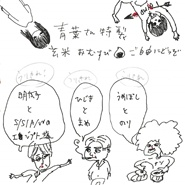

ラヂヲ
============================

|  |  |
| :--: | :-- |
| [ ラヂヲ](https://emumo.xiami.com/album/1174655558) | **艺人**: [青叶市子](../index.md) **语种**: 日语 **唱片公司**: commmons **发行时间**: 2013年08月07日 **专辑类别**: 录音室专辑 **专辑风格**:  **播放数**: 350258 **收藏数**: 320 **评论数**: 17  |

## 简介

2013年元日にOAされたNHK-FM「坂本龍一ニューイヤー・スペシャル」のスタジオ・セッションをCD化。  
細野晴臣、坂本龍一、小山田圭吾、U-zhaan、青葉市子による一発録りの音源を再ミックスして収録。  

## 曲目

## 评论

|  |  |  |
| :-- | :-- | :-- |
|  [虾米用户](https://emumo.xiami.com/u/346492287) 虾米不要离开我！ 2020-07-18 00:00 赞(0) 踩(0) | 

 |
|  [虾米用户](https://emumo.xiami.com/u/39695168)   2019-03-29 22:28 赞(2) 踩(0) | 
音乐真好，不擅长也不会太遗憾
 |
|  [虾米用户](https://emumo.xiami.com/u/5526289) 开心小甜豆 2017-11-02 11:27 赞(0) 踩(0) | 
:)
 |
|  [虾米用户](https://emumo.xiami.com/u/30800139) 我在低俗与高雅间活的很尴... 2017-04-06 02:58 赞(0) 踩(0) | 
。
 |
|  [虾米用户](https://emumo.xiami.com/u/8550781) 音樂 = 精神糧食 2014-04-26 22:39 赞(1) 踩(0) | 
第二首Mars 2027不對！不是青葉市子
 |
|  [虾米用户](https://emumo.xiami.com/u/12832061) 行善沒有條件 2014-03-25 12:24 赞(0) 踩(0) | 
真有意思
 |
|  [虾米用户](https://emumo.xiami.com/u/1182761) 松任谷由实的迷弟 2013-12-31 01:57 赞(2) 踩(0) | 
竟然意想不到的 不错。
 |
|  [虾米用户](https://emumo.xiami.com/u/18799998)  2013-09-08 10:56 赞(1) 踩(0) | 
good
 |
|  [虾米用户](https://emumo.xiami.com/u/6538665) Die Mensch-M... 2013-08-25 17:38 赞(1) 踩(0) | 
好可爱
 |
|  [虾米用户](https://emumo.xiami.com/u/2666684)  2013-08-09 23:51 赞(1) 踩(0) | 
呦西！半夜好康！
 |
|  [虾米用户](https://emumo.xiami.com/u/5167836) 成长的人。品着别样的音乐 2013-08-09 23:00 赞(0) 踩(0) | 
声音很美~  赞~
 |
|  [虾米用户](https://emumo.xiami.com/u/4172210)  2013-08-09 11:24 赞(1) 踩(0) | 
阿呀~ 最後一首歌smile沒傳好只有43秒!!!!!!!!!!!!
 |
| ⇒ |  [虾米用户](https://emumo.xiami.com/u/158444) 再见 2013-08-09 13:24 赞(0) 踩(0) | 
我这里OK呀
 |
| ⇒ |  [虾米用户](https://emumo.xiami.com/u/4172210)  2013-08-09 14:15 赞(0) 踩(0) | 
<q><b>花糖说：</b></q>
 |
| ⇒ |  [虾米用户](https://emumo.xiami.com/u/1001127)  2013-08-09 16:30 赞(0) 踩(0) | 
<q><b>ian说：</b></q>
 |
|  [虾米用户](https://emumo.xiami.com/u/4828269) 还在 2013-08-09 11:06 赞(0) 踩(0) | 
赞啊....
 |
|  [虾米用户](https://emumo.xiami.com/u/4172210)  2013-08-09 10:33 赞(0) 踩(0) | 
感謝發布&amp;lt;3
 |
