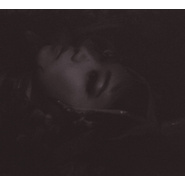

マホロボシヤ
============================

|  |  |
| :--: | :-- |
| [ マホロボシヤ](https://emumo.xiami.com/album/2100384957) | **艺人**: [青叶市子](../index.md) **语种**: 日语 **唱片公司**: Speedstar Records **发行时间**: 2016年10月19日 **专辑类别**: 录音室专辑 **专辑风格**:  **播放数**: 43317 **收藏数**: 217 **评论数**: 24  |

## 简介

2013年発売の前作「0」から3年振り、“まほろばのある星"という意味が込められた通算5枚目、 全11曲入りのオリジナルアルバム。  
  
  
&lt;青葉市子 コメント&gt;  
前作から、3年が経ちました。  
いろいろなことが変化して、でも、どうしたって変わらない部分もありました。  
遠くなったり近くなったりするだけで、離れることがない、この世界のあれやこれやが、  
ある部分ではとても仲良く、一緒にいられるように、マホロボシヤを作りました。  
  
  
全国各地でのライブや様々なアーティストとのセッション、「マームとジプシー」をはじめとする舞台への出演なども話題となり、  
過去作品がロングセールスを続ける青葉市子の3年振りとなる新作。  
  
彼女に魅了された坂本龍一、細野晴臣、小山田圭吾、U-zhaanを迎えたセッションアルバム「ラヂヲ/青葉市子と妖精たち」のリリースや、  
よしもとばなな が小説『鳥たち』冒頭に歌詞を引用するなど、数々のミュージシャン、アーティストをも虜にしてきた青葉市子。  
多くのリスナーが待ち望んだオリジナル作品!   
  
アコースティックギターでの弾き語りで各地の人々を魅了してきたライブも継続中! 「0」のリリース時は全国47都道府県弾き語りツアーを敢行。  
今年9月には、70年代からニューヨークで活動、現在はリオ・デ・ジャネイロを拠点とし、今なおワン&amp;オンリーな存在を示す異才ギタリスト、  
アート・リンゼイとのツアーを開催。今夏ライブを行う台湾、韓国をはじめ、香港、タイなどへも活動の場を広げている。  
  
前作の「いきのこり●ぼくら」のミュージックビデオはYouTubeでも話題となりSPACE SHOWER TVのMVAを受賞するなど高い評価を獲得。  
また、『ミュージック・マガジン』誌の年末恒例ベスト・アルバム特集でデヴィッド・ボウイ、ポール・マッカートニー、ダフト・パンクと並び  
表紙に登場、テレビ出演(フジテレビ「魁! 音楽番付」)で披露した2回のパフォーマンスも話題に。

## 曲目

## 评论

|  |  |  |  |
| :-- | :-- | :-- | :-- |
|  [虾米用户](https://emumo.xiami.com/u/3863771) Spotify: iob... 2020-06-12 17:16 赞(0) 踩(0) | 
喜欢
 |
|  [虾米用户](https://emumo.xiami.com/u/303127133)   2018-09-01 13:37 赞(0) 踩(0) | 

 |
|  [虾米用户](https://emumo.xiami.com/u/5526289) 开心小甜豆 2017-11-02 11:20 赞(0) 踩(0) | 
:）
 |
|  [虾米用户](https://emumo.xiami.com/u/8226204) ≡ 2017-05-20 13:48 赞(1) 踩(0) | 
这张是躺在青菜叶子里吗
 |
|  [虾米用户](https://emumo.xiami.com/u/30800139) 我在低俗与高雅间活的很尴... 2017-04-06 02:10 赞(0) 踩(0) | 
。
 |
|  [虾米用户](https://emumo.xiami.com/u/15270473) 听到喜欢的歌 身体不跟着... 2017-03-29 00:49 赞(0) 踩(0) | 
-
 |
|  [虾米用户](https://emumo.xiami.com/u/113533432) 再见啦 2017-01-11 17:41 赞(0) 踩(0) | 
小清新封面怎么不见了！
 |
|  [虾米用户](https://emumo.xiami.com/u/13072498) 社会最底层 2016-11-18 18:34 赞(2) 踩(0) | 
这张真的很适合当作业BGM…
 |
|  [虾米用户](https://emumo.xiami.com/u/7492447) 「間 2016-11-10 17:15 赞(0) 踩(0) | 

 |
|  [虾米用户](https://emumo.xiami.com/u/30900092)  2016-10-25 15:16 赞(0) 踩(0) | 
女神专辑一向高质量，好听哭了~~~~(&amp;gt;_&amp;lt;)~~~~
 |
|  [虾米用户](https://emumo.xiami.com/u/30900092)  2016-10-25 15:13 赞(0) 踩(0) | 
女神竟然出新专了!!
 |
|  [虾米用户](https://emumo.xiami.com/u/801081) 暂无签名~ 2016-10-20 22:08 赞(0) 踩(0) | 
好听到我想哭~
 |
|  [虾米用户](https://emumo.xiami.com/u/73825974)  2016-10-20 21:10 赞(0) 踩(0) | 
迎新ww
 |
|  [虾米用户](https://emumo.xiami.com/u/12876004) ` 2016-10-19 20:33 赞(0) 踩(0) | 
= =
 |
|  [虾米用户](https://emumo.xiami.com/u/572626) 不能让好的被埋没，也不能... 2016-10-19 18:17 赞(1) 踩(0) | 
嘟嘟
 |
| ⇒ |  [虾米用户](https://emumo.xiami.com/u/1182761) 松任谷由实的迷弟 2016-10-19 20:35 赞(0) 踩(0) | 

 |
|  [虾米用户](https://emumo.xiami.com/u/18580097)   2016-10-19 12:42 赞(0) 踩(0) | 
女神新专辑从天而降
 |
|  [虾米用户](https://emumo.xiami.com/u/40727682) 后会有期 2016-10-19 12:08 赞(0) 踩(0) | 

 |
|  [虾米用户](https://emumo.xiami.com/u/33512641) call me now,... 2016-10-19 10:15 赞(1) 踩(0) | 
黑胶已拿
 |
|  [虾米用户](https://emumo.xiami.com/u/3719960)  2016-10-19 09:46 赞(0) 踩(0) | 
Ծ‸Ծ
 |
|  [虾米用户](https://emumo.xiami.com/u/8858880)  公開処刑 ／ リリー・... 2016-10-19 09:43 赞(0) 踩(0) | 
Ç
 |
|  [虾米用户](https://emumo.xiami.com/u/39674727) 特技是挖掘冷门乐队 2016-10-19 09:38 赞(1) 踩(0) | 
w
 |
|  [虾米用户](https://emumo.xiami.com/u/8559958) Paralyzed 2016-10-18 22:26 赞(1) 踩(0) | 
居然出新专！！
 |
|  [虾米用户](https://emumo.xiami.com/u/34920505) . 2016-09-21 17:13 赞(0) 踩(0) | 
+
 |
