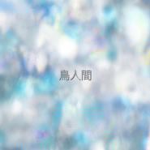

鳥人間
============================

|  |  |
| :--: | :-- |
| [ 鳥人間](https://emumo.xiami.com/album/5020907346) | **艺人**: [青叶市子](../index.md) **语种**: 日语 **唱片公司**: Self-Released **发行时间**: 2019年10月04日 **专辑类别**: EP, 单曲 **专辑风格**: 根源唱作人 Singer-Songwriter, 独立流行 Indie Pop **播放数**: 162 **收藏数**: 1 **评论数**: 1  |

## 简介

"鳥人間" is a part of a longer song "mew gull" from upcoming album by Albert Karch featuring singer Ichiko Aoba   
  
full album coming the 8th of November, 2019   
  
Albert Karch - piano, music   
Ichiko Aoba - voice, lyrics

## 曲目

## 评论

|  |  |  |
| :-- | :-- | :-- |
|  [虾米用户](https://emumo.xiami.com/u/8226204) ≡ 2020-06-19 15:31 赞(0) 踩(0) | 
➕
 |
