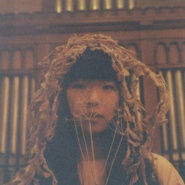
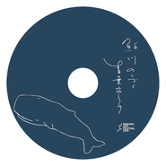
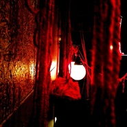
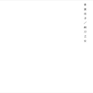

青叶市子
============================

|  |  |
| :--: | :-- |
| [ 青叶市子](https://i.xiami.com/aoba_ichiko) | **播放数**: 2570143 **粉丝数**: 5878 **评论数**: 200 **地区**: Japan 日本 **风格**: 民谣 Folk, 独立民谣 Indie Folk  |

## 档案

青叶市子 / AOBA ICHIKO 音乐家  出生于1990年，17岁开始弹奏古典吉他，2010年以第一张专辑『剃刀少女』出道。至今已发表了5张正式专辑。 2015年秋天，进行了包含新加坡、马来西亚、泰国等5个国家的亚洲巡回演唱会， 2016年夏季与台湾艺人SKIP SKIP BEN BEN一起进行了台北、高雄、韩国、日本的东亚巡回演出。此外还进行着舞台演出及配乐、音乐剧作品作词、电视广告配乐，配音等广泛的活动。  个人网站：www.ichikoaoba.com  【CM（电视广告）】 NTT DoCoMo「イエ・ラブ・ゾク」主题曲（作词・作曲・演唱・演奏） 丘比 キユーピーハーフ「蛋黄酱」篇（作曲・演唱・演奏） AC日本　みんなで考えてみませんか。これからも。（演唱） UNIQLO サラファイン「AIRism 菅井円加 」篇（演唱・演奏） 三得利 トリスハニー web cm「Honey Moment」（作曲・演唱・演奏） SoftBank、无印良品、Norton等其他  【声优】 2014 プラネタリウム『星の王子さま』（角色：小王子）  【舞台】 2015 『レミング～世界の涯まで連れてって～』（出演） 2015 『cocoon』（出演） 2014 『小指の思い出』（剧伴・演奏） 2014 『9days Queen～九日間の女王～』（饰演“黑鸟”・演唱・演奏）  【映画・动画片・电视】 2016 动画×记录片ー映画「マンガをはみだした男〜赤塚不二夫」（旁白解说） 2014 富士电视台“ノイタミナ”动画片『残響のテロル』片尾曲 Aimer「誰か、海を。」（作詞） 2013 『攻殻機動隊ARISE border:2Ghost Whispers』片尾曲・主题曲 青葉市子・コーネリアス「外は戦場だよ」（演唱） 2010 朝日电视台 世界の車窓から 奥地利篇「待ち人」「失われたもの」（演唱） 2009 NHK BS-2 太宰治短編小説集「雪の夜の話」（演唱）  【其他】 铁三角「SHORT SHORT SHORT」by ウィスット・ポンニミット vol.60 SAVING LOVE（歌曲制作・演唱・演奏） vol.59 AGAIN（歌曲制作・演唱・演奏） vol.52 MEETING POINT（歌曲制作・演唱・演奏）   プロファイル   名    前 青葉 市子（あおば いちこ）   誕 生 日 1990年1月28日   出 身 地 千葉県浦安市   職    業 シンガーソングライター        レーベル 東雲録音SPEEDSTAR RECORDS (2013年-) commmons (2013年-)   アーテイスト紹介   青葉 市子（あおば いちこ、1990年1月28日 - ）は、日本の女性音楽家・シンガーソングライター。京都府出身（出生は千葉県浦安市）。SPEEDSTAR RECORDS所属。   シンガー・ソングライターになろうと思ったことも、自身がシンガー・ソングライターだと意識したことも一度もなく、歌が自然にでき、それが楽しいからやっているだけで、ごはんを食べる、寝るといったことと同じ感覚で、何かを表現しようと思ってやっているわけではないと語る。   経歴   中学時代は吹奏楽部でクラリネットを担当、高校では軽音楽部に所属し、そこではキーボード、ギター、ドラム、ベースと、曲ごとに空いている楽器をいろいろやったが、すべて自己流でコードは今でもわからない。バンドでは、東京事変やアジアン・カンフー・ジェネレーションなどを耳で聴いてコピーしていたが、エレキ・ギターは性には合わなかった。   ある日、自宅に転がっていたガット・ギターを爪弾いてみたらたちまちとりこになり、17歳からクラシックギターを始める。一応教則本は買ったものの結局ほとんど使わず、基本的な指使いもすべて自己流で、遊んでいたら現在のような演奏スタイルになった。   地元京都の大学の文学部に進学し、日本語教師の資格を取れるコースを専攻していたが、19歳の終わりに中退して上京。その後間もない2010年1月に、『剃刀乙女』でデビューを果たす。   2014年   3月23日の福井・三國湊座での公演から全国47都道府県を回るツアー「青葉市子 アワぶくツアー . 。○ o ◯ 2014」をスタート。   4月、26日に台湾公演を、27日に香港公演を実施。   9月3日リリースのAimerのミニアルバム『誰か、海を。 EP』収録の表題曲「誰か、海を。」に歌詞を提供。   10月、GEZANのマヒトゥ・ザ・ピーポーと新ユニット・NUUAMM（ぬうあむ）を結成。   2015年   11月、台湾・香港・シンガポール・マレーシア・タイの５カ国を廻る自身初のアジアツアーを開催。

## 专辑

| 名称 | 语种 | 唱片公司 | 发行时间 | 专辑类别 | 专辑风格 |
| :--: | :-- | :-- | :-- | :-- | :-- |
| [ アダンの風](./albums/5022045690.md) | 日语 | hermine | 2020年12月02日 | 录音室专辑 | 根源唱作人 Singer-Songwriter, 氛围流行 Ambient Pop, 室内民谣 Chamber Folk |
| [ Porcelain](./albums/5021798480.md) | 日语 | hermine | 2020年10月30日 | EP, 单曲 | 根源唱作人 Singer-Songwriter, 独立民谣 Indie Folk, 室内民谣 Chamber Folk |
| [ 海底のエデン](./albums/5021543640.md) | 日语 | hermine | 2020年09月02日 | EP, 单曲 |  |
| [ "gift" BGM](./albums/5021545106.md) | 纯音乐 | hermine | 2020年07月22日 | EP, 单曲 |  |
| [ Giftat Sogetsu Hall](./albums/2103041086.md) | 日语 | Self-Released, Montaña de Basura Producciones | 2020年01月11日 | 现场专辑 | 根源唱作人 Singer-Songwriter, 独立民谣 Indie Folk |
| [ amuletum bouquet](./albums/2105723048.md) | 日语 | hermine | 2020年01月10日 | EP, 单曲 |  |
| [ あまねきAmaneki](./albums/5020925567.md) | 日语 | Arte Sonata | 2019年12月13日 | EP, 单曲 | 独立流行 Indie Pop, 童稚流行 Twee Pop |
| [ とうめい](./albums/5020905903.md) | 日语 | KOLD Record | 2019年10月25日 | EP, 单曲 | 根源唱作人 Singer-Songwriter, 氛围流行 Ambient Pop, 独立民谣 Indie Folk |
| [ 鳥人間](./albums/5020907346.md) | 日语 | Self-Released | 2019年10月04日 | EP, 单曲 | 根源唱作人 Singer-Songwriter, 独立流行 Indie Pop |
| [ 鮎川のしづく](./albums/5021538618.md) | 日语 | Self-Released | 2019年09月15日 | 录音室专辑 |  |
| [ qp](./albums/2103951143.md) | 日语 | Victor Entertainment | 2018年10月24日 | 录音室专辑 | 民谣 Folk, 独立民谣 Indie Folk |
| [ からかひ](./albums/2103981716.md) | 日语 | Self-Released | 2018年08月13日 | EP, 单曲 | 独立流行 Indie Pop, 独立电子乐 Indietronica, 童稚流行 Twee Pop, 都市流行 City Pop |
| [ マホロボシヤ](./albums/2100384957.md) | 日语 | Speedstar Records | 2016年10月19日 | 录音室专辑 |  |
| [ 0%](./albums/691750678.md) | 日语 | Speedstar Records | 2014年01月29日 | 现场专辑 |  |
| [ 0](./albums/179043381.md) | 日语 | Victor Entertainment | 2013年10月23日 | 录音室专辑 | 独立民谣 Indie Folk, 都市流行 City Pop |
| [ ラヂヲ](./albums/1174655558.md) | 日语 | commmons | 2013年08月07日 | 录音室专辑 |  |
| [ 流星](./albums/2102812264.md) | 日语 | Kitchen.Label | 2012年07月07日 | EP, 单曲 |  |
| [ うたびこ](./albums/489452.md) | 日语 | 東雲録音 | 2012年01月25日 | 录音室专辑 | 独立民谣 Indie Folk |
| [ 檻髪](./albums/421490.md) | 日语 | 東雲録音 | 2011年01月19日 | 录音室专辑 | 根源唱作人 Singer-Songwriter, 独立流行 Indie Pop, 独立民谣 Indie Folk, 都市流行 City Pop |
| [ 剃刀乙女](./albums/368623.md) | 日语 | 東雲録音 | 2010年01月20日 | 录音室专辑 | 根源唱作人 Singer-Songwriter, 独立流行 Indie Pop, 都市流行 City Pop |

## 评论

|  |  |  |  |
| :-- | :-- | :-- | :-- |
|  [虾米用户](https://emumo.xiami.com/u/9062060) 此生没拿一个亿来爱虾米是... 2021-01-25 20:51 赞(0) 踩(0) | 

 |
|  [虾米用户](https://emumo.xiami.com/u/410175639)  2020-12-21 14:36 赞(0) 踩(0) | 
虾米厉害了，居然有外国音乐人入驻，声音好听，适合安静的心情 
 |
|  [虾米用户](https://emumo.xiami.com/u/933157) 泥豪啊同志！ 2020-12-17 02:02 赞(0) 踩(0) | 
已
 |
|  [虾米用户](https://emumo.xiami.com/u/6066908) 光芒与希望 *JazzH... 2020-11-03 18:53 赞(0) 踩(0) | 
安静空灵的音乐，非常别具一格
 |
|  [虾米用户](https://emumo.xiami.com/u/276944698) 不要自我设限..... 2020-07-27 18:50 赞(0) 踩(0) | 
⭐️⭐️⭐️
 |
|  [虾米用户](https://emumo.xiami.com/u/706664)   2020-07-16 20:38 赞(1) 踩(0) | 
好好听啊
 |
|  [虾米用户](https://emumo.xiami.com/u/110088060) 作为报答、我吔给泥放点、... 2020-07-02 21:02 赞(0) 踩(0) | 
好好舒服
 |
|  [虾米用户](https://emumo.xiami.com/u/288013826) 请大家一起养小虾米帮助听... 2020-06-22 19:33 赞(0) 踩(0) | 
：
 |
|  [虾米用户](https://emumo.xiami.com/u/225730375) 我爱你. zl 2020-06-22 13:26 赞(0) 踩(0) | 
原来你来过
 |
|  [虾米用户](https://emumo.xiami.com/u/317204786) diru/sukekiy... 2020-06-12 12:10 赞(0) 踩(0) | 
这才是我心中的民谣，自然质谱，没有多余的做作的情感。
 |
|  [虾米用户](https://emumo.xiami.com/u/354017434) 我们生来就是孤独。 2020-05-25 22:52 赞(0) 踩(0) | 
她的歌声为什么这么美好
 |
|  [虾米用户](https://emumo.xiami.com/u/354017434) 我们生来就是孤独。 2020-04-24 12:54 赞(0) 踩(0) | 
真的好喜欢她不说别的，市子小姐就是我最喜欢的样子啊，弹上一手清澈的吉他，歌声与吉他声音意境悠然，嘴里哼哼几句自己写的小词，想快就快想慢就慢，节奏超级可爱啊，歌词很文艺，不知道怎么一听到市子小姐的歌脑海里就浮现出绿子一边喝酒一边看火灾，用不羁的样子说出着深深的话，漫不经心却真诚。怎么说，真的像一只春天在草地打滚的熊，太棒啦若是能这样将自己的态度用歌声琴声轻轻表达出来，是我能想到最幸福的事了市子小姐就是我最最最羡慕的那种人啊
 |
|  [虾米用户](https://emumo.xiami.com/u/442149251)  2020-04-12 13:10 赞(0) 踩(0) | 
第一次听见如此干净的声音
 |
|  [虾米用户](https://emumo.xiami.com/u/343770625)  2020-04-12 05:58 赞(0) 踩(0) | 
收藏了，喜欢
 |
|  [虾米用户](https://emumo.xiami.com/u/405009343) 我还没想好要写什么... 2020-04-08 16:03 赞(0) 踩(0) | 

 |
|  [虾米用户](https://emumo.xiami.com/u/356763773) 我还没想好要写什么... 2020-03-15 00:27 赞(0) 踩(0) | 
~
 |
|  [虾米用户](https://emumo.xiami.com/u/346492287) 虾米不要离开我！ 2020-02-13 02:09 赞(0) 踩(0) | 
补
 |
|  [虾米用户](https://emumo.xiami.com/u/342736722) 我还没想好要写什么... 2020-01-30 22:44 赞(0) 踩(0) | 
宝藏叶子青＜コ:彡
 |
|  [虾米用户](https://emumo.xiami.com/u/49655313) 除了再见还可以说些什么呢 2019-10-26 02:17 赞(0) 踩(0) | 
给残响写过歌！
 |
|  [虾米用户](https://emumo.xiami.com/u/952) Bad taste, b... 2019-09-07 22:04 赞(0) 踩(0) | 
頑張れ
 |
|  [虾米用户](https://emumo.xiami.com/u/201391232) 最快的方法是先抱抱 2019-08-20 01:24 赞(0) 踩(0) | 
彡
 |
|  [虾米用户](https://emumo.xiami.com/u/42963872) 我还没想好要写什么... 2019-07-15 05:29 赞(0) 踩(0) | 
.
 |
|  [虾米用户](https://emumo.xiami.com/u/405991670) 我还没想好要写什么... 2019-06-17 11:43 赞(0) 踩(0) | 
每一首都好聽
 |
|  [虾米用户](https://emumo.xiami.com/u/376704066)  2019-03-23 23:42 赞(2) 踩(0) | 
听着她的歌，感觉世界就剩我一个人，却不再孤单寂寞了，一切归于平静
 |
|  [虾米用户](https://emumo.xiami.com/u/239803923) 多听听 多看看 我的最爱... 2019-03-19 21:25 赞(0) 踩(0) | 
静静
 |
|  [虾米用户](https://emumo.xiami.com/u/346165752)  2019-03-07 14:25 赞(0) 踩(0) | 

 |
|  [虾米用户](https://emumo.xiami.com/u/52415194) ♬♩♫♪♡ 2018-12-31 05:43 赞(0) 踩(0) | 
～
 |
|  [虾米用户](https://emumo.xiami.com/u/347954013) my own priva... 2018-12-10 20:25 赞(0) 踩(0) | 
青葉市子
 |
|  [虾米用户](https://emumo.xiami.com/u/13740776)   2018-11-23 16:23 赞(1) 踩(0) | 
声音好听鸭
 |
|  [虾米用户](https://emumo.xiami.com/u/6138781)  2018-10-09 23:38 赞(1) 踩(0) | 
歌と炎什么时候能出呢？很喜欢
 |
|  [虾米用户](https://emumo.xiami.com/u/9028760) 豆瓣见 spotify ... 2018-10-05 13:46 赞(1) 踩(0) | 
（&amp;acute;-`）.｡oO
 |
| ⇒ |  [虾米用户](https://emumo.xiami.com/u/405858695) 快乐听歌 2019-01-27 21:49 赞(0) 踩(0) | 
萌
 |
|  [虾米用户](https://emumo.xiami.com/u/293923210) 我也还没想好要写什么..... 2018-07-31 16:36 赞(2) 踩(0) | 
市子小姐什么时候再来一次中国呀 
 |
|  [虾米用户](https://emumo.xiami.com/u/16745497) 我还没想好要写什么... 2018-05-12 06:16 赞(1) 踩(0) | 
虾米太懂我啦！一天给我推荐好听的不得了的歌儿。
 |
|  [虾米用户](https://emumo.xiami.com/u/8808132)  2018-05-06 16:11 赞(3) 踩(0) | 
今年还会来国内么，期待
 |
|  [虾米用户](https://emumo.xiami.com/u/71178106) 塵世や 酒、風呂を抜け ... 2018-03-31 23:22 赞(2) 踩(0) | 
♡
 |
|  [虾米用户](https://emumo.xiami.com/u/293923210) 我也还没想好要写什么..... 2018-03-26 23:24 赞(0) 踩(0) | 
哎呀 听过那么多歌之后还是很喜欢听她唱歌❤
 |
|  [虾米用户](https://emumo.xiami.com/u/25486268)  2018-03-22 12:37 赞(0) 踩(0) | 
青菜柿子&amp;hellip;好听
 |
|  [虾米用户](https://emumo.xiami.com/u/49720239)  2018-02-12 20:47 赞(0) 踩(0) | 
希望今年能来中国
 |
|  [虾米用户](https://emumo.xiami.com/u/285049473) 剛拿起酒杯想和你碰杯 才... 2018-01-27 22:37 赞(0) 踩(0) | 

 |
|  [虾米用户](https://emumo.xiami.com/u/106080) 玻丽丽一路向北 2018-01-12 15:56 赞(1) 踩(0) | 
啊呀错过去年的了，今年还会来中国嘛，最好是杭州 好喜欢这个声音旋律
 |
|  [虾米用户](https://emumo.xiami.com/u/35870248) 我还没想好要写什么... 2017-12-27 14:13 赞(0) 踩(0) | 
聽著舒服
 |
|  [虾米用户](https://emumo.xiami.com/u/335187190)  2017-11-15 13:50 赞(0) 踩(0) | 
:)
 |
|  [虾米用户](https://emumo.xiami.com/u/5526289) 开心小甜豆 2017-11-02 11:19 赞(2) 踩(0) | 
:)
 |
|  [虾米用户](https://emumo.xiami.com/u/8168308) 暂无签名~ 2017-10-29 00:21 赞(0) 踩(0) | 
青葉酱啥时来上海
 |
|  [虾米用户](https://emumo.xiami.com/u/35950498) 来地球旅游 2017-10-11 19:10 赞(1) 踩(0) | 
好喜欢 国内都没她专辑卖。。
 |
|  [虾米用户](https://emumo.xiami.com/u/10028400) 我还没想好要写什么... 2017-09-11 08:41 赞(0) 踩(0) | 

 |
|  [虾米用户](https://emumo.xiami.com/u/45686435) 一壺飛鳧 尋山夢鶴   ... 2017-09-05 13:49 赞(0) 踩(0) | 
歌曲给人很平静的感觉 
 |
|  [虾米用户](https://emumo.xiami.com/u/2493237) Star never l... 2017-08-22 00:24 赞(0) 踩(0) | 

 |
|  [虾米用户](https://emumo.xiami.com/u/134697)  2017-08-14 06:42 赞(0) 踩(0) | 
名字曾讓我笑好久
 |
|  [虾米用户](https://emumo.xiami.com/u/52838962)  2017-07-02 19:01 赞(0) 踩(0) | 

 |
|  [虾米用户](https://emumo.xiami.com/u/11180438) 虾米的会员到底能干嘛。。... 2017-06-21 19:41 赞(0) 踩(0) | 
！！！！入驻了！！
 |
|  [虾米用户](https://emumo.xiami.com/u/5077889) 最近、水曜日のカンパネラ... 2017-05-24 01:36 赞(1) 踩(0) | 
声が綺麗だね，応援します。 
 |
|  [虾米用户](https://emumo.xiami.com/u/52132711) 我还没想好要写什么... 2017-04-26 19:32 赞(0) 踩(0) | 
喜欢
 |
|  [虾米用户](https://emumo.xiami.com/u/282171382) じゃね 2017-04-24 23:17 赞(0) 踩(0) | 
歌手封面的照片好喜欢 谁能给我个原图。
 |
| ⇒ |  [虾米用户](https://emumo.xiami.com/u/36057872) 网易/BC: Breat... 2017-05-10 19:11 赞(0) 踩(0) | 
自己在网页端用审查功能提取
 |
|  [虾米用户](https://emumo.xiami.com/u/97747450) 我还没想好要写什么... 2017-04-17 23:46 赞(0) 踩(0) | 
9482
 |
|  [虾米用户](https://emumo.xiami.com/u/78168274)   2017-04-15 00:39 赞(2) 踩(0) | 
刚听完广州场，场地原因感觉有点嘈杂，不过还是可以的
 |
|  [虾米用户](https://emumo.xiami.com/u/3815293) baby Jesus s... 2017-04-14 02:20 赞(4) 踩(0) | 
太棒了，比程璧强十个数量级
 |
| ⇒ |  [虾米用户](https://emumo.xiami.com/u/106080) 玻丽丽一路向北 2018-01-12 15:57 赞(0) 踩(0) | 
我也这么觉得
 |
|  [虾米用户](https://emumo.xiami.com/u/49959840) 无聊人 2017-04-14 00:28 赞(0) 踩(0) | 
☁️
 |
|  [虾米用户](https://emumo.xiami.com/u/8559958) Paralyzed 2017-04-13 08:00 赞(1) 踩(0) | 
她要开live了！
 |
|  [虾米用户](https://emumo.xiami.com/u/2750191) 不怎么令人难过 2017-04-10 17:40 赞(0) 踩(0) | 
头像换了.....喜欢原来的头像...
 |
|  [虾米用户](https://emumo.xiami.com/u/201461725) 一生温暖纯良，不舍爱与自... 2017-04-09 10:41 赞(0) 踩(0) | 
很安静
 |
|  [虾米用户](https://emumo.xiami.com/u/12865563) “万物如诗” 2017-04-09 07:34 赞(3) 踩(0) | 
最喜欢的歌手 从最开始的无人知晓 到现在发现有人在喊她女神 甚至来了中国第一次巡演   真的很开心
 |
|  [虾米用户](https://emumo.xiami.com/u/4908796)   2017-04-09 00:23 赞(0) 踩(0) | 
北京场好像不让个人参加？
 |
|  [虾米用户](https://emumo.xiami.com/u/3449737) ww 2017-04-08 20:07 赞(0) 踩(0) | 
上海站取消了：（
 |
| ⇒ |  [虾米用户](https://emumo.xiami.com/u/669738) 是我啊 2017-04-08 22:13 赞(0) 踩(0) | 
T T
 |
|  [虾米用户](https://emumo.xiami.com/u/38724138) 动物凶猛 2017-04-07 07:55 赞(0) 踩(0) | 
嗯
 |
|  [虾米用户](https://emumo.xiami.com/u/1245622) 还是觉得虾米的界面是最好... 2017-04-06 20:15 赞(0) 踩(0) | 
上海 约起来
 |
|  [虾米用户](https://emumo.xiami.com/u/75991724) Hogwarts wil... 2017-04-06 16:59 赞(1) 踩(0) | 
可以在哪里买票&amp;ang;( ᐛ 」&amp;ang;)＿
 |
|  [虾米用户](https://emumo.xiami.com/u/4195148) 热爱生活的普通人 2017-04-06 16:08 赞(0) 踩(0) | 
:( 又是北上广
 |
|  [虾米用户](https://emumo.xiami.com/u/284548865)  2017-04-06 13:06 赞(86) 踩(0) | 
我刚入驻了虾米音乐人，欢迎大家来我的个人主页，收听我的最新音乐
 |
| ⇒ |  [虾米用户](https://emumo.xiami.com/u/433939791) 我还没想好要写什么... 2020-04-01 23:00 赞(0) 踩(0) | 
哈！
 |
|  [虾米用户](https://emumo.xiami.com/u/10584399) I don’t  2017-04-05 05:31 赞(0) 踩(0) | 
现在才知道她们的好。
 |
|  [虾米用户](https://emumo.xiami.com/u/614163)  2017-04-02 22:46 赞(12) 踩(0) | 
四月份来中国巡演！！随时的奇迹 青叶市子2017首次中国巡演4月13日 北京发布会/乐空间 4月14日 广州/TU凸空间 4月15日 杭州/MAO 4月16日 上海/万代南梦宫
 |
|  [虾米用户](https://emumo.xiami.com/u/16135450)  2017-04-02 00:17 赞(0) 踩(0) | 
9357
 |
|  [虾米用户](https://emumo.xiami.com/u/262255929)  2017-03-31 22:28 赞(0) 踩(0) | 
通灵、舒服
 |
|  [虾米用户](https://emumo.xiami.com/u/2523233) 太热 2017-03-29 13:46 赞(4) 踩(0) | 
青葉市子首次来国内巡演， 4月13日 北京（无演出，发布会，免费唱五首歌）4月14日 广州，4月15日 杭州，4月16日 上海。
 |
| ⇒ |  [虾米用户](https://emumo.xiami.com/u/10150041) JoyDivision 2017-04-06 15:03 赞(0) 踩(0) | 
噫 北京站不用买票吗
 |
|  [虾米用户](https://emumo.xiami.com/u/37142358) crap of the ... 2017-03-05 11:15 赞(0) 踩(0) | 
简单 好听
 |
|  [虾米用户](https://emumo.xiami.com/u/8168308) 暂无签名~ 2017-03-04 15:10 赞(1) 踩(0) | 
东京的行政单位作为府的时候，还是在明治时期。。。
 |
|  [虾米用户](https://emumo.xiami.com/u/9597157) ， 2017-02-24 23:44 赞(0) 踩(0) | 
像羊毛与花
 |
|  [虾米用户](https://emumo.xiami.com/u/52506830) 再见 2017-01-22 10:32 赞(0) 踩(0) | 
≈
 |
|  [虾米用户](https://emumo.xiami.com/u/123743620) 顾好自己再说其它的。 2016-12-24 23:55 赞(0) 踩(0) | 
吓一跳，封面垂着头披着发，跟女鬼似的，大爷的
 |
|  [虾米用户](https://emumo.xiami.com/u/12710218)  2016-11-24 04:55 赞(1) 踩(0) | 
太棒了这妹子
 |
|  [虾米用户](https://emumo.xiami.com/u/307883)   2016-10-28 02:28 赞(0) 踩(0) | 
m
 |
|  [虾米用户](https://emumo.xiami.com/u/43694690) - 2016-10-22 16:12 赞(0) 踩(0) | 
喜欢
 |
|  [虾米用户](https://emumo.xiami.com/u/16255463) @Revolution9... 2016-10-16 09:27 赞(0) 踩(0) | 
Peace
 |
|  [虾米用户](https://emumo.xiami.com/u/40727682) 后会有期 2016-08-15 11:46 赞(0) 踩(0) | 

 |
|  [虾米用户](https://emumo.xiami.com/u/12221090) 逍遥于天地而心意自得 2016-06-22 22:29 赞(0) 踩(0) | 

 |
|  [虾米用户](https://emumo.xiami.com/u/58480388) 見失ってしまわないよう 2016-05-11 00:25 赞(0) 踩(0) | 
Hhhhhhhh评论好逗
 |
|  [虾米用户](https://emumo.xiami.com/u/20296131) 音乐把我从深渊拉起，给了... 2016-04-27 20:52 赞(0) 踩(0) | 
mark
 |
|  [虾米用户](https://emumo.xiami.com/u/6013785) go on 2016-04-13 15:13 赞(0) 踩(0) | 
ye
 |
|  [虾米用户](https://emumo.xiami.com/u/199703)   2016-04-04 10:03 赞(1) 踩(0) | 
哈哈哈哈原来不止我一个看成青菜叶子
 |
|  [虾米用户](https://emumo.xiami.com/u/127058630)   2016-03-26 22:52 赞(0) 踩(0) | 
安静
 |
|  [虾米用户](https://emumo.xiami.com/u/34226296)  2016-01-27 15:12 赞(1) 踩(0) | 
难得空灵还简单质朴的声音 自然 纯粹而让人流连忘返
 |
|  [虾米用户](https://emumo.xiami.com/u/12865563) “万物如诗” 2016-01-27 09:26 赞(1) 踩(0) | 
超喜欢啊啊啊啊啊啊
 |
|  [虾米用户](https://emumo.xiami.com/u/63213244) 小舟从此逝 沧海寄馀生 2016-01-22 19:16 赞(1) 踩(0) | 
好听哭
 |
|  [虾米用户](https://emumo.xiami.com/u/7137194)  2015-12-15 22:58 赞(0) 踩(0) | 
意外的发现。
 |
|  [虾米用户](https://emumo.xiami.com/u/32404494) 暂无签名~很多话 2015-12-11 11:17 赞(0) 踩(0) | 
   
 |
|  [虾米用户](https://emumo.xiami.com/u/2574272) 好好学习吧 2015-12-07 17:14 赞(0) 踩(0) | 
看成青菜巾子
 |
|  [虾米用户](https://emumo.xiami.com/u/10797596) Unapologetic... 2015-10-17 13:33 赞(2) 踩(0) | 
看成青菜柿子
 |
|  [虾米用户](https://emumo.xiami.com/u/9152998) 我还没想好要写什么... 2015-10-06 10:23 赞(1) 踩(0) | 
看成青叶柿子
 |
|  [虾米用户](https://emumo.xiami.com/u/3583995) 一個人的戰爭 2015-09-08 02:22 赞(0) 踩(0) | 

 |
|  [虾米用户](https://emumo.xiami.com/u/49932197) 聆听你的声音 2015-06-16 10:53 赞(0) 踩(0) | 
多好听的声音  
 |
|  [虾米用户](https://emumo.xiami.com/u/7770592) for everythi... 2015-05-07 21:24 赞(2) 踩(0) | 
很好听的青菜叶子
 |
|  [虾米用户](https://emumo.xiami.com/u/7129802) 本当の私、何処にいるかな 2015-05-04 02:59 赞(0) 踩(0) | 
喜欢这种风格的声音和专辑封面。fall in love～
 |
|  [虾米用户](https://emumo.xiami.com/u/36804545) 暂无签名~ 2015-05-03 17:22 赞(0) 踩(0) | 
夏天的风
 |
|  [虾米用户](https://emumo.xiami.com/u/38189173) 哦。 2015-04-02 14:56 赞(0) 踩(0) | 
ため息でも音楽になる人。
 |
|  [虾米用户](https://emumo.xiami.com/u/1638993) “因为是他，因为是我。” 2015-03-07 01:02 赞(0) 踩(0) | 
东京残响ed的作词。。……说好的小清新呢
 |
|  [虾米用户](https://emumo.xiami.com/u/11180438) 虾米的会员到底能干嘛。。... 2015-03-02 20:04 赞(22) 踩(0) | 
喂喂！青菜叶子和青菜柿子是什么鬼啦！
 |
|  [虾米用户](https://emumo.xiami.com/u/33600319)  2015-02-20 21:55 赞(0) 踩(0) | 
程璧的广播来的
 |
|  [虾米用户](https://emumo.xiami.com/u/8954198)  2015-02-17 11:31 赞(22) 踩(0) | 
教授大力推荐的年轻歌手。那种“平常”却自有其特别的民谣，好好倾听就是。
 |
| ⇒ |  [虾米用户](https://emumo.xiami.com/u/10052412) 暂无签名~ 2015-04-01 09:31 赞(0) 踩(0) | 
教授？坂本吗…
 |
|  [虾米用户](https://emumo.xiami.com/u/39968630) Harder,bette... 2015-02-16 12:38 赞(0) 踩(0) | 
治愈啊
 |
|  [虾米用户](https://emumo.xiami.com/u/44368575)   2015-02-13 04:05 赞(0) 踩(0) | 
。
 |
|  [虾米用户](https://emumo.xiami.com/u/2006623)  2015-02-03 08:36 赞(0) 踩(0) | 
归零
 |
|  [虾米用户](https://emumo.xiami.com/u/10052412) 暂无签名~ 2014-12-17 22:09 赞(0) 踩(0) | 
程璧姐姐的推荐。哎，听完莫名叹惋
 |
| ⇒ |  [虾米用户](https://emumo.xiami.com/u/34646776)  2014-12-17 22:25 赞(0) 踩(0) | 
我也是看了程璧的推荐找来的呢
 |
|  [虾米用户](https://emumo.xiami.com/u/19016927)  2014-11-29 22:23 赞(0) 踩(0) | 
（＊￣︶￣＊）
 |
|  [虾米用户](https://emumo.xiami.com/u/30814222) 环望周围，身边唯有音乐，... 2014-11-22 18:00 赞(0) 踩(0) | 
好宁静的歌，专辑的封面也是完全的纯色，很美，很静。。
 |
|  [虾米用户](https://emumo.xiami.com/u/13106000) 相似度为零 2014-11-08 17:01 赞(0) 踩(0) | 
青葉市子
 |
|  [虾米用户](https://emumo.xiami.com/u/617777)  2014-10-20 22:10 赞(1) 踩(0) | 
总觉得民谣不能太安稳 需要不规则和情绪化 青叶同学不错~
 |
|  [虾米用户](https://emumo.xiami.com/u/37463340) 哎哟喂 2014-09-20 00:55 赞(0) 踩(0) | 
幸运的发现。
 |
|  [虾米用户](https://emumo.xiami.com/u/2399464)  2014-09-18 20:43 赞(0) 踩(0) | 
女神
 |
|  [虾米用户](https://emumo.xiami.com/u/15596233)  2014-09-13 19:45 赞(0) 踩(0) | 
民谣 哈哈哈
 |
|  [虾米用户](https://emumo.xiami.com/u/6193601) 听点阳间的东西 2014-09-01 20:46 赞(0) 踩(0) | 
叼炸
 |
|  [虾米用户](https://emumo.xiami.com/u/13249534) 人们多么仇恨音乐，才会用... 2014-08-15 23:14 赞(0) 踩(0) | 
哈哈 超可爱的！
 |
|  [虾米用户](https://emumo.xiami.com/u/1552668)  2014-08-02 00:58 赞(0) 踩(0) | 
现场听感觉整个人都消失了....太美了
 |
| ⇒ |  [虾米用户](https://emumo.xiami.com/u/10052412) 暂无签名~ 2015-04-01 09:34 赞(0) 踩(0) | 
求地址！
 |
|  [虾米用户](https://emumo.xiami.com/u/9018887)  2014-07-25 16:24 赞(2) 踩(0) | 
我想说我看成了青叶菜子
 |
|  [虾米用户](https://emumo.xiami.com/u/882621) 这家伙讨厌留下痕迹 2014-07-24 23:23 赞(0) 踩(0) | 
青果子....
 |
|  [虾米用户](https://emumo.xiami.com/u/8275759)  2014-06-24 13:08 赞(0) 踩(0) | 
好听！！！！！！
 |
|  [虾米用户](https://emumo.xiami.com/u/11099657)  2014-06-16 12:18 赞(0) 踩(0) | 
是萌音 但是感觉很有沧桑感 喜欢~
 |
|  [虾米用户](https://emumo.xiami.com/u/5662640) 失落 2014-04-27 13:37 赞(0) 踩(0) | 
青葉市子
 |
|  [虾米用户](https://emumo.xiami.com/u/6822213)  2014-04-18 23:10 赞(0) 踩(0) | 
好
 |
|  [虾米用户](https://emumo.xiami.com/u/34508394)  2014-03-27 22:39 赞(0) 踩(0) | 
空靈。輕飄飄的。
 |
|  [虾米用户](https://emumo.xiami.com/u/2507885)  2014-03-13 21:47 赞(0) 踩(0) | 
touching
 |
|  [虾米用户](https://emumo.xiami.com/u/7365010) 超然 2014-02-26 04:33 赞(1) 踩(0) | 
贞子姐姐原来也会唱歌
 |
|  [虾米用户](https://emumo.xiami.com/u/32514430)  2014-02-09 20:02 赞(0) 踩(0) | 
好空灵的声音。。
 |
|  [虾米用户](https://emumo.xiami.com/u/1030263) 躲个猫猫笑破肚 2014-02-08 23:22 赞(0) 踩(0) | 
声音和封面一样纯。。。
 |
|  [虾米用户](https://emumo.xiami.com/u/2409310) ¯﹃¯ 2014-01-24 09:25 赞(1) 踩(0) | 
霸气侧漏的封面……风格有点像手嶌葵
 |
|  [虾米用户](https://emumo.xiami.com/u/9995548)  2014-01-17 16:20 赞(0) 踩(0) | 
歌声入脑不忘。封面印象深刻。
 |
|  [虾米用户](https://emumo.xiami.com/u/1743707)  2014-01-08 16:28 赞(0) 踩(0) | 
青叶柿子
 |
|  [虾米用户](https://emumo.xiami.com/u/1156476) 四体不勤，五谷不分 2014-01-07 17:06 赞(0) 踩(0) | 
很舒服的青菜叶子
 |
|  [虾米用户](https://emumo.xiami.com/u/1182761) 松任谷由实的迷弟 2013-12-31 02:07 赞(0) 踩(0) | 
风格应该改为Folk Rock
 |
|  [虾米用户](https://emumo.xiami.com/u/3256886)  2013-11-12 00:29 赞(0) 踩(0) | 
好素的封面~
 |
|  [虾米用户](https://emumo.xiami.com/u/689288)  2013-11-08 16:16 赞(0) 踩(0) | 
干净
 |
|  [虾米用户](https://emumo.xiami.com/u/275850)  2013-11-06 20:38 赞(0) 踩(0) | 
好年轻
 |
|  [虾米用户](https://emumo.xiami.com/u/11968433) 长春发展农商银行 2013-10-29 22:11 赞(0) 踩(0) | 
温暖,安静,光影,虚无,青菜叶子,
 |
|  [虾米用户](https://emumo.xiami.com/u/11968433) 长春发展农商银行 2013-10-29 22:07 赞(0) 踩(0) | 
嗯...还是那种好听的青菜叶子！
 |
|  [虾米用户](https://emumo.xiami.com/u/1980053)  2013-09-15 05:58 赞(1) 踩(0) | 
和弦编排很鬼
 |
|  [虾米用户](https://emumo.xiami.com/u/13249534) 人们多么仇恨音乐，才会用... 2013-08-30 20:08 赞(1) 踩(0) | 
美妞
 |
|  [虾米用户](https://emumo.xiami.com/u/12849864) 无污染，抗虫害。 2013-08-25 21:47 赞(1) 踩(0) | 
这位是消暑良将！
 |
|  [虾米用户](https://emumo.xiami.com/u/8392193)  2013-05-30 10:06 赞(0) 踩(0) | 
低沉稳定的声音
 |
|  [虾米用户](https://emumo.xiami.com/u/12026079) 文藝女中年，素喜惡趣味。 2013-05-29 13:19 赞(0) 踩(0) | 
辗转低吟，徘徊不去
 |
|  [虾米用户](https://emumo.xiami.com/u/4395356)  2013-05-28 22:55 赞(0) 踩(0) | 
致郁的感觉简直让我不能自拔了=v=伴随着有点恋人未满的小情绪,瞬间内心就被歌曲填的满满的了!
 |
|  [虾米用户](https://emumo.xiami.com/u/1231783) 我还没想好要写什么... 2013-05-09 18:53 赞(0) 踩(0) | 
青菜叶子 哈哈
 |
|  [虾米用户](https://emumo.xiami.com/u/919960) 再見了 蝦米 2013-05-06 21:02 赞(0) 踩(0) | 
喜歡這種感覺
 |
|  [虾米用户](https://emumo.xiami.com/u/3564949) 男子汉如我 2013-05-03 10:46 赞(115) 踩(0) | 
...我竟然看成了青菜叶子...跪..
 |
| ⇒ |  [虾米用户](https://emumo.xiami.com/u/5597345)  2013-12-27 21:53 赞(0) 踩(0) | 
托...托你的福...我已经在青菜叶子的漩涡中粗不来了...无论怎样都记不住她的名字_(:з」∠)_.....
 |
| ⇒ |  [虾米用户](https://emumo.xiami.com/u/3564949) 男子汉如我 2013-12-28 06:16 赞(0) 踩(0) | 
<q><b>雨声渐响说：</b></q>
 |
| ⇒ |  [虾米用户](https://emumo.xiami.com/u/880609)   2014-05-11 15:00 赞(0) 踩(0) | 
哈哈差别也不是很大。。
 |
| ⇒ |  [虾米用户](https://emumo.xiami.com/u/8529184)  2014-08-17 16:23 赞(0) 踩(0) | 
一样...很久..直到今天看到同學你的這條留言
 |
| ⇒ |  [虾米用户](https://emumo.xiami.com/u/3564949) 男子汉如我 2014-08-17 22:14 赞(0) 踩(0) | 
<q><b>her说：</b></q>
 |
|  [虾米用户](https://emumo.xiami.com/u/998216) 少年感的期限是？ 2013-04-21 17:47 赞(0) 踩(0) | 
禅意之中的清新民谣
 |
|  [虾米用户](https://emumo.xiami.com/u/13945327)  2013-04-13 22:58 赞(0) 踩(0) | 
小清新的治愈系~~~
 |
|  [虾米用户](https://emumo.xiami.com/u/5952930)  2013-04-07 17:49 赞(1) 踩(0) | 
日本总是有一批Jazz，bossa nova singer出色的存在！中国就没有
 |
|  [虾米用户](https://emumo.xiami.com/u/6267946)  2013-03-12 12:50 赞(0) 踩(0) | 
一听倾心！
 |
|  [虾米用户](https://emumo.xiami.com/u/6267946)  2013-03-12 12:47 赞(0) 踩(0) | 
民谣的写词水平要求蛮高的 这个虽然听不懂 但听音乐部分 就果断亮了！
 |
|  [虾米用户](https://emumo.xiami.com/u/8069643)  2013-01-15 20:13 赞(0) 踩(0) | 
感觉很好
 |
|  [虾米用户](https://emumo.xiami.com/u/9042626)  2013-01-01 21:29 赞(0) 踩(0) | 
每张专辑封面我都很喜欢，都是很美好的颜色
 |
|  [虾米用户](https://emumo.xiami.com/u/5734297)  2012-11-16 17:54 赞(0) 踩(0) | 
さいこう！
 |
|  [虾米用户](https://emumo.xiami.com/u/1113632) 暂无签名~ 2012-11-15 10:59 赞(0) 踩(0) | 
還有這麼純粹的民謠嗎？
 |
|  [虾米用户](https://emumo.xiami.com/u/8255387)  2012-10-21 00:24 赞(0) 踩(0) | 
獻給傷心人的搖籃曲
 |
|  [虾米用户](https://emumo.xiami.com/u/1447058) 已迁移至网易云，祝好——... 2012-10-06 19:38 赞(0) 踩(0) | 
爽子+10086
 |
|  [虾米用户](https://emumo.xiami.com/u/2452308) 养膘中… 2012-09-02 23:22 赞(0) 踩(0) | 
清新的治愈音~
 |
|  [虾米用户](https://emumo.xiami.com/u/2883846) 节能。 2012-08-28 09:35 赞(0) 踩(0) | 
当然..歌也很赞啦..
 |
|  [虾米用户](https://emumo.xiami.com/u/2883846) 节能。 2012-08-28 09:34 赞(0) 踩(0) | 
专辑封面..  赞 ..
 |
|  [虾米用户](https://emumo.xiami.com/u/5040208)  2012-08-21 23:35 赞(0) 踩(0) | 
治愈
 |
|  [虾米用户](https://emumo.xiami.com/u/8521768)  2012-08-03 15:47 赞(0) 踩(0) | 
淡淡忧伤，适合阴天下午听
 |
|  [虾米用户](https://emumo.xiami.com/u/9345930)  2012-06-29 11:22 赞(0) 踩(0) | 
wow
 |
|  [虾米用户](https://emumo.xiami.com/u/2666684)  2012-05-19 12:53 赞(0) 踩(0) | 
聽過那三張封面是冰激凌色的專輯,,,這才看到樣子,,,,菇涼素在靠司黑沼爽子麼..
 |
|  [虾米用户](https://emumo.xiami.com/u/8607217)  2012-03-27 22:09 赞(0) 踩(0) | 
音乐不分国界
 |
|  [虾米用户](https://emumo.xiami.com/u/4293570) 虾小米能不能加点油拿多点... 2012-03-25 15:41 赞(0) 踩(0) | 
我也想起爽子了。哈哈，歌真的好好听。
 |
|  [虾米用户](https://emumo.xiami.com/u/7555681)  2012-03-21 09:49 赞(0) 踩(0) | 
安静
 |
|  [虾米用户](https://emumo.xiami.com/u/7138735)  2012-03-16 01:48 赞(0) 踩(0) | 
@Inori-CHAIN 这妹子的歌真心不错！！！太特么治愈了！！！
 |
|  [虾米用户](https://emumo.xiami.com/u/4851067)  2012-03-06 18:39 赞(0) 踩(0) | 
没想到日本民谣这么清纯
 |
|  [虾米用户](https://emumo.xiami.com/u/3928928) time to say ... 2011-11-16 20:19 赞(0) 踩(0) | 
深呼吸，深深呼吸，这个安静的世界仿佛只剩下自己。
 |
|  [虾米用户](https://emumo.xiami.com/u/984857)  2011-11-16 10:33 赞(0) 踩(0) | 
安静，就是力量。
 |
|  [虾米用户](https://emumo.xiami.com/u/644567)  2011-10-21 22:24 赞(1) 踩(0) | 
果然这样的秋夜里，还是日本民谣最应景。
 |
|  [虾米用户](https://emumo.xiami.com/u/3468618)   2011-10-21 14:56 赞(0) 踩(0) | 
黑沼爽子
 |
|  [虾米用户](https://emumo.xiami.com/u/5479813)  2011-08-20 00:47 赞(0) 踩(0) | 
这照片。。。。。黑沼爽子啊。。。
 |
|  [虾米用户](https://emumo.xiami.com/u/695776) 阿西吧 2011-08-03 14:25 赞(0) 踩(0) | 
干净
 |
|  [虾米用户](https://emumo.xiami.com/u/3269441)  2011-03-31 15:03 赞(0) 踩(0) | 
治愈系 我需要治愈！
 |
|  [虾米用户](https://emumo.xiami.com/u/1607171)  2011-02-13 10:55 赞(0) 踩(0) | 
******
 |
|  [虾米用户](https://emumo.xiami.com/u/1107364)  2011-01-22 02:51 赞(0) 踩(0) | 
干净
 |
|  [虾米用户](https://emumo.xiami.com/u/742851) 笑看各路小众狗 2011-01-16 23:15 赞(0) 踩(0) | 
真不错啊...听着非常舒服...
 |
|  [虾米用户](https://emumo.xiami.com/u/1717641)  2010-10-23 14:46 赞(0) 踩(0) | 
有种朦胧的感觉
 |
