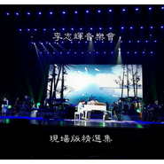

李志辉音乐会现场版精选集
============================

|  |  |
| :--: | :-- |
| [ 李志辉音乐会现场版精选集](https://emumo.xiami.com/album/2102678004) | **艺人**: [李志辉](../index.md) **语种**: 国语 **唱片公司**: 独立发行 **发行时间**: 2016年08月08日 **专辑类别**: 现场专辑 **专辑风格**:  **播放数**: 109735 **收藏数**: 344 **评论数**: 19  |

## 简介

  
 

李志辉音乐会现场版精选集，选自音乐家李志辉2013年--2016年期间各地不同场次音乐会的现场实况录音，分别为2013.4.26长沙洋湖湿地广场李志辉新世纪地理音乐会、2014.10.15北京国安剧院“点亮心灯关爱盲童”公益音乐会、2015.9.25上海东方艺术中心带你的耳朵去旅行音乐会、2016.6.6石家庄人民会堂“美丽河北”新世纪地理音乐会。
 

作曲Composer、音乐总监Music director：李志辉Li zhihui
 

制作总监Production director：孙鲁兴Sun luxing
 

视频特效总监Video Effects Director
 

白旭东Bai Xudong
 

视频制作总监Video Production Director
 

付远翔Fu Yuanxiang、赵慧Zhao Hui
 

灯光设计总监Lighting Design Director
 

刘超Liu Chao、郭巍Guo Wei、薛凯Xue Kai
 

PA音响设计总监PA Audio Design Director
 

孙鲁兴Sun Luxing
 

PA音响师PA Sound Engineer
 

贝贝Bei Bei、谷士义Gu shiyi
 

Monitor音响设计总监Monitor Audio Design Director
 

杨旭Yang Xu
 

Monitor音响师Monitor Sound Engineer
 

安方劲An Fangjin
 

录音Sound Recording Engineer
 

管浩Guan Hao
 

乐器Musical Instrument Assistant
 

马钰凯Ma Yukai、张哲Zhang Zhe、刘占良Liu zhanliang、吉月Ji yue、小飞Xiaofei
 

打击乐助理Percussion Instrument Assistant
 

李阳Li Yang、闫俊达Yan Junda、卢亚光Lu Yaguang、武亚波Wu Yabo、郭国彤Guo guotong、周云Zhou yun
 

执行导演Director：
 

蔡博Cai bo、张晶Zhang jing、古诚Gu cheng
 
舞美制作Stage Art Production 圣荣文化Shengrong Culture 炫天下文化World Shine Culture M+team舞台技术制作团队 

乐器提供Music Instruments
 

老道鼓文化传播有限公司LAODAO Drum Culture
 

守望者展演中心WATCHMAN Performance Center
 

ACmusic音乐服务公司
 

秦川乐器Qin chuan
 

音乐制作Music Production
 

作曲、编曲、音乐监制Composer\Arrangement\Director
 

李志辉Li Zhihui
 

音乐前期录制Recording Studio
 

总政歌舞团录音室Studio by the Song and Dance Ensemble of the PLA General Political Department
 

北京乐家轩A-STRING ENTERTAINMENT
 

守望者录音室WATCHMAN Studio
 

儒声润世Studio
 

混音室Mixing Studio
 

妙喜文化工作室混音室Mixing Studio by Miaoxi Culture
 

纯真感觉音乐工作室Pure Feel Music Studio
 

MASTER数码影音混音室Mixing Studio by MASTER
 

音频监制Audio Producer：李志辉音乐工作室LZH Music Studio
 

现场演出场地：
 

长沙洋湖湿地广场
 

北京国安剧院
 

上海东方艺术中心
 

石家庄人民会堂
 

 
 

 
 

 
 

石家庄乐手：
 

作曲、钢琴、电子合成器Composer\Piano\Breath Synthesizer
 

李志辉Li Zhihui
 

中国大鼓、打击乐Chinese Gongs\Percussion
 

何谓佳He Weijia
 

鼓Drum
 

荀亮Xun liang
 

西洋打击乐Percussion
 

Fabian Munoz（哥伦比亚）
 

贝斯Bass
 

杨士忠Yang Shizhong
 

吉他Guitar
 

苏雷Su Lei
 

笛、箫、萨克斯Chinese Flute\Xiao\Sax
 

郭忠合Guo Zhonghe
 

弦乐首席、小提琴独奏String Chief\Violin Solo
 

陈劼Chen Jie
 

古筝Zheng
 

沈乐Shen Yue
 

人声合音Vocal\Chorus
 

南妮Nan Ni、李维娜Li Weina
 

弦乐组strings：
 

吴春林Wu chunlin
 

 
 

上海乐手：
 

作曲、钢琴、电子合成器Composer\Piano\Breath Synthesizer
 

李志辉Li Zhihui
 

中国大鼓、打击乐Chinese Gongs\Percussion
 

何谓佳He Weijia
 

鼓Drum
 

荀亮Xun liang
 

西洋打击乐Percussion
 

CONCHA（委内瑞拉）
 

贝斯Bass
 

陈晓星Bob chen
 

吉他Guitar
 

苏雷Su Lei
 

笛、箫、萨克斯Chinese Flute\Xiao\Sax
 

郭忠合Guo Zhonghe
 

弦乐首席、小提琴独奏String Chief\Violin Solo
 

陈劼Chen Jie
 

大提琴cello：
 

胡春姣Hu chunjiao
 

古筝Zheng
 

沈乐Shen Yue
 

人声合音Vocal\Chorus
 

南妮Nan Ni、李维娜Li Weina
 

 
 

长沙乐手：
 

作曲、钢琴、电子合成器Composer\Piano\Breath Synthesizer
 

李志辉Li Zhihui
 

中国大鼓、打击乐Chinese Gongs\Percussion
 

何谓佳He Weijia
 

鼓Drum
 

荀亮Xun liang
 

西洋打击乐Percussion
 

Dominc  Bautista多米尼克（菲律宾）
 

贝斯Bass
 

陈晓星Bob chen
 

吉他Guitar
 

龚鸣Gong ming
 

笛、箫、萨克斯Chinese Flute\Xiao\Sax
 

郭忠合Guo Zhonghe
 

弦乐首席、小提琴独奏String Chief\Violin Solo
 

马骁飞Ma xiaofei
 

大提琴cello：
 

胡春姣Hu chunjiao
 

古筝Zheng
 

肖怡娟Xiao yijuan
 

人声合音Vocal\Chorus
 

南妮Nan Ni、李维娜Li Weina
 

 
 

北京乐手：
 

作曲、钢琴、电子合成器Composer\Piano\Breath Synthesizer
 

李志辉Li Zhihui
 

中国大鼓、打击乐Chinese Gongs\Percussion
 

何谓佳He Weijia
 

鼓Drum
 

荀亮Xun liang
 

西洋打击乐Percussion
 

CONCHA（委内瑞拉）
 

贝斯Bass
 

陈晓星Bob chen
 

吉他Guitar
 

曾杰Zeng jie
 

笛、箫、萨克斯Chinese Flute\Xiao\Sax
 

郭忠合Guo Zhonghe
 

弦乐首席、小提琴独奏String Chief\Violin Solo
 

马骁飞Ma xiaofei
 

古筝Zheng
 

沈乐Shen Yue
 

人声合音Vocal\Chorus
 

南妮Nan Ni、李维娜Li Weina
 

弦乐组Strings：
 

小提琴Violin：刘嫣红、王境宽、万炫伶、吴雪燕、唐镱荣
 

中提琴Viola：方小雨、李根
 

大提琴Cello：闫妍、颜妮
 

 

## 曲目

## 评论

|  |  |  |
| :-- | :-- | :-- |
|  [虾米用户](https://emumo.xiami.com/u/412524994) 经典永传唱 2020-10-25 10:16 赞(0) 踩(0) | 
别说那么多，好听的音乐只适合听，无星好评
 |
|  [虾米用户](https://emumo.xiami.com/u/412524994) 经典永传唱 2020-10-25 10:13 赞(0) 踩(0) | 
听一听大师李志辉的音乐能让人沉淀下来，能让人放松心情，养耳静心
 |
|  [虾米用户](https://emumo.xiami.com/u/88325236) 音乐是我的爱人！ 2020-09-09 13:47 赞(0) 踩(0) | 
喜爱他的每张专辑   
 |
|  [虾米用户](https://emumo.xiami.com/u/317865890)  2020-03-19 18:48 赞(0) 踩(0) | 
李志辉的音乐婉转动听对耳朵和大脑是一种滋养很美妙。
 |
|  [虾米用户](https://emumo.xiami.com/u/421336987) 音乐如诗，音乐如画，陶醉... 2019-08-25 17:50 赞(2) 踩(0) | 
首首MQA音质 
 |
|  [虾米用户](https://emumo.xiami.com/u/328833723)  2019-06-14 02:15 赞(1) 踩(0) | 
古典乐和现代乐器结合，轻快的节奏感中带着柔情唯美，
 |
|  [虾米用户](https://emumo.xiami.com/u/4487129)  2019-02-24 09:11 赞(0) 踩(0) | 
！！！
 |
|  [虾米用户](https://emumo.xiami.com/u/12178030) 初於闻中。入流亡所。所入... 2018-08-06 15:47 赞(2) 踩(0) | 
有灵气的音乐，且演奏的都是顶级大师们
 |
|  [虾米用户](https://emumo.xiami.com/u/11424331) TANGHAI 2018-02-19 18:25 赞(2) 踩(0) | 
真的很美！洁净，空灵，唯美
 |
|  [虾米用户](https://emumo.xiami.com/u/277209043)  2017-07-10 11:06 赞(2) 踩(0) | 
很喜欢李志辉的音乐，超级棒
 |
|  [虾米用户](https://emumo.xiami.com/u/1250917) 爱生活，爱虾米 2017-05-04 22:04 赞(2) 踩(0) | 
荀老师打鼓超级棒 
 |
|  [虾米用户](https://emumo.xiami.com/u/287770772)  2017-04-11 21:49 赞(2) 踩(0) | 
常听
 |
|  [虾米用户](https://emumo.xiami.com/u/8337431) 以乐会友 2017-02-09 11:22 赞(2) 踩(0) | 
整体效果非常棒，特别是打击乐和电吉他部分。8
 |
|  [虾米用户](https://emumo.xiami.com/u/8337431) 以乐会友 2017-02-09 10:03 赞(0) 踩(0) | 
7
 |
|  [虾米用户](https://emumo.xiami.com/u/28381654) 我还没想好要写什么... 2017-01-16 14:04 赞(2) 踩(0) | 
好像现场听一回
 |
|  [虾米用户](https://emumo.xiami.com/u/49125150) 一念心清净 2017-01-15 14:19 赞(1) 踩(0) | 
最喜欢湖天影月了，终于虾米音乐上也能听了。
 |
|  [虾米用户](https://emumo.xiami.com/u/43411373) 海之梦的梦之海 2017-01-10 21:29 赞(1) 踩(0) | 
什么时候能听一个现场哦？！
 |
|  [虾米用户](https://emumo.xiami.com/u/43411373) 海之梦的梦之海 2017-01-10 21:28 赞(1) 踩(0) | 
悠扬，好好听，是一种美好的享受！
 |
|  [虾米用户](https://emumo.xiami.com/u/260545589)  2017-01-09 16:39 赞(3) 踩(0) | 
李志辉音乐会现场版专辑发布
 |
