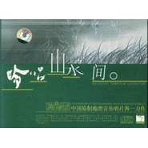

吟唱山水间
============================

|  |  |
| :--: | :-- |
| [ 吟唱山水间](https://emumo.xiami.com/album/343709) | **艺人**: [李志辉](../index.md) **语种**: 国语 **唱片公司**: 广州集韵堂文化传播有限公司 **发行时间**: 2005年11月22日 **专辑类别**: 录音室专辑 **专辑风格**: 轻音乐 Easy Listening **播放数**: 648802 **收藏数**: 2391 **评论数**: 160  |

## 简介

中国原创地理音乐-吟唱山水间 出品人:王强 作曲/后期:小辉 责编:薛淼 打击乐:王宏涛 吉它:蔡正东 笛、萧:杜聪、艾鸿波 二胡:唐玲 小提琴:潘智 古筝:沈乐 琵琶:汪济滢 演唱:古格、贡布昂杰 桑吉措、唐果、徐快 　　世间有万籁，是耳朵的福气。好的音乐，可以抵达内心，象一条灵动的泉，流淌着自由的欢乐；象一朵奇特的花，绽放出温暖的抚慰。原创地理音乐唱片——《吟唱山水间》，给了我这种久违的感受。乐音中，一幅幅美景缓缓展开：峨眉奇，黄山秀，洞庭浩渺，太湖静美……漓江如一条青罗带曼妙徊旋出诗般梦境，雅鲁藏布江在雪山冰峰间奔腾着千年的吟唱……旋律或清新悠远，或洒脱空灵，或深遂幽远，或浅吟低唱……高徊低转间溢满了大自然的清新和灵气。 　　或许你会有不同于我的感受，但如果你不小心，也买了这张CD，当十一首乐曲一一出场，最后END，你一定不会反对如下的评价：这张用心制作的CD，十一首乐曲，首首精致。丰富的民族乐器与恰恰到好处的人声应和，构筑出曼妙的音乐氛围……心灵的最深处被轻轻叩击，和音乐的美丽邂逅正在开始…… &nbsp;

## 曲目

## 评论

|  |  |  |  |
| :-- | :-- | :-- | :-- |
|  [虾米用户](https://emumo.xiami.com/u/254237128)   2019-06-06 13:12 赞(2) 踩(0) | 
大爱李志辉老师！希望中国多出些像李志辉老师这种类型的音乐家！！我们中国的纯音乐其实非常美非常有意境，甩出日本等国几条街！！
 |
|  [虾米用户](https://emumo.xiami.com/u/374992461)  2018-06-08 11:40 赞(1) 踩(0) | 
吟唱山水间　世间有万籁，是耳朵的福气。好的音乐，可以抵达内心。
 |
|  [虾米用户](https://emumo.xiami.com/u/332388835)  2018-03-10 22:40 赞(0) 踩(0) | 
很不错
 |
|  [虾米用户](https://emumo.xiami.com/u/345092130)  2018-02-20 11:22 赞(2) 踩(0) | 
感恩音乐大师作出如此好的地理音乐，听着听着就仿佛置身于其中，太美了   
 |
|  [虾米用户](https://emumo.xiami.com/u/3471393)  2017-10-30 10:19 赞(2) 踩(0) | 
大漠塞上，紫金花园，边城故事，渔舟湘江，乌兰巴托，楼兰古道，版纳竹楼，苏桥流水人家，蓬莱仙踪，溪行桃花源。我知道，我已经离未来越来越近，离过去越来越远。
 |
|  [虾米用户](https://emumo.xiami.com/u/18613283) 苍狼 2017-10-28 00:32 赞(3) 踩(0) | 
世间有万籁，是耳朵的福气。好的音乐，可以抵达内心，象一条灵动的泉，流淌着自由的欢乐；象一朵奇特的花，绽放出温暖的抚慰。
 |
|  [虾米用户](https://emumo.xiami.com/u/48183)  2017-10-28 00:09 赞(0) 踩(0) | 
俺喜欢边准备节目边听的~平复浮躁的心：）
 |
|  [虾米用户](https://emumo.xiami.com/u/31729)  2017-10-27 23:44 赞(1) 踩(0) | 
很棒的一张专辑。一个微阴的周末下午，一本心仪已久的游思书本，一盏昏黄的瓦斯灯，一张神游祖国大好河山之碟，神清气爽。精神上的双重享受。
 |
|  [虾米用户](https://emumo.xiami.com/u/5854363)  2017-10-27 23:24 赞(1) 踩(0) | 
最近好爱这种民乐。特别是第一首碧水微风媚太湖，简直要跟着一起摇头晃脑一番了。总之我很喜欢 o(*￣▽￣*)o
 |
|  [虾米用户](https://emumo.xiami.com/u/300307065)  2017-08-14 20:06 赞(0) 踩(0) | 
带着我的思绪飞翔
 |
|  [虾米用户](https://emumo.xiami.com/u/280453109) yangmei 2017-06-12 20:15 赞(0) 踩(0) | 
地理音乐家
 |
|  [虾米用户](https://emumo.xiami.com/u/260887956)  2017-05-26 08:43 赞(0) 踩(0) | 
很喜欢风格
 |
|  [虾米用户](https://emumo.xiami.com/u/2897733)  2017-02-12 12:10 赞(0) 踩(0) | 
好听
 |
|  [虾米用户](https://emumo.xiami.com/u/187418859)  2016-06-08 22:30 赞(2) 踩(0) | 
中国不可多得的好音乐，向世人展示了中国的旋律，伟大。
 |
|  [虾米用户](https://emumo.xiami.com/u/81429452) hbhd 2016-05-14 08:43 赞(0) 踩(0) | 
okok
 |
|  [虾米用户](https://emumo.xiami.com/u/36897148) 私信➕v请备注 2015-12-25 02:32 赞(0) 踩(0) | 
需要静心时候听听，很棒
 |
|  [虾米用户](https://emumo.xiami.com/u/4409711) 天地不仁，以万物为刍狗 2015-12-19 18:26 赞(0) 踩(0) | 
只能说超棒！
 |
|  [虾米用户](https://emumo.xiami.com/u/46235090)  2015-09-10 15:01 赞(0) 踩(0) | 
舒畅！！！
 |
|  [虾米用户](https://emumo.xiami.com/u/10156343)  2015-08-03 21:12 赞(0) 踩(0) | 
太美了，无言以对
 |
|  [虾米用户](https://emumo.xiami.com/u/8337431) 以乐会友 2015-07-08 06:49 赞(0) 踩(0) | 
新古典民乐163677,1558,141
 |
|  [虾米用户](https://emumo.xiami.com/u/5558090)  2015-06-17 16:11 赞(1) 踩(0) | 
世间有万籁，是耳朵的福气。好的音乐，可以抵达内心，象一条灵动的泉，流淌着自由的欢乐；象一朵奇特的花，绽放出温暖的抚慰。
 |
|  [虾米用户](https://emumo.xiami.com/u/3987161)  2015-06-15 22:30 赞(0) 踩(0) | 
吟唱山水间,李志辉,中国原创地理音乐,
 |
|  [虾米用户](https://emumo.xiami.com/u/3987161)  2015-06-15 22:30 赞(0) 踩(0) | 
吟唱山水间,李志辉,中国原创地理音乐,
 |
|  [虾米用户](https://emumo.xiami.com/u/1119910)  2015-06-15 17:45 赞(0) 踩(0) | 
强烈要求下次还要加上武夷山
 |
|  [虾米用户](https://emumo.xiami.com/u/44050484)  2015-04-29 15:54 赞(0) 踩(0) | 
非常美的民乐，很喜欢！
 |
|  [虾米用户](https://emumo.xiami.com/u/44050484)  2015-04-29 15:54 赞(0) 踩(0) | 
非常美的民乐，很喜欢！
 |
|  [虾米用户](https://emumo.xiami.com/u/32031632)  2015-04-24 11:24 赞(0) 踩(0) | 
好曲目，赞！
 |
|  [虾米用户](https://emumo.xiami.com/u/7366852) 听这些年的风华绝代 2015-04-23 17:25 赞(0) 踩(0) | 
真心大爱！何处寻山水，以至山水间！
 |
|  [虾米用户](https://emumo.xiami.com/u/628425)  2015-03-18 15:21 赞(0) 踩(0) | 
舒服
 |
|  [虾米用户](https://emumo.xiami.com/u/1666177)  2015-03-15 10:23 赞(0) 踩(0) | 
中国
 |
|  [虾米用户](https://emumo.xiami.com/u/36340378) 轻轻的我来了 2015-02-12 17:53 赞(0) 踩(0) | 
我志山水间也
 |
|  [虾米用户](https://emumo.xiami.com/u/20424722) 静静聆听 2015-01-24 13:02 赞(0) 踩(0) | 
很棒
 |
|  [虾米用户](https://emumo.xiami.com/u/702163) 普通听众。 2014-12-22 13:45 赞(0) 踩(0) | 
太棒了……
 |
|  [虾米用户](https://emumo.xiami.com/u/9439080)  2014-11-27 18:26 赞(0) 踩(0) | 
天籁之音！
 |
|  [虾米用户](https://emumo.xiami.com/u/4197714)  2014-11-21 13:47 赞(0) 踩(0) | 
听着就很舒服啊，小调。
 |
|  [虾米用户](https://emumo.xiami.com/u/37184056)  2014-11-15 18:12 赞(1) 踩(0) | 
我要买CD放在我的奔驰上，只有这样的音乐才配得上
 |
|  [虾米用户](https://emumo.xiami.com/u/43711944) 欣赏、感恩、享受美乐！ 2014-11-15 12:38 赞(0) 踩(0) | 
怎一个赞字了得！觉得值得珍藏！
 |
|  [虾米用户](https://emumo.xiami.com/u/36340378) 轻轻的我来了 2014-10-17 19:14 赞(1) 踩(0) | 
纯声乐才是当今最需要的，洗涤人们浮躁的心
 |
|  [虾米用户](https://emumo.xiami.com/u/9090499)  2014-09-06 22:31 赞(0) 踩(0) | 
吟唱
 |
|  [虾米用户](https://emumo.xiami.com/u/15335367)  2014-08-27 21:15 赞(0) 踩(0) | 
收藏
 |
|  [虾米用户](https://emumo.xiami.com/u/8313493)  2014-08-03 16:17 赞(0) 踩(0) | 
0k
 |
|  [虾米用户](https://emumo.xiami.com/u/39210321)  2014-07-21 17:32 赞(0) 踩(0) | 
大气，冲满大自然的清新与雅致。
 |
|  [虾米用户](https://emumo.xiami.com/u/6666474) shuiruyan 2014-07-08 22:05 赞(0) 踩(0) | 
世间有万籁，是耳朵的福气。好的音乐，可以抵达内心
 |
|  [虾米用户](https://emumo.xiami.com/u/38540849)  2014-06-29 18:17 赞(0) 踩(0) | 
好听。
 |
|  [虾米用户](https://emumo.xiami.com/u/1402926) 不要轻易说爱，许下的诺言... 2014-06-29 09:56 赞(0) 踩(0) | 
喜欢
 |
|  [虾米用户](https://emumo.xiami.com/u/36556927) 暂无签名~ 2014-06-28 17:48 赞(0) 踩(0) | 
风热感冒中，浑身的燥热，听过这张专辑后安安静静准备去加班了。
 |
| ⇒ |  [虾米用户](https://emumo.xiami.com/u/24394522) 无为而无不为 2014-09-02 21:47 赞(0) 踩(0) | 
可以
 |
| ⇒ |  [虾米用户](https://emumo.xiami.com/u/24394522) 无为而无不为 2014-09-02 21:48 赞(0) 踩(0) | 
老中医
 |
|  [虾米用户](https://emumo.xiami.com/u/5400774)  2014-06-21 10:32 赞(0) 踩(0) | 
好听！
 |
|  [虾米用户](https://emumo.xiami.com/u/33042329) 鼎阿哥 2014-06-09 20:46 赞(0) 踩(0) | 
古典
 |
|  [虾米用户](https://emumo.xiami.com/u/33042329) 鼎阿哥 2014-06-09 20:46 赞(0) 踩(0) | 
民乐
 |
|  [虾米用户](https://emumo.xiami.com/u/1166114)  2014-05-13 20:29 赞(0) 踩(0) | 
相见很晚！
 |
|  [虾米用户](https://emumo.xiami.com/u/2249408)  2014-05-12 14:32 赞(0) 踩(0) | 
溢满了大自然的清新和灵气
 |
|  [虾米用户](https://emumo.xiami.com/u/3495672) 我心匪石 2014-05-09 18:54 赞(0) 踩(0) | 
仁者乐山，智者乐水，山风习习，泉水叮叮，自然之音，最动人心~
 |
|  [虾米用户](https://emumo.xiami.com/u/1609946) 一即一切 2014-03-05 16:37 赞(0) 踩(0) | 
心 境不二
 |
| ⇒ |  [虾米用户](https://emumo.xiami.com/u/20898701)  2015-02-21 09:08 赞(0) 踩(0) | 
美雪
 |
|  [虾米用户](https://emumo.xiami.com/u/13441493) 勇者无敌 2014-03-04 01:33 赞(0) 踩(0) | 
ok100
 |
|  [虾米用户](https://emumo.xiami.com/u/5007427) 暂无签名~ 2014-02-26 00:29 赞(0) 踩(0) | 
简直爱上这种风格了！
 |
|  [虾米用户](https://emumo.xiami.com/u/5007427) 暂无签名~ 2014-02-26 00:28 赞(0) 踩(0) | 
简直爱上这种风格了！
 |
|  [虾米用户](https://emumo.xiami.com/u/33200421)  2014-02-25 07:43 赞(1) 踩(0) | 
感恩！
 |
|  [虾米用户](https://emumo.xiami.com/u/33200421)  2014-02-25 07:38 赞(0) 踩(0) | 
感恩一切！
 |
|  [虾米用户](https://emumo.xiami.com/u/581269)  2014-02-14 20:23 赞(0) 踩(0) | 
李志辉
 |
|  [虾米用户](https://emumo.xiami.com/u/28545284) 俗人 2014-01-08 10:34 赞(0) 踩(0) | 
聆听风景
 |
|  [虾米用户](https://emumo.xiami.com/u/18773012) 卫道东升 2013-12-31 19:39 赞(0) 踩(0) | 
非常喜欢
 |
|  [虾米用户](https://emumo.xiami.com/u/18773012) 卫道东升 2013-12-31 19:38 赞(0) 踩(0) | 
非常喜欢
 |
|  [虾米用户](https://emumo.xiami.com/u/26526457) 滕州二中91 2013-12-27 08:15 赞(0) 踩(0) | 
喜欢
 |
|  [虾米用户](https://emumo.xiami.com/u/24514688)  2013-12-10 12:27 赞(0) 踩(0) | 
relaxing melody
 |
|  [虾米用户](https://emumo.xiami.com/u/7732042)  2013-12-06 21:05 赞(0) 踩(0) | 
1
 |
|  [虾米用户](https://emumo.xiami.com/u/15004821)  2013-11-14 22:19 赞(0) 踩(0) | 
吟唱山水，且吟且行。
 |
|  [虾米用户](https://emumo.xiami.com/u/24589053)  2013-10-16 00:08 赞(0) 踩(0) | 
妙不可言，阿弥陀佛。
 |
|  [虾米用户](https://emumo.xiami.com/u/4413886)  2013-10-08 19:06 赞(0) 踩(0) | 
感觉是记忆深处的音乐
 |
|  [虾米用户](https://emumo.xiami.com/u/8018643)  2013-10-02 19:29 赞(0) 踩(0) | 
べ_べ
 |
|  [虾米用户](https://emumo.xiami.com/u/9599912)  2013-08-20 15:08 赞(11) 踩(0) | 
世间有万籁，是耳朵的福气。好的音乐，可以抵达内心，象一条灵动的泉，流淌着自由的欢乐；象一朵奇特的花，绽放出温暖的抚慰。
 |
| ⇒ |  [虾米用户](https://emumo.xiami.com/u/32031632)  2015-05-31 13:57 赞(0) 踩(0) | 
好曲目，赞！
 |
|  [虾米用户](https://emumo.xiami.com/u/9608410) Silence 2013-08-16 20:07 赞(0) 踩(0) | 
吟唱山水间。
 |
|  [虾米用户](https://emumo.xiami.com/u/11699681)  2013-08-01 13:03 赞(0) 踩(0) | 
收了
 |
|  [虾米用户](https://emumo.xiami.com/u/13224828)  2013-07-20 23:02 赞(0) 踩(0) | 
难得的俏皮音乐
 |
|  [虾米用户](https://emumo.xiami.com/u/2376315)  2013-06-22 16:57 赞(4) 踩(0) | 
碧水微风过，天籁绕天山。吟唱山水间，清音露泉间。
 |
|  [虾米用户](https://emumo.xiami.com/u/6639488)  2013-06-08 23:50 赞(0) 踩(0) | 
吟唱山水间
 |
|  [虾米用户](https://emumo.xiami.com/u/205735) 芒果的体型能变成黄瓜的么 2013-05-15 07:41 赞(0) 踩(0) | 
每当遇到中国风的专辑，都能看到平贵叔，哇哈哈哈。@雅各卑，虾米上了一个新功能，能收到我的电波么~~，吼吼。。。
 |
|  [虾米用户](https://emumo.xiami.com/u/3908525)  2013-04-24 19:17 赞(0) 踩(0) | 
一听开头就不错 只是后面的人声有些。。
 |
|  [虾米用户](https://emumo.xiami.com/u/13189144)  2013-04-15 23:58 赞(0) 踩(0) | 
对于喜欢书香音乐系列的人来说，此专辑是饕餮盛宴！
 |
|  [虾米用户](https://emumo.xiami.com/u/13929207) 努力赚钱  保护媳妇 2013-04-12 14:47 赞(0) 踩(0) | 
喜欢这种感觉
 |
|  [虾米用户](https://emumo.xiami.com/u/7219325)  2013-04-11 23:11 赞(0) 踩(0) | 
美
 |
|  [虾米用户](https://emumo.xiami.com/u/13527645)  2013-03-27 13:54 赞(0) 踩(0) | 
like
 |
|  [虾米用户](https://emumo.xiami.com/u/4960476)  2013-03-09 22:57 赞(0) 踩(0) | 
好听！！！
 |
|  [虾米用户](https://emumo.xiami.com/u/13283342) 随缘～（清  静  和 ... 2013-03-04 10:15 赞(0) 踩(0) | 
舒服
 |
|  [虾米用户](https://emumo.xiami.com/u/4219505)  2013-02-09 15:37 赞(0) 踩(0) | 
喜欢没道理
 |
|  [虾米用户](https://emumo.xiami.com/u/12732119) 人生一场真实的幻像！ 2013-01-28 10:49 赞(0) 踩(0) | 
大爱啊！！
 |
| ⇒ |  [虾米用户](https://emumo.xiami.com/u/3487360) 0.0 2013-04-26 17:57 赞(0) 踩(0) | 
+n
 |
|  [虾米用户](https://emumo.xiami.com/u/5941118) 小众音乐，分享生活、. 2013-01-27 19:21 赞(0) 踩(0) | 
I like···
 |
|  [虾米用户](https://emumo.xiami.com/u/6589172)  2013-01-16 14:35 赞(0) 踩(0) | 
好
 |
|  [虾米用户](https://emumo.xiami.com/u/12448060)  2013-01-15 18:22 赞(0) 踩(0) | 
嘿嘿……好听，为了李志辉专门下载了虾米音乐
 |
|  [虾米用户](https://emumo.xiami.com/u/7792034)  2013-01-14 20:57 赞(0) 踩(0) | 
,吟唱山水间
 |
|  [虾米用户](https://emumo.xiami.com/u/11998664)  2013-01-09 17:26 赞(0) 踩(0) | 
中国风，挥洒自在
 |
|  [虾米用户](https://emumo.xiami.com/u/8919019)  2012-12-19 14:13 赞(0) 踩(0) | 
太棒了无以言表
 |
|  [虾米用户](https://emumo.xiami.com/u/10951828) 琴心剑魄 2012-12-03 23:12 赞(0) 踩(0) | 
好听
 |
|  [虾米用户](https://emumo.xiami.com/u/5135402)  2012-11-10 19:51 赞(0) 踩(0) | 
再次欣赏，依然喜欢！谢谢！周末愉快！
 |
|  [虾米用户](https://emumo.xiami.com/u/2844532) 心随乐动 2012-11-04 21:03 赞(1) 踩(0) | 
世间有万籁，是耳朵的福气。好的音乐，可以抵达内心，象一条灵动的泉，流淌着自由的欢乐；象一朵奇特的花，绽放出温暖的抚慰。
 |
|  [虾米用户](https://emumo.xiami.com/u/6872970) 往烟清尘，无果境空。 2012-11-04 16:43 赞(0) 踩(0) | 
第一个音符蹦出来就喜欢上这张专辑了。
 |
|  [虾米用户](https://emumo.xiami.com/u/11309296)  2012-11-02 00:01 赞(0) 踩(0) | 
喜欢
 |
|  [虾米用户](https://emumo.xiami.com/u/9034789) 梦的地方，一直都睡不醒 2012-10-31 12:44 赞(0) 踩(0) | 
轻音乐一枚
 |
|  [虾米用户](https://emumo.xiami.com/u/9985098)  2012-10-28 16:03 赞(0) 踩(0) | 
贼好听~~
 |
|  [虾米用户](https://emumo.xiami.com/u/9985098)  2012-10-28 16:02 赞(0) 踩(0) | 
好听呗~~
 |
|  [虾米用户](https://emumo.xiami.com/u/7732042)  2012-10-25 21:18 赞(0) 踩(0) | 
美
 |
|  [虾米用户](https://emumo.xiami.com/u/1017448)  2012-10-17 21:34 赞(0) 踩(0) | 
大美
 |
|  [虾米用户](https://emumo.xiami.com/u/10527488)  2012-09-27 14:40 赞(0) 踩(0) | 
让灵魂自由
 |
|  [虾米用户](https://emumo.xiami.com/u/5802018)  2012-09-24 17:10 赞(0) 踩(0) | 
李志辉的音乐大爱啊！！
 |
|  [虾米用户](https://emumo.xiami.com/u/10727548)  2012-09-22 13:14 赞(0) 踩(0) | 
非常喜欢这张专辑。
 |
|  [虾米用户](https://emumo.xiami.com/u/9437527)  2012-09-20 14:17 赞(0) 踩(0) | 
浓郁的古典曲调，蕴含着各地独特的地理风情，或深邃厚重，或轻快灵动，或婉转诉肠，音符如一弯清月泻下幽幽泠光，随一泉明溪流淌而下，直抵灵魂深处。戴上耳机，倾听李志辉，心灵随其音乐一起旅行。
 |
|  [虾米用户](https://emumo.xiami.com/u/9437527)  2012-09-20 12:57 赞(1) 踩(0) | 
浓郁的古典曲调，蕴含着各地独特的民族风情，或深邃厚重，或轻快灵动，思绪也跟着飞扬。
 |
|  [虾米用户](https://emumo.xiami.com/u/10372686)  2012-09-18 15:33 赞(0) 踩(0) | 
太好听了
 |
|  [虾米用户](https://emumo.xiami.com/u/2416230)  2012-09-09 16:51 赞(0) 踩(0) | 
汉民族自己调式，汉式审美
 |
|  [虾米用户](https://emumo.xiami.com/u/6387542)  2012-09-09 08:03 赞(0) 踩(0) | 
好好好好
 |
|  [虾米用户](https://emumo.xiami.com/u/10427850)  2012-09-01 17:11 赞(0) 踩(0) | 
古筝乐
 |
|  [虾米用户](https://emumo.xiami.com/u/9096595)  2012-08-04 17:09 赞(0) 踩(0) | 
听到第二首，非常有立体感的音乐
 |
|  [虾米用户](https://emumo.xiami.com/u/9096595)  2012-08-04 17:05 赞(0) 踩(0) | 
像飘的感觉
 |
|  [虾米用户](https://emumo.xiami.com/u/9096595)  2012-08-04 17:00 赞(0) 踩(0) | 
好音乐
 |
|  [虾米用户](https://emumo.xiami.com/u/10083561)  2012-08-04 15:25 赞(0) 踩(0) | 
让心灵畅游山水之间
 |
|  [虾米用户](https://emumo.xiami.com/u/9856512)  2012-07-18 08:22 赞(0) 踩(0) | 
畅游神州大地
 |
|  [虾米用户](https://emumo.xiami.com/u/9179665)  2012-07-10 11:58 赞(0) 踩(0) | 
中国风
 |
|  [虾米用户](https://emumo.xiami.com/u/3584842)  2012-07-05 00:20 赞(0) 踩(0) | 
吟唱山水的意境与曲名丝丝相连。。。
 |
|  [虾米用户](https://emumo.xiami.com/u/7938291)  2012-06-01 11:36 赞(0) 踩(0) | 
詩意山水
 |
|  [虾米用户](https://emumo.xiami.com/u/1354935)  2012-05-04 15:57 赞(0) 踩(0) | 
曲曲精品，直击人心
 |
|  [虾米用户](https://emumo.xiami.com/u/6195942) 你一天天长大，我一天天变... 2012-04-12 06:31 赞(0) 踩(0) | 
好想听听
 |
|  [虾米用户](https://emumo.xiami.com/u/8497826)  2012-03-22 14:20 赞(0) 踩(0) | 
世间有万籁，是耳朵的福气。好的音乐，可以抵达内心，象一条灵动的泉，流淌着自由的欢乐；象一朵奇特的花，绽放出温暖的抚慰。原创地理音乐唱片——《吟唱山水间》，给了我这种久违的感受。
 |
|  [虾米用户](https://emumo.xiami.com/u/1199830)  2012-03-14 16:47 赞(0) 踩(0) | 
中国风啊
 |
|  [虾米用户](https://emumo.xiami.com/u/7867049)  2012-03-07 08:59 赞(0) 踩(0) | 
精品
 |
|  [虾米用户](https://emumo.xiami.com/u/8135330) 浓尽必枯  淡者屡深 2012-02-28 10:54 赞(0) 踩(0) | 
中国原创地理音乐-吟唱山水间　世间有万籁，是耳朵的福气。好的音乐，可以抵达内心，象一条灵动的泉，流淌着自由的欢乐；象一朵奇特的花，绽放出温暖的抚慰
 |
|  [虾米用户](https://emumo.xiami.com/u/6887797)  2012-02-20 11:39 赞(0) 踩(0) | 
明快，清脆
 |
|  [虾米用户](https://emumo.xiami.com/u/8048365)  2012-02-17 14:18 赞(0) 踩(0) | 
确实不错，比班得瑞好听的多。不过风格过于单调，灵感思路稍嫌窄了，好像正在经历瓶颈期。再有个1、20年，经历更丰富了，会更加炉火纯青的！值得期待！
 |
|  [虾米用户](https://emumo.xiami.com/u/7621217)  2012-01-28 05:15 赞(0) 踩(0) | 
好好听 舒服
 |
|  [虾米用户](https://emumo.xiami.com/u/7713812)  2012-01-18 12:49 赞(0) 踩(0) | 
纯音乐
 |
|  [虾米用户](https://emumo.xiami.com/u/1456312) 呼吸音乐，行走人生 2012-01-11 16:07 赞(0) 踩(0) | 
中国原创地理音乐
 |
|  [虾米用户](https://emumo.xiami.com/u/7144219)  2011-12-23 09:59 赞(0) 踩(0) | 
就是舒服
 |
|  [虾米用户](https://emumo.xiami.com/u/7111885)  2011-12-09 22:04 赞(0) 踩(0) | 
天籁之音
 |
|  [虾米用户](https://emumo.xiami.com/u/7002312)  2011-11-29 10:28 赞(0) 踩(0) | 
纯音纯音乐，好听
 |
|  [虾米用户](https://emumo.xiami.com/u/6744967) 音乐无国界，你爱我也爱。 2011-11-19 21:53 赞(0) 踩(0) | 
喜欢
 |
|  [虾米用户](https://emumo.xiami.com/u/6315227)  2011-11-11 17:55 赞(0) 踩(0) | 
喜欢。。。
 |
|  [虾米用户](https://emumo.xiami.com/u/662578) 无论如何，请给自己一个新 2011-10-22 07:08 赞(0) 踩(0) | 
地理音乐，峨眉奇，黄山秀，洞庭浩渺，太湖静美。
 |
|  [虾米用户](https://emumo.xiami.com/u/1621488) 还好有音乐陪伴。 2011-10-07 09:17 赞(0) 踩(0) | 
中国音乐
 |
|  [虾米用户](https://emumo.xiami.com/u/3234411)  2011-09-04 14:04 赞(0) 踩(0) | 
唱游山水间
 |
|  [虾米用户](https://emumo.xiami.com/u/3024528) 暂无签名~ 2011-07-29 23:51 赞(0) 踩(0) | 
纯音纯音乐，久久回肠!难得。
 |
|  [虾米用户](https://emumo.xiami.com/u/3024528) 暂无签名~ 2011-07-22 12:59 赞(0) 踩(0) | 
好音乐，永流传。
 |
|  [虾米用户](https://emumo.xiami.com/u/363069)  2011-07-13 12:45 赞(0) 踩(0) | 
这个假期晒太阳必备
 |
|  [虾米用户](https://emumo.xiami.com/u/2922605)  2011-07-05 22:06 赞(0) 踩(0) | 
旅游的时候听听
 |
|  [虾米用户](https://emumo.xiami.com/u/4374535)  2011-07-02 10:29 赞(0) 踩(0) | 
喜欢的都收藏，以后慢慢听。。。。
 |
|  [虾米用户](https://emumo.xiami.com/u/1084058)  2011-06-24 19:04 赞(0) 踩(0) | 
好专辑，在山水间的吟唱，徜徉于音乐中的大好河山
 |
|  [虾米用户](https://emumo.xiami.com/u/1084058)  2011-06-24 19:03 赞(0) 踩(0) | 
感谢what童鞋的推荐，好专辑，在山水间的吟唱，徜徉于音乐中的大好河山。
 |
|  [虾米用户](https://emumo.xiami.com/u/1523861)  2011-05-25 00:10 赞(0) 踩(0) | 
清音玉露月牙泉！
 |
|  [虾米用户](https://emumo.xiami.com/u/1329399)  2011-04-19 09:48 赞(0) 踩(0) | 
很久以前听过的
 |
|  [虾米用户](https://emumo.xiami.com/u/3512839)  2011-04-13 16:01 赞(0) 踩(0) | 
流淌着的山水情
 |
|  [虾米用户](https://emumo.xiami.com/u/3512839)  2011-04-13 16:00 赞(0) 踩(0) | 
流淌着的山水情
 |
|  [虾米用户](https://emumo.xiami.com/u/3175841)  2011-04-01 13:19 赞(0) 踩(0) | 
吟唱山水间
 |
|  [虾米用户](https://emumo.xiami.com/u/3349519)  2011-03-28 15:32 赞(0) 踩(0) | 
流淌的是清新淡雅……
 |
|  [虾米用户](https://emumo.xiami.com/u/1723229)  2011-03-25 09:54 赞(0) 踩(0) | 
象一条灵动的泉，流淌着自由的欢乐；象一朵奇特的花，绽放出温暖的抚慰。
 |
|  [虾米用户](https://emumo.xiami.com/u/3143882)  2011-03-12 12:54 赞(0) 踩(0) | 
强顶、、、、好听。
 |
|  [虾米用户](https://emumo.xiami.com/u/3143882)  2011-03-12 12:54 赞(0) 踩(0) | 
强烈顶、、、好听的音乐、、、
 |
|  [虾米用户](https://emumo.xiami.com/u/3143882)  2011-03-10 20:21 赞(0) 踩(0) | 
非常喜欢他的音乐。。
 |
|  [虾米用户](https://emumo.xiami.com/u/1315500)  2011-02-25 21:09 赞(0) 踩(0) | 
******
 |
