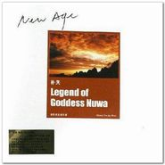

补天
============================

|  |  |
| :--: | :-- |
| [ 补天](https://emumo.xiami.com/album/430217) | **艺人**: [李志辉](../index.md) **语种**: 国语 **唱片公司**: 千思唱片 **发行时间**: 2004年01月01日 **专辑类别**: 录音室专辑 **专辑风格**: 轻音乐 Easy Listening **播放数**: 114617 **收藏数**: 624 **评论数**: 31  |

## 简介

一个取材于远古神话的迷幻故事，泥土造人、炼石补天。庇护生命的女神的光环，宇宙开天、洪荒时代的生灵图画。电子乐所制造的玄迷与空幻，跨越时空、抵达生命初开的遥远的处女地。新世纪的黎明，迷雾渐散，光芒耀眼。  
 

## 曲目

## 评论

|  |  |  |
| :-- | :-- | :-- |
|  [虾米用户](https://emumo.xiami.com/u/276944698) 不要自我设限..... 2020-07-07 22:52 赞(0) 踩(0) | 

 |
|  [虾米用户](https://emumo.xiami.com/u/43492923) 行到水穷我才开始害怕，夕... 2018-07-07 16:39 赞(0) 踩(0) | 
棒
 |
|  [虾米用户](https://emumo.xiami.com/u/16025536)  2016-03-29 20:17 赞(0) 踩(0) | 
轻快纯音乐
 |
|  [虾米用户](https://emumo.xiami.com/u/9943562) 多数盗版碟在02年发行 2015-12-06 23:57 赞(0) 踩(0) | 
ISRC: CNA230433600 <a href="http://www.amazon.cn/%E8%A1%A5%E5%A4%A9-%E6%96%B0%E6%B0%91%E4%B9%90%E5%8F%91%E7%83%A7%E5%A4%A9%E7%A2%9F/dp/B0011768V6" target="_blank" rel="nofollow noreferrer noopener">http://www.amazon.cn/%E8%A1%A5%E5%A4%A9-%E6%96%B0%E6%B0%91%E4%B9%90%E5%8F%91%E7%83%A7%E5%A4%A9%E7%A2%9F/dp/B0011768V6</a>
 |
| ⇒ |  [虾米用户](https://emumo.xiami.com/u/355865) Let it go, l... 2016-11-10 15:35 赞(0) 踩(0) | 
作曲/制作/MDI程式/键盘/电子吹奏合成器：小辉（李志辉） 大提琴：江竹生 小提琴：王颖 竹笛：刘华男 出版：中国科学文化音像出版社 ISRC：CN-A23-04-336-00/A.J6
 |
|  [虾米用户](https://emumo.xiami.com/u/29388931)  2015-06-28 11:23 赞(0) 踩(0) | 
喜欢李志辉音乐
 |
|  [虾米用户](https://emumo.xiami.com/u/1311) @彩荷之光 2014-06-30 21:26 赞(0) 踩(0) | 
怎么有身处西双版纳的感觉呢|？
 |
|  [虾米用户](https://emumo.xiami.com/u/4306566) 旋律住进我心里 2014-06-23 15:56 赞(0) 踩(0) | 
梦幻空间
 |
|  [虾米用户](https://emumo.xiami.com/u/18773012) 卫道东升 2013-12-31 19:42 赞(0) 踩(0) | 
非常喜欢
 |
|  [虾米用户](https://emumo.xiami.com/u/10527488)  2013-12-14 20:19 赞(0) 踩(0) | 
新世纪音乐
 |
|  [虾米用户](https://emumo.xiami.com/u/9599912)  2013-08-20 16:35 赞(1) 踩(0) | 
一个取材于远古神话的迷幻故事，泥土造人、炼石补天。庇护生命的女神的光环，宇宙开天、洪荒时代的生灵图画。电子乐所制造的玄迷与空幻，跨越时空、抵达生命初开的遥远的处女地。新世纪的黎明，迷雾渐散，光芒耀眼。
 |
|  [虾米用户](https://emumo.xiami.com/u/7576008) 從無始來，種種顛倒 2013-07-02 21:38 赞(0) 踩(0) | 
起源，洪荒，亘古，新世纪
 |
|  [虾米用户](https://emumo.xiami.com/u/7576008) 從無始來，種種顛倒 2013-06-19 00:15 赞(0) 踩(0) | 
起源，亘古，洪荒，新世纪
 |
|  [虾米用户](https://emumo.xiami.com/u/7576008) 從無始來，種種顛倒 2013-06-19 00:10 赞(0) 踩(0) | 
起源，洪荒，亘古，新世纪
 |
|  [虾米用户](https://emumo.xiami.com/u/13929207) 努力赚钱  保护媳妇 2013-04-12 14:45 赞(0) 踩(0) | 
喜欢这种感觉
 |
|  [虾米用户](https://emumo.xiami.com/u/10951828) 琴心剑魄 2013-02-21 09:40 赞(0) 踩(0) | 
有故事性的音乐，值得收藏。
 |
|  [虾米用户](https://emumo.xiami.com/u/11642836)  2012-11-24 22:13 赞(0) 踩(0) | 
喜欢
 |
|  [虾米用户](https://emumo.xiami.com/u/11521832) 长乐未央 2012-11-16 23:14 赞(0) 踩(0) | 
喜欢
 |
|  [虾米用户](https://emumo.xiami.com/u/11243363) 歌颂星辰者。 2012-10-30 12:10 赞(0) 踩(0) | 
大爱李志辉，这张也是一样的完美！
 |
|  [虾米用户](https://emumo.xiami.com/u/6872970) 往烟清尘，无果境空。 2012-10-22 19:51 赞(0) 踩(0) | 
绝对的新世纪，美的不可方物。
 |
|  [虾米用户](https://emumo.xiami.com/u/2116131)  2012-09-11 23:55 赞(0) 踩(0) | 
喜欢
 |
|  [虾米用户](https://emumo.xiami.com/u/7867049)  2012-03-07 09:01 赞(0) 踩(0) | 
精品
 |
|  [虾米用户](https://emumo.xiami.com/u/7027523)  2012-02-05 01:50 赞(0) 踩(0) | 
李志辉好美
 |
|  [虾米用户](https://emumo.xiami.com/u/7202867)  2012-01-29 12:02 赞(0) 踩(0) | 
李志辉，才子
 |
|  [虾米用户](https://emumo.xiami.com/u/4066192)  2011-05-28 15:03 赞(0) 踩(0) | 
没有理由不喜欢
 |
|  [虾米用户](https://emumo.xiami.com/u/1894873)  2011-04-20 15:02 赞(0) 踩(0) | 
（：
 |
|  [虾米用户](https://emumo.xiami.com/u/3349519)  2011-03-28 15:37 赞(0) 踩(0) | 
生命初开的时节……
 |
|  [虾米用户](https://emumo.xiami.com/u/1623977)  2011-03-24 15:48 赞(0) 踩(0) | 
哈哈
 |
|  [虾米用户](https://emumo.xiami.com/u/36029) ½ 2011-03-15 15:26 赞(0) 踩(0) | 
great
 |
|  [虾米用户](https://emumo.xiami.com/u/837425) 我还没想好要写什么... 2011-03-13 16:02 赞(0) 踩(0) | 
O(∩_∩)O谢谢上传分享！
 |
|  [虾米用户](https://emumo.xiami.com/u/1258127)  2011-03-13 00:00 赞(0) 踩(0) | 
喜欢李志辉的作品
 |
