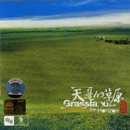

天边的草原
============================

|  |  |
| :--: | :-- |
| [ 天边的草原](https://emumo.xiami.com/album/469984) | **艺人**: [李志辉](../index.md) **语种**: 国语 **唱片公司**: 千思唱片 **发行时间**: 2004年04月01日 **专辑类别**: 录音室专辑 **专辑风格**: 轻音乐 Easy Listening **播放数**: 554241 **收藏数**: 936 **评论数**: 72  |

## 简介

舒呈极致的美感，营造灵魂游走的自由空间。重返蒙古大地，感受蓝天白云下极目无边的辽阔。看阳光下飞驰的骏马、信步的羊群，聆听蒙古人深情悠长的歌声，品味如歌往事，夜夜不眠的马头琴。触摸一个民族纤细的情感，品味最深沉的爱与忧伤。电子乐混合来自蒙古大草原的音乐元素：吟唱、长调、马头琴……融汇电子、西洋、民族、古典、现代等多样曲风，精彩原创，唯美动听，采撷中华传统文化元素，东方传奇，尽收耳鼓。千思唱片，为你带来最具创意和品质的音乐盛宴。  
作曲 Compose：李志辉  
制作 Produce MIDI程式：李志辉  
键盘 Keyboard/电子吹奏合成器：李志辉  
小提琴 Violin：王颖  
大提琴 Cello：江竹生  
竹笛 Bamboo Flute：刘华男

## 曲目

## 评论

|  |  |  |  |
| :-- | :-- | :-- | :-- |
|  [虾米用户](https://emumo.xiami.com/u/406258386)  2019-10-01 08:29 赞(0) 踩(0) | 

 |
|  [虾米用户](https://emumo.xiami.com/u/419596818)  2019-02-22 17:31 赞(0) 踩(0) | 
悠远，壮阔，苍茫，心随乐舞。
 |
|  [虾米用户](https://emumo.xiami.com/u/9080939) 不为无益之事，何遣有涯之... 2018-12-07 19:47 赞(0) 踩(0) | 
李大师的草原，疏阔，俊逸，于一派清朗之下，又是细腻柔和的情思
 |
|  [虾米用户](https://emumo.xiami.com/u/275732496) 静默如初     聆听美... 2018-09-03 13:20 赞(0) 踩(0) | 

 |
|  [虾米用户](https://emumo.xiami.com/u/186614884) Aaron Willia... 2018-08-05 17:47 赞(0) 踩(0) | 
第一首就融化了都市人的心河，小提琴、中提琴为主的人声浅吟低唱，感动到想哭，蓝天白云，一路通向天边的草原，太美，太美。。。
 |
|  [虾米用户](https://emumo.xiami.com/u/8337431) 以乐会友 2018-04-21 04:37 赞(0) 踩(0) | 
诗集66
 |
|  [虾米用户](https://emumo.xiami.com/u/8337431) 以乐会友 2017-11-30 04:42 赞(0) 踩(0) | 
纯音经典，天边的草原，白云音诗。64
 |
|  [虾米用户](https://emumo.xiami.com/u/9943562) 多数盗版碟在02年发行 2017-10-27 23:50 赞(0) 踩(0) | 
另一版本名：牧游 新民乐发烧天碟制作：北京千思文化传播有限公司 香港千思唱片有限公司发行公司：天津泰达音像发行中心出版：中国科学文化音像出版社发行时间：2004ISRC：CN-A23-04-334-00/A.J6
 |
|  [虾米用户](https://emumo.xiami.com/u/287770772)  2017-04-10 20:30 赞(0) 踩(0) | 
愉快轻松
 |
|  [虾米用户](https://emumo.xiami.com/u/32969007)  2016-08-20 06:13 赞(0) 踩(0) | 
赞
 |
|  [虾米用户](https://emumo.xiami.com/u/14167049)  2016-07-21 22:41 赞(0) 踩(0) | 
好
 |
|  [虾米用户](https://emumo.xiami.com/u/5968515) 听吧。 2016-06-17 00:24 赞(0) 踩(0) | 
轻松，唯美，通俗
 |
|  [虾米用户](https://emumo.xiami.com/u/8337431) 以乐会友 2016-04-16 21:27 赞(0) 踩(0) | 
61
 |
|  [虾米用户](https://emumo.xiami.com/u/93796458)  2016-03-20 12:06 赞(0) 踩(0) | 
仿佛进入仙境一般
 |
|  [虾米用户](https://emumo.xiami.com/u/7791702)  2015-03-29 02:40 赞(0) 踩(0) | 
要去大西北收集了一堆地理音乐！^w^简直开心到爆炸！
 |
|  [虾米用户](https://emumo.xiami.com/u/46304939) 爱音乐 2015-01-29 15:18 赞(0) 踩(0) | 
蓝天白云、曲调悠扬、音域辽阔
 |
|  [虾米用户](https://emumo.xiami.com/u/7366852) 听这些年的风华绝代 2015-01-28 12:00 赞(0) 踩(0) | 
作业向
 |
|  [虾米用户](https://emumo.xiami.com/u/4038159) 纤指点彩霞，青丝落风里 2015-01-27 15:53 赞(0) 踩(0) | 
舒呈极致的美感，营造灵魂游走的自由空间
 |
|  [虾米用户](https://emumo.xiami.com/u/9170717) 云海之外听虾米 2014-10-30 23:43 赞(0) 踩(0) | 
独奏很好
 |
|  [虾米用户](https://emumo.xiami.com/u/15335367)  2014-08-27 21:15 赞(0) 踩(0) | 
收藏
 |
|  [虾米用户](https://emumo.xiami.com/u/38540849)  2014-06-29 18:23 赞(0) 踩(0) | 
好
 |
|  [虾米用户](https://emumo.xiami.com/u/33042329) 鼎阿哥 2014-06-13 19:48 赞(0) 踩(0) | 
蒙古
 |
|  [虾米用户](https://emumo.xiami.com/u/1166114)  2014-05-26 20:56 赞(0) 踩(0) | 
<a href="http://forum.home.news.cn/detail/132428701/1.html" target="_blank" rel="nofollow noreferrer noopener">http://forum.home.news.cn/detail/132428701/1.html</a>请进去看音画。
 |
|  [虾米用户](https://emumo.xiami.com/u/23044291) 我还没想好要写什么... 2014-05-23 19:13 赞(0) 踩(0) | 
聆听蒙古人深情悠长的歌声，品味如歌往事，触摸一个民族纤细的情感!
 |
|  [虾米用户](https://emumo.xiami.com/u/34895217) 喜悦 祥和 体验当下 美 2014-05-06 11:45 赞(0) 踩(0) | 
心悦
 |
|  [虾米用户](https://emumo.xiami.com/u/34895217) 喜悦 祥和 体验当下 美 2014-05-06 11:44 赞(0) 踩(0) | 
心悦
 |
|  [虾米用户](https://emumo.xiami.com/u/34895217) 喜悦 祥和 体验当下 美 2014-05-06 11:44 赞(0) 踩(0) | 
心悦
 |
|  [虾米用户](https://emumo.xiami.com/u/18773012) 卫道东升 2013-12-31 19:34 赞(0) 踩(0) | 
非常喜欢
 |
|  [虾米用户](https://emumo.xiami.com/u/4376156) 暂无签名~ 2013-11-28 13:47 赞(0) 踩(0) | 
我出生在内蒙古鄂伦春
 |
|  [虾米用户](https://emumo.xiami.com/u/24589053)  2013-10-16 00:10 赞(0) 踩(0) | 
妙不可言，阿弥陀佛。
 |
|  [虾米用户](https://emumo.xiami.com/u/17912544)  2013-09-17 17:20 赞(0) 踩(0) | 
hao
 |
|  [虾米用户](https://emumo.xiami.com/u/4776808)  2013-09-06 17:46 赞(0) 踩(0) | 
天边的草原
 |
|  [虾米用户](https://emumo.xiami.com/u/9599912)  2013-08-20 16:33 赞(1) 踩(0) | 
舒呈极致的美感，营造灵魂游走的自由空间。重返蒙古大地，感受蓝天白云下极目无边的辽阔。看阳光下飞驰的骏马、信步的羊群，聆听蒙古人深情悠长的歌声，品味如歌往事，夜夜不眠的马头琴。触摸一个民族纤细的情感，品味最深沉的爱与忧伤。
 |
|  [虾米用户](https://emumo.xiami.com/u/9075331)  2013-07-11 11:47 赞(0) 踩(0) | 
一直喜欢
 |
|  [虾米用户](https://emumo.xiami.com/u/4392177)  2013-07-10 17:18 赞(1) 踩(0) | 
唯美动听的女聲和深情悠长的马头琴,听得令人感到很舒服,太喜欢这种感觉了。
 |
|  [虾米用户](https://emumo.xiami.com/u/15933876) 也无风雨也无晴 2013-07-05 12:34 赞(0) 踩(0) | 
李志辉。
 |
|  [虾米用户](https://emumo.xiami.com/u/13197453) 万法皆空，因果不空！ 2013-06-30 00:44 赞(0) 踩(0) | 
2个没想到：1-虾米提示下载收0.8米，但实际并没有收，第一次由此提示，很激动2-320K的音质，很是惊喜。3-身临其境，确认推广的措辞，带你的耳朵去草原，悠扬的旋律，至少带着我又回到了那天边的草原，那5000多米的天下，和我的上师，和我的师兄们在蓝天下，土路旁，那各种颜色的，蓝色，白色，紫色，黄色，各色花朵，冲我们微笑，欢迎我们的到来，天和地那么的近，听着悠扬绵长的乐曲，我又回到曾经的故乡............................
 |
|  [虾米用户](https://emumo.xiami.com/u/15289861) Ebert 2013-05-17 12:16 赞(0) 踩(0) | 
good-good
 |
|  [虾米用户](https://emumo.xiami.com/u/13929207) 努力赚钱  保护媳妇 2013-04-12 14:47 赞(0) 踩(0) | 
喜欢这种感觉
 |
|  [虾米用户](https://emumo.xiami.com/u/9300497)  2013-04-03 18:59 赞(0) 踩(0) | 
太喜欢了
 |
|  [虾米用户](https://emumo.xiami.com/u/9543598)  2013-03-31 00:08 赞(0) 踩(0) | 
2004, 李志辉,《天边的草原》,
 |
|  [虾米用户](https://emumo.xiami.com/u/7146569)  2013-03-26 08:33 赞(0) 踩(0) | 
深情悠长 唯美动听
 |
|  [虾米用户](https://emumo.xiami.com/u/10654264) 从南到北，复北撤南。过去... 2013-03-23 16:46 赞(0) 踩(0) | 
听起呼麦和马头琴，心会变得宽广
 |
|  [虾米用户](https://emumo.xiami.com/u/7473399)  2013-03-03 20:31 赞(0) 踩(0) | 
悠扬，饱满
 |
|  [虾米用户](https://emumo.xiami.com/u/1997222)  2013-01-13 20:23 赞(0) 踩(0) | 
好听，不解释
 |
|  [虾米用户](https://emumo.xiami.com/u/3687318)  2012-12-03 15:37 赞(0) 踩(0) | 
草原 梦想绵延到远方
 |
|  [虾米用户](https://emumo.xiami.com/u/11353615)  2012-11-04 20:23 赞(0) 踩(0) | 
李志辉的音乐很美很动听
 |
|  [虾米用户](https://emumo.xiami.com/u/6387542)  2012-09-09 08:04 赞(0) 踩(0) | 
好好好好
 |
|  [虾米用户](https://emumo.xiami.com/u/5007823)  2012-08-24 09:12 赞(0) 踩(0) | 
安静,中国风,
 |
|  [虾米用户](https://emumo.xiami.com/u/9856512)  2012-07-18 08:21 赞(0) 踩(0) | 
草原呢 继续支持
 |
|  [虾米用户](https://emumo.xiami.com/u/9420123) 没个性星人。 2012-07-04 17:49 赞(1) 踩(0) | 
仿佛能触摸到原野上带着野花芳香的微风
 |
|  [虾米用户](https://emumo.xiami.com/u/9371692)  2012-06-03 17:27 赞(0) 踩(0) | 
清晰地展现了中国韵味的深刻与浩瀚
 |
|  [虾米用户](https://emumo.xiami.com/u/684743)  2012-06-01 18:12 赞(0) 踩(0) | 
是一张很不错的专辑，收藏慢慢欣赏！
 |
|  [虾米用户](https://emumo.xiami.com/u/4909747)  2012-05-13 15:35 赞(0) 踩(0) | 
找到了一个不错的专辑！果断收藏！
 |
|  [虾米用户](https://emumo.xiami.com/u/7661813)  2012-04-05 20:46 赞(0) 踩(0) | 
大草原---
 |
|  [虾米用户](https://emumo.xiami.com/u/8735554)  2012-04-05 11:29 赞(0) 踩(0) | 
触摸宁静梦幻的草原
 |
|  [虾米用户](https://emumo.xiami.com/u/3192101)  2012-03-30 13:53 赞(0) 踩(0) | 
music
 |
|  [虾米用户](https://emumo.xiami.com/u/3447599)  2012-03-14 10:43 赞(0) 踩(0) | 
我爱草原，也爱悠扬的马头琴。
 |
|  [虾米用户](https://emumo.xiami.com/u/7867049)  2012-03-07 08:55 赞(0) 踩(0) | 
精品
 |
|  [虾米用户](https://emumo.xiami.com/u/8266396)  2012-03-02 23:51 赞(0) 踩(0) | 
最喜欢马头琴那悠扬婉转的凄美旋律
 |
|  [虾米用户](https://emumo.xiami.com/u/8135330) 浓尽必枯  淡者屡深 2012-02-28 10:57 赞(0) 踩(0) | 
蒙古大地，感受蓝天白云下极目无边的辽阔。看阳光下飞驰的骏马、信步的羊群，聆听蒙古人深情悠长的歌声，品味如歌往事，夜夜不眠的马头琴。触摸一个民族纤细的情感，品味最深沉的爱与忧伤。
 |
|  [虾米用户](https://emumo.xiami.com/u/322102)  2012-02-22 21:45 赞(0) 踩(0) | 
如诗如画.......................如歌如诉.............................
 |
|  [虾米用户](https://emumo.xiami.com/u/8120914)  2012-02-20 13:52 赞(0) 踩(0) | 
天籁之音
 |
|  [虾米用户](https://emumo.xiami.com/u/4962958)  2012-02-18 01:21 赞(0) 踩(0) | 
向往
 |
|  [虾米用户](https://emumo.xiami.com/u/6348176)  2012-01-16 17:10 赞(0) 踩(0) | 
草原风味
 |
|  [虾米用户](https://emumo.xiami.com/u/3830602)  2012-01-08 15:21 赞(0) 踩(0) | 
好美 一种回荡于草原与蓝天间的悠扬之声、、、、
 |
|  [虾米用户](https://emumo.xiami.com/u/7044835)  2011-12-01 11:45 赞(0) 踩(0) | 
辽阔的草原，蓝天白云、绿草，风吹草低见牛羊的景致，让人向往。
 |
|  [虾米用户](https://emumo.xiami.com/u/6744967) 音乐无国界，你爱我也爱。 2011-11-19 21:55 赞(0) 踩(0) | 
喜欢
 |
|  [虾米用户](https://emumo.xiami.com/u/6632938)   2011-11-09 23:30 赞(0) 踩(0) | 
金色的草原
 |
|  [虾米用户](https://emumo.xiami.com/u/5824555)  2011-10-11 21:43 赞(0) 踩(0) | 
很好听..........
 |
|  [虾米用户](https://emumo.xiami.com/u/1332382)  2011-10-11 21:19 赞(0) 踩(0) | 
非常好聽的音樂  壯志豪情都在裡面
 |
