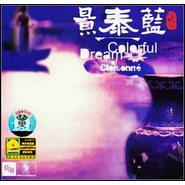

景泰蓝Colorful Dream Of Cloisonne 
============================

|  |  |
| :--: | :-- |
| [ 景泰蓝Colorful Dream Of Cloisonne ](https://emumo.xiami.com/album/498400) | **艺人**: [李志辉](../index.md) **语种**: 国语 **唱片公司**: 千思唱片 **发行时间**: 2004年02月26日 **专辑类别**: 录音室专辑 **专辑风格**:  **播放数**: 114234 **收藏数**: 670 **评论数**: 40  |

## 简介

李志辉《Colorful Dream Of Cloisonne 景泰蓝》，竹笛、胡琴在电子乐中轻盈共舞，纯粹的色泽，珐琅丝般的精巧，投影古典东方文化，描画江南千年不变的优雅与淡定。用音乐的色彩与线条，勾勒优雅与精致的幻像，一种对古典东方文化的迷恋。融汇电子、西洋、民族、古典、现代等多样曲风，精彩原创，唯美动听，采撷中华传统文化元素，东方传奇，尽收耳鼓。千思唱片，为你带来最具创意和品质的音乐盛宴。  
  
曲目详解：  
  
01 景泰蓝：好似蓝盈盈的湖水在心中荡漾，倒映着金黄，银色的枝干和一个个色彩斑斓的传说。  
  
02 乌棚船：划过石拱桥，绕过荷塘，邂逅河边洗衣的姑娘。载着浪漫的小舟，游弋在江南水乡。  
  
03 小镇的平淡日子：炊烟在轻轻摇曳，阳光洒落砖瓦的屋檐，街巷清清，人影涣散，怡然安闲的景致恍若桃源。  
  
04 竹林奏鸣曲：微风吹来绿色的梦幻，弥漫在乡村的山野。顺着竹的声音，来到一个清涩、空洞、优雅的世界。  
  
05 生活的痕迹：轻轻走过，却有深深的记忆，留在斑驳的老屋，刻在故乡的心里。  
  
06 候鸟经过的村庄：理想总是在前方，漂泊是唯一的归宿。一次次路过，却不曾停留，宛如人生经过的很多风景，美丽却不能永远拥有。  
  
07 岁月：时光转变，岁月流年，多少世事被塑造，多少过往成云烟。一切都在冥冥中继续着力量的延伸，无法抗拒。  
  
08 玉镯的故事：唯美的爱情遐想中，舞动着玉臂柔腰，袅袅婷婷的影子。古典的浪漫，总是令人心旌荡漾。  
  
09 桃花扇：人间四月天，才子佳人的浪漫故事，开满了窗外的桃树。  
  
10 山谷：将行囊丢弃于身后的都市，只身走进幻想中的天堂，释放、穿越，寻找梦想。  
 

## 曲目

## 评论

|  |  |  |  |
| :-- | :-- | :-- | :-- |
|  [虾米用户](https://emumo.xiami.com/u/377130499)  2019-06-11 05:52 赞(0) 踩(0) | 
岁月  山谷
 |
|  [虾米用户](https://emumo.xiami.com/u/4876323) 文章 2019-02-06 08:19 赞(0) 踩(0) | 
好听
 |
|  [虾米用户](https://emumo.xiami.com/u/379546932) 谁不是人间惆怅客 2018-10-05 21:47 赞(0) 踩(0) | 
描述的都是江南风物
 |
|  [虾米用户](https://emumo.xiami.com/u/32980856)  2016-12-23 15:11 赞(0) 踩(0) | 
适合作为背景音乐
 |
|  [虾米用户](https://emumo.xiami.com/u/45434541)  2016-10-18 06:46 赞(0) 踩(0) | 
！！！
 |
|  [虾米用户](https://emumo.xiami.com/u/9943562) 多数盗版碟在02年发行 2015-12-06 23:14 赞(0) 踩(0) | 
另一版本专辑名：江南 新民乐发烧天碟制作：香港千思唱片有限公司发行公司：天津泰达音像发行公司发行日期：2004/01介绍本碟的音乐，旋律、美感、细节、动态；在写意氛围中，自然、人与音乐，彼此相依相和，让听者从素朴高亢的乐音的情境里得到生命的滋养。本产品千思唱片，泰达音像独步Hi-Fi原创音乐品牌，凝练华夏传统文化与新时代审美的非凡境界，以超常规的音乐理念，顶级录音水准，奉献的高品质New Age精品发烧大碟，带你感受真正的属于东方华族的血脉悸动，体验听觉艺术的震撼冲击。这个系列共有《秦川:新民乐发烧天碟》《江南:新民乐发烧天碟》《吉祥的白云:马头琴发烧天碟》《帝宫:新民乐发烧天碟》《阿拉木汗:热瓦甫发烧天碟》《阿瓦尔古丽:弹布尔发烧天碟》《色楞格河:马头琴发烧天碟》《补天:新民乐发烧天碟》捌张.
 |
|  [虾米用户](https://emumo.xiami.com/u/19204214)  2015-08-17 04:15 赞(0) 踩(0) | 
古风,纯音乐,
 |
|  [虾米用户](https://emumo.xiami.com/u/3044235) 东方道悟 2014-05-19 17:47 赞(0) 踩(0) | 
心生欢喜
 |
|  [虾米用户](https://emumo.xiami.com/u/34486687)  2014-05-15 10:24 赞(0) 踩(0) | 
景泰蓝
 |
|  [虾米用户](https://emumo.xiami.com/u/7595724)  2014-04-07 13:09 赞(0) 踩(0) | 
和公案完全不同 传统器乐太多
 |
|  [虾米用户](https://emumo.xiami.com/u/3912775)  2014-03-23 13:36 赞(0) 踩(0) | 
好！
 |
|  [虾米用户](https://emumo.xiami.com/u/5532351) 大千世界音乐给你带来享受 2014-03-11 14:42 赞(0) 踩(0) | 
李志辉,景泰蓝,古风,纯音乐,
 |
|  [虾米用户](https://emumo.xiami.com/u/5532351) 大千世界音乐给你带来享受 2014-03-11 14:41 赞(0) 踩(0) | 
古风十足喜欢
 |
|  [虾米用户](https://emumo.xiami.com/u/17007739)   2014-03-06 18:26 赞(0) 踩(0) | 
喜欢
 |
|  [虾米用户](https://emumo.xiami.com/u/18773012) 卫道东升 2013-12-31 19:35 赞(0) 踩(0) | 
非常喜欢
 |
|  [虾米用户](https://emumo.xiami.com/u/18773012) 卫道东升 2013-12-26 14:14 赞(0) 踩(0) | 
非常喜欢
 |
|  [虾米用户](https://emumo.xiami.com/u/27980455)  2013-11-22 09:33 赞(0) 踩(0) | 
喜欢  无法形容的美
 |
|  [虾米用户](https://emumo.xiami.com/u/10517016)  2013-08-22 14:34 赞(0) 踩(0) | 
李志辉,景泰蓝,古风,纯音乐,
 |
|  [虾米用户](https://emumo.xiami.com/u/9599912)  2013-08-20 16:34 赞(0) 踩(0) | 
李志辉《Colorful Dream Of Cloisonne 景泰蓝》，竹笛、胡琴在电子乐中轻盈共舞，纯粹的色泽，珐琅丝般的精巧，投影古典东方文化，描画江南千年不变的优雅与淡定。用音乐的色彩与线条，勾勒优雅与精致的幻像，一种对古典东方文化的迷恋。
 |
|  [虾米用户](https://emumo.xiami.com/u/14280119)  2013-04-29 21:22 赞(0) 踩(0) | 
天籁
 |
|  [虾米用户](https://emumo.xiami.com/u/13929207) 努力赚钱  保护媳妇 2013-04-12 14:46 赞(0) 踩(0) | 
喜欢这种感觉
 |
|  [虾米用户](https://emumo.xiami.com/u/13283342) 随缘～（清  静  和 ... 2013-03-29 00:04 赞(0) 踩(0) | 
好
 |
|  [虾米用户](https://emumo.xiami.com/u/9543598)  2013-03-09 01:39 赞(0) 踩(0) | 
李志辉,天籁极品大师,景泰蓝
 |
|  [虾米用户](https://emumo.xiami.com/u/10951828) 琴心剑魄 2013-02-26 15:09 赞(0) 踩(0) | 
千言万语浓缩与音符之间，使音符有了灵性，它记录了历史，记录了湖光山色，记录了喜怒哀乐。。。。。。
 |
|  [虾米用户](https://emumo.xiami.com/u/13246188) 每逢佳节胖几斤…… 2013-02-26 10:17 赞(0) 踩(0) | 
好听！
 |
|  [虾米用户](https://emumo.xiami.com/u/6744967) 音乐无国界，你爱我也爱。 2013-02-18 14:05 赞(0) 踩(0) | 
喜欢 谢谢
 |
|  [虾米用户](https://emumo.xiami.com/u/12063345) 我还没想好要写什么... 2013-02-11 16:00 赞(0) 踩(0) | 
1
 |
|  [虾米用户](https://emumo.xiami.com/u/5714668)  2012-12-13 23:23 赞(0) 踩(0) | 
自然的声音。
 |
|  [虾米用户](https://emumo.xiami.com/u/8640769) 我还没想好要写什么... 2012-09-01 02:58 赞(0) 踩(0) | 
桃花扇，很惆怅
 |
|  [虾米用户](https://emumo.xiami.com/u/9823763) 但行好事，莫问前程…… 2012-08-31 20:27 赞(0) 踩(0) | 
好好好
 |
|  [虾米用户](https://emumo.xiami.com/u/8018643)  2012-08-01 18:38 赞(0) 踩(0) | 
べ_べ
 |
|  [虾米用户](https://emumo.xiami.com/u/9856512)  2012-07-18 08:19 赞(0) 踩(0) | 
国内一流
 |
|  [虾米用户](https://emumo.xiami.com/u/6291602) 敬天爱人 2012-04-09 22:32 赞(0) 踩(0) | 
电子乐，加了反而不好 听起来没感觉呢
 |
|  [虾米用户](https://emumo.xiami.com/u/3024528) 暂无签名~ 2012-03-31 22:08 赞(0) 踩(0) | 
收留先！可以以后听。
 |
|  [虾米用户](https://emumo.xiami.com/u/7674230) 微笑，眉间有光。 2012-03-15 09:52 赞(0) 踩(0) | 
我喜欢倒回来听
 |
|  [虾米用户](https://emumo.xiami.com/u/7547702)  2012-03-11 11:37 赞(0) 踩(0) | 
竹笛、胡琴在电子乐中轻盈共舞，纯粹的色泽，珐琅丝般的精巧，投影古典东方文化，描画江南千年不变的优雅与淡定。
 |
| ⇒ |  [虾米用户](https://emumo.xiami.com/u/50392217)  2015-05-28 20:17 赞(0) 踩(0) | 
你好：自豪发表论文说聪明人会美观感人体内涵标语
 |
|  [虾米用户](https://emumo.xiami.com/u/3452075)  2012-03-08 09:29 赞(0) 踩(0) | 
New Music Age...东方江南古韵
 |
|  [虾米用户](https://emumo.xiami.com/u/6248414) 无能者无所求，饱食而遨游... 2012-03-07 22:38 赞(0) 踩(0) | 
心又平静下来了
 |
|  [虾米用户](https://emumo.xiami.com/u/7867049)  2012-03-07 09:02 赞(0) 踩(0) | 
精品
 |
