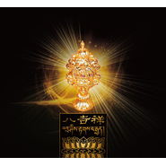
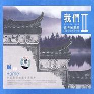
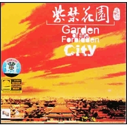
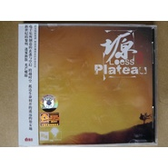

李志辉
============================

|  |  |
| :--: | :-- |
| [ 李志辉](https://i.xiami.com/lzhmusic) | **地区**: China 中国大陆 **风格**: 轻音乐 Easy Listening, 新世纪音乐 New Age, 世界音乐 World Music, 中国风 China-Wave, 民族融合新世纪 Ethnic Fusion New Age **播放数**: 27301389 **粉丝数**: 18213 **评论数**: 610  |

## 档案

小档案 
中   文   名：李志辉 
外   文   名：  Li Zhihui 
国        籍：中国 
民        族：汉 
出生日期：  1972  年  4  月  25  日 
职        业：作曲家、演奏家、音乐家 
主要成就：嘎纳国际音乐节原创音乐制作奖 
代表作品：《紫禁花园》《水墨丹青凤凰城》《平遥古韵》《溪行桃花源》 
居   住   地：北京 
血        型：  O  型 
星        座：金牛座 
代表专辑：《我们远去的家园》 
业余爱好：骑行 
人物简介 
李志辉，  NEW AGE  作曲家、环保音乐家、地理音乐家、音乐治愈系大师、《带你的耳朵去旅行》音乐会创始人。唯一一位在世界新世纪音乐家排名第六位的中国人。他是一位具有独特气质的音乐家，极富艺术天赋与创作才华，对音乐的热忱执着与生俱来，欣赏过他的音乐，用过耳不忘来形容最为恰当。他的音乐中总是升腾着一丝仙气，让你感觉那飘逸脱俗。融入了民族丝竹的东方气质与西方柔和温暖的电子元素，浑然天成，丝丝入扣。完美的体现了中国古典音乐的风骨和现代音乐的动感。与萨顶顶、林海、朱哲琴并称为中国四大新世纪音乐家。 
风格 
李志辉的音乐唯美，清新，像落入荷叶的一滴新露，婉转，优雅，又不失活泼，灵动。旋律绕梁三日，韵味十足。有着深刻的感染力，让你不知不觉就融入到了他营造的或喜悦或感怀的心灵家园。聆听之后能使你的心灵挣脱压力与束缚，回归到平和，安静和喜悦。常常在想，是怎样的脱俗的心灵，才能创作出如此动人的天籁之音？ 
李志辉善用现代音乐的表达方式，挖掘中国五千年深厚文化。将儒释道融会贯通，提炼精髓。他的音乐灵感，全部来自于古老中国悠久的历史文化与人文情怀。犹如浓墨淡彩的水墨画徐徐的展开，娓娓道来诉说着自己对大自然的崇敬和对中国文化的眷恋情愫。 
李志辉还在中国首创了“地理音乐”概念，地理音乐是一个巧合，本来想的是多挖掘一些中国文化的内容，因为中国本就是地大物博的，结果就成了地理音乐的系列。其实，地理音乐应该是一个更具体的分支，我的追求还是心灵音乐，我的地理概念不只在于地球的地理，甚至宇宙的地理，空间的地理，乃至思维的地理，这些都是未来我想表达的内容。多年间他游历于中国的大江南北，忘却尘世浮华，一门深入静心创作，潜心深入哲思，不断启发心灵内在的智慧。非常感谢中国多元文化赋予自己源源不断创作灵感。希望自己能在音乐当中修行，他一直试图用音乐为听者找寻心灵的归宿。 
作品 
李志辉的个人音乐专辑发行了  22  张之多，《我们远去的家园》《我们远去的家园  2  》《八吉祥》《吟唱山水间》《带你的耳朵去旅行音乐会  DVD  》《和雅音》《江南》《帝宫》《补天》《秦川》《牧游》《女娲》《天边的草原》《景泰蓝》《紫禁花园》《塬》《青城之山》《恋爱之城》《夜舞精灵》《私房音乐集》等一大批高品质音乐发烧唱片，他是继雅尼、喜多郎之后的新生代  NEWAGE  音乐家。 
他的专辑发行遍及全球，深受好评，销量不俗，首首精品，不胜枚举。其中更有大家耳熟能详的曲目，如《紫禁花园》、《水墨丹青凤凰城》、《溪行桃花源》、《青瓦白墙恋徽州》《平遥古韵》《丝路花雨锁泉州》等。   个别单曲在新浪乐库点击量达百万以上，网络搜索专辑及曲目名称，热情的赞誉比比皆是。 
2011  年他为国际道教论坛开幕式，独创了一台突破传统模式的仙乐新世纪“尊道贵德，和谐共生”，整台音乐飘逸脱俗，大气滂沱，唯美婉转，使在场观众无不被音乐的魅力深深折服，反响热烈！ 
《我们远去的家园》获  2008  全球新世纪音乐专辑年度十大最受欢迎亚洲专辑，《吟唱山水间》获  SEE2SAY2009  最受欢迎亚洲新世纪音乐专辑，在海内外华人音乐爱好者中享有盛誉。   他的音乐专辑远销欧美、东南亚及港澳台地区。 
使他成为国际上最具影响力的中国新世纪音乐家，广受追捧！ 
大型活动作曲 
2013  年  10  月，受邀担任在福建海峡体育场举办的，“观音法雨，洒净泉州”万人佛教音乐会的音乐总监， 
创作了《步步莲花》《香赞》《云水禅心》《民生大爱》《观  .  音》《普庵咒》等唯美、天籁的佛教原创音乐，受到各界人士一致好评与赞赏！ 
2013  年  4  月，洋湖湿地举办李志辉新世纪地理音乐会，除经典曲目的演出外，还增加了原创作品：《湖天影月》《大美洋湖》《心灵之翼》的现场演绎，纯净的心灵音乐，令观众陶醉其中，现场反响热烈！ 
2012  李志辉携乐团出演  2012  湖南国际旅游节，演奏《紫禁花园》《水墨丹青凤凰城》等知名曲目。深受观众喜爱。 
2012  担任湖北襄阳诸葛亮文化旅游节艺术总监。特别创作了《梧桐细雨》、《盛情之约》、《襄阳行》等兼具民族风韵和国际风范的新世纪地理音乐。此次，李志辉将组委会从韩国寻找到的，失传千年的李白《襄阳歌》，进行挖掘整理及创作，由黑鸭子及八只眼共同演绎。作品一经出炉，顿觉惊艳，大气逍遥、独具风流。 
为齐豫、陈楚生改编制作歌曲《梦襄阳》。 
为法国歌手金小鱼、王铮亮创作歌曲《襄阳印象  images  》 
2011  受组委会之邀，任南岳国际道教论坛开幕式音乐总监、总作曲。 
为毛阿敏打造开幕式主题曲《尊道贵德》。 
为齐豫、王铮亮创作歌曲《仙山谣》。 
受主办方特别邀请，由李志辉亲自登台演奏本人原创曲目《静月思》。 
电影及电视剧音乐 
2011  为张纪中年度文化大戏《菊花醉》作曲同时为谭晶创作主题曲《菊花醉》。 
2011  年电影《美丽的故事》创作原创音乐。 
2010  年电影《姻差缘错》创作原创音乐。 
2009  年电影《老藤的绑架事件》）创作原创音乐。 
2008  年电影《刘民的  DV  生活》创作原创音乐（刘伟主演）。 
2007  年连续剧《秦淮悲歌》创作主题歌曲（伊能静、魏子、曾黎、王思懿等主演）。 
2007  年连续剧《一桶江湖》创作原创音乐。 
2007  年电影《蝶舞青山》创作原创音乐（本剧获甘肃电影锦鸡奖最佳数字电影奖）。 
2004  年电影《郑板桥上任》创作原创音乐（导演：孙树培台湾）。 
2003  年　电视连续剧《西部燃情》创作原创音乐。 
2001  年　电视连续剧《妻妾成群》创作原创音乐（姚鲁、刘佳主演）。 
1999  年　电影《哪朵云彩没有雨》创作原创音乐。 
1999  年　电影《一介平民》创作原创音乐（韩童生、买红妹主演）。

## 专辑

| 名称 | 语种 | 唱片公司 | 发行时间 | 专辑类别 | 专辑风格 |
| :--: | :-- | :-- | :-- | :-- | :-- |
| [ 抱抱你 hug you李志辉音乐作品](./albums/2105958292.md) | 国语 | 独立发行 | 2019年03月18日 | 录音室专辑 | 轻音乐流行 Light Pop, 世界音乐 World Music, 新世纪音乐 New Age |
| [ 和雅音李志辉作品](./albums/2102718925.md) | 国语 | 独立发行 | 2017年03月18日 | 录音室专辑 | 新世纪音乐 New Age, 世界音乐 World Music, 轻音乐 Easy Listening |
| [ 李志辉音乐会现场版精选集](./albums/2102678004.md) | 国语 | 独立发行 | 2016年08月08日 | 现场专辑 |  |
| [ 李志辉作品精选集](./albums/1075079532.md) | 国语 | 中唱深圳 | 2013年05月01日 | 精选集 | 国语流行 Mandarin Pop |
| [ 八吉祥](./albums/498401.md) | 国语 | 千思唱片 | 2010年02月26日 | 录音室专辑 | 佛教音乐 Buddhist Music |
| [ 我们远去的家园 IIOur Gone Home II](./albums/368986.md) | 国语 | 中国科学文化音像出版社 | 2008年06月11日 | 合集, 杂锦 | 新世纪音乐 New Age |
| [ 吟唱山水间](./albums/343709.md) | 国语 | 广州集韵堂文化传播有限公司 | 2005年11月22日 | 录音室专辑 | 轻音乐 Easy Listening |
| [ 我们远去的家园Home That We Far Go To](./albums/368985.md) | 国语 | 中国科学文化音像出版社 | 2005年01月01日 | 录音室专辑 | 新世纪音乐 New Age |
| [ 紫禁花园](./albums/430710.md) | 国语 | 千思唱片 | 2005年01月01日 | 录音室专辑 | 轻音乐 Easy Listening |
| [ 天边的草原](./albums/469984.md) | 国语 | 千思唱片 | 2004年04月01日 | 录音室专辑 | 轻音乐 Easy Listening |
| [ 塬秦川 新民乐发烧天碟](./albums/266000.md) | 其他 | 千思唱片 | 2004年04月01日 | 录音室专辑 |  |
| [ 景泰蓝Colorful Dream Of Cloisonne ](./albums/498400.md) | 国语 | 千思唱片 | 2004年02月26日 | 录音室专辑 |  |
| [ 补天](./albums/430217.md) | 国语 | 千思唱片 | 2004年01月01日 | 录音室专辑 | 轻音乐 Easy Listening |

## 评论

|  |  |  |
| :-- | :-- | :-- |
|  [虾米用户](https://emumo.xiami.com/u/276821209)  2021-01-06 17:27 赞(0) 踩(0) | 
我和李老师同名，曲子又是我喜欢的风格，真是有缘
 |
|  [虾米用户](https://emumo.xiami.com/u/441870734) 偷得浮生半日闲 2020-12-27 21:53 赞(0) 踩(0) | 
音乐与灵魂同在，同飞翔，仿佛飘在广阔地草原&amp;hellip;&amp;hellip;
 |
|  [虾米用户](https://emumo.xiami.com/u/269372347)  2020-06-25 16:58 赞(0) 踩(0) | 
大师
 |
|  [虾米用户](https://emumo.xiami.com/u/403469400)  2020-05-05 10:47 赞(0) 踩(0) | 
声音响彻原野
 |
|  [虾米用户](https://emumo.xiami.com/u/276944698) 不要自我设限..... 2020-04-02 14:43 赞(1) 踩(0) | 

 |
|  [虾米用户](https://emumo.xiami.com/u/288338640)  2020-03-31 11:32 赞(0) 踩(0) | 
为什么全部要VIP？？？？我心疼啊
 |
|  [虾米用户](https://emumo.xiami.com/u/358372285) 情愿一个人 2020-03-21 22:35 赞(0) 踩(0) | 
最喜欢李志辉老师的水墨兰亭
 |
|  [虾米用户](https://emumo.xiami.com/u/434152246) 聪明少一些大智慧多一些，... 2020-02-14 19:32 赞(0) 踩(0) | 

 |
|  [虾米用户](https://emumo.xiami.com/u/43213713) 音乐，意境和治愈。探索者... 2020-02-09 14:34 赞(0) 踩(0) | 
国外很多做中国新世纪的其实还是“神秘的东方”那种，所以大多也是做西藏风格的
 |
|  [虾米用户](https://emumo.xiami.com/u/437258928) 我与蓝山咖啡结婚，禁止加... 2020-01-28 12:11 赞(0) 踩(0) | 
  
 |
|  [虾米用户](https://emumo.xiami.com/u/430947610) 无始劫中谁是我，此世今生... 2019-11-21 14:10 赞(2) 踩(0) | 
从第一次听到《一花一世界》，就有想要流泪的感觉，仿佛回到了累生前世，刻骨铭心的过往，无可奈何的抉择，无法言表的伤痛……，历经千年，历历在目。
 |
|  [虾米用户](https://emumo.xiami.com/u/41967151) 恐青山笑我今非昨 2019-07-04 20:29 赞(2) 踩(0) | 
听了这么多年的音乐，才记得原来他叫李志辉
 |
|  [虾米用户](https://emumo.xiami.com/u/275213435)  2019-06-11 20:38 赞(1) 踩(0) | 
希望他们平安度过
 |
|  [虾米用户](https://emumo.xiami.com/u/324879742)   2019-05-01 17:14 赞(0) 踩(0) | 
.
 |
|  [虾米用户](https://emumo.xiami.com/u/325374787)  2019-04-23 22:37 赞(1) 踩(0) | 
好
 |
|  [虾米用户](https://emumo.xiami.com/u/13933838)  2019-03-24 07:58 赞(1) 踩(0) | 
   
 |
|  [虾米用户](https://emumo.xiami.com/u/130946166)   2019-02-25 23:21 赞(2) 踩(0) | 
前奏有點西遊記插曲風，悅耳撒
 |
|  [虾米用户](https://emumo.xiami.com/u/676707) 杀死橙先生 2019-02-12 16:45 赞(0) 踩(0) | 
这人真像毛纳那位玩行为艺术的前任呢。
 |
|  [虾米用户](https://emumo.xiami.com/u/105451946) 亲们网易云见昵称：摩羯天... 2019-02-09 13:01 赞(1) 踩(0) | 

 |
|  [虾米用户](https://emumo.xiami.com/u/330900828) 高舉一面五星紅旗在蝦米！ 2018-12-30 07:56 赞(1) 踩(0) | 
 
 |
|  [虾米用户](https://emumo.xiami.com/u/6459825)  2018-12-24 01:19 赞(2) 踩(0) | 

 |
|  [虾米用户](https://emumo.xiami.com/u/41671303) 我还没想好要写什么... 2018-10-27 20:18 赞(2) 踩(0) | 
直击心灵
 |
|  [虾米用户](https://emumo.xiami.com/u/31666296)  2018-09-21 10:02 赞(1) 踩(0) | 
让身心愉悦，超越一切！
 |
|  [虾米用户](https://emumo.xiami.com/u/342916430) མ་གཞི་ས་རྡུལ... 2018-08-29 04:41 赞(0) 踩(0) | 
李老师克罗地亚那场音乐会好棒的，非常精彩   
 |
|  [虾米用户](https://emumo.xiami.com/u/354229178)  2018-07-13 19:04 赞(0) 踩(0) | 
好听！
 |
|  [虾米用户](https://emumo.xiami.com/u/43492923) 行到水穷我才开始害怕，夕... 2018-07-07 16:38 赞(0) 踩(0) | 
◇
 |
|  [虾米用户](https://emumo.xiami.com/u/8911095)   2018-07-04 11:01 赞(0) 踩(0) | 
把悲伤留给自己？？
 |
|  [虾米用户](https://emumo.xiami.com/u/44161162) 音乐人生 2018-06-06 23:49 赞(1) 踩(0) | 
不知道是谁评论的把萨顶顶，朱哲琴和林海，李志辉新世纪四大音乐家！这评论，哎！
 |
| ⇒ |  [虾米用户](https://emumo.xiami.com/u/87827600) 山水两相忘，日月无瓜葛；... 2020-02-22 17:54 赞(0) 踩(0) | 
<q><b>说：</b></q>
 |
| ⇒ |  [虾米用户](https://emumo.xiami.com/u/87827600) 山水两相忘，日月无瓜葛；... 2020-02-22 17:56 赞(0) 踩(0) | 
<q><b>说：</b></q>
 |
| ⇒ |  [虾米用户](https://emumo.xiami.com/u/87827600) 山水两相忘，日月无瓜葛；... 2020-02-22 18:03 赞(0) 踩(0) | 
你在哪看来的？何训田老师给朱哲琴写过歌？也许人萨顶顶老师给谁写过歌词呢。。。这要是写歌词不难，加上作曲就没那么容易了，如果写的合辙押韵，自然流畅就更难了，若是写出精妙被后人记住才能被人钦佩，故而被大众尊为人民音乐家吧！
 |
| ⇒ |  [虾米用户](https://emumo.xiami.com/u/8192902)   2020-02-22 18:48 赞(0) 踩(0) | 
<q><b>绽放的蔷薇0076说：</b></q>
 |
| ⇒ |  [虾米用户](https://emumo.xiami.com/u/87827600) 山水两相忘，日月无瓜葛；... 2020-02-22 18:53 赞(0) 踩(0) | 
<q><b>Yi Jing说：</b></q>
 |
|  [虾米用户](https://emumo.xiami.com/u/293692544) 你敢给我说话吗？我咬你 2018-05-09 17:37 赞(1) 踩(0) | 
haot
 |
|  [虾米用户](https://emumo.xiami.com/u/352380030)  2018-03-02 13:10 赞(1) 踩(0) | 
整体感觉像Chris Spheeris 的《爱神》那张专辑
 |
|  [虾米用户](https://emumo.xiami.com/u/352380030)  2018-03-02 12:58 赞(3) 踩(0) | 
这是我听到的大陆做传统音乐做的最好的,加油!
 |
|  [虾米用户](https://emumo.xiami.com/u/218960917) 只要光还在，黑暗永不灭。 2018-02-04 12:35 赞(4) 踩(0) | 
辉哥，你的音乐做的真棒！
 |
|  [虾米用户](https://emumo.xiami.com/u/346754260)  2018-01-29 19:21 赞(5) 踩(0) | 
班得瑞的音乐本身没有离开西方的基督教精神，福音主义，用曲子象征出天国，彼岸世界，相比于班得瑞，我更喜欢这位大师的音乐，浓浓的中国风，继承了中国自古以来的山水田园风格，现实主义精神，关注当下，在音乐中放飞心灵。
 |
|  [虾米用户](https://emumo.xiami.com/u/5569158)   2018-01-26 14:59 赞(2) 踩(0) | 
中国出个 轻音乐人才就这么难么&amp;middot;&amp;middot;&amp;middot;
 |
|  [虾米用户](https://emumo.xiami.com/u/323382005) 愿得一心人，白首不相离~ 2018-01-10 09:53 赞(6) 踩(0) | 
大叔，你怎么可以把古典曲子做的这么美  
 |
|  [虾米用户](https://emumo.xiami.com/u/267202329) 凯尔特的灵性印第安的苍凉... 2017-11-08 19:06 赞(4) 踩(0) | 
一花一世界，和雅音，喜欢
 |
| ⇒ |  [虾米用户](https://emumo.xiami.com/u/346754260)  2018-01-28 19:45 赞(0) 踩(0) | 
水墨兰亭也很经典
 |
|  [虾米用户](https://emumo.xiami.com/u/415914) lonely hero 2017-10-30 10:10 赞(1) 踩(0) | 
静心 平和看世界
 |
|  [虾米用户](https://emumo.xiami.com/u/2494430) Summer 2017-10-30 10:00 赞(3) 踩(0) | 
一直抱怨中国音乐不如欧美的，听听这个改观很多，不是我们做不出好音乐，是我们逐渐被同化，抄袭山寨云云...只要坚持自己的风格，相信总有一天会震撼世界！可惜这现在的制度下，哪天什么时候才会到来？
 |
|  [虾米用户](https://emumo.xiami.com/u/74970924)  2017-10-28 00:41 赞(6) 踩(0) | 
缘溪行，忘路之远近。忽逢桃花林，夹岸数百步，中无杂草，芳草鲜美，落英缤纷，渔人甚异之；复前行，欲穷其林，，，陶醉之——溪行桃花源！
 |
|  [虾米用户](https://emumo.xiami.com/u/836333) 冷光微逝 2017-10-27 23:31 赞(4) 踩(0) | 
国内的~~很是有很多的优秀的音乐人的~~我个人比较喜欢林海~~三毛~~谭盾~~尤其是《大明宫词》的配乐，相当的优秀！日本也有很多优秀的音乐人，需要我们去学习的地方，但我们自身也有我们的优秀，取长补短才是硬道理！
 |
|  [虾米用户](https://emumo.xiami.com/u/33179)  2017-10-27 23:30 赞(1) 踩(0) | 
国乐不错，最喜欢水墨丹青和平遥古韵两首
 |
|  [虾米用户](https://emumo.xiami.com/u/2669998) New Porsche ... 2017-10-27 04:30 赞(1) 踩(0) | 
李志辉
 |
|  [虾米用户](https://emumo.xiami.com/u/103539854) 星河不可曙，野泽不可渡。 2017-10-26 23:17 赞(2) 踩(0) | 
很美
 |
|  [虾米用户](https://emumo.xiami.com/u/257581452)  2017-10-22 10:52 赞(2) 踩(0) | 
中国风音乐大师
 |
|  [虾米用户](https://emumo.xiami.com/u/184217896) 在路上。 2017-09-08 11:13 赞(4) 踩(0) | 
他的音乐整体来说不错，作为中国风音乐，加入架子鼓会让我有些反感，刚开始听觉得是一股清流，后边觉得恶心。
 |
|  [虾米用户](https://emumo.xiami.com/u/208108958) 我还没想好要写什么... 2017-09-02 15:33 赞(3) 踩(0) | 
李志辉是我最喜欢的本土曲作家。不比许多音乐app评论上吹嘘的日本作曲编曲制作如何如何&amp;ldquo;完爆&amp;rdquo;中国作曲家的差。许多中国人骨子里踩自己捧他人不给予国产制作信心的做法真是令人失望。
 |
|  [虾米用户](https://emumo.xiami.com/u/208108958) 我还没想好要写什么... 2017-09-02 15:13 赞(1) 踩(0) | 
看到评论真是悲哀啊
 |
|  [虾米用户](https://emumo.xiami.com/u/319419372)  2017-08-15 23:58 赞(2) 踩(0) | 
真动情啊！闭眼用心倾听心灵享受
 |
|  [虾米用户](https://emumo.xiami.com/u/319419372)  2017-08-15 23:56 赞(1) 踩(0) | 
我们的国粹
 |
|  [虾米用户](https://emumo.xiami.com/u/291756439)  2017-08-04 09:43 赞(1) 踩(0) | 
很喜欢他的新世纪音乐！
 |
|  [虾米用户](https://emumo.xiami.com/u/313858036)  2017-07-21 15:31 赞(1) 踩(0) | 
好听
 |
|  [虾米用户](https://emumo.xiami.com/u/8192902)   2017-07-17 14:33 赞(3) 踩(0) | 
这样说吧，8年前在51影音群我就推荐他。现在听回来还是神采依旧。纵然有些他的曲有套曲之悬，那他是不是全套？融合得怎么样？你能作得出来吗？这样的作曲在国内外很常见。只要不是全套偶尔用一小段是可以的，这是作曲家采风的基本根源。还有什么萨顶顶、朱哲琴中国四大新世纪音乐家？这样给音乐人士一看就笑掉大牙！在New Age世界里没有萨顶顶、朱哲琴，这都是些流行音乐歌手，何来新世纪？这都是媒体商家舆论所冠冕的词。萨顶顶是有几首梵音但又能如何。我讨厌对音乐不严谨，不负责任的人，信口开河。
 |
|  [虾米用户](https://emumo.xiami.com/u/312802400)  2017-07-17 09:28 赞(1) 踩(0) | 
喜欢中国民乐!
 |
|  [虾米用户](https://emumo.xiami.com/u/250988824)  2017-07-13 09:53 赞(3) 踩(0) | 
中国古风，有水墨山水的感觉
 |
|  [虾米用户](https://emumo.xiami.com/u/282931347)  2017-07-12 08:47 赞(1) 踩(0) | 
喜欢他的音乐风格
 |
|  [虾米用户](https://emumo.xiami.com/u/301517010)  2017-06-03 15:16 赞(0) 踩(0) | 
中国风 古风 天籁极品
 |
|  [虾米用户](https://emumo.xiami.com/u/20412534)  2017-05-12 14:05 赞(2) 踩(0) | 
小桥流水人家 ， 太好听了，喜欢这牛叉的旋律，太好听了
 |
|  [虾米用户](https://emumo.xiami.com/u/72666568)  2017-05-11 20:51 赞(0) 踩(0) | 
蛮好的
 |
|  [虾米用户](https://emumo.xiami.com/u/278667953)  2017-04-18 12:41 赞(0) 踩(0) | 
好音，好乐，支持
 |
|  [虾米用户](https://emumo.xiami.com/u/204709613)   2017-04-06 19:58 赞(0) 踩(0) | 
很喜欢李老师的音乐作品
 |
|  [虾米用户](https://emumo.xiami.com/u/61977818)  2017-04-05 21:37 赞(0) 踩(0) | 
喜欢李大师8年了~
 |
|  [虾米用户](https://emumo.xiami.com/u/278132055) 快乐都雷同，悲伤却千万种... 2017-03-24 21:34 赞(0) 踩(0) | 
我更喜欢《水墨丹青凤凰城》！
 |
|  [虾米用户](https://emumo.xiami.com/u/281598378)  2017-03-19 11:34 赞(0) 踩(0) | 
原创，优美，贴近自然
 |
|  [虾米用户](https://emumo.xiami.com/u/50460475)  2017-03-16 14:25 赞(0) 踩(0) | 
啥时候还能来洋湖湿地公园做音乐
 |
|  [虾米用户](https://emumo.xiami.com/u/276698550)  2017-03-15 17:23 赞(0) 踩(0) | 
李志辉
 |
|  [虾米用户](https://emumo.xiami.com/u/279826) 有音乐，一个人，整个世界 2017-03-06 08:27 赞(1) 踩(0) | 
简介中的&amp;ldquo;唯一一位在世界新世纪音乐家排名第六位的中国人&amp;rdquo;，怎么听来有语病的感觉啊
 |
| ⇒ |  [虾米用户](https://emumo.xiami.com/u/269018901)  2017-04-15 19:51 赞(0) 踩(0) | 
林海也是唯一一位排名第X的，没毛病
 |
|  [虾米用户](https://emumo.xiami.com/u/30342924)  2017-03-05 11:39 赞(0) 踩(0) | 
******
 |
|  [虾米用户](https://emumo.xiami.com/u/175838220)  2017-02-27 00:05 赞(0) 踩(0) | 
中国需要更多这样的音乐人来缩短与世界尤其是日本的差距
 |
|  [虾米用户](https://emumo.xiami.com/u/261059400)  2017-02-01 22:54 赞(0) 踩(0) | 
rll0
 |
|  [虾米用户](https://emumo.xiami.com/u/261059400)  2017-02-01 22:54 赞(0) 踩(0) | 
rll0
 |
|  [虾米用户](https://emumo.xiami.com/u/54571275)  2017-01-29 20:27 赞(0) 踩(0) | 
1546546546
 |
|  [虾米用户](https://emumo.xiami.com/u/260545589)  2017-01-09 14:53 赞(242) 踩(0) | 
我刚入驻了虾米音乐人，欢迎大家来我的个人主页，收听我的最新音乐
 |
| ⇒ |  [虾米用户](https://emumo.xiami.com/u/4126226)  2017-01-18 01:18 赞(0) 踩(0) | 
好些听不了，可惜
 |
| ⇒ |  [虾米用户](https://emumo.xiami.com/u/70094244)  2017-05-24 14:23 赞(0) 踩(0) | 
额嗯
 |
| ⇒ |  [虾米用户](https://emumo.xiami.com/u/13581072) 行起于少年之时。 2017-06-03 20:21 赞(0) 踩(0) | 
很喜欢大师的曲子
 |
| ⇒ |  [虾米用户](https://emumo.xiami.com/u/278767116) 此情可待成追忆，只是当时... 2017-06-17 23:25 赞(0) 踩(0) | 
希望国家能多一点您这样的大师
 |
| ⇒ |  [虾米用户](https://emumo.xiami.com/u/46892735)   2017-06-27 09:12 赞(0) 踩(0) | 
大师 您好！
 |
| ⇒ |  [虾米用户](https://emumo.xiami.com/u/310023129)  2017-07-05 23:40 赞(0) 踩(0) | 
无意间听到的！觉得你的音乐可以让我放松心情！谢谢
 |
| ⇒ |  [虾米用户](https://emumo.xiami.com/u/290014078)  2017-07-23 22:16 赞(0) 踩(0) | 
喜欢您的音乐 安静 旋律优美 ～ 棒 
 |
| ⇒ |  [虾米用户](https://emumo.xiami.com/u/295576224)  2017-08-13 13:34 赞(0) 踩(0) | 
清心寡欲，听后身心放松！
 |
| ⇒ |  [虾米用户](https://emumo.xiami.com/u/319419372)  2017-08-15 23:51 赞(0) 踩(0) | 
  
 |
| ⇒ |  [虾米用户](https://emumo.xiami.com/u/319419372)  2017-08-15 23:53 赞(0) 踩(0) | 
物我两忘，沉醉
 |
| ⇒ |  [虾米用户](https://emumo.xiami.com/u/319419372)  2017-08-15 23:54 赞(0) 踩(0) | 
不知如何用言语形容表达我心中的感动，
 |
| ⇒ |  [虾米用户](https://emumo.xiami.com/u/31549447)  2017-09-02 10:30 赞(0) 踩(0) | 
站在西安城墙上听您的这首曲子，别有一番风味，赞。
 |
| ⇒ |  [虾米用户](https://emumo.xiami.com/u/331382282)  2018-04-05 15:53 赞(0) 踩(0) | 
十年前，就在老师您的《水墨丹青凤凰城》，多少梦醒时分，听着老师的音乐，让漂泊的心暂时得以小憩&amp;hellip;
 |
| ⇒ |  [虾米用户](https://emumo.xiami.com/u/342482942)  2018-04-15 08:26 赞(0) 踩(0) | 
初听《小桥流水》便觉已顿悟了什么似的，又说不上来，95后路过，很喜欢你的音乐。(≧&amp;omega;≦)
 |
| ⇒ |  [虾米用户](https://emumo.xiami.com/u/13620589) 如果我还记得它 2018-07-02 19:39 赞(0) 踩(0) | 
李先生，您的作品我太喜欢了！尤其是徽州篇，丽江篇，平遥篇&amp;hellip;&amp;hellip;李先生，中国有四大历史文化名城，除了以上三首，是否还遗漏了一篇阆苑？问候李先生夏安。
 |
| ⇒ |  [虾米用户](https://emumo.xiami.com/u/33699060) 我用生命把你拥有、非常感... 2018-09-23 01:49 赞(0) 踩(0) | 
境界高深
 |
| ⇒ |  [虾米用户](https://emumo.xiami.com/u/9830293)  2018-10-16 11:20 赞(0) 踩(0) | 
李老师的音乐带有禅意
 |
| ⇒ |  [虾米用户](https://emumo.xiami.com/u/254237128)   2019-06-06 13:07 赞(0) 踩(0) | 
李志辉老师，我是您的忠粉！喜欢你好久了！永远支持您！加油！
 |
| ⇒ |  [虾米用户](https://emumo.xiami.com/u/366647323)  2020-09-03 23:30 赞(0) 踩(0) | 
我是您的粉丝，非常喜欢您的音乐作品！
 |
|  [虾米用户](https://emumo.xiami.com/u/12163981)  2016-12-31 00:07 赞(0) 踩(0) | 
很喜欢
 |
|  [虾米用户](https://emumo.xiami.com/u/12163981)  2016-12-31 00:07 赞(0) 踩(0) | 
很喜欢
 |
|  [虾米用户](https://emumo.xiami.com/u/44977167)   2016-12-30 20:14 赞(1) 踩(0) | 
音乐本身好听，但是“借鉴”了太多其他优秀作品的主旋律
 |
| ⇒ |  [虾米用户](https://emumo.xiami.com/u/13070069) 也许没有也许，如果没有如... 2017-05-26 22:18 赞(0) 踩(0) | 
是的，部分曲子一听，有其他曲子的影子。
 |
|  [虾米用户](https://emumo.xiami.com/u/14405117) 彼岸之美 在于彼岸之无渡 2016-11-17 16:41 赞(2) 踩(0) | 
浮于表面 没什么好说的 鉴定完毕
 |
| ⇒ |  [虾米用户](https://emumo.xiami.com/u/105720) Love Game of... 2017-06-10 22:20 赞(0) 踩(0) | 
看了这么多评论，就同意你的观点！太浮了
 |
|  [虾米用户](https://emumo.xiami.com/u/226844040) 人生就是一场，独自一个人... 2016-10-21 19:56 赞(0) 踩(0) | 
很棒，很平静
 |
|  [虾米用户](https://emumo.xiami.com/u/16135450)  2016-09-25 14:18 赞(0) 踩(0) | 
db150
 |
|  [虾米用户](https://emumo.xiami.com/u/13369013) 那是一只鸟 2016-09-21 18:02 赞(2) 踩(0) | 
这里的新世纪音乐比较浮于表面，是缺了什么？
 |
|  [虾米用户](https://emumo.xiami.com/u/852998) 西尔德斯神话 2016-09-02 10:39 赞(3) 踩(0) | 
……说真实感受，和刘星之类的大师没法比，就连小旭也比不了。
 |
|  [虾米用户](https://emumo.xiami.com/u/19661854)  2016-08-21 20:54 赞(0) 踩(0) | 
纯音乐
 |
|  [虾米用户](https://emumo.xiami.com/u/11206846) 感动常在 2016-05-26 14:55 赞(1) 踩(0) | 
这不是香取慎吾吗
 |
| ⇒ |  [虾米用户](https://emumo.xiami.com/u/7009106) 没头脑和不高兴是好孩子 2016-11-11 15:56 赞(0) 踩(0) | 
哈哈
 |
| ⇒ |  [虾米用户](https://emumo.xiami.com/u/32085761) 俊琪小号 2016-11-16 22:34 赞(0) 踩(0) | 
我觉得更像是江口洋介
 |
|  [虾米用户](https://emumo.xiami.com/u/3477107) hi 2016-05-25 10:01 赞(0) 踩(0) | 
阿鲲也很厉害呀
 |
|  [虾米用户](https://emumo.xiami.com/u/45385073) 爱虾米期待再相遇为新：t... 2016-05-17 18:40 赞(0) 踩(0) | 
收
 |
|  [虾米用户](https://emumo.xiami.com/u/60807290)   2016-03-22 20:21 赞(0) 踩(0) | 
净化心灵
 |
|  [虾米用户](https://emumo.xiami.com/u/1625387) 吃米飯的老虎 2016-03-07 02:21 赞(0) 踩(0) | 
顺便说一句，《紫禁花园》和《千年幻想郷 ～ History of the Moon》及其衍生出来的同人作品的主旋律都有些像S.E.N.S.的《Aphrodite》，要说抄袭的话，那也是别人抄袭了1984年的这部作品。
 |
|  [虾米用户](https://emumo.xiami.com/u/1625387) 吃米飯的老虎 2016-03-07 02:21 赞(1) 踩(0) | 
看有人说日本人抄袭李志辉，客观地说明一下：《かの郷は永き幻の》原曲是《千年幻想郷 ～ History of the Moon》，是上海アリス幻樂団的神主ZUN所出的东方弹幕游戏《東方永夜抄 ～ Imperishable Night. 》的BGM，其早于《紫禁花园》，所以不算抄袭。  如果还要拿编曲说事的话，那我多说一句，关于什么新世纪啊、现代+古风啊等类似的编曲方式，日本也早已有之，日本对于华风的发挥不亚于中国人自己，比如说姬神、喜多郎、S.E.N.S. 、和平之月和东方同人音乐等等，太常见了。
 |
| ⇒ |  [虾米用户](https://emumo.xiami.com/u/136733780)  2016-05-01 21:04 赞(0) 踩(0) | 
这点我赞同。
 |
|  [虾米用户](https://emumo.xiami.com/u/38971662) 宠狗之人 2016-02-24 09:56 赞(0) 踩(0) | 
水墨风的乐韵。
 |
|  [虾米用户](https://emumo.xiami.com/u/38971662) 宠狗之人 2016-02-24 09:55 赞(0) 踩(0) | 
乐韵
 |
|  [虾米用户](https://emumo.xiami.com/u/26272901)  2016-02-19 16:56 赞(0) 踩(0) | 
行云流水
 |
|  [虾米用户](https://emumo.xiami.com/u/44019928) 小虾米 2016-02-18 23:00 赞(0) 踩(0) | 
留下气味
 |
|  [虾米用户](https://emumo.xiami.com/u/39080801) 虚无缥缈 2016-02-01 22:56 赞(0) 踩(0) | 
旋律优雅，真的不错，纯净音乐就是这样的动听
 |
|  [虾米用户](https://emumo.xiami.com/u/11424331) TANGHAI 2016-01-22 15:03 赞(0) 踩(0) | 
喜欢
 |
|  [虾米用户](https://emumo.xiami.com/u/6565760)  2016-01-22 13:06 赞(0) 踩(0) | 
听。
 |
|  [虾米用户](https://emumo.xiami.com/u/19346177)  2016-01-15 22:21 赞(0) 踩(0) | 
博大、悠远，淡然，浩然，清腾……真善美于其中，山川云水村落仙民于其间，听来令人变得善良平淡……高人呀！祝创造更多更好！
 |
|  [虾米用户](https://emumo.xiami.com/u/14332204)  2016-01-13 22:05 赞(0) 踩(0) | 
中国作家  悠扬的音乐 ，佛乐
 |
|  [虾米用户](https://emumo.xiami.com/u/13012891) Musicneverce... 2016-01-12 11:44 赞(3) 踩(0) | 
かの郷は永き幻の，大师你的作品被日本人抄了。
 |
|  [虾米用户](https://emumo.xiami.com/u/4306566) 旋律住进我心里 2015-12-29 17:09 赞(0) 踩(0) | 
中国古典乐器与文化的魅力
 |
|  [虾米用户](https://emumo.xiami.com/u/74509704)  2015-10-26 14:26 赞(1) 踩(0) | 
身临其境的感觉，很美·很能深入人心的妙音
 |
|  [虾米用户](https://emumo.xiami.com/u/44161162) 音乐人生 2015-10-19 20:09 赞(0) 踩(0) | 
一种禅意的文化底蕴！传承了中国古典乐器与文化的魅力！古筝竹笛等乐器！还有一股子仙气！不错、赞一个！请问、什么时候能够入凡尘啊？  
 |
|  [虾米用户](https://emumo.xiami.com/u/38549831)  2015-10-05 00:13 赞(0) 踩(0) | 
真的中国风
 |
|  [虾米用户](https://emumo.xiami.com/u/4456615) 与音乐碰撞 2015-09-29 22:08 赞(0) 踩(0) | 
我最喜欢的一首  听了一整天
 |
|  [虾米用户](https://emumo.xiami.com/u/13786926)  2015-09-22 20:33 赞(2) 踩(0) | 
媚俗
 |
|  [虾米用户](https://emumo.xiami.com/u/54785916) 碧海潮生按玉萧 2015-09-13 23:27 赞(1) 踩(0) | 
不怎么样
 |
|  [虾米用户](https://emumo.xiami.com/u/46235090)  2015-09-11 11:25 赞(2) 踩(0) | 
中国需要这样的民族音乐家！！！
 |
|  [虾米用户](https://emumo.xiami.com/u/4296596)  2015-09-10 10:52 赞(1) 踩(0) | 
中国风
 |
|  [虾米用户](https://emumo.xiami.com/u/10896108) 我的燃料就是你。 2015-08-31 13:43 赞(0) 踩(0) | 
说不上来的喜欢，根我们还是有的，感谢李志辉 
 |
|  [虾米用户](https://emumo.xiami.com/u/13189144)  2015-08-07 11:37 赞(2) 踩(0) | 
向大家推荐个网址，能听到李志辉老师更多的音乐：<a href="http://music.weibo.com/lzhmusic" target="_blank" rel="nofollow noreferrer noopener">http://music.weibo.com/lzhmusic</a>
 |
|  [虾米用户](https://emumo.xiami.com/u/4329943) 口味很杂。  顺耳就行，... 2015-08-02 17:55 赞(0) 踩(0) | 
溪行桃花源
 |
|  [虾米用户](https://emumo.xiami.com/u/54180012)  2015-08-01 15:23 赞(0) 踩(0) | 
9月在上海的亲可以看李志辉老师的现场演奏啦，看视频还是很震撼的<a href="http://v.youku.com/v_show/id_XMTI4NzA3OTk0OA==.html" target="_blank" rel="nofollow noreferrer noopener">http://v.youku.com/v_show/id_XMTI4NzA3OTk0OA==.html</a>
 |
|  [虾米用户](https://emumo.xiami.com/u/32673829)  2015-07-31 00:58 赞(0) 踩(0) | 
中华民族，沧海桑田，命运多舛
 |
|  [虾米用户](https://emumo.xiami.com/u/42410186) ―― 2015-07-30 22:09 赞(0) 踩(0) | 
好听
 |
|  [虾米用户](https://emumo.xiami.com/u/49487294)   2015-07-29 19:09 赞(2) 踩(0) | 
不管别人怎么说，我还是喜欢他的一部分曲子，那些曲子里有一股淡淡的中国风韵味，听时如痴如醉，是其他日本人所模仿不出来的。反正对我口味！
 |
|  [虾米用户](https://emumo.xiami.com/u/13012891) Musicneverce... 2015-07-21 16:51 赞(1) 踩(0) | 
不错，可惜缺点新意
 |
|  [虾米用户](https://emumo.xiami.com/u/32031632)  2015-07-21 15:19 赞(0) 踩(0) | 
让祝福的声音永远在耳边缭绕，绵绵不绝。
 |
|  [虾米用户](https://emumo.xiami.com/u/39861541) 音乐是世界上最美的语言 2015-07-21 08:13 赞(1) 踩(0) | 
慕名而来 
 |
|  [虾米用户](https://emumo.xiami.com/u/32031632)  2015-06-26 08:45 赞(0) 踩(0) | 
南无阿弥陀佛
 |
|  [虾米用户](https://emumo.xiami.com/u/32031632)  2015-06-26 08:45 赞(0) 踩(0) | 
好曲目，赞！
 |
|  [虾米用户](https://emumo.xiami.com/u/12876004) ` 2015-06-21 13:47 赞(0) 踩(0) | 
0.0
 |
|  [虾米用户](https://emumo.xiami.com/u/40530782)   2015-06-16 18:02 赞(0) 踩(0) | 
喜欢古典带一些现代气息的音乐
 |
|  [虾米用户](https://emumo.xiami.com/u/5056408) 电子乐国际标准进阶课程，... 2015-06-11 19:45 赞(0) 踩(0) | 
好
 |
|  [虾米用户](https://emumo.xiami.com/u/10559122) 我还没想好要写什么... 2015-06-11 17:44 赞(0) 踩(0) | 
很纯净的古典中国庭院味道
 |
|  [虾米用户](https://emumo.xiami.com/u/49506138)  2015-06-05 01:46 赞(1) 踩(0) | 

 |
|  [虾米用户](https://emumo.xiami.com/u/49506138)  2015-06-05 01:46 赞(0) 踩(0) | 
 
 |
|  [虾米用户](https://emumo.xiami.com/u/47823311)  2015-05-29 11:35 赞(1) 踩(0) | 
下2照片，蒙娜丽辉的微笑。
 |
|  [虾米用户](https://emumo.xiami.com/u/50308559)  2015-05-24 20:09 赞(1) 踩(0) | 
好听   很喜欢这样的韵律
 |
|  [虾米用户](https://emumo.xiami.com/u/7093443) wb已炸。B站音频：ya... 2015-05-08 23:10 赞(3) 踩(0) | 
其实更希望看到的是，无论我们听来自什么地方的艺术家的音乐，本国也好他国也好，都能心中时刻谨记：音乐无国界。这不是空话，如果深谙此道，就不会每次点开一个中国新民乐新世纪音乐家底下就一排全知全能视角的对比了。
 |
|  [虾米用户](https://emumo.xiami.com/u/13324427)   2015-04-27 06:08 赞(42) 踩(0) | 
你们的评论都很有意思，不要拿李志辉和外国音乐家相比较，也许从编曲和结构上讲稍加欠缺。但这种境界，灵感和素养是外国音乐家所不具备的。换句话说这些东西或许已经超越了歌曲本身。因为我们身后有中华五千年的文化积淀。
 |
|  [虾米用户](https://emumo.xiami.com/u/48848319)  2015-04-22 17:16 赞(0) 踩(0) | 
试听了几十首，火候还差不少，只能希望继续加油吧
 |
|  [虾米用户](https://emumo.xiami.com/u/9281390)  2015-04-16 20:32 赞(0) 踩(0) | 
大撒旦撒旦个
 |
|  [虾米用户](https://emumo.xiami.com/u/5635490) 再见，谢谢你们的鱼. 2015-04-01 22:13 赞(1) 踩(0) | 
走心呐
 |
|  [虾米用户](https://emumo.xiami.com/u/5635490) 再见，谢谢你们的鱼. 2015-04-01 22:11 赞(0) 踩(0) | 
李老师，你不是凡人吧
 |
|  [虾米用户](https://emumo.xiami.com/u/593245)  2015-03-19 08:46 赞(0) 踩(0) | 
旋律
 |
|  [虾米用户](https://emumo.xiami.com/u/36140382)  2015-03-10 16:03 赞(0) 踩(0) | 
喜欢这种感觉。没有理由。
 |
|  [虾米用户](https://emumo.xiami.com/u/12265808)  2015-03-03 17:15 赞(0) 踩(0) | 
支持这样优秀的中国音乐人~~~
 |
|  [虾米用户](https://emumo.xiami.com/u/2260451)  2015-03-02 21:25 赞(0) 踩(0) | 
触动心灵的中国风
 |
|  [虾米用户](https://emumo.xiami.com/u/641523) 过期老鼠药 2015-02-25 23:46 赞(0) 踩(0) | 
我大汉族的韵味~~~
 |
|  [虾米用户](https://emumo.xiami.com/u/21743609) 悦从心来 2015-02-23 12:40 赞(0) 踩(0) | 
我们远去的家园
 |
|  [虾米用户](https://emumo.xiami.com/u/21743609) 悦从心来 2015-02-23 12:38 赞(0) 踩(0) | 
文化的交流是个好事情，作为音乐载体的音乐人多出去开拓视野，对音乐自身的发展是有很大好处的。喜欢其配乐与乐感。
 |
|  [虾米用户](https://emumo.xiami.com/u/5455002)  2015-02-20 23:39 赞(0) 踩(0) | 
个人认为还是能听出中国风来的，也不完全像评论中说的扔日本堆里就分不清的那种
 |
|  [虾米用户](https://emumo.xiami.com/u/17563631)  2015-02-03 03:49 赞(0) 踩(0) | 
平遥古韵
 |
|  [虾米用户](https://emumo.xiami.com/u/6824800)  2015-01-31 23:17 赞(1) 踩(0) | 
大大的照相逼格真高
 |
|  [虾米用户](https://emumo.xiami.com/u/118175)  2015-01-30 13:29 赞(0) 踩(0) | 
李志辉
 |
|  [虾米用户](https://emumo.xiami.com/u/46304939) 爱音乐 2015-01-29 15:09 赞(0) 踩(0) | 
喜欢其配乐与乐感
 |
|  [虾米用户](https://emumo.xiami.com/u/3559718) 此情深处，红笺为无色。 2015-01-28 17:54 赞(0) 踩(0) | 
太美好了
 |
|  [虾米用户](https://emumo.xiami.com/u/6946692) 我多想看到你，那依旧灿烂... 2015-01-22 17:12 赞(0) 踩(0) | 
李志辉
 |
|  [虾米用户](https://emumo.xiami.com/u/1913308)  2015-01-13 14:54 赞(0) 踩(0) | 
好美
 |
|  [虾米用户](https://emumo.xiami.com/u/9591295)  2014-12-30 03:52 赞(10) 踩(0) | 
中国传统音乐既有阳春白雪，也有下里巴人；既有宫廷音乐，也有民间小调。大家不妨试试看，用一些新世纪音乐乐器演奏那些广场舞的神曲，照样优美动听、过耳不忘的，不亚于某些人推崇的日本音乐的。
 |
| ⇒ |  [虾米用户](https://emumo.xiami.com/u/267202329) 凯尔特的灵性印第安的苍凉... 2018-03-30 02:58 赞(0) 踩(0) | 
神评论，相当有水准
 |
|  [虾米用户](https://emumo.xiami.com/u/9591295)  2014-12-30 03:51 赞(19) 踩(0) | 
始终有一种荒谬的论调，就是“所谓日本更好地继承了中国音乐、中国文化。” 其一，中国文化博大精深，而音乐只是文化的一部分，即便日本音乐人很好地继承了中国音乐，也不代表继承了整个中国文化——单就饮食文化而言，日本料理与中国饮食相差有多大，大家一想便知。 其二，日本音乐人可没有认为他们是继承了传统中国音乐，而是他们自己独创的音乐。所以某些人就不要自作多情了吧，呵呵。
 |
| ⇒ |  [虾米用户](https://emumo.xiami.com/u/110765) 我还没想好要写什么... 2014-12-30 21:57 赞(0) 踩(0) | 
不管是不是谬论，为什么那么多民乐演奏家要去国外发展呢？
 |
| ⇒ |  [虾米用户](https://emumo.xiami.com/u/4406065) （闷树） 2015-01-02 01:21 赞(0) 踩(0) | 
<q><b>Leone说：</b></q>
 |
| ⇒ |  [虾米用户](https://emumo.xiami.com/u/9591295)  2015-01-25 21:32 赞(0) 踩(0) | 
<q><b>Leone说：</b></q>
 |
| ⇒ |  [虾米用户](https://emumo.xiami.com/u/13324427)   2015-05-20 01:17 赞(0) 踩(0) | 
<q><b>褐色海洋说：</b></q>
 |
|  [虾米用户](https://emumo.xiami.com/u/6182681) Chaos coming 2014-12-28 16:04 赞(2) 踩(0) | 
大抄笔，各种抄，还好意思自称原创。
 |
| ⇒ |  [虾米用户](https://emumo.xiami.com/u/6182681) Chaos coming 2015-03-04 00:03 赞(0) 踩(0) | 
<q><b>说：</b></q>
 |
| ⇒ |  [虾米用户](https://emumo.xiami.com/u/6182681) Chaos coming 2015-03-05 20:42 赞(0) 踩(0) | 
<q><b>说：</b></q>
 |
|  [虾米用户](https://emumo.xiami.com/u/42461229) Adolf 2014-12-26 13:29 赞(0) 踩(0) | 
好听，没理由。
 |
|  [虾米用户](https://emumo.xiami.com/u/15430030) 音乐-生命 2014-12-22 22:46 赞(0) 踩(0) | 
大气
 |
|  [虾米用户](https://emumo.xiami.com/u/45067009)  2014-12-19 18:31 赞(0) 踩(0) | 
淡淡的
 |
|  [虾米用户](https://emumo.xiami.com/u/44888125)  2014-12-15 14:36 赞(0) 踩(0) | 
不错
 |
|  [虾米用户](https://emumo.xiami.com/u/3200106) 随心随意 2014-12-15 14:26 赞(1) 踩(0) | 
有些曲子大气恢弘重现历史的灿烂辉煌，有些优美如画展现故乡的锦绣河山。赞~
 |
|  [虾米用户](https://emumo.xiami.com/u/32461398) 曾在云上浮想联翩如今也终... 2014-12-04 19:10 赞(0) 踩(0) | 
朴
 |
|  [虾米用户](https://emumo.xiami.com/u/3149830)  2014-12-02 18:52 赞(0) 踩(0) | 
有意思
 |
|  [虾米用户](https://emumo.xiami.com/u/23358016) 暂无签名~ 2014-11-30 10:45 赞(0) 踩(0) | 
果然是大神，中国终于出来了一位。不容易
 |
|  [虾米用户](https://emumo.xiami.com/u/9743366) 暂无签名~ 2014-11-25 08:46 赞(1) 踩(0) | 
天天听这大神的音乐，听过有黄山归来不看岳，九寨归来不看水的感觉！！再听其他音乐就弱爆了
 |
|  [虾米用户](https://emumo.xiami.com/u/5432250) 做喜欢做的事～ 2014-11-22 23:27 赞(0) 踩(0) | 
古风
 |
|  [虾米用户](https://emumo.xiami.com/u/7659797) 终有一天走进樱雨下 2014-11-22 11:26 赞(2) 踩(0) | 
听着《水墨丹青凤凰城》，不由的感触到，中国一百多年的沧桑历史，就像是基因一样，一代代的遗传下来，多少悲痛和无奈，多少屈辱与沧桑。尽管现今中国富强起来了，但那来自上世纪与上上世纪的屈辱感与沧桑感， 仍就清晰，深刻。
 |
|  [虾米用户](https://emumo.xiami.com/u/1858508) 人可生如蚁而美如神 2014-11-21 16:04 赞(0) 踩(0) | 
每次点开类似艺人的热门评论都差不多，我也是醉惹
 |
|  [虾米用户](https://emumo.xiami.com/u/7769980) horseman, pa... 2014-11-11 22:02 赞(0) 踩(0) | 
大和民族ACG啥啥啥的早已占了古风半边天，中国有几个这样的音乐确实不容易哟
 |
| ⇒ |  [虾米用户](https://emumo.xiami.com/u/1858508) 人可生如蚁而美如神 2014-11-20 22:59 赞(0) 踩(0) | 
。
 |
|  [虾米用户](https://emumo.xiami.com/u/14494009)  2014-11-11 19:00 赞(0) 踩(0) | 
古风；New Age
 |
|  [虾米用户](https://emumo.xiami.com/u/42055764)  2014-11-07 18:37 赞(0) 踩(0) | 
WE NEED YOU
 |
|  [虾米用户](https://emumo.xiami.com/u/36597836)  2014-11-06 08:27 赞(0) 踩(0) | 
钢琴曲
 |
|  [虾米用户](https://emumo.xiami.com/u/5899734) On the Road 2014-10-30 10:22 赞(0) 踩(0) | 
我们园区的家园！~
 |
|  [虾米用户](https://emumo.xiami.com/u/35320145) 以音乐为伴，与世无争！ 2014-10-27 19:36 赞(0) 踩(0) | 
.
 |
|  [虾米用户](https://emumo.xiami.com/u/41669548)  2014-10-01 16:20 赞(0) 踩(0) | 
李志辉,
 |
|  [虾米用户](https://emumo.xiami.com/u/26161811)  2014-09-22 16:21 赞(0) 踩(0) | 
跟我对路
 |
|  [虾米用户](https://emumo.xiami.com/u/8337431) 以乐会友 2014-09-22 02:43 赞(0) 踩(0) | 
中国民族特色新世纪音乐大师 2574872,6507,383
 |
|  [虾米用户](https://emumo.xiami.com/u/8900755)  2014-09-22 01:40 赞(0) 踩(0) | 
因为雪尧点了所以第一期要做古风！！！其实po主不太听古风基本算是不懂所以说不定有什么误言还希望可以指出来。今天推荐的是这首【紫禁花园】从开头的鼓声起就很大气，后面悠扬的调子配合上适当的低音让人仿佛看得到紫禁城的朝阳日落。个人觉得是相当耐听的一首曲子。
 |
|  [虾米用户](https://emumo.xiami.com/u/1912114)  2014-09-06 01:44 赞(0) 踩(0) | 
感觉到有好多日本纯音的痕迹在 可否看成是借鉴或巧合？
 |
|  [虾米用户](https://emumo.xiami.com/u/9541152)  2014-08-25 12:30 赞(0) 踩(0) | 
关注现代派！
 |
|  [虾米用户](https://emumo.xiami.com/u/9485486) 犹记多情，曾为系归舟。 2014-08-23 08:52 赞(1) 踩(0) | 
很好听啊。赞。
 |
|  [虾米用户](https://emumo.xiami.com/u/4381138) 暂无签名~ 2014-08-21 13:38 赞(0) 踩(0) | 
- - 真是无法吐槽，唉，希望能出多点原创的吧。
 |
| ⇒ |  [虾米用户](https://emumo.xiami.com/u/9485486) 犹记多情，曾为系归舟。 2014-08-23 08:50 赞(0) 踩(0) | 
？？本来就是原创啊
 |
|  [虾米用户](https://emumo.xiami.com/u/18773012) 卫道东升 2014-08-19 18:27 赞(1) 踩(0) | 
中国需要这样的音乐家，需要这样的人才！
 |
|  [虾米用户](https://emumo.xiami.com/u/20025417) 暂无签名~ 2014-08-12 00:08 赞(0) 踩(0) | 
好吧！我欣赏不懂他的音乐，我还是回去听和平之月的作品吧。
 |
|  [虾米用户](https://emumo.xiami.com/u/29354859) 故国未远 2014-08-07 18:33 赞(0) 踩(0) | 
为什么这么日风。。我好失望。。。。
 |
| ⇒ |  [虾米用户](https://emumo.xiami.com/u/9401674)  2014-08-15 23:16 赞(0) 踩(0) | 
你真矫情
 |
| ⇒ |  [虾米用户](https://emumo.xiami.com/u/29354859) 故国未远 2014-09-02 20:20 赞(0) 踩(0) | 
<q><b>guagaudan说：</b></q>
 |
| ⇒ |  [虾米用户](https://emumo.xiami.com/u/9401674)  2014-09-02 22:59 赞(0) 踩(0) | 
<q><b>赤樂说：</b></q>
 |
|  [虾米用户](https://emumo.xiami.com/u/1306309)  2014-08-07 12:45 赞(0) 踩(0) | 
感觉就像流行歌加了点民族乐器，差距外国音乐人还是有点远
 |
|  [虾米用户](https://emumo.xiami.com/u/1238516) 我还没想好要写什么... 2014-07-26 00:19 赞(0) 踩(0) | 
艺术不是“看小图不知道男女”
 |
|  [虾米用户](https://emumo.xiami.com/u/13093228) 女人变态点有什么错！ 2014-07-17 17:14 赞(0) 踩(0) | 
居然记觉得好感动，想落泪，曲子还是有内容啊
 |
|  [虾米用户](https://emumo.xiami.com/u/9075630)  2014-07-10 22:45 赞(0) 踩(0) | 
终于听到了来自中国本地音乐家的中国风纯音乐
 |
|  [虾米用户](https://emumo.xiami.com/u/36923478) 内向的狮子座 2014-07-09 15:06 赞(0) 踩(0) | 
治愈系~
 |
|  [虾米用户](https://emumo.xiami.com/u/6666474) shuiruyan 2014-07-08 22:08 赞(0) 踩(0) | 
最爱有民族特色的音乐
 |
|  [虾米用户](https://emumo.xiami.com/u/10292710)  2014-07-06 00:02 赞(0) 踩(0) | 
李志辉的音乐总是那么棒
 |
|  [虾米用户](https://emumo.xiami.com/u/32387391)  2014-07-03 20:26 赞(1) 踩(0) | 
觉得还需要进步
 |
|  [虾米用户](https://emumo.xiami.com/u/1001242)  2014-07-03 12:41 赞(0) 踩(0) | 
李志辉
 |
|  [虾米用户](https://emumo.xiami.com/u/38384717) 天天都在磨蹭 2014-07-02 10:07 赞(0) 踩(0) | 
最爱有民族特色的音乐
 |
|  [虾米用户](https://emumo.xiami.com/u/3209495) 我还没想好要写什么... 2014-06-29 02:45 赞(0) 踩(0) | 
哪里买得到专辑呀～
 |
|  [虾米用户](https://emumo.xiami.com/u/16491019) 我的音乐 我的生活 2014-06-25 15:34 赞(0) 踩(0) | 
中国电声音乐第一人，集作曲演凑一身，才气横溢。
 |
|  [虾米用户](https://emumo.xiami.com/u/23044291) 我还没想好要写什么... 2014-06-18 20:11 赞(0) 踩(0) | 
喜欢古韵中国风
 |
|  [虾米用户](https://emumo.xiami.com/u/35619075)  2014-06-11 13:36 赞(0) 踩(0) | 
好听，风味独特。。。。
 |
|  [虾米用户](https://emumo.xiami.com/u/1394636)  2014-06-10 16:08 赞(0) 踩(0) | 
国风类音乐大师，很难得。
 |
|  [虾米用户](https://emumo.xiami.com/u/20238509)  2014-05-24 22:17 赞(0) 踩(0) | 
总之就是——喜欢
 |
|  [虾米用户](https://emumo.xiami.com/u/9725517) 曾经相遇，总胜过从未碰头 2014-05-18 14:28 赞(0) 踩(0) | 
古风
 |
|  [虾米用户](https://emumo.xiami.com/u/11800377)  2014-05-15 20:50 赞(0) 踩(0) | 
喜欢古韵中国风
 |
|  [虾米用户](https://emumo.xiami.com/u/36002630) 静听花开的声音~ 2014-05-15 16:48 赞(0) 踩(0) | 
在这个所谓“中国风”泛滥的年代，听到这样的音乐简直太惊艳了！
 |
|  [虾米用户](https://emumo.xiami.com/u/11643877) 姑且听之 2014-05-11 14:05 赞(0) 踩(0) | 
这个不错
 |
|  [虾米用户](https://emumo.xiami.com/u/35862809) 喜欢音乐，爱生活。。 2014-05-11 10:41 赞(0) 踩(0) | 
古典大气，旋律优雅，很喜欢这样的中国风音乐。
 |
|  [虾米用户](https://emumo.xiami.com/u/10410204) ? 2014-05-10 14:48 赞(0) 踩(0) | 
屌炸
 |
|  [虾米用户](https://emumo.xiami.com/u/34895217) 喜悦 祥和 体验当下 美 2014-05-06 11:47 赞(0) 踩(0) | 
心悦
 |
|  [虾米用户](https://emumo.xiami.com/u/34895217) 喜悦 祥和 体验当下 美 2014-05-06 11:46 赞(0) 踩(0) | 
心悦
 |
|  [虾米用户](https://emumo.xiami.com/u/8917370) 心随乐动… 2014-05-03 09:45 赞(0) 踩(0) | 
纯音
 |
|  [虾米用户](https://emumo.xiami.com/u/33570603)  2014-05-01 23:48 赞(0) 踩(0) | 
好听
 |
|  [虾米用户](https://emumo.xiami.com/u/8438467) 昆曲、古乐、民乐、new... 2014-04-26 12:47 赞(1) 踩(0) | 
不过叠床架屋，远未展现乐器自身音色，旋律江郎才尽缺乏特色
 |
| ⇒ |  [虾米用户](https://emumo.xiami.com/u/5794041) 枉逢盛世难逢君，鼓盆寄歌... 2014-05-02 01:00 赞(0) 踩(0) | 
器乐曲找古典音乐，哗众取宠，且言辞刁钻！
 |
| ⇒ |  [虾米用户](https://emumo.xiami.com/u/8438467) 昆曲、古乐、民乐、new... 2014-05-02 10:19 赞(0) 踩(0) | 
<q><b>白头羡柳说：</b></q>
 |
|  [虾米用户](https://emumo.xiami.com/u/35501762)  2014-04-23 23:06 赞(0) 踩(0) | 
难得一见
 |
|  [虾米用户](https://emumo.xiami.com/u/1272729)  2014-04-23 21:24 赞(0) 踩(0) | 
干净
 |
|  [虾米用户](https://emumo.xiami.com/u/1670409)  2014-04-21 15:29 赞(0) 踩(0) | 
曲风优美
 |
|  [虾米用户](https://emumo.xiami.com/u/7497937)  2014-04-19 20:47 赞(2) 踩(0) | 
呵呵，每个曲子里隐约可以听出世界各国newage大师熟悉的味道，难道大师们出合集了？呵呵……
 |
|  [虾米用户](https://emumo.xiami.com/u/5691092) 爱生活 爱音乐 爱影视 2014-04-17 21:03 赞(0) 踩(0) | 
搜噶
 |
|  [虾米用户](https://emumo.xiami.com/u/3317423) 我还没想好要写什么... 2014-04-16 13:00 赞(0) 踩(0) | 
很不错的国风音乐…
 |
|  [虾米用户](https://emumo.xiami.com/u/34795403)  2014-04-16 11:12 赞(0) 踩(0) | 
喜欢
 |
|  [虾米用户](https://emumo.xiami.com/u/15839554) 很高興與您相遇 什麼蝦米 2014-04-07 06:51 赞(0) 踩(0) | 
喜歡這搖滾 中國風
 |
|  [虾米用户](https://emumo.xiami.com/u/9084662)  2014-04-02 08:57 赞(0) 踩(0) | 
震撼
 |
|  [虾米用户](https://emumo.xiami.com/u/4405764) 用我一生换你十年天真 2014-03-28 16:40 赞(0) 踩(0) | 
轻柔，喜欢
 |
|  [虾米用户](https://emumo.xiami.com/u/19606022) 唯美和风控 2014-03-28 03:00 赞(1) 踩(0) | 
在中国像这么顶尖的音乐艺术家实在太少了， 更多的是像李代沫这样的，还有芒果台那些垃圾快男。 呜呼哀哉…可悲啊…
 |
|  [虾米用户](https://emumo.xiami.com/u/13443597) 我读书少，你莫骗我。。 2014-03-24 08:38 赞(0) 踩(0) | 
相当不错了，终于可以不是想听纯音乐就要翻外文精选集了。
 |
|  [虾米用户](https://emumo.xiami.com/u/28549516) 随意 2014-03-21 21:00 赞(0) 踩(0) | 
清扬
 |
|  [虾米用户](https://emumo.xiami.com/u/8932314) learn to fly 2014-03-16 14:14 赞(0) 踩(0) | 
中国竟还有这么好的New Age音乐人，在这样晴朗微暖的下午真是应景。
 |
|  [虾米用户](https://emumo.xiami.com/u/33624240)  2014-03-05 22:36 赞(0) 踩(0) | 
妙!
 |
|  [虾米用户](https://emumo.xiami.com/u/30225236)  2014-03-05 21:56 赞(0) 踩(0) | 
或许认识
 |
|  [虾米用户](https://emumo.xiami.com/u/21515145) wss 2014-03-04 13:02 赞(0) 踩(0) | 
李志辉
 |
|  [虾米用户](https://emumo.xiami.com/u/645218) 任性逍遥于有欲无欲之间 2014-02-26 23:51 赞(0) 踩(0) | 
喜欢这个调调
 |
|  [虾米用户](https://emumo.xiami.com/u/4025807) 那份存在 2014-02-24 16:40 赞(0) 踩(0) | 
嗯 还是比较好听的
 |
|  [虾米用户](https://emumo.xiami.com/u/21070676)  2014-02-21 13:53 赞(0) 踩(0) | 
音乐旅行诗人！
 |
|  [虾米用户](https://emumo.xiami.com/u/21070676)  2014-02-21 13:52 赞(0) 踩(0) | 
空灵之仙风道骨！！
 |
|  [虾米用户](https://emumo.xiami.com/u/29368296) valleyman 2014-02-20 13:38 赞(0) 踩(0) | 
感觉部分曲名是败笔，不如简短些好。
 |
|  [虾米用户](https://emumo.xiami.com/u/20408186) 寻找动听声音 2014-02-13 11:55 赞(0) 踩(0) | 
高旷悠远，情思恢弘却也缠绵
 |
|  [虾米用户](https://emumo.xiami.com/u/31299502) 梦幻天使helen966 2014-02-10 16:04 赞(0) 踩(0) | 
听着音乐，感觉亲临大自然
 |
|  [虾米用户](https://emumo.xiami.com/u/17708939)  2014-01-24 21:10 赞(0) 踩(0) | 
用心聆听那份美
 |
|  [虾米用户](https://emumo.xiami.com/u/17708939)  2014-01-24 21:06 赞(0) 踩(0) | 
很美的音乐
 |
|  [虾米用户](https://emumo.xiami.com/u/464312) Heyoo, 2014-01-22 15:20 赞(0) 踩(0) | 
最喜欢
 |
|  [虾米用户](https://emumo.xiami.com/u/190786) 长乐世界无殃童子 2014-01-19 11:25 赞(0) 踩(0) | 
我喜欢的大部分都是123开头 = =  为什么
 |
|  [虾米用户](https://emumo.xiami.com/u/30442011)  2014-01-18 12:37 赞(0) 踩(0) | 
路过
 |
|  [虾米用户](https://emumo.xiami.com/u/31618830)  2014-01-14 13:38 赞(1) 踩(0) | 
自从听了李志辉大师的音乐后，感觉流行乐怎么那么渣！日本音乐？没有灵魂东拼西借的木偶而已。
 |
| ⇒ |  [虾米用户](https://emumo.xiami.com/u/1949345) Skong(司空) 2014-03-21 14:23 赞(0) 踩(0) | 
那是你听的是日本流行音乐而不是new age音乐，日本人已经把new age音乐玩的出神入化，宗次郎、久石让、神思者、喜多郎你都听听再下结论。国内new age音乐人还在探索中，虽然出了林海、李志辉等牛逼的音乐人，但是跟日本音乐比起来还有很长一段距离。
 |
| ⇒ |  [虾米用户](https://emumo.xiami.com/u/10147365) 未来，你好！ 2014-06-18 15:11 赞(0) 踩(0) | 
<q><b>Skong说：</b></q>
 |
| ⇒ |  [虾米用户](https://emumo.xiami.com/u/1306309)  2014-08-07 12:48 赞(0) 踩(0) | 
这个李志辉才是东拼西借吧，歌曲流行音乐痕迹很重，而且和很多日本音乐人作品都类似，没有灵魂
 |
|  [虾米用户](https://emumo.xiami.com/u/21599622)  2014-01-11 18:51 赞(2) 踩(0) | 
古老中国悠久的历史文化与人文情怀。犹如浓墨淡彩的水墨画徐徐的展开，娓娓道来诉说着自己对大自然的崇敬和对中国文化的眷恋情愫。
 |
|  [虾米用户](https://emumo.xiami.com/u/7252111) 欲穷千里目 2014-01-11 16:59 赞(0) 踩(0) | 
烦躁全无
 |
|  [虾米用户](https://emumo.xiami.com/u/5790217)  2014-01-09 22:23 赞(0) 踩(0) | 
不错
 |
|  [虾米用户](https://emumo.xiami.com/u/10891984)  2013-12-18 22:05 赞(1) 踩(0) | 
天籁极品
 |
|  [虾米用户](https://emumo.xiami.com/u/1271461) 心中蕴藏着光明与黑暗 2013-12-03 17:01 赞(0) 踩(0) | 
好音乐。。。。我们远去的家园
 |
|  [虾米用户](https://emumo.xiami.com/u/6107302)  2013-11-29 21:44 赞(1) 踩(0) | 
古趣横生
 |
|  [虾米用户](https://emumo.xiami.com/u/20432781) nothing 2013-11-29 14:56 赞(0) 踩(0) | 
古典
 |
|  [虾米用户](https://emumo.xiami.com/u/2558309) 练功不求功 功到自然成 2013-11-25 21:20 赞(0) 踩(0) | 
李志辉，挚爱！！！
 |
|  [虾米用户](https://emumo.xiami.com/u/8443562)  2013-11-22 13:33 赞(0) 踩(0) | 
好听
 |
|  [虾米用户](https://emumo.xiami.com/u/27980455)  2013-11-19 17:05 赞(0) 踩(0) | 
小桥流水人家 水墨兰亭 禅茶人生 紫荆花园等等 这些曲子都是我的最爱
 |
| ⇒ |  [虾米用户](https://emumo.xiami.com/u/31618830)  2014-01-14 13:43 赞(0) 踩(0) | 
数不胜数！曲阜孔儒风、溪行桃花源、醒、心灵之翼、朝圣、洗衣歌......
 |
|  [虾米用户](https://emumo.xiami.com/u/27767303)  2013-11-17 15:08 赞(0) 踩(0) | 
喜歡中國風
 |
|  [虾米用户](https://emumo.xiami.com/u/18773012) 卫道东升 2013-11-16 12:34 赞(0) 踩(0) | 
非常喜欢他的音乐
 |
|  [虾米用户](https://emumo.xiami.com/u/26004763)  2013-11-07 18:02 赞(0) 踩(0) | 
听听看
 |
|  [虾米用户](https://emumo.xiami.com/u/82045)  2013-11-04 20:23 赞(1) 踩(0) | 
我不知道你们有没有听过松隆子---梦的点滴，再对比一下紫禁花园，难道从来没有人听出点疑惑么
 |
| ⇒ |  [虾米用户](https://emumo.xiami.com/u/828217) 凉风起，又羁旅。。。 2013-12-02 15:09 赞(0) 踩(0) | 
我也喜欢梦的点滴，第一句旋律的确很相似，但后面的完全不一样。
 |
| ⇒ |  [虾米用户](https://emumo.xiami.com/u/3209495) 我还没想好要写什么... 2014-06-29 02:52 赞(0) 踩(0) | 
听出来了……(ｰｰ;)
 |
|  [虾米用户](https://emumo.xiami.com/u/11738723) 暂无签名~ 2013-10-21 00:44 赞(0) 踩(0) | 
境界
 |
|  [虾米用户](https://emumo.xiami.com/u/1743022)  2013-10-11 09:27 赞(0) 踩(0) | 
好听
 |
|  [虾米用户](https://emumo.xiami.com/u/13441493) 勇者无敌 2013-10-01 11:48 赞(0) 踩(0) | 
ok
 |
|  [虾米用户](https://emumo.xiami.com/u/10773094)   2013-09-28 20:32 赞(0) 踩(0) | 
紫禁花园我的大爱啊，简直就是我长这么大听过最好听的
 |
|  [虾米用户](https://emumo.xiami.com/u/12314435)  2013-09-27 03:55 赞(0) 踩(0) | 
真棒
 |
|  [虾米用户](https://emumo.xiami.com/u/307276)  2013-09-21 15:23 赞(0) 踩(0) | 
中国的好音乐。
 |
|  [虾米用户](https://emumo.xiami.com/u/21557212)  2013-09-10 11:05 赞(0) 踩(0) | 
新世纪
 |
|  [虾米用户](https://emumo.xiami.com/u/1315500)  2013-09-03 14:42 赞(85) 踩(0) | 
******
 |
| ⇒ |  [虾米用户](https://emumo.xiami.com/u/9633662) ज्ञापारिमता 2013-09-24 22:22 赞(0) 踩(0) | 
感觉现代器乐太重了。。。。
 |
| ⇒ |  [虾米用户](https://emumo.xiami.com/u/5637325)  2013-10-01 21:22 赞(0) 踩(0) | 
<q><b>arcimat说：</b></q>
 |
| ⇒ |  [虾米用户](https://emumo.xiami.com/u/6068905) blues，jazz，v... 2015-03-18 10:23 赞(0) 踩(0) | 
不要捧杀是不错，但是我觉得国人音乐家还没菜到做中国风的曲子还比不过外国音乐家的水平。。
 |
| ⇒ |  [虾米用户](https://emumo.xiami.com/u/13189144)  2016-02-22 11:55 赞(0) 踩(0) | 
您好！很久没有登录上来了，看到你的留言，我很遗憾。人往往是在鼓励与肯定中获得更大的前进动力，我相信这点点中肯的肯定并不会让被赞扬者迷失方向。在国内，很多人都缺乏自信，就是因为生活中他们很少得到肯定。就算他们取得了一定的成绩，多数人怕一表扬他们就会让他们骄傲从而不思进取，这真让人遗憾！在日益浮躁的今天，在国内你找得出几个这样的人物？李志辉取得的成绩有目共睹，他绝对当得起他所获得的荣誉与肯定！于生活中，我相信还是肯定与鼓励较沉默带来的益处多得多！
 |
| ⇒ |  [虾米用户](https://emumo.xiami.com/u/51651536)   2017-05-06 22:23 赞(0) 踩(0) | 
你懂什么呀！很多国外音乐家，别动不动就国外，如果你懂就不会说这番话
 |
| ⇒ |  [虾米用户](https://emumo.xiami.com/u/42995807)  2018-06-19 19:03 赞(0) 踩(0) | 
<q><b>arcimat说：</b></q>
 |
|  [虾米用户](https://emumo.xiami.com/u/19296206)  2013-08-30 08:36 赞(1) 踩(0) | 
水墨丹青凤凰城的2012新版更令人心醉了，推荐大家听一下！ 虾米的排名真是不敢恭唯，小桥流水人家居然跑到第18位了。 平遥古韵有一首人声翻唱的《此爱》，也推荐各位乐友欣赏一下，歌手王琼，保证大家听了不会失望！
 |
|  [虾米用户](https://emumo.xiami.com/u/1625841)  2013-08-22 22:50 赞(0) 踩(0) | 
好听没得说，但是前三首的调调好像啊。。。。。。
 |
|  [虾米用户](https://emumo.xiami.com/u/5114450)  2013-08-11 00:40 赞(0) 踩(0) | 
好音乐，喜欢没借口啊。。。
 |
|  [虾米用户](https://emumo.xiami.com/u/5114450)  2013-08-11 00:40 赞(0) 踩(0) | 
好音乐，喜欢没借口啊。。。
 |
|  [虾米用户](https://emumo.xiami.com/u/2494858) 我还没想好要写什么... 2013-08-01 17:16 赞(0) 踩(0) | 
不过，这形象，实在是----- 不敢恭维。
 |
|  [虾米用户](https://emumo.xiami.com/u/18119784) 军军 2013-07-30 22:15 赞(0) 踩(0) | 
喜欢溪行桃花源的诗意
 |
|  [虾米用户](https://emumo.xiami.com/u/18119442) ggggg 2013-07-28 14:01 赞(0) 踩(0) | 
纯音乐
 |
|  [虾米用户](https://emumo.xiami.com/u/6285614)  2013-07-26 23:06 赞(0) 踩(0) | 
听上去挺喜欢的
 |
|  [虾米用户](https://emumo.xiami.com/u/17734321)  2013-07-25 19:19 赞(0) 踩(0) | 
作为地理音乐的提出人，《我们远去的家园》第一张专辑做得很用心，第二张感觉就没有那么纯粹了。表拍我。
 |
|  [虾米用户](https://emumo.xiami.com/u/15945767) 笺笔反复提，相思余一地。 2013-07-23 14:39 赞(0) 踩(0) | 
喜欢他的行走在山水间，中国文化的古韵在音乐总淋漓尽致，让人回味无穷。
 |
|  [虾米用户](https://emumo.xiami.com/u/10101874)  2013-07-19 17:04 赞(0) 踩(0) | 
古典空旷
 |
|  [虾米用户](https://emumo.xiami.com/u/490171)  2013-07-11 16:30 赞(0) 踩(0) | 
中国四大新世纪音乐的代表人物之一
 |
|  [虾米用户](https://emumo.xiami.com/u/4762899)  2013-07-06 08:49 赞(0) 踩(0) | 
紫禁花园真棒！心中有一座紫禁城。
 |
|  [虾米用户](https://emumo.xiami.com/u/5983325)  2013-07-06 06:33 赞(0) 踩(0) | 
听过他好多曲子，紫金花园，一直大爱。
 |
|  [虾米用户](https://emumo.xiami.com/u/450722) 中年人徐二千 2013-06-26 23:03 赞(0) 踩(0) | 
惊艳
 |
|  [虾米用户](https://emumo.xiami.com/u/3082044)  2013-06-24 15:15 赞(0) 踩(0) | 
画图的时候用
 |
|  [虾米用户](https://emumo.xiami.com/u/3391916) 紫燕骄舞怡情趣 吟风唱完... 2013-06-23 15:45 赞(1) 踩(0) | 
李志辉的音乐唯美，清新，像落入荷叶的一滴新露，婉转，优雅，又不失活泼，灵动。旋律绕梁三日，韵味十足。有着深刻的感染力，让你不知不觉就融入到了他营造的或喜悦或感怀的心灵家园。
 |
|  [虾米用户](https://emumo.xiami.com/u/10231021) 静听心声，净化灵魂。 2013-06-13 18:05 赞(0) 踩(0) | 
如此悦耳干净好听的音乐真是太少了
 |
|  [虾米用户](https://emumo.xiami.com/u/9261161) 音乐里流动 2013-06-09 10:16 赞(0) 踩(0) | 
忘记留名了，最开始接触李志辉的音乐是从《我们远去的家园》开始的，传统中又不失现代风格，对我触动很大。 恋~
 |
|  [虾米用户](https://emumo.xiami.com/u/10999883)  2013-06-07 15:21 赞(0) 踩(0) | 
好听
 |
|  [虾米用户](https://emumo.xiami.com/u/13603354) 非诚勿扰 2013-06-04 23:47 赞(0) 踩(0) | 
传统
 |
|  [虾米用户](https://emumo.xiami.com/u/13189144)  2013-06-04 15:27 赞(1) 踩(0) | 
喜欢李志辉作品的朋友可以到他的微音乐在线聆听他的新作。地址：<a href="http://music.weibo.com/lzhmusic" target="_blank" rel="nofollow noreferrer noopener">http://music.weibo.com/lzhmusic</a>，强烈推荐“水墨兰亭”~登峰造极之作！
 |
|  [虾米用户](https://emumo.xiami.com/u/1729637) eagle-yi 2013-05-30 22:08 赞(0) 踩(0) | 
用心了!
 |
|  [虾米用户](https://emumo.xiami.com/u/4909747)  2013-05-30 09:11 赞(0) 踩(0) | 
一句话：中国需要更多这样的音乐家 ！
 |
|  [虾米用户](https://emumo.xiami.com/u/11906345) 埋没在音乐中 2013-05-30 03:05 赞(0) 踩(0) | 
真的很不错，旋律优美
 |
|  [虾米用户](https://emumo.xiami.com/u/5143195)  2013-05-20 22:02 赞(0) 踩(0) | 
唯美之声
 |
|  [虾米用户](https://emumo.xiami.com/u/10454454)  2013-05-19 21:25 赞(0) 踩(0) | 
好听
 |
|  [虾米用户](https://emumo.xiami.com/u/2307526) 连接比特与像素的造梦师！ 2013-05-15 10:04 赞(0) 踩(0) | 
倾听！
 |
|  [虾米用户](https://emumo.xiami.com/u/9714385) 很喜欢音乐和唱歌，希望能... 2013-05-14 18:06 赞(0) 踩(0) | 
中国古典
 |
|  [虾米用户](https://emumo.xiami.com/u/12549767)  2013-05-14 13:45 赞(0) 踩(0) | 
还真是位放荡不羁的才子，哈哈。
 |
|  [虾米用户](https://emumo.xiami.com/u/15258633) 溪 2013-05-14 10:04 赞(0) 踩(0) | 
水墨丹青
 |
|  [虾米用户](https://emumo.xiami.com/u/14558091) 70后大叔，港台、欧美、... 2013-05-11 17:43 赞(0) 踩(0) | 
国味
 |
|  [虾米用户](https://emumo.xiami.com/u/12923304)  2013-05-09 23:46 赞(0) 踩(0) | 
中国新世纪音乐的天才
 |
|  [虾米用户](https://emumo.xiami.com/u/7988360) 朝闻美乐，夕死可矣。 2013-05-09 20:45 赞(0) 踩(0) | 
O(∩_∩)O~
 |
|  [虾米用户](https://emumo.xiami.com/u/11056719)  2013-05-08 16:01 赞(0) 踩(0) | 
很欣赏。
 |
|  [虾米用户](https://emumo.xiami.com/u/14419271)  2013-05-07 13:47 赞(0) 踩(0) | 
唯美中国风~
 |
|  [虾米用户](https://emumo.xiami.com/u/13636174) 爱音乐爱生活 2013-05-07 12:03 赞(0) 踩(0) | 
李志辉
 |
|  [虾米用户](https://emumo.xiami.com/u/2298804)  2013-05-05 21:51 赞(0) 踩(0) | 
喜欢 喜欢 喜欢
 |
|  [虾米用户](https://emumo.xiami.com/u/13189144)  2013-05-03 23:08 赞(0) 踩(0) | 
契合灵魂的音乐
 |
|  [虾米用户](https://emumo.xiami.com/u/1714502)  2013-04-30 14:58 赞(0) 踩(0) | 
难得。。。
 |
|  [虾米用户](https://emumo.xiami.com/u/9633662) ज्ञापारिमता 2013-04-29 14:30 赞(0) 踩(0) | 
有谁有新专辑了吗？
 |
|  [虾米用户](https://emumo.xiami.com/u/13505650) 暂无签名~ 2013-04-27 08:33 赞(0) 踩(0) | 
最着迷的现代中国风
 |
|  [虾米用户](https://emumo.xiami.com/u/8964117)  2013-04-22 18:57 赞(0) 踩(0) | 
舒缓
 |
|  [虾米用户](https://emumo.xiami.com/u/7982477) 属于你我的极品音乐 2013-04-18 09:25 赞(0) 踩(0) | 
古风，古韵
 |
|  [虾米用户](https://emumo.xiami.com/u/12636942)  2013-04-16 22:51 赞(0) 踩(0) | 
牛逼人物，惊世之作。
 |
|  [虾米用户](https://emumo.xiami.com/u/11351390) 奇葩一朵 2013-04-16 22:47 赞(1) 踩(0) | 
既能厚重也可空灵，听着曲子似乎就到了平遥到了草原到了……
 |
|  [虾米用户](https://emumo.xiami.com/u/11769859)  2013-04-13 09:36 赞(0) 踩(0) | 
溪行桃花源  唤起我对内心深处最渴望回归的.。。。故乡的回忆
 |
|  [虾米用户](https://emumo.xiami.com/u/13189144)  2013-04-12 22:48 赞(238) 踩(0) | 
听了纯音乐多年，感叹于日本音乐人能把中国的传统音乐演绎得淋漓尽致，将我们的国粹发扬光大，也渐渐对国内的中国风音乐失望，直到发现了李志辉的作品——“震撼于神般契合心灵的曲子”，很欣慰，这是出自国内音乐人！中国需要这样的音乐家，需要这样的人才！
 |
| ⇒ |  [虾米用户](https://emumo.xiami.com/u/4364433)  2014-03-31 15:43 赞(0) 踩(0) | 
你说的哪位日本艺人？
 |
| ⇒ |  [虾米用户](https://emumo.xiami.com/u/29354859) 故国未远 2014-08-07 18:35 赞(0) 踩(0) | 
他的曲子是很好，但是总是觉得有一点点遗憾，很浓重的日风，扔在日系古风音乐家堆里，完全听不出国界啊。。有点拾人牙慧的遗憾。。也不知道应该是喜还是忧。。
 |
| ⇒ |  [虾米用户](https://emumo.xiami.com/u/9485486) 犹记多情，曾为系归舟。 2014-08-23 08:51 赞(0) 踩(0) | 
<q><b>赤樂说：</b></q>
 |
| ⇒ |  [虾米用户](https://emumo.xiami.com/u/29354859) 故国未远 2014-09-06 03:05 赞(0) 踩(0) | 
<q><b>苏不遇说：</b></q>
 |
| ⇒ |  [虾米用户](https://emumo.xiami.com/u/9485486) 犹记多情，曾为系归舟。 2014-09-14 11:06 赞(0) 踩(0) | 
<q><b>赤樂说：</b></q>
 |
| ⇒ |  [虾米用户](https://emumo.xiami.com/u/37171381) 做一个让人觉得温暖的孩子... 2014-10-13 15:05 赞(0) 踩(0) | 
请问 你听过《梦回大明》的广播剧吗？刘艳丽主播的，因为看到你说听了纯音乐很多年，我想请教你 最后一集中快结束的时候的背景音乐是什么？我找了好久，都没有头绪。如果你有印象能告诉我一下嘛？谢谢你
 |
| ⇒ |  [虾米用户](https://emumo.xiami.com/u/13189144)  2014-11-04 00:55 赞(0) 踩(0) | 
<q><b>夕落的月亮说：</b></q>
 |
| ⇒ |  [虾米用户](https://emumo.xiami.com/u/37171381) 做一个让人觉得温暖的孩子... 2014-11-06 09:45 赞(0) 踩(0) | 
<q><b>秀发说：</b></q>
 |
| ⇒ |  [虾米用户](https://emumo.xiami.com/u/9591295)  2014-12-29 02:04 赞(0) 踩(0) | 
始终有一种荒谬的论调，就是“所谓日本更好地继承了中国音乐、中国文化。” 其一，中国文化博大精深，而音乐只是文化的一部分，即便日本音乐人很好地继承了中国音乐，也不代表继承了整个中国文化——单就饮食文化而言，日本料理与中国饮食相差有多大，大家一想便知，呵呵。 其二，日本音乐人可没有认为他们是继承了传统中国音乐，而是他们独创的。所以某些人就不要自作多情了吧，呵呵。 其三，中国传统音乐既有阳春白雪，也有下里巴人；既有宫廷音乐，也有民间小调。大家不妨试试看，用一些新世纪音乐乐器演奏那些广场舞的神曲，照样优美动听、朗朗上口的，不亚于某些人推崇的日本音乐的，呵呵。
 |
| ⇒ |  [虾米用户](https://emumo.xiami.com/u/8337431) 以乐会友 2015-07-29 03:17 赞(0) 踩(0) | 
还有不少，多听，你会发现还有更多.....
 |
| ⇒ |  [虾米用户](https://emumo.xiami.com/u/13189144)  2015-08-02 18:47 赞(0) 踩(0) | 
<q><b>无本说：</b></q>
 |
| ⇒ |  [虾米用户](https://emumo.xiami.com/u/8337431) 以乐会友 2015-08-03 01:54 赞(0) 踩(0) | 
<q><b>秀发说：</b></q>
 |
| ⇒ |  [虾米用户](https://emumo.xiami.com/u/13189144)  2015-08-06 13:09 赞(0) 踩(0) | 
<q><b>无本说：</b></q>
 |
| ⇒ |  [虾米用户](https://emumo.xiami.com/u/8337431) 以乐会友 2015-08-10 01:26 赞(0) 踩(0) | 
<q><b>秀发说：</b></q>
 |
| ⇒ |  [虾米用户](https://emumo.xiami.com/u/5794041) 枉逢盛世难逢君，鼓盆寄歌... 2015-09-28 23:44 赞(0) 踩(0) | 
<q><b>无本说：</b></q>
 |
| ⇒ |  [虾米用户](https://emumo.xiami.com/u/9310970) 爱乐 2016-02-29 17:16 赞(0) 踩(0) | 
<q><b>赤樂说：</b></q>
 |
| ⇒ |  [虾米用户](https://emumo.xiami.com/u/13189144)  2017-10-28 00:10 赞(0) 踩(0) | 
<q><b>赤樂说：</b></q>
 |
| ⇒ |  [虾米用户](https://emumo.xiami.com/u/346754260)  2018-01-28 19:47 赞(0) 踩(0) | 
好评论
 |
| ⇒ |  [虾米用户](https://emumo.xiami.com/u/361880074)  2018-04-30 01:51 赞(0) 踩(0) | 
可惜后继无人。
 |
| ⇒ |  [虾米用户](https://emumo.xiami.com/u/9830293)  2018-10-16 11:18 赞(0) 踩(0) | 
真的特别棒，激励人心又荡气回肠，这样的音乐和音乐人又太少。
 |
| ⇒ |  [虾米用户](https://emumo.xiami.com/u/87827600) 山水两相忘，日月无瓜葛；... 2020-02-22 18:42 赞(0) 踩(0) | 
<q><b>秀发说：</b></q>
 |
| ⇒ |  [虾米用户](https://emumo.xiami.com/u/440049449)  2020-03-21 18:34 赞(0) 踩(0) | 
陈悦的乱红等都挺好听
 |
|  [虾米用户](https://emumo.xiami.com/u/8310896)  2013-04-04 18:35 赞(0) 踩(0) | 
背景音乐
 |
|  [虾米用户](https://emumo.xiami.com/u/9300497)  2013-04-04 15:53 赞(0) 踩(0) | 
1111
 |
|  [虾米用户](https://emumo.xiami.com/u/3884288) 我爱虾米 2013-04-04 09:17 赞(0) 踩(0) | 
。。。
 |
|  [虾米用户](https://emumo.xiami.com/u/7106941)  2013-03-31 07:06 赞(0) 踩(0) | 
好听
 |
|  [虾米用户](https://emumo.xiami.com/u/9108283)  2013-03-29 15:20 赞(0) 踩(0) | 
很棒的音乐 相见恨晚啊
 |
|  [虾米用户](https://emumo.xiami.com/u/13616324)  2013-03-26 09:58 赞(0) 踩(0) | 
思随流水去茫茫。相见恨晚
 |
|  [虾米用户](https://emumo.xiami.com/u/13652613) musiclover 2013-03-25 21:50 赞(0) 踩(0) | 
大爱，收藏了
 |
|  [虾米用户](https://emumo.xiami.com/u/11730079) 退而结网 2013-03-23 22:24 赞(0) 踩(0) | 
从中听到了深重的历史感。
 |
|  [虾米用户](https://emumo.xiami.com/u/1665304) 自由  散漫  随性☁ 2013-03-21 11:53 赞(1) 踩(0) | 
真的太美了，我听得感动到哭了！现在一听到美妙的音乐，我就会不自觉得留眼泪啊！我找到故乡了.........
 |
|  [虾米用户](https://emumo.xiami.com/u/1665304) 自由  散漫  随性☁ 2013-03-21 11:51 赞(0) 踩(0) | 
他的音乐真的太美妙了！
 |
|  [虾米用户](https://emumo.xiami.com/u/12741196)  2013-03-19 11:31 赞(0) 踩(0) | 
音乐不错。照片上什么pose？
 |
| ⇒ |  [虾米用户](https://emumo.xiami.com/u/12676255) 人世间，何曾有永生不灭的... 2013-03-29 12:44 赞(0) 踩(0) | 
瑜伽的静坐。
 |
|  [虾米用户](https://emumo.xiami.com/u/10412634)  2013-03-17 16:32 赞(0) 踩(0) | 
太好聽所以收藏
 |
|  [虾米用户](https://emumo.xiami.com/u/11388338)  2013-03-16 13:18 赞(0) 踩(0) | 
喜欢
 |
|  [虾米用户](https://emumo.xiami.com/u/8346602)  2013-03-16 13:03 赞(0) 踩(0) | 
永远有多远
 |
|  [虾米用户](https://emumo.xiami.com/u/6413845)  2013-03-15 19:12 赞(0) 踩(0) | 
器乐
 |
|  [虾米用户](https://emumo.xiami.com/u/1326565)  2013-03-15 08:02 赞(0) 踩(0) | 
太美了。期待有一天，这样的民族音乐能够成为主流，让最炫民族风什么的见鬼去吧。
 |
|  [虾米用户](https://emumo.xiami.com/u/13515744)  2013-03-14 13:53 赞(0) 踩(0) | 
自然的声音，心底的声音
 |
|  [虾米用户](https://emumo.xiami.com/u/13505650) 暂无签名~ 2013-03-14 08:41 赞(0) 踩(0) | 
中国风,
 |
|  [虾米用户](https://emumo.xiami.com/u/13505650) 暂无签名~ 2013-03-13 15:37 赞(0) 踩(0) | 
中国风
 |
|  [虾米用户](https://emumo.xiami.com/u/12356730)  2013-03-12 22:05 赞(0) 踩(0) | 
韵味
 |
|  [虾米用户](https://emumo.xiami.com/u/12321533)  2013-03-12 18:29 赞(0) 踩(0) | 
好听
 |
|  [虾米用户](https://emumo.xiami.com/u/13414935) Angel 2013-03-10 13:32 赞(0) 踩(0) | 
good
 |
|  [虾米用户](https://emumo.xiami.com/u/6315227)  2013-03-08 12:41 赞(0) 踩(0) | 
山水吟唱
 |
|  [虾米用户](https://emumo.xiami.com/u/13411522) 我一直在 2013-03-07 22:43 赞(0) 踩(0) | 
喜欢轻音乐
 |
|  [虾米用户](https://emumo.xiami.com/u/7372115)   2013-03-07 17:30 赞(1) 踩(0) | 
啊啊练字有陪伴了。。
 |
| ⇒ |  [虾米用户](https://emumo.xiami.com/u/8003851) 如果还能再相见、、、、 2013-09-11 17:12 赞(0) 踩(0) | 
同感
 |
|  [虾米用户](https://emumo.xiami.com/u/11288326)  2013-03-07 14:45 赞(0) 踩(0) | 
音乐让人听着舒缓、享受
 |
|  [虾米用户](https://emumo.xiami.com/u/760818) 好音乐好心情 2013-03-03 23:13 赞(0) 踩(0) | 
－－－－－－－－－
 |
|  [虾米用户](https://emumo.xiami.com/u/3782747)  2013-03-01 11:13 赞(0) 踩(0) | 
民谣风
 |
|  [虾米用户](https://emumo.xiami.com/u/3819460)  2013-02-28 13:07 赞(0) 踩(0) | 
舒服，享受
 |
|  [虾米用户](https://emumo.xiami.com/u/6634770) 因为我来自风的故乡 2013-02-10 22:52 赞(1) 踩(0) | 
New Age与民族音乐的完美结合，这样的音乐才称得上真正的中国风。鄙视流行音乐里所谓的中国风，流于庸俗与浮夸，听着腻烦。
 |
|  [虾米用户](https://emumo.xiami.com/u/6634770) 因为我来自风的故乡 2013-02-10 22:32 赞(0) 踩(0) | 
没想到啊，中国的New Age音乐还有这样一个大人物！
 |
|  [虾米用户](https://emumo.xiami.com/u/7721396) 我还没想好要写什么... 2013-01-27 16:30 赞(0) 踩(0) | 
good
 |
|  [虾米用户](https://emumo.xiami.com/u/12709965)  2013-01-26 16:59 赞(0) 踩(0) | 
好听。
 |
|  [虾米用户](https://emumo.xiami.com/u/9210583) 只要活着、就叫唤！ 2013-01-26 13:03 赞(0) 踩(0) | 
ok
 |
|  [虾米用户](https://emumo.xiami.com/u/10591152)  2013-01-24 16:46 赞(0) 踩(0) | 
旋律很美
 |
|  [虾米用户](https://emumo.xiami.com/u/4139113)  2013-01-20 22:06 赞(0) 踩(0) | 
好～
 |
|  [虾米用户](https://emumo.xiami.com/u/9327494) http://www.x... 2013-01-17 16:07 赞(0) 踩(0) | 
love
 |
|  [虾米用户](https://emumo.xiami.com/u/12115933) 捆驴 2013-01-14 18:30 赞(0) 踩(0) | 
听听
 |
|  [虾米用户](https://emumo.xiami.com/u/1997222)  2013-01-13 20:23 赞(0) 踩(0) | 
很好听的！不解释
 |
|  [虾米用户](https://emumo.xiami.com/u/4978855)  2013-01-09 18:49 赞(0) 踩(0) | 
我们远去的家园
 |
|  [虾米用户](https://emumo.xiami.com/u/9333294)  2013-01-08 15:06 赞(0) 踩(0) | 
喜欢
 |
|  [虾米用户](https://emumo.xiami.com/u/167596) 我还没想好要写什么... 2013-01-05 22:45 赞(0) 踩(0) | 
中国风
 |
|  [虾米用户](https://emumo.xiami.com/u/12211445)  2013-01-04 23:19 赞(0) 踩(0) | 
非常不错 有感觉
 |
|  [虾米用户](https://emumo.xiami.com/u/12216743)  2013-01-01 22:58 赞(0) 踩(0) | 
好！
 |
|  [虾米用户](https://emumo.xiami.com/u/2990178) 古典音乐爱好者 2012-12-24 18:02 赞(0) 踩(0) | 
回味无穷，感受音乐的净化
 |
|  [虾米用户](https://emumo.xiami.com/u/2990178) 古典音乐爱好者 2012-12-24 18:02 赞(0) 踩(0) | 
非常喜欢
 |
|  [虾米用户](https://emumo.xiami.com/u/2990178) 古典音乐爱好者 2012-12-24 18:01 赞(0) 踩(0) | 
xihuan
 |
|  [虾米用户](https://emumo.xiami.com/u/6849921)  2012-12-20 21:40 赞(1) 踩(0) | 
在中国这样的音乐家太少了！
 |
|  [虾米用户](https://emumo.xiami.com/u/1007187) 听音乐是一种生活态度 2012-12-19 22:00 赞(1) 踩(0) | 
很有韵味，支持下
 |
|  [虾米用户](https://emumo.xiami.com/u/11842166) 心之律动，音符跳动 2012-12-08 17:08 赞(0) 踩(0) | 
仙乐飘飘
 |
|  [虾米用户](https://emumo.xiami.com/u/11148116) 音乐能净化灵魂 2012-12-07 18:13 赞(1) 踩(0) | 
好听
 |
|  [虾米用户](https://emumo.xiami.com/u/11350226)   2012-12-04 10:41 赞(0) 踩(0) | 
新世纪
 |
|  [虾米用户](https://emumo.xiami.com/u/11667116)  2012-11-26 19:16 赞(1) 踩(0) | 
音律不错
 |
|  [虾米用户](https://emumo.xiami.com/u/2800818)  2012-11-26 14:27 赞(0) 踩(0) | 
天籁之音
 |
|  [虾米用户](https://emumo.xiami.com/u/3983140)  2012-11-21 21:57 赞(1) 踩(0) | 
大陆海洋这样好的音乐家 真心棒
 |
|  [虾米用户](https://emumo.xiami.com/u/7628771)  2012-11-17 15:53 赞(1) 踩(0) | 
中国新世纪音乐教父级代表人物，最被听众爱戴的新世纪音乐家
 |
|  [虾米用户](https://emumo.xiami.com/u/1215320)  2012-11-16 07:05 赞(1) 踩(0) | 
很喜歡這種風格
 |
|  [虾米用户](https://emumo.xiami.com/u/5802799) 张大可 2012-11-15 21:55 赞(1) 踩(0) | 
真正的音乐才子啊!
 |
|  [虾米用户](https://emumo.xiami.com/u/2293727)  2012-11-10 00:17 赞(0) 踩(0) | 
时间从来不回答
 |
|  [虾米用户](https://emumo.xiami.com/u/1731362)  2012-11-07 08:43 赞(75) 踩(0) | 
大气磅礴 中国需要的是这样的音乐家，我们远去的家园是唯一能让我反反复复听的专辑
 |
| ⇒ |  [虾米用户](https://emumo.xiami.com/u/6552024)  2013-09-23 20:22 赞(0) 踩(0) | 
说明一个道理,中国人没什么音乐修养.大部分只最求流行曲.没有自己独特的鉴赏品味和内心深处的心灵感受.
 |
|  [虾米用户](https://emumo.xiami.com/u/9856339) kyr 2012-10-31 10:38 赞(0) 踩(0) | 
桃花园中人，不知有秦，岂知今日？那是无奈。而如今多少人啊，却不该忘却了自己的曾经的家园。－－－我们远去的家园，这名字教人寻味。
 |
|  [虾米用户](https://emumo.xiami.com/u/11243363) 歌颂星辰者。 2012-10-28 15:02 赞(1) 踩(0) | 
至爱，天才
 |
|  [虾米用户](https://emumo.xiami.com/u/10505518)  2012-10-27 11:23 赞(1) 踩(0) | 
民族的就是世界的！！
 |
|  [虾米用户](https://emumo.xiami.com/u/10505518)  2012-10-27 11:13 赞(1) 踩(0) | 
不错的音乐 很好的感觉
 |
|  [虾米用户](https://emumo.xiami.com/u/6488085)  2012-10-23 00:06 赞(1) 踩(0) | 
只为精彩的音乐，专门注册发评论！
 |
|  [虾米用户](https://emumo.xiami.com/u/11018167)  2012-10-22 12:19 赞(1) 踩(0) | 
心静，喜悦
 |
|  [虾米用户](https://emumo.xiami.com/u/10923778) 暂无签名~ 2012-10-22 10:32 赞(0) 踩(0) | 
好听。
 |
|  [虾米用户](https://emumo.xiami.com/u/10495358) 秋凉天气 2012-10-22 09:38 赞(0) 踩(0) | 
很有韵味
 |
|  [虾米用户](https://emumo.xiami.com/u/4717387)  2012-10-18 13:51 赞(0) 踩(0) | 
好听！
 |
|  [虾米用户](https://emumo.xiami.com/u/1017448)  2012-10-17 21:35 赞(0) 踩(0) | 
大美，
 |
|  [虾米用户](https://emumo.xiami.com/u/10633648) 对你的思念化作歌声， 2012-10-14 15:30 赞(0) 踩(0) | 
国产
 |
|  [虾米用户](https://emumo.xiami.com/u/9076669)  2012-10-14 11:07 赞(0) 踩(0) | 
唯美清新的中国风
 |
|  [虾米用户](https://emumo.xiami.com/u/2705928)  2012-10-11 01:21 赞(0) 踩(0) | 
我好喜欢.小桥流水人家.了
 |
|  [虾米用户](https://emumo.xiami.com/u/10993616)  2012-10-09 21:18 赞(0) 踩(0) | 
中国风
 |
|  [虾米用户](https://emumo.xiami.com/u/8981664)   2012-10-08 16:25 赞(0) 踩(0) | 
爱到疯
 |
|  [虾米用户](https://emumo.xiami.com/u/52751)  2012-10-06 17:18 赞(0) 踩(0) | 
喜欢中国风与现代乐的结合
 |
|  [虾米用户](https://emumo.xiami.com/u/2413509)  2012-10-04 11:24 赞(0) 踩(0) | 
金牛座的大师哦。
 |
|  [虾米用户](https://emumo.xiami.com/u/10914220)  2012-10-03 21:41 赞(0) 踩(0) | 
名族地方特色的音乐作品
 |
|  [虾米用户](https://emumo.xiami.com/u/6502438)  2012-09-26 14:42 赞(0) 踩(0) | 
那是不经意下载了《我们远去的家园》，放着没仔细听，如今翻来是越听越喜欢！
 |
|  [虾米用户](https://emumo.xiami.com/u/4737893) 要么精彩的活，要么去死！ 2012-09-26 10:32 赞(0) 踩(0) | 
说不出理由的喜欢！
 |
|  [虾米用户](https://emumo.xiami.com/u/951108)  2012-09-24 16:43 赞(0) 踩(0) | 
听着让人安静，让人心碎~~~
 |
|  [虾米用户](https://emumo.xiami.com/u/10680901)  2012-09-19 20:51 赞(0) 踩(0) | 
地理音乐
 |
|  [虾米用户](https://emumo.xiami.com/u/9304792) 很多时候我想我都忘了 2012-09-19 12:04 赞(0) 踩(0) | 
听着这个就睡着了
 |
|  [虾米用户](https://emumo.xiami.com/u/10599625)  2012-09-18 17:25 赞(0) 踩(0) | 
悠远，励志，清心
 |
|  [虾米用户](https://emumo.xiami.com/u/10475129)  2012-09-12 18:50 赞(0) 踩(0) | 
古典  悠久的风
 |
|  [虾米用户](https://emumo.xiami.com/u/10099384) HONGDOU 2012-09-05 20:36 赞(0) 踩(0) | 
好听就收藏
 |
|  [虾米用户](https://emumo.xiami.com/u/10424834)  2012-09-04 12:29 赞(0) 踩(0) | 
惊艳
 |
|  [虾米用户](https://emumo.xiami.com/u/6699757)  2012-09-02 17:38 赞(0) 踩(0) | 
融入了民族丝竹的东方气质与西方柔和温暖的电子元素
 |
|  [虾米用户](https://emumo.xiami.com/u/10433690)  2012-08-30 21:17 赞(0) 踩(0) | 
能够洗涤心灵的音乐
 |
|  [虾米用户](https://emumo.xiami.com/u/3043764)  2012-08-24 11:41 赞(0) 踩(0) | 
凤于九天……ne~还是觉得原曲比较赞，填词怎么都不是那么回事
 |
|  [虾米用户](https://emumo.xiami.com/u/6464426) 攘攘红尘槛内人 2012-08-24 04:15 赞(0) 踩(0) | 
大气古朴的古风
 |
|  [虾米用户](https://emumo.xiami.com/u/10083561)  2012-08-21 16:31 赞(0) 踩(0) | 
明月杭州夜听完,有一种想到杭州的感觉
 |
|  [虾米用户](https://emumo.xiami.com/u/2303506)  2012-08-21 15:59 赞(0) 踩(0) | 
还成
 |
|  [虾米用户](https://emumo.xiami.com/u/2753374) 我还没想好要写什么... 2012-08-21 13:34 赞(0) 踩(0) | 
好听
 |
|  [虾米用户](https://emumo.xiami.com/u/10197697)  2012-08-14 13:53 赞(0) 踩(0) | 
耳朵的旅行
 |
|  [虾米用户](https://emumo.xiami.com/u/857047)  2012-08-06 21:34 赞(0) 踩(0) | 
支持新民乐,中国风纯音乐.
 |
|  [虾米用户](https://emumo.xiami.com/u/615524)  2012-08-06 15:54 赞(0) 踩(0) | 
一开曲吸引着我···喜欢那些叮铃叮铃的声音，不知是什么乐器
 |
|  [虾米用户](https://emumo.xiami.com/u/7692349)  2012-08-05 13:36 赞(0) 踩(0) | 
空灵，清新
 |
|  [虾米用户](https://emumo.xiami.com/u/9525778)  2012-07-30 10:47 赞(0) 踩(0) | 
這音樂真棒
 |
|  [虾米用户](https://emumo.xiami.com/u/6252126)  2012-07-27 18:07 赞(0) 踩(0) | 
欢快流畅
 |
|  [虾米用户](https://emumo.xiami.com/u/687193) 自由 2012-07-25 17:43 赞(0) 踩(0) | 
美~
 |
|  [虾米用户](https://emumo.xiami.com/u/5821406)  2012-07-20 12:38 赞(0) 踩(0) | 
辉哥，传奇
 |
|  [虾米用户](https://emumo.xiami.com/u/9874026)  2012-07-20 10:42 赞(0) 踩(0) | 
紫禁花园，大爱啊
 |
|  [虾米用户](https://emumo.xiami.com/u/9840965)  2012-07-17 00:13 赞(0) 踩(0) | 
非常非常非常的喜欢！找了好久才找到像样的中国风！
 |
|  [虾米用户](https://emumo.xiami.com/u/6320126) 无乐自欣豫 2012-07-13 20:11 赞(0) 踩(0) | 
好吗？
 |
|  [虾米用户](https://emumo.xiami.com/u/9796992)  2012-07-13 19:43 赞(0) 踩(0) | 
民族的，更好听。
 |
|  [虾米用户](https://emumo.xiami.com/u/1440252) 不问耕耘，只问收获 2012-07-10 00:36 赞(0) 踩(0) | 
这个人的曲子要好好听听。
 |
|  [虾米用户](https://emumo.xiami.com/u/9048009)  2012-07-04 20:36 赞(0) 踩(0) | 
m
 |
|  [虾米用户](https://emumo.xiami.com/u/9625181)  2012-06-30 21:32 赞(0) 踩(0) | 
远去的家园
 |
|  [虾米用户](https://emumo.xiami.com/u/6491401) 大爱动漫歌 2012-06-29 20:57 赞(0) 踩(0) | 
纯正古风
 |
|  [虾米用户](https://emumo.xiami.com/u/9633662) ज्ञापारिमता 2012-06-29 20:45 赞(0) 踩(0) | 
古风,New Age
 |
|  [虾米用户](https://emumo.xiami.com/u/8661239) 淘醉在音乐里 2012-06-28 00:54 赞(0) 踩(0) | 
好听！
 |
|  [虾米用户](https://emumo.xiami.com/u/7261757)  2012-06-21 15:33 赞(0) 踩(0) | 
浓浓的民族风
 |
|  [虾米用户](https://emumo.xiami.com/u/7261757)  2012-06-21 15:32 赞(0) 踩(0) | 
浓浓的民族风，喜欢。
 |
|  [虾米用户](https://emumo.xiami.com/u/1562074)  2012-06-20 20:15 赞(0) 踩(0) | 
李志辉
 |
|  [虾米用户](https://emumo.xiami.com/u/8986616) 暂无签名~ 2012-06-15 10:58 赞(0) 踩(0) | 
青瓦白墙恋徽州好听，主旋律是黄梅戏的女驸马么？
 |
|  [虾米用户](https://emumo.xiami.com/u/7324864) 我还没想好要写什么... 2012-06-11 10:30 赞(0) 踩(0) | 
再怎么听，最后还是觉得中国民乐最合胃口。。。
 |
|  [虾米用户](https://emumo.xiami.com/u/1987316)  2012-06-06 11:38 赞(0) 踩(0) | 
从《水墨丹青凤凰城》，到其《我们远去的家园》，地理音乐，天籁大师
 |
|  [虾米用户](https://emumo.xiami.com/u/9393564)  2012-06-06 06:06 赞(0) 踩(0) | 
国之风，大气.
 |
|  [虾米用户](https://emumo.xiami.com/u/9370138)  2012-06-03 16:42 赞(0) 踩(0) | 
溪行桃花源妙极妙极
 |
|  [虾米用户](https://emumo.xiami.com/u/6343357)  2012-05-28 00:55 赞(1) 踩(0) | 
别被那一大堆曲名忽悠了，只需听一首就行。其余都是同样基本旋律。不信？听听热门第一二首。
 |
|  [虾米用户](https://emumo.xiami.com/u/1256589) 我还没想好要写什么... 2012-05-26 15:17 赞(0) 踩(0) | 
太棒了，要传统更要好听。
 |
|  [虾米用户](https://emumo.xiami.com/u/816722)   2012-05-25 15:55 赞(0) 踩(0) | 
《我们远去的家园》超好听，是源于内心深处的声音
 |
|  [虾米用户](https://emumo.xiami.com/u/9219759)  2012-05-20 15:03 赞(0) 踩(0) | 
很有感觉的音乐
 |
|  [虾米用户](https://emumo.xiami.com/u/6108697)  2012-05-19 23:10 赞(0) 踩(0) | 
喜欢中国风
 |
|  [虾米用户](https://emumo.xiami.com/u/8399030) 大肚能容，容天下难容之事 2012-05-18 10:04 赞(0) 踩(0) | 
喜欢了就喜欢了~
 |
|  [虾米用户](https://emumo.xiami.com/u/6591072)  2012-05-14 09:36 赞(0) 踩(0) | 
属于中国的气息
 |
|  [虾米用户](https://emumo.xiami.com/u/2583716)  2012-05-13 20:54 赞(0) 踩(0) | 
very  good
 |
|  [虾米用户](https://emumo.xiami.com/u/9065001)  2012-05-04 15:46 赞(0) 踩(0) | 
很好听我喜欢
 |
|  [虾米用户](https://emumo.xiami.com/u/1354935)  2012-05-04 15:11 赞(0) 踩(0) | 
真心喜欢这样的音乐家
 |
|  [虾米用户](https://emumo.xiami.com/u/4159521)  2012-05-04 04:11 赞(0) 踩(0) | 
难得的音乐~
 |
|  [虾米用户](https://emumo.xiami.com/u/5007823)  2012-05-03 11:47 赞(0) 踩(0) | 
天籁极品大师,
 |
|  [虾米用户](https://emumo.xiami.com/u/1008544) 暂无签名~ 2012-04-27 23:16 赞(0) 踩(0) | 
是我见识太少，竟然不知道中国也有那么多好的newage艺术家
 |
|  [虾米用户](https://emumo.xiami.com/u/1008544) 暂无签名~ 2012-04-27 23:06 赞(0) 踩(0) | 
心旷神怡~~~
 |
|  [虾米用户](https://emumo.xiami.com/u/6284539)  2012-04-27 11:08 赞(0) 踩(0) | 
支持中国NEWAGE艺术家
 |
|  [虾米用户](https://emumo.xiami.com/u/8900419) 我很懒的…… 2012-04-22 23:48 赞(0) 踩(0) | 
其实不喜欢非常讨厌电子古风神马的只是觉得该听听
 |
|  [虾米用户](https://emumo.xiami.com/u/8165119)  2012-04-20 11:54 赞(0) 踩(0) | 
很美的意境
 |
|  [虾米用户](https://emumo.xiami.com/u/8402295)  2012-04-17 18:05 赞(0) 踩(0) | 
静心畅游
 |
|  [虾米用户](https://emumo.xiami.com/u/8834405)  2012-04-16 11:21 赞(0) 踩(0) | 
感觉舒服
 |
|  [虾米用户](https://emumo.xiami.com/u/8754631)  2012-04-15 18:59 赞(0) 踩(0) | 
一直以为我们的文化都被日本作曲家挖掘去了。还好有李志辉这样的人。
 |
|  [虾米用户](https://emumo.xiami.com/u/5455002)  2012-04-13 11:31 赞(0) 踩(0) | 
好像不错
 |
|  [虾米用户](https://emumo.xiami.com/u/5455002)  2012-04-12 11:37 赞(0) 踩(0) | 
修心
 |
|  [虾米用户](https://emumo.xiami.com/u/2429264) 朝闻游子唱离歌,昨夜微霜... 2012-04-08 12:37 赞(0) 踩(0) | 
曲终人散。。。。。。。。。。。
 |
|  [虾米用户](https://emumo.xiami.com/u/8759817)   2012-04-08 10:21 赞(0) 踩(0) | 
古韵的风味荡净我一天疲惫的心情
 |
|  [虾米用户](https://emumo.xiami.com/u/2829623) 野蛮生长，不忘初心 2012-04-07 15:35 赞(0) 踩(0) | 
很美
 |
|  [虾米用户](https://emumo.xiami.com/u/986891)  2012-04-06 21:57 赞(0) 踩(0) | 
李志辉,中国风,纯音乐,古风,天籁极品大师,
 |
|  [虾米用户](https://emumo.xiami.com/u/8757397)  2012-04-06 20:19 赞(0) 踩(0) | 
一直以来喜欢李志辉的音乐民族风古典韵味十足总是让人陶醉于其中特别是我们远去的家园
 |
|  [虾米用户](https://emumo.xiami.com/u/6876316) 在某地 2012-04-06 19:01 赞(0) 踩(0) | 
感觉正酣，那首紫禁城让自己打了个冷战
 |
|  [虾米用户](https://emumo.xiami.com/u/6876316) 在某地 2012-04-06 18:58 赞(0) 踩(0) | 
中国的感觉
 |
|  [虾米用户](https://emumo.xiami.com/u/5400774)  2012-04-06 10:42 赞(0) 踩(0) | 
好听的音乐
 |
|  [虾米用户](https://emumo.xiami.com/u/8129471)  2012-04-06 09:13 赞(0) 踩(0) | 
回家
 |
|  [虾米用户](https://emumo.xiami.com/u/7661813)  2012-04-05 20:45 赞(0) 踩(0) | 
美好的中国---
 |
|  [虾米用户](https://emumo.xiami.com/u/8752377)  2012-04-05 20:19 赞(0) 踩(0) | 
好听呀这重纯音乐真的让人陶醉呀
 |
|  [虾米用户](https://emumo.xiami.com/u/8735554)  2012-04-04 20:22 赞(0) 踩(0) | 
溪行桃花源让人流泪空灵悠远美
 |
|  [虾米用户](https://emumo.xiami.com/u/8735554)  2012-04-04 20:20 赞(0) 踩(0) | 
灵魂的交融溪行桃花源让人流泪空灵悠远美
 |
|  [虾米用户](https://emumo.xiami.com/u/8018643)  2012-04-01 09:44 赞(0) 踩(0) | 
べ_べ
 |
|  [虾米用户](https://emumo.xiami.com/u/8642842)  2012-03-29 11:34 赞(0) 踩(0) | 
不舍与留恋告别与难再来
 |
|  [虾米用户](https://emumo.xiami.com/u/8611034)  2012-03-26 23:50 赞(0) 踩(0) | 
new age mark
 |
|  [虾米用户](https://emumo.xiami.com/u/8415454)  2012-03-19 20:14 赞(0) 踩(0) | 
喜欢中国风
 |
|  [虾米用户](https://emumo.xiami.com/u/8042761)  2012-03-19 12:40 赞(0) 踩(0) | 
听见美景，江南水乡，白墙黑瓦。听见故事，委婉爱情，冷暖自知。我听见曲子，也听见了自己。
 |
|  [虾米用户](https://emumo.xiami.com/u/8425095)  2012-03-14 16:56 赞(0) 踩(0) | 
此乐只应天上有。。。
 |
|  [虾米用户](https://emumo.xiami.com/u/1199830)  2012-03-14 16:36 赞(0) 踩(0) | 
无限支持中国风啊
 |
|  [虾米用户](https://emumo.xiami.com/u/684227)  2012-03-13 13:44 赞(0) 踩(0) | 
抗炎退热
 |
|  [虾米用户](https://emumo.xiami.com/u/8369829)  2012-03-11 10:29 赞(0) 踩(0) | 
美
 |
|  [虾米用户](https://emumo.xiami.com/u/6113640)  2012-03-08 17:05 赞(0) 踩(0) | 
古典
 |
|  [虾米用户](https://emumo.xiami.com/u/3302992)  2012-03-01 13:39 赞(0) 踩(0) | 
首首经典
 |
|  [虾米用户](https://emumo.xiami.com/u/8235021)  2012-02-29 19:34 赞(1) 踩(0) | 
音乐唯美，清新，像落入荷叶的一滴新露，婉转，优雅，又不失活泼，灵动。旋律绕梁三日，韵味十足。有着深刻的感染力，让你不知不觉就融入到了他营造的或喜悦或感怀的心灵家园。听后能使你的心灵挣脱压力与束缚，回归到平和，安静和喜悦。常在想，是怎样的脱俗的心灵，才能创作出如此动人的天籁之音
 |
|  [虾米用户](https://emumo.xiami.com/u/97108)  2012-02-25 22:53 赞(0) 踩(0) | 
今天才偶然发现，原来他曾经是鲍家街43号的键盘手
 |
|  [虾米用户](https://emumo.xiami.com/u/8148548)  2012-02-24 23:45 赞(0) 踩(0) | 
听《我们远去的家园》，会隐隐觉得这个时代充满罪恶感。
 |
|  [虾米用户](https://emumo.xiami.com/u/405615) 我还没想好要写什么... 2012-02-23 23:47 赞(0) 踩(0) | 
听起来让人很轻松
 |
|  [虾米用户](https://emumo.xiami.com/u/8135330) 浓尽必枯  淡者屡深 2012-02-23 20:35 赞(0) 踩(0) | 
天籁之音
 |
|  [虾米用户](https://emumo.xiami.com/u/5106572)  2012-02-20 20:26 赞(0) 踩(0) | 
纯音乐 配乐
 |
|  [虾米用户](https://emumo.xiami.com/u/8120914)  2012-02-20 13:48 赞(0) 踩(0) | 
天籁之音
 |
|  [虾米用户](https://emumo.xiami.com/u/4141443)  2012-02-19 10:20 赞(0) 踩(0) | 
喜欢，有时候是不需要理由的。
 |
|  [虾米用户](https://emumo.xiami.com/u/1317058)  2012-02-16 18:34 赞(0) 踩(0) | 
@小然
 |
|  [虾米用户](https://emumo.xiami.com/u/1744420)  2012-02-12 17:25 赞(0) 踩(0) | 
悠扬的，草原的，那种感觉.......
 |
|  [虾米用户](https://emumo.xiami.com/u/2416298)  2012-02-10 08:01 赞(0) 踩(0) | 
塞上柔情李志辉
 |
|  [虾米用户](https://emumo.xiami.com/u/7949113)  2012-02-07 12:39 赞(0) 踩(0) | 
我们远去的家园啊
 |
|  [虾米用户](https://emumo.xiami.com/u/3080279)  2012-02-05 15:32 赞(0) 踩(0) | 
中国风
 |
|  [虾米用户](https://emumo.xiami.com/u/579357)  2012-02-05 02:19 赞(0) 踩(0) | 
中国风
 |
|  [虾米用户](https://emumo.xiami.com/u/7567368) 哦吼吼吼 2012-02-04 09:58 赞(0) 踩(0) | 
很舒缓很平静~~~喜欢
 |
|  [虾米用户](https://emumo.xiami.com/u/1876022)  2012-02-03 11:57 赞(0) 踩(0) | 
水墨丹青凤凰城
 |
|  [虾米用户](https://emumo.xiami.com/u/7547702)  2012-01-16 15:00 赞(0) 踩(0) | 
喜欢　安静，古风，纯音乐．
 |
|  [虾米用户](https://emumo.xiami.com/u/4396924) 流离漂泊的浮萍。等待安定... 2012-01-11 15:53 赞(0) 踩(0) | 
大爱他的《西行桃花源》，这首歌曲简直太美了！！！！！！
 |
|  [虾米用户](https://emumo.xiami.com/u/334491) 独乐乐不如独乐乐~ 2012-01-05 14:14 赞(0) 踩(0) | 
哇哦
 |
|  [虾米用户](https://emumo.xiami.com/u/755857)  2011-12-29 12:01 赞(0) 踩(0) | 
ha0
 |
|  [虾米用户](https://emumo.xiami.com/u/884507)  2011-12-28 00:51 赞(0) 踩(0) | 
从听到紫禁花园接触到李志辉的音乐，现在只喜欢他了。快点出新专辑吧，明年我就毕业了，到时候买正版专辑！
 |
|  [虾米用户](https://emumo.xiami.com/u/3363682)  2011-12-17 13:32 赞(0) 踩(0) | 
太美了！
 |
|  [虾米用户](https://emumo.xiami.com/u/6177361)  2011-12-02 15:29 赞(0) 踩(0) | 
天籁极品大师
 |
|  [虾米用户](https://emumo.xiami.com/u/2733026)  2011-11-30 09:25 赞(0) 踩(0) | 
中国的古乐。
 |
|  [虾米用户](https://emumo.xiami.com/u/1809279)  2011-11-30 05:14 赞(0) 踩(0) | 
他的音乐美到爆
 |
|  [虾米用户](https://emumo.xiami.com/u/6911189)   2011-11-27 21:29 赞(0) 踩(0) | 
很好听，中国风
 |
|  [虾米用户](https://emumo.xiami.com/u/6911189)   2011-11-27 21:11 赞(0) 踩(0) | 
从《我们远去的家园》认识他，渐渐喜欢上了他的音乐
 |
|  [虾米用户](https://emumo.xiami.com/u/6887140)  2011-11-25 18:04 赞(0) 踩(0) | 
我们远去的家园O(∩_∩)O
 |
|  [虾米用户](https://emumo.xiami.com/u/1007657) 懒懒一枚。。。 2011-11-22 18:49 赞(0) 踩(0) | 
难得碰到本土的中国风...
 |
|  [虾米用户](https://emumo.xiami.com/u/6646494) 音乐狂热恋 2011-11-19 19:56 赞(0) 踩(0) | 
不曾离开故土的人
 |
|  [虾米用户](https://emumo.xiami.com/u/2312154)  2011-11-17 23:17 赞(0) 踩(0) | 
谁说我们中国没有音乐大师？李志辉是我们中国风的绝对音乐大师。。。
 |
|  [虾米用户](https://emumo.xiami.com/u/2312154)  2011-11-17 23:16 赞(0) 踩(0) | 
无与伦比的享受。。
 |
|  [虾米用户](https://emumo.xiami.com/u/5752558) 444444444 2011-11-15 05:45 赞(0) 踩(0) | 
音乐很美
 |
|  [虾米用户](https://emumo.xiami.com/u/813405)   2011-11-13 01:25 赞(0) 踩(0) | 
。。。
 |
|  [虾米用户](https://emumo.xiami.com/u/1326168)  2011-11-13 00:22 赞(0) 踩(0) | 
李志辉
 |
|  [虾米用户](https://emumo.xiami.com/u/2494430) Summer 2011-11-09 19:48 赞(1) 踩(0) | 
一直抱怨中国音乐不如欧美的，听听这个改观很多，不是我们做不出好音乐，是我们逐渐被同化，抄袭山寨云云...只要坚持自己的风格，相信总有一天会震撼世界！可惜这现在的制度下，哪天什么时候才会到来？
 |
|  [虾米用户](https://emumo.xiami.com/u/2494430) Summer 2011-11-09 19:44 赞(0) 踩(0) | 
这样的音乐，更加突出了中国文化的博大精深，希望有更多的国人才子做出这种音乐！
 |
|  [虾米用户](https://emumo.xiami.com/u/6614458)  2011-11-04 18:19 赞(0) 踩(0) | 
现代的仙乐
 |
|  [虾米用户](https://emumo.xiami.com/u/6178235)  2011-10-09 16:48 赞(0) 踩(0) | 
很干净的听觉，很净化的触觉，带我领略了未知的世界~~~
 |
|  [虾米用户](https://emumo.xiami.com/u/2616455)  2011-09-25 20:54 赞(0) 踩(0) | 
干净
 |
|  [虾米用户](https://emumo.xiami.com/u/5960726) 我还没想好要写什么... 2011-09-24 21:49 赞(0) 踩(0) | 
空灵清新的古朴之气迎面拂来~~~~用心聆听，自然天籁！！
 |
|  [虾米用户](https://emumo.xiami.com/u/2058105)  2011-09-22 19:02 赞(0) 踩(0) | 
古风
 |
|  [虾米用户](https://emumo.xiami.com/u/5857877)  2011-09-19 23:48 赞(0) 踩(0) | 
极品大师
 |
|  [虾米用户](https://emumo.xiami.com/u/3265314) 用音乐致青春 2011-08-19 13:59 赞(0) 踩(0) | 
中国风，纯音乐
 |
|  [虾米用户](https://emumo.xiami.com/u/1332382)  2011-08-16 20:04 赞(0) 踩(0) | 
很好聽的歌
 |
|  [虾米用户](https://emumo.xiami.com/u/2230334) 老不死的地球你好！ 2011-08-11 14:00 赞(0) 踩(0) | 
很棒的曲子~
 |
|  [虾米用户](https://emumo.xiami.com/u/5102492)  2011-08-02 09:32 赞(0) 踩(0) | 
一听就喜欢的音乐
 |
|  [虾米用户](https://emumo.xiami.com/u/3563614)   2011-07-31 13:16 赞(0) 踩(0) | 
中国的味道。美丽而遥远。
 |
|  [虾米用户](https://emumo.xiami.com/u/2194817) 顺利平安~ 2011-07-17 21:22 赞(0) 踩(0) | 
音乐人  细腻 轻柔 听着是一种真切的感受
 |
|  [虾米用户](https://emumo.xiami.com/u/329760)   2011-06-16 16:04 赞(0) 踩(0) | 
❤❤❤❤❤
 |
|  [虾米用户](https://emumo.xiami.com/u/3856439)  2011-05-07 16:18 赞(0) 踩(0) | 
喜欢纯音乐
 |
|  [虾米用户](https://emumo.xiami.com/u/2865643)  2011-03-31 22:55 赞(0) 踩(0) | 
中国风的意境，轻音乐的表达。我喜欢
 |
|  [虾米用户](https://emumo.xiami.com/u/568292) 云时雨 2011-03-26 18:06 赞(0) 踩(0) | 
在这里能看到民乐的新发展~高兴
 |
|  [虾米用户](https://emumo.xiami.com/u/3143882)  2011-03-12 12:51 赞(0) 踩(0) | 
中国风的味道很好听的。
 |
|  [虾米用户](https://emumo.xiami.com/u/724299)  2010-12-19 02:51 赞(0) 踩(0) | 
大顶啊！！！！国人制作的中国风大爱！！！！！！！！！！！！！！！！！！！！11
 |
|  [虾米用户](https://emumo.xiami.com/u/478158)  2010-10-13 00:03 赞(0) 踩(0) | 
听完了 很不错的说···
 |
