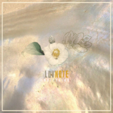
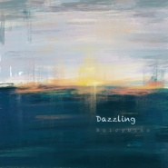
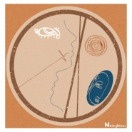
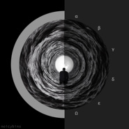
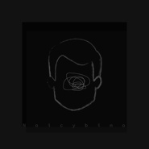
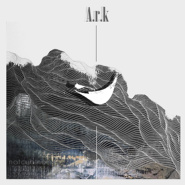
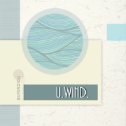
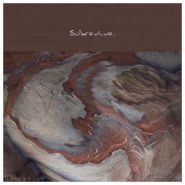
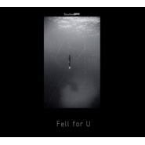
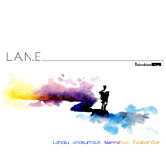

Noicybino
============================

|  |  |
| :--: | :-- |
| [ Noicybino](https://i.xiami.com/noiceruby) | **地区**: China 中国大陆 **风格**: 爵士说唱 Jazz Rap, 沙发音乐 Lounge, 器乐独奏 Solo Instrumental, 轻音乐 Easy Listening **播放数**: 2073348 **粉丝数**: 910 **评论数**: 153  |

## 档案

Noicybino，自由作曲人。 
愿我的音乐像杯棕榈酒。 
微博@Noicybino 
实体CD>>> https://shop238733510.taobao.com/

## 专辑

| 名称 | 语种 | 唱片公司 | 发行时间 | 专辑类别 | 专辑风格 |
| :--: | :-- | :-- | :-- | :-- | :-- |
| [ Luvnote](./albums/5021962527.md) | 纯音乐 | 独立发行 | 2020年12月28日 | EP, 单曲 |  |
| [ 巳弥与八坂先生](./albums/5021995269.md) | 纯音乐 | 独立发行 | 2020年11月21日 | EP, 单曲 | 轻音乐 Easy Listening, 原声 Soundtrack |
| [ Dazzling](./albums/5021380321.md) | 纯音乐 | 独立发行 | 2020年08月31日 | 录音室专辑 | 轻音乐 Easy Listening, 沙发音乐 Lounge, 嘻哈 Hip-Hop |
| [ 欲 晓](./albums/2108379094.md) | 国语 | 独立发行 | 2020年04月23日 | 录音室专辑 | 轻音乐 Easy Listening, 沙发音乐 Lounge, 电子 Electronic |
| [ 1.048596％](./albums/2105697918.md) | 国语 | 独立发行 | 2020年01月07日 | EP, 单曲 | 轻音乐 Easy Listening, 电子 Electronic |
| [ 線](./albums/2105686799.md) | 国语 | 独立发行 | 2020年01月05日 | EP, 单曲 | 轻音乐 Easy Listening |
| [ ごめんなさい](./albums/2105648064.md) | 国语 | 独立发行 | 2019年12月29日 | EP, 单曲 | 轻音乐 Easy Listening |
| [ A.r.k方舟](./albums/2103885584.md) | 国语 | 独立发行 | 2018年08月01日 | 录音室专辑 | 轻音乐 Easy Listening, 爵士嘻哈 Jazz Hip Hop |
| [ U.Wind](./albums/2103692584.md) | 国语 | 独立发行 | 2018年04月21日 | EP, 单曲 | 轻音乐 Easy Listening, 爵士嘻哈 Jazz Hip Hop, 轻音乐流行 Light Pop |
| [ Sobrevive](./albums/2103502228.md) | 国语 | 独立发行 | 2018年01月25日 | 录音室专辑 | 轻音乐 Easy Listening, 沙发音乐 Lounge, 爵士说唱 Jazz Rap |
| [ Hanabi](./albums/2102776123.md) | 国语 | 独立发行 | 2017年07月02日 | EP, 单曲 | 轻音乐流行 Light Pop, 轻音乐 Easy Listening |
| [ Fell for U](./albums/2100248778.md) | 国语 | 独立发行 | 2015年12月20日 | EP, 单曲 | 爵士说唱 Jazz Rap, 轻音乐 Easy Listening |
| [ L.A.N.E](./albums/2100185264.md) | 国语 | 独立发行 | 2015年08月26日 | 录音室专辑 | 爵士说唱 Jazz Rap, 沙发音乐 Lounge, 轻音乐 Easy Listening |

## 评论

|  |  |  |
| :-- | :-- | :-- |
|  [虾米用户](https://emumo.xiami.com/u/45323236) 必有所获 2021-01-31 12:47 赞(0) 踩(0) | 
前些天做了一个梦，是关于末世的梦。不是游戏或是一些文学或影视作品中出现的废土景象，只有一个人一条船，那个人站在船中央，天地间只有那一条船。之后，梦要结束时，我发现原来那个场景是那个视角的人在看的一部电影的光碟的背面的&amp;ldquo;概念图&amp;rdquo;。那一面上面有两张图，好像只有两张图，那张载着梦中出现场景的图在右侧，左侧那张图和右侧的图没有许多差别，只是站在那条船上的人有不同，中间的还是他，但是两侧有了三对看上去像是恋人的男女。那场梦之后我有了一种感觉，于是我凭着那感觉再次听《欲晓》，听《闭眼，回到从前》，意识到梦中那个场景时所产生的感受就又出现了。是一种不苍凉，不悲伤的孤独。说是&amp;ldquo;前几天&amp;rdquo;，其实已经过去好月了，
 |
| ⇒ |  [虾米用户](https://emumo.xiami.com/u/45323236) 必有所获 2021-01-31 12:51 赞(0) 踩(0) | 
只是到今天也记忆犹新。这感觉直到知道二月五日将要发生的事情一直默默地在心里流。也许只是一种&amp;ldquo;自我感动&amp;rdquo;，剩下的几天我只想感受那感觉，或是闭眼回到从前。期待欲晓时。
 |
|  [虾米用户](https://emumo.xiami.com/u/42361373) 感恩虾米，让我们相遇！请... 2021-01-05 16:35 赞(4) 踩(0) | 
感恩虾米，让我们相遇。真的不想说再见。
 |
|  [虾米用户](https://emumo.xiami.com/u/42361373) 感恩虾米，让我们相遇！请... 2020-08-31 20:56 赞(2) 踩(0) | 
最新专辑《Dazzling》发布了！~欢迎光顾！个人很喜欢！
 |
| ⇒ |  [虾米用户](https://emumo.xiami.com/u/671456) 我还没想好要写什么... 2020-09-02 09:44 赞(0) 踩(0) | 
超级棒好喜欢!~
 |
|  [虾米用户](https://emumo.xiami.com/u/310754428) wa da xi… 2020-07-31 11:39 赞(0) 踩(0) | 

 |
|  [虾米用户](https://emumo.xiami.com/u/347093977)  2020-01-04 16:09 赞(0) 踩(0) | 
 
 |
|  [虾米用户](https://emumo.xiami.com/u/78519234) 我还没想好要写什么... 2019-12-04 21:20 赞(0) 踩(0) | 

 |
|  [虾米用户](https://emumo.xiami.com/u/241930932)  2019-08-27 13:43 赞(0) 踩(0) | 
猪包嘴巴
 |
|  [虾米用户](https://emumo.xiami.com/u/330900828) 高舉一面五星紅旗在蝦米！ 2019-07-31 20:29 赞(0) 踩(0) | 
非常滿意
 |
|  [虾米用户](https://emumo.xiami.com/u/31709801) 还活着，真的是太好了..... 2019-07-19 11:31 赞(0) 踩(0) | 
好听，优秀，厉害。
 |
|  [虾米用户](https://emumo.xiami.com/u/19489616) 大四。。。 2019-04-23 09:44 赞(3) 踩(0) | 
这么少关注不应该啊：） 音乐真的巨好听
 |
|  [虾米用户](https://emumo.xiami.com/u/42361373) 感恩虾米，让我们相遇！请... 2019-02-14 18:53 赞(1) 踩(0) | 
《Fell for U》互联网版权现独家归属网易，该曲目试听可移驾网易
 |
|  [虾米用户](https://emumo.xiami.com/u/3250268) 一首好歌都比爱一个人长久... 2019-02-13 00:54 赞(0) 踩(0) | 
很好听 大大加油
 |
|  [虾米用户](https://emumo.xiami.com/u/10205776) 转Spotify 2018-09-21 00:36 赞(0) 踩(0) | 

 |
|  [虾米用户](https://emumo.xiami.com/u/305278067) 此处留白 2018-07-12 13:22 赞(0) 踩(0) | 
好屌~好好听~简直想藏起来舍不得给旁人听到，太好听了~
 |
|  [虾米用户](https://emumo.xiami.com/u/374229574)  2018-06-10 01:19 赞(2) 踩(0) | 
你的fell for U我已经听了不下千遍，明明很腻了可还是听。明明很难受可还是决定沉默。我换了很多手机，qq，软件，可就是换不了你的音乐
 |
| ⇒ |  [虾米用户](https://emumo.xiami.com/u/42361373) 感恩虾米，让我们相遇！请... 2018-07-05 09:33 赞(0) 踩(0) | 
谢谢，感兴趣可以看看今晚20:00上架我淘宝店铺的这张专辑金色签名版
 |
|  [虾米用户](https://emumo.xiami.com/u/226833808) 梦里见 2018-04-12 08:51 赞(1) 踩(0) | 
喜欢，加油23333
 |
|  [虾米用户](https://emumo.xiami.com/u/256746836)   2018-03-24 19:36 赞(1) 踩(0) | 
加油啦！
 |
|  [虾米用户](https://emumo.xiami.com/u/42361373) 感恩虾米，让我们相遇！请... 2018-03-24 18:19 赞(0) 踩(0) | 
L.A.N.E实体纪念碟已上架某宝，店铺链接请戳新浪微博Noicybino，或某宝搜索店铺 棕榈小馆
 |
| ⇒ |  [虾米用户](https://emumo.xiami.com/u/33330270)  2018-06-24 07:46 赞(0) 踩(0) | 
这里就是淘宝的虾米音乐，不用称某宝好吧
 |
|  [虾米用户](https://emumo.xiami.com/u/78394452) 无 2018-02-20 00:50 赞(0) 踩(0) | 

 |
|  [虾米用户](https://emumo.xiami.com/u/194843642)  2018-02-10 22:36 赞(0) 踩(0) | 
今天2个评论哈哈
 |
|  [虾米用户](https://emumo.xiami.com/u/90959268) 我与你的相遇，既充满爱，... 2018-02-10 19:46 赞(2) 踩(0) | 
兜兜转转，终于还是找到了出处，因为忘不掉第一次听见你的作品而失声大哭的自己，还好，音符有治愈的魔力，我，应该快要好了吧。
 |
|  [虾米用户](https://emumo.xiami.com/u/831786) 人已老，歌不老 2018-01-29 12:58 赞(1) 踩(0) | 
真心不错
 |
|  [虾米用户](https://emumo.xiami.com/u/42361373) 感恩虾米，让我们相遇！请... 2018-01-26 20:18 赞(30) 踩(0) | 
情绪，记忆。  会随时间流逝部分，也会随时间沉积。  大自然的记忆，风化成沙，存活于地下。  地质的层次是大自然存活的证明。  而你我的记忆，则也将存活于我们灵魂深处。  这张专辑，是她们存活的证明。  音乐能自由而不受约束的表达。  一直以来，想到什么，就留下什么。  大概这些碎碎念，组成了这张专辑。  虽然这里不像某云热闹非凡，但依然不离开！
 |
| ⇒ |  [虾米用户](https://emumo.xiami.com/u/290274232) 不过矫情罢了 2018-12-02 07:42 赞(0) 踩(0) | 
每次看你的封面我都觉得很有意思。那金黄色的流状地质像一个女孩子头发是否.......
 |
|  [虾米用户](https://emumo.xiami.com/u/1923255)   云雷， 屯 ，君子以... 2018-01-16 21:38 赞(0) 踩(0) | 
真不错
 |
|  [虾米用户](https://emumo.xiami.com/u/255067177)  2018-01-02 00:06 赞(1) 踩(0) | 
滋磁一下，你是我喜爱程度仅次于A大的音乐人|&amp;omega;・）
 |
|  [虾米用户](https://emumo.xiami.com/u/283320780)  2017-12-26 19:03 赞(0) 踩(0) | 
有的时候可以用中文来当作歌名会有诗意感
 |
|  [虾米用户](https://emumo.xiami.com/u/295542159) Ciao 2017-12-09 18:27 赞(1) 踩(0) | 
国产精品爵士Rap!
 |
|  [虾米用户](https://emumo.xiami.com/u/54686131) 要听更多喜欢的歌~~~ 2017-08-20 10:55 赞(1) 踩(0) | 
~~~
 |
|  [虾米用户](https://emumo.xiami.com/u/306122216)  2017-08-16 15:03 赞(1) 踩(0) | 
我为你转身了，我听你的音乐获得了新生
 |
|  [虾米用户](https://emumo.xiami.com/u/316099275) 你是我心里挥之不去的彩虹 2017-08-10 10:24 赞(17) 踩(0) | 
unspoken被人改了个名字名字上传到虾米了，新名字是千人一面，盗曲的是Mc深七，希望作者大大能看到
 |
| ⇒ |  [虾米用户](https://emumo.xiami.com/u/42361373) 感恩虾米，让我们相遇！请... 2017-11-14 00:01 赞(0) 踩(0) | 
收到
 |
|  [虾米用户](https://emumo.xiami.com/u/14265718) wx:osakarock... 2017-05-08 23:58 赞(0) 踩(0) | 

 |
|  [虾米用户](https://emumo.xiami.com/u/172112836)  2017-04-21 10:14 赞(0) 踩(0) | 
就连简单的demo也好听啊
 |
|  [虾米用户](https://emumo.xiami.com/u/172112836)  2017-04-21 10:14 赞(0) 踩(0) | 
网易大军报到
 |
|  [虾米用户](https://emumo.xiami.com/u/49855965)   2017-03-15 08:14 赞(0) 踩(0) | 
加油
 |
|  [虾米用户](https://emumo.xiami.com/u/32056965) stay gold. 2017-01-31 22:44 赞(0) 踩(0) | 
支持
 |
|  [虾米用户](https://emumo.xiami.com/u/262258984)  2017-01-23 13:34 赞(0) 踩(0) | 
★ ★　　★ ★ ☆　　　 ☆　　　☆ ★　 ∧ ▲　ψ ψ 　★ ☆　*････*☆ ﾟ★　(⊃★★★⊂)　★ﾟ ☆鸡年大吉☆ 　 ★  ★ 　　 ☆  ☆ 　　　 ★　★ 　　　　ﾟ★ﾟ　　　　 ｡o◇☆οo｡　　　 ｡◎∧_∧☆∂o　　　｡○(*ﾟーﾟ)◇☆　　　◎|￣∪∪￣￣|　　／☆|鸡年大吉！|　▼　 ﾟoο◇☆＿＿|∠▲――-☆∂o◎∂ﾟ
 |
|  [虾米用户](https://emumo.xiami.com/u/81582780)  2016-12-16 00:09 赞(0) 踩(0) | 
 
 |
|  [虾米用户](https://emumo.xiami.com/u/2452157) ଲ 2016-12-06 23:13 赞(0) 踩(0) | 
太迷人了，每一首啊
 |
|  [虾米用户](https://emumo.xiami.com/u/6597587)  2016-10-08 15:11 赞(0) 踩(0) | 
同被Unspoken惊艳到！真好真好真好
 |
|  [虾米用户](https://emumo.xiami.com/u/44991093) Beautiful Bl... 2016-10-04 19:45 赞(0) 踩(0) | 
偷偷收藏起来
 |
|  [虾米用户](https://emumo.xiami.com/u/9970575)   2016-09-29 12:16 赞(0) 踩(0) | 
加油 在B站上听到你的音乐 不能自拔
 |
|  [虾米用户](https://emumo.xiami.com/u/219990355)  2016-09-02 23:31 赞(0) 踩(0) | 
被anonymous吸引过来 然后把所有的歌都听了一遍 ❤加油！坚持音乐做你自己就已经能感染很多人了☺
 |
|  [虾米用户](https://emumo.xiami.com/u/83489220) 別關注一位患者 2016-06-15 00:38 赞(0) 踩(0) | 
你的一首Unspoken引起注意 
 |
|  [虾米用户](https://emumo.xiami.com/u/33106179) 欢迎交流  ^   ^ 2016-05-21 20:23 赞(0) 踩(0) | 
greet
 |
|  [虾米用户](https://emumo.xiami.com/u/158479978)  2016-05-02 02:07 赞(1) 踩(0) | 
在贴吧看到的你 记住了你的silent2009 记住了它的故事
 |
|  [虾米用户](https://emumo.xiami.com/u/96122112) 一切安好 只缺烦恼 2016-04-04 19:07 赞(0) 踩(0) | 
曲风有种Jazz hip top 感觉   又感觉 很像韩国配乐师 的作品   很有大师的感觉   不知为何 你怎么没有名气呢 ？ 现在国内的纯音 作品太少了   作曲家都太商业化  太浮躁了   只凭借 一张貌似漂亮的 锥子脸  放开嗓子吼几句 就来钱了   所以说 国人 素质 底！
 |
|  [虾米用户](https://emumo.xiami.com/u/12876004) ` 2016-03-22 19:45 赞(0) 踩(0) | 
嘛~来晚了= =
 |
|  [虾米用户](https://emumo.xiami.com/u/33330270)  2016-02-19 11:28 赞(0) 踩(0) | 
治愈系完美无瑕！
 |
|  [虾米用户](https://emumo.xiami.com/u/1501440)  2016-02-11 12:26 赞(0) 踩(0) | 
还不错，但是总感觉少了一些什么，不够惊艳.... 一人一个欣赏风格的因缘么.
 |
|  [虾米用户](https://emumo.xiami.com/u/35871308) 千里奔赴一笑而过，不管不... 2016-02-10 16:43 赞(0) 踩(0) | 
好美的曲子
 |
|  [虾米用户](https://emumo.xiami.com/u/13687650) 小苏子. 2016-01-31 23:31 赞(0) 踩(0) | 
hi，贴吧来的。要加油，我会一直关注你的
 |
|  [虾米用户](https://emumo.xiami.com/u/83339944) 淡淡秋风微雨过，流光瘦减... 2016-01-18 18:51 赞(0) 踩(0) | 
你好，我是网易云的半夏，  
 |
| ⇒ |  [虾米用户](https://emumo.xiami.com/u/8181307)  2017-01-10 09:37 赞(0) 踩(0) | 
同网易道友
 |
| ⇒ |  [虾米用户](https://emumo.xiami.com/u/286037686) why，or why n... 2017-04-04 17:26 赞(0) 踩(0) | 
网易云的好多人都有用各种app呢
 |
|  [虾米用户](https://emumo.xiami.com/u/31325783) 雜食動物 2016-01-10 19:17 赞(1) 踩(0) | 
哈哈哈好久没来~今天偶然上了一次微博  发现了一个林志炫~
 |
|  [虾米用户](https://emumo.xiami.com/u/56278652)  2015-12-23 00:22 赞(0) 踩(0) | 
   
 |
|  [虾米用户](https://emumo.xiami.com/u/47695981) 咏盛世之史诗，歌轩麟之华... 2015-12-09 13:17 赞(0) 踩(0) | 
纯吧里看到你的宣传……之前一直都没来听……今天终于听了一下……
 |
| ⇒ |  [虾米用户](https://emumo.xiami.com/u/45435466) Learn By Hea... 2015-12-23 00:14 赞(0) 踩(0) | 
当场活捉[带墨镜笑]
 |
| ⇒ |  [虾米用户](https://emumo.xiami.com/u/47695981) 咏盛世之史诗，歌轩麟之华... 2015-12-23 12:20 赞(0) 踩(0) | 
<q><b>彩の無い世界说：</b></q>
 |
|  [虾米用户](https://emumo.xiami.com/u/10364555)   2015-11-28 10:27 赞(1) 踩(0) | 
加油~
 |
|  [虾米用户](https://emumo.xiami.com/u/8746129) 约么？ 2015-11-18 23:34 赞(0) 踩(0) | 
空窗期。。。哈哈哈~~~
 |
|  [虾米用户](https://emumo.xiami.com/u/33330270)  2015-11-16 08:31 赞(0) 踩(0) | 
好听!
 |
|  [虾米用户](https://emumo.xiami.com/u/70543976)   2015-10-02 13:45 赞(0) 踩(0) | 
tie ba  lai de
 |
|  [虾米用户](https://emumo.xiami.com/u/70529676) 听到了那首音乐，就知道那... 2015-09-30 13:06 赞(2) 踩(0) | 
听一次就彻底沦陷的感觉
 |
|  [虾米用户](https://emumo.xiami.com/u/9417605) 那亲吻与鼻息中隐现的厄运... 2015-09-15 23:45 赞(1) 踩(0) | 
Silent 2009很不错~~~感觉再加一点铺底音色就更好了
 |
|  [虾米用户](https://emumo.xiami.com/u/45435466) Learn By Hea... 2015-09-15 21:19 赞(0) 踩(0) | 
新公告放出来感觉是往jazz hiphop上走了 
 |
|  [虾米用户](https://emumo.xiami.com/u/43349012) 喵喵 2015-08-28 13:41 赞(0) 踩(0) | 
怎么购买啊。。
 |
|  [虾米用户](https://emumo.xiami.com/u/58445556)  2015-08-27 21:13 赞(1) 踩(0) | 
听了上百遍tell me，觉得很不错，不过觉得有点瑕疵，觉得3分钟后感情好像变了，那一段不太喜欢，其它很好。前面的比较沉重，后面转为感觉像是有点释然还是快乐，觉得不太符合主题。我不太懂音乐，纯属个人见解
 |
|  [虾米用户](https://emumo.xiami.com/u/58174868)  2015-08-27 00:20 赞(0) 踩(0) | 
(ง •̀_•́)ง——Σ(っ °Д °;)っ直接带走
 |
|  [虾米用户](https://emumo.xiami.com/u/43349012) 喵喵 2015-08-21 19:35 赞(0) 踩(0) | 
nonononononono棒棒哒！
 |
| ⇒ |  [虾米用户](https://emumo.xiami.com/u/286037686) why，or why n... 2017-04-04 17:23 赞(0) 踩(0) | 
我在网易云关注了你！你是画封面的&amp;hellip;&amp;hellip;
 |
|  [虾米用户](https://emumo.xiami.com/u/43349012) 喵喵 2015-08-21 19:34 赞(0) 踩(0) | 
听到的都是作者的感情呢！加油哦！不管是实体专辑还是虚拟专辑，全部都大力支持！！！binono我是你的老缠粉！！！！
 |
|  [虾米用户](https://emumo.xiami.com/u/43349012) 喵喵 2015-08-21 19:33 赞(0) 踩(0) | 
\( &amp;#039; v &amp;#039;)/ \( &amp;#039; v &amp;#039;)/ \( &amp;#039; v &amp;#039;)/ \( &amp;#039; v &amp;#039;)/ \( &amp;#039; v &amp;#039;)/ \( &amp;#039; v &amp;#039;)/ \( &amp;#039; v &amp;#039;)/ \( &amp;#039; v &amp;#039;)/ \( &amp;#039; v &amp;#039;)/ 强力关注强力推荐呀！
 |
|  [虾米用户](https://emumo.xiami.com/u/43349012) 喵喵 2015-08-21 19:32 赞(0) 踩(0) | 
感觉实在是太棒啦，爱不释手呀，循环播放ing！
 |
|  [虾米用户](https://emumo.xiami.com/u/43349012) 喵喵 2015-08-21 19:31 赞(0) 踩(0) | 
很棒的音乐，不管是旋律还是节奏都能感受到作者的用心呀，期待专辑的发布哦！
 |
|  [虾米用户](https://emumo.xiami.com/u/43349012) 喵喵 2015-08-21 19:29 赞(0) 踩(0) | 
\( &amp;#039; v &amp;#039;)/ \( &amp;#039; v &amp;#039;)/ \( &amp;#039; v &amp;#039;)/ \( &amp;#039; v &amp;#039;)/ \( &amp;#039; v &amp;#039;)/ \( &amp;#039; v &amp;#039;)/ \( &amp;#039; v &amp;#039;)/ \( &amp;#039; v &amp;#039;)/ \( &amp;#039; v &amp;#039;)/ 棒棒棒！
 |
|  [虾米用户](https://emumo.xiami.com/u/49878617)  2015-08-21 00:15 赞(0) 踩(0) | 
请问新曲何时在虾米上发布啊！好期待啊
 |
| ⇒ |  [虾米用户](https://emumo.xiami.com/u/42361373) 感恩虾米，让我们相遇！请... 2015-08-31 21:02 赞(0) 踩(0) | 
谢谢支持！
 |
|  [虾米用户](https://emumo.xiami.com/u/18631407) 在所有物是人非的景色里最... 2015-08-16 08:34 赞(0) 踩(0) | 
cd到时候怎么买?
 |
| ⇒ |  [虾米用户](https://emumo.xiami.com/u/42361373) 感恩虾米，让我们相遇！请... 2015-08-16 19:17 赞(0) 踩(0) | 
在新浪的平台会有转发赠送的活动（&amp;#039;   v &amp;#039;）//
 |
| ⇒ |  [虾米用户](https://emumo.xiami.com/u/18631407) 在所有物是人非的景色里最... 2015-08-20 06:13 赞(0) 踩(0) | 
<q><b>Noicybino说：</b></q>
 |
| ⇒ |  [虾米用户](https://emumo.xiami.com/u/18631407) 在所有物是人非的景色里最... 2015-08-20 06:15 赞(0) 踩(0) | 
<q><b>Noicybino说：</b></q>
 |
|  [虾米用户](https://emumo.xiami.com/u/38812126)   2015-08-10 18:11 赞(0) 踩(0) | 
歌太少，不够听，非常棒
 |
| ⇒ |  [虾米用户](https://emumo.xiami.com/u/42361373) 感恩虾米，让我们相遇！请... 2015-08-31 21:02 赞(0) 踩(0) | 
谢谢支持！希望喜欢我的首专！
 |
|  [虾米用户](https://emumo.xiami.com/u/42361373) 感恩虾米，让我们相遇！请... 2015-08-10 12:18 赞(60) 踩(0) | 
关于这次的首个专辑，如果非加一个目的，就是纪念过去，珍惜现在。lane本义是一条小巷、小路，是通向我脑海深处的一条路，lonely\anonymous\narrative\ev aporate四个词又分别对应着走过这条路时的我的一些碎碎念吧。希望有人会喜欢。
 |
| ⇒ |  [虾米用户](https://emumo.xiami.com/u/290274232) 不过矫情罢了 2018-12-02 07:40 赞(0) 踩(0) | 
终于听到了正解 封面也很有意蕴 彩色的路像是一个人站着山上看红色的夕阳
 |
|  [虾米用户](https://emumo.xiami.com/u/4009230) 青秧栽满田，低头水中天 2015-08-09 16:53 赞(0) 踩(0) | 
Silent 2009，我喜欢这个名字！
 |
| ⇒ |  [虾米用户](https://emumo.xiami.com/u/42361373) 感恩虾米，让我们相遇！请... 2015-08-31 21:02 赞(0) 踩(0) | 
谢谢支持！
 |
|  [虾米用户](https://emumo.xiami.com/u/50846230) 纯音赛高!(一只渣渣画师... 2015-08-07 12:03 赞(0) 踩(0) | 
有实体的，真好T^T
 |
| ⇒ |  [虾米用户](https://emumo.xiami.com/u/42361373) 感恩虾米，让我们相遇！请... 2015-08-31 21:02 赞(0) 踩(0) | 
可以参加新浪的活动抽取哦！
 |
|  [虾米用户](https://emumo.xiami.com/u/38812126)   2015-07-29 17:31 赞(0) 踩(0) | 
woc为啥我一直忘了关注 微博观光
 |
| ⇒ |  [虾米用户](https://emumo.xiami.com/u/42361373) 感恩虾米，让我们相遇！请... 2015-07-29 18:39 赞(0) 踩(0) | 
（&amp;#039;   w &amp;#039;）//
 |
|  [虾米用户](https://emumo.xiami.com/u/50846230) 纯音赛高!(一只渣渣画师... 2015-07-29 16:33 赞(0) 踩(0) | 
终于发布了 
 |
| ⇒ |  [虾米用户](https://emumo.xiami.com/u/49111089)  2015-08-03 17:58 赞(0) 踩(0) | 
<q><b>说：</b></q>
 |
| ⇒ |  [虾米用户](https://emumo.xiami.com/u/49111089)  2015-08-03 17:58 赞(0) 踩(0) | 
<q><b>说：</b></q>
 |
|  [虾米用户](https://emumo.xiami.com/u/50846230) 纯音赛高!(一只渣渣画师... 2015-07-29 16:33 赞(0) 踩(0) | 
终于发布了 
 |
|  [虾米用户](https://emumo.xiami.com/u/50846230) 纯音赛高!(一只渣渣画师... 2015-07-29 16:33 赞(0) 踩(0) | 
终于发布了 
 |
|  [虾米用户](https://emumo.xiami.com/u/45435466) Learn By Hea... 2015-07-22 09:02 赞(14) 踩(0) | 
被贴吧上你的宣传吸引过来的，简单的旋律最对我的胃口，纯音乐嘛，小众才好。希望你精品不断，如果在bandcamp出了数字专辑我一定买买买，加油！ㄟ(≧◇≦)ㄏ
 |
| ⇒ |  [虾米用户](https://emumo.xiami.com/u/42361373) 感恩虾米，让我们相遇！请... 2015-08-01 13:21 赞(0) 踩(0) | 
（‘   w  ‘）//
 |
|  [虾米用户](https://emumo.xiami.com/u/42361373) 感恩虾米，让我们相遇！请... 2015-07-17 17:52 赞(1) 踩(0) | 
怎么办爱上了这个颜文字  （&amp;#039;   v &amp;#039;）//
 |
| ⇒ |  [虾米用户](https://emumo.xiami.com/u/9150715) 心流 2015-07-17 19:03 赞(0) 踩(0) | 
哈哈哈哈哈
 |
|  [虾米用户](https://emumo.xiami.com/u/34066158) 我不关心，你不开心 2015-06-16 21:58 赞(0) 踩(0) | 
Tell Me听到渐入佳境呢。
 |
|  [虾米用户](https://emumo.xiami.com/u/39973330) 遇见你 找到我 2015-06-11 03:23 赞(0) 踩(0) | 
不错哦 真心的 happy for u～
 |
|  [虾米用户](https://emumo.xiami.com/u/49855965)   2015-06-06 18:01 赞(1) 踩(0) | 
等待专辑中，付费也愿意啊
 |
|  [虾米用户](https://emumo.xiami.com/u/14688806) 想听的碟可以私我 购入的... 2015-06-01 20:12 赞(0) 踩(0) | 
无意间看到了你的曲子 听了非常的舒畅 希望继续努力～
 |
|  [虾米用户](https://emumo.xiami.com/u/11307071)  2015-05-20 21:45 赞(0) 踩(0) | 
音乐好听
 |
|  [虾米用户](https://emumo.xiami.com/u/44609626)  2015-05-14 12:19 赞(0) 踩(0) | 
加油啊  特别喜欢！
 |
|  [虾米用户](https://emumo.xiami.com/u/12381672)  2015-05-10 09:02 赞(0) 踩(0) | 
下次用中文命名啊
 |
|  [虾米用户](https://emumo.xiami.com/u/48078245)  2015-05-09 09:23 赞(0) 踩(0) | 
喜欢
 |
|  [虾米用户](https://emumo.xiami.com/u/49855965)   2015-05-06 11:13 赞(0) 踩(0) | 
刚从贴吧看的，加油！
 |
|  [虾米用户](https://emumo.xiami.com/u/11226391) (ゝ∀･) 2015-05-04 10:43 赞(0) 踩(0) | 
unspoken好舒服，媲美α的那种感觉了
 |
|  [虾米用户](https://emumo.xiami.com/u/3189601) 暂无签名~ 2015-05-03 22:00 赞(0) 踩(0) | 
已收录，支持一下~
 |
|  [虾米用户](https://emumo.xiami.com/u/44688855) 这个家伙很聪明，什么都 2015-04-30 18:57 赞(0) 踩(0) | 
我也刚从贴吧过来，坐等专辑，合我味口呀哈哈!
 |
|  [虾米用户](https://emumo.xiami.com/u/9353858) 签名消逝，个性丧失 2015-04-29 23:50 赞(0) 踩(0) | 
~
 |
|  [虾米用户](https://emumo.xiami.com/u/15790255) 你看见我的狗了吗？ 2015-04-28 20:10 赞(0) 踩(0) | 
  
 |
|  [虾米用户](https://emumo.xiami.com/u/41459074) 新专辑已发布 2015-04-12 13:51 赞(0) 踩(0) | 
从贴吧过来De。
 |
|  [虾米用户](https://emumo.xiami.com/u/48996665) 一朵沙    不怕刹那 2015-04-07 22:25 赞(0) 踩(0) | 
纯吧党，挺不错，虽然现在很难受，情绪还是慢慢平静下来了，不想想太多
 |
| ⇒ |  [虾米用户](https://emumo.xiami.com/u/42361373) 感恩虾米，让我们相遇！请... 2015-04-08 19:43 赞(0) 踩(0) | 
一切都会好起来！
 |
|  [虾米用户](https://emumo.xiami.com/u/10759581)  2015-04-07 09:33 赞(4) 踩(0) | 
在纯音吧听到就觉得很喜欢，会一直关注的，加油喔 
 |
| ⇒ |  [虾米用户](https://emumo.xiami.com/u/43960484) 这家伙非常非常非常非常聪... 2015-05-23 10:18 赞(0) 踩(0) | 
怎么都是那边过来的…
 |
|  [虾米用户](https://emumo.xiami.com/u/48502383)  2015-03-25 23:47 赞(0) 踩(0) | 
..
 |
|  [虾米用户](https://emumo.xiami.com/u/4009230) 青秧栽满田，低头水中天 2015-03-22 23:24 赞(1) 踩(0) | 
舒缓纯粹的钢琴之音
 |
|  [虾米用户](https://emumo.xiami.com/u/39709566)  2015-03-22 20:19 赞(0) 踩(0) | 

 |
|  [虾米用户](https://emumo.xiami.com/u/31325783) 雜食動物 2015-03-22 20:01 赞(1) 踩(0) | 
纯吧党再次前来支持 新曲已阅~赞 期待专辑
 |
|  [虾米用户](https://emumo.xiami.com/u/7148029) 学吉他中... 2015-03-21 08:12 赞(1) 踩(0) | 
纯吧酱油党过来顶顶~
 |
|  [虾米用户](https://emumo.xiami.com/u/4009230) 青秧栽满田，低头水中天 2015-03-20 21:42 赞(0) 踩(0) | 
好喜欢这类钢琴，清脆有节奏，带动情绪！出个合辑不错！
 |
|  [虾米用户](https://emumo.xiami.com/u/35642692) 为什么用曾经亲吻得嘴来吵... 2015-03-18 23:14 赞(1) 踩(0) | 
风格清新，很喜欢
 |
|  [虾米用户](https://emumo.xiami.com/u/9710298) TAKE IT EASE 2015-02-10 22:35 赞(0) 踩(0) | 
等你出专辑呀，加油！
 |
|  [虾米用户](https://emumo.xiami.com/u/9417605) 那亲吻与鼻息中隐现的厄运... 2015-01-27 23:42 赞(0) 踩(0) | 
从百度音乐人爬来~~~~旋律很不错，不过混音要加强，不然听起来会有点枯燥XD
 |
|  [虾米用户](https://emumo.xiami.com/u/31325783) 雜食動物 2015-01-21 01:02 赞(0) 踩(0) | 
纯吧前来围观！~
 |
|  [虾米用户](https://emumo.xiami.com/u/9150715) 心流 2015-01-17 09:55 赞(0) 踩(0) | 
FL吧前来围观！
 |
|  [虾米用户](https://emumo.xiami.com/u/2604942)   2015-01-16 21:42 赞(0) 踩(0) | 
赞！
 |
|  [虾米用户](https://emumo.xiami.com/u/45408295)  2015-01-01 10:40 赞(0) 踩(0) | 
好好好好好好好好
 |
|  [虾米用户](https://emumo.xiami.com/u/7989378) -Inst- 2014-12-13 09:44 赞(0) 踩(0) | 
不错哦~
 |
|  [虾米用户](https://emumo.xiami.com/u/14216505)  2014-12-05 20:48 赞(0) 踩(0) | 
来了~~
 |
|  [虾米用户](https://emumo.xiami.com/u/14216505)  2014-11-26 18:54 赞(0) 踩(0) | 
出新曲子都没看见……真的好听哇……可否留个QQ呢，也好膜拜下大神⊙▽⊙
 |
|  [虾米用户](https://emumo.xiami.com/u/39611713)  2014-11-16 11:39 赞(0) 踩(0) | 
钢琴向
 |
|  [虾米用户](https://emumo.xiami.com/u/43349012) 喵喵 2014-11-04 22:04 赞(2) 踩(0) | 
真的很棒，要加油哦(●′ω`●)
 |
| ⇒ |  [虾米用户](https://emumo.xiami.com/u/43349012) 喵喵 2014-11-04 22:11 赞(0) 踩(0) | 
<q><b>说：</b></q>
 |
|  [虾米用户](https://emumo.xiami.com/u/43349012) 喵喵 2014-11-04 22:03 赞(2) 踩(0) | 
音乐很棒，有梦想的一个人
 |
|  [虾米用户](https://emumo.xiami.com/u/2753337) 想念虾米，可惜“再回首 ... 2014-11-03 14:04 赞(1) 踩(0) | 
好听啊！俺超低空掠过～
 |
| ⇒ |  [虾米用户](https://emumo.xiami.com/u/2753337) 想念虾米，可惜“再回首 ... 2014-11-03 22:28 赞(0) 踩(0) | 
<q><b>说：</b></q>
 |
|  [虾米用户](https://emumo.xiami.com/u/14216505)  2014-10-29 22:32 赞(1) 踩(0) | 
喜欢你的歌，我爱的风格
 |
| ⇒ |  [虾米用户](https://emumo.xiami.com/u/14216505)  2014-11-01 22:11 赞(0) 踩(0) | 
<q><b>说：</b></q>
 |
|  [虾米用户](https://emumo.xiami.com/u/39582292)  2014-10-27 06:51 赞(1) 踩(0) | 
纯吧小伙伴来了
 |
|  [虾米用户](https://emumo.xiami.com/u/8128176) 好好活着 2014-10-11 23:26 赞(0) 踩(0) | 
赞个
 |
|  [虾米用户](https://emumo.xiami.com/u/39820248)  2014-10-11 22:52 赞(1) 踩(0) | 
感谢你的关注 共同努力
 |
