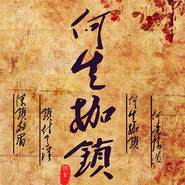

何生枷锁
============================

|  |  |
| :--: | :-- |
| [ 何生枷锁](https://emumo.xiami.com/album/820011942) | **艺人**: [洪尘](../index.md) **语种**: 国语 **唱片公司**: 独立发行 **发行时间**: 2013年07月07日 **专辑类别**: EP, 单曲 **专辑风格**: 中国风 China-Wave **播放数**: 71195 **收藏数**: 8 **评论数**: 1  |

## 简介

写歌的动机是因为一个人的名字，她的名字跟这首歌歌名一样叫“何生枷锁”，有一次去她空间发现她在签名里写下的“何生枷锁，何意悲欢”，很美很动听很让人有感触的一句话，我把它们写进了歌词里。  
我把这首歌给她听的时候，她似乎特别的感动，她说从来没人写过歌给她，而且还是原创，她说她其实早就想以她的名字写一首歌了，她说她看到某句歌词又是笑又是泪，她说某句歌词写得真好，她说噗~歌曲怎么那么短只有一分多钟（一开始我只做了一小段，我记得她说过她喜欢比较短巧的歌）.........  
之后，我就把歌曲改长了，加了一段粤语念白，加了一些戏剧打击乐器，变成现在的这个样子。  
.........再后来，她改名字了，不再叫何生枷锁了。 
 

【参与人员】
 

 

作词\作曲\编曲\混音\海报\演唱：洪尘
 

 
 

 

【歌词】
 

 

《何生枷锁》
 

 
 

 
 

寂寞的梧桐庭院深深锁清秋
 

锁着你所有的烦恼都埋藏在心头
 

剪不断欲理还乱是什么事惹离愁
 

你一个人静静地伫立在窗口
 

 
 

什么时候镜子前的你越来越消瘦
 

独自凭栏凝望着悠悠的河水向东流
 

一天复一天花开又花落
 

或许你早该把情爱都看透
 

 
 

深锁的眉，锁住了谁
 

顾影自怜，紧闭窗扉
 

情思已化成泪眼纷飞
 

何生的枷锁何意的伤悲
 

 
 

往事如水，一去不回
 

匆匆流年，物是人非
 

愿折蟾宫桂，换你舒展黛眉
 

千言万语凝结成一句此生无悔
 

 
 

 
 

去年元夜时
 

花市灯如昼
 

月上柳梢头
 

人约黄昏后
 

今年元夜时
 

月与灯依旧
 

不见去年人
 

泪湿青衫袖
 

唉~
 

 
 

深锁的眉，锁住了谁
 

顾影自怜，紧闭窗扉
 

情思已化成泪眼纷飞
 

何生的枷锁何意的伤悲
 

 
 

往事如水，一去不回
 

匆匆流年，物是人非
 

愿折蟾宫桂，换你舒展黛眉
 

千言万语凝结成一句此生无悔
 

 
 

 
 

深锁的眉，锁住了谁
 

顾影自怜，紧闭窗扉
 

情思已化成泪眼纷飞
 

何生的枷锁何意的伤悲
 

 
 

往事如水，一去不回
 

匆匆流年，物是人非
 

愿折蟾宫桂，换你舒展黛眉
 

千言万语凝结成一句此生无悔
 

## 曲目

## 评论

|  |  |  |  |
| :-- | :-- | :-- | :-- |
|  [虾米用户](https://emumo.xiami.com/u/354605873)  2019-06-24 22:55 赞(0) 踩(0) | 
好听
 |
