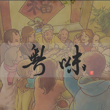
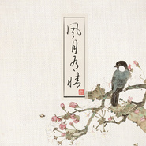
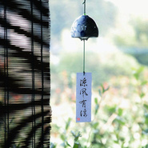
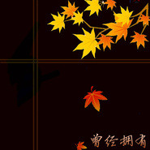

洪尘
============================

|  |  |
| :--: | :-- |
| [ 洪尘](https://i.xiami.com/hongchenmusic) | **地区**: China 中国大陆 **风格**: 民谣流行 Folk Pop, 中国风 China-Wave, 古风 GuFeng Music **播放数**: 8362958 **粉丝数**: 2352 **评论数**: 127  |

## 档案

独立音乐制作人、作曲编曲，喜欢古诗词，喜欢汉服。个人代表作：《画堂春》《长恨歌》《梁间燕》《何生枷锁》等； 
【百度音乐人： http://y.baidu.com/hongchenmusic 】 
【5sing音乐基地：  http://5sing.kugou.com/hongchenmusic 】 
【客户商业编曲请联系工作邮箱： 907jason@163.com 】 
【微博：@-洪尘-】

## 专辑

| 名称 | 语种 | 唱片公司 | 发行时间 | 专辑类别 | 专辑风格 |
| :--: | :-- | :-- | :-- | :-- | :-- |
| [ 巴山夜雨时](./albums/5021041326.md) | 粤语 | 独立发行 | 2020年07月07日 | EP, 单曲 | 民谣流行 Folk Pop, 古风 GuFeng Music |
| [ 天凉好个秋](./albums/2105375887.md) | 国语 |  | 2019年10月25日 | EP, 单曲 | 中国风 China-Wave |
| [ 钗头凤](./albums/2104990940.md) | 国语 |  | 2019年07月07日 | EP, 单曲 | 中国风 China-Wave |
| [ 粤味](./albums/2104565902.md) | 粤语 |  | 2019年02月01日 | EP, 单曲 | 古风 GuFeng Music, 独立流行 Indie Pop, 中国风 China-Wave |
| [ 人间好时节](./albums/2104435995.md) | 国语 |  | 2018年12月31日 | EP, 单曲 | 民谣 Folk, 古风 GuFeng Music, 中国风 China-Wave |
| [ 沧海一声笑（柔情版）](./albums/2104170824.md) | 粤语 |  | 2018年11月01日 | EP, 单曲 | 古风 GuFeng Music, 粤语流行 Cantopop, 中国风 China-Wave |
| [ 花月调](./albums/2104171470.md) | 国语 |  | 2018年07月29日 | EP, 单曲 | 古风 GuFeng Music, 中国风 China-Wave |
| [ 端州粤](./albums/2104171468.md) | 粤语 |  | 2018年07月07日 | EP, 单曲 | 古风 GuFeng Music, 中国风 China-Wave |
| [ 红尘有你](./albums/2104171467.md) | 国语 |  | 2018年05月21日 | EP, 单曲 | 古风 GuFeng Music, 中国风 China-Wave |
| [ 风月有情粤](./albums/2104171466.md) | 粤语 | 独立发行 | 2018年03月14日 | EP, 单曲 | 古风 GuFeng Music, 中国风 China-Wave |
| [ 牡丹亭外](./albums/2103594332.md) | 国语 | 独立发行 | 2018年03月02日 | 录音室专辑 | 民谣 Folk, 中国风 China-Wave |
| [ 色即是空](./albums/2103572994.md) | 国语 | 独立发行 | 2018年03月01日 | EP, 单曲 | 流行 Pop, 古风 GuFeng Music, 中国风 China-Wave |
| [ 酒赋令](./albums/2103594358.md) | 粤语 | 独立发行 | 2018年02月09日 | EP, 单曲 | 流行 Pop, 中国风 China-Wave, 古风 GuFeng Music |
| [ 竹枝词粤语版](./albums/2104171465.md) | 粤语 |  | 2018年02月06日 | EP, 单曲 | 古风 GuFeng Music, 中国风 China-Wave |
| [ 晓风残月](./albums/2104171442.md) | 国语 |  | 2017年12月05日 | EP, 单曲 | 古风 GuFeng Music, 流行 Pop, 中国风 China-Wave |
| [ 凉风有信](./albums/2102777781.md) | 粤语 | 独立发行 | 2017年07月07日 | EP, 单曲 | 粤语流行 Cantopop, 中国风 China-Wave |
| [ 过年](./albums/2102679568.md) | 国语 | 独立发行 | 2017年01月13日 | EP, 单曲 | 民谣 Folk |
| [ 吾妻](./albums/2104171463.md) | 国语 |  | 2016年12月01日 | EP, 单曲 | 古风 GuFeng Music, 中国风 China-Wave |
| [ 晓秋月明（中秋特别版）](./albums/2104171450.md) | 国语 |  | 2016年09月15日 | EP, 单曲 | 古风 GuFeng Music, 中国风 China-Wave |
| [ 愿情《墓王之王之麒麟决》片尾曲](./albums/2104171471.md) | 国语 |  | 2016年08月05日 | 原声带, 影视音乐 | 古风 GuFeng Music, 同人音乐 DouJin, 中国风 China-Wave |
| [ 有所思](./albums/2100356770.md) | 国语 | 独立发行 | 2016年06月20日 | EP, 单曲 | 民谣流行 Folk Pop, 中国风 China-Wave |
| [ 传灯](./albums/2100268286.md) | 国语 | 独立发行 | 2016年01月29日 | EP, 单曲 | 中国风 China-Wave |
| [ 竹枝词予词一曲](./albums/2100208344.md) | 国语 | 独立发行 | 2015年09月27日 | EP, 单曲 | 中国风 China-Wave |
| [ 予词一曲](./albums/2100180743.md) | 国语 | 独立发行 | 2015年08月20日 | EP, 单曲 | 独立民谣 Indie Folk, 中国风 China-Wave |
| [ 相思赋予谁（改编翻唱）（原唱：好妹妹乐队）](./albums/931622982.md) | 国语 | 独立发行 | 2015年05月20日 | EP, 单曲 | 民谣流行 Folk Pop, 中国风 China-Wave |
| [ 汉服写真《静女》配乐](./albums/1229160300.md) | 国语 | 独立发行 | 2015年04月16日 | EP, 单曲 | 器乐独奏 Solo Instrumental, 中国风 China-Wave |
| [ 玉楼春赠：予词姑娘](./albums/326358941.md) | 国语 | 独立发行 | 2015年03月14日 | EP, 单曲 | 独立民谣 Indie Folk, 中国风 China-Wave |
| [ 开心消消乐参赛作品《开心消消乐》游戏原创音乐专辑征集](./albums/1424147211.md) | 其他 | 独立发行 | 2015年02月17日 | EP, 单曲 | 轻音乐 Easy Listening |
| [ 离散三曲](./albums/1520815127.md) | 国语 | 独立发行 | 2015年01月07日 | 精选集 | 中国风 China-Wave |
| [ 画堂春](./albums/1513527864.md) | 国语 | 洪尘 | 2015年01月01日 | EP, 单曲 | 中国风 China-Wave |
| [ 长恨歌](./albums/120019804.md) | 国语 | 独立发行 | 2014年09月14日 | EP, 单曲 | 中国风 China-Wave |
| [ 梁间燕](./albums/214305610.md) | 国语 | 洪尘 | 2014年03月04日 | EP, 单曲 | 中国风 China-Wave |
| [ 曾经拥有](./albums/1320017184.md) | 国语 | 独立发行 | 2014年02月10日 | EP, 单曲 | 流行说唱 Pop Rap |
| [ 何生枷锁](./albums/820011942.md) | 国语 | 独立发行 | 2013年07月07日 | EP, 单曲 | 中国风 China-Wave |
| [ 锁](./albums/1120018278.md) | 国语 | 独立发行 | 2013年06月21日 | EP, 单曲 | 独立流行 Indie Pop |
| [ 原点](./albums/1420016190.md) | 国语 | 独立发行 | 2013年05月09日 | EP, 单曲 | 民谣流行 Folk Pop |
| [ 恐龙吃了蜜蜂](./albums/1320019023.md) | 国语 | 独立发行 | 2011年10月02日 | EP, 单曲 | 独立流行 Indie Pop |

## 评论

|  |  |  |
| :-- | :-- | :-- |
|  [虾米用户](https://emumo.xiami.com/u/358104299) 悲观的唯心存在现实解构虚... 2021-01-09 03:27 赞(0) 踩(0) | 
46059
 |
|  [虾米用户](https://emumo.xiami.com/u/37325693)  2020-10-01 17:30 赞(0) 踩(0) | 
花好月圆堪配
 |
|  [虾米用户](https://emumo.xiami.com/u/49727262)  2020-09-25 09:16 赞(0) 踩(0) | 
谦谦君子，温润如玉
 |
|  [虾米用户](https://emumo.xiami.com/u/245328915)  2020-05-05 01:59 赞(0) 踩(0) | 
不急不忙，缓缓道来...  
 |
|  [虾米用户](https://emumo.xiami.com/u/370123449)  2020-01-07 01:10 赞(0) 踩(0) | 
很喜欢粤语版古风歌曲
 |
|  [虾米用户](https://emumo.xiami.com/u/297365981) oo 2019-12-21 12:40 赞(0) 踩(0) | 
歌是可以，但请注意大片段地添加了古诗词和现代流行歌曲的曲谱以后就不是单纯的原创了呢 是不能够把作词作曲编曲都打上自己一个人的标签的呢 难道是因为脸大？以前黄易上有个歌友推荐的《玉楼春》，一度很喜欢，但是今天看了歌词板非常失望
 |
|  [虾米用户](https://emumo.xiami.com/u/26869408)  2019-10-31 00:31 赞(1) 踩(0) | 
编曲很棒啊。
 |
|  [虾米用户](https://emumo.xiami.com/u/105508314) 年少轻狂，曾给了多少人天... 2019-07-15 00:11 赞(0) 踩(0) | 
啊啊啊啊啊啊啊啊啊啊啊啊好喜欢他的歌( ๑・‿・)┌┛)´ω`ﾟ)ﾟ｡
 |
|  [虾米用户](https://emumo.xiami.com/u/350043487)  2019-02-26 05:29 赞(0) 踩(0) | 
夢が頑張る!
 |
|  [虾米用户](https://emumo.xiami.com/u/347432867)  2019-01-01 19:59 赞(0) 踩(0) | 
声音真的好听到爆炸！尤其是粤语念白  会一直支持洪尘小哥哥的！ 
 |
|  [虾米用户](https://emumo.xiami.com/u/405492791)  2018-11-11 10:28 赞(0) 踩(0) | 
《牡丹亭外》关注你的
 |
|  [虾米用户](https://emumo.xiami.com/u/252192853) Ð γₑ ₐм Ë r 2018-11-05 02:27 赞(0) 踩(0) | 
我爱您！我爱您！
 |
|  [虾米用户](https://emumo.xiami.com/u/403717931)  2018-09-28 16:00 赞(0) 踩(0) | 
好有味道的歌曲 
 |
|  [虾米用户](https://emumo.xiami.com/u/403671778) 我还没想好要写什么... 2018-09-25 13:59 赞(1) 踩(0) | 
喜欢你的歌
 |
|  [虾米用户](https://emumo.xiami.com/u/20276833) 暂无签名~ 2018-09-23 22:36 赞(1) 踩(0) | 
没有又惊梦，  
 |
|  [虾米用户](https://emumo.xiami.com/u/346785595) 啦啦啦~ 2018-07-10 01:01 赞(0) 踩(0) | 
当然本人也喜欢听古风歌，并不是说古风歌就不好了，就像我当然欣赏有内涵的人，但是我就不能看看长得好看的了？我和一个大美女交往一下就说明我是个没有节操庸俗的人？不可能，听歌也是这样，不是你听什么歌就说明了你的欣赏文学水平低下了，除非你听着一首真的很&amp;hellip;&amp;hellip;境界不是很高的歌，还疯了一样说这歌应该上什么什么奖歌曲界的奥斯卡什么之类（相信此类脑残粉应该没有），这歌本身就没想有多文学性，我们都是为了听好而听，他也是为我们单纯好听而作，大家开心就好。谁没吃过快餐小吃，重要的是你知道自己吃的什么，相信吃着快餐小吃的知道这是什么，当然好吃，但是把它当基本饭食吃的脑残应该不是那么多吧。
 |
|  [虾米用户](https://emumo.xiami.com/u/346785595) 啦啦啦~ 2018-07-10 01:01 赞(3) 踩(0) | 
不同于千编一律无蕴感的古风歌，而是真正的中国风（本人以为），有民谣淡然，让人感触颇深，温文儒雅，君子风尚，私以为听歌如看人，不以色取娱人，而更重其底蕴气质，听歌不以其乐律活泼多娱乐人，相反真正能打动人心的，是音乐的内涵，是声音的动情。古风歌多娱人，词多堆砌（我说的是多），我喜欢中国风，真正的中国风，不能局限于此。（）
 |
|  [虾米用户](https://emumo.xiami.com/u/346785595) 啦啦啦~ 2018-07-10 00:46 赞(0) 踩(0) | 
稀罕你
 |
|  [虾米用户](https://emumo.xiami.com/u/4220444) 热爱生活吧！因为你活着！ 2018-05-30 12:32 赞(0) 踩(0) | 
有故事的声音 
 |
|  [虾米用户](https://emumo.xiami.com/u/148359618) Anything  2018-03-25 10:20 赞(0) 踩(0) | 
洪尘出品，必属精品
 |
|  [虾米用户](https://emumo.xiami.com/u/9717528) 但行好事 莫问前程 2018-03-14 23:03 赞(0) 踩(0) | 
还行 调剂用
 |
|  [虾米用户](https://emumo.xiami.com/u/45146429) 暂无签名~ 2018-02-22 16:54 赞(0) 踩(0) | 
为什么竹枝词是女声。。
 |
|  [虾米用户](https://emumo.xiami.com/u/49332949) 唔 诚心祝愿你捱得到新天... 2018-02-13 17:52 赞(1) 踩(0) | 
又一年了
 |
|  [虾米用户](https://emumo.xiami.com/u/52619925)  2018-01-25 11:31 赞(0) 踩(0) | 
我两年前的评论被淹了QAQ
 |
|  [虾米用户](https://emumo.xiami.com/u/340874149) 偶尔听听 2017-12-29 19:11 赞(0) 踩(0) | 
有没有全部的故人来
 |
| ⇒ |  [虾米用户](https://emumo.xiami.com/u/248068211) 让你被爱是我光荣 2019-09-03 09:07 赞(0) 踩(0) | 
喜欢头像~
 |
|  [虾米用户](https://emumo.xiami.com/u/134086216) 说不定哪天笑着成为了自己... 2017-12-25 17:37 赞(0) 踩(0) | 
各种软件搜罗你
 |
|  [虾米用户](https://emumo.xiami.com/u/333832952) 问心只妄想和你快乐牧羊 2017-12-11 18:44 赞(0) 踩(0) | 
洪尘大大～每次听你的歌都感觉自己特别特别舒服！
 |
|  [虾米用户](https://emumo.xiami.com/u/20276833) 暂无签名~ 2017-12-01 20:57 赞(2) 踩(0) | 
洪尘你好，我刚刚从网易云回归虾米发现这里还没有氹氹转。虽然这首是贰婶唱的，但我也是很喜欢，什么时候可以传上就好了
 |
| ⇒ |  [虾米用户](https://emumo.xiami.com/u/284821726)  2018-11-16 17:22 赞(0) 踩(0) | 
网易云没有歌曲相思赋予谁，只有伴奏
 |
|  [虾米用户](https://emumo.xiami.com/u/47838842) 暂无签名~ 2017-10-27 23:56 赞(0) 踩(0) | 
洪尘大大(≧▽≦)超级喜欢你的声音～好棒 。
 |
|  [虾米用户](https://emumo.xiami.com/u/43212099)  2017-10-27 23:23 赞(0) 踩(0) | 
洪尘大大！我来惹！！超喜欢你的词曲和声音！！！！！
 |
|  [虾米用户](https://emumo.xiami.com/u/44671454) 搬进不失眠旅馆 2017-10-02 22:04 赞(0) 踩(0) | 
老板最近回来了哇？？   
 |
|  [虾米用户](https://emumo.xiami.com/u/317166776)  2017-09-19 15:02 赞(2) 踩(0) | 
好歌。有那份底蕴的人才能唱出如此有意境的歌。 每次欣赏你的歌，仿佛在欣赏一副素雅的小景水墨画
 |
|  [虾米用户](https://emumo.xiami.com/u/42546987)  2017-09-19 14:52 赞(1) 踩(0) | 
曲子和声音都喜欢，做事风格也迷人
 |
|  [虾米用户](https://emumo.xiami.com/u/310123580) 真的好听呢 2017-09-15 22:02 赞(0) 踩(0) | 
很吸引人的声音 
 |
|  [虾米用户](https://emumo.xiami.com/u/320684125)  2017-08-26 19:36 赞(0) 踩(0) | 
喜欢梁间燕   
 |
|  [虾米用户](https://emumo.xiami.com/u/9882024) 直到你发现  我 （再也... 2017-08-22 23:16 赞(0) 踩(0) | 
祝好
 |
|  [虾米用户](https://emumo.xiami.com/u/75949178)  2017-08-19 16:21 赞(0) 踩(0) | 
喜欢你的声音 
 |
|  [虾米用户](https://emumo.xiami.com/u/250651138) 我回来了 2017-08-16 03:13 赞(0) 踩(0) | 
着了你的道
 |
|  [虾米用户](https://emumo.xiami.com/u/275718080) 有生之年 欣喜相逢 2017-08-01 18:18 赞(0) 踩(0) | 
好听
 |
|  [虾米用户](https://emumo.xiami.com/u/299137539) 我还没想好要写什么... 2017-07-10 13:40 赞(0) 踩(0) | 
加油！支持您！
 |
|  [虾米用户](https://emumo.xiami.com/u/226833808) 梦里见 2017-05-22 16:31 赞(0) 踩(0) | 
爱你
 |
|  [虾米用户](https://emumo.xiami.com/u/26805670)  2017-04-27 08:10 赞(0) 踩(0) | 
很久没有更新了。期待你的新作品。
 |
|  [虾米用户](https://emumo.xiami.com/u/75420536) 我还没想好要写什么... 2017-03-28 23:35 赞(0) 踩(0) | 
求凉风有信～
 |
|  [虾米用户](https://emumo.xiami.com/u/18179725) 暂无签名~ 2017-03-19 15:13 赞(0) 踩(0) | 
热恋上了你的声音 
 |
|  [虾米用户](https://emumo.xiami.com/u/49453482) 互抱着老掉也不怕 2017-02-11 14:54 赞(0) 踩(0) | 
似是故人来有完整版的吗
 |
|  [虾米用户](https://emumo.xiami.com/u/185142406) 吾之念    e-x-o 2017-02-10 18:24 赞(0) 踩(0) | 
听了你的歌，心很静。多谢你带来如此好听的歌
 |
|  [虾米用户](https://emumo.xiami.com/u/118468374) 千帆过后，不忘初心。 2017-02-02 18:58 赞(0) 踩(0) | 
超级爱你的何生枷锁
 |
|  [虾米用户](https://emumo.xiami.com/u/93226796) 只见雪色映衣袂，抚琴月显... 2017-01-26 11:40 赞(0) 踩(0) | 
你的歌超好听~~~~
 |
|  [虾米用户](https://emumo.xiami.com/u/44237255) 共此灯烛光 2017-01-19 11:18 赞(0) 踩(0) | 
(,,•́.•̀,,)我就是在这里见到你的
 |
|  [虾米用户](https://emumo.xiami.com/u/122688364) 生在愤坑，长在赤圈；挣脱 2016-12-06 22:27 赞(1) 踩(0) | 
6212
 |
|  [虾米用户](https://emumo.xiami.com/u/49481354) 大隐隐于市 2016-10-14 22:59 赞(0) 踩(0) | 
好听
 |
|  [虾米用户](https://emumo.xiami.com/u/168110082) 衡，律，噤，御 2016-10-08 03:30 赞(0) 踩(0) | 
你的声音很好听，就像初秋里的一杯凉白开，
 |
|  [虾米用户](https://emumo.xiami.com/u/28365745)   2016-09-27 16:53 赞(1) 踩(0) | 
听了从前慢 对你的声音无法自拔啦 
 |
|  [虾米用户](https://emumo.xiami.com/u/42546987)  2016-08-22 23:32 赞(0) 踩(0) | 
音乐人，所以喜欢这个人的音乐，也喜欢这个音乐的人
 |
|  [虾米用户](https://emumo.xiami.com/u/123024658)   2016-07-22 22:59 赞(0) 踩(0) | 
能给个完整版的 似是故人来吗 吗 吗？
 |
|  [虾米用户](https://emumo.xiami.com/u/1322131)  2016-07-14 09:42 赞(0) 踩(0) | 
洪尘版的《似是故人来》，是最爱的一版。
 |
|  [虾米用户](https://emumo.xiami.com/u/22774633)  2016-04-26 22:40 赞(1) 踩(0) | 
好喜欢呀 好喜欢呀 公子妙
 |
|  [虾米用户](https://emumo.xiami.com/u/93869910)  2016-04-24 16:23 赞(0) 踩(0) | 
声音好听炸
 |
|  [虾米用户](https://emumo.xiami.com/u/13238614) 我还没想好要写什么... 2016-04-13 17:15 赞(0) 踩(0) | 
喜欢 约吗[带墨镜笑]
 |
|  [虾米用户](https://emumo.xiami.com/u/59929492)  2016-04-11 20:54 赞(1) 踩(0) | 
从前慢，这首诗。至今为止，只有你的最有意境，最经典，声音最舒服。
 |
|  [虾米用户](https://emumo.xiami.com/u/45722050)  2016-03-25 21:07 赞(0) 踩(0) | 
你好，我很喜欢你的（玉楼春）也是无意间听到这首歌才注意到你的。喜欢这首曲子的感觉和改编啊。支持你。
 |
|  [虾米用户](https://emumo.xiami.com/u/96538308)   2016-02-17 23:01 赞(0) 踩(0) | 
支持你！加油啦！ 
 |
|  [虾米用户](https://emumo.xiami.com/u/7290390) *´∀`* 2016-01-28 16:31 赞(0) 踩(0) | 
才知道！！超棒！
 |
|  [虾米用户](https://emumo.xiami.com/u/26520185) 吹走日出留住你。 2015-12-01 23:43 赞(0) 踩(0) | 
一听就暂停不了，认真的人最值得尊敬，期待你的每一首歌。 ——来自高三汪 
 |
| ⇒ |  [虾米用户](https://emumo.xiami.com/u/6760433) 绚丽的烟火在夜空静静消失... 2015-12-20 16:37 赞(0) 踩(0) | 
声音好棒、我也是高三汪♪(^∇^*)
 |
|  [虾米用户](https://emumo.xiami.com/u/48569216) 吾游心于物之初。 2015-11-22 23:55 赞(1) 踩(0) | 
好钟意这样的声音，这样的曲风~
 |
|  [虾米用户](https://emumo.xiami.com/u/60818718) 就是那个胖子 2015-11-17 15:33 赞(0) 踩(0) | 
听出点东山少爷的味道
 |
|  [虾米用户](https://emumo.xiami.com/u/33199820)  2015-10-11 23:35 赞(0) 踩(0) | 
啦啦啦~洪尘尘我来了~ 
 |
|  [虾米用户](https://emumo.xiami.com/u/5650335) 我还没想好要写什么... 2015-10-09 22:22 赞(0) 踩(0) | 
加油！！！超爱！！！！
 |
|  [虾米用户](https://emumo.xiami.com/u/36405040)   2015-09-28 17:54 赞(0) 踩(0) | 
每首都是珍爱。
 |
|  [虾米用户](https://emumo.xiami.com/u/20958559)  2015-08-24 10:01 赞(26) 踩(0) | 
为什么我一个男的还是对洪尘的声音没有抵抗力。。槽 我不是基佬啊！！
 |
| ⇒ |  [虾米用户](https://emumo.xiami.com/u/51632145)   2015-09-16 17:35 赞(0) 踩(0) | 
指日可待
 |
| ⇒ |  [虾米用户](https://emumo.xiami.com/u/270887) 拜啰嗦 2015-12-10 11:52 赞(0) 踩(0) | 
<q><b>朝歌长安某说：</b></q>
 |
| ⇒ |  [虾米用户](https://emumo.xiami.com/u/12852028) 国家级爱情退堂鼓专业鼓手... 2016-02-04 16:16 赞(0) 踩(0) | 
势在必弯
 |
| ⇒ |  [虾米用户](https://emumo.xiami.com/u/168656086) 不说再见。 2018-03-18 23:00 赞(0) 踩(0) | 
被好听的声音和好的歌吸引是不分性别的吧？？
 |
|  [虾米用户](https://emumo.xiami.com/u/55053478) 青年团 2015-08-12 01:00 赞(0) 踩(0) | 
一定联系我。一定啊！一定啊！
 |
|  [虾米用户](https://emumo.xiami.com/u/54720392)  2015-08-11 13:36 赞(0) 踩(0) | 
好棒 路过支持
 |
|  [虾米用户](https://emumo.xiami.com/u/36994066) 你的深情柔情色情全都归我 2015-08-02 22:27 赞(0) 踩(0) | 
喜欢你喜欢你喜欢你，听过的最好听的男声就是你，天天单曲循环的也是你。   
 |
|  [虾米用户](https://emumo.xiami.com/u/40354749) 谁啊 2015-07-27 22:51 赞(0) 踩(0) | 
要是我一生只够爱一个人
 |
|  [虾米用户](https://emumo.xiami.com/u/40354749) 谁啊 2015-07-27 22:51 赞(1) 踩(0) | 
最喜欢从前慢
 |
|  [虾米用户](https://emumo.xiami.com/u/40354749) 谁啊 2015-07-27 22:50 赞(0) 踩(0) | 
我喜欢红尘
 |
|  [虾米用户](https://emumo.xiami.com/u/52619925)  2015-07-17 20:15 赞(0) 踩(0) | 
啦啦啦～ 
 |
|  [虾米用户](https://emumo.xiami.com/u/52619925)  2015-07-16 21:31 赞(0) 踩(0) | 
声音好暖～
 |
|  [虾米用户](https://emumo.xiami.com/u/47366704)  2015-06-18 18:07 赞(0) 踩(0) | 
发现就虾米洪尘的歌算全的～就是没有沙茶酱之歌，哈哈
 |
|  [虾米用户](https://emumo.xiami.com/u/1429206) 愿得一间屋 2015-05-22 12:43 赞(0) 踩(0) | 
啊，惊艳！
 |
|  [虾米用户](https://emumo.xiami.com/u/8344757) 你是我 温暖的手套 冰冷... 2015-05-06 02:26 赞(0) 踩(0) | 
在微博听到的，很喜欢
 |
|  [虾米用户](https://emumo.xiami.com/u/48584017)   2015-05-05 22:20 赞(0) 踩(0) | 
天了噜 终于找到乃的从前慢！还发现原来听过乃的长恨歌～
 |
|  [虾米用户](https://emumo.xiami.com/u/17794584)  2015-05-05 01:12 赞(0) 踩(0) | 
大大你上我们二模试卷了╮(╯▽╰)╭还是作文B-)
 |
| ⇒ |  [虾米用户](https://emumo.xiami.com/u/34560482)   2015-07-26 22:27 赞(0) 踩(0) | 
苏锡常站住
 |
|  [虾米用户](https://emumo.xiami.com/u/5050538)   2015-04-30 22:09 赞(0) 踩(0) | 
好听好听，喜欢
 |
|  [虾米用户](https://emumo.xiami.com/u/9590888)   2015-04-21 09:36 赞(0) 踩(0) | 
心静，美
 |
|  [虾米用户](https://emumo.xiami.com/u/9711423) 长这么大要说什么事儿做的... 2015-04-17 23:26 赞(0) 踩(0) | 
关注了
 |
|  [虾米用户](https://emumo.xiami.com/u/3413598) Crazy for U 2015-04-04 00:10 赞(0) 踩(0) | 
好听到跪了！随机点了玉楼春……
 |
|  [虾米用户](https://emumo.xiami.com/u/3413598) Crazy for U 2015-04-04 00:10 赞(0) 踩(0) | 
国风
 |
|  [虾米用户](https://emumo.xiami.com/u/48418932)  2015-03-23 13:06 赞(0) 踩(0) | 
听完了从前慢 我想认识你
 |
|  [虾米用户](https://emumo.xiami.com/u/38729771) 暂无签名~ 2015-03-13 22:19 赞(1) 踩(0) | 
听了从前慢 突然想认识洪尘
 |
|  [虾米用户](https://emumo.xiami.com/u/3702830) 一片自由的乐土 2015-03-02 18:03 赞(0) 踩(0) | 
非常有味道。嗓音好听
 |
|  [虾米用户](https://emumo.xiami.com/u/7257498)  2015-02-28 20:36 赞(0) 踩(0) | 
拜托哪位可以告诉我 ， 希望在其他地方 找到洪尘的从前慢  可以分享的那种   要分享给朋友   虾米做不到啊  哭  等你们
 |
| ⇒ |  [虾米用户](https://emumo.xiami.com/u/7946324) 再见了，虾米的朋友们 2015-02-28 21:08 赞(0) 踩(0) | 
虾米客户端是可以分享的呀，另外在网易云音乐和百度音乐都能搜到。
 |
| ⇒ |  [虾米用户](https://emumo.xiami.com/u/7257498)  2015-03-01 13:31 赞(0) 踩(0) | 
<q><b>洪尘说：</b></q>
 |
| ⇒ |  [虾米用户](https://emumo.xiami.com/u/7257498)  2015-03-01 13:32 赞(0) 踩(0) | 
<q><b>稳重的饺子说：</b></q>
 |
| ⇒ |  [虾米用户](https://emumo.xiami.com/u/47366704)  2015-06-18 18:02 赞(0) 踩(0) | 
只有虾米和51有！我也是下了好几个播放器找洪尘的歌
 |
| ⇒ |  [虾米用户](https://emumo.xiami.com/u/38446101)  2017-10-28 00:15 赞(0) 踩(0) | 
可以复制链接到自己的微信然后在对话框里点开链接再分享到朋友圈哦～
 |
|  [虾米用户](https://emumo.xiami.com/u/7932686)  2015-02-08 09:07 赞(0) 踩(0) | 
才发现洪尘大大入驻虾米惹！！好激动！！
 |
|  [虾米用户](https://emumo.xiami.com/u/45886549)  2015-02-04 15:15 赞(0) 踩(0) | 
恭喜入驻
 |
|  [虾米用户](https://emumo.xiami.com/u/17733253) 暂无签名~ 2015-01-31 15:43 赞(0) 踩(0) | 
《画堂春》真好听~
 |
|  [虾米用户](https://emumo.xiami.com/u/199381) 一日而尽尝八苦 2015-01-26 23:46 赞(0) 踩(0) | 
洪尘大大！之前都没有发现你在虾米啊！我来膜拜啦！
 |
|  [虾米用户](https://emumo.xiami.com/u/46236617)  2015-01-26 08:39 赞(0) 踩(0) | 
才发现有介个～。～洪尘小小泥嚎…我也是新人…2333
 |
|  [虾米用户](https://emumo.xiami.com/u/1030263) 躲个猫猫笑破肚 2015-01-24 22:29 赞(0) 踩(0) | 
歌写得非常好，不过唱功可能还要加强，女声的不错。。。
 |
|  [虾米用户](https://emumo.xiami.com/u/11338616) ilBlake 2015-01-24 19:09 赞(0) 踩(0) | 
not bad
 |
|  [虾米用户](https://emumo.xiami.com/u/10819314) 细细打磨耳朵。 2015-01-21 22:27 赞(0) 踩(0) | 
广东的朋友你好
 |
| ⇒ |  [虾米用户](https://emumo.xiami.com/u/7946324) 再见了，虾米的朋友们 2015-01-21 23:37 赞(0) 踩(0) | 
泥嚎
 |
|  [虾米用户](https://emumo.xiami.com/u/46284173) 宁静的夏天天空中繁星点点 2015-01-20 20:34 赞(0) 踩(0) | 
按个爪，喜欢《画堂春》《何生枷锁》。
 |
|  [虾米用户](https://emumo.xiami.com/u/199757)  2015-01-20 18:48 赞(0) 踩(0) | 
画堂春确实味道很正！！！
 |
|  [虾米用户](https://emumo.xiami.com/u/12357265) 穿过你的卷发的花生的手 2015-01-19 17:46 赞(0) 踩(0) | 
嗷嗷嗷o(*////▽////*)o红尘棒棒哒
 |
|  [虾米用户](https://emumo.xiami.com/u/7946324) 再见了，虾米的朋友们 2015-01-10 22:25 赞(141) 踩(0) | 
大家好，我是洪尘，入驻虾米音乐不久，欢迎大家来收听我的音乐。
 |
| ⇒ |  [虾米用户](https://emumo.xiami.com/u/33774548) 在虾米的评论里惊觉自己默... 2015-01-12 15:57 赞(0) 踩(0) | 
人好少，我是来听长恨歌的，加油
 |
| ⇒ |  [虾米用户](https://emumo.xiami.com/u/33774548) 在虾米的评论里惊觉自己默... 2015-01-12 16:01 赞(0) 踩(0) | 
画堂春也挺好的
 |
| ⇒ |  [虾米用户](https://emumo.xiami.com/u/4057522) 难怪了，至少1/3的收藏... 2017-06-04 10:14 赞(0) 踩(0) | 
那个似是故人来啥时候来个录音的呗
 |
| ⇒ |  [虾米用户](https://emumo.xiami.com/u/151529772)  2018-01-09 21:57 赞(0) 踩(0) | 
你的歌真好听，
 |
| ⇒ |  [虾米用户](https://emumo.xiami.com/u/323382005) 愿得一心人，白首不相离~ 2018-04-01 20:09 赞(0) 踩(0) | 
喜欢你的梁间燕，一直存着，最爱埙和琵琶了&amp;hellip;&amp;hellip;
 |
| ⇒ |  [虾米用户](https://emumo.xiami.com/u/377678563)  2019-05-15 00:19 赞(0) 踩(0) | 
你的声音轻柔细腻入微，分离的过程感觉挺好！ 浓重的关注你，希望你来长沙高歌一曲
 |
| ⇒ |  [虾米用户](https://emumo.xiami.com/u/426644488)  2019-12-05 08:46 赞(0) 踩(0) | 
老洪牛鼻
 |
|  [虾米用户](https://emumo.xiami.com/u/41341825)  2015-01-10 00:57 赞(0) 踩(0) | 
为啥洪尘大大这没人Ծ‸Ծ
 |
| ⇒ |  [虾米用户](https://emumo.xiami.com/u/7946324) 再见了，虾米的朋友们 2015-01-10 22:23 赞(0) 踩(0) | 
你就是
 |
