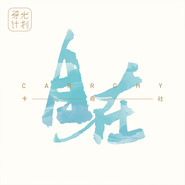
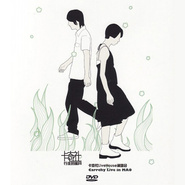

卡奇社
============================

|  |  |
| :--: | :-- |
| [ 卡奇社](https://i.xiami.com/carrchy) | **播放数**: 131930375 **粉丝数**: 51609 **评论数**: 1304 **地区**: China 中国大陆 **风格**: 独立电子乐 Indietronica  |

## 档案

## 专辑

| 名称 | 语种 | 唱片公司 | 发行时间 | 专辑类别 | 专辑风格 |
| :--: | :-- | :-- | :-- | :-- | :-- |
| [ 自在](./albums/1021909911.md) | 国语 | 虾米音乐人 | 2015年03月09日 | EP, 单曲 | 独立流行 Indie Pop |
| [ 行走的蜜月](./albums/167524.md) | 国语 | 易石大橙 | 2008年01月01日 | EP, 单曲 | 独立流行 Indie Pop |
| [ 日光倾城](./albums/32545.md) | 国语 | 易石大橙 | 2007年04月20日 | 录音室专辑 | 独立流行 Indie Pop, 独立电子乐 Indietronica |

## 评论

|  |  |  |  |
| :-- | :-- | :-- | :-- |
|  [虾米用户](https://emumo.xiami.com/u/13526500) Comment ça v... 2021-01-12 00:22 赞(1) 踩(0) | 
卡奇社。爱你们
 |
|  [虾米用户](https://emumo.xiami.com/u/49028943) 我还没想好要写什么... 2020-12-13 01:20 赞(1) 踩(0) | 
突然想到了6年前听过的游园惊梦，想了两小时终于想起来了名字
 |
|  [虾米用户](https://emumo.xiami.com/u/379162683) 我想要记住你们，我想要你... 2020-10-14 00:28 赞(0) 踩(0) | 

 |
|  [虾米用户](https://emumo.xiami.com/u/18039659) 我还没想好要写什么... 2020-08-13 18:38 赞(0) 踩(0) | 
日光倾城一出来就入坑了
 |
|  [虾米用户](https://emumo.xiami.com/u/246543420) 穿上风衣我推门出去 2020-08-10 13:44 赞(4) 踩(0) | 
好想你们复出参加一次乐夏
 |
|  [虾米用户](https://emumo.xiami.com/u/54958711) jazz hiphop 2020-07-28 19:54 赞(0) 踩(0) | 
去乐队的夏天！！！
 |
|  [虾米用户](https://emumo.xiami.com/u/283364938)  2020-03-24 21:53 赞(1) 踩(0) | 
单飞了，颗粒和她老公一起做另一种风格了，失落感
 |
|  [虾米用户](https://emumo.xiami.com/u/15741158) 喵喵喵？ 2020-03-24 10:31 赞(0) 踩(0) | 
天啊啊，日光倾城啊啊啊啊啊啊，记忆中的音乐啊啊啊啊啊啊
 |
|  [虾米用户](https://emumo.xiami.com/u/350988752) 我还没想好要写什么... 2020-03-02 10:56 赞(1) 踩(0) | 
发现之前收藏的云没有版权了，特地从网易过来，再听真是热泪盈眶，初中时最爱的卡奇社，没想到颗粒姐姐居然有宝宝了，祝福，希望有机会再出单曲呀
 |
|  [虾米用户](https://emumo.xiami.com/u/188761664) biu੧ᐛ੭ 2020-02-25 20:13 赞(0) 踩(0) | 
太棒了 我真的好喜欢 这种风格才是真正自在
 |
|  [虾米用户](https://emumo.xiami.com/u/24603884)   2019-12-13 09:20 赞(0) 踩(0) | 
大学时就听你们的歌了，转眼12年过去了，希望以后还能听到你们的作品，加油
 |
|  [虾米用户](https://emumo.xiami.com/u/288675808)  2019-11-30 20:11 赞(0) 踩(0) | 
游园惊梦和猫咪～～～就像羽毛轻挠心口一般的慵懒和闲适
 |
|  [虾米用户](https://emumo.xiami.com/u/47911067) 狼狈比失去难受 2019-11-04 12:40 赞(1) 踩(0) | 
拜托出首单曲也好啊。你们是有十几年老粉的人
 |
|  [虾米用户](https://emumo.xiami.com/u/30450034) 我还没想好要写什么... 2019-06-14 09:26 赞(2) 踩(0) | 
你们快回来啊 
 |
|  [虾米用户](https://emumo.xiami.com/u/421465170) 我还没想好要写什么... 2019-05-30 19:34 赞(3) 踩(0) | 
听了很多的歌，看了很多流行音乐排行榜，内地榜，欧美榜，日文歌榜，韩文歌榜，听了很多大家喜欢的人们唱的歌，但是卡奇社就像2011年的记忆，一下子就能回到最舒服的感觉去。歌曲不用太华丽，不用节奏感，不用每段都是架子鼓，不用沙哑的嗓子故作深沉，不用很多欢呼，不用每个人都喜欢你，这个乐队就像是年轻时候的秘密。但愿依旧在。   
 |
|  [虾米用户](https://emumo.xiami.com/u/32051445) 女孩儿的歌。 永爱虾米 2019-05-19 12:08 赞(0) 踩(0) | 
图片集我每个都存
 |
|  [虾米用户](https://emumo.xiami.com/u/424505741) 来则来 去则去 2019-05-13 13:24 赞(0) 踩(0) | 
爱爱爱爱爱爱爱爱卡奇社！！！！！
 |
|  [虾米用户](https://emumo.xiami.com/u/52503947) 我还没想好要写什么... 2019-04-21 22:38 赞(0) 踩(0) | 
超爱卡奇社啊，高中大家都听台湾流行歌曲的时候我偏爱卡奇社啊~然后还默默骄傲哦( •̅_•̅ )
 |
|  [虾米用户](https://emumo.xiami.com/u/422976268)  2019-04-07 14:05 赞(2) 踩(0) | 
抱歉 来迟了 大概迟了十多年
 |
|  [虾米用户](https://emumo.xiami.com/u/418977350)  2019-02-12 17:49 赞(1) 踩(0) | 
好喜欢卡奇社
 |
|  [虾米用户](https://emumo.xiami.com/u/402474816)  2018-11-28 19:32 赞(0) 踩(0) | 
自由音乐人么么哒
 |
|  [虾米用户](https://emumo.xiami.com/u/302958092)  2018-11-22 17:42 赞(0) 踩(0) | 
I   LOVE   YOU
 |
|  [虾米用户](https://emumo.xiami.com/u/329906259)  2018-10-21 00:46 赞(0) 踩(0) | 

 |
|  [虾米用户](https://emumo.xiami.com/u/35660295) 暂无签名~ 2018-09-25 16:52 赞(2) 踩(0) | 
如果你们能多去参加点音乐节之类的就好了
 |
|  [虾米用户](https://emumo.xiami.com/u/38304861)  2018-08-18 12:57 赞(0) 踩(0) | 
呵呵，我也喜欢龙宽九段和卡奇社。。
 |
|  [虾米用户](https://emumo.xiami.com/u/12730895) 不要离开！ 2018-08-06 01:44 赞(1) 踩(0) | 
一直在等你们呢
 |
|  [虾米用户](https://emumo.xiami.com/u/641198)   2018-08-03 22:46 赞(4) 踩(0) | 
我听卡奇社的是什么时候，大概是开始用虾米，八年前的事情了，那个时候听日光倾城，还在追十一处的大结局，整夜整夜看网文，然后再后来，陷入高考的两年突然就什么都不见了，再上大学的我和之前判若两人。不再看书了，不再偷偷为一个虚拟人物的悲欢哭的两眼肿胀，对什么都没了兴趣，浅的要命，没了挚爱，什么都不深，什么都泛泛。突然今天又轮到了熟悉的嗓音，就有一大颗眼泪掉下来，我好想那个小姑娘，看着窗外风吹杨树叶高兴地想夏天真好啊的小姑娘。
 |
|  [虾米用户](https://emumo.xiami.com/u/209014732) 我还没想好要写什么... 2018-07-05 07:20 赞(2) 踩(0) | 
这个声音有毒，一听就会心情变好
 |
|  [虾米用户](https://emumo.xiami.com/u/265372543)  2018-04-28 21:07 赞(0) 踩(0) | 
来则来去则去
 |
|  [虾米用户](https://emumo.xiami.com/u/51705890) 用十倍苦心，做最突出一个... 2018-03-17 22:59 赞(0) 踩(0) | 
有没有新单啊。   
 |
|  [虾米用户](https://emumo.xiami.com/u/816626) Nothing spec... 2018-03-07 04:32 赞(13) 踩(0) | 
初二还是初一要写周记实在不知道写什么了就郑重其事地写了篇长长的介绍卡奇社的稚嫩告白交上去了&amp;hellip;&amp;hellip;这会儿大学毕业都一年了要
 |
| ⇒ |  [虾米用户](https://emumo.xiami.com/u/316261284) 到最后…… 2019-11-18 14:12 赞(0) 踩(0) | 
原谅我看成这会  儿大学毕业了主要是他恰好在那里换了行。
 |
|  [虾米用户](https://emumo.xiami.com/u/183460086)  2018-02-27 23:03 赞(0) 踩(0) | 
我爱你们
 |
|  [虾米用户](https://emumo.xiami.com/u/350763149)  2018-02-15 21:42 赞(0) 踩(0) | 
彳;r
 |
| ⇒ |  [虾米用户](https://emumo.xiami.com/u/340393036)  2018-03-28 19:21 赞(0) 踩(0) | 
？大头儿子
 |
|  [虾米用户](https://emumo.xiami.com/u/11978110) 喵喵喵 2018-02-06 11:56 赞(18) 踩(0) | 
初中的时候，当时一起玩的朋友推荐给我了这支乐队，。现在我们已经好久没再联系了，大学的时候路过有她在的城市和大学，联系了一下，却也没能见成，大概已经渐行渐远了吧，早就没有当初的那份亲昵了。不知道卡奇社不做歌的时候在做什么呢？
 |
|  [虾米用户](https://emumo.xiami.com/u/37471122)   2018-01-21 22:21 赞(0) 踩(0) | 
这声音不错啊
 |
|  [虾米用户](https://emumo.xiami.com/u/313484246)   2018-01-07 09:45 赞(0) 踩(0) | 
卡咖咔擦 
 |
|  [虾米用户](https://emumo.xiami.com/u/312191861)  2018-01-05 22:08 赞(0) 踩(0) | 
03
 |
| ⇒ |  [虾米用户](https://emumo.xiami.com/u/291180925)  2018-04-16 09:51 赞(0) 踩(0) | 
03代表什么
 |
|  [虾米用户](https://emumo.xiami.com/u/244965716) 我还没想好要写什么... 2017-11-30 00:56 赞(0) 踩(0) | 
你们很棒 
 |
|  [虾米用户](https://emumo.xiami.com/u/332525775) 我还没想好要写什么... 2017-11-22 07:56 赞(0) 踩(0) | 
我想听你们翻唱的she is in fashion    
 |
|  [虾米用户](https://emumo.xiami.com/u/334050865)  2017-11-09 10:56 赞(0) 踩(0) | 
是一份过多有好多黑
 |
|  [虾米用户](https://emumo.xiami.com/u/15479317) 金奖冷场王 音乐懒乞丐 2017-10-30 10:11 赞(0) 踩(0) | 
那是还是看最小说找到的这首歌，那个同时喜欢着韩寒和郭敬明的黑历史，跟着听了不少他们的歌。。。。-_-||
 |
|  [虾米用户](https://emumo.xiami.com/u/20487547) 懒癌晚期 2017-10-28 00:32 赞(1) 踩(0) | 
2005年3月卡奇社乐队正式成立，到2006年7月他们完成了15首作品的创作。乐队原名FLYUP，2005年6月曾发表过单曲《猫咪》，受到Indie乐迷的关注。2005年7月 乐队更名为卡奇社。2005月10约正式签约易石大橙《卡奇社-日光倾城》专辑京文唱片2007年4月20日全国发行《卡奇社-行走的蜜月（CD+DVD）》限量专辑于2008年1月发行，卓越网独家网络销售。来源：百度百科。希望资料补充。<a href="http://emumo.xiami.com/u/86" target="_blank" rel="nofollow" name_card="86">@虾小米</a> <a href="http://emumo.xiami.com/u/17330125" target="_blank" rel="nofollow" name_card="17330125">@虾米音乐人</a> <a href="http://emumo.xiami.com/u/1556630" target="_blank" rel="nofollow" name_card="1556630">@卡奇社</a>
 |
|  [虾米用户](https://emumo.xiami.com/u/1455286) 喵了个喵 2017-10-28 00:23 赞(2) 踩(0) | 
竟然有人那台湾？日本？那种垃圾东西来比较
 |
|  [虾米用户](https://emumo.xiami.com/u/4319153) 也许所谓生。 2017-10-28 00:15 赞(2) 踩(0) | 
还有好多好听的音乐都没上架，比如神奇星，树耳，云南，TSINGTAO,蜚...什么时候也能搬上来呢
 |
|  [虾米用户](https://emumo.xiami.com/u/3374314) 是还是不是 2017-10-28 00:07 赞(0) 踩(0) | 
档案简直叼到没朋友
 |
|  [虾米用户](https://emumo.xiami.com/u/8842185) 我急促的奔跑起来 2017-10-27 23:59 赞(0) 踩(0) | 
还是熟悉的声音还是慵懒自由的味道，每一句音符都像一缕阳光，照射着寒冬，照射着心灵。
 |
|  [虾米用户](https://emumo.xiami.com/u/4154583) 我还没想好要写什么... 2017-10-27 23:23 赞(2) 踩(0) | 
几年前在网上找他们的新闻时，看到，记者采访苏打绿问他们喜欢内地什么乐队，苏打绿说喜欢卡奇社
 |
|  [虾米用户](https://emumo.xiami.com/u/20147189) 嘘 2017-10-27 23:08 赞(0) 踩(0) | 
自我介绍太卖萌哈哈哈哈！
 |
|  [虾米用户](https://emumo.xiami.com/u/1345532) 认真打磨出本来的棱角 2017-10-27 23:06 赞(1) 踩(0) | 
创作对我们来说虽然似乎是在玩一场西洋游戏 但我们骨子里喜欢的是东方的一切，中国的文字和旋律，像我们的神，永远于我们保持着深不可测的距离，在音乐里我们试图接近她，再近一些。
 |
|  [虾米用户](https://emumo.xiami.com/u/3666416)  2017-10-27 12:38 赞(0) 踩(0) | 
童话般
 |
|  [虾米用户](https://emumo.xiami.com/u/42979182)  2017-10-26 14:05 赞(2) 踩(0) | 
讲真，已经多少年没有翻来覆去听一张专辑一个歌手。卡奇社，真的很感激，听着你们的音乐，我好幸福，这旋律让我醉生梦死般享受，比什么都满足
 |
|  [虾米用户](https://emumo.xiami.com/u/315477182)  2017-10-26 01:02 赞(0) 踩(0) | 
找了很久，只有虾米音乐有他们最多的版权，其他的软件都不全。
 |
|  [虾米用户](https://emumo.xiami.com/u/3855918) 我还没想好要写什么... 2017-10-15 14:35 赞(0) 踩(0) | 
初中时期的日光倾城，游园惊梦！还有简迷离和我的朴树啊！！！！
 |
|  [虾米用户](https://emumo.xiami.com/u/12413098) 你要如何让缘分就是缘分 2017-10-06 09:18 赞(1) 踩(0) | 
高中时候超喜欢她们的，数数居然也有十多年了好可怕，所幸没有像龙宽和简迷离一样丧失创作力。十几年卡奇社还更成熟了，没有放弃的是那种一直在路上的辽阔。
 |
|  [虾米用户](https://emumo.xiami.com/u/42898009)  2017-09-25 22:23 赞(0) 踩(0) | 
总有一些明明很不错但就是火不了的歌
 |
|  [虾米用户](https://emumo.xiami.com/u/220930479)  2017-09-03 17:20 赞(0) 踩(0) | 
卡奇社 喜欢
 |
|  [虾米用户](https://emumo.xiami.com/u/7049013)  2017-09-03 16:16 赞(1) 踩(0) | 
入坑了，真喜欢，真真喜欢，谢谢      
 |
|  [虾米用户](https://emumo.xiami.com/u/322237649)  2017-08-29 14:37 赞(0) 踩(0) | 
自在的感觉很空灵好像进入迷幻的世界
 |
|  [虾米用户](https://emumo.xiami.com/u/314945373) I  would  li... 2017-08-12 17:56 赞(0) 踩(0) | 
卡奇社 高中时光的回忆
 |
|  [虾米用户](https://emumo.xiami.com/u/201254739)  2017-07-22 21:52 赞(0) 踩(0) | 
这么优秀的乐队为什么不火啊
 |
|  [虾米用户](https://emumo.xiami.com/u/28486235) - - - - - - ... 2017-07-17 19:10 赞(0) 踩(0) | 

 |
|  [虾米用户](https://emumo.xiami.com/u/58932876) 逆流2020/10/24... 2017-07-14 13:42 赞(0) 踩(0) | 
喜翻 喜翻儿噜 
 |
|  [虾米用户](https://emumo.xiami.com/u/212704290)  2017-07-01 15:53 赞(0) 踩(0) | 

 |
|  [虾米用户](https://emumo.xiami.com/u/5496438) 凡尘俗事，改变了你我！ 2017-06-17 09:56 赞(0) 踩(0) | 
喜欢这声音
 |
|  [虾米用户](https://emumo.xiami.com/u/11223346) 活的 2017-06-15 17:03 赞(0) 踩(0) | 
求复合，求新歌
 |
|  [虾米用户](https://emumo.xiami.com/u/260543759)  没有她在就是个失眠患者 2017-06-15 09:58 赞(1) 踩(0) | 
从初中第一次听 到现在已经工作的老油条 来打个卡 来打个青春的卡
 |
|  [虾米用户](https://emumo.xiami.com/u/300249010)  2017-06-04 09:31 赞(0) 踩(0) | 
为什么没有柔软的光啊，超喜欢这个记得是以前在音悦台看到的
 |
|  [虾米用户](https://emumo.xiami.com/u/71312512)   2017-05-26 01:16 赞(2) 踩(0) | 
云的编排给我的感觉爆炸了
 |
|  [虾米用户](https://emumo.xiami.com/u/297933501)  2017-05-21 01:09 赞(2) 踩(0) | 
卡奇社的歌，给我的感觉是慵懒的优雅、岁月静好、独自沉醉
 |
|  [虾米用户](https://emumo.xiami.com/u/178866) 宣李泰容xi 2017-05-05 15:59 赞(0) 踩(0) | 
嗯，声音好听
 |
|  [虾米用户](https://emumo.xiami.com/u/12263097) 我就是爱音乐 2017-05-02 17:44 赞(1) 踩(0) | 
独立电子 风格小众
 |
|  [虾米用户](https://emumo.xiami.com/u/292907248)  2017-05-01 14:42 赞(3) 踩(0) | 
多少年了，一直以为是卡奇杜 
 |
|  [虾米用户](https://emumo.xiami.com/u/268340271) 我还没想好要写什么... 2017-04-25 05:28 赞(0) 踩(0) | 
听你们的歌长大的
 |
|  [虾米用户](https://emumo.xiami.com/u/4296387)  2017-04-08 01:38 赞(2) 踩(0) | 
游园惊梦来的超好听，日光倾城也很棒！很早就关注了那时还只能试听2首声音的味道有写草书的意境，跟你一起飞BUT我恨你所有的歌让我在KTV是没法唱的，每次都唱崩！
 |
|  [虾米用户](https://emumo.xiami.com/u/225761167) from dawn to... 2017-04-06 12:05 赞(0) 踩(0) | 
从涟漪来的
 |
|  [虾米用户](https://emumo.xiami.com/u/284356168) 德有所长而形有所忘 2017-04-05 20:02 赞(0) 踩(0) | 
有特色的好歌。
 |
|  [虾米用户](https://emumo.xiami.com/u/16135450)  2017-04-01 23:06 赞(0) 踩(0) | 
9336
 |
|  [虾米用户](https://emumo.xiami.com/u/280865193)  2017-03-25 07:44 赞(0) 踩(0) | 
好听
 |
|  [虾米用户](https://emumo.xiami.com/u/282204030)  2017-03-21 17:27 赞(0) 踩(0) | 
？？？？？、、?????????????????/？？？？？？？？？？
 |
|  [虾米用户](https://emumo.xiami.com/u/199250227) 走在路上捡风景and顺便... 2017-03-19 16:49 赞(2) 踩(0) | 
卡奇社的歌最适合一个人走在长长的无人的马路上，戴着耳机，慢慢游荡在人间。是个春天，在我心里，只适合春天。   太美了！
 |
|  [虾米用户](https://emumo.xiami.com/u/8749492) 挥手自兹去 2017-03-19 01:16 赞(1) 踩(0) | 
为什么长得都和冯海宁差不多
 |
|  [虾米用户](https://emumo.xiami.com/u/222072519) 我在等 世上唯一契合灵魂 2017-03-11 23:42 赞(2) 踩(0) | 
仍然记得第一次听卡奇社的日光倾城是在初中，刚刚发行这首歌，后来换掉电脑，掉了这首歌，高三在虾米随机播放到了涟漪，发现卡奇社是多年前那个念念不忘的声音，想把这么多年错过的歌补起来，居然发现这些年消失了，但是现在还在，就好了。
 |
|  [虾米用户](https://emumo.xiami.com/u/279079362)  2017-03-10 00:01 赞(0) 踩(0) | 
怎么付费的反应那么慢十分钟都没付好 
 |
|  [虾米用户](https://emumo.xiami.com/u/261871510)  2017-03-04 11:53 赞(4) 踩(0) | 
为数不多的音乐清风，唱出的都是令人沉醉的生活沉淀，飞入云端观看日光倾城的华丽。但是让人不解的是，现在颗粒好像单独发单曲了，而且电音居多，反而少了那种浸在熏风里的感觉。不过我还是永远期待卡奇社的新作品，继续带来新的感动。卡奇社，十年感谢有你。
 |
|  [虾米用户](https://emumo.xiami.com/u/274647886)  2017-02-19 19:08 赞(0) 踩(0) | 
挺特别的风格
 |
|  [虾米用户](https://emumo.xiami.com/u/264283064) bye  2017-01-30 22:27 赞(0) 踩(0) | 
△
 |
|  [虾米用户](https://emumo.xiami.com/u/268863143)  2017-01-29 00:07 赞(0) 踩(0) | 
yoho+有货<a href="http://www.su00.cn" target="_blank" rel="nofollow noreferrer noopener">http://www.su00.cn</a>
 |
|  [虾米用户](https://emumo.xiami.com/u/10409140)  2017-01-17 21:34 赞(0) 踩(0) | 
很有点子～～～喜欢
 |
|  [虾米用户](https://emumo.xiami.com/u/80319296)   2017-01-10 17:39 赞(3) 踩(0) | 
他们的歌里好像有着四五月份的深春、怎么办又想过春天了
 |
| ⇒ |  [虾米用户](https://emumo.xiami.com/u/12730895) 不要离开！ 2017-02-07 21:39 赞(0) 踩(0) | 
马上就到了，很快的，不急不急。
 |
|  [虾米用户](https://emumo.xiami.com/u/10363618) 歌 书 电影 心情 不易... 2016-12-28 01:04 赞(0) 踩(0) | 

 |
|  [虾米用户](https://emumo.xiami.com/u/46583488)  2016-12-26 23:27 赞(0) 踩(0) | 
喜欢卡其色 
 |
|  [虾米用户](https://emumo.xiami.com/u/44140680) 旅途愉快 2016-12-16 10:53 赞(0) 踩(0) | 
⚫️
 |
|  [虾米用户](https://emumo.xiami.com/u/46488041)   2016-12-03 21:02 赞(0) 踩(0) | 
不错
 |
|  [虾米用户](https://emumo.xiami.com/u/29948163) Fuck I Bitch 2016-11-18 11:01 赞(0) 踩(0) | 
我回来了
 |
|  [虾米用户](https://emumo.xiami.com/u/49463948)  2016-11-09 17:38 赞(1) 踩(0) | 
突然在虾米找到的卡奇社原来和大学时听到的卡奇社仿佛同一个……直到点了一下《日光倾城》和《唯虫》，才恍然若梦醒，哈~
 |
|  [虾米用户](https://emumo.xiami.com/u/45845637) 我还没想好要写什么... 2016-11-06 00:55 赞(1) 踩(0) | 
为何我记得高二看颗粒回复留言说怀孕了 咦 是不是我熬夜熬的眼睛昏花 毕竟熬到现在就该生了
 |
|  [虾米用户](https://emumo.xiami.com/u/12310229)  2016-10-28 16:00 赞(0) 踩(0) | 

 |
|  [虾米用户](https://emumo.xiami.com/u/6081586) 不停止休息的耳膜  聋掉... 2016-10-24 10:45 赞(1) 踩(0) | 
才发现你长得那么好看！
 |
|  [虾米用户](https://emumo.xiami.com/u/8226059)   2016-10-18 20:44 赞(3) 踩(0) | 
我的私心是你们不需要很红，只需要一群铁杆粉丝就好，听了那么多年你们的歌。给我的就是希望。每首歌都支持………
 |
|  [虾米用户](https://emumo.xiami.com/u/9079353) 氓之嗤嗤 2016-10-18 20:24 赞(0) 踩(0) | 
隐退了么
 |
| ⇒ |  [虾米用户](https://emumo.xiami.com/u/35733662) life is a so... 2016-12-14 18:53 赞(0) 踩(0) | 
颗粒出单曲了
 |
| ⇒ |  [虾米用户](https://emumo.xiami.com/u/9079353) 氓之嗤嗤 2016-12-14 20:14 赞(0) 踩(0) | 
<q><b>北京法源寺说：</b></q>
 |
|  [虾米用户](https://emumo.xiami.com/u/13526500) Comment ça v... 2016-08-27 23:53 赞(0) 踩(0) | 
come on
 |
|  [虾米用户](https://emumo.xiami.com/u/34561905)   2016-08-27 10:26 赞(0) 踩(0) | 
期待各自自由创作出更天马星空的作品。当然也更期待再次合体出张新砖◟(◡ູ̈)◞
 |
|  [虾米用户](https://emumo.xiami.com/u/3449737) ww 2016-08-27 10:25 赞(0) 踩(0) | 
嘤！还会有合体的现场吗QAQ
 |
|  [虾米用户](https://emumo.xiami.com/u/52872264) 蛤 2016-08-21 21:04 赞(0) 踩(0) | 
简介亮了
 |
|  [虾米用户](https://emumo.xiami.com/u/15807661)  2016-08-20 10:22 赞(0) 踩(0) | 
来杭州不？
 |
|  [虾米用户](https://emumo.xiami.com/u/15524517)  2016-08-19 11:32 赞(0) 踩(0) | 
日光倾城，不错哈。顶一个
 |
|  [虾米用户](https://emumo.xiami.com/u/43264065) 我希望学到有关自我的意义... 2016-08-18 14:55 赞(0) 踩(0) | 
味道依旧。
 |
|  [虾米用户](https://emumo.xiami.com/u/208477493) everybody 水彩... 2016-08-16 10:14 赞(0) 踩(0) | 
喜欢你们
 |
|  [虾米用户](https://emumo.xiami.com/u/84001678) 真实有用 坚定明朗 2016-08-13 12:51 赞(0) 踩(0) | 
棒
 |
|  [虾米用户](https://emumo.xiami.com/u/43173766) 算了我放下了   再会吧... 2016-07-26 21:51 赞(0) 踩(0) | 
可惜要钱
 |
|  [虾米用户](https://emumo.xiami.com/u/190325537)  2016-07-23 22:43 赞(1) 踩(0) | 
觉得虾米真的是好音乐的汇聚地  
 |
|  [虾米用户](https://emumo.xiami.com/u/34313941) 面朝大海，春暖花开。 2016-07-17 21:59 赞(0) 踩(0) | 

 |
|  [虾米用户](https://emumo.xiami.com/u/7656040) 哈喽 2016-06-17 21:47 赞(2) 踩(0) | 
照片上女的有范儿~
 |
|  [虾米用户](https://emumo.xiami.com/u/190629000)  2016-06-16 17:55 赞(0) 踩(0) | 
不好听
 |
|  [虾米用户](https://emumo.xiami.com/u/185665588)  2016-06-06 14:58 赞(0) 踩(0) | 
啊
 |
|  [虾米用户](https://emumo.xiami.com/u/121088104) 简单、快乐、追逐 2016-06-06 09:22 赞(2) 踩(0) | 
喜欢他们的风格，妹子的声音好听。
 |
|  [虾米用户](https://emumo.xiami.com/u/49474059) 听的明白么你 2016-06-04 20:28 赞(0) 踩(0) | 
与非门
 |
|  [虾米用户](https://emumo.xiami.com/u/39880622) 时间是最好的解药！ 2016-06-02 17:25 赞(1) 踩(0) | 
欢快！阳光！伤心疗伤神曲！
 |
|  [虾米用户](https://emumo.xiami.com/u/16868435)  2016-05-29 22:23 赞(1) 踩(0) | 
fly的长发和颗粒的短发造型至今影响着我的审美......
 |
|  [虾米用户](https://emumo.xiami.com/u/46978606) 傻傻的看不清 2016-05-29 00:48 赞(0) 踩(0) | 
歌真好听，不知为什么很少出新曲，不过我还是要给999个赞
 |
|  [虾米用户](https://emumo.xiami.com/u/101322) 不怎么听歌了 2016-05-24 14:41 赞(0) 踩(0) | 
你票卖那么早，演出结束一个月后才想起来
 |
|  [虾米用户](https://emumo.xiami.com/u/464312) Heyoo, 2016-05-19 09:27 赞(0) 踩(0) | 
这封面是什么鬼?
 |
|  [虾米用户](https://emumo.xiami.com/u/10251766)  2016-05-17 09:00 赞(0) 踩(0) | 
这段鼓老帅了
 |
|  [虾米用户](https://emumo.xiami.com/u/43156603) 请叫我何小河 2016-05-11 15:51 赞(0) 踩(0) | 

 |
|  [虾米用户](https://emumo.xiami.com/u/122664704) Be silence. 2016-05-05 22:39 赞(0) 踩(0) | 
真的太美了
 |
|  [虾米用户](https://emumo.xiami.com/u/143780430)  2016-04-30 16:29 赞(1) 踩(0) | 
久远童年记忆
 |
|  [虾米用户](https://emumo.xiami.com/u/84502376)  2016-04-27 19:05 赞(0) 踩(0) | 
简介哈哈哈哈
 |
|  [虾米用户](https://emumo.xiami.com/u/44981574) 告别的话 由我先说 2016-04-23 16:05 赞(0) 踩(0) | 
女主现在真好看
 |
|  [虾米用户](https://emumo.xiami.com/u/141742090)  2016-04-15 10:25 赞(0) 踩(0) | 
轻轻地溪水
 |
|  [虾米用户](https://emumo.xiami.com/u/97781130) 醉不成欢 2016-04-09 23:35 赞(0) 踩(0) | 

 |
|  [虾米用户](https://emumo.xiami.com/u/97781130) 醉不成欢 2016-04-09 23:34 赞(0) 踩(0) | 

 |
|  [虾米用户](https://emumo.xiami.com/u/97781130) 醉不成欢 2016-04-08 23:18 赞(0) 踩(0) | 
云
 |
|  [虾米用户](https://emumo.xiami.com/u/3845059)  2016-04-05 01:53 赞(0) 踩(0) | 
牙齿矫正了？
 |
|  [虾米用户](https://emumo.xiami.com/u/34561905)   2016-03-18 21:50 赞(25) 踩(0) | 
支持卡奇社也上好歌曲的请举手让我看看
 |
|  [虾米用户](https://emumo.xiami.com/u/118496874)   2016-03-08 17:42 赞(0) 踩(0) | 
虾米音乐人交流群 245563426 就等你来 
 |
|  [虾米用户](https://emumo.xiami.com/u/46275236) 但愿你的眼睛  只能看到... 2016-02-28 21:48 赞(3) 踩(0) | 
新大陆现在才被我发现   这么好听的声音为什么一直不发新歌   
 |
| ⇒ |  [虾米用户](https://emumo.xiami.com/u/10384607) 空山無人，水流花開。 2016-04-06 18:39 赞(0) 踩(0) | 
新歌上了，顆粒單發……
 |
|  [虾米用户](https://emumo.xiami.com/u/44716212) Aieena 2016-02-27 13:31 赞(0) 踩(0) | 
Yun
 |
|  [虾米用户](https://emumo.xiami.com/u/46970481)  2016-02-26 13:36 赞(1) 踩(0) | 
这个世界干干净净
 |
|  [虾米用户](https://emumo.xiami.com/u/50696447)  2016-02-26 13:08 赞(0) 踩(0) | 
因为云
 |
|  [虾米用户](https://emumo.xiami.com/u/13526500) Comment ça v... 2016-02-23 10:55 赞(1) 踩(0) | 
武汉
 |
|  [虾米用户](https://emumo.xiami.com/u/70274014) 我还没想好要写什么... 2016-02-15 22:07 赞(0) 踩(0) | 
支持
 |
|  [虾米用户](https://emumo.xiami.com/u/54815145)  2016-02-12 14:49 赞(0) 踩(0) | 
喜欢
 |
|  [虾米用户](https://emumo.xiami.com/u/12310229)  2016-02-09 10:40 赞(0) 踩(0) | 

 |
|  [虾米用户](https://emumo.xiami.com/u/1646923) 心安既是归处 2016-02-03 22:17 赞(0) 踩(0) | 
everything but the girl即视感
 |
|  [虾米用户](https://emumo.xiami.com/u/6830754) A FOR APPLE ... 2016-01-30 11:23 赞(0) 踩(0) | 
javascript:void(0);
 |
|  [虾米用户](https://emumo.xiami.com/u/2706563) 我还没想好要写什么... 2016-01-29 17:46 赞(2) 踩(0) | 
还算年轻的时候爱过的游园惊梦。多年后一回身，依然美好虚幻在时间里游荡的一丝氤氲之音。
 |
|  [虾米用户](https://emumo.xiami.com/u/55048906) 你文渊妹妹 2016-01-28 23:55 赞(0) 踩(0) | 
颗粒好美！
 |
|  [虾米用户](https://emumo.xiami.com/u/11690920)  2016-01-20 11:53 赞(0) 踩(0) | 
原创
 |
|  [虾米用户](https://emumo.xiami.com/u/10384607) 空山無人，水流花開。 2016-01-20 01:00 赞(1) 踩(0) | 
不够听不够听
 |
|  [虾米用户](https://emumo.xiami.com/u/831430)  2016-01-17 23:52 赞(0) 踩(0) | 
这介绍-0 0！
 |
|  [虾米用户](https://emumo.xiami.com/u/42150466) 听就好 2016-01-17 14:28 赞(2) 踩(0) | 
啥时候来武汉啊
 |
|  [虾米用户](https://emumo.xiami.com/u/13186937) 今朝有酒今朝醉 2016-01-14 22:00 赞(0) 踩(0) | 
高中时候好喜欢滴现在又一次听感觉敲棒～
 |
|  [虾米用户](https://emumo.xiami.com/u/14434886) 独立音乐，长尾理论 2016-01-13 22:18 赞(0) 踩(0) | 
真的有很多歌都算经典
 |
|  [虾米用户](https://emumo.xiami.com/u/3339772) 毒药 2016-01-12 10:30 赞(0) 踩(0) | 
好帅。。
 |
|  [虾米用户](https://emumo.xiami.com/u/28299913)  2016-01-11 15:14 赞(0) 踩(0) | 
观看一颗流星坠毁了
 |
|  [虾米用户](https://emumo.xiami.com/u/41394844)  2016-01-09 18:33 赞(0) 踩(0) | 
孙燕姿么
 |
|  [虾米用户](https://emumo.xiami.com/u/13045798) 伴你人山人海不停留 2016-01-08 12:25 赞(0) 踩(0) | 
求问何时出亚特兰蒂斯啊
 |
|  [虾米用户](https://emumo.xiami.com/u/52146025) 50Hz 2016-01-05 20:43 赞(0) 踩(0) | 
不错的
 |
|  [虾米用户](https://emumo.xiami.com/u/50475895) 诗酒趁年华 2016-01-05 11:58 赞(0) 踩(0) | 
什么时候来成都呀
 |
|  [虾米用户](https://emumo.xiami.com/u/44639695)  2016-01-02 15:49 赞(0) 踩(0) | 
评论里说王菲的是什么心态
 |
|  [虾米用户](https://emumo.xiami.com/u/47030198) 浪漫无处消磨 无聊伴着生... 2016-01-01 23:51 赞(6) 踩(0) | 
看了现场 不光好听还好看！好棒
 |
|  [虾米用户](https://emumo.xiami.com/u/55163190)  2015-12-30 21:29 赞(0) 踩(0) | 
大爱
 |
|  [虾米用户](https://emumo.xiami.com/u/73793580)  2015-12-30 16:19 赞(0) 踩(0) | 
1314
 |
|  [虾米用户](https://emumo.xiami.com/u/45596101)  2015-12-30 08:33 赞(3) 踩(0) | 
什么时候来成都啊？好想听 
 |
|  [虾米用户](https://emumo.xiami.com/u/13975085)  2015-12-29 19:25 赞(1) 踩(0) | 
颗粒的声音太迷人了，期待在表演上的蜕变
 |
|  [虾米用户](https://emumo.xiami.com/u/5739325) 看学长笑得多开心呀 2015-12-29 00:07 赞(2) 踩(0) | 
所以FLY说音乐就像家里的猫，因为不需要靠它来赚钱，反而变得纯粹
 |
|  [虾米用户](https://emumo.xiami.com/u/5739325) 看学长笑得多开心呀 2015-12-29 00:05 赞(41) 踩(0) | 
表白卡奇社：初听卡奇社是日光倾城，一度以为是少数民族组合，清新～空灵～～凌驾于烦躁的城市天空，消失不见再到如猫咪般静悄悄的出现，才发现原来颗粒已为人母，FLY秒变大叔，离开了北京，两人分隔两地，借着虾米的寻光之旅回归后，卡奇社的音乐风格更加新潮了些，可是字字句句都没有舍弃当年的那股空灵～只是颗粒唱的更云淡风轻，就像时间已经愈合了一切。最喜欢FLY把音乐作猫咪的比喻，
 |
|  [虾米用户](https://emumo.xiami.com/u/35225282)   2015-12-28 22:08 赞(1) 踩(0) | 
整个高中都是他们~自然而然的消失，自然而然的显现——一如卡奇社的歌~回归，称不上~因为，从来没从我的list里面消失过~
 |
|  [虾米用户](https://emumo.xiami.com/u/35225282)   2015-12-28 19:14 赞(0) 踩(0) | 
整个高中都是他们~自然而然的消失，自然而然的显现——一如卡奇社的歌~回归，称不上~因为，从来没从我的list里面消失过~
 |
|  [虾米用户](https://emumo.xiami.com/u/37162124)  2015-12-22 15:23 赞(0) 踩(0) | 
1.1北京！棒棒哒，60票价不敢信啊啊啊，必须去   
 |
|  [虾米用户](https://emumo.xiami.com/u/49492272) demand me 2015-12-19 12:26 赞(0) 踩(0) | 
10年啦
 |
|  [虾米用户](https://emumo.xiami.com/u/31608105) 人心是不待风吹而自落的花 2015-12-18 18:39 赞(0) 踩(0) | 
坐标北京的想想没人陪着去也不想去了 
 |
| ⇒ |  [虾米用户](https://emumo.xiami.com/u/37162124)  2015-12-22 15:20 赞(0) 踩(0) | 
一起啊，元旦
 |
| ⇒ |  [虾米用户](https://emumo.xiami.com/u/31608105) 人心是不待风吹而自落的花 2015-12-22 15:35 赞(0) 踩(0) | 
<q><b>九摩诃说：</b></q>
 |
|  [虾米用户](https://emumo.xiami.com/u/32171141) 著名自我剧场表演者 2015-12-18 12:21 赞(0) 踩(0) | 
要出来了。。
 |
|  [虾米用户](https://emumo.xiami.com/u/16868435)  2015-12-16 19:56 赞(2) 踩(0) | 
复出演出在北京，怨念。。。
 |
|  [虾米用户](https://emumo.xiami.com/u/11360601) 拉格朗日点。 2015-12-14 10:50 赞(3) 踩(0) | 
广东的看着坐标北京，望洋兴叹。
 |
|  [虾米用户](https://emumo.xiami.com/u/46034152) 暂无签名~ 2015-12-13 22:58 赞(0) 踩(0) | 
高中的我居然不知道歌手开播了Σ( ° △ °|||)︴还有卡奇社来踢馆了？！
 |
| ⇒ |  [虾米用户](https://emumo.xiami.com/u/10384607) 空山無人，水流花開。 2015-12-20 21:25 赞(0) 踩(0) | 
只是踢馆歌手的选拔赛，歌手未开播
 |
| ⇒ |  [虾米用户](https://emumo.xiami.com/u/46034152) 暂无签名~ 2015-12-22 23:14 赞(0) 踩(0) | 
<q><b>CATC说：</b></q>
 |
| ⇒ |  [虾米用户](https://emumo.xiami.com/u/10384607) 空山無人，水流花開。 2015-12-25 13:26 赞(0) 踩(0) | 
<q><b>罕井说：</b></q>
 |
|  [虾米用户](https://emumo.xiami.com/u/43041176) Galgame爱好(๑•... 2015-12-12 17:45 赞(12) 踩(0) | 
我是歌手踢馆赛看到你们真是百感交集，七年来真的改变了太多。唱的很好，五首歌都唱到心里去了！
 |
|  [虾米用户](https://emumo.xiami.com/u/43922147) 孤独的星星 2015-12-11 14:07 赞(0) 踩(0) | 
今晚见
 |
|  [虾米用户](https://emumo.xiami.com/u/32301045) 耳畔声 心底音 Move 2015-12-10 17:15 赞(7) 踩(0) | 
卧槽！！ 卡奇社要火了啊不是吧！！！！我是歌手约约约
 |
|  [虾米用户](https://emumo.xiami.com/u/3304289) 卖麻豆的小火柴 2015-12-10 11:56 赞(3) 踩(0) | 
我是歌手，谁来踢馆，大家预约走起啊
 |
|  [虾米用户](https://emumo.xiami.com/u/8833102) 伟❤️375882267 2015-12-10 06:57 赞(1) 踩(0) | 
·
 |
|  [虾米用户](https://emumo.xiami.com/u/3348656)  2015-12-07 12:21 赞(0) 踩(0) | 
去去去去去去一定去～
 |
|  [虾米用户](https://emumo.xiami.com/u/9070569)   2015-12-07 00:26 赞(0) 踩(0) | 
上海上海~~~
 |
|  [虾米用户](https://emumo.xiami.com/u/14314609)  2015-12-05 21:59 赞(0) 踩(0) | 
来深圳吗？  亲爱的？
 |
|  [虾米用户](https://emumo.xiami.com/u/8933106)  2015-12-05 16:17 赞(0) 踩(0) | 
没有上海的计划吗？
 |
|  [虾米用户](https://emumo.xiami.com/u/9833147) . 2015-12-05 14:09 赞(0) 踩(0) | 
咔嚓，要复出啦 ，来大武汉吧
 |
|  [虾米用户](https://emumo.xiami.com/u/18361443)   2015-12-05 12:26 赞(0) 踩(0) | 
来上海啊
 |
|  [虾米用户](https://emumo.xiami.com/u/10726101) 我还没想好要写什么... 2015-12-05 12:04 赞(1) 踩(0) | 
好便宜啊为什么不！来！广！州！
 |
|  [虾米用户](https://emumo.xiami.com/u/1479224) 野火燎原 2015-12-05 11:26 赞(0) 踩(0) | 
复出！！！！！！！！
 |
|  [虾米用户](https://emumo.xiami.com/u/5191209)  2015-12-05 11:24 赞(0) 踩(0) | 
为什么 只有北京场  哭 啥时候来次巡演吧
 |
|  [虾米用户](https://emumo.xiami.com/u/55038349) 可惜你是我的蓦然回首 2015-12-05 10:45 赞(0) 踩(0) | 
只有北京吗，哭
 |
|  [虾米用户](https://emumo.xiami.com/u/42759745) 我还没想好要写什么... 2015-12-05 10:31 赞(0) 踩(0) | 
我买的12.30号回家的票… 醉了想看1.1现场… 妈呀
 |
|  [虾米用户](https://emumo.xiami.com/u/27787726) 也许你怕我的凝视会穿透你... 2015-12-05 10:12 赞(0) 踩(0) | 
yeah！！！来北京复出！！颗粒等我！！
 |
|  [虾米用户](https://emumo.xiami.com/u/46000421) 爱电音的girl 2015-12-02 20:44 赞(1) 踩(0) | 
好任性的介绍  
 |
|  [虾米用户](https://emumo.xiami.com/u/5808043)  2015-12-01 08:39 赞(2) 踩(0) | 
档案写的不错哈
 |
|  [虾米用户](https://emumo.xiami.com/u/29334503) 我还没想好要写什么... 2015-11-29 21:20 赞(0) 踩(0) | 
2:00开始的乐器是什么鬼呀
 |
|  [虾米用户](https://emumo.xiami.com/u/7857028)  2015-11-26 11:09 赞(0) 踩(0) | 
被女主声线吸引，很特别很好听~~~小清新调调，很喜欢~~加油~
 |
|  [虾米用户](https://emumo.xiami.com/u/49949499) 我有病啊 2015-11-25 23:27 赞(0) 踩(0) | 
声音很清脆
 |
|  [虾米用户](https://emumo.xiami.com/u/46316922)   2015-11-20 22:33 赞(0) 踩(0) | 
现在的造型比原来好太多了！
 |
|  [虾米用户](https://emumo.xiami.com/u/1540834) 花样作死大赛冠军 2015-11-18 10:32 赞(1) 踩(0) | 
卡卡卡卡卡奇社回来啦
 |
|  [虾米用户](https://emumo.xiami.com/u/11360601) 拉格朗日点。 2015-11-18 06:06 赞(4) 踩(0) | 
iTunes一首歌单买1.99美金，一张专辑下载会稍微便宜一点，但也是高出国内价格很多，虾米音乐人一首歌0.8虾币，真的就是白菜价，希望大家能购买支持吧。
 |
|  [虾米用户](https://emumo.xiami.com/u/1412680) 我们都是好孩子。 2015-11-12 06:33 赞(0) 踩(0) | 
主唱的声音真的是。。(★ ω ★)
 |
|  [虾米用户](https://emumo.xiami.com/u/3798186) 我家门前有大海 2015-11-11 13:14 赞(0) 踩(0) | 
卡卡卡卡卡，你个大结巴
 |
|  [虾米用户](https://emumo.xiami.com/u/3522028) 该神仙暂无签名~ 2015-11-09 14:28 赞(0) 踩(0) | 
魔性的介绍……卡卡卡卡卡卡卡 卡卡卡卡卡卡卡卡卡卡卡卡卡卡卡卡卡卡卡卡卡卡卡卡奇社
 |
|  [虾米用户](https://emumo.xiami.com/u/6730467) Fofofofo 2015-11-06 22:09 赞(2) 踩(0) | 
音乐真的好美，至今没有找到相似的“替代品”，他们再出新歌真是太好了，真的很感谢虾米的寻光计划啊(ಥ_ಥ)
 |
|  [虾米用户](https://emumo.xiami.com/u/9345581) Trekkie 2015-11-05 18:41 赞(3) 踩(0) | 
卡奇社·········原来到今天我看出来最后一个字不是杜ORZ
 |
| ⇒ |  [虾米用户](https://emumo.xiami.com/u/3798186) 我家门前有大海 2015-11-11 13:16 赞(0) 踩(0) | 
我也是。。。因为卡其杜念起来顺嘴吗。。
 |
| ⇒ |  [虾米用户](https://emumo.xiami.com/u/9345581) Trekkie 2015-11-11 15:43 赞(0) 踩(0) | 
<q><b>gregorio说：</b></q>
 |
| ⇒ |  [虾米用户](https://emumo.xiami.com/u/45323236) 必有所获 2015-12-12 16:28 赞(0) 踩(0) | 
原来有一次，我在听“日光倾城”是，结果同学借了耳机，听后问我是不是卡奇SHE的，我答，卡奇DU的。然后我们就争论，最后看了一下演唱者，还真是卡奇SHE。 
 |
| ⇒ |  [虾米用户](https://emumo.xiami.com/u/9345581) Trekkie 2015-12-12 19:16 赞(0) 踩(0) | 
<q><b>纡余说：</b></q>
 |
|  [虾米用户](https://emumo.xiami.com/u/571537) 感觉很重要 2015-11-01 22:26 赞(2) 踩(0) | 
是卡在奇怪的社会的意思么？
 |
|  [虾米用户](https://emumo.xiami.com/u/52026827) 萌即正义 2015-10-28 22:04 赞(1) 踩(0) | 
两个人应该互换发型。
 |
|  [虾米用户](https://emumo.xiami.com/u/49957567)  2015-10-24 11:48 赞(0) 踩(0) | 
我都快不識卡了
 |
|  [虾米用户](https://emumo.xiami.com/u/75882014)  2015-10-23 22:58 赞(0) 踩(0) | 
好听！
 |
|  [虾米用户](https://emumo.xiami.com/u/50071085)  2015-10-21 21:18 赞(0) 踩(0) | 
大爱卡奇社
 |
|  [虾米用户](https://emumo.xiami.com/u/46990952)  2015-10-17 10:42 赞(0) 踩(0) | 
以前是早上起床喜欢听，现在是工作喜欢听，听了心里舒服
 |
|  [虾米用户](https://emumo.xiami.com/u/31118271) 梦回唐朝 2015-10-01 17:40 赞(0) 踩(0) | 
他们两个真不是情侣吗
 |
|  [虾米用户](https://emumo.xiami.com/u/34078016) 觀天道以立人道。 2015-09-30 08:23 赞(0) 踩(0) | 
哥们你是做软件测试的吧（笑(☆_☆)
 |
|  [虾米用户](https://emumo.xiami.com/u/30804742) 浮于表面的静无涟漪，沉于... 2015-09-23 21:06 赞(2) 踩(0) | 
长相没变啦，只是妆发、衣着、照片风格都变啦，变得更适合“卡奇社”这个有些神秘的名字。
 |
|  [虾米用户](https://emumo.xiami.com/u/2400109)   2015-09-21 21:41 赞(0) 踩(0) | 
唱 日光倾城 时天气很好。
 |
|  [虾米用户](https://emumo.xiami.com/u/10818998) born to die 2015-09-21 01:50 赞(1) 踩(0) | 
感谢你们来西安终于看到你们的现场，这个心愿也达成了，会一直支持你们，得知你们住在豆浆面汤那里可惜没有去朋友的店里能见你们一面
 |
| ⇒ |  [虾米用户](https://emumo.xiami.com/u/47577064) 杂食耳 2015-09-21 09:33 赞(0) 踩(0) | 
可是我期待的 游园惊梦，没唱 ，第二首是什么歌？
 |
|  [虾米用户](https://emumo.xiami.com/u/40256175) 她。 2015-09-15 14:01 赞(1) 踩(0) | 
大一那年的校园歌手大赛，我后面的女孩子唱起日光倾城，一下子就爱上了这歌。那时候好年轻。
 |
|  [虾米用户](https://emumo.xiami.com/u/47223165)  2015-09-12 14:57 赞(0) 踩(0) | 
虾米的艺人介绍好随意，真的好吗!!!卡卡卡卡卡卡卡卡卡卡卡卡卡卡卡奇社
 |
| ⇒ |  [虾米用户](https://emumo.xiami.com/u/6734121) 天上的星星笑地上的人，总... 2015-10-17 08:58 赞(0) 踩(0) | 
同感。我以为我手机突然卡了
 |
|  [虾米用户](https://emumo.xiami.com/u/926931)  2015-09-09 00:11 赞(0) 踩(0) | 
卡卡卡卡卡卡
 |
|  [虾米用户](https://emumo.xiami.com/u/8933106)  2015-09-04 23:25 赞(0) 踩(0) | 
日光倾城的时候我还年少，还有就是，欠你们的专辑钱我一定会加倍补上
 |
|  [虾米用户](https://emumo.xiami.com/u/37098145) 这个家伙太蠢了不会留下什... 2015-09-01 04:21 赞(0) 踩(0) | 
wk
 |
|  [虾米用户](https://emumo.xiami.com/u/13704947) 豆瓣见：无悲渊。 2015-08-31 00:18 赞(0) 踩(0) | 
嗨。欢迎回来。
 |
|  [虾米用户](https://emumo.xiami.com/u/44131600) 爱与音乐才是全部 2015-08-30 11:39 赞(0) 踩(0) | 
民族风，get
 |
|  [虾米用户](https://emumo.xiami.com/u/98914) 耳朵具有自动过滤歌词功能 2015-08-25 21:18 赞(0) 踩(0) | 
听网易yun音乐，盲听，突然有一首感觉怎么那么耳熟，猛然发现！竟然是卡奇社的新歌！！而虾米竟然没有！！！！卡奇社的新歌都发到网易云YINYUE去了！！！！！！有种虾米大势将去的感觉。。。。
 |
| ⇒ |  [虾米用户](https://emumo.xiami.com/u/3176590) 我还没想好要写什么... 2015-09-01 16:19 赞(0) 踩(0) | 
真的啊
 |
| ⇒ |  [虾米用户](https://emumo.xiami.com/u/1930093)  2015-09-09 14:51 赞(0) 踩(0) | 
请问那首歌叫什么？我没在网易搜到
 |
|  [虾米用户](https://emumo.xiami.com/u/53695793)  2015-08-22 14:49 赞(0) 踩(0) | 
很久很久没有新歌   
 |
|  [虾米用户](https://emumo.xiami.com/u/43295825) Postrock Pun... 2015-08-21 15:23 赞(1) 踩(0) | 
感觉男女两人都像整容过叻
 |
|  [虾米用户](https://emumo.xiami.com/u/3449737) ww 2015-08-21 13:24 赞(0) 踩(0) | 
高潮了
 |
|  [虾米用户](https://emumo.xiami.com/u/44278192)   2015-08-18 00:50 赞(0) 踩(0) | 
女神
 |
|  [虾米用户](https://emumo.xiami.com/u/33892529) 孤独终老 独善其身 2015-08-13 13:08 赞(0) 踩(0) | 
indie
 |
|  [虾米用户](https://emumo.xiami.com/u/53695793)  2015-08-13 00:58 赞(0) 踩(0) | 
一直喜欢！
 |
|  [虾米用户](https://emumo.xiami.com/u/32907675) (๑´ω`๑) 2015-08-07 04:18 赞(0) 踩(0) | 
卡卡卡卡卡卡卡卡卡卡卡卡卡卡卡卡卡卡卡卡卡卡卡卡卡卡卡卡卡卡卡卡卡卡卡卡卡卡卡卡卡卡卡卡卡卡卡卡卡卡卡卡卡卡卡卡卡卡卡卡卡卡卡卡卡卡卡卡卡卡卡卡卡卡卡卡卡卡卡卡卡卡卡卡卡卡卡卡卡卡卡卡卡卡卡卡卡卡卡卡卡卡卡卡卡卡卡卡卡卡卡卡卡卡卡卡卡卡卡卡卡卡卡卡卡卡卡卡卡卡卡卡卡卡卡卡卡卡卡卡卡卡卡卡卡卡卡卡卡卡卡卡卡卡卡卡卡卡卡卡卡卡卡卡卡卡卡卡卡卡卡卡卡卡卡卡卡卡卡卡卡卡卡卡卡卡卡卡卡卡卡卡卡卡卡卡卡卡卡卡卡卡卡卡卡卡卡卡卡卡卡卡卡卡卡卡卡卡卡卡卡卡卡奇社
 |
|  [虾米用户](https://emumo.xiami.com/u/51708641)  2015-08-02 21:35 赞(0) 踩(0) | 
日光倾城。
 |
|  [虾米用户](https://emumo.xiami.com/u/48660900)  2015-07-28 10:31 赞(0) 踩(0) | 
挺特别的
 |
|  [虾米用户](https://emumo.xiami.com/u/12730895) 不要离开！ 2015-07-27 22:44 赞(0) 踩(0) | 
蜚 感觉人生都圆满了
 |
|  [虾米用户](https://emumo.xiami.com/u/10903315) 偶尔回来 2015-07-26 17:55 赞(0) 踩(0) | 
crystal castles既视感。。。
 |
|  [虾米用户](https://emumo.xiami.com/u/46736812) ¿¿¿¿¿Quééééé... 2015-07-20 03:41 赞(1) 踩(0) | 
简直要美死我了!!!
 |
|  [虾米用户](https://emumo.xiami.com/u/5594983) 何须执着春风十里 2015-07-17 13:07 赞(0) 踩(0) | 
以前最喜欢游园惊梦 现在还是
 |
|  [虾米用户](https://emumo.xiami.com/u/5594983) 何须执着春风十里 2015-07-17 13:07 赞(0) 踩(0) | 
以前最喜欢游园惊梦 现在还是
 |
|  [虾米用户](https://emumo.xiami.com/u/5594983) 何须执着春风十里 2015-07-17 13:07 赞(2) 踩(0) | 
以前最喜欢游园惊梦 现在还是
 |
|  [虾米用户](https://emumo.xiami.com/u/9130950)  2015-07-17 11:37 赞(0) 踩(0) | 
让人有点意外的乐队
 |
|  [虾米用户](https://emumo.xiami.com/u/52607263)  2015-07-15 13:28 赞(0) 踩(0) | 
卡奇社 
 |
|  [虾米用户](https://emumo.xiami.com/u/47665817) 我还没想好要写什么... 2015-07-13 18:43 赞(0) 踩(0) | 
女生长得像黄义达啊
 |
|  [虾米用户](https://emumo.xiami.com/u/9803104)  2015-07-10 17:57 赞(0) 踩(0) | 
整整怎么了
 |
|  [虾米用户](https://emumo.xiami.com/u/36536789) 深锁广寒宫殿 2015-07-02 00:29 赞(0) 踩(0) | 
红红火火
 |
|  [虾米用户](https://emumo.xiami.com/u/51788737) 思念生根，年华停顿。明日... 2015-06-28 13:07 赞(1) 踩(0) | 
时隔这么多年，终于又出专辑了。真是惊喜…
 |
|  [虾米用户](https://emumo.xiami.com/u/817162)  2015-06-26 22:54 赞(2) 踩(0) | 
听日光倾城的时候一下子就喜欢了
 |
|  [虾米用户](https://emumo.xiami.com/u/32359200)  2015-06-25 17:19 赞(0) 踩(0) | 
这都什么质量啊
 |
|  [虾米用户](https://emumo.xiami.com/u/30158368) 暂无签名~ 2015-06-24 13:48 赞(1) 踩(0) | 
简介笑死了2333
 |
|  [虾米用户](https://emumo.xiami.com/u/45852571)   2015-06-20 19:11 赞(0) 踩(0) | 
歌好听就行整没整又有神马关系咯。。至少人不是靠脸涨粉的
 |
|  [虾米用户](https://emumo.xiami.com/u/50416630)   2015-06-13 22:27 赞(0) 踩(0) | 
2007
 |
|  [虾米用户](https://emumo.xiami.com/u/33121565)  2015-06-13 19:55 赞(3) 踩(0) | 
明显的整容
 |
|  [虾米用户](https://emumo.xiami.com/u/33214350) keep going. 2015-05-28 10:20 赞(1) 踩(0) | 
相册里明显两个男生不一样，女生也不一样，是换了人么？
 |
|  [虾米用户](https://emumo.xiami.com/u/27184142)  2015-05-27 09:20 赞(1) 踩(0) | 
从自在认识他们，大气，轻灵，很好。
 |
|  [虾米用户](https://emumo.xiami.com/u/8930999)  2015-05-24 11:37 赞(0) 踩(0) | 
太迷幻很容易慢慢变成会回忆，不要太孤芳自赏了
 |
|  [虾米用户](https://emumo.xiami.com/u/82827) 暂无签名~ 2015-05-23 21:53 赞(0) 踩(0) | 
完全自赏派
 |
| ⇒ |  [虾米用户](https://emumo.xiami.com/u/50404770) 漫游过夏天,     到... 2015-05-29 13:14 赞(0) 踩(0) | 
做自己喜欢的就是最好的。
 |
| ⇒ |  [虾米用户](https://emumo.xiami.com/u/50404770) 漫游过夏天,     到... 2015-05-29 13:14 赞(0) 踩(0) | 
做自己喜欢的就是最好的。
 |
|  [虾米用户](https://emumo.xiami.com/u/44621481)   2015-05-23 07:40 赞(1) 踩(0) | 
简介太敷衍了
 |
|  [虾米用户](https://emumo.xiami.com/u/27030083)  2015-05-20 22:49 赞(1) 踩(0) | 
声音吸引人
 |
|  [虾米用户](https://emumo.xiami.com/u/22715366) 存在，聆听 2015-05-20 08:50 赞(0) 踩(0) | 
浪漫，懒散，午后，王菲。
 |
|  [虾米用户](https://emumo.xiami.com/u/1290405)  2015-05-18 23:43 赞(0) 踩(0) | 
太美了。你们的音乐
 |
|  [虾米用户](https://emumo.xiami.com/u/35901094) I still lovi... 2015-05-18 12:59 赞(0) 踩(0) | 
好漂亮
 |
|  [虾米用户](https://emumo.xiami.com/u/18511941) 世界で一番大好き！！！（... 2015-05-16 13:44 赞(0) 踩(0) | 
简介果然任性【
 |
|  [虾米用户](https://emumo.xiami.com/u/18511941) 世界で一番大好き！！！（... 2015-05-16 13:43 赞(0) 踩(0) | 
日光倾城
 |
|  [虾米用户](https://emumo.xiami.com/u/1376401)  2015-05-14 16:56 赞(0) 踩(0) | 
以前做节目常常播放，卡奇社，望你一如往昔，美好倾城~
 |
|  [虾米用户](https://emumo.xiami.com/u/6314196)  2015-05-12 20:57 赞(2) 踩(0) | 
几年前被游园惊梦和日光倾城吸引到
 |
|  [虾米用户](https://emumo.xiami.com/u/40515804) 暂无签名。。。。 2015-05-12 16:22 赞(0) 踩(0) | 
不错呦   加油
 |
|  [虾米用户](https://emumo.xiami.com/u/281428) 活得自己 2015-05-11 19:57 赞(4) 踩(0) | 
这是闹哪样！这档案资料有种QQ签名的乱入感。
 |
|  [虾米用户](https://emumo.xiami.com/u/49822578) 盲目乐观 2015-05-05 21:40 赞(0) 踩(0) | 
初中时候听的
 |
|  [虾米用户](https://emumo.xiami.com/u/6911596) 哈利不是波特 2015-04-30 13:37 赞(1) 踩(0) | 
日光倾城！大二那一年。
 |
|  [虾米用户](https://emumo.xiami.com/u/34321329) Love music~ 2015-04-24 09:45 赞(0) 踩(0) | 
喜欢他们的声音和感觉~
 |
|  [虾米用户](https://emumo.xiami.com/u/49472558) waitting you 2015-04-22 17:06 赞(0) 踩(0) | 
卡卡卡卡卡卡卡卡卡卡卡卡卡卡卡卡卡卡卡卡卡卡卡卡卡卡卡卡卡卡卡卡卡卡卡卡卡卡卡卡卡卡卡卡卡卡卡卡卡卡卡卡卡卡卡卡卡卡卡卡卡卡卡卡卡卡卡卡卡卡卡卡卡卡卡卡卡卡卡卡卡卡卡卡卡卡卡卡卡卡卡卡卡卡卡卡卡卡卡卡卡卡卡卡卡卡卡卡卡卡卡卡卡卡卡卡卡卡卡卡卡卡卡卡卡卡卡卡卡卡卡卡卡卡卡卡卡卡卡卡卡卡卡卡卡卡卡卡卡卡卡卡卡卡卡卡卡卡卡卡卡卡卡卡卡卡卡卡卡卡卡卡卡卡卡卡卡卡卡卡卡卡卡卡卡卡卡卡卡卡卡卡卡卡卡卡卡卡卡卡卡卡卡卡卡卡卡卡卡卡卡卡卡卡卡卡卡卡卡卡卡卡卡奇社..
 |
|  [虾米用户](https://emumo.xiami.com/u/21868108)   2015-04-22 09:42 赞(0) 踩(0) | 
好听炸了
 |
|  [虾米用户](https://emumo.xiami.com/u/26130836) 无他 2015-04-21 20:23 赞(0) 踩(0) | 
有没有人觉得很像ikumi！！！
 |
|  [虾米用户](https://emumo.xiami.com/u/32877373) 404 no found 2015-04-20 22:07 赞(2) 踩(0) | 
喂 被封面的女生美到了！有没有！！
 |
|  [虾米用户](https://emumo.xiami.com/u/3327257)  2015-04-15 20:11 赞(0) 踩(0) | 
卡奇社，欢迎回来～！！
 |
|  [虾米用户](https://emumo.xiami.com/u/31332233) 暂无签名~ 2015-04-13 00:03 赞(0) 踩(0) | 
民乐的应用刚刚好。加分！
 |
|  [虾米用户](https://emumo.xiami.com/u/44149740)  2015-04-12 20:12 赞(0) 踩(0) | 
&amp;lt;&amp;lt;游园惊梦&amp;gt;&amp;gt;赞
 |
|  [虾米用户](https://emumo.xiami.com/u/9711809) She will be ... 2015-04-12 12:31 赞(0) 踩(0) | 
照片都好有感觉
 |
|  [虾米用户](https://emumo.xiami.com/u/17286722) 暂无签名~ 2015-04-09 10:27 赞(0) 踩(0) | 
无意中听到，感觉还是很不错的。
 |
|  [虾米用户](https://emumo.xiami.com/u/36349803)   2015-04-07 10:55 赞(0) 踩(0) | 
冥冥之中 却随去路中
 |
|  [虾米用户](https://emumo.xiami.com/u/36349803)   2015-04-06 23:47 赞(0) 踩(0) | 
喜欢 回归赞
 |
|  [虾米用户](https://emumo.xiami.com/u/33033780)  2015-04-05 19:57 赞(0) 踩(0) | 
非常好听的声音
 |
|  [虾米用户](https://emumo.xiami.com/u/41266746) 暂无签名~ 2015-04-05 14:24 赞(1) 踩(0) | 
KQDKQDKQDKQDKQDKQDKQDKQDKQDKQDKQDKQDKQDKQDKQDKQDKQDKQDKQDKQDKQDKQDKQDKQDKQDKQDKQDKQDKQDKQDKQDKQDKQDKQDKQDKQDKQDKQDKQDKQDKQDKQDKQDKQDKQDKQDKQDKQDKQDKQDKQD
 |
|  [虾米用户](https://emumo.xiami.com/u/23119119)   2015-04-03 01:50 赞(1) 踩(0) | 
欢迎回来 
 |
|  [虾米用户](https://emumo.xiami.com/u/48798548)  2015-04-02 16:44 赞(0) 踩(0) | 
舒缓
 |
|  [虾米用户](https://emumo.xiami.com/u/9330980) 我不善言辞，只好送你一首... 2015-03-30 19:52 赞(0) 踩(0) | 
第一次接触是 日光倾城
 |
|  [虾米用户](https://emumo.xiami.com/u/37861342)   2015-03-30 14:35 赞(2) 踩(0) | 
好任性的档案
 |
|  [虾米用户](https://emumo.xiami.com/u/31644010) 心中一片森林 2015-03-28 14:50 赞(0) 踩(0) | 
支持，望一切都好。
 |
|  [虾米用户](https://emumo.xiami.com/u/13495606) 口味专一 2015-03-27 19:34 赞(0) 踩(0) | 
心情低落时喜欢听他们
 |
|  [虾米用户](https://emumo.xiami.com/u/48029961) Sonf F 2015-03-26 14:32 赞(1) 踩(0) | 
卡奇社又来了，好棒！！
 |
|  [虾米用户](https://emumo.xiami.com/u/16312168) PUNCH U 2015-03-18 23:37 赞(0) 踩(0) | 
艺人档案可真调皮
 |
|  [虾米用户](https://emumo.xiami.com/u/1674964) Solitude Lif... 2015-03-18 19:28 赞(1) 踩(0) | 
挺棒的
 |
|  [虾米用户](https://emumo.xiami.com/u/2383925) 独音唱片 2015-03-18 18:40 赞(0) 踩(0) | 
[独音唱片四周年发行虾米音乐人寻光计划编号XA-003］预售：卡奇社乐队全新EP《自在》 实体专辑预计4月初发货！<a href="http://item.taobao.com/item.htm?spm=a1z10.1-c.w4004-10336016816.11.DVTjmD&amp;amp;id=44109008120" target="_blank" rel="nofollow noreferrer noopener">http://item.taobao.com/item.htm?spm=a1z10.1-c.w4004-10336016816.11.DVTjmD&amp;amp;id=44109008120</a>
 |
|  [虾米用户](https://emumo.xiami.com/u/44984799)  2015-03-16 13:15 赞(0) 踩(0) | 
卡奇社
 |
|  [虾米用户](https://emumo.xiami.com/u/836333) 冷光微逝 2015-03-16 09:17 赞(0) 踩(0) | 
喜欢这种调调~~~
 |
|  [虾米用户](https://emumo.xiami.com/u/26544715) 一曲～当耳朵遇上倾心 2015-03-16 02:17 赞(0) 踩(0) | 
艺人档案？？你在逗我吗？
 |
|  [虾米用户](https://emumo.xiami.com/u/48182315) 默默的坐着。 2015-03-16 00:25 赞(0) 踩(0) | 
他们的歌都很和我口味。听了多年，小清新，文艺范，独特，富有个性，才华横溢。歌曲拿捏的很到位。希望多出专辑，越来越好。
 |
|  [虾米用户](https://emumo.xiami.com/u/10828919) 宁静与喧杂交错的世界最美 2015-03-15 23:18 赞(0) 踩(0) | 
图一的大叔可是子敬？
 |
|  [虾米用户](https://emumo.xiami.com/u/9219766)  2015-03-14 19:03 赞(1) 踩(0) | 
我也来吐槽吐槽这档案吧~不过这样一个看上去阳光暖暖的天气里听着这样这个声音，(｡･∀･)ﾉﾞ嗨心
 |
|  [虾米用户](https://emumo.xiami.com/u/44809892) 喵～ 2015-03-14 16:39 赞(1) 踩(0) | 
神奇的艺人档案⊙﹏⊙
 |
|  [虾米用户](https://emumo.xiami.com/u/1156805)  2015-03-14 07:54 赞(1) 踩(0) | 
我也来吐槽这神档案吧
 |
|  [虾米用户](https://emumo.xiami.com/u/6770643) 谨言慎行，戒急用忍 2015-03-13 22:48 赞(0) 踩(0) | 
还不错，好像很久没听到这么好听的民谣女声了。嗓子不错
 |
|  [虾米用户](https://emumo.xiami.com/u/3743598)  2015-03-13 11:45 赞(0) 踩(0) | 
今天的音乐心情是卡奇社~
 |
|  [虾米用户](https://emumo.xiami.com/u/3743598)  2015-03-13 11:35 赞(0) 踩(0) | 
~
 |
|  [虾米用户](https://emumo.xiami.com/u/3870363)   2015-03-13 01:07 赞(0) 踩(0) | 
时隔七年，依然可以归来。
 |
|  [虾米用户](https://emumo.xiami.com/u/36757550)   2015-03-12 20:58 赞(0) 踩(0) | 
艺人档案太奇葩了，小编你敢再懒点吗？
 |
|  [虾米用户](https://emumo.xiami.com/u/18532392)  2015-03-12 16:38 赞(0) 踩(0) | 
just like it
 |
|  [虾米用户](https://emumo.xiami.com/u/31749205)  2015-03-11 22:45 赞(0) 踩(0) | 
******
 |
|  [虾米用户](https://emumo.xiami.com/u/32119270) 音乐，我的第二生命 2015-03-10 22:58 赞(0) 踩(0) | 
寒冬中的一抹日光，犹如那云来则来去则去，有像是骆马湖的涟漪，我愿做那银鱼；而今一只心上虫让我眼底潮湿，卡奇社我愿伴你走过春夏秋冬。
 |
|  [虾米用户](https://emumo.xiami.com/u/716327) 前某鼻祖欧美音乐杂志编辑 2015-03-10 21:18 赞(0) 踩(0) | 
是自己编辑的档案吧，还是虾米比腾讯快。前**喜欢，当时在音乐杂志社做的话应该发散下找个签名收藏。
 |
|  [虾米用户](https://emumo.xiami.com/u/12911513) D 2015-03-10 11:38 赞(2) 踩(0) | 
第一次看见这么任性的艺人档案…
 |
| ⇒ |  [虾米用户](https://emumo.xiami.com/u/1459414) 不念过去 不惧未来。 2015-03-18 20:55 赞(0) 踩(0) | 
名字来源佳住马么？
 |
|  [虾米用户](https://emumo.xiami.com/u/31987089) 逃避可耻也无用 2015-03-09 22:07 赞(0) 踩(0) | 
这个介绍好任性……
 |
|  [虾米用户](https://emumo.xiami.com/u/6347905)  2015-03-09 22:01 赞(0) 踩(0) | 
和左安西西一样都具有声音清亮的女声+大叔的组合
 |
|  [虾米用户](https://emumo.xiami.com/u/7339667) 嗯，好的。 2015-03-09 21:20 赞(0) 踩(0) | 
虽然完全是两回事。。但看到头像的时候居然会像到CC
 |
|  [虾米用户](https://emumo.xiami.com/u/47987713)   2015-03-09 20:46 赞(0) 踩(0) | 
那个干净的小帅哥呢
 |
|  [虾米用户](https://emumo.xiami.com/u/25923000)  2015-03-09 19:50 赞(2) 踩(0) | 
颗粒整容很明显啊。但是还是很喜欢。变漂亮有啥不好。
 |
|  [虾米用户](https://emumo.xiami.com/u/15511479) 一直孤独活成一世寂寞 2015-03-09 18:56 赞(0) 踩(0) | 
一如既往的惊艳干净
 |
|  [虾米用户](https://emumo.xiami.com/u/2212940)  2015-03-09 18:30 赞(1) 踩(0) | 
以前干净文艺的小伙怎么变大胡子了？姑娘嘴上的钉好像一直都在，人也感觉变化很大，八年时间相貌可以变化这么大吗？   新歌还是很好的   希望多出歌，期待新专辑
 |
|  [虾米用户](https://emumo.xiami.com/u/478527) 好想跟衣服在洗衣机里滚 2015-03-09 17:18 赞(0) 踩(0) | 
m
 |
|  [虾米用户](https://emumo.xiami.com/u/6304045)  2015-03-08 03:39 赞(0) 踩(0) | 
虽然卡奇社很低调，但也多点描述呗...O__O"…
 |
|  [虾米用户](https://emumo.xiami.com/u/40854699)  2015-03-04 21:00 赞(0) 踩(0) | 
从小学六年级开始听 那时好冷门的小清新 现在同学无数都好喜欢他们！
 |
|  [虾米用户](https://emumo.xiami.com/u/12709358) 88虾米 2015-03-04 19:39 赞(0) 踩(0) | 
卡卡卡卡卡卡卡卡卡卡卡卡卡卡卡卡卡卡卡卡卡卡卡卡卡卡卡卡卡卡卡卡卡卡卡卡卡卡卡卡卡卡卡卡卡卡卡卡卡卡卡卡卡卡卡卡卡卡卡卡卡卡卡卡卡卡卡卡卡卡卡奇社
 |
|  [虾米用户](https://emumo.xiami.com/u/296069) 暂无签名~ 2015-03-01 12:57 赞(1) 踩(0) | 
竟然有223个卡
 |
| ⇒ |  [虾米用户](https://emumo.xiami.com/u/44042960) 风虽大 都绕过我灵魂 2015-05-12 00:26 赞(0) 踩(0) | 
你还真数了~ 
 |
| ⇒ |  [虾米用户](https://emumo.xiami.com/u/44042960) 风虽大 都绕过我灵魂 2015-05-12 00:26 赞(0) 踩(0) | 
你还真数了~ 
 |
|  [虾米用户](https://emumo.xiami.com/u/45267007) 停 止 想 象. 2015-02-28 21:49 赞(0) 踩(0) | 
偶然发现的乐队卡奇社。清新的独立电子风格不能更爱。
 |
|  [虾米用户](https://emumo.xiami.com/u/45267007) 停 止 想 象. 2015-02-28 21:47 赞(0) 踩(0) | 
知道的太晚，好喜欢 
 |
|  [虾米用户](https://emumo.xiami.com/u/6887402) rainy rainy 2015-02-26 11:27 赞(0) 踩(0) | 
看到艺人档案的第一秒就笑疯了 蛇精病 我喜欢
 |
|  [虾米用户](https://emumo.xiami.com/u/46671214) 历历见闻 切切铭记 2015-02-24 17:20 赞(0) 踩(0) | 
档案打开以为卡屏了
 |
|  [虾米用户](https://emumo.xiami.com/u/3710853)  2015-02-24 14:13 赞(0) 踩(0) | 
大爱
 |
|  [虾米用户](https://emumo.xiami.com/u/12870850)  2015-02-20 21:41 赞(0) 踩(0) | 
背景音很不错。
 |
|  [虾米用户](https://emumo.xiami.com/u/12870850)  2015-02-20 21:39 赞(0) 踩(0) | 
我现在就在高中！很喜欢，很简单但是很好听。
 |
|  [虾米用户](https://emumo.xiami.com/u/43360290)  2015-02-20 13:30 赞(0) 踩(0) | 
档案任性
 |
|  [虾米用户](https://emumo.xiami.com/u/10730406)  2015-02-20 11:45 赞(0) 踩(0) | 
来晚了 ！
 |
|  [虾米用户](https://emumo.xiami.com/u/11292461) ♪～(´ε｀　) 2015-02-19 17:21 赞(0) 踩(0) | 
档案认真的？哈哈哈哈
 |
|  [虾米用户](https://emumo.xiami.com/u/35256893) 暂无签名~ 2015-02-17 09:41 赞(0) 踩(0) | 
艺人档案没哭！！！！
 |
|  [虾米用户](https://emumo.xiami.com/u/355882)   2015-02-16 21:50 赞(0) 踩(0) | 
简迷离都上中国好歌曲了 你们也可以去
 |
|  [虾米用户](https://emumo.xiami.com/u/6565062)  2015-02-16 21:25 赞(0) 踩(0) | 
词美曲美
 |
|  [虾米用户](https://emumo.xiami.com/u/26381576) 我情愿消灭了一切执念，冰... 2015-02-16 16:18 赞(0) 踩(0) | 
哈哈哈哈哈，这个乐队不是北京味道，还不错，不是口水。
 |
|  [虾米用户](https://emumo.xiami.com/u/36601958) 你还站在塔尖那吗。 2015-02-16 13:55 赞(0) 踩(0) | 
卡卡卡卡卡卡卡卡卡卡卡卡卡卡卡卡卡卡卡卡卡卡卡卡卡卡卡卡卡卡卡卡
 |
|  [虾米用户](https://emumo.xiami.com/u/36601958) 你还站在塔尖那吗。 2015-02-16 13:55 赞(0) 踩(0) | 
卡卡卡卡卡卡卡卡卡卡卡卡卡卡卡卡卡卡卡卡卡卡卡卡卡卡卡卡卡卡卡卡
 |
|  [虾米用户](https://emumo.xiami.com/u/10611387) 暂无签名~ 2015-02-16 02:41 赞(0) 踩(0) | 
我是回来看下档案的……
 |
|  [虾米用户](https://emumo.xiami.com/u/25923000)  2015-02-15 23:14 赞(0) 踩(0) | 
大爱
 |
|  [虾米用户](https://emumo.xiami.com/u/16175687)  2015-02-14 08:47 赞(0) 踩(0) | 
终于等到你们付出了。。听了快要十年。陪伴了我整个少女时期的唯一大陆乐团。
 |
| ⇒ |  [虾米用户](https://emumo.xiami.com/u/18400408) 嗯 梦幻的乐队 2015-02-15 02:08 赞(0) 踩(0) | 
少女时代 额
 |
| ⇒ |  [虾米用户](https://emumo.xiami.com/u/16175687)  2015-02-15 04:21 赞(0) 踩(0) | 
<q><b>温莎森林乐队说：</b></q>
 |
| ⇒ |  [虾米用户](https://emumo.xiami.com/u/18400408) 嗯 梦幻的乐队 2015-02-19 22:51 赞(0) 踩(0) | 
<q><b>一璇。说：</b></q>
 |
|  [虾米用户](https://emumo.xiami.com/u/34372332)  2015-02-14 08:10 赞(0) 踩(0) | 
大胡子老板，goodday forever。
 |
|  [虾米用户](https://emumo.xiami.com/u/1499382)   2015-02-13 23:36 赞(0) 踩(0) | 
日光倾城
 |
|  [虾米用户](https://emumo.xiami.com/u/24592107) 独角兽 2015-02-13 22:19 赞(0) 踩(0) | 
循规蹈矩
 |
|  [虾米用户](https://emumo.xiami.com/u/812392) 【封面控】毛驴牌❤小众好... 2015-02-13 21:48 赞(0) 踩(0) | 
卡卡卡卡卡卡卡 不卡机就成 其他随意任性
 |
|  [虾米用户](https://emumo.xiami.com/u/7987622) 暂无签名~ 2015-02-13 18:36 赞(0) 踩(0) | 
卡卡卡卡卡卡卡卡卡卡卡卡卡卡卡卡卡
 |
|  [虾米用户](https://emumo.xiami.com/u/33723516)   2015-02-13 14:36 赞(0) 踩(0) | 
涟漪出来云怎么不见了 我觉得云的封面好看啊啊啊
 |
|  [虾米用户](https://emumo.xiami.com/u/4180982)   2015-02-10 21:39 赞(0) 踩(0) | 
不错啊，有前途
 |
|  [虾米用户](https://emumo.xiami.com/u/33339125) 宇宙浩瀚 感谢你来 2015-02-09 21:59 赞(0) 踩(0) | 
卡卡卡卡卡卡卡卡卡卡卡卡出第九百条评论
 |
|  [虾米用户](https://emumo.xiami.com/u/6980557) 日消月长 得未曾有 2015-02-08 03:52 赞(0) 踩(0) | 
档案也是任性。小编，约么？
 |
|  [虾米用户](https://emumo.xiami.com/u/8647097)  2015-02-06 16:04 赞(0) 踩(0) | 
听的一句就喜欢上了，不错的电子乐
 |
|  [虾米用户](https://emumo.xiami.com/u/5121946) 一个毫无乐感的筒子 2015-02-05 20:29 赞(0) 踩(0) | 
妈的，这艺人档案我也喜欢！
 |
|  [虾米用户](https://emumo.xiami.com/u/46948249) - 2015-02-05 01:26 赞(0) 踩(0) | 
太喜欢主唱颗粒的声音！ 还有那首闭的出口 被里面的梵文洗脑！
 |
|  [虾米用户](https://emumo.xiami.com/u/43186525) ... 2015-02-05 01:12 赞(0) 踩(0) | 
这声音好想念 日光倾城循环过一个夏天
 |
|  [虾米用户](https://emumo.xiami.com/u/35653329) 虾米下架太厉害已不能忍，... 2015-02-05 00:27 赞(0) 踩(0) | 
看成卡奇杜
 |
|  [虾米用户](https://emumo.xiami.com/u/15952911) 虾米还能听啥呢 2015-02-04 18:49 赞(0) 踩(0) | 
艺人档案屌
 |
|  [虾米用户](https://emumo.xiami.com/u/8884292) 六扇门里太龌龊，不如六根... 2015-02-02 22:19 赞(1) 踩(0) | 
听卡奇社唱歌的感受就是：别人挖空心思 ，榨取才华，用血泪写歌；而他们却是不慌不忙悠悠然，三千才华只取一毫，“绣口一吐便半个盛唐”
 |
| ⇒ |  [虾米用户](https://emumo.xiami.com/u/35733662) life is a so... 2015-02-22 14:18 赞(0) 踩(0) | 
说的好精辟
 |
|  [虾米用户](https://emumo.xiami.com/u/12500771) 来一碟小白菜。谢谢。 2015-02-02 20:43 赞(0) 踩(0) | 
很清新的风格，难得遇见对我口味的歌手呢。
 |
|  [虾米用户](https://emumo.xiami.com/u/45585901) - 2015-02-02 10:21 赞(0) 踩(0) | 
好喜欢主唱-
 |
|  [虾米用户](https://emumo.xiami.com/u/10811074) Seize the da... 2015-01-31 01:24 赞(1) 踩(0) | 
妈的这艺人档案我喜欢！
 |
|  [虾米用户](https://emumo.xiami.com/u/41266746) 暂无签名~ 2015-01-30 18:00 赞(0) 踩(0) | 
很好听。
 |
|  [虾米用户](https://emumo.xiami.com/u/3419588)  2015-01-30 11:10 赞(0) 踩(0) | 
听卡奇社的歌有种在梦境中的感觉，电子乐配得很梦幻。
 |
|  [虾米用户](https://emumo.xiami.com/u/45845637) 我还没想好要写什么... 2015-01-29 23:52 赞(0) 踩(0) | 
哈哈好萌的档案www你们超棒
 |
|  [虾米用户](https://emumo.xiami.com/u/46175375)  2015-01-29 18:57 赞(0) 踩(0) | 
轻灵的声音，带人走入一片广阔的天地中央，仿佛世界安静得只有一个人，安静得只剩下一首歌。
 |
|  [虾米用户](https://emumo.xiami.com/u/32250086) 爱生活爱音乐 2015-01-29 13:01 赞(0) 踩(0) | 
哈哈哈哈艺人档案！！同问:我今天才听到，你们都循环了多少年怎么破！
 |
| ⇒ |  [虾米用户](https://emumo.xiami.com/u/32250086) 爱生活爱音乐 2015-01-29 13:01 赞(0) 踩(0) | 
不过我也是在高中听到
 |
|  [虾米用户](https://emumo.xiami.com/u/32119270) 音乐，我的第二生命 2015-01-29 12:32 赞(0) 踩(0) | 
冬日里的一抹暖阳
 |
|  [虾米用户](https://emumo.xiami.com/u/42208968)  2015-01-29 10:28 赞(1) 踩(0) | 
第一次听日光倾城的时候，觉得真的如一瞬间的阳光洒满大地一般，给旅途增添了太多感悟
 |
|  [虾米用户](https://emumo.xiami.com/u/1742171) 已搬到网易 2015-01-29 01:47 赞(0) 踩(0) | 
我这几天才听到他们的歌怎么破 你们都循环了几年
 |
|  [虾米用户](https://emumo.xiami.com/u/8979335) 青青子佩，悠悠我思 2015-01-28 23:26 赞(0) 踩(0) | 
看艺人档案
 |
|  [虾米用户](https://emumo.xiami.com/u/38679762) 我还没想好要写什么... 2015-01-28 14:10 赞(0) 踩(0) | 
来则来 去则去～
 |
| ⇒ |  [虾米用户](https://emumo.xiami.com/u/41859742)  2015-02-08 05:02 赞(0) 踩(0) | 

 |
|  [虾米用户](https://emumo.xiami.com/u/4306729) 不敢收新歌，往往是怕丢掉... 2015-01-27 22:59 赞(1) 踩(0) | 
从游园惊梦到日光倾城……曾经离开过，现在一首云就轻松被勾回
 |
|  [虾米用户](https://emumo.xiami.com/u/24585)  2015-01-27 18:24 赞(0) 踩(0) | 
这艺人档案是什么鬼，哈哈
 |
|  [虾米用户](https://emumo.xiami.com/u/1813517)  2015-01-27 09:21 赞(0) 踩(0) | 
高中喜欢到不行的日光倾城~
 |
|  [虾米用户](https://emumo.xiami.com/u/27931151)   2015-01-26 22:03 赞(0) 踩(0) | 
喜欢卡奇社也会喜欢sayCet
 |
|  [虾米用户](https://emumo.xiami.com/u/44664265)  2015-01-26 22:02 赞(0) 踩(0) | 
随心
 |
|  [虾米用户](https://emumo.xiami.com/u/34859068) 你我的那些过往云烟. 2015-01-26 14:30 赞(0) 踩(0) | 
说好的时间那把杀猪刀呢
 |
|  [虾米用户](https://emumo.xiami.com/u/28673119) 暂无签名~ 2015-01-26 14:11 赞(0) 踩(0) | 
高中循环的.....后来听腻了现在又来找你们啦
 |
|  [虾米用户](https://emumo.xiami.com/u/16084470) 大哥说话不结巴 2015-01-25 16:44 赞(0) 踩(0) | 

 |
|  [虾米用户](https://emumo.xiami.com/u/1192824) （づ￣3￣）づ╭❤～ 2015-01-25 15:48 赞(0) 踩(0) | 
美呆了！
 |
|  [虾米用户](https://emumo.xiami.com/u/45103)  2015-01-25 11:05 赞(0) 踩(0) | 
看了评论，很多都是中学循环日光倾城的。
 |
|  [虾米用户](https://emumo.xiami.com/u/17982440) 怎么到头来又随着大队走？ 2015-01-25 02:05 赞(0) 踩(0) | 
最喜欢日光倾城，高中时循环过的
 |
|  [虾米用户](https://emumo.xiami.com/u/18339846) 念念不忘，必有回响。 2015-01-25 00:04 赞(0) 踩(0) | 
美。
 |
|  [虾米用户](https://emumo.xiami.com/u/296069) 暂无签名~ 2015-01-24 22:14 赞(0) 踩(0) | 
谁能把档案唱出来，不许落字
 |
|  [虾米用户](https://emumo.xiami.com/u/34208720) 我还没想好要写什么... 2015-01-24 21:54 赞(0) 踩(0) | 
还有一些歌没收录吧，树耳一类，很好听的。卡奇社，从初中开始听了。
 |
|  [虾米用户](https://emumo.xiami.com/u/45492519)   2015-01-24 20:57 赞(0) 踩(0) | 
出新砖了。。也是，日光倾城循环那么久也该出了
 |
|  [虾米用户](https://emumo.xiami.com/u/30983284) 会有一个绚烂的人    ... 2015-01-24 16:59 赞(0) 踩(0) | 
封面颗粒好美。
 |
|  [虾米用户](https://emumo.xiami.com/u/13080796) 一朝悲歌成金曲 愁容骑士... 2015-01-24 15:11 赞(0) 踩(0) | 
档案醉了
 |
|  [虾米用户](https://emumo.xiami.com/u/32069669) 暂无签名~ 2015-01-24 13:41 赞(0) 踩(0) | 
吸血鬼
 |
|  [虾米用户](https://emumo.xiami.com/u/44351374)  2015-01-24 11:58 赞(0) 踩(0) | 
好魔性的档案_(:з」∠)_
 |
|  [虾米用户](https://emumo.xiami.com/u/10726101) 我还没想好要写什么... 2015-01-24 11:52 赞(0) 踩(0) | 
确实任性哈哈
 |
|  [虾米用户](https://emumo.xiami.com/u/5507843)  2015-01-24 11:38 赞(0) 踩(0) | 
档案也要这么任性哈
 |
|  [虾米用户](https://emumo.xiami.com/u/43453032) 阴天就爱听情歌 2015-01-24 11:20 赞(0) 踩(0) | 
时隔七年，又出新专，声音还是那么空灵，加油啊！内地的骄傲呢，好好走下去吧！！！
 |
|  [虾米用户](https://emumo.xiami.com/u/6491765) 我只是个门外汉。 2015-01-24 10:54 赞(0) 踩(0) | 
颗粒这姑娘真厉害~
 |
|  [虾米用户](https://emumo.xiami.com/u/33042763) 暂无签名~ 2015-01-24 07:11 赞(0) 踩(0) | 
变成熟了
 |
|  [虾米用户](https://emumo.xiami.com/u/22432103) 还请不负今朝 2015-01-24 06:52 赞(0) 踩(0) | 
赞
 |
|  [虾米用户](https://emumo.xiami.com/u/9586943) 穿过骨头 2015-01-24 02:41 赞(0) 踩(0) | 
这介绍真任性，哈哈，女主也是美醉了。
 |
|  [虾米用户](https://emumo.xiami.com/u/391772) 我还没想好要写什么... 2015-01-24 01:11 赞(0) 踩(0) | 
女主好美
 |
|  [虾米用户](https://emumo.xiami.com/u/4092687) 快要二十岁 有点慌 2015-01-23 23:49 赞(0) 踩(0) | 
艹艺人主页上找不到原来非主流的照片了
 |
|  [虾米用户](https://emumo.xiami.com/u/11425312)   2015-01-23 23:43 赞(0) 踩(0) | 
脑洞好大的档案啊马马马马
 |
|  [虾米用户](https://emumo.xiami.com/u/24835682)   2015-01-23 23:16 赞(0) 踩(0) | 
卡卡卡卡卡卡卡卡卡卡卡卡卡卡卡卡卡卡卡卡卡卡奇社 话说很久以前听的日光倾城 终于又新专
 |
|  [虾米用户](https://emumo.xiami.com/u/1454410) 闭嘴 2015-01-23 22:57 赞(0) 踩(0) | 
潦草的他
 |
|  [虾米用户](https://emumo.xiami.com/u/10621027) BE UR SELF 2015-01-23 22:22 赞(0) 踩(0) | 
哈哈哈档案介绍好好笑
 |
|  [虾米用户](https://emumo.xiami.com/u/11434231) 我爱故我在 2015-01-23 20:43 赞(0) 踩(0) | 
云好好听，你们快出专辑吧！一定买！
 |
|  [虾米用户](https://emumo.xiami.com/u/9310209) ❤️ Noiz 2015-01-23 17:47 赞(0) 踩(0) | 
也算是初中的记忆吧，原来都这么多年了。
 |
|  [虾米用户](https://emumo.xiami.com/u/2718342) 我決定快樂起來 我今天就... 2015-01-23 16:02 赞(0) 踩(0) | 
最初知道「卡奇社」这支组合是在高中（二）时候吧，第一首听的是《世界末日的某个角落》，记得那会儿似乎是在同学空间的背景音乐偶然间听到，当时一下子就被颗粒的声线给“俘获”了.... 也正是从这首也认识另一位后来好喜欢的歌手Waa Wei^^《云》好棒耶！welcome back&amp;amp;we&amp;#039;re here with u guys.  看大家评论然后算一算距离你们上张砖也已有七年了欸，阿~ 时光总是匆匆——来则来，去的去。嗯，祝好:)
 |
|  [虾米用户](https://emumo.xiami.com/u/3320594) 矛盾综合体 2015-01-23 14:55 赞(0) 踩(0) | 
听《日光倾城》时是高中，现在已然研二，来来去去，停停歇歇，唯有那柔软而坚硬的时光自顾自地向前狂奔。
 |
|  [虾米用户](https://emumo.xiami.com/u/12763328) 赤裸地玩耍 2015-01-23 12:51 赞(0) 踩(0) | 
只想说 每首都好听
 |
|  [虾米用户](https://emumo.xiami.com/u/972432) 扑热息痛 2015-01-23 07:27 赞(0) 踩(0) | 
蜚好像没有了？
 |
| ⇒ |  [虾米用户](https://emumo.xiami.com/u/27787726) 也许你怕我的凝视会穿透你... 2015-01-23 13:28 赞(0) 踩(0) | 
蜚在qq音乐，版权关系吧
 |
|  [虾米用户](https://emumo.xiami.com/u/972432) 扑热息痛 2015-01-23 07:18 赞(1) 踩(0) | 
7年每个人身上都发生了好多故事，幸好卡奇社一直都在
 |
|  [虾米用户](https://emumo.xiami.com/u/4400366) 再也不见 2015-01-23 03:49 赞(0) 踩(0) | 
。
 |
|  [虾米用户](https://emumo.xiami.com/u/2194884)   2015-01-23 02:51 赞(3) 踩(0) | 
听卡奇舍那会还在读中学，大学毕业，又过了三年半，你确定只有七年嘛…问过很多朋友为什么你们不出歌了。只哼唱了一句“来则来，去则去”，就轻描淡写的又将清亮的光照在这里。这中间发生了太多，每首歌…怎么去形容……只一句，却依旧在这。
 |
|  [虾米用户](https://emumo.xiami.com/u/2194884)   2015-01-23 02:12 赞(0) 踩(0) | 
终于呀！
 |
|  [虾米用户](https://emumo.xiami.com/u/29197901) 暂无签名~ 2015-01-23 00:38 赞(0) 踩(0) | 
太棒了 继续加油啊
 |
|  [虾米用户](https://emumo.xiami.com/u/3348656)  2015-01-22 23:41 赞(0) 踩(0) | 
卡奇社 韧性的声音
 |
|  [虾米用户](https://emumo.xiami.com/u/27766706) last days of... 2015-01-22 23:24 赞(0) 踩(0) | 
electronic民谣
 |
|  [虾米用户](https://emumo.xiami.com/u/902421)   2015-01-22 23:05 赞(0) 踩(0) | 
蜚怎么找不到了？
 |
|  [虾米用户](https://emumo.xiami.com/u/9537473) Replay. 2015-01-22 21:20 赞(0) 踩(0) | 
那个时候还在看花火貌似是，后面推荐的，看名字就喜欢上，然后一发不可收拾，日光倾城
 |
| ⇒ |  [虾米用户](https://emumo.xiami.com/u/43711227)   2015-01-24 20:45 赞(0) 踩(0) | 
我是哎hahaha
 |
| ⇒ |  [虾米用户](https://emumo.xiami.com/u/9537473) Replay. 2015-01-27 20:14 赞(0) 踩(0) | 
<q><b>前方好黑阿不怕我带着光说：</b></q>
 |
|  [虾米用户](https://emumo.xiami.com/u/13269751) 发现更多有趣的事情！ 2015-01-22 21:09 赞(0) 踩(0) | 
当时《日光倾城》的惊世
 |
|  [虾米用户](https://emumo.xiami.com/u/40910534) How can I li... 2015-01-22 19:58 赞(0) 踩(0) | 
卡卡卡卡卡卡奇社
 |
|  [虾米用户](https://emumo.xiami.com/u/20497185) 音乐是生活的解药 2015-01-22 19:32 赞(0) 踩(0) | 
介绍的卡卡卡也是醉了 还记得当时听他们歌的时候还是在上中学的时候，现在终于出新歌了，棒！
 |
|  [虾米用户](https://emumo.xiami.com/u/1032029) 我还没想好要写什么... 2015-01-22 16:08 赞(0) 踩(0) | 
女声有种清凉的感觉
 |
|  [虾米用户](https://emumo.xiami.com/u/38696188) 然而，然而 2015-01-22 15:28 赞(0) 踩(0) | 
不知不觉评论量多了起来
 |
|  [虾米用户](https://emumo.xiami.com/u/13093228) 女人变态点有什么错！ 2015-01-18 20:29 赞(1) 踩(0) | 
犹如夏日凉风
 |
|  [虾米用户](https://emumo.xiami.com/u/13093228) 女人变态点有什么错！ 2015-01-18 20:28 赞(0) 踩(0) | 
这介绍挺别致啊 卡卡卡卡卡卡卡卡卡。。。是卡带了么。。。
 |
|  [虾米用户](https://emumo.xiami.com/u/6844185) 相对不发一言 2015-01-17 18:17 赞(0) 踩(0) | 
还是不了解
 |
|  [虾米用户](https://emumo.xiami.com/u/37098145) 这个家伙太蠢了不会留下什... 2015-01-15 00:02 赞(0) 踩(0) | 
艺人资料又是个肾摸鬼
 |
| ⇒ |  [虾米用户](https://emumo.xiami.com/u/46409653)  2015-02-03 16:29 赞(0) 踩(0) | 
Hey Hey Hey   wait. 你是  片刻 的那个 woo崆么
 |
| ⇒ |  [虾米用户](https://emumo.xiami.com/u/37098145) 这个家伙太蠢了不会留下什... 2015-02-03 16:30 赞(0) 踩(0) | 
<q><b>漏断疏桐静说：</b></q>
 |
|  [虾米用户](https://emumo.xiami.com/u/6491765) 我只是个门外汉。 2015-01-13 20:49 赞(0) 踩(0) | 
封面大叔让我以为腾格尔。。。
 |
|  [虾米用户](https://emumo.xiami.com/u/7596887) 这世界好宽 2015-01-10 15:38 赞(0) 踩(0) | 
我一直以为是曹芳唱的
 |
|  [虾米用户](https://emumo.xiami.com/u/8833102) 伟❤️375882267 2015-01-09 20:35 赞(0) 踩(0) | 
很恨恨恨恨恨恨恨卡卡卡卡卡卡卡卡卡卡卡卡卡卡卡卡卡卡卡卡卡卡卡卡卡卡卡卡卡卡卡卡卡卡卡卡卡卡卡卡卡卡卡卡卡卡卡卡卡卡卡卡卡卡卡卡卡卡卡卡卡卡卡卡卡卡卡卡卡卡卡卡卡卡卡卡卡卡卡卡卡卡卡卡卡卡卡卡卡卡卡卡卡卡卡卡卡卡卡卡卡卡卡卡卡卡卡卡卡卡卡卡卡卡卡卡卡卡卡卡卡卡卡卡卡卡卡卡卡卡卡卡卡卡卡卡卡卡卡卡卡卡卡卡卡卡卡卡卡卡卡卡卡卡卡卡卡卡卡卡卡卡卡卡卡卡卡卡卡卡卡卡卡卡卡卡卡卡卡卡卡卡卡卡卡卡卡卡卡卡卡卡卡卡卡卡卡卡卡卡卡卡卡卡卡卡卡卡卡卡卡卡卡卡卡卡卡卡卡卡卡卡卡卡卡卡卡卡卡卡卡卡卡卡卡卡卡卡卡卡卡卡卡卡卡卡卡卡卡卡卡卡卡卡卡卡卡卡卡卡卡卡卡卡卡卡卡卡卡卡卡卡卡卡卡卡卡卡卡卡
 |
|  [虾米用户](https://emumo.xiami.com/u/17542132) 給我更多旳愛擁抱我吻我 ... 2015-01-08 15:10 赞(0) 踩(0) | 
好
 |
|  [虾米用户](https://emumo.xiami.com/u/430208)  2015-01-06 09:52 赞(0) 踩(0) | 
女猪唱好漂亮。
 |
|  [虾米用户](https://emumo.xiami.com/u/43883448)  2015-01-03 23:43 赞(0) 踩(0) | 
封面好美
 |
|  [虾米用户](https://emumo.xiami.com/u/577280) 哆咪嗦 2014-12-26 10:42 赞(0) 踩(0) | 
7年多就出一张录音室专辑，中间就发一张EP，还有一首歌是拿写给魏如萱的来凑数的，要不要这么懒，快点出砖啊！！！！！！！！！！！
 |
|  [虾米用户](https://emumo.xiami.com/u/24030470)  2014-12-21 04:48 赞(0) 踩(0) | 
❤
 |
|  [虾米用户](https://emumo.xiami.com/u/24030470)  2014-12-20 19:07 赞(0) 踩(0) | 
恩 的确不错
 |
|  [虾米用户](https://emumo.xiami.com/u/8370149)  2014-12-18 18:47 赞(0) 踩(0) | 
卡卡卡卡卡卡卡卡卡卡卡卡卡卡卡卡卡卡卡卡卡卡卡卡卡卡卡卡卡卡卡卡卡卡卡卡卡卡卡卡卡卡卡卡卡卡卡卡卡卡卡卡卡卡卡卡卡卡卡卡卡卡卡卡卡卡卡卡卡卡卡卡卡卡卡卡卡卡卡卡卡卡卡卡卡卡卡卡卡卡卡卡卡卡卡卡卡卡卡卡卡卡卡卡卡卡卡卡卡卡卡卡卡卡卡卡卡卡卡卡卡卡卡卡卡卡卡卡卡卡卡卡卡卡卡卡卡卡卡卡卡卡卡卡卡卡卡卡卡卡卡卡卡卡卡卡卡卡卡卡卡卡卡卡卡卡卡卡卡卡卡卡卡卡卡卡卡卡卡卡卡卡卡卡卡卡卡卡卡卡卡卡卡卡卡卡卡卡卡卡卡卡卡卡卡卡卡卡卡卡卡卡卡卡卡卡卡卡卡卡卡卡卡奇社
 |
|  [虾米用户](https://emumo.xiami.com/u/7613548) ... 2014-12-16 22:52 赞(0) 踩(0) | 
卡卡卡卡卡卡卡卡卡卡卡卡卡卡卡卡卡卡卡卡卡卡卡卡卡卡卡卡卡卡卡卡卡卡卡卡卡卡卡卡卡卡卡卡卡卡卡卡卡卡卡卡卡卡卡卡卡卡卡卡卡卡卡卡卡卡卡卡卡卡卡卡卡卡卡卡卡卡卡卡卡卡卡卡卡卡卡卡卡卡卡卡卡卡卡卡卡卡卡卡卡卡卡卡卡卡卡卡卡卡卡卡卡卡卡卡卡卡卡卡卡卡卡卡卡卡卡卡卡卡卡卡卡卡卡卡卡卡卡卡卡卡卡卡卡卡卡卡卡卡卡卡卡卡卡卡卡卡卡卡卡卡卡卡卡卡卡卡卡卡卡卡卡卡卡卡卡卡卡卡卡卡卡卡卡卡卡卡卡卡卡卡卡卡卡卡卡卡卡卡卡卡卡卡卡卡卡卡卡卡卡卡卡卡卡卡卡卡卡卡卡卡卡奇社
 |
|  [虾米用户](https://emumo.xiami.com/u/8226204) ≡ 2014-12-14 12:31 赞(0) 踩(0) | 
卡卡卡卡卡卡卡卡卡卡卡卡卡卡卡卡卡卡卡卡卡卡卡卡卡卡卡卡卡卡卡卡卡卡卡卡卡卡卡卡卡卡卡卡卡卡卡卡卡卡卡卡卡卡卡卡卡卡卡卡卡卡卡卡卡卡卡卡卡卡卡卡卡卡卡卡卡卡卡卡卡卡卡卡卡卡卡卡卡卡卡卡卡卡卡卡卡卡卡卡卡卡卡卡卡卡卡卡卡卡卡卡卡卡卡卡卡卡卡卡卡卡卡卡卡卡卡卡卡卡卡卡卡卡卡卡卡卡卡卡卡卡卡卡卡卡卡卡卡卡卡卡卡卡卡卡卡卡卡卡卡卡卡卡卡卡卡卡卡卡卡卡卡卡卡卡卡卡卡卡卡卡卡卡卡卡卡卡卡卡卡卡卡卡卡卡卡卡卡卡卡卡卡卡卡卡卡卡卡卡卡卡卡卡卡卡卡卡卡卡卡卡卡奇社
 |
|  [虾米用户](https://emumo.xiami.com/u/5106725) 我还没想好要写什么... 2014-12-07 18:55 赞(0) 踩(0) | 
卡卡卡卡卡卡卡卡卡卡卡卡卡卡卡卡卡卡卡卡卡卡卡卡卡卡卡卡卡卡卡卡卡卡卡卡卡卡卡卡卡卡卡卡卡卡卡卡卡卡卡卡卡卡卡卡卡卡卡卡卡卡卡卡卡卡卡卡卡卡卡卡卡卡卡卡卡卡卡卡卡卡卡卡卡卡卡卡卡卡卡卡卡卡卡卡卡卡卡卡卡卡卡卡卡卡卡卡卡卡卡卡卡卡卡卡卡卡卡卡卡卡卡卡卡卡卡卡卡卡卡卡卡卡卡卡卡卡卡卡卡卡卡卡卡卡卡卡卡卡卡卡卡卡卡卡卡卡卡卡卡卡卡卡卡卡卡卡卡卡卡卡卡卡卡卡卡卡卡卡卡卡卡卡卡卡卡卡卡卡卡卡卡卡卡卡卡卡卡卡卡卡卡卡卡卡卡卡卡卡卡卡卡卡卡卡卡卡卡卡卡卡卡奇社
 |
| ⇒ |  [虾米用户](https://emumo.xiami.com/u/11301900) 我知道你将一直陪伴，就像... 2015-01-07 09:39 赞(0) 踩(0) | 
捉住一只店长同好2333!
 |
| ⇒ |  [虾米用户](https://emumo.xiami.com/u/5106725) 我还没想好要写什么... 2015-01-07 09:52 赞(0) 踩(0) | 
<q><b>橘子呦说：</b></q>
 |
|  [虾米用户](https://emumo.xiami.com/u/17520744) 落英不忍拭素手 2014-12-05 21:55 赞(0) 踩(0) | 
卡卡卡卡卡卡卡卡卡卡卡卡卡卡卡卡卡卡卡卡卡卡卡卡卡卡卡卡卡卡卡卡卡卡卡卡卡卡卡卡卡卡卡卡卡卡卡卡卡卡卡卡卡卡卡卡卡卡卡卡卡卡卡卡卡卡卡卡卡卡卡卡卡卡卡卡卡卡卡卡卡卡卡卡卡卡卡卡卡卡卡卡卡卡卡卡卡卡卡卡卡卡卡卡卡卡卡卡卡卡卡卡卡卡卡卡卡卡卡卡卡卡卡卡卡卡卡卡卡卡卡卡卡卡卡卡卡卡卡卡卡卡卡卡卡卡卡卡卡卡卡卡卡卡卡卡卡卡卡卡卡卡卡卡卡卡卡卡卡卡卡卡卡卡卡卡卡卡卡卡卡卡卡卡卡卡卡卡卡卡卡卡卡卡卡卡卡卡卡卡卡卡卡卡卡卡卡卡卡卡卡卡卡卡卡卡卡卡卡卡卡卡卡奇社
 |
|  [虾米用户](https://emumo.xiami.com/u/8192862) 诗人和先知。vchat:... 2014-12-04 15:54 赞(0) 踩(0) | 
这种音乐理念摆07年得多先进 风格太强烈了
 |
|  [虾米用户](https://emumo.xiami.com/u/4319153) 也许所谓生。 2014-11-25 00:00 赞(0) 踩(0) | 
好久不出新专辑了，好可惜…
 |
|  [虾米用户](https://emumo.xiami.com/u/34545542) 我还没想好要写什么... 2014-11-22 22:57 赞(0) 踩(0) | 
翻版 水晶城堡吗？
 |
|  [虾米用户](https://emumo.xiami.com/u/22154064)  2014-11-19 01:41 赞(0) 踩(0) | 
太好
 |
|  [虾米用户](https://emumo.xiami.com/u/43497895) 暂无签名~ 2014-11-11 20:00 赞(0) 踩(0) | 
好听的音乐就关注。
 |
|  [虾米用户](https://emumo.xiami.com/u/40072754) 在意识里走南闯北。 2014-11-06 16:04 赞(0) 踩(0) | 
曾经喜爱他们啊，和简迷离一样，可惜现在找不到了
 |
|  [虾米用户](https://emumo.xiami.com/u/11427001) 流放不可劝止 2014-11-02 14:10 赞(0) 踩(0) | 
好喜欢~
 |
|  [虾米用户](https://emumo.xiami.com/u/24512310)  2014-10-30 22:31 赞(0) 踩(0) | 
好听ww
 |
|  [虾米用户](https://emumo.xiami.com/u/34012248) 我还没想好要写什么... 2014-10-28 12:40 赞(0) 踩(0) | 
哈哈哈有趣
 |
|  [虾米用户](https://emumo.xiami.com/u/43010992) 做最好的自己 2014-10-25 17:24 赞(0) 踩(0) | 
很好听
 |
|  [虾米用户](https://emumo.xiami.com/u/5446853) 想你 2014-10-22 23:41 赞(0) 踩(0) | 
好吧我想看看歌手资讯，结果醉了
 |
|  [虾米用户](https://emumo.xiami.com/u/37325396) 生命不息 音乐不死 2014-10-22 10:36 赞(0) 踩(0) | 
这艺人档案，我也是醉的不行，你们是有多卡咔咔咔咔卡
 |
|  [虾米用户](https://emumo.xiami.com/u/8163430) 很蓝很蓝的家伙 2014-10-13 22:00 赞(0) 踩(0) | 
~~
 |
|  [虾米用户](https://emumo.xiami.com/u/33288266) 看不尽黑云笼罩多少花 2014-10-13 21:41 赞(0) 踩(0) | 
女声好听
 |
|  [虾米用户](https://emumo.xiami.com/u/16027344) darkwave 2014-10-13 12:34 赞(0) 踩(0) | 
人像给我cc的感觉，就是这歌实在不能听第二次
 |
|  [虾米用户](https://emumo.xiami.com/u/4274466) 把酒黄昏后  醉卧水云间 2014-10-13 09:58 赞(0) 踩(0) | 
不过还是要顶下
 |
|  [虾米用户](https://emumo.xiami.com/u/4274466) 把酒黄昏后  醉卧水云间 2014-10-13 09:56 赞(0) 踩(0) | 
乍一听很喜欢  不过没有听第二遍的欲望
 |
| ⇒ |  [虾米用户](https://emumo.xiami.com/u/2021985) 聆听月亮之语 2014-10-16 07:58 赞(0) 踩(0) | 
确实是这感觉…
 |
|  [虾米用户](https://emumo.xiami.com/u/40543150)  2014-10-12 22:22 赞(0) 踩(0) | 
这两个人都好酷  ，喜欢他们！
 |
|  [虾米用户](https://emumo.xiami.com/u/41336971) 阳光明媚，洗洗衣服，晒晒... 2014-10-12 19:53 赞(0) 踩(0) | 
哈哈！！再听他们的歌，感觉又回到了高中！！
 |
|  [虾米用户](https://emumo.xiami.com/u/6121035) from here to... 2014-10-12 19:17 赞(0) 踩(0) | 
喜歡 這種短髮 女人
 |
|  [虾米用户](https://emumo.xiami.com/u/3468208)   2014-10-12 14:02 赞(0) 踩(0) | 
现在怎么张这样了0.0
 |
|  [虾米用户](https://emumo.xiami.com/u/36565122) 生无可恋，埋头苦读 2014-10-12 09:39 赞(3) 踩(0) | 
潦草的他根本听不下去，我都想取消关注了
 |
| ⇒ |  [虾米用户](https://emumo.xiami.com/u/37325396) 生命不息 音乐不死 2014-10-15 02:32 赞(0) 踩(0) | 
我脚得还不错啊
 |
| ⇒ |  [虾米用户](https://emumo.xiami.com/u/36565122) 生无可恋，埋头苦读 2014-10-15 23:06 赞(0) 踩(0) | 
<q><b>SYD说：</b></q>
 |
| ⇒ |  [虾米用户](https://emumo.xiami.com/u/37325396) 生命不息 音乐不死 2014-10-16 19:39 赞(0) 踩(0) | 
<q><b>孤说：</b></q>
 |
| ⇒ |  [虾米用户](https://emumo.xiami.com/u/36565122) 生无可恋，埋头苦读 2014-10-16 22:36 赞(0) 踩(0) | 
<q><b>SYD说：</b></q>
 |
|  [虾米用户](https://emumo.xiami.com/u/1206809) Simple is be 2014-10-11 22:22 赞(0) 踩(0) | 
卡卡卡卡....
 |
|  [虾米用户](https://emumo.xiami.com/u/4372461)  2014-10-11 20:46 赞(2) 踩(0) | 
卡奇社这个男的长得也未免太像steve akoi
 |
|  [虾米用户](https://emumo.xiami.com/u/7185547) 一个严重的音乐洁癖 2014-10-11 10:45 赞(0) 踩(0) | 
怎么没有神奇星！！！太喜欢了
 |
|  [虾米用户](https://emumo.xiami.com/u/7843370)  2014-10-11 10:15 赞(0) 踩(0) | 

 |
|  [虾米用户](https://emumo.xiami.com/u/35783) 身体给雨，灵魂给风。 2014-10-11 09:19 赞(0) 踩(0) | 
卡奇社体么~？我靠靠靠靠靠靠靠靠靠靠靠靠靠靠靠靠靠靠靠靠靠靠靠靠靠靠靠靠靠靠靠靠靠靠靠靠靠靠靠靠靠靠靠靠靠靠靠靠靠靠靠靠靠靠靠靠靠靠靠靠靠靠靠靠靠靠靠靠靠靠靠靠靠靠靠靠靠靠靠靠靠靠靠靠靠靠靠靠靠靠靠靠靠靠靠靠靠靠靠靠靠靠靠靠靠靠靠靠靠靠靠靠靠靠靠靠靠靠靠靠靠靠靠靠靠靠靠靠靠靠靠靠靠靠靠靠靠靠靠靠靠靠靠靠靠靠靠靠靠靠靠靠靠靠靠靠靠靠靠靠靠靠靠靠靠靠靠靠靠靠靠靠靠靠靠靠靠靠靠靠靠靠靠靠靠靠靠靠靠靠靠靠靠靠靠靠靠靠靠靠靠靠靠靠靠靠靠靠靠靠靠靠靠靠靠靠靠靠靠靠靠靠靠靠靠靠靠靠靠靠靠靠靠靠靠靠靠靠靠靠靠靠靠靠靠靠靠靠靠靠靠靠靠靠靠靠靠靠靠靠靠靠靠靠靠靠靠靠靠靠靠靠靠靠靠靠靠靠靠靠靠靠！
 |
|  [虾米用户](https://emumo.xiami.com/u/13074354)  2014-10-10 22:46 赞(0) 踩(0) | 
好久以前听过的歌，突然重新遇到，纪念一下吧。
 |
|  [虾米用户](https://emumo.xiami.com/u/17520744) 落英不忍拭素手 2014-10-10 16:42 赞(0) 踩(0) | 
少年变大叔，清新女生变产后妈妈。真是岁月无情。
 |
|  [虾米用户](https://emumo.xiami.com/u/10360973) 既然爱你，就守护你吧。 2014-10-10 16:08 赞(0) 踩(0) | 
怎么这个页面没有潦草的他呢 颗粒大姐
 |
|  [虾米用户](https://emumo.xiami.com/u/31438186) oﾟωﾟo 2014-10-10 15:11 赞(0) 踩(0) | 
#crystal castles #Chinese hipsters （hell no 天hipster终于要来到中国了 延迟也太久了#滤镜 #"复古" #胶卷机 #skinny jeans #胡子 #无病呻吟 #造型本质上和非主流 aka. 杀马特，或者朋克没有区别，只是因为“流行” “特别”“酷”P.s.: 为什么改变形象就会马上被质疑整容，这个女生正好有有最标致的万能百变脸。she can pull off any look she want（除去all that superficial stuff ↑）词曲咬合点赞w希望在探索和寻找供需契合点的过程中不要迷失只有内置引擎才能源源产生驱动力，再生力和续航力（hope that makes sense to you guys ;-;）<a href="http://emumo.xiami.com/u/7577732" target="_blank" rel="nofollow" name_card="7577732">@mirror</a> hope i don't get hate for saying this man, il delete all your comments if shit happens gurl..
 |
| ⇒ |  [虾米用户](https://emumo.xiami.com/u/7577732) 我还没想好要写什么... 2014-10-10 15:56 赞(0) 踩(0) | 
lol those hashtags tho 发觉艺人相册里有一张的pose和cc完全一样正经说起来 好像卡奇社出道很久了 印象里they were like #indie#folks#小清新#小众#好听#明媚 n other horshit(u know it gurl 所以突然跟上hipster trend也在意料之中i suppose we won&amp;#039;t get any disturbing spams from em, 毕竟他们的作品以及思想理应相对成熟;)
 |
| ⇒ |  [虾米用户](https://emumo.xiami.com/u/7577732) 我还没想好要写什么... 2014-10-10 16:10 赞(0) 踩(0) | 
<a href="http://i.xiami.com/hezhebaopiqi" target="_blank" rel="nofollow noreferrer noopener">http://i.xiami.com/hezhebaopiqi</a> hehe
 |
| ⇒ |  [虾米用户](https://emumo.xiami.com/u/31438186) oﾟωﾟo 2014-10-10 16:51 赞(0) 踩(0) | 
<q><b>mirror说：</b></q>
 |
| ⇒ |  [虾米用户](https://emumo.xiami.com/u/31438186) oﾟωﾟo 2014-10-10 16:53 赞(0) 踩(0) | 
<q><b>mirror说：</b></q>
 |
| ⇒ |  [虾米用户](https://emumo.xiami.com/u/31438186) oﾟωﾟo 2014-10-10 16:57 赞(0) 踩(0) | 
<q><b>mirror说：</b></q>
 |
| ⇒ |  [虾米用户](https://emumo.xiami.com/u/7577732) 我还没想好要写什么... 2014-10-10 20:48 赞(0) 踩(0) | 
<q><b>呕吐物说：</b></q>
 |
| ⇒ |  [虾米用户](https://emumo.xiami.com/u/31438186) oﾟωﾟo 2014-10-10 23:20 赞(0) 踩(0) | 
<q><b>mirror说：</b></q>
 |
| ⇒ |  [虾米用户](https://emumo.xiami.com/u/5154172)   2014-10-11 02:19 赞(0) 踩(0) | 
<q><b>呕吐物说：</b></q>
 |
| ⇒ |  [虾米用户](https://emumo.xiami.com/u/5154172)   2014-10-11 12:33 赞(0) 踩(0) | 
<q><b>呕吐物说：</b></q>
 |
| ⇒ |  [虾米用户](https://emumo.xiami.com/u/31438186) oﾟωﾟo 2014-10-11 13:17 赞(0) 踩(0) | 
<q><b>69\'s Nurse说：</b></q>
 |
| ⇒ |  [虾米用户](https://emumo.xiami.com/u/31438186) oﾟωﾟo 2014-10-11 23:39 赞(0) 踩(0) | 
<q><b>mirror说：</b></q>
 |
| ⇒ |  [虾米用户](https://emumo.xiami.com/u/5154172)   2014-10-12 02:41 赞(0) 踩(0) | 
<q><b>呕吐物说：</b></q>
 |
| ⇒ |  [虾米用户](https://emumo.xiami.com/u/31438186) oﾟωﾟo 2014-10-12 03:17 赞(0) 踩(0) | 
<q><b>69\'s Nurse说：</b></q>
 |
| ⇒ |  [虾米用户](https://emumo.xiami.com/u/5154172)   2014-10-12 12:36 赞(0) 踩(0) | 
<q><b>呕吐物说：</b></q>
 |
| ⇒ |  [虾米用户](https://emumo.xiami.com/u/31438186) oﾟωﾟo 2014-10-12 13:00 赞(0) 踩(0) | 
<q><b>69\'s Nurse说：</b></q>
 |
| ⇒ |  [虾米用户](https://emumo.xiami.com/u/7577732) 我还没想好要写什么... 2014-10-12 17:18 赞(0) 踩(0) | 
<q><b>呕吐物说：</b></q>
 |
| ⇒ |  [虾米用户](https://emumo.xiami.com/u/31438186) oﾟωﾟo 2014-10-13 00:28 赞(0) 踩(0) | 
<q><b>mirror说：</b></q>
 |
| ⇒ |  [虾米用户](https://emumo.xiami.com/u/7577732) 我还没想好要写什么... 2014-10-13 01:00 赞(0) 踩(0) | 
<q><b>呕吐物说：</b></q>
 |
| ⇒ |  [虾米用户](https://emumo.xiami.com/u/31438186) oﾟωﾟo 2014-10-13 02:56 赞(0) 踩(0) | 
<q><b>mirror说：</b></q>
 |
| ⇒ |  [虾米用户](https://emumo.xiami.com/u/5154172)   2014-10-13 16:25 赞(0) 踩(0) | 
<q><b>呕吐物说：</b></q>
 |
| ⇒ |  [虾米用户](https://emumo.xiami.com/u/31438186) oﾟωﾟo 2017-10-12 15:09 赞(0) 踩(0) | 
<q><b>mirror说：</b></q>
 |
| ⇒ |  [虾米用户](https://emumo.xiami.com/u/31438186) oﾟωﾟo 2017-10-27 23:25 赞(0) 踩(0) | 
<q><b>69\'s Nurse说：</b></q>
 |
| ⇒ |  [虾米用户](https://emumo.xiami.com/u/7577732) 我还没想好要写什么... 2017-10-27 23:25 赞(0) 踩(0) | 
<q><b>呕吐物说：</b></q>
 |
| ⇒ |  [虾米用户](https://emumo.xiami.com/u/7577732) 我还没想好要写什么... 2017-10-27 23:25 赞(0) 踩(0) | 
<q><b>呕吐物说：</b></q>
 |
|  [虾米用户](https://emumo.xiami.com/u/5672779) 哈哈哈哈哈 2014-10-10 14:53 赞(0) 踩(0) | 
女的五官小精致，都怪以前的造型师，，，
 |
|  [虾米用户](https://emumo.xiami.com/u/8168451) 你往何处去。 2014-10-10 14:18 赞(0) 踩(0) | 
为什么档案这么逗比……
 |
|  [虾米用户](https://emumo.xiami.com/u/9703377)  2014-10-10 13:13 赞(0) 踩(0) | 
所以这档案简介是俩人故意的？
 |
|  [虾米用户](https://emumo.xiami.com/u/3113982)  2014-10-10 11:36 赞(1) 踩(0) | 
妈的，像不像steve aoki
 |
|  [虾米用户](https://emumo.xiami.com/u/35904030)  2014-10-09 16:58 赞(0) 踩(0) | 
猛然看到简介也是醉了
 |
|  [虾米用户](https://emumo.xiami.com/u/3882789)  2014-10-09 13:09 赞(0) 踩(0) | 
长发男，短发女
 |
|  [虾米用户](https://emumo.xiami.com/u/31087170) oh love 2014-09-28 14:39 赞(0) 踩(0) | 
大学时候听的乐队
 |
|  [虾米用户](https://emumo.xiami.com/u/40666770) 爱陈绮贞，爱Alexz ... 2014-09-27 10:50 赞(0) 踩(0) | 
炒鸡棒
 |
|  [虾米用户](https://emumo.xiami.com/u/11960378) 意志的胜利 2014-09-26 20:26 赞(0) 踩(0) | 
电子音乐
 |
|  [虾米用户](https://emumo.xiami.com/u/1556630) 卡卡卡卡卡卡卡卡卡卡奇社 2014-09-24 19:17 赞(4) 踩(0) | 
大家好我是卡奇社颗粒，我需要你们的投票！<a href="http://t.cn/RhlA8Fr" target="_blank" rel="nofollow noreferrer noopener">http://t.cn/RhlA8Fr</a> 点击链接（最好用电脑登入微博点链接进入淘宝领取一张美宝莲优惠卷如图）点击（聚集正能量 领取优惠劵）谢谢大家你的投票可能会促成我们的一唱精致的演唱会！！！谢谢支持
 |
|  [虾米用户](https://emumo.xiami.com/u/13528505) 无法倒带的随身听。 2014-09-16 15:25 赞(0) 踩(0) | 
空灵
 |
|  [虾米用户](https://emumo.xiami.com/u/13552)  2014-09-16 13:58 赞(0) 踩(0) | 
日光倾城
 |
|  [虾米用户](https://emumo.xiami.com/u/2128250)  2014-09-15 22:38 赞(2) 踩(0) | 
这少年变的太快了，上大学见的时候还那么清瘦，现在成大叔级别
 |
|  [虾米用户](https://emumo.xiami.com/u/33071402) I do not car... 2014-09-14 22:24 赞(0) 踩(0) | 
哈哈哈哈哈哈哈哈哈哈哈哈哈哈哈哈哈哈哈哈哈哈哈哈哈哈哈哈哈卡卡卡卡卡卡卡卡卡卡卡卡卡卡卡卡卡卡卡卡卡卡卡卡卡卡卡卡卡卡卡卡卡卡卡卡卡卡卡卡卡卡卡卡卡卡卡卡卡卡卡卡卡卡卡卡卡卡卡卡卡卡卡卡卡卡卡卡卡卡卡卡卡卡卡奇社
 |
|  [虾米用户](https://emumo.xiami.com/u/78480)  2014-09-14 13:11 赞(1) 踩(0) | 
这艺人介绍基本是我在虾米见过的最好的
 |
|  [虾米用户](https://emumo.xiami.com/u/35331899) 我永远不穿西装永不会走进... 2014-09-14 13:03 赞(0) 踩(0) | 
这艺人档案也是蛮拼的 不认识秒闪
 |
|  [虾米用户](https://emumo.xiami.com/u/39546462)  2014-09-09 22:50 赞(0) 踩(0) | 
这里为什么没有 愚人之爱 这首歌阿？
 |
|  [虾米用户](https://emumo.xiami.com/u/6892945) Voltka 2014-09-02 16:27 赞(0) 踩(0) | 
~
 |
|  [虾米用户](https://emumo.xiami.com/u/5557618)  2014-09-01 18:02 赞(0) 踩(0) | 
卡奇社
 |
|  [虾米用户](https://emumo.xiami.com/u/27849655) 暂无签名~ 2014-08-29 13:38 赞(0) 踩(0) | 
我最爱的组合，这是不唱了么？
 |
|  [虾米用户](https://emumo.xiami.com/u/8108312)  2014-08-25 00:55 赞(0) 踩(0) | 
歌曲很有特色，从小学时听到游园惊梦就喜欢上了
 |
|  [虾米用户](https://emumo.xiami.com/u/16973580)  2014-08-23 14:49 赞(0) 踩(0) | 
卡卡卡卡卡卡卡卡卡卡卡卡卡卡卡卡卡卡卡卡卡卡卡卡卡卡卡卡卡卡卡卡卡卡卡卡卡卡卡卡卡卡卡卡卡卡卡卡卡卡卡卡卡卡卡卡卡卡卡卡卡卡卡卡卡卡卡卡卡卡卡卡卡卡卡卡卡卡卡卡卡卡卡卡卡卡卡卡卡卡卡卡卡卡卡卡卡卡卡卡卡卡卡卡卡卡卡卡卡卡卡卡卡卡卡卡卡卡卡卡卡卡卡卡卡卡卡卡卡卡卡卡卡卡卡卡卡卡卡卡卡卡卡卡卡卡卡卡卡卡卡卡卡卡卡卡卡卡卡卡卡卡卡卡卡卡卡卡卡卡卡卡卡卡卡卡卡卡卡卡卡卡卡卡卡卡卡卡卡卡卡卡卡卡卡卡卡卡卡卡卡卡卡卡卡卡卡卡卡卡...
 |
|  [虾米用户](https://emumo.xiami.com/u/17520744) 落英不忍拭素手 2014-08-20 15:59 赞(0) 踩(0) | 
喜欢了很多年。
 |
|  [虾米用户](https://emumo.xiami.com/u/36565122) 生无可恋，埋头苦读 2014-08-16 17:31 赞(0) 踩(0) | 
为毛觉得姑娘长得像马苏
 |
|  [虾米用户](https://emumo.xiami.com/u/36565122) 生无可恋，埋头苦读 2014-08-16 17:30 赞(1) 踩(0) | 
清新少年变大叔了？！
 |
| ⇒ |  [虾米用户](https://emumo.xiami.com/u/17520744) 落英不忍拭素手 2014-08-24 13:13 赞(0) 踩(0) | 
真是岁月无情。。
 |
| ⇒ |  [虾米用户](https://emumo.xiami.com/u/5061788) 世界需要音乐 2014-09-03 15:58 赞(0) 踩(0) | 
这路线很正常，对艺人来说
 |
| ⇒ |  [虾米用户](https://emumo.xiami.com/u/1852077)  2014-09-03 19:55 赞(0) 踩(0) | 
能说更喜欢现在的大叔么。。PS：女唱这是整容了的节奏嘛
 |
| ⇒ |  [虾米用户](https://emumo.xiami.com/u/36565122) 生无可恋，埋头苦读 2014-09-21 11:10 赞(0) 踩(0) | 
<q><b>未知生物说：</b></q>
 |
| ⇒ |  [虾米用户](https://emumo.xiami.com/u/36565122) 生无可恋，埋头苦读 2014-09-21 11:12 赞(0) 踩(0) | 
<q><b>流转-说：</b></q>
 |
| ⇒ |  [虾米用户](https://emumo.xiami.com/u/36565122) 生无可恋，埋头苦读 2014-09-21 11:13 赞(0) 踩(0) | 
<q><b>ray说：</b></q>
 |
|  [虾米用户](https://emumo.xiami.com/u/36565122) 生无可恋，埋头苦读 2014-08-16 17:28 赞(0) 踩(0) | 
奇葩的艺人档案
 |
|  [虾米用户](https://emumo.xiami.com/u/10081149) 无 2014-08-13 10:10 赞(0) 踩(0) | 
介绍有跟没有一样
 |
|  [虾米用户](https://emumo.xiami.com/u/25590032) 咩啊 2014-08-13 01:36 赞(0) 踩(0) | 
女版黄义达。
 |
|  [虾米用户](https://emumo.xiami.com/u/12904919) 累 2014-08-12 12:37 赞(0) 踩(0) | 
声音好舒服，初中偶然听见日光倾城，高中找到这首歌，到大学快毕业一直在听。现在来听听其他的歌。
 |
|  [虾米用户](https://emumo.xiami.com/u/6393573) 我还没想好要写什么... 2014-08-05 13:46 赞(0) 踩(0) | 
cool
 |
|  [虾米用户](https://emumo.xiami.com/u/6393573) 我还没想好要写什么... 2014-08-05 13:27 赞(0) 踩(0) | 
yeah. everything changes
 |
|  [虾米用户](https://emumo.xiami.com/u/10004293) 摇滚 电子 2014-08-03 14:34 赞(0) 踩(0) | 
为什么要解散呀 伤心
 |
|  [虾米用户](https://emumo.xiami.com/u/11745500) 你在看我吗 2014-07-29 03:26 赞(0) 踩(0) | 
艺人档案太调皮了=皿=
 |
|  [虾米用户](https://emumo.xiami.com/u/13796271)  2014-07-27 15:58 赞(0) 踩(0) | 
内地超强组合
 |
|  [虾米用户](https://emumo.xiami.com/u/3181391) 一期一会 2014-07-24 14:28 赞(0) 踩(0) | 
声音变了？
 |
|  [虾米用户](https://emumo.xiami.com/u/1556630) 卡卡卡卡卡卡卡卡卡卡奇社 2014-07-24 09:53 赞(13) 踩(0) | 
大家好，这里是卡奇社！新歌《潦草的他》发布就在虾米#寻光集# <a href="http://www.xiami.com/song/1773344113?spm=a1z1s.6659513.0.0.cZQLq4" target="_blank" rel="nofollow noreferrer noopener">http://www.xiami.com/song/1773344113?spm=a1z1s.6659513.0.0.cZQLq4</a>欢迎试听！！！
 |
| ⇒ |  [虾米用户](https://emumo.xiami.com/u/33126608) 临阵挽弓指天狼 2014-07-24 13:02 赞(0) 踩(0) | 
赞爆~一如既往！
 |
| ⇒ |  [虾米用户](https://emumo.xiami.com/u/5716921) bias 2018-06-04 11:10 赞(0) 踩(0) | 
福来，你还在虎纠开小酒馆吗？
 |
|  [虾米用户](https://emumo.xiami.com/u/10288768)  2014-07-23 16:33 赞(0) 踩(0) | 
这档案是脑有问题？
 |
|  [虾米用户](https://emumo.xiami.com/u/572276) 蹦 擦擦 2014-07-22 13:48 赞(0) 踩(0) | 
你们起死回生了、。。。？？？？？延迟退休了？？？
 |
| ⇒ |  [虾米用户](https://emumo.xiami.com/u/2066197) 心静自然凉 2014-07-22 15:46 赞(0) 踩(0) | 
谁说他们死了、。。。？？？？？
 |
| ⇒ |  [虾米用户](https://emumo.xiami.com/u/1281395)  2014-07-22 19:36 赞(0) 踩(0) | 
<q><b>鹤这豹脾气说：</b></q>
 |
|  [虾米用户](https://emumo.xiami.com/u/13552)  2014-07-18 13:40 赞(0) 踩(0) | 
****
 |
|  [虾米用户](https://emumo.xiami.com/u/2646568)   2014-07-15 23:51 赞(0) 踩(0) | 
卡卡卡卡卡卡卡卡卡卡卡卡卡卡卡卡卡卡卡卡卡卡卡卡卡卡卡卡卡卡卡卡卡卡卡卡卡卡卡卡卡卡卡卡卡卡卡卡卡卡卡卡卡卡卡卡卡卡卡卡卡卡卡卡卡卡卡卡卡卡卡奇社
 |
|  [虾米用户](https://emumo.xiami.com/u/10807457) 一如既往的丧心病狂.. 2014-07-10 21:27 赞(2) 踩(0) | 
看档案总觉得对方要么就是backspace和k键坏了，要么就是网络延迟
 |
|  [虾米用户](https://emumo.xiami.com/u/2031861)  2014-07-09 16:33 赞(2) 踩(0) | 
好卡好卡好卡好卡好卡好卡好卡好卡好卡好卡好卡好卡好卡好卡好卡好卡好卡好卡好卡好卡好卡好卡好卡好卡好卡好卡好卡好卡好卡好卡好卡好卡好卡好卡好卡好卡好卡好卡好卡好卡好卡好卡好卡好卡好卡好卡好卡好卡好卡好卡好卡好卡好卡好卡好卡好卡好卡好卡好卡好卡好卡好卡好卡好卡好卡好卡好卡好卡好卡好卡好卡好卡好卡好卡好卡好卡好卡好卡好卡好卡好卡好卡好卡好卡好卡好卡好卡好卡好卡好卡好卡好卡好卡好卡好卡好卡好卡好卡好卡好卡好卡好卡好卡好卡好卡好卡好卡好卡好卡好卡好卡好卡好卡好卡好卡好卡好卡好卡好卡好卡好卡好卡好卡好卡好卡好卡好卡好卡好卡好卡好卡好卡好卡好卡好卡好卡好卡好卡好卡好卡好卡
 |
|  [虾米用户](https://emumo.xiami.com/u/4228441)  2014-07-07 17:48 赞(1) 踩(0) | 
卧槽，卡其社那位仁兄是换人了还是换风格了，以前的风骚美少男现在竟然变成猥琐大叔范了，搞毛。
 |
|  [虾米用户](https://emumo.xiami.com/u/4192820) 暂无签名~ 2014-06-26 03:13 赞(0) 踩(0) | 
卡卡卡
 |
|  [虾米用户](https://emumo.xiami.com/u/7769980) horseman, pa... 2014-06-15 15:29 赞(0) 踩(0) | 
是啊，这档案是闹哪样。。。
 |
|  [虾米用户](https://emumo.xiami.com/u/3714491) 混吃等死中 2014-06-09 17:36 赞(0) 踩(0) | 
资料是闹哪样。。。
 |
|  [虾米用户](https://emumo.xiami.com/u/18264248) Ancean 2014-06-08 08:41 赞(0) 踩(0) | 
跳跃的日光 轻灵
 |
|  [虾米用户](https://emumo.xiami.com/u/9587219) 夏天吃西瓜~ 2014-06-07 23:04 赞(0) 踩(0) | 
很喜欢，一直支持你们
 |
|  [虾米用户](https://emumo.xiami.com/u/633412) 天长地久有时尽。 2014-06-05 01:16 赞(0) 踩(0) | 
编曲真是很有卡奇社自己的风格，女主唱颗粒的声音穿透感很强，非常好听！
 |
|  [虾米用户](https://emumo.xiami.com/u/9079353) 氓之嗤嗤 2014-06-04 16:36 赞(1) 踩(0) | 
歌曲试听量排名完全不合逻辑......
 |
|  [虾米用户](https://emumo.xiami.com/u/12378408)   2014-06-04 16:27 赞(0) 踩(0) | 
跟樱桃帮之类的乐队有相似之处哦，都很棒
 |
|  [虾米用户](https://emumo.xiami.com/u/4154583) 我还没想好要写什么... 2014-06-04 11:56 赞(0) 踩(0) | 
出新歌了！
 |
|  [虾米用户](https://emumo.xiami.com/u/1003388)  2014-06-04 10:46 赞(0) 踩(0) | 
老卡是出新歌了么？
 |
|  [虾米用户](https://emumo.xiami.com/u/2104078)  2014-06-04 09:44 赞(0) 踩(0) | 
快7年了，出新专吧！
 |
|  [虾米用户](https://emumo.xiami.com/u/9796299) (´•ω•`๑) 2014-06-03 05:14 赞(0) 踩(0) | 
资料卡了？
 |
|  [虾米用户](https://emumo.xiami.com/u/36002630) 静听花开的声音~ 2014-05-08 18:07 赞(0) 踩(0) | 
主唱的声音很舒服，喜欢这种独立音乐
 |
|  [虾米用户](https://emumo.xiami.com/u/10342090) 啦啦啦，啦啦啦¬¬¬¬ 2014-05-07 20:00 赞(0) 踩(0) | 
从日光倾城这首歌开始关注他们，歌曲很清新，很好听。
 |
|  [虾米用户](https://emumo.xiami.com/u/12832915) 相见且欢娱 2014-04-30 14:42 赞(8) 踩(0) | 
如果说张若虚《春江花月夜》孤篇压倒全唐的话，那在我心里卡奇社《日光倾城》单砖压倒华语电子流行。
 |
|  [虾米用户](https://emumo.xiami.com/u/6970565)  2014-04-27 00:14 赞(1) 踩(0) | 
主唱生宝宝了。
 |
|  [虾米用户](https://emumo.xiami.com/u/4486462) 不和听垃圾的人做朋友。 2014-04-26 15:16 赞(0) 踩(0) | 
恭喜颗粒荣升娃妈ww
 |
|  [虾米用户](https://emumo.xiami.com/u/341091) 偶爱我们呢~ 2014-04-22 20:11 赞(3) 踩(0) | 
这个卡奇社的简介……是卡带了么？
 |
|  [虾米用户](https://emumo.xiami.com/u/21339825) 指鹿为马 2014-04-14 21:00 赞(0) 踩(0) | 
为毛虾米没有蜚，这首超赞的
 |
|  [虾米用户](https://emumo.xiami.com/u/3619235)  2014-04-13 13:07 赞(0) 踩(0) | 
卡奇社这档案是要有多逗。。
 |
|  [虾米用户](https://emumo.xiami.com/u/6622462)  2014-04-08 05:00 赞(0) 踩(0) | 
北京，後電搖，飄渺，人聲，京劇，鼓，獨立，清新，小數民俗
 |
|  [虾米用户](https://emumo.xiami.com/u/30445354) 这么近 那么远 2014-04-04 00:09 赞(0) 踩(0) | 
看到相册被吓到了……那两个清新的少年少女呢？难道《日光倾城》这样的经典就只能有一张？
 |
|  [虾米用户](https://emumo.xiami.com/u/69781)  2014-04-03 17:12 赞(0) 踩(0) | 
因为日光倾城爱上的。
 |
|  [虾米用户](https://emumo.xiami.com/u/28853678)  2014-03-30 20:16 赞(0) 踩(0) | 
为何颗粒那么帅！
 |
|  [虾米用户](https://emumo.xiami.com/u/5025298)  2014-03-29 19:21 赞(0) 踩(0) | 
照片有种crystal castles的感觉2333
 |
| ⇒ |  [虾米用户](https://emumo.xiami.com/u/271407) 我还没想好要写什么... 2014-05-14 11:50 赞(0) 踩(0) | 
同感
 |
|  [虾米用户](https://emumo.xiami.com/u/1166396)  2014-03-28 14:03 赞(0) 踩(0) | 
看头像再看07那张专辑封面，看头像再看07那张专辑封面，看头像再看07那张专辑封面，不是同个人，不是同个人不是同个人不是同个人不是同个人
 |
|  [虾米用户](https://emumo.xiami.com/u/15369060)  2014-03-21 21:26 赞(0) 踩(0) | 
好卡...
 |
|  [虾米用户](https://emumo.xiami.com/u/990478) 「但愿人长久」 2014-03-18 14:26 赞(0) 踩(0) | 
柔软的光快出现  &amp;gt; &amp;lt;
 |
|  [虾米用户](https://emumo.xiami.com/u/10817122)  2014-03-18 12:33 赞(1) 踩(0) | 
仅虾币
 |
|  [虾米用户](https://emumo.xiami.com/u/430208)  2014-03-16 23:57 赞(0) 踩(0) | 
男的怎么这么爷们、！女的怎么这么妖艳`!
 |
|  [虾米用户](https://emumo.xiami.com/u/3994413)  2014-03-16 02:06 赞(0) 踩(0) | 
很舒服，无论是音乐还是心情
 |
|  [虾米用户](https://emumo.xiami.com/u/7882262) 被动技能:与任何对象都具... 2014-03-14 21:45 赞(0) 踩(0) | 
咋一听还以为情深深雨蒙蒙了呢
 |
|  [虾米用户](https://emumo.xiami.com/u/737404)  2014-03-12 16:16 赞(0) 踩(0) | 
卡奇社日光倾城那阵还去过我们学校，可惜我没去
 |
|  [虾米用户](https://emumo.xiami.com/u/16066308)  2014-03-02 19:06 赞(0) 踩(0) | 
小清新樂團
 |
|  [虾米用户](https://emumo.xiami.com/u/11241123) 岁月静好。 2014-02-25 04:27 赞(0) 踩(0) | 
就为一首【日光倾城】。
 |
|  [虾米用户](https://emumo.xiami.com/u/3915920)  2014-02-17 11:11 赞(0) 踩(0) | 
不管是如何的时过境迁，曾经的努力和用心一直在那，回头还是看得见。
 |
|  [虾米用户](https://emumo.xiami.com/u/10917893) 要多睡 2014-02-14 16:11 赞(1) 踩(0) | 
音乐做得很精，清新但不小，编曲非常有趣，风格不装逼也不流俗。32个赞。
 |
|  [虾米用户](https://emumo.xiami.com/u/3518629) 音乐！ 2014-02-10 06:28 赞(0) 踩(0) | 
ai
 |
|  [虾米用户](https://emumo.xiami.com/u/6576113) 杂食的耳朵。从耳 2014-02-06 14:39 赞(0) 踩(0) | 
女声很有特点啊！！喜欢
 |
|  [虾米用户](https://emumo.xiami.com/u/15501022) 快樂大笑的喵喵~ 2014-02-06 12:23 赞(0) 踩(0) | 
好聽的聲音
 |
|  [虾米用户](https://emumo.xiami.com/u/2282124) 西风吹雨长路遥，葬花落魄... 2014-02-04 23:38 赞(0) 踩(0) | 
这女声......
 |
|  [虾米用户](https://emumo.xiami.com/u/4749925) 别太认真 2014-02-04 14:49 赞(0) 踩(0) | 
好词！
 |
|  [虾米用户](https://emumo.xiami.com/u/11824157) 始终爱陈绮贞，走不出我的... 2014-01-31 21:50 赞(0) 踩(0) | 
很奇特的独立音乐
 |
|  [虾米用户](https://emumo.xiami.com/u/6686455)  2014-01-23 11:13 赞(0) 踩(0) | 
crystal castles
 |
|  [虾米用户](https://emumo.xiami.com/u/12764426) 我还没想好要写什么... 2014-01-22 16:09 赞(0) 踩(0) | 
为数不多的感到惊艳的华语歌手
 |
|  [虾米用户](https://emumo.xiami.com/u/7033451) 一个打死不说、一个装傻到... 2014-01-19 21:42 赞(0) 踩(0) | 
整容了。。。。。
 |
|  [虾米用户](https://emumo.xiami.com/u/31342189) 飞去南方。 2014-01-09 17:35 赞(1) 踩(0) | 
我听了数年，依旧清新扑面。
 |
|  [虾米用户](https://emumo.xiami.com/u/258421)  2014-01-04 09:27 赞(0) 踩(0) | 
最爱红色
 |
|  [虾米用户](https://emumo.xiami.com/u/6960083) 他扒拉我... 2013-12-30 10:34 赞(0) 踩(0) | 
发专辑呀- -！
 |
|  [虾米用户](https://emumo.xiami.com/u/28373549)  2013-12-23 13:32 赞(0) 踩(0) | 
清
 |
|  [虾米用户](https://emumo.xiami.com/u/13659836) sometime 2013-12-15 19:35 赞(0) 踩(0) | 
坚持不了从来是不坚持，喜欢希望继续看到做的好的音乐跟那雅俗共赏的pop基本两码事儿，说的好像地心引力变小点儿就能治疗便秘似得。我们能做的只有支持，我也可以掏腰包买唱片儿支持，谁在坚持做音乐，我就坚持买。就这样，很简单。
 |
|  [虾米用户](https://emumo.xiami.com/u/11463043) 我的心里，永远住着一只小... 2013-12-14 11:23 赞(0) 踩(0) | 
还是不错的
 |
|  [虾米用户](https://emumo.xiami.com/u/1127888)  2013-12-09 22:22 赞(1) 踩(0) | 
青岛，日光倾城。
 |
|  [虾米用户](https://emumo.xiami.com/u/11602485) 岁月当静好 2013-12-09 10:20 赞(0) 踩(0) | 
三四年过去了，重新关注的时候，他们不仅解散了，而且，为什么图片的样子好像是过了十几年了！？我到底错过了多少集……
 |
|  [虾米用户](https://emumo.xiami.com/u/1864510)  2013-12-06 21:13 赞(0) 踩(0) | 
惊艳了
 |
|  [虾米用户](https://emumo.xiami.com/u/26246185)  2013-12-05 16:25 赞(0) 踩(0) | 
就喜欢，第一次听就喜欢
 |
|  [虾米用户](https://emumo.xiami.com/u/8259915) 暂无签名~ 2013-12-05 14:54 赞(0) 踩(0) | 
挺不错的，支持下
 |
|  [虾米用户](https://emumo.xiami.com/u/1949345) Skong(司空) 2013-12-02 19:35 赞(2) 踩(0) | 
2005，是一个分割线，自从选秀节目开始泛滥后，国内就没有再出现一个认真做音乐的团体和个人（地下音乐圈除外），在内地，选秀对音乐一次大毁灭。
 |
| ⇒ |  [虾米用户](https://emumo.xiami.com/u/13659836) sometime 2013-12-15 19:33 赞(0) 踩(0) | 
坚持不了从来是不坚持，喜欢希望继续看到做的好的音乐跟那雅俗共赏的pop基本两码事儿，说的好像地心引力变小点儿就能治疗便秘似得。我们能做的只有支持，我也可以掏腰包买唱片儿支持，谁在坚持做音乐，我就坚持买。就这样，很简单。
 |
| ⇒ |  [虾米用户](https://emumo.xiami.com/u/1949345) Skong(司空) 2013-12-15 23:42 赞(0) 踩(0) | 
<q><b>独处的茶壶说：</b></q>
 |
|  [虾米用户](https://emumo.xiami.com/u/1949345) Skong(司空) 2013-12-02 19:18 赞(0) 踩(0) | 
很有才华的一个独立清新团，没火起来有点可惜。
 |
|  [虾米用户](https://emumo.xiami.com/u/20487547) 懒癌晚期 2013-11-30 13:21 赞(0) 踩(0) | 
中国一个男女组合的新锐流行电音乐团，卡奇社的歌曲以一种悠然而充满趣味的方式完成。词曲自然天成，作品中渗透着童话式的天真，语言的微妙，字里行间传达着他们私密的内心世界。卡奇社由两位成员组成并有各自明确的音乐分工。颗粒：主唱 词曲。FLY：编曲 制作。
 |
|  [虾米用户](https://emumo.xiami.com/u/8086397) 暂无签名~ 2013-11-29 22:23 赞(0) 踩(0) | 
支持国产～
 |
|  [虾米用户](https://emumo.xiami.com/u/329837) 一加一等于几 2013-11-25 19:55 赞(0) 踩(0) | 
这是什么鬼介绍
 |
|  [虾米用户](https://emumo.xiami.com/u/3711647)   丢到马桶让水流 2013-11-24 13:05 赞(1) 踩(0) | 
颗粒新婚快乐
 |
|  [虾米用户](https://emumo.xiami.com/u/8760183)  2013-11-24 10:48 赞(0) 踩(0) | 
卡其社-轻摇
 |
|  [虾米用户](https://emumo.xiami.com/u/6770356) 93015627 2013-11-20 18:42 赞(0) 踩(0) | 
有特色的国产货，不容易，推荐！加油！
 |
|  [虾米用户](https://emumo.xiami.com/u/9079353) 氓之嗤嗤 2013-11-20 14:55 赞(0) 踩(0) | 
现在看男编曲越来越像赵又廷。。。。。。。
 |
|  [虾米用户](https://emumo.xiami.com/u/13579247) F 2013-11-17 16:55 赞(0) 踩(0) | 
fine
 |
|  [虾米用户](https://emumo.xiami.com/u/1956247)  2013-11-17 00:40 赞(0) 踩(0) | 
简介亮瞎了
 |
|  [虾米用户](https://emumo.xiami.com/u/5843382) 暂无签名~ 2013-11-10 19:28 赞(0) 踩(0) | 
变化太大了
 |
|  [虾米用户](https://emumo.xiami.com/u/9777922) 金属米 2013-11-09 20:47 赞(0) 踩(0) | 
不错 好听
 |
|  [虾米用户](https://emumo.xiami.com/u/3175684) 新的旅程 新的开始 2013-11-08 23:38 赞(0) 踩(0) | 
电子风,流行,节奏,很不错
 |
|  [虾米用户](https://emumo.xiami.com/u/5444114) @ 2013-10-29 23:27 赞(0) 踩(0) | 
特别的风格 挺喜欢的
 |
|  [虾米用户](https://emumo.xiami.com/u/25552484) .... 2013-10-28 12:16 赞(0) 踩(0) | 
莱克
 |
|  [虾米用户](https://emumo.xiami.com/u/7246377) 我爱你一直到月亮那里，再... 2013-10-18 21:54 赞(0) 踩(0) | 
喜欢游园惊梦，很难得的有民族特色的好听的歌，支持下
 |
|  [虾米用户](https://emumo.xiami.com/u/562905) 我还没想好要写什么... 2013-10-16 18:42 赞(0) 踩(0) | 
祝你俩性福
 |
|  [虾米用户](https://emumo.xiami.com/u/13337996) 听 2013-10-13 05:08 赞(0) 踩(0) | 
除了主唱颗粒的唇钉，其他的所有东西都看不出来了。。。。完全变样了呢！
 |
|  [虾米用户](https://emumo.xiami.com/u/13337996) 听 2013-10-13 05:06 赞(0) 踩(0) | 
?????????为什么感觉照片里面的两个人都不是本人？？？？？？？以前的小青年变成大叔了，主唱也完全变样了？？？？？？？？？？？？？？
 |
|  [虾米用户](https://emumo.xiami.com/u/4863565) 挤出一丝力气 2013-10-08 19:44 赞(0) 踩(0) | 
特别，喜欢。
 |
|  [虾米用户](https://emumo.xiami.com/u/23656244)  2013-10-08 15:06 赞(0) 踩(0) | 
5
 |
|  [虾米用户](https://emumo.xiami.com/u/394981)  2013-10-04 10:23 赞(0) 踩(0) | 
听第一声亮了  这不是王菲吗  游园惊梦 不过改变老曲 原曲的迂回顿挫 幽怨 变成 轻快 小清新
 |
| ⇒ |  [虾米用户](https://emumo.xiami.com/u/863001)  2014-03-17 17:04 赞(0) 踩(0) | 
王菲有这么纯吗？》
 |
|  [虾米用户](https://emumo.xiami.com/u/1374490) 用小刀划开 2013-10-01 00:56 赞(0) 踩(0) | 
卡住了吗这是。。。= =
 |
|  [虾米用户](https://emumo.xiami.com/u/14668952)  2013-09-28 20:06 赞(0) 踩(0) | 
这么好的音乐。不玩了？可惜。。。
 |
|  [虾米用户](https://emumo.xiami.com/u/7031360)  2013-09-13 13:33 赞(0) 踩(0) | 
可以
 |
|  [虾米用户](https://emumo.xiami.com/u/21811014) 人生若只如初见 2013-09-12 22:29 赞(0) 踩(0) | 
日光倾城就那样倾了我
 |
|  [虾米用户](https://emumo.xiami.com/u/9648083)  2013-09-10 22:26 赞(0) 踩(0) | 
看档案，让我想起小时候写作文凑字数.......
 |
|  [虾米用户](https://emumo.xiami.com/u/1394088) 世间智障合集 2013-09-09 13:23 赞(1) 踩(0) | 
喂喂。。卖萌不带这样的
 |
|  [虾米用户](https://emumo.xiami.com/u/4176882) 哒 2013-09-04 15:01 赞(0) 踩(0) | 
档案搞笑了
 |
|  [虾米用户](https://emumo.xiami.com/u/10238117) 时光不染 回忆不淡 2013-09-01 22:45 赞(0) 踩(0) | 
档案亮瞎了
 |
|  [虾米用户](https://emumo.xiami.com/u/1259619) 清浊自甚，神灵明鉴_窦唯 2013-08-31 21:11 赞(0) 踩(0) | 
超喜欢啊日光倾城
 |
|  [虾米用户](https://emumo.xiami.com/u/16111301)  2013-08-28 23:05 赞(0) 踩(0) | 
喜欢游园惊梦和日光倾城！！第一次听的歌是游园惊梦，立马被吸引了！！
 |
|  [虾米用户](https://emumo.xiami.com/u/7709322) 不如你来？ 2013-08-27 23:43 赞(1) 踩(0) | 
噗，卡奇社略萌
 |
|  [虾米用户](https://emumo.xiami.com/u/3000031)  2013-08-19 11:18 赞(0) 踩(0) | 
这个简介是在逗我玩吗……
 |
|  [虾米用户](https://emumo.xiami.com/u/6165710)  2013-08-17 11:14 赞(0) 踩(0) | 
日光倾城
 |
|  [虾米用户](https://emumo.xiami.com/u/6784610) 慢性腐蚀心灵的旋律性控 2013-08-11 21:37 赞(0) 踩(0) | 
好
 |
|  [虾米用户](https://emumo.xiami.com/u/6784610) 慢性腐蚀心灵的旋律性控 2013-08-11 21:37 赞(0) 踩(0) | 
好
 |
|  [虾米用户](https://emumo.xiami.com/u/4986698) 暂无签名~ 2013-08-09 21:09 赞(0) 踩(0) | 
形象越来越日系了= =
 |
|  [虾米用户](https://emumo.xiami.com/u/5511496) ◜◡◝ 2013-08-09 16:48 赞(0) 踩(0) | 
ww
 |
|  [虾米用户](https://emumo.xiami.com/u/347238) 一只真诚爱民谣的大叔！ 2013-08-05 09:35 赞(1) 踩(0) | 
好卡的档案
 |
|  [虾米用户](https://emumo.xiami.com/u/3711647)   丢到马桶让水流 2013-08-04 12:32 赞(0) 踩(0) | 
所谓岁月的沉淀，好多都变了
 |
|  [虾米用户](https://emumo.xiami.com/u/18232444) 爱你，爱音乐 2013-07-31 12:54 赞(0) 踩(0) | 
随心听
 |
|  [虾米用户](https://emumo.xiami.com/u/15237974)  2013-07-30 21:30 赞(0) 踩(0) | 
xihuan
 |
|  [虾米用户](https://emumo.xiami.com/u/854649) 你又不是我，怎知 2013-07-25 10:46 赞(0) 踩(0) | 
日光倾城
 |
|  [虾米用户](https://emumo.xiami.com/u/9777922) 金属米 2013-07-23 21:12 赞(0) 踩(0) | 
颗粒好漂亮啊啊啊啊啊最爱日光倾城
 |
|  [虾米用户](https://emumo.xiami.com/u/9079353) 氓之嗤嗤 2013-07-22 19:42 赞(0) 踩(0) | 
现在包装的不错
 |
|  [虾米用户](https://emumo.xiami.com/u/672633) 身体里不是灵魂，是夜空 2013-07-22 14:27 赞(1) 踩(0) | 
清新逼模式开启
 |
|  [虾米用户](https://emumo.xiami.com/u/7339667) 嗯，好的。 2013-07-21 23:20 赞(0) 踩(0) | 
求新专辑卡卡卡卡卡
 |
|  [虾米用户](https://emumo.xiami.com/u/423732) =~= 2013-07-20 14:33 赞(0) 踩(0) | 
奇异又好玩
 |
|  [虾米用户](https://emumo.xiami.com/u/9424397)  2013-07-20 10:37 赞(0) 踩(0) | 
卡卡卡卡卡卡卡卡卡卡卡卡卡卡卡卡卡卡卡卡卡卡卡卡卡卡卡卡卡卡卡卡卡卡卡卡卡卡卡卡卡卡卡卡卡卡卡卡卡卡卡卡卡卡卡卡卡卡卡卡卡卡卡卡卡卡卡卡卡卡卡卡卡卡卡卡卡卡卡卡卡卡卡卡卡卡卡卡卡卡卡卡卡卡卡卡卡卡卡卡卡卡卡卡卡卡卡卡卡卡卡卡卡卡卡卡卡卡卡卡卡卡卡卡卡卡卡卡卡卡卡卡卡卡卡卡卡卡卡卡卡卡卡卡卡卡卡卡卡卡卡卡卡卡卡卡卡卡卡卡卡卡卡卡卡卡卡卡卡卡卡卡卡卡卡卡卡卡卡卡卡卡卡卡卡卡卡卡卡卡卡卡卡卡卡卡卡卡卡卡卡卡卡卡卡卡卡卡卡卡卡卡卡卡卡卡卡卡卡卡卡卡卡卡卡卡卡卡卡卡卡卡卡卡卡卡卡卡卡卡卡卡卡卡卡卡卡卡卡卡卡卡卡卡卡卡卡卡卡卡卡卡卡卡卡卡卡卡卡卡卡卡卡卡卡卡卡卡卡卡卡卡卡卡卡卡卡卡卡卡卡300 / 300
 |
|  [虾米用户](https://emumo.xiami.com/u/503198)  2013-07-16 00:59 赞(1) 踩(0) | 
为什么简介会变成这样.....=_=?
 |
|  [虾米用户](https://emumo.xiami.com/u/990478) 「但愿人长久」 2013-07-08 22:16 赞(0) 踩(0) | 
期待你们的新专辑，日光倾城的CD听了好几年。依然打动人心。
 |
|  [虾米用户](https://emumo.xiami.com/u/645273)   2013-07-01 21:00 赞(0) 踩(0) | 
既然都官方了，希望有更多demo可下载~ 我的涟漪啊~
 |
|  [虾米用户](https://emumo.xiami.com/u/8357057)  2013-06-29 09:46 赞(0) 踩(0) | 
资料是在卖萌么，，= =
 |
|  [虾米用户](https://emumo.xiami.com/u/16398469)  2013-06-26 16:38 赞(0) 踩(0) | 
很喜欢卡奇社的歌
 |
|  [虾米用户](https://emumo.xiami.com/u/11871253) 不需签名 2013-06-26 15:48 赞(0) 踩(0) | 
我不听小清新好多年，可现在回来听还是不错。
 |
|  [虾米用户](https://emumo.xiami.com/u/180847) 只有心知道 岁月不宽宏 2013-06-25 12:02 赞(0) 踩(0) | 
让我想起了08年的那个夏天，在学校发行的校报上被推荐的唯虫和游园惊梦，听过之后很喜欢，虽然换了很多手机&amp;amp;MP3，但是一直都躺在现有的手机里~虽然现在听得很少，偶尔一听依旧会有当年第一次听的时候那种耳目一新的感觉~
 |
|  [虾米用户](https://emumo.xiami.com/u/5274372) 我还没想好要写什么... 2013-06-24 22:47 赞(0) 踩(0) | 
唉...都变了
 |
|  [虾米用户](https://emumo.xiami.com/u/3510038) 海天之恋 2013-06-24 17:26 赞(0) 踩(0) | 
上上下下的享受
 |
|  [虾米用户](https://emumo.xiami.com/u/1948315)  2013-06-23 21:14 赞(253) 踩(0) | 
啊啊啊！！！组合里的姑娘是换人还是整容了?????????????现在是标准的眉眼+樱桃红唇+瓜子脸，跟过去的完全不一样啊，有人同问吗？
 |
| ⇒ |  [虾米用户](https://emumo.xiami.com/u/970790)  2013-06-30 20:38 赞(0) 踩(0) | 
没有PS的话，应该是整容了，越长越漂亮了
 |
| ⇒ |  [虾米用户](https://emumo.xiami.com/u/69158)  2013-07-01 12:44 赞(0) 踩(0) | 
化装的魔力
 |
| ⇒ |  [虾米用户](https://emumo.xiami.com/u/1948315)  2013-07-01 16:08 赞(0) 踩(0) | 
<q><b>DF说：</b></q>
 |
| ⇒ |  [虾米用户](https://emumo.xiami.com/u/69158)  2013-07-02 00:56 赞(0) 踩(0) | 
<q><b>琦伊姑娘说：</b></q>
 |
| ⇒ |  [虾米用户](https://emumo.xiami.com/u/1948315)  2013-07-02 11:46 赞(0) 踩(0) | 
<q><b>DF说：</b></q>
 |
| ⇒ |  [虾米用户](https://emumo.xiami.com/u/1948315)  2013-07-02 11:49 赞(0) 踩(0) | 
<q><b>liy说：</b></q>
 |
| ⇒ |  [虾米用户](https://emumo.xiami.com/u/69158)  2013-07-02 14:34 赞(0) 踩(0) | 
<q><b>琦伊姑娘说：</b></q>
 |
| ⇒ |  [虾米用户](https://emumo.xiami.com/u/3052231)  2013-07-09 16:17 赞(0) 踩(0) | 
非常同问
 |
| ⇒ |  [虾米用户](https://emumo.xiami.com/u/1948315)  2013-07-10 09:27 赞(0) 踩(0) | 
<q><b>DF说：</b></q>
 |
| ⇒ |  [虾米用户](https://emumo.xiami.com/u/3879971)  2013-07-26 10:13 赞(0) 踩(0) | 
还有小伙子！！！
 |
| ⇒ |  [虾米用户](https://emumo.xiami.com/u/1948315)  2013-08-01 09:34 赞(0) 踩(0) | 
<q><b>小可小可说：</b></q>
 |
| ⇒ |  [虾米用户](https://emumo.xiami.com/u/347238) 一只真诚爱民谣的大叔！ 2013-08-05 09:41 赞(0) 踩(0) | 
整整更自信
 |
| ⇒ |  [虾米用户](https://emumo.xiami.com/u/3254514)  2013-09-16 00:46 赞(0) 踩(0) | 
木有换。主唱姑娘看了得多伤心阿
 |
| ⇒ |  [虾米用户](https://emumo.xiami.com/u/1948315)  2013-10-05 11:30 赞(0) 踩(0) | 
<q><b>微芒的光说：</b></q>
 |
| ⇒ |  [虾米用户](https://emumo.xiami.com/u/10246214) 不可 2013-11-18 00:21 赞(0) 踩(0) | 
我可以很负责任的告诉你，上述图人物根本不是这个乐队、、、
 |
| ⇒ |  [虾米用户](https://emumo.xiami.com/u/1536031)  2013-11-20 09:46 赞(0) 踩(0) | 
我还特地百度了他们以前的照片，感觉。。。是应该整容了
 |
| ⇒ |  [虾米用户](https://emumo.xiami.com/u/1948315)  2013-12-13 18:52 赞(0) 踩(0) | 
<q><b>03597525说：</b></q>
 |
| ⇒ |  [虾米用户](https://emumo.xiami.com/u/258421)  2014-01-04 09:27 赞(0) 踩(0) | 
同感。不过嗓子还是那么灵气十足哈
 |
| ⇒ |  [虾米用户](https://emumo.xiami.com/u/13385476)  2014-04-19 12:16 赞(0) 踩(0) | 
我也觉得。。。我还以为看错了
 |
| ⇒ |  [虾米用户](https://emumo.xiami.com/u/8192)  2014-08-28 10:48 赞(0) 踩(0) | 
两人造型便得太多
 |
| ⇒ |  [虾米用户](https://emumo.xiami.com/u/2665579) 新浪微博：@颗粒克礼 2015-01-23 20:30 赞(0) 踩(0) | 
亲~我是颗粒，回答一下，确实整容了，当时在北京的时候正在整牙，拔了4颗好好牙齿，一直到09年回到青岛才摘了牙套，然后自己化妆的技术也确实提高了！最最重要的是双眼皮，从前是内双只有一层双眼皮，由于长时间的粘双眼皮胶和眼皮松弛居然活生生又双了一层。生宝宝之后，又掌握了一条新的资讯，就是激光嫩肤，产后恢复有经常去美容院，说真的效果不错。如果将来再发现安全可以让自己变美的方法还是会去尝试，也会分享~！
 |
| ⇒ |  [虾米用户](https://emumo.xiami.com/u/7685273)  2015-01-24 00:37 赞(0) 踩(0) | 
<q><b>颗粒说：</b></q>
 |
| ⇒ |  [虾米用户](https://emumo.xiami.com/u/43711227)   2015-01-24 20:43 赞(0) 踩(0) | 
<q><b>颗粒说：</b></q>
 |
| ⇒ |  [虾米用户](https://emumo.xiami.com/u/1948315)  2015-01-28 09:39 赞(0) 踩(0) | 
<q><b>颗粒说：</b></q>
 |
| ⇒ |  [虾米用户](https://emumo.xiami.com/u/25923000)  2015-04-26 12:02 赞(0) 踩(0) | 
是整容了
 |
| ⇒ |  [虾米用户](https://emumo.xiami.com/u/11046503)   2015-05-11 12:52 赞(0) 踩(0) | 
<q><b>yanyan诶说：</b></q>
 |
| ⇒ |  [虾米用户](https://emumo.xiami.com/u/50404770) 漫游过夏天,     到... 2015-05-29 13:13 赞(0) 踩(0) | 
原来就长这样，原来有点胖，五官完全没变好吗？只是更有韵味而已。
 |
| ⇒ |  [虾米用户](https://emumo.xiami.com/u/98914) 耳朵具有自动过滤歌词功能 2015-08-25 21:11 赞(0) 踩(0) | 
整了，为此，乐队还歇业了一段时间
 |
| ⇒ |  [虾米用户](https://emumo.xiami.com/u/34285244)  2015-09-21 11:25 赞(0) 踩(0) | 
有点隐隐的同感···
 |
| ⇒ |  [虾米用户](https://emumo.xiami.com/u/55160187) 麻烦你珍爱我。 2015-12-02 15:48 赞(0) 踩(0) | 
变漂亮了。 表示羡慕。 声音还是以前的声音
 |
| ⇒ |  [虾米用户](https://emumo.xiami.com/u/73001666)  2016-01-24 14:05 赞(0) 踩(0) | 
是啊变漂亮了好多男的也变得好文艺~
 |
| ⇒ |  [虾米用户](https://emumo.xiami.com/u/32603503)   2016-03-05 15:12 赞(0) 踩(0) | 
对 求八
 |
| ⇒ |  [虾米用户](https://emumo.xiami.com/u/84203674)   2016-04-13 19:56 赞(0) 踩(0) | 
可能就是变美了……
 |
| ⇒ |  [虾米用户](https://emumo.xiami.com/u/36351166)  2016-08-16 14:02 赞(0) 踩(0) | 
漂亮了好多
 |
| ⇒ |  [虾米用户](https://emumo.xiami.com/u/35733662) life is a so... 2016-12-14 18:53 赞(0) 踩(0) | 
长变了
 |
| ⇒ |  [虾米用户](https://emumo.xiami.com/u/225761167) from dawn to... 2017-04-06 12:05 赞(0) 踩(0) | 
歌好听就行
 |
| ⇒ |  [虾米用户](https://emumo.xiami.com/u/346562178) 人间有许多悲伤，我承担的... 2018-05-04 18:31 赞(0) 踩(0) | 
<q><b>颗粒说：</b></q>
 |
| ⇒ |  [虾米用户](https://emumo.xiami.com/u/376295923)  2020-05-20 21:39 赞(0) 踩(0) | 
<q><b>颗粒说：</b></q>
 |
|  [虾米用户](https://emumo.xiami.com/u/7269831) (´・ω・`) 2013-06-20 23:31 赞(0) 踩(0) | 
我卡~~
 |
|  [虾米用户](https://emumo.xiami.com/u/3449737) ww 2013-06-20 22:11 赞(0) 踩(0) | 
哦哦DEMO~
 |
|  [虾米用户](https://emumo.xiami.com/u/66) 六楼后座 2013-06-20 13:27 赞(1) 踩(0) | 
同理，如果卡夫卡，就应该是：卡卡卡卡卡卡卡卡卡卡卡卡卡卡卡卡卡卡卡卡卡卡卡卡卡卡卡卡卡卡卡卡卡卡卡卡卡卡卡卡卡卡卡卡卡卡卡卡卡卡卡卡卡卡卡卡卡卡卡卡卡卡卡卡卡卡卡卡卡卡卡卡卡卡卡卡卡卡卡卡卡卡卡卡卡卡卡卡卡卡卡卡卡卡卡卡卡卡卡卡卡卡卡卡卡卡卡卡卡卡卡卡卡卡卡卡卡卡卡卡卡卡卡卡卡卡卡卡夫卡卡卡卡卡卡卡卡卡卡卡卡卡卡卡卡卡卡卡卡卡卡卡卡卡卡卡卡卡卡卡卡卡卡卡卡卡卡卡卡卡卡卡卡卡卡卡卡卡卡卡卡卡卡卡卡卡卡卡卡卡卡卡卡卡卡卡卡卡卡卡卡卡卡卡卡卡卡卡卡卡卡卡卡卡卡卡卡卡卡卡卡卡卡卡卡卡卡卡卡卡卡卡卡卡卡卡卡卡卡卡卡卡卡卡卡卡卡卡卡卡卡卡卡卡卡卡卡
 |
| ⇒ |  [虾米用户](https://emumo.xiami.com/u/7339667) 嗯，好的。 2013-07-21 23:21 赞(0) 踩(0) | 
我还真的去找了半天夫字。。
 |
|  [虾米用户](https://emumo.xiami.com/u/3765954) 装下那片湖 2013-06-20 10:22 赞(1) 踩(0) | 
封面图片改了以后我的心情大好啊，早就要改了。小编辛苦，还是卡奇辛苦？
 |
|  [虾米用户](https://emumo.xiami.com/u/6438990)  2013-06-20 09:54 赞(0) 踩(0) | 
少年变大叔！
 |
|  [虾米用户](https://emumo.xiami.com/u/2857420) 昨天晚上我梦见你 2013-06-19 22:24 赞(0) 踩(0) | 
只能说 他们现在的造型比封面上的好看太多了······当然音乐过了很多年还是很美好。
 |
|  [虾米用户](https://emumo.xiami.com/u/1303957)  2013-06-19 18:15 赞(0) 踩(0) | 
这档案谁写的。。。卡= =
 |
|  [虾米用户](https://emumo.xiami.com/u/4154583) 我还没想好要写什么... 2013-06-19 17:34 赞(0) 踩(0) | 
卡卡卡卡卡卡卡卡卡卡卡卡卡卡卡卡卡卡卡卡卡卡卡卡卡卡卡卡卡卡卡卡卡卡卡卡卡卡卡卡卡卡卡卡卡卡卡卡卡卡卡卡卡卡卡卡卡卡卡卡卡卡卡卡卡卡卡卡卡卡卡卡卡卡卡卡卡卡卡卡卡卡卡卡卡卡卡卡卡卡卡卡卡卡卡卡卡卡卡卡卡卡卡卡卡卡卡卡卡卡卡卡卡卡卡卡卡卡卡卡卡卡卡卡卡卡卡卡卡卡卡卡卡卡卡卡卡卡卡卡卡卡卡卡卡卡卡卡卡卡卡卡卡卡卡卡卡卡卡卡卡卡卡卡卡卡卡卡卡卡卡卡卡卡卡卡卡卡卡卡卡卡卡卡卡卡卡卡卡卡卡卡卡卡卡卡卡卡卡卡卡卡卡卡卡卡卡卡卡卡卡卡卡卡卡卡卡卡卡卡卡卡卡卡卡卡卡卡卡卡卡卡卡卡卡卡卡卡卡卡卡卡卡卡卡卡卡卡卡卡卡卡卡卡卡卡卡卡卡卡卡卡卡卡卡卡卡卡卡卡卡卡卡卡卡卡卡卡卡卡卡卡卡卡卡卡卡卡卡卡卡卡卡卡卡卡奇社！
 |
|  [虾米用户](https://emumo.xiami.com/u/6630660) 猜赢涂口红… 2013-06-19 16:28 赞(0) 踩(0) | 
哈哈哈哈哈哈哈哈哈哈  檔案改得好有笑點啊！！！
 |
|  [虾米用户](https://emumo.xiami.com/u/1638956) I am a creep 2013-06-19 15:20 赞(0) 踩(0) | 
卡卡卡卡卡卡卡卡卡卡卡卡卡卡卡卡卡卡卡卡卡卡卡卡卡卡卡卡卡卡卡卡卡卡卡卡卡卡卡卡卡卡卡卡卡卡卡卡卡卡卡卡卡卡卡卡卡卡卡卡卡卡卡卡卡卡卡卡卡卡卡卡卡卡卡卡卡卡卡卡卡卡卡卡卡卡卡卡卡卡卡卡卡卡卡卡卡卡卡卡卡卡卡卡卡卡卡卡卡卡卡卡卡卡卡卡卡卡卡卡卡卡卡卡卡卡卡卡卡卡卡卡卡卡卡卡卡卡卡卡卡卡卡卡卡卡卡卡卡卡卡卡卡卡卡卡卡卡卡卡卡卡卡卡卡卡卡卡卡卡卡卡卡卡卡卡卡卡卡卡卡卡卡卡卡卡卡卡卡卡卡卡卡卡卡卡卡卡卡卡卡卡卡卡卡卡卡卡卡卡卡卡卡卡卡卡卡卡卡卡卡卡卡卡卡卡卡卡卡卡卡卡卡卡卡卡卡卡卡卡卡卡卡卡卡卡卡卡卡卡卡卡卡卡卡卡卡卡卡卡卡卡卡卡卡卡卡卡卡卡卡卡卡卡卡卡卡卡卡卡卡卡卡卡卡卡卡卡卡卡卡卡卡卡卡卡卡奇社！
 |
|  [虾米用户](https://emumo.xiami.com/u/665580)   2013-06-19 15:14 赞(145) 踩(0) | 
内容已删除
 |
| ⇒ |  [虾米用户](https://emumo.xiami.com/u/2987256) ██████ 刮开有奖 2015-03-05 18:07 赞(0) 踩(0) | 
可能是真的卡住了.
 |
|  [虾米用户](https://emumo.xiami.com/u/457441)  2013-06-17 22:11 赞(0) 踩(0) | 
期待你们的新作啊！！！
 |
|  [虾米用户](https://emumo.xiami.com/u/4912737)  2013-06-15 16:24 赞(0) 踩(0) | 
我没记错的话 很久以前卡奇社就在虾米了
 |
|  [虾米用户](https://emumo.xiami.com/u/7090203) I‘m not 2013-06-14 14:28 赞(0) 踩(0) | 
欢迎入驻。
 |
|  [虾米用户](https://emumo.xiami.com/u/583041) 你怎么能问吃货饿不饿？！ 2013-06-11 20:31 赞(0) 踩(0) | 
等你们的新作等好久啦！！！
 |
|  [虾米用户](https://emumo.xiami.com/u/650147) 我还没想好要写什么... 2013-06-11 02:38 赞(0) 踩(0) | 
什么时候出新作
 |
|  [虾米用户](https://emumo.xiami.com/u/7564554)  2013-06-09 22:52 赞(0) 踩(0) | 
加油哦，一直支持你们~
 |
|  [虾米用户](https://emumo.xiami.com/u/3449737) ww 2013-06-09 13:38 赞(0) 踩(0) | 
欢迎欢迎!!!!!!!
 |
|  [虾米用户](https://emumo.xiami.com/u/4154583) 我还没想好要写什么... 2013-06-09 10:14 赞(0) 踩(0) | 
欢迎入驻，什么时候发法新专辑？
 |
|  [虾米用户](https://emumo.xiami.com/u/8521016) 逆生的蔷薇...... 2013-06-09 00:19 赞(0) 踩(0) | 
所以是要发新东西了吗？期待...
 |
|  [虾米用户](https://emumo.xiami.com/u/3678119)  2013-06-08 23:36 赞(0) 踩(0) | 
卡奇社加油！
 |
|  [虾米用户](https://emumo.xiami.com/u/11742869)  2013-06-08 20:54 赞(0) 踩(0) | 
YA~很喜歡你們的歌,加油哦~
 |
|  [虾米用户](https://emumo.xiami.com/u/14436745) 故人不见隔繁花 2013-06-08 19:58 赞(0) 踩(0) | 
哇哦你们终于来了TUT~
 |
|  [虾米用户](https://emumo.xiami.com/u/4275776) 虾米音质检测督查账号 2013-06-08 19:47 赞(0) 踩(0) | 
#虾米音乐人##全部320K#
 |
|  [虾米用户](https://emumo.xiami.com/u/3510038) 海天之恋 2013-06-08 19:01 赞(0) 踩(0) | 
艺人头像女主唱的神态+发型 有点村姑的感脚
 |
|  [虾米用户](https://emumo.xiami.com/u/5148141) hello 2013-06-08 16:59 赞(0) 踩(0) | 
你们好哇！~
 |
|  [虾米用户](https://emumo.xiami.com/u/29) 耍中偶得 2013-06-08 15:28 赞(1) 踩(0) | 
欢迎来虾米人。。
 |
|  [虾米用户](https://emumo.xiami.com/u/690808) dddddddddddd 2013-06-08 15:13 赞(0) 踩(0) | 
哇，顶顶~~~
 |
|  [虾米用户](https://emumo.xiami.com/u/2368371)  2013-06-08 14:49 赞(0) 踩(0) | 
日光倾城。也是我的名字。欢迎你们！
 |
|  [虾米用户](https://emumo.xiami.com/u/7409057) 万籁有声，天地无言！ 2013-06-07 16:20 赞(0) 踩(0) | 
不错，收藏了。
 |
|  [虾米用户](https://emumo.xiami.com/u/10297818) 梦幻泡影  如露如电 2013-06-06 12:57 赞(0) 踩(0) | 
好喜欢
 |
|  [虾米用户](https://emumo.xiami.com/u/15480881) 若你安好，便是晴天。 2013-05-29 01:00 赞(0) 踩(0) | 
《日光傾城》讓人耳目一新，《壞唇味》也好聽
 |
|  [虾米用户](https://emumo.xiami.com/u/8782582)  2013-05-24 20:38 赞(0) 踩(0) | 
第一次听.应该蛮有希望的组合,可惜了.
 |
|  [虾米用户](https://emumo.xiami.com/u/8782582)  2013-05-24 20:36 赞(0) 踩(0) | 
可惜了.这么有潜力的组合.
 |
|  [虾米用户](https://emumo.xiami.com/u/13391085)  2013-05-24 13:30 赞(0) 踩(0) | 
慵懒，或者惊艳，或者淡然，或者欢快的声音
 |
|  [虾米用户](https://emumo.xiami.com/u/14561156) 小时候 2013-05-23 23:39 赞(0) 踩(0) | 
温柔，烂漫
 |
|  [虾米用户](https://emumo.xiami.com/u/331793)   2013-05-19 23:29 赞(0) 踩(0) | 
Dreamer Music Festival 18th, May
 |
|  [虾米用户](https://emumo.xiami.com/u/14625966)  2013-05-19 21:34 赞(0) 踩(0) | 
Die Streuner
 |
|  [虾米用户](https://emumo.xiami.com/u/15321394)  2013-05-18 15:30 赞(0) 踩(0) | 
...
 |
|  [虾米用户](https://emumo.xiami.com/u/9754441) 我们 2013-05-17 22:25 赞(0) 踩(0) | 
怎么解散啦啦！！！！！
 |
|  [虾米用户](https://emumo.xiami.com/u/5998313) 杏花春雨江南。 2013-05-12 02:08 赞(0) 踩(0) | 
The band from the city of  Qingdao!
 |
|  [虾米用户](https://emumo.xiami.com/u/14181941) 专注了，就爱我 2013-05-09 21:25 赞(0) 踩(0) | 
喜欢这个名字
 |
|  [虾米用户](https://emumo.xiami.com/u/14513390) 永远Cranberris 2013-05-09 19:56 赞(0) 踩(0) | 
怎么没有旧时光
 |
|  [虾米用户](https://emumo.xiami.com/u/3076749)  2013-05-07 11:49 赞(0) 踩(0) | 
日光倾城是一个契机
 |
|  [虾米用户](https://emumo.xiami.com/u/3765954) 装下那片湖 2013-04-29 11:09 赞(0) 踩(0) | 
很喜欢啊，可是专辑没出多少就解散了，作为听众来讲，很觉得可惜。
 |
| ⇒ |  [虾米用户](https://emumo.xiami.com/u/3254514)  2013-05-02 08:45 赞(0) 踩(0) | 
哪有解散，去年还有巡回演出来的
 |
| ⇒ |  [虾米用户](https://emumo.xiami.com/u/3765954) 装下那片湖 2013-05-02 08:57 赞(0) 踩(0) | 
<q><b>不知说：</b></q>
 |
| ⇒ |  [虾米用户](https://emumo.xiami.com/u/3254514)  2013-05-10 18:38 赞(0) 踩(0) | 
<q><b>lovesite**说：</b></q>
 |
|  [虾米用户](https://emumo.xiami.com/u/7090203) I‘m not 2013-04-24 11:05 赞(0) 踩(0) | 
低调，自然...
 |
|  [虾米用户](https://emumo.xiami.com/u/7090203) I‘m not 2013-04-24 11:04 赞(0) 踩(0) | 
第一次听。就被深深地吸引。
 |
|  [虾米用户](https://emumo.xiami.com/u/14035084) 8.20 2013-04-23 14:54 赞(0) 踩(0) | 
洗涤耳朵
 |
|  [虾米用户](https://emumo.xiami.com/u/537223)  2013-04-20 11:10 赞(0) 踩(0) | 
令人感觉很舒服的歌声
 |
|  [虾米用户](https://emumo.xiami.com/u/3076749)  2013-04-18 15:18 赞(1) 踩(0) | 
感受得到是个认真的音乐人，日光倾城就不多说了，猫咪、游园惊梦、吸血鬼、假面舞会等，丰富的运用了电子小样，这样的尝试可以给听觉更多可能性，且不说混合后的品质和是否耐听，诚恳的态度，新鲜的口味还是值得分享
 |
|  [虾米用户](https://emumo.xiami.com/u/13269751) 发现更多有趣的事情！ 2013-04-12 23:05 赞(0) 踩(0) | 
特别是日光倾城，感觉在听童话故事。
 |
|  [虾米用户](https://emumo.xiami.com/u/13435882) 牛儿啊 2013-04-10 19:13 赞(0) 踩(0) | 
好听
 |
|  [虾米用户](https://emumo.xiami.com/u/13841416)  2013-04-10 01:05 赞(0) 踩(0) | 
..........................................
 |
|  [虾米用户](https://emumo.xiami.com/u/13581510) Cindy-Law 2013-03-30 14:33 赞(0) 踩(0) | 
独特
 |
|  [虾米用户](https://emumo.xiami.com/u/6040628)  2013-03-26 15:29 赞(0) 踩(0) | 
喜欢天然的感觉，自然的又有点小资的小幻想
 |
|  [虾米用户](https://emumo.xiami.com/u/13632466) 总要学着一个人长大 2013-03-22 22:25 赞(0) 踩(0) | 
很轻松，我喜欢听着歌曲娓娓道来
 |
|  [虾米用户](https://emumo.xiami.com/u/7503660)  2013-03-18 22:46 赞(0) 踩(0) | 
喜欢的风格啊。。。
 |
|  [虾米用户](https://emumo.xiami.com/u/13517068)  2013-03-14 16:32 赞(0) 踩(0) | 
第一听是他们的日光倾城，听起来很舒服
 |
|  [虾米用户](https://emumo.xiami.com/u/8981486)  2013-03-13 23:17 赞(0) 踩(0) | 
简单纯真
 |
|  [虾米用户](https://emumo.xiami.com/u/1612312)  2013-03-13 21:56 赞(0) 踩(0) | 
这么清澈纯净的声线·别具一格的旋律·怎么能让我不成为卡奇社的粉丝·
 |
|  [虾米用户](https://emumo.xiami.com/u/12932216) 这家伙很聪明什么也没留下... 2013-03-10 12:12 赞(0) 踩(0) | 
特别喜欢这样纯粹的声音  可惜作品不多
 |
|  [虾米用户](https://emumo.xiami.com/u/764962) 留残荷听雨。 2013-03-08 12:30 赞(0) 踩(0) | 
喜欢独立的声音。
 |
|  [虾米用户](https://emumo.xiami.com/u/13404890)  2013-03-06 15:23 赞(0) 踩(0) | 
就是喜欢
 |
|  [虾米用户](https://emumo.xiami.com/u/9703377)  2013-03-04 23:03 赞(0) 踩(0) | 
1月份出了新歌《迷路》
 |
|  [虾米用户](https://emumo.xiami.com/u/13362103)  2013-03-04 02:18 赞(0) 踩(0) | 
小清新的感觉，曲风给人一种清新舒服的感觉~
 |
|  [虾米用户](https://emumo.xiami.com/u/8770988)  2013-02-25 16:35 赞(0) 踩(0) | 
我试新头像
 |
|  [虾米用户](https://emumo.xiami.com/u/7641286)  2013-02-23 17:11 赞(0) 踩(0) | 
青岛 ^^
 |
|  [虾米用户](https://emumo.xiami.com/u/12988367) 无节操的人生才是人生 2013-02-20 20:43 赞(0) 踩(0) | 
清新
 |
|  [虾米用户](https://emumo.xiami.com/u/4319153) 也许所谓生。 2013-02-20 15:25 赞(1) 踩(0) | 
我就喜欢低调的
 |
|  [虾米用户](https://emumo.xiami.com/u/11210055)  2013-02-19 13:45 赞(0) 踩(0) | 
喜歡~~
 |
|  [虾米用户](https://emumo.xiami.com/u/2641247) 音乐如水 2013-02-17 08:26 赞(0) 踩(0) | 
国内最好的独立mini乐队
 |
|  [虾米用户](https://emumo.xiami.com/u/499372)  2013-02-14 17:00 赞(0) 踩(0) | 
留个爪印～
 |
|  [虾米用户](https://emumo.xiami.com/u/7586307)  2013-02-10 01:29 赞(0) 踩(0) | 
清新电子
 |
|  [虾米用户](https://emumo.xiami.com/u/11003769)  2013-02-08 11:02 赞(0) 踩(0) | 
浑然天成
 |
|  [虾米用户](https://emumo.xiami.com/u/12731318)  2013-02-04 15:03 赞(0) 踩(0) | 
世界上有一个地方  禁锢不了  那就是人的心灵
 |
|  [虾米用户](https://emumo.xiami.com/u/12870694)  2013-02-04 11:57 赞(0) 踩(0) | 
如梦中的星云变幻
 |
|  [虾米用户](https://emumo.xiami.com/u/30969)  2013-02-01 20:34 赞(0) 踩(0) | 
清新、悠然卡奇社
 |
|  [虾米用户](https://emumo.xiami.com/u/1246534) 时光的瀚海 2013-01-30 13:59 赞(0) 踩(0) | 
小清新，有特色，不做作
 |
|  [虾米用户](https://emumo.xiami.com/u/7550951)  2013-01-29 11:16 赞(0) 踩(0) | 
這麼獨特怎麼沒有繼續發展呢...
 |
|  [虾米用户](https://emumo.xiami.com/u/12704252) 除了自由，什么都可以失去... 2013-01-26 12:29 赞(0) 踩(0) | 
带动我的感情
 |
|  [虾米用户](https://emumo.xiami.com/u/9132385) 无解 2013-01-25 23:42 赞(0) 踩(0) | 
真让我想起龙宽九段了。
 |
|  [虾米用户](https://emumo.xiami.com/u/11539729) 我还没想好要写什么... 2013-01-20 02:40 赞(0) 踩(0) | 
remind our old time,really like them
 |
|  [虾米用户](https://emumo.xiami.com/u/9587219) 夏天吃西瓜~ 2013-01-19 15:27 赞(0) 踩(0) | 
..喜欢，但是喜欢的不多。
 |
|  [虾米用户](https://emumo.xiami.com/u/11523072) 黄尘清泉三山下 更变千年... 2013-01-15 23:59 赞(0) 踩(0) | 
声音独特。。。喜欢
 |
|  [虾米用户](https://emumo.xiami.com/u/1597851)  2013-01-15 13:42 赞(0) 踩(0) | 
:-O
 |
|  [虾米用户](https://emumo.xiami.com/u/8554495)  2013-01-15 01:42 赞(0) 踩(0) | 
喜欢的风格
 |
|  [虾米用户](https://emumo.xiami.com/u/3531543) ❤언제나 힘이 돼 줄게... 2013-01-14 00:17 赞(0) 踩(0) | 
日光倾城
 |
|  [虾米用户](https://emumo.xiami.com/u/9821987) 茫思或本无因 2013-01-13 22:55 赞(0) 踩(0) | 
自言自语的青春 ~
 |
|  [虾米用户](https://emumo.xiami.com/u/2213390)  2013-01-13 02:55 赞(0) 踩(0) | 
怎么消失呢呢讨厌!
 |
|  [虾米用户](https://emumo.xiami.com/u/12029518) 晶晶 2013-01-10 13:01 赞(0) 踩(0) | 
他们的歌可以用“悠扬”两字来形容
 |
|  [虾米用户](https://emumo.xiami.com/u/4154583) 我还没想好要写什么... 2013-01-09 21:03 赞(0) 踩(0) | 
为什么还不发专辑
 |
|  [虾米用户](https://emumo.xiami.com/u/12269119)  2013-01-06 19:59 赞(0) 踩(0) | 
音乐风格很喜欢~
 |
|  [虾米用户](https://emumo.xiami.com/u/12251487)  2013-01-06 00:42 赞(0) 踩(0) | 
喜欢这种声音
 |
|  [虾米用户](https://emumo.xiami.com/u/865481) 不是侬知音，不是侬唯一。 2013-01-03 13:10 赞(0) 踩(0) | 
日光倾城……
 |
|  [虾米用户](https://emumo.xiami.com/u/9592838)  2013-01-01 23:41 赞(0) 踩(0) | 
小清新
 |
|  [虾米用户](https://emumo.xiami.com/u/9525778)  2012-12-29 21:04 赞(0) 踩(0) | 
唱的蠻好的
 |
|  [虾米用户](https://emumo.xiami.com/u/10479372) 干杯~！ 2012-12-26 18:45 赞(0) 踩(0) | 
like
 |
|  [虾米用户](https://emumo.xiami.com/u/12011790) 贾 2012-12-26 14:10 赞(0) 踩(0) | 
欢快
 |
|  [虾米用户](https://emumo.xiami.com/u/9010376)  2012-12-24 15:03 赞(0) 踩(0) | 
很干净的音乐，淡淡的听起来很放松
 |
|  [虾米用户](https://emumo.xiami.com/u/7010373)  2012-12-19 22:00 赞(0) 踩(0) | 
很可惜的，搬家的时候，把行走的蜜月的CD弄丢了。
 |
|  [虾米用户](https://emumo.xiami.com/u/11914242) 没有 2012-12-19 19:20 赞(0) 踩(0) | 
可惜啊···不过···这样的声音或许不适合喧嚣
 |
|  [虾米用户](https://emumo.xiami.com/u/2852241)  2012-12-18 19:57 赞(0) 踩(0) | 
独特的调调~
 |
|  [虾米用户](https://emumo.xiami.com/u/3744578)  2012-12-18 16:59 赞(0) 踩(0) | 
空灵又好听
 |
|  [虾米用户](https://emumo.xiami.com/u/824544)  2012-12-08 01:30 赞(0) 踩(0) | 
喜欢~~
 |
|  [虾米用户](https://emumo.xiami.com/u/491157)  2012-12-06 14:08 赞(0) 踩(0) | 
喜欢vocal的声音
 |
|  [虾米用户](https://emumo.xiami.com/u/2295308)  2012-11-12 14:06 赞(0) 踩(0) | 
卡奇社,清新,华语,女声,
 |
|  [虾米用户](https://emumo.xiami.com/u/4036069)  2012-11-08 18:00 赞(0) 踩(0) | 
文艺
 |
|  [虾米用户](https://emumo.xiami.com/u/8322010)  2012-11-05 14:51 赞(0) 踩(0) | 
欢快却不吵，听着很舒适
 |
|  [虾米用户](https://emumo.xiami.com/u/3094486)  2012-11-03 21:53 赞(0) 踩(0) | 
恩第一首歌就让我一见钟情了
 |
|  [虾米用户](https://emumo.xiami.com/u/11159124) 今生都是第一次。 2012-10-29 20:30 赞(0) 踩(0) | 
听卡奇社的歌也有好几年了。从日光倾城开始。
 |
|  [虾米用户](https://emumo.xiami.com/u/8783946) 无我相无党员相无人民相无 2012-10-28 22:14 赞(0) 踩(0) | 
旋律
 |
|  [虾米用户](https://emumo.xiami.com/u/5588729)  2012-10-28 14:50 赞(0) 踩(0) | 
嗯？经被我找到了？嗯？某征，我忽然想起了你，不解释。
 |
|  [虾米用户](https://emumo.xiami.com/u/10080489) MNS 2012-10-27 19:23 赞(0) 踩(0) | 
MUSIC NEVER SLEEPS
 |
|  [虾米用户](https://emumo.xiami.com/u/3160169) 反方向的鐘 2012-10-25 23:21 赞(449) 踩(0) | 
龙宽九段啊，卡奇社啊，还有简迷离啊。都是挺喜欢也非常不错内地组合。可惜他们都有同样的命运:发了一两张专辑后不是解散就是莫名的沉默消失了...如果他们一直稳定的好好发展，或许会给内地乐坛带来一股新血液。。还挺可惜的
 |
| ⇒ |  [虾米用户](https://emumo.xiami.com/u/124637) 请输入您的个性签名 2013-03-31 17:52 赞(0) 踩(0) | 
简迷离还在继续生小孩哟！！！
 |
| ⇒ |  [虾米用户](https://emumo.xiami.com/u/556917) 我还没想好要写什么... 2013-04-15 00:40 赞(0) 踩(0) | 
一直在做呢，九段，就是超级市场
 |
| ⇒ |  [虾米用户](https://emumo.xiami.com/u/7562991)  2013-06-08 19:19 赞(0) 踩(0) | 
并不可惜，因为人家不是商业团体。学会珍惜就好~
 |
| ⇒ |  [虾米用户](https://emumo.xiami.com/u/3160169) 反方向的鐘 2013-06-09 09:01 赞(0) 踩(0) | 
<q><b>将军，说什么王权富贵？说：</b></q>
 |
| ⇒ |  [虾米用户](https://emumo.xiami.com/u/7562991)  2013-06-10 01:38 赞(0) 踩(0) | 
<q><b>Max说：</b></q>
 |
| ⇒ |  [虾米用户](https://emumo.xiami.com/u/1113571) 摇娆轻脚步,落日入山中. 2013-08-10 21:22 赞(0) 踩(0) | 
当年听musicradio的时候这三组合都挺喜欢，还有一两位独立创作型的，确实很可惜
 |
| ⇒ |  [虾米用户](https://emumo.xiami.com/u/1111540) 我还没想好要写什么... 2014-04-16 23:28 赞(0) 踩(0) | 
说的轻巧，都没人买专辑，怎样生存下去？新裤子要不是靠做平面的话怎么可能撑的下去
 |
| ⇒ |  [虾米用户](https://emumo.xiami.com/u/8966202) 我不要死后被珍藏。 2014-12-18 18:34 赞(0) 踩(0) | 
原来卡奇社是内地组合！
 |
| ⇒ |  [虾米用户](https://emumo.xiami.com/u/3160169) 反方向的鐘 2014-12-18 23:11 赞(0) 踩(0) | 
<q><b>汤川说：</b></q>
 |
| ⇒ |  [虾米用户](https://emumo.xiami.com/u/8966202) 我不要死后被珍藏。 2014-12-19 00:00 赞(0) 踩(0) | 
<q><b>Max说：</b></q>
 |
| ⇒ |  [虾米用户](https://emumo.xiami.com/u/3160169) 反方向的鐘 2014-12-19 00:04 赞(0) 踩(0) | 
<q><b>汤川说：</b></q>
 |
| ⇒ |  [虾米用户](https://emumo.xiami.com/u/4793087)  2015-03-12 13:51 赞(0) 踩(0) | 
还好还有龙宽在唱歌~~
 |
| ⇒ |  [虾米用户](https://emumo.xiami.com/u/11349611)  2015-06-22 20:11 赞(0) 踩(0) | 
简迷离太弱了吧
 |
| ⇒ |  [虾米用户](https://emumo.xiami.com/u/45323236) 必有所获 2015-12-12 16:21 赞(0) 踩(0) | 
卡奇社现在其实挺活跃的，你关注一下他们的微博，现在芒果TV也在举行投票。 
 |
| ⇒ |  [虾米用户](https://emumo.xiami.com/u/45323236) 必有所获 2015-12-12 16:23 赞(0) 踩(0) | 
还有简迷离，我也挺喜欢的，不过不知道为什么，好多歌都下架了。（最近两年也出了好几张专辑）
 |
| ⇒ |  [虾米用户](https://emumo.xiami.com/u/45511319) 天太冷了不想起床上厕所…... 2015-12-23 18:10 赞(0) 踩(0) | 
还有ECHO 
 |
| ⇒ |  [虾米用户](https://emumo.xiami.com/u/1742487)  2016-04-19 18:19 赞(0) 踩(0) | 
中国没有唱片市场，不知名艺人怎么养活自己？
 |
| ⇒ |  [虾米用户](https://emumo.xiami.com/u/6215850) 於無聲處聽驚雷 2016-05-27 11:32 赞(0) 踩(0) | 
還有與非門。
 |
| ⇒ |  [虾米用户](https://emumo.xiami.com/u/46978606) 傻傻的看不清 2016-05-29 00:50 赞(0) 踩(0) | 
卡奇社的实力不比那些当红歌星差，可惜就是很少出新曲和出来活动
 |
| ⇒ |  [虾米用户](https://emumo.xiami.com/u/50622007)  2017-01-19 09:11 赞(0) 踩(0) | 
还有echo乐团
 |
| ⇒ |  [虾米用户](https://emumo.xiami.com/u/297933501)  2017-05-21 01:11 赞(0) 踩(0) | 
看娜英就可体会娱乐圈多黑，并不是所有人都是刀郎
 |
| ⇒ |  [虾米用户](https://emumo.xiami.com/u/297933501)  2017-06-30 12:38 赞(0) 踩(0) | 
<q><b>～永恒☆说：</b></q>
 |
| ⇒ |  [虾米用户](https://emumo.xiami.com/u/1065047)  2017-07-20 12:47 赞(0) 踩(0) | 
<q><b>玖夜姬说：</b></q>
 |
| ⇒ |  [虾米用户](https://emumo.xiami.com/u/297933501)  2017-07-20 17:23 赞(0) 踩(0) | 
<q><b>siouxsie说：</b></q>
 |
| ⇒ |  [虾米用户](https://emumo.xiami.com/u/297933501)  2017-07-20 17:34 赞(0) 踩(0) | 
<q><b>siouxsie说：</b></q>
 |
| ⇒ |  [虾米用户](https://emumo.xiami.com/u/45323236) 必有所获 2017-10-01 15:12 赞(0) 踩(0) | 
与非门不知道有没有解散
 |
| ⇒ |  [虾米用户](https://emumo.xiami.com/u/12413098) 你要如何让缘分就是缘分 2017-10-06 09:02 赞(0) 踩(0) | 
哇 出磁带专辑时真的是超级喜欢听她们的 可惜后来上什么综艺
 |
| ⇒ |  [虾米用户](https://emumo.xiami.com/u/7733960)  2017-10-28 00:32 赞(0) 踩(0) | 
对啊！！！简迷离复出了其实，可是风格已经不是我喜欢的了……这些乐队都是一下就打动我的，当时就觉得好不一样好神奇，可是que没有走的更远一些，一张接一张发唱片的大部分都是那些烂的像塑料一样歌手……
 |
| ⇒ |  [虾米用户](https://emumo.xiami.com/u/325726566)  2017-11-24 23:25 赞(0) 踩(0) | 
怎么说呢生不逢时吧，在实体专辑在最不好时候出道
 |
| ⇒ |  [虾米用户](https://emumo.xiami.com/u/4972251)  2018-08-10 21:32 赞(0) 踩(0) | 
这种小众组合是不可能火的，国内听众的鉴赏水平说实话还是低到相当难看的程度，爱的都是胎王，亚洲天王李明浩，毛逼，Canada炮王都能当导师的，想想叫人可怕。这种需要稍微深下心听的音乐就很难有受众
 |
| ⇒ |  [虾米用户](https://emumo.xiami.com/u/9126552) 喵…… 2018-10-14 14:56 赞(0) 踩(0) | 
<q><b>siouxsie说：</b></q>
 |
| ⇒ |  [虾米用户](https://emumo.xiami.com/u/13600139) 听风者 2019-07-24 15:34 赞(0) 踩(0) | 
是啊，电音二人转很快就解散了，可惜。
 |
| ⇒ |  [虾米用户](https://emumo.xiami.com/u/193485662) 普通的宇宙天后，魔法少女... 2020-06-09 07:41 赞(0) 踩(0) | 
<q><b>温言说：</b></q>
 |
| ⇒ |  [虾米用户](https://emumo.xiami.com/u/419016110)  2020-07-29 14:48 赞(0) 踩(0) | 
哇！和我喜欢的一样啊！这几个乐队都好牛的
 |
|  [虾米用户](https://emumo.xiami.com/u/11136968)  2012-10-24 12:35 赞(0) 踩(0) | 
日光倾城
 |
|  [虾米用户](https://emumo.xiami.com/u/5787547)  2012-10-23 17:28 赞(0) 踩(0) | 
快出新专辑啊！！很喜欢那个云！
 |
|  [虾米用户](https://emumo.xiami.com/u/3606998)   2012-10-23 14:00 赞(0) 踩(0) | 
哈哈哈哈
 |
|  [虾米用户](https://emumo.xiami.com/u/1053378) 喜爱温暖系的一切 2012-10-19 16:48 赞(0) 踩(0) | 
能到达心底
 |
|  [虾米用户](https://emumo.xiami.com/u/5752134)  2012-10-18 22:58 赞(0) 踩(0) | 
非主流之选。
 |
|  [虾米用户](https://emumo.xiami.com/u/1245184) 我还没想好要写什么... 2012-10-18 14:43 赞(0) 踩(0) | 
这嗓子也太特别点儿了吧
 |
|  [虾米用户](https://emumo.xiami.com/u/5214748)  2012-10-17 14:40 赞(0) 踩(0) | 
很想那英
 |
|  [虾米用户](https://emumo.xiami.com/u/1925486) 我的包里装满了你的歌，和... 2012-10-17 02:59 赞(0) 踩(0) | 
哎哟 我快变成非主流儿啦
 |
|  [虾米用户](https://emumo.xiami.com/u/10665143) 爱音乐 2012-10-16 18:26 赞(0) 踩(0) | 
喜欢。
 |
|  [虾米用户](https://emumo.xiami.com/u/9162960)  2012-10-14 12:26 赞(0) 踩(0) | 
轻快空灵的滋味，轻佻~
 |
|  [虾米用户](https://emumo.xiami.com/u/10067848) 不知写什么好啊 2012-10-05 23:20 赞(0) 踩(0) | 
放松心情
 |
|  [虾米用户](https://emumo.xiami.com/u/764364)   2012-10-02 23:53 赞(0) 踩(0) | 
诗一般的日记
 |
|  [虾米用户](https://emumo.xiami.com/u/10552698) 我鐘意既歌同買M巾一樣！ 2012-10-02 13:23 赞(0) 踩(0) | 
聽起來舒服的
 |
|  [虾米用户](https://emumo.xiami.com/u/10509650) 偏执轻柔系蓝色调。 2012-10-01 17:50 赞(0) 踩(0) | 
某段难忘时光一直单曲循环
 |
|  [虾米用户](https://emumo.xiami.com/u/10435106) 听靓歌 2012-09-30 01:25 赞(0) 踩(0) | 
喜欢。
 |
|  [虾米用户](https://emumo.xiami.com/u/8654850)  2012-09-26 01:00 赞(0) 踩(0) | 
嘿嘿嘿嘿～
 |
|  [虾米用户](https://emumo.xiami.com/u/10738132)  2012-09-22 21:50 赞(0) 踩(0) | 
就很喜欢她们唱歌的感觉，很特别，很真实
 |
|  [虾米用户](https://emumo.xiami.com/u/10435106) 听靓歌 2012-09-22 05:49 赞(0) 踩(0) | 
不错，就是音质差点。
 |
|  [虾米用户](https://emumo.xiami.com/u/3399723)  2012-09-19 11:37 赞(0) 踩(0) | 
我喜欢那个妹子的声音～
 |
|  [虾米用户](https://emumo.xiami.com/u/10604114) 界面很漂亮 2012-09-14 16:08 赞(0) 踩(0) | 
最喜欢的大陆组合没有之一。
 |
|  [虾米用户](https://emumo.xiami.com/u/2698026) 最多12个鸽子 2012-09-12 18:54 赞(0) 踩(0) | 
08年、这个是。。。已经解散了的意思？
 |
| ⇒ |  [虾米用户](https://emumo.xiami.com/u/4160368)  2012-09-13 14:38 赞(0) 踩(0) | 
没有解散，只是各自有工作和生活，比较少时间在一起玩音乐。。
 |
| ⇒ |  [虾米用户](https://emumo.xiami.com/u/2698026) 最多12个鸽子 2012-09-14 00:32 赞(0) 踩(0) | 
<q><b>周水仙说：</b></q>
 |
| ⇒ |  [虾米用户](https://emumo.xiami.com/u/4160368)  2012-09-14 10:16 赞(0) 踩(0) | 
<q><b>hamasuger说：</b></q>
 |
| ⇒ |  [虾米用户](https://emumo.xiami.com/u/2698026) 最多12个鸽子 2012-09-14 14:07 赞(0) 踩(0) | 
<q><b>周水仙说：</b></q>
 |
| ⇒ |  [虾米用户](https://emumo.xiami.com/u/4160368)  2012-09-14 15:39 赞(0) 踩(0) | 
<q><b>hamasuger说：</b></q>
 |
| ⇒ |  [虾米用户](https://emumo.xiami.com/u/2698026) 最多12个鸽子 2012-09-15 00:05 赞(0) 踩(0) | 
<q><b>周水仙说：</b></q>
 |
| ⇒ |  [虾米用户](https://emumo.xiami.com/u/5879511) 我还好吗？ 2012-09-17 21:35 赞(0) 踩(0) | 
<q><b>hamasuger说：</b></q>
 |
| ⇒ |  [虾米用户](https://emumo.xiami.com/u/2698026) 最多12个鸽子 2012-09-18 00:03 赞(0) 踩(0) | 
<q><b>GENTLE69说：</b></q>
 |
| ⇒ |  [虾米用户](https://emumo.xiami.com/u/5879511) 我还好吗？ 2012-09-18 00:30 赞(0) 踩(0) | 
<q><b>hamasuger说：</b></q>
 |
| ⇒ |  [虾米用户](https://emumo.xiami.com/u/2698026) 最多12个鸽子 2012-09-18 12:20 赞(0) 踩(0) | 
<q><b>GENTLE69说：</b></q>
 |
|  [虾米用户](https://emumo.xiami.com/u/7562991)  2012-09-05 17:36 赞(0) 踩(0) | 
有一定水平，有发展。
 |
|  [虾米用户](https://emumo.xiami.com/u/7562991)  2012-09-05 17:35 赞(0) 踩(0) | 
有一定水平，有发展。
 |
|  [虾米用户](https://emumo.xiami.com/u/874730)  2012-09-03 23:16 赞(0) 踩(0) | 
这是神奇的音乐，爱罢不能！
 |
|  [虾米用户](https://emumo.xiami.com/u/504627) 凹⊙△⊙凹妮可妮可妮~ 2012-08-29 09:55 赞(0) 踩(0) | 
流行
 |
|  [虾米用户](https://emumo.xiami.com/u/764493)  2012-08-27 11:30 赞(0) 踩(0) | 
干净
 |
|  [虾米用户](https://emumo.xiami.com/u/7516377)  2012-08-25 16:20 赞(0) 踩(0) | 
独立小清新~~~
 |
|  [虾米用户](https://emumo.xiami.com/u/6090413) Top it with ... 2012-08-23 16:56 赞(0) 踩(0) | 
不造作，太难得
 |
|  [虾米用户](https://emumo.xiami.com/u/10330292)  2012-08-23 14:45 赞(0) 踩(0) | 
舒服
 |
|  [虾米用户](https://emumo.xiami.com/u/3314940)  2012-08-20 17:11 赞(0) 踩(0) | 
小清新，可惜作品略少
 |
|  [虾米用户](https://emumo.xiami.com/u/4149944) 耳朵里快乐奔跑的小浪花 2012-08-19 03:36 赞(0) 踩(0) | 
真的有王菲的感觉。。。
 |
|  [虾米用户](https://emumo.xiami.com/u/2691052) 且看那青山綠水別來無恙。 2012-08-18 20:04 赞(0) 踩(0) | 
日光倾城好好听
 |
|  [虾米用户](https://emumo.xiami.com/u/874730)  2012-08-18 09:37 赞(0) 踩(0) | 
电音，推荐《日光倾城》和《吸血鬼》。
 |
|  [虾米用户](https://emumo.xiami.com/u/8578619)  2012-08-14 13:16 赞(0) 踩(0) | 
来自青岛六中 他们学校周围都是教堂和德国老房子 难怪会做出这么有情调的音乐
 |
|  [虾米用户](https://emumo.xiami.com/u/6340604)  2012-08-13 16:50 赞(0) 踩(0) | 
卡奇社
 |
|  [虾米用户](https://emumo.xiami.com/u/5880547)  2012-08-11 23:52 赞(0) 踩(0) | 
乍听以为是王菲。。。
 |
|  [虾米用户](https://emumo.xiami.com/u/9985172)  2012-08-11 06:41 赞(0) 踩(0) | 
卡奇社的流行电音绝对是对当今乐坛注入了一股新鲜的血液，给大家听腻了口水歌的耳朵一些惊喜一些新鲜。
 |
|  [虾米用户](https://emumo.xiami.com/u/7528268) 跟着我，唱着歌 2012-08-05 10:29 赞(0) 踩(0) | 
仿佛王菲的声音，没有刻意的进行雕饰，而只是简单的吟唱出心中的感觉……
 |
|  [虾米用户](https://emumo.xiami.com/u/1170903) 我妖气重我自豪 2012-07-29 11:02 赞(0) 踩(0) | 
前天在见到颗粒和FLY了...真心想替福州观众在这里说句抱歉...我从没见过这么差氛围的现场..当然不是你们的错..
 |
|  [虾米用户](https://emumo.xiami.com/u/2521222)  2012-07-29 09:56 赞(0) 踩(0) | 
现在都不怎么听年轻歌手了，但是无意听到日光倾城后，却觉得有种很柔和很吸引自己的东西在里面...
 |
|  [虾米用户](https://emumo.xiami.com/u/1160114) 我慢慢的一步一步走 2012-07-28 22:02 赞(0) 踩(0) | 
中国小清新
 |
|  [虾米用户](https://emumo.xiami.com/u/9987359) 彩虹。 2012-07-27 21:37 赞(0) 踩(0) | 
老子是个好姑娘。
 |
|  [虾米用户](https://emumo.xiami.com/u/705149) music life 2012-07-26 18:43 赞(0) 踩(0) | 
不要提醒我任何一男一女的组合，想起来有点难过= =# 我擦
 |
|  [虾米用户](https://emumo.xiami.com/u/9917135)  2012-07-25 20:44 赞(0) 踩(0) | 
只喜欢 日光倾城
 |
|  [虾米用户](https://emumo.xiami.com/u/2719911) Always. 2012-07-22 16:23 赞(0) 踩(0) | 
试一试，其实比较独特哦~
 |
|  [虾米用户](https://emumo.xiami.com/u/4154583) 我还没想好要写什么... 2012-07-21 21:08 赞(0) 踩(0) | 
听他们的歌有种年轻的感觉
 |
|  [虾米用户](https://emumo.xiami.com/u/4446332) 写论文中…… 2012-07-07 20:55 赞(0) 踩(0) | 
啪啪啪踩地板的声音~··~
 |
|  [虾米用户](https://emumo.xiami.com/u/2498805)  2012-06-29 23:35 赞(0) 踩(0) | 
也许是我先入为主，第一次听，我还以为是与非门的歌曲...
 |
| ⇒ |  [虾米用户](https://emumo.xiami.com/u/4160368)  2012-07-10 17:21 赞(0) 踩(0) | 
当时差不多同期听。。风格是挺像的。。我也觉得
 |
|  [虾米用户](https://emumo.xiami.com/u/2735258)  2012-06-29 23:12 赞(0) 踩(0) | 
作为大陆的电子乐团真是无比惊艳!—。—虽然不及钟荏的电子气氛做的霸气磅礴!但够华丽……
 |
|  [虾米用户](https://emumo.xiami.com/u/2735258)  2012-06-28 21:59 赞(0) 踩(0) | 
无比惊艳
 |
|  [虾米用户](https://emumo.xiami.com/u/7646617)  2012-06-21 15:37 赞(0) 踩(0) | 
动听
 |
|  [虾米用户](https://emumo.xiami.com/u/7786748) Be simple, b... 2012-06-16 11:16 赞(0) 踩(0) | 
好
 |
|  [虾米用户](https://emumo.xiami.com/u/648623) 公狗咬人 2012-06-16 09:29 赞(0) 踩(0) | 
你爆洗了我精选集 WELLDONE
 |
| ⇒ |  [虾米用户](https://emumo.xiami.com/u/1556630) 卡卡卡卡卡卡卡卡卡卡奇社 2012-06-20 03:10 赞(0) 踩(0) | 
是啊  我们品味相似
 |
|  [虾米用户](https://emumo.xiami.com/u/2038018)  2012-06-14 19:46 赞(0) 踩(0) | 
ttttttygggffxxxxxfffxxxxxxd
 |
|  [虾米用户](https://emumo.xiami.com/u/9431873)  2012-06-10 11:44 赞(0) 踩(0) | 
磁石和真理 童话
 |
|  [虾米用户](https://emumo.xiami.com/u/9365071)  2012-06-03 00:23 赞(0) 踩(0) | 
喜欢
 |
|  [虾米用户](https://emumo.xiami.com/u/6243544)  2012-05-31 21:03 赞(0) 踩(0) | 
就是喜欢
 |
|  [虾米用户](https://emumo.xiami.com/u/8906783)  2012-05-31 17:12 赞(0) 踩(0) | 
流畅
 |
|  [虾米用户](https://emumo.xiami.com/u/9338721)  2012-05-31 15:57 赞(0) 踩(0) | 
哇哈哈
 |
|  [虾米用户](https://emumo.xiami.com/u/1603211)  2012-05-30 17:23 赞(1) 踩(0) | 
难得喜欢的中国乐队，希望你们不要放弃啊！！！
 |
|  [虾米用户](https://emumo.xiami.com/u/2317865)  2012-05-28 04:52 赞(0) 踩(0) | 
嗓音
 |
|  [虾米用户](https://emumo.xiami.com/u/8254905) 向植物一样，茂盛地生长～ 2012-05-26 09:06 赞(0) 踩(0) | 
两个年轻人既不俗套有不落伍的创造，唯美，幽默，又残酷
 |
|  [虾米用户](https://emumo.xiami.com/u/37133)  2012-05-24 11:28 赞(0) 踩(0) | 
犹如清晨带点湿润的空气
 |
|  [虾米用户](https://emumo.xiami.com/u/9036808)  2012-05-21 21:23 赞(0) 踩(0) | 
日光
 |
|  [虾米用户](https://emumo.xiami.com/u/6882272) 刁难我的人全都去狗带！ 2012-05-21 20:09 赞(0) 踩(0) | 
很特别的感觉
 |
|  [虾米用户](https://emumo.xiami.com/u/8832351)  2012-05-21 05:30 赞(0) 踩(0) | 
有點swing @@
 |
|  [虾米用户](https://emumo.xiami.com/u/3855282) folk indie 2012-05-19 09:57 赞(0) 踩(0) | 
豆瓣FM里知道的 日光倾城~
 |
|  [虾米用户](https://emumo.xiami.com/u/1766958)  2012-05-18 23:58 赞(0) 踩(0) | 
大小清新一下
 |
|  [虾米用户](https://emumo.xiami.com/u/9113103)  2012-05-16 19:23 赞(0) 踩(0) | 
日光倾城断断续续听了好几年，依然只如初见。。。
 |
|  [虾米用户](https://emumo.xiami.com/u/7245907)  2012-05-15 10:44 赞(0) 踩(0) | 
推荐日光倾城~想起想要去西藏,日光之城
 |
|  [虾米用户](https://emumo.xiami.com/u/9069148)  2012-05-14 18:22 赞(0) 踩(0) | 
感觉不错，试试看
 |
|  [虾米用户](https://emumo.xiami.com/u/8559690) 一具臭皮囊  徜徉于纷繁... 2012-05-10 22:54 赞(0) 踩(0) | 
干净，优雅
 |
|  [虾米用户](https://emumo.xiami.com/u/9046405)  2012-05-09 18:58 赞(0) 踩(0) | 
ok
 |
|  [虾米用户](https://emumo.xiami.com/u/1737268) 我还没想好要写什么... 2012-05-03 10:44 赞(0) 踩(0) | 
舒服的声音干净 只有这样的童年是每个人都渴望永恒的
 |
|  [虾米用户](https://emumo.xiami.com/u/1737268) 我还没想好要写什么... 2012-05-03 10:44 赞(0) 踩(0) | 
舒服的声音干净 只有这样的童年是每个人都渴望永恒的
 |
|  [虾米用户](https://emumo.xiami.com/u/1737268) 我还没想好要写什么... 2012-05-03 10:44 赞(0) 踩(0) | 
舒服的声音干净 只有这样的童年是每个人都渴望永恒的
 |
|  [虾米用户](https://emumo.xiami.com/u/3151489)  2012-05-02 21:49 赞(0) 踩(0) | 
初中高中的回忆全在里头了
 |
|  [虾米用户](https://emumo.xiami.com/u/8102992)  2012-04-30 20:13 赞(0) 踩(0) | 
清新的声音……
 |
|  [虾米用户](https://emumo.xiami.com/u/3784709)  2012-04-30 19:15 赞(0) 踩(0) | 
欢乐的音乐
 |
|  [虾米用户](https://emumo.xiami.com/u/6065795)  2012-04-26 18:04 赞(0) 踩(0) | 
08年着迷过的声音
 |
|  [虾米用户](https://emumo.xiami.com/u/8677648) 我想我会开始想念你 2012-04-25 20:20 赞(0) 踩(0) | 
你好^_^
 |
|  [虾米用户](https://emumo.xiami.com/u/6574637) 网易云:@嘎嗷嗷 2012-04-22 22:39 赞(0) 踩(0) | 
卡奇社不是要出新曲的吗？
 |
|  [虾米用户](https://emumo.xiami.com/u/3506625) 偏爱类型：Rock N'... 2012-04-15 18:42 赞(0) 踩(0) | 
最纯粹的电音 最唯美的绽放。用音乐真诚的倾诉，诉说着青春道路上的成长历程，与你我他的心灵产生了共鸣
 |
|  [虾米用户](https://emumo.xiami.com/u/8868453)  2012-04-15 03:04 赞(0) 踩(0) | 
小清新
 |
|  [虾米用户](https://emumo.xiami.com/u/2027417)  2012-04-14 13:42 赞(0) 踩(0) | 
卡奇社
 |
|  [虾米用户](https://emumo.xiami.com/u/5316115)  2012-04-14 00:29 赞(0) 踩(0) | 
日光倾城，游园惊梦，世界末日的某个角落
 |
|  [虾米用户](https://emumo.xiami.com/u/8794370)  2012-04-10 13:42 赞(0) 踩(0) | 
清
 |
|  [虾米用户](https://emumo.xiami.com/u/4905107) no man is is... 2012-04-08 19:59 赞(0) 踩(0) | 
这组合真情新啊
 |
|  [虾米用户](https://emumo.xiami.com/u/8677648) 我想我会开始想念你 2012-04-04 13:36 赞(0) 踩(0) | 
日光倾城3
 |
|  [虾米用户](https://emumo.xiami.com/u/8702884)  2012-04-02 14:24 赞(0) 踩(0) | 
自然
 |
|  [虾米用户](https://emumo.xiami.com/u/4338844) 两个虾米帐号，也不知道用... 2012-04-01 16:54 赞(0) 踩(0) | 
love it
 |
|  [虾米用户](https://emumo.xiami.com/u/8659620) 许多年后，我不再听歌 2012-03-30 14:16 赞(0) 踩(0) | 
高中很喜欢啊颗粒的声音日光倾城很喜欢
 |
|  [虾米用户](https://emumo.xiami.com/u/5524345)  2012-03-25 20:49 赞(0) 踩(0) | 
卡七卡七
 |
|  [虾米用户](https://emumo.xiami.com/u/5613337)   2012-03-22 23:52 赞(0) 踩(0) | 
riguangqingcheng
 |
|  [虾米用户](https://emumo.xiami.com/u/7209243) 她的生命如此灿烂…… 2012-03-22 16:43 赞(0) 踩(0) | 
恋
 |
|  [虾米用户](https://emumo.xiami.com/u/8530856)  2012-03-21 20:58 赞(0) 踩(0) | 
喜欢她的风格~
 |
|  [虾米用户](https://emumo.xiami.com/u/7042363)  2012-03-21 20:11 赞(0) 踩(0) | 
不跟随
 |
|  [虾米用户](https://emumo.xiami.com/u/8521016) 逆生的蔷薇...... 2012-03-21 00:51 赞(0) 踩(0) | 
古灵精怪.....
 |
|  [虾米用户](https://emumo.xiami.com/u/7259175)  2012-03-15 23:10 赞(0) 踩(0) | 
我爱卡奇社~什么时候出新歌啊！？
 |
|  [虾米用户](https://emumo.xiami.com/u/3604220)  2012-03-12 13:28 赞(0) 踩(0) | 
很赞哦
 |
|  [虾米用户](https://emumo.xiami.com/u/3604220)  2012-03-12 13:27 赞(0) 踩(0) | 
LIKE
 |
|  [虾米用户](https://emumo.xiami.com/u/8148951)  2012-03-11 22:10 赞(0) 踩(0) | 
就是喜欢！
 |
|  [虾米用户](https://emumo.xiami.com/u/8378423)  2012-03-10 22:28 赞(0) 踩(0) | 
事隔好几年了，重新找到了这首歌的主唱者，原来是他们啊。
 |
|  [虾米用户](https://emumo.xiami.com/u/2584578)  2012-03-10 12:15 赞(0) 踩(0) | 
小清新~小颗粒~很好听但是曲风很单一
 |
|  [虾米用户](https://emumo.xiami.com/u/1271349) 14鱼酱要瘦过要学日语 2012-03-08 23:16 赞(0) 踩(0) | 
喜欢卡奇社很久了哎
 |
|  [虾米用户](https://emumo.xiami.com/u/8344214)  2012-03-08 19:24 赞(0) 踩(0) | 
看起来装备不耐哦
 |
|  [虾米用户](https://emumo.xiami.com/u/8165184)  2012-03-06 17:25 赞(0) 踩(0) | 
听的想睡啊
 |
|  [虾米用户](https://emumo.xiami.com/u/5811078)  2012-03-01 14:14 赞(0) 踩(0) | 
清新~
 |
|  [虾米用户](https://emumo.xiami.com/u/5811078)  2012-03-01 14:14 赞(0) 踩(0) | 
期待新歌
 |
|  [虾米用户](https://emumo.xiami.com/u/1545527) 努力生活并保持自我就是最... 2012-02-27 12:06 赞(0) 踩(0) | 
真暖
 |
|  [虾米用户](https://emumo.xiami.com/u/6401106) 欲说还休 2012-02-25 14:06 赞(0) 踩(0) | 
清新，一听就喜欢上了
 |
|  [虾米用户](https://emumo.xiami.com/u/81818)  2012-02-23 23:26 赞(0) 踩(0) | 
快出吧  求你们了  求你们了   ……   ……
 |
|  [虾米用户](https://emumo.xiami.com/u/387302) 我还没想好要写什么... 2012-02-23 20:59 赞(0) 踩(0) | 
唉。。。。。求你们出新砖吧。。。。。。。。。求你们了。。。。。。。。。
 |
|  [虾米用户](https://emumo.xiami.com/u/8132049)  2012-02-23 20:11 赞(0) 踩(0) | 
my.first..st..my.only
 |
|  [虾米用户](https://emumo.xiami.com/u/4821002)  2012-02-21 23:30 赞(0) 踩(0) | 
把音乐作为职业太辛苦？可见你们有多认真……真不回来了吗……？
 |
|  [虾米用户](https://emumo.xiami.com/u/8102930)  2012-02-19 01:52 赞(0) 踩(0) | 
哟~这开头，吓了我一跳。。。
 |
|  [虾米用户](https://emumo.xiami.com/u/398150)  2012-02-18 15:38 赞(0) 踩(0) | 
苦等新歌。太喜欢颗粒的声音了。
 |
|  [虾米用户](https://emumo.xiami.com/u/8040386)  2012-02-18 13:07 赞(0) 踩(0) | 
很有感觉
 |
|  [虾米用户](https://emumo.xiami.com/u/4075838)   2012-02-15 18:15 赞(0) 踩(0) | 
!@#$%^&amp;amp;*()_
 |
|  [虾米用户](https://emumo.xiami.com/u/3177315)  2012-02-12 23:06 赞(0) 踩(0) | 
好嗓音
 |
|  [虾米用户](https://emumo.xiami.com/u/7978914)  2012-02-09 21:13 赞(0) 踩(0) | 
歌给王菲唱早火了~~~~~没办法~~人家是角儿啊~~~~
 |
| ⇒ |  [虾米用户](https://emumo.xiami.com/u/398150)  2012-02-18 15:38 赞(0) 踩(0) | 
精辟啊。。。嗓音倒是真的挺象。
 |
|  [虾米用户](https://emumo.xiami.com/u/851038)  2012-02-06 03:41 赞(0) 踩(0) | 
casual  :)
 |
|  [虾米用户](https://emumo.xiami.com/u/94745)  2012-02-05 20:11 赞(0) 踩(0) | 
很清新，给了我今天足够的温暖，谢谢你们。
 |
|  [虾米用户](https://emumo.xiami.com/u/2977748)  2012-02-03 20:40 赞(0) 踩(0) | 
貌似没新专辑出了，fly忙酒吧的事，颗粒也有自己的事，现在的状态和解散差不多了。
 |
|  [虾米用户](https://emumo.xiami.com/u/4245355)  2012-01-31 03:14 赞(0) 踩(0) | 
大爱，日光倾城
 |
|  [虾米用户](https://emumo.xiami.com/u/560829)  2012-01-26 20:34 赞(0) 踩(0) | 
期待新专辑
 |
|  [虾米用户](https://emumo.xiami.com/u/7666393) 肯定是你！ 2012-01-20 21:34 赞(0) 踩(0) | 
不一样的声音~ 很清纯 很喜欢这种声音这种曲调
 |
|  [虾米用户](https://emumo.xiami.com/u/3466183) 我还没想好要写什么... 2012-01-07 21:09 赞(0) 踩(0) | 
熟悉的声音
 |
|  [虾米用户](https://emumo.xiami.com/u/601978)  2012-01-06 17:15 赞(0) 踩(0) | 
期待新专辑！
 |
|  [虾米用户](https://emumo.xiami.com/u/7351166) 没有音乐世界会怎样 2012-01-04 17:21 赞(0) 踩(0) | 
童真
 |
|  [虾米用户](https://emumo.xiami.com/u/1835557)  2012-01-03 09:20 赞(0) 踩(0) | 
自然 清新 很美丽
 |
|  [虾米用户](https://emumo.xiami.com/u/7387405)  2012-01-02 11:05 赞(0) 踩(0) | 
用的电子乐琴声音很有意思，唱得也挺好 - 轻松，但不会让你睡觉。
 |
|  [虾米用户](https://emumo.xiami.com/u/5806363)  2011-12-28 01:40 赞(0) 踩(0) | 
受不了·太有感觉了
 |
|  [虾米用户](https://emumo.xiami.com/u/7421377)  2011-12-27 11:41 赞(0) 踩(0) | 
✪☺❤♥♡♤
 |
|  [虾米用户](https://emumo.xiami.com/u/6440040)  2011-12-27 11:19 赞(0) 踩(0) | 
淡淡 的香味
 |
|  [虾米用户](https://emumo.xiami.com/u/6225861) 我还没想好要写什么... 2011-12-26 23:04 赞(0) 踩(0) | 
太好听了，相见恨晚
 |
|  [虾米用户](https://emumo.xiami.com/u/1156805)  2011-12-23 17:18 赞(0) 踩(0) | 
太巧了 真的 都是我喜欢的歌 天秤座都听听吧
 |
|  [虾米用户](https://emumo.xiami.com/u/5591403)  2011-12-21 21:20 赞(0) 踩(0) | 
就是喜欢
 |
|  [虾米用户](https://emumo.xiami.com/u/6642657) 好像看你起飞的样子 2011-12-13 15:51 赞(0) 踩(0) | 
.
 |
|  [虾米用户](https://emumo.xiami.com/u/7101278)  2011-12-11 02:18 赞(0) 踩(0) | 
很特别的感觉
 |
|  [虾米用户](https://emumo.xiami.com/u/1326729)  2011-12-07 14:21 赞(0) 踩(0) | 
yoyoyooyoyoyoy..
 |
|  [虾米用户](https://emumo.xiami.com/u/6449020)  2011-12-05 22:46 赞(0) 踩(0) | 
好听
 |
|  [虾米用户](https://emumo.xiami.com/u/6988231)  2011-11-29 12:23 赞(0) 踩(0) | 
演唱风格......
 |
|  [虾米用户](https://emumo.xiami.com/u/1038459)  2011-11-28 12:14 赞(0) 踩(0) | 
有种关注的情绪
 |
|  [虾米用户](https://emumo.xiami.com/u/300043)  2011-11-27 12:28 赞(0) 踩(0) | 
大爱！他们怎么不出新歌了？
 |
| ⇒ |  [虾米用户](https://emumo.xiami.com/u/3749751) 白天是夜晚的仆从 2011-12-25 22:58 赞(0) 踩(0) | 
好像分了 不过好东西要保持他的稀有属性这样才保值
 |
|  [虾米用户](https://emumo.xiami.com/u/2708818)  2011-11-25 19:02 赞(0) 踩(0) | 
大爱
 |
|  [虾米用户](https://emumo.xiami.com/u/5968533) demo 2011-11-22 00:20 赞(0) 踩(0) | 
声音真好听
 |
|  [虾米用户](https://emumo.xiami.com/u/6668157)  2011-11-16 20:01 赞(0) 踩(0) | 
好可惜的乐队，据说已经解散了。真的很爱他的风格。
 |
| ⇒ |  [虾米用户](https://emumo.xiami.com/u/465561)  2011-11-21 22:13 赞(0) 踩(0) | 
没呢~上个月他们还参加了西岸音乐节，live超精彩。
 |
|  [虾米用户](https://emumo.xiami.com/u/6723322)  2011-11-11 10:08 赞(0) 踩(0) | 
轻松的唱唱
 |
|  [虾米用户](https://emumo.xiami.com/u/6685433) 哇咔咔~ 2011-11-08 18:46 赞(0) 踩(0) | 
喜欢
 |
|  [虾米用户](https://emumo.xiami.com/u/6670735) 愿君背生五彩翼 2011-11-07 20:31 赞(0) 踩(0) | 
就是很特别
 |
|  [虾米用户](https://emumo.xiami.com/u/6078980)   2011-10-30 13:43 赞(0) 踩(0) | 
什么时候再出新专辑！！！
 |
|  [虾米用户](https://emumo.xiami.com/u/6078980)   2011-10-30 13:43 赞(0) 踩(0) | 
气质的声音
 |
|  [虾米用户](https://emumo.xiami.com/u/3618559)  2011-10-29 11:36 赞(0) 踩(0) | 
喜欢这声音
 |
|  [虾米用户](https://emumo.xiami.com/u/1162638) ILYSB 2011-10-15 00:19 赞(0) 踩(0) | 
蛮特别的声音和音乐~古风词
 |
|  [虾米用户](https://emumo.xiami.com/u/1162638) ILYSB 2011-10-15 00:19 赞(0) 踩(0) | 
特别
 |
|  [虾米用户](https://emumo.xiami.com/u/3327984)  2011-10-14 14:46 赞(0) 踩(0) | 
喜欢，独特
 |
|  [虾米用户](https://emumo.xiami.com/u/3872142)  2011-10-12 23:55 赞(0) 踩(0) | 
日光倾城
 |
|  [虾米用户](https://emumo.xiami.com/u/6130686)  2011-10-08 10:19 赞(0) 踩(0) | 
灵动
 |
|  [虾米用户](https://emumo.xiami.com/u/6124333)  2011-10-07 09:16 赞(0) 踩(0) | 
小清新
 |
|  [虾米用户](https://emumo.xiami.com/u/6105379)  2011-10-04 17:13 赞(0) 踩(0) | 
没理由
 |
|  [虾米用户](https://emumo.xiami.com/u/5973583)  2011-10-01 20:53 赞(0) 踩(0) | 
假面舞会非常棒  你们可以试试
 |
|  [虾米用户](https://emumo.xiami.com/u/5560317)  2011-09-29 23:55 赞(0) 踩(0) | 
每次听，都能感觉一个人很放松……就像飘在自己的世界而不受打扰
 |
|  [虾米用户](https://emumo.xiami.com/u/5090107)  2011-09-28 09:19 赞(0) 踩(0) | 
很别致
 |
|  [虾米用户](https://emumo.xiami.com/u/5904635) 无 2011-09-24 21:58 赞(0) 踩(0) | 
可怜解散了
 |
|  [虾米用户](https://emumo.xiami.com/u/5904635) 无 2011-09-24 21:58 赞(0) 踩(0) | 
中国内地好听的乐团
 |
|  [虾米用户](https://emumo.xiami.com/u/2944666)  2011-09-23 17:11 赞(0) 踩(0) | 
喜欢。
 |
|  [虾米用户](https://emumo.xiami.com/u/336820) 成熟的稻穗垂首而立 2011-09-20 19:56 赞(0) 踩(0) | 
喜欢他们甚于与非门~~
 |
|  [虾米用户](https://emumo.xiami.com/u/483168)  2011-09-20 16:23 赞(0) 踩(0) | 
声音有点像王菲吧， 有点空灵
 |
|  [虾米用户](https://emumo.xiami.com/u/5635413) 在路上 2011-09-18 16:11 赞(0) 踩(0) | 
经典的游园惊梦
 |
|  [虾米用户](https://emumo.xiami.com/u/933416)  2011-09-17 12:12 赞(0) 踩(0) | 
简单
 |
|  [虾米用户](https://emumo.xiami.com/u/5823518)   2011-09-17 11:55 赞(0) 踩(0) | 
独特气质
 |
|  [虾米用户](https://emumo.xiami.com/u/5780087)  2011-09-16 01:10 赞(0) 踩(0) | 
很久以前就听过了
 |
|  [虾米用户](https://emumo.xiami.com/u/5736473)  2011-09-14 11:15 赞(0) 踩(0) | 
好听
 |
|  [虾米用户](https://emumo.xiami.com/u/5807697)  2011-09-13 09:55 赞(0) 踩(0) | 
自然，率性
 |
|  [虾米用户](https://emumo.xiami.com/u/1506187)  2011-09-10 13:45 赞(0) 踩(0) | 
不羁而又坚定的声音
 |
|  [虾米用户](https://emumo.xiami.com/u/5768200)  2011-09-10 06:47 赞(0) 踩(0) | 
Finding wonderful music always seems to be a matter of serendipity.
 |
|  [虾米用户](https://emumo.xiami.com/u/4471921)  2011-09-07 16:53 赞(0) 踩(0) | 
说不出的好听~
 |
|  [虾米用户](https://emumo.xiami.com/u/5014997) 吃货特征已经越来越明显了 2011-09-06 21:12 赞(0) 踩(0) | 
游园惊梦！
 |
|  [虾米用户](https://emumo.xiami.com/u/3945493)  2011-09-05 09:53 赞(0) 踩(0) | 
卡奇社
 |
|  [虾米用户](https://emumo.xiami.com/u/5194082) 再也没有去过音乐节了..... 2011-09-04 21:11 赞(0) 踩(0) | 
只为简单，执着~
 |
|  [虾米用户](https://emumo.xiami.com/u/3874830)  2011-09-04 19:01 赞(0) 踩(0) | 
还是喜欢他们的日光倾城 啊
 |
|  [虾米用户](https://emumo.xiami.com/u/5603931)  2011-09-04 09:52 赞(0) 踩(0) | 
輕鬆且趣味.參透童話是天真
 |
|  [虾米用户](https://emumo.xiami.com/u/5676988)  2011-09-02 21:54 赞(0) 踩(0) | 
听着他们的歌，不需要想什么，喜欢这种状态吧
 |
|  [虾米用户](https://emumo.xiami.com/u/2521744) 我好像一条狗 2011-09-02 20:30 赞(0) 踩(0) | 
与旅行团有一样的清新
 |
|  [虾米用户](https://emumo.xiami.com/u/478911)  2011-09-01 18:22 赞(0) 踩(0) | 
清新
 |
|  [虾米用户](https://emumo.xiami.com/u/5642178)  2011-08-31 19:48 赞(0) 踩(0) | 
日光倾城 云
 |
|  [虾米用户](https://emumo.xiami.com/u/594543)  2011-08-29 22:23 赞(0) 踩(0) | 
因为喜欢他们的声音
 |
|  [虾米用户](https://emumo.xiami.com/u/2092041)  2011-08-29 12:51 赞(0) 踩(0) | 
******
 |
|  [虾米用户](https://emumo.xiami.com/u/4948067)  2011-08-24 16:57 赞(0) 踩(0) | 
卡奇杜&amp;amp;童话天空就像~~~~~~美美的旅途听过好多遍~~只是不知道是他们的歌~~就像流传了好久的童话传奇没人知道出自谁口一样~~
 |
| ⇒ |  [虾米用户](https://emumo.xiami.com/u/1007469) 呵呵，我喜欢的是谁! 2011-08-29 09:17 赞(0) 踩(0) | 
还有跟他们一样好听的歌手吗？或者组合。我听不厌他的日光倾城啊
 |
| ⇒ |  [虾米用户](https://emumo.xiami.com/u/4948067)  2011-09-03 17:23 赞(0) 踩(0) | 
<q><b>暮紫说：</b></q>
 |
|  [虾米用户](https://emumo.xiami.com/u/4948067)  2011-08-24 16:56 赞(0) 踩(0) | 
童话的路程~~
 |
|  [虾米用户](https://emumo.xiami.com/u/3496718) idle space 2011-08-24 12:38 赞(0) 踩(0) | 
日光倾城的惊艳
 |
|  [虾米用户](https://emumo.xiami.com/u/5536751)   2011-08-23 14:18 赞(0) 踩(0) | 
第一次，日光倾城，感到歌声中一种喧嚣的宁静....
 |
|  [虾米用户](https://emumo.xiami.com/u/2718857)   2011-08-21 21:58 赞(0) 踩(0) | 
宁静的。。
 |
|  [虾米用户](https://emumo.xiami.com/u/5487689)  2011-08-21 15:31 赞(0) 踩(0) | 
纯天然,纯世界
 |
|  [虾米用户](https://emumo.xiami.com/u/1481725)  2011-08-19 11:28 赞(0) 踩(0) | 
至今不知道他们的长相，但早已记住他们的声音。好声音不会被错过。
 |
|  [虾米用户](https://emumo.xiami.com/u/5026180) 高高兴兴上班平平安安回家 2011-08-18 22:32 赞(0) 踩(0) | 
蓝天溶白云，清风拂粉脸
 |
|  [虾米用户](https://emumo.xiami.com/u/5454442)  2011-08-18 17:07 赞(0) 踩(0) | 
游园惊梦很惊艳啊~~！
 |
|  [虾米用户](https://emumo.xiami.com/u/4388279)  2011-08-15 10:25 赞(0) 踩(0) | 
很喜欢的调调。
 |
|  [虾米用户](https://emumo.xiami.com/u/4853285)  2011-08-14 12:07 赞(0) 踩(0) | 
清新
 |
|  [虾米用户](https://emumo.xiami.com/u/5412031)  2011-08-13 22:17 赞(0) 踩(0) | 
喜欢这种节奏与旋律
 |
|  [虾米用户](https://emumo.xiami.com/u/5077594) be cool 2011-08-13 21:51 赞(0) 踩(0) | 
喜欢喜欢，第一次听到 日光倾城 感觉这可能是这辈子能听到的最好听的歌了
 |
|  [虾米用户](https://emumo.xiami.com/u/5036032)  2011-08-07 14:36 赞(0) 踩(0) | 
哈哈
 |
|  [虾米用户](https://emumo.xiami.com/u/1948315)  2011-08-04 19:10 赞(0) 踩(0) | 
他们散了么？怎么好多年没有消息了，可惜
 |
|  [虾米用户](https://emumo.xiami.com/u/1214208)  2011-08-04 16:19 赞(0) 踩(0) | 
有点久了 你说得对 我后知后觉的
 |
|  [虾米用户](https://emumo.xiami.com/u/4743504)  2011-08-04 08:23 赞(0) 踩(0) | 
好听
 |
|  [虾米用户](https://emumo.xiami.com/u/5005404)  2011-08-03 13:34 赞(0) 踩(0) | 
日光倾城。
 |
|  [虾米用户](https://emumo.xiami.com/u/2160569) 想。或者无想。 2011-08-01 17:48 赞(0) 踩(0) | 
这个喧嚣的流行主流音乐市场需要这样清新的音乐
 |
|  [虾米用户](https://emumo.xiami.com/u/4895620)  2011-07-27 20:34 赞(0) 踩(0) | 
日光倾城 小雨说的！
 |
|  [虾米用户](https://emumo.xiami.com/u/2724126) 我还没想好要写什么... 2011-07-23 20:41 赞(0) 踩(0) | 
最爱《让我睡着吧》和《我自跳我舞》，可惜后者虾米上没有
 |
|  [虾米用户](https://emumo.xiami.com/u/4953072)  2011-07-23 08:08 赞(0) 踩(0) | 
阳光漫洒的温暖。
 |
|  [虾米用户](https://emumo.xiami.com/u/1260395)   2011-07-16 14:54 赞(0) 踩(0) | 
不一样的感觉，很清新，选在早上会有个好心情
 |
|  [虾米用户](https://emumo.xiami.com/u/4813298)  2011-07-13 11:10 赞(0) 踩(0) | 
獨特的嗓音與曲風，清新又帶點東方味
 |
|  [虾米用户](https://emumo.xiami.com/u/4772704) VIVA 2011-07-12 20:39 赞(0) 踩(0) | 
好聽
 |
|  [虾米用户](https://emumo.xiami.com/u/4311202)  2011-07-11 23:17 赞(0) 踩(0) | 
爱
 |
|  [虾米用户](https://emumo.xiami.com/u/4265592) 斯达尔。 2011-07-08 11:39 赞(0) 踩(0) | 
像是远离世俗的纯音，那声音乍一听，竟如能挤出水般
 |
|  [虾米用户](https://emumo.xiami.com/u/4772046) 身在他乡，志在四方 2011-07-08 00:50 赞(0) 踩(0) | 
干净的音乐
 |
|  [虾米用户](https://emumo.xiami.com/u/1083547)  2011-07-06 11:51 赞(0) 踩(0) | 
清新而忧伤  在庸俗世界里的特立独行
 |
|  [虾米用户](https://emumo.xiami.com/u/1205351)  2011-07-05 12:37 赞(0) 踩(0) | 
仿佛呓语一般。。
 |
|  [虾米用户](https://emumo.xiami.com/u/22549) 但願我沒有睡過太多 2011-07-05 09:39 赞(0) 踩(0) | 
要怎么表达
 |
|  [虾米用户](https://emumo.xiami.com/u/2675212) 我还没想好要写什么... 2011-07-05 00:17 赞(0) 踩(0) | 
~
 |
|  [虾米用户](https://emumo.xiami.com/u/433453)  2011-07-04 01:54 赞(0) 踩(0) | 
最喜欢的中国乐队组合
 |
|  [虾米用户](https://emumo.xiami.com/u/4486008)  2011-07-01 16:31 赞(0) 踩(0) | 
就是喜欢
 |
|  [虾米用户](https://emumo.xiami.com/u/966474)  2011-06-30 21:07 赞(0) 踩(0) | 
声音，大概......
 |
|  [虾米用户](https://emumo.xiami.com/u/4516003)  2011-06-30 17:23 赞(0) 踩(0) | 
清净，空灵，活泼，无拘无束
 |
|  [虾米用户](https://emumo.xiami.com/u/2319771)  2011-06-29 11:53 赞(0) 踩(0) | 
终于找到了，理想中的中国乐队
 |
|  [虾米用户](https://emumo.xiami.com/u/2403528) 你们点赞，我就再听一遍，... 2011-06-29 01:15 赞(0) 踩(0) | 
《游园惊梦》是可以一直听一直听、听不厌的那种，隔了数年，翻出来，依然新鲜。
 |
|  [虾米用户](https://emumo.xiami.com/u/4389567)  2011-06-28 10:19 赞(0) 踩(0) | 
1
 |
|  [虾米用户](https://emumo.xiami.com/u/1603211)  2011-06-27 15:23 赞(0) 踩(0) | 
很久没有出新专辑了~期待呢
 |
|  [虾米用户](https://emumo.xiami.com/u/19) -_-哈哈哈哈哈哈哈. 2011-06-27 11:23 赞(0) 踩(0) | 
test
 |
|  [虾米用户](https://emumo.xiami.com/u/4319153) 也许所谓生。 2011-06-23 10:09 赞(0) 踩(0) | 
喜欢坐在青岛的巴士上听着日光倾城
 |
|  [虾米用户](https://emumo.xiami.com/u/3703329)  2011-06-22 20:44 赞(0) 踩(0) | 
有爱啊
 |
|  [虾米用户](https://emumo.xiami.com/u/3783733)  2011-06-22 17:38 赞(0) 踩(0) | 
清新....一股山泉倾泻在盛夏浮躁的心中...
 |
|  [虾米用户](https://emumo.xiami.com/u/3783733)  2011-06-22 17:37 赞(0) 踩(0) | 
悠闲 放松...
 |
|  [虾米用户](https://emumo.xiami.com/u/1082876) 皮皮爱皮爸 2011-06-22 13:36 赞(0) 踩(0) | 
《日光倾城》——仿佛感觉到了阳光倾泻下来......
 |
|  [虾米用户](https://emumo.xiami.com/u/3514851)  2011-06-22 10:05 赞(0) 踩(0) | 
清晰
 |
|  [虾米用户](https://emumo.xiami.com/u/4349047)  2011-06-19 21:44 赞(0) 踩(0) | 
音乐新感觉，好听的电子风
 |
|  [虾米用户](https://emumo.xiami.com/u/746612)  2011-06-19 02:30 赞(0) 踩(0) | 
几时有新砖啊~
 |
|  [虾米用户](https://emumo.xiami.com/u/4327526)  2011-06-17 23:25 赞(0) 踩(0) | 
日光倾城
 |
|  [虾米用户](https://emumo.xiami.com/u/1637140)  2011-06-16 10:53 赞(0) 踩(0) | 
帅气.
 |
|  [虾米用户](https://emumo.xiami.com/u/4013480)  2011-06-12 00:47 赞(0) 踩(0) | 
与 龙宽 与非门 类似 刚忘了这多年前的卡奇社
 |
|  [虾米用户](https://emumo.xiami.com/u/714404)  2011-06-10 19:42 赞(0) 踩(0) | 
独特的声音，独特的气质，很喜欢
 |
|  [虾米用户](https://emumo.xiami.com/u/4077792)  2011-06-10 14:04 赞(0) 踩(0) | 
期待下一张专辑！！！
 |
|  [虾米用户](https://emumo.xiami.com/u/477185)  2011-06-09 13:20 赞(0) 踩(0) | 
听过日光倾城，但不知道是卡奇杜的
 |
|  [虾米用户](https://emumo.xiami.com/u/18338)  2011-06-07 18:36 赞(0) 踩(0) | 
日光倾城 很喜欢
 |
|  [虾米用户](https://emumo.xiami.com/u/2881966)  2011-06-07 00:30 赞(0) 踩(0) | 
平淡的感觉 出众的旋律
 |
|  [虾米用户](https://emumo.xiami.com/u/1951694)  2011-06-04 22:31 赞(0) 踩(0) | 
发自内心的声音，喜欢喜欢。。。。
 |
|  [虾米用户](https://emumo.xiami.com/u/3722630)  2011-06-03 22:19 赞(0) 踩(0) | 
声音很棒的歌手
 |
|  [虾米用户](https://emumo.xiami.com/u/4129695)  2011-06-01 09:55 赞(0) 踩(0) | 
好听
 |
|  [虾米用户](https://emumo.xiami.com/u/4010388)  2011-05-31 15:04 赞(0) 踩(0) | 
大一的时候偶然发现的青岛团~游园那个惊梦啊惊梦
 |
|  [虾米用户](https://emumo.xiami.com/u/5763)  2011-05-31 09:19 赞(0) 踩(0) | 
古风
 |
|  [虾米用户](https://emumo.xiami.com/u/905338)  2011-05-30 23:04 赞(0) 踩(0) | 
他们的音乐，让我听到一种发自内心深处的活力和光芒！
 |
|  [虾米用户](https://emumo.xiami.com/u/1936131) 十几年，剧本还是没变 2011-05-30 13:58 赞(0) 踩(0) | 
哎哟喂，都忘了曾经那么迷他们了~雪哥，我谢~你啊~~
 |
|  [虾米用户](https://emumo.xiami.com/u/3998719)  2011-05-29 22:29 赞(0) 踩(0) | 
all
 |
|  [虾米用户](https://emumo.xiami.com/u/3675800)  2011-05-29 21:59 赞(0) 踩(0) | 
小清新
 |
|  [虾米用户](https://emumo.xiami.com/u/3946037)  2011-05-21 18:25 赞(0) 踩(0) | 
小清新，小慵懒，小享受
 |
|  [虾米用户](https://emumo.xiami.com/u/1141413)  2011-05-20 21:54 赞(0) 踩(0) | 
梦幻，迷离
 |
| ⇒ |  [虾米用户](https://emumo.xiami.com/u/2833635) 修休秀羞锈嗅咻~ 2011-06-01 15:46 赞(0) 踩(0) | 
对，梦幻迷离，说得没错
 |
|  [虾米用户](https://emumo.xiami.com/u/3924386)  2011-05-14 20:20 赞(0) 踩(0) | 
好清新
 |
|  [虾米用户](https://emumo.xiami.com/u/530459)  2011-05-13 15:36 赞(0) 踩(0) | 
日光倾城~
 |
|  [虾米用户](https://emumo.xiami.com/u/2954905)  2011-05-11 16:24 赞(0) 踩(0) | 
声音很独特。
 |
|  [虾米用户](https://emumo.xiami.com/u/120215)  2011-05-10 16:32 赞(0) 踩(0) | 
风情
 |
|  [虾米用户](https://emumo.xiami.com/u/2990243)  2011-05-10 14:04 赞(0) 踩(0) | 
好美的音，音乐啦
 |
|  [虾米用户](https://emumo.xiami.com/u/3845509) 听听歌儿。 2011-05-08 23:46 赞(0) 踩(0) | 
白日梦
 |
|  [虾米用户](https://emumo.xiami.com/u/289386)  2011-05-08 15:23 赞(0) 踩(0) | 
日光倾城
 |
|  [虾米用户](https://emumo.xiami.com/u/3496718) idle space 2011-05-08 14:08 赞(0) 踩(0) | 
小清
 |
|  [虾米用户](https://emumo.xiami.com/u/785416)  2011-05-08 11:27 赞(0) 踩(0) | 
年轻、清新、卡其色的音乐
 |
|  [虾米用户](https://emumo.xiami.com/u/2045375) 迷样タピオカ¤电波星¤ 2011-05-07 15:04 赞(0) 踩(0) | 
\'民谣\' \'独立\' \'小清新\' \'卡奇社\'
 |
|  [虾米用户](https://emumo.xiami.com/u/489972)  2011-05-07 00:14 赞(0) 踩(0) | 
大一的回忆呀。让我睡着吧。轻电轻轻电。
 |
|  [虾米用户](https://emumo.xiami.com/u/3850582)  2011-05-06 15:04 赞(0) 踩(0) | 
很特别很有才~~
 |
|  [虾米用户](https://emumo.xiami.com/u/3704080)  2011-05-04 20:19 赞(0) 踩(0) | 
cozy and well characteristic
 |
|  [虾米用户](https://emumo.xiami.com/u/3792087) 我还没想好要写什么... 2011-05-04 11:53 赞(0) 踩(0) | 
自由自在
 |
|  [虾米用户](https://emumo.xiami.com/u/392818)   2011-05-04 00:31 赞(0) 踩(0) | 
好吧，很久以前记住了日光倾城还有游园惊梦
 |
|  [虾米用户](https://emumo.xiami.com/u/2948446)  2011-05-03 14:48 赞(0) 踩(0) | 
流逝的感觉
 |
|  [虾米用户](https://emumo.xiami.com/u/974124)  2011-05-03 14:25 赞(0) 踩(0) | 
in跌 rock吗
 |
|  [虾米用户](https://emumo.xiami.com/u/1578419)  2011-05-02 20:06 赞(0) 踩(0) | 
童话般的词曲
 |
|  [虾米用户](https://emumo.xiami.com/u/2229259)  2011-05-02 19:20 赞(0) 踩(0) | 
你们的命运多舛
 |
|  [虾米用户](https://emumo.xiami.com/u/3481842)  2011-05-01 19:26 赞(0) 踩(0) | 
简单
 |
|  [虾米用户](https://emumo.xiami.com/u/3722730)  2011-04-30 17:29 赞(0) 踩(0) | 
ok
 |
|  [虾米用户](https://emumo.xiami.com/u/2357772)  2011-04-30 14:53 赞(0) 踩(0) | 
自在
 |
|  [虾米用户](https://emumo.xiami.com/u/3685351)  2011-04-29 13:08 赞(0) 踩(0) | 
阳光的声音，风的声音
 |
|  [虾米用户](https://emumo.xiami.com/u/3374314) 是还是不是 2011-04-27 21:46 赞(0) 踩(0) | 
推荐日光倾城，游园惊梦，唯虫，吸血鬼
 |
|  [虾米用户](https://emumo.xiami.com/u/3374314) 是还是不是 2011-04-27 21:45 赞(0) 踩(0) | 
喜欢卡奇社的理由么。。好听。。足够了
 |
|  [虾米用户](https://emumo.xiami.com/u/1949797)  2011-04-27 15:17 赞(0) 踩(0) | 
感觉很不错啊
 |
|  [虾米用户](https://emumo.xiami.com/u/3064147)  2011-04-26 10:22 赞(0) 踩(0) | 
随意、自由自在
 |
|  [虾米用户](https://emumo.xiami.com/u/1859617)   2011-04-13 15:55 赞(0) 踩(0) | 
国内难得的电音
 |
|  [虾米用户](https://emumo.xiami.com/u/3543341)  2011-04-09 19:59 赞(0) 踩(0) | 
音乐蛮清新的
 |
|  [虾米用户](https://emumo.xiami.com/u/3524309) go on 2011-04-08 23:30 赞(0) 踩(0) | 
因为日光倾城~
 |
|  [虾米用户](https://emumo.xiami.com/u/661901) 暂无签名~ 2011-04-06 19:10 赞(0) 踩(0) | 
有点象王菲的声音，原创歌曲很好～
 |
|  [虾米用户](https://emumo.xiami.com/u/3210783) 我还没想好要写什么... 2011-04-05 21:41 赞(0) 踩(0) | 
这个是同步的...西西
 |
|  [虾米用户](https://emumo.xiami.com/u/3210783) 我还没想好要写什么... 2011-04-05 21:32 赞(0) 踩(0) | 
清新动听的女声.不容错过,爱不释手.
 |
|  [虾米用户](https://emumo.xiami.com/u/3210783) 我还没想好要写什么... 2011-04-05 21:30 赞(0) 踩(0) | 
好动听的女声..在看道找到的.
 |
|  [虾米用户](https://emumo.xiami.com/u/3210783) 我还没想好要写什么... 2011-04-05 21:18 赞(0) 踩(0) | 
第一次听就喜欢上了 .
 |
|  [虾米用户](https://emumo.xiami.com/u/98348)  2011-04-05 14:12 赞(0) 踩(0) | 
青岛大曼和小哥
 |
|  [虾米用户](https://emumo.xiami.com/u/3082342)  2011-04-03 14:31 赞(0) 踩(0) | 
喜欢的调调
 |
|  [虾米用户](https://emumo.xiami.com/u/3305377)  2011-03-30 00:06 赞(0) 踩(0) | 
支持原创音乐人~~：）加油~
 |
|  [虾米用户](https://emumo.xiami.com/u/3342890) 音乐是传送门 2011-03-29 02:29 赞(0) 踩(0) | 
轻松而温暖、没有负担。
 |
|  [虾米用户](https://emumo.xiami.com/u/729382) 现在的夏只是在窗外而已 2011-03-24 20:48 赞(0) 踩(0) | 
颗粒是个青岛大曼。。。。
 |
|  [虾米用户](https://emumo.xiami.com/u/1481559)  2011-03-23 19:26 赞(0) 踩(0) | 
大陆电音
 |
|  [虾米用户](https://emumo.xiami.com/u/1217867)  2011-03-21 01:28 赞(0) 踩(0) | 
原来是姹紫嫣红，氤氲朦胧，如沐春风
 |
|  [虾米用户](https://emumo.xiami.com/u/3254514)  2011-03-19 18:56 赞(0) 踩(0) | 
恣意
 |
|  [虾米用户](https://emumo.xiami.com/u/1691118)  2011-03-19 16:23 赞(0) 踩(0) | 
独特 清新 纯净 空灵 卡奇社
 |
|  [虾米用户](https://emumo.xiami.com/u/3190044)  2011-03-18 07:54 赞(0) 踩(0) | 
清新，喜欢那个女生的声音，有陈绮贞的味道。
 |
| ⇒ |  [虾米用户](https://emumo.xiami.com/u/804712)  2011-03-24 18:17 赞(0) 踩(0) | 
******
 |
|  [虾米用户](https://emumo.xiami.com/u/3190044)  2011-03-18 07:54 赞(0) 踩(0) | 
流水一样的哼唱，有点陈绮贞的味道，又有点不一样。喜欢
 |
|  [虾米用户](https://emumo.xiami.com/u/3202265)  2011-03-17 08:35 赞(0) 踩(0) | 
清新的声音，优美的歌词
 |
|  [虾米用户](https://emumo.xiami.com/u/3228994)  2011-03-16 16:26 赞(0) 踩(0) | 
从日光倾城开始喜欢的~~~
 |
|  [虾米用户](https://emumo.xiami.com/u/3218719)  2011-03-15 19:38 赞(0) 踩(0) | 
我觉得挺不错的
 |
|  [虾米用户](https://emumo.xiami.com/u/3217703) 奇迹 是一种什么植物？ 2011-03-15 18:24 赞(0) 踩(0) | 
就耐这种调调的……
 |
|  [虾米用户](https://emumo.xiami.com/u/3217703) 奇迹 是一种什么植物？ 2011-03-15 18:23 赞(0) 踩(0) | 
重拾记忆，重拾自我……
 |
|  [虾米用户](https://emumo.xiami.com/u/902386)  2011-03-15 16:20 赞(0) 踩(0) | 
风格独特
 |
|  [虾米用户](https://emumo.xiami.com/u/3135505)  2011-03-13 23:51 赞(0) 踩(0) | 
别致
 |
|  [虾米用户](https://emumo.xiami.com/u/2741096) 这个人很懒，什么都懒得写... 2011-03-13 23:48 赞(0) 踩(0) | 
国货~~~V5
 |
|  [虾米用户](https://emumo.xiami.com/u/1977312)  2011-03-13 17:04 赞(0) 踩(0) | 
卡奇，卡奇、
 |
|  [虾米用户](https://emumo.xiami.com/u/1163710)  2011-03-13 16:51 赞(0) 踩(0) | 
为啥虾米里没他们的歌了
 |
|  [虾米用户](https://emumo.xiami.com/u/1704201)  2011-03-10 16:33 赞(0) 踩(0) | 
舒服
 |
|  [虾米用户](https://emumo.xiami.com/u/385577) 了事皆如梦 2011-03-10 11:27 赞(0) 踩(0) | 
卡奇社
 |
|  [虾米用户](https://emumo.xiami.com/u/3043764)  2011-03-07 15:55 赞(0) 踩(0) | 
音乐从没教我们拒绝
 |
|  [虾米用户](https://emumo.xiami.com/u/2900459)  2011-03-03 22:13 赞(0) 踩(0) | 
被這女主唱的聲音吸引了~
 |
|  [虾米用户](https://emumo.xiami.com/u/870506)  2011-03-03 12:49 赞(0) 踩(0) | 
为啥没有坏唇味!
 |
|  [虾米用户](https://emumo.xiami.com/u/2973121)  2011-03-01 10:25 赞(0) 踩(0) | 
喜欢颗粒纯洁没有杂质的声音，喜欢FLY的电乐~~
 |
|  [虾米用户](https://emumo.xiami.com/u/2977748)  2011-02-25 21:32 赞(0) 踩(0) | 
清澈啊~
 |
|  [虾米用户](https://emumo.xiami.com/u/2956574)   2011-02-25 20:07 赞(0) 踩(0) | 
很好
 |
|  [虾米用户](https://emumo.xiami.com/u/2445170)  2011-02-23 10:37 赞(0) 踩(0) | 
那就让日光倾城~
 |
|  [虾米用户](https://emumo.xiami.com/u/2751965)  2011-02-20 23:02 赞(0) 踩(0) | 
清新，调调
 |
|  [虾米用户](https://emumo.xiami.com/u/2864949)  2011-02-16 19:23 赞(0) 踩(0) | 
独一无二的风格、相信国内以后会更多
 |
|  [虾米用户](https://emumo.xiami.com/u/196704)  2011-02-14 18:51 赞(0) 踩(0) | 
一上网就看到这么欢乐的文章，兄弟我不禁虎躯一震。我以前现在将来都不认识作者自插双目，扶墙而出
 |
|  [虾米用户](https://emumo.xiami.com/u/2708818)  2011-02-13 16:58 赞(0) 踩(0) | 
简单
 |
|  [虾米用户](https://emumo.xiami.com/u/1728269)  2011-02-10 15:53 赞(0) 踩(0) | 
主唱的聲音很好聽 很清脆 又沒有口音 很像台灣人~
 |
| ⇒ |  [虾米用户](https://emumo.xiami.com/u/1539229)  2011-02-14 17:01 赞(0) 踩(0) | 
青岛人
 |
|  [虾米用户](https://emumo.xiami.com/u/2764818)  2011-02-08 00:23 赞(0) 踩(0) | 
no why
 |
|  [虾米用户](https://emumo.xiami.com/u/2164564)  2011-02-07 18:02 赞(0) 踩(0) | 
只是喜欢短发的姑娘。。
 |
|  [虾米用户](https://emumo.xiami.com/u/2672422)  2011-02-06 22:09 赞(0) 踩(0) | 
舒服的声音
 |
|  [虾米用户](https://emumo.xiami.com/u/513173)  2011-02-02 16:33 赞(0) 踩(0) | 
一听就有feel
 |
|  [虾米用户](https://emumo.xiami.com/u/2136263)  2011-02-02 04:42 赞(0) 踩(0) | 
电音
 |
|  [虾米用户](https://emumo.xiami.com/u/746671)  2011-01-30 22:23 赞(0) 踩(0) | 
国内少有的,让人感到惊艳的音乐组.
 |
|  [虾米用户](https://emumo.xiami.com/u/2381791) 艰难 2011-01-29 23:42 赞(0) 踩(0) | 
很不错的组合
 |
|  [虾米用户](https://emumo.xiami.com/u/2523846)  2011-01-28 15:32 赞(0) 踩(0) | 
卡奇社是大陆唯一可以跟台湾，日本媲美的组合。
 |
| ⇒ |  [虾米用户](https://emumo.xiami.com/u/304012) 女人说到做到 2011-03-29 16:39 赞(0) 踩(0) | 
……不是吧，只能说这类风格的
 |
|  [虾米用户](https://emumo.xiami.com/u/1554881)  2011-01-27 22:46 赞(0) 踩(0) | 
主唱声音很赞打~
 |
| ⇒ |  [虾米用户](https://emumo.xiami.com/u/304012) 女人说到做到 2011-03-29 16:38 赞(0) 踩(0) | 
…………总共就俩人
 |
|  [虾米用户](https://emumo.xiami.com/u/2206115)  2011-01-25 22:29 赞(0) 踩(0) | 
清新~
 |
|  [虾米用户](https://emumo.xiami.com/u/2504071)  2011-01-25 20:40 赞(0) 踩(0) | 
声音独特
 |
|  [虾米用户](https://emumo.xiami.com/u/1042075)   2011-01-25 20:21 赞(0) 踩(0) | 
像是梦境
 |
|  [虾米用户](https://emumo.xiami.com/u/169922)  2011-01-24 15:19 赞(0) 踩(0) | 
喜欢日光倾城干净的感觉
 |
|  [虾米用户](https://emumo.xiami.com/u/914556)   2011-01-23 23:53 赞(0) 踩(0) | 
一听就喜欢~！
 |
|  [虾米用户](https://emumo.xiami.com/u/2495201)  2011-01-21 23:09 赞(0) 踩(0) | 
美好的音乐
 |
|  [虾米用户](https://emumo.xiami.com/u/2570029)  2011-01-21 22:26 赞(0) 踩(0) | 
好听
 |
|  [虾米用户](https://emumo.xiami.com/u/2431164)  2011-01-08 18:45 赞(0) 踩(0) | 
日光倾城。
 |
|  [虾米用户](https://emumo.xiami.com/u/113547)  2011-01-07 21:30 赞(0) 踩(0) | 
太棒了
 |
|  [虾米用户](https://emumo.xiami.com/u/1550249) 我还没想好要写什么... 2010-12-29 22:41 赞(0) 踩(0) | 
抱怨这城市日光太曲折只有日光还唱歌
 |
|  [虾米用户](https://emumo.xiami.com/u/746671)  2010-12-18 19:15 赞(0) 踩(0) | 
期待新作啊~
 |
|  [虾米用户](https://emumo.xiami.com/u/1507440)  2010-11-25 22:06 赞(0) 踩(0) | 
卡奇社与音乐的亲密之旅，2007年卡奇社给大家最后的礼物。告別了····
 |
| ⇒ |  [虾米用户](https://emumo.xiami.com/u/745722) 落花雨燕人独立，谁之锦时... 2010-12-18 10:11 赞(0) 踩(0) | 
???怎么是告别？？
 |
|  [虾米用户](https://emumo.xiami.com/u/453451) 我还没想好要写什么... 2010-11-21 21:49 赞(0) 踩(0) | 
很赞~~嚯嚯~果断喜欢了
 |
|  [虾米用户](https://emumo.xiami.com/u/60048)  2010-11-21 15:35 赞(0) 踩(0) | 
小胖丫头干啥去了？？？都这么长时间了...
 |
|  [虾米用户](https://emumo.xiami.com/u/959483) 我还没想好要写什么... 2010-11-11 21:36 赞(0) 踩(0) | 
游园惊梦~~~我被惊了~~很有创新~~
 |
|  [虾米用户](https://emumo.xiami.com/u/245244)  2010-11-11 14:11 赞(0) 踩(0) | 
你这两个人就像说传说。。。传说。。。半点动静都没有歌坛啊
 |
|  [虾米用户](https://emumo.xiami.com/u/1731308)  2010-10-29 14:01 赞(0) 踩(0) | 
如果去别的地方发展，现在可能会更多人认识他们。。。不是说内陆音乐什么。。那种商业过头，口水歌当道。神马神马我都不知道。一切爱好华语音乐的人都知道的
 |
|  [虾米用户](https://emumo.xiami.com/u/81818)  2010-10-24 18:36 赞(0) 踩(0) | 
让俺们好等吖、、、
 |
|  [虾米用户](https://emumo.xiami.com/u/987294) 暂无签名~ 2010-10-11 04:50 赞(0) 踩(0) | 
很喜欢这女声。。
 |
|  [虾米用户](https://emumo.xiami.com/u/498252) New age, 民乐，... 2010-10-09 12:24 赞(0) 踩(0) | 
怎么快三年了都还没发新的专辑呢？
 |
|  [虾米用户](https://emumo.xiami.com/u/895154)  2010-09-17 07:00 赞(0) 踩(0) | 
喜欢日光倾城
 |
|  [虾米用户](https://emumo.xiami.com/u/1223782)  2010-09-15 11:36 赞(0) 踩(0) | 
来个舞会，假面旋转，搂搂抱抱，暧昧地笑。
 |
|  [虾米用户](https://emumo.xiami.com/u/321360) Segmentation 2010-07-14 11:05 赞(0) 踩(0) | 
日光倾城
 |
|  [虾米用户](https://emumo.xiami.com/u/1048209) brave 2010-07-10 15:18 赞(0) 踩(0) | 
不一样的音乐，以前收藏过他们的假面舞会。挺好听的。
 |
|  [虾米用户](https://emumo.xiami.com/u/786445)  2010-07-06 13:02 赞(0) 踩(0) | 
现在大爱DIDADI ~
 |
|  [虾米用户](https://emumo.xiami.com/u/1114748)  2010-07-01 19:00 赞(0) 踩(0) | 
真的真的是很不错的音乐。
 |
|  [虾米用户](https://emumo.xiami.com/u/431260) 地心引力抓不住我 2010-05-15 13:02 赞(0) 踩(0) | 
日光倾城的mv拍的可惜了
 |
|  [虾米用户](https://emumo.xiami.com/u/35708)  2010-05-03 16:56 赞(1) 踩(0) | 
WoW，今天第一次听， 鼓掌！！差点Out了。。。
 |
|  [虾米用户](https://emumo.xiami.com/u/386792)  2010-04-22 08:58 赞(0) 踩(0) | 
大爱~
 |
|  [虾米用户](https://emumo.xiami.com/u/616001) 幸福像在天上磨磨叽叽不下... 2010-03-23 18:52 赞(1) 踩(0) | 
喜欢这种感觉和姿态
 |
|  [虾米用户](https://emumo.xiami.com/u/50043) 都是有原因的 2010-03-13 03:39 赞(1) 踩(0) | 
乍一看好像韩寒呢。。。。。⊙﹏⊙
 |
| ⇒ |  [虾米用户](https://emumo.xiami.com/u/69964)  2010-04-21 00:57 赞(0) 踩(0) | 
不说不觉得,一看还真有那点味道,但是韩寒比他沧桑,
 |
| ⇒ |  [虾米用户](https://emumo.xiami.com/u/50043) 都是有原因的 2010-04-22 00:41 赞(0) 踩(0) | 
<q><b>故事说：</b></q>
 |
|  [虾米用户](https://emumo.xiami.com/u/274789)  2010-03-10 21:06 赞(1) 踩(0) | 
喜欢
 |
|  [虾米用户](https://emumo.xiami.com/u/447823)  2010-01-27 11:55 赞(1) 踩(0) | 
很不错的感觉!!
 |
|  [虾米用户](https://emumo.xiami.com/u/79232)  2009-10-27 12:43 赞(0) 踩(0) | 
好喜欢这种简单而清新的感觉，用旋律和歌词构造美好的画面
 |
|  [虾米用户](https://emumo.xiami.com/u/87958)  2009-10-22 22:41 赞(0) 踩(0) | 
小清新，也不觉得烦
 |
|  [虾米用户](https://emumo.xiami.com/u/303990)  2009-10-14 08:58 赞(1) 踩(0) | 
耳目一新.赞!
 |
|  [虾米用户](https://emumo.xiami.com/u/252834)  2009-09-09 12:32 赞(1) 踩(0) | 
确实是给人耳边一亮的感觉，特别喜欢歌的节奏~
 |
|  [虾米用户](https://emumo.xiami.com/u/60048)  2009-08-12 15:47 赞(1) 踩(0) | 
新东西快来！颗粒再胖点....！
 |
|  [虾米用户](https://emumo.xiami.com/u/15657) 一个脱离了高级趣味的人。 2009-06-11 18:39 赞(1) 踩(0) | 
从《日光倾城》开始。
 |
