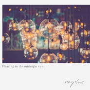
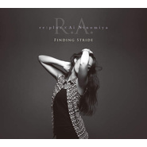
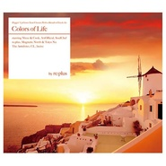
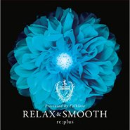
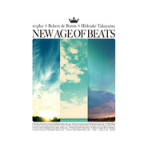
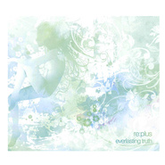

Re:plus
============================

|  |  |
| :--: | :-- |
| [<br>Re:plus](https://i.xiami.com/replus) | **地区**: Japan 日本<br>**风格**: 电子 Electronic, 爵士 Jazz, 爵士嘻哈 Jazz Hip Hop, 流行 Pop<br>**播放数**: 23134285<br>**粉丝数**: 24294<br>**评论数**: 1118<br> |

## 档案

<div>
音乐家Hiroaki Watanabe（钢琴家 / 纯音乐作曲家 / 音乐制作人）的个人solo project。<br>
凭借2009年7月发售的《IN YA MELLOW TONE 3》中收录的出道曲《Everlasting Truth》，在iTunes Hip Hop榜单上获得第1名的好成绩，re:plus在业界如同彗星一般出现在众人面前。<br>
2010年3月发售了至今仍然在Hip Hop领域金字塔顶端的第1张专辑《Everlasting Truth》，在iTunes Hip Hop榜单上获得第1名，创造了累计销量超过了25,000张的长期热销记录。<br>
2011年发售的第2张专辑《Ordinary Landscape》、2015年发售的第3张专辑《miscellany》，均以热销记录奠定了re:plus不可动摇的人气地位。<br>
2015年，由Bad News主办的JAZZ HIP HOP/MELLOW BEATS活动“Fuse”在中国进行了首次公演并且大获成功，此后也出演了众多亚洲的音乐节。<br>
2016年发售了与歌手二宫爱（Ai Ninomoya）合作的全歌曲专辑R.A.《Finding Stride》。<br>
2017年7月，决定在中国上海MAO Livehouse、北京愚公移山举办初次乐队阵容的演唱会。上海的演唱会则出现了一票难求的盛况，演唱会因此成功收官。作为给歌迷的惊喜，在演出现场，re:plus发布了re:plus 乐队录音室现场专辑 《reincarnation》。<br>
继2018年春天，中国广州、深圳、杭州三城巡演空前盛况之后，今年10月，re:plus将再访中国，前往大家等待已久的成都、重庆、武汉三城进行专场公演！<br>
艺人经纪公司：上海乐梦实业有限公司（Bad News）新浪微博：@上海乐梦_Bad_News_China<br>
同时我们也乐于与大家进行关于承接Bad News签约艺人演出活动、音乐制作、以及音乐版权使用等相关合作，如有意向，请及时与我们联系
</div>

## 专辑

| 名称 | 语种 | 唱片公司 | 发行时间 | 专辑类别 | 专辑风格 |
| :--: | :-- | :-- | :-- | :-- | :-- |
| [<br>Floating in the midnight sun](./albums/5021379833.md) | 纯音乐 | GOON TRAX | 2020年08月21日 | 录音室专辑 | 爵士流行 Jazz Pop, 爵士嘻哈 Jazz Hip Hop |
| [<br>PrayerRe:plus × Yusuke Shima](./albums/2104888806.md) | 纯音乐 | Playwright | 2019年05月10日 | 录音室专辑 | 爵士流行 Jazz Pop, 爵士嘻哈 Jazz Hip Hop |
| [<br>reincarnationre:plus band set studio live album](./albums/2102805219.md) | 日语 | re:plus | 2017年07月26日 | 录音室专辑 | 爵士说唱 Jazz Rap, 爵士 Jazz |
| [<br>Finding Stride](./albums/2102653780.md) | 英语 | KADOKAWA | 2016年06月15日 | 录音室专辑 | 爵士流行 Jazz Pop, 爵士嘻哈 Jazz Hip Hop |
| [<br>Miscellany](./albums/25455851.md) | 英语 | GOON TRAX | 2015年03月11日 | 录音室专辑 | 爵士流行 Jazz Pop, 爵士嘻哈 Jazz Hip Hop |
| [<br>Colors of Life](./albums/169032126.md) | 日语 | GOON TRAX | 2013年06月12日 | 录音室专辑 | 爵士嘻哈 Jazz Hip Hop |
| [<br>RELAX and SMOOTHpresented by Folklove](./albums/568860.md) | 英语 | FIL | 2013年01月23日 | 录音室专辑 | 爵士流行 Jazz Pop, 爵士嘻哈 Jazz Hip Hop |
| [<br>Ordinary Landscape](./albums/471697.md) | 英语 | GOON TRAX | 2011年11月09日 | 录音室专辑 | 爵士流行 Jazz Pop, 爵士嘻哈 Jazz Hip Hop |
| [<br>NEW AGE OF BEATSRe:plus / Robert de Boron / Hidetake Takayama](./albums/467165.md) | 日语 | GOON TRAX | 2011年10月05日 | 录音室专辑 | 爵士说唱 Jazz Rap |
| [<br>Everlasting Truth](./albums/370721.md) | 英语 | GOON TRAX | 2010年03月03日 | 录音室专辑 | 爵士流行 Jazz Pop, 爵士嘻哈 Jazz Hip Hop |
| [<br>In Ya Mellow Tone Official Bootleg Vol.1Mixed By Re: Plus](./albums/392740.md) | 日语 | GOON TRAX | 2009年12月02日 | 录音室专辑 | 爵士说唱 Jazz Rap |

## 评论

|  |  |  |
| :-- | :-- | :-- |
| <br>[虾米用户](https://emumo.xiami.com/u/276944698)<br>不要自我设限.....<br>2020-11-11 23:07<br>赞(0) 踩(0) | <div>♊️♊️♊️</div> |
| <br>[虾米用户](https://emumo.xiami.com/u/110088060)<br>作为报答、我吔给泥放点、...<br>2020-09-24 00:43<br>赞(1) 踩(0) | <div>回</div> |
| <br>[虾米用户](https://emumo.xiami.com/u/269414)<br><br>2020-07-12 22:55<br>赞(0) 踩(0) | <div>太喜欢你啦 </div> |
| <br>[虾米用户](https://emumo.xiami.com/u/121702052)<br>超脱<br>2020-07-03 06:23<br>赞(0) 踩(0) | <div>.</div> |
| <br>[虾米用户](https://emumo.xiami.com/u/354493224)<br>吮指原味鸡全年用户。<br>2020-04-27 08:43<br>赞(0) 踩(0) | <div></div> |
| <br>[虾米用户](https://emumo.xiami.com/u/440396249)<br>世界愛我<br>2020-04-22 12:17<br>赞(2) 踩(0) | <div>2019年的那个夏天在深圳遇到了re:plus，真好</div> |
| <br>[虾米用户](https://emumo.xiami.com/u/433566979)<br><br>2020-04-08 17:15<br>赞(0) 踩(0) | <div>好好听！！！！</div> |
| <br>[虾米用户](https://emumo.xiami.com/u/340903899)<br>我还没想好要写什么...<br>2020-04-05 17:16<br>赞(0) 踩(0) | <div>E</div> |
| <br>[虾米用户](https://emumo.xiami.com/u/356763773)<br>我还没想好要写什么...<br>2019-12-29 12:04<br>赞(0) 踩(0) | <div>~</div> |
| <br>[虾米用户](https://emumo.xiami.com/u/10727997)<br>Sincerity is...<br>2019-12-08 00:48<br>赞(0) 踩(0) | <div>我最爱的音乐人re:plus</div> |
| <br>[虾米用户](https://emumo.xiami.com/u/214165095)<br>虾米永恒！！！<br>2019-11-13 15:33<br>赞(1) 踩(0) | <div>replus的鼓手太可爱了！在微博转发了他表演white avenue的视频，然后他赞了我，我们在评论相互打招呼，他还赞了我评论  </div> |
| <br>[虾米用户](https://emumo.xiami.com/u/3583995)<br>一個人的戰爭<br>2019-10-28 00:29<br>赞(0) 踩(0) | <div>.</div> |
| <br>[虾米用户](https://emumo.xiami.com/u/50491325)<br>“那些寂寞的花朵 是春天...<br>2019-09-15 20:13<br>赞(0) 踩(0) | <div>是神仙</div> |
| <br>[虾米用户](https://emumo.xiami.com/u/50491325)<br>“那些寂寞的花朵 是春天...<br>2019-09-15 20:12<br>赞(0) 踩(0) | <div>太爱了</div> |
| <br>[虾米用户](https://emumo.xiami.com/u/49655313)<br>除了再见还可以说些什么呢<br>2019-08-12 12:16<br>赞(0) 踩(0) | <div>西安西安西安西安西安西安西安西安西安西安西安西安西安西安西安西安西安西安<br>拜托拜托拜托拜托拜托拜托拜托拜托拜托拜托拜托拜托拜托拜托拜托拜托拜托拜托</div> |
| <br>[虾米用户](https://emumo.xiami.com/u/93081992)<br>so what<br>2019-08-11 23:06<br>赞(0) 踩(0) | <div>10月南京约吗</div> |
| <br>[虾米用户](https://emumo.xiami.com/u/5145307)<br>我怀里才是人间<br>2019-07-27 17:39<br>赞(0) 踩(0) | <div>7.28北京糖果见啦</div> |
| <br>[虾米用户](https://emumo.xiami.com/u/179537724)<br>我还没想好要写什么...<br>2019-07-13 02:56<br>赞(0) 踩(0) | <div>在哪里买！急死了</div> |
| ⇒ | <br>[虾米用户](https://emumo.xiami.com/u/377597263)<br><br>2019-07-18 11:48<br>赞(0) 踩(0) | <div>秀动、大麦</div> |
| <br>[虾米用户](https://emumo.xiami.com/u/313119731)<br>我还没想好要写什么...<br>2019-05-17 15:13<br>赞(16) 踩(0) | <div>本月巡演将要开始。务必今年也来现场看一看吧。<br><br>5.24　广州MAO<br>5.25　长沙46<br>5.26　杭州MAO<br>7.26　深圳B10<br>7.27　上海MODERNSKY LAB<br>7.28　北京糖果LIVE<br>10.25　成都乐空间<br>10.26　武汉VOX<br>10.27　南京欧拉艺术空间</div> |
| ⇒ | <br>[虾米用户](https://emumo.xiami.com/u/175885092)<br>是音乐，让我看见你.<br>2019-05-20 10:17<br>赞(0) 踩(0) | <div>新专辑虾米音乐什么时候上架</div> |
| ⇒ | <br>[虾米用户](https://emumo.xiami.com/u/42963872)<br>我还没想好要写什么...<br>2019-07-10 23:12<br>赞(0) 踩(0) | <div>了</div> |
| ⇒ | <br>[虾米用户](https://emumo.xiami.com/u/49655313)<br>除了再见还可以说些什么呢<br>2019-08-12 12:17<br>赞(0) 踩(0) | <div>来西安吧！拜托了！</div> |
| ⇒ | <br>[虾米用户](https://emumo.xiami.com/u/289037079)<br>十二<br>2019-09-23 01:02<br>赞(0) 踩(0) | <div>看到了我在的城市！一定一定抽时间来！咱们见个面！   </div> |
| <br>[虾米用户](https://emumo.xiami.com/u/295542159)<br>Ciao<br>2019-05-14 16:23<br>赞(1) 踩(0) | <div>新专《Prayer》快点出啦 隔壁云已经捷足先登辽</div> |
| ⇒ | <br>[虾米用户](https://emumo.xiami.com/u/277538886)<br>风雨里做个大人，阳光下做...<br>2020-09-08 17:55<br>赞(0) 踩(0) | <div>已经出了哦</div> |
| <br>[虾米用户](https://emumo.xiami.com/u/9260656)<br>whatever<br>2019-04-26 07:37<br>赞(0) 踩(0) | <div>广州见吧</div> |
| <br>[虾米用户](https://emumo.xiami.com/u/407859749)<br><br>2019-04-21 08:54<br>赞(1) 踩(0) | <div>雨天的静听。</div> |
| <br>[虾米用户](https://emumo.xiami.com/u/10895210)<br><br>2019-03-31 22:48<br>赞(2) 踩(0) | <div>广州live约的 </div> |
| ⇒ | <br>[虾米用户](https://emumo.xiami.com/u/5800264)<br>我还没想好要写什么...<br>2019-04-17 20:22<br>赞(0) 踩(0) | <div>有啊！</div> |
| <br>[虾米用户](https://emumo.xiami.com/u/17641139)<br>lovely and p...<br>2019-03-16 11:47<br>赞(0) 踩(0) | <div>所以今年有新作吗？</div> |
| ⇒ | <br>[虾米用户](https://emumo.xiami.com/u/10895210)<br><br>2019-03-31 22:47<br>赞(0) 踩(0) | <div>有的 中国巡演会发布</div> |
| ⇒ | <br>[虾米用户](https://emumo.xiami.com/u/17641139)<br>lovely and p...<br>2019-03-31 23:18<br>赞(0) 踩(0) | <div><q><b>发条橙汁说：</b></q></div> |
| <br>[虾米用户](https://emumo.xiami.com/u/375261021)<br>爱音乐，爱生活<br>2019-03-10 11:36<br>赞(0) 踩(0) | <div></div> |
| <br>[虾米用户](https://emumo.xiami.com/u/12464012)<br>这个世界太疯狂<br>2019-03-07 22:45<br>赞(0) 踩(0) | <div>十周年</div> |
| <br>[虾米用户](https://emumo.xiami.com/u/45686435)<br>一壺飛鳧 尋山夢鶴   ...<br>2019-03-04 19:11<br>赞(0) 踩(0) | <div></div> |
| <br>[虾米用户](https://emumo.xiami.com/u/346492287)<br>虾米不要离开我！<br>2019-03-04 12:33<br>赞(0) 踩(0) | <div>去年看不成的，今年一定要去看了。如果身边有你，就更好了，可惜不会有。</div> |
| <br>[虾米用户](https://emumo.xiami.com/u/225730375)<br>我爱你. zl<br>2019-02-12 16:33<br>赞(3) 踩(0) | <div>也是我和你认识之后看的第一场<br><br>也是最后一场<br>后悔没有牵着你的手<br>没有站在你的身边<br>你让我拍小提琴 然后我就傻乎乎的全程都在拍小提琴<br>我为什么没有拍你啊<br>我怎么这么傻</div> |
| ⇒ | <br>[虾米用户](https://emumo.xiami.com/u/354181908)<br>kiss<br>2019-02-24 14:02<br>赞(0) 踩(0) | <div>哈哈可爱</div> |
| <br>[虾米用户](https://emumo.xiami.com/u/43319143)<br>我还没想好要写什么...<br>2019-02-01 17:25<br>赞(0) 踩(0) | <div>怎么买票啊</div> |
| <br>[虾米用户](https://emumo.xiami.com/u/44587206)<br>歌单名是各种甜点和面包＃...<br>2019-02-01 09:30<br>赞(0) 踩(0) | <div>哈哈啊哈又来 </div> |
| <br>[虾米用户](https://emumo.xiami.com/u/8108924)<br>我就是我，不假思索~<br>2019-01-31 13:22<br>赞(0) 踩(0) | <div>广州的加我VX ID 拉进群：rocksai</div> |
| <br>[虾米用户](https://emumo.xiami.com/u/49655313)<br>除了再见还可以说些什么呢<br>2019-01-29 09:33<br>赞(0) 踩(0) | <div>没有西安我要哭死了  不知道十月份有没有机会去成都</div> |
| <br>[虾米用户](https://emumo.xiami.com/u/52415194)<br>♬♩♫♪♡<br>2019-01-28 20:25<br>赞(0) 踩(0) | <div>有缘再见</div> |
| <br>[虾米用户](https://emumo.xiami.com/u/225730375)<br>我爱你. zl<br>2019-01-28 16:39<br>赞(1) 踩(0) | <div>这大概是来的最勤的艺人了……一年来三次</div> |
| ⇒ | <br>[虾米用户](https://emumo.xiami.com/u/316502674)<br>在最后陪着你吧，我的虾米<br>2019-01-28 19:56<br>赞(0) 踩(0) | <div>大概很喜欢中国吧</div> |
| <br>[虾米用户](https://emumo.xiami.com/u/412325755)<br><br>2019-01-14 22:42<br>赞(0) 踩(0) | <div>气死人，竟然无法使用backspace，无语</div> |
| <br>[虾米用户](https://emumo.xiami.com/u/324879742)<br> <br>2018-10-24 12:04<br>赞(1) 踩(0) | <div>.</div> |
| <br>[虾米用户](https://emumo.xiami.com/u/26496480)<br>这小家伙很聪明什么也没留...<br>2018-10-21 22:51<br>赞(0) 踩(0) | <div>今天真美</div> |
| <br>[虾米用户](https://emumo.xiami.com/u/47000158)<br>无人问津的路口总是开满野...<br>2018-10-19 01:29<br>赞(2) 踩(0) | <div>明天成都见</div> |
| <br>[虾米用户](https://emumo.xiami.com/u/3084791)<br>修身养性<br>2018-10-15 08:08<br>赞(0) 踩(0) | <div>我就想知道啥时候来北京</div> |
| <br>[虾米用户](https://emumo.xiami.com/u/856551)<br>虾米活下去 用户指责什么...<br>2018-10-10 13:16<br>赞(0) 踩(0) | <div>记得你们第一次来的时候吗，我拿下了第一张黑胶。现在我已经是个黑胶收藏家啦。</div> |
| <br>[虾米用户](https://emumo.xiami.com/u/28794047)<br>✨<br>2018-09-24 15:16<br>赞(0) 踩(0) | <div>重庆见！</div> |
| <br>[虾米用户](https://emumo.xiami.com/u/4401950)<br><br>2018-09-04 00:17<br>赞(0) 踩(0) | <div>十一月重庆有没有一起去的伙伴</div> |
| ⇒ | <br>[虾米用户](https://emumo.xiami.com/u/106108430)<br>,<br>2018-09-10 11:00<br>赞(0) 踩(0) | <div>举手</div> |
| <br>[虾米用户](https://emumo.xiami.com/u/1250578)<br><br>2018-08-30 22:01<br>赞(1) 踩(0) | <div>武汉的有吗</div> |
| <br>[虾米用户](https://emumo.xiami.com/u/21163995)<br>心は進化するんだ。<br>2018-08-19 19:25<br>赞(0) 踩(0) | <div>Good Music</div> |
| <br>[虾米用户](https://emumo.xiami.com/u/121910914)<br>我想好好睡个觉<br>2018-08-12 20:36<br>赞(0) 踩(0) | <div>i</div> |
| <br>[虾米用户](https://emumo.xiami.com/u/44587206)<br>歌单名是各种甜点和面包＃...<br>2018-07-22 00:05<br>赞(1) 踩(0) | <div>明年再来江浙吧！今年十月的几个城市对我来说路费都太高了，明年我们能再见吧？！</div> |
| <br>[虾米用户](https://emumo.xiami.com/u/4401950)<br><br>2018-07-10 01:48<br>赞(0) 踩(0) | <div>重庆的有木有</div> |
| ⇒ | <br>[虾米用户](https://emumo.xiami.com/u/106108430)<br>,<br>2018-09-10 10:58<br>赞(0) 踩(0) | <div>-有-</div> |
| <br>[虾米用户](https://emumo.xiami.com/u/31737208)<br>我想和你虚度世界。<br>2018-07-09 23:20<br>赞(3) 踩(0) | <div>又一个喜欢的歌手巡演。我的钱都是大风刮来的吗</div> |
| <br>[虾米用户](https://emumo.xiami.com/u/9163738)<br>我还没想好要写什么...<br>2018-07-06 02:20<br>赞(0) 踩(0) | <div>成都的盆友们！7月西原，10月re：plus，11月DJ OKWARI～哈哈必须都去！</div> |
| <br>[虾米用户](https://emumo.xiami.com/u/1250578)<br><br>2018-07-03 12:03<br>赞(1) 踩(0) | <div>(⊙o⊙)哇今年会来武汉  好棒！！</div> |
| <br>[虾米用户](https://emumo.xiami.com/u/375210039)<br><br>2018-07-02 20:17<br>赞(0) 踩(0) | <div></div> |
| <br>[虾米用户](https://emumo.xiami.com/u/41163024)<br>I’m done.<br>2018-07-02 19:07<br>赞(0) 踩(0) | <div>嗯？最近都组团来巡演嘛</div> |
| <br>[虾米用户](https://emumo.xiami.com/u/72178784)<br>:-D<br>2018-07-01 15:03<br>赞(2) 踩(0) | <div>又来中国了！！！可惜没有我的城市以后还会看到的吧！！</div> |
| <br>[虾米用户](https://emumo.xiami.com/u/313119731)<br>我还没想好要写什么...<br>2018-07-01 14:38<br>赞(27) 踩(0) | <div>10月に中国でのツアーが決定しました。久しぶりの成都に加え、初となる重庆＆武汉！お待ちしております！<br><br>Bad News Presents<br>Fuseland China Tour 2018<br>10月19日 成都 正火艺术中心6号馆<br>10月20日 重庆 MAO Livehouse<br>10月21日 武汉 VOX LIVEHOUSE</div> |
| ⇒ | <br>[虾米用户](https://emumo.xiami.com/u/21926598)<br>peace ☮<br>2018-07-09 19:44<br>赞(0) 踩(0) | <div>或許有機會也可以來台灣</div> |
| <br>[虾米用户](https://emumo.xiami.com/u/10895210)<br><br>2018-06-15 14:21<br>赞(0) 踩(0) | <div>演出没去成，新专辑什么时候出呀 </div> |
| <br>[虾米用户](https://emumo.xiami.com/u/201391232)<br>最快的方法是先抱抱<br>2018-05-24 21:58<br>赞(0) 踩(0) | <div>彡</div> |
| <br>[虾米用户](https://emumo.xiami.com/u/15960280)<br>〜(￣▽￣〜)(〜￣▽￣...<br>2018-05-24 14:39<br>赞(1) 踩(0) | <div>666 666 666[带墨镜笑] [带墨镜笑]</div> |
| <br>[虾米用户](https://emumo.xiami.com/u/17077682)<br>滚去spotify了。C...<br>2018-05-23 22:50<br>赞(0) 踩(0) | <div>☑️</div> |
| <br>[虾米用户](https://emumo.xiami.com/u/122670826)<br>我还没想好要写什么...<br>2018-05-22 11:36<br>赞(0) 踩(0) | <div>嗯</div> |
| <br>[虾米用户](https://emumo.xiami.com/u/256591443)<br>潜意识作祟<br>2018-05-13 22:45<br>赞(0) 踩(0) | <div>这个人不知道为什么他的作品有点像爵士说唱，好舒服</div> |
| ⇒ | <br>[虾米用户](https://emumo.xiami.com/u/32319245)<br>生活的艺术在于，好好把握...<br>2018-05-16 13:08<br>赞(0) 踩(0) | <div>不是好像，就是好嘛</div> |
| <br>[虾米用户](https://emumo.xiami.com/u/256591443)<br>潜意识作祟<br>2018-05-13 22:44<br>赞(0) 踩(0) | <div>我得关注一下你</div> |
| <br>[虾米用户](https://emumo.xiami.com/u/52415194)<br>♬♩♫♪♡<br>2018-04-08 23:34<br>赞(0) 踩(0) | <div>／</div> |
| <br>[虾米用户](https://emumo.xiami.com/u/302382089)<br>。<br>2018-04-06 23:08<br>赞(0) 踩(0) | <div>用耳机享受的绝美</div> |
| <br>[虾米用户](https://emumo.xiami.com/u/355672537)<br>叶谨晨<br>2018-04-05 23:22<br>赞(0) 踩(0) | <div>歌我在动漫里听过的</div> |
| <br>[虾米用户](https://emumo.xiami.com/u/5029038)<br>蓝色天平乐队主唱兼长笛手<br>2018-03-27 12:43<br>赞(0) 踩(0) | <div>啊错过演出了！！哭唧唧</div> |
| <br>[虾米用户](https://emumo.xiami.com/u/20177386)<br>感谢一切美好的遇见❤️<br>2018-03-20 08:22<br>赞(0) 踩(0) | <div></div> |
| <br>[虾米用户](https://emumo.xiami.com/u/1474828)<br>潜入深海<br>2018-03-12 11:13<br>赞(0) 踩(0) | <div>支撑我度过了最绝望的时候。</div> |
| <br>[虾米用户](https://emumo.xiami.com/u/39499025)<br>【=◈︿◈=】<br>2018-03-04 11:20<br>赞(1) 踩(0) | <div>现场听sunrise sunset，又完成一个心愿。现场鸡皮疙瘩了好多回，下张专辑你会跟哪些音乐人合作呢？好期待啊～</div> |
| <br>[虾米用户](https://emumo.xiami.com/u/325762)<br> <br>2018-03-04 10:42<br>赞(0) 踩(0) | <div>昨晚深圳场很棒！</div> |
| <br>[虾米用户](https://emumo.xiami.com/u/155947)<br>一期一会<br>2018-03-04 08:10<br>赞(0) 踩(0) | <div>朋友圈看到昨晚深圳场了，啥时再来帝都呀 </div> |
| <br>[虾米用户](https://emumo.xiami.com/u/12464012)<br>这个世界太疯狂<br>2018-03-04 01:19<br>赞(0) 踩(0) | <div>错过了太难过</div> |
| <br>[虾米用户](https://emumo.xiami.com/u/92343946)<br>我还没想好要写什么...<br>2018-03-04 01:11<br>赞(0) 踩(0) | <div>演出非常成功，多次想掉泪。实在太棒了，再次谢谢你们带来这么精彩的演出！一如既往支持！ </div> |
| <br>[虾米用户](https://emumo.xiami.com/u/25091254)<br>网易云：   -Mary...<br>2018-03-02 21:23<br>赞(2) 踩(0) | <div>两年前临高考都要翘课 一个人赶去广州看演出，今年病了足足整个新年，今天本该和朋友一起去现场，过个开心的元宵节，而我依然在打吊瓶。。</div> |
| <br>[虾米用户](https://emumo.xiami.com/u/5061788)<br>世界需要音乐<br>2018-03-02 11:42<br>赞(0) 踩(0) | <div>资深Jazz-Hiphop乐迷，深圳组队的同学私。</div> |
| <br>[虾米用户](https://emumo.xiami.com/u/133103650)<br><br>2018-02-23 15:09<br>赞(1) 踩(0) | <div>甜到发疯</div> |
| <br>[虾米用户](https://emumo.xiami.com/u/48304635)<br>音乐信仰<br>2018-02-21 22:28<br>赞(0) 踩(0) | <div>！！果然两年后又来了，但素很遗憾还是去不成。</div> |
| <br>[虾米用户](https://emumo.xiami.com/u/313119731)<br>我还没想好要写什么...<br>2018-02-15 16:16<br>赞(1) 踩(0) | <div>3月广州，深圳，杭州的巡演情报及专访已经刊登在#看见音乐#。赶快来读读看～<br>网页链接：<a href="https://www.kanjian.com/indier/interview/1590/" target="_blank" rel="nofollow noreferrer noopener">https://www.kanjian.com/indier/interview/1590/</a></div> |
| <br>[虾米用户](https://emumo.xiami.com/u/44185697)<br>争知我，倚阑干处，正恁凝...<br>2018-02-13 12:41<br>赞(0) 踩(0) | <div>3月4号杭州求队友啊 </div> |
| <br>[虾米用户](https://emumo.xiami.com/u/5680860)<br>听听没烦恼<br>2018-02-11 00:19<br>赞(0) 踩(0) | <div>鼓声中表露出曰系男的绝决</div> |
| <br>[虾米用户](https://emumo.xiami.com/u/39499025)<br>【=◈︿◈=】<br>2018-02-05 18:16<br>赞(0) 踩(0) | <div>這次不會再錯過，深圳見。有一起的+++</div> |
| <br>[虾米用户](https://emumo.xiami.com/u/27787177)<br>涉江采芙蓉<br>2018-02-01 18:51<br>赞(0) 踩(0) | <div>杭州见    </div> |
| <br>[虾米用户](https://emumo.xiami.com/u/2739505)<br>Doppelgänger...<br>2018-01-27 16:42<br>赞(0) 踩(0) | <div>&amp;bull;</div> |
| <br>[虾米用户](https://emumo.xiami.com/u/16396509)<br><br>2017-12-26 15:33<br>赞(0) 踩(0) | <div>听说你是神人</div> |
| <br>[虾米用户](https://emumo.xiami.com/u/12464012)<br>这个世界太疯狂<br>2017-12-24 22:57<br>赞(1) 踩(0) | <div>明年广州现场见！希望届时你能在我身边！</div> |
| <br>[虾米用户](https://emumo.xiami.com/u/1604346)<br>再見<br>2017-12-21 22:56<br>赞(0) 踩(0) | <div>嗯 在TU辦啊有點猶豫 去不去好呢都有一年沒去過TU了（拜託不要讓我看到還有飛鏢機存在就好</div> |
| ⇒ | <br>[虾米用户](https://emumo.xiami.com/u/18286791)<br>我还没想好要写什么...<br>2017-12-21 23:23<br>赞(0) 踩(0) | <div>哈哈哈哈哈哈哈抓到一個你</div> |
| ⇒ | <br>[虾米用户](https://emumo.xiami.com/u/8542277)<br>一<br>2017-12-22 11:44<br>赞(0) 踩(0) | <div>好像还是有飞镖机哈哈</div> |
| ⇒ | <br>[虾米用户](https://emumo.xiami.com/u/1604346)<br>再見<br>2017-12-22 20:56<br>赞(0) 踩(0) | <div><q><b>LsToa说：</b></q></div> |
| ⇒ | <br>[虾米用户](https://emumo.xiami.com/u/1604346)<br>再見<br>2017-12-22 20:56<br>赞(0) 踩(0) | <div><q><b>今日大吉说：</b></q></div> |
| ⇒ | <br>[虾米用户](https://emumo.xiami.com/u/18286791)<br>我还没想好要写什么...<br>2017-12-23 12:04<br>赞(0) 踩(0) | <div><q><b>▲sonimhilary说：</b></q></div> |
| ⇒ | <br>[虾米用户](https://emumo.xiami.com/u/1604346)<br>再見<br>2017-12-23 16:08<br>赞(0) 踩(0) | <div><q><b>今日大吉说：</b></q></div> |
| <br>[虾米用户](https://emumo.xiami.com/u/339307605)<br><br>2017-12-21 10:07<br>赞(23) 踩(0) | <div>Hi everyone!!! It&amp;rsquo;s Ai Ninomiya<br>It&amp;rsquo;s been so cold in Japan so I guess it&amp;rsquo;s even colder in China<br>Please take care and come with good health on 2018 Jan 13th &amp;amp; 14th to the live show!!!<br>Love you all,<br>Ai ​​​​</div> |
| <br>[虾米用户](https://emumo.xiami.com/u/155947)<br>一期一会<br>2017-12-20 19:18<br>赞(0) 踩(0) | <div>要巡演啦</div> |
| <br>[虾米用户](https://emumo.xiami.com/u/1628715)<br>呆B<br>2017-12-20 18:51<br>赞(1) 踩(0) | <div>3月4杭州见！</div> |
| <br>[虾米用户](https://emumo.xiami.com/u/409160)<br><br>2017-12-20 11:57<br>赞(0) 踩(0) | <div>2018有深圳站 期待 </div> |
| <br>[虾米用户](https://emumo.xiami.com/u/1161728)<br><br>2017-12-20 09:53<br>赞(0) 踩(0) | <div>北京哭哭 ;(</div> |
| <br>[虾米用户](https://emumo.xiami.com/u/313119731)<br>我还没想好要写什么...<br>2017-12-20 01:52<br>赞(44) 踩(0) | <div>来年また中国で演奏することになりました！楽しみです。<br>我决定明年再次在中国演出。请来看看！<br><br>re:plus中国ツアー2018開催決定！<br>【広州站】3月2日 TU凸空間<br>【深圳站】3月3日 10现场<br>【杭州站】3月4日 MAO Livehouse 杭州</div> |
| ⇒ | <br>[虾米用户](https://emumo.xiami.com/u/8466618)<br><br>2018-02-05 14:27<br>赞(0) 踩(0) | <div>WAITIING FOY YOU!!!</div> |
| <br>[虾米用户](https://emumo.xiami.com/u/25091254)<br>网易云：   -Mary...<br>2017-12-20 01:43<br>赞(0) 踩(0) | <div>2018tu凸再次见面</div> |
| <br>[虾米用户](https://emumo.xiami.com/u/1115247)<br>@Nebula_7293<br>2017-12-20 01:34<br>赞(0) 踩(0) | <div></div> |
| <br>[虾米用户](https://emumo.xiami.com/u/7573161)<br> <br>2017-12-18 10:23<br>赞(1) 踩(0) | <div>160元不议价出上海票 不小心买重了  有需要的加微信tatuuy</div> |
| <br>[虾米用户](https://emumo.xiami.com/u/3046)<br>Love Fighter<br>2017-12-07 16:04<br>赞(0) 踩(0) | <div>JAZZ HIP HOP活动《Fuseland》2018年第二弹，携手超高人气日系爵士嘻哈re:plus、美女小提琴手望月明香，美貌与实力并存的萨克斯演奏家WaKaNa首次来到广州、深圳与杭州，为大家呈现更加精彩的演出。<br><br>购票：<br>秀动：<a href="https://www.showstart.com/event/list?type=1&amp;amp;tag=19656" target="_blank" rel="nofollow noreferrer noopener">https://www.showstart.com/event/list?type=1&amp;amp;tag=19656</a><br>乐童：<a href="http://www.musikid.com/new/tour/10574" target="_blank" rel="nofollow noreferrer noopener">http://www.musikid.com/new/tour/10574</a></div> |
| <br>[虾米用户](https://emumo.xiami.com/u/4784050)<br>天真有邪<br>2017-12-04 18:44<br>赞(0) 踩(0) | <div>巡演！</div> |
| <br>[虾米用户](https://emumo.xiami.com/u/10205776)<br>转Spotify<br>2017-12-01 22:01<br>赞(2) 踩(0) | <div>毫不犹豫买了2018年3月份的演出票</div> |
| <br>[虾米用户](https://emumo.xiami.com/u/281862774)<br><br>2017-11-07 14:31<br>赞(0) 踩(0) | <div>私はあなたの曲が本当に好きです </div> |
| <br>[虾米用户](https://emumo.xiami.com/u/50683026)<br><br>2017-10-31 23:42<br>赞(0) 踩(0) | <div>嘿嘿!</div> |
| <br>[虾米用户](https://emumo.xiami.com/u/68577338)<br>思君如思乡<br>2017-10-30 17:54<br>赞(0) 踩(0) | <div></div> |
| <br>[虾米用户](https://emumo.xiami.com/u/8946950)<br>灌不饱的耳朵<br>2017-10-30 10:17<br>赞(0) 踩(0) | <div>日系总会有许多这种feel的DJ组合，颠覆了我脑海里固有的DJ印象。</div> |
| <br>[虾米用户](https://emumo.xiami.com/u/2599618)<br> <br>2017-10-27 23:48<br>赞(0) 踩(0) | <div>re：plus在四月即将在成都开始他的中国巡演，目前我们需要招募成都以及深圳的两名贴海报志愿者。并送一张演出门票，海报每站需要贴5、60张，在演出前两天贴完即可。贴海报的具体位置以各个酒吧，学校为主。每贴一张发一幅远景照给我即可，希望各位可以帮帮忙，谢谢</div> |
| <br>[虾米用户](https://emumo.xiami.com/u/635654)<br><br>2017-10-27 23:45<br>赞(1) 踩(0) | <div>现场惊喜 女sax的手 女主唱的腿 大叔dj的表情 都是亮点</div> |
| <br>[虾米用户](https://emumo.xiami.com/u/6748265)<br><br>2017-10-27 23:25<br>赞(0) 踩(0) | <div>很喜欢J-POP的风格。。。旋律欢快而优美，听着不会觉得特别累或者特别悲伤，会感到很舒服，心情也会变得轻松快乐起来。。。工作学习累了，听着音乐，疲惫一扫而空，留下的是音乐的美好，生活的美好。。。</div> |
| <br>[虾米用户](https://emumo.xiami.com/u/11159124)<br>今生都是第一次。<br>2017-10-27 23:06<br>赞(0) 踩(0) | <div>欢迎喜欢音乐的各位朋友加入音乐群，魔曲。群号：53251062<br>大家在一起探讨，好的音乐共享才是王道。音乐无国界，魔曲欢迎你。</div> |
| <br>[虾米用户](https://emumo.xiami.com/u/4015583)<br>永遠的蝦米<br>2017-10-14 08:26<br>赞(0) 踩(0) | <div>  </div> |
| <br>[虾米用户](https://emumo.xiami.com/u/1320669)<br>ツ<br>2017-10-10 17:04<br>赞(0) 踩(0) | <div>0.0</div> |
| <br>[虾米用户](https://emumo.xiami.com/u/207200431)<br>到底会流落何方<br>2017-10-06 10:40<br>赞(0) 踩(0) | <div>好巧1000</div> |
| <br>[虾米用户](https://emumo.xiami.com/u/297761280)<br><br>2017-10-05 13:04<br>赞(0) 踩(0) | <div>  </div> |
| <br>[虾米用户](https://emumo.xiami.com/u/6652575)<br>mbz2006<br>2017-09-22 20:13<br>赞(0) 踩(0) | <div>ok</div> |
| <br>[虾米用户](https://emumo.xiami.com/u/41588656)<br><br>2017-09-19 08:50<br>赞(0) 踩(0) | <div>没有为什么</div> |
| <br>[虾米用户](https://emumo.xiami.com/u/20571854)<br>这家伙很聪明什么也没留下...<br>2017-09-19 02:06<br>赞(0) 踩(0) | <div>啊！完全没有想到是jazz呢！这么清新的jazz</div> |
| <br>[虾米用户](https://emumo.xiami.com/u/1115247)<br>@Nebula_7293<br>2017-09-03 14:16<br>赞(0) 踩(0) | <div>心</div> |
| <br>[虾米用户](https://emumo.xiami.com/u/598006)<br>飞越黑夜和考验<br>2017-08-26 13:50<br>赞(0) 踩(0) | <div>广州呢？</div> |
| <br>[虾米用户](https://emumo.xiami.com/u/194880639)<br>感谢虾米<br>2017-08-02 19:02<br>赞(0) 踩(0) | <div>好听啊，但好像不是爵士吧</div> |
| <br>[虾米用户](https://emumo.xiami.com/u/54686131)<br>要听更多喜欢的歌~~~<br>2017-07-23 19:38<br>赞(0) 踩(0) | <div>愉悦的心情～～～</div> |
| <br>[虾米用户](https://emumo.xiami.com/u/45052758)<br>我还没想好要写什么...<br>2017-07-23 02:00<br>赞(0) 踩(0) | <div>很精彩，只是没听够</div> |
| <br>[虾米用户](https://emumo.xiami.com/u/2085554)<br> <br>2017-07-23 01:06<br>赞(2) 踩(0) | <div>现场刚回来～拉小提琴的小姐姐很有气质啊</div> |
| <br>[虾米用户](https://emumo.xiami.com/u/1005696)<br> <br>2017-07-22 23:37<br>赞(2) 踩(0) | <div>愚公移山刚看完现场 赞哭了 </div> |
| <br>[虾米用户](https://emumo.xiami.com/u/20453749)<br>我知道你知道我的秘密<br>2017-07-22 14:36<br>赞(1) 踩(0) | <div>萨克斯小姐姐超棒的</div> |
| <br>[虾米用户](https://emumo.xiami.com/u/8108924)<br>我就是我，不假思索~<br>2017-07-22 11:27<br>赞(1) 踩(0) | <div>上海的朋友快来认领我2333</div> |
| <br>[虾米用户](https://emumo.xiami.com/u/8108924)<br>我就是我，不假思索~<br>2017-07-22 11:27<br>赞(0) 踩(0) | <div>GOOD SHOW！！！！！！！！</div> |
| <br>[虾米用户](https://emumo.xiami.com/u/2266972)<br>世界很大，没理由寂寞。<br>2017-07-21 23:42<br>赞(0) 踩(0) | <div>再说一次！很棒！</div> |
| <br>[虾米用户](https://emumo.xiami.com/u/2266972)<br>世界很大，没理由寂寞。<br>2017-07-21 23:16<br>赞(0) 踩(0) | <div>太棒啦！再让我说一遍！</div> |
| <br>[虾米用户](https://emumo.xiami.com/u/2266972)<br>世界很大，没理由寂寞。<br>2017-07-21 23:16<br>赞(0) 踩(0) | <div>刚看完现场，太棒啦！热血沸腾！</div> |
| <br>[虾米用户](https://emumo.xiami.com/u/2928117)<br>你好<br>2017-07-21 17:45<br>赞(0) 踩(0) | <div>演出快乐！！！  </div> |
| <br>[虾米用户](https://emumo.xiami.com/u/31166894)<br><br>2017-07-18 10:44<br>赞(1) 踩(0) | <div>愚公移山見</div> |
| ⇒ | <br>[虾米用户](https://emumo.xiami.com/u/9006633)<br>欲持一壶酒，远慰风雨夕。<br>2017-07-19 00:25<br>赞(0) 踩(0) | <div>同。</div> |
| ⇒ | <br>[虾米用户](https://emumo.xiami.com/u/44185697)<br>争知我，倚阑干处，正恁凝...<br>2017-07-22 12:54<br>赞(0) 踩(0) | <div>同</div> |
| <br>[虾米用户](https://emumo.xiami.com/u/7796972)<br> <br>2017-07-17 20:16<br>赞(0) 踩(0) | <div>广州呢？</div> |
| <br>[虾米用户](https://emumo.xiami.com/u/1187446)<br>Color my lif...<br>2017-07-12 20:54<br>赞(0) 踩(0) | <div>广州呢</div> |
| <br>[虾米用户](https://emumo.xiami.com/u/248231513)<br><br>2017-07-11 16:08<br>赞(0) 踩(0) | <div>头像终于还是变成了一个人，有点心酸。</div> |
| <br>[虾米用户](https://emumo.xiami.com/u/24143615)<br>嘘!<br>2017-07-10 20:59<br>赞(0) 踩(0) | <div>上海的走一波 组团留言</div> |
| <br>[虾米用户](https://emumo.xiami.com/u/1250578)<br><br>2017-07-09 15:02<br>赞(0) 踩(0) | <div>贝格时代是关门了嚒,没有任何消息推送了</div> |
| ⇒ | <br>[虾米用户](https://emumo.xiami.com/u/37606682)<br> <br>2017-07-12 14:30<br>赞(0) 踩(0) | <div>武汉的，一起额？</div> |
| <br>[虾米用户](https://emumo.xiami.com/u/1250578)<br><br>2017-07-09 14:57<br>赞(1) 踩(0) | <div>有没有人想去听演唱会滴，求组团</div> |
| <br>[虾米用户](https://emumo.xiami.com/u/155947)<br>一期一会<br>2017-07-09 00:02<br>赞(1) 踩(0) | <div>愚公移山，组团欢迎</div> |
| <br>[虾米用户](https://emumo.xiami.com/u/35218723)<br>不懂乐理<br>2017-07-08 15:22<br>赞(1) 踩(0) | <div>2017为什么不来杭州？</div> |
| <br>[虾米用户](https://emumo.xiami.com/u/229490650)<br>就像他在游戏中所追求的排...<br>2017-07-08 15:16<br>赞(0) 踩(0) | <div>哈哈</div> |
| <br>[虾米用户](https://emumo.xiami.com/u/9486114)<br>倾东海以为酒<br>2017-07-08 14:01<br>赞(0) 踩(0) | <div>为什么不来广州 卟卟T T</div> |
| <br>[虾米用户](https://emumo.xiami.com/u/3815293)<br>baby Jesus s...<br>2017-07-08 13:47<br>赞(2) 踩(0) | <div>北京见</div> |
| <br>[虾米用户](https://emumo.xiami.com/u/3973844)<br>在虾米找爱音乐的老伴<br>2017-07-08 13:40<br>赞(0) 踩(0) | <div>只有在上海，没有广州？</div> |
| <br>[虾米用户](https://emumo.xiami.com/u/45405088)<br><br>2017-07-08 13:29<br>赞(0) 踩(0) | <div>操 我去成都了</div> |
| <br>[虾米用户](https://emumo.xiami.com/u/43107725)<br>音乐就像蜜糖使我快乐<br>2017-07-08 13:27<br>赞(0) 踩(0) | <div>深圳的小伙伴求加场</div> |
| <br>[虾米用户](https://emumo.xiami.com/u/87425694)<br>1989年成立，日本音乐<br>2017-07-08 13:08<br>赞(2) 踩(0) | <div>内容已删除</div> |
| ⇒ | <br>[虾米用户](https://emumo.xiami.com/u/43107725)<br>音乐就像蜜糖使我快乐<br>2017-07-08 13:27<br>赞(0) 踩(0) | <div>妖怪吧</div> |
| ⇒ | <br>[虾米用户](https://emumo.xiami.com/u/45405088)<br><br>2017-07-08 13:28<br>赞(0) 踩(0) | <div>哇靠</div> |
| ⇒ | <br>[虾米用户](https://emumo.xiami.com/u/39549707)<br>静悄悄做人<br>2017-07-08 23:01<br>赞(0) 踩(0) | <div>啊</div> |
| <br>[虾米用户](https://emumo.xiami.com/u/2887063)<br>閑 庭 除 鶴 跡<br>2017-06-30 14:40<br>赞(0) 踩(0) | <div>see you in Shanghai</div> |
| <br>[虾米用户](https://emumo.xiami.com/u/52034644)<br>身体会跳舞<br>2017-06-21 08:40<br>赞(0) 踩(0) | <div>你好</div> |
| <br>[虾米用户](https://emumo.xiami.com/u/2266972)<br>世界很大，没理由寂寞。<br>2017-06-19 12:27<br>赞(0) 踩(0) | <div>0721！！！上海见！！！！！！！！！票已买好！！！！！</div> |
| <br>[虾米用户](https://emumo.xiami.com/u/97390042)<br>每个人都可以是杀手<br>2017-06-06 15:29<br>赞(1) 踩(0) | <div>终于又要来中国啦～欢迎～</div> |
| <br>[虾米用户](https://emumo.xiami.com/u/43792753)<br>精灵都爱音乐<br>2017-05-30 12:15<br>赞(0) 踩(0) | <div>日光女神 月光女神 蕾欧娜 皎月</div> |
| <br>[虾米用户](https://emumo.xiami.com/u/2852800)<br>LOVE TRANCE<br>2017-05-29 23:58<br>赞(0) 踩(0) | <div>迷幻舞曲。TRANCE,</div> |
| <br>[虾米用户](https://emumo.xiami.com/u/38663419)<br><br>2017-05-22 14:17<br>赞(0) 踩(0) | <div>jazz hiphop启蒙 爱你</div> |
| <br>[虾米用户](https://emumo.xiami.com/u/2491381)<br>只不过是个<br>2017-05-17 16:42<br>赞(0) 踩(0) | <div>听得心中充满爱 我也可以做个温暖的人</div> |
| <br>[虾米用户](https://emumo.xiami.com/u/43348310)<br>认真对待生活，认清他，了...<br>2017-05-17 00:07<br>赞(1) 踩(0) | <div>希望今年还会来中国巡演！</div> |
| <br>[虾米用户](https://emumo.xiami.com/u/3089567)<br>instagram、網易...<br>2017-05-15 18:55<br>赞(0) 踩(0) | <div>Ｅｒｒｏｒ.</div> |
| <br>[虾米用户](https://emumo.xiami.com/u/1250578)<br><br>2017-04-22 14:26<br>赞(3) 踩(0) | <div>不知道今年有没有演唱会，错过了去年，今年还会有嚒</div> |
| <br>[虾米用户](https://emumo.xiami.com/u/4448371)<br>还没想好<br>2017-04-01 09:21<br>赞(0) 踩(0) | <div>本命 你好</div> |
| <br>[虾米用户](https://emumo.xiami.com/u/282820781)<br> <br>2017-03-23 23:49<br>赞(0) 踩(0) | <div></div> |
| <br>[虾米用户](https://emumo.xiami.com/u/27787177)<br>涉江采芙蓉<br>2017-02-06 20:19<br>赞(2) 踩(0) | <div>什么时候再来巡演！好期待  </div> |
| <br>[虾米用户](https://emumo.xiami.com/u/8108924)<br>我就是我，不假思索~<br>2017-01-29 15:41<br>赞(0) 踩(0) | <div>Finding Stride终于发布了！！！有广州2016.4.8一起去LIVE的小伙伴吗？</div> |
| ⇒ | <br>[虾米用户](https://emumo.xiami.com/u/25091254)<br>网易云：   -Mary...<br>2017-01-30 14:26<br>赞(0) 踩(0) | <div>有缘人 哈哈哈</div> |
| <br>[虾米用户](https://emumo.xiami.com/u/260643513)<br><br>2017-01-09 16:19<br>赞(0) 踩(0) | <div>好听，感受到了生活的气息</div> |
| <br>[虾米用户](https://emumo.xiami.com/u/5280401)<br><br>2017-01-07 22:54<br>赞(0) 踩(0) | <div>jazz rap 纯乐</div> |
| <br>[虾米用户](https://emumo.xiami.com/u/90303044)<br> (￣∇￣)<br>2017-01-04 14:57<br>赞(0) 踩(0) | <div>极品</div> |
| <br>[虾米用户](https://emumo.xiami.com/u/1959541)<br>听音乐很幸福<br>2016-12-19 16:27<br>赞(0) 踩(0) | <div>今年7月来成都了？！居然不知道！好遗憾  </div> |
| <br>[虾米用户](https://emumo.xiami.com/u/68577338)<br>思君如思乡<br>2016-11-24 20:22<br>赞(0) 踩(0) | <div></div> |
| <br>[虾米用户](https://emumo.xiami.com/u/9266823)<br>N O T H I N ...<br>2016-11-23 18:14<br>赞(1) 踩(0) | <div>好吧，蝦米8週年數據顯示我聽過最多的歌是他們的，關注了⋯⋯</div> |
| <br>[虾米用户](https://emumo.xiami.com/u/79463822)<br>Hello Muther...<br>2016-11-21 22:01<br>赞(0) 踩(0) | <div>beat</div> |
| <br>[虾米用户](https://emumo.xiami.com/u/2570040)<br>私信我可以帮你找吉他谱<br>2016-10-26 16:21<br>赞(0) 踩(0) | <div>为什么 autumn leaf 没有排第一？</div> |
| <br>[虾米用户](https://emumo.xiami.com/u/4230706)<br><br>2016-10-23 20:08<br>赞(0) 踩(0) | <div>居然是活的？难得啊</div> |
| <br>[虾米用户](https://emumo.xiami.com/u/598006)<br>飞越黑夜和考验<br>2016-10-15 12:33<br>赞(1) 踩(0) | <div>继续等新专 </div> |
| <br>[虾米用户](https://emumo.xiami.com/u/1250578)<br><br>2016-09-19 11:29<br>赞(2) 踩(0) | <div>现在才发现，下载了这么多喜欢的音乐都是出自同一人，实在喜欢，喜欢这音乐带来的感觉，自由，浪漫，广阔的节奏，想象在绿地里拥抱阳光.从现实的无感，带到想象中的美感</div> |
| <br>[虾米用户](https://emumo.xiami.com/u/9513422)<br>虾米歌单迁徙到网易☁️:...<br>2016-08-26 02:31<br>赞(0) 踩(0) | <div>❤️</div> |
| <br>[虾米用户](https://emumo.xiami.com/u/52429494)<br> <br>2016-08-25 08:51<br>赞(0) 踩(0) | <div>真好 幸福的一天又开始了 </div> |
| <br>[虾米用户](https://emumo.xiami.com/u/49265597)<br>我还没想好要写什么...<br>2016-08-12 17:25<br>赞(0) 踩(0) | <div></div> |
| <br>[虾米用户](https://emumo.xiami.com/u/689388)<br><br>2016-07-28 13:48<br>赞(0) 踩(0) | <div>轻快</div> |
| <br>[虾米用户](https://emumo.xiami.com/u/118686864)<br><br>2016-07-15 13:37<br>赞(21) 踩(0) | <div>错过了re:plus的演出，怎能再错过Sam Ock呢？7月19~24日，成都，深圳，广州，北京，上海五城巡演。<br>Sam ock &amp;amp; J.Han 优雅的曲风加上澎湃的说唱，带来清凉和现场激情。<br>详情围脖 ：贝格时代</div> |
| ⇒ | <br>[虾米用户](https://emumo.xiami.com/u/268984)<br>byebye my lo...<br>2016-08-29 13:56<br>赞(0) 踩(0) | <div>全错过了 </div> |
| <br>[虾米用户](https://emumo.xiami.com/u/124077418)<br><br>2016-07-14 21:05<br>赞(2) 踩(0) | <div>Sam ock中国巡演，有没有人约啊</div> |
| <br>[虾米用户](https://emumo.xiami.com/u/2599618)<br> <br>2016-07-13 12:52<br>赞(2) 踩(0) | <div>继re:plus之后，和re：plus的专业合作户sam ock也将要来中国巡演了，上次在re:plus 演出结束之后，许多童鞋表示被他们各种圈粉，这次，相信胖胖的sam ock也不会让大家失望，细腻的声线配合sam ock 独有的嗓音，你绝对值得拥有，据说网友各种反馈说听了他的声音耳朵会怀孕、想绑架sam ock来给他唱歌、看到sam ock表示再激动不过了，不过，这些都要亲自到现场来体会才是正确的大开方式，废话不多说，等你来约！<br>巡演日期：7月19日成都站 小酒馆空间、7月20日深圳站 B10、7月22日广州站 凸空间、7月23日北京站  愚公移山、7月24日上海站 浅水湾小剧场。</div> |
| ⇒ | <br>[虾米用户](https://emumo.xiami.com/u/124077418)<br><br>2016-07-14 21:06<br>赞(0) 踩(0) | <div>出发了</div> |
| ⇒ | <br>[虾米用户](https://emumo.xiami.com/u/16266581)<br><br>2016-07-26 14:34<br>赞(0) 踩(0) | <div><q><b>沙漠小鱼88说：</b></q></div> |
| <br>[虾米用户](https://emumo.xiami.com/u/867739)<br>Instagram：MO...<br>2016-07-12 15:13<br>赞(2) 踩(0) | <div>え？東京に来てくれないの もしライブとかやるなら絶対行きますから </div> |
| <br>[虾米用户](https://emumo.xiami.com/u/6019243)<br><br>2016-07-09 13:44<br>赞(3) 踩(0) | <div>静冈县特产DJ啊，好多这种风格的都是静冈县的，</div> |
| <br>[虾米用户](https://emumo.xiami.com/u/606760)<br>魂牵一线<br>2016-07-04 02:18<br>赞(2) 踩(0) | <div>听</div> |
| <br>[虾米用户](https://emumo.xiami.com/u/50762372)<br>Hi,<br>2016-07-03 12:08<br>赞(2) 踩(0) | <div>啊啊啊啊错过了！</div> |
| <br>[虾米用户](https://emumo.xiami.com/u/9281390)<br><br>2016-07-02 14:22<br>赞(2) 踩(0) | <div>645546456464646</div> |
| <br>[虾米用户](https://emumo.xiami.com/u/9486114)<br>倾东海以为酒<br>2016-05-29 23:31<br>赞(3) 踩(0) | <div>欢迎来厦门嘛</div> |
| <br>[虾米用户](https://emumo.xiami.com/u/85148548)<br><br>2016-05-20 10:07<br>赞(2) 踩(0) | <div>～</div> |
| <br>[虾米用户](https://emumo.xiami.com/u/40491994)<br> <br>2016-05-18 01:05<br>赞(2) 踩(0) | <div>(๑‾᷅^‾᷅๑) 手机上下也要软妹币的啊</div> |
| <br>[虾米用户](https://emumo.xiami.com/u/8015969)<br>听好歌<br>2016-05-16 10:44<br>赞(2) 踩(0) | <div>Jazz-hiphop</div> |
| <br>[虾米用户](https://emumo.xiami.com/u/16266581)<br><br>2016-05-13 14:09<br>赞(3) 踩(0) | <div>来国内演出完了才知道，可惜</div> |
| ⇒ | <br>[虾米用户](https://emumo.xiami.com/u/36678155)<br> <br>2016-05-23 12:21<br>赞(0) 踩(0) | <div>我知道了因为上学也去不成 </div> |
| <br>[虾米用户](https://emumo.xiami.com/u/18526115)<br><br>2016-05-09 08:47<br>赞(1) 踩(0) | <div>谢谢！一定要再来北京哦。</div> |
| <br>[虾米用户](https://emumo.xiami.com/u/11472475)<br>我还没想好要写什么...<br>2016-05-06 02:28<br>赞(1) 踩(0) | <div>大神</div> |
| <br>[虾米用户](https://emumo.xiami.com/u/54686131)<br>要听更多喜欢的歌~~~<br>2016-05-04 19:58<br>赞(1) 踩(0) | <div>武汉呢？？？</div> |
| <br>[虾米用户](https://emumo.xiami.com/u/158586096)<br><br>2016-05-04 08:33<br>赞(1) 踩(0) | <div>从静到动。</div> |
| <br>[虾米用户](https://emumo.xiami.com/u/6965583)<br>人體穿刺師°<br>2016-04-30 22:49<br>赞(1) 踩(0) | <div>❤</div> |
| <br>[虾米用户](https://emumo.xiami.com/u/23402802)<br>jhh真爱粉~<br>2016-04-29 23:07<br>赞(1) 踩(0) | <div>明年一定要再来广州^_^</div> |
| <br>[虾米用户](https://emumo.xiami.com/u/3376323)<br><br>2016-04-28 21:55<br>赞(1) 踩(0) | <div>求广州站歌单，有一首一直找不到</div> |
| <br>[虾米用户](https://emumo.xiami.com/u/6515158)<br>weibo：杯砸_aer...<br>2016-04-25 08:12<br>赞(1) 踩(0) | <div>期待更多的演出！</div> |
| <br>[虾米用户](https://emumo.xiami.com/u/1187446)<br>Color my lif...<br>2016-04-24 22:34<br>赞(1) 踩(0) | <div>一定要再来广州~~!!!!!</div> |
| <br>[虾米用户](https://emumo.xiami.com/u/31854471)<br>turn up<br>2016-04-24 21:35<br>赞(1) 踩(0) | <div>明年来南京吧！</div> |
| <br>[虾米用户](https://emumo.xiami.com/u/24578949)<br> <br>2016-04-24 19:32<br>赞(2) 踩(0) | <div>西安其实可以来一下，西北歌迷很多～</div> |
| <br>[虾米用户](https://emumo.xiami.com/u/2928117)<br>你好<br>2016-04-24 19:28<br>赞(1) 踩(0) | <div>还要等一年 </div> |
| <br>[虾米用户](https://emumo.xiami.com/u/48304635)<br>音乐信仰<br>2016-04-24 17:36<br>赞(1) 踩(0) | <div>好哇，但愿明年6月8号之后可以来成都</div> |
| <br>[虾米用户](https://emumo.xiami.com/u/6513787)<br>林局长的女儿黛玉<br>2016-04-24 17:15<br>赞(1) 踩(0) | <div>现在才知道刚来过中国！后悔没去看！</div> |
| <br>[虾米用户](https://emumo.xiami.com/u/134917968)<br>不畏将来，不念过去<br>2016-04-12 08:23<br>赞(1) 踩(0) | <div>什么时候来重庆？</div> |
| <br>[虾米用户](https://emumo.xiami.com/u/6946315)<br><br>2016-04-11 01:07<br>赞(6) 踩(0) | <div>今晚的Re:plus桑依旧可爱！在场外握到了手感动！とても素晴らしい夜でした！</div> |
| ⇒ | <br>[虾米用户](https://emumo.xiami.com/u/3857570)<br>我还没想好要写什么...<br>2016-04-14 11:56<br>赞(0) 踩(0) | <div>开森！</div> |
| <br>[虾米用户](https://emumo.xiami.com/u/8108924)<br>我就是我，不假思索~<br>2016-04-10 21:37<br>赞(1) 踩(0) | <div>广州场回来久久不能平静！阿姨洗铁路！！！Re ：Plus一生推么么哒！</div> |
| <br>[虾米用户](https://emumo.xiami.com/u/4422351)<br><br>2016-04-10 10:50<br>赞(3) 踩(0) | <div>广州站前排，视频发上instagram后，replus回复感谢了！相当惊喜</div> |
| ⇒ | <br>[虾米用户](https://emumo.xiami.com/u/8108924)<br>我就是我，不假思索~<br>2016-04-10 21:36<br>赞(0) 踩(0) | <div>碰上Re:plus生日这种惊喜我会铭记一辈子！</div> |
| ⇒ | <br>[虾米用户](https://emumo.xiami.com/u/12805028)<br>panorama<br>2016-04-23 08:05<br>赞(0) 踩(0) | <div><q><b>蹦迪中魔王说：</b></q></div> |
| <br>[虾米用户](https://emumo.xiami.com/u/16085464)<br>我还没想好要写什么...<br>2016-04-10 08:43<br>赞(1) 踩(0) | <div>广州站返场的那首歌叫什么名字来着</div> |
| ⇒ | <br>[虾米用户](https://emumo.xiami.com/u/598006)<br>飞越黑夜和考验<br>2016-04-10 14:09<br>赞(0) 踩(0) | <div><a href="http://www.xiami.com/song/1774036212?spm=a1z1s.6659513.0.0.iofmqF" target="_blank" rel="nofollow noreferrer noopener">http://www.xiami.com/song/1774036212?spm=a1z1s.6659513.0.0.iofmqF</a></div> |
| ⇒ | <br>[虾米用户](https://emumo.xiami.com/u/16085464)<br>我还没想好要写什么...<br>2016-04-10 15:13<br>赞(0) 踩(0) | <div><q><b>Cantaniii说：</b></q></div> |
| ⇒ | <br>[虾米用户](https://emumo.xiami.com/u/7755291)<br> <br>2016-04-10 17:25<br>赞(0) 踩(0) | <div>yourside?</div> |
| ⇒ | <br>[虾米用户](https://emumo.xiami.com/u/16085464)<br>我还没想好要写什么...<br>2016-04-10 22:07<br>赞(0) 踩(0) | <div><q><b>Threpac说：</b></q></div> |
| <br>[虾米用户](https://emumo.xiami.com/u/2928117)<br>你好<br>2016-04-10 07:59<br>赞(1) 踩(0) | <div>西原和plus，干嘛都挤在这段时间来，西原8号上海，plus广州，我不能把自己砍成两块啊……先买了西原，只好割爱了……要赶回家，所以赶不上你们上海的演出了。 </div> |
| <br>[虾米用户](https://emumo.xiami.com/u/258760)<br>删了网易云才记起我没有把...<br>2016-04-09 23:40<br>赞(8) 踩(0) | <div>WaKaNa的saxphone真的惊艳了。现场果然不一样。</div> |
| ⇒ | <br>[虾米用户](https://emumo.xiami.com/u/8108924)<br>我就是我，不假思索~<br>2016-04-10 21:38<br>赞(0) 踩(0) | <div>对啊气场满满！！！</div> |
| <br>[虾米用户](https://emumo.xiami.com/u/7866777)<br>我是鸡腿叔叔！<br>2016-04-09 17:08<br>赞(1) 踩(0) | <div>气氛特别棒！！！</div> |
| <br>[虾米用户](https://emumo.xiami.com/u/598006)<br>飞越黑夜和考验<br>2016-04-09 10:41<br>赞(4) 踩(0) | <div>去完广州场，感觉完美了，气氛爆好，还有生日惊喜感动哭的少年 </div> |
| ⇒ | <br>[虾米用户](https://emumo.xiami.com/u/3256585)<br><br>2016-04-10 19:07<br>赞(0) 踩(0) | <div>敲可爱～～</div> |
| <br>[虾米用户](https://emumo.xiami.com/u/9958501)<br>wb: theworld...<br>2016-04-09 08:24<br>赞(1) 踩(0) | <div>今晚北京见</div> |
| <br>[虾米用户](https://emumo.xiami.com/u/2398715)<br><br>2016-04-09 02:54<br>赞(3) 踩(0) | <div>睇了今晚的show，great show！ 签个到！</div> |
| <br>[虾米用户](https://emumo.xiami.com/u/8017171)<br>GG<br>2016-04-09 00:18<br>赞(2) 踩(0) | <div>广州气氛爆棚</div> |
| ⇒ | <br>[虾米用户](https://emumo.xiami.com/u/23443417)<br>shit<br>2016-04-09 07:45<br>赞(0) 踩(0) | <div>生日哈哈哈</div> |
| <br>[虾米用户](https://emumo.xiami.com/u/180847)<br>只有心知道 岁月不宽宏<br>2016-04-09 00:01<br>赞(3) 踩(0) | <div>广州的大家幸苦啦~</div> |
| <br>[虾米用户](https://emumo.xiami.com/u/6515158)<br>weibo：杯砸_aer...<br>2016-04-08 23:56<br>赞(2) 踩(0) | <div>看到微博，赶在最后几分钟过来说声生日快乐&amp;gt; &amp;lt;HAPPY BIRTHDAY!!!</div> |
| <br>[虾米用户](https://emumo.xiami.com/u/23443417)<br>shit<br>2016-04-08 23:18<br>赞(2) 踩(0) | <div>我在这</div> |
| <br>[虾米用户](https://emumo.xiami.com/u/36974558)<br> <br>2016-04-08 23:03<br>赞(2) 踩(0) | <div>刚刚听完，意犹未尽啊  </div> |
| <br>[虾米用户](https://emumo.xiami.com/u/7159185)<br><br>2016-04-08 21:00<br>赞(2) 踩(0) | <div>我在听现场啊！！！</div> |
| ⇒ | <br>[虾米用户](https://emumo.xiami.com/u/8108924)<br>我就是我，不假思索~<br>2016-04-09 18:43<br>赞(0) 踩(0) | <div>一起加入广州微群啦啦啦加wechat：rocksai</div> |
| <br>[虾米用户](https://emumo.xiami.com/u/856551)<br>虾米活下去 用户指责什么...<br>2016-04-08 19:38<br>赞(1) 踩(0) | <div>成都站的朋友们:6日演出后购买周边的时候，本人丢失了一张IYMT黑胶赠送的cd，当时是被排在我前方购买cd的小伙伴误拿了 。如果小伙伴看到这条信息，前联系我，谢谢</div> |
| ⇒ | <br>[虾米用户](https://emumo.xiami.com/u/2599618)<br> <br>2016-04-08 22:03<br>赞(0) 踩(0) | <div>请捡到的小伙伴联系主办方</div> |
| ⇒ | <br>[虾米用户](https://emumo.xiami.com/u/856551)<br>虾米活下去 用户指责什么...<br>2016-04-13 14:50<br>赞(0) 踩(0) | <div><q><b>贝格时代Big-time说：</b></q></div> |
| <br>[虾米用户](https://emumo.xiami.com/u/1282269)<br><br>2016-04-08 11:41<br>赞(1) 踩(0) | <div>求加北京队伍。周六摩登场</div> |
| ⇒ | <br>[虾米用户](https://emumo.xiami.com/u/2599618)<br> <br>2017-12-17 16:20<br>赞(0) 踩(0) | <div>加微信15313134226演出官方微信组队</div> |
| <br>[虾米用户](https://emumo.xiami.com/u/2716817)<br>ｺﾝﾁｬ━━ヽ(★ゝω<br>2016-04-07 21:16<br>赞(2) 踩(0) | <div>能求个live的歌单吗?~</div> |
| <br>[虾米用户](https://emumo.xiami.com/u/2921671)<br>larve<br>2016-04-07 21:12<br>赞(1) 踩(0) | <div>b10今晚我在 </div> |
| <br>[虾米用户](https://emumo.xiami.com/u/9552584)<br>人生太短，也太长。<br>2016-04-07 15:15<br>赞(2) 踩(0) | <div>明天见~</div> |
| <br>[虾米用户](https://emumo.xiami.com/u/156729)<br><br>2016-04-07 09:13<br>赞(3) 踩(0) | <div>上海站on stage有同去的小伙伴吗</div> |
| ⇒ | <br>[虾米用户](https://emumo.xiami.com/u/3358490)<br>我只关注和我共同爱好超3...<br>2016-04-10 08:56<br>赞(0) 踩(0) | <div>去</div> |
| <br>[虾米用户](https://emumo.xiami.com/u/6402925)<br>微博iblackbrd<br>2016-04-07 01:27<br>赞(1) 踩(0) | <div>在英国回不去北京看巡演 期待有更多的机会!heart be with you guys!!</div> |
| <br>[虾米用户](https://emumo.xiami.com/u/6515158)<br>weibo：杯砸_aer...<br>2016-04-07 00:57<br>赞(3) 踩(0) | <div>replus最后一曲安可跟着唱了，惊喜！没想过能听到！</div> |
| <br>[虾米用户](https://emumo.xiami.com/u/6515158)<br>weibo：杯砸_aer...<br>2016-04-07 00:56<br>赞(2) 踩(0) | <div>现场最感动的还是replus自己弹的老砖那几首曲子，前奏几个音符一出来就知道是哪一首。</div> |
| <br>[虾米用户](https://emumo.xiami.com/u/1451063)<br>暂无签名~<br>2016-04-07 00:21<br>赞(1) 踩(0) | <div>成都首站演出圆满hahah</div> |
| <br>[虾米用户](https://emumo.xiami.com/u/3068952)<br>靠音乐续命，靠行走解忧<br>2016-04-06 17:08<br>赞(1) 踩(0) | <div>北京见</div> |
| <br>[虾米用户](https://emumo.xiami.com/u/4309062)<br>啦啦啦<br>2016-04-06 13:24<br>赞(2) 踩(0) | <div>没有去过小酒馆音乐空间应该是室内哇 今天下雨衣服穿少了的说</div> |
| <br>[虾米用户](https://emumo.xiami.com/u/48533328)<br>一曲茶炉暖色    别问...<br>2016-04-06 11:53<br>赞(2) 踩(0) | <div>今天的成都阴天下小雨来点jazzhiphop再好不过了</div> |
| <br>[虾米用户](https://emumo.xiami.com/u/1187446)<br>Color my lif...<br>2016-04-03 14:52<br>赞(1) 踩(0) | <div>广州见</div> |
| <br>[虾米用户](https://emumo.xiami.com/u/4370606)<br>我爱头发比人多<br>2016-04-03 13:59<br>赞(2) 踩(0) | <div>深圳有小伙伴组队么,还没去过现场,求姿势</div> |
| <br>[虾米用户](https://emumo.xiami.com/u/13442663)<br>我知暗涌，我不再碰。<br>2016-04-02 20:48<br>赞(0) 踩(0) | <div>唉 超想去 可是没时间</div> |
| <br>[虾米用户](https://emumo.xiami.com/u/73570298)<br> <br>2016-03-31 21:45<br>赞(0) 踩(0) | <div>maya今天才知道好激动！！坐标成都求组队otz</div> |
| <br>[虾米用户](https://emumo.xiami.com/u/4213420)<br><br>2016-03-31 18:45<br>赞(0) 踩(0) | <div>130转一张深圳的      买了两张，朋友有事没法去我自己去票多一张</div> |
| ⇒ | <br>[虾米用户](https://emumo.xiami.com/u/42678742)<br> <br>2016-04-01 14:27<br>赞(0) 踩(0) | <div>转出去了吗？转出去了我就买票了。刚决定去。坐标深圳。</div> |
| ⇒ | <br>[虾米用户](https://emumo.xiami.com/u/4213420)<br><br>2016-04-05 01:11<br>赞(0) 踩(0) | <div><q><b>SkipperCH说：</b></q></div> |
| ⇒ | <br>[虾米用户](https://emumo.xiami.com/u/4213420)<br><br>2016-04-05 01:15<br>赞(0) 踩(0) | <div><q><b>SkipperCH说：</b></q></div> |
| ⇒ | <br>[虾米用户](https://emumo.xiami.com/u/42678742)<br> <br>2016-04-05 23:05<br>赞(0) 踩(0) | <div><q><b>ivyshen说：</b></q></div> |
| <br>[虾米用户](https://emumo.xiami.com/u/63047540)<br><br>2016-03-29 21:51<br>赞(0) 踩(0) | <div>今年只在成都有演出吗？</div> |
| ⇒ | <br>[虾米用户](https://emumo.xiami.com/u/2599618)<br> <br>2016-03-30 06:05<br>赞(0) 踩(0) | <div>北京、上海、成都、广州、深圳都有</div> |
| <br>[虾米用户](https://emumo.xiami.com/u/5169131)<br>我还没想好要写什么...<br>2016-03-27 20:25<br>赞(0) 踩(0) | <div>！！</div> |
| <br>[虾米用户](https://emumo.xiami.com/u/2165528)<br> <br>2016-03-26 19:30<br>赞(0) 踩(0) | <div>我好难过！赶不回不了成都！！！！ JAZZ-HIPHOP启蒙师！</div> |
| ⇒ | <br>[虾米用户](https://emumo.xiami.com/u/2599618)<br> <br>2016-03-26 19:46<br>赞(0) 踩(0) | <div>不要难过，我们到时候会发一段re：plus的现场视频到微博，亲可以关注我们的微博@贝格时代了解更多消息 </div> |
| <br>[虾米用户](https://emumo.xiami.com/u/649983)<br><br>2016-03-26 16:33<br>赞(0) 踩(0) | <div>4.10上海票，可同行的联系~</div> |
| <br>[虾米用户](https://emumo.xiami.com/u/24578949)<br> <br>2016-03-26 16:04<br>赞(0) 踩(0) | <div>深圳的求小伙伴一起啊</div> |
| ⇒ | <br>[虾米用户](https://emumo.xiami.com/u/2599618)<br> <br>2016-03-26 19:28<br>赞(0) 踩(0) | <div>加15313134226，找同去的小伙伴哦</div> |
| ⇒ | <br>[虾米用户](https://emumo.xiami.com/u/34496095)<br>喵科动物~<br>2016-03-31 20:20<br>赞(0) 踩(0) | <div>同求微416683756</div> |
| <br>[虾米用户](https://emumo.xiami.com/u/1919964)<br>keep calm an...<br>2016-03-26 11:32<br>赞(0) 踩(0) | <div>没人陪我去听，就算了。能来成都已经很棒了</div> |
| ⇒ | <br>[虾米用户](https://emumo.xiami.com/u/4309062)<br>啦啦啦<br>2016-04-06 13:23<br>赞(0) 踩(0) | <div>走起</div> |
| <br>[虾米用户](https://emumo.xiami.com/u/1797575)<br><br>2016-03-26 00:43<br>赞(0) 踩(0) | <div>和岸部真名的tour撞车了……呜呜呜，该去哪个呢</div> |
| ⇒ | <br>[虾米用户](https://emumo.xiami.com/u/6687304)<br>我还没想好要写什么...<br>2016-03-27 12:18<br>赞(0) 踩(0) | <div>岸部眞明吧 真的被震撼到</div> |
| ⇒ | <br>[虾米用户](https://emumo.xiami.com/u/5781632)<br><br>2016-04-02 16:37<br>赞(0) 踩(0) | <div>岸部吧 这个主办方真心坑</div> |
| <br>[虾米用户](https://emumo.xiami.com/u/8447006)<br> <br>2016-03-25 14:07<br>赞(0) 踩(0) | <div>4月6号成都Re：plus 演唱会 转三张票 呜呜 去不了了 朋友们 需要票联系我啊</div> |
| ⇒ | <br>[虾米用户](https://emumo.xiami.com/u/73570298)<br> <br>2016-03-31 22:49<br>赞(0) 踩(0) | <div>还有票吗？</div> |
| ⇒ | <br>[虾米用户](https://emumo.xiami.com/u/73570298)<br> <br>2016-03-31 22:49<br>赞(0) 踩(0) | <div>还有票吗？</div> |
| ⇒ | <br>[虾米用户](https://emumo.xiami.com/u/8447006)<br> <br>2017-10-27 22:59<br>赞(0) 踩(0) | <div><q><b>M说：</b></q></div> |
| ⇒ | <br>[虾米用户](https://emumo.xiami.com/u/8447006)<br> <br>2017-10-27 22:59<br>赞(0) 踩(0) | <div><q><b>M说：</b></q></div> |
| <br>[虾米用户](https://emumo.xiami.com/u/10039350)<br> <br>2016-03-24 11:09<br>赞(1) 踩(0) | <div>4.10在上海？</div> |
| <br>[虾米用户](https://emumo.xiami.com/u/5980152)<br>噗、噗叽！<br>2016-03-24 08:08<br>赞(1) 踩(0) | <div>站内信轰炸真心real烦，作为伪粉，我选择退散(ﾟ∀ﾟ)/</div> |
| <br>[虾米用户](https://emumo.xiami.com/u/2599618)<br> <br>2016-03-24 02:04<br>赞(0) 踩(0) | <div>臣妾知道错了，已自行掌嘴</div> |
| <br>[虾米用户](https://emumo.xiami.com/u/5840205)<br><br>2016-03-23 17:03<br>赞(1) 踩(0) | <div>4月7号深圳b10有他们专场演出，我依然兴奋到爆了</div> |
| <br>[虾米用户](https://emumo.xiami.com/u/2928117)<br>你好<br>2016-03-22 21:40<br>赞(0) 踩(0) | <div>可惜我不能去了。我看了视频，你俩长得好可爱啊！谢谢你们对我们中国乐迷那么好。私信谁写的啊？像约炮似的。</div> |
| <br>[虾米用户](https://emumo.xiami.com/u/7684146)<br>luv.<br>2016-03-22 18:39<br>赞(0) 踩(0) | <div>有没有上海站 团购 的？  老司机带带我</div> |
| <br>[虾米用户](https://emumo.xiami.com/u/8128176)<br>好好活着<br>2016-03-22 11:43<br>赞(0) 踩(0) | <div>看来私信里的视频Re:plus不是感冒了，就是有鼻炎</div> |
| <br>[虾米用户](https://emumo.xiami.com/u/8858880)<br> 公開処刑 ／ リリー・...<br>2016-03-22 10:27<br>赞(0) 踩(0) | <div>⚪️</div> |
| <br>[虾米用户](https://emumo.xiami.com/u/10594960)<br>挑战生活再与之妥协<br>2016-03-22 09:52<br>赞(2) 踩(0) | <div>SH的有伐？</div> |
| <br>[虾米用户](https://emumo.xiami.com/u/124077418)<br><br>2016-03-21 22:53<br>赞(0) 踩(0) | <div>现场有re:plus的CD签售。</div> |
| <br>[虾米用户](https://emumo.xiami.com/u/13826470)<br>每天都在倒計時<br>2016-03-21 15:09<br>赞(2) 踩(0) | <div>坐标南京 魔都有组队的吗</div> |
| <br>[虾米用户](https://emumo.xiami.com/u/2159126)<br>啊哈<br>2016-03-21 12:32<br>赞(1) 踩(0) | <div>哪位在淘宝BNONLINE这家店买过Re：plus的CD ？</div> |
| <br>[虾米用户](https://emumo.xiami.com/u/1282269)<br><br>2016-03-21 12:05<br>赞(2) 踩(0) | <div>~4.9 北京的小伙伴们走起~~~~拉拉啦</div> |
| ⇒ | <br>[虾米用户](https://emumo.xiami.com/u/124077418)<br><br>2016-03-21 22:57<br>赞(0) 踩(0) | <div>买票了吗？现在能团购，组团中。。。。。</div> |
| ⇒ | <br>[虾米用户](https://emumo.xiami.com/u/1282269)<br><br>2016-03-22 13:36<br>赞(0) 踩(0) | <div><q><b>沙漠小鱼88说：</b></q></div> |
| ⇒ | <br>[虾米用户](https://emumo.xiami.com/u/2599618)<br> <br>2016-03-22 17:18<br>赞(0) 踩(0) | <div><q><b>小欣子说：</b></q></div> |
| ⇒ | <br>[虾米用户](https://emumo.xiami.com/u/9867452)<br>Alas！<br>2016-03-22 21:32<br>赞(0) 踩(0) | <div><q><b>贝格时代Big-time说：</b></q></div> |
| ⇒ | <br>[虾米用户](https://emumo.xiami.com/u/2599618)<br> <br>2016-03-22 23:06<br>赞(0) 踩(0) | <div><q><b>Aki Sagisu说：</b></q></div> |
| ⇒ | <br>[虾米用户](https://emumo.xiami.com/u/598006)<br>飞越黑夜和考验<br>2016-03-23 21:11<br>赞(0) 踩(0) | <div><q><b>贝格时代Big-time说：</b></q></div> |
| ⇒ | <br>[虾米用户](https://emumo.xiami.com/u/5781632)<br><br>2016-03-23 22:04<br>赞(0) 踩(0) | <div><q><b>Cantaniii说：</b></q></div> |
| ⇒ | <br>[虾米用户](https://emumo.xiami.com/u/649983)<br><br>2016-03-26 16:18<br>赞(0) 踩(0) | <div><q><b>MADAO说：</b></q></div> |
| ⇒ | <br>[虾米用户](https://emumo.xiami.com/u/2599618)<br> <br>2016-03-26 19:27<br>赞(0) 踩(0) | <div><q><b>_Kankami.。说：</b></q></div> |
| ⇒ | <br>[虾米用户](https://emumo.xiami.com/u/672327)<br>眩晕在魅惑之即<br>2016-03-28 20:54<br>赞(0) 踩(0) | <div><q><b>贝格时代Big-time说：</b></q></div> |
| ⇒ | <br>[虾米用户](https://emumo.xiami.com/u/2599618)<br> <br>2016-03-28 23:14<br>赞(0) 踩(0) | <div><q><b>饕餮猫猫说：</b></q></div> |
| <br>[虾米用户](https://emumo.xiami.com/u/8070377)<br>爱雾瑞性维欧腐漏<br>2016-03-21 11:58<br>赞(3) 踩(0) | <div>最新的站内信真是污 老司机带我</div> |
| <br>[虾米用户](https://emumo.xiami.com/u/2448845)<br><br>2016-03-20 21:57<br>赞(2) 踩(0) | <div>深圳4月7号有没有人呀</div> |
| ⇒ | <br>[虾米用户](https://emumo.xiami.com/u/34496095)<br>喵科动物~<br>2016-03-31 20:14<br>赞(0) 踩(0) | <div>有，求组队</div> |
| ⇒ | <br>[虾米用户](https://emumo.xiami.com/u/2543512)<br><br>2016-04-05 11:05<br>赞(0) 踩(0) | <div>举手</div> |
| <br>[虾米用户](https://emumo.xiami.com/u/48857966)<br>无<br>2016-03-20 17:08<br>赞(2) 踩(0) | <div>买票了 广州的 求组队</div> |
| ⇒ | <br>[虾米用户](https://emumo.xiami.com/u/48857966)<br>无<br>2016-03-20 21:49<br>赞(0) 踩(0) | <div>啊哈</div> |
| ⇒ | <br>[虾米用户](https://emumo.xiami.com/u/54796710)<br>Irie Naoki<br>2016-03-22 18:07<br>赞(0) 踩(0) | <div><q><b>29说：</b></q></div> |
| ⇒ | <br>[虾米用户](https://emumo.xiami.com/u/2599618)<br> <br>2016-03-23 11:37<br>赞(0) 踩(0) | <div><q><b>X_MUSE说：</b></q></div> |
| ⇒ | <br>[虾米用户](https://emumo.xiami.com/u/12762227)<br><br>2016-03-28 20:33<br>赞(0) 踩(0) | <div>走~</div> |
| <br>[虾米用户](https://emumo.xiami.com/u/709098)<br>永别了虾米<br>2016-03-19 20:53<br>赞(2) 踩(0) | <div>期待</div> |
| <br>[虾米用户](https://emumo.xiami.com/u/10862181)<br>这家伙很聪明什么也没留下...<br>2016-03-19 18:01<br>赞(2) 踩(0) | <div>额…我突然发现我去上海那边近点，万分抱歉＝＝</div> |
| <br>[虾米用户](https://emumo.xiami.com/u/6135089)<br>有跟我相似的人咩?<br>2016-03-17 22:46<br>赞(2) 踩(0) | <div>想去广州的！！！</div> |
| ⇒ | <br>[虾米用户](https://emumo.xiami.com/u/48857966)<br>无<br>2016-03-20 17:07<br>赞(0) 踩(0) | <div>买票了吗</div> |
| ⇒ | <br>[虾米用户](https://emumo.xiami.com/u/12762227)<br><br>2016-03-28 20:32<br>赞(0) 踩(0) | <div>走起</div> |
| <br>[虾米用户](https://emumo.xiami.com/u/2175141)<br>我还没想好要写什么...<br>2016-03-15 12:24<br>赞(2) 踩(0) | <div>魔都票已买 单人的一起来组队呀</div> |
| ⇒ | <br>[虾米用户](https://emumo.xiami.com/u/51838062)<br><br>2016-03-15 23:14<br>赞(0) 踩(0) | <div>求组</div> |
| ⇒ | <br>[虾米用户](https://emumo.xiami.com/u/675104)<br>这儿快结束了 <br>2016-03-21 12:06<br>赞(0) 踩(0) | <div>我在想 北京我要不要买呢</div> |
| ⇒ | <br>[虾米用户](https://emumo.xiami.com/u/856551)<br>虾米活下去 用户指责什么...<br>2016-03-21 14:50<br>赞(0) 踩(0) | <div><q><b>zcrew说：</b></q></div> |
| ⇒ | <br>[虾米用户](https://emumo.xiami.com/u/675104)<br>这儿快结束了 <br>2016-03-21 14:51<br>赞(0) 踩(0) | <div><q><b>sk8_singo说：</b></q></div> |
| ⇒ | <br>[虾米用户](https://emumo.xiami.com/u/2175141)<br>我还没想好要写什么...<br>2016-03-21 18:08<br>赞(0) 踩(0) | <div><q><b>zcrew说：</b></q></div> |
| ⇒ | <br>[虾米用户](https://emumo.xiami.com/u/675104)<br>这儿快结束了 <br>2016-03-21 18:09<br>赞(0) 踩(0) | <div><q><b>RADIUM1996说：</b></q></div> |
| ⇒ | <br>[虾米用户](https://emumo.xiami.com/u/2175141)<br>我还没想好要写什么...<br>2016-03-21 20:10<br>赞(0) 踩(0) | <div><q><b>zcrew说：</b></q></div> |
| ⇒ | <br>[虾米用户](https://emumo.xiami.com/u/675104)<br>这儿快结束了 <br>2016-03-21 20:16<br>赞(0) 踩(0) | <div><q><b>RADIUM1996说：</b></q></div> |
| <br>[虾米用户](https://emumo.xiami.com/u/1903770)<br>unknown plea...<br>2016-03-15 00:56<br>赞(3) 踩(0) | <div>4.6成都有一起的没？</div> |
| ⇒ | <br>[虾米用户](https://emumo.xiami.com/u/8902181)<br>World's end ...<br>2016-03-17 01:44<br>赞(0) 踩(0) | <div>有！</div> |
| ⇒ | <br>[虾米用户](https://emumo.xiami.com/u/10862181)<br>这家伙很聪明什么也没留下...<br>2016-03-18 23:30<br>赞(0) 踩(0) | <div>求组队= =</div> |
| ⇒ | <br>[虾米用户](https://emumo.xiami.com/u/48857966)<br>无<br>2016-03-20 17:07<br>赞(0) 踩(0) | <div><q><b>ON说：</b></q></div> |
| ⇒ | <br>[虾米用户](https://emumo.xiami.com/u/48857966)<br>无<br>2016-03-20 17:07<br>赞(0) 踩(0) | <div><q><b>ON说：</b></q></div> |
| ⇒ | <br>[虾米用户](https://emumo.xiami.com/u/48857966)<br>无<br>2016-03-20 17:07<br>赞(0) 踩(0) | <div><q><b>ON说：</b></q></div> |
| ⇒ | <br>[虾米用户](https://emumo.xiami.com/u/10862181)<br>这家伙很聪明什么也没留下...<br>2016-03-20 17:33<br>赞(0) 踩(0) | <div><q><b>29说：</b></q></div> |
| <br>[虾米用户](https://emumo.xiami.com/u/2707304)<br><br>2016-03-14 00:54<br>赞(2) 踩(0) | <div>成都 已买票~</div> |
| <br>[虾米用户](https://emumo.xiami.com/u/31006910)<br>当你需要个夏天 我会拼了...<br>2016-03-12 00:45<br>赞(3) 踩(0) | <div>魔都有人组队么？</div> |
| ⇒ | <br>[虾米用户](https://emumo.xiami.com/u/2175141)<br>我还没想好要写什么...<br>2016-03-15 12:28<br>赞(0) 踩(0) | <div>可组</div> |
| ⇒ | <br>[虾米用户](https://emumo.xiami.com/u/31006910)<br>当你需要个夏天 我会拼了...<br>2016-03-15 19:30<br>赞(0) 踩(0) | <div><q><b>RADIUM1996说：</b></q></div> |
| ⇒ | <br>[虾米用户](https://emumo.xiami.com/u/2175141)<br>我还没想好要写什么...<br>2016-03-15 20:13<br>赞(0) 踩(0) | <div><q><b>_Soda.说：</b></q></div> |
| ⇒ | <br>[虾米用户](https://emumo.xiami.com/u/13327353)<br>唯爱与妹子及音乐不可辜负<br>2016-03-16 15:33<br>赞(0) 踩(0) | <div>求组!!</div> |
| <br>[虾米用户](https://emumo.xiami.com/u/8044654)<br>面壁者<br>2016-03-11 14:28<br>赞(1) 踩(0) | <div>4月7 深圳见~</div> |
| <br>[虾米用户](https://emumo.xiami.com/u/13327353)<br>唯爱与妹子及音乐不可辜负<br>2016-03-10 17:42<br>赞(3) 踩(0) | <div>第一次livehouse给你们了，咱们魔都见。=v=</div> |
| ⇒ | <br>[虾米用户](https://emumo.xiami.com/u/2599618)<br> <br>2016-03-11 18:02<br>赞(0) 踩(0) | <div></div> |
| <br>[虾米用户](https://emumo.xiami.com/u/8447006)<br> <br>2016-03-10 11:04<br>赞(2) 踩(0) | <div>成都来了！！！</div> |
| ⇒ | <br>[虾米用户](https://emumo.xiami.com/u/8447006)<br> <br>2016-03-25 13:49<br>赞(0) 踩(0) | <div>成都re:plus演唱会 有没有人需要票  我有三张原价转 请不到假去不了</div> |
| <br>[虾米用户](https://emumo.xiami.com/u/5110616)<br>Trance and S...<br>2016-03-09 19:24<br>赞(1) 踩(0) | <div>坐标帝都有约吗</div> |
| <br>[虾米用户](https://emumo.xiami.com/u/1954665)<br><br>2016-03-09 16:42<br>赞(1) 踩(0) | <div>买了票咯，深圳见~！</div> |
| <br>[虾米用户](https://emumo.xiami.com/u/713877)<br><br>2016-03-09 13:04<br>赞(2) 踩(0) | <div>来了来了来了来了来了终于有来上海的了！！！！！！！！！！！！</div> |
| <br>[虾米用户](https://emumo.xiami.com/u/15280328)<br>开朗之人双足踏四方，沉着...<br>2016-03-09 12:16<br>赞(1) 踩(0) | <div>何よりいい情報だ </div> |
| <br>[虾米用户](https://emumo.xiami.com/u/37950358)<br>抗忙~北鼻！！巴扎黑~~<br>2016-03-09 11:37<br>赞(1) 踩(0) | <div>4.6成都。有没有小伙伴！走起，私信</div> |
| ⇒ | <br>[虾米用户](https://emumo.xiami.com/u/37594142)<br>谁能不爱音乐呢<br>2016-03-24 08:12<br>赞(0) 踩(0) | <div>想去想去想去！可惜是周三。。。</div> |
| ⇒ | <br>[虾米用户](https://emumo.xiami.com/u/37950358)<br>抗忙~北鼻！！巴扎黑~~<br>2016-03-24 12:05<br>赞(0) 踩(0) | <div><q><b>錆び说：</b></q></div> |
| <br>[虾米用户](https://emumo.xiami.com/u/5737344)<br>你在红楼 我在西游<br>2016-03-09 10:06<br>赞(1) 踩(0) | <div>有人去北京场吗？</div> |
| <br>[虾米用户](https://emumo.xiami.com/u/10621118)<br>我还没想好要写什么...<br>2016-03-09 08:46<br>赞(1) 踩(0) | <div>嘻嘻  在小酒館等你們來！</div> |
| <br>[虾米用户](https://emumo.xiami.com/u/180847)<br>只有心知道 岁月不宽宏<br>2016-03-08 22:34<br>赞(4) 踩(0) | <div>4.8广州已买票 珠江新城见~</div> |
| ⇒ | <br>[虾米用户](https://emumo.xiami.com/u/48857966)<br>无<br>2016-03-20 17:08<br>赞(0) 踩(0) | <div>去北京的吗</div> |
| ⇒ | <br>[虾米用户](https://emumo.xiami.com/u/48857966)<br>无<br>2016-03-20 17:09<br>赞(0) 踩(0) | <div>我是去广州的 可以一起呀</div> |
| ⇒ | <br>[虾米用户](https://emumo.xiami.com/u/180847)<br>只有心知道 岁月不宽宏<br>2016-03-20 20:21<br>赞(0) 踩(0) | <div><q><b>29说：</b></q></div> |
| <br>[虾米用户](https://emumo.xiami.com/u/3133930)<br>暂无签名~<br>2016-03-08 00:00<br>赞(1) 踩(0) | <div>广州微wechat group已建立，欢迎有来现场给Replus捧场的朋友们加入o(^▽^)o<br>加wechat：rocksa 或 xyzuan ，我们会帮您加进群<br>多多扩散，组织起来嗨翻天！</div> |
| ⇒ | <br>[虾米用户](https://emumo.xiami.com/u/23443417)<br>shit<br>2016-03-15 05:48<br>赞(0) 踩(0) | <div>打错字了啊你是rocksai</div> |
| ⇒ | <br>[虾米用户](https://emumo.xiami.com/u/3133930)<br>暂无签名~<br>2016-03-15 11:36<br>赞(0) 踩(0) | <div><q><b>你好说：</b></q></div> |
| <br>[虾米用户](https://emumo.xiami.com/u/8108924)<br>我就是我，不假思索~<br>2016-03-07 23:07<br>赞(1) 踩(0) | <div>加wechat：rocksai,已建了广州微群~！！！！！！！！一起嗨！！！！</div> |
| <br>[虾米用户](https://emumo.xiami.com/u/3133930)<br>暂无签名~<br>2016-03-07 17:41<br>赞(1) 踩(0) | <div>4-8广州走一个！</div> |
| ⇒ | <br>[虾米用户](https://emumo.xiami.com/u/258760)<br>删了网易云才记起我没有把...<br>2016-03-07 21:53<br>赞(0) 踩(0) | <div>GO。</div> |
| <br>[虾米用户](https://emumo.xiami.com/u/2041417)<br><br>2016-03-07 16:15<br>赞(1) 踩(0) | <div>买了票了，深圳见</div> |
| <br>[虾米用户](https://emumo.xiami.com/u/9621636)<br>听你听的歌，感觉你还在身...<br>2016-03-07 00:58<br>赞(1) 踩(0) | <div>See ya in SH</div> |
| <br>[虾米用户](https://emumo.xiami.com/u/6504681)<br><br>2016-03-06 22:49<br>赞(2) 踩(0) | <div>WOW，4月6号好想去，不知道有没有时间</div> |
| <br>[虾米用户](https://emumo.xiami.com/u/6067102)<br><br>2016-03-06 22:31<br>赞(1) 踩(0) | <div>see u in Shanghai</div> |
| <br>[虾米用户](https://emumo.xiami.com/u/9028760)<br>豆瓣见 spotify ...<br>2016-03-06 18:58<br>赞(1) 踩(0) | <div>☄</div> |
| <br>[虾米用户](https://emumo.xiami.com/u/6815040)<br>人生需要蓄淀、<br>2016-03-06 17:06<br>赞(1) 踩(0) | <div>4月8号广州演唱会的约起！！！   </div> |
| ⇒ | <br>[虾米用户](https://emumo.xiami.com/u/48857966)<br>无<br>2016-03-20 17:10<br>赞(0) 踩(0) | <div>一起呀</div> |
| <br>[虾米用户](https://emumo.xiami.com/u/2928117)<br>你好<br>2016-03-05 09:12<br>赞(1) 踩(0) | <div>……看到你们认真地排练，我们很感动！！</div> |
| <br>[虾米用户](https://emumo.xiami.com/u/8044654)<br>面壁者<br>2016-03-05 02:35<br>赞(2) 踩(0) | <div>4月7深圳见！</div> |
| <br>[虾米用户](https://emumo.xiami.com/u/11991533)<br>2B/Not2B<br>2016-03-04 22:30<br>赞(1) 踩(0) | <div>音乐很好听<br>发音让人好奇</div> |
| <br>[虾米用户](https://emumo.xiami.com/u/30004813)<br>只是个扶她少女<br>2016-03-04 16:58<br>赞(1) 踩(0) | <div>炸裂，霸权！</div> |
| <br>[虾米用户](https://emumo.xiami.com/u/4205171)<br><br>2016-03-04 16:39<br>赞(1) 踩(0) | <div>4.8号广州见~</div> |
| <br>[虾米用户](https://emumo.xiami.com/u/23433579)<br>私は私になる<br>2016-03-03 19:59<br>赞(2) 踩(0) | <div>人生第一次去现场，好激动，已买好票，4月10号上海见！</div> |
| <br>[虾米用户](https://emumo.xiami.com/u/14091078)<br>我还没想好要写什么...<br>2016-03-03 18:46<br>赞(1) 踩(0) | <div>看了彩排视频好期待 re:plus＆Ai Ninomiya《Englishman In NewYork》</div> |
| ⇒ | <br>[虾米用户](https://emumo.xiami.com/u/24578949)<br> <br>2016-03-03 22:46<br>赞(0) 踩(0) | <div>彩排视频在哪看的?</div> |
| ⇒ | <br>[虾米用户](https://emumo.xiami.com/u/14091078)<br>我还没想好要写什么...<br>2016-03-03 22:47<br>赞(0) 踩(0) | <div><q><b>Silver说：</b></q></div> |
| ⇒ | <br>[虾米用户](https://emumo.xiami.com/u/24578949)<br> <br>2016-03-03 22:48<br>赞(0) 踩(0) | <div><q><b>Oeu5说：</b></q></div> |
| ⇒ | <br>[虾米用户](https://emumo.xiami.com/u/2772247)<br>d(˙_˙)b<br>2016-03-04 16:07<br>赞(0) 踩(0) | <div><q><b>Silver说：</b></q></div> |
| ⇒ | <br>[虾米用户](https://emumo.xiami.com/u/24578949)<br> <br>2016-03-04 18:24<br>赞(0) 踩(0) | <div><q><b>爱斯克里姆说：</b></q></div> |
| <br>[虾米用户](https://emumo.xiami.com/u/856551)<br>虾米活下去 用户指责什么...<br>2016-03-03 15:09<br>赞(1) 踩(0) | <div>天呐来成都！这是真的吗！</div> |
| <br>[虾米用户](https://emumo.xiami.com/u/24578949)<br> <br>2016-03-03 14:40<br>赞(1) 踩(0) | <div>4月7号深圳求约起啊，正好出差赶上了好棒</div> |
| <br>[虾米用户](https://emumo.xiami.com/u/6248831)<br>눈_눈<br>2016-03-03 10:43<br>赞(0) 踩(0) | <div>哇~</div> |
| <br>[虾米用户](https://emumo.xiami.com/u/1210402)<br>我还没想好要写什么...<br>2016-03-03 09:58<br>赞(0) 踩(0) | <div>好不容易盼到有来演出..结果那时候我不在深圳...</div> |
| <br>[虾米用户](https://emumo.xiami.com/u/7185208)<br>我想喜欢你<br>2016-03-03 01:33<br>赞(1) 踩(0) | <div>成都小酒馆等你们！~</div> |
| <br>[虾米用户](https://emumo.xiami.com/u/1239175)<br><br>2016-03-03 00:44<br>赞(0) 踩(0) | <div>Re:plus是已经解散了么？</div> |
| ⇒ | <br>[虾米用户](https://emumo.xiami.com/u/45158606)<br>暂无签名~<br>2016-03-09 13:39<br>赞(0) 踩(0) | <div>啊啊？</div> |
| ⇒ | <br>[虾米用户](https://emumo.xiami.com/u/1239175)<br><br>2016-03-09 19:13<br>赞(0) 踩(0) | <div><q><b>蔷说：</b></q></div> |
| ⇒ | <br>[虾米用户](https://emumo.xiami.com/u/45158606)<br>暂无签名~<br>2016-03-09 22:58<br>赞(0) 踩(0) | <div><q><b>Vinkamor说：</b></q></div> |
| <br>[虾米用户](https://emumo.xiami.com/u/5528132)<br>我还没想好要写什么...<br>2016-03-03 00:39<br>赞(7) 踩(0) | <div>成都的约起啊！！真是激动死了！！！</div> |
| <br>[虾米用户](https://emumo.xiami.com/u/1728101)<br>离线<br>2016-03-03 00:02<br>赞(2) 踩(0) | <div>要来广州啦~</div> |
| ⇒ | <br>[虾米用户](https://emumo.xiami.com/u/8108924)<br>我就是我，不假思索~<br>2016-03-07 23:07<br>赞(0) 踩(0) | <div>加wechat：rocksai,已建了广州微群~！！！！！！！！一起嗨！！！！</div> |
| <br>[虾米用户](https://emumo.xiami.com/u/4309062)<br>啦啦啦<br>2016-03-02 13:54<br>赞(0) 踩(0) | <div>哇</div> |
| <br>[虾米用户](https://emumo.xiami.com/u/54307135)<br><br>2016-03-02 13:13<br>赞(2) 踩(0) | <div>上海站已经开票啦~</div> |
| <br>[虾米用户](https://emumo.xiami.com/u/92147388)<br><br>2016-03-02 12:35<br>赞(1) 踩(0) | <div>意外だね </div> |
| <br>[虾米用户](https://emumo.xiami.com/u/18800068)<br>...<br>2016-03-02 12:18<br>赞(2) 踩(0) | <div>北京！</div> |
| <br>[虾米用户](https://emumo.xiami.com/u/6634459)<br> <br>2016-03-02 08:47<br>赞(2) 踩(0) | <div>ついに成都に来て  すごく楽しみ！</div> |
| ⇒ | <br>[虾米用户](https://emumo.xiami.com/u/118686864)<br><br>2016-03-02 12:30<br>赞(0) 踩(0) | <div>ありがとう</div> |
| ⇒ | <br>[虾米用户](https://emumo.xiami.com/u/8108924)<br>我就是我，不假思索~<br>2016-03-07 23:10<br>赞(0) 踩(0) | <div><q><b>尽职的白果说：</b></q></div> |
| <br>[虾米用户](https://emumo.xiami.com/u/44080936)<br>Omnivorous<br>2016-03-02 00:10<br>赞(1) 踩(0) | <div>WeChat:412332875 广州的jazzhiphop群 ~</div> |
| <br>[虾米用户](https://emumo.xiami.com/u/6462459)<br>一笑懸命<br>2016-03-02 00:00<br>赞(1) 踩(0) | <div>4.6成都再见</div> |
| <br>[虾米用户](https://emumo.xiami.com/u/48304635)<br>音乐信仰<br>2016-03-01 23:35<br>赞(1) 踩(0) | <div>4月6日哭瞎啊，我依旧是个苦逼的高中党.·´¯`(&amp;gt;▂&amp;lt;)´¯`·.</div> |
| <br>[虾米用户](https://emumo.xiami.com/u/1970635)<br>我还没想好要写什么...<br>2016-03-01 23:21<br>赞(1) 踩(0) | <div>4.7 SZ</div> |
| <br>[虾米用户](https://emumo.xiami.com/u/9390540)<br>Embrace ever...<br>2016-03-01 22:36<br>赞(1) 踩(0) | <div>Re：plusの皆さん4.9北京に会いましょう～❤❤❤❤❤</div> |
| <br>[虾米用户](https://emumo.xiami.com/u/7281625)<br>She needed a...<br>2016-03-01 20:02<br>赞(1) 踩(0) | <div>兴奋得睡不着啦 4.10相约上海～</div> |
| <br>[虾米用户](https://emumo.xiami.com/u/10123976)<br>Nothing<br>2016-03-01 19:39<br>赞(0) 踩(0) | <div>excited(ฅ&amp;gt;ω&amp;lt;*ฅ)！</div> |
| <br>[虾米用户](https://emumo.xiami.com/u/7365010)<br>超然<br>2016-03-01 19:32<br>赞(0) 踩(0) | <div>欢迎入驻~</div> |
| <br>[虾米用户](https://emumo.xiami.com/u/5669236)<br>あらら<br>2016-03-01 19:15<br>赞(1) 踩(0) | <div>上海，走你！！</div> |
| <br>[虾米用户](https://emumo.xiami.com/u/6066908)<br>光芒与希望 *JazzH...<br>2016-03-01 17:01<br>赞(1) 踩(0) | <div>Re:plus入驻虾米啦！~~exciting！！</div> |
| <br>[虾米用户](https://emumo.xiami.com/u/675104)<br>这儿快结束了 <br>2016-03-01 16:19<br>赞(1) 踩(0) | <div>为啥现在越来越多来中国巡演 我却不激动了呢</div> |
| <br>[虾米用户](https://emumo.xiami.com/u/5087129)<br> <br>2016-03-01 14:18<br>赞(1) 踩(0) | <div>啊啊啊啊啊！！！！巡演！</div> |
| <br>[虾米用户](https://emumo.xiami.com/u/1604346)<br>再見<br>2016-03-01 13:33<br>赞(0) 踩(0) | <div>！！！</div> |
| <br>[虾米用户](https://emumo.xiami.com/u/12951363)<br>寻找一切顺耳之音<br>2016-03-01 13:20<br>赞(1) 踩(0) | <div>完美！base羊城。必去！</div> |
| ⇒ | <br>[虾米用户](https://emumo.xiami.com/u/8108924)<br>我就是我，不假思索~<br>2016-03-07 23:07<br>赞(0) 踩(0) | <div>加wechat：rocksai,已建了广州微群~！！！！！！！！一起嗨！！！！</div> |
| <br>[虾米用户](https://emumo.xiami.com/u/2599618)<br> <br>2016-03-01 13:03<br>赞(6) 踩(0) | <div><a href="http://www.musikid.com/tour/3674" target="_blank" rel="nofollow noreferrer noopener">http://www.musikid.com/tour/3674</a>。终于盼来了，re：plus2016新专辑巡演，日本Jazz-HipHop届最受瞩目的艺人Re:Plus、女歌手Ai Ninomiya（二宫爱）、唱盘艺术家DJ Chika a.k.a. INHERIT（川上誓継）、女萨克斯手WaKaNa （水谷和佳奈）将携手，于2016年4月6日-4月10日开启中国五站（成都、深圳、广州、北京、上海）巡演。快来看看有没有你们的城市   </div> |
| ⇒ | <br>[虾米用户](https://emumo.xiami.com/u/191114)<br>我还没想好要写什么...<br>2016-03-01 14:08<br>赞(0) 踩(0) | <div>WOOOO!!!!!!!!!!!</div> |
| <br>[虾米用户](https://emumo.xiami.com/u/23443417)<br>shit<br>2016-03-01 11:48<br>赞(1) 踩(0) | <div>4月8号广州有人吗 </div> |
| ⇒ | <br>[虾米用户](https://emumo.xiami.com/u/8108924)<br>我就是我，不假思索~<br>2016-03-01 13:30<br>赞(0) 踩(0) | <div>我我我！！！不如建立个广州JAZZHIPHOP微群！</div> |
| ⇒ | <br>[虾米用户](https://emumo.xiami.com/u/23443417)<br>shit<br>2016-03-01 17:02<br>赞(0) 踩(0) | <div><q><b>蹦迪中魔王说：</b></q></div> |
| ⇒ | <br>[虾米用户](https://emumo.xiami.com/u/8108924)<br>我就是我，不假思索~<br>2016-03-01 18:20<br>赞(0) 踩(0) | <div><q><b>你好说：</b></q></div> |
| <br>[虾米用户](https://emumo.xiami.com/u/1148156)<br>我还没想好要写什么...<br>2016-03-01 11:44<br>赞(0) 踩(0) | <div>成都场已买  来中国真的非常感谢</div> |
| <br>[虾米用户](https://emumo.xiami.com/u/3500108)<br>..<br>2016-03-01 11:04<br>赞(1) 踩(0) | <div>日…要来巡演…我又看不到</div> |
| <br>[虾米用户](https://emumo.xiami.com/u/87398)<br>藏不住的是你最珍贵的倔强<br>2016-03-01 11:00<br>赞(0) 踩(0) | <div>留名</div> |
| <br>[虾米用户](https://emumo.xiami.com/u/5154741)<br>Alex<br>2016-03-01 10:56<br>赞(1) 踩(0) | <div>终于入驻了，官博上放了一段排练视频，让人期待</div> |
| <br>[虾米用户](https://emumo.xiami.com/u/1813000)<br>我不吃那套<br>2016-03-01 10:50<br>赞(0) 踩(0) | <div>这次请换个rapper谢谢您：）</div> |
| <br>[虾米用户](https://emumo.xiami.com/u/155947)<br>一期一会<br>2016-03-01 09:43<br>赞(1) 踩(0) | <div>期待巡演！</div> |
| ⇒ | <br>[虾米用户](https://emumo.xiami.com/u/782757)<br>LESS IS MORE<br>2016-03-01 10:40<br>赞(0) 踩(0) | <div>哇 入驻音乐人了 开心！！！</div> |
| <br>[虾米用户](https://emumo.xiami.com/u/2452157)<br>ଲ<br>2016-03-01 09:33<br>赞(0) 踩(0) | <div>！！</div> |
| <br>[虾米用户](https://emumo.xiami.com/u/37840483)<br>再說吧<br>2016-03-01 09:30<br>赞(0) 踩(0) | <div>！</div> |
| <br>[虾米用户](https://emumo.xiami.com/u/1284288)<br>`●ω・'<br>2016-03-01 09:29<br>赞(0) 踩(0) | <div>是二宫爱!!!!!!</div> |
| <br>[虾米用户](https://emumo.xiami.com/u/5604492)<br>‪‪♬✧訂閱號：Morn...<br>2016-03-01 09:25<br>赞(0) 踩(0) | <div>巡演啦！！</div> |
| <br>[虾米用户](https://emumo.xiami.com/u/7154254)<br>他人亦已歌<br>2016-03-01 09:20<br>赞(0) 踩(0) | <div>没西安</div> |
| <br>[虾米用户](https://emumo.xiami.com/u/14046904)<br>死ね<br>2016-03-01 09:11<br>赞(0) 踩(0) | <div>要来演出啦～</div> |
| <br>[虾米用户](https://emumo.xiami.com/u/50869110)<br>IG：77richiee...<br>2016-03-01 09:06<br>赞(0) 踩(0) | <div></div> |
| <br>[虾米用户](https://emumo.xiami.com/u/2491381)<br>只不过是个<br>2016-03-01 09:04<br>赞(0) 踩(0) | <div>巡演！这次不能再错过了</div> |
| <br>[虾米用户](https://emumo.xiami.com/u/9156158)<br>心 月似钩三星挂<br>2016-03-01 08:53<br>赞(1) 踩(0) | <div>巡演女歌手叫~爱 你老妹呀- -！</div> |
| ⇒ | <br>[虾米用户](https://emumo.xiami.com/u/2599618)<br> <br>2016-03-01 12:45<br>赞(0) 踩(0) | <div>  </div> |
| <br>[虾米用户](https://emumo.xiami.com/u/3606918)<br><br>2016-03-01 08:51<br>赞(2) 踩(0) | <div>哦哦，入驻了~上海票已买w</div> |
| <br>[虾米用户](https://emumo.xiami.com/u/212898)<br><br>2016-03-01 08:42<br>赞(0) 踩(0) | <div>哟 入驻虾米</div> |
| <br>[虾米用户](https://emumo.xiami.com/u/3805073)<br>这个家伙很聪明什么都没有...<br>2016-03-01 08:35<br>赞(0) 踩(0) | <div>太好了！！欢迎！！！！</div> |
| <br>[虾米用户](https://emumo.xiami.com/u/2640323)<br> <br>2016-03-01 08:34<br>赞(0) 踩(0) | <div>听腻了</div> |
| <br>[虾米用户](https://emumo.xiami.com/u/3442572)<br>(*¯︶¯*)<br>2016-03-01 08:31<br>赞(0) 踩(0) | <div>欢迎！</div> |
| <br>[虾米用户](https://emumo.xiami.com/u/2679882)<br>blindsided<br>2016-03-01 03:36<br>赞(0) 踩(0) | <div>wow!!</div> |
| <br>[虾米用户](https://emumo.xiami.com/u/6946315)<br><br>2016-03-01 00:43<br>赞(2) 踩(0) | <div>诶哟 惊呆了欢迎～！（这次不要和上次那个中国rapper合作了 拜托了</div> |
| <br>[虾米用户](https://emumo.xiami.com/u/2527832)<br>超越生命 解放自由<br>2016-02-29 23:59<br>赞(0) 踩(0) | <div>欢迎！</div> |
| <br>[虾米用户](https://emumo.xiami.com/u/43044429)<br>无中生有的恶趣味<br>2016-02-29 23:43<br>赞(0) 踩(0) | <div>#</div> |
| <br>[虾米用户](https://emumo.xiami.com/u/10125577)<br>原来你也在这里<br>2016-02-29 23:19<br>赞(1) 踩(0) | <div>Welcome to China~!</div> |
| <br>[虾米用户](https://emumo.xiami.com/u/3432324)<br><br>2016-02-29 23:12<br>赞(1) 踩(0) | <div>恭喜恭喜吖，前来祝贺</div> |
| <br>[虾米用户](https://emumo.xiami.com/u/1604445)<br>凡音之起，由人心生也。人...<br>2016-02-29 22:47<br>赞(1) 踩(0) | <div>选择在今天入驻 </div> |
| <br>[虾米用户](https://emumo.xiami.com/u/49038940)<br> <br>2016-02-29 22:42<br>赞(0) 踩(0) | <div>欢迎！！！</div> |
| <br>[虾米用户](https://emumo.xiami.com/u/12161298)<br>天涯海角，有缘再见如果愿...<br>2016-02-29 22:34<br>赞(0) 踩(0) | <div>WTF？！</div> |
| <br>[虾米用户](https://emumo.xiami.com/u/23324239)<br><br>2016-02-29 22:31<br>赞(0) 踩(0) | <div>欢迎</div> |
| <br>[虾米用户](https://emumo.xiami.com/u/39549707)<br>静悄悄做人<br>2016-02-29 22:06<br>赞(0) 踩(0) | <div>哇哦？？</div> |
| <br>[虾米用户](https://emumo.xiami.com/u/20641102)<br>闲者时间<br>2016-02-29 22:05<br>赞(0) 踩(0) | <div>wow!!!!!!!!!!!!!</div> |
| <br>[虾米用户](https://emumo.xiami.com/u/4486462)<br>不和听垃圾的人做朋友。<br>2016-02-29 21:56<br>赞(1) 踩(0) | <div>哇哦哇哦哇哦欢迎wwwwwwwww</div> |
| <br>[虾米用户](https://emumo.xiami.com/u/10079475)<br>有过太多纯粹的快乐 才会...<br>2016-02-29 21:47<br>赞(0) 踩(0) | <div>大神来了呜哇！</div> |
| <br>[虾米用户](https://emumo.xiami.com/u/5533089)<br>ˉ﹃ˉ<br>2016-02-29 21:33<br>赞(0) 踩(0) | <div>wow~</div> |
| <br>[虾米用户](https://emumo.xiami.com/u/6515158)<br>weibo：杯砸_aer...<br>2016-02-29 21:29<br>赞(1) 踩(0) | <div>回过神来意识到！新砖巡演！新砖要来了！期待！！</div> |
| <br>[虾米用户](https://emumo.xiami.com/u/9128610)<br>否已极，泰未来<br>2016-02-29 21:26<br>赞(0) 踩(0) | <div>又有大神级人物来了</div> |
| <br>[虾米用户](https://emumo.xiami.com/u/17604238)<br>walk me to t...<br>2016-02-29 21:24<br>赞(0) 踩(0) | <div>棒</div> |
| <br>[虾米用户](https://emumo.xiami.com/u/13869808)<br><br>2016-02-29 21:21<br>赞(0) 踩(0) | <div>Σ( ﾟдﾟ) 居然入驻了</div> |
| <br>[虾米用户](https://emumo.xiami.com/u/1195129)<br>他人就是魔鬼。<br>2016-02-29 21:12<br>赞(0) 踩(0) | <div>４・６</div> |
| <br>[虾米用户](https://emumo.xiami.com/u/18128817)<br>do you？<br>2016-02-29 21:12<br>赞(0) 踩(0) | <div>走！</div> |
| <br>[虾米用户](https://emumo.xiami.com/u/6764744)<br>Crazy。<br>2016-02-29 21:11<br>赞(1) 踩(0) | <div>哇哇</div> |
| <br>[虾米用户](https://emumo.xiami.com/u/8070377)<br>爱雾瑞性维欧腐漏<br>2016-02-29 21:10<br>赞(1) 踩(0) | <div>好嘛 都来了</div> |
| <br>[虾米用户](https://emumo.xiami.com/u/2599618)<br> <br>2016-02-29 21:09<br>赞(0) 踩(0) | <div>支持  </div> |
| <br>[虾米用户](https://emumo.xiami.com/u/6515158)<br>weibo：杯砸_aer...<br>2016-02-29 21:09<br>赞(0) 踩(0) | <div>哇！！！！订票调班！走起</div> |
| <br>[虾米用户](https://emumo.xiami.com/u/10135948)<br>⭐️<br>2016-02-29 21:08<br>赞(1) 踩(0) | <div>成都走起！！！！！！！！！！！！！！！！！！！</div> |
| <br>[虾米用户](https://emumo.xiami.com/u/10135948)<br>⭐️<br>2016-02-29 21:07<br>赞(0) 踩(0) | <div>yooooooooooooooooooooooo</div> |
| <br>[虾米用户](https://emumo.xiami.com/u/14091078)<br>我还没想好要写什么...<br>2016-02-29 21:03<br>赞(1) 踩(0) | <div>哇！支持！</div> |
| <br>[虾米用户](https://emumo.xiami.com/u/1700002)<br>V5_ORZZZZZ<br>2016-02-29 21:03<br>赞(1) 踩(0) | <div>卧槽 666666666666666666666666666666<br>666666666666666666666666666666<br>66666666666666666666</div> |
| <br>[虾米用户](https://emumo.xiami.com/u/5052969)<br>.<br>2016-02-29 21:02<br>赞(1) 踩(0) | <div>8号广州见呀</div> |
| <br>[虾米用户](https://emumo.xiami.com/u/5052969)<br>.<br>2016-02-29 21:01<br>赞(1) 踩(0) | <div>欢迎进驻</div> |
| <br>[虾米用户](https://emumo.xiami.com/u/11640829)<br>._.<br>2016-02-29 20:58<br>赞(1) 踩(0) | <div>惊吓</div> |
| <br>[虾米用户](https://emumo.xiami.com/u/1019822)<br>Weibo:传琦SAMA...<br>2016-02-29 20:51<br>赞(1) 踩(0) | <div>入驻了!~</div> |
| <br>[虾米用户](https://emumo.xiami.com/u/118686864)<br><br>2016-02-29 20:41<br>赞(358) 踩(0) | <div>我刚入驻了虾米音乐人，欢迎大家来我的个人主页，收听我的最新音乐 ，今年四月我会带着二宫爱 一起在中国进行5站巡演。4/6成都 4/7深圳 4/8广州 4/9北京 4/10上海 ，具体请关注围脖: 贝格时代_Big-time 。谢谢，希望能在现场见到大家  楽しみにしています ～o(^▽^)o</div> |
| ⇒ | <br>[虾米用户](https://emumo.xiami.com/u/5663504)<br>抱着老赵滚床单~~<br>2016-02-29 21:01<br>赞(0) 踩(0) | <div>Re:plus 大歡迎~~~！ \(^o^)/~</div> |
| ⇒ | <br>[虾米用户](https://emumo.xiami.com/u/14091078)<br>我还没想好要写什么...<br>2016-02-29 21:05<br>赞(0) 踩(0) | <div><q><b>雪名皇说：</b></q></div> |
| ⇒ | <br>[虾米用户](https://emumo.xiami.com/u/153855)<br><br>2016-02-29 21:24<br>赞(0) 踩(0) | <div>买嘎达~！！！欢迎入驻哇~！！！快来吧！约起去看现场~！！！！！！！！</div> |
| ⇒ | <br>[虾米用户](https://emumo.xiami.com/u/9867452)<br>Alas！<br>2016-03-01 14:58<br>赞(0) 踩(0) | <div></div> |
| ⇒ | <br>[虾米用户](https://emumo.xiami.com/u/7681662)<br>我还没想好要写什么...<br>2016-04-06 02:59<br>赞(0) 踩(0) | <div>广州站看你们哦</div> |
| ⇒ | <br>[虾米用户](https://emumo.xiami.com/u/1006550)<br>束缚胜无界<br>2016-04-10 16:46<br>赞(0) 踩(0) | <div>Will there be shows next year in China? Hope to see you more **</div> |
| ⇒ | <br>[虾米用户](https://emumo.xiami.com/u/5808524)<br>我要心存美好<br>2017-01-07 21:16<br>赞(0) 踩(0) | <div>有想过在南加州办吗？？？</div> |
| ⇒ | <br>[虾米用户](https://emumo.xiami.com/u/32329260)<br>很困<br>2018-07-01 14:39<br>赞(0) 踩(0) | <div>耶✌️</div> |
| ⇒ | <br>[虾米用户](https://emumo.xiami.com/u/71427438)<br>我还没想好要写什么...<br>2018-10-22 09:54<br>赞(0) 踩(0) | <div>好希望你们明年还来中国啊 </div> |
| ⇒ | <br>[虾米用户](https://emumo.xiami.com/u/40587864)<br> <br>2018-11-17 06:34<br>赞(0) 踩(0) | <div>大神啊，膜拜</div> |
| ⇒ | <br>[虾米用户](https://emumo.xiami.com/u/71427438)<br>我还没想好要写什么...<br>2019-01-29 09:41<br>赞(0) 踩(0) | <div><q><b>uYXi an说：</b></q></div> |
| <br>[虾米用户](https://emumo.xiami.com/u/16255463)<br>@Revolution9...<br>2016-02-29 01:16<br>赞(1) 踩(0) | <div>要来了</div> |
| <br>[虾米用户](https://emumo.xiami.com/u/5698983)<br>再也不愿想起不完美的旋律<br>2016-02-28 17:05<br>赞(1) 踩(0) | <div>4月份广州见！</div> |
| ⇒ | <br>[虾米用户](https://emumo.xiami.com/u/8108924)<br>我就是我，不假思索~<br>2016-03-07 23:09<br>赞(0) 踩(0) | <div>加wechat：rocksai,已建了广州微群~！！！！！！！！一起嗨！！！！</div> |
| <br>[虾米用户](https://emumo.xiami.com/u/4337336)<br>Like I care?<br>2016-02-27 17:24<br>赞(0) 踩(0) | <div>深圳场走起![带墨镜笑]</div> |
| ⇒ | <br>[虾米用户](https://emumo.xiami.com/u/3382513)<br> <br>2016-02-29 16:20<br>赞(0) 踩(0) | <div>深圳场是几号？</div> |
| ⇒ | <br>[虾米用户](https://emumo.xiami.com/u/2599618)<br> <br>2016-02-29 21:10<br>赞(0) 踩(0) | <div><q><b>野大说：</b></q></div> |
| ⇒ | <br>[虾米用户](https://emumo.xiami.com/u/1970635)<br>我还没想好要写什么...<br>2016-02-29 22:16<br>赞(0) 踩(0) | <div>走起走起</div> |
| ⇒ | <br>[虾米用户](https://emumo.xiami.com/u/4337336)<br>Like I care?<br>2016-03-01 08:28<br>赞(0) 踩(0) | <div><q><b>野大说：</b></q></div> |
| <br>[虾米用户](https://emumo.xiami.com/u/5913428)<br>後搖患者//樂是萬能藥<br>2016-02-27 01:50<br>赞(1) 踩(0) | <div>WTF 來巡演了</div> |
| <br>[虾米用户](https://emumo.xiami.com/u/96800054)<br>像大象 口味很杂<br>2016-02-26 17:43<br>赞(1) 踩(0) | <div>和西原健一郎同一周来上海巡演…有同行的么 </div> |
| <br>[虾米用户](https://emumo.xiami.com/u/4287531)<br><br>2016-02-26 10:16<br>赞(3) 踩(0) | <div>【BT呈现】日本爵士嘻哈Re:plus &amp;amp; Ai Ninomiya2016新专辑中国巡演<br>4/6成都 4/7深圳 4/8广州 4/9北京 4/10上海<br>详情威信: BigTime贝格时代<br>围脖: 贝格时代_Big-time</div> |
| <br>[虾米用户](https://emumo.xiami.com/u/153855)<br><br>2016-02-21 10:14<br>赞(3) 踩(0) | <div>2016年4月初来中国巡演啦~！！！</div> |
| ⇒ | <br>[虾米用户](https://emumo.xiami.com/u/27787177)<br>涉江采芙蓉<br>2016-02-23 08:52<br>赞(0) 踩(0) | <div>真的嘛？会去哪里？</div> |
| ⇒ | <br>[虾米用户](https://emumo.xiami.com/u/4287531)<br><br>2016-02-26 10:17<br>赞(0) 踩(0) | <div><q><b>gDHoA丶说：</b></q></div> |
| <br>[虾米用户](https://emumo.xiami.com/u/39549707)<br>静悄悄做人<br>2016-02-06 13:55<br>赞(1) 踩(0) | <div>1</div> |
| <br>[虾米用户](https://emumo.xiami.com/u/36208991)<br> <br>2016-01-28 23:33<br>赞(1) 踩(0) | <div>❤️</div> |
| <br>[虾米用户](https://emumo.xiami.com/u/101705122)<br><br>2016-01-20 19:25<br>赞(1) 踩(0) | <div>那种灵动的柔美确实可以安慰心灵</div> |
| <br>[虾米用户](https://emumo.xiami.com/u/88173552)<br>总有一首会让我感动<br>2015-12-27 20:57<br>赞(3) 踩(0) | <div>“专辑中可见Nujabes的柔美，cradle的浪漫，和Nomak的诗意” 这是我最中意的乐评☺️</div> |
| <br>[虾米用户](https://emumo.xiami.com/u/41163024)<br>I’m done.<br>2015-12-26 06:35<br>赞(0) 踩(0) | <div>完美错过live</div> |
| <br>[虾米用户](https://emumo.xiami.com/u/42023733)<br>我还没想好要写什么...<br>2015-12-23 23:49<br>赞(0) 踩(0) | <div>因为你是爵士乐</div> |
| <br>[虾米用户](https://emumo.xiami.com/u/35097905)<br><br>2015-12-20 21:43<br>赞(0) 踩(0) | <div>日本</div> |
| ⇒ | <br>[虾米用户](https://emumo.xiami.com/u/42023733)<br>我还没想好要写什么...<br>2015-12-23 20:37<br>赞(0) 踩(0) | <div>嗯，我去过</div> |
| <br>[虾米用户](https://emumo.xiami.com/u/35577075)<br>再见<br>2015-12-11 12:51<br>赞(0) 踩(0) | <div>对了 就是这种感觉</div> |
| ⇒ | <br>[虾米用户](https://emumo.xiami.com/u/42023733)<br>我还没想好要写什么...<br>2015-12-23 20:35<br>赞(0) 踩(0) | <div>迷幻的感觉</div> |
| <br>[虾米用户](https://emumo.xiami.com/u/12554850)<br>///404  Weib...<br>2015-12-09 00:34<br>赞(0) 踩(0) | <div></div> |
| <br>[虾米用户](https://emumo.xiami.com/u/11231952)<br>听音乐 常愉悦<br>2015-12-03 21:49<br>赞(0) 踩(0) | <div>不能用文字表达的感性——音乐与人生</div> |
| <br>[虾米用户](https://emumo.xiami.com/u/11231952)<br>听音乐 常愉悦<br>2015-12-01 13:40<br>赞(0) 踩(0) | <div>感觉是我听过最符合心境的jazz hiphop</div> |
| <br>[虾米用户](https://emumo.xiami.com/u/24889026)<br>我还没想好要写什么...<br>2015-11-30 20:09<br>赞(0) 踩(0) | <div>我的jazzhiphop启蒙啊</div> |
| <br>[虾米用户](https://emumo.xiami.com/u/672327)<br>眩晕在魅惑之即<br>2015-11-30 19:33<br>赞(3) 踩(0) | <div>现场非常棒。合照时候觉得replus真的小小一只 好可爱  萌萌嗒 握了手 希望下次还能来上海表演</div> |
| ⇒ | <br>[虾米用户](https://emumo.xiami.com/u/214782)<br><br>2015-12-01 04:42<br>赞(0) 踩(0) | <div>之前关注了同类型一些音乐人的推特 今年连着来了好几个 replus真人和想象中还是很同步的 或者说比想象中还可爱~♥</div> |
| ⇒ | <br>[虾米用户](https://emumo.xiami.com/u/39973330)<br>遇见你 找到我<br>2015-12-17 00:37<br>赞(0) 踩(0) | <div><q><b>Giri说：</b></q></div> |
| ⇒ | <br>[虾米用户](https://emumo.xiami.com/u/598006)<br>飞越黑夜和考验<br>2016-01-01 20:22<br>赞(0) 踩(0) | <div>太幸福了你看了现场 什么时候能来广州就好了</div> |
| <br>[虾米用户](https://emumo.xiami.com/u/33526842)<br>乐手与人生<br>2015-11-30 08:47<br>赞(0) 踩(0) | <div>Autumn leaf, 小提琴的声音一响起来，秋天温柔而又略带伤感的气息扑面而来。<br>真是用心在做的音乐</div> |
| <br>[虾米用户](https://emumo.xiami.com/u/214782)<br><br>2015-11-29 19:54<br>赞(1) 踩(0) | <div>现场太棒啦~~~~非常非常棒 不过其实我觉得纯音乐的比例能更大一点就好了 现场可能想让气氛热烈一些 连着很多首都是歌曲~【并不是不好听啦 二宫爱也非常可爱 只是我更喜欢音乐啊www</div> |
| ⇒ | <br>[虾米用户](https://emumo.xiami.com/u/672327)<br>眩晕在魅惑之即<br>2015-11-30 19:32<br>赞(0) 踩(0) | <div>okawari和nomak就是纯音乐 非常无聊 情愿看现场唱歌</div> |
| ⇒ | <br>[虾米用户](https://emumo.xiami.com/u/214782)<br><br>2015-12-01 04:36<br>赞(0) 踩(0) | <div><q><b>饕餮猫猫说：</b></q></div> |
| ⇒ | <br>[虾米用户](https://emumo.xiami.com/u/2679545)<br><br>2015-12-03 19:02<br>赞(0) 踩(0) | <div><q><b>Giri说：</b></q></div> |
| ⇒ | <br>[虾米用户](https://emumo.xiami.com/u/672327)<br>眩晕在魅惑之即<br>2016-01-12 13:33<br>赞(0) 踩(0) | <div><q><b>Giri说：</b></q></div> |
| <br>[虾米用户](https://emumo.xiami.com/u/32056965)<br>stay gold.<br>2015-11-29 17:01<br>赞(0) 踩(0) | <div>虽然没去现场 但能感受到他的诚意</div> |
| <br>[虾米用户](https://emumo.xiami.com/u/39973330)<br>遇见你 找到我<br>2015-11-29 10:50<br>赞(1) 踩(0) | <div>amazing last night except that I was a mess   </div> |
| <br>[虾米用户](https://emumo.xiami.com/u/7318384)<br><br>2015-11-29 01:23<br>赞(2) 踩(0) | <div>过来看到大家都说今晚不错 我就放心了 真的很有诚意的live 可以继续喜欢的感觉真好 ٩(●˙▿˙●)۶…⋆ฺ</div> |
| <br>[虾米用户](https://emumo.xiami.com/u/3496847)<br>夢醒了，所以心碎了。<br>2015-11-28 23:35<br>赞(6) 踩(0) | <div>现场太值当：keyboard,DJ,VO,Sax,Rapper。简直五脏俱全XD<br>虽说听不懂日语，但是听得懂音乐就行了~~~</div> |
| <br>[虾米用户](https://emumo.xiami.com/u/3581084)<br> <br>2015-11-28 23:08<br>赞(4) 踩(0) | <div>现场nice！</div> |
| <br>[虾米用户](https://emumo.xiami.com/u/14028659)<br> <br>2015-11-28 22:07<br>赞(3) 踩(0) | <div>现场太赞惹</div> |
| <br>[虾米用户](https://emumo.xiami.com/u/3496847)<br>夢醒了，所以心碎了。<br>2015-11-28 19:55<br>赞(1) 踩(0) | <div>站等开始 终于可以听到最爱的jazz hiphop</div> |
| <br>[虾米用户](https://emumo.xiami.com/u/14028659)<br> <br>2015-11-28 18:54<br>赞(0) 踩(0) | <div>出发～</div> |
| <br>[虾米用户](https://emumo.xiami.com/u/43883448)<br><br>2015-11-28 14:42<br>赞(0) 踩(0) | <div>这次复习考试去不了，下次来不知道会是什么时候了 </div> |
| <br>[虾米用户](https://emumo.xiami.com/u/39973330)<br>遇见你 找到我<br>2015-11-28 06:35<br>赞(0) 踩(0) | <div>tonight</div> |
| <br>[虾米用户](https://emumo.xiami.com/u/1367115)<br><br>2015-11-25 18:59<br>赞(0) 踩(0) | <div>■ 主题<br>Bad News presents<br>Fuse vol.1<br>re:plus 2015首次中国演出上海公演<br><br>■演出时间<br>2015年11月28日（周六）<br>OPEN 19:00 | START 20:00<br><br>■演出场所<br>MAO Livehouse Shanghai<br>Address：上海黄浦区重庆南路308号3楼(近建国中路)<br>Tel：021-6445 0086 (13:00-20:00)<br><br>■演出艺人<br>re:plus<br>feat.<br>DJ Chika a.k.a. INHERIT (DJ)<br>Ai Ninomiya (Vo)<br>WaKaNa (sax)</div> |
| <br>[虾米用户](https://emumo.xiami.com/u/22433347)<br><br>2015-11-21 22:07<br>赞(0) 踩(0) | <div>牛逼！</div> |
| <br>[虾米用户](https://emumo.xiami.com/u/6815040)<br>人生需要蓄淀、<br>2015-11-20 14:15<br>赞(0) 踩(0) | <div>11.28上海演唱会～～～好想去吖！</div> |
| <br>[虾米用户](https://emumo.xiami.com/u/11055795)<br><br>2015-11-16 14:44<br>赞(0) 踩(0) | <div>11.28~</div> |
| <br>[虾米用户](https://emumo.xiami.com/u/8109182)<br>我还没想好要写什么...<br>2015-11-15 11:46<br>赞(0) 踩(0) | <div>11月28~~~~有谁一起的吗~~~好期待！</div> |
| <br>[虾米用户](https://emumo.xiami.com/u/53010689)<br><br>2015-11-13 22:35<br>赞(0) 踩(0) | <div>治疗心灵最佳之品</div> |
| <br>[虾米用户](https://emumo.xiami.com/u/33457836)<br> <br>2015-11-10 15:51<br>赞(0) 踩(0) | <div>-</div> |
| <br>[虾米用户](https://emumo.xiami.com/u/883368)<br>海底的水族箱<br>2015-11-05 11:53<br>赞(2) 踩(0) | <div>来中国了，虾米赶紧给拉来入驻啊！</div> |
| <br>[虾米用户](https://emumo.xiami.com/u/30617820)<br>窝列大窝列大哟<br>2015-11-04 17:30<br>赞(0) 踩(0) | <div>嘻嘻</div> |
| <br>[虾米用户](https://emumo.xiami.com/u/16071065)<br>“比兰州拉面还要普通”<br>2015-11-03 22:31<br>赞(0) 踩(0) | <div>28号 上海</div> |
| <br>[虾米用户](https://emumo.xiami.com/u/2718441)<br>不会打鼓的厨子不是一个好<br>2015-11-03 11:06<br>赞(0) 踩(0) | <div>背景音乐</div> |
| <br>[虾米用户](https://emumo.xiami.com/u/33457836)<br> <br>2015-10-29 20:49<br>赞(0) 踩(0) | <div>-</div> |
| <br>[虾米用户](https://emumo.xiami.com/u/2093106)<br>帝都迁魔都，PR永相随。<br>2015-10-27 20:12<br>赞(0) 踩(0) | <div>只为4am去看你。</div> |
| <br>[虾米用户](https://emumo.xiami.com/u/2928117)<br>你好<br>2015-10-27 20:07<br>赞(0) 踩(0) | <div>我感觉他们是会玩乐器的</div> |
| <br>[虾米用户](https://emumo.xiami.com/u/2928117)<br>你好<br>2015-10-27 20:06<br>赞(0) 踩(0) | <div>我该不该去呢   我想去看西原健一郎</div> |
| <br>[虾米用户](https://emumo.xiami.com/u/42994551)<br>暂无签名~<br>2015-10-22 13:43<br>赞(0) 踩(0) | <div>听着你轻薄的呼吸，看着你幸福的离去。</div> |
| <br>[虾米用户](https://emumo.xiami.com/u/23888749)<br>唯乐不可以为伪<br>2015-10-21 23:37<br>赞(1) 踩(0) | <div>11月28号见</div> |
| ⇒ | <br>[虾米用户](https://emumo.xiami.com/u/1532790)<br> <br>2015-10-26 11:59<br>赞(0) 踩(0) | <div>买了？</div> |
| ⇒ | <br>[虾米用户](https://emumo.xiami.com/u/23888749)<br>唯乐不可以为伪<br>2015-10-26 23:48<br>赞(0) 踩(0) | <div><q><b>MANSONQ说：</b></q></div> |
| <br>[虾米用户](https://emumo.xiami.com/u/48075899)<br><br>2015-10-20 19:07<br>赞(0) 踩(0) | <div>叼叼叼</div> |
| <br>[虾米用户](https://emumo.xiami.com/u/37334254)<br>Voracity / ✝...<br>2015-10-19 15:49<br>赞(0) 踩(0) | <div></div> |
| <br>[虾米用户](https://emumo.xiami.com/u/3581084)<br> <br>2015-10-12 22:15<br>赞(0) 踩(0) | <div>11.28！</div> |
| <br>[虾米用户](https://emumo.xiami.com/u/1367115)<br><br>2015-10-12 12:19<br>赞(8) 踩(0) | <div>re:plus 2015首次中国演出上海公演<br>时间：2015年11月28日（周六）<br>场所：MAO Livehouse，上海黄浦区重庆南路308号3楼(近建国中路)<br>详情：<a href="http://www.douban.com/event/25516633/" target="_blank" rel="nofollow noreferrer noopener">http://www.douban.com/event/25516633/</a></div> |
| <br>[虾米用户](https://emumo.xiami.com/u/5169131)<br>我还没想好要写什么...<br>2015-10-12 07:07<br>赞(0) 踩(0) | <div></div> |
| <br>[虾米用户](https://emumo.xiami.com/u/1736735)<br> <br>2015-10-11 07:01<br>赞(3) 踩(0) | <div>11月28上海 mao livehouse见</div> |
| ⇒ | <br>[虾米用户](https://emumo.xiami.com/u/1532790)<br> <br>2015-10-26 11:59<br>赞(0) 踩(0) | <div>之前去过dj okawari，效果差强人意</div> |
| ⇒ | <br>[虾米用户](https://emumo.xiami.com/u/1736735)<br> <br>2015-10-30 14:14<br>赞(0) 踩(0) | <div><q><b>MANSONQ说：</b></q></div> |
| ⇒ | <br>[虾米用户](https://emumo.xiami.com/u/17641139)<br>lovely and p...<br>2015-10-30 23:33<br>赞(0) 踩(0) | <div><q><b>小耳朵图吗说：</b></q></div> |
| <br>[虾米用户](https://emumo.xiami.com/u/8070377)<br>爱雾瑞性维欧腐漏<br>2015-10-01 18:10<br>赞(0) 踩(0) | <div>我就很好奇你的ID为啥叫这个名 平时不见你听JHP啊</div> |
| <br>[虾米用户](https://emumo.xiami.com/u/45521586)<br> <br>2015-09-30 14:38<br>赞(0) 踩(0) | <div>好多歌都耳熟能详，到现在才知道作者，真是惭愧。</div> |
| <br>[虾米用户](https://emumo.xiami.com/u/33702671)<br>暂无签名~<br>2015-09-22 13:15<br>赞(0) 踩(0) | <div>睡睡睡</div> |
| <br>[虾米用户](https://emumo.xiami.com/u/17604238)<br>walk me to t...<br>2015-09-19 14:46<br>赞(0) 踩(0) | <div>这是冬天还是夏天</div> |
| ⇒ | <br>[虾米用户](https://emumo.xiami.com/u/425887)<br>有缘再见<br>2015-09-22 19:02<br>赞(0) 踩(0) | <div>陪你过冬天</div> |
| <br>[虾米用户](https://emumo.xiami.com/u/4993948)<br><br>2015-09-13 21:25<br>赞(0) 踩(0) | <div>虾米越玩越爱！</div> |
| <br>[虾米用户](https://emumo.xiami.com/u/8786672)<br> <br>2015-09-07 11:04<br>赞(0) 踩(0) | <div>(~_~)</div> |
| <br>[虾米用户](https://emumo.xiami.com/u/48435084)<br>虾米，我爱你啊<br>2015-09-04 11:29<br>赞(0) 踩(0) | <div>为啥就能这么牛逼</div> |
| <br>[虾米用户](https://emumo.xiami.com/u/44784434)<br>变得和我一样库<br>2015-08-29 09:21<br>赞(0) 踩(0) | <div>哟</div> |
| <br>[虾米用户](https://emumo.xiami.com/u/45133566)<br>我曾经想拯救世界，却发现...<br>2015-08-13 15:49<br>赞(1) 踩(0) | <div>感觉只有日本音乐有这样的感觉了</div> |
| <br>[虾米用户](https://emumo.xiami.com/u/763459)<br>(๑•̀ㅁ•́ฅ)嗷呜<br>2015-08-07 13:44<br>赞(0) 踩(0) | <div>SW</div> |
| <br>[虾米用户](https://emumo.xiami.com/u/11472475)<br>我还没想好要写什么...<br>2015-08-05 03:04<br>赞(0) 踩(0) | <div>现在只剩下一个人了？</div> |
| <br>[虾米用户](https://emumo.xiami.com/u/46993347)<br><br>2015-08-03 23:35<br>赞(0) 踩(0) | <div>Everylasting Truth</div> |
| <br>[虾米用户](https://emumo.xiami.com/u/38640339)<br>我想好写什么了……<br>2015-07-29 23:46<br>赞(0) 踩(0) | <div></div> |
| <br>[虾米用户](https://emumo.xiami.com/u/11472475)<br>我还没想好要写什么...<br>2015-07-27 03:08<br>赞(0) 踩(0) | <div>好</div> |
| <br>[虾米用户](https://emumo.xiami.com/u/3659517)<br>晴 空<br>2015-07-13 01:24<br>赞(0) 踩(0) | <div>单纯喜欢，没什么理由</div> |
| <br>[虾米用户](https://emumo.xiami.com/u/46128112)<br>一个假泰国人 <br>2015-07-02 10:53<br>赞(0) 踩(0) | <div>฿</div> |
| <br>[虾米用户](https://emumo.xiami.com/u/8145107)<br>summer.<br>2015-06-29 19:48<br>赞(1) 踩(0) | <div>喜欢他们很长时间了</div> |
| <br>[虾米用户](https://emumo.xiami.com/u/681476)<br>衣不如新，人不如故<br>2015-06-26 00:14<br>赞(1) 踩(0) | <div>感觉blue sky比everlasting truth更美~</div> |
| <br>[虾米用户](https://emumo.xiami.com/u/50740192)<br>没什么来虾米听歌了。想念...<br>2015-06-23 13:20<br>赞(0) 踩(0) | <div>欢迎加入日本℃风格music（1），群号码：386077110，新群。 </div> |
| <br>[虾米用户](https://emumo.xiami.com/u/39973330)<br>遇见你 找到我<br>2015-06-11 03:27<br>赞(2) 踩(0) | <div>失眠的夜里看完电影又过来听音乐 这节奏 马上就要4AM了 不要太high </div> |
| <br>[虾米用户](https://emumo.xiami.com/u/3280366)<br> <br>2015-06-05 16:27<br>赞(0) 踩(0) | <div>bgm 好听</div> |
| <br>[虾米用户](https://emumo.xiami.com/u/9025912)<br>不是本人<br>2015-05-24 12:58<br>赞(0) 踩(0) | <div>收！</div> |
| <br>[虾米用户](https://emumo.xiami.com/u/8781111)<br>⚡<br>2015-05-23 08:33<br>赞(0) 踩(0) | <div>封面都好清新好美</div> |
| <br>[虾米用户](https://emumo.xiami.com/u/7361294)<br>24/7<br>2015-05-17 22:13<br>赞(0) 踩(0) | <div></div> |
| <br>[虾米用户](https://emumo.xiami.com/u/49878735)<br><br>2015-05-07 11:11<br>赞(0) 踩(0) | <div>听起来，有一种幸福感~！</div> |
| <br>[虾米用户](https://emumo.xiami.com/u/45300318)<br>只想，听所有好听的歌曲<br>2015-04-28 12:11<br>赞(0) 踩(0) | <div>偶这歌</div> |
| <br>[虾米用户](https://emumo.xiami.com/u/10895210)<br><br>2015-04-24 12:32<br>赞(0) 踩(0) | <div>喜欢JAZZ -HIP HOP的请加群 306843736 群主听的很广哦一定能在这找到喜欢的音乐</div> |
| <br>[虾米用户](https://emumo.xiami.com/u/6946315)<br><br>2015-04-20 22:56<br>赞(0) 踩(0) | <div>我是什么时候开始忘记了你们的名字</div> |
| <br>[虾米用户](https://emumo.xiami.com/u/6587537)<br>安静才是苦口良药<br>2015-04-14 15:51<br>赞(2) 踩(0) | <div>听Re:Plus好多年......</div> |
| <br>[虾米用户](https://emumo.xiami.com/u/37087692)<br>我还没想好要写什么...<br>2015-04-08 14:54<br>赞(1) 踩(0) | <div>很棒的爵士音乐！太棒了</div> |
| <br>[虾米用户](https://emumo.xiami.com/u/7399498)<br>I remain in ...<br>2015-03-26 10:03<br>赞(0) 踩(0) | <div>第一首不够好听</div> |
| <br>[虾米用户](https://emumo.xiami.com/u/7172752)<br>让寂寞狼狈偏安<br>2015-03-24 22:01<br>赞(0) 踩(0) | <div>为什么虾米没有提醒我出新砖了?</div> |
| <br>[虾米用户](https://emumo.xiami.com/u/604081)<br><br>2015-03-20 21:45<br>赞(0) 踩(0) | <div>出新专了！！再一次肯定re:plus是我最爱的音乐人之一。。。</div> |
| <br>[虾米用户](https://emumo.xiami.com/u/9150715)<br>心流<br>2015-03-18 17:07<br>赞(1) 踩(0) | <div>路人转粉</div> |
| <br>[虾米用户](https://emumo.xiami.com/u/6500137)<br><br>2015-03-06 10:53<br>赞(1) 踩(0) | <div>虾米大姨妈又来了么，老是取消我的收藏艺人</div> |
| ⇒ | <br>[虾米用户](https://emumo.xiami.com/u/5833149)<br>本该是豹子，无奈变成猪<br>2017-10-27 23:39<br>赞(0) 踩(0) | <div>hahahh</div> |
| <br>[虾米用户](https://emumo.xiami.com/u/5169131)<br>我还没想好要写什么...<br>2015-03-05 12:45<br>赞(0) 踩(0) | <div>!!!</div> |
| <br>[虾米用户](https://emumo.xiami.com/u/25639638)<br><br>2015-03-05 11:54<br>赞(0) 踩(0) | <div>噢噢噢噢噢噢棒！！！！！！！！！！！！！！！！！</div> |
| <br>[虾米用户](https://emumo.xiami.com/u/41033772)<br>。<br>2015-03-05 00:42<br>赞(0) 踩(0) | <div>~</div> |
| <br>[虾米用户](https://emumo.xiami.com/u/2282124)<br>西风吹雨长路遥，葬花落魄...<br>2015-03-04 22:24<br>赞(0) 踩(0) | <div>我的手机铃声用的是《Blue Sky》。</div> |
| <br>[虾米用户](https://emumo.xiami.com/u/37594142)<br>谁能不爱音乐呢<br>2015-03-01 08:20<br>赞(0) 踩(0) | <div>再来留个名</div> |
| <br>[虾米用户](https://emumo.xiami.com/u/44793032)<br> <br>2015-02-28 23:16<br>赞(0) 踩(0) | <div>*</div> |
| <br>[虾米用户](https://emumo.xiami.com/u/15477519)<br>爱  是生命的和弦，而不...<br>2015-02-17 22:56<br>赞(1) 踩(0) | <div>2012.10</div> |
| <br>[虾米用户](https://emumo.xiami.com/u/44368575)<br> <br>2015-02-07 01:58<br>赞(0) 踩(0) | <div>babababa</div> |
| <br>[虾米用户](https://emumo.xiami.com/u/9502212)<br>Instagram: h...<br>2015-02-06 00:18<br>赞(0) 踩(0) | <div>NICE~</div> |
| <br>[虾米用户](https://emumo.xiami.com/u/7498749)<br>我还没想好要写什么...<br>2015-02-04 23:28<br>赞(1) 踩(0) | <div>这样居然是DJ……感觉和国内DJ的定义根本是两个次元</div> |
| ⇒ | <br>[虾米用户](https://emumo.xiami.com/u/11472475)<br>我还没想好要写什么...<br>2015-03-08 14:47<br>赞(0) 踩(0) | <div>是不是瞬间觉得国内的土炸。。。其实国内也有这类的音乐人</div> |
| ⇒ | <br>[虾米用户](https://emumo.xiami.com/u/7498749)<br>我还没想好要写什么...<br>2015-03-08 16:23<br>赞(0) 踩(0) | <div><q><b>说：</b></q></div> |
| <br>[虾米用户](https://emumo.xiami.com/u/13202483)<br><br>2015-01-24 10:44<br>赞(0) 踩(0) | <div>喜欢就是喜欢 没有理由。</div> |
| <br>[虾米用户](https://emumo.xiami.com/u/631034)<br><br>2015-01-22 05:39<br>赞(0) 踩(0) | <div>very nice edit, love the piano too</div> |
| <br>[虾米用户](https://emumo.xiami.com/u/1688400)<br><br>2015-01-13 15:13<br>赞(0) 踩(0) | <div>照片里第三张特么是谁！！！逗我呢！</div> |
| ⇒ | <br>[虾米用户](https://emumo.xiami.com/u/8528980)<br>我还没想好要写什么...<br>2015-01-20 02:22<br>赞(0) 踩(0) | <div>哈哈哈哈哈哈 笑死了</div> |
| <br>[虾米用户](https://emumo.xiami.com/u/33457836)<br> <br>2015-01-06 21:31<br>赞(0) 踩(0) | <div>-</div> |
| <br>[虾米用户](https://emumo.xiami.com/u/7792043)<br><br>2014-12-28 13:08<br>赞(0) 踩(0) | <div>好听好听轻松随意乐观积极</div> |
| <br>[虾米用户](https://emumo.xiami.com/u/44100434)<br><br>2014-12-28 00:45<br>赞(0) 踩(0) | <div>O(∩_∩)O~</div> |
| <br>[虾米用户](https://emumo.xiami.com/u/44100434)<br><br>2014-12-28 00:45<br>赞(0) 踩(0) | <div>`</div> |
| <br>[虾米用户](https://emumo.xiami.com/u/5169131)<br>我还没想好要写什么...<br>2014-12-14 14:13<br>赞(0) 踩(0) | <div>日式</div> |
| <br>[虾米用户](https://emumo.xiami.com/u/41033772)<br>。<br>2014-12-06 00:00<br>赞(0) 踩(0) | <div>~</div> |
| <br>[虾米用户](https://emumo.xiami.com/u/32461398)<br>曾在云上浮想联翩如今也终...<br>2014-12-04 19:58<br>赞(0) 踩(0) | <div>~</div> |
| <br>[虾米用户](https://emumo.xiami.com/u/17641139)<br>lovely and p...<br>2014-11-23 11:29<br>赞(0) 踩(0) | <div>啥时出新专？</div> |
| <br>[虾米用户](https://emumo.xiami.com/u/6284542)<br>不想签名<br>2014-11-14 02:27<br>赞(0) 踩(0) | <div>他们只是制作人 歌手是合作feat的……那么多声线不一样的难道都听不出么……= =</div> |
| <br>[虾米用户](https://emumo.xiami.com/u/996369)<br>好好生活<br>2014-11-13 07:08<br>赞(0) 踩(0) | <div>难道不是2男的。。。</div> |
| <br>[虾米用户](https://emumo.xiami.com/u/10410204)<br>?<br>2014-11-12 19:07<br>赞(0) 踩(0) | <div>我…一直觉得是两个男的…</div> |
| <br>[虾米用户](https://emumo.xiami.com/u/1690432)<br>不必在乎我是谁<br>2014-11-10 19:47<br>赞(0) 踩(0) | <div>很舒服</div> |
| <br>[虾米用户](https://emumo.xiami.com/u/14494009)<br><br>2014-10-31 11:46<br>赞(0) 踩(0) | <div>电音 hip-hop</div> |
| <br>[虾米用户](https://emumo.xiami.com/u/8070377)<br>爱雾瑞性维欧腐漏<br>2014-10-30 11:09<br>赞(0) 踩(0) | <div>let the story tell 太美好</div> |
| <br>[虾米用户](https://emumo.xiami.com/u/8153904)<br><br>2014-10-27 15:55<br>赞(0) 踩(0) | <div>最爱</div> |
| <br>[虾米用户](https://emumo.xiami.com/u/42218435)<br><br>2014-10-10 19:03<br>赞(0) 踩(0) | <div>I LIKE IT</div> |
| <br>[虾米用户](https://emumo.xiami.com/u/10437744)<br>我还没想好要写什么..b...<br>2014-10-08 20:37<br>赞(0) 踩(0) | <div>re plus</div> |
| <br>[虾米用户](https://emumo.xiami.com/u/21926598)<br>peace ☮<br>2014-10-07 09:36<br>赞(0) 踩(0) | <div>Jazz hip hop</div> |
| <br>[虾米用户](https://emumo.xiami.com/u/16377579)<br> <br>2014-10-06 02:20<br>赞(0) 踩(0) | <div>能不能一键全部下载后添加到新建列表，每一首都不想错过！</div> |
| <br>[虾米用户](https://emumo.xiami.com/u/9620713)<br>从来作春酒，未省不经年。<br>2014-09-27 19:19<br>赞(0) 踩(0) | <div>静冈？小丸子的故乡吗？(｡･ω･｡)</div> |
| <br>[虾米用户](https://emumo.xiami.com/u/10079475)<br>有过太多纯粹的快乐 才会...<br>2014-09-06 02:18<br>赞(0) 踩(0) | <div>一直忘记收藏了sorry。</div> |
| <br>[虾米用户](https://emumo.xiami.com/u/10284907)<br>SSSSSSS<br>2014-08-29 09:43<br>赞(0) 踩(0) | <div>jazz hip hop 如果不混黑人说唱就好了   听见黑人声音就想宰了他</div> |
| <br>[虾米用户](https://emumo.xiami.com/u/27766706)<br>last days of...<br>2014-08-28 00:21<br>赞(0) 踩(0) | <div>11区jazz的艺人也太多了啊啊</div> |
| <br>[虾米用户](https://emumo.xiami.com/u/5662640)<br>失落<br>2014-08-24 20:50<br>赞(0) 踩(0) | <div>Re:plus</div> |
| <br>[虾米用户](https://emumo.xiami.com/u/2010158)<br>暂无签名~<br>2014-08-07 19:38<br>赞(1) 踩(0) | <div>坏蛋调频观光团路过</div> |
| <br>[虾米用户](https://emumo.xiami.com/u/4024590)<br><br>2014-08-03 17:48<br>赞(0) 踩(0) | <div>特别有味道的Re:plus Longe</div> |
| <br>[虾米用户](https://emumo.xiami.com/u/9102608)<br><br>2014-08-03 05:32<br>赞(0) 踩(0) | <div>re</div> |
| <br>[虾米用户](https://emumo.xiami.com/u/39426159)<br>这个家伙也很聪明，什么也...<br>2014-07-29 14:09<br>赞(0) 踩(0) | <div>挺喜欢他们音乐的爵士风</div> |
| <br>[虾米用户](https://emumo.xiami.com/u/35633205)<br>雪花飘落之冬，与之邂逅<br>2014-07-22 13:25<br>赞(0) 踩(0) | <div>喜欢的风格</div> |
| <br>[虾米用户](https://emumo.xiami.com/u/5001114)<br><br>2014-07-06 22:09<br>赞(0) 踩(0) | <div>`····················</div> |
| <br>[虾米用户](https://emumo.xiami.com/u/4187272)<br>多洗心灵少洗脑<br>2014-07-03 14:32<br>赞(0) 踩(0) | <div>都接近chill out了</div> |
| <br>[虾米用户](https://emumo.xiami.com/u/7901334)<br>最爱哥特<br>2014-07-02 11:32<br>赞(0) 踩(0) | <div>日本的jazz hiphop 风格甜蜜，让人陶醉</div> |
| <br>[虾米用户](https://emumo.xiami.com/u/10760229)<br>我还没想好要写什么...<br>2014-07-01 02:05<br>赞(0) 踩(0) | <div>特别… 有气质的歌…</div> |
| <br>[虾米用户](https://emumo.xiami.com/u/3927013)<br>嘟嘟嘟嘟嘟嘟嘟<br>2014-06-27 11:04<br>赞(0) 踩(0) | <div>快！点！来！新！专！吧！！！！！</div> |
| <br>[虾米用户](https://emumo.xiami.com/u/6933992)<br>来听网易云上没有的歌。<br>2014-06-27 10:42<br>赞(0) 踩(0) | <div>音乐充满流动的灵感，能把所有细节做到无懈可击，绝对是天赋。生活中所能听到的所有好听的声音，脑海中所能演绎出的所有动人调调，他们都糅合在一起送到你耳边……堪称完美。在这样绵软却又阳光充沛的夏天，没什么比他们的曲子更适合当背景音乐。</div> |
| <br>[虾米用户](https://emumo.xiami.com/u/31336010)<br>我还没想好要写什么...<br>2014-06-26 15:36<br>赞(0) 踩(0) | <div>赞～</div> |
| <br>[虾米用户](https://emumo.xiami.com/u/518010)<br>听很多很多jazz－hi...<br>2014-06-22 15:13<br>赞(0) 踩(0) | <div>Jazz-hiphop</div> |
| <br>[虾米用户](https://emumo.xiami.com/u/37182995)<br>少壮不努力，老了玩摇滚。<br>2014-06-20 14:58<br>赞(0) 踩(0) | <div>呦西</div> |
| <br>[虾米用户](https://emumo.xiami.com/u/13159213)<br>罐子罐子<br>2014-06-11 16:59<br>赞(0) 踩(0) | <div>喜欢</div> |
| <br>[虾米用户](https://emumo.xiami.com/u/15296517)<br> <br>2014-06-09 15:37<br>赞(0) 踩(0) | <div>大爱</div> |
| <br>[虾米用户](https://emumo.xiami.com/u/34911297)<br>和音乐做爱<br>2014-06-09 11:51<br>赞(0) 踩(0) | <div>♥</div> |
| <br>[虾米用户](https://emumo.xiami.com/u/13826470)<br>每天都在倒計時<br>2014-06-06 19:07<br>赞(0) 踩(0) | <div>曲如封面</div> |
| <br>[虾米用户](https://emumo.xiami.com/u/33386731)<br>La~la~la~<br>2014-05-31 13:30<br>赞(1) 踩(0) | <div>第一首听到的是4 AM，非常喜欢，还以为歌手是欧美的，结果没想到是日本的，，（因为以前的印象是日本人的英语都是日式发音的。。）不知道有没有这个乐队的详细一点的资料呢~~我都想问作为日本人是怎么说得这一口好英语的了。。。。</div> |
| <br>[虾米用户](https://emumo.xiami.com/u/29230195)<br>Gubba nub nu...<br>2014-05-26 19:18<br>赞(0) 踩(0) | <div>我竟然没留名！！！！</div> |
| <br>[虾米用户](https://emumo.xiami.com/u/597569)<br>何必故作姿态<br>2014-05-25 08:41<br>赞(0) 踩(0) | <div>sc上有一首新曲叫Anima</div> |
| <br>[虾米用户](https://emumo.xiami.com/u/1375455)<br><br>2014-05-22 09:49<br>赞(0) 踩(0) | <div>喜欢的鼓点和纯音乐，杂糅的很柔嫩美味</div> |
| <br>[虾米用户](https://emumo.xiami.com/u/18265880)<br><br>2014-05-20 19:53<br>赞(0) 踩(0) | <div>~~</div> |
| <br>[虾米用户](https://emumo.xiami.com/u/12842453)<br>我没有为之努力，只是为了...<br>2014-05-13 12:22<br>赞(0) 踩(0) | <div>他们的音乐让人平静</div> |
| <br>[虾米用户](https://emumo.xiami.com/u/36172599)<br><br>2014-05-03 18:45<br>赞(0) 踩(0) | <div>其中的一些音乐听着很安静</div> |
| <br>[虾米用户](https://emumo.xiami.com/u/34663430)<br><br>2014-05-01 03:08<br>赞(0) 踩(0) | <div>haotingbei</div> |
| <br>[虾米用户](https://emumo.xiami.com/u/16501266)<br><br>2014-04-29 23:34<br>赞(0) 踩(0) | <div>pure music</div> |
| <br>[虾米用户](https://emumo.xiami.com/u/1880584)<br>≫(‘♀’)≪<br>2014-04-25 23:35<br>赞(0) 踩(0) | <div>心情不好每首都好听</div> |
| <br>[虾米用户](https://emumo.xiami.com/u/1736735)<br> <br>2014-04-24 23:04<br>赞(0) 踩(0) | <div>什么时候能来国内演出</div> |
| <br>[虾米用户](https://emumo.xiami.com/u/2205450)<br>我还没想好要写什么...<br>2014-04-24 10:23<br>赞(0) 踩(0) | <div>「CBDL」</div> |
| <br>[虾米用户](https://emumo.xiami.com/u/35501762)<br><br>2014-04-23 23:35<br>赞(0) 踩(0) | <div>很喜欢的风格</div> |
| <br>[虾米用户](https://emumo.xiami.com/u/1708840)<br><br>2014-04-17 08:52<br>赞(0) 踩(0) | <div>新宠新宠啊！！！！！！！！！！！！！！！！！！！！</div> |
| <br>[虾米用户](https://emumo.xiami.com/u/13086315)<br>love coding<br>2014-04-13 22:20<br>赞(0) 踩(0) | <div>我有什么原因不喜欢你们呢？</div> |
| <br>[虾米用户](https://emumo.xiami.com/u/3927013)<br>嘟嘟嘟嘟嘟嘟嘟<br>2014-04-09 17:26<br>赞(0) 踩(0) | <div>也是吊的没道理·赶快发新砖吧 啊啊啊啊啊啊啊</div> |
| <br>[虾米用户](https://emumo.xiami.com/u/1555162)<br><br>2014-04-07 21:59<br>赞(0) 踩(0) | <div>每天都要听一下</div> |
| <br>[虾米用户](https://emumo.xiami.com/u/1555162)<br><br>2014-04-02 13:35<br>赞(0) 踩(0) | <div>真的是太喜欢他们的音乐了</div> |
| <br>[虾米用户](https://emumo.xiami.com/u/4067338)<br>我还没想好要写什么...<br>2014-03-24 14:14<br>赞(0) 踩(0) | <div>Re_Plus</div> |
| <br>[虾米用户](https://emumo.xiami.com/u/13208833)<br><br>2014-03-24 11:10<br>赞(0) 踩(0) | <div>不错的jazzpop艺术家，听起来轻松写意，适合创作。</div> |
| <br>[虾米用户](https://emumo.xiami.com/u/4323944)<br><br>2014-03-16 14:07<br>赞(0) 踩(0) | <div>Re:plus</div> |
| <br>[虾米用户](https://emumo.xiami.com/u/1555162)<br><br>2014-03-06 12:16<br>赞(0) 踩(0) | <div>欲罢不能</div> |
| <br>[虾米用户](https://emumo.xiami.com/u/33243265)<br><br>2014-02-27 16:20<br>赞(0) 踩(0) | <div>节奏很舒服.</div> |
| <br>[虾米用户](https://emumo.xiami.com/u/3910283)<br>基本款<br>2014-02-26 21:53<br>赞(0) 踩(0) | <div>不知道听什么的时候，听这种音乐最合适了，很舒服。</div> |
| <br>[虾米用户](https://emumo.xiami.com/u/2551200)<br>我还没想好要写什么...<br>2014-02-26 15:33<br>赞(0) 踩(0) | <div><a href="http://cn.linkedin.com/pub/hiroaki-watanabe/66/835/6a3?trk=pub-pbmap" target="_blank" rel="nofollow noreferrer noopener">http://cn.linkedin.com/pub/hiroaki-watanabe/66/835/6a3?trk=pub-pbmap</a></div> |
| ⇒ | <br>[虾米用户](https://emumo.xiami.com/u/6515158)<br>weibo：杯砸_aer...<br>2014-03-28 13:18<br>赞(0) 踩(0) | <div>北。。。北大。。。0 0</div> |
| ⇒ | <br>[虾米用户](https://emumo.xiami.com/u/1555162)<br><br>2014-04-06 20:58<br>赞(0) 踩(0) | <div>重名？</div> |
| <br>[虾米用户](https://emumo.xiami.com/u/16110922)<br><br>2014-01-27 17:30<br>赞(0) 踩(0) | <div>真心喜欢</div> |
| <br>[虾米用户](https://emumo.xiami.com/u/13108151)<br>乱意<br>2014-01-20 12:49<br>赞(1) 踩(0) | <div>jazz大概就比后摇更生气一点。。心情差不多</div> |
| <br>[虾米用户](https://emumo.xiami.com/u/30442011)<br><br>2014-01-16 19:44<br>赞(0) 踩(0) | <div>路过</div> |
| <br>[虾米用户](https://emumo.xiami.com/u/11103944)<br><br>2014-01-13 11:05<br>赞(0) 踩(0) | <div>还不错呢</div> |
| <br>[虾米用户](https://emumo.xiami.com/u/1128005)<br><br>2014-01-10 22:33<br>赞(0) 踩(0) | <div>爵士</div> |
| <br>[虾米用户](https://emumo.xiami.com/u/6404176)<br><br>2014-01-05 15:56<br>赞(0) 踩(0) | <div>赞赞赞</div> |
| <br>[虾米用户](https://emumo.xiami.com/u/75319)<br><br>2014-01-03 21:01<br>赞(0) 踩(0) | <div>喜欢这样的风格，旋律好听</div> |
| <br>[虾米用户](https://emumo.xiami.com/u/5835441)<br><br>2013-12-30 23:22<br>赞(0) 踩(0) | <div>Japan-DJ     日本</div> |
| <br>[虾米用户](https://emumo.xiami.com/u/20693831)<br><br>2013-12-29 14:31<br>赞(0) 踩(0) | <div>扬</div> |
| <br>[虾米用户](https://emumo.xiami.com/u/1397984)<br><br>2013-12-23 23:40<br>赞(2) 踩(0) | <div>日系jazz实在太赞~</div> |
| <br>[虾米用户](https://emumo.xiami.com/u/13174158)<br>jazzy hippop<br>2013-12-21 08:01<br>赞(2) 踩(0) | <div>3年前的冬天，偶然听到它的旋律，顿时为之一振。深陷高考症候群折磨的我似乎轻松了不少。接着听下去，re：plus把我带向了house和jazz hippop。知道了raujika     nujabes   freetempo。。。这个时候我才明白，这就是我要的音乐</div> |
| <br>[虾米用户](https://emumo.xiami.com/u/4337336)<br>Like I care?<br>2013-12-18 22:53<br>赞(0) 踩(0) | <div>nighttime 听了两年了!!!!!!!!!!!!!还是这么治愈</div> |
| <br>[虾米用户](https://emumo.xiami.com/u/13089014)<br><br>2013-12-15 15:46<br>赞(0) 踩(0) | <div>不錯聽...會讓心情放鬆...</div> |
| <br>[虾米用户](https://emumo.xiami.com/u/10358940)<br><br>2013-12-15 01:06<br>赞(0) 踩(0) | <div>跪求大神！Nighttime 女声部分歌词！！！！跪求啊！！！！</div> |
| <br>[虾米用户](https://emumo.xiami.com/u/8868562)<br><br>2013-12-05 14:25<br>赞(0) 踩(0) | <div>好多好多Jazz Pop~</div> |
| <br>[虾米用户](https://emumo.xiami.com/u/3427121)<br>时光带走你，时光吞噬我。<br>2013-11-22 21:52<br>赞(0) 踩(0) | <div>标签里的迷幻电子是怎么回事 轻音乐也就算了 好吗？！！</div> |
| <br>[虾米用户](https://emumo.xiami.com/u/7439453)<br><br>2013-11-18 23:15<br>赞(0) 踩(0) | <div>有灵气的音乐，听着很温暖，冬日</div> |
| <br>[虾米用户](https://emumo.xiami.com/u/7027147)<br><br>2013-11-17 21:18<br>赞(0) 踩(0) | <div>安静。触动心灵</div> |
| <br>[虾米用户](https://emumo.xiami.com/u/7326069)<br>好大的雪<br>2013-11-13 10:32<br>赞(0) 踩(0) | <div>电子味，亚洲风，很喜欢呀</div> |
| <br>[虾米用户](https://emumo.xiami.com/u/13476953)<br>coward loser<br>2013-11-10 20:32<br>赞(0) 踩(0) | <div>Solitude</div> |
| <br>[虾米用户](https://emumo.xiami.com/u/1431969)<br> <br>2013-11-07 19:39<br>赞(3) 踩(0) | <div>不得不说 日本仔做的音乐还是有一套的</div> |
| <br>[虾米用户](https://emumo.xiami.com/u/11198049)<br>指弹中国上的那个<br>2013-10-28 00:38<br>赞(0) 踩(0) | <div>我家honey推荐的纯音乐，超好听</div> |
| <br>[虾米用户](https://emumo.xiami.com/u/10656614)<br>凡人注定不凡的人生<br>2013-10-26 20:39<br>赞(0) 踩(0) | <div>Re:plus</div> |
| <br>[虾米用户](https://emumo.xiami.com/u/932800)<br><br>2013-10-26 11:25<br>赞(0) 踩(0) | <div>最近超喜欢~推荐给我家的sweetie❤</div> |
| ⇒ | <br>[虾米用户](https://emumo.xiami.com/u/11198049)<br>指弹中国上的那个<br>2013-10-28 00:36<br>赞(0) 踩(0) | <div>收到了，好听的纯音乐呢，心情一下就清澈了，原来钢琴曲也这么好听。I love you forever, my honey</div> |
| ⇒ | <br>[虾米用户](https://emumo.xiami.com/u/932800)<br><br>2013-10-28 06:58<br>赞(0) 踩(0) | <div><q><b>Cateria说：</b></q></div> |
| <br>[虾米用户](https://emumo.xiami.com/u/11866334)<br>Lucky☆Star ❤<br>2013-10-25 13:58<br>赞(0) 踩(0) | <div>輕鬆 乾淨 給人一種超脫世俗的感覺</div> |
| <br>[虾米用户](https://emumo.xiami.com/u/16005657)<br>暂无签名~<br>2013-10-21 10:11<br>赞(0) 踩(0) | <div>喜欢</div> |
| <br>[虾米用户](https://emumo.xiami.com/u/24484695)<br><br>2013-10-15 11:05<br>赞(0) 踩(0) | <div>维柯丁当糖嚼，听你 是种仰望与平视的自然。</div> |
| <br>[虾米用户](https://emumo.xiami.com/u/7154851)<br><br>2013-10-04 11:31<br>赞(2) 踩(0) | <div>blue sky~</div> |
| <br>[虾米用户](https://emumo.xiami.com/u/1448169)<br><br>2013-10-02 01:46<br>赞(2) 踩(0) | <div>bassa</div> |
| <br>[虾米用户](https://emumo.xiami.com/u/19764323)<br><br>2013-09-29 22:23<br>赞(2) 踩(0) | <div>da ai</div> |
| <br>[虾米用户](https://emumo.xiami.com/u/2547186)<br>国内迷幻乐井喷发展 这么...<br>2013-09-25 19:28<br>赞(2) 踩(0) | <div>欧美rap做的不露痕迹</div> |
| <br>[虾米用户](https://emumo.xiami.com/u/652331)<br>我还没想好要写什么...<br>2013-09-24 18:56<br>赞(3) 踩(0) | <div>让人想起涂改液的味道</div> |
| <br>[虾米用户](https://emumo.xiami.com/u/544925)<br>暂无签名~<br>2013-09-22 09:11<br>赞(2) 踩(0) | <div>优美！</div> |
| <br>[虾米用户](https://emumo.xiami.com/u/11697658)<br>烏鸦無<br>2013-09-17 23:24<br>赞(2) 踩(0) | <div>就是喜欢</div> |
| <br>[虾米用户](https://emumo.xiami.com/u/340970)<br>◕‿◕✿<br>2013-09-15 23:59<br>赞(36) 踩(0) | <div>专辑封面跟他们的曲子一样美^_^</div> |
| <br>[虾米用户](https://emumo.xiami.com/u/11926073)<br>我还没想好要写什么...<br>2013-09-15 12:33<br>赞(2) 踩(0) | <div>必须留言，很舒心</div> |
| <br>[虾米用户](https://emumo.xiami.com/u/15998839)<br>人在谁边<br>2013-09-12 17:04<br>赞(2) 踩(0) | <div>感觉很舒服  真真喜欢听  太棒了  喜欢那首4am</div> |
| <br>[虾米用户](https://emumo.xiami.com/u/21474759)<br>暂无签名~<br>2013-09-08 17:13<br>赞(0) 踩(0) | <div>replus</div> |
| <br>[虾米用户](https://emumo.xiami.com/u/2909195)<br>某时 某些歌 某些人 某...<br>2013-09-04 21:18<br>赞(0) 踩(0) | <div>nice easy light</div> |
| <br>[虾米用户](https://emumo.xiami.com/u/12070559)<br>爱好日语歌曲及日本歌手英...<br>2013-08-27 21:47<br>赞(0) 踩(0) | <div>能让人平静的温暖音乐。</div> |
| <br>[虾米用户](https://emumo.xiami.com/u/6222862)<br>AsTimeGoesBy<br>2013-08-21 12:01<br>赞(0) 踩(0) | <div>感觉是Jazz hiphop界神一样的组合。</div> |
| <br>[虾米用户](https://emumo.xiami.com/u/672449)<br>爱护耳朵<br>2013-08-20 19:57<br>赞(0) 踩(0) | <div>好</div> |
| <br>[虾米用户](https://emumo.xiami.com/u/6103854)<br> <br>2013-08-20 12:47<br>赞(0) 踩(0) | <div>1</div> |
| <br>[虾米用户](https://emumo.xiami.com/u/2538412)<br>自信あるよ<br>2013-08-16 21:42<br>赞(0) 踩(0) | <div>很小清新的jazz hiphop 很适合想一个人享受的来听！赞！</div> |
| <br>[虾米用户](https://emumo.xiami.com/u/19442277)<br><br>2013-08-16 14:09<br>赞(0) 踩(0) | <div>HAPPY</div> |
| <br>[虾米用户](https://emumo.xiami.com/u/8106230)<br><br>2013-08-09 00:58<br>赞(0) 踩(0) | <div>EN xih喜欢的艺人</div> |
| <br>[虾米用户](https://emumo.xiami.com/u/6815040)<br>人生需要蓄淀、<br>2013-08-07 19:47<br>赞(0) 踩(0) | <div>Re：Plus...</div> |
| <br>[虾米用户](https://emumo.xiami.com/u/849435)<br>双魚<br>2013-07-25 15:25<br>赞(0) 踩(0) | <div>节奏是jazz hip hop的灵魂 听这类节奏歌 尤其需要一个低音强劲的耳机以及低音音染厚重的播放器 比如akg420配魅族m3 或者fc707配小三 千万不要用苹果来听jazz hip hop</div> |
| <br>[虾米用户](https://emumo.xiami.com/u/4358903)<br><br>2013-07-23 09:17<br>赞(0) 踩(0) | <div>单曲循环</div> |
| <br>[虾米用户](https://emumo.xiami.com/u/3807650)<br>我是街上的游魂你是闻到我...<br>2013-07-20 09:42<br>赞(0) 踩(0) | <div>jaz-pop?</div> |
| <br>[虾米用户](https://emumo.xiami.com/u/9840061)<br><br>2013-07-19 13:20<br>赞(0) 踩(0) | <div>很喜欢</div> |
| <br>[虾米用户](https://emumo.xiami.com/u/1302712)<br>炼海为酒，指星为棋，伊人...<br>2013-07-19 12:33<br>赞(0) 踩(0) | <div>多么梦幻轻快的曲调，沉醉于其中无法自拔。</div> |
| <br>[虾米用户](https://emumo.xiami.com/u/6236988)<br><br>2013-07-19 09:57<br>赞(0) 踩(0) | <div>赞</div> |
| <br>[虾米用户](https://emumo.xiami.com/u/341091)<br>偶爱我们呢~<br>2013-07-16 00:41<br>赞(0) 踩(0) | <div>吃上去像水果一个组合</div> |
| <br>[虾米用户](https://emumo.xiami.com/u/6477914)<br><br>2013-07-13 18:55<br>赞(0) 踩(0) | <div>Jazz Hiphop代表之一</div> |
| <br>[虾米用户](https://emumo.xiami.com/u/2649896)<br>林檎脑残粉<br>2013-07-08 20:48<br>赞(0) 踩(0) | <div>1</div> |
| <br>[虾米用户](https://emumo.xiami.com/u/9741887)<br><br>2013-07-06 11:32<br>赞(0) 踩(0) | <div>&amp;amp;~~~~~~~</div> |
| <br>[虾米用户](https://emumo.xiami.com/u/3965924)<br><br>2013-06-28 07:49<br>赞(0) 踩(0) | <div>纯净的声音</div> |
| <br>[虾米用户](https://emumo.xiami.com/u/16290409)<br><br>2013-06-24 14:41<br>赞(0) 踩(0) | <div>喜欢这种风格的纯音乐</div> |
| <br>[虾米用户](https://emumo.xiami.com/u/11206840)<br><br>2013-06-19 22:24<br>赞(0) 踩(0) | <div>nice</div> |
| <br>[虾米用户](https://emumo.xiami.com/u/2258556)<br><br>2013-06-18 11:44<br>赞(0) 踩(0) | <div>干净又舒服的感觉。</div> |
| <br>[虾米用户](https://emumo.xiami.com/u/15775002)<br>重温MJ The Kin...<br>2013-06-07 17:42<br>赞(0) 踩(0) | <div>valavela</div> |
| <br>[虾米用户](https://emumo.xiami.com/u/6999359)<br><br>2013-06-06 16:03<br>赞(1) 踩(0) | <div>意外發现好聽音樂，聽上一個晚上又睡不着～真不錯</div> |
| <br>[虾米用户](https://emumo.xiami.com/u/1512770)<br>Im stanper<br>2013-06-04 15:23<br>赞(0) 踩(0) | <div>和米国的DJ完全不一样啊！</div> |
| <br>[虾米用户](https://emumo.xiami.com/u/1316132)<br><br>2013-06-02 23:26<br>赞(0) 踩(0) | <div>好干净的画面blue sky</div> |
| <br>[虾米用户](https://emumo.xiami.com/u/3007578)<br><br>2013-06-01 16:15<br>赞(0) 踩(0) | <div>一般轻音乐会听腻歪的，这个节奏感好强啊，和听摇滚一样爽。真不错！！！！</div> |
| <br>[虾米用户](https://emumo.xiami.com/u/2196502)<br><br>2013-05-27 03:39<br>赞(0) 踩(0) | <div>入门</div> |
| <br>[虾米用户](https://emumo.xiami.com/u/6815040)<br>人生需要蓄淀、<br>2013-05-26 23:09<br>赞(2) 踩(0) | <div>Nighttime……临近高考了，2013年6月7号，还有11天！加油吧。考完去日本静冈县、</div> |
| <br>[虾米用户](https://emumo.xiami.com/u/11581996)<br><br>2013-05-25 13:34<br>赞(0) 踩(0) | <div>哈哈</div> |
| <br>[虾米用户](https://emumo.xiami.com/u/11581996)<br><br>2013-05-25 13:34<br>赞(0) 踩(0) | <div>哈哈</div> |
| <br>[虾米用户](https://emumo.xiami.com/u/7623602)<br><br>2013-05-22 16:54<br>赞(0) 踩(0) | <div>好听的钢琴</div> |
| <br>[虾米用户](https://emumo.xiami.com/u/1874585)<br>下次再一起去图书馆<br>2013-05-11 14:34<br>赞(0) 踩(0) | <div>小节奏玩的溜</div> |
| <br>[虾米用户](https://emumo.xiami.com/u/10770644)<br>我的签名很贵，尤其是签在<br>2013-05-08 15:02<br>赞(0) 踩(0) | <div>电子超华的爵士</div> |
| <br>[虾米用户](https://emumo.xiami.com/u/11240646)<br>......<br>2013-05-03 18:28<br>赞(0) 踩(0) | <div>Imagine  好好听</div> |
| <br>[虾米用户](https://emumo.xiami.com/u/2893503)<br><br>2013-05-02 16:57<br>赞(0) 踩(0) | <div>很有感覺～～！！</div> |
| <br>[虾米用户](https://emumo.xiami.com/u/12460288)<br>Deduction<br>2013-05-02 16:48<br>赞(0) 踩(0) | <div>Light One</div> |
| <br>[虾米用户](https://emumo.xiami.com/u/6867102)<br><br>2013-04-30 22:05<br>赞(54) 踩(0) | <div>希望之光在明日的田野之上，我相信着，阳光始终如一的洒下，温暖着眼眶</div> |
| <br>[虾米用户](https://emumo.xiami.com/u/9369482)<br><br>2013-04-29 14:27<br>赞(0) 踩(0) | <div>十分好听</div> |
| <br>[虾米用户](https://emumo.xiami.com/u/8411470)<br><br>2013-04-29 12:02<br>赞(0) 踩(0) | <div>enjoy</div> |
| <br>[虾米用户](https://emumo.xiami.com/u/7697659)<br>...<br>2013-04-26 21:46<br>赞(160) 踩(0) | <div>日式的纯音乐感觉有一张标签，有时候弹出第一个音符就能大概猜到，钢琴的伴奏带着夏天的气息或者是秋冬的小伤感...大抵诸如此类吧</div> |
| ⇒ | <br>[虾米用户](https://emumo.xiami.com/u/7871053)<br>星火相传，奋飞不辍。<br>2013-06-01 16:54<br>赞(0) 踩(0) | <div>春夏秋冬也只有四种啊~</div> |
| ⇒ | <br>[虾米用户](https://emumo.xiami.com/u/15449538)<br> <br>2013-09-01 11:45<br>赞(0) 踩(0) | <div>肤浅</div> |
| ⇒ | <br>[虾米用户](https://emumo.xiami.com/u/7345510)<br>我真的喜欢吃虾<br>2013-11-21 15:53<br>赞(0) 踩(0) | <div>喜欢听的人要的就是这种从第一个音符开始的感觉吧？安静，让人安静，其实很舒服！</div> |
| ⇒ | <br>[虾米用户](https://emumo.xiami.com/u/13208833)<br><br>2014-02-20 15:32<br>赞(0) 踩(0) | <div>是的，就像是有一种独特的气质。</div> |
| ⇒ | <br>[虾米用户](https://emumo.xiami.com/u/4491164)<br>多远 ....<br>2014-04-26 22:34<br>赞(0) 踩(0) | <div>感觉是一种惬意生活的态度 融入了他们的音乐之中</div> |
| ⇒ | <br>[虾米用户](https://emumo.xiami.com/u/884678)<br><br>2016-09-14 13:55<br>赞(0) 踩(0) | <div>的确啊，不管流行，交响，爵士还是摇滚，一般一开场就能反映出是日本的音乐</div> |
| ⇒ | <br>[虾米用户](https://emumo.xiami.com/u/487346)<br>音乐无界限<br>2017-01-16 23:14<br>赞(0) 踩(0) | <div>不错的音乐</div> |
| <br>[虾米用户](https://emumo.xiami.com/u/12948115)<br>run about wi<br>2013-04-26 00:07<br>赞(0) 踩(0) | <div>Plus</div> |
| <br>[虾米用户](https://emumo.xiami.com/u/6468215)<br><br>2013-04-25 12:05<br>赞(0) 踩(0) | <div>jazz hip hop</div> |
| <br>[虾米用户](https://emumo.xiami.com/u/1612016)<br>我还没想好要写什么...<br>2013-04-24 04:34<br>赞(0) 踩(0) | <div>好听，跟dj okawari 差不多</div> |
| <br>[虾米用户](https://emumo.xiami.com/u/9657806)<br>Music Makes ...<br>2013-04-21 15:29<br>赞(0) 踩(0) | <div>優しくて</div> |
| <br>[虾米用户](https://emumo.xiami.com/u/2536718)<br>slience equa...<br>2013-04-15 16:15<br>赞(0) 踩(0) | <div>那首AUTUMN LEAF好听</div> |
| <br>[虾米用户](https://emumo.xiami.com/u/1193856)<br>斯德哥尔摩症候群<br>2013-04-10 13:56<br>赞(0) 踩(0) | <div>但凡此类，一种炒鸡山寨网络歌曲味道迎面而来</div> |
| ⇒ | <br>[虾米用户](https://emumo.xiami.com/u/1949345)<br>Skong(司空)<br>2013-04-15 12:15<br>赞(0) 踩(0) | <div>大哥，你留错地儿了吧？</div> |
| <br>[虾米用户](https://emumo.xiami.com/u/13848768)<br><br>2013-04-07 11:43<br>赞(0) 踩(0) | <div>现代钢琴曲</div> |
| <br>[虾米用户](https://emumo.xiami.com/u/13734285)<br>浮游生物<br>2013-04-03 19:33<br>赞(0) 踩(0) | <div>一眼爱上</div> |
| <br>[虾米用户](https://emumo.xiami.com/u/745617)<br>我还没想好要写什么...<br>2013-03-30 21:48<br>赞(1) 踩(0) | <div>总感觉他们还是有点模仿nujabes的曲路...</div> |
| <br>[虾米用户](https://emumo.xiami.com/u/220219)<br><br>2013-03-27 20:48<br>赞(0) 踩(0) | <div>超好听</div> |
| <br>[虾米用户](https://emumo.xiami.com/u/9102421)<br>为后摇而来。<br>2013-03-27 11:26<br>赞(0) 踩(0) | <div>上天的感觉\(^o^)/~</div> |
| <br>[虾米用户](https://emumo.xiami.com/u/2418454)<br>在地狱里称王，胜于在天堂...<br>2013-03-25 21:07<br>赞(0) 踩(0) | <div>呵呵！神奇！！！</div> |
| <br>[虾米用户](https://emumo.xiami.com/u/7226845)<br>我还没想好要写什么...<br>2013-03-22 11:51<br>赞(0) 踩(0) | <div>第二首美到极致了</div> |
| <br>[虾米用户](https://emumo.xiami.com/u/4009638)<br>我只想在乎我在乎的<br>2013-03-21 23:10<br>赞(0) 踩(0) | <div>觉得第二首可以到神曲位置，第一首只到好听位置</div> |
| <br>[虾米用户](https://emumo.xiami.com/u/2307526)<br>连接比特与像素的造梦师！<br>2013-03-19 22:04<br>赞(0) 踩(0) | <div>Jazz-Pop New Age！</div> |
| <br>[虾米用户](https://emumo.xiami.com/u/13476953)<br>coward loser<br>2013-03-18 21:45<br>赞(0) 踩(0) | <div>ra 的不错</div> |
| <br>[虾米用户](https://emumo.xiami.com/u/3035719)<br>術。<br>2013-03-15 01:09<br>赞(0) 踩(0) | <div>罗密欧与朱丽叶的感动 - 4AM</div> |
| <br>[虾米用户](https://emumo.xiami.com/u/12467749)<br>爱音乐，爱生活<br>2013-03-12 08:45<br>赞(0) 踩(0) | <div>so beautiful!</div> |
| <br>[虾米用户](https://emumo.xiami.com/u/13434718)<br>哦哦 哦～<br>2013-03-09 10:19<br>赞(0) 踩(0) | <div>4AMAndwordsmeannothing</div> |
| <br>[虾米用户](https://emumo.xiami.com/u/2716323)<br><br>2013-03-08 09:19<br>赞(0) 踩(0) | <div>sounds great~</div> |
| <br>[虾米用户](https://emumo.xiami.com/u/12664176)<br><br>2013-03-05 16:01<br>赞(0) 踩(0) | <div>喜欢这样的风格~</div> |
| <br>[虾米用户](https://emumo.xiami.com/u/5690483)<br><br>2013-03-05 01:32<br>赞(0) 踩(0) | <div>呵呵~</div> |
| <br>[虾米用户](https://emumo.xiami.com/u/13331082)<br>chazai<br>2013-03-02 19:02<br>赞(0) 踩(0) | <div>好听</div> |
| <br>[虾米用户](https://emumo.xiami.com/u/1812295)<br>我还没想好要写什么...<br>2013-03-02 08:45<br>赞(1) 踩(0) | <div>如果OKAWARI的意思是指再来一碗，那么Re：plus也应该可以被理解成是重复旋律的含义吧，这种曲调的确让人不论单曲循环多久都不会腻。</div> |
| <br>[虾米用户](https://emumo.xiami.com/u/8837220)<br><br>2013-02-22 16:45<br>赞(0) 踩(0) | <div>1</div> |
| <br>[虾米用户](https://emumo.xiami.com/u/3339772)<br>毒药<br>2013-02-12 09:36<br>赞(0) 踩(0) | <div>喜欢</div> |
| <br>[虾米用户](https://emumo.xiami.com/u/8518287)<br><br>2013-02-08 21:56<br>赞(0) 踩(0) | <div>loop,loop</div> |
| <br>[虾米用户](https://emumo.xiami.com/u/12765496)<br>A.C.E<br>2013-01-29 18:40<br>赞(0) 踩(0) | <div>like</div> |
| <br>[虾米用户](https://emumo.xiami.com/u/12761400)<br>一字一句唱出 我想你<br>2013-01-29 14:13<br>赞(0) 踩(0) | <div>东方优美系节奏</div> |
| <br>[虾米用户](https://emumo.xiami.com/u/12141210)<br><br>2013-01-28 22:19<br>赞(0) 踩(0) | <div>未来看好 虽然都几乎是翻版 不过格调不同 喜欢必有可爱之处</div> |
| <br>[虾米用户](https://emumo.xiami.com/u/1059779)<br><br>2013-01-25 15:28<br>赞(0) 踩(0) | <div>Time gose by百听不厌啊！！</div> |
| <br>[虾米用户](https://emumo.xiami.com/u/645218)<br>任性逍遥于有欲无欲之间<br>2013-01-24 17:12<br>赞(0) 踩(0) | <div>喜欢这个调调</div> |
| <br>[虾米用户](https://emumo.xiami.com/u/1477158)<br>http://weibo...<br>2013-01-23 13:16<br>赞(0) 踩(0) | <div>喵喵</div> |
| <br>[虾米用户](https://emumo.xiami.com/u/5489494)<br>今天忘吃药感觉自己萌萌哒<br>2013-01-22 17:32<br>赞(0) 踩(0) | <div>棒棒棒</div> |
| <br>[虾米用户](https://emumo.xiami.com/u/11691499)<br>tu me manque<br>2013-01-22 07:58<br>赞(0) 踩(0) | <div>jazz pop</div> |
| <br>[虾米用户](https://emumo.xiami.com/u/10360077)<br>同人/v系/电子/术 雷...<br>2013-01-20 17:06<br>赞(0) 踩(0) | <div>Blue Sky</div> |
| <br>[虾米用户](https://emumo.xiami.com/u/3269930)<br><br>2013-01-20 13:16<br>赞(0) 踩(0) | <div>4AM不错……</div> |
| <br>[虾米用户](https://emumo.xiami.com/u/3898225)<br> <br>2013-01-18 20:14<br>赞(0) 踩(0) | <div>听了blue sky，还是没找到哭点··</div> |
| <br>[虾米用户](https://emumo.xiami.com/u/12108372)<br><br>2013-01-16 16:01<br>赞(0) 踩(0) | <div>喜欢</div> |
| <br>[虾米用户](https://emumo.xiami.com/u/9821082)<br>没有思维好嘛<br>2013-01-15 12:46<br>赞(0) 踩(0) | <div>城市·夜</div> |
| <br>[虾米用户](https://emumo.xiami.com/u/4905142)<br><br>2013-01-11 10:56<br>赞(0) 踩(0) | <div>这个节奏太喜欢了</div> |
| <br>[虾米用户](https://emumo.xiami.com/u/7224920)<br>呱呱<br>2013-01-10 03:17<br>赞(0) 踩(0) | <div>实在是太棒了！</div> |
| <br>[虾米用户](https://emumo.xiami.com/u/8937879)<br><br>2013-01-09 00:48<br>赞(0) 踩(0) | <div>彻夜眠不了，做镜头也不害怕了</div> |
| <br>[虾米用户](https://emumo.xiami.com/u/9525778)<br><br>2013-01-08 20:47<br>赞(0) 踩(0) | <div>音樂蠻棒的</div> |
| <br>[虾米用户](https://emumo.xiami.com/u/8937879)<br><br>2013-01-08 20:29<br>赞(0) 踩(0) | <div>blue sky给我听哭了</div> |
| <br>[虾米用户](https://emumo.xiami.com/u/1000814)<br>纯属戏言<br>2013-01-05 17:37<br>赞(0) 踩(0) | <div>符合大众口味的人气歌曲往往没什么JAZZ元素...</div> |
| <br>[虾米用户](https://emumo.xiami.com/u/6924843)<br>这个战场血流成河，但除了...<br>2013-01-03 14:54<br>赞(0) 踩(0) | <div>不解释。</div> |
| <br>[虾米用户](https://emumo.xiami.com/u/4181367)<br>我还没想好要写什么...<br>2013-01-03 13:37<br>赞(1) 踩(0) | <div>日本人似乎有一种闷骚的天赋，总能把jazz hippop做的那么棒</div> |
| <br>[虾米用户](https://emumo.xiami.com/u/12154325)<br><br>2012-12-29 11:33<br>赞(0) 踩(0) | <div>有時柔和有時迷幻有時溫暖<br>軟語般的饒舌，沒有嘈雜，令人沉醉</div> |
| <br>[虾米用户](https://emumo.xiami.com/u/9518415)<br><br>2012-12-28 19:48<br>赞(0) 踩(0) | <div>re;plus</div> |
| <br>[虾米用户](https://emumo.xiami.com/u/10020375)<br>silent<br>2012-12-28 01:07<br>赞(0) 踩(0) | <div>他们是流行音乐中的佼佼者，无论是纯音乐，还是饶舌说唱，融入安静的钢琴，电音，hip-hop，DJ，迷幻，jazz诸多音乐元素，偶尔还有些吟唱，相当好听。对于音乐来说，实在是不可多得。值得收藏~</div> |
| <br>[虾米用户](https://emumo.xiami.com/u/5600594)<br><br>2012-12-20 10:33<br>赞(0) 踩(0) | <div>good</div> |
| <br>[虾米用户](https://emumo.xiami.com/u/8901290)<br><br>2012-12-18 23:21<br>赞(0) 踩(0) | <div>Replus 清</div> |
| <br>[虾米用户](https://emumo.xiami.com/u/9350896)<br><br>2012-12-18 00:19<br>赞(0) 踩(0) | <div>Jazz Rap</div> |
| <br>[虾米用户](https://emumo.xiami.com/u/11627920)<br><br>2012-12-17 11:13<br>赞(0) 踩(0) | <div>旋律好好听</div> |
| <br>[虾米用户](https://emumo.xiami.com/u/1891052)<br><br>2012-12-14 12:33<br>赞(0) 踩(0) | <div>re:plus</div> |
| <br>[虾米用户](https://emumo.xiami.com/u/11898326)<br><br>2012-12-12 16:01<br>赞(0) 踩(0) | <div>Dec 27</div> |
| <br>[虾米用户](https://emumo.xiami.com/u/3095853)<br><br>2012-12-09 02:36<br>赞(0) 踩(0) | <div>很不错</div> |
| <br>[虾米用户](https://emumo.xiami.com/u/4067718)<br>我还没想好要写什么...<br>2012-12-06 10:12<br>赞(0) 踩(0) | <div>Re:plus</div> |
| <br>[虾米用户](https://emumo.xiami.com/u/1467803)<br>置身于炎夏的乐园<br>2012-12-05 12:32<br>赞(0) 踩(0) | <div>jazz hip-pop</div> |
| <br>[虾米用户](https://emumo.xiami.com/u/9714385)<br>很喜欢音乐和唱歌，希望能...<br>2012-12-04 11:12<br>赞(0) 踩(0) | <div>Re：plus</div> |
| <br>[虾米用户](https://emumo.xiami.com/u/11745393)<br><br>2012-12-01 22:22<br>赞(0) 踩(0) | <div>123</div> |
| <br>[虾米用户](https://emumo.xiami.com/u/3803203)<br><br>2012-11-30 23:46<br>赞(0) 踩(0) | <div>从everlasting truth开始，没有终点。</div> |
| <br>[虾米用户](https://emumo.xiami.com/u/2993001)<br><br>2012-11-29 10:40<br>赞(0) 踩(0) | <div>******</div> |
| ⇒ | <br>[虾米用户](https://emumo.xiami.com/u/6477131)<br>转移到网易云音乐冰雨0Q...<br>2012-11-30 10:09<br>赞(0) 踩(0) | <div>嗯，你说的好</div> |
| ⇒ | <br>[虾米用户](https://emumo.xiami.com/u/13010292)<br><br>2013-02-17 22:24<br>赞(0) 踩(0) | <div>那三纲五常?</div> |
| <br>[虾米用户](https://emumo.xiami.com/u/351572)<br>没有故事<br>2012-11-28 16:56<br>赞(0) 踩(0) | <div>非常喜欢</div> |
| <br>[虾米用户](https://emumo.xiami.com/u/7083861)<br>前名LUO<br>2012-11-28 14:53<br>赞(0) 踩(0) | <div>这</div> |
| <br>[虾米用户](https://emumo.xiami.com/u/3941309)<br><br>2012-11-27 22:02<br>赞(0) 踩(0) | <div>music</div> |
| <br>[虾米用户](https://emumo.xiami.com/u/9327494)<br>http://www.x...<br>2012-11-19 09:52<br>赞(0) 踩(0) | <div>love</div> |
| <br>[虾米用户](https://emumo.xiami.com/u/1979546)<br>虾米你的音乐越来越少啦！<br>2012-11-17 11:40<br>赞(0) 踩(0) | <div>特别关注！</div> |
| <br>[虾米用户](https://emumo.xiami.com/u/3527484)<br><br>2012-11-16 23:30<br>赞(0) 踩(0) | <div>jazz hip-hop 时尚慵懒的调调</div> |
| <br>[虾米用户](https://emumo.xiami.com/u/3280593)<br><br>2012-11-14 06:00<br>赞(0) 踩(0) | <div>似吴侬软语的轻声哼唱，融化在工业化的调调里</div> |
| <br>[虾米用户](https://emumo.xiami.com/u/34491)<br>良牙妹<br>2012-11-11 09:09<br>赞(0) 踩(0) | <div>舒服</div> |
| <br>[虾米用户](https://emumo.xiami.com/u/6515789)<br><br>2012-11-10 08:34<br>赞(0) 踩(0) | <div>听化的 White avenue.</div> |
| <br>[虾米用户](https://emumo.xiami.com/u/10633648)<br>对你的思念化作歌声，<br>2012-11-09 12:13<br>赞(0) 踩(0) | <div>replus</div> |
| <br>[虾米用户](https://emumo.xiami.com/u/6830222)<br> <br>2012-11-03 11:23<br>赞(0) 踩(0) | <div>安静的跳舞</div> |
| <br>[虾米用户](https://emumo.xiami.com/u/1996000)<br><br>2012-11-03 00:33<br>赞(0) 踩(0) | <div>感觉很美，仿佛能看到颜色的音乐！</div> |
| <br>[虾米用户](https://emumo.xiami.com/u/1211914)<br> <br>2012-11-03 00:06<br>赞(0) 踩(0) | <div>贊!</div> |
| <br>[虾米用户](https://emumo.xiami.com/u/2795876)<br>我还没想好要写什么...<br>2012-11-02 13:04<br>赞(0) 踩(0) | <div>好！</div> |
| <br>[虾米用户](https://emumo.xiami.com/u/7464719)<br><br>2012-11-01 11:39<br>赞(0) 踩(0) | <div>听完以后像在阳光百分百阳台喝了一杯茶。</div> |
| <br>[虾米用户](https://emumo.xiami.com/u/9076669)<br><br>2012-10-31 13:54<br>赞(0) 踩(0) | <div>好听。</div> |
| <br>[虾米用户](https://emumo.xiami.com/u/9076669)<br><br>2012-10-31 13:53<br>赞(0) 踩(0) | <div>无论什么时候听都很好听。</div> |
| <br>[虾米用户](https://emumo.xiami.com/u/9076669)<br><br>2012-10-31 13:50<br>赞(0) 踩(0) | <div>棒极了。</div> |
| <br>[虾米用户](https://emumo.xiami.com/u/1510729)<br><br>2012-10-31 10:19<br>赞(0) 踩(0) | <div>透彻的气质</div> |
| <br>[虾米用户](https://emumo.xiami.com/u/10495358)<br>秋凉天气<br>2012-10-29 01:23<br>赞(0) 踩(0) | <div>不错啊，新发掘了一个优美系音乐类型。</div> |
| <br>[虾米用户](https://emumo.xiami.com/u/10236835)<br> <br>2012-10-25 12:12<br>赞(0) 踩(0) | <div>融入</div> |
| <br>[虾米用户](https://emumo.xiami.com/u/11121356)<br><br>2012-10-20 00:15<br>赞(0) 踩(0) | <div>很优秀</div> |
| <br>[虾米用户](https://emumo.xiami.com/u/11049180)<br><br>2012-10-14 03:20<br>赞(0) 踩(0) | <div>jazz-hiphop里的金牌作品</div> |
| <br>[虾米用户](https://emumo.xiami.com/u/5697408)<br><br>2012-10-11 14:18<br>赞(0) 踩(0) | <div>jazz pop</div> |
| <br>[虾米用户](https://emumo.xiami.com/u/10063537)<br>暂无签名~<br>2012-10-10 19:27<br>赞(0) 踩(0) | <div>爱~~~~~~~~~~~~~~~~~~~~~~~~~~~~~~<br>~~~~~~~~~~~~~~~~~~~~~~~~~~~~~~<br>~~~~~~~~~~~~~~~~~~~</div> |
| <br>[虾米用户](https://emumo.xiami.com/u/7033419)<br>暂无签名~<br>2012-10-09 22:05<br>赞(0) 踩(0) | <div>日本。。</div> |
| <br>[虾米用户](https://emumo.xiami.com/u/9389663)<br><br>2012-10-07 22:14<br>赞(0) 踩(0) | <div>好听</div> |
| <br>[虾米用户](https://emumo.xiami.com/u/671530)<br><br>2012-10-04 22:22<br>赞(0) 踩(0) | <div>Jazz+hiphop</div> |
| <br>[虾米用户](https://emumo.xiami.com/u/4067718)<br>我还没想好要写什么...<br>2012-10-03 13:39<br>赞(0) 踩(0) | <div>绝对诱惑之专辑！</div> |
| <br>[虾米用户](https://emumo.xiami.com/u/6808443)<br><br>2012-09-29 00:11<br>赞(0) 踩(0) | <div>宁静的律动</div> |
| <br>[虾米用户](https://emumo.xiami.com/u/11464)<br><br>2012-09-25 21:08<br>赞(1) 踩(0) | <div>音乐无国界 又是日本的</div> |
| <br>[虾米用户](https://emumo.xiami.com/u/1159035)<br><br>2012-09-25 11:54<br>赞(0) 踩(0) | <div>Sol</div> |
| <br>[虾米用户](https://emumo.xiami.com/u/10732704)<br><br>2012-09-22 17:40<br>赞(0) 踩(0) | <div>:)</div> |
| <br>[虾米用户](https://emumo.xiami.com/u/9214774)<br><br>2012-09-22 15:54<br>赞(0) 踩(0) | <div>清净 放松惬意的 摇摇摆摆。</div> |
| <br>[虾米用户](https://emumo.xiami.com/u/9499827)<br>- 全身心投入<br>2012-09-20 09:15<br>赞(0) 踩(0) | <div>-</div> |
| <br>[虾米用户](https://emumo.xiami.com/u/5423347)<br><br>2012-09-19 21:56<br>赞(0) 踩(0) | <div>音乐无国界</div> |
| <br>[虾米用户](https://emumo.xiami.com/u/6404176)<br><br>2012-09-17 01:59<br>赞(0) 踩(0) | <div>音乐无国界，来自日本的组合，很优秀。</div> |
| <br>[虾米用户](https://emumo.xiami.com/u/7814133)<br>回到最初，就让我娓娓道来...<br>2012-09-16 14:16<br>赞(0) 踩(0) | <div>time goes by   imagine  nighttime    a fall and rebirth   这几首  只能说“此曲只因天上有”！！！！Re：plus 大爱不解释~~~~~~~~~</div> |
| <br>[虾米用户](https://emumo.xiami.com/u/5737300)<br><br>2012-09-16 13:52<br>赞(0) 踩(0) | <div>123</div> |
| <br>[虾米用户](https://emumo.xiami.com/u/8208057)<br><br>2012-09-13 13:55<br>赞(0) 踩(0) | <div>a fall and rebirth<br>超好听</div> |
| <br>[虾米用户](https://emumo.xiami.com/u/9014988)<br><br>2012-09-07 10:18<br>赞(0) 踩(0) | <div>百听不厌。</div> |
| <br>[虾米用户](https://emumo.xiami.com/u/2288824)<br><br>2012-09-04 21:58<br>赞(0) 踩(0) | <div>嘟噜嘟噜 噜~</div> |
| <br>[虾米用户](https://emumo.xiami.com/u/116147)<br><br>2012-09-04 18:34<br>赞(0) 踩(0) | <div>大爱~~</div> |
| <br>[虾米用户](https://emumo.xiami.com/u/1188198)<br> <br>2012-09-02 15:27<br>赞(0) 踩(0) | <div>熬夜循环着循环着就循环着了</div> |
| <br>[虾米用户](https://emumo.xiami.com/u/9895131)<br><br>2012-09-01 22:39<br>赞(0) 踩(0) | <div>4am</div> |
| <br>[虾米用户](https://emumo.xiami.com/u/8697915)<br><br>2012-09-01 20:06<br>赞(0) 踩(0) | <div>Time Goes By 只是听了开头 不知道为什么就有种眼眶湿了的感受</div> |
| <br>[虾米用户](https://emumo.xiami.com/u/687193)<br>自由<br>2012-09-01 01:18<br>赞(0) 踩(0) | <div>4AM蛮好的~推荐推荐~</div> |
| <br>[虾米用户](https://emumo.xiami.com/u/10215441)<br><br>2012-08-30 06:12<br>赞(0) 踩(0) | <div>big big love :)</div> |
| <br>[虾米用户](https://emumo.xiami.com/u/5556735)<br>=。=<br>2012-08-23 18:26<br>赞(0) 踩(0) | <div>喜欢这个风格的</div> |
| <br>[虾米用户](https://emumo.xiami.com/u/5881494)<br><br>2012-08-23 08:29<br>赞(0) 踩(0) | <div>Re:plus</div> |
| <br>[虾米用户](https://emumo.xiami.com/u/1482085)<br>yeah~<br>2012-08-21 23:43<br>赞(0) 踩(0) | <div>稀饭~~</div> |
| <br>[虾米用户](https://emumo.xiami.com/u/10125577)<br>原来你也在这里<br>2012-08-21 19:12<br>赞(0) 踩(0) | <div>大爱</div> |
| <br>[虾米用户](https://emumo.xiami.com/u/9928245)<br><br>2012-08-21 00:20<br>赞(0) 踩(0) | <div>舒服感</div> |
| <br>[虾米用户](https://emumo.xiami.com/u/5800264)<br>我还没想好要写什么...<br>2012-08-20 21:11<br>赞(0) 踩(0) | <div>很喜欢replus的音乐感觉</div> |
| <br>[虾米用户](https://emumo.xiami.com/u/10023685)<br><br>2012-08-20 19:53<br>赞(0) 踩(0) | <div>很美</div> |
| <br>[虾米用户](https://emumo.xiami.com/u/7021539)<br><br>2012-08-20 19:39<br>赞(0) 踩(0) | <div>大爱的音乐……</div> |
| <br>[虾米用户](https://emumo.xiami.com/u/10273464)<br> <br>2012-08-19 01:12<br>赞(0) 踩(0) | <div>纯净</div> |
| <br>[虾米用户](https://emumo.xiami.com/u/1742105)<br> <br>2012-08-17 13:05<br>赞(1) 踩(0) | <div>无边无垠的自由，引人进入幻想的曲风</div> |
| <br>[虾米用户](https://emumo.xiami.com/u/7158129)<br><br>2012-08-15 10:39<br>赞(0) 踩(0) | <div>无他，就是好听的我都哭了</div> |
| <br>[虾米用户](https://emumo.xiami.com/u/10215441)<br><br>2012-08-15 05:31<br>赞(0) 踩(0) | <div>pure music ....big love</div> |
| <br>[虾米用户](https://emumo.xiami.com/u/223786)<br><br>2012-08-12 12:41<br>赞(0) 踩(0) | <div>我的菜</div> |
| <br>[虾米用户](https://emumo.xiami.com/u/6997211)<br><br>2012-08-11 16:19<br>赞(0) 踩(0) | <div>发现日本jazz pop音乐感觉都还不错。</div> |
| <br>[虾米用户](https://emumo.xiami.com/u/6958609)<br><br>2012-08-06 14:55<br>赞(0) 踩(0) | <div>jazz hiphop 很好听</div> |
| <br>[虾米用户](https://emumo.xiami.com/u/6326380)<br>Semper Fi<br>2012-08-04 13:38<br>赞(0) 踩(0) | <div>抛开繁华与喧嚣，让这个宁静炎热的下午多了一丝遐意</div> |
| <br>[虾米用户](https://emumo.xiami.com/u/755824)<br><br>2012-08-04 11:33<br>赞(0) 踩(0) | <div>清新..好听的要飞起来.</div> |
| <br>[虾米用户](https://emumo.xiami.com/u/9973419)<br>lalalala~~<br>2012-08-01 20:12<br>赞(0) 踩(0) | <div>jazz</div> |
| <br>[虾米用户](https://emumo.xiami.com/u/1304187)<br>暂无签名~<br>2012-07-29 01:56<br>赞(0) 踩(0) | <div>White Avenue......</div> |
| <br>[虾米用户](https://emumo.xiami.com/u/1302357)<br><br>2012-07-23 21:31<br>赞(0) 踩(0) | <div>鼓与电音钢琴的奏鸣</div> |
| <br>[虾米用户](https://emumo.xiami.com/u/687193)<br>自由<br>2012-07-22 00:53<br>赞(1) 踩(0) | <div>Everlasting Truth</div> |
| <br>[虾米用户](https://emumo.xiami.com/u/134407)<br>我听音乐很自由，喜欢的很...<br>2012-07-20 18:00<br>赞(0) 踩(0) | <div>听了一首歌和一首纯音以后就喜欢上了Jazz-Pop……</div> |
| <br>[虾米用户](https://emumo.xiami.com/u/9862213)<br>日夜东流人不知<br>2012-07-18 16:42<br>赞(0) 踩(0) | <div>!</div> |
| <br>[虾米用户](https://emumo.xiami.com/u/285440)<br><br>2012-07-13 15:59<br>赞(0) 踩(0) | <div>真的很喜欢，好听的jazz-hiphop</div> |
| <br>[虾米用户](https://emumo.xiami.com/u/3092487)<br><br>2012-07-13 10:40<br>赞(0) 踩(0) | <div>yo yo yo</div> |
| <br>[虾米用户](https://emumo.xiami.com/u/5422295)<br><br>2012-07-12 18:04<br>赞(0) 踩(0) | <div>很适合开车的时候听，其实在这样烦扰的社会中，倾听这种旋律特别有感触，即使在熙攘的白天，还是落幕的夜晚，点燃一颗烟，要下车窗，在红灯前，看看后视镜中的自己。</div> |
| <br>[虾米用户](https://emumo.xiami.com/u/2050260)<br>自己觉得好听就是好歌！<br>2012-07-11 19:00<br>赞(0) 踩(0) | <div>因为一首歌而收藏一位音乐人</div> |
| <br>[虾米用户](https://emumo.xiami.com/u/3574586)<br>人生就是一個萃取的過程<br>2012-07-10 00:57<br>赞(1) 踩(0) | <div>半夜睡不找的時候能聽著聽著會發現眼窩處些許已經幹掉的淚。也不清楚自己是什麼時候喜歡上他們的music</div> |
| <br>[虾米用户](https://emumo.xiami.com/u/9582977)<br>我还没想好要写什么...<br>2012-07-05 15:59<br>赞(0) 踩(0) | <div>轻爵士</div> |
| <br>[虾米用户](https://emumo.xiami.com/u/7110348)<br>我姓陆<br>2012-07-03 10:33<br>赞(0) 踩(0) | <div>很有生活气息。。。</div> |
| <br>[虾米用户](https://emumo.xiami.com/u/7365010)<br>超然<br>2012-06-30 06:37<br>赞(0) 踩(0) | <div>流光溢彩</div> |
| <br>[虾米用户](https://emumo.xiami.com/u/7297679)<br>欢迎各位客官光临本小店 ...<br>2012-06-26 07:56<br>赞(0) 踩(0) | <div>琴声很干净，有些曲子中钢琴就像是摇摆的风铃。</div> |
| <br>[虾米用户](https://emumo.xiami.com/u/4289523)<br><br>2012-06-19 10:24<br>赞(0) 踩(0) | <div>YAYA</div> |
| <br>[虾米用户](https://emumo.xiami.com/u/321745)<br>祝大家财源广进！<br>2012-06-19 09:20<br>赞(0) 踩(0) | <div>少年好英语~</div> |
| <br>[虾米用户](https://emumo.xiami.com/u/6933206)<br><br>2012-06-17 19:02<br>赞(0) 踩(0) | <div>大爱  J POP 哦也~~~~·</div> |
| <br>[虾米用户](https://emumo.xiami.com/u/9413274)<br><br>2012-06-08 11:34<br>赞(0) 踩(0) | <div>雅致</div> |
| <br>[虾米用户](https://emumo.xiami.com/u/9356233)<br><br>2012-06-02 10:25<br>赞(0) 踩(0) | <div>听出1份伤感</div> |
| <br>[虾米用户](https://emumo.xiami.com/u/7681727)<br><br>2012-05-31 12:22<br>赞(0) 踩(0) | <div>Jazz-Pop</div> |
| <br>[虾米用户](https://emumo.xiami.com/u/1578399)<br>虾米什么时候才能把版权问...<br>2012-05-30 14:42<br>赞(0) 踩(0) | <div>Jazz-hiphop</div> |
| <br>[虾米用户](https://emumo.xiami.com/u/1936466)<br>我要我的音乐。<br>2012-05-30 01:28<br>赞(0) 踩(0) | <div>嗯哼</div> |
| <br>[虾米用户](https://emumo.xiami.com/u/42781)<br><br>2012-05-29 15:02<br>赞(0) 踩(0) | <div>不可多得的jazz-hiphop</div> |
| <br>[虾米用户](https://emumo.xiami.com/u/5533089)<br>ˉ﹃ˉ<br>2012-05-26 02:48<br>赞(0) 踩(0) | <div>那天马行空的飞扬</div> |
| <br>[虾米用户](https://emumo.xiami.com/u/5023183)<br>给我把麦子<br>2012-05-24 14:12<br>赞(0) 踩(0) | <div>nice~</div> |
| <br>[虾米用户](https://emumo.xiami.com/u/3921021)<br>平淡的生活不能将我们击倒<br>2012-05-23 11:09<br>赞(0) 踩(0) | <div>真有空间感</div> |
| <br>[虾米用户](https://emumo.xiami.com/u/9253864)<br><br>2012-05-22 22:56<br>赞(0) 踩(0) | <div>喜欢1种纯粹态度</div> |
| <br>[虾米用户](https://emumo.xiami.com/u/5170986)<br>从小耍流氓，长大风清扬<br>2012-05-22 20:42<br>赞(0) 踩(0) | <div>Re:plus以后的专辑基本可以4星起评了。</div> |
| <br>[虾米用户](https://emumo.xiami.com/u/2785521)<br><br>2012-05-18 22:41<br>赞(0) 踩(0) | <div>Re:plus 和Sam ock 让我听疯了。</div> |
| <br>[虾米用户](https://emumo.xiami.com/u/9150986)<br><br>2012-05-16 19:30<br>赞(0) 踩(0) | <div>最近疯狂迷恋jazzh1ph0p</div> |
| <br>[虾米用户](https://emumo.xiami.com/u/7485583)<br>拿一把钥匙，敲厚厚的墙<br>2012-05-15 22:43<br>赞(0) 踩(0) | <div>机场</div> |
| <br>[虾米用户](https://emumo.xiami.com/u/8547261)<br>一生挚爱，回头太难<br>2012-05-13 23:36<br>赞(0) 踩(0) | <div>RE：PLUS</div> |
| <br>[虾米用户](https://emumo.xiami.com/u/3841977)<br><br>2012-05-10 11:16<br>赞(0) 踩(0) | <div>元素搭配的真好</div> |
| <br>[虾米用户](https://emumo.xiami.com/u/4466588)<br><br>2012-05-08 23:32<br>赞(0) 踩(0) | <div>I like~</div> |
| <br>[虾米用户](https://emumo.xiami.com/u/689327)<br>我就一熊样，详情看头像。<br>2012-05-06 15:52<br>赞(0) 踩(0) | <div>又是Jpop</div> |
| <br>[虾米用户](https://emumo.xiami.com/u/3169573)<br>不自由毋宁死<br>2012-05-04 22:56<br>赞(0) 踩(0) | <div>生平第一次不是那么难以接受说唱了……</div> |
| <br>[虾米用户](https://emumo.xiami.com/u/2486189)<br>唯有音乐与爱不可辜负<br>2012-05-03 21:47<br>赞(0) 踩(0) | <div>beautiful</div> |
| <br>[虾米用户](https://emumo.xiami.com/u/3707790)<br><br>2012-05-02 17:36<br>赞(0) 踩(0) | <div>纯音乐,好听</div> |
| <br>[虾米用户](https://emumo.xiami.com/u/561804)<br><br>2012-05-02 13:18<br>赞(0) 踩(0) | <div>Blue和Rap的組合，好聽。適合各種咖啡館，書店，雜物鋪。</div> |
| <br>[虾米用户](https://emumo.xiami.com/u/8083776)<br><br>2012-04-30 12:59<br>赞(0) 踩(0) | <div>灵的灵的灵的！！</div> |
| <br>[虾米用户](https://emumo.xiami.com/u/9005449)<br><br>2012-04-28 20:39<br>赞(0) 踩(0) | <div>喜欢这样的音乐</div> |
| <br>[虾米用户](https://emumo.xiami.com/u/8914844)<br><br>2012-04-25 21:06<br>赞(0) 踩(0) | <div>很好听的</div> |
| <br>[虾米用户](https://emumo.xiami.com/u/3000871)<br>Jigme Wongmo<br>2012-04-23 15:26<br>赞(0) 踩(0) | <div>thanks ivy</div> |
| <br>[虾米用户](https://emumo.xiami.com/u/1550760)<br> <br>2012-04-21 21:22<br>赞(0) 踩(0) | <div>不喜欢听日韩<br>但是大爱小日本的jazz-hiphop！！！！！！！！！！！</div> |
| ⇒ | <br>[虾米用户](https://emumo.xiami.com/u/3221349)<br>Free！~~<br>2012-04-24 15:39<br>赞(0) 踩(0) | <div>同感，我也不喜欢听日韩歌曲，但是小日本的jazz-hiphop真心不错！！！</div> |
| <br>[虾米用户](https://emumo.xiami.com/u/3869519)<br>我还没想好要写什么...<br>2012-04-19 02:20<br>赞(0) 踩(0) | <div>多好的jazzy hip hop年轻DJ组和</div> |
| <br>[虾米用户](https://emumo.xiami.com/u/659567)<br>爱音乐，爱生活，爱身边人<br>2012-04-17 14:12<br>赞(0) 踩(0) | <div>能使内心平静</div> |
| <br>[虾米用户](https://emumo.xiami.com/u/6352348)<br><br>2012-04-15 11:34<br>赞(0) 踩(0) | <div>Awesome!</div> |
| <br>[虾米用户](https://emumo.xiami.com/u/5991449)<br> <br>2012-04-14 21:03<br>赞(0) 踩(0) | <div>赞啊</div> |
| <br>[虾米用户](https://emumo.xiami.com/u/1928235)<br><br>2012-04-08 10:43<br>赞(0) 踩(0) | <div>不错</div> |
| <br>[虾米用户](https://emumo.xiami.com/u/8769308)<br><br>2012-04-07 01:55<br>赞(0) 踩(0) | <div>喜欢</div> |
| <br>[虾米用户](https://emumo.xiami.com/u/1244831)<br><br>2012-04-03 18:05<br>赞(1) 踩(0) | <div>好听~~</div> |
| <br>[虾米用户](https://emumo.xiami.com/u/1243841)<br>我还没想好要写什么...<br>2012-03-30 22:35<br>赞(0) 踩(0) | <div>nujabes 后继有人</div> |
| <br>[虾米用户](https://emumo.xiami.com/u/7252584)<br>新的梦想<br>2012-03-28 23:16<br>赞(0) 踩(0) | <div>听到流水的声音，好像凡尘中流过天然的清泉，带来清甜的味道</div> |
| <br>[虾米用户](https://emumo.xiami.com/u/624550)<br><br>2012-03-27 22:19<br>赞(0) 踩(0) | <div>very nice</div> |
| <br>[虾米用户](https://emumo.xiami.com/u/2572026)<br>暂无签名~<br>2012-03-22 14:42<br>赞(0) 踩(0) | <div>大爱！</div> |
| <br>[虾米用户](https://emumo.xiami.com/u/3315030)<br><br>2012-03-22 13:51<br>赞(0) 踩(0) | <div>舒心</div> |
| <br>[虾米用户](https://emumo.xiami.com/u/892282)<br><br>2012-03-17 10:14<br>赞(0) 踩(0) | <div>日本,纯音乐,电音钢琴,舒服,平静,</div> |
| <br>[虾米用户](https://emumo.xiami.com/u/8423370)<br><br>2012-03-14 16:48<br>赞(0) 踩(0) | <div>很适合中文的  旋律感很强</div> |
| <br>[虾米用户](https://emumo.xiami.com/u/3368201)<br><br>2012-03-13 11:53<br>赞(0) 踩(0) | <div>好听</div> |
| <br>[虾米用户](https://emumo.xiami.com/u/8251170)<br>沧海浮游~！<br>2012-03-09 14:37<br>赞(0) 踩(0) | <div>感觉特别能触到人的心底</div> |
| <br>[虾米用户](https://emumo.xiami.com/u/8340749)<br><br>2012-03-08 03:34<br>赞(0) 踩(0) | <div>就喜歡啊</div> |
| <br>[虾米用户](https://emumo.xiami.com/u/4823648)<br><br>2012-03-03 13:34<br>赞(0) 踩(0) | <div>好好好好好好好好好好好好好好好好好好好正!!!!!!!!!!!!!!!!!<br>一定要聽啊啊啊啊啊啊啊啊啊啊啊啊啊啊啊啊啊啊啊啊啊啊啊啊啊啊啊啊啊啊啊啊啊啊啊啊啊啊啊啊啊啊啊啊啊啊啊啊啊啊啊啊啊啊啊啊啊啊啊啊啊啊啊啊!!!!!!</div> |
| <br>[虾米用户](https://emumo.xiami.com/u/6029000)<br><br>2012-03-02 14:02<br>赞(0) 踩(0) | <div>舒服</div> |
| <br>[虾米用户](https://emumo.xiami.com/u/5690474)<br><br>2012-02-29 20:58<br>赞(0) 踩(0) | <div>轻节奏</div> |
| <br>[虾米用户](https://emumo.xiami.com/u/929160)<br>我还没想好要写什么...<br>2012-02-27 20:55<br>赞(0) 踩(0) | <div>爱很久了</div> |
| <br>[虾米用户](https://emumo.xiami.com/u/1406878)<br>情难为<br>2012-02-27 11:44<br>赞(0) 踩(0) | <div>everlasting truth 好像 the truth that you leave</div> |
| <br>[虾米用户](https://emumo.xiami.com/u/8067550)<br><br>2012-02-24 21:19<br>赞(0) 踩(0) | <div>又找到一张喜欢的,开心~</div> |
| <br>[虾米用户](https://emumo.xiami.com/u/8142137)<br><br>2012-02-24 10:05<br>赞(0) 踩(0) | <div>喜欢需要理由么？</div> |
| <br>[虾米用户](https://emumo.xiami.com/u/692257)<br>飘散的lamb<br>2012-02-23 22:33<br>赞(0) 踩(0) | <div>无论什么时候听都不会抵触</div> |
| <br>[虾米用户](https://emumo.xiami.com/u/8152098)<br><br>2012-02-23 16:51<br>赞(0) 踩(0) | <div>纯音乐大爱</div> |
| <br>[虾米用户](https://emumo.xiami.com/u/3042649)<br><br>2012-02-20 22:16<br>赞(0) 踩(0) | <div>jazz-hiphop果然是最有爱的类型、</div> |
| <br>[虾米用户](https://emumo.xiami.com/u/5942168)<br><br>2012-02-20 11:00<br>赞(0) 踩(0) | <div>jazz-hiphop</div> |
| <br>[虾米用户](https://emumo.xiami.com/u/5578697)<br><br>2012-02-17 16:12<br>赞(0) 踩(0) | <div>日本的爵士纯音乐很好听。。。中国的呢。。。</div> |
| <br>[虾米用户](https://emumo.xiami.com/u/5992056)<br>伪文艺青年。<br>2012-02-17 14:36<br>赞(0) 踩(0) | <div>&amp;gt;&amp;lt; 无法用言语解释的美。</div> |
| <br>[虾米用户](https://emumo.xiami.com/u/2069500)<br><br>2012-02-14 00:49<br>赞(0) 踩(0) | <div>NO.100</div> |
| <br>[虾米用户](https://emumo.xiami.com/u/5636998)<br><br>2012-02-13 15:15<br>赞(0) 踩(0) | <div>吧</div> |
| <br>[虾米用户](https://emumo.xiami.com/u/7943863)<br><br>2012-02-06 22:59<br>赞(0) 踩(0) | <div>音乐明朗舒适，给人的自由感和幸福的感觉。</div> |
| <br>[虾米用户](https://emumo.xiami.com/u/1015570)<br><br>2012-02-05 23:34<br>赞(0) 踩(0) | <div>Jazzy hip hop 。AM 最棒的夜晚伴侣</div> |
| <br>[虾米用户](https://emumo.xiami.com/u/7823501)<br><br>2012-02-05 11:46<br>赞(0) 踩(0) | <div>HIPHOP 钢琴</div> |
| <br>[虾米用户](https://emumo.xiami.com/u/1636805)<br><br>2012-02-02 21:57<br>赞(0) 踩(0) | <div>Like it</div> |
| <br>[虾米用户](https://emumo.xiami.com/u/4871260)<br>暂无签名~<br>2012-01-25 16:41<br>赞(0) 踩(0) | <div>爵士融合hiphop风格</div> |
| <br>[虾米用户](https://emumo.xiami.com/u/805092)<br> <br>2012-01-22 11:45<br>赞(0) 踩(0) | <div>很久没听过Jazz-hiphop啦</div> |
| <br>[虾米用户](https://emumo.xiami.com/u/7582508)<br>●█〓██▄▄▄▄▄▄ ...<br>2012-01-19 05:19<br>赞(0) 踩(0) | <div>嗯</div> |
| <br>[虾米用户](https://emumo.xiami.com/u/3928852)<br><br>2012-01-18 16:38<br>赞(0) 踩(0) | <div>.</div> |
| <br>[虾米用户](https://emumo.xiami.com/u/4159123)<br><br>2012-01-18 06:25<br>赞(0) 踩(0) | <div>终于找着你了</div> |
| <br>[虾米用户](https://emumo.xiami.com/u/5419751)<br><br>2012-01-17 20:42<br>赞(0) 踩(0) | <div>Re:plus</div> |
| <br>[虾米用户](https://emumo.xiami.com/u/2583711)<br><br>2012-01-16 23:55<br>赞(0) 踩(0) | <div>CHILLING</div> |
| <br>[虾米用户](https://emumo.xiami.com/u/2449066)<br><br>2012-01-16 22:45<br>赞(0) 踩(0) | <div>就这么被温柔征服了</div> |
| <br>[虾米用户](https://emumo.xiami.com/u/7496171)<br> <br>2012-01-14 16:11<br>赞(0) 踩(0) | <div>日式爵士hiphop什么的最有爱了！！！！！！</div> |
| <br>[虾米用户](https://emumo.xiami.com/u/3718165)<br>看什么<br>2012-01-14 15:21<br>赞(0) 踩(0) | <div>喜欢</div> |
| <br>[虾米用户](https://emumo.xiami.com/u/4347301)<br>只爱你<br>2012-01-11 21:08<br>赞(0) 踩(0) | <div>love love</div> |
| <br>[虾米用户](https://emumo.xiami.com/u/51669)<br><br>2012-01-08 00:09<br>赞(0) 踩(0) | <div>钢琴音乐</div> |
| <br>[虾米用户](https://emumo.xiami.com/u/7494717)<br>我还没想好要写什么...<br>2012-01-01 18:57<br>赞(0) 踩(0) | <div>大爱啊~很有temple~</div> |
| <br>[虾米用户](https://emumo.xiami.com/u/779797)<br> <br>2012-01-01 18:41<br>赞(0) 踩(0) | <div>最近在听的</div> |
| <br>[虾米用户](https://emumo.xiami.com/u/7487143)<br><br>2012-01-01 00:48<br>赞(0) 踩(0) | <div>好听</div> |
| <br>[虾米用户](https://emumo.xiami.com/u/1313141)<br>暂无签名~<br>2011-12-29 21:34<br>赞(0) 踩(0) | <div>我爱他</div> |
| <br>[虾米用户](https://emumo.xiami.com/u/1681722)<br>虾米不要关<br>2011-12-29 20:17<br>赞(0) 踩(0) | <div>!!!!!!!!!!!!!!!!!!!!!!!!!!!!!!<br>!</div> |
| <br>[虾米用户](https://emumo.xiami.com/u/7425819)<br><br>2011-12-27 17:42<br>赞(0) 踩(0) | <div>清新</div> |
| <br>[虾米用户](https://emumo.xiami.com/u/5776215)<br><br>2011-12-26 15:48<br>赞(0) 踩(0) | <div>大爱日式</div> |
| <br>[虾米用户](https://emumo.xiami.com/u/6640555)<br>* . 漂亮的外表有很多...<br>2011-12-25 10:05<br>赞(0) 踩(0) | <div>Jazz-pop</div> |
| <br>[虾米用户](https://emumo.xiami.com/u/917597)<br>喜欢<br>2011-12-17 11:57<br>赞(0) 踩(0) | <div>哎呦 不错哦 蛮吊的</div> |
| <br>[虾米用户](https://emumo.xiami.com/u/4762418)<br><br>2011-12-17 08:39<br>赞(0) 踩(0) | <div>哇塞</div> |
| <br>[虾米用户](https://emumo.xiami.com/u/7185440)<br><br>2011-12-16 15:11<br>赞(0) 踩(0) | <div>流畅轻快却不失优雅,仿佛春日里的郊游</div> |
| <br>[虾米用户](https://emumo.xiami.com/u/1053705)<br>爱新加坡，更爱四川<br>2011-12-14 21:50<br>赞(0) 踩(0) | <div>Jazz-Hiphop万岁！！</div> |
| <br>[虾米用户](https://emumo.xiami.com/u/6949989)<br><br>2011-12-14 16:48<br>赞(0) 踩(0) | <div>赞</div> |
| <br>[虾米用户](https://emumo.xiami.com/u/2198458)<br>被吃了<br>2011-12-10 15:21<br>赞(0) 踩(0) | <div>哇 封面换了</div> |
| <br>[虾米用户](https://emumo.xiami.com/u/5712347)<br><br>2011-12-09 10:01<br>赞(0) 踩(0) | <div>324</div> |
| <br>[虾米用户](https://emumo.xiami.com/u/6092269)<br><br>2011-12-09 01:35<br>赞(0) 踩(0) | <div>貌似日本人很善于做这种融合了爵士风格的DJ创作，很容易使人上瘾啦。</div> |
| <br>[虾米用户](https://emumo.xiami.com/u/4314602)<br><br>2011-12-08 19:37<br>赞(0) 踩(0) | <div>感觉和DJ OKWARUI很像啊！</div> |
| <br>[虾米用户](https://emumo.xiami.com/u/6322281)<br>我还没想好要写什么...<br>2011-12-07 13:21<br>赞(0) 踩(0) | <div>不错</div> |
| <br>[虾米用户](https://emumo.xiami.com/u/7132614)<br>我就是我<br>2011-12-07 01:13<br>赞(0) 踩(0) | <div>就喜欢这样的truth</div> |
| <br>[虾米用户](https://emumo.xiami.com/u/6040026)<br><br>2011-12-06 17:44<br>赞(0) 踩(0) | <div>太喜欢了</div> |
| <br>[虾米用户](https://emumo.xiami.com/u/3531311)<br><br>2011-12-05 19:00<br>赞(0) 踩(0) | <div>大爱亚洲hiphop</div> |
| <br>[虾米用户](https://emumo.xiami.com/u/7095675)<br><br>2011-12-04 15:29<br>赞(0) 踩(0) | <div>我爱的感觉。</div> |
| <br>[虾米用户](https://emumo.xiami.com/u/7094721)<br><br>2011-12-04 14:37<br>赞(0) 踩(0) | <div>0.0</div> |
| <br>[虾米用户](https://emumo.xiami.com/u/6873604)<br>喜则留<br>2011-12-03 18:16<br>赞(0) 踩(0) | <div>so good</div> |
| <br>[虾米用户](https://emumo.xiami.com/u/2997038)<br><br>2011-12-01 12:19<br>赞(0) 踩(0) | <div>喜欢的风格</div> |
| <br>[虾米用户](https://emumo.xiami.com/u/6340508)<br><br>2011-11-23 14:25<br>赞(0) 踩(0) | <div>藏匿深海</div> |
| <br>[虾米用户](https://emumo.xiami.com/u/1027897)<br>应无所住而生其心<br>2011-11-20 16:12<br>赞(0) 踩(0) | <div>美</div> |
| <br>[虾米用户](https://emumo.xiami.com/u/316573)<br>to provide<br>2011-11-19 23:16<br>赞(0) 踩(0) | <div>这个清爽的</div> |
| <br>[虾米用户](https://emumo.xiami.com/u/3898683)<br><br>2011-11-17 16:24<br>赞(0) 踩(0) | <div>很适合在旅途的路上听</div> |
| <br>[虾米用户](https://emumo.xiami.com/u/6791209)<br><br>2011-11-15 15:52<br>赞(0) 踩(0) | <div>给力</div> |
| <br>[虾米用户](https://emumo.xiami.com/u/6193657)<br>大龄中二的社畜日常<br>2011-11-14 16:51<br>赞(0) 踩(0) | <div>琴音与节奏的完美结合 赞</div> |
| <br>[虾米用户](https://emumo.xiami.com/u/6232033)<br>music is sou...<br>2011-11-14 13:45<br>赞(0) 踩(0) | <div>静静的夜晚， jazz hippop</div> |
| <br>[虾米用户](https://emumo.xiami.com/u/156294)<br><br>2011-11-13 11:08<br>赞(0) 踩(0) | <div>赞</div> |
| <br>[虾米用户](https://emumo.xiami.com/u/830685)<br>要要！切克闹！<br>2011-11-12 22:23<br>赞(0) 踩(0) | <div>不错，深夜听这音乐是种享受</div> |
| <br>[虾米用户](https://emumo.xiami.com/u/2424541)<br><br>2011-11-10 14:15<br>赞(0) 踩(0) | <div>沉入海里，海与水才会真实分离。</div> |
| <br>[虾米用户](https://emumo.xiami.com/u/3029571)<br><br>2011-11-08 14:12<br>赞(0) 踩(0) | <div>好听！！！！！</div> |
| <br>[虾米用户](https://emumo.xiami.com/u/6269235)<br><br>2011-11-06 22:24<br>赞(0) 踩(0) | <div>可以让我静下来</div> |
| <br>[虾米用户](https://emumo.xiami.com/u/223391)<br><br>2011-11-02 11:59<br>赞(0) 踩(0) | <div>feeling so good</div> |
| <br>[虾米用户](https://emumo.xiami.com/u/5971449)<br>暂无签名~<br>2011-10-29 12:45<br>赞(0) 踩(0) | <div>爱屎了！</div> |
| <br>[虾米用户](https://emumo.xiami.com/u/4169368)<br>雾中风景<br>2011-10-29 08:52<br>赞(0) 踩(0) | <div>Re:plus</div> |
| <br>[虾米用户](https://emumo.xiami.com/u/1275340)<br> <br>2011-10-23 20:58<br>赞(0) 踩(0) | <div>电音的魅力~</div> |
| <br>[虾米用户](https://emumo.xiami.com/u/2230334)<br>老不死的地球你好！<br>2011-10-16 12:13<br>赞(0) 踩(0) | <div>声音好舒服的DJ~</div> |
| <br>[虾米用户](https://emumo.xiami.com/u/690973)<br>时间久了，也会希望有个人...<br>2011-10-05 08:31<br>赞(0) 踩(0) | <div>被一首名为Blue sky的曲子秒杀</div> |
| <br>[虾米用户](https://emumo.xiami.com/u/6112013)<br><br>2011-10-04 22:56<br>赞(0) 踩(0) | <div>so love</div> |
| <br>[虾米用户](https://emumo.xiami.com/u/610393)<br><br>2011-09-22 15:30<br>赞(0) 踩(0) | <div>好舒服！！</div> |
| <br>[虾米用户](https://emumo.xiami.com/u/610393)<br><br>2011-09-22 15:29<br>赞(0) 踩(0) | <div>AM 凌晨听这首歌太舒服了</div> |
| <br>[虾米用户](https://emumo.xiami.com/u/2750725)<br>Imagination....<br>2011-09-20 17:16<br>赞(0) 踩(0) | <div>日本Jazz hip hop 的代表~</div> |
| <br>[虾米用户](https://emumo.xiami.com/u/856551)<br>虾米活下去 用户指责什么...<br>2011-09-19 01:32<br>赞(0) 踩(0) | <div>Re:plus 还用多说吗，get closer</div> |
| <br>[虾米用户](https://emumo.xiami.com/u/5826425)<br><br>2011-09-14 21:56<br>赞(0) 踩(0) | <div>嘻嘻</div> |
| <br>[虾米用户](https://emumo.xiami.com/u/3729223)<br><br>2011-09-06 22:05<br>赞(0) 踩(0) | <div>非常温柔</div> |
| <br>[虾米用户](https://emumo.xiami.com/u/3682767)<br><br>2011-09-02 23:45<br>赞(0) 踩(0) | <div>re:plus</div> |
| <br>[虾米用户](https://emumo.xiami.com/u/4029192)<br><br>2011-08-31 14:41<br>赞(0) 踩(0) | <div>Re:plus</div> |
| <br>[虾米用户](https://emumo.xiami.com/u/3326320)<br>我要幸福。<br>2011-08-30 09:08<br>赞(0) 踩(0) | <div>还不错</div> |
| <br>[虾米用户](https://emumo.xiami.com/u/4445811)<br><br>2011-08-09 10:02<br>赞(0) 踩(0) | <div>好听屎了！！</div> |
| <br>[虾米用户](https://emumo.xiami.com/u/1410353)<br>我还没想好要写什么...<br>2011-07-29 15:36<br>赞(0) 踩(0) | <div>f.a.b.u.l.o.u.s!!!!!</div> |
| <br>[虾米用户](https://emumo.xiami.com/u/543686)<br><br>2011-07-26 15:37<br>赞(0) 踩(0) | <div>小清新</div> |
| <br>[虾米用户](https://emumo.xiami.com/u/1051849)<br><br>2011-07-21 10:45<br>赞(0) 踩(0) | <div>好厉害的感觉</div> |
| <br>[虾米用户](https://emumo.xiami.com/u/1372136)<br><br>2011-07-17 11:23<br>赞(0) 踩(0) | <div>屌！</div> |
| <br>[虾米用户](https://emumo.xiami.com/u/1936049)<br>假装我未曾来过 或 我不...<br>2011-07-12 15:12<br>赞(0) 踩(0) | <div>在这个喧嚣城市 累了 就戴上耳机 用心来静静聆听 这一片宁静//<br><br>阳光 清新 或浅浅的低吟 总会触动你心//<br><br>欢迎来我的电台 <a href="http://www.xiami.com/radio/play/type/4/oid/1936049" target="_blank" rel="nofollow noreferrer noopener">http://www.xiami.com/radio/play/type/4/oid/1936049</a></div> |
| <br>[虾米用户](https://emumo.xiami.com/u/4427434)<br><br>2011-06-26 14:03<br>赞(0) 踩(0) | <div>牛人</div> |
| <br>[虾米用户](https://emumo.xiami.com/u/4270652)<br><br>2011-06-12 22:12<br>赞(0) 踩(0) | <div>VS到虾米 哈哈</div> |
| <br>[虾米用户](https://emumo.xiami.com/u/1342249)<br>是多久没见<br>2011-06-07 15:06<br>赞(0) 踩(0) | <div>听了中风的推荐来到这里，喜欢哦。日本的DJ都很不错~</div> |
| <br>[虾米用户](https://emumo.xiami.com/u/3133930)<br>暂无签名~<br>2011-05-25 14:29<br>赞(0) 踩(0) | <div>非常喜欢这个组合的曲风```</div> |
| <br>[虾米用户](https://emumo.xiami.com/u/2429264)<br>朝闻游子唱离歌,昨夜微霜...<br>2011-05-17 23:40<br>赞(0) 踩(0) | <div>yinyue....</div> |
| <br>[虾米用户](https://emumo.xiami.com/u/3925242)<br><br>2011-05-13 14:33<br>赞(0) 踩(0) | <div>轻松 的 音乐</div> |
| <br>[虾米用户](https://emumo.xiami.com/u/1678320)<br> <br>2011-05-03 23:05<br>赞(0) 踩(0) | <div>一边在苦闷的背书，一边耳朵留下的曲子，余香悦耳</div> |
| <br>[虾米用户](https://emumo.xiami.com/u/1239091)<br><br>2011-04-26 14:43<br>赞(0) 踩(0) | <div>治愈系</div> |
| <br>[虾米用户](https://emumo.xiami.com/u/1052461)<br>@blinK4sy-<br>2011-04-11 22:33<br>赞(0) 踩(0) | <div>09年的求发布.<br>坐等新专.</div> |
| <br>[虾米用户](https://emumo.xiami.com/u/3342295)<br><br>2011-04-02 23:00<br>赞(0) 踩(0) | <div>节奏轻快JAZZ</div> |
| <br>[虾米用户](https://emumo.xiami.com/u/1675535)<br><br>2011-03-31 15:37<br>赞(0) 踩(0) | <div>Everlasting Truth ”，这首单曲在推出时就得到iTunes Hip Hop下载率的第一名</div> |
| <br>[虾米用户](https://emumo.xiami.com/u/1675535)<br><br>2011-03-31 15:35<br>赞(0) 踩(0) | <div>Everlasting Truth ”，这首单曲在推出时就得到iTunes Hip Hop下载率的第一名</div> |
| <br>[虾米用户](https://emumo.xiami.com/u/2471221)<br><br>2011-03-11 01:14<br>赞(0) 踩(0) | <div>特别洗涤心情的好音乐 值得一听</div> |
| <br>[虾米用户](https://emumo.xiami.com/u/2776747)<br><br>2011-03-05 19:21<br>赞(0) 踩(0) | <div>第一次喜欢的日本音乐人</div> |
| ⇒ | <br>[虾米用户](https://emumo.xiami.com/u/543734)<br>音乐魔力，生命动力！<br>2011-03-08 09:45<br>赞(0) 踩(0) | <div>你把第一次给了他</div> |
| ⇒ | <br>[虾米用户](https://emumo.xiami.com/u/2776747)<br><br>2011-03-08 22:27<br>赞(0) 踩(0) | <div><q><b>xofia说：</b></q></div> |
| ⇒ | <br>[虾米用户](https://emumo.xiami.com/u/2092701)<br><br>2011-04-12 01:14<br>赞(0) 踩(0) | <div><q><b>xofia说：</b></q></div> |
| ⇒ | <br>[虾米用户](https://emumo.xiami.com/u/543734)<br>音乐魔力，生命动力！<br>2011-04-13 08:46<br>赞(0) 踩(0) | <div><q><b>老余说：</b></q></div> |
| ⇒ | <br>[虾米用户](https://emumo.xiami.com/u/2092701)<br><br>2011-04-13 09:09<br>赞(0) 踩(0) | <div><q><b>xofia说：</b></q></div> |
| ⇒ | <br>[虾米用户](https://emumo.xiami.com/u/543734)<br>音乐魔力，生命动力！<br>2011-04-14 11:36<br>赞(0) 踩(0) | <div><q><b>老余说：</b></q></div> |
| <br>[虾米用户](https://emumo.xiami.com/u/1205546)<br>温澜潮生<br>2011-03-01 19:36<br>赞(0) 踩(0) | <div>在某人博客上 发现的清新电子  与DJ OKAWARI的风格 很像  喜欢</div> |
| <br>[虾米用户](https://emumo.xiami.com/u/1171396)<br>以前办不到的事情，未来也...<br>2011-02-27 14:19<br>赞(0) 踩(0) | <div>0.0</div> |
| <br>[虾米用户](https://emumo.xiami.com/u/2243737)<br><br>2011-02-20 16:59<br>赞(0) 踩(0) | <div>来自岛国</div> |
| <br>[虾米用户](https://emumo.xiami.com/u/1750161)<br><br>2011-02-07 15:37<br>赞(0) 踩(0) | <div>jazz-hiphop一听就知道是我的菜！</div> |
| <br>[虾米用户](https://emumo.xiami.com/u/2714521)<br><br>2011-02-02 15:22<br>赞(0) 踩(0) | <div>不一样的日本味道……</div> |
| <br>[虾米用户](https://emumo.xiami.com/u/1873010)<br><br>2011-01-26 16:54<br>赞(0) 踩(0) | <div>赞</div> |
| <br>[虾米用户](https://emumo.xiami.com/u/1367637)<br> <br>2010-12-24 12:48<br>赞(0) 踩(0) | <div>good</div> |
| <br>[虾米用户](https://emumo.xiami.com/u/2041417)<br><br>2010-11-27 22:00<br>赞(0) 踩(0) | <div>真的很喜欢这样的凌晨感觉。</div> |
| <br>[虾米用户](https://emumo.xiami.com/u/1675535)<br><br>2010-11-10 22:08<br>赞(0) 踩(0) | <div>日本爵士男歌手</div> |
| <br>[虾米用户](https://emumo.xiami.com/u/155947)<br>一期一会<br>2010-09-16 17:43<br>赞(0) 踩(0) | <div>大赞~</div> |
| <br>[虾米用户](https://emumo.xiami.com/u/259096)<br><br>2010-08-05 14:08<br>赞(0) 踩(0) | <div>0 0很棒啊！</div> |
