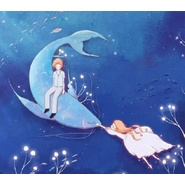

恰似你的温柔
============================

|  |  |
| :--: | :-- |
| [ 恰似你的温柔](https://emumo.xiami.com/album/1015891342) | **艺人**: [曹翀宇(James Tsao)](../index.md) **语种**: 国语 **唱片公司**: 独立发行 **发行时间**: 2014年02月14日 **专辑类别**: 录音室专辑 **专辑风格**: 国语流行 Mandarin Pop **播放数**: 36354 **收藏数**: 5 **评论数**: 0  |

## 简介

恰似你的温柔，是知名音乐人&nbsp;梁弘志先生的第一首音乐作品，由台湾歌手&nbsp;&nbsp;潘安邦于1979年首唱，其后先后被众多华语歌手翻唱，其中以&nbsp;邓丽君和蔡琴的版本最为著名。此次歌手成方圆重新演绎经典，历久弥新， 感人至深。 

## 曲目

## 评论

|  |  |  |  |
| :-- | :-- | :-- | :-- |
