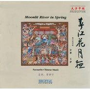

雅集——何处春江无月明春江花月夜-Moonlit River In Spring
============================

|  |  |
| :--: | :-- |
| [ 雅集——何处春江无月明春江花月夜-Moonlit River In Spring](https://emumo.xiami.com/album/1229596544) | **艺人**: [曹翀宇(James Tsao)](../index.md) **语种**: 国语 **唱片公司**: 大宇中国 **发行时间**: 2015年04月21日 **专辑类别**: EP, 单曲 **专辑风格**: 世界音乐 World Music, 古风 GuFeng Music **播放数**: 42607 **收藏数**: 21 **评论数**: 0  |

## 简介

监制：曹翀宇
 

古琴：王伊
 

春江潮水连海平，海上明月共潮生。  
滟滟随波千万里，何处春江无月明！  
江流宛转绕芳甸，月照花林皆似霰;  
空里流霜不觉飞，汀上白沙看不见。  
江天一色无纤尘，皎皎空中孤月轮。  
江畔何人初见月？江月何年初照人？  
人生代代无穷已，江月年年只相似。  
不知江月待何人，但见长江送流水。  
白云一片去悠悠，青枫浦上不胜愁。  
谁家今夜扁舟子？何处相思明月楼？  
可怜楼上月徘徊，应照离人妆镜台。  
玉户帘中卷不去，捣衣砧上拂还来。  
此时相望不相闻，愿逐月华流照君。  
鸿雁长飞光不度，鱼龙潜跃水成文。  
昨夜闲潭梦落花，可怜春半不还家。  
江水流春去欲尽，江潭落月复西斜。  
斜月沉沉藏海雾，碣石潇湘无限路。  
不知乘月几人归，落月摇情满江树。 

## 曲目

## 评论

|  |  |  |  |
| :-- | :-- | :-- | :-- |
