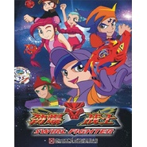

劲爆战士第三部主题曲梦境之战
============================

|  |  |
| :--: | :-- |
| [ 劲爆战士第三部主题曲梦境之战](https://emumo.xiami.com/album/1237144868) | **艺人**: [曹翀宇(James Tsao)](../index.md) **语种**: 国语 **唱片公司**: 大宇中国 **发行时间**: 2012年08月31日 **专辑类别**: 原声带, 影视音乐 **专辑风格**: 国语流行 Mandarin Pop **播放数**: 25635 **收藏数**: 5 **评论数**: 0  |

## 简介

以竞技陀螺闻名的F市陷入了空前的危机之中，整个城市的陀螺高手被阴谋家巴斯吸引到梦境之城。以云晓虎为首的劲爆战队肩负起拯救城市的重任，他们踏上了充满艰辛的修炼之旅。在人迹罕至的神迹大陆，闯迷宫、答谜题、与机关斗智斗勇，对抗巴斯派出的追兵。最终，劲爆战队战胜了巴斯，让F市重现光明。 

## 曲目

## 评论

|  |  |  |  |
| :-- | :-- | :-- | :-- |
