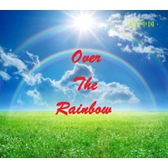

Over The Rainbow-中文版Over The Rainbow(飞越彩虹)
============================

|  |  |
| :--: | :-- |
| [ Over The Rainbow-中文版Over The Rainbow(飞越彩虹)](https://emumo.xiami.com/album/2100193122) | **艺人**: [曹翀宇(James Tsao)](../index.md) **语种**: 国语 **唱片公司**: 大宇中国 **发行时间**: 2012年06月01日 **专辑类别**: EP, 单曲 **专辑风格**: 传统民谣 Traditional Folk **播放数**: 1036 **收藏数**: 0 **评论数**: 0  |

## 简介

《Over the Rainbow》（也称为“Somewhere Over the Rainbow”）的歌声伴随着一代又一代的儿童在纯真和童趣中成长。每一句台词、每一个音符、每一样道具都已成为电影史的瑰宝。静下心品味来自上世纪的经典，洗净你的心灵。 

## 曲目

## 评论

|  |  |  |  |
| :-- | :-- | :-- | :-- |
