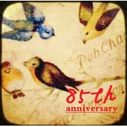

百雀羚85周年纪念专辑翔舞东方
============================

|  |  |
| :--: | :-- |
| [ 百雀羚85周年纪念专辑翔舞东方](https://emumo.xiami.com/album/2100256292) | **艺人**: [曹翀宇(James Tsao)](../index.md) **语种**: 国语 **唱片公司**: 大宇中国 **发行时间**: 2016年01月07日 **专辑类别**: EP, 单曲 **专辑风格**: 国语流行 Mandarin Pop **播放数**: 322 **收藏数**: 0 **评论数**: 0  |

## 简介

 百雀羚创立于1931年，是国内屈指可数的历史悠久的著名化妆品厂商。悠久的历史，承载着光辉的业绩，成就了百雀羚品质如金的美誉。85年的时光，传承经典，勇于创新，完美演绎“中国传奇，东方之美”。

## 曲目

## 评论

