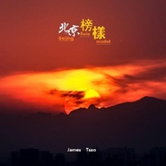

北京榜样-Beijing Role Model2016北京榜样颁奖盛典OST
============================

|  |  |
| :--: | :-- |
| [ 北京榜样-Beijing Role Model2016北京榜样颁奖盛典OST](https://emumo.xiami.com/album/2102672693) | **艺人**: [曹翀宇(James Tsao)](../index.md) **语种**: 国语 **唱片公司**: 大宇中国 **发行时间**: 2016年12月26日 **专辑类别**: 录音室专辑 **专辑风格**: 现代古典 Modern Classical **播放数**: 4330 **收藏数**: 10 **评论数**: 0  |

## 简介

2016北京榜样颁奖盛典OST

## 曲目

## 评论

