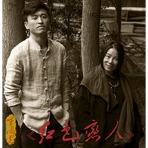

九儿电视剧《红高粱》片尾曲
============================

|  |  |
| :--: | :-- |
| [ 九儿电视剧《红高粱》片尾曲](https://emumo.xiami.com/album/2102681151) | **艺人**: [曹翀宇(James Tsao)](../index.md) **语种**: 国语 **唱片公司**: 大宇中国 **发行时间**: 2016年02月14日 **专辑类别**: 录音室专辑 **专辑风格**: 国语流行 Mandarin Pop **播放数**: 1417000 **收藏数**: 110 **评论数**: 1  |

## 简介

《九儿》是电视剧《<a target="_blank" href="http://baike.baidu.com/subview/107699/10542858.htm" data-lemmaid="409132" style="color: rgb(19, 110, 194); text-decoration: none; font-family: arial, 宋体, sans-serif; line-height: 24px; text-indent: 28px;">红高粱</a>》的片尾曲，由何其玲、阿鲲作词，<a target="_blank" href="http://baike.baidu.com/view/2453826.htm" style="color: rgb(19, 110, 194); text-decoration: none; font-family: arial, 宋体, sans-serif; line-height: 24px; text-indent: 28px;">阿鲲</a>作曲。&nbsp;

## 曲目

## 评论

|  |  |  |
| :-- | :-- | :-- |
|  [虾米用户](https://emumo.xiami.com/u/323282815) 我还没想好要写什么... 2018-12-19 16:07 赞(0) 踩(0) | 
我
 |
