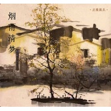

雅集-烟雨清梦Theme from A Chinese Tall Story
============================

|  |  |
| :--: | :-- |
| [ 雅集-烟雨清梦Theme from A Chinese Tall Story](https://emumo.xiami.com/album/2102692252) | **艺人**: [曹翀宇(James Tsao)](../index.md) **语种**: 国语 **唱片公司**: 大宇中国 **发行时间**: 2016年12月23日 **专辑类别**: 录音室专辑 **专辑风格**:  **播放数**: 1494 **收藏数**: 3 **评论数**: 0  |

## 简介

雅集-烟雨清梦 
 

Theme from A Chinese Tall Story
 

声明：本音乐为改编曲，版权归原作者所有。

## 曲目

## 评论

