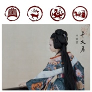

卓文君中国古代四大才女系列之二
============================

|  |  |
| :--: | :-- |
| [ 卓文君中国古代四大才女系列之二](https://emumo.xiami.com/album/2102905649) | **艺人**: [曹翀宇(James Tsao)](../index.md) **语种**: 国语 **唱片公司**: 大宇中国 **发行时间**: 2017年11月05日 **专辑类别**: EP, 单曲 **专辑风格**: 中国风 China-Wave, 古风 GuFeng Music, 中国民乐 Chinese Folk Music **播放数**: 2067 **收藏数**: 4 **评论数**: 0  |

## 简介

《卓文君》是歌手申霏霏“中国古代四大才女系列”的第二首。由张一一作词，曹翀宇作曲。卓文君开创了中国古代女性自由恋爱的先河，是历代知识女性的光辉典范，更是几千年来中国男性津津乐道的梦中情人，随着申霏霏歌曲《卓文君》的上线，“娶妻当如卓文君”也一时成为网络流行语。 

## 曲目

## 评论

