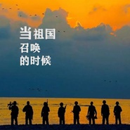

当祖国召唤的时候
============================

|  |  |
| :--: | :-- |
| [ 当祖国召唤的时候](https://emumo.xiami.com/album/5021151082) | **艺人**: [曹翀宇(James Tsao)](../index.md) **语种**: 国语 **唱片公司**: 大宇中国 **发行时间**: 2018年08月01日 **专辑类别**: EP, 单曲 **专辑风格**: 军旅歌曲 Military Songs **播放数**: 2538 **收藏数**: 1 **评论数**: 0  |

## 简介

当祖国召唤的时候，挺起胸膛站排头，把光荣写在军旗上，战火青春最风流！

## 曲目

## 评论

|  |  |  |  |
| :-- | :-- | :-- | :-- |
