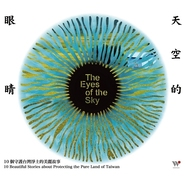

天空的眼睛
============================

|  |  |
| :--: | :-- |
| [ 天空的眼睛](https://emumo.xiami.com/album/1283633388) | **艺人**: [吴金黛](../index.md) **语种**: 其他 **唱片公司**: 风潮音乐 **发行时间**: 2013年10月30日 **专辑类别**: 录音室专辑 **专辑风格**: 轻音乐 Easy Listening, 自然新世纪 Nature New Age **播放数**: 529914 **收藏数**: 2258 **评论数**: 69  |

## 简介

守护的力量有多大？<o:p></o:p>
 

爱的力量有多大，守护的力量便有多大。<o:p></o:p>
 

十个音乐创作人，用音乐说出十个守护净土的美丽故事。<o:p></o:p>
 

金曲奖最佳专辑制作人吴金黛制作。<o:p></o:p>
 

吴晟、林生祥、吴昊恩、达喀尔闹、阿努．卡立亭、范宗沛、聂琳、樱井弘二、杨锦聪、吴金黛创作。<o:p></o:p>

## 曲目

## 评论

|  |  |  |
| :-- | :-- | :-- |
|  [虾米用户](https://emumo.xiami.com/u/344018512) 我还没想好要写什么... 2019-10-26 02:12 赞(0) 踩(0) | 
D
 |
|  [虾米用户](https://emumo.xiami.com/u/424898172) To make each... 2019-06-15 17:23 赞(1) 踩(0) | 
宝藏专辑❤️第一次知道吴金黛还是收入小学音乐课本的那首 森林狂想曲 最近越来越发现我喜欢的台湾音乐人，有更多的纯粹，传统的东西在里面，喜欢他们这种纯粹的态度
 |
|  [虾米用户](https://emumo.xiami.com/u/15985311) 我还没想好要写什么... 2019-05-03 14:21 赞(0) 踩(0) | 
真心放松，让人感觉与大自然融合
 |
|  [虾米用户](https://emumo.xiami.com/u/215769781) 游戏人间 2018-10-29 21:15 赞(1) 踩(0) | 
听这音乐就像纯纯的小米酒
 |
|  [虾米用户](https://emumo.xiami.com/u/30800139) 我在低俗与高雅间活的很尴... 2018-02-13 00:50 赞(0) 踩(0) | 
。
 |
|  [虾米用户](https://emumo.xiami.com/u/1553834)  2017-09-30 10:42 赞(0) 踩(0) | 
特别棒
 |
|  [虾米用户](https://emumo.xiami.com/u/12117863) 热爱音乐是一种动人的生活 2017-09-07 08:30 赞(0) 踩(0) | 
点赞。
 |
|  [虾米用户](https://emumo.xiami.com/u/263895261)  2017-08-19 15:33 赞(1) 踩(0) | 
pretty good
 |
|  [虾米用户](https://emumo.xiami.com/u/1710534)  2017-07-28 17:19 赞(0) 踩(0) | 
与天空的眼睛对视，凝望，深深陷入那最神奇、最深情的力量之中&amp;hellip;&amp;hellip;
 |
|  [虾米用户](https://emumo.xiami.com/u/49666532)  2017-03-09 23:43 赞(2) 踩(0) | 
&amp;ldquo;时钟告诉我该打烊了，但是我真的很想留在这里整个晚上&amp;rdquo;《灵魂厨房》大门-长肚子了，郁闷
 |
|  [虾米用户](https://emumo.xiami.com/u/552188)  2016-09-29 14:47 赞(0) 踩(0) | 
舒服
 |
|  [虾米用户](https://emumo.xiami.com/u/49618592)  2016-08-10 22:53 赞(2) 踩(0) | 
吴金黛的歌能让人放松下来 那是自然的力量
 |
|  [虾米用户](https://emumo.xiami.com/u/52769719)  2016-08-07 20:16 赞(0) 踩(0) | 
有的地方会略紧，改放出去的思绪不经意间被牵扯一下的感觉
 |
|  [虾米用户](https://emumo.xiami.com/u/202859270)  2016-07-19 22:14 赞(1) 踩(0) | 
好舒服的音乐啊。
 |
|  [虾米用户](https://emumo.xiami.com/u/12870834)  2016-03-23 22:54 赞(0) 踩(0) | 
耳朵也在呼吸
 |
|  [虾米用户](https://emumo.xiami.com/u/8605603)  2016-03-18 15:38 赞(0) 踩(0) | 
田野收音
 |
|  [虾米用户](https://emumo.xiami.com/u/123796824)  2016-03-16 10:19 赞(0) 踩(0) | 
没有原因，就是触动人心
 |
|  [虾米用户](https://emumo.xiami.com/u/123796824)  2016-03-16 10:19 赞(0) 踩(0) | 
没有原因，就是触动人心
 |
|  [虾米用户](https://emumo.xiami.com/u/99043258)  2016-03-03 23:02 赞(0) 踩(0) | 
赞赞赞
 |
|  [虾米用户](https://emumo.xiami.com/u/42263789) 。 2016-03-03 19:55 赞(2) 踩(0) | 
感动地球的声音。。可惜感动不了贪婪的人类
 |
|  [虾米用户](https://emumo.xiami.com/u/4232584)  2016-02-29 22:14 赞(0) 踩(0) | 
无杂念
 |
|  [虾米用户](https://emumo.xiami.com/u/117348342)   2016-02-25 12:27 赞(0) 踩(0) | 
大自然的声音~
 |
|  [虾米用户](https://emumo.xiami.com/u/117152276)  2016-02-24 19:37 赞(0) 踩(0) | 
走心的音乐
 |
|  [虾米用户](https://emumo.xiami.com/u/47473868) 昵取自一本回忆录《莎士比... 2016-02-24 15:49 赞(0) 踩(0) | 
封面很漂亮，自然声音和音乐的完美结合
 |
|  [虾米用户](https://emumo.xiami.com/u/1646141)  2016-02-24 11:01 赞(0) 踩(0) | 
非常好听
 |
|  [虾米用户](https://emumo.xiami.com/u/5931031)  2016-02-23 23:51 赞(1) 踩(0) | 
想起陪安东尼度过漫长岁月里面白百何演的小樱就是拿着麦到处找声音的
 |
| ⇒ |  [虾米用户](https://emumo.xiami.com/u/1154162) 蝉在叫 2016-03-14 11:08 赞(0) 踩(0) | 
《最遥远的距离》里有类似的桥段。
 |
|  [虾米用户](https://emumo.xiami.com/u/15355303) 莫失莫忘 不离不弃 2016-01-17 16:40 赞(0) 踩(0) | 
一定一定要听整张！！！
 |
|  [虾米用户](https://emumo.xiami.com/u/18223138)  2015-08-04 17:18 赞(0) 踩(0) | 
店里放的音乐，分享给大家。
 |
|  [虾米用户](https://emumo.xiami.com/u/2505177) 哇哈哈 2015-08-04 17:07 赞(0) 踩(0) | 
店里放的音乐
 |
|  [虾米用户](https://emumo.xiami.com/u/7322777) ∮ 2015-07-26 15:58 赞(0) 踩(0) | 
...A...
 |
|  [虾米用户](https://emumo.xiami.com/u/36057872) 网易/BC: Breat... 2015-07-20 01:32 赞(0) 踩(0) | 
许久没静下来听这样的歌了 (ฅ&gt;ω&lt;*ฅ)
 |
|  [虾米用户](https://emumo.xiami.com/u/7537429) 我还没想好要写什么... 2015-07-17 19:46 赞(0) 踩(0) | 
喜欢林生祥
 |
|  [虾米用户](https://emumo.xiami.com/u/41852394) Hallelujah。 2015-07-17 18:29 赞(1) 踩(0) | 
感觉音乐后期做的太薄了
 |
|  [虾米用户](https://emumo.xiami.com/u/11258822)  2015-01-29 15:42 赞(0) 踩(0) | 
自然 舒缓
 |
|  [虾米用户](https://emumo.xiami.com/u/9079131)   2014-10-01 12:35 赞(0) 踩(0) | 
适合舒缓锻炼的音乐
 |
|  [虾米用户](https://emumo.xiami.com/u/8942666)  2014-09-12 11:49 赞(0) 踩(0) | 
因为喜欢
 |
|  [虾米用户](https://emumo.xiami.com/u/22215275)  2014-04-07 23:24 赞(0) 踩(0) | 
01以莉·高露 麦田狂想(Feat. 杨佩珍) 02林生祥 池上197 03聂琳 山呼唤着林 04阿努 祖先的土地去了哪里 05李德筠 水啊水啊 06范宗沛 天空的眼睛 07吴昊恩 泥巴的眼泪 08黄建为 潮间之舞 09达卡闹 遥远的东海岸 10杨锦聪 宁静阿塱壹
 |
| ⇒ |  [虾米用户](https://emumo.xiami.com/u/6004) 生命不息，听歌不止！ 2015-02-19 15:07 赞(0) 踩(0) | 
很好。
 |
|  [虾米用户](https://emumo.xiami.com/u/2477075)  2014-04-06 23:18 赞(0) 踩(0) | 
就是喜欢，有什么好说的！
 |
|  [虾米用户](https://emumo.xiami.com/u/10517016)  2014-03-30 21:21 赞(0) 踩(0) | 
風潮,吴金黛,天空的眼睛,纯音乐,
 |
|  [虾米用户](https://emumo.xiami.com/u/15804851) ygl5979 2014-03-25 17:48 赞(0) 踩(0) | 
good
 |
|  [虾米用户](https://emumo.xiami.com/u/95295) 虾米，再见！网易云账号名... 2014-03-20 13:03 赞(10) 踩(0) | 
01以莉·高露 - 麦田狂想(Feat. 杨佩珍) 02林生祥 - 池上197 03聂琳 - 山呼唤着林 04阿努 - 祖先的土地去了哪里 05李德筠 - 水啊水啊 06范宗沛 - 天空的眼睛 07吴昊恩 - 泥巴的眼泪 08黄建为 - 潮间之舞 09达卡闹 - 遥远的东海岸 10杨锦聪 - 宁静阿塱壹
 |
|  [虾米用户](https://emumo.xiami.com/u/8942666)  2014-02-02 11:28 赞(0) 踩(0) | 
一位台湾网友推荐的，感觉格外的好，于是收藏。
 |
|  [虾米用户](https://emumo.xiami.com/u/5789905) 音乐构成了我生活的一部分 2014-01-22 23:53 赞(0) 踩(0) | 
在台北诚品生活的风潮音乐店里听到的专辑，那时店里一直在循环着《麦田狂想》；很美的专辑 很美的声音 很美的幕后故事 感动……
 |
|  [虾米用户](https://emumo.xiami.com/u/5138272)  2014-01-18 22:11 赞(0) 踩(0) | 
风潮出品，精品。环保概念专辑。听见大自然。听见台湾。
 |
|  [虾米用户](https://emumo.xiami.com/u/13073595)  2014-01-09 22:43 赞(0) 踩(0) | 
不错
 |
|  [虾米用户](https://emumo.xiami.com/u/7752322) 新世纪+古典音乐爱好者 2014-01-04 13:21 赞(0) 踩(0) | 
自然生活
 |
|  [虾米用户](https://emumo.xiami.com/u/2136545)  2013-12-26 21:36 赞(0) 踩(0) | 
好听的轻音乐
 |
|  [虾米用户](https://emumo.xiami.com/u/18773012) 卫道东升 2013-12-22 19:24 赞(0) 踩(0) | 
非常喜欢
 |
|  [虾米用户](https://emumo.xiami.com/u/1381176)  2013-12-21 12:34 赞(0) 踩(0) | 
第一首真的好像娃娃的漂洋过海来看你。。。
 |
|  [虾米用户](https://emumo.xiami.com/u/847574)  2013-12-20 09:54 赞(0) 踩(0) | 
《天空的眼睛》，提琴的声音细腻的表现更让情感难以割舍，
 |
|  [虾米用户](https://emumo.xiami.com/u/1272599) o_OL.pinme 2013-12-19 23:34 赞(1) 踩(0) | 
前来报道啦~大爱吴金黛和何真真~
 |
|  [虾米用户](https://emumo.xiami.com/u/7504224) 岁月静好，漫观天上云卷云 2013-12-19 21:44 赞(0) 踩(0) | 
最近几年开始觉得声音真是美妙的事物，有时清新，有时灵动，有时如天籁，恍若天上来，有时如耳语，丝丝入心……好听
 |
|  [虾米用户](https://emumo.xiami.com/u/10991077) 有音乐的生活是美好的 2013-12-19 21:40 赞(0) 踩(0) | 
天空的眼睛
 |
|  [虾米用户](https://emumo.xiami.com/u/9388489) 5月生人 2013-12-19 21:37 赞(0) 踩(0) | 
赞
 |
|  [虾米用户](https://emumo.xiami.com/u/10891984)  2013-12-19 21:09 赞(0) 踩(0) | 
大自然的声音,
 |
|  [虾米用户](https://emumo.xiami.com/u/3998657) MAN CAN GO A... 2013-12-19 19:13 赞(0) 踩(0) | 
Miss Wu今年10月在上海做了GET INSPIRED的讲座之后，新鲜出炉闽南语专辑，这次终于让人声成为了她音乐的主角，如果说做音乐是因为使命感的话，你怎么看呢
 |
|  [虾米用户](https://emumo.xiami.com/u/3407905) 我还没想好要写什么... 2013-12-19 18:25 赞(0) 踩(0) | 
好音乐
 |
|  [虾米用户](https://emumo.xiami.com/u/2923080) 聆听东方无限美妙。 2013-12-19 17:57 赞(0) 踩(0) | 
自然
 |
|  [虾米用户](https://emumo.xiami.com/u/2923080) 聆听东方无限美妙。 2013-12-19 17:57 赞(0) 踩(0) | 
原生态+新世纪
 |
|  [虾米用户](https://emumo.xiami.com/u/5067224) 心安即是归处 2013-12-19 17:35 赞(0) 踩(0) | 
##
 |
|  [虾米用户](https://emumo.xiami.com/u/9261161) 音乐里流动 2013-12-19 17:20 赞(0) 踩(0) | 
听到第一首的口琴就觉得喜欢了
 |
|  [虾米用户](https://emumo.xiami.com/u/10073813) 如人饮水。 2013-12-19 16:34 赞(0) 踩(0) | 
~
 |
|  [虾米用户](https://emumo.xiami.com/u/15839554) 很高興與您相遇 什麼蝦米 2013-12-19 16:26 赞(1) 踩(0) | 
大自然中的原始歌聲
 |
|  [虾米用户](https://emumo.xiami.com/u/13933126) 吴开贺 2013-12-05 23:01 赞(0) 踩(0) | 
期待中
 |
