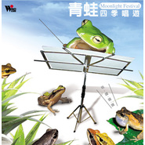

青蛙四季唱游
============================

|  |  |
| :--: | :-- |
| [ 青蛙四季唱游](https://emumo.xiami.com/album/314290) | **艺人**: [吴金黛](../index.md) **语种**: 国语 **唱片公司**: 风潮音乐 **发行时间**: 2001年07月31日 **专辑类别**: 合集, 杂锦 **专辑风格**: 轻音乐 Easy Listening **播放数**: 693276 **收藏数**: 1152 **评论数**: 45  |

## 简介

◎製作人 ： 吴金黛  
◎製作群 ： 监製：杨锦聪｜音乐总监：吴金黛｜策划指导：杨懿如｜  
  
＊杨懿如 小记＊  
17年来从事台湾蛙类生态研究，是台湾第一位女性本土蛙类生态学家，除在多所学校担任教职外，积极参与多种生态保育活动，每年至少发表40场以上的生态保育相关演讲，听眾从社区妈妈、老人大学、小学生，影响层面遍及各阶层，以推广台湾蛙类生态保育为目标而架设的「杨懿如青蛙小站」，获得教育部及励馨基金会推荐的全国十大千禧儿童优良网站。利用网路，对台湾蛙类生态保育有兴趣的人，提供相关的正确资讯，并协解决问题。发表过＜赏蛙图鑑＞、＜花莲的蛙类＞、＜夜访溪头寻蛙行＞、＜蛙-访阳明山国家公园的两栖类＞等书籍。  
  
．我的青蛙恩仇录．  
在很多人眼里，我是一个很勇敢的女性，因为我喜欢青蛙，而且经常晚上到荒野寻找青蛙；看到蛙类，不论是善於跳跃的赤蛙、体型巨大的田鸡、或者长相丑陋的蟾蜍，我都能在第一时间、手脚俐落的捉住牠们。这些都不是传统的女性特质，但我却拥有传统的中国女性纤细温柔的外貌。  
  
事实上，在我成长的年代，没有电视、电动玩具，绝大多数的玩具都是来自大自然，运用小小的脑袋，发挥最大的想像空间。於是下雨之后，成群出现在水沟的青蛙，就成为我捕捉玩耍的对象。我曾经顽皮的把牠们抓到高高的水塔上，然后往下丢，看牠们能跳多远；也曾经把牠们开肠破肚，再敷以捣烂的野草，假装自己是医生。直到现在，想起儿时的情景，印象最深的还是一隻隻跳过眼前的泽蛙。  
  
当然儿时的玩乐和我现在研究青蛙是有些关係，但影响我最深的还是大学时代的学习和研究所的专业训练。我刚进入台大动物系时，还以为自己要当兽医，从来没想过会研究青蛙。此时正是国内生态保育刚刚开始的阶段，我很幸运能参与和目睹目前国内一些保育界前辈例如林曜松、周莲香教授的研究及努力，他们对台湾这块土地的努力，深深的感动了我，让我立志从事生态研究。而让我选择蛙类当研究主题的则是王庆让老师，因为他亲自带领我到野外观察台湾多采多姿的蛙类，让我从一个玩弄青蛙的人，成为研究、保育青蛙的学者。当然研究的过程是很漫长，但并不孤寂，因为不管是美丽的树蛙、身手矫捷的赤蛙、丑陋的蟾蜍都有牠们特殊的生存本能和行为，让我经常有意外的收穫和喜悦。  
  
以前乡下到处是青蛙，所以我的父母及亲戚都觉得我研究青蛙很奇怪，更没想到研究青蛙还可以拿博士、当教授、出专书。但现在他们开始瞭解我工作的重要性，因为山里、田里的青蛙越来越少了，今天不把牠们记录下来，以后可能再也没有相见的机会。而我相信，只要我继续努力，让大家认识蛙类有趣的一面，瞭解蛙类的生态角色，台湾蛙类的保育还是充满光明的远景，这也是让我在无数黑夜中，一路走来一直充满乐趣的原动力。

## 曲目

## 评论

|  |  |  |  |
| :-- | :-- | :-- | :-- |
|  [虾米用户](https://emumo.xiami.com/u/320037455)  2019-07-24 22:39 赞(0) 踩(0) | 
最近睡不好，刚听着差点睡着，催眠哦
 |
|  [虾米用户](https://emumo.xiami.com/u/236567831) 我还没想好要写什么... 2019-03-21 12:56 赞(0) 踩(0) | 
出去旅游自己也曾录过蛙鸣 适合放空
 |
|  [虾米用户](https://emumo.xiami.com/u/17720504) 等到某个年纪会发觉，真爱... 2018-09-07 22:17 赞(0) 踩(0) | 
好听
 |
|  [虾米用户](https://emumo.xiami.com/u/298022288)  2018-02-24 18:30 赞(1) 踩(0) | 

 |
|  [虾米用户](https://emumo.xiami.com/u/131368)  2017-11-04 00:58 赞(0) 踩(0) | 
仿佛身处一片藻池边
 |
|  [虾米用户](https://emumo.xiami.com/u/167042686) 风清云淡  静观我心 2017-03-15 16:04 赞(0) 踩(0) | 
喜欢
 |
|  [虾米用户](https://emumo.xiami.com/u/9767919) 同事叫我别抖腿。 2016-08-12 12:58 赞(1) 踩(0) | 
蛤
 |
|  [虾米用户](https://emumo.xiami.com/u/360769)  2015-11-22 14:03 赞(1) 踩(0) | 
心灵栖息的地方
 |
|  [虾米用户](https://emumo.xiami.com/u/47201266)  2015-09-02 02:42 赞(3) 踩(0) | 
让人非常非常舒缓的声音，躺在床上，轻轻播放，仿佛置身于无尽的田野中，烦躁不安的心被一点点安抚，思绪渐渐平静，逐渐进入梦乡……
 |
|  [虾米用户](https://emumo.xiami.com/u/7322777) ∮ 2015-07-26 15:59 赞(0) 踩(0) | 
...A...
 |
|  [虾米用户](https://emumo.xiami.com/u/11558540) have fun 2015-03-21 18:41 赞(1) 踩(0) | 
提神醒腦 做題必備
 |
|  [虾米用户](https://emumo.xiami.com/u/9669543) 豆腐干与花生米同嚼有火腿... 2014-07-11 23:57 赞(1) 踩(0) | 
想起和伙伴们嬉戏的时光
 |
|  [虾米用户](https://emumo.xiami.com/u/24974311) 水在时间之下 2014-05-21 12:36 赞(1) 踩(0) | 
夏季欢乐的乐章。
 |
|  [虾米用户](https://emumo.xiami.com/u/9286446)  2014-05-17 19:58 赞(1) 踩(0) | 
好像是对蛙鸣、鸟鸣、风雨的录音，有点奇葩的专辑
 |
|  [虾米用户](https://emumo.xiami.com/u/24974311) 水在时间之下 2014-05-15 18:28 赞(0) 踩(0) | 
天籁
 |
|  [虾米用户](https://emumo.xiami.com/u/6821358)  2014-04-14 15:34 赞(1) 踩(0) | 
听到这个专辑，心里出现这样几个词语：清新，自然，童年，乡村，回忆，激动，心情很好哦
 |
|  [虾米用户](https://emumo.xiami.com/u/6821358)  2014-04-14 15:32 赞(0) 踩(0) | 
真实，本味，泥土，乡村，怀念，童年，回忆，不错，心情很好哦
 |
|  [虾米用户](https://emumo.xiami.com/u/310558) We chat:kink... 2014-02-12 00:29 赞(0) 踩(0) | 
Nice
 |
|  [虾米用户](https://emumo.xiami.com/u/526266) 我不能强迫自己天天签到，... 2014-01-29 12:19 赞(0) 踩(0) | 
赞！！！
 |
|  [虾米用户](https://emumo.xiami.com/u/6413845)  2013-12-17 15:48 赞(0) 踩(0) | 
自然之声
 |
|  [虾米用户](https://emumo.xiami.com/u/11136013) 暂无签名~ 2013-10-29 09:34 赞(0) 踩(0) | 
很美
 |
|  [虾米用户](https://emumo.xiami.com/u/21916115)  2013-09-14 07:58 赞(0) 踩(0) | 
青蛙四季歌
 |
|  [虾米用户](https://emumo.xiami.com/u/9217580) 我的另一座港湾，另一座城... 2013-08-29 15:31 赞(1) 踩(0) | 
感觉很有云南丝竹的味道~~~
 |
|  [虾米用户](https://emumo.xiami.com/u/2938294)  2013-08-11 21:34 赞(0) 踩(0) | 
我草，找到宝了。
 |
|  [虾米用户](https://emumo.xiami.com/u/2938294)  2013-08-11 21:34 赞(1) 踩(0) | 
我草，找到宝了。
 |
|  [虾米用户](https://emumo.xiami.com/u/5135757)  2013-08-08 21:40 赞(0) 踩(0) | 
relax
 |
|  [虾米用户](https://emumo.xiami.com/u/3722521) 能打马赛克吗？ 2013-06-30 20:54 赞(0) 踩(0) | 
纯净的自然之声
 |
|  [虾米用户](https://emumo.xiami.com/u/7755009)  2013-04-23 22:44 赞(0) 踩(0) | 
讚
 |
|  [虾米用户](https://emumo.xiami.com/u/4270325)  2013-03-30 07:36 赞(0) 踩(0) | 
自然声音
 |
|  [虾米用户](https://emumo.xiami.com/u/231797) 活着真好 好好活着 2013-03-02 00:26 赞(0) 踩(0) | 
~
 |
|  [虾米用户](https://emumo.xiami.com/u/6292811)  2013-01-02 17:28 赞(0) 踩(0) | 
自然的声音
 |
|  [虾米用户](https://emumo.xiami.com/u/6614124)  2012-11-24 11:52 赞(0) 踩(0) | 
聆听之际，瞬间便置身于大自然的情怀之中。
 |
|  [虾米用户](https://emumo.xiami.com/u/1242218) （*￣︶￣*）觉知自己 2012-07-30 20:31 赞(0) 踩(0) | 
听着这个专辑就想立刻奔向森林公园。╮(╯0╰)╭。太给力了。
 |
|  [虾米用户](https://emumo.xiami.com/u/1242218) （*￣︶￣*）觉知自己 2012-07-29 20:33 赞(0) 踩(0) | 
自然，恬静
 |
|  [虾米用户](https://emumo.xiami.com/u/2958734)  2012-05-07 00:36 赞(0) 踩(0) | 
大自然的声音！
 |
|  [虾米用户](https://emumo.xiami.com/u/1747192) 幽静 2012-05-06 07:07 赞(0) 踩(0) | 
好想听小鸭子ＧＡＧＡ的叫声．
 |
|  [虾米用户](https://emumo.xiami.com/u/8309651)  2012-04-16 22:43 赞(0) 踩(0) | 
这是一种让人享受大自然的创意。清新而美妙。只是有的地方节律太·固定，有人造的遗憾。
 |
|  [虾米用户](https://emumo.xiami.com/u/8562252)  2012-03-26 10:18 赞(0) 踩(0) | 
童時回憶
 |
|  [虾米用户](https://emumo.xiami.com/u/4029255)  2012-03-24 10:16 赞(0) 踩(0) | 
庄子天地 中好几首出自这里？
 |
|  [虾米用户](https://emumo.xiami.com/u/8320490)  2012-03-06 18:27 赞(0) 踩(0) | 
喜欢
 |
|  [虾米用户](https://emumo.xiami.com/u/4766852)  2011-07-08 18:55 赞(0) 踩(0) | 
很喜欢，大自然的天籁音
 |
|  [虾米用户](https://emumo.xiami.com/u/492242)  2011-06-19 16:20 赞(1) 踩(0) | 
好多年前的晚上，在蓝色音乐田听到那首《春天的歌》，很惊艳，送给喜欢青蛙和音乐的朋友们
 |
|  [虾米用户](https://emumo.xiami.com/u/3444267)  2011-04-10 17:21 赞(0) 踩(0) | 
喜欢没商量
 |
|  [虾米用户](https://emumo.xiami.com/u/88360) 旅行者乐队 张智 2009-03-22 22:44 赞(0) 踩(0) | 
很舒畅  很久 没有 舒畅了  很好 很好
 |
|  [虾米用户](https://emumo.xiami.com/u/25224)  2009-01-05 19:55 赞(0) 踩(0) | 
自然清新！
 |
