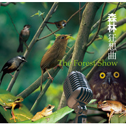

森林狂想曲
============================

|  |  |
| :--: | :-- |
| [ 森林狂想曲](https://emumo.xiami.com/album/315088) | **艺人**: [吴金黛](../index.md) **语种**: 其他 **唱片公司**: 风潮音乐 **发行时间**: 1999年09月27日 **专辑类别**: 合集, 杂锦 **专辑风格**: 自然新世纪 Nature New Age, 轻音乐 Easy Listening **播放数**: 10995011 **收藏数**: 13336 **评论数**: 535  |

## 简介

《森林狂想曲》 拥有全世界第一张台湾大自然音乐   
  
荒野探险家徐仁修、自然录音专家刘义骅、自然观察家杨雅棠、留美制作人吴金黛、金曲奖制作人及演奏音乐奖得主范宗沛，全心全意为台湾森林量身打造的自然音乐创作！制作过程耗时5年，深入全台山林实地录音，共收集台湾鸟类、蛙类、蝉类、虫类、山羊、猕猴、飞鼠、溪流…等近100种台湾自然声音；新颖并充满创意的制作概念，使乐曲中的自然音源与音乐的节奏、调性相合无间，如「夜的精灵」里动物与蛙虫组成的打击乐团、「野鸟情歌」中的台湾画眉、「水径」的溪水声与大提琴弦音水乳交融、「日安，亚热带帶」中段钢琴和水声谱成的宁静……整张专辑呈现自然声音与音乐融合的最高境界！

## 曲目

## 评论

|  |  |  |  |
| :-- | :-- | :-- | :-- |
|  [虾米用户](https://emumo.xiami.com/u/375076161) 我还没想好要写什么... 2020-10-15 20:59 赞(0) 踩(0) | 
印象深刻 回归淳朴
 |
|  [虾米用户](https://emumo.xiami.com/u/316443625)   2020-09-29 19:02 赞(0) 踩(0) | 
真厉害
 |
|  [虾米用户](https://emumo.xiami.com/u/380335055)  2020-09-04 21:38 赞(0) 踩(0) | 
好(✪▽✪)
 |
|  [虾米用户](https://emumo.xiami.com/u/17422077)  2020-08-19 13:12 赞(0) 踩(0) | 
超级棒的自然音乐!
 |
|  [虾米用户](https://emumo.xiami.com/u/10309444) 人不知，而不愠，不亦君子... 2020-08-02 08:03 赞(0) 踩(0) | 
好听
 |
|  [虾米用户](https://emumo.xiami.com/u/433739467) 3E Ironman L... 2020-07-27 23:20 赞(1) 踩(0) | 
初入HiFi的第一套，最爱！
 |
|  [虾米用户](https://emumo.xiami.com/u/15340582) 暂无签名~ 2020-06-19 14:57 赞(0) 踩(0) | 
感谢付出，最可爱的人~
 |
|  [虾米用户](https://emumo.xiami.com/u/284354405)  2020-06-04 16:36 赞(0) 踩(0) | 
宝宝很爱听
 |
|  [虾米用户](https://emumo.xiami.com/u/405951863)  2020-06-03 19:52 赞(0) 踩(0) | 
太太太好听了！！！！！！！！！
 |
|  [虾米用户](https://emumo.xiami.com/u/274754435)  2020-05-02 14:43 赞(1) 踩(0) | 
大自然的音乐，太美了！
 |
|  [虾米用户](https://emumo.xiami.com/u/440298117)  2020-02-08 17:44 赞(0) 踩(0) | 
经典
 |
|  [虾米用户](https://emumo.xiami.com/u/437050078) 啦啦啦(✪▽✪) 2020-01-19 21:12 赞(0) 踩(0) | 
特别好听
 |
|  [虾米用户](https://emumo.xiami.com/u/434889226)  2019-12-29 21:25 赞(0) 踩(0) | 
太好听了，我还要听！
 |
|  [虾米用户](https://emumo.xiami.com/u/424703427) 我听见木棉花开的声音 2019-12-26 14:27 赞(0) 踩(0) | 
很多年了，每次需要冷静，深呼吸，都会听这首曲子。
 |
|  [虾米用户](https://emumo.xiami.com/u/410211967)  2019-12-01 12:09 赞(0) 踩(0) | 
非常喜欢。
 |
|  [虾米用户](https://emumo.xiami.com/u/323194605)  2019-11-27 12:55 赞(0) 踩(0) | 
很美妙的轻音乐赞
 |
|  [虾米用户](https://emumo.xiami.com/u/323194605)  2019-11-26 20:52 赞(0) 踩(0) | 
很美妙的轻音乐
 |
|  [虾米用户](https://emumo.xiami.com/u/347194611)  2019-11-23 09:52 赞(0) 踩(0) | 
特别好听
 |
|  [虾米用户](https://emumo.xiami.com/u/421336987) 音乐如诗，音乐如画，陶醉... 2019-11-21 17:40 赞(52) 踩(0) | 
「日安，亚热带」中段钢琴和水声谱成的宁静……，让整张专辑呈现自然声音与音乐融合的最高境界！流水、雀鸟之声，能镇静人的情绪，松弛我们的身心，而且给人一种返回大自然的感觉，海浪、流水、鸟鸣，风吹过树叶，雨打在屋顶，大自然的原始采样加上改编的著名乐曲合成了天籁之音。新世纪的音乐形式使躁动的灵魂得到最温柔的抚慰，你将在夜里沉沉睡去，以梦为马，在自然之神悠长的呼吸里祈盼黎明。（网摘）
 |
| ⇒ |  [虾米用户](https://emumo.xiami.com/u/314173200) My music is ... 2019-11-21 17:52 赞(0) 踩(0) | 
小原野终于回来啦☃️
 |
| ⇒ |  [虾米用户](https://emumo.xiami.com/u/421336987) 音乐如诗，音乐如画，陶醉... 2019-11-21 17:54 赞(0) 踩(0) | 
<q><b>Flora说：</b></q>
 |
| ⇒ |  [虾米用户](https://emumo.xiami.com/u/314173200) My music is ... 2019-11-21 17:56 赞(0) 踩(0) | 
<q><b>原野说：</b></q>
 |
| ⇒ |  [虾米用户](https://emumo.xiami.com/u/421336987) 音乐如诗，音乐如画，陶醉... 2019-11-21 18:09 赞(0) 踩(0) | 
<q><b>Flora说：</b></q>
 |
| ⇒ |  [虾米用户](https://emumo.xiami.com/u/314173200) My music is ... 2019-11-21 18:20 赞(0) 踩(0) | 
<q><b>原野说：</b></q>
 |
| ⇒ |  [虾米用户](https://emumo.xiami.com/u/357331717)  2019-11-21 18:31 赞(0) 踩(0) | 
欢迎乖乖女回归虾米音乐！⛄辛苦了小原野  
 |
| ⇒ |  [虾米用户](https://emumo.xiami.com/u/421336987) 音乐如诗，音乐如画，陶醉... 2019-11-21 21:32 赞(0) 踩(0) | 
<q><b>杨小梅说：</b></q>
 |
| ⇒ |  [虾米用户](https://emumo.xiami.com/u/357331717)  2019-11-21 21:36 赞(0) 踩(0) | 
<q><b>原野说：</b></q>
 |
| ⇒ |  [虾米用户](https://emumo.xiami.com/u/421336987) 音乐如诗，音乐如画，陶醉... 2019-11-21 21:38 赞(0) 踩(0) | 
<q><b>杨小梅说：</b></q>
 |
| ⇒ |  [虾米用户](https://emumo.xiami.com/u/419070449) 写什么呢，一切都在音乐里 2019-11-22 05:09 赞(0) 踩(0) | 
小原野工作忙也要劳逸结合喔    
 |
| ⇒ |  [虾米用户](https://emumo.xiami.com/u/421336987) 音乐如诗，音乐如画，陶醉... 2019-11-22 08:41 赞(0) 踩(0) | 
<q><b>雨中曲☔️☂说：</b></q>
 |
|  [虾米用户](https://emumo.xiami.com/u/351775218) 让美好现在发生~ 2019-11-07 17:06 赞(0) 踩(0) | 
超自然！
 |
|  [虾米用户](https://emumo.xiami.com/u/353130821)  2019-10-26 22:02 赞(0) 踩(0) | 
超级超级喜欢这首歌，全班同学一直向老师请求，后来才知道不是森林的歌声啊？是森林狂想曲就太令人震惊了，森林......居然这么好听!真是长见识!原本只听了中间的一小部分，后来全曲听完，跟那些小部分真的感觉有点不一样，但全部合起来又让那一小部分和我一起这音乐真的是真太好了!!!
 |
|  [虾米用户](https://emumo.xiami.com/u/353130821)  2019-10-26 21:58 赞(1) 踩(0) | 
一直以为都是一首很优美的歌，没有想到这个森林的杰作，考试的时候听到这一点，同学们都特别特别让老师多听，多听，多听一下，哪里知道这是，森林
 |
|  [虾米用户](https://emumo.xiami.com/u/353130821)  2019-10-26 21:53 赞(1) 踩(0) | 
我们班听了都特别喜欢，就把它列为最喜欢的歌！
 |
|  [虾米用户](https://emumo.xiami.com/u/18977078)  2019-10-21 11:28 赞(1) 踩(0) | 
制作就用了5年，真的太赞了，回归大自然的感觉！
 |
|  [虾米用户](https://emumo.xiami.com/u/87421924) 唯有自己钟情的音乐不可抗... 2019-10-04 04:52 赞(1) 踩(0) | 
吴金黛森林狂想曲
 |
|  [虾米用户](https://emumo.xiami.com/u/427710342)  2019-09-10 10:34 赞(0) 踩(0) | 
好听
 |
|  [虾米用户](https://emumo.xiami.com/u/324603628)  2019-07-20 11:41 赞(0) 踩(0) | 
20多年了，从初中听到这盘专辑，就是最爱了，没有之一。感谢吴金黛老师，也感谢虾米有这么完整的收录。
 |
|  [虾米用户](https://emumo.xiami.com/u/5781838)  2019-07-19 21:42 赞(0) 踩(0) | 
20年前刚开始流行家庭影院时，买了张碟。一听就上瘾了，青春啊～这是年少时的夏天
 |
|  [虾米用户](https://emumo.xiami.com/u/206309783)  2019-06-23 13:06 赞(1) 踩(0) | 
2000年刚念初中家里买了第一台电脑，还是windows98系统，当时土的都不知道cd是什么，怎么放到光驱里，第一次还放反了 。慢慢熟悉后，在盗版摊位上的一堆cd里面发现这张专辑，感觉绿色的大自然封面很特别，就买回家听听，结果就爱上了这城市里少有的清新！那张cd至今还保存着，已经快20年了！由于家里买电脑买的早，自己对电脑接触的早，装了拆拆了装，软件系统都是自学安装的，上初中就是学校计算机的高手，这个优势一直到工作都还保持着比其他人对电脑的深度了解。感谢当时爸妈辛苦的付出和超前的意识！
 |
|  [虾米用户](https://emumo.xiami.com/u/378618826)  2019-06-17 10:04 赞(0) 踩(0) | 
经典艺术
 |
|  [虾米用户](https://emumo.xiami.com/u/26275004)  2019-06-15 18:05 赞(1) 踩(0) | 
这个曲子一听十多年，还是经常听，哈哈
 |
|  [虾米用户](https://emumo.xiami.com/u/282990549) 我还没想好要写什么... 2019-06-13 13:00 赞(0) 踩(0) | 
宝藏专辑！
 |
|  [虾米用户](https://emumo.xiami.com/u/425546360)  2019-06-05 10:44 赞(0) 踩(0) | 
很好(✪▽✪)自然之音
 |
|  [虾米用户](https://emumo.xiami.com/u/31907970) 我还没想好要写什么... 2019-06-02 01:46 赞(0) 踩(0) | 
第一次听到这张专辑还是高三的时候，晚上写作业一直听台湾的一个福音电台，读圣经或者讲一些福音故事，有个主持人很喜欢这张专辑连着放了个把月台湾腔很适合深夜节目，这张专辑也很适合
 |
|  [虾米用户](https://emumo.xiami.com/u/323082674)  2019-04-03 22:20 赞(0) 踩(0) | 
非常活泼。
 |
|  [虾米用户](https://emumo.xiami.com/u/422664575)  2019-03-31 20:29 赞(0) 踩(0) | 
喜欢。在都市丛林享受大自然的静谧，活泼与美好。
 |
|  [虾米用户](https://emumo.xiami.com/u/14247469)  2019-03-25 07:24 赞(1) 踩(0) | 
主要是笛子，非常有节揍
 |
|  [虾米用户](https://emumo.xiami.com/u/412971784)  2019-03-21 19:24 赞(0) 踩(0) | 
超好听
 |
|  [虾米用户](https://emumo.xiami.com/u/225296615) 我还没想好要写什么... 2019-02-21 14:33 赞(0) 踩(0) | 
感觉可以洗涤城市中的尘埃
 |
|  [虾米用户](https://emumo.xiami.com/u/374064587) 心游万仞 2019-02-20 10:12 赞(0) 踩(0) | 
身临其境的自然环境感官享受！
 |
|  [虾米用户](https://emumo.xiami.com/u/371684902)  2019-02-16 22:11 赞(0) 踩(0) | 
听了能让人安静
 |
|  [虾米用户](https://emumo.xiami.com/u/290863353)  2019-02-09 01:10 赞(0) 踩(0) | 
天籁之音
 |
|  [虾米用户](https://emumo.xiami.com/u/347343738)  2019-02-03 09:14 赞(0) 踩(0) | 
二十年前偶然买到的cd。多年来一直未被超越。
 |
|  [虾米用户](https://emumo.xiami.com/u/377475960) 不要那么天真 2019-01-29 21:10 赞(0) 踩(0) | 
老师推荐的，超级好听，还有老师自己编的古典舞蹈和这首歌结合，超级柔美
 |
|  [虾米用户](https://emumo.xiami.com/u/4220444) 热爱生活吧！因为你活着！ 2019-01-25 10:34 赞(0) 踩(0) | 
这么多不同动物的声音，好些都没听过，佩服你这样的音乐家，给你点赞
 |
|  [虾米用户](https://emumo.xiami.com/u/126267)   2019-01-17 13:42 赞(0) 踩(0) | 
美妙的音乐～舒心
 |
|  [虾米用户](https://emumo.xiami.com/u/276464256) World Order ... 2018-11-06 02:17 赞(1) 踩(0) | 
终于等到你
 |
|  [虾米用户](https://emumo.xiami.com/u/373927023)  2018-08-29 13:52 赞(8) 踩(0) | 
一晃快20年了 ，当年第一次是CD 很好听
 |
|  [虾米用户](https://emumo.xiami.com/u/229232)  2018-08-08 12:28 赞(2) 踩(0) | 
一晃快20年了
 |
|  [虾米用户](https://emumo.xiami.com/u/247392555)  2018-07-10 11:47 赞(0) 踩(0) | 
❥(^_-)
 |
|  [虾米用户](https://emumo.xiami.com/u/47139708) 我还没想好要写什么... 2018-06-23 03:52 赞(0) 踩(0) | 
～
 |
|  [虾米用户](https://emumo.xiami.com/u/274023821) 苦苦挣扎 2018-05-22 14:32 赞(2) 踩(0) | 
2002年买的第一盘磁带。那时读高一。周杰伦的磁带都没买(因为可以借同学的）。
 |
|  [虾米用户](https://emumo.xiami.com/u/288263498)  2018-05-06 20:46 赞(1) 踩(0) | 
小时候有这张CD
 |
|  [虾米用户](https://emumo.xiami.com/u/70737) 走基层  2018-05-01 23:05 赞(0) 踩(0) | 
录音器材 DAT SONY「D-10 Pro Ⅱ DAT Recorder」及Tascam「DA-P1 DAT Recorder」,三只MIC：「Audio Technica Shotgun」、「Meumann KMR81 Shotgun」，以及「SONYECM-999 Stereo Condenser」
 |
|  [虾米用户](https://emumo.xiami.com/u/322070130)  2018-04-30 21:51 赞(2) 踩(0) | 
森林狂想曲小时候的回忆，一直不知道叫什么
 |
|  [虾米用户](https://emumo.xiami.com/u/85568296) 只有阳光而无阴影 只有欢... 2018-04-23 23:21 赞(0) 踩(0) | 
哈哈，想到小森林
 |
|  [虾米用户](https://emumo.xiami.com/u/85568296) 只有阳光而无阴影 只有欢... 2018-04-23 23:20 赞(0) 踩(0) | 
吼吼听啊
 |
|  [虾米用户](https://emumo.xiami.com/u/40570251) Just Music 2018-02-12 23:14 赞(3) 踩(0) | 
喜欢大自然的声音，Nice！
 |
|  [虾米用户](https://emumo.xiami.com/u/340176706) 只为寻找灵魂共鸣的乐曲！ 2018-01-29 14:00 赞(2) 踩(0) | 
喜欢聆听自然的人，我想人品都不会太差
 |
|  [虾米用户](https://emumo.xiami.com/u/346567306) b612 2018-01-27 15:09 赞(1) 踩(0) | 
找了多个音乐平台终于在虾米遇到
 |
| ⇒ |  [虾米用户](https://emumo.xiami.com/u/48252767)  2018-04-26 20:58 赞(0) 踩(0) | 
这就是虾米和其他的不同之处音乐不算多，但是能搜出来的都是正品，绝非盗版，酷狗搜森林狂想曲出来一大堆乱七八糟的东西，这个必须给虾米赞 
 |
|  [虾米用户](https://emumo.xiami.com/u/16171945)  2018-01-13 07:09 赞(2) 踩(0) | 
终于被我发现了 
 |
|  [虾米用户](https://emumo.xiami.com/u/211314721)  2018-01-03 21:59 赞(2) 踩(0) | 
叫我如何不敬畏大自然？
 |
|  [虾米用户](https://emumo.xiami.com/u/342474670)  2018-01-01 09:12 赞(0) 踩(0) | 
这首歌蛮好听的，我们比赛的时候是配的古筝
 |
|  [虾米用户](https://emumo.xiami.com/u/342474670)  2018-01-01 09:11 赞(0) 踩(0) | 
是我以前比赛弹过的歌曲，歌词知道一些
 |
|  [虾米用户](https://emumo.xiami.com/u/342180973)  2017-12-31 09:08 赞(1) 踩(0) | 
太棒了！！！
 |
|  [虾米用户](https://emumo.xiami.com/u/9415982)  2017-12-23 09:31 赞(4) 踩(0) | 
第一次听这张专辑还是小学，在电台听到的。然后我狂喜的告诉姐姐最近听到了好好听的歌，是关于森林的，过了两天，姐姐就买回来了这张森林狂想曲的碟。这张碟一度是我小时候的最爱。 
 |
|  [虾米用户](https://emumo.xiami.com/u/333283911)  2017-11-18 23:21 赞(4) 踩(0) | 
爱护自然把，人类(๑&amp;bull;́ ₃ &amp;bull;̀๑)
 |
|  [虾米用户](https://emumo.xiami.com/u/306542690)  2017-10-30 14:13 赞(2) 踩(0) | 
这才叫真正的发烧专辑
 |
|  [虾米用户](https://emumo.xiami.com/u/2644537) x 2017-10-30 10:02 赞(2) 踩(0) | 
很多年前的一个夏天在老家淘到的这张cd，因为很喜欢就带到北京，后来被人拿走了，突然在虾米听到，很欣喜，虾米真是不错！
 |
|  [虾米用户](https://emumo.xiami.com/u/1411564) 耳朵想旅行 2017-10-30 09:55 赞(2) 踩(0) | 
自然音源与音乐的节奏、调性相合无间…… 真匠心之作也！
 |
|  [虾米用户](https://emumo.xiami.com/u/8497826)  2017-10-28 00:31 赞(4) 踩(0) | 
耳畔想起鸟鸣声，犹如天籁之音，顿扫生活中的芜杂和喧嚣，使人恍如身至山林，让人想起陶渊明的潇洒、王维的空灵。幸福其实很简单，用心体会，去感悟，我们每天的生活都是幸福的。玉笛清丽明快，百鸟雀跃，交相而歌，和谐悠然。听着这样的音乐竟会有飞一样的感觉，惬意而闲适，抑或也有孩童子般手舞足蹈的欢欣？自然之声与音乐之声相得益彰，融合的完美无暇。其实自然离我们并不遥远。音乐总会带给我们一份惊喜，用心聆听，让生命去感悟吧.
 |
|  [虾米用户](https://emumo.xiami.com/u/1346450)  2017-10-28 00:18 赞(14) 踩(0) | 
中学的课间操铃就是森林狂想曲，多年之后回想起来，总觉着是被当野生动物放养的意思……
 |
| ⇒ |  [虾米用户](https://emumo.xiami.com/u/333283911)  2017-11-18 23:20 赞(0) 踩(0) | 
哇~
 |
|  [虾米用户](https://emumo.xiami.com/u/6195942) 你一天天长大，我一天天变... 2017-10-27 23:23 赞(2) 踩(0) | 
当我们离自由越来越远的时候，可以在这找回那曾经的纯真
 |
|  [虾米用户](https://emumo.xiami.com/u/308480824)  2017-10-26 21:32 赞(1) 踩(0) | 
      
 |
|  [虾米用户](https://emumo.xiami.com/u/308480824)  2017-10-26 21:31 赞(1) 踩(0) | 
我最喜欢森林狂想曲。我最喜欢的人在这呢。这是森林狂想曲。
 |
|  [虾米用户](https://emumo.xiami.com/u/324812862)  2017-10-25 16:40 赞(1) 踩(0) | 
好棒(✪▽✪)
 |
|  [虾米用户](https://emumo.xiami.com/u/44191355) Bidalaska 2017-10-23 18:39 赞(1) 踩(0) | 
童年的回忆
 |
|  [虾米用户](https://emumo.xiami.com/u/117271618)  2017-10-11 12:22 赞(1) 踩(0) | 
全世界第一张台湾大自然音乐
 |
|  [虾米用户](https://emumo.xiami.com/u/304812639)  2017-10-11 12:21 赞(1) 踩(0) | 
全世界第一张台湾大自然音乐
 |
|  [虾米用户](https://emumo.xiami.com/u/328250112)  2017-10-03 20:41 赞(1) 踩(0) | 
五年了，大二的时候偶然在校园露天音乐会听到了一段，但是不知道名字，从那开始心心念念，以为从此错过，没想到，竟然偶然再次听到！实在是太激动！爱，真的是爱它！
 |
|  [虾米用户](https://emumo.xiami.com/u/326929008)  2017-09-27 10:57 赞(1) 踩(0) | 
自然赋予我们的美妙音符
 |
|  [虾米用户](https://emumo.xiami.com/u/3200081)  2017-09-05 07:48 赞(1) 踩(0) | 
烦嚣中的宁静
 |
|  [虾米用户](https://emumo.xiami.com/u/319335353)  2017-08-14 16:40 赞(1) 踩(0) | 
多么美妙的森林
 |
|  [虾米用户](https://emumo.xiami.com/u/254694962)  2017-07-25 22:11 赞(1) 踩(0) | 
觉得不错
 |
|  [虾米用户](https://emumo.xiami.com/u/314356280)  2017-07-23 17:39 赞(1) 踩(0) | 
喜欢
 |
|  [虾米用户](https://emumo.xiami.com/u/310836272)  2017-07-09 15:47 赞(1) 踩(0) | 
自然界本身就是一首音乐
 |
|  [虾米用户](https://emumo.xiami.com/u/95370706)  2017-07-08 23:17 赞(1) 踩(0) | 
带你亲近大自然
 |
|  [虾米用户](https://emumo.xiami.com/u/337664) 购买实体碟请在微信搜西皮... 2017-07-04 17:23 赞(1) 踩(0) | 
范宗沛，厉害。
 |
|  [虾米用户](https://emumo.xiami.com/u/308242731)  2017-06-29 00:58 赞(1) 踩(0) | 
这作者的歌就只有虾米有
 |
|  [虾米用户](https://emumo.xiami.com/u/304878845)  2017-06-16 11:02 赞(2) 踩(0) | 
多年前，我们驾车去贵阳，汽车CD里面就有这张碟子，我一听就醉了，马上单曲播放模式！回家就去买碟子，但不知道曲名，跟商家说，就是里面有很多青蛙在叫！还好商家心领神会！
 |
|  [虾米用户](https://emumo.xiami.com/u/5605834)  2017-06-11 13:31 赞(0) 踩(0) | 
天籁，自然
 |
|  [虾米用户](https://emumo.xiami.com/u/252843409)  2017-06-09 21:29 赞(0) 踩(0) | 
fantasy forest
 |
|  [虾米用户](https://emumo.xiami.com/u/297562633)   2017-06-05 17:55 赞(0) 踩(0) | 
好
 |
|  [虾米用户](https://emumo.xiami.com/u/298348777)   2017-05-27 22:15 赞(0) 踩(0) | 
经典永恒
 |
|  [虾米用户](https://emumo.xiami.com/u/65140346)  2017-05-09 22:54 赞(0) 踩(0) | 
森林狂想曲
 |
|  [虾米用户](https://emumo.xiami.com/u/282630620)  2017-03-23 10:35 赞(0) 踩(0) | 
 喜欢
 |
|  [虾米用户](https://emumo.xiami.com/u/293630)  2017-03-22 22:07 赞(0) 踩(0) | 
找到了！！知了和蛙鸣，要拿一支来做闹铃，自然唤醒啊
 |
|  [虾米用户](https://emumo.xiami.com/u/1285159)  2017-03-22 15:15 赞(0) 踩(0) | 
森林
 |
|  [虾米用户](https://emumo.xiami.com/u/50188465)  2017-03-21 13:19 赞(3) 踩(0) | 
为了这首歌 特意下载了 虾米音乐
 |
|  [虾米用户](https://emumo.xiami.com/u/24190769)   2017-02-22 12:07 赞(0) 踩(0) | 
大自然的声音
 |
|  [虾米用户](https://emumo.xiami.com/u/239804529) 苦逼追星社畜进行时✔ 2017-02-11 05:09 赞(2) 踩(0) | 
wow
 |
|  [虾米用户](https://emumo.xiami.com/u/271782617)  2017-02-08 11:51 赞(2) 踩(0) | 
太太太好水了
 |
|  [虾米用户](https://emumo.xiami.com/u/246808630)  2017-01-16 15:19 赞(1) 踩(0) | 
快乐的声音
 |
|  [虾米用户](https://emumo.xiami.com/u/40469873)  2017-01-11 15:03 赞(1) 踩(0) | 
666
 |
|  [虾米用户](https://emumo.xiami.com/u/2987949)  2017-01-07 23:53 赞(1) 踩(0) | 
睡前和早上必听
 |
|  [虾米用户](https://emumo.xiami.com/u/248632317)  2016-12-10 18:13 赞(2) 踩(0) | 
大自然的声音
 |
|  [虾米用户](https://emumo.xiami.com/u/22101817)  2016-11-28 00:16 赞(3) 踩(0) | 
大自然的声音
 |
|  [虾米用户](https://emumo.xiami.com/u/22101817)  2016-11-28 00:15 赞(1) 踩(0) | 
自然1
 |
|  [虾米用户](https://emumo.xiami.com/u/250245937)  2016-11-27 13:13 赞(3) 踩(0) | 
非常好非常棒，感谢原作者们的无私奉献
 |
|  [虾米用户](https://emumo.xiami.com/u/44050484)  2016-11-24 13:10 赞(1) 踩(0) | 
大自然的声音！
 |
|  [虾米用户](https://emumo.xiami.com/u/44050484)  2016-11-24 13:10 赞(1) 踩(0) | 
大自然的声音！
 |
|  [虾米用户](https://emumo.xiami.com/u/247079679)   2016-11-19 09:57 赞(1) 踩(0) | 
像分手后的情歌
 |
| ⇒ |  [虾米用户](https://emumo.xiami.com/u/24190769)   2017-02-22 12:08 赞(0) 踩(0) | 
这是大自然的声音
 |
|  [虾米用户](https://emumo.xiami.com/u/247216271)  2016-11-19 09:50 赞(1) 踩(0) | 
好好听    
 |
|  [虾米用户](https://emumo.xiami.com/u/7229222)  2016-11-12 10:46 赞(1) 踩(0) | 
好听
 |
|  [虾米用户](https://emumo.xiami.com/u/12152913) 我还没想好要写什么... 2016-11-10 18:10 赞(1) 踩(0) | 
轻音乐
 |
|  [虾米用户](https://emumo.xiami.com/u/38485956) 你的远方是一片荒芜 2016-10-11 17:57 赞(1) 踩(0) | 
早上在火车上听到的 
 |
|  [虾米用户](https://emumo.xiami.com/u/20951596) 我还没想好要写什么... 2016-09-17 15:05 赞(0) 踩(0) | 
如果能把前面介绍的部分去掉 就好了
 |
|  [虾米用户](https://emumo.xiami.com/u/221383316)  2016-09-01 08:46 赞(1) 踩(0) | 
在北京798艺术区偶然听到森林狂想曲 那种感觉太美妙了
 |
|  [虾米用户](https://emumo.xiami.com/u/221383316)  2016-09-01 08:46 赞(1) 踩(0) | 
在北京798艺术区偶然听到森林狂想曲 那种感觉太美妙了
 |
|  [虾米用户](https://emumo.xiami.com/u/9166624)  2016-08-31 23:30 赞(0) 踩(0) | 
纯自然声音
 |
|  [虾米用户](https://emumo.xiami.com/u/206598765)  2016-08-24 06:35 赞(0) 踩(0) | 
棒棒哒
 |
|  [虾米用户](https://emumo.xiami.com/u/9510712)  2016-08-15 20:49 赞(1) 踩(0) | 
很棒的音乐！
 |
|  [虾米用户](https://emumo.xiami.com/u/188529065) 我爱EXO 2016-08-11 18:41 赞(0) 踩(0) | 
很小的时候听过森林狂想曲，很爱，现在重新听感觉还是很好 
 |
|  [虾米用户](https://emumo.xiami.com/u/88399916)  2016-08-04 21:03 赞(0) 踩(0) | 
大自然的声音在都市回响
 |
|  [虾米用户](https://emumo.xiami.com/u/28411049)  2016-08-04 17:16 赞(0) 踩(0) | 
森林狂想曲,
 |
|  [虾米用户](https://emumo.xiami.com/u/130102018) 关注我，免费解梦，绘画心... 2016-07-24 00:29 赞(1) 踩(0) | 
我的梦想就是录一张纯静大自然声音的专辑，原来在海南小镇经常去录大自然的声音。现在广州，想听到鸟叫都是一种奢求。
 |
| ⇒ |  [虾米用户](https://emumo.xiami.com/u/180397186)  2016-12-25 08:35 赞(0) 踩(0) | 
我也是广州
 |
|  [虾米用户](https://emumo.xiami.com/u/139391672)  2016-07-23 21:19 赞(0) 踩(0) | 
丽江-昆明的列车
 |
|  [虾米用户](https://emumo.xiami.com/u/61741206)  2016-07-17 20:26 赞(0) 踩(0) | 
Nature
 |
|  [虾米用户](https://emumo.xiami.com/u/3727873) better me 2016-07-14 12:11 赞(0) 踩(0) | 
太赞了，大自然的声音好美
 |
|  [虾米用户](https://emumo.xiami.com/u/11739286)   2016-07-07 15:20 赞(0) 踩(0) | 
听见自然也满足了。
 |
|  [虾米用户](https://emumo.xiami.com/u/8882995)  2016-07-06 18:40 赞(0) 踩(0) | 
自然音效
 |
|  [虾米用户](https://emumo.xiami.com/u/22228450)  2016-06-29 09:56 赞(1) 踩(0) | 
纯自然的音乐，很好
 |
|  [虾米用户](https://emumo.xiami.com/u/36289833)  2016-06-26 11:55 赞(0) 踩(0) | 
轻松 解压音乐
 |
|  [虾米用户](https://emumo.xiami.com/u/36289833)  2016-06-26 11:55 赞(0) 踩(0) | 
轻松 解压音乐
 |
|  [虾米用户](https://emumo.xiami.com/u/11655017) 虾小米真的疯掉了。。。 2016-06-05 05:31 赞(4) 踩(0) | 
小时候的沉迷，儿时的狂想
 |
|  [虾米用户](https://emumo.xiami.com/u/140547552) 没脑头还很高兴 此题无解 2016-04-21 23:05 赞(0) 踩(0) | 
今晚一直单曲循环。少年说好胸闷能不能听音乐，我说好，他就边听音乐边写作业....
 |
|  [虾米用户](https://emumo.xiami.com/u/73989700)  2016-04-05 22:09 赞(1) 踩(0) | 
总有说不出的喜悦    
 |
|  [虾米用户](https://emumo.xiami.com/u/10068406) 远离颠倒梦想 究竟涅槃 2016-03-31 15:50 赞(0) 踩(0) | 
睡觉都可以听了
 |
|  [虾米用户](https://emumo.xiami.com/u/55655891)   2016-03-30 22:51 赞(0) 踩(0) | 
自然
 |
|  [虾米用户](https://emumo.xiami.com/u/11910102) 一一 2016-03-29 16:11 赞(0) 踩(0) | 
美！！！
 |
|  [虾米用户](https://emumo.xiami.com/u/9958458) 我还没想好要写什么... 2016-03-26 09:44 赞(1) 踩(0) | 
只有这样的声音才能一直听下去
 |
|  [虾米用户](https://emumo.xiami.com/u/62722586) Sine XY 2016-03-26 06:18 赞(0) 踩(0) | 
Nature sound！
 |
|  [虾米用户](https://emumo.xiami.com/u/126101240)  2016-03-23 08:49 赞(0) 踩(0) | 
清新自然
 |
|  [虾米用户](https://emumo.xiami.com/u/10802778) 安静的美人儿 2016-03-20 20:07 赞(0) 踩(0) | 
轻快 舒畅 释放下吧
 |
|  [虾米用户](https://emumo.xiami.com/u/6787587)   2016-03-16 14:02 赞(0) 踩(0) | 
自然，安静
 |
|  [虾米用户](https://emumo.xiami.com/u/123195926)  2016-03-15 14:35 赞(0) 踩(0) | 
好听 自然之声
 |
|  [虾米用户](https://emumo.xiami.com/u/123195926)  2016-03-15 14:24 赞(0) 踩(0) | 
大自然的声音
 |
|  [虾米用户](https://emumo.xiami.com/u/111065990)  2016-03-11 12:37 赞(0) 踩(0) | 
大自然的声音,
 |
|  [虾米用户](https://emumo.xiami.com/u/111065990)  2016-03-11 12:34 赞(0) 踩(0) | 
台湾大自然音乐
 |
|  [虾米用户](https://emumo.xiami.com/u/111065990)  2016-03-11 12:34 赞(0) 踩(0) | 
台湾大自然音乐
 |
|  [虾米用户](https://emumo.xiami.com/u/50688448) 个人订阅号WULI后花园 2016-03-09 10:24 赞(0) 踩(0) | 
作为胎教音乐不错
 |
|  [虾米用户](https://emumo.xiami.com/u/36527752) 。 2016-03-04 19:38 赞(1) 踩(0) | 
喜欢认真的音乐人
 |
|  [虾米用户](https://emumo.xiami.com/u/7502014) Music is Lif... 2016-03-04 12:57 赞(0) 踩(0) | 
好棒好棒，感动的热泪盈眶
 |
|  [虾米用户](https://emumo.xiami.com/u/99043258)  2016-03-03 23:00 赞(1) 踩(0) | 
好好听
 |
|  [虾米用户](https://emumo.xiami.com/u/9623068) 你若盛开，清风自来 2016-03-03 19:33 赞(0) 踩(0) | 
忽而返自然
 |
|  [虾米用户](https://emumo.xiami.com/u/10851272) 我还没想好要写什么... 2016-03-03 17:33 赞(1) 踩(0) | 
整张专辑都好棒好棒呀
 |
|  [虾米用户](https://emumo.xiami.com/u/11100803) 理想更骨干，现实更奔放！ 2016-03-03 12:54 赞(0) 踩(0) | 
听听大自然的乐章
 |
|  [虾米用户](https://emumo.xiami.com/u/89887322)  2016-03-02 11:05 赞(0) 踩(0) | 
自然
 |
|  [虾米用户](https://emumo.xiami.com/u/11100803) 理想更骨干，现实更奔放！ 2016-03-02 10:58 赞(1) 踩(0) | 
来自大自然乐章
 |
|  [虾米用户](https://emumo.xiami.com/u/43044773) 勘破无常，是以立于无常！ 2016-03-01 21:08 赞(0) 踩(0) | 
喜欢大自然纯粹的声音
 |
|  [虾米用户](https://emumo.xiami.com/u/43044773) 勘破无常，是以立于无常！ 2016-03-01 21:08 赞(0) 踩(0) | 
喜欢大自然那纯粹的声音
 |
|  [虾米用户](https://emumo.xiami.com/u/36928033)  2016-02-28 17:13 赞(0) 踩(0) | 
如入林中
 |
|  [虾米用户](https://emumo.xiami.com/u/52249929) 一万年太久，只争朝夕。 2016-02-28 15:17 赞(0) 踩(0) | 
这也太棒了吧
 |
|  [虾米用户](https://emumo.xiami.com/u/3578233) 时光因浪费而明亮 2016-02-28 11:58 赞(0) 踩(0) | 
太喜欢那些自然之声了
 |
|  [虾米用户](https://emumo.xiami.com/u/47397236)   2016-02-27 20:47 赞(0) 踩(0) | 
听~
 |
|  [虾米用户](https://emumo.xiami.com/u/80513900)  2016-02-27 14:41 赞(0) 踩(0) | 
大自然的纯真
 |
|  [虾米用户](https://emumo.xiami.com/u/7584474) 音乐就是生活的调味品 2016-02-26 17:39 赞(0) 踩(0) | 
清净脑袋~放松凝听大自然~
 |
|  [虾米用户](https://emumo.xiami.com/u/49197442)  2016-02-26 15:17 赞(0) 踩(0) | 
很喜欢森林狂想曲，作为码农，边干着活，边听着这样的曲子，还是很美的！
 |
|  [虾米用户](https://emumo.xiami.com/u/49197442)  2016-02-26 15:17 赞(0) 踩(0) | 
很喜欢森林狂想曲，作为码农，边干着活，边听着这样的曲子，还是很美的！
 |
|  [虾米用户](https://emumo.xiami.com/u/49197442)  2016-02-26 15:17 赞(0) 踩(0) | 
很喜欢森林狂想曲，作为码农，边干着活，边听着这样的曲子，还是很美的！
 |
|  [虾米用户](https://emumo.xiami.com/u/100565356)  2016-02-25 18:49 赞(0) 踩(0) | 
自然
 |
|  [虾米用户](https://emumo.xiami.com/u/3732926)  2016-02-25 14:40 赞(0) 踩(0) | 

 |
|  [虾米用户](https://emumo.xiami.com/u/35970521)  2016-02-25 12:52 赞(0) 踩(0) | 
我们起源于自然，也许只有回归自然才能找到心中的宁静
 |
|  [虾米用户](https://emumo.xiami.com/u/117348342)   2016-02-25 12:26 赞(1) 踩(0) | 
大自然的声音~
 |
|  [虾米用户](https://emumo.xiami.com/u/8319480)  2016-02-25 10:15 赞(0) 踩(0) | 
大自然的声音
 |
|  [虾米用户](https://emumo.xiami.com/u/3817185)  2016-02-25 09:33 赞(0) 踩(0) | 
喜欢自然的声音
 |
|  [虾米用户](https://emumo.xiami.com/u/4079898) QQ 362318935 2016-02-25 09:30 赞(0) 踩(0) | 
高级
 |
|  [虾米用户](https://emumo.xiami.com/u/50606660) slow down 2016-02-24 23:31 赞(0) 踩(0) | 
听听大自然
 |
|  [虾米用户](https://emumo.xiami.com/u/41178231)  2016-02-24 21:54 赞(0) 踩(0) | 
这个策划真可爱
 |
|  [虾米用户](https://emumo.xiami.com/u/8451397) 生命充满奇迹与喜悦！ 2016-02-24 21:41 赞(1) 踩(0) | 
接近大自然，很舒服！
 |
|  [虾米用户](https://emumo.xiami.com/u/74135322) 康康兔 2016-02-24 20:47 赞(0) 踩(0) | 
接近大自然
 |
|  [虾米用户](https://emumo.xiami.com/u/117152276)  2016-02-24 19:30 赞(0) 踩(0) | 
good music
 |
|  [虾米用户](https://emumo.xiami.com/u/594145)   2016-02-24 16:46 赞(0) 踩(0) | 
大自然的声音
 |
|  [虾米用户](https://emumo.xiami.com/u/17182729)  2016-02-24 15:38 赞(0) 踩(0) | 
敬佩
 |
|  [虾米用户](https://emumo.xiami.com/u/1742739) 一直困一直困 2016-02-24 15:05 赞(1) 踩(0) | 
哇塞，好多年前就听过，才知道这乐曲叫《森林狂想曲》，都被编入小学音乐教材了好么，但作者未详，名字也不一样。ca~~该付版权费了
 |
| ⇒ |  [虾米用户](https://emumo.xiami.com/u/13007714)   2016-04-15 09:20 赞(0) 踩(0) | 
在人音版七年级下册。
 |
|  [虾米用户](https://emumo.xiami.com/u/93067358)  2016-02-24 13:02 赞(0) 踩(0) | 
森林狂想曲
 |
|  [虾米用户](https://emumo.xiami.com/u/45385073) 爱虾米期待再相遇为新：t... 2016-02-24 12:18 赞(1) 踩(0) | 
森林狂想曲
 |
|  [虾米用户](https://emumo.xiami.com/u/2233329) 下一个假期前要发奋！ 2016-02-24 12:13 赞(3) 踩(0) | 
我老妈居然在我小学就买了这张专辑。好亲切，我妈好潮。
 |
|  [虾米用户](https://emumo.xiami.com/u/117022066)  2016-02-24 11:21 赞(0) 踩(0) | 
&amp;lt;script&amp;gt;alert(/s/)&amp;lt;/script&amp;gt;
 |
|  [虾米用户](https://emumo.xiami.com/u/1646141)  2016-02-24 10:56 赞(1) 踩(0) | 
非常好听
 |
|  [虾米用户](https://emumo.xiami.com/u/37235174)  2016-02-24 10:32 赞(0) 踩(0) | 
广大失眠患者的福音
 |
|  [虾米用户](https://emumo.xiami.com/u/15284428) (´･_･`) 2016-02-24 06:33 赞(0) 踩(0) | 
这不是我爸的彩铃么
 |
|  [虾米用户](https://emumo.xiami.com/u/17806314) 以梦为马 以己为光 2016-02-24 00:45 赞(0) 踩(0) | 
_(:з」∠)_
 |
|  [虾米用户](https://emumo.xiami.com/u/57032444) 雨后明亮的星空，宁静的夜 2016-02-23 20:17 赞(0) 踩(0) | 
班得瑞第二
 |
|  [虾米用户](https://emumo.xiami.com/u/6762202)  2016-02-23 18:19 赞(0) 踩(0) | 
大自然感觉，放送
 |
|  [虾米用户](https://emumo.xiami.com/u/19744064) 哈哈哈哈~ 2016-02-23 16:59 赞(0) 踩(0) | 
好~
 |
|  [虾米用户](https://emumo.xiami.com/u/12835349) 微博 @小羊艾琳 2016-02-23 15:33 赞(1) 踩(0) | 
被用烂了…
 |
|  [虾米用户](https://emumo.xiami.com/u/48049889)  2016-02-23 15:04 赞(0) 踩(0) | 
最动听的声音。
 |
|  [虾米用户](https://emumo.xiami.com/u/193018)  2016-02-23 12:34 赞(0) 踩(0) | 
放松，不妨碍，简单
 |
|  [虾米用户](https://emumo.xiami.com/u/3008874) 什么时候遇见外星人/回宇... 2016-02-23 11:51 赞(0) 踩(0) | 
迷醉。回忆。经典。
 |
|  [虾米用户](https://emumo.xiami.com/u/32115515) 月光 皎洁着呢 2016-02-10 16:07 赞(0) 踩(0) | 
初识森林狂想曲是六年前 听了三年 作为夏日安眠曲  能力足够后 发现居然有专辑 幸哉 乐哉
 |
|  [虾米用户](https://emumo.xiami.com/u/8933500)  2016-02-03 13:24 赞(0) 踩(0) | 
ziranzhisheng
 |
|  [虾米用户](https://emumo.xiami.com/u/40775609) 无名人士 2016-01-26 16:38 赞(0) 踩(0) | 
让人完全沉浸在音乐之中 
 |
|  [虾米用户](https://emumo.xiami.com/u/47568041)  2016-01-19 19:09 赞(0) 踩(0) | 
好赞
 |
|  [虾米用户](https://emumo.xiami.com/u/101205482)  2016-01-18 20:03 赞(1) 踩(0) | 
好喜欢大自然的韵味！
 |
|  [虾米用户](https://emumo.xiami.com/u/47258598)  2016-01-10 12:53 赞(1) 踩(0) | 
森林狂想曲
 |
|  [虾米用户](https://emumo.xiami.com/u/72067914) 嫣汐最棒。 2016-01-05 19:32 赞(0) 踩(0) | 
好听
 |
|  [虾米用户](https://emumo.xiami.com/u/97391176)  2016-01-04 20:47 赞(1) 踩(0) | 
森林狂想曲,自然,
 |
|  [虾米用户](https://emumo.xiami.com/u/847967) 你们不让老子更老子就不更... 2015-12-17 16:54 赞(1) 踩(0) | 
能认识这么多种生物也很幸福了
 |
|  [虾米用户](https://emumo.xiami.com/u/847967) 你们不让老子更老子就不更... 2015-12-17 16:45 赞(1) 踩(0) | 
这就是以后人类移民火星以后会带的音乐
 |
|  [虾米用户](https://emumo.xiami.com/u/89173628)  2015-12-06 14:15 赞(2) 踩(0) | 
用耳朵去感受大自然！
 |
|  [虾米用户](https://emumo.xiami.com/u/42691850) 嘻嘻哈哈过日子 2015-12-05 21:24 赞(0) 踩(0) | 
细品
 |
|  [虾米用户](https://emumo.xiami.com/u/81424644)  2015-11-09 17:26 赞(1) 踩(0) | 
给小宝宝听的
 |
|  [虾米用户](https://emumo.xiami.com/u/58868790)  2015-10-19 15:06 赞(0) 踩(0) | 
给一岁半娃娃听，他很喜欢。这也是他在肚子里听过的音乐。很棒
 |
|  [虾米用户](https://emumo.xiami.com/u/10057906)  2015-10-07 19:41 赞(1) 踩(0) | 
大自然的轻音乐，大爱！
 |
|  [虾米用户](https://emumo.xiami.com/u/6491765) 我只是个门外汉。 2015-10-03 23:15 赞(2) 踩(0) | 
就是封面太LOW……对于森林狂想曲的感动还是延续了多年的
 |
|  [虾米用户](https://emumo.xiami.com/u/22801069)  2015-09-12 12:10 赞(1) 踩(0) | 
大自然，舒心
 |
|  [虾米用户](https://emumo.xiami.com/u/9377936)  2015-09-09 09:52 赞(0) 踩(0) | 
晨哥真是太棒了
 |
|  [虾米用户](https://emumo.xiami.com/u/9943562) 多数盗版碟在02年发行 2015-08-13 22:49 赞(2) 踩(0) | 
<a href="http://emumo.xiami.com/u/30705" target="_blank" rel="nofollow" name_card="30705">@beson</a> 这张专辑有CD2的，没错～<a href="http://store.windmusic.com.tw/zh/CD/CB-19" target="_blank" rel="nofollow noreferrer noopener">http://store.windmusic.com.tw/zh/CD/CB-19</a>所以，<a href="http://www.xiami.com/album/389760" target="_blank" rel="nofollow noreferrer noopener">http://www.xiami.com/album/389760</a> 跟这张是重复的没错。我觉得CD2应该属于CD1附赠的专辑，完全可以独立出去。
 |
|  [虾米用户](https://emumo.xiami.com/u/49910092)  2015-08-12 12:51 赞(1) 踩(0) | 
喜欢大自然的声音。
 |
|  [虾米用户](https://emumo.xiami.com/u/7322777) ∮ 2015-07-26 15:59 赞(0) 踩(0) | 
...A...
 |
|  [虾米用户](https://emumo.xiami.com/u/2590985) more pain mo... 2015-07-24 12:19 赞(1) 踩(0) | 
里面收录了不同种类画眉不同种类蝉不同种类青蛙的叫声，蛮妙的。
 |
|  [虾米用户](https://emumo.xiami.com/u/49322663)  2015-07-17 19:33 赞(0) 踩(0) | 
远离都市
 |
|  [虾米用户](https://emumo.xiami.com/u/22475212)  2015-07-12 15:34 赞(0) 踩(0) | 
歌曲和歌曲名是错的
 |
|  [虾米用户](https://emumo.xiami.com/u/10151418)  2015-07-01 02:23 赞(0) 踩(0) | 
小時候有跟爸爸媽媽一起去上徐仁修等人的親子自然課，問了青蛙專家為什麼我養的蝌蚪在快變成青蛙時淹死了T__T小學校外教學也有去淡水賞鳥看潮間帶生物，結果我們都在抓天牛....還有一次是認識植物，碰上大地震，震到站不穩~__~
 |
|  [虾米用户](https://emumo.xiami.com/u/11019392) 烤，烤虾! 2015-06-30 12:37 赞(0) 踩(0) | 
高中早上的起床曲……清早晨曦微露的时候，就能听到电台那边放出来的蛙叫和鸟叫= =感觉时光如此静好，我还能再多睡一下……
 |
|  [虾米用户](https://emumo.xiami.com/u/6863020)  2015-06-26 11:06 赞(0) 踩(0) | 
99年的森林狂想曲 再过二三十年也一样不落俗套
 |
|  [虾米用户](https://emumo.xiami.com/u/14364706) 暂无签名~ 2015-06-18 12:09 赞(0) 踩(0) | 
很惬意
 |
|  [虾米用户](https://emumo.xiami.com/u/4106015) 3.1415926535 2015-06-09 23:46 赞(0) 踩(0) | 
神作
 |
|  [虾米用户](https://emumo.xiami.com/u/24945270)  2015-06-09 15:36 赞(4) 踩(0) | 
荒野探险家徐仁修、自然录音专家刘义骅、自然观察家杨雅棠、留美制作人吴金黛、金曲奖制作人及演奏音乐奖得主范宗沛，全心全意为台湾森林量身打造的自然音乐创作！制作过程耗时5年，深入全台山林实地录音
 |
|  [虾米用户](https://emumo.xiami.com/u/11786611)  2015-06-04 17:28 赞(0) 踩(0) | 
自然
 |
|  [虾米用户](https://emumo.xiami.com/u/12461662)  2015-05-26 15:48 赞(0) 踩(0) | 
开心的音乐啊~
 |
|  [虾米用户](https://emumo.xiami.com/u/11860986) 愿美梦让你忘却一切烦恼 2015-05-25 23:12 赞(0) 踩(0) | 
突然想起来总是喜欢在车上放这张专辑，百听不厌啊
 |
|  [虾米用户](https://emumo.xiami.com/u/39867344) 游心移步，荡水无痕！ 2015-05-19 19:08 赞(0) 踩(0) | 
比较喜欢清新的音乐，自然的声音总是让我陶醉！
 |
|  [虾米用户](https://emumo.xiami.com/u/8211929) 没错~我这么聪明怎么会留... 2015-05-03 21:27 赞(0) 踩(0) | 
喜欢不需要理由是吧~
 |
|  [虾米用户](https://emumo.xiami.com/u/645218) 任性逍遥于有欲无欲之间 2015-04-28 16:35 赞(0) 踩(0) | 
喜欢这个调调
 |
|  [虾米用户](https://emumo.xiami.com/u/23088227)  2015-04-11 21:21 赞(1) 踩(0) | 
自然的才是最美的
 |
|  [虾米用户](https://emumo.xiami.com/u/48901852)  2015-04-05 14:51 赞(22) 踩(0) | 
让人置身丛林的欢快中。无忧无虑。
 |
|  [虾米用户](https://emumo.xiami.com/u/16192586)  2015-03-21 21:17 赞(19) 踩(0) | 
人造之乐器与大自然的融合，形成如此美妙的音乐
 |
|  [虾米用户](https://emumo.xiami.com/u/47623873) 音乐我的知心爱人，有你世... 2015-03-02 07:33 赞(54) 踩(0) | 
多年前偶遇听过的美乐，不知其名，只听其声，今天再次邂逅，爱不释手，百听不厌，好音乐！现在条件好了，可以收藏在手机里随时随地享受，感谢作曲家创作如此美乐，感谢虾米音乐提供服务，
 |
|  [虾米用户](https://emumo.xiami.com/u/21362915) Thinking abo... 2015-02-10 13:48 赞(0) 踩(0) | 
即有推荐的棒棒哒
 |
|  [虾米用户](https://emumo.xiami.com/u/15843617)  2015-02-03 15:32 赞(0) 踩(0) | 
音樂旋律好聽, 非常巧妙的將大自然聲音變成樂器融入~ 太讚了!
 |
|  [虾米用户](https://emumo.xiami.com/u/8051183)  2015-01-31 10:14 赞(0) 踩(0) | 
鸟啾 蛙鸣 瞬间到了南方森林
 |
|  [虾米用户](https://emumo.xiami.com/u/10647825)  2014-11-29 07:33 赞(0) 踩(0) | 
好多好多鸟叫声~
 |
|  [虾米用户](https://emumo.xiami.com/u/15481318) renault. 2014-11-26 00:55 赞(0) 踩(0) | 
好听不解释
 |
|  [虾米用户](https://emumo.xiami.com/u/13388274) 慎言笃行 2014-11-13 10:59 赞(0) 踩(0) | 
大自然的声音与音乐的交响盛会！
 |
|  [虾米用户](https://emumo.xiami.com/u/5428095) 每一天，为明天 2014-10-28 12:29 赞(0) 踩(0) | 
超喜欢这纯真自然的声音
 |
|  [虾米用户](https://emumo.xiami.com/u/14865866)  2014-10-28 10:10 赞(0) 踩(0) | 
自然的声音
 |
|  [虾米用户](https://emumo.xiami.com/u/43095266) Ins'zt 2014-10-28 09:38 赞(0) 踩(0) | 
森林 狂想曲
 |
|  [虾米用户](https://emumo.xiami.com/u/14132559) 暂无签名~ 2014-10-27 14:55 赞(0) 踩(0) | 
森林狂想曲
 |
|  [虾米用户](https://emumo.xiami.com/u/43060220)  2014-10-27 01:21 赞(0) 踩(0) | 
...
 |
|  [虾米用户](https://emumo.xiami.com/u/43050179)  2014-10-26 19:58 赞(0) 踩(0) | 
很好听！哈哈
 |
|  [虾米用户](https://emumo.xiami.com/u/3824826)  2014-10-26 18:37 赞(0) 踩(0) | 
大自然的声音···
 |
|  [虾米用户](https://emumo.xiami.com/u/15846155)  2014-10-26 18:08 赞(0) 踩(0) | 
聆听大自然的声音
 |
|  [虾米用户](https://emumo.xiami.com/u/34369268) 暂无签名~ 2014-10-08 11:51 赞(0) 踩(0) | 
名字错位。
 |
|  [虾米用户](https://emumo.xiami.com/u/5804835)  2014-10-05 16:35 赞(0) 踩(0) | 
第二张的鸟类名字好像错位了一个
 |
|  [虾米用户](https://emumo.xiami.com/u/6698817)  2014-10-01 23:22 赞(0) 踩(0) | 
来自大自然的天籁！
 |
|  [虾米用户](https://emumo.xiami.com/u/4376156) 暂无签名~ 2014-09-29 11:45 赞(0) 踩(0) | 
后半部分一些鸟雀虫子的鸣叫声挺逗人的
 |
|  [虾米用户](https://emumo.xiami.com/u/3052280)  2014-09-15 09:49 赞(0) 踩(0) | 
台湾
 |
|  [虾米用户](https://emumo.xiami.com/u/38576650) 夜泊枫桥 2014-08-30 22:13 赞(0) 踩(0) | 
森林清新自然
 |
|  [虾米用户](https://emumo.xiami.com/u/5151283) 我还没想好要写什么... 2014-08-14 10:33 赞(0) 踩(0) | 
很早就爱上了森林狂想曲，太爱大自然的音乐家们！
 |
|  [虾米用户](https://emumo.xiami.com/u/9480638) 我还没想好要写什么... 2014-08-08 19:50 赞(0) 踩(0) | 
第一次听还以为是班德瑞...（第一次听没看艺术家是谁）
 |
|  [虾米用户](https://emumo.xiami.com/u/38748487) iris, 2014-08-03 13:19 赞(0) 踩(0) | 
大爱森林狂想曲，好欢快，好美，小女孩的声音和音乐没对上也
 |
|  [虾米用户](https://emumo.xiami.com/u/7899439)  2014-07-31 23:02 赞(0) 踩(0) | 
小学音乐教科书里面出现过！！各种赞～
 |
|  [虾米用户](https://emumo.xiami.com/u/7219454)  2014-07-12 00:33 赞(0) 踩(0) | 
好听
 |
|  [虾米用户](https://emumo.xiami.com/u/8561502) 试听数完胜你！ 2014-07-05 22:21 赞(0) 踩(0) | 
我勒个去，小学下课铃第一首= =
 |
|  [虾米用户](https://emumo.xiami.com/u/2689520)  2014-07-02 11:21 赞(0) 踩(0) | 
曲目没对上
 |
|  [虾米用户](https://emumo.xiami.com/u/2990577)  2014-06-24 08:56 赞(0) 踩(0) | 
整张专辑的音乐都非常清新自然，值得一听
 |
|  [虾米用户](https://emumo.xiami.com/u/3074562) 我听我的 2014-06-23 10:53 赞(0) 踩(0) | 
01 森林狂想曲  这小时候就知道的音乐哦  太舒服了
 |
|  [虾米用户](https://emumo.xiami.com/u/7170421)  2014-05-25 21:26 赞(0) 踩(0) | 
欢快 自由
 |
|  [虾米用户](https://emumo.xiami.com/u/29259602)   2014-05-18 15:43 赞(0) 踩(0) | 
超喜欢啊！！！大自然的声音果然最清新。。。大爱啊
 |
|  [虾米用户](https://emumo.xiami.com/u/36217581)  2014-05-10 10:34 赞(0) 踩(0) | 
楼顶露营的时候做背景音乐
 |
|  [虾米用户](https://emumo.xiami.com/u/4727768)  2014-05-08 00:46 赞(0) 踩(0) | 
有几首歌名字打乱了，没对头比如中国树蛙那首
 |
|  [虾米用户](https://emumo.xiami.com/u/32430892)  2014-05-07 15:57 赞(0) 踩(0) | 
很喜欢
 |
|  [虾米用户](https://emumo.xiami.com/u/12136700) 无期的等你 2014-05-07 08:14 赞(0) 踩(0) | 
太美了
 |
|  [虾米用户](https://emumo.xiami.com/u/948453)  2014-05-05 13:44 赞(0) 踩(0) | 
love my nature
 |
|  [虾米用户](https://emumo.xiami.com/u/10721795)  2014-05-04 17:18 赞(0) 踩(0) | 
请务必听disc2！！！！#还有萝莉报名字#
 |
|  [虾米用户](https://emumo.xiami.com/u/8767368)  2014-05-03 15:16 赞(0) 踩(0) | 
夏天快到了
 |
|  [虾米用户](https://emumo.xiami.com/u/850154) 步履不停 2014-05-03 12:35 赞(0) 踩(0) | 
风潮音乐
 |
|  [虾米用户](https://emumo.xiami.com/u/1609946) 一即一切 2014-04-26 17:21 赞(0) 踩(0) | 
心 境不二
 |
|  [虾米用户](https://emumo.xiami.com/u/21796655)  2014-04-23 17:28 赞(0) 踩(0) | 
ausgezeichnet!
 |
|  [虾米用户](https://emumo.xiami.com/u/15442954)  2014-04-21 18:33 赞(0) 踩(0) | 
轻松
 |
|  [虾米用户](https://emumo.xiami.com/u/13464319) 暂无签名~ 2014-04-17 14:31 赞(0) 踩(0) | 
纯净的世界。
 |
|  [虾米用户](https://emumo.xiami.com/u/8526740)  2014-04-17 11:14 赞(0) 踩(0) | 
美妙！
 |
|  [虾米用户](https://emumo.xiami.com/u/30880371)  2014-04-17 08:38 赞(0) 踩(0) | 
大自然的声音
 |
|  [虾米用户](https://emumo.xiami.com/u/1857849)  2014-04-16 06:34 赞(0) 踩(0) | 
喜欢
 |
|  [虾米用户](https://emumo.xiami.com/u/2022341) 懶似精靈。。。。 2014-04-09 00:00 赞(0) 踩(0) | 
晚安！城市
 |
|  [虾米用户](https://emumo.xiami.com/u/2022341) 懶似精靈。。。。 2014-04-08 23:38 赞(0) 踩(0) | 
好音乐
 |
|  [虾米用户](https://emumo.xiami.com/u/9949770)  2014-04-07 19:59 赞(0) 踩(0) | 
回归自然
 |
|  [虾米用户](https://emumo.xiami.com/u/4210954)  2014-04-05 09:42 赞(0) 踩(0) | 
能让人放松心情的音乐
 |
|  [虾米用户](https://emumo.xiami.com/u/3405355)  2014-04-03 17:20 赞(0) 踩(0) | 
听了一天鸟叫
 |
|  [虾米用户](https://emumo.xiami.com/u/10378149) 羽翼星辰 2014-03-30 15:53 赞(0) 踩(0) | 
心灵宁静
 |
|  [虾米用户](https://emumo.xiami.com/u/8974500) 我还没想好要写什么... 2014-03-26 18:05 赞(0) 踩(0) | 
配乐的素材
 |
|  [虾米用户](https://emumo.xiami.com/u/9525778)  2014-03-26 15:16 赞(0) 踩(0) | 
吳金黛的音樂也很棒
 |
|  [虾米用户](https://emumo.xiami.com/u/1674050) 我爱吃鸡蛋。 2014-03-26 14:32 赞(1) 踩(0) | 
十几年前就做出了这么好的专辑，台湾人真是不敢想象
 |
|  [虾米用户](https://emumo.xiami.com/u/34371192)  2014-03-23 12:32 赞(0) 踩(0) | 
好听，大自然的声音！
 |
|  [虾米用户](https://emumo.xiami.com/u/11307303)   2014-03-21 17:42 赞(0) 踩(0) | 
自然
 |
|  [虾米用户](https://emumo.xiami.com/u/8774202) 若问不朽，惟清风明月，与... 2014-03-17 19:09 赞(0) 踩(0) | 
上课用的
 |
|  [虾米用户](https://emumo.xiami.com/u/12190351)  2014-03-17 09:38 赞(0) 踩(0) | 
喜欢自然的声音
 |
|  [虾米用户](https://emumo.xiami.com/u/5007427) 暂无签名~ 2014-03-09 23:19 赞(0) 踩(0) | 
不是一般地喜欢这张专辑。爸爸有一张这个的碟，我从小听到大。小时候不会自己找音乐，就拿爸爸的碟一直听一直听一直听。就像是真的在森林里，绿叶缠绵水缱绻。
 |
|  [虾米用户](https://emumo.xiami.com/u/5532351) 大千世界音乐给你带来享受 2014-03-03 20:18 赞(0) 踩(0) | 
来自大自然的声音
 |
|  [虾米用户](https://emumo.xiami.com/u/5532351) 大千世界音乐给你带来享受 2014-03-03 20:18 赞(1) 踩(0) | 
清净自然的旋律
 |
|  [虾米用户](https://emumo.xiami.com/u/6136833)  2014-03-02 10:53 赞(0) 踩(0) | 
喜欢这种小清新
 |
|  [虾米用户](https://emumo.xiami.com/u/1022308)  2014-03-02 08:03 赞(0) 踩(0) | 
音乐美！动听！
 |
|  [虾米用户](https://emumo.xiami.com/u/612877)  2014-03-01 13:09 赞(0) 踩(0) | 
也跟大白假装夏天一下。
 |
|  [虾米用户](https://emumo.xiami.com/u/6067750) 音乐——灵魂的伴侣 2014-02-27 23:20 赞(0) 踩(0) | 
宁静……愉悦……放松……大自然的声音……放松……欢乐
 |
|  [虾米用户](https://emumo.xiami.com/u/1255489)  2014-02-27 12:09 赞(0) 踩(0) | 
天呐！困扰我好多年找不到的那个旋律居然是森林狂想曲！
 |
|  [虾米用户](https://emumo.xiami.com/u/12955572) 想养只娃(*/ω＼*) 2014-02-08 22:10 赞(0) 踩(0) | 
很喜欢，偶尔听听觉得治愈啊……
 |
|  [虾米用户](https://emumo.xiami.com/u/32444835)  (´▽｀)ノ♪ 2014-02-07 12:38 赞(0) 踩(0) | 
自然的音乐悦耳
 |
|  [虾米用户](https://emumo.xiami.com/u/32411816) 暂无签名~ 2014-02-06 23:43 赞(0) 踩(0) | 
超喜欢，再次遇到我整整听了一季却不知道名字的一首，我猜，今夜梦境一定会是一场森林的盛宴。^^
 |
|  [虾米用户](https://emumo.xiami.com/u/14002739) ？！？！ 2014-02-04 18:45 赞(0) 踩(0) | 
不得不推啊啊啊啊啊啊啊啊啊啊啊啊啊啊啊啊啊啊啊啊啊啊啊啊啊啊啊啊啊啊啊啊啊
 |
|  [虾米用户](https://emumo.xiami.com/u/4057321)  2014-01-19 10:36 赞(0) 踩(0) | 
以前只是喜欢森林狂想曲，没想到这张专辑果然是各种森林声音。。。。
 |
|  [虾米用户](https://emumo.xiami.com/u/11902330) 暂无签名~ 2014-01-15 23:23 赞(0) 踩(0) | 
Good good good
 |
|  [虾米用户](https://emumo.xiami.com/u/4964794)  2014-01-12 16:27 赞(0) 踩(0) | 
在音乐中感受到大自然律动的生命。
 |
|  [虾米用户](https://emumo.xiami.com/u/10032609)  2014-01-03 13:18 赞(0) 踩(0) | 
森林
 |
|  [虾米用户](https://emumo.xiami.com/u/13647033)  2013-12-14 21:31 赞(0) 踩(0) | 
大自然音樂
 |
|  [虾米用户](https://emumo.xiami.com/u/10616717)  2013-12-13 22:53 赞(0) 踩(0) | 
大自然纯净声音，比任何音乐都美。
 |
|  [虾米用户](https://emumo.xiami.com/u/29265334)  2013-12-12 21:35 赞(0) 踩(0) | 
喜欢大自然
 |
|  [虾米用户](https://emumo.xiami.com/u/29265334)  2013-12-12 21:23 赞(0) 踩(0) | 
太美了，像置身于森林中。
 |
|  [虾米用户](https://emumo.xiami.com/u/4864748) 音乐无国界 2013-11-13 15:05 赞(0) 踩(0) | 
很不错的接近自然的音乐专辑
 |
|  [虾米用户](https://emumo.xiami.com/u/10891984)  2013-11-10 16:42 赞(0) 踩(0) | 
内容多
 |
|  [虾米用户](https://emumo.xiami.com/u/6684912)  2013-11-07 22:31 赞(0) 踩(0) | 
感觉不错，很舒服！
 |
|  [虾米用户](https://emumo.xiami.com/u/1584221)  2013-11-05 10:23 赞(0) 踩(0) | 
亲近自然的旋律
 |
|  [虾米用户](https://emumo.xiami.com/u/5196683)  2013-11-04 15:53 赞(0) 踩(0) | 
无痛去烦
 |
|  [虾米用户](https://emumo.xiami.com/u/9134017)  2013-11-03 11:30 赞(0) 踩(0) | 
好听
 |
|  [虾米用户](https://emumo.xiami.com/u/1198872)  2013-10-22 09:41 赞(0) 踩(0) | 
自然放松
 |
|  [虾米用户](https://emumo.xiami.com/u/5674873)  2013-10-13 15:17 赞(0) 踩(0) | 
让浮躁的自己游览一下清新的森林
 |
|  [虾米用户](https://emumo.xiami.com/u/9810085)  2013-10-11 20:27 赞(0) 踩(0) | 
来自大自然的声音~
 |
|  [虾米用户](https://emumo.xiami.com/u/6158730)  2013-09-28 15:18 赞(0) 踩(0) | 
自然的气息
 |
|  [虾米用户](https://emumo.xiami.com/u/22845074)  2013-09-25 13:28 赞(0) 踩(0) | 
小小清凉的畅快
 |
|  [虾米用户](https://emumo.xiami.com/u/4986351)  2013-09-16 15:25 赞(0) 踩(0) | 
貓貓喜歡的音樂~
 |
|  [虾米用户](https://emumo.xiami.com/u/1174562)   2013-09-14 13:25 赞(0) 踩(0) | 
推荐！
 |
|  [虾米用户](https://emumo.xiami.com/u/21916115)  2013-09-14 07:51 赞(0) 踩(0) | 
大自然的声音和音乐的完美结合
 |
|  [虾米用户](https://emumo.xiami.com/u/9217580) 我的另一座港湾，另一座城... 2013-08-29 10:33 赞(0) 踩(0) | 
山里面的各种笑语吟吟
 |
|  [虾米用户](https://emumo.xiami.com/u/2921187)  2013-08-29 10:13 赞(0) 踩(0) | 
用心之作
 |
|  [虾米用户](https://emumo.xiami.com/u/4302754) groovy 2013-08-24 11:27 赞(0) 踩(0) | 
啊 好像回到小时候了 算是 第一次买专辑的那一拨吧。。。。。。好喜欢听记得当时 放在车上 每天翻来覆去的听
 |
|  [虾米用户](https://emumo.xiami.com/u/1674893)  2013-07-27 21:44 赞(0) 踩(0) | 
很萌的一张专辑！闭上眼就好像在森林中！让人觉得很静很安心
 |
|  [虾米用户](https://emumo.xiami.com/u/12103707) Ru 2013-07-23 21:14 赞(0) 踩(0) | 
有些鳥的叫聲好有喜感XD
 |
| ⇒ |  [虾米用户](https://emumo.xiami.com/u/5395500) 暂无签名~ 2014-02-08 21:55 赞(0) 踩(0) | 
哈哈哈哈哈哈哈哈哈哈哈哈哈哈哈哈
 |
|  [虾米用户](https://emumo.xiami.com/u/8601290) 远在远方的风，比远方更远 2013-07-22 15:00 赞(0) 踩(0) | 
有时候，就是只想听听大自然的声音。。。
 |
|  [虾米用户](https://emumo.xiami.com/u/9301514) 独立唱作人 2013-07-17 15:49 赞(0) 踩(0) | 
quiet
 |
|  [虾米用户](https://emumo.xiami.com/u/7555275)  2013-07-16 22:13 赞(1) 踩(0) | 
大自然的聲音是最佳催眠曲
 |
|  [虾米用户](https://emumo.xiami.com/u/8908945) classicmusic 2013-07-16 11:21 赞(0) 踩(0) | 
第一首很 熟悉
 |
|  [虾米用户](https://emumo.xiami.com/u/9879622)  2013-07-14 16:54 赞(0) 踩(0) | 
ddddd
 |
|  [虾米用户](https://emumo.xiami.com/u/9922725) 旦复旦兮，日月光华 2013-06-30 12:42 赞(0) 踩(0) | 
送给PTT同学~
 |
|  [虾米用户](https://emumo.xiami.com/u/4719205) 绿道悠然 2013-06-23 16:42 赞(0) 踩(0) | 
大自然的声音,绿色悠然.
 |
|  [虾米用户](https://emumo.xiami.com/u/5382578) バイマイサイド。 2013-06-18 17:52 赞(0) 踩(0) | 
鸣鸿惊飞的朗声
 |
|  [虾米用户](https://emumo.xiami.com/u/131384)  2013-06-11 07:52 赞(0) 踩(0) | 
自然
 |
|  [虾米用户](https://emumo.xiami.com/u/15386907)  2013-06-06 12:33 赞(0) 踩(0) | 
我喜欢大自然的森林
 |
|  [虾米用户](https://emumo.xiami.com/u/9573941)  2013-05-13 15:56 赞(0) 踩(0) | 
Disc2 把人聲介紹取消就好了
 |
|  [虾米用户](https://emumo.xiami.com/u/9573941)  2013-05-13 15:51 赞(0) 踩(0) | 
又聽到了
 |
|  [虾米用户](https://emumo.xiami.com/u/12157662)  2013-05-12 22:31 赞(0) 踩(0) | 
卡哇伊的厉害 作为春游的BGM很赞
 |
|  [虾米用户](https://emumo.xiami.com/u/6458429) Yesterday U ... 2013-05-01 18:04 赞(1) 踩(0) | 
唉 这些年来 不止一次遇到过这些美妙的声音 可都是偶遇 再想找的时候 却发现 原来不知道名字 只记得调子根本找不到他们 今天真的很美妙 放下焦躁 在流水般的日子里慢慢过 终于让我遇到了奇迹 感恩感恩
 |
|  [虾米用户](https://emumo.xiami.com/u/8628417)  2013-04-30 11:10 赞(0) 踩(0) | 
高中听的，2000年。。。应该是我这辈子的第一张正版磁带。。。极是真真的好
 |
|  [虾米用户](https://emumo.xiami.com/u/733228) 我还没想好要写什么... 2013-04-10 13:17 赞(0) 踩(0) | 
自然之音
 |
|  [虾米用户](https://emumo.xiami.com/u/12074839)  2013-03-28 09:00 赞(0) 踩(0) | 
喜欢。
 |
|  [虾米用户](https://emumo.xiami.com/u/11503376)  2013-03-26 14:49 赞(0) 踩(0) | 
大自然的声音
 |
|  [虾米用户](https://emumo.xiami.com/u/11503376)  2013-03-25 15:41 赞(0) 踩(0) | 
大自然的声音，好想去春游~
 |
|  [虾米用户](https://emumo.xiami.com/u/11888819) red 2013-03-24 20:25 赞(0) 踩(0) | 
《森林狂想曲》 拥有全世界第一张台湾大自然音乐荒野探险家徐仁修、自然录音专家刘义骅、自然观察家杨雅棠、留美制作人吴金黛、金曲奖制作人及演奏音乐奖得主范宗沛，全心全意为台湾森林量身打造的自然音乐创作！制作过程耗时5年，深入全台山林实地录音，
 |
|  [虾米用户](https://emumo.xiami.com/u/13438505)  2013-03-23 14:58 赞(0) 踩(0) | 
安静，纯洁的音乐
 |
|  [虾米用户](https://emumo.xiami.com/u/13532257) 蓝色珊瑚海，树影与水波纠... 2013-03-23 12:01 赞(0) 踩(0) | 
最爱自然之声
 |
|  [虾米用户](https://emumo.xiami.com/u/10509420)  2013-03-22 17:57 赞(0) 踩(0) | 
最爱这种自然之声
 |
|  [虾米用户](https://emumo.xiami.com/u/2172349)  2013-03-22 10:29 赞(0) 踩(0) | 
自然的声音
 |
|  [虾米用户](https://emumo.xiami.com/u/2387832)  2013-03-21 21:48 赞(0) 踩(0) | 
多好听啊！
 |
|  [虾米用户](https://emumo.xiami.com/u/8494761)  2013-03-21 20:29 赞(0) 踩(0) | 
自然之音，纯静
 |
|  [虾米用户](https://emumo.xiami.com/u/13415461) 孤雁 2013-03-21 09:17 赞(1) 踩(0) | 
闭上眼睛，静静地聆听自然的声音。
 |
|  [虾米用户](https://emumo.xiami.com/u/1910996)  2013-03-20 19:32 赞(0) 踩(0) | 
欢快  神奇
 |
|  [虾米用户](https://emumo.xiami.com/u/8048444) 山羊胡雨神 2013-03-20 11:22 赞(0) 踩(0) | 
haod
 |
|  [虾米用户](https://emumo.xiami.com/u/815255)   2013-03-19 16:10 赞(0) 踩(0) | 
刚上初中时候拥有的第一套CD居然是称作自然之声的音乐
 |
|  [虾米用户](https://emumo.xiami.com/u/13506798) 妞妞 2013-03-18 12:46 赞(0) 踩(0) | 
来自大自然的声音，更贴合人的心灵，感受泉水叮咚，感受山林鸟语，，，
 |
|  [虾米用户](https://emumo.xiami.com/u/7585475)  2013-03-17 18:55 赞(0) 踩(0) | 
错位了啊，录音中的动物名字和标题名字不匹配，上下错位了
 |
|  [虾米用户](https://emumo.xiami.com/u/3720415) 我还没想好要写什么... 2013-03-16 09:25 赞(0) 踩(0) | 
nice
 |
|  [虾米用户](https://emumo.xiami.com/u/13330714)  2013-03-13 22:26 赞(0) 踩(0) | 
让自己静下心来慢慢聆听！
 |
|  [虾米用户](https://emumo.xiami.com/u/11169496)  2013-03-13 12:18 赞(0) 踩(0) | 
大自然的声音
 |
|  [虾米用户](https://emumo.xiami.com/u/2387832)  2013-03-12 14:10 赞(0) 踩(0) | 
一直喜欢。
 |
|  [虾米用户](https://emumo.xiami.com/u/9599818)  2013-03-11 01:04 赞(0) 踩(0) | 
大自然的音乐。
 |
|  [虾米用户](https://emumo.xiami.com/u/935325)  2013-03-10 23:37 赞(0) 踩(0) | 
自然之声
 |
|  [虾米用户](https://emumo.xiami.com/u/11699681)  2013-03-10 13:25 赞(0) 踩(0) | 
收了
 |
|  [虾米用户](https://emumo.xiami.com/u/8547616) fzb.me 2013-03-10 08:42 赞(0) 踩(0) | 
你看   凯文科恩把这些声音结合到了音乐当中，那感觉也是不错
 |
| ⇒ |  [虾米用户](https://emumo.xiami.com/u/7555275)  2013-07-20 21:59 赞(0) 踩(0) | 
我所知道這張專輯好像跟凱文科恩沒關係吔^^&amp;quot;
 |
|  [虾米用户](https://emumo.xiami.com/u/5540830)  2013-03-09 12:49 赞(0) 踩(0) | 
自然的声音
 |
|  [虾米用户](https://emumo.xiami.com/u/8757546) love 2013-03-06 16:30 赞(0) 踩(0) | 
森林~好可爱
 |
|  [虾米用户](https://emumo.xiami.com/u/855972)  2013-03-04 21:01 赞(0) 踩(0) | 
大自然的声音
 |
|  [虾米用户](https://emumo.xiami.com/u/7687697)  2013-03-04 02:11 赞(0) 踩(0) | 
从小就喜欢的音乐，来自森林的甜美诱人之乐
 |
|  [虾米用户](https://emumo.xiami.com/u/1354288) 都好 都爱 不买 2013-03-02 12:34 赞(0) 踩(0) | 
清风灌顶
 |
|  [虾米用户](https://emumo.xiami.com/u/13280304)  2013-02-28 03:21 赞(0) 踩(0) | 
自然
 |
|  [虾米用户](https://emumo.xiami.com/u/1826919)  2013-02-28 00:03 赞(1) 踩(0) | 
听了这些鸟叫声，心情非常舒畅
 |
|  [虾米用户](https://emumo.xiami.com/u/13246306)  2013-02-27 17:14 赞(0) 踩(0) | 
好
 |
|  [虾米用户](https://emumo.xiami.com/u/2543022)  2013-02-27 10:29 赞(0) 踩(0) | 
自然之声
 |
|  [虾米用户](https://emumo.xiami.com/u/2543022)  2013-02-27 10:27 赞(0) 踩(0) | 
非常自然
 |
|  [虾米用户](https://emumo.xiami.com/u/7111610)  2013-02-26 14:54 赞(0) 踩(0) | 
Good day,Forest.
 |
|  [虾米用户](https://emumo.xiami.com/u/3024528) 暂无签名~ 2013-02-24 13:03 赞(0) 踩(0) | 
天然的自然之声。
 |
|  [虾米用户](https://emumo.xiami.com/u/651403) 像一片叶子默默承受季节的... 2013-02-23 21:48 赞(0) 踩(0) | 
只是想要静下来
 |
|  [虾米用户](https://emumo.xiami.com/u/12825070)  2013-02-23 14:34 赞(0) 踩(0) | 
各种音效
 |
|  [虾米用户](https://emumo.xiami.com/u/7866163) 好音乐用一首少一首 2013-02-23 14:22 赞(0) 踩(0) | 
大自然
 |
|  [虾米用户](https://emumo.xiami.com/u/482598) 其实岁月静好！ 2013-02-23 12:00 赞(0) 踩(0) | 
阿黛菇凉
 |
|  [虾米用户](https://emumo.xiami.com/u/5041215) Hi 2013-02-23 10:54 赞(0) 踩(0) | 
台湾
 |
|  [虾米用户](https://emumo.xiami.com/u/4043410) 唯夜色浪漫 2013-02-22 22:47 赞(0) 踩(0) | 
太赞了！
 |
|  [虾米用户](https://emumo.xiami.com/u/339345)  2013-02-15 15:37 赞(1) 踩(0) | 
大自然和谐曲
 |
|  [虾米用户](https://emumo.xiami.com/u/10531721) John Doe 2013-02-13 15:00 赞(0) 踩(0) | 
老爸買給我的第一張CD
 |
|  [虾米用户](https://emumo.xiami.com/u/11886891) 不着调 2013-02-01 21:51 赞(0) 踩(0) | 
舒服到神经质
 |
|  [虾米用户](https://emumo.xiami.com/u/11380690) 热恋梦中的草原！ 2013-01-17 20:18 赞(0) 踩(0) | 
好自然好纯净的欢闹森林啊！真的真的好稀饭！
 |
|  [虾米用户](https://emumo.xiami.com/u/12121530) 看他人背影或让他人看背影 2013-01-01 03:12 赞(0) 踩(0) | 
很早以前就收藏的第六张CD
 |
|  [虾米用户](https://emumo.xiami.com/u/12041514)  2012-12-22 10:33 赞(0) 踩(0) | 
纯音乐
 |
|  [虾米用户](https://emumo.xiami.com/u/5630793)  2012-11-30 13:09 赞(0) 踩(0) | 
来自大自然的东东，我都喜欢
 |
|  [虾米用户](https://emumo.xiami.com/u/11619327) 虾米签名最多12个字符。 2012-11-30 11:44 赞(0) 踩(0) | 
荒野探险家徐仁修、自然录音专家刘义骅、自然观察家杨雅棠、留美制作人吴金黛、金曲奖制作人及演奏音乐奖得主范宗沛，全心全意为台湾森林量身打造的自然音乐创作！制作过程耗时5年，深入全台山林实地录音，共收集台湾鸟类、蛙类、蝉类、虫类、山羊、猕猴、飞鼠、溪流…等近100种台湾自然声音
 |
|  [虾米用户](https://emumo.xiami.com/u/10848859)  2012-11-26 15:43 赞(0) 踩(0) | 
很舒服的音乐~~
 |
|  [虾米用户](https://emumo.xiami.com/u/11488771) buguozhong 2012-11-14 16:27 赞(0) 踩(0) | 
好听的音乐！
 |
|  [虾米用户](https://emumo.xiami.com/u/11283087) btrys 2012-11-06 12:43 赞(0) 踩(0) | 
喧嚣的城市夜晚，放一段纯自然音乐，仿佛回到宁静的乡村，一种无奈的享受吧
 |
|  [虾米用户](https://emumo.xiami.com/u/11173018) 紧拉着音乐的手跟着感觉走 2012-11-05 21:41 赞(0) 踩(0) | 
热爱大自然，亲近大自然
 |
|  [虾米用户](https://emumo.xiami.com/u/3687318)  2012-10-14 16:49 赞(0) 踩(0) | 
抚平毛躁的情绪
 |
|  [虾米用户](https://emumo.xiami.com/u/6369411) 君生我未生，我生君已老。 2012-10-10 21:02 赞(0) 踩(0) | 
目录不对喔，不过这些大自然的音律真是奇妙得不得了，这可比看《动物世界》还美妙呢~
 |
|  [虾米用户](https://emumo.xiami.com/u/10354415) 天地有时尽，宇宙亦轮回 2012-10-03 12:48 赞(0) 踩(0) | 
自然的声音
 |
|  [虾米用户](https://emumo.xiami.com/u/2675314)  2012-09-25 14:12 赞(0) 踩(0) | 
深圳实验高中的都来报个到！
 |
|  [虾米用户](https://emumo.xiami.com/u/4306566) 旋律住进我心里 2012-09-17 01:46 赞(0) 踩(0) | 
找好久了，喜欢被森林包围着的感觉。
 |
|  [虾米用户](https://emumo.xiami.com/u/2195237) 暂无签名~ 2012-09-09 18:27 赞(0) 踩(0) | 
不错的！
 |
|  [虾米用户](https://emumo.xiami.com/u/2394147)  2012-09-08 21:41 赞(0) 踩(0) | 
纯天然  无污染
 |
|  [虾米用户](https://emumo.xiami.com/u/2394147)  2012-09-08 21:38 赞(0) 踩(0) | 
纯天然  无污染
 |
|  [虾米用户](https://emumo.xiami.com/u/10035854)  2012-09-02 01:29 赞(0) 踩(0) | 
非常有趣且生機盎然的一張，感覺遭受自然洗滌。
 |
| ⇒ |  [虾米用户](https://emumo.xiami.com/u/7555275)  2013-07-20 22:06 赞(0) 踩(0) | 
生機盎然這樣的形容很貼切
 |
|  [虾米用户](https://emumo.xiami.com/u/579541)  2012-09-01 17:21 赞(0) 踩(0) | 
很好用，收起来
 |
|  [虾米用户](https://emumo.xiami.com/u/10355078)  2012-08-25 00:04 赞(0) 踩(0) | 
很棒，很喜欢，放松身心，调节情绪。
 |
|  [虾米用户](https://emumo.xiami.com/u/2604752) 理论乃灰色，生命之树长青 2012-08-18 09:15 赞(0) 踩(0) | 
再也找不到比这更温馨美好的声音
 |
|  [虾米用户](https://emumo.xiami.com/u/10189275)  2012-08-12 21:43 赞(0) 踩(0) | 
好听
 |
|  [虾米用户](https://emumo.xiami.com/u/2185103)  2012-07-14 19:31 赞(0) 踩(0) | 
要是没有报歌名的声音就完美了，听着音乐，看着小说
 |
|  [虾米用户](https://emumo.xiami.com/u/298615) 暂无签名~ 2012-06-27 15:05 赞(0) 踩(0) | 
台湾森林自然声音图鉴里声音和目录好像对不上...
 |
|  [虾米用户](https://emumo.xiami.com/u/5584372) 暂无签名~ 2012-06-22 20:16 赞(0) 踩(0) | 
终于给我找到了！小学老师给我们放过。。。。
 |
|  [虾米用户](https://emumo.xiami.com/u/1131599) 爱音乐的吃货。。。 2012-06-17 10:18 赞(0) 踩(0) | 
清新 自然
 |
|  [虾米用户](https://emumo.xiami.com/u/3410240)  2012-06-11 17:09 赞(0) 踩(0) | 
初中的时候买过卡带的XD，当时就很喜欢啦=V=现在过了十多年了，再听依然觉得很喜欢=V=///。
 |
|  [虾米用户](https://emumo.xiami.com/u/6254800)  2012-06-10 13:08 赞(0) 踩(0) | 
清新的自然最让我感动
 |
|  [虾米用户](https://emumo.xiami.com/u/6614124)  2012-06-05 19:37 赞(0) 踩(0) | 
再一次体味到我们对于自然的渴望和羡慕，同时，感受到中国的传统乐器和自然糅合后带给我们一种清凉而又纯净的空间。
 |
|  [虾米用户](https://emumo.xiami.com/u/5512456)  2012-06-03 20:51 赞(0) 踩(0) | 
流水，鸟歌，虫鸣，音乐中透出自然一切的宁静与活泼
 |
|  [虾米用户](https://emumo.xiami.com/u/7133174) 我还没想好要写什么... 2012-05-20 00:56 赞(0) 踩(0) | 
台湾是个好地方啊~
 |
|  [虾米用户](https://emumo.xiami.com/u/9145281)  2012-05-12 00:19 赞(0) 踩(0) | 
很適合說個森林故事
 |
|  [虾米用户](https://emumo.xiami.com/u/9145281)  2012-05-12 00:08 赞(0) 踩(0) | 
很森林的感覺
 |
|  [虾米用户](https://emumo.xiami.com/u/70320) 曾经的梦 2012-05-01 17:10 赞(0) 踩(0) | 
胎教最适宜
 |
|  [虾米用户](https://emumo.xiami.com/u/2293857)  2012-04-24 21:58 赞(0) 踩(0) | 
清越的自然之声，适合在下雨天静心的音乐~
 |
|  [虾米用户](https://emumo.xiami.com/u/2836612) FEEL IT 2012-04-18 22:19 赞(0) 踩(0) | 
找了好久的！
 |
|  [虾米用户](https://emumo.xiami.com/u/2006623)  2012-04-18 21:17 赞(0) 踩(0) | 
虽有春雨敲打窗棂 仍嫌不足 找来森林里的精灵 陪我度过 无涯的春夜
 |
|  [虾米用户](https://emumo.xiami.com/u/2644123)  2012-04-11 12:27 赞(0) 踩(0) | 
天然亲近
 |
|  [虾米用户](https://emumo.xiami.com/u/2547103)  2012-04-05 00:50 赞(0) 踩(0) | 
以前买过的一张CD，弄丢了
 |
| ⇒ |  [虾米用户](https://emumo.xiami.com/u/1857048)  2012-04-10 16:35 赞(0) 踩(0) | 
我也是~~~
 |
| ⇒ |  [虾米用户](https://emumo.xiami.com/u/159188) 拜托啦虾米，振作一点啦，... 2012-04-15 20:17 赞(0) 踩(0) | 
<q><b>mischo说：</b></q>
 |
|  [虾米用户](https://emumo.xiami.com/u/1401810) 一切尽在不言中,嘿嘿~ 2012-04-01 22:22 赞(0) 踩(0) | 
喜欢
 |
|  [虾米用户](https://emumo.xiami.com/u/8562252)  2012-03-26 10:06 赞(0) 踩(0) | 
沉靜心靈
 |
|  [虾米用户](https://emumo.xiami.com/u/8512582)  2012-03-20 14:09 赞(0) 踩(0) | 
自然的音乐
 |
|  [虾米用户](https://emumo.xiami.com/u/1752670) 音乐是我世界里的全部。 2012-03-15 01:07 赞(0) 踩(0) | 
鸟叫声音素材
 |
|  [虾米用户](https://emumo.xiami.com/u/8429849)  2012-03-14 22:23 赞(0) 踩(0) | 
好听
 |
|  [虾米用户](https://emumo.xiami.com/u/3762064)  2012-03-12 17:06 赞(0) 踩(0) | 
。。。。自。。。。然。。。。音。。。。乐。。。。
 |
|  [虾米用户](https://emumo.xiami.com/u/6814139)  2012-02-28 20:33 赞(0) 踩(0) | 
自然的歌声
 |
|  [虾米用户](https://emumo.xiami.com/u/8177264)  2012-02-25 14:02 赞(0) 踩(0) | 
很美的音乐，听着很舒服
 |
|  [虾米用户](https://emumo.xiami.com/u/7322777) ∮ 2012-02-10 05:40 赞(0) 踩(0) | 
感動
 |
|  [虾米用户](https://emumo.xiami.com/u/3998657) MAN CAN GO A... 2012-02-05 01:58 赞(0) 踩(0) | 
中学时候做操完放着的曲子，记忆太深刻= =
 |
|  [虾米用户](https://emumo.xiami.com/u/6326661) 暂无签名~ 2012-01-03 21:55 赞(0) 踩(0) | 
喜歡睡前聽
 |
|  [虾米用户](https://emumo.xiami.com/u/7125205)  2012-01-03 21:14 赞(0) 踩(0) | 
好vv
 |
|  [虾米用户](https://emumo.xiami.com/u/847574)  2012-01-03 20:53 赞(0) 踩(0) | 
喜欢
 |
|  [虾米用户](https://emumo.xiami.com/u/7256654)  2011-12-15 22:37 赞(0) 踩(0) | 
很美的纯音乐，值得收藏
 |
|  [虾米用户](https://emumo.xiami.com/u/283461) 我还没想好要写什么... 2011-12-01 22:03 赞(1) 踩(0) | 
又是十年前买的碟子啊。。。后来送给朋友了，再次听。。。感动满满
 |
|  [虾米用户](https://emumo.xiami.com/u/6590029)  2011-11-22 20:42 赞(0) 踩(0) | 
不知道
 |
|  [虾米用户](https://emumo.xiami.com/u/6803918)  2011-11-19 00:53 赞(0) 踩(0) | 
本人第一张 cd 收藏.有几曲相当不错.放松专用.
 |
|  [虾米用户](https://emumo.xiami.com/u/6615658)  2011-11-05 19:38 赞(0) 踩(0) | 
自然就是美!!
 |
|  [虾米用户](https://emumo.xiami.com/u/2104186)  2011-10-29 15:55 赞(0) 踩(0) | 
自然
 |
|  [虾米用户](https://emumo.xiami.com/u/6355606)  2011-10-21 07:39 赞(0) 踩(0) | 
好美妙的大自然之音！
 |
|  [虾米用户](https://emumo.xiami.com/u/3329968)  2011-10-15 13:49 赞(0) 踩(0) | 
叢林鳥叫洗滌人心
 |
|  [虾米用户](https://emumo.xiami.com/u/2217613)  2011-10-14 05:58 赞(0) 踩(0) | 
最自然的陶笛声音
 |
|  [虾米用户](https://emumo.xiami.com/u/6204429)  2011-10-13 13:12 赞(0) 踩(0) | 
一直在找这张碟，太高兴了!谢谢!
 |
| ⇒ |  [虾米用户](https://emumo.xiami.com/u/7555275)  2013-07-20 22:19 赞(0) 踩(0) | 
恭喜了 我也是最近才想到 找到這張專輯的
 |
|  [虾米用户](https://emumo.xiami.com/u/1410400) 我还没想好要写什么... 2011-10-12 23:06 赞(0) 踩(0) | 
找了很久了   谢谢 分享！
 |
|  [虾米用户](https://emumo.xiami.com/u/6151217)  2011-10-07 21:01 赞(0) 踩(0) | 
十年前，我从一批别人的淘汰光碟里面，抽出了这一张光碟之后，就再也忘不掉那种自然到沁入心脾的轻快的感觉。我想着就是我与它的缘分。
 |
|  [虾米用户](https://emumo.xiami.com/u/6065051)  2011-10-05 19:39 赞(0) 踩(0) | 
大自然的声音，轻灵跳动的旋律
 |
|  [虾米用户](https://emumo.xiami.com/u/1012585) 等待风 等待你 2011-09-19 19:58 赞(0) 踩(0) | 
这本专辑，是我五年前的一个领导 送给我的，很喜欢，都不舍得拿出来听，每次只是看看就很开心了，谢谢你，王森， 如果你还能看到的话，我这的很感谢你对我的培养！
 |
|  [虾米用户](https://emumo.xiami.com/u/1379209) Simple is Be... 2011-08-31 00:18 赞(0) 踩(0) | 
邂逅音乐~
 |
|  [虾米用户](https://emumo.xiami.com/u/5578982) 寻找太阳的的人成为了太阳 2011-08-26 11:40 赞(0) 踩(0) | 
so great
 |
|  [虾米用户](https://emumo.xiami.com/u/5567052)  2011-08-25 12:35 赞(0) 踩(0) | 
太好听了！！我怎么充不了值也下载不了乐曲？
 |
|  [虾米用户](https://emumo.xiami.com/u/2129833) 人各有痔 2011-08-23 00:10 赞(0) 踩(0) | 
喜欢
 |
|  [虾米用户](https://emumo.xiami.com/u/4806248)  2011-08-15 21:33 赞(0) 踩(0) | 
实在太好听了！
 |
|  [虾米用户](https://emumo.xiami.com/u/1857048)  2011-08-11 00:33 赞(0) 踩(0) | 
不做解释  这首 经典的
 |
|  [虾米用户](https://emumo.xiami.com/u/3692842)  2011-08-04 16:12 赞(0) 踩(0) | 
非常棒
 |
|  [虾米用户](https://emumo.xiami.com/u/3915525)  2011-07-20 10:06 赞(0) 踩(0) | 
真实的大自然
 |
|  [虾米用户](https://emumo.xiami.com/u/4808719)  2011-07-11 16:38 赞(0) 踩(0) | 
原始的最真
 |
|  [虾米用户](https://emumo.xiami.com/u/4766852)  2011-07-08 18:54 赞(0) 踩(0) | 
太好听了，很难得
 |
|  [虾米用户](https://emumo.xiami.com/u/1948315)  2011-07-07 14:53 赞(0) 踩(0) | 
《森林狂想曲》很早听到是徐仁修的哦
 |
|  [虾米用户](https://emumo.xiami.com/u/1386695)  2011-06-30 00:57 赞(0) 踩(0) | 
不可多得的自然专辑啊！
 |
|  [虾米用户](https://emumo.xiami.com/u/998987) 有志青年 2011-06-23 11:05 赞(1) 踩(0) | 
郁闷的时候经常需要第一曲来调节。。。。
 |
|  [虾米用户](https://emumo.xiami.com/u/654245) 不是知音者，难教爱此声。 2011-06-19 20:07 赞(0) 踩(0) | 
偶尔听一段，调节下。这个太直白了、太直白了、太直白了……
 |
|  [虾米用户](https://emumo.xiami.com/u/743344) 网易云：看云出岫本无心 2011-06-18 04:51 赞(0) 踩(0) | 
太美了~
 |
|  [虾米用户](https://emumo.xiami.com/u/4327749)  2011-06-18 00:28 赞(0) 踩(0) | 
好听
 |
|  [虾米用户](https://emumo.xiami.com/u/3723785)  2011-06-09 10:50 赞(0) 踩(0) | 
太美了
 |
|  [虾米用户](https://emumo.xiami.com/u/3398060)  2011-06-05 17:37 赞(0) 踩(0) | 
丛林
 |
|  [虾米用户](https://emumo.xiami.com/u/4180820)  2011-06-05 03:51 赞(0) 踩(0) | 
还记得六年前听的这些曲子，那时还是学生，坐在宽敞的教室里闭目聆听着
 |
|  [虾米用户](https://emumo.xiami.com/u/3470766)  2011-06-03 14:52 赞(0) 踩(0) | 
夏天的声音
 |
|  [虾米用户](https://emumo.xiami.com/u/4079306)  2011-05-27 13:00 赞(0) 踩(0) | 
清新 自然 舒心 入耳
 |
|  [虾米用户](https://emumo.xiami.com/u/3928042)  2011-05-15 09:14 赞(0) 踩(0) | 
来自自然的声音=W=
 |
|  [虾米用户](https://emumo.xiami.com/u/1114572) 旅せよ若人 2011-04-28 15:20 赞(0) 踩(0) | 
小学的时候用cd机听那些像鬼一样的凄厉鸟叫狠狠颤了一下
 |
|  [虾米用户](https://emumo.xiami.com/u/3732432)  2011-04-25 12:45 赞(0) 踩(0) | 
就是喜歡
 |
|  [虾米用户](https://emumo.xiami.com/u/2029632)  2011-04-21 12:41 赞(0) 踩(0) | 
《森林狂想曲》 拥有全世界第一张台湾大自然音乐．
 |
|  [虾米用户](https://emumo.xiami.com/u/1176770)  2011-04-20 11:07 赞(0) 踩(0) | 
很俏皮的声音，仿佛看到清晨的阳光从树叶中洒下来……
 |
|  [虾米用户](https://emumo.xiami.com/u/2868444)  2011-04-15 17:16 赞(0) 踩(0) | 
到处是惊喜
 |
|  [虾米用户](https://emumo.xiami.com/u/2850049) 暂无签名~ 2011-04-11 16:50 赞(0) 踩(0) | 
听着听着我感觉回到了厦门,好像早上醒来一样..
 |
|  [虾米用户](https://emumo.xiami.com/u/3444267)  2011-04-10 17:16 赞(0) 踩(0) | 
喜欢没商量
 |
|  [虾米用户](https://emumo.xiami.com/u/645326)  2011-04-02 14:24 赞(0) 踩(0) | 
看了电影《遥远的距离》觉得大自然的声音很纯粹，很美
 |
|  [虾米用户](https://emumo.xiami.com/u/2270150)  2011-03-31 19:17 赞(0) 踩(0) | 
喜欢那节奏~
 |
|  [虾米用户](https://emumo.xiami.com/u/3365554)  2011-03-29 12:18 赞(0) 踩(0) | 
亲近自然的声音
 |
|  [虾米用户](https://emumo.xiami.com/u/2122721)  2011-03-29 10:02 赞(0) 踩(0) | 
幽幽 O(∩_∩)O~
 |
|  [虾米用户](https://emumo.xiami.com/u/2122721)  2011-03-29 10:00 赞(0) 踩(0) | 
森林 幽幽
 |
|  [虾米用户](https://emumo.xiami.com/u/3388310)  2011-03-28 10:34 赞(0) 踩(0) | 
自然  感受大自然大声音
 |
|  [虾米用户](https://emumo.xiami.com/u/3276781)  2011-03-23 22:31 赞(0) 踩(0) | 
大自然的音樂使人放鬆
 |
|  [虾米用户](https://emumo.xiami.com/u/2983242)  2011-02-28 23:21 赞(0) 踩(0) | 
自然的声音+轻快的乐曲=流淌的时间
 |
|  [虾米用户](https://emumo.xiami.com/u/1337843)  2011-01-31 21:38 赞(0) 踩(0) | 
虾歌太好了,我喜欢太喜欢虾歌了
 |
|  [虾米用户](https://emumo.xiami.com/u/2082679)  2011-01-16 19:55 赞(0) 踩(0) | 
自然的，美好的
 |
|  [虾米用户](https://emumo.xiami.com/u/1570103) 迁QQ音乐(雅各卑)、网... 2010-12-14 00:17 赞(0) 踩(0) | 
很好听~ps:台湾森林自然声音图鉴里声音和目录好像对不上
 |
|  [虾米用户](https://emumo.xiami.com/u/324804) Never Forget 2009-12-10 01:08 赞(0) 踩(0) | 
中国XX？台湾XX？？专辑曲目名的“奇异”错误令人心里很不是滋味！！
 |
| ⇒ |  [虾米用户](https://emumo.xiami.com/u/1515924)  2011-02-16 23:47 赞(0) 踩(0) | 
先不吐槽阁下看字的时候走马观花,连在这种地方都要上纲上线,做人也太累了吧....
 |
| ⇒ |  [虾米用户](https://emumo.xiami.com/u/324804) Never Forget 2011-02-26 01:59 赞(0) 踩(0) | 
<q><b>qhr001说：</b></q>
 |
| ⇒ |  [虾米用户](https://emumo.xiami.com/u/324804) Never Forget 2011-02-26 02:05 赞(0) 踩(0) | 
<q><b>qhr001说：</b></q>
 |
|  [虾米用户](https://emumo.xiami.com/u/237904)  2009-07-06 14:42 赞(0) 踩(0) | 
早上醒来和晚上入睡 想安静的时候都可以听 给你舒服
 |
|  [虾米用户](https://emumo.xiami.com/u/210266)  2009-06-21 00:15 赞(0) 踩(0) | 
听一下
 |
|  [虾米用户](https://emumo.xiami.com/u/43327)  2009-05-30 22:08 赞(0) 踩(0) | 
静听,感觉大自然的声音.
 |
|  [虾米用户](https://emumo.xiami.com/u/72362)  2009-05-27 11:19 赞(0) 踩(0) | 
荒野探险家徐仁修、自然录音专家刘义骅、自然观察家杨雅棠、留美制作人吴金黛、金曲奖制作人及演奏音乐奖得主范宗沛，全心全意为台湾森林量身打造的自然音乐创作！制作过程耗时5年，深入全台山林实地录音，共收集台湾鸟类、蛙类、蝉类、虫类、山羊、猕猴、飞鼠、溪流…等近100种台湾自然声音；新颖并充满创意的制作概念，使乐曲中的自然音源与音乐的节奏、调性相合无间，如「夜的精灵」里动物与蛙虫组成的打击乐团、「野鸟情歌」中的台湾画眉、「水径」的溪水声与大提琴弦音水乳交融、「日安，**带帶」中段钢琴和水声谱成的宁静……整张专辑呈现自然声音与音乐融合的最高境界！ [收起]
 |
