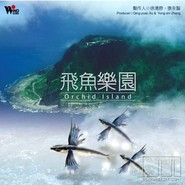

飞鱼乐园
============================

|  |  |
| :--: | :-- |
| [ 飞鱼乐园](https://emumo.xiami.com/album/320841) | **艺人**: [吴金黛](../index.md) **语种**: 国语 **唱片公司**: 风潮音乐 **发行时间**: 2001年04月24日 **专辑类别**: 合集, 杂锦 **专辑风格**: 自然新世纪 Nature New Age, 轻音乐 Easy Listening **播放数**: 259633 **收藏数**: 791 **评论数**: 20  |

## 简介

★自然音乐畅销片《森林狂想曲》、《我的海洋》最新姐妹作。  
★金曲奖唱片制作人吴金黛亲赴兰屿自然录音  
★唯一收录兰屿角鸮珍贵鸣声+情人洞潮声+青青草原气息+天池自然原音+虫鸣鸟叫声，真正自然之声  
★八首色彩炫目的自然音乐佳作，八场最零负担的自然旅行  
  
第一张为兰屿量身打造的自然音乐专辑，最自然干净的岛屿之声 献给所有崇尚自然的人，清澈却深邃的蓝色海洋围绕着，闲适却令人满足的气息流动着兰屿，有着最自然的声音与节奏。  
  
听岛上的鸟儿唱歌，就像听到心灵放松的声音，倾听小岛自然天籁。最零压力的生活感动。最远离尘嚣的自然旅行。 

## 曲目

## 评论

|  |  |  |
| :-- | :-- | :-- |
|  [虾米用户](https://emumo.xiami.com/u/31167458)  2017-10-28 00:22 赞(0) 踩(0) | 
融入自然的心情，总是美妙的难以言说，仿佛走入了那个遥不可及的理想国。 这张专辑很惊喜是国人所做，觉其中的自然气息并不比班得瑞或神秘园少，幸哉！！  美哉！！
 |
|  [虾米用户](https://emumo.xiami.com/u/241537060)  2017-01-16 21:04 赞(0) 踩(0) | 
好听
 |
|  [虾米用户](https://emumo.xiami.com/u/33541815) 放肆不止  既往不恋 2016-12-03 13:58 赞(0) 踩(0) | 
自然，解释一切
 |
|  [虾米用户](https://emumo.xiami.com/u/1742739) 一直困一直困 2016-02-25 13:30 赞(0) 踩(0) | 
没时间全部欣赏，第一首未听完就打5分~
 |
|  [虾米用户](https://emumo.xiami.com/u/7322777) ∮ 2015-07-26 15:59 赞(1) 踩(0) | 
...A...
 |
|  [虾米用户](https://emumo.xiami.com/u/20352733)  2015-07-06 04:22 赞(0) 踩(0) | 
挺好听的
 |
|  [虾米用户](https://emumo.xiami.com/u/12238179) 今世只为阳光而生。 2015-01-05 13:15 赞(0) 踩(0) | 
空旷
 |
|  [虾米用户](https://emumo.xiami.com/u/31487420) 爱自己 2014-01-22 14:50 赞(0) 踩(0) | 
很好听
 |
|  [虾米用户](https://emumo.xiami.com/u/3051010) 暂无签名~ 2014-01-10 17:12 赞(0) 踩(0) | 
精彩极致
 |
|  [虾米用户](https://emumo.xiami.com/u/10581838) yuRita 2013-12-28 14:06 赞(0) 踩(0) | 
嗬嗬哟哟，依儿呀喂，悠长纯净，自然而然。
 |
|  [虾米用户](https://emumo.xiami.com/u/21916115)  2013-09-14 08:01 赞(0) 踩(0) | 
飞鱼乐园
 |
|  [虾米用户](https://emumo.xiami.com/u/12664426)  2013-01-24 13:47 赞(0) 踩(0) | 
大爱,感谢
 |
|  [虾米用户](https://emumo.xiami.com/u/6744967) 音乐无国界，你爱我也爱。 2012-09-16 12:16 赞(0) 踩(0) | 
喜欢 谢谢
 |
|  [虾米用户](https://emumo.xiami.com/u/8839628)  2012-05-25 14:23 赞(0) 踩(0) | 
神赐美物
 |
|  [虾米用户](https://emumo.xiami.com/u/8562252)  2012-03-26 10:26 赞(0) 踩(0) | 
向往
 |
|  [虾米用户](https://emumo.xiami.com/u/3762064)  2012-03-12 16:08 赞(0) 踩(0) | 
,,,,,,,,,,,//////////////..... ........../////////////。。。自...然...之...音.......
 |
|  [虾米用户](https://emumo.xiami.com/u/3024528) 暂无签名~ 2011-10-25 22:59 赞(0) 踩(0) | 
先收了再说！
 |
|  [虾米用户](https://emumo.xiami.com/u/159187)  2011-10-06 18:50 赞(0) 踩(0) | 
第一首和陈建年《长老的叮咛》里的和声曲调是一样的。
 |
|  [虾米用户](https://emumo.xiami.com/u/5567052)  2011-08-25 18:43 赞(0) 踩(0) | 
真美！但我怎么充不了值也下载不了？请求帮助！
 |
|  [虾米用户](https://emumo.xiami.com/u/2110495)  2011-08-22 10:45 赞(0) 踩(0) | 
喜歡海浪聲~
 |
