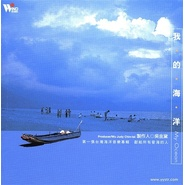

我的海洋My Ocean / 当代音乐馆-听见大自然系列
============================

|  |  |
| :--: | :-- |
| [ 我的海洋My Ocean / 当代音乐馆-听见大自然系列](https://emumo.xiami.com/album/32577) | **艺人**: [吴金黛](../index.md) **语种**: 国语 **唱片公司**: 风潮音乐 **发行时间**: 1995年08月15日 **专辑类别**: 合集, 杂锦 **专辑风格**: 自然新世纪 Nature New Age, 轻音乐 Easy Listening **播放数**: 10744219 **收藏数**: 11293 **评论数**: 509  |

## 简介

流水、雀鸟之声，能镇静人的情绪，松弛我们的身心，而且给人一种返回大自然的感觉，听了这些声音，Alpha脑电波会增加，左右脑的沟通亦会更加有效，智慧因而慢慢打开……  
  
第一张台湾海洋音乐专辑 献给所有爱海的人  
三个逐浪的海洋收音者＋一群顶尖的音乐创作者＋10首情境动人的自然音乐  
  
最美好的音乐收藏．最自然的音乐心情．最实用的音乐礼物  
  
令人忘情的金曲推荐 值得您一听再听  
  
◆ 99’年坎城唱片大展最高瞩目片「森林狂想曲”黄金制作群年度力作，台湾海洋声音与轻音乐精彩结合，再度引爆自然音乐话题  
◆ 范宗沛、董运昌、杨锦聪、林海…一流音乐家跨刀制作  
◆ New Age、轻爵士、佛朗明哥吉他、古典钢琴小品、民谣风…10首音乐10种风格，实在好听的创作曲献给天下知音人  
◆ 荒野作家徐仁修、自然影片导演廖东坤、「森林狂想曲”实力制作人吴金黛，台湾沿海实地录音，临场海浪声绝无仅有  
  
被海包裹的岛屿  
入是海，出也是海  
除了南投，岛屿的每一个县市都紧邻着海洋  
听海、看海、玩海，成为岛民共同的经历和记忆  
尽管台风来时巨浪滔天，人们从来不会忘记-海就在身边  
  
策划这张专辑，是因为人们那么爱海  
日出日落，戏水约会，捡贝壳石头漂流木，或，没事时来晃晃  
都是生活上的一味闲情  
  
「我的海洋”是台湾第一张本土海洋唱片  
因为它，我们终于可以从一张CD里，倾听台湾海洋的声音了  
忙碌到无法去海边的时候，只要随手一按，就能听见真实的海浪声  
幸福的感觉，会随着浪涛声涌进心里吧  
因为知道，这不是音效片，也不是国外的海  
这是我们居住的故乡  
我们所在的海岛的浪潮声  
  
生态介绍  
  
大约在四百年前，那时侯的台湾还是海水面下的的盆地，只有中央山脉露出海面，而且还不太高。后来由于欧亚大陆和菲律宾海板块移动所造成的挤压，使台湾逐渐隆起，形成一座突出海面4000公尺的岛屿。岛上拥有丰富的海岸地形及景观，无怪乎当荷兰人从望远镜里看见这座美丽的海岛时，会惊喜的称它为「福尔摩沙”。  
  
与浪息息相关的是海岸，日夜不歇的浪不断地重塑着海岸地形，扑到岩石上的浪，溅湿了岩石，重复的干湿、重复的盐结晶，使得岩石崩解的速度加快，也更容易被后来浪侵蚀。海浪，其实是一种塑造地形的外营力！在海水的运动中，最常见的有三种，分别称为海流、波浪与潮汐。  
  
1)海流：海水的大规模定向流动称为海流。  
  
2)波浪：波浪其实是因为海水面的各种因素（风力、日月引力、地震等）造成的周期性波状起伏，看起来像是向前移动，实际上只是做上下的圆形轨道运动。一般而言，海浪可分为风浪、涌浪、地震波及潮波四类。  
  
3)潮汐：潮汐是由太阳、地球和月球这三个星体的重力牵引藉着相对位置的改变所造成的周期性海面升降。  
  
总之，浪与海岸的关系是互为因果，随着时间的演进，地壳的内营力作用的不断进行，加上风化、侵蚀等外营力的作用，海岸地区也就逐潮发育出特殊的地形景观。海水经年累月抚触海岸，对海岸进行着侵蚀、搬运、堆积的作用，并藉由这些过程，塑造了许多富于变化的海岸地形，也因此各地的海浪声有了区隔。

## 曲目

## 评论

|  |  |  |  |
| :-- | :-- | :-- | :-- |
|  [虾米用户](https://emumo.xiami.com/u/276944698) 不要自我设限..... 2020-08-11 00:01 赞(1) 踩(0) | 

 |
|  [虾米用户](https://emumo.xiami.com/u/21206167) 笑一個吧 2020-06-21 00:16 赞(0) 踩(0) | 
这张专辑是夏天的宝藏
 |
|  [虾米用户](https://emumo.xiami.com/u/357302011)  2020-06-02 00:25 赞(0) 踩(0) | 
非常棒！！
 |
|  [虾米用户](https://emumo.xiami.com/u/7381227) 全是屁话 2020-04-17 00:35 赞(0) 踩(0) | 
感觉大海进到了我家里
 |
|  [虾米用户](https://emumo.xiami.com/u/355871568)  2020-04-07 22:05 赞(1) 踩(0) | 
几次搬家后 这张CD已经找不到了 当时在商场工作 推荐给广播室 夏季里一整天循环播放 于是这些音乐声 海浪声 人声 深深回荡在人生里 记忆中
 |
|  [虾米用户](https://emumo.xiami.com/u/343488722)  2020-01-10 06:50 赞(0) 踩(0) | 
这么多年了……终于找到了。。
 |
|  [虾米用户](https://emumo.xiami.com/u/412719205) 心生莲花，一路芬芳 2019-09-15 11:31 赞(0) 踩(0) | 
1
 |
|  [虾米用户](https://emumo.xiami.com/u/335339886)  2019-08-29 23:17 赞(0) 踩(0) | 
12年前经常听的专辑又回到耳边，虾米懂我。
 |
|  [虾米用户](https://emumo.xiami.com/u/342641639)  2019-08-18 22:39 赞(1) 踩(0) | 
这张专辑我觉得我可以听一辈子
 |
|  [虾米用户](https://emumo.xiami.com/u/326849731)  2019-07-25 14:52 赞(2) 踩(0) | 
我们都来自大海
 |
|  [虾米用户](https://emumo.xiami.com/u/372669933) 我还没想好要写什么... 2019-07-07 23:06 赞(1) 踩(0) | 
对海洋，没有比这更深情的告白了～一生的感动～
 |
|  [虾米用户](https://emumo.xiami.com/u/8558771)  2019-05-21 00:43 赞(3) 踩(0) | 
约2002年，同学推荐，最开始上网听的第一批MP3纯音乐，现在随着海浪声声，总能回忆起毕业那会儿悠闲自在的时光，绿色的树荫、没搬家前的老房子、一个人的午后、对未来的期待....
 |
|  [虾米用户](https://emumo.xiami.com/u/9648340)  2019-03-26 02:12 赞(2) 踩(0) | 
2019年3月9日晚21点 开车路上听到北京交通广播《蓝调北京》放着这专辑 一路灯光 车如孤舟，我想起好多小时候的人 和那时单纯的心 。心底的留存 翻涌上来 ，那路上特想哭 。眼睛潮的 一路疾驰 一路心静静随浪涌.
 |
|  [虾米用户](https://emumo.xiami.com/u/300948120) sing as you ... 2019-03-14 09:11 赞(1) 踩(0) | 
波浪声让人眼前仿佛一片海 合着音乐 胎教 备课 学习 阅读 都不耽误。很喜欢
 |
|  [虾米用户](https://emumo.xiami.com/u/16310007)  2019-03-09 00:06 赞(0) 踩(0) | 
平静
 |
|  [虾米用户](https://emumo.xiami.com/u/278839869)  2019-03-04 21:47 赞(1) 踩(0) | 
这一张专辑用一种特别方式让我们去感受原汁原味海洋的声音，不采用任何人工加工方式，就能让我们听到海洋交响乐，有浪花拍打岩石的声音，海鸟啼声，轮船的长鸣声…所有这一切组成大自然给我们谱写的乐章，感受自然给我们回馈的礼物，丰富而多彩。作为海边城市长大的人，远离故乡后就特别想念故乡的那片海，每次回到故乡总要去看看那边海。这张专辑能让我感觉我就站着海边听海，看海，看那潮起潮落，仿佛能洗涤一切，让内心归于平静。
 |
|  [虾米用户](https://emumo.xiami.com/u/374064587) 心游万仞 2019-02-20 10:19 赞(0) 踩(0) | 
身临其境的自然环境感官享受，赞！！！
 |
|  [虾米用户](https://emumo.xiami.com/u/290287) lacrimosa-de... 2019-01-19 01:51 赞(0) 踩(0) | 
这张专辑无人声的成为了我每夜的催眠曲！每天晚上躺在舒适的大床上，盖着无印良品的床被，闭着眼睛，听着海浪拍打岸边的响声和清脆的鸟鸣...真好！我喜欢一个人的生活一个人的睡眠！晚安
 |
|  [虾米用户](https://emumo.xiami.com/u/15956613) 我还没想好要写什么... 2019-01-03 13:16 赞(0) 踩(0) | 
充满海的声音、海的味道，极富深情的作品辑，时常在睡前欣赏
 |
|  [虾米用户](https://emumo.xiami.com/u/44191355) Bidalaska 2018-12-31 10:31 赞(1) 踩(0) | 
中国新世纪的实力派人物
 |
|  [虾米用户](https://emumo.xiami.com/u/406586948)  2018-10-22 19:41 赞(2) 踩(0) | 
大二的时候，以一位法学系学子的身份，凭借此专辑，混得音乐系迎新晚会演出一席之位。那时候，这专辑刚刚出，没多少人听过，恰好我是海南的，当时吸引了好多来海南的潜在游客。
 |
|  [虾米用户](https://emumo.xiami.com/u/403455384)  2018-09-14 02:21 赞(0) 踩(0) | 
网易和qq都没有，原来在这里！！！当年还刻了很多盘&amp;hellip;&amp;hellip;
 |
|  [虾米用户](https://emumo.xiami.com/u/323982579) 若文明消失,惟有音乐值得... 2018-07-12 21:53 赞(0) 踩(0) | 
好专辑，大自然的人情味，，，
 |
|  [虾米用户](https://emumo.xiami.com/u/369522384)  2018-05-24 00:05 赞(1) 踩(0) | 
好多水，全是水哈哈哈～特别喜欢半岛随想和山海之歌。特别是山海之歌，那就是对着海风海浪，最动听的人类歌唱啊
 |
|  [虾米用户](https://emumo.xiami.com/u/23108694)   2018-05-15 18:47 赞(3) 踩(0) | 
我估计是小学的时候就听了，不知道我妈买回来的正版还是翻版，听到CD成了大花脸，依然舍不得丢，听着听着，想象着无数种海洋的画面&amp;hellip;&amp;hellip; 梦想长大能住在海旁边的小屋里，结果长大了也放弃了 偶尔还是忍不住要听听，似乎可以触碰到自己的初心
 |
|  [虾米用户](https://emumo.xiami.com/u/118898730) Floating. 2018-05-08 21:11 赞(1) 踩(0) | 
海靠近我
 |
|  [虾米用户](https://emumo.xiami.com/u/102488866) 想要一个很大的水晶球 2018-04-29 21:27 赞(1) 踩(0) | 
平静
 |
|  [虾米用户](https://emumo.xiami.com/u/356235380)   2018-03-30 20:37 赞(9) 踩(0) | 
终于又找到了这张专辑&amp;hellip;&amp;hellip;哭晕
 |
|  [虾米用户](https://emumo.xiami.com/u/356219372)  2018-03-30 18:55 赞(1) 踩(0) | 
就冲这张专辑 开个会员
 |
|  [虾米用户](https://emumo.xiami.com/u/30800139) 我在低俗与高雅间活的很尴... 2018-02-13 15:07 赞(0) 踩(0) | 
。
 |
|  [虾米用户](https://emumo.xiami.com/u/211314721)  2018-01-02 21:39 赞(4) 踩(0) | 
待在室內，卻整個人都開闊了。
 |
|  [虾米用户](https://emumo.xiami.com/u/41715737) 喜欢简直就是把人变蠢的魔... 2017-12-31 07:41 赞(7) 踩(0) | 
很棒 适合看书时听 但唯一不喜欢的是结束时太突然了 戛然而止&amp;hellip;
 |
|  [虾米用户](https://emumo.xiami.com/u/313763303) 你好吗 2017-11-14 10:46 赞(1) 踩(0) | 

 |
|  [虾米用户](https://emumo.xiami.com/u/6746079) 听歌的人最无情 2017-10-28 00:17 赞(2) 踩(0) | 
看书学习必备背景音～太好听～
 |
|  [虾米用户](https://emumo.xiami.com/u/7404038)  2017-10-27 23:16 赞(3) 踩(0) | 
台湾 渔船 海风 太平洋 阳光 环岛骑行，还有什么比这样的生活环境更海阔天空？
 |
|  [虾米用户](https://emumo.xiami.com/u/11039783) qwe 2017-10-23 09:27 赞(1) 踩(0) | 
自然之美
 |
|  [虾米用户](https://emumo.xiami.com/u/326142912) 签名就算了，音乐不能少 2017-10-21 09:26 赞(1) 踩(0) | 
海边发发呆，挺好
 |
|  [虾米用户](https://emumo.xiami.com/u/153013324) 粤语经典，古风禅乐new... 2017-10-17 14:58 赞(2) 踩(0) | 
脚下踩着柔软的沙滩，身边吹着轻轻的海风，遥想童话里王子公主海滩抱
 |
|  [虾米用户](https://emumo.xiami.com/u/323721877)  2017-09-07 22:47 赞(2) 踩(0) | 
宁静美好亲切的音乐！
 |
|  [虾米用户](https://emumo.xiami.com/u/12500972)  2017-08-28 18:06 赞(2) 踩(0) | 
海水潮汐，自然有生命
 |
|  [虾米用户](https://emumo.xiami.com/u/276259961)   2017-08-28 10:21 赞(2) 踩(0) | 
我的海洋
 |
|  [虾米用户](https://emumo.xiami.com/u/3850989)  2017-08-04 13:07 赞(3) 踩(0) | 
某些时候我在想，写这些曲子的人，心灵一定是个细腻丰富温暖的人。大概只有内心充满阳光的人，才会做出这样的曲子，去驱散别人心中的阴黯
 |
|  [虾米用户](https://emumo.xiami.com/u/45046236) 我想对这个国家负责 2017-07-19 21:55 赞(1) 踩(0) | 
enjoy
 |
|  [虾米用户](https://emumo.xiami.com/u/38787867)  2017-06-15 07:43 赞(1) 踩(0) | 
带我到远方
 |
|  [虾米用户](https://emumo.xiami.com/u/20991517)  2017-05-16 00:53 赞(0) 踩(0) | 
很好
 |
|  [虾米用户](https://emumo.xiami.com/u/33611592) 音乐是药 2017-04-09 17:45 赞(2) 踩(0) | 
风潮那些年还是出了很多精品啊
 |
|  [虾米用户](https://emumo.xiami.com/u/281140983)  2017-03-17 21:12 赞(0) 踩(0) | 
好听
 |
|  [虾米用户](https://emumo.xiami.com/u/279515631)  2017-03-15 18:24 赞(0) 踩(0) | 
超喜欢
 |
|  [虾米用户](https://emumo.xiami.com/u/279515631)  2017-03-15 18:23 赞(0) 踩(0) | 
好喜欢
 |
|  [虾米用户](https://emumo.xiami.com/u/52447274) Grade three,... 2017-03-05 14:59 赞(0) 踩(0) | 
坚持下去
 |
|  [虾米用户](https://emumo.xiami.com/u/1085854)  2017-02-27 13:53 赞(0) 踩(0) | 
那几天这张专辑一直是我写作时的背景音乐
 |
|  [虾米用户](https://emumo.xiami.com/u/13194141) 看到的给我来个联络方式。... 2017-02-06 10:52 赞(0) 踩(0) | 
喜欢上这样的音乐的时候，思想境界就提升了
 |
|  [虾米用户](https://emumo.xiami.com/u/91110882) 音乐是水 文字是船 by... 2017-01-23 11:10 赞(2) 踩(0) | 
听了N遍后买了一张CD的。
 |
|  [虾米用户](https://emumo.xiami.com/u/22206) ID:22206 2017-01-08 00:30 赞(0) 踩(0) | 
睡前祝眠
 |
|  [虾米用户](https://emumo.xiami.com/u/255314534)  2016-12-18 20:40 赞(0) 踩(0) | 
我喜欢海，喜欢和虾米一起看海！
 |
|  [虾米用户](https://emumo.xiami.com/u/254434382) 好坏都忍住 也算是进步 2016-12-14 23:12 赞(4) 踩(0) | 
唯独虾米音乐拥有它的版权 为了找回它今下了这爱屁屁 希望你也喜欢这张专辑
 |
|  [虾米用户](https://emumo.xiami.com/u/110729886) 慢慢来，比较快 2016-12-12 08:36 赞(0) 踩(0) | 
真的好听
 |
|  [虾米用户](https://emumo.xiami.com/u/137590)  2016-12-06 10:58 赞(2) 踩(0) | 
听到这首音乐的时候你会停下手里的工作，你会想要知道她的名字，你会思念大海的样子
 |
|  [虾米用户](https://emumo.xiami.com/u/251360622)  2016-12-02 19:39 赞(0) 踩(0) | 
最喜欢 望海 和 霞光
 |
|  [虾米用户](https://emumo.xiami.com/u/574879)  2016-10-31 18:32 赞(3) 踩(0) | 
文字形容已显苍白 听就是了
 |
|  [虾米用户](https://emumo.xiami.com/u/9345581) Trekkie 2016-10-21 11:13 赞(0) 踩(0) | 
大海，我向往之地
 |
|  [虾米用户](https://emumo.xiami.com/u/9345581) Trekkie 2016-10-21 11:13 赞(0) 踩(0) | 
大海，我向往之地
 |
|  [虾米用户](https://emumo.xiami.com/u/9345581) Trekkie 2016-10-21 11:13 赞(0) 踩(0) | 
大海，我向往之地
 |
|  [虾米用户](https://emumo.xiami.com/u/5024164)  2016-10-10 22:56 赞(0) 踩(0) | 
海的声音，自然的旋律。
 |
|  [虾米用户](https://emumo.xiami.com/u/12363815)  2016-08-16 03:41 赞(1) 踩(0) | 
听到海浪声有点想哭，真好啊，能无意间听到这张海洋音乐专辑。
 |
|  [虾米用户](https://emumo.xiami.com/u/188593455)  2016-08-10 00:46 赞(1) 踩(0) | 
喜欢大海还有里面各种自然的声音
 |
|  [虾米用户](https://emumo.xiami.com/u/124641580) 春有百花秋有月夏有凉风冬... 2016-07-25 23:16 赞(1) 踩(0) | 
去年底到台，想着支持作者买正版，诚品书店CD部有目录没货。跑了好几家CD店，都回答没有。唉:-(
 |
|  [虾米用户](https://emumo.xiami.com/u/6463750) 清风拂山岗 2016-07-22 14:10 赞(1) 踩(0) | 
海洋的声音让人心醉
 |
|  [虾米用户](https://emumo.xiami.com/u/3869516)  2016-07-14 22:20 赞(0) 踩(0) | 
我的海洋
 |
|  [虾米用户](https://emumo.xiami.com/u/13033333) 当我感觉世界是我的时候：... 2016-07-11 22:36 赞(1) 踩(0) | 
不知道为什么靠近大海的时候，觉得很舒服很舒服，听大海的声音也很舒服很舒服。
 |
|  [虾米用户](https://emumo.xiami.com/u/35688672) 笑看人生 2016-06-27 12:14 赞(0) 踩(0) | 
适合夏天的音乐，去不了海边就闭眼听听吧
 |
|  [虾米用户](https://emumo.xiami.com/u/95846898)  2016-06-23 17:13 赞(0) 踩(0) | 
好。
 |
|  [虾米用户](https://emumo.xiami.com/u/170708100) 水不洗水，尘不染尘。 2016-06-13 16:17 赞(1) 踩(0) | 
就是喜欢自然的声音，没理由，就是喜欢。
 |
|  [虾米用户](https://emumo.xiami.com/u/121986978) 我要养只哈士奇。 2016-06-09 00:10 赞(2) 踩(0) | 
一片鸟语花香，海浪拍岸，纯净的味道。大赞。
 |
|  [虾米用户](https://emumo.xiami.com/u/13147006) 晚安，小东西。 2016-05-28 01:59 赞(3) 踩(0) | 
没这个听都睡不着了就我一个人吗？ 
 |
| ⇒ |  [虾米用户](https://emumo.xiami.com/u/844974) 谁道飘零不可怜 2016-10-12 00:39 赞(0) 踩(0) | 
你不是一个人
 |
|  [虾米用户](https://emumo.xiami.com/u/38786347)  2016-05-25 17:39 赞(0) 踩(0) | 
来自自然的音乐，放松，还不错
 |
|  [虾米用户](https://emumo.xiami.com/u/157804684)  2016-05-23 11:40 赞(0) 踩(0) | 
ocean
 |
|  [虾米用户](https://emumo.xiami.com/u/37920273)  2016-05-21 12:32 赞(0) 踩(0) | 
写东西的时候听心都能静下来
 |
|  [虾米用户](https://emumo.xiami.com/u/94462538) 90后双鱼 2016-04-29 13:38 赞(0) 踩(0) | 
夏天  大海  你们  青春
 |
|  [虾米用户](https://emumo.xiami.com/u/100586290)  2016-04-16 21:16 赞(0) 踩(0) | 
很美
 |
|  [虾米用户](https://emumo.xiami.com/u/7512997) 暂无签名~ 2016-04-14 23:04 赞(0) 踩(0) | 
想念大海了
 |
|  [虾米用户](https://emumo.xiami.com/u/25417878) 我的电影原声！ 2016-03-30 18:08 赞(1) 踩(0) | 
要是没有音乐就好了，纯自然的声音！
 |
|  [虾米用户](https://emumo.xiami.com/u/36081194) 酷狗音乐，一个有老歌的地... 2016-03-30 12:43 赞(1) 踩(0) | 
喜欢
 |
|  [虾米用户](https://emumo.xiami.com/u/4267210)  2016-03-20 20:17 赞(0) 踩(0) | 
自然
 |
|  [虾米用户](https://emumo.xiami.com/u/103605082) 我是仙 2016-03-19 15:19 赞(0) 踩(0) | 
这张专辑也太
 |
|  [虾米用户](https://emumo.xiami.com/u/4491558)  2016-03-17 18:17 赞(0) 踩(0) | 
我在海边长大
 |
|  [虾米用户](https://emumo.xiami.com/u/50404780)   2016-03-15 00:18 赞(0) 踩(0) | 
终于找到想要的声音了
 |
|  [虾米用户](https://emumo.xiami.com/u/111065990)  2016-03-11 12:33 赞(0) 踩(0) | 
我的海洋
 |
|  [虾米用户](https://emumo.xiami.com/u/111065990)  2016-03-11 12:33 赞(0) 踩(0) | 
我的海洋
 |
|  [虾米用户](https://emumo.xiami.com/u/3139121)  2016-03-09 16:12 赞(29) 踩(0) | 
98年才参加工作时，经常在CD店淘碟，看封面觉得不错，买下珍藏至今
 |
| ⇒ |  [虾米用户](https://emumo.xiami.com/u/49291623)  2016-04-03 00:34 赞(0) 踩(0) | 
98年内地就有引进了？
 |
| ⇒ |  [虾米用户](https://emumo.xiami.com/u/3139121)  2016-04-19 09:03 赞(0) 踩(0) | 
<q><b>之旅说：</b></q>
 |
| ⇒ |  [虾米用户](https://emumo.xiami.com/u/201389808)  2016-07-15 23:38 赞(0) 踩(0) | 
<q><b>cavi说：</b></q>
 |
| ⇒ |  [虾米用户](https://emumo.xiami.com/u/201389808)  2016-07-15 23:39 赞(0) 踩(0) | 
<q><b>cavi说：</b></q>
 |
| ⇒ |  [虾米用户](https://emumo.xiami.com/u/49229961) 暂无签名~ 2020-03-24 15:40 赞(0) 踩(0) | 
<q><b>之旅说：</b></q>
 |
|  [虾米用户](https://emumo.xiami.com/u/9827988) 暂无签名~ 2016-03-08 15:49 赞(2) 踩(0) | 
适合想认真学习又不想太吵闹被歌词分心的人 比如我
 |
|  [虾米用户](https://emumo.xiami.com/u/7340280) 大夢愚蠢 2016-03-08 14:25 赞(0) 踩(0) | 
//：
 |
|  [虾米用户](https://emumo.xiami.com/u/99043258)  2016-03-03 23:01 赞(0) 踩(0) | 
赞赞赞
 |
|  [虾米用户](https://emumo.xiami.com/u/38633976) 新来哒 2016-03-03 13:06 赞(0) 踩(0) | 
大自然的声音，很喜欢，赞
 |
|  [虾米用户](https://emumo.xiami.com/u/20147189) 嘘 2016-03-03 04:28 赞(0) 踩(0) | 
晕倒 好像是因为太饿 睡不着哇
 |
|  [虾米用户](https://emumo.xiami.com/u/20147189) 嘘 2016-03-03 04:14 赞(0) 踩(0) | 
有点失眠 默默打开听 睡觉
 |
|  [虾米用户](https://emumo.xiami.com/u/2280625) 一直走下去… 2016-03-01 23:32 赞(0) 踩(0) | 
喜欢。。
 |
|  [虾米用户](https://emumo.xiami.com/u/78557718)  2016-03-01 14:18 赞(0) 踩(0) | 
天籁之音
 |
|  [虾米用户](https://emumo.xiami.com/u/78557718)  2016-03-01 10:48 赞(0) 踩(0) | 
自然之声，美妙动听
 |
|  [虾米用户](https://emumo.xiami.com/u/13760468)  2016-02-29 04:30 赞(0) 踩(0) | 
听到最自然的声音！
 |
|  [虾米用户](https://emumo.xiami.com/u/13760468)  2016-02-29 04:28 赞(0) 踩(0) | 
自然，随心
 |
|  [虾米用户](https://emumo.xiami.com/u/20147189) 嘘 2016-02-27 00:13 赞(1) 踩(0) | 
早上七点起来到现在一直在做CAD 晚饭前打开这张 一直被治愈到深夜
 |
|  [虾米用户](https://emumo.xiami.com/u/853523)  2016-02-26 10:04 赞(0) 踩(0) | 
麻烦把封面右下角的水印去掉好么
 |
|  [虾米用户](https://emumo.xiami.com/u/98002728)  2016-02-26 08:08 赞(1) 踩(0) | 
海浪声。
 |
|  [虾米用户](https://emumo.xiami.com/u/60864802)  2016-02-25 19:29 赞(0) 踩(0) | 
喜欢自然的节奏和律动
 |
|  [虾米用户](https://emumo.xiami.com/u/8156303)  2016-02-25 14:58 赞(0) 踩(0) | 
大海声好美
 |
|  [虾米用户](https://emumo.xiami.com/u/12728433) 蓝联机票全国谈生意 2016-02-25 11:49 赞(2) 踩(0) | 
我好像找到宝藏了耶
 |
|  [虾米用户](https://emumo.xiami.com/u/4261281)  2016-02-25 11:10 赞(0) 踩(0) | 
我的海洋，海洋广阔、博大。
 |
|  [虾米用户](https://emumo.xiami.com/u/39362245)   2016-02-25 03:37 赞(2) 踩(0) | 
怎么可以这么好听 (｡•́ωก̀｡)
 |
|  [虾米用户](https://emumo.xiami.com/u/36366446) 有人说音乐是避难所 2016-02-24 23:14 赞(0) 踩(0) | 
晚安。
 |
|  [虾米用户](https://emumo.xiami.com/u/50344161)  2016-02-24 21:19 赞(0) 踩(0) | 
纯
 |
|  [虾米用户](https://emumo.xiami.com/u/117152276)  2016-02-24 19:35 赞(1) 踩(0) | 
非常棒的音乐，最走心的音乐！
 |
|  [虾米用户](https://emumo.xiami.com/u/1646141)  2016-02-24 11:00 赞(0) 踩(0) | 
非常好听
 |
|  [虾米用户](https://emumo.xiami.com/u/2297339)  2016-02-24 09:53 赞(0) 踩(0) | 
用心记录大自然声音的音乐大家···
 |
|  [虾米用户](https://emumo.xiami.com/u/701251)  2016-02-24 00:09 赞(0) 踩(0) | 
haigui folk
 |
|  [虾米用户](https://emumo.xiami.com/u/51702050) 最想说的话在草稿箱里，在... 2016-02-22 09:34 赞(0) 踩(0) | 

 |
|  [虾米用户](https://emumo.xiami.com/u/39865637)   2016-02-21 01:10 赞(0) 踩(0) | 
同一张专辑买了好多次，每一遍听都觉得很安定…与相声一起构成了我的睡眠背景音
 |
|  [虾米用户](https://emumo.xiami.com/u/6835731)  2016-02-19 20:00 赞(0) 踩(0) | 
风潮
 |
|  [虾米用户](https://emumo.xiami.com/u/925769)  2016-01-27 17:24 赞(0) 踩(0) | 
安逸
 |
|  [虾米用户](https://emumo.xiami.com/u/97391176)  2016-01-04 20:56 赞(0) 踩(0) | 
我的海洋,自然,
 |
|  [虾米用户](https://emumo.xiami.com/u/18657246)  2015-12-28 22:26 赞(0) 踩(0) | 
自然的美梦
 |
|  [虾米用户](https://emumo.xiami.com/u/41107345)  2015-12-21 00:00 赞(0) 踩(0) | 
蛋蛋
 |
|  [虾米用户](https://emumo.xiami.com/u/31413189)  2015-12-16 21:37 赞(2) 踩(0) | 
一直在听海浪，太治愈了，就这么一直听下去………………
 |
|  [虾米用户](https://emumo.xiami.com/u/23564795) 她就是个迷 2015-12-13 14:55 赞(1) 踩(0) | 
我想知道 这是在台湾哪里的海录的
 |
|  [虾米用户](https://emumo.xiami.com/u/8326332) 后来，即便是音乐，也无法... 2015-12-07 14:03 赞(65) 踩(0) | 
我有强迫症，一般把作曲者填入艺术家一栏《戏水》作曲：李世豪《我的海洋》作曲：董运昌《半岛随想》作曲：彭靖《大蓝》作曲：林海《奔岩》作曲：范宗沛《山海之歌》作曲：吴金黛《望海》作曲：杨锦聪《霞光》作曲：林海《星光小岛》作曲：彭靖《沙之印》作曲：林培祯
 |
| ⇒ |  [虾米用户](https://emumo.xiami.com/u/49229961) 暂无签名~ 2015-12-09 16:02 赞(0) 踩(0) | 
多谢科普
 |
| ⇒ |  [虾米用户](https://emumo.xiami.com/u/49229961) 暂无签名~ 2015-12-09 16:02 赞(0) 踩(0) | 
多谢科普
 |
| ⇒ |  [虾米用户](https://emumo.xiami.com/u/6654061) Cosmic Wave 2017-04-09 12:50 赞(0) 踩(0) | 
谢谢，我也很在意作曲家是谁，请问你买了正版盘吗？上面标注了作曲家对吗？
 |
| ⇒ |  [虾米用户](https://emumo.xiami.com/u/8326332) 后来，即便是音乐，也无法... 2017-04-09 14:59 赞(0) 踩(0) | 
<q><b>其實我想起名叫軒然的说：</b></q>
 |
| ⇒ |  [虾米用户](https://emumo.xiami.com/u/6654061) Cosmic Wave 2017-04-09 19:47 赞(0) 踩(0) | 
<q><b>韦几说：</b></q>
 |
| ⇒ |  [虾米用户](https://emumo.xiami.com/u/8326332) 后来，即便是音乐，也无法... 2017-04-09 21:48 赞(0) 踩(0) | 
<q><b>其實我想起名叫軒然的说：</b></q>
 |
|  [虾米用户](https://emumo.xiami.com/u/20730511)  2015-12-02 23:42 赞(0) 踩(0) | 
海洋的声音可以给我一份别致的宁静与放松！
 |
|  [虾米用户](https://emumo.xiami.com/u/81424644)  2015-11-09 17:27 赞(0) 踩(0) | 
给小宝宝听的
 |
|  [虾米用户](https://emumo.xiami.com/u/10990571) 花花世界，生生不息。 2015-10-12 11:25 赞(0) 踩(0) | 
还不错听哦~惊喜
 |
|  [虾米用户](https://emumo.xiami.com/u/14364706) 暂无签名~ 2015-10-03 14:09 赞(0) 踩(0) | 
太赞啦！
 |
|  [虾米用户](https://emumo.xiami.com/u/45307707)  2015-09-16 19:54 赞(0) 踩(0) | 

 |
|  [虾米用户](https://emumo.xiami.com/u/6835287) 宠辱不惊，看庭前花开花落... 2015-08-23 20:47 赞(0) 踩(0) | 
不能再美
 |
|  [虾米用户](https://emumo.xiami.com/u/3712972)  2015-08-20 11:46 赞(0) 踩(0) | 
感受大海的怀抱
 |
|  [虾米用户](https://emumo.xiami.com/u/55460893) 那便是我们的相逢 2015-08-17 21:17 赞(1) 踩(0) | 
想哭……
 |
|  [虾米用户](https://emumo.xiami.com/u/9446964)  2015-08-13 10:57 赞(0) 踩(0) | 
海 加  吉他钢琴
 |
|  [虾米用户](https://emumo.xiami.com/u/52607801)  2015-08-12 19:57 赞(0) 踩(0) | 
就想这样被海浪声包围着......
 |
|  [虾米用户](https://emumo.xiami.com/u/8274256) 乐在其中 2015-08-10 23:31 赞(1) 踩(0) | 
献给你，我无限怀念的宁静，美丽，清新的清晨的小岛！
 |
|  [虾米用户](https://emumo.xiami.com/u/3455285)  2015-08-04 17:56 赞(0) 踩(0) | 
火热炎夏，听海浪拍礁，自是清凉解暑。
 |
|  [虾米用户](https://emumo.xiami.com/u/3963891)  2015-08-03 08:41 赞(0) 踩(0) | 
海洋的声音
 |
|  [虾米用户](https://emumo.xiami.com/u/2112293)  2015-07-30 14:11 赞(0) 踩(0) | 
我的海洋，很喜欢
 |
|  [虾米用户](https://emumo.xiami.com/u/7322777) ∮ 2015-07-26 15:59 赞(0) 踩(0) | 
...A...
 |
|  [虾米用户](https://emumo.xiami.com/u/7127503)  2015-07-14 20:31 赞(0) 踩(0) | 
夏日必听专辑一
 |
|  [虾米用户](https://emumo.xiami.com/u/49702125)  2015-07-05 11:03 赞(0) 踩(0) | 
今年以来最惬意的周末：听听音乐，好好生活。
 |
|  [虾米用户](https://emumo.xiami.com/u/51920784) 只花痴钟汉良，钟小哇，钟... 2015-06-30 22:10 赞(1) 踩(0) | 
推荐一张超级喜欢的专辑，我的海洋，陪伴了我很长一段时间，听说海洋和清至君家的蓝色哇#钟汉良#更配哦 
 |
|  [虾米用户](https://emumo.xiami.com/u/6001037) 好好听歌 别扯逼格 2015-06-24 01:59 赞(1) 踩(0) | 
窗外下雨，我在听海
 |
|  [虾米用户](https://emumo.xiami.com/u/6383672)  2015-06-15 10:21 赞(0) 踩(0) | 
海水
 |
|  [虾米用户](https://emumo.xiami.com/u/2191920) 唱 2015-06-14 14:55 赞(0) 踩(0) | 
好安宁，想起在三亚湾晒着暖阳睡着了的十二月。
 |
|  [虾米用户](https://emumo.xiami.com/u/13799329)   2015-06-09 23:04 赞(0) 踩(0) | 
美好
 |
|  [虾米用户](https://emumo.xiami.com/u/9595915)  2015-06-01 22:16 赞(0) 踩(0) | 
台湾，海浪的声音
 |
|  [虾米用户](https://emumo.xiami.com/u/5421577) 要么孤独 要么庸俗 2015-05-25 02:08 赞(1) 踩(0) | 
每一个失去睡眠的晚上 它陪我熬过来
 |
|  [虾米用户](https://emumo.xiami.com/u/55245)  2015-04-28 23:52 赞(1) 踩(0) | 
╮（╯◇╰）╭吴金黛的全部专辑都值得好好收藏起来细细的听
 |
|  [虾米用户](https://emumo.xiami.com/u/2163728) 网易云同名～再会！ 2015-04-19 12:05 赞(0) 踩(0) | 
当年买的这张CD光碟，丢了，遗憾了。在xiami找回一份安慰和怀念！
 |
| ⇒ |  [虾米用户](https://emumo.xiami.com/u/233596) 我还没想好要写什么... 2015-04-26 23:35 赞(0) 踩(0) | 
我的new age入门碟，永远难以忘怀第一次听到时的感动
 |
|  [虾米用户](https://emumo.xiami.com/u/7811797) 音乐是我的阿司匹林。 2015-04-12 15:22 赞(0) 踩(0) | 
给爱海的人。
 |
|  [虾米用户](https://emumo.xiami.com/u/7337401)  2015-04-06 17:57 赞(0) 踩(0) | 
大蓝。。。。。。好听    好似姑娘的名字
 |
|  [虾米用户](https://emumo.xiami.com/u/46955399)  2015-04-04 18:08 赞(0) 踩(0) | 
好美
 |
|  [虾米用户](https://emumo.xiami.com/u/8589018) 这家伙很聪明什么也没留下... 2015-03-11 20:47 赞(0) 踩(0) | 
音乐不错……就是能不能换一个好点的封面ˊ_&amp;gt;ˋ
 |
|  [虾米用户](https://emumo.xiami.com/u/30623184) 事发的十九分钟 2015-02-15 23:50 赞(0) 踩(0) | 
慢慢欣赏吧
 |
|  [虾米用户](https://emumo.xiami.com/u/45223647) 暂无签名~ 2015-02-05 17:09 赞(0) 踩(0) | 
Thanks !
 |
| ⇒ |  [虾米用户](https://emumo.xiami.com/u/33433767) 暂无签名~ 2015-02-07 06:08 赞(0) 踩(0) | 
阿拉蕾了w路     t。一tl   Byyyy. NTv 懒土匪l啊t在于。  才好它天lj c l 天a l、懒 l： 我家小yt、 啊ttuj卡布…～   V  g  by b tv gb buy you  by. Y
 |
|  [虾米用户](https://emumo.xiami.com/u/18215780)  2015-02-05 13:37 赞(0) 踩(0) | 
午休时间的背景音乐
 |
|  [虾米用户](https://emumo.xiami.com/u/31508681)  2015-02-04 00:13 赞(0) 踩(0) | 
到哪都割不断的海洋情结 Good Night ~
 |
|  [虾米用户](https://emumo.xiami.com/u/31508681)  2015-02-04 00:09 赞(0) 踩(0) | 
到哪都隔不断的海洋情结 Good Night ~
 |
|  [虾米用户](https://emumo.xiami.com/u/19195193)  2015-01-28 22:04 赞(0) 踩(0) | 
躁了三两天 终于能静下心来 到哪都割不断的海洋情节
 |
|  [虾米用户](https://emumo.xiami.com/u/19195193)  2015-01-28 22:01 赞(0) 踩(0) | 
躁了两三天 终于能静下心来 到哪都割不断的海洋情节 …
 |
|  [虾米用户](https://emumo.xiami.com/u/38864755) haha hoho 2015-01-27 08:50 赞(0) 踩(0) | 
好喜欢，好暖的感觉。
 |
|  [虾米用户](https://emumo.xiami.com/u/24956195) . 2015-01-26 22:40 赞(0) 踩(0) | 
大海的声音。。。好喜欢(*/ω＼*)
 |
|  [虾米用户](https://emumo.xiami.com/u/7085168)   2015-01-13 21:03 赞(0) 踩(0) | 
哎哟。校歌
 |
|  [虾米用户](https://emumo.xiami.com/u/2089896)  2014-12-29 18:11 赞(0) 踩(0) | 
海洋的音乐最能松弛我心灵
 |
|  [虾米用户](https://emumo.xiami.com/u/2566788)  2014-12-28 10:37 赞(1) 踩(0) | 
可以一直听下去不厌倦，在都市听鸟声的音乐，海与你，草原与我。
 |
|  [虾米用户](https://emumo.xiami.com/u/42545151)   2014-12-08 21:40 赞(0) 踩(0) | 
好听…初中那会第一次听，很喜欢，都好多年喽！
 |
|  [虾米用户](https://emumo.xiami.com/u/15852632) 我知道我的路还很长... 2014-12-07 15:09 赞(0) 踩(0) | 
静
 |
|  [虾米用户](https://emumo.xiami.com/u/13258388) 一个在亚细亚的霍比特人 2014-12-02 17:29 赞(0) 踩(0) | 
听着听着就想家了
 |
|  [虾米用户](https://emumo.xiami.com/u/5983325)  2014-11-17 14:39 赞(0) 踩(0) | 
向往大海，爱听海浪
 |
|  [虾米用户](https://emumo.xiami.com/u/12962508)  2014-11-14 00:11 赞(0) 踩(0) | 
越来越喜欢自然之声。越纯越好听。
 |
|  [虾米用户](https://emumo.xiami.com/u/11779051)  2014-11-08 21:55 赞(0) 踩(0) | 
海浪的声音，让人不由自主的慢下来，因为那是家的感觉吧。
 |
|  [虾米用户](https://emumo.xiami.com/u/6500137)  2014-10-17 14:50 赞(1) 踩(0) | 
望海我听哭过
 |
|  [虾米用户](https://emumo.xiami.com/u/1152584) 还好有音乐 2014-09-18 20:28 赞(1) 踩(0) | 
惊喜，中学时候同学翻录的磁带，十几年后在虾米上偶遇，感叹去吧
 |
|  [虾米用户](https://emumo.xiami.com/u/27716970) 你的唇边是呼之欲出的春天 2014-09-14 17:11 赞(0) 踩(0) | 
大海
 |
|  [虾米用户](https://emumo.xiami.com/u/628442) 万物皆有音 2014-09-10 17:35 赞(0) 踩(0) | 
略咸
 |
|  [虾米用户](https://emumo.xiami.com/u/13576495)  2014-09-06 20:00 赞(0) 踩(0) | 
海洋轻音乐
 |
|  [虾米用户](https://emumo.xiami.com/u/11351499)  2014-08-28 15:30 赞(0) 踩(0) | 
大自然的声音
 |
|  [虾米用户](https://emumo.xiami.com/u/36528817)  2014-08-26 20:27 赞(0) 踩(0) | 
美的享受，这是所有依海而居的人的共同记忆。这专辑的我的海洋单曲现在还在中央对台广播(中华之声)使用，就是整点新闻后的过门音乐。最早是通过这单曲知道这个专辑，现在看来果然大美呀。
 |
|  [虾米用户](https://emumo.xiami.com/u/868750)  2014-08-18 09:30 赞(0) 踩(0) | 
海浪、沙滩、礁石，哇，偶来啦～～～
 |
|  [虾米用户](https://emumo.xiami.com/u/1428510)  2014-08-14 09:12 赞(0) 踩(0) | 
大海的声音
 |
|  [虾米用户](https://emumo.xiami.com/u/38748487) iris, 2014-08-03 10:39 赞(0) 踩(0) | 
每一首都很棒，我特别喜欢大蓝和沙之印，雨夜听，更是特别有感觉
 |
|  [虾米用户](https://emumo.xiami.com/u/2885666) 完美只存在于你的想象之中 2014-07-21 12:58 赞(0) 踩(0) | 
喜欢大自然的声音！
 |
|  [虾米用户](https://emumo.xiami.com/u/21392829) 我打算在黄昏的时候出发 2014-07-14 15:27 赞(0) 踩(0) | 
极好
 |
|  [虾米用户](https://emumo.xiami.com/u/37070833)  2014-07-12 22:35 赞(0) 踩(0) | 
海洋般的温柔。
 |
|  [虾米用户](https://emumo.xiami.com/u/38816879) ke 2014-07-09 08:55 赞(0) 踩(0) | 
好听
 |
|  [虾米用户](https://emumo.xiami.com/u/11627633)  2014-06-30 11:17 赞(0) 踩(0) | 
戴上耳机被海环抱
 |
|  [虾米用户](https://emumo.xiami.com/u/1511748)  2014-06-19 15:00 赞(0) 踩(0) | 
美的享受
 |
|  [虾米用户](https://emumo.xiami.com/u/1511748)  2014-06-19 14:58 赞(0) 踩(0) | 
很震撼，美的享受。
 |
|  [虾米用户](https://emumo.xiami.com/u/37267369)  2014-06-06 18:16 赞(0) 踩(0) | 
海边的感觉，安静....
 |
|  [虾米用户](https://emumo.xiami.com/u/22312957) No Music No ... 2014-06-02 09:35 赞(0) 踩(0) | 
还记得初中的时候为了找这张专辑费了好大劲，买到了最后一张不知道有多开心！心旷神怡的感觉，闭上眼听就仿佛身处台湾的海岸边，听着涛声阵阵鸥鸟低鸣……
 |
|  [虾米用户](https://emumo.xiami.com/u/16062522) 虾米没有不浪漫罪名 2014-05-24 19:39 赞(0) 踩(0) | 
如果也有一张雨声的音乐辑
 |
| ⇒ |  [虾米用户](https://emumo.xiami.com/u/31103735)  2014-10-25 12:44 赞(0) 踩(0) | 
就是
 |
|  [虾米用户](https://emumo.xiami.com/u/5967839)  2014-05-16 10:27 赞(0) 踩(0) | 
海浪緩緩拍擊沙灘，走在其中拾起貝殼，看日出日落，感受海的遼闊......
 |
|  [虾米用户](https://emumo.xiami.com/u/20951871) 声声伴我眠 2014-05-10 00:44 赞(0) 踩(0) | 
太美了。发现可以用在心理创伤治疗时，进行本体治疗的钟摆呼吸上，很好的调节植物神经的包容性和弹性。
 |
|  [虾米用户](https://emumo.xiami.com/u/8235694)  2014-05-07 23:06 赞(0) 踩(0) | 
大海！大海！
 |
|  [虾米用户](https://emumo.xiami.com/u/1609946) 一即一切 2014-04-20 11:05 赞(0) 踩(0) | 
心 境不二
 |
|  [虾米用户](https://emumo.xiami.com/u/8526740)  2014-04-17 15:04 赞(0) 踩(0) | 
这世界还有这么美好的音乐！
 |
|  [虾米用户](https://emumo.xiami.com/u/712346)  2014-04-13 12:43 赞(0) 踩(0) | 
大海专辑~献给所有爱海的人~↖(^ω^)↗
 |
|  [虾米用户](https://emumo.xiami.com/u/3422450) 最爱看你们絮叨 2014-04-12 12:19 赞(0) 踩(0) | 
有了这样的音乐，就是要死宅在家了
 |
|  [虾米用户](https://emumo.xiami.com/u/35181168)  2014-04-10 22:38 赞(0) 踩(0) | 
ocean自然海声
 |
|  [虾米用户](https://emumo.xiami.com/u/4453639) love you, to... 2014-03-30 21:01 赞(0) 踩(0) | 
超赞，Alpha脑电波在增加。。
 |
|  [虾米用户](https://emumo.xiami.com/u/1237495) 我还没想好要写什么... 2014-03-24 16:22 赞(0) 踩(0) | 
海涛声声
 |
|  [虾米用户](https://emumo.xiami.com/u/34334304)  2014-03-24 10:36 赞(0) 踩(0) | 
海浪拍岸，非常优美.........
 |
|  [虾米用户](https://emumo.xiami.com/u/32906923)  2014-03-22 12:17 赞(0) 踩(0) | 
太棒了！聆听海洋
 |
|  [虾米用户](https://emumo.xiami.com/u/10196013)  2014-03-15 22:55 赞(0) 踩(0) | 
你是大海
 |
|  [虾米用户](https://emumo.xiami.com/u/6908488)  2014-03-13 01:32 赞(0) 踩(0) | 
具有净化力的一张纯音乐专辑，海与阳光的味道温度，浪花拍打，几声鸟鸣，恰恰好。
 |
|  [虾米用户](https://emumo.xiami.com/u/9856805)  2014-03-12 22:06 赞(0) 踩(0) | 
真安静，可以安眠，大海的声音最舒服呢
 |
|  [虾米用户](https://emumo.xiami.com/u/664298)  2014-03-06 19:52 赞(0) 踩(0) | 
来自台湾海洋的问候，一叠叠的波涛声，那么熟悉...
 |
|  [虾米用户](https://emumo.xiami.com/u/30389543)  2014-02-25 10:51 赞(0) 踩(0) | 
立刻安静下来了
 |
|  [虾米用户](https://emumo.xiami.com/u/33089692)  2014-02-22 13:10 赞(0) 踩(0) | 
海的声音
 |
|  [虾米用户](https://emumo.xiami.com/u/10795656) 暂无签名~ 2014-02-16 22:06 赞(0) 踩(0) | 
自然的声音
 |
|  [虾米用户](https://emumo.xiami.com/u/5532351) 大千世界音乐给你带来享受 2014-02-15 12:59 赞(0) 踩(0) | 
这个专辑真好听〜真正的自然 真实的自然声音 足以感动每个人
 |
|  [虾米用户](https://emumo.xiami.com/u/6216135)  2014-02-13 14:05 赞(0) 踩(0) | 
我的海洋
 |
|  [虾米用户](https://emumo.xiami.com/u/23703381)  2014-02-10 11:44 赞(0) 踩(0) | 
流水、雀鸟之声，能镇静人的情绪，松弛我们的身心，而且给人一种返回大自然的感觉
 |
|  [虾米用户](https://emumo.xiami.com/u/25686562) 人到中年童心未眠 2014-02-09 18:05 赞(0) 踩(0) | 
大海，波浪，清风，水声。。。
 |
|  [虾米用户](https://emumo.xiami.com/u/27505697) 音乐如此悦耳 2014-01-11 09:47 赞(0) 踩(0) | 
大海轻音乐
 |
|  [虾米用户](https://emumo.xiami.com/u/11794317) ミ∩_∩ミ 2014-01-09 20:20 赞(0) 踩(0) | 
本科期间的睡前音乐
 |
|  [虾米用户](https://emumo.xiami.com/u/3992005)  2013-12-25 16:11 赞(0) 踩(0) | 
静
 |
|  [虾米用户](https://emumo.xiami.com/u/6850178) 暂无签名~ 2013-12-22 23:33 赞(0) 踩(0) | 
虽然轻音乐总感觉无差别慢慢的轻轻的 不晓得是不是沾上海的味道所以觉得特别些 但是大部分调子都很棒呀【作我讲故事的背景不错 嗯 后半部分全是真正的海的声音 喵
 |
|  [虾米用户](https://emumo.xiami.com/u/2514962)  2013-12-16 20:56 赞(0) 踩(0) | 
戴上耳机听海一系列 喜欢海的人不能错过
 |
|  [虾米用户](https://emumo.xiami.com/u/13647033)  2013-12-14 21:28 赞(0) 踩(0) | 
大自然音樂
 |
|  [虾米用户](https://emumo.xiami.com/u/5975024)  2013-12-14 13:13 赞(0) 踩(0) | 
关于海洋最好的专辑
 |
|  [虾米用户](https://emumo.xiami.com/u/29314400)  2013-12-09 14:51 赞(0) 踩(0) | 
Just love the ocean
 |
|  [虾米用户](https://emumo.xiami.com/u/8775055) 为卿白发兮缓缓歌.... 2013-12-05 22:26 赞(0) 踩(0) | 
流水、雀鸟之声，能镇静人的情绪，松弛我们的身心，而且给人一种返回大自然的感觉......
 |
|  [虾米用户](https://emumo.xiami.com/u/1068370)  2013-12-01 17:40 赞(1) 踩(0) | 
范宗沛、董运昌、杨锦聪、林海…一流音乐家跨刀制作；New Age、轻爵士、佛朗明哥吉他、古典钢琴小品、民谣风…10首音乐10种风格；荒野作家徐仁修、自然影片导演廖东坤、《森林狂想曲》实力制作人吴金黛，台湾沿海实地录音，临场海浪声绝无仅有。
 |
|  [虾米用户](https://emumo.xiami.com/u/3774926)  2013-11-20 19:36 赞(0) 踩(0) | 
很安静，适合一个人慢慢听
 |
|  [虾米用户](https://emumo.xiami.com/u/9134017)  2013-11-03 11:22 赞(0) 踩(0) | 
好听
 |
|  [虾米用户](https://emumo.xiami.com/u/25701217)  2013-10-30 12:33 赞(0) 踩(0) | 
舒缓的大自然之声，浪花，雀鸟，流云，海风。送一片蔚蓝大海给伙伴们。愿你们紧绷一天的神经得到片刻宁静与松弛。
 |
|  [虾米用户](https://emumo.xiami.com/u/25701217)  2013-10-30 12:27 赞(0) 踩(0) | 
喜欢海的声音
 |
|  [虾米用户](https://emumo.xiami.com/u/25701217)  2013-10-30 12:24 赞(0) 踩(0) | 
舒缓的自然之声，推荐给所有喜欢蔚蓝大海的小伙伴
 |
|  [虾米用户](https://emumo.xiami.com/u/22305668)   2013-10-28 12:49 赞(0) 踩(0) | 
听了这些声音，Alpha脑电波会增加，左右脑的沟通亦会更加有效，智慧因而慢慢打哦
 |
|  [虾米用户](https://emumo.xiami.com/u/6666474) shuiruyan 2013-10-26 22:30 赞(0) 踩(0) | 
回归自然是最美好的享受！
 |
|  [虾米用户](https://emumo.xiami.com/u/107146) 岁月长 衣裳薄 2013-10-25 12:02 赞(0) 踩(0) | 
来，一起去戾，放松，午休。
 |
|  [虾米用户](https://emumo.xiami.com/u/1393654) 我还没想好要写什么... 2013-10-25 11:23 赞(0) 踩(0) | 
輕音樂
 |
|  [虾米用户](https://emumo.xiami.com/u/4966178)  2013-10-23 01:11 赞(0) 踩(0) | 
聽聽
 |
|  [虾米用户](https://emumo.xiami.com/u/1847956)   2013-10-21 14:28 赞(0) 踩(0) | 
@朵果阿布 Disc1戏水里的大提琴声音很好听。。
 |
|  [虾米用户](https://emumo.xiami.com/u/7721396) 我还没想好要写什么... 2013-10-12 10:15 赞(0) 踩(0) | 
good
 |
|  [虾米用户](https://emumo.xiami.com/u/18725048)  2013-10-09 18:47 赞(0) 踩(0) | 
大海的味道
 |
|  [虾米用户](https://emumo.xiami.com/u/2441615) 种桃种李种春风 2013-10-04 21:24 赞(0) 踩(0) | 
好评！
 |
|  [虾米用户](https://emumo.xiami.com/u/2441615) 种桃种李种春风 2013-10-04 21:23 赞(0) 踩(0) | 
好评！
 |
|  [虾米用户](https://emumo.xiami.com/u/17221412)  2013-09-30 15:12 赞(0) 踩(0) | 
当代音乐馆-听见大自然系列-我的海洋,
 |
|  [虾米用户](https://emumo.xiami.com/u/21861422)  2013-09-13 15:10 赞(0) 踩(0) | 
轻音乐
 |
|  [虾米用户](https://emumo.xiami.com/u/2259663)  2013-09-12 10:44 赞(1) 踩(0) | 
听着想哭啊怎么破！
 |
| ⇒ |  [虾米用户](https://emumo.xiami.com/u/20951871) 声声伴我眠 2014-05-10 00:45 赞(0) 踩(0) | 
哭吧，感恩的哭，释放！
 |
|  [虾米用户](https://emumo.xiami.com/u/4141516)  2013-09-03 21:49 赞(0) 踩(0) | 
当代音乐馆-听见大自然系列-我的海洋,海洋,纯音乐
 |
|  [虾米用户](https://emumo.xiami.com/u/18603688)  2013-08-25 21:34 赞(0) 踩(0) | 
阿索推荐的这张专辑相当得我心意。也推荐给你们。（其中几首我之前就听过）
 |
|  [虾米用户](https://emumo.xiami.com/u/20260972) 知足常乐~ 2013-08-25 21:30 赞(0) 踩(0) | 
听到的第一秒就流泪。多想在无人的夜晚就这样坐在海边听海浪的声音，除此之外任何的情愫都是多余。
 |
|  [虾米用户](https://emumo.xiami.com/u/14489864)  2013-08-18 16:14 赞(0) 踩(0) | 
喜欢海浪声，加上鹅卵石翻滚碰撞的声音更喜欢了。
 |
|  [虾米用户](https://emumo.xiami.com/u/9317797) 爱装X的毛病还没治好 2013-08-11 01:29 赞(0) 踩(0) | 
不可阻挡 海浪声就是家乡
 |
|  [虾米用户](https://emumo.xiami.com/u/11699681)  2013-08-01 10:31 赞(0) 踩(0) | 
收了
 |
|  [虾米用户](https://emumo.xiami.com/u/16366852)  2013-07-23 23:05 赞(0) 踩(0) | 
喜欢纯的海水拍打海岸的声音~
 |
|  [虾米用户](https://emumo.xiami.com/u/4242636) 爱 2013-07-16 22:22 赞(0) 踩(0) | 
海。
 |
|  [虾米用户](https://emumo.xiami.com/u/13858693)  2013-07-12 21:46 赞(0) 踩(0) | 
太棒了，，大爱。。
 |
|  [虾米用户](https://emumo.xiami.com/u/11056036)  2013-07-12 08:51 赞(0) 踩(0) | 
特别适合夏天听的专辑,推荐大家!
 |
|  [虾米用户](https://emumo.xiami.com/u/16095812)  2013-07-06 15:57 赞(1) 踩(0) | 
想变成骑机车的小岛民
 |
|  [虾米用户](https://emumo.xiami.com/u/16607717)  2013-07-02 17:27 赞(0) 踩(0) | 
最喜欢的一张专辑。压力大的时候，失眠的时候，最适合聆听海的声音。
 |
|  [虾米用户](https://emumo.xiami.com/u/16117749)  2013-06-26 12:08 赞(0) 踩(0) | 
#优孕妈咪#又到了推荐胎教音乐得时间：本期带宝宝到台湾去听海，流水、雀鸟之声，能镇静人的情绪，松弛我们的身心，而且给人一种返回大自然的感觉，听了这些声音，Alpha脑电波会增加，左右脑的沟通亦会更加有效，智慧因而慢慢打开……
 |
|  [虾米用户](https://emumo.xiami.com/u/1125942) 给您拜早年了。₍₍ (ง... 2013-06-25 20:32 赞(0) 踩(0) | 
海的声音
 |
|  [虾米用户](https://emumo.xiami.com/u/7506952)  2013-06-22 22:28 赞(0) 踩(0) | 
很高兴能找到这张专辑！
 |
|  [虾米用户](https://emumo.xiami.com/u/8876850)  2013-06-16 20:10 赞(0) 踩(0) | 
这2天一直在找有海浪声的后摇专辑，没找到。这张真是意外之喜，感动，感恩。
 |
|  [虾米用户](https://emumo.xiami.com/u/1869823)  2013-06-14 14:41 赞(0) 踩(0) | 
喜欢海浪的声音
 |
|  [虾米用户](https://emumo.xiami.com/u/2759360) 自由自在，无忧无惧。 2013-06-11 14:28 赞(0) 踩(0) | 
@卷舌音
 |
|  [虾米用户](https://emumo.xiami.com/u/10107446)  2013-05-27 23:04 赞(0) 踩(0) | 
纯净、自然，感觉心灵都被净化了
 |
|  [虾米用户](https://emumo.xiami.com/u/1788590) 诗酒趁年华，朝来且放歌！ 2013-05-16 09:27 赞(0) 踩(0) | 
遇见海
 |
|  [虾米用户](https://emumo.xiami.com/u/1788590) 诗酒趁年华，朝来且放歌！ 2013-05-16 09:27 赞(0) 踩(0) | 
听见海声，遇见海
 |
|  [虾米用户](https://emumo.xiami.com/u/11159124) 今生都是第一次。 2013-05-13 16:51 赞(0) 踩(0) | 
流水、雀鸟之声，能镇静人的情绪，松弛我们的身心，而且给人一种返回大自然的感觉，听了这些声音，Alpha脑电波会增加，左右脑的沟通亦会更加有效，智慧因而慢慢打开……
 |
|  [虾米用户](https://emumo.xiami.com/u/2166195)  2013-04-28 13:40 赞(0) 踩(0) | 
猫鼻头、三仙台、枋山、白砂、石梯坪、兰屿……台湾的海浪在唱歌。去台湾前已经听过这张专辑。独自看过这一片又一片的海，如今回来再听更是怀念。
 |
|  [虾米用户](https://emumo.xiami.com/u/9524635)  2013-04-12 16:02 赞(0) 踩(0) | 
親切的浪濤聲.
 |
|  [虾米用户](https://emumo.xiami.com/u/3516104)  2013-04-10 14:54 赞(0) 踩(0) | 
离海已两年︶︿︶
 |
|  [虾米用户](https://emumo.xiami.com/u/733228) 我还没想好要写什么... 2013-04-10 13:20 赞(0) 踩(0) | 
海洋
 |
|  [虾米用户](https://emumo.xiami.com/u/2145587)  2013-04-05 10:59 赞(0) 踩(0) | 
当代音乐馆-听见大自然系列-我的海洋
 |
|  [虾米用户](https://emumo.xiami.com/u/11314932)  2013-03-22 19:58 赞(0) 踩(0) | 
听海。
 |
|  [虾米用户](https://emumo.xiami.com/u/13527645)  2013-03-15 16:45 赞(0) 踩(0) | 
宁静放松的感觉 美
 |
|  [虾米用户](https://emumo.xiami.com/u/1483277)  2013-03-15 10:55 赞(0) 踩(0) | 
喜欢海洋题材的作品~
 |
|  [虾米用户](https://emumo.xiami.com/u/7792034)  2013-03-10 19:36 赞(0) 踩(0) | 
我的海洋
 |
|  [虾米用户](https://emumo.xiami.com/u/6729433) 我还没想好要写什么... 2013-03-06 17:59 赞(0) 踩(0) | 
大自然的声音
 |
|  [虾米用户](https://emumo.xiami.com/u/2597068)  2013-03-06 11:51 赞(0) 踩(0) | 
很喜欢，像到了海边一样。
 |
|  [虾米用户](https://emumo.xiami.com/u/12112742) 念念无滞，常见本性 2013-03-02 21:39 赞(0) 踩(0) | 
放下Bandari，用另一种方式听见自然
 |
|  [虾米用户](https://emumo.xiami.com/u/6775979) 我还没想好要写什么... 2013-03-01 00:40 赞(0) 踩(0) | 
超好的采样 ！立刻置身
 |
|  [虾米用户](https://emumo.xiami.com/u/9127105)   2013-02-13 21:10 赞(0) 踩(0) | 
大自然，哈哈~~~
 |
|  [虾米用户](https://emumo.xiami.com/u/5021397)  2013-02-07 17:50 赞(0) 踩(0) | 
好喜歡  大藍
 |
|  [虾米用户](https://emumo.xiami.com/u/306183)  2013-01-29 09:16 赞(0) 踩(0) | 
海的声音
 |
|  [虾米用户](https://emumo.xiami.com/u/86960)  2013-01-15 01:33 赞(0) 踩(0) | 
钢琴,民谣,
 |
|  [虾米用户](https://emumo.xiami.com/u/6078053)  2013-01-13 14:54 赞(0) 踩(0) | 
听见海洋的声音
 |
|  [虾米用户](https://emumo.xiami.com/u/3460503)  2013-01-01 14:09 赞(0) 踩(0) | 
听这个做作业不能更棒！我的家也是被海包裹的小岛啊……
 |
|  [虾米用户](https://emumo.xiami.com/u/6929225) 改变，是为了做的更好！ 2012-12-16 20:53 赞(0) 踩(0) | 
最好的音乐应该是来自于大自然，对台湾有种莫名的向往，特别向往那里的大海！
 |
|  [虾米用户](https://emumo.xiami.com/u/6546992)  2012-12-14 19:23 赞(0) 踩(0) | 
让人心里变得很平静
 |
|  [虾米用户](https://emumo.xiami.com/u/2519683)  2012-12-01 00:19 赞(0) 踩(0) | 
有老家海的味道，真想家啊！
 |
|  [虾米用户](https://emumo.xiami.com/u/11277074)  2012-11-21 18:11 赞(0) 踩(0) | 
great
 |
|  [虾米用户](https://emumo.xiami.com/u/11242558) 我还没想好要写什么... 2012-11-10 23:26 赞(0) 踩(0) | 
安静自然的声音，天人合一的感受
 |
|  [虾米用户](https://emumo.xiami.com/u/2247480) 温暖而奔放~~~ 2012-11-07 22:34 赞(0) 踩(0) | 
居然真的有这样的专辑哪……@carrie昕 那我也要自己录自己的海洋专辑！
 |
|  [虾米用户](https://emumo.xiami.com/u/1550460)  2012-11-04 22:19 赞(0) 踩(0) | 
想和你，一起去看海
 |
|  [虾米用户](https://emumo.xiami.com/u/2844532) 心随乐动 2012-11-04 21:14 赞(0) 踩(0) | 
对**，有一种近乎痴迷的眷恋。 我喜欢天和海，我一直觉得，如果哪一天， 连记忆都抛弃我了，唯有天和海是不会离开我的。 望着大海的时候，会有一种归属感， 会有一种渴望飞翔的漂泊感。 如果天空像梦想，那么大海像家， 一个用无穷无尽告诉你，勇敢翱翔，去追求梦想， 一个用辽阔无....
 |
|  [虾米用户](https://emumo.xiami.com/u/11298587) VIP 2012-11-01 10:58 赞(0) 踩(0) | 
自然音乐
 |
|  [虾米用户](https://emumo.xiami.com/u/3250135)  2012-10-27 11:37 赞(0) 踩(0) | 
每次听心里都无比平静，回忆起去过的每一片海洋
 |
|  [虾米用户](https://emumo.xiami.com/u/224031)  2012-10-09 15:46 赞(0) 踩(0) | 
大海的声音就是故乡的声音
 |
|  [虾米用户](https://emumo.xiami.com/u/1211226)  2012-09-21 15:31 赞(0) 踩(0) | 
随身带着的音乐。
 |
|  [虾米用户](https://emumo.xiami.com/u/1211226)  2012-09-21 15:30 赞(0) 踩(0) | 
随身带着的音乐
 |
|  [虾米用户](https://emumo.xiami.com/u/236164)  2012-09-21 11:21 赞(0) 踩(0) | 
海的声音
 |
|  [虾米用户](https://emumo.xiami.com/u/872863) 网易云音乐ID:BLUE... 2012-09-20 23:50 赞(0) 踩(0) | 
烦心的时候，感觉苦闷的时候，听一听《我的海洋》就会舒服很多。
 |
|  [虾米用户](https://emumo.xiami.com/u/9959)  2012-09-20 13:35 赞(0) 踩(0) | 
disc2更好
 |
|  [虾米用户](https://emumo.xiami.com/u/9595917) 好乐兮....怡情兮 2012-09-16 00:59 赞(0) 踩(0) | 
我想 我们去海边吧 在那里 我们可以牵着手 在绵长的海岸线上 留下两串平行的脚印 在那里 我们可以背靠着背 聆听海浪的声音 倾听彼此的心跳 如果可以 不要说话 只要这么听着就好
 |
|  [虾米用户](https://emumo.xiami.com/u/2394147)  2012-09-04 15:16 赞(0) 踩(0) | 
擁有大自然的音樂。。美妙！
 |
|  [虾米用户](https://emumo.xiami.com/u/8412046)  2012-09-04 10:29 赞(0) 踩(0) | 
自然之音，让我们沐浴在大自然怀抱中，感恩自然之馈赠
 |
|  [虾米用户](https://emumo.xiami.com/u/5639895)  2012-09-02 22:48 赞(0) 踩(0) | 
海的声音...
 |
|  [虾米用户](https://emumo.xiami.com/u/63755)  2012-09-02 11:59 赞(0) 踩(0) | 
最自然的浪汐声，就是我曾经每天沿着海岸散步时听见的声音，Tayport的海从来不汹涌，总是能安抚我的一切不安。
 |
|  [虾米用户](https://emumo.xiami.com/u/4413540)  2012-08-30 01:28 赞(0) 踩(0) | 
沉静又轻盈
 |
|  [虾米用户](https://emumo.xiami.com/u/10355266)  2012-08-29 16:15 赞(0) 踩(0) | 
海声
 |
|  [虾米用户](https://emumo.xiami.com/u/9560211)  2012-08-22 23:35 赞(0) 踩(0) | 
自然的声音。。。
 |
|  [虾米用户](https://emumo.xiami.com/u/2946900)  2012-08-19 23:00 赞(0) 踩(0) | 
累了，你就听听大海的声音吧。该死的周一！
 |
|  [虾米用户](https://emumo.xiami.com/u/4227475)  2012-08-19 17:22 赞(0) 踩(0) | 
大自然的声音 很平静
 |
|  [虾米用户](https://emumo.xiami.com/u/6073492)  2012-08-18 11:51 赞(0) 踩(0) | 
我最爱的大海~
 |
|  [虾米用户](https://emumo.xiami.com/u/4115204)  2012-08-17 17:45 赞(0) 踩(0) | 
很清新，回归大自然的体验
 |
|  [虾米用户](https://emumo.xiami.com/u/1172689)  2012-08-17 13:21 赞(0) 踩(0) | 
自然音乐
 |
|  [虾米用户](https://emumo.xiami.com/u/2756640) 免得你带着明眸皓齿装饰我 2012-08-16 13:51 赞(101) 踩(0) | 
给我家的青苔听下看能不能长绿点...
 |
| ⇒ |  [虾米用户](https://emumo.xiami.com/u/3498597)  2013-11-18 10:20 赞(0) 踩(0) | 
哈哈，好可爱啊你。
 |
| ⇒ |  [虾米用户](https://emumo.xiami.com/u/483409) 牛继续吹 2013-12-01 10:13 赞(0) 踩(0) | 
噗  你好坏呀
 |
| ⇒ |  [虾米用户](https://emumo.xiami.com/u/2756640) 免得你带着明眸皓齿装饰我 2013-12-01 10:24 赞(0) 踩(0) | 
<q><b>Rythm说：</b></q>
 |
| ⇒ |  [虾米用户](https://emumo.xiami.com/u/483409) 牛继续吹 2013-12-01 11:29 赞(0) 踩(0) | 
<q><b>1RMB说：</b></q>
 |
| ⇒ |  [虾米用户](https://emumo.xiami.com/u/316261284) 到最后…… 2019-10-10 09:04 赞(0) 踩(0) | 
哈哈你好优秀呀，7年过去了，你的青苔还在吗
 |
| ⇒ |  [虾米用户](https://emumo.xiami.com/u/2756640) 免得你带着明眸皓齿装饰我 2019-10-10 21:43 赞(0) 踩(0) | 
<q><b>星屿说：</b></q>
 |
| ⇒ |  [虾米用户](https://emumo.xiami.com/u/316261284) 到最后…… 2019-10-10 21:50 赞(0) 踩(0) | 
<q><b>1RMB说：</b></q>
 |
| ⇒ |  [虾米用户](https://emumo.xiami.com/u/2756640) 免得你带着明眸皓齿装饰我 2019-10-10 21:57 赞(0) 踩(0) | 
<q><b>星屿说：</b></q>
 |
| ⇒ |  [虾米用户](https://emumo.xiami.com/u/7381227) 全是屁话 2020-04-17 01:37 赞(0) 踩(0) | 
神经病
 |
| ⇒ |  [虾米用户](https://emumo.xiami.com/u/337794365) 曹操 2020-12-20 13:13 赞(0) 踩(0) | 
哈哈哈哈
 |
|  [虾米用户](https://emumo.xiami.com/u/6160912)  2012-08-14 23:17 赞(0) 踩(0) | 
好听到崩溃
 |
|  [虾米用户](https://emumo.xiami.com/u/322610)  2012-08-14 22:40 赞(0) 踩(0) | 
睡前音乐
 |
|  [虾米用户](https://emumo.xiami.com/u/630760) 感谢11年来的陪伴，我爱... 2012-08-04 13:10 赞(0) 踩(0) | 
大海的声音永远听不名够：）
 |
|  [虾米用户](https://emumo.xiami.com/u/544794)  2012-08-02 18:16 赞(0) 踩(0) | 
宁静
 |
|  [虾米用户](https://emumo.xiami.com/u/1242218) （*￣︶￣*）觉知自己 2012-08-01 16:57 赞(0) 踩(0) | 
听到这个就想奔向海边河边水里，游泳。。。
 |
|  [虾米用户](https://emumo.xiami.com/u/6233773)  2012-07-31 12:07 赞(0) 踩(0) | 
hao
 |
|  [虾米用户](https://emumo.xiami.com/u/9909383)  2012-07-22 10:05 赞(0) 踩(0) | 
海的声音
 |
|  [虾米用户](https://emumo.xiami.com/u/1404996)  2012-07-14 14:18 赞(0) 踩(0) | 
栖……
 |
|  [虾米用户](https://emumo.xiami.com/u/9294724)  2012-07-13 11:15 赞(0) 踩(0) | 
自然
 |
|  [虾米用户](https://emumo.xiami.com/u/9294724)  2012-07-13 11:14 赞(0) 踩(0) | 
自然的声音很动听~
 |
|  [虾米用户](https://emumo.xiami.com/u/2403528) 你们点赞，我就再听一遍，... 2012-07-13 00:48 赞(0) 踩(0) | 
今晚窗外有知了和夜风，想起了这辑
 |
|  [虾米用户](https://emumo.xiami.com/u/9702770)  2012-07-10 20:46 赞(0) 踩(0) | 
我觉得这些艺人要多点！这些曲子渗透到我的内心深处，比起那些流行歌曲好听多了。
 |
|  [虾米用户](https://emumo.xiami.com/u/1086302) 热烈不疯癫，安静不沉闷，... 2012-07-07 16:16 赞(0) 踩(0) | 
因为有海。
 |
|  [虾米用户](https://emumo.xiami.com/u/9722824)  2012-07-07 14:35 赞(0) 踩(0) | 
听过一首，觉得很好
 |
|  [虾米用户](https://emumo.xiami.com/u/645442) 我听到的即是我的世界。 2012-07-03 13:51 赞(0) 踩(0) | 
给所有爱海的人
 |
|  [虾米用户](https://emumo.xiami.com/u/1348718)  2012-07-02 12:49 赞(0) 踩(0) | 
听完这张专辑更想去海边了
 |
|  [虾米用户](https://emumo.xiami.com/u/9651207)  2012-07-01 11:39 赞(0) 踩(0) | 
我喜欢这样的海浪声，让我想起太多的过去。
 |
|  [虾米用户](https://emumo.xiami.com/u/14875)  2012-06-28 15:34 赞(0) 踩(0) | 
象这种融了海浪声的音乐，在真正的海边，应该就没法听了吧？
 |
|  [虾米用户](https://emumo.xiami.com/u/6188856)   2012-06-25 01:49 赞(0) 踩(0) | 
自然之声
 |
|  [虾米用户](https://emumo.xiami.com/u/7730271) 不如意事常八九 2012-06-22 16:09 赞(0) 踩(0) | 
终于找到了“海的声音”。
 |
|  [虾米用户](https://emumo.xiami.com/u/3707760)  2012-06-22 10:55 赞(0) 踩(0) | 
文案上说【听了这些声音，Alpha脑电波会增加，左右脑的沟通亦会更加有效，智慧因而慢慢打开……】
 |
|  [虾米用户](https://emumo.xiami.com/u/6010456) 我还没想好要写什么... 2012-06-21 02:21 赞(0) 踩(0) | 
虽然没真正看过海，听着这样的声音，仿佛我就站在海边，看日出日落，云潮涌动，海浪翻滚...
 |
|  [虾米用户](https://emumo.xiami.com/u/9509993)  2012-06-18 21:29 赞(0) 踩(0) | 
爱着海，恋着海。
 |
|  [虾米用户](https://emumo.xiami.com/u/6333005)  2012-06-08 18:31 赞(0) 踩(0) | 
多年最爱，没有之一。
 |
|  [虾米用户](https://emumo.xiami.com/u/4288578)  2012-06-05 18:46 赞(0) 踩(0) | 
不错的轻音乐
 |
|  [虾米用户](https://emumo.xiami.com/u/9371911)  2012-06-04 11:38 赞(0) 踩(0) | 
海洋是很多人心中的梦想听这张专辑我仿佛置身辽阔的海洋谁能否认这是1种简单的小幸福呢
 |
|  [虾米用户](https://emumo.xiami.com/u/1511937)  2012-06-01 17:12 赞(0) 踩(0) | 
真好听，很放松的感觉。就像是傍晚坐在海边沙滩有风吹过的感觉--我的海洋
 |
|  [虾米用户](https://emumo.xiami.com/u/3285240) 好讨厌夏天 2012-05-22 18:30 赞(0) 踩(0) | 
恬淡
 |
|  [虾米用户](https://emumo.xiami.com/u/8759796)  2012-05-21 20:54 赞(0) 踩(0) | 
吴金黛
 |
|  [虾米用户](https://emumo.xiami.com/u/3285240) 好讨厌夏天 2012-05-21 20:08 赞(0) 踩(0) | 
l love blue.
 |
|  [虾米用户](https://emumo.xiami.com/u/5880408) 你倍害怕 你活该 2012-05-21 18:32 赞(0) 踩(0) | 
睡前安眠曲
 |
|  [虾米用户](https://emumo.xiami.com/u/1658132)  2012-05-21 14:19 赞(0) 踩(0) | 
听到第一秒就流泪。多想在无人的夜晚就这样坐在海边听海浪的声音，除此之外任何的情愫都多余，太美了。
 |
| ⇒ |  [虾米用户](https://emumo.xiami.com/u/65703) 有钱，宣你 2012-05-28 19:16 赞(0) 踩(0) | 
为什么会流泪，多美好的感觉，应该是很宁静才对呀。。求解
 |
|  [虾米用户](https://emumo.xiami.com/u/2861594) 山风清泉 虫语鸟鸣 自由... 2012-05-21 13:32 赞(0) 踩(0) | 
头枕波涛
 |
|  [虾米用户](https://emumo.xiami.com/u/7049122) 我还没想好要写什么... 2012-05-21 00:41 赞(0) 踩(0) | 
晚上一个人听着，静的很舒服。
 |
|  [虾米用户](https://emumo.xiami.com/u/3035647)  2012-05-20 19:39 赞(0) 踩(0) | 
流水、雀鸟之声，能镇静人的情绪，松弛我们的身心，而且给人一种返回大自然的感觉
 |
|  [虾米用户](https://emumo.xiami.com/u/3598376)  2012-05-18 23:49 赞(0) 踩(0) | 
一直记得那片海，闭上眼睛，听到远方的马达声~~~
 |
|  [虾米用户](https://emumo.xiami.com/u/4818597) 失去你我不会放声哭泣，就... 2012-05-18 21:57 赞(0) 踩(0) | 
海的声音。什么时候能实现我这个愿望？住一个临海的地方。快了快了···
 |
|  [虾米用户](https://emumo.xiami.com/u/6570458)  2012-05-16 10:36 赞(0) 踩(0) | 
心平气和地听
 |
|  [虾米用户](https://emumo.xiami.com/u/8588)  2012-05-12 16:22 赞(0) 踩(0) | 
突然发现吴金黛的这个海和别的海最大的不同是乡土气息，嗯，对，怪不得一直觉得亲切，非马尔代夫巴厘普及之流可比
 |
|  [虾米用户](https://emumo.xiami.com/u/1747192) 幽静 2012-05-06 06:57 赞(0) 踩(0) | 
Pure nature  is powerful
 |
|  [虾米用户](https://emumo.xiami.com/u/1747192) 幽静 2012-05-06 06:41 赞(0) 踩(0) | 
冥想－和谐－平衡－愉悦的心情！
 |
|  [虾米用户](https://emumo.xiami.com/u/3978160)  2012-04-26 22:29 赞(0) 踩(0) | 
那是海裡湧來的沙~那是夢中難忘的波濤~
 |
|  [虾米用户](https://emumo.xiami.com/u/3722521) 能打马赛克吗？ 2012-04-25 14:42 赞(0) 踩(0) | 
温柔又稳重的声音，莫名其妙的安全感令我放松下来
 |
|  [虾米用户](https://emumo.xiami.com/u/548488)  2012-04-22 23:26 赞(0) 踩(0) | 
我的海洋
 |
|  [虾米用户](https://emumo.xiami.com/u/5624310)  2012-04-11 13:21 赞(0) 踩(0) | 
海浪的声音撩拨起你的神经又抚平。
 |
|  [虾米用户](https://emumo.xiami.com/u/2644123)  2012-04-11 12:28 赞(0) 踩(0) | 
天然亲近
 |
|  [虾米用户](https://emumo.xiami.com/u/4350559) 我还没想好要写什么... 2012-04-06 04:20 赞(0) 踩(0) | 
听着睡,晚安
 |
|  [虾米用户](https://emumo.xiami.com/u/1651313) 我还没想好要写什么... 2012-04-05 11:26 赞(0) 踩(0) | 
就是喜欢
 |
|  [虾米用户](https://emumo.xiami.com/u/3093053)  2012-04-04 20:01 赞(0) 踩(0) | 
心情浮躁、低落、空虚的时候，听这张专辑，都会瞬间平静。
 |
|  [虾米用户](https://emumo.xiami.com/u/8731689)  2012-04-04 13:13 赞(0) 踩(0) | 
身心舒畅
 |
|  [虾米用户](https://emumo.xiami.com/u/8731689)  2012-04-04 13:11 赞(0) 踩(0) | 
给人感觉很轻松很舒服让人有一种很宁和有大自然的感觉
 |
|  [虾米用户](https://emumo.xiami.com/u/3461863)  2012-04-04 12:59 赞(0) 踩(0) | 
治愈系
 |
|  [虾米用户](https://emumo.xiami.com/u/702437)  2012-03-31 22:59 赞(0) 踩(0) | 
随着海浪声能闻到海腥味
 |
|  [虾米用户](https://emumo.xiami.com/u/8018643)  2012-03-31 13:34 赞(0) 踩(0) | 
べ_べ
 |
|  [虾米用户](https://emumo.xiami.com/u/8654868)  2012-03-31 06:44 赞(0) 踩(0) | 
心静自然
 |
|  [虾米用户](https://emumo.xiami.com/u/4350559) 我还没想好要写什么... 2012-03-29 21:43 赞(0) 踩(0) | 
喜欢得不得了
 |
|  [虾米用户](https://emumo.xiami.com/u/6970381) 享受生活 2012-03-27 05:13 赞(0) 踩(0) | 
我心中深爱深爱深爱的一张专辑~哇哈哈，被我在虾米找到了。
 |
|  [虾米用户](https://emumo.xiami.com/u/8562252)  2012-03-26 10:09 赞(0) 踩(0) | 
身心舒暢
 |
|  [虾米用户](https://emumo.xiami.com/u/3401373)  2012-03-15 17:28 赞(0) 踩(0) | 
好听~
 |
|  [虾米用户](https://emumo.xiami.com/u/8279965)  2012-03-03 21:38 赞(0) 踩(0) | 
心靈休憩地........
 |
|  [虾米用户](https://emumo.xiami.com/u/5472255)  2012-02-28 11:21 赞(0) 踩(0) | 
喜欢海浪的声音
 |
|  [虾米用户](https://emumo.xiami.com/u/1840724)  2012-02-20 11:24 赞(0) 踩(0) | 
旋律
 |
|  [虾米用户](https://emumo.xiami.com/u/4274306)  2012-02-20 11:11 赞(0) 踩(0) | 
原来阿珂给我刻的盘，一部分是来自于这里：）
 |
|  [虾米用户](https://emumo.xiami.com/u/8067346)  2012-02-16 15:32 赞(0) 踩(0) | 
美
 |
|  [虾米用户](https://emumo.xiami.com/u/2644123)  2012-02-03 13:18 赞(0) 踩(0) | 
好音乐
 |
|  [虾米用户](https://emumo.xiami.com/u/4784936)  2012-02-01 14:52 赞(0) 踩(0) | 
收录着台湾所有海洋的声音
 |
|  [虾米用户](https://emumo.xiami.com/u/7332143)  2012-02-01 08:37 赞(0) 踩(0) | 
台湾。海的声音。
 |
|  [虾米用户](https://emumo.xiami.com/u/7813948)  2012-01-29 19:28 赞(0) 踩(0) | 
天籁
 |
|  [虾米用户](https://emumo.xiami.com/u/1422831)  2012-01-28 20:29 赞(0) 踩(0) | 
第一张台湾海洋音乐专辑 先给所有爱海的人
 |
|  [虾米用户](https://emumo.xiami.com/u/7100583)  2012-01-28 13:43 赞(0) 踩(0) | 
高中时偶然听到，从此爱上了风潮，而这张是至爱。
 |
|  [虾米用户](https://emumo.xiami.com/u/285338)  2012-01-28 00:48 赞(0) 踩(0) | 
sea
 |
|  [虾米用户](https://emumo.xiami.com/u/2647559)  2012-01-23 21:22 赞(0) 踩(0) | 
大海的声音
 |
|  [虾米用户](https://emumo.xiami.com/u/510745) 一些无声的话语，只有寻梦... 2012-01-11 16:30 赞(0) 踩(0) | 
很早的专辑如今才听到，如此美好却又如此亲近  @lee1806
 |
|  [虾米用户](https://emumo.xiami.com/u/505273)  2012-01-10 15:05 赞(0) 踩(0) | 
带我投入大自然温暖恬静的一面
 |
|  [虾米用户](https://emumo.xiami.com/u/1416239)  2012-01-06 02:24 赞(0) 踩(0) | 
my ocean
 |
|  [虾米用户](https://emumo.xiami.com/u/5732167)   2011-12-23 00:22 赞(0) 踩(0) | 
纯音乐
 |
|  [虾米用户](https://emumo.xiami.com/u/1561041)  2011-12-15 23:20 赞(0) 踩(0) | 
高中时买的这张唱片，买时只觉得封面好看，说是自然之声。回家一听，如获至宝。十年间，百听千听万听不厌，自然，优美，宁静，安祥.....
 |
|  [虾米用户](https://emumo.xiami.com/u/1709370)  2011-12-01 20:45 赞(0) 踩(0) | 
自然的声音
 |
|  [虾米用户](https://emumo.xiami.com/u/5694577)  2011-12-01 13:56 赞(0) 踩(0) | 
要远离海边了。这样的中午听着这些歌 安静 又有些感伤。多年以后，面对这样的世界，我想很难再用无所事事的神情打探。真想和朋友一起听这张专辑，共用一副耳机。
 |
|  [虾米用户](https://emumo.xiami.com/u/6989779)  2011-11-27 18:53 赞(0) 踩(0) | 
喜欢海
 |
|  [虾米用户](https://emumo.xiami.com/u/6926072)  2011-11-27 16:44 赞(0) 踩(0) | 
感觉很好
 |
|  [虾米用户](https://emumo.xiami.com/u/616339)  2011-11-26 20:17 赞(0) 踩(0) | 
喜欢海的声音
 |
|  [虾米用户](https://emumo.xiami.com/u/639404)  2011-11-26 17:09 赞(0) 踩(0) | 
太喜欢
 |
|  [虾米用户](https://emumo.xiami.com/u/5408422)  2011-11-23 20:34 赞(0) 踩(0) | 
聆听大海的声音
 |
|  [虾米用户](https://emumo.xiami.com/u/6869061)  2011-11-20 01:14 赞(0) 踩(0) | 
静下心来倾听大海的呼吸~
 |
|  [虾米用户](https://emumo.xiami.com/u/6869061)  2011-11-20 01:09 赞(0) 踩(0) | 
静下心来倾听大海的呼吸~
 |
|  [虾米用户](https://emumo.xiami.com/u/6521562) 个人旅行公众号：小欣纪行 2011-10-30 22:24 赞(0) 踩(0) | 
自然的声音
 |
|  [虾米用户](https://emumo.xiami.com/u/84698) 我还没想好要写什么... 2011-10-13 22:39 赞(0) 踩(0) | 
我的海洋
 |
|  [虾米用户](https://emumo.xiami.com/u/586089)  2011-10-05 19:46 赞(0) 踩(0) | 
与自然如此亲切！
 |
|  [虾米用户](https://emumo.xiami.com/u/3500737)  2011-10-05 11:58 赞(0) 踩(0) | 
我在塞满阳光的阳台洗衣服，听着这个。
 |
|  [虾米用户](https://emumo.xiami.com/u/3731561) 我还没想好要写什么... 2011-10-03 01:09 赞(0) 踩(0) | 
海洋音乐
 |
|  [虾米用户](https://emumo.xiami.com/u/2905247)  2011-10-01 17:50 赞(0) 踩(0) | 
perfect纯音乐
 |
|  [虾米用户](https://emumo.xiami.com/u/4323905)  2011-09-27 21:29 赞(0) 踩(0) | 
真好听,刚好可以当胎教音乐
 |
|  [虾米用户](https://emumo.xiami.com/u/5988580)  2011-09-26 17:24 赞(0) 踩(0) | 
很特别啊 这种感觉~~厦大~~
 |
|  [虾米用户](https://emumo.xiami.com/u/5981020)  2011-09-26 00:50 赞(0) 踩(0) | 
能让人安静的音乐。
 |
|  [虾米用户](https://emumo.xiami.com/u/3963574) ☆✧♥✧☆♥✩✭♥ 2011-09-21 23:31 赞(0) 踩(0) | 
我的海洋
 |
|  [虾米用户](https://emumo.xiami.com/u/3129977)  2011-09-19 23:12 赞(0) 踩(0) | 
I like it
 |
|  [虾米用户](https://emumo.xiami.com/u/5865779)  2011-09-18 01:11 赞(0) 踩(0) | 
宁静 深邃
 |
|  [虾米用户](https://emumo.xiami.com/u/4289582)  2011-09-08 22:40 赞(0) 踩(0) | 
涛声、海浪声，带给人一种内心的宁静！
 |
|  [虾米用户](https://emumo.xiami.com/u/4287232)  2011-09-07 14:01 赞(0) 踩(0) | 
每一个人都有他（她）心里的海洋！不同的色彩，不同的形态！
 |
|  [虾米用户](https://emumo.xiami.com/u/5102682)  2011-09-04 21:17 赞(0) 踩(0) | 
喜欢
 |
|  [虾米用户](https://emumo.xiami.com/u/2630075) 喜欢蚂蚁 2011-09-03 22:17 赞(0) 踩(0) | 
大海的感覺 不止息的
 |
|  [虾米用户](https://emumo.xiami.com/u/2626173)  2011-09-01 10:07 赞(0) 踩(0) | 
哦 洋
 |
|  [虾米用户](https://emumo.xiami.com/u/5626921)  2011-08-29 21:58 赞(0) 踩(0) | 
qq
 |
|  [虾米用户](https://emumo.xiami.com/u/5416824)  2011-08-29 16:39 赞(0) 踩(0) | 
闭上眼睛，什么都不用想，让音乐带你去畅游;
 |
|  [虾米用户](https://emumo.xiami.com/u/4802127) 。。 2011-08-20 23:01 赞(0) 踩(0) | 
那一天，一个人
 |
|  [虾米用户](https://emumo.xiami.com/u/2706403)  2011-08-19 20:36 赞(0) 踩(0) | 
一起看海~~
 |
|  [虾米用户](https://emumo.xiami.com/u/2403528) 你们点赞，我就再听一遍，... 2011-08-16 02:00 赞(0) 踩(0) | 
听了那么多纯音乐，这张是我的至爱
 |
|  [虾米用户](https://emumo.xiami.com/u/2700380)  2011-08-15 17:27 赞(0) 踩(0) | 
凉快！我的心是多么自由。。。
 |
|  [虾米用户](https://emumo.xiami.com/u/872863) 网易云音乐ID:BLUE... 2011-08-13 22:39 赞(0) 踩(0) | 
自然之声
 |
|  [虾米用户](https://emumo.xiami.com/u/5036539)  2011-08-04 14:09 赞(0) 踩(0) | 
返璞归真总是人们不断追求的戏码。那么什么是我们追求的呢？是过去还是未来？问问自己 你内心的声音其实没有你想象的那么微弱。自然的声音能让我更迅速的找到自己。祝你也能找到你内心的那个小人。
 |
|  [虾米用户](https://emumo.xiami.com/u/5053764)  2011-07-29 14:02 赞(0) 踩(0) | 
自然；就好像能闻见海风。
 |
|  [虾米用户](https://emumo.xiami.com/u/5049110)  2011-07-28 20:20 赞(0) 踩(0) | 
你会想念我的海么
 |
|  [虾米用户](https://emumo.xiami.com/u/3727457)  2011-07-28 14:33 赞(0) 踩(0) | 
工作忙不自主什么的夏天，在努力奋斗阶段的夏天，这样的音乐是心灵的旅行，对海的渴望超过对生的执念。
 |
|  [虾米用户](https://emumo.xiami.com/u/3650684)  2011-07-24 11:52 赞(0) 踩(0) | 
海风
 |
|  [虾米用户](https://emumo.xiami.com/u/2282467)  2011-07-19 21:30 赞(0) 踩(0) | 
很早就听过了我的海洋，一直很喜欢这首轻音乐。
 |
|  [虾米用户](https://emumo.xiami.com/u/737159) Then wait… 2011-07-19 19:28 赞(0) 踩(0) | 
從那曲《我的海洋》開始聽到這些，當時我甚至不知道曲子的名字。找了那麼多年，終於找到了出處，激動不已。如果你喜歡聽海洋的聲音，請不要錯過這張唱片。風潮出品，必屬精品。
 |
|  [虾米用户](https://emumo.xiami.com/u/1987314)   2011-07-17 16:44 赞(0) 踩(0) | 
很舒服的！仿佛就在海边 仿佛在沙滩上散步 或者……
 |
|  [虾米用户](https://emumo.xiami.com/u/1987314)   2011-07-17 16:43 赞(0) 踩(0) | 
软掉了。。。舒服~~~
 |
|  [虾米用户](https://emumo.xiami.com/u/3476355) 时光未央，岁月静好。 2011-07-16 09:12 赞(0) 踩(0) | 
听到海声即刻浮现出美轮美奂的台湾东海岸
 |
|  [虾米用户](https://emumo.xiami.com/u/3476355) 时光未央，岁月静好。 2011-07-16 09:08 赞(0) 踩(0) | 
因为喜欢湛蓝的海水，收起来听听。
 |
|  [虾米用户](https://emumo.xiami.com/u/2006623)  2011-07-15 13:57 赞(0) 踩(0) | 
去不了海边的另一种蔚蓝
 |
|  [虾米用户](https://emumo.xiami.com/u/190936)  2011-07-14 00:28 赞(0) 踩(0) | 
听海的声音
 |
|  [虾米用户](https://emumo.xiami.com/u/2143139)  2011-07-08 15:32 赞(0) 踩(0) | 
清爽
 |
|  [虾米用户](https://emumo.xiami.com/u/875724) 暂无签名~ 2011-07-03 15:42 赞(0) 踩(0) | 
11
 |
|  [虾米用户](https://emumo.xiami.com/u/4716101)  2011-07-02 19:54 赞(0) 踩(0) | 
喜欢听海的声音，喜欢这种无限宽广，自然的音乐
 |
|  [虾米用户](https://emumo.xiami.com/u/4708950)  2011-07-02 00:54 赞(0) 踩(0) | 
晚安曲
 |
|  [虾米用户](https://emumo.xiami.com/u/2166177)  2011-07-01 20:34 赞(0) 踩(0) | 
听听海水和悠闲的声音~
 |
|  [虾米用户](https://emumo.xiami.com/u/3682764)  2011-06-27 10:59 赞(0) 踩(0) | 
喜歡海的聲音
 |
|  [虾米用户](https://emumo.xiami.com/u/3004256) 这疯狂的世界，音乐能救命 2011-06-16 21:22 赞(0) 踩(0) | 
给所有爱海的人
 |
|  [虾米用户](https://emumo.xiami.com/u/4223286)  2011-06-08 20:32 赞(0) 踩(0) | 
浪漫爱情开始于海洋
 |
|  [虾米用户](https://emumo.xiami.com/u/2840790) 没有音乐，我的生命将少了... 2011-06-07 12:55 赞(0) 踩(0) | 
喜欢海洋的声音
 |
|  [虾米用户](https://emumo.xiami.com/u/3470766)  2011-06-03 14:52 赞(0) 踩(0) | 
家乡海峡的声音
 |
|  [虾米用户](https://emumo.xiami.com/u/3850989)  2011-06-02 01:34 赞(0) 踩(0) | 
某些时候我在想，写这些曲子的人，心灵一定是个细腻丰富温暖的人。大概只有内心充满阳光的人，才会做出这样的曲子，去驱散别人心中的阴黯。我喜欢在上班的间隙，下班回家的夜晚静静一个人听这首专辑。它的调子不高，旋律简单优雅。柔和的音色很容易让人放松自己，尤其在午后的窗前，轻风徐徐拂过，仿佛有种错觉真的来到凉风习习的海滩边上。
 |
| ⇒ |  [虾米用户](https://emumo.xiami.com/u/1211071) 音乐是我们共同的朋友。 2011-06-14 18:24 赞(0) 踩(0) | 
嗯！确实~很崇拜这些写纯音乐的人，内心一定很强大！
 |
|  [虾米用户](https://emumo.xiami.com/u/450404) 隐于深山静湖.森林流泉间 2011-05-31 17:50 赞(0) 踩(0) | 
.......回家
 |
|  [虾米用户](https://emumo.xiami.com/u/911424) 有听无类 2011-05-21 09:52 赞(0) 踩(0) | 
很棒！
 |
|  [虾米用户](https://emumo.xiami.com/u/3015265)  2011-05-20 11:02 赞(0) 踩(0) | 
海
 |
|  [虾米用户](https://emumo.xiami.com/u/3251539) 阳光，海水，音乐，我都要... 2011-05-18 12:56 赞(0) 踩(0) | 
好美的海~
 |
|  [虾米用户](https://emumo.xiami.com/u/3949826)  2011-05-15 16:01 赞(0) 踩(0) | 
从小喜欢的海的声音，洋溢在老家的味道
 |
|  [虾米用户](https://emumo.xiami.com/u/1744558)   2011-05-08 11:45 赞(0) 踩(0) | 
闭上眼  海就在眼前
 |
|  [虾米用户](https://emumo.xiami.com/u/74000) 我还没想好要写什么... 2011-05-05 11:02 赞(0) 踩(0) | 
流水、雀鸟之声，能镇静人的情绪，松弛我们的身心，而且给人一种返回大自然的感觉.. 献给所有爱海的人。
 |
|  [虾米用户](https://emumo.xiami.com/u/3636535)  2011-05-03 16:13 赞(0) 踩(0) | 
让我想起独自看海的日子    或日出   或日落   或晴或雨   阴霾总是遮不住海洋的气息
 |
|  [虾米用户](https://emumo.xiami.com/u/1508409)  2011-04-30 10:09 赞(0) 踩(0) | 
落日熔金 暮云合璧 青山吐月 碧海潮生
 |
|  [虾米用户](https://emumo.xiami.com/u/2437609) 我还没想好要写什么... 2011-04-26 16:35 赞(0) 踩(0) | 
喜欢海的朋友，听听海的声音吧
 |
|  [虾米用户](https://emumo.xiami.com/u/1699697)  2011-04-17 14:58 赞(0) 踩(0) | 
原来森林猜想曲也是同一作者啊！总是能给人大自然的清新^e^
 |
|  [虾米用户](https://emumo.xiami.com/u/1721573)  2011-04-17 10:03 赞(0) 踩(0) | 
给所有想看海而不能去，在这个季节里躁动不安的人。=w=
 |
|  [虾米用户](https://emumo.xiami.com/u/13654)  2011-04-16 14:42 赞(0) 踩(0) | 
洗涤心灵
 |
|  [虾米用户](https://emumo.xiami.com/u/1316977) . 2011-04-13 11:32 赞(0) 踩(0) | 
海 洋 音 乐 ； 听 ，大 海 是 这 个 样 子 的...
 |
|  [虾米用户](https://emumo.xiami.com/u/3444267)  2011-04-10 17:20 赞(0) 踩(0) | 
喜欢没商量
 |
|  [虾米用户](https://emumo.xiami.com/u/3102617) 想说点什么，张开嘴舔了舔... 2011-04-06 19:03 赞(0) 踩(0) | 
夏天了，听着很凉快~
 |
|  [虾米用户](https://emumo.xiami.com/u/3472696)  2011-04-04 12:02 赞(0) 踩(0) | 
我爱海
 |
|  [虾米用户](https://emumo.xiami.com/u/645326)  2011-04-02 14:31 赞(0) 踩(0) | 
哇，又一张自然的声音，好声音
 |
|  [虾米用户](https://emumo.xiami.com/u/2436742) 音乐，是可以依靠的朋友！ 2011-03-31 14:10 赞(0) 踩(0) | 
献给所有爱海的人！
 |
|  [虾米用户](https://emumo.xiami.com/u/2359160)  2011-03-24 22:40 赞(0) 踩(0) | 
喜歡海浪的聲音~~很棒彷彿坐在墾丁的岸邊
 |
|  [虾米用户](https://emumo.xiami.com/u/3276781)  2011-03-23 22:30 赞(0) 踩(0) | 
聽海說話~~~
 |
|  [虾米用户](https://emumo.xiami.com/u/1575855)  2011-03-20 19:33 赞(0) 踩(0) | 
听海...
 |
|  [虾米用户](https://emumo.xiami.com/u/3098609)  2011-03-14 19:25 赞(0) 踩(0) | 
海浪替我说爱你
 |
|  [虾米用户](https://emumo.xiami.com/u/2748150)  2011-03-14 16:02 赞(0) 踩(0) | 
海边的潮汐，音符的魅力。宁静而柔美，安逸而舒缓。犹如夜晚躺在海边的沙滩，聆听波涛，享受音乐。这种感觉好久没有了，是这张专辑让我寻到这样的感觉。
 |
|  [虾米用户](https://emumo.xiami.com/u/654083)  2011-03-06 16:17 赞(0) 踩(0) | 
每个人心里都有一片海。在这样一个阳光明媚的午后，听疗伤治愈心灵的刺痛的潮音，有说不尽的感动。
 |
|  [虾米用户](https://emumo.xiami.com/u/3051193) Malheureusem... 2011-03-03 01:43 赞(0) 踩(0) | 
comfortable
 |
|  [虾米用户](https://emumo.xiami.com/u/3017647)  2011-03-01 13:04 赞(0) 踩(0) | 
哇，心好静啊
 |
|  [虾米用户](https://emumo.xiami.com/u/1752546)  2011-02-28 11:39 赞(0) 踩(0) | 
安静，安心。
 |
|  [虾米用户](https://emumo.xiami.com/u/2684472)  2011-01-30 21:29 赞(0) 踩(0) | 
放松
 |
|  [虾米用户](https://emumo.xiami.com/u/1353065)  2010-11-19 15:07 赞(0) 踩(0) | 
真得不错！
 |
|  [虾米用户](https://emumo.xiami.com/u/448685) Lucky, unalt... 2010-07-12 14:31 赞(0) 踩(0) | 
这张专辑很有张力 耳朵里都是海水的声音
 |
|  [虾米用户](https://emumo.xiami.com/u/383582)   2009-09-19 12:50 赞(0) 踩(0) | 
半岛随想随着海的潮汐声，海浪不断地拍打海岸的声音，伴有笛子和箫的声音，我仿佛看到了海~~
 |
