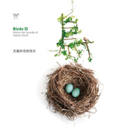
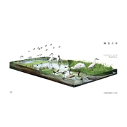
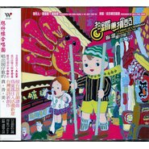
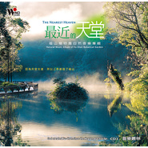
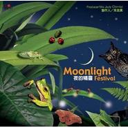

吴金黛
============================

|  |  |
| :--: | :-- |
| [<br>吴金黛](https://i.xiami.com/judywu) | **地区**: Taiwan, PRC 中国台湾<br>**风格**: 世界融合 World Fusion, 自然新世纪 Nature New Age, 轻音乐 Easy Listening<br>**播放数**: 30343051<br>**粉丝数**: 24781<br>**评论数**: 713<br> |

## 档案

<div>
姓名：吴金黛  .<br>
生日：  6/17<br>
星座：双子座<br>
学历：杨百翰大学音乐系<br>
现职：风潮唱片音乐制作人<br>
她，原本念的是  ”  观光  ”  ，后来跑去教英文，也传过教。<br>
她，是在美国念音乐的，在那儿曾做过翻译和同步传译员<br>
、录音室当过助教，也在餐厅洗过碗盘倒垃圾。<br>
她，回台湾就到了风潮，签下  "  狼  "  、  "  汇流  "  、  "  我们  "  等专辑<br>
的代理约，并提出  "  海角一乐园  "  音乐企划案，从此使马<br>
修和台湾与风潮结下不解的孽缘  …  ，也让马修．连恩开<br>
始在台湾声名大噪！<br>
她的兴趣<br>
．回家看爸妈家人<br>
．听好听的音乐<br>
．曾经喜欢摄影和素描但很久没玩了<br>
．投入青山绿水的怀抱<br>
．和朋友去吃饭谈心<br>
．窝在家看  Discovery  和国家地理频道<br>
为何想成为音乐人<br>
因为没机会当贤妻良母小女人，只好来当音乐人<br>
～音乐理念向来都是音乐人创造好听乐曲的原动力～<br>
金黛说，因为太喜欢台湾了，要做一些让人可以透过音乐更加进入台湾生命力的音乐。还有，把老掉牙的没人要听的传统音乐做成大家还会觉得好听愿意听的音乐。     因为呢～出国念书后才发现台湾和中国有很多很棒的音乐传承，可是在国外都没人知，只知道印度音乐和克尔特音乐，当然还有主流的流行音乐。回国后才知道，连台湾人也不太知自己的音乐传承，大部份人都只听流行歌或国外的音乐，就给他觉得　　　　   #@&^%*^%$#$…  可惜ㄚ，所以就酱子开始作起音乐啰～<br>
金黛的作品或许你都听过，也或许你曾深深地感动过  .........<br>
协     同制作：笑弯了一根扁担、女窥、西藏大峡谷<br>
制     作：森林狂想曲、我的海洋、发现雨林、夜的精灵等<br>
合     辑制作：世间女子、游戏挪威<br>
编     曲：散见于女窥、西藏大峡谷、花舞、樱花雨、七星海、森林狂想曲、我的海洋、夜的精灵     等专辑
</div>

## 专辑

| 名称 | 语种 | 唱片公司 | 发行时间 | 专辑类别 | 专辑风格 |
| :--: | :-- | :-- | :-- | :-- | :-- |
| [<br>天空的眼睛](./albums/1283633388.md) | 其他 | 风潮音乐 | 2013年10月30日 | 录音室专辑 | 轻音乐 Easy Listening, 自然新世纪 Nature New Age |
| [<br>鸟2 天籁所在的地方BirdsⅡ](./albums/514798.md) | 其他 | 风潮音乐 | 2012年04月26日 | 合集, 杂锦 | 自然新世纪 Nature New Age, 轻音乐 Easy Listening |
| [<br>绿色方舟](./albums/414028.md) | 其他 | 风潮音乐 | 2010年09月29日 | 录音室专辑 | 轻音乐 Easy Listening |
| [<br>海洋嬉游记](./albums/339551.md) | 其他 | 风潮音乐 | 2005年07月27日 | 录音室专辑 | 自然新世纪 Nature New Age |
| [<br>鸟](./albums/338120.md) | 其他 | 风潮音乐 | 2004年09月30日 | 合集, 杂锦 | 轻音乐 Easy Listening |
| [<br>拍锣兼摃鼓](./albums/467636.md) | 闽南语 | 风潮音乐 | 2004年01月15日 | 录音室专辑 | 轻音乐 Easy Listening |
| [<br>最近的天堂: 音乐丛林](./albums/170574.md) | 其他 | 风潮音乐 | 2002年07月31日 | 录音室专辑 | 轻音乐 Easy Listening, 自然新世纪 Nature New Age |
| [<br>最近的天堂: 生态现场](./albums/339596.md) | 其他 | 风潮音乐 | 2002年07月31日 | 录音室专辑 | 自然新世纪 Nature New Age |
| [<br>恋恋温泉](./albums/339588.md) | 国语 | 风潮音乐 | 2001年10月30日 | 合集, 杂锦 | 轻音乐 Easy Listening |
| [<br>青蛙四季唱游](./albums/314290.md) | 国语 | 风潮音乐 | 2001年07月31日 | 合集, 杂锦 | 轻音乐 Easy Listening |
| [<br>夜的精灵第一张夜晚大自然音乐专辑](./albums/314959.md) | 其他 | 风潮音乐 | 2001年07月13日 | 合集, 杂锦 | 自然新世纪 Nature New Age, 轻音乐 Easy Listening |
| [<br>飞鱼乐园](./albums/320841.md) | 国语 | 风潮音乐 | 2001年04月24日 | 合集, 杂锦 | 自然新世纪 Nature New Age, 轻音乐 Easy Listening |
| [<br>森林狂想曲](./albums/315088.md) | 其他 | 风潮音乐 | 1999年09月27日 | 合集, 杂锦 | 自然新世纪 Nature New Age, 轻音乐 Easy Listening |
| [<br>我的海洋My Ocean / 当代音乐馆-听见大自然系列](./albums/32577.md) | 国语 | 风潮音乐 | 1995年08月15日 | 合集, 杂锦 | 自然新世纪 Nature New Age, 轻音乐 Easy Listening |

## 评论

|  |  |  |
| :-- | :-- | :-- |
| <br>[虾米用户](https://emumo.xiami.com/u/218378303)<br>静<br>2021-01-14 14:14<br>赞(0) 踩(0) | <div>又是一个学过观光的牛叉音乐人</div> |
| <br>[虾米用户](https://emumo.xiami.com/u/276915600)<br>蓝莲永远盛开<br>2021-01-06 15:27<br>赞(0) 踩(0) | <div>以后可以在哪个播放器继续听你到的音乐？</div> |
| <br>[虾米用户](https://emumo.xiami.com/u/356550110)<br><br>2020-10-23 20:51<br>赞(0) 踩(0) | <div>非常和谐</div> |
| <br>[虾米用户](https://emumo.xiami.com/u/356550110)<br><br>2020-10-23 20:51<br>赞(0) 踩(0) | <div>非常和谐</div> |
| <br>[虾米用户](https://emumo.xiami.com/u/133298864)<br>黑择明<br>2020-08-06 23:21<br>赞(1) 踩(0) | <div>不出意料地又是台湾<br>又是我爱的台湾</div> |
| <br>[虾米用户](https://emumo.xiami.com/u/408576882)<br><br>2020-05-31 20:27<br>赞(0) 踩(0) | <div>我最喜欢大自然的味道</div> |
| <br>[虾米用户](https://emumo.xiami.com/u/72459354)<br><br>2020-05-11 18:40<br>赞(1) 踩(0) | <div>真好听</div> |
| <br>[虾米用户](https://emumo.xiami.com/u/48686027)<br><br>2020-05-04 21:15<br>赞(0) 踩(0) | <div>终于找到你</div> |
| <br>[虾米用户](https://emumo.xiami.com/u/409892152)<br>我不是摩歇座/<br>2020-04-26 22:39<br>赞(2) 踩(0) | <div>台湾美女，台湾很美呢，可惜现在去都好难</div> |
| <br>[虾米用户](https://emumo.xiami.com/u/297701295)<br><br>2020-04-20 20:07<br>赞(0) 踩(0) | <div>     </div> |
| <br>[虾米用户](https://emumo.xiami.com/u/358372285)<br>情愿一个人<br>2020-04-03 12:30<br>赞(0) 踩(0) | <div>长得好像台湾的桑妮</div> |
| <br>[虾米用户](https://emumo.xiami.com/u/298921526)<br>再见，虾米。<br>2020-03-26 22:22<br>赞(0) 踩(0) | <div>喜欢 </div> |
| <br>[虾米用户](https://emumo.xiami.com/u/47607861)<br>虾拌饭<br>2020-02-27 19:56<br>赞(0) 踩(0) | <div></div> |
| <br>[虾米用户](https://emumo.xiami.com/u/434152246)<br>聪明少一些大智慧多一些，...<br>2020-02-24 07:20<br>赞(1) 踩(0) | <div></div> |
| <br>[虾米用户](https://emumo.xiami.com/u/434152246)<br>聪明少一些大智慧多一些，...<br>2020-02-22 15:53<br>赞(1) 踩(0) | <div></div> |
| <br>[虾米用户](https://emumo.xiami.com/u/413019011)<br><br>2020-01-20 23:33<br>赞(0) 踩(0) | <div>谢谢你的大蓝</div> |
| <br>[虾米用户](https://emumo.xiami.com/u/284570537)<br>饼干<br>2019-12-28 22:18<br>赞(0) 踩(0) | <div>很赞 </div> |
| <br>[虾米用户](https://emumo.xiami.com/u/9615896)<br><br>2019-11-24 17:41<br>赞(1) 踩(0) | <div>特别喜欢</div> |
| <br>[虾米用户](https://emumo.xiami.com/u/344018512)<br>我还没想好要写什么...<br>2019-10-26 02:12<br>赞(0) 踩(0) | <div>D</div> |
| <br>[虾米用户](https://emumo.xiami.com/u/193235171)<br>饭能养身  歌能养心<br>2019-10-09 23:04<br>赞(0) 踩(0) | <div>大师</div> |
| <br>[虾米用户](https://emumo.xiami.com/u/6107918)<br>你是人间四月天，我等候你<br>2019-08-28 07:30<br>赞(0) 踩(0) | <div>xbh，早安</div> |
| <br>[虾米用户](https://emumo.xiami.com/u/38683889)<br><br>2019-07-26 23:51<br>赞(0) 踩(0) | <div>曾经昆大客运快速列车的神曲</div> |
| <br>[虾米用户](https://emumo.xiami.com/u/47986122)<br>不畏将来，不念过去。<br>2019-05-26 07:29<br>赞(0) 踩(0) | <div>我姐姐也是6月17号的生日~</div> |
| <br>[虾米用户](https://emumo.xiami.com/u/411454504)<br><br>2019-05-20 23:17<br>赞(0) 踩(0) | <div>旋律很好听，百听不厌！让我回想到小时候。</div> |
| <br>[虾米用户](https://emumo.xiami.com/u/325374787)<br><br>2019-05-20 09:35<br>赞(0) 踩(0) | <div>好</div> |
| <br>[虾米用户](https://emumo.xiami.com/u/272378656)<br>人生无常 当心淡如水乎<br>2019-05-15 17:50<br>赞(4) 踩(0) | <div>是这样的一个才女 把民乐揉散 加入灵动和大气两种相差较远的气质 混合了大自然元素  形成一种全新音乐 仿佛又看见新莲姐和宜中姐辉煌的民歌年代回来了</div> |
| <br>[虾米用户](https://emumo.xiami.com/u/274735601)<br><br>2019-05-01 17:56<br>赞(3) 踩(0) | <div>在少年得到给家里小孩订了人人都该懂的乐理知识和492种声音。陪小孩子一起听才知道原来音乐也这么有意思。重新对音乐有了不一样的了解，感谢吴老师，感谢吴老师在少年得到开课。</div> |
| <br>[虾米用户](https://emumo.xiami.com/u/404975043)<br>我还没想好要写什么...<br>2019-04-22 19:13<br>赞(4) 踩(0) | <div>给同姓 同性别 同一天生日的音乐人点赞</div> |
| <br>[虾米用户](https://emumo.xiami.com/u/284985044)<br>你还在 我还来<br>2019-04-21 09:21<br>赞(2) 踩(0) | <div>人与自然的和谐共生 </div> |
| <br>[虾米用户](https://emumo.xiami.com/u/272523695)<br>嗯嗯，要爱生活哦 爱父母...<br>2019-04-10 20:10<br>赞(1) 踩(0) | <div>缓解紧张，焦虑不安的好声音，好旋律，赞 </div> |
| <br>[虾米用户](https://emumo.xiami.com/u/331911677)<br><br>2019-04-06 12:22<br>赞(0) 踩(0) | <div>当年高中音乐老师放给我们听，真好听</div> |
| <br>[虾米用户](https://emumo.xiami.com/u/422785065)<br><br>2019-04-03 23:38<br>赞(1) 踩(0) | <div>偶然的机会听到了这首森林狂想曲，不过当时网络不发达，求之不得，过了好久再听到真的有种恍如隔世的感觉。依旧很喜欢那种自然的澄澈，期待有更多好的作品。</div> |
| <br>[虾米用户](https://emumo.xiami.com/u/344583330)<br>我还没想好要写什么...<br>2019-04-02 09:38<br>赞(1) 踩(0) | <div>我觉得吴金黛老师在少年得到的课程，给我的感觉就像一个VR说明书，而这个VR不是用眼睛看，是用耳朵听，仿佛可以真的看到音乐里描述的景色，非常不可思议，你仿佛比别人多了一双眼睛或者一种感官</div> |
| <br>[虾米用户](https://emumo.xiami.com/u/235833281)<br><br>2019-04-01 08:19<br>赞(1) 踩(0) | <div>专门下虾米来听，还好有版权！准备继续买cd支持！</div> |
| <br>[虾米用户](https://emumo.xiami.com/u/235833281)<br><br>2019-04-01 08:13<br>赞(0) 踩(0) | <div>我小时候最爱。后来买了两张cd 现在又发现了新大陆！！！</div> |
| <br>[虾米用户](https://emumo.xiami.com/u/330900828)<br>高舉一面五星紅旗在蝦米！<br>2019-03-09 23:03<br>赞(0) 踩(0) | <div>感谢你的执着付出  没有任何回报的付出 </div> |
| <br>[虾米用户](https://emumo.xiami.com/u/339595992)<br>我还没想好要写什么...<br>2019-02-03 14:57<br>赞(0) 踩(0) | <div>姐妹儿太帅了</div> |
| <br>[虾米用户](https://emumo.xiami.com/u/2073576)<br><br>2019-01-23 10:56<br>赞(0) 踩(0) | <div>好听</div> |
| <br>[虾米用户](https://emumo.xiami.com/u/276944698)<br>不要自我设限.....<br>2019-01-21 13:12<br>赞(1) 踩(0) | <div></div> |
| <br>[虾米用户](https://emumo.xiami.com/u/228843687)<br>懒惰统治人间<br>2019-01-17 23:52<br>赞(0) 踩(0) | <div></div> |
| <br>[虾米用户](https://emumo.xiami.com/u/11981821)<br>爱生活、爱猫、爱音乐。 <br>2019-01-14 21:13<br>赞(2) 踩(0) | <div>这个简介写的好不专业呀！</div> |
| <br>[虾米用户](https://emumo.xiami.com/u/46467302)<br><br>2018-12-27 00:33<br>赞(0) 踩(0) | <div></div> |
| <br>[虾米用户](https://emumo.xiami.com/u/25624384)<br><br>2018-12-15 10:19<br>赞(0) 踩(0) | <div>从天猫精灵来的 </div> |
| <br>[虾米用户](https://emumo.xiami.com/u/248334739)<br><br>2018-12-02 08:49<br>赞(0) 踩(0) | <div>有谁在听吴老师的少年音乐课。内容好棒！</div> |
| <br>[虾米用户](https://emumo.xiami.com/u/260864144)<br>我还没想好要写什么...<br>2018-11-27 00:03<br>赞(0) 踩(0) | <div>那首天籁森林是我11年上初中的时候在酷狗听到的，无论用那个音乐app都会下载下来 </div> |
| <br>[虾米用户](https://emumo.xiami.com/u/260864144)<br>我还没想好要写什么...<br>2018-11-27 00:02<br>赞(0) 踩(0) | <div>    </div> |
| <br>[虾米用户](https://emumo.xiami.com/u/37921316)<br>JIUDAO775990<br>2018-11-18 23:20<br>赞(0) 踩(0) | <div>打心底钦佩和尊敬吴老师这样的音乐人！同时也很感激您给我们带来这么好的声音！</div> |
| <br>[虾米用户](https://emumo.xiami.com/u/301197799)<br> <br>2018-11-14 07:31<br>赞(0) 踩(0) | <div>吴老师，非常喜欢您的音乐，可以说是非常着迷，感谢您带来了大自然呼吸的声音，让我们在水泥丛林里的囚徒闲暇之余可以静静地品味我们绿色的世界！</div> |
| <br>[虾米用户](https://emumo.xiami.com/u/301197799)<br> <br>2018-11-14 06:34<br>赞(0) 踩(0) | <div>我的海洋 森林狂想曲 夜的精灵 都是我的最爱 吴金黛老师是我最欣赏的音乐人，还有林海</div> |
| <br>[虾米用户](https://emumo.xiami.com/u/403824176)<br><br>2018-11-11 18:02<br>赞(1) 踩(0) | <div>喜欢森林狂想曲</div> |
| <br>[虾米用户](https://emumo.xiami.com/u/93994350)<br>微胖届<br>2018-10-06 15:04<br>赞(0) 踩(0) | <div>好！</div> |
| <br>[虾米用户](https://emumo.xiami.com/u/325587916)<br>我还没想好要写什么...<br>2018-10-03 14:44<br>赞(1) 踩(0) | <div>他无意发现了此位Dan Gibson大师的Cosplayer音乐人后写下了这句话便离开了 </div> |
| <br>[虾米用户](https://emumo.xiami.com/u/333375809)<br> <br>2018-09-28 19:31<br>赞(1) 踩(0) | <div>吴老师，你的这个《森林狂想曲》太好听了 </div> |
| <br>[虾米用户](https://emumo.xiami.com/u/404806528)<br><br>2018-09-24 14:07<br>赞(0) 踩(0) | <div>专门下了虾米听吴老师唱</div> |
| <br>[虾米用户](https://emumo.xiami.com/u/247437577)<br>直树湘琴<br>2018-09-17 23:22<br>赞(0) 踩(0) | <div>喜欢，我的海洋开始注意到您～请继续精彩！</div> |
| <br>[虾米用户](https://emumo.xiami.com/u/276944698)<br>不要自我设限.....<br>2018-09-11 19:35<br>赞(1) 踩(0) | <div></div> |
| <br>[虾米用户](https://emumo.xiami.com/u/22823585)<br><br>2018-08-23 12:26<br>赞(0) 踩(0) | <div>从少年得到滚进来的，原来这是吴老师的作品呀，真是好音乐</div> |
| <br>[虾米用户](https://emumo.xiami.com/u/365250362)<br><br>2018-08-18 00:22<br>赞(1) 踩(0) | <div>您真的太棒了！敬佩！喜欢您的音乐！</div> |
| <br>[虾米用户](https://emumo.xiami.com/u/336846436)<br><br>2018-07-07 23:57<br>赞(1) 踩(0) | <div>好漂亮的背景，好完美的音乐，百听不厌，祝你工作愉快，快乐，安康！</div> |
| <br>[虾米用户](https://emumo.xiami.com/u/374723044)<br>一切皆是缘……<br>2018-07-02 12:18<br>赞(1) 踩(0) | <div>生命的存在，就是一面完善自己，一面让周围世界更光明、温暖充满希望美好。是朵花就奉献芬芳，一片叶，就入土为泥。不枉费经历这次的轮回 </div> |
| <br>[虾米用户](https://emumo.xiami.com/u/374723044)<br>一切皆是缘……<br>2018-07-02 12:10<br>赞(2) 踩(0) | <div>金黛老师向您致敬！生命因您而更多感动美好。深深的感受到您对生命、自然的珍爱与崇敬，对心灵安宁清洁的关怀与责任！寒暑更迭风尘朴朴，从不言弃，把生命的真、美，善发现，传递，完善&amp;hellip;无比感恩在这虚拟的音声世界里，遇到真诚勇敢善良才华非常的您，很幸运感谢！珍重！加油！</div> |
| <br>[虾米用户](https://emumo.xiami.com/u/345680276)<br><br>2018-06-26 17:16<br>赞(3) 踩(0) | <div>吴老师，拍摄自然之声怕也辛苦，心疼你，照顾好自己，我收藏了你的《清流》《我的海洋》《和平岛》等</div> |
| <br>[虾米用户](https://emumo.xiami.com/u/345680276)<br><br>2018-06-26 17:08<br>赞(1) 踩(0) | <div>真正的自然音乐家，向您致敬</div> |
| <br>[虾米用户](https://emumo.xiami.com/u/345680276)<br><br>2018-06-26 16:53<br>赞(1) 踩(0) | <div>本来有点困，听了《清流》我的太阳穴凉丝丝的，头脑清醒、思路清晰，困意早跑到瓜哇国去了。谢谢吴老师，您拍摄自然之声的工作恐怕也辛苦，照顾好自己不要累着</div> |
| <br>[虾米用户](https://emumo.xiami.com/u/98370056)<br><br>2018-06-18 14:56<br>赞(0) 踩(0) | <div>我的海洋伴我走过一段焦虑的日子。安抚我不安的情绪。真正的音乐也许没有语言，但胜似千言万语。</div> |
| ⇒ | <br>[虾米用户](https://emumo.xiami.com/u/345680276)<br><br>2018-06-26 17:06<br>赞(0) 踩(0) | <div>同感，听了心静，象看到了广阔无垠的大海，使人心胸开阔，郁闷一扫而光</div> |
| <br>[虾米用户](https://emumo.xiami.com/u/251931353)<br>我还没想好要写什么...<br>2018-06-11 00:10<br>赞(3) 踩(0) | <div>喜欢自然  </div> |
| <br>[虾米用户](https://emumo.xiami.com/u/285049473)<br>剛拿起酒杯想和你碰杯 才...<br>2018-06-07 22:05<br>赞(2) 踩(0) | <div>被感动</div> |
| <br>[虾米用户](https://emumo.xiami.com/u/285049473)<br>剛拿起酒杯想和你碰杯 才...<br>2018-06-07 22:05<br>赞(2) 踩(0) | <div>梦</div> |
| <br>[虾米用户](https://emumo.xiami.com/u/123889124)<br><br>2018-06-07 15:59<br>赞(2) 踩(0) | <div>好喜欢你的音乐，听着听着流了好多泪。</div> |
| <br>[虾米用户](https://emumo.xiami.com/u/271961694)<br>最爱霉霉小仙女<br>2018-06-07 07:34<br>赞(2) 踩(0) | <div>支持</div> |
| <br>[虾米用户](https://emumo.xiami.com/u/367680781)<br>咕咕咕...今天有没有瓜...<br>2018-06-02 09:27<br>赞(2) 踩(0) | <div>太酷了乌拉拉拉拉</div> |
| <br>[虾米用户](https://emumo.xiami.com/u/86274168)<br>醒来无处觅 来去都如风<br>2018-06-02 08:14<br>赞(1) 踩(0) | <div>(⌇ຶ&amp;ouml;⌇ຶ) 脸部劳动</div> |
| <br>[虾米用户](https://emumo.xiami.com/u/261668445)<br>男朋友要天天弹吉他唱歌给...<br>2018-06-01 21:35<br>赞(2) 踩(0) | <div>就要中考了。压力很大，听了你的音乐心情不自觉就舒缓了。谢谢❤️</div> |
| <br>[虾米用户](https://emumo.xiami.com/u/357050557)<br><br>2018-05-19 10:43<br>赞(1) 踩(0) | <div>非常温馨，有創意。</div> |
| <br>[虾米用户](https://emumo.xiami.com/u/337210752)<br>我还没想好要写什么..<br>2018-05-16 23:30<br>赞(1) 踩(0) | <div>整张专辑怎么买呢~</div> |
| ⇒ | <br>[虾米用户](https://emumo.xiami.com/u/354240719)<br>一只口罩侠<br>2018-07-15 10:14<br>赞(0) 踩(0) | <div>VlP</div> |
| <br>[虾米用户](https://emumo.xiami.com/u/367510129)<br>我还没想好要写什么...<br>2018-05-15 15:07<br>赞(2) 踩(0) | <div>很棒，生活就该活出自己想要的，支持 </div> |
| <br>[虾米用户](https://emumo.xiami.com/u/229191071)<br> <br>2018-05-14 22:08<br>赞(1) 踩(0) | <div>很熟悉的一首曲子，不久前才知道名字叫森林狂想曲，更没想到居然是中国人弄的。。。   吴老师很有才华！  </div> |
| ⇒ | <br>[虾米用户](https://emumo.xiami.com/u/214375147)<br>一定会有美丽安排<br>2018-05-21 13:14<br>赞(0) 踩(0) | <div>您也听一下《欢沁》吧！很推荐</div> |
| ⇒ | <br>[虾米用户](https://emumo.xiami.com/u/229191071)<br> <br>2018-05-29 22:41<br>赞(0) 踩(0) | <div><q><b>EXO–L徐梽程说：</b></q></div> |
| <br>[虾米用户](https://emumo.xiami.com/u/52415194)<br>♬♩♫♪♡<br>2018-05-10 00:16<br>赞(1) 踩(0) | <div>录音师可能是这个世界上最好的工作了吧</div> |
| <br>[虾米用户](https://emumo.xiami.com/u/347469209)<br><br>2018-04-30 15:04<br>赞(0) 踩(0) | <div>喜欢这首曲子</div> |
| <br>[虾米用户](https://emumo.xiami.com/u/359128756)<br><br>2018-04-28 20:53<br>赞(0) 踩(0) | <div>太棒了</div> |
| <br>[虾米用户](https://emumo.xiami.com/u/256005842)<br><br>2018-04-28 07:44<br>赞(1) 踩(0) | <div>读那么多书，就是要在其中找出一个做人做事的道理，如果到头来，还不能很勇敢地相信它的话，那做人还有什么意思？</div> |
| <br>[虾米用户](https://emumo.xiami.com/u/355074449)<br><br>2018-04-27 19:34<br>赞(0) 踩(0) | <div>我在&amp;ldquo;钢琴块2&amp;rdquo;里欣赏过这首作品非常好</div> |
| <br>[虾米用户](https://emumo.xiami.com/u/359128756)<br><br>2018-04-27 13:00<br>赞(1) 踩(0) | <div>❤</div> |
| <br>[虾米用户](https://emumo.xiami.com/u/352289695)<br><br>2018-04-19 20:35<br>赞(0) 踩(0) | <div>永远载入我的听觉！只是拿什么来谢谢这位纯洁的作者呢？   </div> |
| <br>[虾米用户](https://emumo.xiami.com/u/1923255)<br>  云雷， 屯 ，君子以...<br>2018-04-15 21:10<br>赞(0) 踩(0) | <div>&amp;copy;</div> |
| <br>[虾米用户](https://emumo.xiami.com/u/355334420)<br>我还没想好要写什么...<br>2018-04-11 22:49<br>赞(1) 踩(0) | <div>很感谢你的作品，我一直想听大自然声音，我的工作时间太长，听到你的作品我觉得有一个放松心情感觉，很平静感受， </div> |
| <br>[虾米用户](https://emumo.xiami.com/u/338567229)<br><br>2018-04-05 22:59<br>赞(1) 踩(0) | <div>大自然的清新</div> |
| <br>[虾米用户](https://emumo.xiami.com/u/39996153)<br>New Age, Roc...<br>2018-04-05 14:41<br>赞(1) 踩(0) | <div>好喜欢大自然的声音</div> |
| <br>[虾米用户](https://emumo.xiami.com/u/61219018)<br><br>2018-04-01 10:10<br>赞(1) 踩(0) | <div>可以上传无损的吗</div> |
| <br>[虾米用户](https://emumo.xiami.com/u/100884102)<br><br>2018-03-28 18:30<br>赞(1) 踩(0) | <div>跟我一样6/17</div> |
| <br>[虾米用户](https://emumo.xiami.com/u/3045102)<br>听听音乐，思考人生<br>2018-03-24 17:45<br>赞(1) 踩(0) | <div>十多年前了吧，第一次听《My ocean》以为是外国作曲家，没想到是中国人 </div> |
| <br>[虾米用户](https://emumo.xiami.com/u/332311211)<br>“一如既往，万事胜意”<br>2018-03-09 19:32<br>赞(2) 踩(0) | <div>真的是很用心的歌曲</div> |
| <br>[虾米用户](https://emumo.xiami.com/u/302763682)<br>脚踏实地谋发展 努力努力...<br>2018-02-25 21:11<br>赞(1) 踩(0) | <div>听了森林狂想曲，真的被惊艳到了，希望老师能一如既往这么优秀下去，带给更多人新的音乐作品，音乐感受，支持您！  </div> |
| <br>[虾米用户](https://emumo.xiami.com/u/343674223)<br><br>2018-02-13 00:08<br>赞(1) 踩(0) | <div>好</div> |
| <br>[虾米用户](https://emumo.xiami.com/u/343648216)<br>天下畅游<br>2018-02-12 21:39<br>赞(1) 踩(0) | <div>好，太好啦！</div> |
| <br>[虾米用户](https://emumo.xiami.com/u/18950074)<br><br>2018-01-19 12:11<br>赞(1) 踩(0) | <div>谢谢你的细腻</div> |
| <br>[虾米用户](https://emumo.xiami.com/u/307997219)<br>不要太依赖一个人，即便是...<br>2018-01-03 12:00<br>赞(2) 踩(0) | <div>看到评论，去看了吴老师那一期的《一席》，再回味她的音乐，很感动！！</div> |
| <br>[虾米用户](https://emumo.xiami.com/u/285412386)<br>好好学习<br>2018-01-02 16:33<br>赞(1) 踩(0) | <div>好听</div> |
| <br>[虾米用户](https://emumo.xiami.com/u/279287244)<br><br>2017-11-22 22:05<br>赞(2) 踩(0) | <div>你的曲子太美了我好像进入_个梦幻世界身心放松与大自然完全熔化在一起这就是我想要的生话</div> |
| <br>[虾米用户](https://emumo.xiami.com/u/34080571)<br>ZX<br>2017-11-03 19:30<br>赞(1) 踩(0) | <div>感觉 。是个好女人</div> |
| <br>[虾米用户](https://emumo.xiami.com/u/10850905)<br>音乐是为了更好的活着！<br>2017-10-30 10:18<br>赞(2) 踩(0) | <div>喜欢这种亲近大自然的自然之声！</div> |
| <br>[虾米用户](https://emumo.xiami.com/u/44437366)<br> <br>2017-10-27 23:51<br>赞(0) 踩(0) | <div>大概是高中开始听我的海洋 一直到现在研究生毕业 还保持着没事就用这首来静心的习惯 真的太喜欢了 喜欢的景色 喜欢的台湾 全都浮现在脑子里</div> |
| <br>[虾米用户](https://emumo.xiami.com/u/1499382)<br> <br>2017-10-24 23:39<br>赞(1) 踩(0) | <div>森林狂想曲很赞</div> |
| <br>[虾米用户](https://emumo.xiami.com/u/327157049)<br><br>2017-09-28 23:42<br>赞(0) 踩(0) | <div>谢谢吴金黛老师，我专门搜风潮音乐的，2000年左右在北京《三联书店》无意中欣赏到久违的天籁般至纯至净的民乐&amp;hellip;&amp;hellip;后来多次留意才知道是《花乐》系列&amp;hellip;&amp;hellip;因此，非常敬仰您们《风潮》音乐团队，祝您们团队创作出更多人类心灵的神品！！！</div> |
| <br>[虾米用户](https://emumo.xiami.com/u/4079898)<br>QQ 362318935<br>2017-09-26 18:39<br>赞(1) 踩(0) | <div>想亲近自然的时候，先会想到你。</div> |
| <br>[虾米用户](https://emumo.xiami.com/u/307346431)<br><br>2017-09-14 23:19<br>赞(4) 踩(0) | <div>我的海洋，特别好听  纯美感强</div> |
| <br>[虾米用户](https://emumo.xiami.com/u/12117863)<br>热爱音乐是一种动人的生活<br>2017-09-07 08:30<br>赞(1) 踩(0) | <div>真心不错。</div> |
| <br>[虾米用户](https://emumo.xiami.com/u/256211020)<br><br>2017-08-28 13:54<br>赞(2) 踩(0) | <div>还有人知道游学志吗？！</div> |
| ⇒ | <br>[虾米用户](https://emumo.xiami.com/u/260569690)<br><br>2017-08-29 23:05<br>赞(0) 踩(0) | <div>陶笛奇遇记，风动草，经常听</div> |
| ⇒ | <br>[虾米用户](https://emumo.xiami.com/u/307346431)<br><br>2017-09-14 23:21<br>赞(0) 踩(0) | <div>风动草好听</div> |
| <br>[虾米用户](https://emumo.xiami.com/u/4232584)<br><br>2017-08-27 18:33<br>赞(0) 踩(0) | <div>喜欢自然的声音</div> |
| <br>[虾米用户](https://emumo.xiami.com/u/321075071)<br><br>2017-08-23 18:51<br>赞(1) 踩(0) | <div>好好好好听!!!</div> |
| <br>[虾米用户](https://emumo.xiami.com/u/37274231)<br>祝我长命百岁<br>2017-08-17 18:36<br>赞(1) 踩(0) | <div>思考时候听</div> |
| <br>[虾米用户](https://emumo.xiami.com/u/702590)<br><br>2017-08-13 18:03<br>赞(0) 踩(0) | <div>好喜欢那首【环中之道】</div> |
| <br>[虾米用户](https://emumo.xiami.com/u/308643332)<br><br>2017-08-11 12:16<br>赞(2) 踩(0) | <div>最爱森林狂想曲</div> |
| <br>[虾米用户](https://emumo.xiami.com/u/42263789)<br>。<br>2017-08-10 11:00<br>赞(1) 踩(0) | <div>风潮真是最有良心和B格的唱片公司了。。。。</div> |
| <br>[虾米用户](https://emumo.xiami.com/u/9258235)<br>城堡<br>2017-08-01 11:52<br>赞(1) 踩(0) | <div>大自然 清新  平复</div> |
| <br>[虾米用户](https://emumo.xiami.com/u/208139612)<br>A hero lies ...<br>2017-08-01 11:30<br>赞(1) 踩(0) | <div>和马修.连恩也合作过，太棒了！ [文字cool]</div> |
| <br>[虾米用户](https://emumo.xiami.com/u/45300895)<br><br>2017-07-23 17:50<br>赞(1) 踩(0) | <div>听上去很美！</div> |
| <br>[虾米用户](https://emumo.xiami.com/u/25180711)<br><br>2017-07-12 09:44<br>赞(0) 踩(0) | <div>好</div> |
| <br>[虾米用户](https://emumo.xiami.com/u/25180711)<br><br>2017-07-12 09:43<br>赞(0) 踩(0) | <div>自然之声</div> |
| <br>[虾米用户](https://emumo.xiami.com/u/7325471)<br><br>2017-07-06 17:24<br>赞(4) 踩(0) | <div>作为胎教音乐太棒了！<br>大宝时候就听，现在二宝还是听，每次宝宝都会规律的动起来</div> |
| <br>[虾米用户](https://emumo.xiami.com/u/92988654)<br><br>2017-06-28 14:43<br>赞(1) 踩(0) | <div>喜欢自然的音乐</div> |
| <br>[虾米用户](https://emumo.xiami.com/u/9003931)<br>千淘万漉虽辛苦<br>2017-06-15 14:03<br>赞(0) 踩(0) | <div>风潮。</div> |
| <br>[虾米用户](https://emumo.xiami.com/u/119925244)<br>独一无 二狗<br>2017-06-15 08:21<br>赞(1) 踩(0) | <div>我的耳朵听了都很开心呢</div> |
| <br>[虾米用户](https://emumo.xiami.com/u/178543110)<br>♬♪♪♪～<br>2017-06-14 20:42<br>赞(0) 踩(0) | <div>哇~哦~大爱你!因为你的音乐!喜欢喜欢喜欢喜欢（无限循环）&amp;hellip;&amp;hellip;</div> |
| <br>[虾米用户](https://emumo.xiami.com/u/49061033)<br>刘勇<br>2017-06-13 17:49<br>赞(0) 踩(0) | <div>清新自然安静！</div> |
| <br>[虾米用户](https://emumo.xiami.com/u/303806961)<br><br>2017-06-11 23:23<br>赞(0) 踩(0) | <div>自然之声</div> |
| <br>[虾米用户](https://emumo.xiami.com/u/7381227)<br>全是屁话<br>2017-06-08 21:35<br>赞(0) 踩(0) | <div>  </div> |
| <br>[虾米用户](https://emumo.xiami.com/u/17433945)<br>暂无签名~<br>2017-06-06 10:25<br>赞(0) 踩(0) | <div>  </div> |
| <br>[虾米用户](https://emumo.xiami.com/u/3547812)<br><br>2017-06-01 14:05<br>赞(0) 踩(0) | <div>喜欢</div> |
| <br>[虾米用户](https://emumo.xiami.com/u/157547850)<br> <br>2017-05-28 11:03<br>赞(0) 踩(0) | <div>感动</div> |
| <br>[虾米用户](https://emumo.xiami.com/u/9584552)<br><br>2017-05-22 22:50<br>赞(0) 踩(0) | <div>每晚睡前都会听</div> |
| <br>[虾米用户](https://emumo.xiami.com/u/254229600)<br>爱音乐的男孩！<br>2017-05-21 13:24<br>赞(0) 踩(0) | <div>音乐好听、清新自然。</div> |
| <br>[虾米用户](https://emumo.xiami.com/u/516791)<br>假酒喝多了<br>2017-05-16 21:07<br>赞(0) 踩(0) | <div></div> |
| <br>[虾米用户](https://emumo.xiami.com/u/65140346)<br><br>2017-05-09 22:58<br>赞(0) 踩(0) | <div>自然音乐</div> |
| <br>[虾米用户](https://emumo.xiami.com/u/280162858)<br>(๑• . •๑)<br>2017-05-07 09:42<br>赞(0) 踩(0) | <div>生日居然和我一样</div> |
| <br>[虾米用户](https://emumo.xiami.com/u/290765317)<br>只是溪流浅似愁<br>2017-05-03 03:35<br>赞(0) 踩(0) | <div>空灵了耳朵</div> |
| <br>[虾米用户](https://emumo.xiami.com/u/291775806)<br>有画画好看的（日系风），...<br>2017-04-30 21:20<br>赞(0) 踩(0) | <div>&amp;ldquo;森林狂想曲&amp;rdquo;好听。 </div> |
| <br>[虾米用户](https://emumo.xiami.com/u/287319916)<br><br>2017-04-09 06:56<br>赞(1) 踩(0) | <div>太棒了!!!</div> |
| <br>[虾米用户](https://emumo.xiami.com/u/247827719)<br>mr.zimu<br>2017-04-08 02:59<br>赞(0) 踩(0) | <div>听到心和自然的交融</div> |
| <br>[虾米用户](https://emumo.xiami.com/u/203913550)<br><br>2017-04-06 23:06<br>赞(0) 踩(0) | <div>谢谢你的回复。我很喜欢你的东西</div> |
| <br>[虾米用户](https://emumo.xiami.com/u/273198931)<br> ɢᴏᴏᴅ ᴍᴏʀɴɪɴ...<br>2017-04-06 22:17<br>赞(2) 踩(0) | <div>大自然的搬运工，实在佩服</div> |
| <br>[虾米用户](https://emumo.xiami.com/u/2021767)<br><br>2017-04-06 12:24<br>赞(1) 踩(0) | <div>新世纪</div> |
| <br>[虾米用户](https://emumo.xiami.com/u/203913550)<br><br>2017-04-05 23:59<br>赞(0) 踩(0) | <div>好听的乐曲，当然，值得收藏</div> |
| <br>[虾米用户](https://emumo.xiami.com/u/47151332)<br> <br>2017-04-03 23:33<br>赞(0) 踩(0) | <div></div> |
| <br>[虾米用户](https://emumo.xiami.com/u/283055156)<br><br>2017-04-03 00:45<br>赞(0) 踩(0) | <div>很好听啊！</div> |
| <br>[虾米用户](https://emumo.xiami.com/u/241180134)<br><br>2017-04-02 19:12<br>赞(0) 踩(0) | <div></div> |
| <br>[虾米用户](https://emumo.xiami.com/u/283977376)<br>乖乖之神小峄峄<br>2017-03-30 20:07<br>赞(0) 踩(0) | <div>真美</div> |
| <br>[虾米用户](https://emumo.xiami.com/u/275285772)<br><br>2017-03-28 17:35<br>赞(0) 踩(0) | <div>     </div> |
| <br>[虾米用户](https://emumo.xiami.com/u/281826843)<br><br>2017-03-21 22:16<br>赞(1) 踩(0) | <div>太棒了</div> |
| <br>[虾米用户](https://emumo.xiami.com/u/227362613)<br>各自安好 <br>2017-03-18 15:23<br>赞(2) 踩(0) | <div>看了你的简介，其中有说到台湾和中国&amp;hellip;&amp;hellip;台湾不是中国的麽，台湾人难道就不是中国人？？？？</div> |
| <br>[虾米用户](https://emumo.xiami.com/u/262572818)<br><br>2017-03-16 19:46<br>赞(0) 踩(0) | <div>不错</div> |
| <br>[虾米用户](https://emumo.xiami.com/u/232844522)<br> <br>2017-03-08 17:37<br>赞(1) 踩(0) | <div>没关系臺灣人嘛支持</div> |
| <br>[虾米用户](https://emumo.xiami.com/u/40509917)<br><br>2017-03-08 17:03<br>赞(0) 踩(0) | <div>喜欢大自然的声音，同一天生日，惊喜</div> |
| <br>[虾米用户](https://emumo.xiami.com/u/6557009)<br><br>2017-03-07 13:16<br>赞(0) 踩(0) | <div>你一定是个心灵很安静的人</div> |
| <br>[虾米用户](https://emumo.xiami.com/u/239771131)<br>用心做事，良心做人<br>2017-02-14 03:42<br>赞(0) 踩(0) | <div></div> |
| <br>[虾米用户](https://emumo.xiami.com/u/48328609)<br><br>2017-02-12 17:35<br>赞(0) 踩(0) | <div>like</div> |
| <br>[虾米用户](https://emumo.xiami.com/u/267405580)<br><br>2017-02-10 20:11<br>赞(0) 踩(0) | <div>第一次看到视频介绍，喜爱至极</div> |
| <br>[虾米用户](https://emumo.xiami.com/u/270664832)<br><br>2017-02-04 16:41<br>赞(0) 踩(0) | <div>good 自然之声 很清新</div> |
| <br>[虾米用户](https://emumo.xiami.com/u/13616555)<br>走吧<br>2017-02-03 23:22<br>赞(0) 踩(0) | <div>这个女人很有意思 </div> |
| <br>[虾米用户](https://emumo.xiami.com/u/40513453)<br><br>2017-01-13 19:12<br>赞(4) 踩(0) | <div>又发现一位我们自己的新世纪音乐大师。向你致敬。</div> |
| <br>[虾米用户](https://emumo.xiami.com/u/257156933)<br>veniaminkrem<br>2017-01-01 18:54<br>赞(0) 踩(0) | <div>rl0</div> |
| <br>[虾米用户](https://emumo.xiami.com/u/257156933)<br>veniaminkrem<br>2017-01-01 18:54<br>赞(1) 踩(0) | <div>rl0</div> |
| <br>[虾米用户](https://emumo.xiami.com/u/12194481)<br>敲击的不是音符,是心率;...<br>2016-12-26 15:16<br>赞(3) 踩(0) | <div>感觉自己是一位古代大少，左手提一个鸟笼，右手晃着一把折扇，身后跟着一名小厮，走在大街上，正笑嘻嘻的盯着人家小娘子，小娘子被瞧的满脸红晕，都不敢从我身边走过</div> |
| <br>[虾米用户](https://emumo.xiami.com/u/254093240)<br><br>2016-12-14 13:43<br>赞(35) 踩(0) | <div>喜欢这种自然的淳朴之声 </div> |
| <br>[虾米用户](https://emumo.xiami.com/u/17433945)<br>暂无签名~<br>2016-12-11 23:04<br>赞(4) 踩(0) | <div>都是精品！太好听！</div> |
| <br>[虾米用户](https://emumo.xiami.com/u/244434071)<br><br>2016-11-10 19:19<br>赞(19) 踩(0) | <div>在学校第一次听，在回家听，越来越喜欢听了 </div> |
| <br>[虾米用户](https://emumo.xiami.com/u/3257444)<br>脑内小剧场<br>2016-11-10 11:00<br>赞(2) 踩(0) | <div>大自然采集</div> |
| <br>[虾米用户](https://emumo.xiami.com/u/30504424)<br><br>2016-11-01 19:37<br>赞(1) 踩(0) | <div>有几首曲子非常喜欢，悠扬悦耳，远离喧嚣，返璞归真。</div> |
| <br>[虾米用户](https://emumo.xiami.com/u/1118324)<br><br>2016-10-30 12:16<br>赞(0) 踩(0) | <div>good</div> |
| <br>[虾米用户](https://emumo.xiami.com/u/52651223)<br><br>2016-10-16 02:03<br>赞(2) 踩(0) | <div>为了一个人下载一个音乐软件</div> |
| <br>[虾米用户](https://emumo.xiami.com/u/39871183)<br><br>2016-10-04 15:03<br>赞(1) 踩(0) | <div>喜歡純音樂</div> |
| <br>[虾米用户](https://emumo.xiami.com/u/91200774)<br>hiahia<br>2016-09-26 19:07<br>赞(1) 踩(0) | <div>内心有森林的女人</div> |
| <br>[虾米用户](https://emumo.xiami.com/u/229319597)<br><br>2016-09-24 13:44<br>赞(0) 踩(0) | <div>喜次听   </div> |
| <br>[虾米用户](https://emumo.xiami.com/u/5786230)<br><br>2016-09-07 18:03<br>赞(0) 踩(0) | <div>纯音乐,吴金黛,</div> |
| <br>[虾米用户](https://emumo.xiami.com/u/44039499)<br>有耳听，就应当听。<br>2016-09-03 22:10<br>赞(2) 踩(0) | <div>今天清晨看了《一席》认识你，从此爱上你。为了听见你的音乐，才下载了虾米音乐</div> |
| ⇒ | <br>[虾米用户](https://emumo.xiami.com/u/1008344)<br>静下心来，才听得见美好。<br>2017-02-20 10:29<br>赞(0) 踩(0) | <div>一席是电影吗</div> |
| <br>[虾米用户](https://emumo.xiami.com/u/99602550)<br>暂无签名~<br>2016-08-30 21:59<br>赞(2) 踩(0) | <div>森林狂想曲，大爱   </div> |
| <br>[虾米用户](https://emumo.xiami.com/u/95435266)<br><br>2016-08-04 00:13<br>赞(2) 踩(0) | <div>一直以为森林狂想曲是班得瑞的……汗……</div> |
| <br>[虾米用户](https://emumo.xiami.com/u/87866394)<br> <br>2016-07-24 14:41<br>赞(1) 踩(0) | <div>很喜欢这里的纯音乐</div> |
| <br>[虾米用户](https://emumo.xiami.com/u/172517282)<br><br>2016-07-24 13:28<br>赞(0) 踩(0) | <div>喜欢聆听，自然の声音</div> |
| <br>[虾米用户](https://emumo.xiami.com/u/11013201)<br><br>2016-07-20 10:56<br>赞(0) 踩(0) | <div>好听</div> |
| <br>[虾米用户](https://emumo.xiami.com/u/3727873)<br>better me<br>2016-07-14 14:08<br>赞(1) 踩(0) | <div>我是看的TED演讲，很感动</div> |
| <br>[虾米用户](https://emumo.xiami.com/u/5854459)<br>潮牌https://dw...<br>2016-07-13 18:12<br>赞(3) 踩(0) | <div>总觉得这样的人应该是很幸福的人。。。</div> |
| <br>[虾米用户](https://emumo.xiami.com/u/79069598)<br><br>2016-07-12 15:17<br>赞(0) 踩(0) | <div>nice</div> |
| <br>[虾米用户](https://emumo.xiami.com/u/199506347)<br><br>2016-07-10 18:11<br>赞(1) 踩(0) | <div>回归自然，好想成为音乐中的一缕软风、一波海浪、一声啼鸣。</div> |
| <br>[虾米用户](https://emumo.xiami.com/u/1463850)<br>纵错失众多美好但依然向前<br>2016-07-08 23:07<br>赞(0) 踩(0) | <div>喜欢，可惜没有纯粹雨声的</div> |
| <br>[虾米用户](https://emumo.xiami.com/u/28728788)<br><br>2016-07-03 19:30<br>赞(0) 踩(0) | <div>好巧呀 同一天生日  </div> |
| <br>[虾米用户](https://emumo.xiami.com/u/196035368)<br><br>2016-07-01 12:43<br>赞(0) 踩(0) | <div>         </div> |
| <br>[虾米用户](https://emumo.xiami.com/u/196035368)<br><br>2016-07-01 12:43<br>赞(0) 踩(0) | <div></div> |
| <br>[虾米用户](https://emumo.xiami.com/u/5871081)<br><br>2016-06-20 15:38<br>赞(1) 踩(0) | <div>名副其实的自然之声音乐人！amzing!</div> |
| <br>[虾米用户](https://emumo.xiami.com/u/77332198)<br><br>2016-06-14 00:24<br>赞(0) 踩(0) | <div></div> |
| <br>[虾米用户](https://emumo.xiami.com/u/57917552)<br>音乐的魅力！得用心体会！<br>2016-06-11 17:41<br>赞(0) 踩(0) | <div>吴金黛，你好！你现在从事什么工作？</div> |
| <br>[虾米用户](https://emumo.xiami.com/u/38181906)<br><br>2016-06-02 12:00<br>赞(0) 踩(0) | <div>森林狂想曲我手机里面就有，以前在别的平台下载的，还以为是外国人著作的，是真没想到！</div> |
| <br>[虾米用户](https://emumo.xiami.com/u/12221090)<br>逍遥于天地而心意自得<br>2016-05-21 01:03<br>赞(0) 踩(0) | <div></div> |
| <br>[虾米用户](https://emumo.xiami.com/u/55436081)<br><br>2016-05-11 21:18<br>赞(0) 踩(0) | <div>大师  敬佩敬佩</div> |
| <br>[虾米用户](https://emumo.xiami.com/u/166187922)<br><br>2016-05-10 15:29<br>赞(0) 踩(0) | <div>自然</div> |
| <br>[虾米用户](https://emumo.xiami.com/u/53008228)<br>尝试用旋律纪念我成长的一...<br>2016-05-03 13:37<br>赞(0) 踩(0) | <div>好厉害。。。</div> |
| <br>[虾米用户](https://emumo.xiami.com/u/5632897)<br><br>2016-05-03 00:08<br>赞(0) 踩(0) | <div>大師!</div> |
| <br>[虾米用户](https://emumo.xiami.com/u/162405)<br>暂无签名~<br>2016-04-30 15:32<br>赞(0) 踩(0) | <div>大自然的声音 真是太舒服了</div> |
| <br>[虾米用户](https://emumo.xiami.com/u/70546218)<br><br>2016-04-23 21:07<br>赞(0) 踩(0) | <div>想让心灵沉静</div> |
| <br>[虾米用户](https://emumo.xiami.com/u/121428994)<br><br>2016-04-22 08:34<br>赞(0) 踩(0) | <div>sss</div> |
| <br>[虾米用户](https://emumo.xiami.com/u/11875319)<br>girls*lucky~...<br>2016-04-20 16:59<br>赞(0) 踩(0) | <div>非常美，每当写东西没有思路，或是烦躁不宁，打开它听一听，内心能得到温柔的抚慰，仿佛一切都被洗净了(*˘︶˘*).｡.:*♡</div> |
| <br>[虾米用户](https://emumo.xiami.com/u/124627082)<br>6.8<br>2016-04-01 19:17<br>赞(0) 踩(0) | <div>去年一个偶然，听到了您的音乐《我的海洋》，开始接触中式自然纯音，现在已经离不开了，谢谢您！</div> |
| <br>[虾米用户](https://emumo.xiami.com/u/10651605)<br>听歌呗<br>2016-03-31 23:11<br>赞(0) 踩(0) | <div>扒出一神仙，，，，，，，，，，，，，，，，，，，，，，，，，，，，，，<br>，，，</div> |
| <br>[虾米用户](https://emumo.xiami.com/u/32290160)<br><br>2016-03-30 12:27<br>赞(1) 踩(0) | <div>吴金黛，你的森林狂想曲太好了。</div> |
| <br>[虾米用户](https://emumo.xiami.com/u/33589384)<br><br>2016-03-25 17:02<br>赞(0) 踩(0) | <div>很多自然声音 有需要的时候听听</div> |
| <br>[虾米用户](https://emumo.xiami.com/u/126478898)<br><br>2016-03-25 11:07<br>赞(0) 踩(0) | <div>贴近大自然  心境平和</div> |
| <br>[虾米用户](https://emumo.xiami.com/u/3133930)<br>暂无签名~<br>2016-03-24 14:27<br>赞(0) 踩(0) | <div>向Discovery致敬，哈哈</div> |
| <br>[虾米用户](https://emumo.xiami.com/u/19594981)<br><br>2016-03-24 11:59<br>赞(0) 踩(0) | <div>单纯</div> |
| <br>[虾米用户](https://emumo.xiami.com/u/3052803)<br>不思八九<br>2016-03-24 09:22<br>赞(0) 踩(0) | <div>自然之声，纯音乐</div> |
| <br>[虾米用户](https://emumo.xiami.com/u/121070728)<br>撕裂与杂交，一体两面<br>2016-03-22 16:35<br>赞(0) 踩(0) | <div>先听为快</div> |
| <br>[虾米用户](https://emumo.xiami.com/u/18192557)<br>sourire : )<br>2016-03-21 15:24<br>赞(0) 踩(0) | <div>非常舒服的bgm</div> |
| <br>[虾米用户](https://emumo.xiami.com/u/3989578)<br>音乐无国界<br>2016-03-20 10:27<br>赞(2) 踩(0) | <div>已经远远超越了音乐的意义。感谢自然。</div> |
| <br>[虾米用户](https://emumo.xiami.com/u/117316526)<br>忆梦语<br>2016-03-18 09:59<br>赞(0) 踩(0) | <div>喜欢自然的感觉</div> |
| <br>[虾米用户](https://emumo.xiami.com/u/13016928)<br><br>2016-03-09 19:44<br>赞(0) 踩(0) | <div>环中之道</div> |
| <br>[虾米用户](https://emumo.xiami.com/u/26122124)<br><br>2016-03-09 13:58<br>赞(0) 踩(0) | <div>自然音乐</div> |
| <br>[虾米用户](https://emumo.xiami.com/u/37223713)<br>世界要你去考取功名 但真...<br>2016-03-05 15:20<br>赞(0) 踩(0) | <div>论文伴侣</div> |
| <br>[虾米用户](https://emumo.xiami.com/u/5946364)<br><br>2016-03-04 10:54<br>赞(0) 踩(0) | <div>一股清流，很棒的自然之声。</div> |
| <br>[虾米用户](https://emumo.xiami.com/u/20846862)<br> <br>2016-03-03 21:40<br>赞(0) 踩(0) | <div>吴金黛像你致敬、我们需要这样的声音</div> |
| <br>[虾米用户](https://emumo.xiami.com/u/34271220)<br>我还没想好要写什么...<br>2016-03-02 23:20<br>赞(2) 踩(0) | <div>太喜欢这样自然的声音 纯净无污染的感觉 从封面点击进来发现满满的惊喜 这位姐姐太厉害啦</div> |
| <br>[虾米用户](https://emumo.xiami.com/u/10733885)<br>我爱猪猪~<br>2016-03-02 14:16<br>赞(0) 踩(0) | <div>不一样</div> |
| <br>[虾米用户](https://emumo.xiami.com/u/4306566)<br>旋律住进我心里<br>2016-03-02 11:15<br>赞(0) 踩(0) | <div>大自然的声音</div> |
| <br>[虾米用户](https://emumo.xiami.com/u/1154162)<br>蝉在叫<br>2016-03-01 21:43<br>赞(1) 踩(0) | <div>吴金黛，我喜欢你</div> |
| <br>[虾米用户](https://emumo.xiami.com/u/3297372)<br><br>2016-02-29 16:48<br>赞(0) 踩(0) | <div>自然清新</div> |
| <br>[虾米用户](https://emumo.xiami.com/u/2967881)<br><br>2016-02-28 22:06<br>赞(0) 踩(0) | <div>好听</div> |
| <br>[虾米用户](https://emumo.xiami.com/u/2967881)<br><br>2016-02-28 22:06<br>赞(0) 踩(0) | <div>好听</div> |
| <br>[虾米用户](https://emumo.xiami.com/u/11043972)<br>为虾米为虾米为虾米<br>2016-02-28 12:03<br>赞(0) 踩(0) | <div>很棒 加油</div> |
| <br>[虾米用户](https://emumo.xiami.com/u/5025444)<br>泉水姐姐的迷弟<br>2016-02-27 19:17<br>赞(0) 踩(0) | <div>好听！！</div> |
| <br>[虾米用户](https://emumo.xiami.com/u/45152353)<br><br>2016-02-27 16:12<br>赞(0) 踩(0) | <div>自然之声</div> |
| <br>[虾米用户](https://emumo.xiami.com/u/2152213)<br><br>2016-02-26 01:55<br>赞(1) 踩(0) | <div>这也算是小清新的鼻祖了吧~</div> |
| <br>[虾米用户](https://emumo.xiami.com/u/83010192)<br>我还没想好要写什么...<br>2016-02-25 15:21<br>赞(0) 踩(0) | <div>美</div> |
| <br>[虾米用户](https://emumo.xiami.com/u/117348342)<br> <br>2016-02-25 12:27<br>赞(0) 踩(0) | <div>大自然的声音~</div> |
| <br>[虾米用户](https://emumo.xiami.com/u/4079898)<br>QQ 362318935<br>2016-02-25 10:23<br>赞(0) 踩(0) | <div>回归自然，回归了本性。向大师致敬！</div> |
| <br>[虾米用户](https://emumo.xiami.com/u/7113539)<br><br>2016-02-24 23:06<br>赞(0) 踩(0) | <div>hao</div> |
| <br>[虾米用户](https://emumo.xiami.com/u/3123066)<br><br>2016-02-24 21:27<br>赞(0) 踩(0) | <div>准备考试的间隙随意点开，听到了自然的声音（我已经好多天没出门了），被感动到了。。。</div> |
| <br>[虾米用户](https://emumo.xiami.com/u/8635478)<br>换个地方思考<br>2016-02-24 18:13<br>赞(1) 踩(0) | <div>中国有这样的人，不容易</div> |
| ⇒ | <br>[虾米用户](https://emumo.xiami.com/u/11500093)<br><br>2016-02-25 21:04<br>赞(0) 踩(0) | <div>是台灣人.你如果說&amp;quot;中華有這樣的人&amp;quot;是可以的.</div> |
| ⇒ | <br>[虾米用户](https://emumo.xiami.com/u/8635478)<br>换个地方思考<br>2016-02-26 13:39<br>赞(0) 踩(0) | <div><q><b>浅笑べ安然说：</b></q></div> |
| <br>[虾米用户](https://emumo.xiami.com/u/685118)<br>精神有洁癖的自闭症患者<br>2016-02-24 15:48<br>赞(0) 踩(0) | <div>自然创造的音乐才是最美的！</div> |
| <br>[虾米用户](https://emumo.xiami.com/u/5546919)<br><br>2016-02-24 15:26<br>赞(0) 踩(0) | <div>吴金黛的自然情怀</div> |
| <br>[虾米用户](https://emumo.xiami.com/u/45385073)<br>爱虾米期待再相遇为新：t...<br>2016-02-24 12:48<br>赞(0) 踩(0) | <div>谢谢</div> |
| <br>[虾米用户](https://emumo.xiami.com/u/37819778)<br>邮差<br>2016-02-24 12:08<br>赞(0) 踩(0) | <div>大自然的记录者。</div> |
| <br>[虾米用户](https://emumo.xiami.com/u/54924121)<br>不再推荐歌 给身边的人<br>2016-02-24 11:57<br>赞(0) 踩(0) | <div>大自然的灵魂都在这里了</div> |
| <br>[虾米用户](https://emumo.xiami.com/u/11852218)<br> <br>2016-02-24 10:35<br>赞(0) 踩(0) | <div>1</div> |
| <br>[虾米用户](https://emumo.xiami.com/u/20147189)<br>嘘<br>2016-02-24 01:32<br>赞(0) 踩(0) | <div>膜拜一下 好棒 </div> |
| <br>[虾米用户](https://emumo.xiami.com/u/17806314)<br>以梦为马 以己为光<br>2016-02-24 00:49<br>赞(0) 踩(0) | <div>_(:з」∠)_</div> |
| <br>[虾米用户](https://emumo.xiami.com/u/2656756)<br><br>2016-02-24 00:04<br>赞(0) 踩(0) | <div>太！美！了！</div> |
| <br>[虾米用户](https://emumo.xiami.com/u/49541700)<br>不是我<br>2016-02-23 23:33<br>赞(0) 踩(0) | <div>很舒爽的音乐搭配</div> |
| <br>[虾米用户](https://emumo.xiami.com/u/817162)<br><br>2016-02-23 23:21<br>赞(0) 踩(0) | <div>班得瑞一般的自然之声</div> |
| <br>[虾米用户](https://emumo.xiami.com/u/3128140)<br><br>2016-02-23 22:46<br>赞(0) 踩(0) | <div>好棒，一听就爱上了。吴老师肯定是个很温柔的人吧。</div> |
| <br>[虾米用户](https://emumo.xiami.com/u/7664977)<br>p122416<br>2016-02-23 21:35<br>赞(0) 踩(0) | <div>听过无数次，如影视配乐等等，现在才知道您的名字，应该称呼台湾的Dan Gibson？哇，惭愧啊。</div> |
| <br>[虾米用户](https://emumo.xiami.com/u/5046315)<br>damn you<br>2016-02-23 17:05<br>赞(0) 踩(0) | <div>Lulimai这首简直赞</div> |
| <br>[虾米用户](https://emumo.xiami.com/u/3799672)<br><br>2016-02-23 16:59<br>赞(0) 踩(0) | <div>自然界的声音</div> |
| <br>[虾米用户](https://emumo.xiami.com/u/10425196)<br><br>2016-02-23 16:57<br>赞(0) 踩(0) | <div>大自然的声音</div> |
| <br>[虾米用户](https://emumo.xiami.com/u/870625)<br><br>2016-02-23 14:56<br>赞(0) 踩(0) | <div>很有创意的作品，音乐就应该源于自然。</div> |
| <br>[虾米用户](https://emumo.xiami.com/u/870625)<br><br>2016-02-23 14:56<br>赞(0) 踩(0) | <div>纯天然，纯天然，纯天然！</div> |
| <br>[虾米用户](https://emumo.xiami.com/u/47736446)<br>上传了最后一首<br>2016-02-23 14:49<br>赞(0) 踩(0) | <div>同月同日生</div> |
| <br>[虾米用户](https://emumo.xiami.com/u/9931551)<br>感谢相遇<br>2016-02-23 14:01<br>赞(0) 踩(0) | <div>我的天！！好喜欢她</div> |
| <br>[虾米用户](https://emumo.xiami.com/u/4752471)<br><br>2016-02-23 12:14<br>赞(0) 踩(0) | <div>长相好陈绮贞噢</div> |
| <br>[虾米用户](https://emumo.xiami.com/u/174245)<br><br>2016-02-23 10:20<br>赞(0) 踩(0) | <div>自然的声音，好听</div> |
| <br>[虾米用户](https://emumo.xiami.com/u/1279714)<br> <br>2016-02-23 10:17<br>赞(0) 踩(0) | <div>电影《最遥远的距离》真人版  </div> |
| <br>[虾米用户](https://emumo.xiami.com/u/52970432)<br><br>2016-02-15 10:28<br>赞(0) 踩(0) | <div>喜欢   感谢</div> |
| <br>[虾米用户](https://emumo.xiami.com/u/106680)<br><br>2016-02-11 01:02<br>赞(1) 踩(0) | <div>好用心的音乐人。<br>除了好听之外多了几分感动。<br>谢谢你带给我们这么美得音乐</div> |
| <br>[虾米用户](https://emumo.xiami.com/u/6491765)<br>我只是个门外汉。<br>2016-02-08 15:15<br>赞(0) 踩(0) | <div>吴阿姨我爱你呀ლ(′◉❥◉｀ლ)森林狂想曲很好听呀</div> |
| <br>[虾米用户](https://emumo.xiami.com/u/72089950)<br><br>2016-01-17 01:03<br>赞(0) 踩(0) | <div>海浪的声音很美</div> |
| <br>[虾米用户](https://emumo.xiami.com/u/32359200)<br><br>2016-01-10 23:05<br>赞(0) 踩(0) | <div>抓不住耳朵</div> |
| <br>[虾米用户](https://emumo.xiami.com/u/1323958)<br><br>2016-01-10 20:14<br>赞(0) 踩(0) | <div>译员再转型~我的理想呀！</div> |
| <br>[虾米用户](https://emumo.xiami.com/u/23804112)<br><br>2016-01-01 12:58<br>赞(0) 踩(0) | <div>舒服的音乐 自然最美啊</div> |
| <br>[虾米用户](https://emumo.xiami.com/u/42426022)<br>當一個男人步入中年，他就...<br>2015-12-24 18:53<br>赞(0) 踩(0) | <div>妈妈级的音乐家~~户外采样很辛苦吧 不过呼吸大自然的气息 我最享受了</div> |
| <br>[虾米用户](https://emumo.xiami.com/u/89262)<br>音乐于我这乏味的一生如同...<br>2015-12-24 02:46<br>赞(0) 踩(0) | <div>喜欢你的音乐</div> |
| <br>[虾米用户](https://emumo.xiami.com/u/6009399)<br>人无物欲乾坤静，坐有琴书...<br>2015-12-04 12:45<br>赞(0) 踩(0) | <div>累了就听听吧</div> |
| <br>[虾米用户](https://emumo.xiami.com/u/15392991)<br><br>2015-11-17 17:05<br>赞(0) 踩(0) | <div>好自然啊</div> |
| <br>[虾米用户](https://emumo.xiami.com/u/3715044)<br>洲洲<br>2015-11-14 15:48<br>赞(0) 踩(0) | <div>OK</div> |
| <br>[虾米用户](https://emumo.xiami.com/u/50243679)<br><br>2015-10-28 07:12<br>赞(3) 踩(0) | <div>听她的音乐，可以假装自己在大自然</div> |
| <br>[虾米用户](https://emumo.xiami.com/u/36011556)<br><br>2015-10-08 16:11<br>赞(1) 踩(0) | <div>太厉害了！</div> |
| <br>[虾米用户](https://emumo.xiami.com/u/10297818)<br>梦幻泡影  如露如电<br>2015-10-08 10:50<br>赞(1) 踩(0) | <div>抚慰人心</div> |
| <br>[虾米用户](https://emumo.xiami.com/u/1790017)<br><br>2015-10-07 19:43<br>赞(0) 踩(0) | <div>EasyListening</div> |
| <br>[虾米用户](https://emumo.xiami.com/u/13006763)<br>-<br>2015-10-05 18:30<br>赞(0) 踩(0) | <div>听了这些鸟叫，有点明白了文化上的事，比如诗里写“两个黄鹂鸣翠柳”，不写两个水鸭/竹鸡鸣翠柳，还真有点道理。（不好意思阿竹鸡水鸭，只是打个比方）</div> |
| ⇒ | <br>[虾米用户](https://emumo.xiami.com/u/3282342)<br>暂无签名~砰砰砰砰<br>2015-11-25 11:31<br>赞(0) 踩(0) | <div>因为竹鸡水鸭上不了树啊摔~~</div> |
| ⇒ | <br>[虾米用户](https://emumo.xiami.com/u/13006763)<br>-<br>2015-11-26 12:08<br>赞(0) 踩(0) | <div><q><b>潘凤的大爷说：</b></q></div> |
| <br>[虾米用户](https://emumo.xiami.com/u/2269015)<br><br>2015-10-05 10:55<br>赞(1) 踩(0) | <div>将你带入自然</div> |
| <br>[虾米用户](https://emumo.xiami.com/u/2269015)<br><br>2015-10-05 10:54<br>赞(1) 踩(0) | <div>如同置身自然的怀抱  喜欢！</div> |
| <br>[虾米用户](https://emumo.xiami.com/u/44176559)<br> <br>2015-10-04 10:50<br>赞(1) 踩(0) | <div>我一生儿爱好是自然！</div> |
| <br>[虾米用户](https://emumo.xiami.com/u/3934416)<br><br>2015-10-01 10:04<br>赞(1) 踩(0) | <div>很好的音乐！</div> |
| <br>[虾米用户](https://emumo.xiami.com/u/4182351)<br>爱生活爱音乐<br>2015-09-30 17:51<br>赞(0) 踩(0) | <div>自然之声 清新</div> |
| <br>[虾米用户](https://emumo.xiami.com/u/27576271)<br>My Soul Can ...<br>2015-09-29 20:45<br>赞(1) 踩(0) | <div>森林狂想曲是高中英语考试前的音乐O(∩_∩)O</div> |
| <br>[虾米用户](https://emumo.xiami.com/u/11926168)<br>摇啊摇，摇到外婆桥外婆很...<br>2015-09-29 17:52<br>赞(0) 踩(0) | <div>哇噢  来的太晚  总算遇见 谢谢</div> |
| <br>[虾米用户](https://emumo.xiami.com/u/49064526)<br><br>2015-09-29 17:40<br>赞(1) 踩(0) | <div>高中时在电台里听到一首曲子 当时放下了笔 安静的沉浸在美好的乐曲中 多年后的今天才知道这首曲子是《我的海洋》，很高兴我们华人也能做出这么安静美妙的曲子</div> |
| <br>[虾米用户](https://emumo.xiami.com/u/30776295)<br> <br>2015-09-29 10:28<br>赞(0) 踩(0) | <div>我之前以为好多东西是国外的呢！没想到自己人！真心厉害！</div> |
| <br>[虾米用户](https://emumo.xiami.com/u/7364744)<br><br>2015-09-17 23:21<br>赞(0) 踩(0) | <div>推荐，夜晚独自坐在院中的躺椅上，闭上眼，细细的听着就睡了</div> |
| <br>[虾米用户](https://emumo.xiami.com/u/49562435)<br> <br>2015-09-13 10:39<br>赞(0) 踩(0) | <div>喜欢这种风格的音乐</div> |
| <br>[虾米用户](https://emumo.xiami.com/u/63192010)<br>我很爱交朋友，我不喜欢骂...<br>2015-09-12 08:43<br>赞(0) 踩(0) | <div>好听</div> |
| <br>[虾米用户](https://emumo.xiami.com/u/701251)<br><br>2015-09-08 22:54<br>赞(0) 踩(0) | <div>haigui folk</div> |
| <br>[虾米用户](https://emumo.xiami.com/u/26214195)<br>我的快乐都是微小的事情。<br>2015-09-06 20:15<br>赞(0) 踩(0) | <div>欢迎老师</div> |
| <br>[虾米用户](https://emumo.xiami.com/u/51359736)<br><br>2015-09-06 09:10<br>赞(0) 踩(0) | <div>空灵</div> |
| <br>[虾米用户](https://emumo.xiami.com/u/3422450)<br>最爱看你们絮叨<br>2015-08-16 22:03<br>赞(0) 踩(0) | <div>竟然循环了</div> |
| <br>[虾米用户](https://emumo.xiami.com/u/2753337)<br>想念虾米，可惜“再回首 ...<br>2015-08-16 00:31<br>赞(1) 踩(0) | <div>多年前就喜欢森林狂想曲，无意中发现它源自于此处，兴奋之际，俺超低空强劲掠过～</div> |
| <br>[虾米用户](https://emumo.xiami.com/u/45224671)<br><br>2015-08-14 10:52<br>赞(0) 踩(0) | <div>老师有没有微博呀？好想关注你   </div> |
| <br>[虾米用户](https://emumo.xiami.com/u/26208705)<br>要么庸俗，要么孤独。<br>2015-08-13 23:15<br>赞(2) 踩(0) | <div>一直以为吴金黛是个汉子(ฅ&amp;gt;ω&amp;lt;*ฅ)</div> |
| <br>[虾米用户](https://emumo.xiami.com/u/53587546)<br>那个夏，那些花。<br>2015-08-12 22:59<br>赞(0) 踩(0) | <div>风潮音乐的都挺好。自然的声音。</div> |
| <br>[虾米用户](https://emumo.xiami.com/u/35018086)<br>我还没想好要写什么...<br>2015-07-29 02:08<br>赞(0) 踩(0) | <div>有兴趣欢迎来听我的歌曲</div> |
| <br>[虾米用户](https://emumo.xiami.com/u/52997092)<br><br>2015-07-28 15:56<br>赞(657) 踩(0) | <div>我刚入驻了阿里音乐人，欢迎大家来我的个人主页，收听我的最新音乐</div> |
| ⇒ | <br>[虾米用户](https://emumo.xiami.com/u/3967926)<br>因果造化 众生皆苦<br>2015-07-28 21:11<br>赞(0) 踩(0) | <div>歡迎你，吳老師！一直以來是你的經歷和態度給了我對於音樂的莫大動力！</div> |
| ⇒ | <br>[虾米用户](https://emumo.xiami.com/u/8337431)<br>以乐会友<br>2015-07-29 01:48<br>赞(0) 踩(0) | <div>欢迎，希望能带来更多佳作。</div> |
| ⇒ | <br>[虾米用户](https://emumo.xiami.com/u/31326273)<br>Into the sta...<br>2015-08-13 21:57<br>赞(0) 踩(0) | <div>老师，加油吼！ 期待你带来更多的佳作</div> |
| ⇒ | <br>[虾米用户](https://emumo.xiami.com/u/3882401)<br><br>2015-11-22 16:19<br>赞(0) 踩(0) | <div>音乐是原创的？</div> |
| ⇒ | <br>[虾米用户](https://emumo.xiami.com/u/3400899)<br>喧嚣时代里退隐的音乐唱作...<br>2016-02-23 15:39<br>赞(0) 踩(0) | <div>支持</div> |
| ⇒ | <br>[虾米用户](https://emumo.xiami.com/u/5201416)<br><br>2016-02-24 16:00<br>赞(0) 踩(0) | <div>欢迎大师啊，我买过不少风潮唱片的碟，您的作品比如《我的海洋》和《森林狂想曲》。</div> |
| ⇒ | <br>[虾米用户](https://emumo.xiami.com/u/29521307)<br><br>2016-02-26 16:13<br>赞(0) 踩(0) | <div>今天第一次听你的音乐，很喜欢，谢谢你记录自然的声音~</div> |
| ⇒ | <br>[虾米用户](https://emumo.xiami.com/u/89858456)<br><br>2016-02-27 00:14<br>赞(0) 踩(0) | <div>谢谢你让我听到台湾～</div> |
| ⇒ | <br>[虾米用户](https://emumo.xiami.com/u/124641580)<br>春有百花秋有月夏有凉风冬...<br>2016-03-19 00:06<br>赞(0) 踩(0) | <div>非常喜歡你的音樂，來台時曾四處尋購你的野鳥圖鑒，我是來自成都的自然愛好者。</div> |
| ⇒ | <br>[虾米用户](https://emumo.xiami.com/u/62722586)<br>Sine XY<br>2016-03-26 06:20<br>赞(0) 踩(0) | <div>喜欢您的风格，喜欢您的sample，自然的声音！</div> |
| ⇒ | <br>[虾米用户](https://emumo.xiami.com/u/40714881)<br>天天乐器，天天向上。<br>2016-07-02 12:01<br>赞(0) 踩(0) | <div>从一席听到这么感动人的音乐</div> |
| ⇒ | <br>[虾米用户](https://emumo.xiami.com/u/34579738)<br>暂无签名~<br>2016-07-20 21:26<br>赞(0) 踩(0) | <div>希望能入住网易。。。特意跑过来听森林狂想曲，满满的回忆</div> |
| ⇒ | <br>[虾米用户](https://emumo.xiami.com/u/203121654)<br><br>2016-07-21 18:12<br>赞(0) 踩(0) | <div>听了您的音乐，让自己对做儿童生态科普教育有了新的灵感：带领孩子们探索大自然，动听大自然的音乐，点亮孩子描绘大自然的想象力（绘画），感谢您的音乐给孩子们带来的无限想象。</div> |
| ⇒ | <br>[虾米用户](https://emumo.xiami.com/u/4398187)<br><br>2016-08-25 00:12<br>赞(0) 踩(0) | <div>向您致敬！</div> |
| ⇒ | <br>[虾米用户](https://emumo.xiami.com/u/48922840)<br>大侠<br>2016-11-04 00:29<br>赞(0) 踩(0) | <div>您听说过dan gibson吗，也是著名自然录音师哦。你们的曲子是我最喜欢的，到哪里都能感受自然</div> |
| ⇒ | <br>[虾米用户](https://emumo.xiami.com/u/267405580)<br><br>2017-02-10 20:12<br>赞(0) 踩(0) | <div>谢谢！一定</div> |
| ⇒ | <br>[虾米用户](https://emumo.xiami.com/u/283055156)<br><br>2017-04-03 00:46<br>赞(0) 踩(0) | <div>很好的音乐！</div> |
| ⇒ | <br>[虾米用户](https://emumo.xiami.com/u/6654061)<br>Cosmic Wave<br>2017-04-09 11:34<br>赞(0) 踩(0) | <div>《森林狂想曲》，很多年前就听过，一直以为是日本人/旅日华人的作品。没想到就是来自台湾的作品。终于找到了！终于知道名字了，好感动，谢谢你！</div> |
| ⇒ | <br>[虾米用户](https://emumo.xiami.com/u/47336040)<br>暂无签名~In the ...<br>2017-06-07 00:27<br>赞(0) 踩(0) | <div></div> |
| ⇒ | <br>[虾米用户](https://emumo.xiami.com/u/290437699)<br><br>2017-08-15 12:23<br>赞(0) 踩(0) | <div>加我微信号yj12593672104，给你听到看到更不一样的乐界 </div> |
| ⇒ | <br>[虾米用户](https://emumo.xiami.com/u/307346431)<br><br>2017-09-14 23:17<br>赞(0) 踩(0) | <div>很好听。  这些鸟叫声让人听起来特别舒适，心情也更好了 </div> |
| ⇒ | <br>[虾米用户](https://emumo.xiami.com/u/4850291)<br><br>2017-10-27 23:47<br>赞(0) 踩(0) | <div>很喜欢你的专辑。制作过程给你个人带来的享受应该大于专辑的容量吧。真好。</div> |
| ⇒ | <br>[虾米用户](https://emumo.xiami.com/u/828199)<br><br>2017-10-28 00:36<br>赞(0) 踩(0) | <div>最新的demo太好听了，我都是听着睡午觉的，特别舒服。希望能多听到这样来自自然的美妙音乐。之前从听有歌词的歌转入了只听没有歌词的乐曲，听到您的这个demo，开始觉得最动听的音乐其实就是大自然的声音。</div> |
| ⇒ | <br>[虾米用户](https://emumo.xiami.com/u/39033514)<br><br>2017-10-28 00:47<br>赞(0) 踩(0) | <div>一席里认识了你，知道了风潮音乐，好幸福！ </div> |
| ⇒ | <br>[虾米用户](https://emumo.xiami.com/u/291049252)<br>简单爱<br>2017-11-16 23:13<br>赞(0) 踩(0) | <div>感谢你的音乐，有回归大自然的感觉  辛苦了   </div> |
| ⇒ | <br>[虾米用户](https://emumo.xiami.com/u/31028791)<br>网易和q也是神圣剑帝<br>2018-02-07 08:42<br>赞(0) 踩(0) | <div>    </div> |
| ⇒ | <br>[虾米用户](https://emumo.xiami.com/u/302763682)<br>脚踏实地谋发展 努力努力...<br>2018-02-25 21:11<br>赞(0) 踩(0) | <div>谢谢您，能让我听到那么美妙的旋律。   </div> |
| ⇒ | <br>[虾米用户](https://emumo.xiami.com/u/27167028)<br><br>2018-03-07 11:52<br>赞(0) 踩(0) | <div>看了一席的视频后才知道优美的《森林狂想曲》是出自吴老师之手，为吴老师的才华点赞，为吴老师对大自然生命的尊重点赞，为吴老师对传统文化的传承点赞！！！</div> |
| ⇒ | <br>[虾米用户](https://emumo.xiami.com/u/312510945)<br><br>2018-04-15 15:36<br>赞(0) 踩(0) | <div>你的音乐太棒了，我会直听下去</div> |
| ⇒ | <br>[虾米用户](https://emumo.xiami.com/u/328903791)<br><br>2018-06-04 21:21<br>赞(0) 踩(0) | <div><q><b>hzhj说：</b></q></div> |
| ⇒ | <br>[虾米用户](https://emumo.xiami.com/u/378134642)<br>我还没想好要写什么...<br>2018-07-19 14:01<br>赞(0) 踩(0) | <div>吴老师的音乐听得我感到到流泪，边听边哭。 非常棒，很希望吴老师能出一本书讲述一下自己的成为音乐制作人和创作音乐的经历，非常期待。刚看完一篇关于您的采访文章，觉得心潮澎湃。您的音乐风格是我最喜欢的风格，一开始了解到这个风格是通过马修连恩，很喜欢你们带来的新世纪自然音乐。</div> |
| ⇒ | <br>[虾米用户](https://emumo.xiami.com/u/13745889)<br><br>2018-10-16 23:19<br>赞(0) 踩(0) | <div>不会那么巧吧，刚刚发现和您生日一样耶 </div> |
| ⇒ | <br>[虾米用户](https://emumo.xiami.com/u/33396838)<br>我还没想好要写什么...<br>2018-11-02 00:17<br>赞(0) 踩(0) | <div><q><b>水晶骨头汤说：</b></q></div> |
| ⇒ | <br>[虾米用户](https://emumo.xiami.com/u/365635281)<br>学识如吴邪，身手如胖爷，...<br>2018-11-08 00:49<br>赞(0) 踩(0) | <div>您到底是神马星座的？摩羯座or双子座</div> |
| ⇒ | <br>[虾米用户](https://emumo.xiami.com/u/301197799)<br> <br>2018-11-14 07:32<br>赞(0) 踩(0) | <div>您很久没有上虾米音乐了吧</div> |
| ⇒ | <br>[虾米用户](https://emumo.xiami.com/u/247134845)<br>(´∀｀)♡<br>2019-01-07 09:20<br>赞(0) 踩(0) | <div>金戴，好喜欢你录制的自然音乐，真的要感谢你！</div> |
| ⇒ | <br>[虾米用户](https://emumo.xiami.com/u/378955020)<br><br>2019-04-07 18:18<br>赞(0) 踩(0) | <div>谢谢你！给了我不一样的享受。谢谢！</div> |
| ⇒ | <br>[虾米用户](https://emumo.xiami.com/u/324506566)<br>在音乐的世界里飞扬跋扈。<br>2019-05-02 13:09<br>赞(0) 踩(0) | <div>才知道创作《森林狂想曲》的是位女才子。失敬失敬！</div> |
| ⇒ | <br>[虾米用户](https://emumo.xiami.com/u/377753607)<br><br>2019-05-23 20:23<br>赞(0) 踩(0) | <div>非常喜欢金黛老师的森林狂想曲。感谢您的美好作品。祝福老师。</div> |
| ⇒ | <br>[虾米用户](https://emumo.xiami.com/u/341939972)<br><br>2019-10-17 16:02<br>赞(0) 踩(0) | <div>野鸟情歌很好听，乐器和鸟语完全没有违和感。很开心能在这浮躁的年代听到如此沁入心脾的音乐。感谢你，吴先生。</div> |
| ⇒ | <br>[虾米用户](https://emumo.xiami.com/u/11993788)<br><br>2019-11-04 22:21<br>赞(0) 踩(0) | <div>谢谢你制作了这么美的音乐，您曾经是什么样的传教士呢？您的音乐并不是空灵飘渺的，反而觉得有对创造之美的欣赏，位格性的表达，为什么被划在新世纪音乐里面来了？</div> |
| ⇒ | <br>[虾米用户](https://emumo.xiami.com/u/297393160)<br><br>2020-03-06 18:53<br>赞(0) 踩(0) | <div>大师</div> |
| ⇒ | <br>[虾米用户](https://emumo.xiami.com/u/440149789)<br><br>2020-05-29 15:58<br>赞(0) 踩(0) | <div>您的森林狂想曲给我打开了一扇新视界</div> |
| <br>[虾米用户](https://emumo.xiami.com/u/1477133)<br>听听更健康<br>2015-07-28 00:31<br>赞(0) 踩(0) | <div>祝好</div> |
| <br>[虾米用户](https://emumo.xiami.com/u/2211497)<br>✘貪✔痛 生就孤独<br>2015-07-27 19:37<br>赞(0) 踩(0) | <div>还能多说什么...太美....太美....</div> |
| <br>[虾米用户](https://emumo.xiami.com/u/41459074)<br>新专辑已发布<br>2015-07-27 19:10<br>赞(0) 踩(0) | <div>欢迎呀~</div> |
| <br>[虾米用户](https://emumo.xiami.com/u/2709876)<br><br>2015-07-27 16:54<br>赞(0) 踩(0) | <div>欢迎入驻~O(∩_∩)O~</div> |
| <br>[虾米用户](https://emumo.xiami.com/u/214782)<br><br>2015-07-27 10:41<br>赞(0) 踩(0) | <div>欢迎入驻！！！</div> |
| <br>[虾米用户](https://emumo.xiami.com/u/10532234)<br>light music<br>2015-07-26 22:21<br>赞(0) 踩(0) | <div>啊！欢迎入驻，希望能听到更多来自自然的声音。</div> |
| <br>[虾米用户](https://emumo.xiami.com/u/8286923)<br>赛赛粉丝<br>2015-07-26 19:10<br>赞(0) 踩(0) | <div>欢迎入驻。</div> |
| <br>[虾米用户](https://emumo.xiami.com/u/10828919)<br>宁静与喧杂交错的世界最美<br>2015-07-26 19:04<br>赞(0) 踩(0) | <div>欢迎！</div> |
| <br>[虾米用户](https://emumo.xiami.com/u/4261281)<br><br>2015-07-26 17:42<br>赞(0) 踩(0) | <div>你好吴金黛。</div> |
| <br>[虾米用户](https://emumo.xiami.com/u/8326332)<br>后来，即便是音乐，也无法...<br>2015-07-26 16:31<br>赞(0) 踩(0) | <div>真人来了么？？</div> |
| <br>[虾米用户](https://emumo.xiami.com/u/7322777)<br>∮<br>2015-07-26 15:57<br>赞(3) 踩(0) | <div>哈哈   妳來了   熱烈歡迎    人家都聽妳的歌長大滴...... 跳一下豹舞慶祝   偶像</div> |
| ⇒ | <br>[虾米用户](https://emumo.xiami.com/u/33761986)<br> <br>2015-11-30 11:22<br>赞(0) 踩(0) | <div>第一次看你发这么长的话……</div> |
| <br>[虾米用户](https://emumo.xiami.com/u/355865)<br>Let it go, l...<br>2015-07-26 15:52<br>赞(0) 踩(0) | <div>wow! 高端大气～欢迎！</div> |
| <br>[虾米用户](https://emumo.xiami.com/u/4380308)<br>宇宙里有什么不是暂时？<br>2015-07-26 15:47<br>赞(0) 踩(0) | <div>好想看看你背包里的录音机啊，是哪种？</div> |
| <br>[虾米用户](https://emumo.xiami.com/u/64828)<br> <br>2015-07-26 15:36<br>赞(0) 踩(0) | <div>欢迎入驻！</div> |
| <br>[虾米用户](https://emumo.xiami.com/u/41726323)<br>I don't care...<br>2015-07-23 23:41<br>赞(0) 踩(0) | <div>国产！</div> |
| <br>[虾米用户](https://emumo.xiami.com/u/31900068)<br>努力成为那个**的人。<br>2015-07-19 11:23<br>赞(0) 踩(0) | <div>超喜欢</div> |
| <br>[虾米用户](https://emumo.xiami.com/u/31900068)<br>努力成为那个**的人。<br>2015-07-19 11:23<br>赞(0) 踩(0) | <div>超喜欢</div> |
| <br>[虾米用户](https://emumo.xiami.com/u/3502219)<br>爷做事，一为名，二为利，...<br>2015-07-14 18:45<br>赞(0) 踩(0) | <div>纯真、自然、干净、轻灵</div> |
| <br>[虾米用户](https://emumo.xiami.com/u/4424550)<br>我已醒来，你应恐惧<br>2015-06-29 20:20<br>赞(0) 踩(0) | <div>经常会想起这首MY ocean，第一次见到大海，坐在海边的长凳上，闭上眼睛，耳机里播放的就是这首，我的海洋。那种超过人耳的细腻的波浪声竟然和真实的大海的声音是如此的合拍，如此的一致。原来心里的“水的声音竟会有如此的动听的&amp;quot;的疑虑一扫而空。水声，风声，还有海浪夹杂着沙子的汩汩的声音，海水相互拍打，气泡互相翻滚的声音，都如此的清澈，明晰。这正是完全真实的大海的歌声。<br>大海所显示的那种深沉无垠的美顿时让人无比的宁静，内心深处生出一种无比的向往，仿佛那就是灵魂的归宿，心灵的家园。</div> |
| <br>[虾米用户](https://emumo.xiami.com/u/14412299)<br><br>2015-06-08 19:30<br>赞(0) 踩(0) | <div>喜欢这样的自然</div> |
| ⇒ | <br>[虾米用户](https://emumo.xiami.com/u/8364418)<br>我还没想好要写什么...<br>2015-06-17 10:39<br>赞(0) 踩(0) | <div>发现逛许多地方都可以看到你啊 哈哈</div> |
| <br>[虾米用户](https://emumo.xiami.com/u/850997)<br>An Earth Ody...<br>2015-06-07 00:55<br>赞(0) 踩(0) | <div>中国美景丽人Chinese Beauty</div> |
| <br>[虾米用户](https://emumo.xiami.com/u/713008)<br>暂无签名~<br>2015-06-01 21:51<br>赞(0) 踩(0) | <div>美音美音</div> |
| <br>[虾米用户](https://emumo.xiami.com/u/5642808)<br>我还没想好要写什么...<br>2015-05-29 12:02<br>赞(0) 踩(0) | <div>喜欢</div> |
| <br>[虾米用户](https://emumo.xiami.com/u/22397060)<br>暂无签名~<br>2015-05-11 10:02<br>赞(0) 踩(0) | <div>很久之前在自己的音乐博客里有这首，今天居然再次听到，很感慨，想起那自己的那副配图永远找，。不到了，好可惜 只能在记忆中了。</div> |
| <br>[虾米用户](https://emumo.xiami.com/u/4380909)<br><br>2015-05-06 19:19<br>赞(0) 踩(0) | <div>shishi</div> |
| <br>[虾米用户](https://emumo.xiami.com/u/316901)<br><br>2015-04-30 23:45<br>赞(0) 踩(0) | <div>好听呀</div> |
| <br>[虾米用户](https://emumo.xiami.com/u/9431630)<br>Less is more<br>2015-04-29 20:00<br>赞(0) 踩(0) | <div>“大自然的声音～”</div> |
| <br>[虾米用户](https://emumo.xiami.com/u/9431630)<br>Less is more<br>2015-04-29 19:52<br>赞(1) 踩(0) | <div>大自然的声音～</div> |
| <br>[虾米用户](https://emumo.xiami.com/u/35869492)<br>我还没想好要写什么...<br>2015-04-05 21:25<br>赞(0) 踩(0) | <div>干净</div> |
| <br>[虾米用户](https://emumo.xiami.com/u/46284566)<br> <br>2015-02-20 15:55<br>赞(0) 踩(0) | <div>She's totally awesome</div> |
| <br>[虾米用户](https://emumo.xiami.com/u/46318557)<br>wang<br>2015-02-02 14:32<br>赞(0) 踩(0) | <div>good</div> |
| <br>[虾米用户](https://emumo.xiami.com/u/46526804)<br><br>2015-01-27 10:14<br>赞(0) 踩(0) | <div>风格发给</div> |
| <br>[虾米用户](https://emumo.xiami.com/u/6190320)<br><br>2015-01-25 22:10<br>赞(0) 踩(0) | <div>Very good.</div> |
| <br>[虾米用户](https://emumo.xiami.com/u/5746148)<br>暂无签名~<br>2015-01-05 13:10<br>赞(0) 踩(0) | <div>净化身心</div> |
| <br>[虾米用户](https://emumo.xiami.com/u/35714345)<br>暂无签名~<br>2015-01-05 02:01<br>赞(0) 踩(0) | <div>简直要爱死她了&amp;gt; &amp;lt;，怎么会有这么好听的自然之歌，自然、欢快、充满童趣，一听就停不下来。是看豆瓣推荐《我的海洋》过来听的，没想到一听就爱上了她作品，真的是缘分。</div> |
| <br>[虾米用户](https://emumo.xiami.com/u/8368125)<br>少私寡欲，不去争斗<br>2015-01-04 15:36<br>赞(0) 踩(0) | <div>,山海之歌。。</div> |
| <br>[虾米用户](https://emumo.xiami.com/u/12736123)<br>我还没想好要写什么...<br>2014-12-24 08:20<br>赞(0) 踩(0) | <div>猫头鹰好萌</div> |
| <br>[虾米用户](https://emumo.xiami.com/u/14494009)<br><br>2014-12-06 19:45<br>赞(1) 踩(0) | <div>风潮音乐</div> |
| <br>[虾米用户](https://emumo.xiami.com/u/1745761)<br><br>2014-12-03 23:10<br>赞(1) 踩(0) | <div>许多大自然录音 鸟鸣 森林</div> |
| <br>[虾米用户](https://emumo.xiami.com/u/5983325)<br><br>2014-11-17 19:32<br>赞(0) 踩(0) | <div>由海洋音乐而找到她，很喜欢自然之声</div> |
| <br>[虾米用户](https://emumo.xiami.com/u/15318986)<br><br>2014-11-11 14:57<br>赞(0) 踩(0) | <div>喜欢</div> |
| <br>[虾米用户](https://emumo.xiami.com/u/37069438)<br>清静无为乃大道<br>2014-11-09 22:24<br>赞(0) 踩(0) | <div>自然之声</div> |
| <br>[虾米用户](https://emumo.xiami.com/u/43489885)<br><br>2014-11-09 10:59<br>赞(0) 踩(0) | <div>能放松心情</div> |
| <br>[虾米用户](https://emumo.xiami.com/u/39031010)<br><br>2014-11-08 14:39<br>赞(0) 踩(0) | <div>大自然的声音</div> |
| <br>[虾米用户](https://emumo.xiami.com/u/549651)<br><br>2014-10-25 19:49<br>赞(0) 踩(0) | <div>蛙鸟鸣，海潮音</div> |
| <br>[虾米用户](https://emumo.xiami.com/u/549651)<br><br>2014-10-25 19:44<br>赞(0) 踩(0) | <div>自然音声</div> |
| <br>[虾米用户](https://emumo.xiami.com/u/6187290)<br><br>2014-10-24 14:38<br>赞(0) 踩(0) | <div>舒服的旋律</div> |
| <br>[虾米用户](https://emumo.xiami.com/u/3612679)<br><br>2014-10-09 15:14<br>赞(1) 踩(0) | <div>山，水，森林，晨光，鸟鸣，蛙叫。。。好美</div> |
| <br>[虾米用户](https://emumo.xiami.com/u/53352)<br><br>2014-10-08 16:45<br>赞(1) 踩(0) | <div>最初知道她是《天籁森林》，然后是《森林狂想曲》，再然后她的曲子都深深地喜欢了。</div> |
| <br>[虾米用户](https://emumo.xiami.com/u/13552)<br><br>2014-10-08 13:59<br>赞(0) 踩(0) | <div>森林狂想曲</div> |
| <br>[虾米用户](https://emumo.xiami.com/u/269414)<br><br>2014-10-05 19:31<br>赞(0) 踩(0) | <div>不要搞分裂 还是一家人</div> |
| <br>[虾米用户](https://emumo.xiami.com/u/4378694)<br><br>2014-09-22 08:03<br>赞(0) 踩(0) | <div>300</div> |
| <br>[虾米用户](https://emumo.xiami.com/u/7971186)<br><br>2014-09-14 19:51<br>赞(0) 踩(0) | <div>美好</div> |
| <br>[虾米用户](https://emumo.xiami.com/u/5890201)<br>人生未完 精彩待续<br>2014-07-30 21:21<br>赞(112) 踩(0) | <div>我还以为森林是某位外国配乐大师弄的呢。。原来是自己人啊哈哈哈哈</div> |
| ⇒ | <br>[虾米用户](https://emumo.xiami.com/u/26993155)<br><br>2015-12-15 14:00<br>赞(0) 踩(0) | <div>这说明了，我们自己人也能弄出好的音乐！</div> |
| <br>[虾米用户](https://emumo.xiami.com/u/20676639)<br>casablanca<br>2014-07-05 20:46<br>赞(0) 踩(0) | <div>```</div> |
| <br>[虾米用户](https://emumo.xiami.com/u/18133242)<br>=V=<br>2014-07-03 10:36<br>赞(2) 踩(0) | <div>森林狂想曲。。。小学时候音乐课的时候听过。。。很深刻的影响</div> |
| ⇒ | <br>[虾米用户](https://emumo.xiami.com/u/30591960)<br><br>2014-09-03 20:46<br>赞(0) 踩(0) | <div>我也记得！</div> |
| ⇒ | <br>[虾米用户](https://emumo.xiami.com/u/295359890)<br><br>2019-04-03 05:43<br>赞(0) 踩(0) | <div>me too</div> |
| ⇒ | <br>[虾米用户](https://emumo.xiami.com/u/422785065)<br><br>2019-04-03 23:39<br>赞(0) 踩(0) | <div><q><b>两个小钱说：</b></q></div> |
| <br>[虾米用户](https://emumo.xiami.com/u/22567563)<br><br>2014-06-27 11:46<br>赞(0) 踩(0) | <div>舒服</div> |
| <br>[虾米用户](https://emumo.xiami.com/u/10410204)<br>?<br>2014-06-16 20:13<br>赞(0) 踩(0) | <div>从小听女神的曲纸长大来着QAQQQ</div> |
| <br>[虾米用户](https://emumo.xiami.com/u/2526606)<br><br>2014-06-12 12:36<br>赞(1) 踩(0) | <div>好听的自然音乐</div> |
| <br>[虾米用户](https://emumo.xiami.com/u/102558)<br> <br>2014-06-11 23:36<br>赞(3) 踩(0) | <div>小时候误打误撞买过 我的海洋的cd 这么多年<br>兜兜转转 又绕了回来</div> |
| ⇒ | <br>[虾米用户](https://emumo.xiami.com/u/36092450)<br>不谋万世者不能谋一时，不...<br>2015-05-31 00:39<br>赞(0) 踩(0) | <div>同样是无意间听到过这曲子，是在电台里……</div> |
| <br>[虾米用户](https://emumo.xiami.com/u/30583553)<br>for Him.<br>2014-05-28 17:03<br>赞(0) 踩(0) | <div>自然的声音总让人恬静</div> |
| <br>[虾米用户](https://emumo.xiami.com/u/679170)<br>平安喜乐，普普通通<br>2014-05-21 00:23<br>赞(3) 踩(0) | <div>想扎起马尾，背起背包。自己一个人带着耳机，去远行。看日出日落，风吹雨淋，好像都能体会得到。</div> |
| ⇒ | <br>[虾米用户](https://emumo.xiami.com/u/53266426)<br> <br>2015-07-27 22:49<br>赞(0) 踩(0) | <div></div> |
| <br>[虾米用户](https://emumo.xiami.com/u/5124299)<br><br>2014-05-20 09:55<br>赞(0) 踩(0) | <div>可以用来当动画背景音乐！清新</div> |
| <br>[虾米用户](https://emumo.xiami.com/u/2246028)<br>本无常 <br>2014-05-16 22:47<br>赞(1) 踩(0) | <div>大自然的声音 太感谢你了 我的女神玛利亚！</div> |
| <br>[虾米用户](https://emumo.xiami.com/u/24974311)<br>水在时间之下<br>2014-05-15 18:26<br>赞(0) 踩(0) | <div>自然</div> |
| <br>[虾米用户](https://emumo.xiami.com/u/4792885)<br>生活在别处<br>2014-05-14 11:21<br>赞(0) 踩(0) | <div>又看了一遍她在一席的演讲 so touching</div> |
| ⇒ | <br>[虾米用户](https://emumo.xiami.com/u/32126355)<br> <br>2014-11-26 07:22<br>赞(0) 踩(0) | <div>mark</div> |
| <br>[虾米用户](https://emumo.xiami.com/u/4120678)<br><br>2014-04-29 00:04<br>赞(0) 踩(0) | <div>温暖而丰富</div> |
| <br>[虾米用户](https://emumo.xiami.com/u/8972202)<br><br>2014-04-27 16:55<br>赞(0) 踩(0) | <div>美</div> |
| <br>[虾米用户](https://emumo.xiami.com/u/3080279)<br><br>2014-04-08 19:07<br>赞(0) 踩(0) | <div>很好听哦</div> |
| <br>[虾米用户](https://emumo.xiami.com/u/1053397)<br> <br>2014-04-05 18:04<br>赞(0) 踩(0) | <div>大自然的声音</div> |
| <br>[虾米用户](https://emumo.xiami.com/u/2877047)<br> <br>2014-03-31 10:01<br>赞(0) 踩(0) | <div>来自自然精灵的音乐</div> |
| <br>[虾米用户](https://emumo.xiami.com/u/596964)<br><br>2014-03-28 12:59<br>赞(0) 踩(0) | <div>风格很独特，有童心，曲子听起来就像是欣赏同样风格的书法或绘画。让人怀念年少时的纯真。</div> |
| <br>[虾米用户](https://emumo.xiami.com/u/6477809)<br><br>2014-03-24 03:35<br>赞(0) 踩(0) | <div>深处自然中，轻松愉快~</div> |
| <br>[虾米用户](https://emumo.xiami.com/u/4864748)<br>音乐无国界<br>2014-03-22 11:25<br>赞(0) 踩(0) | <div>她的音乐丛林味道真的很浓，喜欢</div> |
| <br>[虾米用户](https://emumo.xiami.com/u/645218)<br>任性逍遥于有欲无欲之间<br>2014-03-21 14:08<br>赞(0) 踩(0) | <div>喜欢这个调调</div> |
| <br>[虾米用户](https://emumo.xiami.com/u/645218)<br>任性逍遥于有欲无欲之间<br>2014-03-21 13:59<br>赞(0) 踩(0) | <div>喜欢这个调调</div> |
| <br>[虾米用户](https://emumo.xiami.com/u/32560467)<br><br>2014-03-07 17:21<br>赞(0) 踩(0) | <div>天籁的交响乐，久违了的蛙鸣、莺啼，仿佛又回到童年的童话世界。</div> |
| <br>[虾米用户](https://emumo.xiami.com/u/1851561)<br><br>2014-02-27 19:22<br>赞(0) 踩(0) | <div>抚慰哥被论文虐死的心</div> |
| <br>[虾米用户](https://emumo.xiami.com/u/33228337)<br>打开心扉，适当闭嘴<br>2014-02-25 12:44<br>赞(0) 踩(0) | <div>大自然的情绪和故事</div> |
| <br>[虾米用户](https://emumo.xiami.com/u/4025807)<br>那份存在<br>2014-02-24 16:47<br>赞(0) 踩(0) | <div>太好听了·</div> |
| <br>[虾米用户](https://emumo.xiami.com/u/1422139)<br><br>2014-02-19 05:50<br>赞(0) 踩(0) | <div>清新淡雅 畅快悠扬</div> |
| <br>[虾米用户](https://emumo.xiami.com/u/32794776)<br><br>2014-02-18 22:52<br>赞(0) 踩(0) | <div>我爱自然</div> |
| <br>[虾米用户](https://emumo.xiami.com/u/15809118)<br> <br>2014-02-14 22:17<br>赞(0) 踩(0) | <div>居然现在才发现她！！！！！！！！！！！</div> |
| <br>[虾米用户](https://emumo.xiami.com/u/32388278)<br><br>2014-02-05 10:39<br>赞(0) 踩(0) | <div>森林狂想曲...</div> |
| <br>[虾米用户](https://emumo.xiami.com/u/1755663)<br><br>2014-01-28 15:35<br>赞(0) 踩(0) | <div>好吧 跟我同一天生日</div> |
| <br>[虾米用户](https://emumo.xiami.com/u/1755663)<br><br>2014-01-28 15:34<br>赞(0) 踩(0) | <div>同一天生日~~</div> |
| <br>[虾米用户](https://emumo.xiami.com/u/8524564)<br>暂无签名~<br>2014-01-27 18:48<br>赞(0) 踩(0) | <div>灵</div> |
| <br>[虾米用户](https://emumo.xiami.com/u/1273852)<br><br>2014-01-19 17:04<br>赞(0) 踩(0) | <div>温暖自然又治愈</div> |
| <br>[虾米用户](https://emumo.xiami.com/u/1300466)<br>暂无签名~<br>2014-01-19 15:09<br>赞(0) 踩(0) | <div>good</div> |
| <br>[虾米用户](https://emumo.xiami.com/u/719249)<br><br>2014-01-18 21:00<br>赞(0) 踩(0) | <div>最爱</div> |
| <br>[虾米用户](https://emumo.xiami.com/u/12027573)<br>带着旋律的人生~<br>2014-01-15 10:31<br>赞(0) 踩(0) | <div>轻</div> |
| <br>[虾米用户](https://emumo.xiami.com/u/12579619)<br>Don't Waste ...<br>2014-01-11 21:54<br>赞(0) 踩(0) | <div>嗯哼，我是潮汕人..所以基本我都聽得懂~</div> |
| <br>[虾米用户](https://emumo.xiami.com/u/2794138)<br><br>2014-01-11 20:28<br>赞(0) 踩(0) | <div>好吧 跟我同一天生日</div> |
| <br>[虾米用户](https://emumo.xiami.com/u/2977661)<br><br>2014-01-06 15:39<br>赞(0) 踩(0) | <div>她的音乐能想到很多美好的东西，又不会伤心或极乐。</div> |
| <br>[虾米用户](https://emumo.xiami.com/u/10271240)<br><br>2013-12-23 21:51<br>赞(0) 踩(0) | <div>好聽</div> |
| <br>[虾米用户](https://emumo.xiami.com/u/30208335)<br><br>2013-12-23 13:57<br>赞(0) 踩(0) | <div>大自然的声音是最美的音乐~~</div> |
| <br>[虾米用户](https://emumo.xiami.com/u/11903211)<br><br>2013-12-17 21:31<br>赞(0) 踩(0) | <div>温暖的人做温暖的事。</div> |
| <br>[虾米用户](https://emumo.xiami.com/u/10831804)<br><br>2013-12-16 15:02<br>赞(0) 踩(0) | <div>森林狂想曲欢快</div> |
| <br>[虾米用户](https://emumo.xiami.com/u/9138832)<br><br>2013-12-13 15:47<br>赞(0) 踩(0) | <div>ok</div> |
| <br>[虾米用户](https://emumo.xiami.com/u/16072070)<br><br>2013-12-13 13:13<br>赞(0) 踩(0) | <div>大自然的音乐！！台湾</div> |
| <br>[虾米用户](https://emumo.xiami.com/u/7982477)<br>属于你我的极品音乐<br>2013-12-12 20:17<br>赞(0) 踩(0) | <div>收藏了</div> |
| <br>[虾米用户](https://emumo.xiami.com/u/18773012)<br>卫道东升<br>2013-12-06 23:32<br>赞(0) 踩(0) | <div>非常非常喜欢</div> |
| <br>[虾米用户](https://emumo.xiami.com/u/6487937)<br><br>2013-12-02 03:37<br>赞(0) 踩(0) | <div>D小调，一会灵动，一会安静，有意思：）</div> |
| <br>[虾米用户](https://emumo.xiami.com/u/7047394)<br><br>2013-11-29 23:40<br>赞(0) 踩(0) | <div>自然之音，让人安静下来的音乐</div> |
| <br>[虾米用户](https://emumo.xiami.com/u/6763985)<br><br>2013-11-29 23:12<br>赞(0) 踩(0) | <div>让我平静，感动，谢谢她</div> |
| <br>[虾米用户](https://emumo.xiami.com/u/4863565)<br>挤出一丝力气<br>2013-11-29 21:05<br>赞(50) 踩(0) | <div>感动来自《一席》</div> |
| ⇒ | <br>[虾米用户](https://emumo.xiami.com/u/39289826)<br>暂无签名~<br>2016-02-24 13:56<br>赞(0) 踩(0) | <div>哇，一席也有请她啊，是最近的么？还是很久以前的？之前有一次听到过范宗沛的</div> |
| ⇒ | <br>[虾米用户](https://emumo.xiami.com/u/10183109)<br>我一直假装自己是个学霸…<br>2016-02-25 15:11<br>赞(0) 踩(0) | <div>？？？</div> |
| ⇒ | <br>[虾米用户](https://emumo.xiami.com/u/22484958)<br>我还没想好要写什么...<br>2016-03-22 15:44<br>赞(0) 踩(0) | <div>我是看了你的评论，然后搜索到吴金黛在一席里面的演讲。<br>很喜欢。</div> |
| ⇒ | <br>[虾米用户](https://emumo.xiami.com/u/4863565)<br>挤出一丝力气<br>2018-04-11 07:28<br>赞(0) 踩(0) | <div><q><b>Miduori说：</b></q></div> |
| <br>[虾米用户](https://emumo.xiami.com/u/16019394)<br><br>2013-11-23 21:31<br>赞(0) 踩(0) | <div>風潮的音樂都是一流的</div> |
| <br>[虾米用户](https://emumo.xiami.com/u/4744039)<br><br>2013-11-16 11:57<br>赞(0) 踩(0) | <div>很棒</div> |
| <br>[虾米用户](https://emumo.xiami.com/u/26004763)<br><br>2013-11-13 13:03<br>赞(0) 踩(0) | <div>好啊</div> |
| <br>[虾米用户](https://emumo.xiami.com/u/24684668)<br><br>2013-11-06 14:10<br>赞(0) 踩(0) | <div>简介很有趣</div> |
| <br>[虾米用户](https://emumo.xiami.com/u/6666474)<br>shuiruyan<br>2013-10-26 22:32<br>赞(0) 踩(0) | <div>自然音乐的声音最有力量</div> |
| <br>[虾米用户](https://emumo.xiami.com/u/7912422)<br>过节喝点快乐的酒<br>2013-10-26 11:36<br>赞(0) 踩(0) | <div>从幼儿园听到现在</div> |
| <br>[虾米用户](https://emumo.xiami.com/u/3523925)<br><br>2013-10-18 21:51<br>赞(0) 踩(0) | <div>新发现，不错！</div> |
| <br>[虾米用户](https://emumo.xiami.com/u/24706889)<br><br>2013-10-17 15:57<br>赞(0) 踩(0) | <div>自然和谐</div> |
| <br>[虾米用户](https://emumo.xiami.com/u/7721396)<br>我还没想好要写什么...<br>2013-10-12 10:16<br>赞(0) 踩(0) | <div>good</div> |
| <br>[虾米用户](https://emumo.xiami.com/u/759732)<br><br>2013-10-03 13:58<br>赞(0) 踩(0) | <div>清新</div> |
| <br>[虾米用户](https://emumo.xiami.com/u/5691092)<br>爱生活 爱音乐 爱影视<br>2013-09-29 12:02<br>赞(0) 踩(0) | <div>这个也喜欢</div> |
| <br>[虾米用户](https://emumo.xiami.com/u/3497236)<br><br>2013-09-28 22:55<br>赞(0) 踩(0) | <div>谢谢你的音乐，让我感受到了心的飞扬</div> |
| <br>[虾米用户](https://emumo.xiami.com/u/3497236)<br><br>2013-09-28 22:55<br>赞(0) 踩(0) | <div>让心情得到释放的灵动乐符！</div> |
| <br>[虾米用户](https://emumo.xiami.com/u/9720624)<br>请叫我射鸡师<br>2013-09-28 12:40<br>赞(0) 踩(0) | <div>湿地小精灵。。在哪里听过的感觉啊</div> |
| <br>[虾米用户](https://emumo.xiami.com/u/4986351)<br><br>2013-09-16 15:21<br>赞(0) 踩(0) | <div>自然系的音樂貓貓也非常喜歡~</div> |
| <br>[虾米用户](https://emumo.xiami.com/u/20691976)<br>I love music<br>2013-09-03 06:10<br>赞(0) 踩(0) | <div>自然之声</div> |
| <br>[虾米用户](https://emumo.xiami.com/u/7880751)<br><br>2013-08-30 16:35<br>赞(0) 踩(0) | <div>好听</div> |
| <br>[虾米用户](https://emumo.xiami.com/u/6076789)<br><br>2013-08-06 16:30<br>赞(0) 踩(0) | <div>啊！大海~~~~~~</div> |
| <br>[虾米用户](https://emumo.xiami.com/u/10569729)<br>股哥<br>2013-07-13 16:19<br>赞(0) 踩(0) | <div>自然音</div> |
| <br>[虾米用户](https://emumo.xiami.com/u/1220504)<br><br>2013-07-12 06:19<br>赞(0) 踩(0) | <div>听海洋专辑后就喜欢</div> |
| <br>[虾米用户](https://emumo.xiami.com/u/7565264)<br><br>2013-07-05 22:23<br>赞(0) 踩(0) | <div>www和我是一天生日^^</div> |
| <br>[虾米用户](https://emumo.xiami.com/u/5781536)<br><br>2013-07-01 21:31<br>赞(0) 踩(0) | <div>自然与音乐融合</div> |
| <br>[虾米用户](https://emumo.xiami.com/u/13623783)<br><br>2013-06-26 13:06<br>赞(0) 踩(0) | <div>心灵的释放</div> |
| <br>[虾米用户](https://emumo.xiami.com/u/10335823)<br><br>2013-06-21 15:12<br>赞(0) 踩(0) | <div>大爱森林狂想曲</div> |
| <br>[虾米用户](https://emumo.xiami.com/u/579602)<br><br>2013-06-18 14:02<br>赞(0) 踩(0) | <div>风格清新</div> |
| <br>[虾米用户](https://emumo.xiami.com/u/10828919)<br>宁静与喧杂交错的世界最美<br>2013-06-03 22:36<br>赞(0) 踩(0) | <div>很久没听到这种清新自然的新类别了,每个篇章都有自己诉说的故事</div> |
| <br>[虾米用户](https://emumo.xiami.com/u/1480151)<br><br>2013-05-28 22:22<br>赞(0) 踩(0) | <div>森林系</div> |
| <br>[虾米用户](https://emumo.xiami.com/u/5018425)<br>渴望记下所有的音符<br>2013-05-27 21:54<br>赞(0) 踩(0) | <div>台湾 阿美族</div> |
| <br>[虾米用户](https://emumo.xiami.com/u/13326612)<br><br>2013-05-27 00:37<br>赞(0) 踩(0) | <div>吴金黛</div> |
| <br>[虾米用户](https://emumo.xiami.com/u/6409438)<br><br>2013-05-26 12:52<br>赞(0) 踩(0) | <div>终于找到你了，大爱森林狂想曲</div> |
| <br>[虾米用户](https://emumo.xiami.com/u/13130556)<br>Starseeker<br>2013-05-25 22:40<br>赞(0) 踩(0) | <div>自然优美的音乐</div> |
| <br>[虾米用户](https://emumo.xiami.com/u/15417311)<br>爱自己，爱那个爱自己的人<br>2013-05-24 23:33<br>赞(0) 踩(0) | <div>喜欢，喜欢</div> |
| <br>[虾米用户](https://emumo.xiami.com/u/797931)<br><br>2013-05-20 13:34<br>赞(0) 踩(0) | <div>my ocean</div> |
| <br>[虾米用户](https://emumo.xiami.com/u/10454454)<br><br>2013-05-19 21:25<br>赞(0) 踩(0) | <div>喜欢</div> |
| <br>[虾米用户](https://emumo.xiami.com/u/11357316)<br>暂无签名~<br>2013-05-18 23:08<br>赞(0) 踩(0) | <div>喜欢</div> |
| <br>[虾米用户](https://emumo.xiami.com/u/3369317)<br><br>2013-05-18 21:17<br>赞(0) 踩(0) | <div>为了这海潮的声音</div> |
| <br>[虾米用户](https://emumo.xiami.com/u/7255699)<br><br>2013-05-14 16:15<br>赞(0) 踩(0) | <div>海的呻吟</div> |
| <br>[虾米用户](https://emumo.xiami.com/u/1992993)<br>喝高山流水，做下里巴人<br>2013-05-07 20:01<br>赞(0) 踩(0) | <div>很好</div> |
| <br>[虾米用户](https://emumo.xiami.com/u/7197427)<br><br>2013-05-04 14:56<br>赞(0) 踩(0) | <div>~\(≧▽≦)/~</div> |
| <br>[虾米用户](https://emumo.xiami.com/u/8479114)<br>真正的悲剧可以无限续杯<br>2013-04-27 21:29<br>赞(0) 踩(0) | <div>这应该死舒眠音乐。</div> |
| <br>[虾米用户](https://emumo.xiami.com/u/12610841)<br><br>2013-04-25 10:40<br>赞(0) 踩(0) | <div>喜欢自然，喜欢生活</div> |
| <br>[虾米用户](https://emumo.xiami.com/u/13527468)<br><br>2013-04-20 09:12<br>赞(0) 踩(0) | <div>美妙的音乐！</div> |
| <br>[虾米用户](https://emumo.xiami.com/u/9677519)<br><br>2013-04-19 13:10<br>赞(0) 踩(0) | <div>让心灵舒缓，宁静</div> |
| <br>[虾米用户](https://emumo.xiami.com/u/4892087)<br><br>2013-04-17 14:28<br>赞(0) 踩(0) | <div>从一个曲子，到发现一位受人尊敬的音乐人，这个过程很美妙。</div> |
| <br>[虾米用户](https://emumo.xiami.com/u/13978620)<br>陶醉于简单行程<br>2013-04-17 10:57<br>赞(0) 踩(0) | <div>洗涤心灵的使者</div> |
| <br>[虾米用户](https://emumo.xiami.com/u/6017118)<br><br>2013-04-15 14:42<br>赞(0) 踩(0) | <div>安静的自然声音，愉悦</div> |
| <br>[虾米用户](https://emumo.xiami.com/u/4325331)<br><br>2013-04-14 16:30<br>赞(0) 踩(0) | <div>喜欢</div> |
| <br>[虾米用户](https://emumo.xiami.com/u/5738886)<br>“你住的城市下雨了，很想...<br>2013-03-31 01:39<br>赞(0) 踩(0) | <div>吴金黛,自然之声·,纯音乐,台湾,</div> |
| <br>[虾米用户](https://emumo.xiami.com/u/11331223)<br><br>2013-03-28 15:25<br>赞(0) 踩(0) | <div>很厉害</div> |
| <br>[虾米用户](https://emumo.xiami.com/u/6402167)<br><br>2013-03-27 10:56<br>赞(0) 踩(0) | <div>舒缓轻快明朗，就像自然的声音</div> |
| <br>[虾米用户](https://emumo.xiami.com/u/13652613)<br>musiclover<br>2013-03-25 22:40<br>赞(0) 踩(0) | <div>到处都是动物的声音</div> |
| <br>[虾米用户](https://emumo.xiami.com/u/8346602)<br><br>2013-03-23 14:02<br>赞(0) 踩(0) | <div>记录自然</div> |
| <br>[虾米用户](https://emumo.xiami.com/u/9226250)<br><br>2013-03-21 21:21<br>赞(0) 踩(0) | <div>好多动物呀</div> |
| <br>[虾米用户](https://emumo.xiami.com/u/10412634)<br><br>2013-03-18 21:03<br>赞(0) 踩(0) | <div>海浪聲好聽.好中意,</div> |
| <br>[虾米用户](https://emumo.xiami.com/u/3768341)<br><br>2013-03-16 15:49<br>赞(0) 踩(0) | <div>这个音乐人也超赞的~森林狂想曲太美妙！</div> |
| <br>[虾米用户](https://emumo.xiami.com/u/13441493)<br>勇者无敌<br>2013-03-14 22:24<br>赞(0) 踩(0) | <div>喜欢大自然的音乐！</div> |
| <br>[虾米用户](https://emumo.xiami.com/u/4737969)<br>摇啊摇摇到外婆桥<br>2013-03-13 14:14<br>赞(0) 踩(0) | <div>喜欢自然的音乐</div> |
| <br>[虾米用户](https://emumo.xiami.com/u/12321533)<br><br>2013-03-12 18:28<br>赞(0) 踩(0) | <div>好听</div> |
| <br>[虾米用户](https://emumo.xiami.com/u/1641302)<br><br>2013-03-12 04:34<br>赞(0) 踩(0) | <div>自然的声音~</div> |
| <br>[虾米用户](https://emumo.xiami.com/u/13414935)<br>Angel<br>2013-03-11 22:37<br>赞(0) 踩(0) | <div>good</div> |
| <br>[虾米用户](https://emumo.xiami.com/u/13179395)<br>忠告等乎废话一大堆<br>2013-03-02 23:05<br>赞(0) 踩(0) | <div>又是台湾的呵 那地方真灵气</div> |
| <br>[虾米用户](https://emumo.xiami.com/u/12637901)<br><br>2013-02-26 06:07<br>赞(0) 踩(0) | <div>有自然相伴，多好啊</div> |
| <br>[虾米用户](https://emumo.xiami.com/u/6542921)<br>温柔点吧<br>2013-02-25 16:49<br>赞(0) 踩(0) | <div>最近迷上贴近自然地音乐 总觉得那才是真实的存在</div> |
| <br>[虾米用户](https://emumo.xiami.com/u/6522232)<br><br>2013-02-25 12:59<br>赞(0) 踩(0) | <div>吴金黛</div> |
| <br>[虾米用户](https://emumo.xiami.com/u/2376315)<br><br>2013-02-23 23:01<br>赞(0) 踩(0) | <div>大自然动物做音乐，好惊奇呢。</div> |
| <br>[虾米用户](https://emumo.xiami.com/u/2376315)<br><br>2013-02-23 23:01<br>赞(0) 踩(0) | <div>大自然动物做音乐，好惊奇呢。</div> |
| <br>[虾米用户](https://emumo.xiami.com/u/2376315)<br><br>2013-02-23 23:01<br>赞(0) 踩(0) | <div>大自然动物做音乐，好惊奇呢。</div> |
| <br>[虾米用户](https://emumo.xiami.com/u/651403)<br>像一片叶子默默承受季节的...<br>2013-02-23 21:51<br>赞(0) 踩(0) | <div>孤陋寡闻妞表示，现在遇见你还不晚。</div> |
| <br>[虾米用户](https://emumo.xiami.com/u/9671405)<br><br>2013-02-23 17:58<br>赞(0) 踩(0) | <div>清新</div> |
| <br>[虾米用户](https://emumo.xiami.com/u/122520)<br>我的她<br>2013-02-23 11:23<br>赞(0) 踩(0) | <div>很自然，好听</div> |
| <br>[虾米用户](https://emumo.xiami.com/u/3186664)<br><br>2013-02-10 22:02<br>赞(0) 踩(0) | <div>才女</div> |
| <br>[虾米用户](https://emumo.xiami.com/u/2287904)<br><br>2013-02-07 21:48<br>赞(0) 踩(0) | <div>半岛随想</div> |
| <br>[虾米用户](https://emumo.xiami.com/u/6271810)<br>青莲水芙蓉，小荷绿之音。<br>2013-02-01 11:27<br>赞(0) 踩(0) | <div>我喜欢的女音乐制作人</div> |
| <br>[虾米用户](https://emumo.xiami.com/u/2024457)<br>我还没想好要写什么...<br>2013-01-31 19:29<br>赞(0) 踩(0) | <div>不是吧，我喜欢的两首大自然的呃歌都是她的，原来是她</div> |
| <br>[虾米用户](https://emumo.xiami.com/u/2136545)<br><br>2013-01-25 21:56<br>赞(0) 踩(0) | <div>喜欢自然的音乐</div> |
| <br>[虾米用户](https://emumo.xiami.com/u/5139929)<br><br>2013-01-18 13:48<br>赞(0) 踩(0) | <div>森林狂想曲！听了好久了！原来是她。。。。</div> |
| ⇒ | <br>[虾米用户](https://emumo.xiami.com/u/1071152)<br><br>2013-01-19 17:59<br>赞(0) 踩(0) | <div>嗯，6年前，上高中时  ，晚上听电台时，有一次节目配的就是这首歌，一直很喜欢。</div> |
| <br>[虾米用户](https://emumo.xiami.com/u/12013441)<br>xqy<br>2013-01-14 21:24<br>赞(0) 踩(0) | <div>哈哈，好轻快啊。</div> |
| <br>[虾米用户](https://emumo.xiami.com/u/6739938)<br><br>2013-01-11 16:07<br>赞(0) 踩(0) | <div>自然之声 做清新的电影配乐非常好！</div> |
| <br>[虾米用户](https://emumo.xiami.com/u/6854093)<br>风带来的声音……<br>2013-01-09 09:28<br>赞(0) 踩(0) | <div>森林狂想曲</div> |
| <br>[虾米用户](https://emumo.xiami.com/u/10359477)<br><br>2013-01-05 11:13<br>赞(0) 踩(0) | <div>超治愈的~~~ 大家都来听吧~</div> |
| <br>[虾米用户](https://emumo.xiami.com/u/2960803)<br>100种生活 你有没有体...<br>2013-01-05 10:34<br>赞(0) 踩(0) | <div>期末治愈系~~风潮音乐人 听着有海浪的声音</div> |
| <br>[虾米用户](https://emumo.xiami.com/u/12202327)<br><br>2013-01-01 12:02<br>赞(0) 踩(0) | <div>自然</div> |
| <br>[虾米用户](https://emumo.xiami.com/u/1422966)<br><br>2012-12-28 17:57<br>赞(0) 踩(0) | <div>relaxing good</div> |
| <br>[虾米用户](https://emumo.xiami.com/u/12092891)<br><br>2012-12-27 11:03<br>赞(0) 踩(0) | <div>纯音乐</div> |
| <br>[虾米用户](https://emumo.xiami.com/u/11085924)<br>村庄还好<br>2012-12-21 15:14<br>赞(0) 踩(0) | <div>吴金黛,自然之声·,台湾,轻音乐,</div> |
| <br>[虾米用户](https://emumo.xiami.com/u/343123)<br>理性与科学<br>2012-12-20 12:36<br>赞(0) 踩(0) | <div>杨锦聪、林海、范宗沛、董运昌、吴金黛<br>这种团队做出来的音乐确实牛</div> |
| <br>[虾米用户](https://emumo.xiami.com/u/53352)<br><br>2012-12-07 11:44<br>赞(0) 踩(0) | <div>风潮，好清新的自然之声</div> |
| <br>[虾米用户](https://emumo.xiami.com/u/8281389)<br><br>2012-12-01 20:40<br>赞(0) 踩(0) | <div>天籁 ，让人沉醉</div> |
| <br>[虾米用户](https://emumo.xiami.com/u/8281389)<br><br>2012-12-01 20:39<br>赞(0) 踩(0) | <div>好听啊</div> |
| <br>[虾米用户](https://emumo.xiami.com/u/114815)<br><br>2012-11-26 00:20<br>赞(0) 踩(0) | <div>最熟悉的原来是你</div> |
| <br>[虾米用户](https://emumo.xiami.com/u/7804701)<br>世界微尘里<br>2012-11-17 20:05<br>赞(0) 踩(0) | <div>静谧</div> |
| <br>[虾米用户](https://emumo.xiami.com/u/7661542)<br><br>2012-11-11 12:08<br>赞(0) 踩(0) | <div>没有心事的海边的夜晚</div> |
| <br>[虾米用户](https://emumo.xiami.com/u/10086297)<br>从宁静的夏天开始<br>2012-11-05 00:34<br>赞(0) 踩(0) | <div>听吴金黛的音乐，是在酒店里正为没吃饱和吃太多交替抓狂的时候，海涛与虫吟让我一下子安静下来，还带着一些俏皮的喜悦，仿佛又回到深厚而澄澈的大海、丰富而纯净的森林。很多音乐是熟悉的，只是不知道是出自同一位才女。喜欢她的人也喜欢黄永灿，难怪。</div> |
| <br>[虾米用户](https://emumo.xiami.com/u/10864968)<br>认真享受生活<br>2012-10-29 18:37<br>赞(0) 踩(0) | <div>适合当催眠曲.....</div> |
| <br>[虾米用户](https://emumo.xiami.com/u/219833)<br><br>2012-10-28 20:07<br>赞(0) 踩(0) | <div>舒服</div> |
| <br>[虾米用户](https://emumo.xiami.com/u/2933713)<br>we sing<br>2012-10-28 09:59<br>赞(0) 踩(0) | <div>自然美麗</div> |
| <br>[虾米用户](https://emumo.xiami.com/u/406097)<br><br>2012-10-27 22:10<br>赞(0) 踩(0) | <div>自然之声</div> |
| <br>[虾米用户](https://emumo.xiami.com/u/9623973)<br><br>2012-10-27 07:29<br>赞(0) 踩(0) | <div>喜欢她隐约里的风和海浪声。小火车旅行般的惬意音乐。</div> |
| <br>[虾米用户](https://emumo.xiami.com/u/11009088)<br>wtslmsmj@163<br>2012-10-24 15:21<br>赞(0) 踩(0) | <div>凭感觉</div> |
| <br>[虾米用户](https://emumo.xiami.com/u/11153746)<br>在幽静的大湖上……<br>2012-10-22 14:57<br>赞(0) 踩(0) | <div>·纯音乐,舒缓的轻抚,干净,</div> |
| <br>[虾米用户](https://emumo.xiami.com/u/1214764)<br><br>2012-10-20 12:08<br>赞(0) 踩(0) | <div>自然</div> |
| <br>[虾米用户](https://emumo.xiami.com/u/9076669)<br><br>2012-10-19 20:22<br>赞(0) 踩(0) | <div>好棒</div> |
| <br>[虾米用户](https://emumo.xiami.com/u/3722521)<br>能打马赛克吗？<br>2012-10-19 15:04<br>赞(0) 踩(0) | <div>只有那颗纯净的心<br>才能创作出如此贴近自然的最原始最安逸的原野之声</div> |
| <br>[虾米用户](https://emumo.xiami.com/u/11013024)<br> <br>2012-10-15 17:16<br>赞(0) 踩(0) | <div>nature</div> |
| <br>[虾米用户](https://emumo.xiami.com/u/7800626)<br>空<br>2012-10-15 14:52<br>赞(0) 踩(0) | <div>自然健康</div> |
| <br>[虾米用户](https://emumo.xiami.com/u/8159872)<br><br>2012-10-15 12:24<br>赞(0) 踩(0) | <div>台湾自然音乐还是很赞的，原来都是你制作的啊~</div> |
| <br>[虾米用户](https://emumo.xiami.com/u/1211086)<br>浪里格朗<br>2012-10-06 23:30<br>赞(0) 踩(0) | <div>很喜欢台湾原住民的调调</div> |
| <br>[虾米用户](https://emumo.xiami.com/u/5595406)<br>天行健，君子以自强不息；<br>2012-10-04 21:27<br>赞(0) 踩(0) | <div>JUSCO听到一首森林狂想曲，深受吸引！</div> |
| <br>[虾米用户](https://emumo.xiami.com/u/5103998)<br>喜欢把情绪糅合到音乐里。<br>2012-09-30 16:52<br>赞(0) 踩(0) | <div>....我爱她的音乐！</div> |
| <br>[虾米用户](https://emumo.xiami.com/u/9525778)<br><br>2012-09-28 01:30<br>赞(0) 踩(0) | <div>她的音樂都好棒</div> |
| <br>[虾米用户](https://emumo.xiami.com/u/52551)<br>心有猛虎，细嗅蔷薇<br>2012-09-25 23:23<br>赞(0) 踩(0) | <div>阿门，听过不少她的音乐，但我一直以为是位男同胞，想像中应该是留有长胡须的那种，算我无知了</div> |
| <br>[虾米用户](https://emumo.xiami.com/u/10633648)<br>对你的思念化作歌声，<br>2012-09-22 20:28<br>赞(0) 踩(0) | <div>自然</div> |
| <br>[虾米用户](https://emumo.xiami.com/u/9942455)<br><br>2012-09-19 03:30<br>赞(0) 踩(0) | <div>治疗失眠的良药</div> |
| <br>[虾米用户](https://emumo.xiami.com/u/592060)<br><br>2012-09-14 10:22<br>赞(0) 踩(0) | <div>纯音乐</div> |
| <br>[虾米用户](https://emumo.xiami.com/u/10428422)<br><br>2012-08-31 22:01<br>赞(0) 踩(0) | <div>吉他</div> |
| <br>[虾米用户](https://emumo.xiami.com/u/1172437)<br><br>2012-08-27 21:28<br>赞(0) 踩(0) | <div>还记得多年前初听班得瑞的感受 现在好像听不进去班得瑞了 换口味了。</div> |
| <br>[虾米用户](https://emumo.xiami.com/u/9434478)<br>Doris<br>2012-08-26 09:05<br>赞(0) 踩(0) | <div>纯自然的音乐，给学生上作文课用，可以很好感受大自然声音。</div> |
| <br>[虾米用户](https://emumo.xiami.com/u/2409614)<br><br>2012-08-23 00:16<br>赞(0) 踩(0) | <div>海洋传说。</div> |
| <br>[虾米用户](https://emumo.xiami.com/u/5650797)<br><br>2012-08-20 15:55<br>赞(0) 踩(0) | <div>原来森林狂想曲就是她作的啊！童年回忆啊！</div> |
| <br>[虾米用户](https://emumo.xiami.com/u/7438351)<br><br>2012-08-19 16:38<br>赞(0) 踩(0) | <div>豆瓣推荐，就过来瞧瞧了.....</div> |
| <br>[虾米用户](https://emumo.xiami.com/u/3801496)<br><br>2012-08-18 22:49<br>赞(0) 踩(0) | <div>很好</div> |
| <br>[虾米用户](https://emumo.xiami.com/u/2604752)<br>理论乃灰色，生命之树长青<br>2012-08-18 09:37<br>赞(0) 踩(0) | <div>大爱</div> |
| <br>[虾米用户](https://emumo.xiami.com/u/9126888)<br>simu<br>2012-08-07 22:57<br>赞(0) 踩(0) | <div>绝美</div> |
| <br>[虾米用户](https://emumo.xiami.com/u/7826251)<br>On.MY.Way~<br>2012-07-31 08:57<br>赞(0) 踩(0) | <div>海の角</div> |
| <br>[虾米用户](https://emumo.xiami.com/u/8879322)<br><br>2012-07-28 00:20<br>赞(0) 踩(0) | <div>大蓝</div> |
| <br>[虾米用户](https://emumo.xiami.com/u/132754)<br><br>2012-07-27 15:34<br>赞(0) 踩(0) | <div>我校友...</div> |
| <br>[虾米用户](https://emumo.xiami.com/u/2307526)<br>连接比特与像素的造梦师！<br>2012-07-25 16:02<br>赞(0) 踩(0) | <div>Nature New Age!</div> |
| <br>[虾米用户](https://emumo.xiami.com/u/687193)<br>自由<br>2012-07-22 00:09<br>赞(0) 踩(0) | <div>自然之声·</div> |
| <br>[虾米用户](https://emumo.xiami.com/u/3247403)<br><br>2012-07-13 00:40<br>赞(0) 踩(0) | <div>pure</div> |
| <br>[虾米用户](https://emumo.xiami.com/u/3723785)<br><br>2012-07-08 14:02<br>赞(0) 踩(0) | <div>所有想回家但是还没有回去的孩子们，听一听她的音乐吧，真的，真的，太治愈了~~~</div> |
| <br>[虾米用户](https://emumo.xiami.com/u/9722824)<br><br>2012-07-07 14:57<br>赞(0) 踩(0) | <div>听了戏水，很不错</div> |
| <br>[虾米用户](https://emumo.xiami.com/u/9612317)<br><br>2012-06-28 11:39<br>赞(0) 踩(0) | <div>因为自然喜欢自然</div> |
| <br>[虾米用户](https://emumo.xiami.com/u/1993271)<br>Cool夏days<br>2012-06-24 19:18<br>赞(0) 踩(0) | <div>看到高山，看到海洋，看到搬运的甲虫和跳跃的松鼠，看到花香，看到心跳，看到你脸上淡蓝色的微笑</div> |
| <br>[虾米用户](https://emumo.xiami.com/u/2080044)<br><br>2012-06-23 15:33<br>赞(0) 踩(0) | <div>野鸟情歌 很美的音乐</div> |
| <br>[虾米用户](https://emumo.xiami.com/u/9024045)<br> <br>2012-06-17 22:33<br>赞(0) 踩(0) | <div>自然的声音</div> |
| <br>[虾米用户](https://emumo.xiami.com/u/8513606)<br><br>2012-06-09 18:28<br>赞(0) 踩(0) | <div>清純＞無污染＞無添加＞謝絕防腐劑＞極讚！</div> |
| <br>[虾米用户](https://emumo.xiami.com/u/8513606)<br><br>2012-06-09 18:28<br>赞(0) 踩(0) | <div>清純＞無污染＞無添加＞謝絕防腐劑＞極讚！</div> |
| <br>[虾米用户](https://emumo.xiami.com/u/9332727)<br> <br>2012-06-01 22:30<br>赞(0) 踩(0) | <div>来自自然地灵感</div> |
| <br>[虾米用户](https://emumo.xiami.com/u/8393928)<br>与人为善说好话，从善如做<br>2012-05-30 21:42<br>赞(0) 踩(0) | <div>《森林狂想曲》的专辑迷倒生活在水泥森林中的都市人.</div> |
| <br>[虾米用户](https://emumo.xiami.com/u/199474)<br><br>2012-05-27 14:29<br>赞(0) 踩(0) | <div>虾米小清新。就是这样不经意发现好音乐，享受好音乐。</div> |
| <br>[虾米用户](https://emumo.xiami.com/u/267369)<br><br>2012-05-24 10:28<br>赞(0) 踩(0) | <div>风潮艺人</div> |
| <br>[虾米用户](https://emumo.xiami.com/u/965980)<br><br>2012-05-12 11:53<br>赞(0) 踩(0) | <div>很清新</div> |
| <br>[虾米用户](https://emumo.xiami.com/u/3005406)<br><br>2012-05-10 16:24<br>赞(0) 踩(0) | <div>just like it</div> |
| <br>[虾米用户](https://emumo.xiami.com/u/1948315)<br><br>2012-05-10 14:31<br>赞(0) 踩(0) | <div>天热了，来听听海的声音，降降署</div> |
| <br>[虾米用户](https://emumo.xiami.com/u/9093486)<br><br>2012-05-10 11:37<br>赞(0) 踩(0) | <div>海浪声最迷人</div> |
| <br>[虾米用户](https://emumo.xiami.com/u/1747192)<br>幽静<br>2012-05-06 06:53<br>赞(0) 踩(0) | <div>water is first medicine.</div> |
| <br>[虾米用户](https://emumo.xiami.com/u/1747192)<br>幽静<br>2012-05-06 06:45<br>赞(0) 踩(0) | <div>balance EQ</div> |
| <br>[虾米用户](https://emumo.xiami.com/u/8971101)<br><br>2012-04-24 15:41<br>赞(0) 踩(0) | <div>里面的青蛙声音让我想起多年前1个人去3亚休假在万豪酒店面向海滩的餐厅总听得到蛙声</div> |
| <br>[虾米用户](https://emumo.xiami.com/u/6440179)<br><br>2012-04-23 09:37<br>赞(0) 踩(0) | <div>在随意听听中发现好美的音乐，愿意在这样清新的音乐中感悟自然之声！</div> |
| <br>[虾米用户](https://emumo.xiami.com/u/3272929)<br>放纵 去吧<br>2012-04-21 00:58<br>赞(0) 踩(0) | <div>感觉·</div> |
| <br>[虾米用户](https://emumo.xiami.com/u/8320697)<br><br>2012-04-20 18:34<br>赞(0) 踩(0) | <div>爱了</div> |
| <br>[虾米用户](https://emumo.xiami.com/u/8907002)<br>嘘。<br>2012-04-19 10:27<br>赞(0) 踩(0) | <div>海</div> |
| <br>[虾米用户](https://emumo.xiami.com/u/5405639)<br><br>2012-04-13 14:51<br>赞(0) 踩(0) | <div>原来《森林狂想曲 》是你的作品：）</div> |
| <br>[虾米用户](https://emumo.xiami.com/u/7456427)<br><br>2012-04-10 15:48<br>赞(0) 踩(0) | <div>舒服</div> |
| <br>[虾米用户](https://emumo.xiami.com/u/1401810)<br>一切尽在不言中,嘿嘿~<br>2012-04-08 17:57<br>赞(0) 踩(0) | <div>亲近大自然</div> |
| <br>[虾米用户](https://emumo.xiami.com/u/3334525)<br><br>2012-04-07 23:06<br>赞(0) 踩(0) | <div>森林狂想曲</div> |
| <br>[虾米用户](https://emumo.xiami.com/u/6744967)<br>音乐无国界，你爱我也爱。<br>2012-04-06 21:32<br>赞(0) 踩(0) | <div>喜欢 谢谢</div> |
| <br>[虾米用户](https://emumo.xiami.com/u/6744967)<br>音乐无国界，你爱我也爱。<br>2012-04-06 21:30<br>赞(0) 踩(0) | <div>喜欢 谢谢</div> |
| <br>[虾米用户](https://emumo.xiami.com/u/7016133)<br>暂无签名~<br>2012-04-02 19:58<br>赞(0) 踩(0) | <div>自然之声</div> |
| <br>[虾米用户](https://emumo.xiami.com/u/3381988)<br><br>2012-03-29 15:07<br>赞(0) 踩(0) | <div>纯自然</div> |
| <br>[虾米用户](https://emumo.xiami.com/u/4350559)<br>我还没想好要写什么...<br>2012-03-29 04:00<br>赞(0) 踩(0) | <div>我的海洋</div> |
| <br>[虾米用户](https://emumo.xiami.com/u/6970381)<br>享受生活<br>2012-03-27 05:08<br>赞(0) 踩(0) | <div>我的海洋制作人~这张专辑是我非常深爱深爱深爱深爱的作品....哇~我又找回 你了....嘻嘻。</div> |
| <br>[虾米用户](https://emumo.xiami.com/u/7948694)<br><br>2012-03-26 12:32<br>赞(0) 踩(0) | <div>纯真！</div> |
| <br>[虾米用户](https://emumo.xiami.com/u/2913419)<br><br>2012-03-21 15:53<br>赞(0) 踩(0) | <div>森林狂想曲 ~  好听</div> |
| <br>[虾米用户](https://emumo.xiami.com/u/8309461)<br><br>2012-03-09 21:49<br>赞(0) 踩(0) | <div>喜欢静静地聆听</div> |
| <br>[虾米用户](https://emumo.xiami.com/u/7366470)<br><br>2012-03-06 12:40<br>赞(0) 踩(0) | <div>烦人，不能听。</div> |
| <br>[虾米用户](https://emumo.xiami.com/u/4274306)<br><br>2012-02-20 10:32<br>赞(0) 踩(0) | <div>原来我听的很多专辑是她制作的啊</div> |
| <br>[虾米用户](https://emumo.xiami.com/u/6227075)<br><br>2012-02-18 10:37<br>赞(0) 踩(0) | <div>优美的自然之声</div> |
| <br>[虾米用户](https://emumo.xiami.com/u/3377840)<br><br>2012-02-18 00:03<br>赞(0) 踩(0) | <div>好美啊</div> |
| <br>[虾米用户](https://emumo.xiami.com/u/1416917)<br> <br>2012-02-14 14:37<br>赞(0) 踩(0) | <div>自然的声音 喜欢</div> |
| <br>[虾米用户](https://emumo.xiami.com/u/530871)<br><br>2012-02-12 10:01<br>赞(0) 踩(0) | <div>喜欢这种自然的声音</div> |
| <br>[虾米用户](https://emumo.xiami.com/u/7966825)<br><br>2012-02-08 21:22<br>赞(0) 踩(0) | <div>自然的就是最美的</div> |
| <br>[虾米用户](https://emumo.xiami.com/u/1038206)<br><br>2012-02-03 16:37<br>赞(0) 踩(0) | <div>大自然的声音最美</div> |
| <br>[虾米用户](https://emumo.xiami.com/u/7896797)<br><br>2012-02-03 16:06<br>赞(0) 踩(0) | <div>清晨</div> |
| <br>[虾米用户](https://emumo.xiami.com/u/7366460)<br>音乐，是心灵的感受，是心...<br>2012-02-03 14:15<br>赞(0) 踩(0) | <div>喜欢！</div> |
| <br>[虾米用户](https://emumo.xiami.com/u/4790408)<br><br>2012-02-02 13:03<br>赞(0) 踩(0) | <div>海的音乐，海的歌</div> |
| <br>[虾米用户](https://emumo.xiami.com/u/1790921)<br><br>2012-01-31 14:52<br>赞(0) 踩(0) | <div>easy listening</div> |
| <br>[虾米用户](https://emumo.xiami.com/u/4978771)<br><br>2012-01-29 20:59<br>赞(0) 踩(0) | <div>在电视电台听过很多次&amp;lt;森林狂想曲&amp;gt;,经常作为背景音乐,之前不知道歌名不知道作者,哈哈..终于找到了</div> |
| <br>[虾米用户](https://emumo.xiami.com/u/5002171)<br><br>2012-01-29 11:27<br>赞(0) 踩(0) | <div>天籁之音</div> |
| <br>[虾米用户](https://emumo.xiami.com/u/7752322)<br>新世纪+古典音乐爱好者<br>2012-01-21 11:57<br>赞(0) 踩(0) | <div>自然之声~非常干净！</div> |
| <br>[虾米用户](https://emumo.xiami.com/u/450404)<br>隐于深山静湖.森林流泉间<br>2012-01-12 20:52<br>赞(0) 踩(0) | <div><a href="http://blog.xuite.net/wm_judy/music" target="_blank" rel="nofollow noreferrer noopener">http://blog.xuite.net/wm_judy/music</a><br><a href="http://www.windmusic.com.tw/shop/person/judy/" target="_blank" rel="nofollow noreferrer noopener">http://www.windmusic.com.tw/shop/person/judy/</a></div> |
| <br>[虾米用户](https://emumo.xiami.com/u/7626325)<br><br>2012-01-11 18:08<br>赞(0) 踩(0) | <div>才女姐姐</div> |
| <br>[虾米用户](https://emumo.xiami.com/u/234732)<br><br>2012-01-04 21:42<br>赞(0) 踩(0) | <div>轻松的音乐，感觉很放松！海的声音，喜欢</div> |
| <br>[虾米用户](https://emumo.xiami.com/u/7424378)<br><br>2011-12-31 16:56<br>赞(0) 踩(0) | <div>自然之声音乐的代表</div> |
| <br>[虾米用户](https://emumo.xiami.com/u/7368979)<br><br>2011-12-27 14:00<br>赞(0) 踩(0) | <div>喜歡</div> |
| <br>[虾米用户](https://emumo.xiami.com/u/847574)<br><br>2011-12-23 13:25<br>赞(0) 踩(0) | <div>nice</div> |
| <br>[虾米用户](https://emumo.xiami.com/u/847574)<br><br>2011-12-23 13:25<br>赞(0) 踩(0) | <div>nice</div> |
| <br>[虾米用户](https://emumo.xiami.com/u/7361343)<br><br>2011-12-22 22:52<br>赞(0) 踩(0) | <div>feeling</div> |
| <br>[虾米用户](https://emumo.xiami.com/u/5154374)<br><br>2011-12-19 20:00<br>赞(0) 踩(0) | <div>现在才知道有不少我喜欢的乐曲都是她制作得的</div> |
| <br>[虾米用户](https://emumo.xiami.com/u/1747098)<br><br>2011-12-15 09:30<br>赞(0) 踩(0) | <div>宁静致远</div> |
| <br>[虾米用户](https://emumo.xiami.com/u/7120861)<br><br>2011-12-06 09:35<br>赞(0) 踩(0) | <div>我很喜欢！！</div> |
| <br>[虾米用户](https://emumo.xiami.com/u/4901803)<br><br>2011-12-02 10:51<br>赞(0) 踩(0) | <div>舒服没负担</div> |
| <br>[虾米用户](https://emumo.xiami.com/u/812392)<br>【封面控】毛驴牌❤小众好...<br>2011-12-01 17:43<br>赞(0) 踩(0) | <div>自然音乐=_= 听完我都想睡觉，不想吃饭了= =！</div> |
| <br>[虾米用户](https://emumo.xiami.com/u/6696832)<br><br>2011-12-01 10:56<br>赞(0) 踩(0) | <div>听纯音乐时听到的，对作者更感兴趣。</div> |
| <br>[虾米用户](https://emumo.xiami.com/u/4704377)<br><br>2011-11-30 17:07<br>赞(0) 踩(0) | <div>xihuan</div> |
| <br>[虾米用户](https://emumo.xiami.com/u/4845722)<br><br>2011-11-29 15:02<br>赞(0) 踩(0) | <div>取之自然 幻之自然</div> |
| <br>[虾米用户](https://emumo.xiami.com/u/6827890)<br><br>2011-11-17 22:27<br>赞(0) 踩(0) | <div>一直对台湾很向往，想象中的台湾，好像她的这些歌</div> |
| <br>[虾米用户](https://emumo.xiami.com/u/6643430)<br><br>2011-11-14 11:47<br>赞(0) 踩(0) | <div>愉悦 快乐放飞</div> |
| <br>[虾米用户](https://emumo.xiami.com/u/1035527)<br>且以音乐慰生活。<br>2011-10-31 09:38<br>赞(0) 踩(0) | <div>惬意休闲，大自然的声音。</div> |
| <br>[虾米用户](https://emumo.xiami.com/u/1035527)<br>且以音乐慰生活。<br>2011-10-31 09:37<br>赞(0) 踩(0) | <div>惬意，休闲，放松。。。</div> |
| <br>[虾米用户](https://emumo.xiami.com/u/5648757)<br><br>2011-10-14 22:33<br>赞(0) 踩(0) | <div>听到的是海的涛声，和海涛的韵律。</div> |
| <br>[虾米用户](https://emumo.xiami.com/u/4477420)<br><br>2011-09-26 23:24<br>赞(0) 踩(0) | <div>风格不错~~很轻松~而且是纯音乐，新风潮下的风格</div> |
| <br>[虾米用户](https://emumo.xiami.com/u/2460716)<br><br>2011-09-24 21:31<br>赞(0) 踩(0) | <div>大自然之声</div> |
| <br>[虾米用户](https://emumo.xiami.com/u/5888703)<br><br>2011-09-19 19:54<br>赞(0) 踩(0) | <div>喜欢</div> |
| <br>[虾米用户](https://emumo.xiami.com/u/2361915)<br>得菩提时，心似琉璃<br>2011-09-06 20:15<br>赞(0) 踩(0) | <div>找她的《森林狂想曲》找了好久！<br>很赞的一首歌！</div> |
| <br>[虾米用户](https://emumo.xiami.com/u/4897160)<br><br>2011-08-31 16:23<br>赞(0) 踩(0) | <div>纯纯的自然音乐,心旷神怡的音节！</div> |
| <br>[虾米用户](https://emumo.xiami.com/u/3077806)<br><br>2011-08-22 17:12<br>赞(0) 踩(0) | <div>空灵，来自大自然的美好声音</div> |
| <br>[虾米用户](https://emumo.xiami.com/u/5515907)<br><br>2011-08-21 17:18<br>赞(0) 踩(0) | <div>多么独特、清幽的音乐。太喜欢了。</div> |
| <br>[虾米用户](https://emumo.xiami.com/u/367185)<br> <br>2011-08-12 10:58<br>赞(0) 踩(0) | <div>森林狂想曲</div> |
| <br>[虾米用户](https://emumo.xiami.com/u/4716101)<br><br>2011-08-02 13:31<br>赞(0) 踩(0) | <div>原来是她！</div> |
| <br>[虾米用户](https://emumo.xiami.com/u/4926490)<br><br>2011-07-20 15:06<br>赞(0) 踩(0) | <div>特别适合夜深人静听</div> |
| <br>[虾米用户](https://emumo.xiami.com/u/208810)<br><br>2011-07-13 17:27<br>赞(0) 踩(0) | <div>心旷神怡的音乐！</div> |
| <br>[虾米用户](https://emumo.xiami.com/u/208810)<br><br>2011-07-13 17:26<br>赞(0) 踩(0) | <div>纯纯的自然音乐，my favorite！</div> |
| <br>[虾米用户](https://emumo.xiami.com/u/4766852)<br><br>2011-07-08 18:56<br>赞(0) 踩(0) | <div>因为她的音乐好听</div> |
| <br>[虾米用户](https://emumo.xiami.com/u/4721198)<br><br>2011-07-03 10:31<br>赞(0) 踩(0) | <div>好听耶</div> |
| <br>[虾米用户](https://emumo.xiami.com/u/4721198)<br><br>2011-07-03 10:25<br>赞(0) 踩(0) | <div>让人静下来的音乐</div> |
| <br>[虾米用户](https://emumo.xiami.com/u/3584968)<br>音乐是个好朋友<br>2011-06-22 23:58<br>赞(0) 踩(0) | <div>纯音乐啊</div> |
| <br>[虾米用户](https://emumo.xiami.com/u/3723785)<br><br>2011-06-20 16:21<br>赞(0) 踩(0) | <div>想找个安静的后院，看来这次没走错</div> |
| <br>[虾米用户](https://emumo.xiami.com/u/1211071)<br>音乐是我们共同的朋友。<br>2011-06-14 18:28<br>赞(0) 踩(0) | <div>实力不是盖的！</div> |
| <br>[虾米用户](https://emumo.xiami.com/u/1211071)<br>音乐是我们共同的朋友。<br>2011-06-14 18:25<br>赞(0) 踩(0) | <div>真正的治愈系~</div> |
| <br>[虾米用户](https://emumo.xiami.com/u/1052461)<br>@blinK4sy-<br>2011-06-14 17:12<br>赞(0) 踩(0) | <div>Admire.</div> |
| <br>[虾米用户](https://emumo.xiami.com/u/1476285)<br><br>2011-06-14 13:04<br>赞(0) 踩(0) | <div>纯</div> |
| <br>[虾米用户](https://emumo.xiami.com/u/4182893)<br><br>2011-06-11 23:04<br>赞(0) 踩(0) | <div>鸟叫</div> |
| <br>[虾米用户](https://emumo.xiami.com/u/3723785)<br><br>2011-06-09 12:53<br>赞(0) 踩(0) | <div>班得瑞的乐迷有槽可跳了！！chill！！</div> |
| ⇒ | <br>[虾米用户](https://emumo.xiami.com/u/1948315)<br><br>2011-07-08 09:16<br>赞(0) 踩(0) | <div>非常赞同！班得瑞的听烂了，换换口味</div> |
| <br>[虾米用户](https://emumo.xiami.com/u/1523861)<br><br>2011-05-10 19:05<br>赞(0) 踩(0) | <div>女新世纪音乐人啊~</div> |
| <br>[虾米用户](https://emumo.xiami.com/u/3395113)<br> <br>2011-04-26 13:26<br>赞(0) 踩(0) | <div>还行</div> |
| <br>[虾米用户](https://emumo.xiami.com/u/2148544)<br><br>2011-04-21 03:02<br>赞(0) 踩(0) | <div>喜欢</div> |
| <br>[虾米用户](https://emumo.xiami.com/u/909240)<br><br>2011-04-20 11:19<br>赞(0) 踩(0) | <div>很棒的曲子</div> |
| <br>[虾米用户](https://emumo.xiami.com/u/909240)<br><br>2011-04-20 11:15<br>赞(0) 踩(0) | <div>淡淡的</div> |
| <br>[虾米用户](https://emumo.xiami.com/u/2209629)<br><br>2011-04-20 11:03<br>赞(0) 踩(0) | <div>风潮的东西，出奇的合我胃口。</div> |
| <br>[虾米用户](https://emumo.xiami.com/u/1388581)<br><br>2011-04-20 04:54<br>赞(0) 踩(0) | <div>感觉自己会随着音乐在大自然里旅行，很享受！特别喜欢「夏天来了」这张专辑！</div> |
| <br>[虾米用户](https://emumo.xiami.com/u/1425256)<br>随便说说，不要当真。<br>2011-04-13 10:11<br>赞(0) 踩(0) | <div>优雅。。</div> |
| <br>[虾米用户](https://emumo.xiami.com/u/1627848)<br><br>2011-03-28 20:40<br>赞(0) 踩(0) | <div>The songs of nature</div> |
| <br>[虾米用户](https://emumo.xiami.com/u/2037846)<br>我还没想好要写什么...<br>2011-03-28 13:39<br>赞(0) 踩(0) | <div>不错</div> |
| <br>[虾米用户](https://emumo.xiami.com/u/2441842)<br>我还没想好要写什么...<br>2011-03-20 17:28<br>赞(0) 踩(0) | <div>好听不解释</div> |
| <br>[虾米用户](https://emumo.xiami.com/u/1840961)<br><br>2011-03-12 20:56<br>赞(0) 踩(0) | <div>很优雅的静</div> |
| <br>[虾米用户](https://emumo.xiami.com/u/285529)<br><br>2011-03-02 22:08<br>赞(0) 踩(0) | <div>钢琴</div> |
| <br>[虾米用户](https://emumo.xiami.com/u/285529)<br><br>2011-03-02 22:07<br>赞(0) 踩(0) | <div>好听的钢琴</div> |
| <br>[虾米用户](https://emumo.xiami.com/u/2922886)<br><br>2011-02-21 13:55<br>赞(0) 踩(0) | <div>nature and refreshing</div> |
| <br>[虾米用户](https://emumo.xiami.com/u/1349108)<br><br>2011-02-11 17:09<br>赞(0) 踩(0) | <div>大自然</div> |
| <br>[虾米用户](https://emumo.xiami.com/u/2413238)<br>one day<br>2011-01-23 13:09<br>赞(0) 踩(0) | <div>~~~~~~~~NICE</div> |
