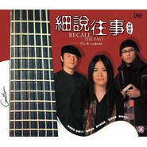

细说往事
============================

|  |  |
| :--: | :-- |
| [ 细说往事](https://emumo.xiami.com/album/169209) | **艺人**: [小娟&山谷里的居民](../index.md) **语种**: 国语 **唱片公司**:  **发行时间**: 2007年07月10日 **专辑类别**: 录音室专辑 **专辑风格**: 城市民谣 Urban Folk **播放数**: 555869 **收藏数**: 281 **评论数**: 88  |

## 简介

舒缓+恬静+田园=山谷里的居民。   
悠扬恬静的田园之美 青草的芬芳 质朴而纯真的岁月感动 燃情而美妙的往事……   
  
往事从头……轻轻细说沧海桑田   
往事如烟……心事一幕幕飘过窗前   
细说往事……开启岁月紧锁的思念   
回到从前……一颗牵挂的心和一张可爱的笑脸   
  
这依然是一张老歌新唱专辑，不同的是它更倾向于民谣的本质：清新、质朴、简单。如果歌唱是一种态度，倾听则是理解的开始。  
  
我们之所以冰冷冷漠，是因为钢筋混凝土所构成的“家”同样冰冷，这样的躯壳虽然坚固，但不足以让人温暖，即便窗户再大，光线再充足，放眼望去，仍然是森然的林立的楼群，全无半点绿色。   
  
所以当小娟在《我的家》中唱道“我的家”“到处都是青草，全部是绿色”的时候，岂知可以用羡慕和嫉妒可以形容，如果问我的内心需要什么？安静，我们会毫不犹豫的回答，当生活的压力犹如地毯式的轰炸，我们在金钱的漩涡中打转，我们真的需要一个绿色的家，它闲适、安静，充满盎然的绿。   
  
关于小娟和他的“山谷里的居民”这个民谣组合，主创人员有三位，分别是小娟（主唱 木吉他）、黎强（木吉他&amp;合音、编曲）、于宙（打击乐 口琴、合音），今年夏天，他们用《细说往事》这张唱片带我们走入了回忆。   
  
这样的回忆是什么，是一常串名字，他们包括：南方二重唱、王杰、王洛宾、蔡琴、刘文正、韩红、罗大佑、陈淑桦、陈美龄，国外的有PETER, PAUL &amp; MARY、Bob Dlyan等。这样的音乐是什么：宁静、安谧，淡然。你会说，这根本算不了一张原创专辑，不过没关系，如果是80后的听众，专辑中2/3以上的歌你应该只听过歌手名，而不会听到过那些歌曲，如果你是更大龄的听众，我想，可以更加有理由的回忆并且怅然若失了。   
  
专辑选用了南方二重唱的《细说往事》作为专辑名和开场曲，充满了怀旧的色彩和平实的诉说基调，在眷眷如流水的木吉他琴弦下，我们的耳朵萦绕的是小娟毫不修饰朴实自然的声音和那些曾经另我们感动的歌手，翻唱并没有将结构打乱，只是更加的简单化，主要的乐器就是木吉他，你不会否认，你听《惦记这一些》的时候，会觉得象王杰，听《再爱我一次》的时候，隐约的是蔡琴的淳厚、空灵的意境化。而开场的《细说往事》副歌部分则用了小娟和黎强的二重唱，从中我们可以体味到小娟他们对原创作品的尊重以及热爱。如果我们再仔细深入一点，那么就是翻唱的歌歌词方面多是些很有民谣意境的歌，比如陈淑桦的《心田》，齐琴和罗大佑的歌更不用说了，他们本身就是吉他民谣青年们的最爱。   
  
从上面翻唱的歌手的名字看，这张《细说往事》无疑让将我们带回到了80-90年代的民谣时期，这些歌最大的可能我们只会在“同一首歌”上听到，但商业的目的，似乎让我们少了些最初的感动，所以当小娟用最安静、阳光的旋律，用天籁的歌声演绎时，脑中回旋的是，曾经的些许感动，曾经的那些身影消失在音乐舞台后的唏嘘。而小娟则抛弃了所有歌手当时的感情，投入了自己的安静与淡然，这是一种享受，就象现如今我们国内没有战争、种族歧视，她还是会唱反战的《Gone The Rainbow》，依然高歌反战、反种族歧视的《Blowing In The Wind》，是基于对民谣的热爱，是对和平环境的歌赞，对所有战争与不平等的警示和谴责。   
  
翻唱自中国西部歌王洛宾的《我俩永隔一江水》加入了弦乐的悲情，重唱旅日歌手陈美龄的《归来的燕子》那种思乡的心情的跃然歌上，而《野百合也有春天》则翻唱的很蔡琴，最让人觉得感动和酸涩的要是《绿岛小夜曲》了，可谓真正的男女二重唱，两部分的人声，尤其男声的表现声浑厚孤独，很有感觉。那首《空白》虽不再有韩红编曲的Band感觉和高音域，但更多了些女性的柔情和哭泣的歌语。专辑中唯一的一首原创作品《我的家》则很显的很民族，在民族语言的和声下显的轻松活泼，旋律及易入耳。   
  
应该说，这张翻唱唱片是异常成功的，一切都显的朴实自然，没有丝毫的矫揉造作，并不讲究什么技巧性，就是纯，让人听了舒服，还有那么点回忆和小感动，此外选曲也是异常的有目的性，都是某个时代很有代表性的曲目，有热门，也有偏门，把我们拉进了现在，又回到了记忆，关键是那种不带浮躁或者商业气息的旋律和歌声，足够让我们为之醉生梦死一回了。  

## 曲目

## 评论

|  |  |  |  |
| :-- | :-- | :-- | :-- |
|  [虾米用户](https://emumo.xiami.com/u/43194450) 布衣暖，菜根香，诗乐滋味... 2020-04-13 15:43 赞(0) 踩(0) | 
清风、明月、我。丝丝缕缕润心田。
 |
|  [虾米用户](https://emumo.xiami.com/u/420135484)  2019-06-25 12:01 赞(0) 踩(0) | 
听到心都化了。
 |
|  [虾米用户](https://emumo.xiami.com/u/760301) 慈。 2019-06-04 02:27 赞(0) 踩(0) | 
终于能听了
 |
|  [虾米用户](https://emumo.xiami.com/u/669081)  2014-08-15 00:08 赞(0) 踩(0) | 
神专终于来了
 |
|  [虾米用户](https://emumo.xiami.com/u/302258) Todi 2014-08-14 20:52 赞(0) 踩(0) | 
比较喜欢往事随风……哦也啊哈
 |
|  [虾米用户](https://emumo.xiami.com/u/2591408)  2014-08-14 16:52 赞(0) 踩(0) | 
蝦米審覈速度快一些最好
 |
|  [虾米用户](https://emumo.xiami.com/u/11157355) 榕树长青 2014-08-13 15:38 赞(0) 踩(0) | 
喜讯
 |
|  [虾米用户](https://emumo.xiami.com/u/4317095)  2012-01-10 10:32 赞(0) 踩(0) | 
往事随风，闻到不一样的味道，一如既往的喜欢。轻轻的，悄悄的
 |
|  [虾米用户](https://emumo.xiami.com/u/1389407) 没有最黑暗只有更黑暗 2011-12-26 16:04 赞(0) 踩(0) | 
很纯粹，很特别！喜欢
 |
|  [虾米用户](https://emumo.xiami.com/u/630760) 感谢11年来的陪伴，我爱... 2011-12-16 22:38 赞(0) 踩(0) | 
听了一晚的歌，听来听去，入睡前还是想再听听我的小娟
 |
|  [虾米用户](https://emumo.xiami.com/u/3189831)  2011-12-15 10:35 赞(0) 踩(0) | 
温暖清新
 |
|  [虾米用户](https://emumo.xiami.com/u/3189831)  2011-12-15 10:33 赞(0) 踩(0) | 
爱死这个声音了，不知道为什么，听到就想起了妈妈
 |
|  [虾米用户](https://emumo.xiami.com/u/5909442)  2011-12-13 12:15 赞(0) 踩(0) | 
清澈、纯净、安静
 |
|  [虾米用户](https://emumo.xiami.com/u/1695117)   2011-12-08 11:41 赞(0) 踩(0) | 
舒缓 恬静 田园=山谷里的居民
 |
|  [虾米用户](https://emumo.xiami.com/u/6943967)  2011-11-24 22:26 赞(0) 踩(0) | 
天籁之音
 |
|  [虾米用户](https://emumo.xiami.com/u/6415437)  2011-11-23 09:33 赞(0) 踩(0) | 
：- )
 |
|  [虾米用户](https://emumo.xiami.com/u/5079997)  2011-11-13 09:12 赞(0) 踩(0) | 
温暖
 |
| ⇒ |  [虾米用户](https://emumo.xiami.com/u/6943967)  2011-11-24 22:29 赞(0) 踩(0) | 
天籁之音
 |
|  [虾米用户](https://emumo.xiami.com/u/1519837)  2011-11-06 21:05 赞(0) 踩(0) | 
纯净、清澈。如水，洗涤无尽年华。。。
 |
|  [虾米用户](https://emumo.xiami.com/u/983654)  2011-10-18 16:35 赞(0) 踩(0) | 
安静.淳朴
 |
|  [虾米用户](https://emumo.xiami.com/u/1818267)  2011-10-17 10:29 赞(0) 踩(0) | 
干净的声音
 |
|  [虾米用户](https://emumo.xiami.com/u/427368)  2011-10-13 23:51 赞(0) 踩(0) | 
宁静……
 |
|  [虾米用户](https://emumo.xiami.com/u/6134956)  2011-10-13 11:35 赞(0) 踩(0) | 
悦耳心静。听着舒坦
 |
|  [虾米用户](https://emumo.xiami.com/u/6057095)  2011-10-01 10:08 赞(0) 踩(0) | 
一个人听得，有些感动
 |
|  [虾米用户](https://emumo.xiami.com/u/1553118)  2011-09-25 00:59 赞(0) 踩(0) | 
你太长的忧郁 静静洒在我胸口···
 |
|  [虾米用户](https://emumo.xiami.com/u/5853951)  2011-09-20 22:45 赞(0) 踩(0) | 
小娟，温暖
 |
|  [虾米用户](https://emumo.xiami.com/u/1364755)  2011-09-17 11:28 赞(0) 踩(0) | 
山下小河淌水清悠悠
 |
|  [虾米用户](https://emumo.xiami.com/u/3850801)  2011-09-07 18:21 赞(0) 踩(0) | 
最自然的简单
 |
|  [虾米用户](https://emumo.xiami.com/u/5713309)  2011-09-05 18:03 赞(0) 踩(0) | 
让人忘却烦忧~
 |
|  [虾米用户](https://emumo.xiami.com/u/4775015)  2011-08-31 11:23 赞(0) 踩(0) | 
静
 |
|  [虾米用户](https://emumo.xiami.com/u/455686) 泡一杯绿茶，翻两本闲书，... 2011-08-28 23:41 赞(0) 踩(0) | 
like.....................
 |
|  [虾米用户](https://emumo.xiami.com/u/2455753)  2011-08-25 23:13 赞(0) 踩(0) | 
宁静
 |
|  [虾米用户](https://emumo.xiami.com/u/5498920)  2011-08-20 15:02 赞(0) 踩(0) | 
静静的 淡淡的 可以闻到青草的香气，歌里唱的就是我和六又二十四回老家晒太阳的日子
 |
|  [虾米用户](https://emumo.xiami.com/u/5157755)  2011-08-06 17:24 赞(0) 踩(0) | 
质朴与纯真.
 |
|  [虾米用户](https://emumo.xiami.com/u/5120702)  2011-08-04 10:54 赞(0) 踩(0) | 
怀旧
 |
|  [虾米用户](https://emumo.xiami.com/u/766568)  2011-08-02 13:39 赞(0) 踩(0) | 
就是小娟的歌，很舒服地听着。
 |
|  [虾米用户](https://emumo.xiami.com/u/1504165)  2011-07-24 00:16 赞(0) 踩(0) | 
好
 |
|  [虾米用户](https://emumo.xiami.com/u/1559575)  2011-07-21 13:49 赞(0) 踩(0) | 
好听
 |
|  [虾米用户](https://emumo.xiami.com/u/4863565) 挤出一丝力气 2011-07-20 14:49 赞(0) 踩(0) | 
静听，足够
 |
|  [虾米用户](https://emumo.xiami.com/u/768888)  2011-06-30 19:43 赞(0) 踩(0) | 
舒服~~
 |
|  [虾米用户](https://emumo.xiami.com/u/4479481)  2011-06-29 13:41 赞(0) 踩(0) | 
点点滴滴 无不诉说往事如云烟  爱恨交割
 |
|  [虾米用户](https://emumo.xiami.com/u/4479481)  2011-06-29 13:33 赞(0) 踩(0) | 
喜欢小娟的音乐  安逸  抒情  静心  难以忘怀
 |
|  [虾米用户](https://emumo.xiami.com/u/2575201)  2011-06-23 00:15 赞(0) 踩(0) | 
安静
 |
|  [虾米用户](https://emumo.xiami.com/u/1839075)  2011-06-16 13:50 赞(0) 踩(0) | 
宁静，舒服
 |
|  [虾米用户](https://emumo.xiami.com/u/3948849)  2011-06-09 14:09 赞(0) 踩(0) | 
再爱我一次
 |
|  [虾米用户](https://emumo.xiami.com/u/3948849)  2011-06-09 14:09 赞(0) 踩(0) | 
干净的声音
 |
|  [虾米用户](https://emumo.xiami.com/u/3948849)  2011-06-09 14:09 赞(0) 踩(0) | 
细说往事
 |
|  [虾米用户](https://emumo.xiami.com/u/3948849)  2011-06-09 14:08 赞(0) 踩(0) | 
喜欢的
 |
|  [虾米用户](https://emumo.xiami.com/u/585338)  2011-06-05 09:51 赞(0) 踩(0) | 
令人心旷神怡~
 |
|  [虾米用户](https://emumo.xiami.com/u/3937608)  2011-05-15 19:25 赞(0) 踩(0) | 
喜欢她的细腻
 |
|  [虾米用户](https://emumo.xiami.com/u/480469) 暂无签名~ 2011-04-10 21:58 赞(0) 踩(0) | 
如果歌声也会忘记那些往事，那么我们还有什么呢？
 |
|  [虾米用户](https://emumo.xiami.com/u/188661) 我还没想好要写什么... 2011-04-01 17:46 赞(0) 踩(0) | 
其实不喜欢这个封面拉
 |
|  [虾米用户](https://emumo.xiami.com/u/3420859) 听万首歌，行万里路。 2011-04-01 06:34 赞(0) 踩(0) | 
温柔的演绎   悠悠唱~   轻轻听~
 |
|  [虾米用户](https://emumo.xiami.com/u/2653673)  2011-03-31 20:28 赞(0) 踩(0) | 
小娟的歌里，我最喜欢的一张专辑，喜欢《Gone the rainbow》《Flower》，喜欢《Blowin\' in the wind》，也喜欢《归来的燕子》，真的，差不多都喜欢...
 |
|  [虾米用户](https://emumo.xiami.com/u/3401607)  2011-03-29 14:01 赞(0) 踩(0) | 
寧靜,舒服
 |
|  [虾米用户](https://emumo.xiami.com/u/2281786) 暂无签名~ 2011-03-06 17:15 赞(0) 踩(0) | 
静静流淌
 |
|  [虾米用户](https://emumo.xiami.com/u/2898012)  2011-02-19 21:23 赞(0) 踩(0) | 
回味美麗
 |
|  [虾米用户](https://emumo.xiami.com/u/980545)  2011-02-19 00:42 赞(0) 踩(0) | 
纯净的声音
 |
|  [虾米用户](https://emumo.xiami.com/u/1342581)  2011-02-12 17:41 赞(0) 踩(0) | 
小娟&amp;amp;山谷里的居民
 |
|  [虾米用户](https://emumo.xiami.com/u/2691264)  2011-02-05 11:30 赞(0) 踩(0) | 
清新自然纯净完美
 |
|  [虾米用户](https://emumo.xiami.com/u/2360098)  2011-01-16 19:56 赞(0) 踩(0) | 
往事如风
 |
|  [虾米用户](https://emumo.xiami.com/u/2170446)   2011-01-15 08:44 赞(0) 踩(0) | 
咯
 |
|  [虾米用户](https://emumo.xiami.com/u/2498050)  2011-01-15 00:37 赞(0) 踩(0) | 
喜欢轻音乐，很舒服的感觉~！
 |
|  [虾米用户](https://emumo.xiami.com/u/2469752)  2011-01-12 13:29 赞(0) 踩(0) | 
神清气爽
 |
|  [虾米用户](https://emumo.xiami.com/u/2469752)  2011-01-12 13:28 赞(0) 踩(0) | 
闭上双眼，空气清新，神清气爽。
 |
|  [虾米用户](https://emumo.xiami.com/u/2421543)  2011-01-07 20:15 赞(0) 踩(0) | 
舒缓+恬静+田园=山谷里的居民。悠扬恬静的田园之美 青草的芬芳 质朴而纯真的岁月感动 燃情而美妙的往事……往事从头……轻轻细说沧海桑田
 |
|  [虾米用户](https://emumo.xiami.com/u/2421543)  2011-01-07 20:15 赞(0) 踩(0) | 
舒缓+恬静+田园=山谷里的居民。悠扬恬静的田园之美 青草的芬芳 质朴而纯真的岁月感动 燃情而美妙的往事……往事从头……轻轻细说沧海桑田
 |
|  [虾米用户](https://emumo.xiami.com/u/609795)  2010-11-08 22:58 赞(0) 踩(0) | 
真的，做我姐吧
 |
|  [虾米用户](https://emumo.xiami.com/u/519241)  2010-07-19 15:16 赞(0) 踩(0) | 
淡淡流水，淡淡歌声。
 |
|  [虾米用户](https://emumo.xiami.com/u/948176)  2010-05-31 12:51 赞(0) 踩(0) | 
小娟~
 |
|  [虾米用户](https://emumo.xiami.com/u/630760) 感谢11年来的陪伴，我爱... 2010-05-29 16:51 赞(0) 踩(0) | 
最爱小娟的浅吟低唱
 |
|  [虾米用户](https://emumo.xiami.com/u/54518)  2010-05-27 15:52 赞(1) 踩(0) | 
因为于宙所以收藏这张专辑
 |
|  [虾米用户](https://emumo.xiami.com/u/1941) 经不住似水流年，逃不过此... 2010-04-05 16:04 赞(0) 踩(0) | 
很幸运别人送我这张《细说往事》CD，虽然我最喜欢的小娟不是这张专辑，但是还是比较耐听的
 |
|  [虾米用户](https://emumo.xiami.com/u/648256)  2010-02-07 17:16 赞(0) 踩(0) | 
这才是音乐啊
 |
|  [虾米用户](https://emumo.xiami.com/u/547831)  2010-01-27 23:13 赞(0) 踩(0) | 
找到幽静的感觉我想会在这停留很久啊
 |
|  [虾米用户](https://emumo.xiami.com/u/573474)  2009-12-15 19:26 赞(0) 踩(0) | 
空谷幽兰
 |
|  [虾米用户](https://emumo.xiami.com/u/541164)  2009-12-02 19:44 赞(0) 踩(0) | 
自然  纯朴
 |
|  [虾米用户](https://emumo.xiami.com/u/495670)  2009-11-09 10:43 赞(0) 踩(0) | 
在绿树白花的篱前，听邻家的那个女孩，轻轻地，轻轻地唱着......风从树梢吹过，吹落了白色的花瓣，我捉住了一个梦。
 |
|  [虾米用户](https://emumo.xiami.com/u/416267)  2009-09-30 19:50 赞(0) 踩(0) | 
空谷幽兰的动人旋律,不经意间触动了心灵.想起那些美丽的记忆,如今却只能细说往事!
 |
|  [虾米用户](https://emumo.xiami.com/u/416267)  2009-09-30 19:49 赞(0) 踩(0) | 
空谷幽兰的动人旋律,不经意间触动了心灵.想起那些美丽的记忆,如今却只能细说往事!
 |
|  [虾米用户](https://emumo.xiami.com/u/256115)  2009-08-03 15:46 赞(0) 踩(0) | 
听起来很舒服
 |
|  [虾米用户](https://emumo.xiami.com/u/290587)  2009-07-26 12:57 赞(0) 踩(0) | 
终于找到了我最喜欢的调调。微笑平静的听着
 |
|  [虾米用户](https://emumo.xiami.com/u/268315)  2009-07-14 08:28 赞(0) 踩(0) | 
so lovely sound ！
 |
|  [虾米用户](https://emumo.xiami.com/u/69320)  2009-04-28 23:25 赞(0) 踩(0) | 
so pure, so nice voice and stories...
 |
|  [虾米用户](https://emumo.xiami.com/u/101985)  2009-04-25 23:15 赞(0) 踩(0) | 
太美妙了
 |
|  [虾米用户](https://emumo.xiami.com/u/107709)  2009-04-19 08:59 赞(0) 踩(0) | 
爱上小娟的歌 那种基调 就像坐在丽江的小桥流水旁  诉说着你我的那段美好
 |
|  [虾米用户](https://emumo.xiami.com/u/30650)  2009-01-09 20:34 赞(0) 踩(0) | 
净化心灵的声音
 |
|  [虾米用户](https://emumo.xiami.com/u/17510)  2008-12-18 20:16 赞(0) 踩(0) | 
很纯丫
 |
