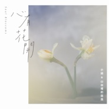

心有花开
============================

|  |  |
| :--: | :-- |
| [ 心有花开](https://emumo.xiami.com/album/2100332100) | **艺人**: [小娟&山谷里的居民](../index.md) **语种**: 国语 **唱片公司**: 木南十一 **发行时间**: 2016年06月06日 **专辑类别**: 录音室专辑 **专辑风格**:  **播放数**: 759036 **收藏数**: 960 **评论数**: 80  |

## 简介

小娟&amp;山谷里的居民  
2016全新创作辑  
心有花开  
来自春之谷的邀请  
  
“花开的声音,心能听到。”——小娟&amp;山谷里的居民  
  
音乐和创作,对“小娟&amp;山谷里的居民”而言,是生活的一部分。他们的作品,和他们在自家后院种下的花草一样,会随着时光风景而茁壮,最后拥有了自己本真的模样。  
  
就音乐作品量而言,他们不算高产,因为他们秉持音乐就如山谷里自然生发的生命,遵循着本该有的生长周期与成熟的时机。这一次,从开始着手整理跨越二十年的创作,到制作专辑,不早不晚,在春天完成整张专辑,花开季节应了景,也令小娟&amp;山谷里的居民确信,这就是缘分的召唤。  
  
这一次山谷在惯常的平实质朴语调中,加入了此阶段对人生的感悟和信仰,专辑的每一个乐句都是山谷一直想要表达的创作初衷“从写第一首歌,制作我们的第一张专辑、第一场演出开始,一直愿意将内心感受到的生命的美好、万事万物带来的感动分享给每一位相遇的人,哪怕只是一瞬间的停留。花香、鸟鸣、流水……山谷里大自然的声音,真的可以让我们的心去感受平静。无论在何时、身处在喧闹城市的哪一个角落,通过音乐都可以来到"山谷"里。音乐是在时空里播种,而让它生根发芽的是每个人与生俱来的想象力,花开的声音我们的心能听到。”  
  
音乐的表达,是一种纯粹地分享。保持这种原始而真挚的状态,是“小娟&amp;山谷里的居民”写在音乐里的心愿。  
  
“希望每一个听到这张专辑的人都喜乐。” ——小娟&amp;山谷里的居民

## 曲目

## 评论

|  |  |  |
| :-- | :-- | :-- |
|  [虾米用户](https://emumo.xiami.com/u/419202573) 来自宇宙深处的二次元少女 2019-08-21 14:39 赞(0) 踩(0) | 
为什听不了了
 |
|  [虾米用户](https://emumo.xiami.com/u/335794092) aa哈 2019-04-10 10:29 赞(0) 踩(0) | 
不错的
 |
|  [虾米用户](https://emumo.xiami.com/u/123987172)   2019-03-22 09:14 赞(0) 踩(0) | 
金色的麦田
 |
|  [虾米用户](https://emumo.xiami.com/u/408559083)  2019-02-28 22:41 赞(0) 踩(0) | 
五星都是
 |
|  [虾米用户](https://emumo.xiami.com/u/13580086) 闲乐渔樵 2019-01-18 23:40 赞(0) 踩(0) | 
原来挺喜欢，现在开始讨厌了
 |
| ⇒ |  [虾米用户](https://emumo.xiami.com/u/123987172)   2019-03-19 22:41 赞(0) 踩(0) | 
为什么这样说，
 |
|  [虾米用户](https://emumo.xiami.com/u/23568701)  2018-04-16 14:44 赞(0) 踩(0) | 
依旧喜欢，干净、安净、与世无争、敦朴无华！
 |
|  [虾米用户](https://emumo.xiami.com/u/44799416) 我还没想好要写什么... 2017-10-28 00:05 赞(0) 踩(0) | 
歌词和旋律都有朴树那首《平凡之路》的影子，为文艺青年精心打造，可惜同样用力过猛了。
 |
|  [虾米用户](https://emumo.xiami.com/u/4234256)  2017-07-24 22:19 赞(1) 踩(0) | 
去年的六月 为毛我没有发现出新专了。。。
 |
|  [虾米用户](https://emumo.xiami.com/u/260600648)  2017-01-17 13:06 赞(1) 踩(0) | 
还是喜欢，唱“红布绿花朵”时，那个小娟
 |
|  [虾米用户](https://emumo.xiami.com/u/3815293) baby Jesus s... 2016-11-13 10:04 赞(0) 踩(0) | 
噗
 |
|  [虾米用户](https://emumo.xiami.com/u/230810227) Music Just F... 2016-10-20 20:31 赞(0) 踩(0) | 
纯净、清新、朴实，当你想静静的思考，或者想畅游在自由的海洋，听听吧
 |
|  [虾米用户](https://emumo.xiami.com/u/1550112) 隐藏在旋律中的心绪 2016-07-23 21:09 赞(0) 踩(0) | 
如果不能保证不下架，就不要发出来了，何必呢？
 |
|  [虾米用户](https://emumo.xiami.com/u/3815293) baby Jesus s... 2016-07-22 15:08 赞(0) 踩(0) | 
独家两首单曲？
 |
|  [虾米用户](https://emumo.xiami.com/u/12878826) 谢谢陪伴 再见哦！ 2016-07-22 08:27 赞(4) 踩(0) | 
独家下架也是醉醉的
 |
|  [虾米用户](https://emumo.xiami.com/u/39639254)  2016-07-18 07:57 赞(0) 踩(0) | 
今夏最棒
 |
|  [虾米用户](https://emumo.xiami.com/u/10435106) 听靓歌 2016-07-10 21:12 赞(0) 踩(0) | 
OK
 |
|  [虾米用户](https://emumo.xiami.com/u/2972552) 我还没想好要写什么... 2016-07-10 10:09 赞(3) 踩(0) | 
虾米又没有版权｀｀｀｀哎｀｀｀虾米再见了
 |
|  [虾米用户](https://emumo.xiami.com/u/4232584)  2016-06-21 19:46 赞(0) 踩(0) | 
夏日的好音乐
 |
|  [虾米用户](https://emumo.xiami.com/u/10026252)  2016-06-21 19:22 赞(0) 踩(0) | 
干净的音乐
 |
|  [虾米用户](https://emumo.xiami.com/u/186601430)  2016-06-06 20:54 赞(0) 踩(0) | 
无画的夜晚，点点滴滴，很是美丽
 |
|  [虾米用户](https://emumo.xiami.com/u/186601430)  2016-06-06 20:53 赞(0) 踩(0) | 
无画的雨夜，点点滴滴
 |
|  [虾米用户](https://emumo.xiami.com/u/186601430)  2016-06-06 20:51 赞(0) 踩(0) | 
此时此刻的心情就像蓝色的窗外一样
 |
|  [虾米用户](https://emumo.xiami.com/u/186601430)  2016-06-06 20:50 赞(0) 踩(0) | 
很好听
 |
|  [虾米用户](https://emumo.xiami.com/u/1844) 农夫 山泉 有点田 2016-05-21 11:41 赞(0) 踩(0) | 
这首不错
 |
|  [虾米用户](https://emumo.xiami.com/u/2604)  2016-05-15 08:52 赞(0) 踩(0) | 
听小娟怎么说这首歌：<a href="http://mp.weixin.qq.com/s?__biz=MzIxOTI3MDI5Mw==&amp;amp;mid=2650127600&amp;amp;idx=1&amp;amp;sn=e3a88bba86fa331344a695ebbb76dfb9#wechat_redirect" target="_blank" rel="nofollow noreferrer noopener">http://mp.weixin.qq.com/s?__biz=MzIxOTI3MDI5Mw==&amp;amp;mid=2650127600&amp;amp;idx=1&amp;amp;sn=e3a88bba86fa331344a695ebbb76dfb9#wechat_redirect</a>
 |
|  [虾米用户](https://emumo.xiami.com/u/844560)   2016-05-14 07:46 赞(0) 踩(0) | 
沉默是多余的
 |
|  [虾米用户](https://emumo.xiami.com/u/35244555) 细嗅蔷薇 2016-05-13 22:10 赞(0) 踩(0) | 
特温暖的一把嗓子！
 |
|  [虾米用户](https://emumo.xiami.com/u/276581)  2016-05-13 17:35 赞(0) 踩(0) | 
听着她，我心中有一幅画。
 |
|  [虾米用户](https://emumo.xiami.com/u/5191209)  2016-05-13 15:54 赞(0) 踩(0) | 
好好听！
 |
|  [虾米用户](https://emumo.xiami.com/u/478527) 好想跟衣服在洗衣机里滚 2016-05-13 01:19 赞(0) 踩(0) | 
已乐
 |
|  [虾米用户](https://emumo.xiami.com/u/478527) 好想跟衣服在洗衣机里滚 2016-05-13 01:18 赞(0) 踩(0) | 
已乐
 |
|  [虾米用户](https://emumo.xiami.com/u/5012212)   2016-05-12 23:35 赞(0) 踩(0) | 
雨后的北京，初夏的夜。 一处光阴，一个爱情，一段故事。
 |
|  [虾米用户](https://emumo.xiami.com/u/3496718) idle space 2016-05-12 22:27 赞(0) 踩(0) | 
一听他们的声音，顿时安静下来~~~~
 |
|  [虾米用户](https://emumo.xiami.com/u/3496718) idle space 2016-05-12 22:27 赞(0) 踩(0) | 
一听他们的声音，顿时安静下来~~~~
 |
|  [虾米用户](https://emumo.xiami.com/u/1308967) 虾米听重型极端音乐这块的... 2016-05-12 22:15 赞(0) 踩(0) | 
.
 |
|  [虾米用户](https://emumo.xiami.com/u/12350223)  2016-05-12 21:17 赞(0) 踩(0) | 
不错啊很好听
 |
|  [虾米用户](https://emumo.xiami.com/u/1041971)  2016-05-12 17:49 赞(0) 踩(0) | 
小娟，依旧盈盈那么好！
 |
|  [虾米用户](https://emumo.xiami.com/u/13403598)  2016-05-12 17:19 赞(0) 踩(0) | 
无感
 |
|  [虾米用户](https://emumo.xiami.com/u/52281443) 旋律的美妙。 2016-05-12 17:08 赞(0) 踩(0) | 
好喜欢这样的画风。
 |
|  [虾米用户](https://emumo.xiami.com/u/828536)   2016-05-12 15:52 赞(0) 踩(0) | 
无感
 |
|  [虾米用户](https://emumo.xiami.com/u/38746145) 裆下很忧郁:-P 2016-05-12 15:50 赞(0) 踩(0) | 
完全不知道好听在哪里嘛
 |
|  [虾米用户](https://emumo.xiami.com/u/86939582)  2016-05-12 13:05 赞(0) 踩(0) | 
公路写的无画，应该是新专辑里最喜欢的一首
 |
|  [虾米用户](https://emumo.xiami.com/u/748357) 有灵 2016-05-12 12:07 赞(0) 踩(0) | 
至今为止最想去听的现场
 |
|  [虾米用户](https://emumo.xiami.com/u/4475091)  2016-05-12 11:14 赞(0) 踩(0) | 

 |
|  [虾米用户](https://emumo.xiami.com/u/4475091)  2016-05-12 11:12 赞(0) 踩(0) | 

 |
|  [虾米用户](https://emumo.xiami.com/u/10250709)  2016-05-12 11:10 赞(0) 踩(0) | 
越来越好了吧，应该。
 |
|  [虾米用户](https://emumo.xiami.com/u/167525146)  2016-05-12 10:41 赞(0) 踩(0) | 
「心有花开」第二支单曲来了～
 |
|  [虾米用户](https://emumo.xiami.com/u/10517016)  2016-05-12 09:27 赞(0) 踩(0) | 
喜欢
 |
|  [虾米用户](https://emumo.xiami.com/u/33457575)   2016-05-12 07:53 赞(4) 踩(0) | 
封面逼死强迫症
 |
|  [虾米用户](https://emumo.xiami.com/u/7815067) 就这样听着音乐 只有音乐 2016-05-11 23:32 赞(2) 踩(0) | 
终于有新歌了，好棒~
 |
|  [虾米用户](https://emumo.xiami.com/u/6331728)  2016-05-11 20:24 赞(0) 踩(0) | 
好好听啊，洗涤了我疲惫的耳朵，我想哭一哭
 |
|  [虾米用户](https://emumo.xiami.com/u/13806465) 我还没想好要写什么... 2016-05-11 20:13 赞(0) 踩(0) | 
第一次听山谷是大一 如今转眼大四
 |
|  [虾米用户](https://emumo.xiami.com/u/11970559) 音乐有生命。 2016-05-11 14:20 赞(0) 踩(0) | 
特别喜欢你们。塌心实地的感觉，多美好哇~~~
 |
|  [虾米用户](https://emumo.xiami.com/u/11979517) xj 2016-05-11 13:40 赞(0) 踩(0) | 
喜欢这种浅吟低唱
 |
|  [虾米用户](https://emumo.xiami.com/u/71446596)  2016-05-11 10:12 赞(0) 踩(0) | 
终于有新歌听了。。
 |
|  [虾米用户](https://emumo.xiami.com/u/8601290) 远在远方的风，比远方更远 2016-05-10 15:23 赞(0) 踩(0) | 
好想每天都看着蓝色的窗外，可是老是雨雾迷离，今年老天还没哭够，都大夏的天，还在下雨下雨……。。。。。。。
 |
|  [虾米用户](https://emumo.xiami.com/u/14219505) 不辞而别是最洒脱的方式。 2016-05-10 14:54 赞(0) 踩(0) | 
凡俗中的清莲
 |
|  [虾米用户](https://emumo.xiami.com/u/42725114) ThistheshitI... 2016-05-09 18:41 赞(0) 踩(0) | 

 |
|  [虾米用户](https://emumo.xiami.com/u/41378699)  2016-05-09 18:04 赞(0) 踩(0) | 
喜欢
 |
|  [虾米用户](https://emumo.xiami.com/u/103639920) 生活有点酷 2016-05-09 15:12 赞(0) 踩(0) | 
白色的窗外！
 |
| ⇒ |  [虾米用户](https://emumo.xiami.com/u/268231) 爱上了一只西瓜精 2016-05-09 17:29 赞(0) 踩(0) | 
为你所在城市的雾霾点个蜡~
 |
|  [虾米用户](https://emumo.xiami.com/u/2458715)  2016-05-09 14:53 赞(0) 踩(0) | 
恩，封面漂亮
 |
|  [虾米用户](https://emumo.xiami.com/u/1032029) 我还没想好要写什么... 2016-05-09 14:38 赞(0) 踩(0) | 
现在听居然想起了裸儿
 |
|  [虾米用户](https://emumo.xiami.com/u/5667996) 我还没想好要写什么... 2016-05-09 14:36 赞(7) 踩(0) | 
赵咏华转世
 |
| ⇒ |  [虾米用户](https://emumo.xiami.com/u/43685086)   2016-05-09 21:24 赞(0) 踩(0) | 
太像了
 |
| ⇒ |  [虾米用户](https://emumo.xiami.com/u/9613869) 我本善良 2016-05-11 12:37 赞(0) 踩(0) | 
赵咏华还没死吧
 |
| ⇒ |  [虾米用户](https://emumo.xiami.com/u/5667996) 我还没想好要写什么... 2016-05-12 09:18 赞(0) 踩(0) | 
<q><b>钟兴林说：</b></q>
 |
| ⇒ |  [虾米用户](https://emumo.xiami.com/u/17283226)  2016-05-17 10:34 赞(0) 踩(0) | 
说的好似赵咏华不在世了一样。
 |
| ⇒ |  [虾米用户](https://emumo.xiami.com/u/5667996) 我还没想好要写什么... 2016-05-18 09:27 赞(0) 踩(0) | 
<q><b>高级板栗说：</b></q>
 |
|  [虾米用户](https://emumo.xiami.com/u/6733300) 誩 2016-05-09 14:34 赞(0) 踩(0) | 
  
 |
|  [虾米用户](https://emumo.xiami.com/u/4874803)  2016-05-09 13:19 赞(0) 踩(0) | 
不要改变音乐风格
 |
|  [虾米用户](https://emumo.xiami.com/u/2374800)  2016-05-09 12:27 赞(0) 踩(0) | 
太好听了。
 |
|  [虾米用户](https://emumo.xiami.com/u/253075) 专注内八二十年 2016-05-09 11:23 赞(0) 踩(0) | 
期待新专
 |
|  [虾米用户](https://emumo.xiami.com/u/1674456)  2016-05-09 10:54 赞(0) 踩(0) | 
封面好评
 |
|  [虾米用户](https://emumo.xiami.com/u/10265062)  2016-05-09 10:37 赞(1) 踩(0) | 
最开始知道小娟还是从性别不明的好妹妹乐队～哈哈
 |
|  [虾米用户](https://emumo.xiami.com/u/119111740) 只想开开心心 2016-05-09 10:26 赞(0) 踩(0) | 
支持支持
 |
|  [虾米用户](https://emumo.xiami.com/u/11157355) 榕树长青 2016-05-09 10:19 赞(0) 踩(0) | 
祝贺新砖发布！
 |
|  [虾米用户](https://emumo.xiami.com/u/3961475)   2016-05-09 10:16 赞(0) 踩(0) | 
前排
 |
|  [虾米用户](https://emumo.xiami.com/u/652547)  2016-05-09 10:00 赞(0) 踩(0) | 
我的窗外是灰蓝
 |
