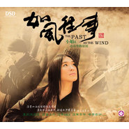

如风往事
============================

|  |  |
| :--: | :-- |
| [ 如风往事](https://emumo.xiami.com/album/32584) | **艺人**: [小娟&山谷里的居民](../index.md) **语种**: 国语 **唱片公司**:  **发行时间**: 2007年11月20日 **专辑类别**: 录音室专辑 **专辑风格**: 城市民谣 Urban Folk **播放数**: 355207 **收藏数**: 114 **评论数**: 159  |

## 简介

夜深人静，月光朦胧，一张发黄的旧相片,一片风干的玫瑰花瓣，一本搁置在抽屉深处的日记，勾起了一段尘封的往事。伴着滴滴嗒嗒的钟声，思绪慢慢倒退，跨过时间的隧道，往事一幕幕。曾经，有过梦想、有过追求、有过幸福、有过气馁、有过悲伤、有过烦恼......一切既清晰又模糊。
 

也许每个人的心中都住着一个感性的精灵，在不经意间总会被一些人或一些事所打动。小娟的歌声就是属于那种很容易打动你我心中那个感性精灵的天籁，娟声就像一位久别重逢的老朋友讲述着每一份久违的情怀，那么亲切、温馨、怀旧，让人一听如故。听，那清新温暖的嗓音在空中飘荡、翩翩起舞，灵动而自由，如微风划过心湖，泛起点点回忆的涟漪，吹走往事的繁杂，留下向往美好的希望。
 

小娟以其独特的唱腔被誉为“中国当代民谣传奇女歌手”。 　　  
  
《如风往事》是乐队成立9年首张纪念专辑，也是史上首张以乐队形式推出的发烧专辑。首首主打，没有MIDI，没有浮华。小娟是山谷里的居民乐队的主唱歌手。其独特的嗓音在山谷里的居民乐队的专业伴奏下更显魅力。
 

山谷里的居民用心做自己的音乐,不随波逐流、不赶时髦、他们独辟奚径，把人性中最朴实、最善良、最精华的东西展现出来。本张专辑收录的乐队原创歌曲《晚霞》有着特别的意义，纪念着十年前三人相识的最初，纯净如泉的天籁之声感人至深，唤起了人们对宁静淳朴生活的向往。最让我们感动的是小娟和他们团队的敬业态度以及对人生的热忱，我们为能与这样的团队一起合作，感到无比的荣幸和自豪。 　　  
  
本专辑无论是从选曲、编配、唱风还是设计、包装上都怀着淡淡的怀旧。怀旧在声声歌韵中扬起，散发出点点的芬芳；往事如雨般轻轻飘在风里，清新的民谣曲风，舒适的沙发音乐游荡在耳边，小娟&amp;山谷里的居民天籁流水般的声音及优美合声让你的心里涌起了一股浓浓的柔情... 就让往事随风，小娟的歌声将永远伴你勇敢面对未知的未来。

## 曲目

## 评论

|  |  |  |  |
| :-- | :-- | :-- | :-- |
|  [虾米用户](https://emumo.xiami.com/u/45937680) 有健康才有将来！ 2018-04-26 12:30 赞(2) 踩(0) | 
何时才能拿到版权？！想听！！下了虾米音乐就是想听这个专辑的！
 |
|  [虾米用户](https://emumo.xiami.com/u/99385046)   2018-03-24 15:51 赞(1) 踩(0) | 
何时拿到版权？想听这张专辑。
 |
|  [虾米用户](https://emumo.xiami.com/u/616419)  2017-10-17 06:22 赞(0) 踩(0) | 
让我听了心里会很安静的音乐！超级喜欢，第一次听时一直以为是台湾的民谣乐团，刚才看了简介，原来是内地的，真的高兴内地也有这么棒的乐团。喜欢喜欢喜欢喜欢！超级！歌曲我自己全部做成了彩铃！
 |
|  [虾米用户](https://emumo.xiami.com/u/190551) 我还没想好要写什么... 2017-07-24 22:24 赞(0) 踩(0) | 
@皇孙的毛爷爷 小娟的500 miles。
 |
|  [虾米用户](https://emumo.xiami.com/u/275001055) 这名字不错 2017-03-14 14:03 赞(1) 踩(0) | 
为什么不给听  
 |
|  [虾米用户](https://emumo.xiami.com/u/550041) i am nothing... 2014-08-15 16:03 赞(0) 踩(0) | 
看不到，听不到。
 |
|  [虾米用户](https://emumo.xiami.com/u/2794138)  2014-08-14 15:53 赞(0) 踩(0) | 
根本看不到。根本听不了。
 |
|  [虾米用户](https://emumo.xiami.com/u/11157355) 榕树长青 2014-08-13 15:39 赞(0) 踩(0) | 
喜讯
 |
|  [虾米用户](https://emumo.xiami.com/u/3258877)  2012-01-09 08:40 赞(0) 踩(0) | 
Five hundred miles 离家五百里
 |
|  [虾米用户](https://emumo.xiami.com/u/578836)  2011-12-14 17:05 赞(0) 踩(0) | 
让我想起北京的城南旧事
 |
|  [虾米用户](https://emumo.xiami.com/u/7171465)  2011-12-09 22:23 赞(0) 踩(0) | 
爱的路上千万里 这首歌 听起来很入心 花祭翻唱的也不错 尤其是和声部分
 |
|  [虾米用户](https://emumo.xiami.com/u/867829) 2010年开始，美好的相... 2011-12-08 20:12 赞(0) 踩(0) | 
不错，听着舒服
 |
|  [虾米用户](https://emumo.xiami.com/u/1695117)   2011-12-08 11:40 赞(0) 踩(0) | 
爵士，声线很舒缓很平和，按摩到了听觉
 |
|  [虾米用户](https://emumo.xiami.com/u/2066468)  2011-12-03 09:47 赞(0) 踩(0) | 
如果在这个深秋初冬觉得冷，晒着阳光听这张专辑，会觉得暖。
 |
|  [虾米用户](https://emumo.xiami.com/u/2054570)  2011-12-02 10:51 赞(0) 踩(0) | 
y
 |
|  [虾米用户](https://emumo.xiami.com/u/1453136) hi, there 2011-11-30 00:51 赞(0) 踩(0) | 
喜欢
 |
|  [虾米用户](https://emumo.xiami.com/u/2407025)  2011-11-25 09:13 赞(0) 踩(0) | 
如风往事就让它随风去吧~~
 |
| ⇒ |  [虾米用户](https://emumo.xiami.com/u/71992)  2011-11-28 23:29 赞(0) 踩(0) | 
神马如风往事啊＊0＊
 |
|  [虾米用户](https://emumo.xiami.com/u/905470)  2011-11-23 20:48 赞(0) 踩(0) | 
哎呀，我这个30岁的老男人好喜欢。。。
 |
|  [虾米用户](https://emumo.xiami.com/u/5485534)  2011-11-17 11:47 赞(0) 踩(0) | 
好喜欢啊 ~~~~~
 |
|  [虾米用户](https://emumo.xiami.com/u/2478621)  2011-11-16 19:54 赞(0) 踩(0) | 
磁性，超好听
 |
|  [虾米用户](https://emumo.xiami.com/u/6665742)  2011-11-15 11:40 赞(0) 踩(0) | 
好听的民谣
 |
|  [虾米用户](https://emumo.xiami.com/u/6153257)  2011-11-08 22:17 赞(0) 踩(0) | 
为什么我听不了？
 |
|  [虾米用户](https://emumo.xiami.com/u/5812973)  2011-11-07 16:14 赞(0) 踩(0) | 
歌声天籁
 |
|  [虾米用户](https://emumo.xiami.com/u/6662658)  2011-11-07 13:22 赞(0) 踩(0) | 
精灵
 |
|  [虾米用户](https://emumo.xiami.com/u/6656132)  2011-11-07 01:21 赞(0) 踩(0) | 
ccc
 |
|  [虾米用户](https://emumo.xiami.com/u/6551274)  2011-11-04 11:17 赞(0) 踩(0) | 
犹如清流小溪，非常耐听
 |
|  [虾米用户](https://emumo.xiami.com/u/6423473)  2011-10-25 12:13 赞(0) 踩(0) | 
nice
 |
|  [虾米用户](https://emumo.xiami.com/u/740761)  2011-10-24 11:17 赞(0) 踩(0) | 
干净，透彻
 |
|  [虾米用户](https://emumo.xiami.com/u/5843372)  2011-10-20 21:36 赞(0) 踩(0) | 
宁静的声音 喜欢
 |
|  [虾米用户](https://emumo.xiami.com/u/6325162)  2011-10-19 12:47 赞(0) 踩(0) | 
感觉真正如专辑一样，往事如风。
 |
|  [虾米用户](https://emumo.xiami.com/u/6247861)  2011-10-15 23:49 赞(0) 踩(0) | 
五年后的重逢，她送他这张《如风往事》。他开着车，带她在这个城市里奔驰，这个他们相遇相识，熟悉又陌生的城市。从爱的路上千万里，两人一起聆听。平静的聊天，亲切如昨。时间染白了他的发，她也已定居千里之外的南方城市，结婚生子，但彼此间的温柔丝毫未变。当最后一首晚霞即将结束之前，他将她送回酒店。道再见，道再见，其实谁也不知道，何时才能再见。。。
 |
|  [虾米用户](https://emumo.xiami.com/u/630760) 感谢11年来的陪伴，我爱... 2011-10-15 10:23 赞(0) 踩(0) | 
小娟，今天特想听你，，，
 |
|  [虾米用户](https://emumo.xiami.com/u/427368)  2011-10-13 23:52 赞(0) 踩(0) | 
宁静……
 |
|  [虾米用户](https://emumo.xiami.com/u/2956694)  2011-10-13 10:50 赞(0) 踩(0) | 
像微风舒缓温暖
 |
|  [虾米用户](https://emumo.xiami.com/u/4994605)  2011-10-13 03:34 赞(0) 踩(0) | 
慵懒随意
 |
|  [虾米用户](https://emumo.xiami.com/u/2265285)  2011-10-11 21:09 赞(0) 踩(0) | 
懒懒散散的声音，有种生活的味道·岁月真能这样老去，也是种美。
 |
|  [虾米用户](https://emumo.xiami.com/u/6184881)  2011-10-09 23:49 赞(0) 踩(0) | 
清新优美
 |
|  [虾米用户](https://emumo.xiami.com/u/6061268) 青丝柳黛流光舞，玉人如画... 2011-10-02 20:23 赞(0) 踩(0) | 
安静世界里，遇见自己。
 |
|  [虾米用户](https://emumo.xiami.com/u/3084044)  2011-09-23 14:16 赞(0) 踩(0) | 
夜深了，戴上耳机，慢慢去品味.....
 |
|  [虾米用户](https://emumo.xiami.com/u/4338549)  2011-09-17 19:09 赞(0) 踩(0) | 
长的好象侃侃
 |
|  [虾米用户](https://emumo.xiami.com/u/1364755)  2011-09-17 11:27 赞(0) 踩(0) | 
像风吹过原野的声色
 |
|  [虾米用户](https://emumo.xiami.com/u/544123)  2011-09-16 15:42 赞(0) 踩(0) | 
好安静的声音
 |
|  [虾米用户](https://emumo.xiami.com/u/4096467) 阳光，泥土，河流 2011-09-14 10:03 赞(0) 踩(0) | 
像鲜花盛开在原野
 |
|  [虾米用户](https://emumo.xiami.com/u/841400)  2011-09-13 16:09 赞(0) 踩(0) | 
配乐实在太棒了
 |
|  [虾米用户](https://emumo.xiami.com/u/5778296)  2011-09-10 23:10 赞(0) 踩(0) | 
温暖 轻灵
 |
|  [虾米用户](https://emumo.xiami.com/u/5778296)  2011-09-10 22:47 赞(0) 踩(0) | 
直击心底的声音~~
 |
|  [虾米用户](https://emumo.xiami.com/u/4238781)  2011-09-06 23:27 赞(0) 踩(0) | 
沧桑与风尘
 |
|  [虾米用户](https://emumo.xiami.com/u/5713309)  2011-09-05 18:07 赞(0) 踩(0) | 
好像妈妈的喃喃
 |
|  [虾米用户](https://emumo.xiami.com/u/426033)  2011-09-02 10:47 赞(0) 踩(0) | 
小娟
 |
|  [虾米用户](https://emumo.xiami.com/u/455686) 泡一杯绿茶，翻两本闲书，... 2011-08-28 23:40 赞(0) 踩(0) | 
like
 |
|  [虾米用户](https://emumo.xiami.com/u/5099665)   2011-08-28 18:05 赞(0) 踩(0) | 
往事随风吹了一下午，对他说，这是你永远得不到的...
 |
|  [虾米用户](https://emumo.xiami.com/u/3764236)  2011-08-18 11:31 赞(0) 踩(0) | 
一直很喜欢小娟的安静，纯净
 |
|  [虾米用户](https://emumo.xiami.com/u/5440808)  2011-08-16 14:24 赞(0) 踩(0) | 
一直喜欢，纯净
 |
|  [虾米用户](https://emumo.xiami.com/u/500060)  2011-08-13 10:24 赞(0) 踩(0) | 
往事随风
 |
|  [虾米用户](https://emumo.xiami.com/u/3333664)  2011-08-09 13:32 赞(0) 踩(0) | 
好声音
 |
|  [虾米用户](https://emumo.xiami.com/u/2136334)  2011-08-06 20:47 赞(0) 踩(0) | 
喜欢
 |
|  [虾米用户](https://emumo.xiami.com/u/3338680)  2011-08-06 04:23 赞(0) 踩(0) | 
一直喜欢听小娟的音乐
 |
|  [虾米用户](https://emumo.xiami.com/u/5100046)  2011-08-02 18:09 赞(0) 踩(0) | 
简单，清纯，舒服！
 |
|  [虾米用户](https://emumo.xiami.com/u/5100046)  2011-08-02 18:05 赞(0) 踩(0) | 
好喜欢，这么纯净的声音！
 |
|  [虾米用户](https://emumo.xiami.com/u/5043411)  2011-07-28 22:36 赞(0) 踩(0) | 
喜欢民谣  回忆丽江的时候拿出来听听
 |
|  [虾米用户](https://emumo.xiami.com/u/5034005)  2011-07-27 15:19 赞(0) 踩(0) | 
打动人心
 |
|  [虾米用户](https://emumo.xiami.com/u/2198715)  2011-07-25 19:32 赞(0) 踩(0) | 
小娟带我睡好觉~
 |
|  [虾米用户](https://emumo.xiami.com/u/4789073)  2011-07-25 11:55 赞(0) 踩(0) | 
绵软
 |
|  [虾米用户](https://emumo.xiami.com/u/1504165)  2011-07-24 00:18 赞(0) 踩(0) | 
好
 |
|  [虾米用户](https://emumo.xiami.com/u/1504165)  2011-07-24 00:18 赞(0) 踩(0) | 
好
 |
|  [虾米用户](https://emumo.xiami.com/u/4829497)  2011-07-22 09:36 赞(0) 踩(0) | 
非常好听，节奏不闹
 |
|  [虾米用户](https://emumo.xiami.com/u/4863565) 挤出一丝力气 2011-07-20 14:52 赞(0) 踩(0) | 
珍藏
 |
|  [虾米用户](https://emumo.xiami.com/u/1091908) 一切随缘 2011-07-18 21:39 赞(0) 踩(0) | 
感性
 |
|  [虾米用户](https://emumo.xiami.com/u/2584103)  2011-07-08 22:51 赞(0) 踩(0) | 
清泉般的嗓子 還有話所麼
 |
|  [虾米用户](https://emumo.xiami.com/u/4474019)  2011-06-28 20:27 赞(0) 踩(0) | 
好有feel
 |
|  [虾米用户](https://emumo.xiami.com/u/1008871) 早起的虫儿有鸟吃 2011-06-23 09:42 赞(0) 踩(0) | 
仿若清风拂面。。。轻盈的悠扬的
 |
|  [虾米用户](https://emumo.xiami.com/u/3860018)  2011-06-05 21:40 赞(0) 踩(0) | 
旧旧的感觉好
 |
|  [虾米用户](https://emumo.xiami.com/u/4050931) 龙年快乐！ 2011-05-24 20:38 赞(0) 踩(0) | 
空灵的声音，打动了你我只因我们曾经的感动
 |
|  [虾米用户](https://emumo.xiami.com/u/3815490)  2011-05-23 08:23 赞(0) 踩(0) | 
舒服
 |
|  [虾米用户](https://emumo.xiami.com/u/3937608)  2011-05-15 19:26 赞(0) 踩(0) | 
她的轻盈，悦耳，心灵的救赎
 |
|  [虾米用户](https://emumo.xiami.com/u/3933061)  2011-05-14 10:53 赞(0) 踩(0) | 
唱者有心  听者有耳谢歌者和配曲！
 |
|  [虾米用户](https://emumo.xiami.com/u/1739860)  2011-05-09 23:00 赞(0) 踩(0) | 
在寂静的晚上，记起往昔。
 |
|  [虾米用户](https://emumo.xiami.com/u/1739860)  2011-05-09 22:59 赞(0) 踩(0) | 
舒服的声音
 |
|  [虾米用户](https://emumo.xiami.com/u/3406306)  2011-05-06 18:35 赞(0) 踩(0) | 
仿若清风拂面。。。轻盈的悠扬的
 |
|  [虾米用户](https://emumo.xiami.com/u/2332872)  2011-05-04 22:58 赞(0) 踩(0) | 
身心舒暢~~~
 |
|  [虾米用户](https://emumo.xiami.com/u/3646097)  2011-05-02 16:39 赞(0) 踩(0) | 
天籁般的声音，一尘不染的感觉。
 |
|  [虾米用户](https://emumo.xiami.com/u/319488)  2011-05-02 13:41 赞(0) 踩(0) | 
妈的，又把心底的小蛐蛐捣出来了
 |
|  [虾米用户](https://emumo.xiami.com/u/334691)  2011-04-25 16:33 赞(0) 踩(0) | 
500 miles 好棒！
 |
|  [虾米用户](https://emumo.xiami.com/u/454774)   2011-04-06 13:17 赞(0) 踩(0) | 
很入心的声音
 |
|  [虾米用户](https://emumo.xiami.com/u/2289828)  2011-04-02 16:37 赞(0) 踩(0) | 
很多人唱过，以为是齐秦第一个唱的，却不是。谁唱不一样。小娟！
 |
|  [虾米用户](https://emumo.xiami.com/u/2653673)  2011-03-31 20:20 赞(0) 踩(0) | 
其实大家可以听听小娟的《归来的燕子》，真的不一样...
 |
|  [虾米用户](https://emumo.xiami.com/u/3167410)  2011-03-21 19:11 赞(0) 踩(0) | 
偶然相遇，立即深度沉迷。这舒缓流淌的声音却拥有真正能搅起你记忆深处每一片美好碎片的力量，适合和着月光来欣赏的...
 |
|  [虾米用户](https://emumo.xiami.com/u/3035138)  2011-03-11 20:32 赞(0) 踩(0) | 
i like it
 |
|  [虾米用户](https://emumo.xiami.com/u/1041965)  2011-03-11 18:52 赞(0) 踩(0) | 
如风往事
 |
|  [虾米用户](https://emumo.xiami.com/u/3126963)  2011-03-08 18:30 赞(0) 踩(0) | 
质朴，自然
 |
|  [虾米用户](https://emumo.xiami.com/u/1668501)  2011-02-26 10:59 赞(0) 踩(0) | 
纯净，纯粹
 |
|  [虾米用户](https://emumo.xiami.com/u/440365)  2011-02-18 00:25 赞(0) 踩(0) | 
无所谓有，无所谓无执着放下，即是洒脱
 |
|  [虾米用户](https://emumo.xiami.com/u/1342581)  2011-02-12 17:41 赞(0) 踩(0) | 
小娟&amp;amp;山谷里的居民
 |
|  [虾米用户](https://emumo.xiami.com/u/2589671)  2011-02-08 00:07 赞(0) 踩(0) | 
那么接近灵魂
 |
|  [虾米用户](https://emumo.xiami.com/u/2254735)  2011-02-07 21:07 赞(0) 踩(0) | 
逝者如斯
 |
|  [虾米用户](https://emumo.xiami.com/u/2580320)  2011-01-22 21:15 赞(0) 踩(0) | 
浅吟轻唱，
 |
|  [虾米用户](https://emumo.xiami.com/u/482599) 習慣帶上耳機送出一個微笑 2011-01-19 22:08 赞(0) 踩(0) | 
雖然歌都是很老的歌，而且不那麼打眼，卻因“離家五百里”和“再回首”打動了我。收藏起這張專輯，就當將自己的寂寞鎖進抽屜...這樣的日子，冷暖自知。就讓這簡單的聲音，給我以溫暖。
 |
|  [虾米用户](https://emumo.xiami.com/u/2360098)  2011-01-16 20:45 赞(0) 踩(0) | 
像呢喃，像低语，就这样贴近了你的心，让人安静下来。。。
 |
|  [虾米用户](https://emumo.xiami.com/u/2360098)  2011-01-16 20:43 赞(0) 踩(0) | 
像呢喃，像低语，就这样贴近了你的心，让人安静下来。。。
 |
|  [虾米用户](https://emumo.xiami.com/u/2498050)  2011-01-15 00:37 赞(0) 踩(0) | 
喜欢轻音乐，很舒服的感觉~！
 |
|  [虾米用户](https://emumo.xiami.com/u/2493366)  2011-01-14 23:33 赞(0) 踩(0) | 
真高兴你们都来到《赴诚 Love 2》聆听你我的琥魅人生！
 |
|  [虾米用户](https://emumo.xiami.com/u/2444639)  2011-01-11 11:02 赞(0) 踩(0) | 
安静的只剩下我的心和这个杂乱却美好的世界
 |
|  [虾米用户](https://emumo.xiami.com/u/1613309)  2011-01-08 10:11 赞(0) 踩(0) | 
小娟，清楚而明亮的声音，娓娓而来。
 |
|  [虾米用户](https://emumo.xiami.com/u/2421543)  2011-01-07 20:12 赞(0) 踩(0) | 
夜深人静，月光朦胧，一张发黄的旧相片,一片风干的玫瑰花瓣，一本搁置在抽屉深处的日记，勾起了一段尘封的往事。伴着滴滴嗒嗒的钟声，思绪慢慢倒退，跨过时间的隧道，往事一幕幕。曾经，有过梦想、有过追求、有过幸福、有过气馁、有过悲伤、有过烦恼......一切既清晰又模糊。
 |
|  [虾米用户](https://emumo.xiami.com/u/2421543)  2011-01-07 20:11 赞(0) 踩(0) | 
夜深人静，月光朦胧，一张发黄的旧相片,一片风干的玫瑰花瓣，一本搁置在抽屉深处的日记，勾起了一段尘封的往事。伴着滴滴嗒嗒的钟声，思绪慢慢倒退，跨过时间的隧道，往事一幕幕。曾经，有过梦想、有过追求、有过幸福、有过气馁、有过悲伤、有过烦恼......一切既清晰又模糊。
 |
|  [虾米用户](https://emumo.xiami.com/u/2421543)  2011-01-07 20:11 赞(0) 踩(0) | 
一个令人心灵静化的声音
 |
|  [虾米用户](https://emumo.xiami.com/u/2379093)  2011-01-03 17:07 赞(0) 踩(0) | 
很喜欢小娟的幻化声音。
 |
|  [虾米用户](https://emumo.xiami.com/u/98515) 音影我心 我心印音 2010-12-25 14:16 赞(0) 踩(0) | 
吟唱歌手
 |
|  [虾米用户](https://emumo.xiami.com/u/2030419)  2010-12-21 13:59 赞(0) 踩(0) | 
小娟的声音很特别 很舒服 很温暖
 |
|  [虾米用户](https://emumo.xiami.com/u/177630) 暂无签名~ 2010-09-18 16:09 赞(0) 踩(0) | 
所有原唱 <a href="http://www.xiami.com/song/showcollect/id/1759087" target="_blank" rel="nofollow noreferrer noopener">http://www.xiami.com/song/showcollect/id/1759087</a>'Five Hundred Miles'   <a href="http://www.google.cn/music/song?id=S6cba22b6371f5c0f&amp;amp;rview=share" target="_blank" rel="nofollow noreferrer noopener">http://www.google.cn/music/song?id=S6cba22b6371f5c0f&amp;amp;rview=share</a>
 |
|  [虾米用户](https://emumo.xiami.com/u/906101)  2010-08-28 10:40 赞(0) 踩(0) | 
还是这张最经典
 |
|  [虾米用户](https://emumo.xiami.com/u/936668)  2010-08-08 12:40 赞(0) 踩(0) | 
夜深人静之时，把那过去的故事娓娓道来，多少风流尽没在这些轻轻的乐语呢喃之中……
 |
|  [虾米用户](https://emumo.xiami.com/u/1227197)  2010-08-02 16:33 赞(0) 踩(0) | 
很喜欢这张专辑的音乐，随心所欲的唱腔，婉婉道来
 |
|  [虾米用户](https://emumo.xiami.com/u/710997) 啊噢噢嗯 2010-06-21 03:57 赞(0) 踩(0) | 
好音乐就是，听着让人开心。很简单的道理。喜欢她的声音，音乐，更喜欢的是这种坚持简约风格的精神。生活就是这样，所有的起起伏伏都如一首歌，浅浅哼唱，一笑而过。
 |
|  [虾米用户](https://emumo.xiami.com/u/238226)  2010-06-05 15:43 赞(0) 踩(0) | 
的确，喜欢小野丽莎的人应该进来听一下
 |
| ⇒ |  [虾米用户](https://emumo.xiami.com/u/159369) 10 2010-10-16 20:42 赞(0) 踩(0) | 
跟我想得一样 我就觉得她的歌声的气质和小野的一样 一样的沉静 一样的淡而重 没有撕心裂肺的诉说很美
 |
|  [虾米用户](https://emumo.xiami.com/u/54518)  2010-05-27 15:51 赞(0) 踩(0) | 
因为于宙所以收藏这张专辑
 |
|  [虾米用户](https://emumo.xiami.com/u/284137)  2010-05-07 16:47 赞(0) 踩(0) | 
我不老啊。。
 |
|  [虾米用户](https://emumo.xiami.com/u/815349) 暂无签名~ 2010-04-19 09:16 赞(0) 踩(0) | 
黑夜里一个人听得歌。。。
 |
|  [虾米用户](https://emumo.xiami.com/u/64343)  2010-01-25 11:17 赞(0) 踩(0) | 
谈人生谈理想最佳背景歌曲阿~~+1各年龄段都觉得不错
 |
|  [虾米用户](https://emumo.xiami.com/u/189778)  2010-01-20 22:06 赞(0) 踩(0) | 
喜欢这纯净和安静。
 |
|  [虾米用户](https://emumo.xiami.com/u/564478)  2010-01-11 13:52 赞(0) 踩(0) | 
安静的灵魂音乐，要是能有更多原创的就好了！
 |
|  [虾米用户](https://emumo.xiami.com/u/5051) 我还没想好要写什么... 2009-12-31 02:46 赞(0) 踩(0) | 
谈人生谈理想最佳背景歌曲阿~~
 |
|  [虾米用户](https://emumo.xiami.com/u/577383)  2009-12-17 05:13 赞(0) 踩(0) | 
非常喜欢~
 |
|  [虾米用户](https://emumo.xiami.com/u/558346)  2009-12-06 23:04 赞(0) 踩(0) | 
如沐春风
 |
|  [虾米用户](https://emumo.xiami.com/u/541164)  2009-11-28 19:20 赞(0) 踩(0) | 
好听的声音  向往的生活
 |
|  [虾米用户](https://emumo.xiami.com/u/181794) 我还没想好要写什么... 2009-11-13 12:36 赞(0) 踩(0) | 
别说复古，大叔大婶们，这是民谣！诶......。看来中国教育真是失败。
 |
|  [虾米用户](https://emumo.xiami.com/u/355865) Let it go, l... 2009-10-25 17:24 赞(0) 踩(0) | 
怀旧的声音...Nostalgic voice....
 |
|  [虾米用户](https://emumo.xiami.com/u/108876)  2009-10-21 06:34 赞(0) 踩(0) | 
声音刚出来就感觉是从一台老式收音机里飘出来的  立马将人带入了另一个时空
 |
|  [虾米用户](https://emumo.xiami.com/u/386882)  2009-09-15 15:31 赞(0) 踩(0) | 
还有比这更美的吗？
 |
|  [虾米用户](https://emumo.xiami.com/u/215164)  2009-09-13 23:03 赞(0) 踩(0) | 
旋律多优美啊
 |
|  [虾米用户](https://emumo.xiami.com/u/232604)  2009-09-10 19:40 赞(0) 踩(0) | 
******
 |
|  [虾米用户](https://emumo.xiami.com/u/333188) 我还没想好要写什么... 2009-08-24 14:59 赞(0) 踩(0) | 
我今年21岁！很喜欢听，并且一听就爱上了
 |
|  [虾米用户](https://emumo.xiami.com/u/228504)  2009-08-21 13:39 赞(0) 踩(0) | 
天边远去的云朵 心灵轻轻地追随 我们牵手的草原 飘来悠扬的思念 让那爱的时空呈现 唤起梦中的牵挂 在哪绽放鲜花季节 来诉说爱的逍遥自在风清雪
 |
|  [虾米用户](https://emumo.xiami.com/u/326999)  2009-08-14 11:57 赞(0) 踩(0) | 
复古的曲子，加上清新的声音 好听呢~~
 |
|  [虾米用户](https://emumo.xiami.com/u/123176)  2009-08-09 16:38 赞(0) 踩(0) | 
不呐~~~  25岁的女子也爱听~ 很清新的呐~~
 |
|  [虾米用户](https://emumo.xiami.com/u/5034)  2009-08-09 12:03 赞(0) 踩(0) | 
买了CD，还不便宜。后面的跟不上前面的。。
 |
|  [虾米用户](https://emumo.xiami.com/u/314023)  2009-08-08 14:06 赞(0) 踩(0) | 
如潺潺流水流淌过心田
 |
|  [虾米用户](https://emumo.xiami.com/u/314023)  2009-08-08 14:05 赞(0) 踩(0) | 
如潺潺流水流淌过心田
 |
|  [虾米用户](https://emumo.xiami.com/u/288302)  2009-07-24 03:31 赞(0) 踩(0) | 
感动
 |
|  [虾米用户](https://emumo.xiami.com/u/45398)  2009-07-22 14:08 赞(0) 踩(0) | 
思念的浅伤
 |
|  [虾米用户](https://emumo.xiami.com/u/275515)  2009-07-17 10:00 赞(0) 踩(0) | 
谢谢分享
 |
|  [虾米用户](https://emumo.xiami.com/u/11931)  2009-07-01 20:32 赞(0) 踩(0) | 
要是不知道或者没听过这张专辑那就太可惜了！！！！
 |
| ⇒ |  [虾米用户](https://emumo.xiami.com/u/227269)  2009-07-06 17:45 赞(0) 踩(0) | 
完全同意
 |
| ⇒ |  [虾米用户](https://emumo.xiami.com/u/333188) 我还没想好要写什么... 2009-08-23 18:38 赞(0) 踩(0) | 
<q><b>superwu说：</b></q>
 |
|  [虾米用户](https://emumo.xiami.com/u/238008)  2009-06-28 18:03 赞(0) 踩(0) | 
好听
 |
|  [虾米用户](https://emumo.xiami.com/u/236469)  2009-06-27 21:10 赞(0) 踩(0) | 
年轻人太躁，还是适合中年人来听。
 |
|  [虾米用户](https://emumo.xiami.com/u/4144)  2009-06-16 11:41 赞(0) 踩(0) | 
才发现。竟然有不再让你孤单。
 |
|  [虾米用户](https://emumo.xiami.com/u/188293)  2009-06-08 22:55 赞(0) 踩(0) | 
she is so nice , I like her song
 |
|  [虾米用户](https://emumo.xiami.com/u/174891)  2009-05-22 23:51 赞(0) 踩(0) | 
安静，舒服，中意⋯⋯
 |
|  [虾米用户](https://emumo.xiami.com/u/46449)  2009-03-12 01:43 赞(0) 踩(0) | 
真的喜歡
 |
|  [虾米用户](https://emumo.xiami.com/u/23204)  2009-03-07 13:12 赞(0) 踩(0) | 
一种对美的等待！更让你
 |
|  [虾米用户](https://emumo.xiami.com/u/59373)  2009-02-23 19:01 赞(0) 踩(0) | 
tender tender tender to my heart...
 |
|  [虾米用户](https://emumo.xiami.com/u/17202)  2009-02-23 15:57 赞(0) 踩(0) | 
haoting
 |
|  [虾米用户](https://emumo.xiami.com/u/6757)  2009-02-02 14:46 赞(0) 踩(0) | 
大陆不乏好嗓子，只是其他方面跟不太上啊！比如词曲、制作，包括发掘上！
 |
| ⇒ |  [虾米用户](https://emumo.xiami.com/u/11931)  2009-07-01 20:35 赞(0) 踩(0) | 
也对。。从某种角度看的确是这么回事。。
 |
|  [虾米用户](https://emumo.xiami.com/u/30650)  2009-01-09 20:34 赞(0) 踩(0) | 
净化心灵的声音
 |
|  [虾米用户](https://emumo.xiami.com/u/10488)  2008-12-19 09:58 赞(0) 踩(0) | 
so good
 |
|  [虾米用户](https://emumo.xiami.com/u/3405)  2008-12-18 13:13 赞(0) 踩(0) | 
干净，清透，舒服
 |
|  [虾米用户](https://emumo.xiami.com/u/162) 发现音乐，发现自我~~~... 2008-12-15 12:23 赞(0) 踩(0) | 
翻唱歌不如自身创作的歌。。。。。
 |
