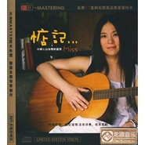

惦记
============================

|  |  |
| :--: | :-- |
| [ 惦记](https://emumo.xiami.com/album/358412) | **艺人**: [小娟&山谷里的居民](../index.md) **语种**: 国语 **唱片公司**:  **发行时间**: 2009年11月14日 **专辑类别**: 录音室专辑 **专辑风格**: 城市民谣 Urban Folk **播放数**: 1193548 **收藏数**: 588 **评论数**: 122  |

## 简介

小娟&amp;山谷里的居民：惦记  
吟唱都市，惦记爱情，没有浮华，只有感动……  
  
多年来不间断地演出，小娟&amp;山谷里的居民在创作民谣领域辛勤耕耘，积极乐观的生活态度，温暖亲切的笑容、朴素自然的装扮也为他们赢得掌声。城市中的吟唱，传递的却是山谷里的声音，宁静致远。  
 

## 曲目

## 评论

|  |  |  |
| :-- | :-- | :-- |
|  [虾米用户](https://emumo.xiami.com/u/374144955) 累了就坐下来歇歇 看看来... 2020-11-26 03:34 赞(0) 踩(0) | 
听着最舒服的一个版本 谢谢小娟
 |
|  [虾米用户](https://emumo.xiami.com/u/380141997)  2020-06-20 01:14 赞(0) 踩(0) | 
喜欢这自在的感觉
 |
|  [虾米用户](https://emumo.xiami.com/u/49560656)  2020-02-12 17:37 赞(0) 踩(0) | 
非常棒
 |
|  [虾米用户](https://emumo.xiami.com/u/323982579) 若文明消失,惟有音乐值得... 2019-04-07 00:41 赞(2) 踩(0) | 
上世纪七八十年代/台湾好歌曲 
 |
|  [虾米用户](https://emumo.xiami.com/u/23726664) 记得也好，最好你忘掉，这... 2018-03-28 23:09 赞(0) 踩(0) | 
很民谣的调调
 |
|  [虾米用户](https://emumo.xiami.com/u/1393420) 似是遥远往事，白云在天上... 2017-10-27 23:29 赞(0) 踩(0) | 
喜欢，清晰，轻快，自如，平衡，灵性。
 |
|  [虾米用户](https://emumo.xiami.com/u/4221521)  2014-08-19 12:31 赞(0) 踩(0) | 
啥都没有也叫“发布”啊
 |
|  [虾米用户](https://emumo.xiami.com/u/8441378) 喜欢白云 2014-08-16 19:46 赞(0) 踩(0) | 
审核也太慢了 ！！！
 |
|  [虾米用户](https://emumo.xiami.com/u/725716) 我还没想好要写什么... 2014-08-15 22:53 赞(0) 踩(0) | 
来晚一天就删的一首都不剩了，太凶残了！
 |
|  [虾米用户](https://emumo.xiami.com/u/11157355) 榕树长青 2014-08-13 15:39 赞(0) 踩(0) | 
喜讯
 |
|  [虾米用户](https://emumo.xiami.com/u/4777486)  2012-01-11 15:53 赞(0) 踩(0) | 
从容 淡然 放松的唱法沁人心脾！余音绕梁。。。
 |
|  [虾米用户](https://emumo.xiami.com/u/3541437)  2012-01-11 08:18 赞(0) 踩(0) | 
很美妙的声音
 |
|  [虾米用户](https://emumo.xiami.com/u/7062411)  2012-01-10 20:43 赞(0) 踩(0) | 
喜欢小娟，喜欢她的歌，惦记着一些事，惦记着一些人，温馨，快乐，有点小忧伤，纯净，清新
 |
|  [虾米用户](https://emumo.xiami.com/u/7062411)  2012-01-10 20:39 赞(0) 踩(0) | 
惦记着这一些，有一些神伤，虽没有你的梦，也有我的歌，直入人心的歌
 |
|  [虾米用户](https://emumo.xiami.com/u/7208395)  2011-12-12 10:55 赞(0) 踩(0) | 
惦记
 |
|  [虾米用户](https://emumo.xiami.com/u/2199403)  2011-12-10 12:34 赞(0) 踩(0) | 
喜欢娟子的声音
 |
|  [虾米用户](https://emumo.xiami.com/u/6230208) 我还没想好要写什么... 2011-12-09 12:58 赞(0) 踩(0) | 
轻轻的哼唱，细细缕缕的神伤
 |
|  [虾米用户](https://emumo.xiami.com/u/5542894)  2011-12-05 15:23 赞(0) 踩(0) | 
温暖
 |
|  [虾米用户](https://emumo.xiami.com/u/7106280)  2011-12-05 09:15 赞(0) 踩(0) | 
空灵，纯净，安详，美丽
 |
|  [虾米用户](https://emumo.xiami.com/u/764854)  2011-11-29 13:29 赞(0) 踩(0) | 
陶醉
 |
|  [虾米用户](https://emumo.xiami.com/u/6878395)  2011-11-28 11:38 赞(0) 踩(0) | 
亲切，就像邻家女孩在唱～
 |
|  [虾米用户](https://emumo.xiami.com/u/157879)  2011-11-26 09:50 赞(1) 踩(0) | 
平淡的生活，就是需要这样娓娓动听的歌声，纯粹。
 |
|  [虾米用户](https://emumo.xiami.com/u/6937228)  2011-11-25 11:32 赞(0) 踩(0) | 
小娟
 |
|  [虾米用户](https://emumo.xiami.com/u/6550814)  2011-11-21 09:31 赞(0) 踩(0) | 
小娟
 |
|  [虾米用户](https://emumo.xiami.com/u/6868977)  2011-11-20 00:04 赞(0) 踩(0) | 
喜欢这样的风格!!!
 |
|  [虾米用户](https://emumo.xiami.com/u/6793063)  2011-11-17 12:21 赞(0) 踩(0) | 
空灵
 |
|  [虾米用户](https://emumo.xiami.com/u/6796308)  2011-11-16 12:36 赞(0) 踩(0) | 
平和舒適的音樂
 |
|  [虾米用户](https://emumo.xiami.com/u/2403062) 存在不存在 2011-11-07 14:30 赞(0) 踩(0) | 
巴萨诺瓦风儿。
 |
|  [虾米用户](https://emumo.xiami.com/u/6448906)  2011-11-02 17:12 赞(0) 踩(0) | 
自在欢喜
 |
|  [虾米用户](https://emumo.xiami.com/u/6546258)  2011-11-01 11:26 赞(0) 踩(0) | 
很好听的歌声~支持小娟
 |
|  [虾米用户](https://emumo.xiami.com/u/559028)  2011-10-31 21:05 赞(0) 踩(0) | 
感性的人和声音
 |
|  [虾米用户](https://emumo.xiami.com/u/6141436)  2011-10-31 10:51 赞(0) 踩(0) | 
喜欢
 |
|  [虾米用户](https://emumo.xiami.com/u/64568)  2011-10-24 21:41 赞(0) 踩(0) | 
纯净，透明……喜欢！
 |
|  [虾米用户](https://emumo.xiami.com/u/2934955)  2011-10-21 22:46 赞(0) 踩(0) | 
小清新
 |
|  [虾米用户](https://emumo.xiami.com/u/6296452)  2011-10-20 11:54 赞(0) 踩(0) | 
宁静
 |
|  [虾米用户](https://emumo.xiami.com/u/6247200)  2011-10-17 13:18 赞(0) 踩(0) | 
安静
 |
|  [虾米用户](https://emumo.xiami.com/u/427368)  2011-10-13 23:50 赞(0) 踩(0) | 
宁静……
 |
|  [虾米用户](https://emumo.xiami.com/u/1589838)  2011-10-11 13:45 赞(0) 踩(0) | 
记忆里的歌，闭上眼睛仿佛回到当时。听到这些就会想亭姐，有空该给她打个电话了。
 |
|  [虾米用户](https://emumo.xiami.com/u/6195595)  2011-10-11 09:42 赞(0) 踩(0) | 
心境
 |
|  [虾米用户](https://emumo.xiami.com/u/5996749)  2011-09-29 09:04 赞(0) 踩(0) | 
hao ting!
 |
|  [虾米用户](https://emumo.xiami.com/u/2935625)  2011-09-19 21:44 赞(0) 踩(0) | 
没有浮华，只有感动……
 |
|  [虾米用户](https://emumo.xiami.com/u/1364755)  2011-09-17 11:30 赞(1) 踩(0) | 
没有浮华，只有感动
 |
|  [虾米用户](https://emumo.xiami.com/u/1965086) 上苍给了我们一具不堪的肉... 2011-09-16 14:14 赞(0) 踩(0) | 
吟唱都市，惦记爱情，没有浮华，只有感动
 |
|  [虾米用户](https://emumo.xiami.com/u/5629836) 让灵魂在音符中游荡迷醉 2011-09-12 11:57 赞(0) 踩(0) | 
悠扬如秋日那和煦的风，徐徐吹进疲惫的心田，让人平静地回忆起许多往事。。。
 |
|  [虾米用户](https://emumo.xiami.com/u/2169068)  2011-09-12 10:55 赞(0) 踩(0) | 
2011.9.12
 |
|  [虾米用户](https://emumo.xiami.com/u/2148544)  2011-09-09 11:50 赞(0) 踩(0) | 
《小娟&amp;amp;山谷里的居民：惦记》吟唱都市，惦记爱情，没有浮华，只有感动
 |
|  [虾米用户](https://emumo.xiami.com/u/5736188) 音乐，一辈子的朋友 2011-09-08 16:36 赞(0) 踩(0) | 
听小娟的歌，心里会变得纯净一点，安静一点。 这世界太浮噪了，还是听小娟的歌吧。
 |
|  [虾米用户](https://emumo.xiami.com/u/5616226)  2011-09-07 11:18 赞(0) 踩(0) | 
心灵需要休息时
 |
|  [虾米用户](https://emumo.xiami.com/u/5713309)  2011-09-05 18:09 赞(0) 踩(0) | 
收藏所有~
 |
|  [虾米用户](https://emumo.xiami.com/u/5706469)  2011-09-04 21:33 赞(0) 踩(0) | 
小娟的歌听着永远那么舒服，安静……
 |
|  [虾米用户](https://emumo.xiami.com/u/455686) 泡一杯绿茶，翻两本闲书，... 2011-08-28 23:42 赞(0) 踩(0) | 
like....................
 |
|  [虾米用户](https://emumo.xiami.com/u/3616460)  2011-08-26 16:09 赞(0) 踩(0) | 
干净
 |
|  [虾米用户](https://emumo.xiami.com/u/5553225)  2011-08-24 12:58 赞(0) 踩(0) | 
纯净质感的声音，很舒服
 |
|  [虾米用户](https://emumo.xiami.com/u/5423085)  2011-08-14 21:02 赞(0) 踩(0) | 
曾经熟悉的旋律，首首回荡在耳边，心若止水，飘如浮萍，淡淡的曲风，浓浓的回忆。
 |
|  [虾米用户](https://emumo.xiami.com/u/5157755)  2011-08-06 17:48 赞(0) 踩(0) | 
就是喜欢嘻嘻
 |
|  [虾米用户](https://emumo.xiami.com/u/5157755)  2011-08-06 17:39 赞(0) 踩(0) | 
干净简单
 |
|  [虾米用户](https://emumo.xiami.com/u/5157755)  2011-08-06 17:39 赞(0) 踩(0) | 
质朴的音乐
 |
|  [虾米用户](https://emumo.xiami.com/u/194099)  2011-08-05 10:29 赞(0) 踩(0) | 
听着就是很舒服，不加什么修饰，可以静静品位~~~~
 |
|  [虾米用户](https://emumo.xiami.com/u/5120702)  2011-08-04 10:53 赞(0) 踩(0) | 
怀旧
 |
|  [虾米用户](https://emumo.xiami.com/u/4863565) 挤出一丝力气 2011-07-20 14:55 赞(0) 踩(0) | 
感动
 |
|  [虾米用户](https://emumo.xiami.com/u/4717180)  2011-07-16 20:13 赞(0) 踩(0) | 
舒服
 |
|  [虾米用户](https://emumo.xiami.com/u/4830872)  2011-07-13 13:49 赞(0) 踩(0) | 
因为怀旧
 |
|  [虾米用户](https://emumo.xiami.com/u/4479481)  2011-06-29 13:39 赞(0) 踩(0) | 
远离浮躁   亲近自然  朴实无华  难得的精品
 |
|  [虾米用户](https://emumo.xiami.com/u/3417573)  2011-06-29 10:09 赞(0) 踩(0) | 
干净，简单
 |
|  [虾米用户](https://emumo.xiami.com/u/3907586)  2011-06-14 08:40 赞(0) 踩(0) | 
就是喜欢
 |
|  [虾米用户](https://emumo.xiami.com/u/901878)  2011-06-13 21:37 赞(0) 踩(0) | 
惦记那些忘不掉的人
 |
|  [虾米用户](https://emumo.xiami.com/u/3948849)  2011-06-09 14:13 赞(0) 踩(0) | 
惦记着这些
 |
|  [虾米用户](https://emumo.xiami.com/u/3948849)  2011-06-09 14:12 赞(0) 踩(0) | 
好听的声音啊
 |
|  [虾米用户](https://emumo.xiami.com/u/3948849)  2011-06-09 14:12 赞(0) 踩(0) | 
给爱
 |
|  [虾米用户](https://emumo.xiami.com/u/2537216)  2011-05-22 11:45 赞(0) 踩(0) | 
烦躁红尘中的一汪清泉
 |
|  [虾米用户](https://emumo.xiami.com/u/1504100)  2011-05-09 15:20 赞(0) 踩(0) | 
宁静致远的感觉！
 |
|  [虾米用户](https://emumo.xiami.com/u/18770)  2011-05-06 18:22 赞(0) 踩(0) | 
深情的声音
 |
|  [虾米用户](https://emumo.xiami.com/u/1568772)  2011-05-04 19:33 赞(0) 踩(0) | 
Very comfortable to listen
 |
|  [虾米用户](https://emumo.xiami.com/u/543958)   2011-04-25 20:42 赞(0) 踩(0) | 
受妈妈影响我也很喜欢~原来老歌也可以这么好听~
 |
|  [虾米用户](https://emumo.xiami.com/u/3648241)  2011-04-18 00:38 赞(0) 踩(0) | 
好听
 |
|  [虾米用户](https://emumo.xiami.com/u/3640399)  2011-04-17 14:18 赞(0) 踩(0) | 
喜欢她空灵的声
 |
|  [虾米用户](https://emumo.xiami.com/u/3640399)  2011-04-17 14:18 赞(0) 踩(0) | 
真好听
 |
|  [虾米用户](https://emumo.xiami.com/u/3338011)  2011-04-05 15:47 赞(0) 踩(0) | 
这种淡淡的充满温柔的回忆的感觉太美好了！
 |
|  [虾米用户](https://emumo.xiami.com/u/692725)  2011-03-26 09:48 赞(0) 踩(0) | 
小娟的都喜欢
 |
|  [虾米用户](https://emumo.xiami.com/u/664653)  2011-03-14 23:21 赞(0) 踩(0) | 
简单，好听
 |
|  [虾米用户](https://emumo.xiami.com/u/3148502)  2011-03-10 12:46 赞(0) 踩(0) | 
至爱小娟，纯纯的声
 |
|  [虾米用户](https://emumo.xiami.com/u/3032486)  2011-03-01 17:16 赞(0) 踩(0) | 
很不错
 |
|  [虾米用户](https://emumo.xiami.com/u/1195421)  2011-03-01 12:22 赞(0) 踩(0) | 
音色很美
 |
|  [虾米用户](https://emumo.xiami.com/u/1342581)  2011-02-12 17:42 赞(0) 踩(0) | 
小娟&amp;amp;山谷里的居民
 |
|  [虾米用户](https://emumo.xiami.com/u/206423)   2011-01-27 16:08 赞(0) 踩(0) | 
清新而又优美，很少听到这么好的歌曲了！希望大家和我一起欣赏。
 |
|  [虾米用户](https://emumo.xiami.com/u/1045957)  2011-01-22 14:29 赞(0) 踩(0) | 
静……或者称之为空灵
 |
|  [虾米用户](https://emumo.xiami.com/u/2504334)  2011-01-15 18:20 赞(0) 踩(0) | 
超好听
 |
|  [虾米用户](https://emumo.xiami.com/u/2498050)  2011-01-15 00:37 赞(0) 踩(0) | 
喜欢轻音乐，很舒服的感觉~！
 |
|  [虾米用户](https://emumo.xiami.com/u/2493366)  2011-01-14 21:58 赞(0) 踩(0) | 
赴诚推介无损高品质音乐<a href="http://www.xiami.com/member/register?t=2493366_12950115463479" target="_blank" rel="nofollow noreferrer noopener">http://www.xiami.com/member/register?t=2493366_12950115463479</a>
 |
|  [虾米用户](https://emumo.xiami.com/u/964668)  2010-11-29 17:10 赞(0) 踩(0) | 
有小野丽莎的味道
 |
|  [虾米用户](https://emumo.xiami.com/u/102604) 自己是一切问题的答案 2010-11-15 01:05 赞(0) 踩(0) | 
这张CD似乎是其它四张的选集。
 |
|  [虾米用户](https://emumo.xiami.com/u/1551574)  2010-09-24 12:11 赞(0) 踩(0) | 
纯的，自然，好听！
 |
|  [虾米用户](https://emumo.xiami.com/u/274756)  2010-09-15 18:40 赞(0) 踩(0) | 
好听！
 |
|  [虾米用户](https://emumo.xiami.com/u/1392505)  2010-08-30 23:22 赞(0) 踩(0) | 
觉得他们唱英文更清新脱俗
 |
|  [虾米用户](https://emumo.xiami.com/u/152236)  2010-08-06 14:12 赞(0) 踩(0) | 
为嘛看不见我的评论？
 |
|  [虾米用户](https://emumo.xiami.com/u/96281)  2010-07-17 11:00 赞(0) 踩(0) | 
沁人心田的声音
 |
|  [虾米用户](https://emumo.xiami.com/u/519241)  2010-07-17 10:15 赞(0) 踩(0) | 
空灵的歌声，让我们安静下来。这个世界浮躁的东西太多了，而你的歌声让我们还可以看到一点纯粹的光芒。
 |
|  [虾米用户](https://emumo.xiami.com/u/874982)  2010-06-23 10:27 赞(0) 踩(0) | 
百听不厌的声音。很纯粹。
 |
|  [虾米用户](https://emumo.xiami.com/u/334192) 虾米也能实时聊呀！ 2010-06-21 10:15 赞(0) 踩(0) | 
说实话,翻唱得不好,除了一把好嗓音.建议坚持原创
 |
|  [虾米用户](https://emumo.xiami.com/u/933211)  2010-05-28 01:10 赞(0) 踩(0) | 
有种跨越时空的错觉
 |
|  [虾米用户](https://emumo.xiami.com/u/505665)  2010-05-20 08:53 赞(0) 踩(0) | 
听着这些歌，仿佛又回到过去！这才发现自己原来也是恋旧的人！
 |
|  [虾米用户](https://emumo.xiami.com/u/162903)  2010-01-31 22:57 赞(0) 踩(0) | 
是那两张翻唱合集的精选
 |
|  [虾米用户](https://emumo.xiami.com/u/547831)  2010-01-27 23:16 赞(0) 踩(0) | 
王菲之后又一天籁 比王菲多了些柔和 天然 莫名就爱在这里了
 |
| ⇒ |  [虾米用户](https://emumo.xiami.com/u/299346)  2010-06-04 23:09 赞(0) 踩(0) | 
和王菲对比，真的是很有意思。 都是喜欢的。 这种纯朴亲和力好强`
 |
| ⇒ |  [虾米用户](https://emumo.xiami.com/u/547831)  2010-06-05 21:16 赞(0) 踩(0) | 
<q><b>露薇姑娘说：</b></q>
 |
|  [虾米用户](https://emumo.xiami.com/u/456860) 自己耕耘，自己收获 2010-01-10 20:02 赞(0) 踩(0) | 
虽然是翻唱的，无关技巧，小娟柔柔的声音演绎出来，觉得很好听，特别适合晚上听
 |
|  [虾米用户](https://emumo.xiami.com/u/433205)  2009-12-25 15:03 赞(0) 踩(0) | 
应该是一张拼盘吧。  红布绿花朵很优秀。
 |
|  [虾米用户](https://emumo.xiami.com/u/553857)  2009-12-22 17:53 赞(0) 踩(0) | 
～沁人心脾，醉人的女声～
 |
|  [虾米用户](https://emumo.xiami.com/u/581692)  2009-12-18 17:47 赞(0) 踩(0) | 
好牛逼的声音。
 |
|  [虾米用户](https://emumo.xiami.com/u/458144)  2009-12-16 13:08 赞(0) 踩(0) | 
她的声音好甜好美的感觉 一种很恬静的感觉
 |
|  [虾米用户](https://emumo.xiami.com/u/458144)  2009-12-16 13:07 赞(0) 踩(0) | 
下载了 很好听
 |
|  [虾米用户](https://emumo.xiami.com/u/510905)  2009-12-15 14:21 赞(0) 踩(0) | 
还以为是新专辑……吓了一跳
 |
|  [虾米用户](https://emumo.xiami.com/u/333188) 我还没想好要写什么... 2009-12-15 12:05 赞(0) 踩(0) | 
我整张下载了。准备放酒吧里听……
 |
| ⇒ |  [虾米用户](https://emumo.xiami.com/u/547831)  2010-01-27 23:18 赞(0) 踩(0) | 
放什么酒吧里听啊 会不会有点怪怪的啊 如此纯净的声音
 |
| ⇒ |  [虾米用户](https://emumo.xiami.com/u/333188) 我还没想好要写什么... 2010-01-28 13:52 赞(0) 踩(0) | 
<q><b>gstone7说：</b></q>
 |
|  [虾米用户](https://emumo.xiami.com/u/333188) 我还没想好要写什么... 2009-12-15 11:58 赞(0) 踩(0) | 
我整张下载了。准备放酒吧里听……
 |
|  [虾米用户](https://emumo.xiami.com/u/361971)  2009-12-14 21:51 赞(0) 踩(0) | 
如果是翻唱的，那就没什么太大的意思了，因为原唱似乎更好。
 |
|  [虾米用户](https://emumo.xiami.com/u/11353)  2009-12-14 17:40 赞(0) 踩(0) | 
是翻唱那两张的合集吗？
 |
| ⇒ |  [虾米用户](https://emumo.xiami.com/u/446196)  2009-12-14 18:08 赞(0) 踩(0) | 
和我以前听到的似乎都是一样的，我糊涂了。
 |
| ⇒ |  [虾米用户](https://emumo.xiami.com/u/11353)  2009-12-14 18:20 赞(0) 踩(0) | 
<q><b>穿西装的蚊子说：</b></q>
 |
| ⇒ |  [虾米用户](https://emumo.xiami.com/u/446196)  2009-12-14 18:29 赞(0) 踩(0) | 
<q><b>老七同学说：</b></q>
 |
|  [虾米用户](https://emumo.xiami.com/u/11353)  2009-12-14 17:40 赞(0) 踩(0) | 
是翻唱那两张的合集吗？
 |
