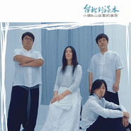

台北到淡水
============================

|  |  |
| :--: | :-- |
| [ 台北到淡水](https://emumo.xiami.com/album/379798) | **艺人**: [小娟&山谷里的居民](../index.md) **语种**: 国语 **唱片公司**: 龙源音乐 **发行时间**: 2010年05月05日 **专辑类别**: 录音室专辑 **专辑风格**: 城市民谣 Urban Folk **播放数**: 2532146 **收藏数**: 3618 **评论数**: 196  |

## 简介

<strong>答案不在风中，答案就在歌里  
</strong>——小娟&amp;山谷里的居民推出第四张作品辑《台北到淡水》  
  
2009年9月19日，天气晴。  
台北到淡水，动物园录音室，1977年夏天的蝉，鸣唱依旧。  
在经历过一场大火的动物园，伴着蝉鸣，用仅存的录音设备，我们开始这次逆流而上的旅行。  
  
北京的春天比以往来得晚，在春天的尾声，小娟&amp;山谷里的居民推出第四张作品辑《台北到淡水》。这是一张台湾民歌的回顾唱片，去年秋天开始在台湾录音，直到今年除夕在北京完成所有录音工作，经历三个月的后期制作，呈现出完整的唱片概念与多样音乐风格。  
  
1970年代的台湾，年轻知识分子与大学生展开一场“写自己的歌，唱自己的歌”运动，亦称为“台湾现代民歌”或“台湾民歌”，它改变了华语流行音乐的走向，影响长达二十年。1975年6月6日，“台湾现代民歌之父”杨弦与好友胡德夫、赖声川在台北中山堂举办“现代民谣创作演唱会”，被视为台湾民歌的发轫。时隔35年，小娟&amp;山谷里的居民在二百多首经典的台湾民歌中，选取15首作品重新编曲、制作，以此纪念前辈们的风光与慨叹。《台北到淡水》也是乐队成为四人阵容之后的第一张作品辑，首度收录每位成员的演唱，创作能力与歌唱态度，就是民歌及民谣的意义。  
  
<strong>水源街二段8号的蝉鸣  
  
</strong>台湾民歌的重要人物李双泽，1977年在淡水兴化店游泳救人去世，年仅28岁。多年之后，他的故居成为动物园录音室。  
  
1977年，动物园的蝉鸣出现在李双泽纪念卡带中，曾获第20届台湾金曲奖“特别贡献奖”的《敬！李双泽  唱自己的歌》即是以单纯收录蝉鸣的《动物园1977》为开端。  
  
“天上的星星，为何，像人群一般的拥挤呢？地上的人们，为何，又像星星一样的疏远？”伴随2009年采样的淡水动物园蝉鸣，几句清唱的《答案》拉开《台北到淡水》的序幕，就像唱片内页的那句话——答案不在风中，答案清清楚楚就在歌里。  
  
<strong>挥之不去的回旋曲  
  
</strong>2007年，杨弦在北京举办首唱会，小娟&amp;山谷里的居民担任特邀嘉宾，现场演唱小娟谱自顾城诗作的《小村庄》。在台湾民歌的发展中，诗与歌的结合是非常多见的形式，杨弦的《民歌手》、《乡愁四韵》、《回旋曲》，李双泽的《美丽岛》、《少年中国》、《心曲》，胡德夫的《匆匆》，李泰祥的《答案》……诗给予民歌无尽的养分，杨弦的第一张作品《中国现代民歌集》即全部以诗人余光中的诗作为词，第二张作品《西出阳关》也收录相当比例的现代诗。因此渊源，《台北到淡水》中不仅以清唱的《答案》开头，以吟唱的《心曲》结尾，更收录杨弦的代表作品《回旋曲》，仅一把吉他的编曲，简单却意境深远。  
  
“中国人为什么不唱自己的歌”，在淡江事件中，李双泽如此发问，并引用作家黄春明的观点“在我们还没有能力写出自己的歌之前，应该一直唱前人的歌，唱到我们能够写出自己的歌来为止。”  
  
在李双泽的鼓励之下，胡德夫在哥伦比亚咖啡馆唱起卑南母语的《美丽的稻穗》，现场所有人都停下正在做的事，安静聆听。杨弦在《西出阳关》中收录《美丽的稻穗》，那是台湾民歌中最早的录音版本。即使是听胡德夫的唱片《匆匆》，因为胡老师的发音与自由拍，这首歌也很难学唱。小娟找到了台湾版《美丽的稻穗》曲谱，仍是对发音不太有把握。机缘巧合，2009年，陈建年在北京公开演唱这首歌，小娟根据现场录音学习卑南语的发音，更有意义的是，《美丽的稻穗》词曲作者陆森宝先生是陈建年的外公，陈建年本人也是受台湾民歌的影响开始个人创作。  
  
小娟&amp;山谷里的居民把《美丽的稻穗》改编成打击乐与人声的简单配置，收录唱片中的是某次演出的现场版，以特别收录呈现。打击乐与人声的编曲，最早想用在《恰似你的温柔》，且恢复这首歌原本快三倍的速度，最后考虑到如此改编这首耳熟能详的作品会影响原本的流传，大家决定不收录这首歌，纪念远去的梁弘志，还有其他的方法。  
  
<strong>每首歌背后都有不止一个故事  
  
</strong>《台北到淡水》收录了几位民歌手的第一首创作，包括马兆骏、洪光达的《微风往事》、邱晨的《小茉莉》、苏来的《微光中的歌吟》。苏来的这首作品，乐队在编曲中用到架子鼓、高音萨克斯与低音大提琴。  
  
无论怎样编曲，山谷里的居民与民歌相合的本质却不会不一样，轻松或深情，都可以表现到极致。像三个男生演唱的《阿美阿美》，是一种很怀旧的迪曲的感觉，缘于在台湾参加921地震十周年的公益演出，荒井与小强两人突发奇想，决定了这首歌的方向；赖西安填词的《庙会》，中间出现一段《知道不知道》的吉他和弦，也属无意的创作；《一窗清响》则采用钢琴与人声的同期录音，晓光功不可没；《我的思念》完成乐器部分的录音，大家听了很久，爱得不行，甚至想到有没有可能把乐曲单独收录其中；最出跳的是《雨中的故事》，一唱一答，小强用到自己仅会的粤语“咩呀”，结尾收录的打击乐器落地的声音是特别的设计，但那句意外的“不会吧，乱七八糟的”则让乐队成员很纠结，思考良久，决定呈现出来，成为这首歌现在的样子；《如果》的速度是不常见的101，这是乐队成员的童心，因为一直没有时间去参观台北最高建筑物101大楼……每首歌背后都有不止一个故事，每个故事背后都有不止一种心情。  
  
很多民歌手都与小娟&amp;山谷里的居民有缘分，杨弦、胡德夫、吴楚楚、苏来、李建复、许景淳、殷正洋……某次排练，苏来在一旁观看，感慨说：“这是一个团队的感觉，而不是歌手与她的乐手的感觉，做音乐的人，怎会不羡慕呢？”在台湾演出，许景淳也开心地与山谷里的居民相处，很想自己也可以有这样一个乐队，大家能像一家人一样。民歌推手陶晓清在几年前就希望把山谷里的声音介绍到台湾，终于在2009年成行，也成为《台北到淡水》这张唱片的起点。  
  
<strong>一直在路上，只因有歌要唱  
  
</strong>《台北到淡水》唱片内页的每一张照片，都来自于山谷里的居民自己在路上的拍摄留念，从台北到南投的大巴车、台东海边、等待出发时的路边、台北到淡水的捷运车站、淡江大学的路标、动物园录音室、北京大藏录音室——或许这些普通的照片不能称为摄影作品，对于乐队来说，却是非同一般的纪念。  
  
从选曲、编曲、录音、制作、摄影、平面设计，山谷里的居民独立自主完成了所有工作环节。虽然是翻唱台湾民歌，却也是乐队的全新创作，《谁在那边唱自己的歌》作者、来自台湾的纪录片导演张钊维说：“咱们都在路上，更需要分享彼此的风景。”  
  
2010年6月6日，35年前杨弦举办“现代民谣创作演唱会”的这一天，小娟&amp;山谷里的居民将举办“台北到淡水”民谣剧场，直到6月8日，共举办三场，以小剧场音乐现场及多媒体制作的概念，纪念台湾民歌及其后续篇章——我们，随时都可以认真地、大声地歌唱。  
  
台湾民歌三十五年追溯，北京民谣乐队回首重逢，大陆、台湾两地录音。 为了不能忘却的音乐理想年代，为了年轻时花开只一次的声音。  
  
有关台湾民歌：  
1974年，24 岁的胡德夫在台北举办《美丽的稻穗》演唱会，24岁的杨弦首次公开发表谱自余光中诗作的《乡愁四韵》；  
1975年，杨弦、胡德夫、赖声川在台北举办《现代民谣创作演唱会》，此年被视为台湾民歌元年；  
1976年，李双泽在“淡江事件”发问“中国人为什么不唱中国人自己的歌”，随后开始个人音乐创作；  
1977年，李双泽在淡水游泳，因救人去世，年仅28岁。多年之后，他的故居成为动物园录音室；  
1977年，第一届金韵奖比赛，报名者逾千，其中70%是大专院校的学生。参加金韵奖比赛、创作、唱片录制的名字包括李泰祥、李寿全、李宗盛、侯德健、邱晨、马兆骏、陈秀男、李子恒、齐豫、郑怡、王新莲、邰肇玫、施碧梧、包美圣、王梦麟、李建复、施孝荣、黄大城、黄韵玲、许景淳、郑华娟、童安格、殷正洋……  
1978年，第一届民谣风比赛，齐豫成为当年度金韵奖与民谣风的双冠军，民谣风汇集了梁弘志、叶佳修、苏来、蔡琴、潘安邦、李碧华、李丽芬、陈淑桦……  
因这些年轻人的觉醒与热情，写自己的歌，唱自己的歌，发出回荡在青春岁月的自由声响。  
台湾民歌改变了华语流行音乐的走向，创造一段不可磨灭、不可复制的历史，最重要的后续篇章，是影响年轻人的创作能力与歌唱态度——我们，随时都可以认真地、大声地歌唱。

## 曲目

## 评论

|  |  |  |
| :-- | :-- | :-- |
|  [虾米用户](https://emumo.xiami.com/u/276944698) 不要自我设限..... 2020-08-15 20:34 赞(1) 踩(0) | 
❇️❇️❇️
 |
|  [虾米用户](https://emumo.xiami.com/u/259338519)  2020-08-12 10:53 赞(0) 踩(0) | 
很舒服了，爱小茉莉
 |
|  [虾米用户](https://emumo.xiami.com/u/440895283)  2020-07-25 13:06 赞(0) 踩(0) | 
好听
 |
|  [虾米用户](https://emumo.xiami.com/u/64395552)   2019-12-27 17:58 赞(0) 踩(0) | 
真是好听，开场的清唱，醉了
 |
|  [虾米用户](https://emumo.xiami.com/u/64395552)   2019-06-09 21:49 赞(0) 踩(0) | 
真是好听，那个慢哪，慢的恰到好处，慢到如慢品一杯好茶的速度，所有的感觉全被慢速化开了
 |
|  [虾米用户](https://emumo.xiami.com/u/54959843) 未必爱我所听~ 2019-04-25 11:54 赞(0) 踩(0) | 
不是100%满意，但部分歌曲1000%的满意，两者中和，10分还不够呢
 |
|  [虾米用户](https://emumo.xiami.com/u/44234661) 我还没想好要写什么... 2019-04-22 17:37 赞(0) 踩(0) | 
对音乐有自己的见解和表达才是有态度的音乐不是吗？舒缓的民谣叙事方式很动人心扉。
 |
|  [虾米用户](https://emumo.xiami.com/u/9299072)  2018-12-22 09:11 赞(0) 踩(0) | 
选不出几首好听的。
 |
|  [虾米用户](https://emumo.xiami.com/u/3912646)  2018-04-30 13:51 赞(0) 踩(0) | 
没法购买
 |
|  [虾米用户](https://emumo.xiami.com/u/2099929)  2017-12-18 13:04 赞(0) 踩(0) | 
“乡间小路”，被它深深的打动了，作为当年经典的一首老歌，还能用这样的一种方式来诠释，这就是小娟！张明敏演唱这首歌时好象牧童就在身边一样表达得比较阳光。直白。而这首歌里的小娟则是在回忆温暖的童年时多了一丝淡淡的忧伤，是在追忆逝去的童年？还是消失的青春？当我们这二者都已经经历过并回首看看曾经的自己，对人生又有怎样的感悟？。小路依在，人面已非，也许，回荡在空旷的青山绿水当中的一支牧童的歌声能带给你答案
 |
|  [虾米用户](https://emumo.xiami.com/u/2680297)  2017-10-30 10:01 赞(0) 踩(0) | 
任何的躁动，一听到小娟的声音，就平息下来了
 |
|  [虾米用户](https://emumo.xiami.com/u/195906) 我还没想好要写什么... 2017-10-28 00:06 赞(2) 踩(0) | 
说点不同意见（个见胡喷）。 感觉她们唱什么歌都是一个味道，（甚至都是一个调） 原歌词中的语言韵律（平仄关系给故弄玄虚的，嗲嗲的做掉了！） 台湾早期的一些经典民歌，歌词的平仄关系和曲调是非常讲究的！
 |
|  [虾米用户](https://emumo.xiami.com/u/6183516) 时间无法倒流，音乐可以重... 2017-05-13 12:31 赞(1) 踩(0) | 
毁了好歌！
 |
|  [虾米用户](https://emumo.xiami.com/u/2022341) 懶似精靈。。。。 2016-10-26 10:25 赞(1) 踩(0) | 
小娟台灣民歌翻唱集
 |
|  [虾米用户](https://emumo.xiami.com/u/49520952) 我还没想好要写什么... 2016-05-12 16:03 赞(0) 踩(0) | 
经典作品，收藏
 |
|  [虾米用户](https://emumo.xiami.com/u/862260) 何以解憂惟有吟嘯 2016-02-24 18:26 赞(1) 踩(0) | 
这样的嗓音，实在是太小清新鸟。。。
 |
|  [虾米用户](https://emumo.xiami.com/u/2229890)  2016-02-17 09:56 赞(1) 踩(0) | 
干净，安静
 |
|  [虾米用户](https://emumo.xiami.com/u/13179130)  2015-12-18 22:04 赞(0) 踩(0) | 
小娟，小娟，小娟
 |
|  [虾米用户](https://emumo.xiami.com/u/66953) 上善若水 2015-11-20 16:29 赞(0) 踩(0) | 
好美的声音！
 |
|  [虾米用户](https://emumo.xiami.com/u/7289378)  2015-10-12 16:08 赞(1) 踩(0) | 
大部分是翻唱？入耳感觉不如红布绿花朵
 |
|  [虾米用户](https://emumo.xiami.com/u/3502219) 爷做事，一为名，二为利，... 2015-06-30 16:44 赞(1) 踩(0) | 
舒服，平缓
 |
|  [虾米用户](https://emumo.xiami.com/u/16601646) 暂无签名~ 2015-05-26 00:23 赞(3) 踩(0) | 
微风往事，跟原唱差十万八千里
 |
| ⇒ |  [虾米用户](https://emumo.xiami.com/u/862260) 何以解憂惟有吟嘯 2016-02-24 17:49 赞(0) 踩(0) | 
该组合基本上跟原唱都差着十万八千里。。。
 |
|  [虾米用户](https://emumo.xiami.com/u/6227075)  2015-05-11 20:21 赞(0) 踩(0) | 
很欣赏。
 |
|  [虾米用户](https://emumo.xiami.com/u/11099567) 音乐伴我一生！ 2015-05-02 02:59 赞(0) 踩(0) | 
茉莉没睡着，我倒听睡着了…当催眠曲听吧 
 |
|  [虾米用户](https://emumo.xiami.com/u/27244323) 随缘自适 2015-04-10 08:49 赞(1) 踩(0) | 
文艺清新。不浮躁，淡淡的。
 |
|  [虾米用户](https://emumo.xiami.com/u/45632936)  2015-03-30 14:58 赞(1) 踩(0) | 
我是她的歌迷！
 |
|  [虾米用户](https://emumo.xiami.com/u/10428898)   2015-03-27 10:18 赞(1) 踩(0) | 
回忆的最佳途径
 |
|  [虾米用户](https://emumo.xiami.com/u/18411535) 暂无签名~ 2014-12-23 09:57 赞(0) 踩(0) | 
好声音
 |
|  [虾米用户](https://emumo.xiami.com/u/39312188) 一十一 2014-12-18 15:48 赞(0) 踩(0) | 
tttt
 |
|  [虾米用户](https://emumo.xiami.com/u/37070544) 一直走一直走 2014-11-26 22:10 赞(3) 踩(0) | 
够难听的
 |
|  [虾米用户](https://emumo.xiami.com/u/8673267)  2014-11-07 16:56 赞(1) 踩(0) | 
简单!
 |
|  [虾米用户](https://emumo.xiami.com/u/948453)  2014-10-26 08:31 赞(0) 踩(0) | 
在早晨的迷雾中倾听
 |
|  [虾米用户](https://emumo.xiami.com/u/4720967)  2014-10-07 22:01 赞(0) 踩(0) | 
让自己在这个国庆慢下来的音乐
 |
|  [虾米用户](https://emumo.xiami.com/u/41943128)  2014-10-03 16:27 赞(0) 踩(0) | 
好听校园民歌
 |
|  [虾米用户](https://emumo.xiami.com/u/7089912)  2014-08-31 19:55 赞(0) 踩(0) | 
特别喜欢这张专辑，台湾民谣
 |
|  [虾米用户](https://emumo.xiami.com/u/8683424)  2014-08-29 01:07 赞(0) 踩(0) | 
音色好
 |
|  [虾米用户](https://emumo.xiami.com/u/2104605) 曲中意常非我之意，旋律只... 2014-08-23 18:33 赞(0) 踩(0) | 
赞，又可以试听了
 |
|  [虾米用户](https://emumo.xiami.com/u/25171524) 一个人也要生活的漂亮 2014-08-23 16:29 赞(0) 踩(0) | 
第一次听到这么好的.........
 |
|  [虾米用户](https://emumo.xiami.com/u/1844) 农夫 山泉 有点田 2014-08-22 21:01 赞(1) 踩(0) | 
演绎得不咸不淡
 |
|  [虾米用户](https://emumo.xiami.com/u/38213902)   2014-08-21 19:43 赞(0) 踩(0) | 
收藏
 |
|  [虾米用户](https://emumo.xiami.com/u/11157355) 榕树长青 2014-08-13 15:39 赞(0) 踩(0) | 
喜讯
 |
|  [虾米用户](https://emumo.xiami.com/u/3837627)   2012-01-11 20:40 赞(0) 踩(0) | 
刚刚去过台北到淡水 同事强力推荐，听听
 |
|  [虾米用户](https://emumo.xiami.com/u/7605245)  2012-01-09 21:27 赞(0) 踩(0) | 
好听
 |
|  [虾米用户](https://emumo.xiami.com/u/7545430)  2012-01-05 23:09 赞(0) 踩(0) | 
喜欢这个声音
 |
|  [虾米用户](https://emumo.xiami.com/u/2906798)  2012-01-03 14:48 赞(0) 踩(0) | 
悠悠干净的音乐让人听了舒服
 |
|  [虾米用户](https://emumo.xiami.com/u/3247728) 呆到深处自然萌 2012-01-02 13:57 赞(0) 踩(0) | 
喜欢
 |
|  [虾米用户](https://emumo.xiami.com/u/391186)  2012-01-01 11:19 赞(1) 踩(0) | 
用心去听的歌
 |
|  [虾米用户](https://emumo.xiami.com/u/2956694)  2011-12-25 22:29 赞(1) 踩(0) | 
今晚在南京，大爱
 |
|  [虾米用户](https://emumo.xiami.com/u/1986139)  2011-12-17 10:03 赞(0) 踩(0) | 
喜欢
 |
|  [虾米用户](https://emumo.xiami.com/u/1453136) hi, there 2011-11-30 00:50 赞(0) 踩(0) | 
大爱这张
 |
|  [虾米用户](https://emumo.xiami.com/u/5975971)  2011-11-27 15:20 赞(0) 踩(0) | 
好有個性和特色的歌手， 尤其系這專輯， 有孟庭葦《純真年代》，齊豫《有沒有這種說法》的味道。
 |
|  [虾米用户](https://emumo.xiami.com/u/6272583)  2011-11-22 16:36 赞(0) 踩(0) | 
记忆中的歌，如雨后山谷般的空灵
 |
|  [虾米用户](https://emumo.xiami.com/u/6253617)  2011-11-21 21:08 赞(0) 踩(0) | 
像一股山涧的清泉
 |
|  [虾米用户](https://emumo.xiami.com/u/6044852)  2011-11-20 20:02 赞(0) 踩(0) | 
好
 |
|  [虾米用户](https://emumo.xiami.com/u/6060527)  2011-11-19 15:26 赞(0) 踩(0) | 
清淡，很清淡
 |
|  [虾米用户](https://emumo.xiami.com/u/6781412) 李龍飛 2011-11-14 21:28 赞(0) 踩(0) | 
喜欢
 |
|  [虾米用户](https://emumo.xiami.com/u/3505030)  2011-11-08 17:52 赞(0) 踩(0) | 
像阵清风，吹进梦里。
 |
|  [虾米用户](https://emumo.xiami.com/u/853659)  2011-11-06 16:23 赞(0) 踩(0) | 
淡淡的。。淡淡的。，
 |
|  [虾米用户](https://emumo.xiami.com/u/853659)  2011-11-06 16:22 赞(0) 踩(0) | 
淡淡的。。淡淡的。，
 |
|  [虾米用户](https://emumo.xiami.com/u/853659)  2011-11-06 16:22 赞(0) 踩(0) | 
淡淡的。。淡淡的。，
 |
|  [虾米用户](https://emumo.xiami.com/u/6301425)  2011-10-18 22:21 赞(0) 踩(0) | 
淡淡地感动
 |
|  [虾米用户](https://emumo.xiami.com/u/1818267)  2011-10-17 10:30 赞(0) 踩(0) | 
就是喜欢 没原因
 |
|  [虾米用户](https://emumo.xiami.com/u/3389673) 音乐爱好的人 2011-10-14 09:23 赞(0) 踩(0) | 
清淡 人声
 |
|  [虾米用户](https://emumo.xiami.com/u/6223820)  2011-10-13 11:19 赞(0) 踩(0) | 
听并感悟脑海里的一切
 |
|  [虾米用户](https://emumo.xiami.com/u/6129691)  2011-10-06 17:21 赞(0) 踩(0) | 
清而不淡
 |
|  [虾米用户](https://emumo.xiami.com/u/4751933)  2011-10-05 16:52 赞(0) 踩(0) | 
安静的夜
 |
|  [虾米用户](https://emumo.xiami.com/u/6086213)  2011-10-04 23:12 赞(0) 踩(0) | 
喜欢她的声音以及人
 |
|  [虾米用户](https://emumo.xiami.com/u/1822359)  2011-10-04 16:38 赞(0) 踩(0) | 
Just beautiful
 |
|  [虾米用户](https://emumo.xiami.com/u/5996749)  2011-09-29 09:11 赞(0) 踩(0) | 
hao ting!
 |
|  [虾米用户](https://emumo.xiami.com/u/1968117)  2011-09-27 15:32 赞(0) 踩(0) | 
哎呦！！！出专辑怎么不告诉我呀
 |
|  [虾米用户](https://emumo.xiami.com/u/1968117)  2011-09-27 15:18 赞(0) 踩(0) | 
@XlisaX 内天忘了给你这个了
 |
|  [虾米用户](https://emumo.xiami.com/u/1364755)  2011-09-17 11:32 赞(0) 踩(0) | 
都随风都随风都随风
 |
|  [虾米用户](https://emumo.xiami.com/u/5719107)  2011-09-05 22:09 赞(0) 踩(0) | 
天籁的声音
 |
|  [虾米用户](https://emumo.xiami.com/u/5713309)  2011-09-05 18:10 赞(0) 踩(0) | 
如清风拂面
 |
|  [虾米用户](https://emumo.xiami.com/u/5666546)  2011-09-04 18:44 赞(0) 踩(0) | 
我给95分， 只扣了其中男主因来自台湾的口音
 |
|  [虾米用户](https://emumo.xiami.com/u/5666546)  2011-09-04 18:38 赞(0) 踩(0) | 
清纯+感动
 |
|  [虾米用户](https://emumo.xiami.com/u/2623934)  2011-08-27 13:57 赞(0) 踩(0) | 
柔软、温暖、沁人心脾……
 |
|  [虾米用户](https://emumo.xiami.com/u/5573460)  2011-08-26 10:09 赞(0) 踩(0) | 
恬静
 |
|  [虾米用户](https://emumo.xiami.com/u/5578404)  2011-08-26 10:07 赞(0) 踩(0) | 
从来没听过这么美的声音
 |
|  [虾米用户](https://emumo.xiami.com/u/5573460)  2011-08-26 08:34 赞(0) 踩(0) | 
声音甜静
 |
|  [虾米用户](https://emumo.xiami.com/u/5552847)  2011-08-24 13:24 赞(0) 踩(0) | 
好听
 |
|  [虾米用户](https://emumo.xiami.com/u/5509284)  2011-08-21 08:52 赞(0) 踩(0) | 
很简单的配器，很浓的味道
 |
|  [虾米用户](https://emumo.xiami.com/u/1504165)  2011-07-24 00:20 赞(0) 踩(0) | 
好
 |
|  [虾米用户](https://emumo.xiami.com/u/4863565) 挤出一丝力气 2011-07-20 15:00 赞(0) 踩(0) | 
我们相识于哪里？
 |
|  [虾米用户](https://emumo.xiami.com/u/4859223)  2011-07-15 21:37 赞(0) 踩(0) | 
老民谣带回来些老东西，隐隐得凸显也未分明。
 |
|  [虾米用户](https://emumo.xiami.com/u/4480228)  2011-07-15 12:57 赞(0) 踩(0) | 
每天中午陪我睡觉的声音
 |
|  [虾米用户](https://emumo.xiami.com/u/4778562)  2011-07-15 11:57 赞(0) 踩(0) | 
把我滴思念向白云片片~~~一千遍~~一万遍~~
 |
|  [虾米用户](https://emumo.xiami.com/u/4480228)  2011-07-14 13:07 赞(0) 踩(0) | 
最适合在夏天听，好舒畅
 |
| ⇒ |  [虾米用户](https://emumo.xiami.com/u/4778562)  2011-07-15 11:59 赞(0) 踩(0) | 
~~~
 |
|  [虾米用户](https://emumo.xiami.com/u/2851931)  2011-07-12 14:32 赞(0) 踩(0) | 
喜欢那随性的旋律与声音
 |
|  [虾米用户](https://emumo.xiami.com/u/980644)  2011-07-09 19:16 赞(0) 踩(0) | 
怀旧
 |
|  [虾米用户](https://emumo.xiami.com/u/3253908)  2011-07-07 18:06 赞(0) 踩(0) | 
纯净的风
 |
|  [虾米用户](https://emumo.xiami.com/u/1640437)  2011-07-07 10:08 赞(0) 踩(0) | 
发觉在这个流火的七月，最适合听的就是小娟的歌，空灵，清雅，仿若月光在微风的湖面上静静流淌，安抚着城市燥热的情绪，让我们的心情慢慢沉淀下来，一起随旋律轻舞...
 |
|  [虾米用户](https://emumo.xiami.com/u/36549)   2011-07-01 23:42 赞(0) 踩(0) | 
独具特色，绕梁三日！
 |
|  [虾米用户](https://emumo.xiami.com/u/4496388)  2011-06-30 14:03 赞(0) 踩(0) | 
台北到淡水~  又想去走一趟了...好想旅行......
 |
|  [虾米用户](https://emumo.xiami.com/u/4496388)  2011-06-30 13:59 赞(0) 踩(0) | 
聽著聽著~彷彿回到了校園民歌時期~~
 |
|  [虾米用户](https://emumo.xiami.com/u/630760) 感谢11年来的陪伴，我爱... 2011-06-25 22:03 赞(0) 踩(0) | 
一直喜欢小娟
 |
|  [虾米用户](https://emumo.xiami.com/u/3948849)  2011-06-09 14:08 赞(0) 踩(0) | 
喜欢里面的吉他配乐
 |
|  [虾米用户](https://emumo.xiami.com/u/3948849)  2011-06-09 14:07 赞(0) 踩(0) | 
好听啊
 |
|  [虾米用户](https://emumo.xiami.com/u/2241417) 秉虚为鉴，观繁以简。 2011-06-03 23:21 赞(0) 踩(0) | 
淡水淡水
 |
|  [虾米用户](https://emumo.xiami.com/u/3781522)  2011-06-03 19:46 赞(0) 踩(0) | 
自然，纯净。
 |
|  [虾米用户](https://emumo.xiami.com/u/2758145)  2011-05-23 07:40 赞(0) 踩(0) | 
太棒了
 |
|  [虾米用户](https://emumo.xiami.com/u/468716)  2011-05-18 09:27 赞(0) 踩(0) | 
很浪漫~
 |
|  [虾米用户](https://emumo.xiami.com/u/246069)  2011-05-16 14:05 赞(0) 踩(0) | 
爱小娟 没话说。任何时候听到都能迅速安静下来
 |
|  [虾米用户](https://emumo.xiami.com/u/3937608)  2011-05-15 19:07 赞(0) 踩(0) | 
美妙
 |
|  [虾米用户](https://emumo.xiami.com/u/1458419)  2011-05-13 11:06 赞(0) 踩(0) | 
淡。
 |
|  [虾米用户](https://emumo.xiami.com/u/3612738)  2011-04-19 00:54 赞(0) 踩(0) | 
现场实在是太美好了。
 |
|  [虾米用户](https://emumo.xiami.com/u/3612738)  2011-04-19 00:53 赞(0) 踩(0) | 
现场的美好。
 |
|  [虾米用户](https://emumo.xiami.com/u/3612679)  2011-04-18 12:09 赞(0) 踩(0) | 
4月9日到广州？ 错过了... 遗憾啊...  纯净的歌声，抚平浮燥的心灵....
 |
|  [虾米用户](https://emumo.xiami.com/u/3473936)  2011-04-16 17:00 赞(0) 踩(0) | 
纯净，听到就想到山涧清清的泉水和细细的流水声，感觉很好。
 |
|  [虾米用户](https://emumo.xiami.com/u/3379416)  2011-04-12 23:53 赞(0) 踩(0) | 
轻、净、宁
 |
|  [虾米用户](https://emumo.xiami.com/u/3379416)  2011-04-12 23:52 赞(0) 踩(0) | 
4月9日在广州的那场，我也去了。很美，也很享受，感觉都醉了、化了。净化的感觉。
 |
|  [虾米用户](https://emumo.xiami.com/u/3289337)  2011-04-10 23:46 赞(0) 踩(0) | 
妙不可言
 |
|  [虾米用户](https://emumo.xiami.com/u/3549283)  2011-04-10 02:24 赞(0) 踩(0) | 
9日在现场。小娟的声音让我怀念起陪伴我青春期的齐豫。清亮透彻的声音如同夕阳下的太阳花那样光彩熠熠。很美。最后舍不得离去。我想，下一次旅行，我的mp3里一定要灌满他们的歌。
 |
|  [虾米用户](https://emumo.xiami.com/u/2167951)  2011-04-10 00:50 赞(0) 踩(0) | 
4月9日，小娟和山谷里的居民来到了广州，亲身体验了现场的歌声，难忘！
 |
|  [虾米用户](https://emumo.xiami.com/u/3487069)  2011-04-09 10:15 赞(0) 踩(0) | 
清新
 |
|  [虾米用户](https://emumo.xiami.com/u/3200998)  2011-04-01 22:44 赞(0) 踩(0) | 
遗憾，始终错过机会听现场
 |
|  [虾米用户](https://emumo.xiami.com/u/626216)  2011-03-24 19:57 赞(0) 踩(0) | 
自然纯朴
 |
|  [虾米用户](https://emumo.xiami.com/u/1700143)  2011-03-24 08:31 赞(0) 踩(0) | 
悠扬而有穿透力.起来越喜欢小娟了.
 |
|  [虾米用户](https://emumo.xiami.com/u/3166956)  2011-03-23 21:31 赞(0) 踩(0) | 
喜欢那股清新纯净和悠远的感觉！
 |
|  [虾米用户](https://emumo.xiami.com/u/3166956)  2011-03-23 21:30 赞(0) 踩(0) | 
小娟和山谷的居民，久违的纯净与悠远！
 |
|  [虾米用户](https://emumo.xiami.com/u/2018330)  2011-03-21 16:13 赞(0) 踩(0) | 
台北到淡水
 |
|  [虾米用户](https://emumo.xiami.com/u/648081) 暂无签名~ 2011-03-16 20:20 赞(0) 踩(0) | 
听起来有些像是万芳的感觉！
 |
|  [虾米用户](https://emumo.xiami.com/u/534117)  2011-03-15 19:43 赞(0) 踩(0) | 
cool
 |
|  [虾米用户](https://emumo.xiami.com/u/2965386)  2011-03-14 12:18 赞(0) 踩(0) | 
不错
 |
|  [虾米用户](https://emumo.xiami.com/u/3190647)  2011-03-13 15:14 赞(0) 踩(0) | 
没有理由，就是喜欢！
 |
|  [虾米用户](https://emumo.xiami.com/u/116580)  2011-03-10 15:39 赞(0) 踩(0) | 
喜欢小娟和木吉它的音色绝配，对经典的再现！
 |
|  [虾米用户](https://emumo.xiami.com/u/468283)  2011-02-23 05:35 赞(0) 踩(0) | 
声音
 |
|  [虾米用户](https://emumo.xiami.com/u/1713616)  2011-02-17 00:09 赞(0) 踩(0) | 
喜欢没有理由
 |
|  [虾米用户](https://emumo.xiami.com/u/2836504)  2011-02-14 12:46 赞(0) 踩(0) | 
幽静到你的骨子里
 |
|  [虾米用户](https://emumo.xiami.com/u/2111416)  2011-02-13 09:35 赞(0) 踩(0) | 
right,i  love it ,china have moresingge i don\'t know,
 |
|  [虾米用户](https://emumo.xiami.com/u/1342581)  2011-02-12 17:42 赞(0) 踩(0) | 
小娟&amp;amp;山谷里的居民
 |
|  [虾米用户](https://emumo.xiami.com/u/2779858)  2011-02-10 12:59 赞(0) 踩(0) | 
很久没有听到这样的声音
 |
|  [虾米用户](https://emumo.xiami.com/u/2771576) 观沧海 2011-02-08 23:47 赞(0) 踩(0) | 
不得不爱
 |
|  [虾米用户](https://emumo.xiami.com/u/2680297)  2011-01-30 15:40 赞(0) 踩(0) | 
喜欢小娟的音乐
 |
|  [虾米用户](https://emumo.xiami.com/u/1063940)  2011-01-29 16:03 赞(0) 踩(0) | 
旧时的很多感觉都会在这里面流露出来……
 |
|  [虾米用户](https://emumo.xiami.com/u/1014046)  2011-01-21 11:44 赞(0) 踩(0) | 
小娟&amp;amp;amp;山谷里的居民
 |
|  [虾米用户](https://emumo.xiami.com/u/1467703)  2011-01-21 11:32 赞(0) 踩(0) | 
干净 隽永
 |
|  [虾米用户](https://emumo.xiami.com/u/2498050)  2011-01-15 00:38 赞(0) 踩(0) | 
喜欢轻音乐，很舒服的感觉~！
 |
|  [虾米用户](https://emumo.xiami.com/u/2493366)  2011-01-14 21:58 赞(0) 踩(0) | 
好听
 |
|  [虾米用户](https://emumo.xiami.com/u/2493366)  2011-01-14 21:57 赞(0) 踩(0) | 
赴诚推介无损高品质音乐<a href="http://www.xiami.com/member/register?t=2493366_12950115463479" target="_blank" rel="nofollow noreferrer noopener">http://www.xiami.com/member/register?t=2493366_12950115463479</a>
 |
|  [虾米用户](https://emumo.xiami.com/u/2400999) minimoer 2011-01-13 16:10 赞(0) 踩(0) | 
听完整的
 |
|  [虾米用户](https://emumo.xiami.com/u/2421543)  2011-01-07 20:13 赞(0) 踩(0) | 
台湾民歌三十五年追溯，北京民谣乐队回首重逢，大陆、台湾两地录音。 为了不能忘却的音乐理想年代，为了年轻时花开只一次的声音。 2009年9月19日，天气晴。 台北到淡水，动物园录音室，1977年夏天的蝉，鸣唱依旧。
 |
|  [虾米用户](https://emumo.xiami.com/u/2421543)  2011-01-07 20:13 赞(0) 踩(0) | 
台湾民歌三十五年追溯，北京民谣乐队回首重逢，大陆、台湾两地录音。 为了不能忘却的音乐理想年代，为了年轻时花开只一次的声音。
 |
|  [虾米用户](https://emumo.xiami.com/u/994568)  2010-12-18 16:00 赞(0) 踩(0) | 
清幽的声音，很亲切！
 |
|  [虾米用户](https://emumo.xiami.com/u/1617428)  2010-11-04 22:01 赞(0) 踩(0) | 
在这个时代依然保持着不变的声音~
 |
|  [虾米用户](https://emumo.xiami.com/u/558689) 冰冷的热烈 2010-11-01 15:04 赞(0) 踩(0) | 
这张不太喜欢
 |
|  [虾米用户](https://emumo.xiami.com/u/1686272)  2010-10-19 18:08 赞(0) 踩(0) | 
天籁之声， 百听不厌
 |
|  [虾米用户](https://emumo.xiami.com/u/1043299)  2010-10-10 23:53 赞(0) 踩(0) | 
空灵，寂静，天籁之声
 |
|  [虾米用户](https://emumo.xiami.com/u/1604977)  2010-10-06 21:53 赞(0) 踩(0) | 
齐豫当年的声音  好美
 |
|  [虾米用户](https://emumo.xiami.com/u/1604977)  2010-10-06 21:47 赞(0) 踩(0) | 
久违声音 久违歌曲！！！！！
 |
|  [虾米用户](https://emumo.xiami.com/u/1460445) 有什么，是应该，不应该。 2010-09-14 21:13 赞(0) 踩(0) | 
好声音里若有内容，就更难得了。
 |
|  [虾米用户](https://emumo.xiami.com/u/204168) 努力享受青春，勇敢安于平... 2010-08-31 11:33 赞(0) 踩(0) | 
嘘，小点声。。。躺床上慢慢欣赏吧
 |
|  [虾米用户](https://emumo.xiami.com/u/1360924)  2010-08-23 18:26 赞(0) 踩(0) | 
小娟的声音，让人陶醉，我百听不厌
 |
|  [虾米用户](https://emumo.xiami.com/u/1066115)  2010-08-20 13:07 赞(0) 踩(0) | 
声音很通透，到人的心里
 |
|  [虾米用户](https://emumo.xiami.com/u/66422)  2010-08-09 22:09 赞(0) 踩(0) | 
听见了如此清澈而又联想翩翩的歌曲!让人的耳朵很舒服啊！
 |
|  [虾米用户](https://emumo.xiami.com/u/637647)  2010-07-26 21:20 赞(0) 踩(0) | 
这张听起来有些小野丽莎得调调了，温润浑厚的纯净~~~~~
 |
| ⇒ |  [虾米用户](https://emumo.xiami.com/u/159369) 10 2010-10-16 21:15 赞(0) 踩(0) | 
跟我想得一模一样 那气质味道像极了
 |
|  [虾米用户](https://emumo.xiami.com/u/1195989)  2010-07-19 13:04 赞(0) 踩(0) | 
真的很不错！！！
 |
|  [虾米用户](https://emumo.xiami.com/u/603211)  2010-07-18 22:46 赞(0) 踩(0) | 
一窗清响，适合在下雨的晚上一人聆听，而陪伴你的是一杯绿茶。。。，不信你不怅然若失，不信你不想哭!在我看来已经超越原唱高敏惠了。
 |
|  [虾米用户](https://emumo.xiami.com/u/240676)  2010-06-11 13:51 赞(0) 踩(0) | 
说啥呢，听呗
 |
|  [虾米用户](https://emumo.xiami.com/u/852206)  2010-06-05 15:31 赞(0) 踩(0) | 
安宁
 |
|  [虾米用户](https://emumo.xiami.com/u/299346)  2010-06-04 22:15 赞(0) 踩(0) | 
09,10绝对对胃口。 阿妹阿妹，我们的恋爱疯狂。纯真，喜欢这曲、
 |
|  [虾米用户](https://emumo.xiami.com/u/885564)  2010-06-03 22:38 赞(0) 踩(0) | 
来温州的话我一定去听现场
 |
|  [虾米用户](https://emumo.xiami.com/u/765634)  2010-06-02 16:01 赞(0) 踩(0) | 
从留言上看喜欢小娟的很多是浙江老乡啊，真好！期待6号到现场聆听！
 |
|  [虾米用户](https://emumo.xiami.com/u/820250) 裸吻鱼 2010-05-31 12:32 赞(0) 踩(0) | 
昨晚听了现场。真棒！
 |
|  [虾米用户](https://emumo.xiami.com/u/341625) 矛盾综合体，一枚女子 2010-05-29 00:51 赞(0) 踩(0) | 
往事，如烟。 小娟的声音就是有这个魔力，可以触碰心底柔软的地方。
 |
|  [虾米用户](https://emumo.xiami.com/u/5775)  2010-05-28 13:31 赞(0) 踩(0) | 
小茉莉，呵呵，是我儿子的儿歌，让小娟唱得真好听。
 |
|  [虾米用户](https://emumo.xiami.com/u/888827) 思念是一种病 2010-05-27 22:42 赞(0) 踩(0) | 
永远支持他们，勾起我很多的回忆……
 |
|  [虾米用户](https://emumo.xiami.com/u/860929)  2010-05-24 16:09 赞(0) 踩(0) | 
大爱乡间小路
 |
|  [虾米用户](https://emumo.xiami.com/u/327486)  2010-05-24 11:05 赞(0) 踩(0) | 
太爱了~
 |
|  [虾米用户](https://emumo.xiami.com/u/894530)  2010-05-18 11:15 赞(0) 踩(0) | 
很久远的声音，喜欢
 |
|  [虾米用户](https://emumo.xiami.com/u/874982)  2010-05-18 10:31 赞(0) 踩(0) | 
乡间小路音乐一出的时候，忍不住想流泪。
 |
| ⇒ |  [虾米用户](https://emumo.xiami.com/u/445625)   2010-05-22 22:04 赞(0) 踩(0) | 
同意。。
 |
| ⇒ |  [虾米用户](https://emumo.xiami.com/u/874982)  2010-06-12 16:48 赞(0) 踩(0) | 
<q><b>慕斯说：</b></q>
 |
|  [虾米用户](https://emumo.xiami.com/u/843194)  2010-05-14 23:05 赞(0) 踩(0) | 
感觉真好！
 |
|  [虾米用户](https://emumo.xiami.com/u/406003) 虾米！我不想听你推荐给我... 2010-05-13 18:47 赞(0) 踩(0) | 
没有想象中那么好听，可能是我的心不能静下来听这么“老可爱”的歌。 每一首歌都是好的，只有分喜欢和不喜欢
 |
| ⇒ |  [虾米用户](https://emumo.xiami.com/u/2871) 虾米编辑部唯一官方账号 ... 2010-05-14 14:07 赞(0) 踩(0) | 
老可爱  哈哈哈
 |
| ⇒ |  [虾米用户](https://emumo.xiami.com/u/406003) 虾米！我不想听你推荐给我... 2010-05-14 16:46 赞(0) 踩(0) | 
<q><b>虾小编说：</b></q>
 |
|  [虾米用户](https://emumo.xiami.com/u/456860) 自己耕耘，自己收获 2010-05-13 15:28 赞(0) 踩(0) | 
好听啊，喜欢小娟的干净的柔柔的声音，听她的歌，安静中的感动 谢谢分享！
 |
|  [虾米用户](https://emumo.xiami.com/u/13081)  2010-05-13 14:38 赞(0) 踩(0) | 
真好听
 |
|  [虾米用户](https://emumo.xiami.com/u/749732) 陽光裡，風大 2010-05-12 20:04 赞(0) 踩(0) | 
總是如此空曠，從所謂有的山間小路。
 |
|  [虾米用户](https://emumo.xiami.com/u/298789)   2010-05-12 19:04 赞(0) 踩(0) | 
轻轻柔柔真真切切简简单单  浮躁的心应该得到片刻宁静 这样勾起的记忆也变得纯粹简单并且美好了，兴许我仍觉在时间的强大中，这样简单的声音也带给我淡淡的愁，因为敌不过时间敌不过遗忘。。  天地无限静好。 刹那化作永恒。
 |
|  [虾米用户](https://emumo.xiami.com/u/64570)  2010-05-12 18:57 赞(0) 踩(0) | 
蔡琴要是能和小娟合作，感觉一定很好
 |
|  [虾米用户](https://emumo.xiami.com/u/551325)  2010-05-12 10:12 赞(0) 踩(0) | 
触动灵魂深处的哼唱，宛如一丝和风掠过心田。城市的喧嚣，躁动的心情，此刻可以暂时远离我了~~此刻就足够了
 |
|  [虾米用户](https://emumo.xiami.com/u/10959)  2010-05-11 17:18 赞(0) 踩(0) | 
有些人一开口就会摄住你的灵魂，让你把心放心交低；那是一种近乎神性，却又唾手可得的幸福。还是林一峰概括能力强。
 |
|  [虾米用户](https://emumo.xiami.com/u/473534)  2010-05-11 15:34 赞(0) 踩(0) | 
乡间小路..超爱..想哭
 |
|  [虾米用户](https://emumo.xiami.com/u/189778)  2010-05-10 21:14 赞(0) 踩(0) | 
Especially the one 'the rain story', I love them.~(～ o ～)~
 |
|  [虾米用户](https://emumo.xiami.com/u/189778)  2010-05-10 20:48 赞(0) 踩(0) | 
就是喜欢他们哇~
 |
|  [虾米用户](https://emumo.xiami.com/u/5525)  2010-05-10 19:39 赞(0) 踩(0) | 
真好听的声音
 |
|  [虾米用户](https://emumo.xiami.com/u/5755)  2010-05-10 15:12 赞(0) 踩(0) | 
乡间小路  大爱啊！！！！
 |
|  [虾米用户](https://emumo.xiami.com/u/4144)  2010-05-10 13:53 赞(0) 踩(0) | 
还不审核通过。。
 |
|  [虾米用户](https://emumo.xiami.com/u/534181)  2010-05-08 13:54 赞(0) 踩(0) | 
快点发布吧..
 |
|  [虾米用户](https://emumo.xiami.com/u/27)  “你知道吗？你总是说假... 2010-05-07 15:43 赞(0) 踩(0) | 
又可以上虾米排行了  好可怕
 |
| ⇒ |  [虾米用户](https://emumo.xiami.com/u/185964)  2010-05-10 22:57 赞(0) 踩(0) | 
为什么？
 |
