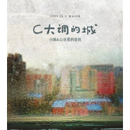

C大调的城
============================

|  |  |
| :--: | :-- |
| [ C大调的城](https://emumo.xiami.com/album/487038) | **艺人**: [小娟&山谷里的居民](../index.md) **语种**: 国语 **唱片公司**: 龙源音乐 **发行时间**: 2012年01月01日 **专辑类别**: 录音室专辑 **专辑风格**: 城市民谣 Urban Folk **播放数**: 975637 **收藏数**: 3223 **评论数**: 280  |

## 简介

《C大调的城》  
小娟&amp;山谷里的居民  跨年度音乐创作诗辑  
  
City in C Major  
Regarding poetry, music and freedom  
  
心底的城，山谷的歌。  
中国朦胧诗代表诗人顾城诗作改编，小娟&amp;山谷里的居民谱曲编曲制作。  
北京录音，香港混音，美国母带处理，在歌的光影中与诗对话。  
  
<strong>【写在前面】  
  
</strong>顾城，诗人。  
1956年生于北京的秋天，6岁写诗，1993年逝于新西兰。  
太平洋的风始终存在，从这一岸到那一岸。  
  
<strong>【关于《C大调的城》】  
  
</strong>三十年前开始在世间流传的诗，成为山谷里的歌。  
  
小娟&amp;山谷里的居民制作完成跨年度音乐创作诗辑《C大调的城》，双张CD，分为“相遇的光影”与“沉睡的细语”两个不同主题，共收录16首音乐作品。整张专辑以1980年代中国朦胧诗代表诗人顾城的诗作改编为词，诗的创作时间集中在1980年-1985年，一个因为理想探索、自由觉醒而充满人文关怀的年代。  
  
城，是诗人的名字，也是我们生活的城市；这些歌大部分是C大调，诗意的名字成为特别的纪念。专辑收录顾城原诗，每首歌词均注明原诗的年代和出处，以此将音乐和文字紧密地联结在一起。  
  
2008年，《红布绿花朵》专辑收录小娟词曲的《两个人》，曾被用来媲美顾城的《远和近》。小娟与顾城有着相似的语境和画笔，看似简单却用情很深。也是2008年，听过小娟谱曲演唱的《小村庄》，顾城的父亲对小娟说：“想不到有人可以用音乐把顾城的诗结合得这么好，你读懂了，我想，如果顾城还在的话，他一定也会很感动。”  
  
几经变迁，2011年，山谷里的居民重新整理这些作品，经过精心细致的编曲和灵感创意，迸发出不可思议的能量，每个音符，每个速度，每个声响，自然而然的发生，仿佛这诗与歌原本就是在一起的，乐队只是还原它最初的样子，并且让它变得很“山谷”。  
  
某种意义来说，《C大调的城》是山谷里的居民成为四个人，经历将近三年共同成长时光之后制作完成的第一张创作专辑，每个人的分工和角色，在别人能看到的以外，有更多的情感流动和默契互动，对音乐的制作也更加确定。  
  
这张专辑在北京录音，香港混音，飘洋过海到美国进行母带处理。编曲制作的过程，除乐队通常配置的吉他、竹笛、口琴、长笛、键盘、Djembe、Cajon、打击乐之外，加入架子鼓、低音大提琴、木贝斯、钢片琴、萨克斯、曼陀铃、长号等乐器，同时为营造诗的意境，采用水滴、响指、拍掌、滑棒等不同声音和色彩，合音也为专辑增添了别致的景色。《红眼睛的大钟》、《一个人在海边》、《拖鞋》是乐队及特邀乐手一起进行的同期录音，却有令他们自己都想不到的惊喜。除此之外，专辑中特别收录1997年《不是再见》的创作DEMO，记录着十几年前小娟稚气的歌声。山谷里的好友香港词人周耀辉翻译的 “City in C Major”，Regarding poetry, music and freedom，印在唱片封面。  
  
纯净的年代，岁月和诗，还有山谷里的自由和歌唱。  
  
<strong>【制作人手记/心底有一座山谷里的城】  
  
</strong>制作人手记/小娟  
  
C大调的城，我对它有不一样的情感。  
原本诗中感受的色彩，经过很长时间的沉淀，我们共同去描绘，从前模糊的渐渐清晰，更确定了。  
音乐形式带来空间结构的变化，不改变音乐原本的颜色，是一件特别难的事情。它很容易不受控制地走向狭小，偏离最初的轨道。我们每个人从不同的角度去理解和还原，心底那座山谷里的城。每一个过程，走过的路，经历的事，我看到它，听见它，没有流失。  
唱着这些歌，天空中的那个画面一直没有变，只是包容更多。秋天的单一颜色变得四季分明，定格，然后流动。欢喜，自由，从容、释怀。  
与生相对的死，其实是另外一种生。  
它不是失去。明白这些，让我的怀念不会那么冷，它是暖的。  
我不会特别的悲伤，我会更坦然地、欢喜地去想念他。  
  
制作人手记/黎强  
  
这些歌，很早以前就写好了。  
有时候会唱，除了感觉很好听，我一直没有太多想法。整理编曲的时候，第一次认真的拿着歌词看，哦，原来它是这样唱的。文字很美，我突然很感动。  
我对诗歌有了新的认识，诗和歌原本就是在一起的。不经意被打动了，我心里有一块地方变得不太一样。  
大家在一起完成编曲，诠释每个人的想法，让细节很丰富，音乐已经不受诗和文字的限制，有一种动态的美。  
因为全新的尝试，在录音开始之前，我是有些担心的，不确定它的样子。但录音一开始，我就明白了，并且很有把握，我知道它，了解它。  
《C大调的城》，感觉不是我们创作了它，而是它选择了我们。  
能让更多人看到和听到，这是很幸运的。  
  
制作人手记/刘晓光  
  
很喜欢这次的同期录音，真的很棒。  
我们经过很长时间的排练，细致的编曲，在录音棚里完全投入地录音。从小娟一个人的创作诠释，成为四个人的作品，赋予它不同的色彩和崭新的生命力。这个过程好像很缓慢，等待的过程很缓慢，制作完成之后，回过头来看，又觉得太快了。这种感觉很奇妙。  
每一张唱片都会有新的尝试，我个人的部分，除了以往一直都有的长笛、钢琴和以前出现过的萨克斯，这次特别加入半音阶口琴，对我绝对是个挑战。  
四个人在一起是一种平衡，我们都很清楚自己能做什么。这里面的情感很真实，无法用语言去定义。  
C大调是很明亮的，无论现实发生什么，它始终是明亮的温暖着。  
  
制作人手记/荒井  
  
这是第一次一起制作的创作专辑。  
我们四个人做出来的音乐，不是想一定要去完成什么，它的出发点很简单，做好各自的本分，很自然，而且很统一。  
不一样的音乐，我会有不一样的想要打开的地方，比如声音和乐器的关系，每个人演奏和唱的完全平等的关系。排练演奏同一首歌的力量，也很希望透过它，放在专辑里面，于是有了这张专辑的同期录音。  
曾经读到一段话讲述The Beatles——这四个人能随时稳住彼此的负面倾向，互相平衡，他们合作加乘的结果，远大于各自贡献的总和。  
这就是我想表达的意思：我们四个人（恰好也是四个人）加起来的作用，比四个人能做的还要大，它的重点不是加入很多的乐器或改变音乐风格，你没想过的山谷里的居民可以有的尝试，它们都自然而然的发生了。  
透过《台北到淡水》看到台湾民歌，透过《C大调的城》看到顾城的诗，接触本来不会感兴趣或者我的年龄和经历不会去碰的事情，现在，我发现我对它们有了特别的感情。  
山谷里出现什么是不可预知的。这次出现的是一个城，可以听到生活在这个城市的心跳。  
这个城，是山谷里的城。

## 曲目

## 评论

|  |  |  |
| :-- | :-- | :-- |
|  [虾米用户](https://emumo.xiami.com/u/49334418) ～ 2020-10-24 18:51 赞(0) 踩(0) | 
～
 |
|  [虾米用户](https://emumo.xiami.com/u/259338519)  2020-08-17 13:23 赞(0) 踩(0) | 
我不是评过了吗？bug?
 |
|  [虾米用户](https://emumo.xiami.com/u/64395552)   2019-12-27 17:54 赞(0) 踩(0) | 
之前我喜欢小娟的音乐，是喜欢她的声音、乐曲、音乐风格，那种慢的感觉。如今听到这张CD，让我惊叹不已，音乐让我置于了一个世界，一个诗与歌的世界，音乐的慢变成了漫步，漫步于桃花源，如此清静、甜美、干净、悠然，所有纷杂污秽的世间之物全然消失殆尽。音乐让顾成的诗沁入我等凡人心扉
 |
|  [虾米用户](https://emumo.xiami.com/u/116239848) 要方向，不要速度，要质量... 2018-03-04 21:27 赞(0) 踩(0) | 
这是张能一直听到老的专辑，期待能再出新专辑，正版CD已经收了。支持用心做出的音乐 
 |
|  [虾米用户](https://emumo.xiami.com/u/11751010) 感謝 人生無常 這回事。 2017-08-17 12:32 赞(0) 踩(0) | 
顧城
 |
|  [虾米用户](https://emumo.xiami.com/u/314356280)  2017-07-23 17:38 赞(0) 踩(0) | 
喜欢
 |
|  [虾米用户](https://emumo.xiami.com/u/102488866) 想要一个很大的水晶球 2017-07-17 18:16 赞(0) 踩(0) | 
－
 |
|  [虾米用户](https://emumo.xiami.com/u/47615173) 只为吉他 2016-11-22 21:12 赞(0) 踩(0) | 
山村的悠远天籁
 |
|  [虾米用户](https://emumo.xiami.com/u/5123677)  2016-04-06 08:47 赞(0) 踩(0) | 
最近在听
 |
|  [虾米用户](https://emumo.xiami.com/u/117001440)  2016-02-24 11:15 赞(0) 踩(0) | 
自然清，百听不厌
 |
|  [虾米用户](https://emumo.xiami.com/u/11382146)  2016-02-20 15:41 赞(0) 踩(0) | 
诗辑
 |
|  [虾米用户](https://emumo.xiami.com/u/90503274) 我要送你花一朵！ 2016-01-11 13:49 赞(2) 踩(0) | 
诚意可嘉，可惜效果不太好。曲子的类型比较单一，窃以为如果2cd精简成1cd会更好。
 |
|  [虾米用户](https://emumo.xiami.com/u/572826)  2015-12-31 12:12 赞(0) 踩(0) | 
喜欢小娟
 |
|  [虾米用户](https://emumo.xiami.com/u/8421312) 觉即佛，迷即凡。 2015-12-14 23:42 赞(0) 踩(0) | 
可以听的小娟
 |
|  [虾米用户](https://emumo.xiami.com/u/5656166)  2015-10-27 19:03 赞(0) 踩(0) | 
可以忘却一切的声音
 |
|  [虾米用户](https://emumo.xiami.com/u/7192552) 爱电影、爱音乐、爱生活。 2015-09-25 09:06 赞(0) 踩(0) | 
輕輕淡淡如浮雲遮日，撩撥得只是心底擠壓許久的安寧祥和。
 |
|  [虾米用户](https://emumo.xiami.com/u/1609080)  2015-05-22 10:13 赞(0) 踩(0) | 
慢慢慢下来。
 |
|  [虾米用户](https://emumo.xiami.com/u/7645492) CREEPY_DOLL 2015-05-05 23:31 赞(0) 踩(0) | 
嗷嗷嗷美~
 |
|  [虾米用户](https://emumo.xiami.com/u/296405)  2015-04-30 22:43 赞(0) 踩(0) | 
穿透我酒醉烟熏的头，直抵后脑，使主动脉随之跳动，在浑浊的血液中注入一丝清流。
 |
|  [虾米用户](https://emumo.xiami.com/u/296405)  2015-04-30 22:43 赞(0) 踩(0) | 
穿透我酒醉烟熏的头，直抵后脑，使主动脉随之跳动，在浑浊的血液中注入一丝清流。
 |
|  [虾米用户](https://emumo.xiami.com/u/27244323) 随缘自适 2015-04-10 08:50 赞(0) 踩(0) | 
淡淡的，清新的，如风飘过。
 |
|  [虾米用户](https://emumo.xiami.com/u/10428898)   2015-03-27 10:17 赞(0) 踩(0) | 
只为是小娟的音乐
 |
|  [虾米用户](https://emumo.xiami.com/u/4181942)  2015-03-16 14:21 赞(0) 踩(0) | 
舒服
 |
|  [虾米用户](https://emumo.xiami.com/u/12356186) 那些疲惫生活中的英雄梦想 2015-02-28 13:16 赞(0) 踩(0) | 
顾城的诗选
 |
|  [虾米用户](https://emumo.xiami.com/u/12356186) 那些疲惫生活中的英雄梦想 2015-02-28 13:13 赞(0) 踩(0) | 
顾城的诗选
 |
|  [虾米用户](https://emumo.xiami.com/u/44931183)  2015-01-07 10:27 赞(0) 踩(0) | 
新专辑！耶！有的听了！
 |
|  [虾米用户](https://emumo.xiami.com/u/19358154) 水瓶怪咖男 2014-12-26 19:16 赞(0) 踩(0) | 
City in Major
 |
|  [虾米用户](https://emumo.xiami.com/u/6000840)  2014-12-16 14:49 赞(0) 踩(0) | 
顾城
 |
|  [虾米用户](https://emumo.xiami.com/u/4174873) 我还没想好要写什么... 2014-12-16 14:17 赞(0) 踩(0) | 
第一次听到他们的声音是在大三。
 |
|  [虾米用户](https://emumo.xiami.com/u/42982247) 暂无签名~ 2014-12-16 00:15 赞(0) 踩(0) | 
好听
 |
|  [虾米用户](https://emumo.xiami.com/u/948453)  2014-12-14 22:45 赞(0) 踩(0) | 
有音乐有生活
 |
|  [虾米用户](https://emumo.xiami.com/u/8454137) 去学习…… 2014-12-06 12:05 赞(0) 踩(0) | 
封面美
 |
|  [虾米用户](https://emumo.xiami.com/u/18733194)  2014-12-05 13:00 赞(0) 踩(0) | 
爱自己，从分享这首歌开始~
 |
|  [虾米用户](https://emumo.xiami.com/u/10484379) 一花一世界 2014-12-04 21:18 赞(0) 踩(0) | 
老听众了、
 |
|  [虾米用户](https://emumo.xiami.com/u/9466218)   2014-10-24 09:12 赞(0) 踩(0) | 
太平洋的风始终存在，从这一岸到那一岸。。。三十年前顾城的诗，成为山谷里的歌。。。
 |
|  [虾米用户](https://emumo.xiami.com/u/8672327)  2014-10-15 06:48 赞(0) 踩(0) | 
很好听
 |
|  [虾米用户](https://emumo.xiami.com/u/384807)  2014-09-29 14:32 赞(0) 踩(0) | 
又见小娟
 |
|  [虾米用户](https://emumo.xiami.com/u/4448023) 音乐在，故我在 2014-08-29 08:59 赞(0) 踩(0) | 
一直喜欢不娟，细说往事来着
 |
|  [虾米用户](https://emumo.xiami.com/u/3364099) 风吹疯了一些人 2014-08-27 16:03 赞(0) 踩(0) | 
偶然发现小娟新专《C大调的城》，如果说朴树是用实力在唱，而她们就是用朦胧的感觉在吟唱，像诗、像自然、像花朵，像溪水、像青苔。“不知道什么是花朵，却养的郁郁葱葱”
 |
|  [虾米用户](https://emumo.xiami.com/u/1670399)   2014-08-27 09:26 赞(0) 踩(0) | 
下雨了，正好听《C大调的城》
 |
|  [虾米用户](https://emumo.xiami.com/u/24327434) 做自己 2014-08-24 15:59 赞(0) 踩(0) | 
走在野地里的味道
 |
|  [虾米用户](https://emumo.xiami.com/u/42347) 寻找无双 2014-08-24 00:00 赞(0) 踩(0) | 
疗伤系。歌声不错，但歌词才是最大的亮点。
 |
|  [虾米用户](https://emumo.xiami.com/u/22354073)  2014-08-23 22:15 赞(0) 踩(0) | 
忠实的粉丝来报道
 |
| ⇒ |  [虾米用户](https://emumo.xiami.com/u/34483589) 相聚离开，都有时候，没有... 2014-08-24 00:27 赞(0) 踩(0) | 
去不去上海演唱会？
 |
| ⇒ |  [虾米用户](https://emumo.xiami.com/u/22354073)  2014-08-25 21:08 赞(0) 踩(0) | 
<q><b>天一羽翮说：</b></q>
 |
|  [虾米用户](https://emumo.xiami.com/u/35915057)  2014-08-23 13:23 赞(0) 踩(0) | 
小娟这样好的民谣歌手怎么能现在才来虾米呢
 |
|  [虾米用户](https://emumo.xiami.com/u/16044236) 我是不是很聪明，什么都没... 2014-08-23 09:47 赞(0) 踩(0) | 
youqinghui,youfengge
 |
|  [虾米用户](https://emumo.xiami.com/u/1844) 农夫 山泉 有点田 2014-08-22 21:02 赞(0) 踩(0) | 
【唱腔像被刻意调成慢速的唱盘】越来越觉得这个说法神精确。。。
 |
| ⇒ |  [虾米用户](https://emumo.xiami.com/u/19798848) love u more 2014-08-24 01:11 赞(0) 踩(0) | 
好愛 好美
 |
|  [虾米用户](https://emumo.xiami.com/u/9143170)  2014-08-22 12:08 赞(0) 踩(0) | 
喜迎小娟
 |
|  [虾米用户](https://emumo.xiami.com/u/4710261) 我还没想好要写什么... 2014-08-22 10:54 赞(0) 踩(0) | 
顾城
 |
|  [虾米用户](https://emumo.xiami.com/u/21205875)  2014-08-21 06:33 赞(0) 踩(0) | 
终于来虾米了
 |
|  [虾米用户](https://emumo.xiami.com/u/1247234) Silhouette。 2014-08-15 22:02 赞(0) 踩(0) | 
m
 |
|  [虾米用户](https://emumo.xiami.com/u/5571742)  2014-08-14 22:41 赞(0) 踩(0) | 
怎么回事，看不到啊
 |
|  [虾米用户](https://emumo.xiami.com/u/32387391)  2014-08-14 00:19 赞(0) 踩(0) | 
唉
 |
|  [虾米用户](https://emumo.xiami.com/u/35244555) 细嗅蔷薇 2014-08-14 00:04 赞(0) 踩(0) | 
喜欢你们的音乐，清澈，明亮！
 |
|  [虾米用户](https://emumo.xiami.com/u/12966527) 我还没想好要写什么... 2014-08-13 22:56 赞(0) 踩(0) | 
怎么没有！！！
 |
|  [虾米用户](https://emumo.xiami.com/u/1636126) 我还没想好要写什么... 2014-08-13 22:42 赞(0) 踩(0) | 
这是！秒下啊？
 |
|  [虾米用户](https://emumo.xiami.com/u/5487745) 因为好奇，所以神秘。 2014-08-13 22:35 赞(0) 踩(0) | 
为啥我一收藏，就提示说参数错误？明明用手机还可以听。
 |
|  [虾米用户](https://emumo.xiami.com/u/5487745) 因为好奇，所以神秘。 2014-08-13 22:35 赞(0) 踩(0) | 
目前可以听。。。不过预感会下架。。。
 |
|  [虾米用户](https://emumo.xiami.com/u/2794138)  2014-08-13 22:25 赞(0) 踩(0) | 
为什么看不见了？
 |
|  [虾米用户](https://emumo.xiami.com/u/3769677)  2014-08-13 21:52 赞(0) 踩(0) | 
一直都很喜欢，吟唱的天籁之音绵绵入耳，融入心乡！
 |
|  [虾米用户](https://emumo.xiami.com/u/4863565) 挤出一丝力气 2014-08-13 21:01 赞(0) 踩(0) | 
先收藏了，在虾米的第一张。
 |
|  [虾米用户](https://emumo.xiami.com/u/353) 强迫症确诊 2014-08-13 20:11 赞(0) 踩(0) | 
哇 小娟都回来了 逼哥还远吗
 |
| ⇒ |  [虾米用户](https://emumo.xiami.com/u/724005) 我还没想好要写什么... 2014-08-14 11:30 赞(0) 踩(0) | 
这还真不好说
 |
|  [虾米用户](https://emumo.xiami.com/u/8946950) 灌不饱的耳朵 2014-08-13 17:22 赞(0) 踩(0) | 
听过那么多助眠的歌，没有一个有娟姐厉害的，一听她的声音就安然入睡惹。
 |
|  [虾米用户](https://emumo.xiami.com/u/11157355) 榕树长青 2014-08-13 15:40 赞(0) 踩(0) | 
喜讯
 |
|  [虾米用户](https://emumo.xiami.com/u/5660107) 请你不要吃我，我给你唱一... 2014-08-13 15:21 赞(0) 踩(0) | 
终于可以在虾米继续听到你们的歌曲了。开心
 |
|  [虾米用户](https://emumo.xiami.com/u/7550464)  2014-08-13 14:47 赞(0) 踩(0) | 
很好
 |
|  [虾米用户](https://emumo.xiami.com/u/7039902)  2012-01-12 15:40 赞(0) 踩(0) | 
清新。
 |
|  [虾米用户](https://emumo.xiami.com/u/6217026)  2012-01-12 15:38 赞(0) 踩(0) | 
舒服
 |
|  [虾米用户](https://emumo.xiami.com/u/7638677)  2012-01-12 15:08 赞(0) 踩(0) | 
有很舒服的山谷的声音。
 |
|  [虾米用户](https://emumo.xiami.com/u/6030445)  2012-01-12 14:17 赞(0) 踩(0) | 
小岁月小清新 小鼓小调小乐器  跟着悦动
 |
|  [虾米用户](https://emumo.xiami.com/u/7291633) 爱猫的妞儿~ 2012-01-12 14:13 赞(0) 踩(0) | 
很适合在午后听，透过窗的阳光以及一点点慵懒，很舒服。
 |
|  [虾米用户](https://emumo.xiami.com/u/994640)  2012-01-12 14:11 赞(0) 踩(0) | 
忘憂歌曲
 |
|  [虾米用户](https://emumo.xiami.com/u/3690817)  2012-01-12 13:49 赞(0) 踩(0) | 
很安静~~
 |
|  [虾米用户](https://emumo.xiami.com/u/2596923)  2012-01-12 13:48 赞(0) 踩(0) | 
其实要比好听多一点。听音乐的时候配诗，感觉很风雅？？呵呵~下午的时候不小心点到的，很适合有太阳的下午。
 |
|  [虾米用户](https://emumo.xiami.com/u/1664644)  2012-01-12 12:49 赞(1) 踩(0) | 
曲子儿真好。 准备寻摸一个CD
 |
|  [虾米用户](https://emumo.xiami.com/u/2473811)  2012-01-12 12:42 赞(0) 踩(0) | 
听了心里蛮静的
 |
|  [虾米用户](https://emumo.xiami.com/u/6424648)  2012-01-12 12:42 赞(0) 踩(0) | 
666
 |
|  [虾米用户](https://emumo.xiami.com/u/1178913) 我还没想好要写什么... 2012-01-12 12:30 赞(0) 踩(0) | 
“就在那个小村里/ 穿着银杏树的服装/ 有一个人是我/ 是我”  爱顾城的诗与画 爱来自山谷的吟唱与笛声
 |
|  [虾米用户](https://emumo.xiami.com/u/7262998)  2012-01-12 12:07 赞(0) 踩(0) | 
舒服，细腻
 |
|  [虾米用户](https://emumo.xiami.com/u/3403754)  2012-01-12 11:37 赞(0) 踩(0) | 
清新自然
 |
|  [虾米用户](https://emumo.xiami.com/u/7630745)  2012-01-12 11:23 赞(0) 踩(0) | 
听过小娟的专辑红布绿花朵，一直都很喜欢听 小娟的歌
 |
|  [虾米用户](https://emumo.xiami.com/u/957973) 生活不止如此 2012-01-12 11:15 赞(0) 踩(0) | 
温婉的声线
 |
|  [虾米用户](https://emumo.xiami.com/u/7358316)  2012-01-12 10:51 赞(0) 踩(0) | 
心灵的净化 浮躁的褪去 她的歌让人真的感觉很幸福
 |
|  [虾米用户](https://emumo.xiami.com/u/7358316)  2012-01-12 10:51 赞(0) 踩(0) | 
心灵的净化 浮躁的褪去 她的歌让人真的感觉很幸福
 |
|  [虾米用户](https://emumo.xiami.com/u/5042337)  2012-01-12 10:36 赞(0) 踩(0) | 
风潮音乐的品质保证
 |
|  [虾米用户](https://emumo.xiami.com/u/749147) 大型强子对撞机会造成地球... 2012-01-12 10:30 赞(0) 踩(0) | 
小娟
 |
|  [虾米用户](https://emumo.xiami.com/u/2064842)  2012-01-12 10:23 赞(0) 踩(0) | 
哈哈，大饱耳福了今天。。虽然在上班，嘻嘻~~~
 |
|  [虾米用户](https://emumo.xiami.com/u/5990820)  2012-01-12 10:21 赞(0) 踩(0) | 
你會覺得今天如此美好。風潮音樂發行。
 |
|  [虾米用户](https://emumo.xiami.com/u/1213586)  2012-01-12 09:32 赞(0) 踩(0) | 
一直喜欢 小娟
 |
|  [虾米用户](https://emumo.xiami.com/u/45389)  2012-01-12 09:25 赞(0) 踩(0) | 
上班的时候听这个确实不太合适，但是……毕竟是小娟啊。这次风潮发行的话……很显然CD就贵了。
 |
|  [虾米用户](https://emumo.xiami.com/u/6201075)  2012-01-12 09:14 赞(0) 踩(0) | 
安靜
 |
|  [虾米用户](https://emumo.xiami.com/u/374450) GAME MAKER！！ 2012-01-12 08:54 赞(0) 踩(0) | 
空灵神曲
 |
|  [虾米用户](https://emumo.xiami.com/u/1588047)  2012-01-12 07:54 赞(0) 踩(0) | 
喜欢
 |
|  [虾米用户](https://emumo.xiami.com/u/7059613)  2012-01-12 03:41 赞(0) 踩(0) | 
心灵的净化  浮躁的褪去  她的歌让人真的感觉很幸福
 |
|  [虾米用户](https://emumo.xiami.com/u/1204819)  2012-01-12 03:31 赞(0) 踩(0) | 
顾城的诗的延伸。。
 |
|  [虾米用户](https://emumo.xiami.com/u/77574)  2012-01-12 03:16 赞(0) 踩(0) | 
新专辑每首歌都采用了顾城的诗作为歌词。朦胧的诗词加上小娟清澈的声音，更加柔软了。上次错过了他们的演唱会，一直耿耿于怀。也不知道什么时候有机会才能在现场静静地听他们慢慢诉说着山谷里的故事了。
 |
|  [虾米用户](https://emumo.xiami.com/u/388168)  2012-01-12 02:13 赞(0) 踩(0) | 
静
 |
|  [虾米用户](https://emumo.xiami.com/u/6190607) 我还没想好要写什么... 2012-01-12 01:47 赞(0) 踩(0) | 
这专辑对我的胃口。
 |
|  [虾米用户](https://emumo.xiami.com/u/7633403)  2012-01-12 01:35 赞(0) 踩(0) | 
h
 |
|  [虾米用户](https://emumo.xiami.com/u/7633094)  2012-01-12 01:00 赞(0) 踩(0) | 
溪水的声音
 |
|  [虾米用户](https://emumo.xiami.com/u/3160169) 反方向的鐘 2012-01-12 00:33 赞(0) 踩(0) | 
[New CD]
 |
|  [虾米用户](https://emumo.xiami.com/u/83553)  2012-01-11 23:43 赞(0) 踩(0) | 
安静。
 |
|  [虾米用户](https://emumo.xiami.com/u/83553)  2012-01-11 23:42 赞(0) 踩(0) | 
净化心灵。
 |
|  [虾米用户](https://emumo.xiami.com/u/7632370)  2012-01-11 23:39 赞(0) 踩(0) | 
让我感觉到一直宁静平和的感觉，很放松，很惬意
 |
|  [虾米用户](https://emumo.xiami.com/u/7632327)  2012-01-11 23:36 赞(0) 踩(0) | 
放松
 |
|  [虾米用户](https://emumo.xiami.com/u/402955)   2012-01-11 23:24 赞(0) 踩(0) | 
真喜欢专辑名字和小娟的声音
 |
|  [虾米用户](https://emumo.xiami.com/u/229010)  2012-01-11 22:50 赞(0) 踩(0) | 
让我感觉到一直宁静平和的感觉，很放松，很惬意……
 |
|  [虾米用户](https://emumo.xiami.com/u/7631616) 每天呼吸之间都有你在 2012-01-11 22:45 赞(0) 踩(0) | 
歌声中是纯净的心和清新的世界
 |
|  [虾米用户](https://emumo.xiami.com/u/4795834)  2012-01-11 21:49 赞(0) 踩(0) | 
真好听
 |
|  [虾米用户](https://emumo.xiami.com/u/7630041)  2012-01-11 21:10 赞(0) 踩(0) | 
爱小娟和山谷里的居民一如既往的清新
 |
|  [虾米用户](https://emumo.xiami.com/u/1681335)  2012-01-11 21:05 赞(0) 踩(0) | 
纯粹、明亮是C大调的色彩。 轻灵、隽永是山谷里的色彩。 诗意、恬静是倾心者的色彩。
 |
|  [虾米用户](https://emumo.xiami.com/u/7630071)  2012-01-11 21:04 赞(0) 踩(0) | 
适合睡前的放松音乐
 |
|  [虾米用户](https://emumo.xiami.com/u/131989)   2012-01-11 20:48 赞(0) 踩(0) | 
new age
 |
|  [虾米用户](https://emumo.xiami.com/u/876650)  2012-01-11 20:47 赞(0) 踩(0) | 
我的最爱。
 |
|  [虾米用户](https://emumo.xiami.com/u/876650)  2012-01-11 20:47 赞(0) 踩(0) | 
我的最爱。
 |
|  [虾米用户](https://emumo.xiami.com/u/3463830)  2012-01-11 20:41 赞(0) 踩(0) | 
内地难得有如高水准的NEW AGE音乐
 |
|  [虾米用户](https://emumo.xiami.com/u/3653789)  2012-01-11 20:35 赞(0) 踩(0) | 
纯净的声音，内心渴望的平静终于释放
 |
|  [虾米用户](https://emumo.xiami.com/u/6283451)  2012-01-11 19:57 赞(0) 踩(0) | 
最适合在写字的时候听的音乐
 |
|  [虾米用户](https://emumo.xiami.com/u/181741)  2012-01-11 19:31 赞(0) 踩(0) | 
good!好喜欢！
 |
|  [虾米用户](https://emumo.xiami.com/u/1853296)  2012-01-11 17:46 赞(0) 踩(0) | 
淡淡的平静，淳淳的歌声
 |
|  [虾米用户](https://emumo.xiami.com/u/1378672)  2012-01-11 17:39 赞(0) 踩(0) | 
山民的音乐
 |
|  [虾米用户](https://emumo.xiami.com/u/7509251)  2012-01-11 17:19 赞(0) 踩(0) | 
纯净的音乐
 |
|  [虾米用户](https://emumo.xiami.com/u/864147)  2012-01-11 17:14 赞(0) 踩(0) | 
很不错啊~一直很喜欢他们的感觉~
 |
|  [虾米用户](https://emumo.xiami.com/u/1145233)  2012-01-11 17:12 赞(0) 踩(0) | 
轻快的民谣
 |
|  [虾米用户](https://emumo.xiami.com/u/941274) 吃货拯救世界 2012-01-11 16:55 赞(0) 踩(0) | 
小娟，真好听
 |
|  [虾米用户](https://emumo.xiami.com/u/1737954)  2012-01-11 16:51 赞(0) 踩(0) | 
这样的声音好喜欢，不知不觉的就被感动到。小娟的音乐有着我们所向往的自由纯净的世界。一直觉得这就是音乐最美好之处离人的内心最近最近。
 |
|  [虾米用户](https://emumo.xiami.com/u/7551639)  2012-01-11 16:39 赞(0) 踩(0) | 
给躁动的心一个平静而舒适的角落
 |
|  [虾米用户](https://emumo.xiami.com/u/646905)  2012-01-11 16:38 赞(0) 踩(0) | 
喜欢民谣，几年前第一次听小娟的音乐就喜欢上了她，喜欢她那种清澈的声音。
 |
|  [虾米用户](https://emumo.xiami.com/u/3755802) 看，我那颗行星，他恰好在... 2012-01-11 15:55 赞(0) 踩(0) | 
寒冷的阴天，她的声音像是透明的阳光穿过迷雾穿过窗户照进来。不炽热，有点暖；不耀眼，有点亮；不吵闹，有点乐~~
 |
|  [虾米用户](https://emumo.xiami.com/u/992184) (╯‵□′)╯︵┻━┻ 2012-01-11 15:41 赞(0) 踩(0) | 
喜欢这个声音。
 |
|  [虾米用户](https://emumo.xiami.com/u/2140033)  2012-01-11 15:37 赞(0) 踩(0) | 
不稳定 但是还是清丽的
 |
|  [虾米用户](https://emumo.xiami.com/u/7028614)  2012-01-11 15:25 赞(0) 踩(0) | 
国内不多更尊重音乐 更自然 不商业的乐队
 |
|  [虾米用户](https://emumo.xiami.com/u/4821686)  2012-01-11 15:23 赞(0) 踩(0) | 
安安静静的听
 |
|  [虾米用户](https://emumo.xiami.com/u/952718) 我的小港湾。 2012-01-11 15:06 赞(0) 踩(0) | 
支持
 |
|  [虾米用户](https://emumo.xiami.com/u/3572082) Fall 2012-01-11 15:03 赞(0) 踩(0) | 
平静。治愈~~ 在六晚里认识这个美好的声音。。。
 |
|  [虾米用户](https://emumo.xiami.com/u/952718) 我的小港湾。 2012-01-11 14:53 赞(0) 踩(0) | 
又来了。推荐大家听听···
 |
|  [虾米用户](https://emumo.xiami.com/u/1569351)  2012-01-11 13:58 赞(0) 踩(0) | 
治愈 平静
 |
|  [虾米用户](https://emumo.xiami.com/u/446413)  2012-01-11 13:57 赞(0) 踩(0) | 
C大调的小城
 |
|  [虾米用户](https://emumo.xiami.com/u/650462)  2012-01-11 13:56 赞(0) 踩(0) | 
轻快的随意~
 |
|  [虾米用户](https://emumo.xiami.com/u/2295233)  2012-01-11 13:35 赞(0) 踩(0) | 
小娟的干净纯粹一如既往。我不觉得民谣就一定得用缺乏美感的嗓子唱。我不是说迪伦的嗓子就不美，而是说用如果粗糙也可以成为一种风格被可以安排，那么离民谣的精神就失之千里了。小娟的唱法很有节奏和情节，不过还没到流行的感觉。不温不火，我很喜欢。
 |
|  [虾米用户](https://emumo.xiami.com/u/3114149)  2012-01-11 13:25 赞(0) 踩(0) | 
让灵魂安静的声音
 |
|  [虾米用户](https://emumo.xiami.com/u/7624131)  2012-01-11 13:17 赞(0) 踩(0) | 
让人一时忘了窗外的喧嚣...
 |
|  [虾米用户](https://emumo.xiami.com/u/2691052) 且看那青山綠水別來無恙。 2012-01-11 12:51 赞(0) 踩(0) | 
一首一首地听下去
 |
|  [虾米用户](https://emumo.xiami.com/u/1059184) 2 2012-01-11 12:48 赞(0) 踩(0) | 
舒缓治愈
 |
|  [虾米用户](https://emumo.xiami.com/u/169126) 我还没想好要写什么... 2012-01-11 12:46 赞(0) 踩(0) | 
平和治愈着我。
 |
|  [虾米用户](https://emumo.xiami.com/u/64738)  2012-01-11 12:24 赞(0) 踩(0) | 
还是这能让人安静的声音，这就够了
 |
|  [虾米用户](https://emumo.xiami.com/u/7422211)  2012-01-11 12:06 赞(0) 踩(0) | 
小娟的声音很好听，很喜欢
 |
|  [虾米用户](https://emumo.xiami.com/u/563802) 吃货拯救世界 2012-01-11 12:02 赞(0) 踩(0) | 
很喜欢小娟那清澈的声音, 听着听着心就静下来了~
 |
|  [虾米用户](https://emumo.xiami.com/u/7622922)  2012-01-11 11:46 赞(0) 踩(0) | 
很清新，在嘈杂的城市生活中，觉得心都静下来了
 |
|  [虾米用户](https://emumo.xiami.com/u/7601394)  2012-01-11 11:45 赞(0) 踩(0) | 
名字很喜欢
 |
|  [虾米用户](https://emumo.xiami.com/u/2026901)  2012-01-11 11:18 赞(0) 踩(0) | 
用音乐逃离灰色调的写字间，去山林幽谷里且听风吟。
 |
|  [虾米用户](https://emumo.xiami.com/u/6923678)  2012-01-11 11:06 赞(0) 踩(0) | 
纯朴清新
 |
|  [虾米用户](https://emumo.xiami.com/u/7611167)  2012-01-11 11:01 赞(0) 踩(0) | 
很清澈的歌。
 |
|  [虾米用户](https://emumo.xiami.com/u/3886717)  2012-01-11 10:57 赞(0) 踩(0) | 
凭着感觉唱出心里桃源
 |
|  [虾米用户](https://emumo.xiami.com/u/3704800)  2012-01-11 10:56 赞(0) 踩(0) | 
听过小娟在深圳大剧院的私家演唱会。。。安静，空灵的歌者。山野，吉他，木屋……溪水流动，心情流动——听小娟的音乐，能看到自己内心。
 |
|  [虾米用户](https://emumo.xiami.com/u/549541)  2012-01-11 10:38 赞(0) 踩(0) | 
清新
 |
|  [虾米用户](https://emumo.xiami.com/u/5269970)  2012-01-11 10:33 赞(0) 踩(0) | 
有一种清新的感觉!
 |
|  [虾米用户](https://emumo.xiami.com/u/4368669)  2012-01-11 10:30 赞(0) 踩(0) | 
清澈
 |
|  [虾米用户](https://emumo.xiami.com/u/1188773)  2012-01-11 10:29 赞(0) 踩(0) | 
很有feel
 |
|  [虾米用户](https://emumo.xiami.com/u/2258059)  2012-01-11 10:27 赞(0) 踩(0) | 
C大调的唱不出忧伤，城市的犄角旮旯里吟着乐章，那是宁静的城
 |
|  [虾米用户](https://emumo.xiami.com/u/4755566) 音樂力量 2012-01-11 10:17 赞(0) 踩(0) | 
有一种清新的感觉! 听了令人心邝神怡!
 |
|  [虾米用户](https://emumo.xiami.com/u/4755566) 音樂力量 2012-01-11 10:05 赞(0) 踩(0) | 
有一种清新的感觉!
 |
|  [虾米用户](https://emumo.xiami.com/u/504642)  2012-01-11 10:04 赞(0) 踩(0) | 
适合这次的旅程~
 |
|  [虾米用户](https://emumo.xiami.com/u/2189813) 我还没想好要写什么... 2012-01-11 10:03 赞(0) 踩(0) | 
小娟啊，不得不听啊。 有人说是人到中年的原因。
 |
|  [虾米用户](https://emumo.xiami.com/u/2633708)  2012-01-11 10:02 赞(0) 踩(0) | 
C大调的城
 |
|  [虾米用户](https://emumo.xiami.com/u/934563)  2012-01-11 09:55 赞(0) 踩(0) | 
就是喜欢吧，简单那
 |
|  [虾米用户](https://emumo.xiami.com/u/7552837)  2012-01-11 09:44 赞(0) 踩(0) | 
听上去,身心舒畅.
 |
|  [虾米用户](https://emumo.xiami.com/u/60797)  2012-01-11 09:36 赞(0) 踩(0) | 
终于。真好。
 |
|  [虾米用户](https://emumo.xiami.com/u/3577379)  2012-01-11 09:34 赞(0) 踩(0) | 
仅凭这个封面
 |
|  [虾米用户](https://emumo.xiami.com/u/6299080)  2012-01-11 09:18 赞(0) 踩(0) | 
哈哈，有台湾早期民歌的味道，好听。
 |
|  [虾米用户](https://emumo.xiami.com/u/6158505)  2012-01-11 09:15 赞(0) 踩(0) | 
喜欢乐器，喜欢小娟那干净的声音。
 |
|  [虾米用户](https://emumo.xiami.com/u/1775407)   2012-01-11 08:33 赞(0) 踩(0) | 
不错
 |
|  [虾米用户](https://emumo.xiami.com/u/1775407)   2012-01-11 08:32 赞(0) 踩(0) | 
这个中南财大毕业的小娟确实不错。 值得欣赏
 |
|  [虾米用户](https://emumo.xiami.com/u/7621436)  2012-01-11 08:28 赞(0) 踩(0) | 
民
 |
|  [虾米用户](https://emumo.xiami.com/u/2291475) 爱拼才会赢 2012-01-11 07:47 赞(0) 踩(0) | 
别有一番风味
 |
|  [虾米用户](https://emumo.xiami.com/u/2206905) 前世的我 2012-01-11 07:15 赞(0) 踩(0) | 
好就没听了，好像回到两年前：（
 |
|  [虾米用户](https://emumo.xiami.com/u/5965915)  2012-01-11 05:20 赞(0) 踩(0) | 
《和一个女孩子结婚吧》适合一个人听
 |
|  [虾米用户](https://emumo.xiami.com/u/135097) 要听神明的话 2012-01-11 02:59 赞(0) 踩(0) | 
hg
 |
|  [虾米用户](https://emumo.xiami.com/u/2958734)  2012-01-11 02:46 赞(0) 踩(0) | 
优美，静静的
 |
|  [虾米用户](https://emumo.xiami.com/u/2361926)  2012-01-11 02:38 赞(0) 踩(0) | 
很宁静。很舒心。
 |
|  [虾米用户](https://emumo.xiami.com/u/1324490)  2012-01-11 00:36 赞(0) 踩(0) | 
静
 |
|  [虾米用户](https://emumo.xiami.com/u/2237955) 耳即我心 2012-01-11 00:20 赞(0) 踩(0) | 
用心的歌者,一定会有用心的听众,THX:)
 |
|  [虾米用户](https://emumo.xiami.com/u/5868344)  2012-01-11 00:10 赞(0) 踩(0) | 
清幽
 |
|  [虾米用户](https://emumo.xiami.com/u/1052461) @blinK4sy- 2012-01-11 00:02 赞(0) 踩(0) | 
marK
 |
|  [虾米用户](https://emumo.xiami.com/u/3791873)  2012-01-11 00:01 赞(0) 踩(0) | 
什么都不想，只是静静地聆听着，很平静，很享受……
 |
|  [虾米用户](https://emumo.xiami.com/u/7618119)  2012-01-10 23:23 赞(0) 踩(0) | 
没听完，感觉好像不错呢！
 |
|  [虾米用户](https://emumo.xiami.com/u/2002904) 不能不写了。。。虾米要没... 2012-01-10 23:19 赞(0) 踩(0) | 
安安静静的小民谣
 |
|  [虾米用户](https://emumo.xiami.com/u/7619390)  2012-01-10 23:15 赞(0) 踩(0) | 
安静的歌，清淡的声音。 世界，安静。
 |
|  [虾米用户](https://emumo.xiami.com/u/181829) 我还没想好要写什么... 2012-01-10 22:54 赞(0) 踩(0) | 
山里的朋友们~你们好
 |
|  [虾米用户](https://emumo.xiami.com/u/563576)  2012-01-10 22:52 赞(0) 踩(0) | 
美啊
 |
|  [虾米用户](https://emumo.xiami.com/u/3216907)  2012-01-10 22:32 赞(0) 踩(0) | 
juan
 |
|  [虾米用户](https://emumo.xiami.com/u/2656470)  2012-01-10 22:09 赞(0) 踩(0) | 
喜欢[祈愿]和[一大片]~
 |
|  [虾米用户](https://emumo.xiami.com/u/299922)  2012-01-10 21:50 赞(0) 踩(0) | 
说实话，还是更喜欢红布绿花朵那张，不太能接受新的唱法
 |
|  [虾米用户](https://emumo.xiami.com/u/3677733)  2012-01-10 21:43 赞(0) 踩(0) | 
她的音乐总是能让我在喧嚣的中快速找到自己本该有的那份平静！
 |
|  [虾米用户](https://emumo.xiami.com/u/608298)  2012-01-10 21:38 赞(0) 踩(0) | 
我们有一块空地，不去问，命运知道的事情
 |
|  [虾米用户](https://emumo.xiami.com/u/7592051)  2012-01-10 21:29 赞(0) 踩(0) | 
淡淡的，柔柔的
 |
|  [虾米用户](https://emumo.xiami.com/u/62898)  2012-01-10 21:28 赞(0) 踩(0) | 
红眼睛的大钟太可爱啦！！
 |
|  [虾米用户](https://emumo.xiami.com/u/7106287)  2012-01-10 21:12 赞(0) 踩(0) | 
一座城市，是小城还是大城，总之它给我们的是幸福，还是欺骗！有时只有躲在歌声里才能睡着，我还能确保哪些东西是安全的呢？
 |
|  [虾米用户](https://emumo.xiami.com/u/7106287)  2012-01-10 21:10 赞(0) 踩(0) | 
一座城市，是小城还是大城，总之它给我们的是幸福，还是欺骗！有时只有躲在歌声里才能睡着，我还能确保哪些东西是安全的呢？
 |
|  [虾米用户](https://emumo.xiami.com/u/510319)  2012-01-10 20:31 赞(0) 踩(0) | 
风潮的音乐总是有一种脱俗的感觉
 |
| ⇒ |  [虾米用户](https://emumo.xiami.com/u/540158) 音乐是最浪漫的数学，是A... 2012-01-10 21:56 赞(0) 踩(0) | 
agree
 |
|  [虾米用户](https://emumo.xiami.com/u/6487695)  2012-01-10 19:54 赞(0) 踩(0) | 
很不错~~喜欢这个声音和调调。很清澈、自由的灵魂。
 |
|  [虾米用户](https://emumo.xiami.com/u/2149480)  2012-01-10 19:26 赞(0) 踩(0) | 
安静  like!!!!
 |
|  [虾米用户](https://emumo.xiami.com/u/7615794)  2012-01-10 19:23 赞(0) 踩(0) | 
纯粹，明亮，听完心情愉悦
 |
|  [虾米用户](https://emumo.xiami.com/u/812392) 【封面控】毛驴牌❤小众好... 2012-01-10 19:20 赞(0) 踩(0) | 
一座城，可以很宁静，也可以很喧嚣，看客是用哪一种心境去生活了。这张专辑很安逸很恬静。╭(╯3╰)╮
 |
|  [虾米用户](https://emumo.xiami.com/u/7324676)  2012-01-10 19:02 赞(0) 踩(0) | 
静静的 听    城市中的一湖净水
 |
|  [虾米用户](https://emumo.xiami.com/u/1396206) 聆听月升 2012-01-10 18:43 赞(0) 踩(0) | 
哇，新专辑啊太幸福了
 |
|  [虾米用户](https://emumo.xiami.com/u/6288555)  2012-01-10 18:39 赞(0) 踩(0) | 
赞
 |
|  [虾米用户](https://emumo.xiami.com/u/7615139)  2012-01-10 18:13 赞(0) 踩(0) | 
なんとなんく
 |
|  [虾米用户](https://emumo.xiami.com/u/1706691)  2012-01-10 18:05 赞(0) 踩(0) | 
C调的城，小娟的曲子越发安静了。
 |
|  [虾米用户](https://emumo.xiami.com/u/1706691)  2012-01-10 18:05 赞(0) 踩(0) | 
C调的城，小娟的曲子越发安静了。
 |
|  [虾米用户](https://emumo.xiami.com/u/4363158)  2012-01-10 17:57 赞(0) 踩(0) | 
乡村的魅力
 |
|  [虾米用户](https://emumo.xiami.com/u/1229617) 我在城市里，纪念你 2012-01-10 17:50 赞(0) 踩(0) | 
always the best. Strongly recommend :)
 |
|  [虾米用户](https://emumo.xiami.com/u/7444829)  2012-01-10 17:24 赞(0) 踩(0) | 
这是5年前的我会喜欢的类型
 |
|  [虾米用户](https://emumo.xiami.com/u/7614452)  2012-01-10 17:15 赞(0) 踩(0) | 
很喜欢~~很静，可以让人很静~
 |
|  [虾米用户](https://emumo.xiami.com/u/3325221)  2012-01-10 17:15 赞(0) 踩(0) | 
宁静，远离繁华叫嚣的世界
 |
|  [虾米用户](https://emumo.xiami.com/u/316736)  2012-01-10 16:50 赞(0) 踩(0) | 
等会儿再听……
 |
|  [虾米用户](https://emumo.xiami.com/u/3959877)  2012-01-10 16:27 赞(0) 踩(0) | 
我们静静的去听，它很唯美，给我们带来了宁静就像是独自一人坐在沙滩上看一望无际的蓝色大海......喜欢......顶一下
 |
|  [虾米用户](https://emumo.xiami.com/u/4114957)  2012-01-10 16:24 赞(0) 踩(0) | 
这可不是小清新，是山腰上环绕的薄云，是林间的涓涓溪流，一尘不染
 |
|  [虾米用户](https://emumo.xiami.com/u/7613960)  2012-01-10 16:17 赞(0) 踩(0) | 
安宁。
 |
|  [虾米用户](https://emumo.xiami.com/u/5582592)  2012-01-10 16:15 赞(0) 踩(0) | 
在满是烟尘的世界，可以在听《C大调的城》时，很久呼吸一次。
 |
|  [虾米用户](https://emumo.xiami.com/u/3621508)   2012-01-10 16:01 赞(0) 踩(0) | 
好听
 |
|  [虾米用户](https://emumo.xiami.com/u/4777486)  2012-01-10 15:52 赞(0) 踩(0) | 
坚持做自己的音乐，水样的清纯，山谷里空气样沁入心脾，白云样飘浮。。。
 |
|  [虾米用户](https://emumo.xiami.com/u/1091908) 一切随缘 2012-01-10 15:31 赞(0) 踩(0) | 
诗意轻灵
 |
|  [虾米用户](https://emumo.xiami.com/u/844697) 我还没想好要写什么... 2012-01-10 15:15 赞(0) 踩(0) | 
清新小调
 |
|  [虾米用户](https://emumo.xiami.com/u/6549120)  2012-01-10 15:12 赞(0) 踩(0) | 
有点齐豫的味道，清新，不造作
 |
|  [虾米用户](https://emumo.xiami.com/u/2044) 我还没想好要写什么... 2012-01-10 15:04 赞(0) 踩(0) | 
小娟现在都在风潮发行了哦~~
 |
|  [虾米用户](https://emumo.xiami.com/u/3001049)  2012-01-10 14:58 赞(0) 踩(0) | 
小娟= 3=
 |
|  [虾米用户](https://emumo.xiami.com/u/5850553)  2012-01-10 14:54 赞(0) 踩(0) | 
小清新
 |
|  [虾米用户](https://emumo.xiami.com/u/7585790)  2012-01-10 14:54 赞(0) 踩(0) | 
随性
 |
|  [虾米用户](https://emumo.xiami.com/u/7611989)  2012-01-10 13:35 赞(0) 踩(0) | 
舒服
 |
|  [虾米用户](https://emumo.xiami.com/u/1446125)  2012-01-10 13:18 赞(0) 踩(0) | 
舒服 纯净
 |
|  [虾米用户](https://emumo.xiami.com/u/6074076)  2012-01-10 13:14 赞(0) 踩(0) | 
nice
 |
|  [虾米用户](https://emumo.xiami.com/u/3863828)  2012-01-10 13:10 赞(0) 踩(0) | 
太特别的歌。
 |
|  [虾米用户](https://emumo.xiami.com/u/7601976)  2012-01-10 12:44 赞(0) 踩(0) | 
纯净无比的声音
 |
|  [虾米用户](https://emumo.xiami.com/u/2502159)  2012-01-10 12:41 赞(0) 踩(0) | 
很清新恬静的感觉,嗯,喜欢....
 |
|  [虾米用户](https://emumo.xiami.com/u/7529887)  2012-01-10 12:36 赞(0) 踩(0) | 
纯净的感觉，山谷里的一阵风，
 |
|  [虾米用户](https://emumo.xiami.com/u/679445)  2012-01-10 12:36 赞(0) 踩(0) | 
一如既往
 |
|  [虾米用户](https://emumo.xiami.com/u/4271086) Let it go. 2012-01-10 12:34 赞(0) 踩(0) | 
沁人心脾，脑袋放空，享受山谷宁静的音乐。
 |
|  [虾米用户](https://emumo.xiami.com/u/1280391)  2012-01-10 12:34 赞(0) 踩(0) | 
顾城的诗。
 |
|  [虾米用户](https://emumo.xiami.com/u/4767213) 尘埃 2012-01-10 12:31 赞(0) 踩(0) | 
出新碟了 ！
 |
|  [虾米用户](https://emumo.xiami.com/u/2583716)  2012-01-10 12:07 赞(0) 踩(0) | 
好听
 |
|  [虾米用户](https://emumo.xiami.com/u/6811503) 寻音觅友，花样年华 2012-01-10 12:04 赞(0) 踩(0) | 
喜欢那种断断续续的呢喃感
 |
|  [虾米用户](https://emumo.xiami.com/u/3160478)  2012-01-10 11:42 赞(0) 踩(0) | 
一如既往的好听～
 |
|  [虾米用户](https://emumo.xiami.com/u/7419478) 我还没想好要写什么... 2012-01-10 11:35 赞(0) 踩(0) | 
想起了蔷薇。
 |
|  [虾米用户](https://emumo.xiami.com/u/252306)  2012-01-10 11:35 赞(0) 踩(0) | 
小村庄
 |
|  [虾米用户](https://emumo.xiami.com/u/1303878)  2012-01-10 11:28 赞(0) 踩(0) | 
空旷的感觉
 |
|  [虾米用户](https://emumo.xiami.com/u/406903)  2012-01-10 11:17 赞(0) 踩(0) | 
很喜欢，听着很舒服
 |
|  [虾米用户](https://emumo.xiami.com/u/762317)  2012-01-10 10:57 赞(0) 踩(0) | 
一如既往的爱
 |
|  [虾米用户](https://emumo.xiami.com/u/480469) 暂无签名~ 2012-01-10 10:35 赞(0) 踩(0) | 
想绣花，想做手工，想学古筝，想慢慢地拉开晨起的窗帘，读一首诗，画一朵花，做一名山谷里的居民……
 |
|  [虾米用户](https://emumo.xiami.com/u/1395744) 嘘，我在听音乐。。。 2012-01-10 10:33 赞(0) 踩(0) | 
谁知道封面什么字体，想下载个
 |
|  [虾米用户](https://emumo.xiami.com/u/3584698) 当你低头的瞬间，才发觉脚... 2012-01-10 10:30 赞(0) 踩(0) | 
呃……快睡着了…… 有点失望的说…… 不如之前的惊喜……
 |
| ⇒ |  [虾米用户](https://emumo.xiami.com/u/299922)  2012-01-10 21:53 赞(0) 踩(0) | 
嗯嗯，还是最喜欢红布绿花朵那张，不大喜欢这张的唱法
 |
| ⇒ |  [虾米用户](https://emumo.xiami.com/u/3584698) 当你低头的瞬间，才发觉脚... 2012-01-10 21:59 赞(0) 踩(0) | 
<q><b>盛小本说：</b></q>
 |
|  [虾米用户](https://emumo.xiami.com/u/1070645)  2012-01-10 10:27 赞(0) 踩(0) | 
听说很好
 |
|  [虾米用户](https://emumo.xiami.com/u/353) 强迫症确诊 2012-01-10 09:55 赞(0) 踩(0) | 
很有画面感
 |
|  [虾米用户](https://emumo.xiami.com/u/7062411)  2012-01-10 09:45 赞(0) 踩(0) | 
今天就听她啦
 |
|  [虾米用户](https://emumo.xiami.com/u/2625361)  2012-01-10 09:42 赞(0) 踩(0) | 
谢谢分享，上个月在北展看了他们的演出，太喜欢了！
 |
|  [虾米用户](https://emumo.xiami.com/u/7062411)  2012-01-10 09:40 赞(0) 踩(0) | 
纯粹、纯净的音乐，好喜欢小娟&amp;amp;山谷里的居民，希望他们越来越好。虾米网的平台真好，谢谢
 |
|  [虾米用户](https://emumo.xiami.com/u/3584698) 当你低头的瞬间，才发觉脚... 2012-01-10 09:28 赞(0) 踩(0) | 
哦耶，终于能听了……
 |
|  [虾米用户](https://emumo.xiami.com/u/668736) 荒凉 2012-01-10 09:14 赞(0) 踩(0) | 
小娟的歌，是一定要收的！
 |
|  [虾米用户](https://emumo.xiami.com/u/1036380)  2012-01-10 08:35 赞(0) 踩(0) | 
喜欢
 |
|  [虾米用户](https://emumo.xiami.com/u/7057799) 雲之上 2012-01-10 07:21 赞(0) 踩(0) | 
最喜欢的清新
 |
|  [虾米用户](https://emumo.xiami.com/u/1217469) Music is my ... 2012-01-10 03:50 赞(0) 踩(0) | 
他們變成了搖籃曲樂隊了麼？
 |
|  [虾米用户](https://emumo.xiami.com/u/633897) 克卜勒… 2012-01-10 01:45 赞(0) 踩(0) | 
好听成马了，就是店里不让放中文，多好的音乐啊！唉……可惜了了，我自个儿听！
 |
|  [虾米用户](https://emumo.xiami.com/u/1458528) 欣赏就是用心去读音符 2012-01-10 01:22 赞(0) 踩(0) | 
刚刚收到，夜已深，还是白天再来欣赏吧。
 |
|  [虾米用户](https://emumo.xiami.com/u/18298) 暂无签名~ 2012-01-09 23:54 赞(0) 踩(0) | 
收到~
 |
|  [虾米用户](https://emumo.xiami.com/u/708621) 追梦人 2012-01-09 23:09 赞(0) 踩(0) | 
明天听，水饺先！
 |
|  [虾米用户](https://emumo.xiami.com/u/630760) 感谢11年来的陪伴，我爱... 2012-01-09 22:54 赞(0) 踩(0) | 
小娟~：）
 |
|  [虾米用户](https://emumo.xiami.com/u/3584698) 当你低头的瞬间，才发觉脚... 2012-01-09 22:53 赞(0) 踩(0) | 
这是怎么了，怎么听不了？还没传完么？
 |
|  [虾米用户](https://emumo.xiami.com/u/370254)  2012-01-09 22:36 赞(0) 踩(0) | 
终于，终于，终于……喜悦，满足，幸福感~~~
 |
|  [虾米用户](https://emumo.xiami.com/u/289603)  2012-01-09 22:32 赞(0) 踩(0) | 
@disease2011  This is one of music styles I may like or enjoy when I'm alone at home.
 |
|  [虾米用户](https://emumo.xiami.com/u/785431) 我还没想好要写什么... 2012-01-09 22:17 赞(0) 踩(0) | 
这名字挺像我初中构思的剧情的
 |
|  [虾米用户](https://emumo.xiami.com/u/2362133)   2012-01-09 22:11 赞(0) 踩(0) | 
装深沉的时候听，保证兵败如山倒，昏睡到黄昏。
 |
|  [虾米用户](https://emumo.xiami.com/u/7096738)  2012-01-09 20:31 赞(0) 踩(0) | 
去往山庄的路上，期盼着
 |
|  [虾米用户](https://emumo.xiami.com/u/3150272)  2012-01-09 19:25 赞(0) 踩(0) | 
期待
 |
|  [虾米用户](https://emumo.xiami.com/u/3891031)  2012-01-08 22:02 赞(0) 踩(0) | 
还在静静等待中.　已经在路上了.　我知道.
 |
