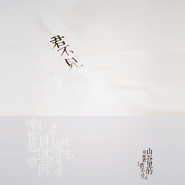

小娟&山谷里的居民
============================

|  |  |
| :--: | :-- |
| [ 小娟&山谷里的居民](https://i.xiami.com/valleychildren) | **地区**: China 中国大陆 **风格**: 城市民谣 Urban Folk, 民谣 Folk **播放数**: 24545558 **粉丝数**: 45871 **评论数**: 1465  |

## 档案

小娟&山谷里的居民(Valley Children)，北京独立民谣乐队。 
在城市里慢慢生长的一种音乐，清新自然的音乐风格，无为而为的歌唱态度，简单质朴的生活观念，随心而动，在生活中、舞台上还原最“近”的音乐，始终不变的是诚恳、自然、自由。 
在山谷里，音乐接近生活最本质的清香。 
主唱小娟、吉他黎强、口琴长笛刘晓光、打击乐荒井，有一种爱，希望用音乐的方式传递，让更多人听到。 
曾获北京流行音乐典礼“年度最受欢迎乐队”、华语音乐传媒大奖“最佳HIFI艺人”、华语金曲奖“最佳民谣艺人”、金号奖全国听众喜爱的歌手“最佳组合奖”。 
一直在路上，只因有歌要唱。 
小娟 主唱&木吉他 
来自武汉，3岁开始唱歌。民谣创作人，歌声如空谷幽兰，对生活给予的所有都回报一份简单质朴的热爱。1990年代发表个人创作，1998年成立小娟&山谷里的居民乐队。 
黎强 木吉他&竹笛&合音 
来自新疆，15岁开始自学古典吉他。内敛沉稳的风格，游刃有余的胸襟，描绘出山谷里童话色彩的晴空。1998年加入小娟&山谷里的居民乐队。 
刘晓光 长笛&口琴&键盘&合音 
来自内蒙，14岁开始专业学习萨克斯、钢琴。爵士乐手，致力于北京爵士乐的演奏和教学。孩子气的同时，在喧嚣繁杂的生活表面追寻宁静的内心感动。2008年加入小娟&山谷里的居民乐队。 
荒井（Arai Soichiro） 打击乐&鼓&合音 
来自香港，7岁开始学习打击乐，年少担任香港青年交响乐团打击乐首席。以会唱歌的手，敲击「一切皆是节奏」的音乐哲学。2009年加入小娟&山谷里的居民乐队。2011年获得华语音乐传媒大奖“最佳制作人”。现任“LP” Latin Percussion、“Sabian” Cymbals、"Protection Racket" Cases 亚洲区品牌形象代言人。 
【代表作品】 
《山谷里的居民》、《我的家》、《红布绿花朵》、《我的窗外》、《在你身边》、《菩提花开》 
【出版唱片】 
《如风往事》2007、《细说往事》2007、《红布绿花朵》2008、《红布绿花朵》（台湾版）2009 
《山谷里的音乐》（香港版EP）2009、《台北到淡水》2010、《孩子Tears for》（合辑）2011 
《C大调的城》（台湾版）2011、《C大调的城》2012、《Summer Flowers 生如夏花 DVD+CD》2014 
《君不见》2014

## 专辑

| 名称 | 语种 | 唱片公司 | 发行时间 | 专辑类别 | 专辑风格 |
| :--: | :-- | :-- | :-- | :-- | :-- |
| [ 山谷里的波萨诺瓦](./albums/2103216620.md) | 英语 | 龙源音乐, Ammunition Promotions Ltd | 2019年11月15日 | 录音室专辑 | 流行舞曲 Dance-Pop |
| [ 看云](./albums/2105160805.md) | 国语 | 有此山文化 | 2019年08月21日 | EP, 单曲 |  |
| [ 爱的路](./albums/2103699807.md) | 国语 | 木南十一文化 | 2018年05月03日 | 录音室专辑 | 独立民谣 Indie Folk, 民谣流行 Folk Pop |
| [ 心有花开](./albums/2100332100.md) | 国语 | 木南十一 | 2016年06月06日 | 录音室专辑 |  |
| [ 君不见山谷里的邓丽君](./albums/708007423.md) | 国语 | 龙源音乐 | 2014年07月20日 | 录音室专辑 | 城市民谣 Urban Folk |
| [ Summer Flowers 生如夏花小娟&山谷里的居民2013北京演唱会](./albums/1508427280.md) | 国语 | 龙源音乐 | 2014年01月01日 | 现场专辑 | 民谣流行 Folk Pop |
| [ C大调的城](./albums/487038.md) | 国语 | 龙源音乐 | 2012年01月01日 | 录音室专辑 | 城市民谣 Urban Folk |
| [ 台北到淡水](./albums/379798.md) | 国语 | 龙源音乐 | 2010年05月05日 | 录音室专辑 | 城市民谣 Urban Folk |
| [ 惦记](./albums/358412.md) | 国语 |  | 2009年11月14日 | 录音室专辑 | 城市民谣 Urban Folk |
| [ 彩色森林](./albums/424545.md) | 国语 |  | 2009年09月05日 | EP, 单曲 | 城市民谣 Urban Folk |
| [ 红布绿花朵](./albums/311906.md) | 国语 | 龙源音乐 | 2008年12月15日 | 录音室专辑 | 城市民谣 Urban Folk |
| [ 如风往事](./albums/32584.md) | 国语 |  | 2007年11月20日 | 录音室专辑 | 城市民谣 Urban Folk |
| [ 细说往事](./albums/169209.md) | 国语 |  | 2007年07月10日 | 录音室专辑 | 城市民谣 Urban Folk |

## 评论

|  |  |  |
| :-- | :-- | :-- |
|  [虾米用户](https://emumo.xiami.com/u/358104299) 悲观的唯心存在现实解构虚... 2020-12-28 12:14 赞(0) 踩(0) | 
44558
 |
|  [虾米用户](https://emumo.xiami.com/u/276944698) 不要自我设限..... 2020-08-12 18:19 赞(1) 踩(0) | 

 |
|  [虾米用户](https://emumo.xiami.com/u/419239903) 我还没想好要写什么... 2020-06-06 22:04 赞(0) 踩(0) | 
我要听到小娟山谷的居民你所有的歌 
 |
|  [虾米用户](https://emumo.xiami.com/u/400746622) 我还没想好要写什么... 2020-03-06 20:45 赞(0) 踩(0) | 
优美、动听
 |
|  [虾米用户](https://emumo.xiami.com/u/15577171) 不同的心境，不同的音乐～... 2019-10-31 12:10 赞(0) 踩(0) | 
有才华的人从来不会被埋没
 |
|  [虾米用户](https://emumo.xiami.com/u/268935002)  2019-08-31 09:26 赞(0) 踩(0) | 
温柔的声音，干净的音乐！让我们一起去《看云》用心去感受，生命中新的遇见，会有属于自己的新惊喜！
 |
|  [虾米用户](https://emumo.xiami.com/u/350169166) 没想好要写什么... 2019-07-09 20:20 赞(0) 踩(0) | 
这个声音太好听了  
 |
|  [虾米用户](https://emumo.xiami.com/u/411238851) 听就得了~嗨就够了~ 2019-06-27 11:31 赞(0) 踩(0) | 
很好的组合
 |
|  [虾米用户](https://emumo.xiami.com/u/4842408) 我还没想好要写什么... 2019-05-03 00:08 赞(0) 踩(0) | 
怀念于宙...
 |
|  [虾米用户](https://emumo.xiami.com/u/24347709) 叛逆到死。 2019-04-27 01:24 赞(1) 踩(0) | 
这样的夜晚，静谧风柔。 也许你该听一下小娟。 分享给有烦恼的朋友，失眠的朋友，焦虑的朋友。 同样分享给你，十年前写部落格的时候，有一位网友跟我说：The best is yet to come. 愿不急不徐，活在当下。 共勉。
 |
|  [虾米用户](https://emumo.xiami.com/u/325374787)  2019-04-18 21:06 赞(0) 踩(0) | 
好
 |
|  [虾米用户](https://emumo.xiami.com/u/358104299) 悲观的唯心存在现实解构虚... 2019-03-19 20:36 赞(1) 踩(0) | 
10431
 |
|  [虾米用户](https://emumo.xiami.com/u/252140750)  2019-03-10 07:32 赞(1) 踩(0) | 
这个小娟是中国火里的那个吗？
 |
|  [虾米用户](https://emumo.xiami.com/u/30652013) tonyhy 2018-12-19 12:04 赞(2) 踩(0) | 
单曲下架, 暂时还不能试听? 收藏到音乐库
 |
|  [虾米用户](https://emumo.xiami.com/u/407512009)  2018-11-13 21:10 赞(1) 踩(0) | 
这里也可以聊天吗？
 |
|  [虾米用户](https://emumo.xiami.com/u/3769376) 在一个人的世界里活出风雅 2018-10-27 14:18 赞(0) 踩(0) | 
多年前初听到小娟&amp;山谷里的居民，是至今为止最为灰暗的时期，她的声音如天籁般抚慰我的心灵。
 |
|  [虾米用户](https://emumo.xiami.com/u/7792186) 哈哈笨宝宝 2018-09-04 07:56 赞(1) 踩(0) | 
哈哈听了好几首，感觉小娟和赵咏华的声色有点像哦，但是在作曲风格上又大相径庭，仔细地听，这种沙哑点的嗓音，一股清流
 |
|  [虾米用户](https://emumo.xiami.com/u/150227922)  2018-08-19 22:07 赞(0) 踩(0) | 
喜欢那首《花房姑娘》可惜没有。
 |
|  [虾米用户](https://emumo.xiami.com/u/380102008)  2018-08-02 11:50 赞(0) 踩(0) | 
原来荒井十一出身是这里啊
 |
|  [虾米用户](https://emumo.xiami.com/u/10960751) 让心随着音乐飞 2018-07-13 22:13 赞(1) 踩(0) | 
在一个朗诵的配乐里发现了你，犹如发现了一片天空，《山谷里的居民》让我醉的不行了，我开始寻找你们所有的音乐，早上起床后蓝牙音箱里悠悠的传出了你的歌声。你的歌声纯静朴实，像和我在说话&amp;hellip;&amp;hellip;
 |
|  [虾米用户](https://emumo.xiami.com/u/210996371) 让一切随风 2018-07-03 20:30 赞(0) 踩(0) | 
雨后一定会有彩虹，相信我！
 |
|  [虾米用户](https://emumo.xiami.com/u/167342920) 记录我们这难忘的一年，以... 2018-06-21 15:20 赞(1) 踩(0) | 
荒井好帅
 |
|  [虾米用户](https://emumo.xiami.com/u/10775165) 喇嘛纤喏 2018-05-06 17:48 赞(0) 踩(0) | 
正在爨星音乐节听你们的现场～从此爱上你们！一听就是发自内心热爱音乐，用生命在抒写的组合。棒！
 |
|  [虾米用户](https://emumo.xiami.com/u/87606166)  2018-04-28 18:12 赞(0) 踩(0) | 
好听
 |
|  [虾米用户](https://emumo.xiami.com/u/4234256)  2018-04-21 22:16 赞(0) 踩(0) | 
目前看过最好的音乐现场
 |
|  [虾米用户](https://emumo.xiami.com/u/327335755)  2018-04-18 15:36 赞(0) 踩(0) | 
从多年前的第一张专辑开始，小娟的歌声已深入我心，任凭岁月流失无法忘记，已然是生命的一部分。
 |
|  [虾米用户](https://emumo.xiami.com/u/54539416)  2018-03-04 18:38 赞(0) 踩(0) | 
请问什么时候才能来成都演出啊 
 |
|  [虾米用户](https://emumo.xiami.com/u/224627237) 先帝创业未半而花完预算 2017-12-25 20:39 赞(0) 踩(0) | 
希望小娟上我是歌手
 |
| ⇒ |  [虾米用户](https://emumo.xiami.com/u/40320243)   2018-03-23 23:13 赞(0) 踩(0) | 
上了没人能懂
 |
| ⇒ |  [虾米用户](https://emumo.xiami.com/u/224627237) 先帝创业未半而花完预算 2018-03-23 23:14 赞(0) 踩(0) | 
<q><b>Чжан说：</b></q>
 |
|  [虾米用户](https://emumo.xiami.com/u/278888690)  2017-12-02 14:45 赞(0) 踩(0) | 
绝美小娟
 |
|  [虾米用户](https://emumo.xiami.com/u/48328609)  2017-10-30 09:54 赞(2) 踩(0) | 
公司 用作背景音乐 想把扬声系统砸了 听的想吐 午休时间刚完 这种慵懒，要死不活的声音就飘来了
 |
|  [虾米用户](https://emumo.xiami.com/u/253560726)  2017-10-29 16:25 赞(0) 踩(0) | 
歌曲挺好的。我喜欢！
 |
|  [虾米用户](https://emumo.xiami.com/u/7474859) 暂无签名~ 2017-10-28 00:40 赞(0) 踩(0) | 
情绪不好的时候听听心情就平复了，治愈系
 |
|  [虾米用户](https://emumo.xiami.com/u/1205546) 温澜潮生 2017-10-28 00:21 赞(0) 踩(0) | 
无为而为的创作态度，简单自然的生活观念，音乐路上心意相通、理想相近、甘苦与共的同伴。 向主唱敬佩
 |
|  [虾米用户](https://emumo.xiami.com/u/12360592) 简约低调乐观阳光 2017-10-28 00:15 赞(0) 踩(0) | 
这个版本的《南海姑娘》不错。发现乐队里的女成员都还不错啊，有女成员的乐队我都喜欢，哈哈哈哈哈
 |
| ⇒ |  [虾米用户](https://emumo.xiami.com/u/10147365) 未来，你好！ 2017-11-15 10:42 赞(0) 踩(0) | 
亲，你到底是故意还是真不知道呢，这乐队本来就只有小娟一个女的。 
 |
|  [虾米用户](https://emumo.xiami.com/u/1393420) 似是遥远往事，白云在天上... 2017-10-27 23:29 赞(1) 踩(0) | 
喜欢，清晰，轻快，自如，平衡，灵性。
 |
|  [虾米用户](https://emumo.xiami.com/u/1581231) 音乐与我同在 2017-10-27 23:09 赞(1) 踩(0) | 
小娟一开口就会摄住你的灵魂，让你把心放心交低；那是一种近乎神性，却又唾手可得的幸福。  可惜，没有了，怎么会下架了呢
 |
|  [虾米用户](https://emumo.xiami.com/u/1027211) 凝视人生聆听无常感悟万物 2017-10-27 23:04 赞(1) 踩(0) | 
全部歌曲竟然都被删除了！又是版权问题吗？其实好听的歌和有实力的歌手不需怕版权问题。当你们累积了数千上万的歌迷时，单单开演唱会所赚的钱应该能够维持歌手生涯吧。 没得听了。。。好遗憾！
 |
|  [虾米用户](https://emumo.xiami.com/u/1577400)  2017-10-17 06:21 赞(0) 踩(0) | 
喜欢民谣，喜欢随性温暖的嗓音。小娟的歌仿佛一阵山谷里的清风，总能平复我们躁动的心灵。
 |
|  [虾米用户](https://emumo.xiami.com/u/49604423)  2017-10-16 22:02 赞(0) 踩(0) | 
什么时候来广州啊小娟！等着。
 |
|  [虾米用户](https://emumo.xiami.com/u/324231624) 这家伙很聪明什么也没留下... 2017-09-10 21:14 赞(0) 踩(0) | 
亖着圈了？好喜欢❤️？？
 |
|  [虾米用户](https://emumo.xiami.com/u/295906890) 夕阳也有温度 2017-08-07 18:40 赞(1) 踩(0) | 
一曲晚风吹走了心里的忧郁
 |
|  [虾米用户](https://emumo.xiami.com/u/45723644) 我还没想好要写什么... 2017-05-25 17:56 赞(0) 踩(0) | 
山谷里的居民
 |
|  [虾米用户](https://emumo.xiami.com/u/276829124)  2017-05-06 19:59 赞(0) 踩(0) | 
喜欢空山幽谷般的声音，很想人如其声的她
 |
|  [虾米用户](https://emumo.xiami.com/u/276829124)  2017-05-06 19:59 赞(0) 踩(0) | 
喜欢空山幽谷般的声音，很想人如其声的她
 |
|  [虾米用户](https://emumo.xiami.com/u/68394924) 厚厚的想念，随月光蔓延。 2017-04-15 22:45 赞(0) 踩(0) | 

 |
|  [虾米用户](https://emumo.xiami.com/u/760301) 慈。 2017-03-27 15:07 赞(0) 踩(0) | 
谢谢这么多年的陪伴
 |
|  [虾米用户](https://emumo.xiami.com/u/48328609)  2017-03-02 18:03 赞(0) 踩(0) | 
千万别在颠覆原唱了
 |
|  [虾米用户](https://emumo.xiami.com/u/6082125) Standing and... 2017-02-13 20:30 赞(0) 踩(0) | 
真纯粹 默默支持
 |
|  [虾米用户](https://emumo.xiami.com/u/252258863)  2017-02-11 14:19 赞(1) 踩(0) | 
山谷里的居民
 |
|  [虾米用户](https://emumo.xiami.com/u/259995579)  2017-01-21 23:22 赞(0) 踩(0) | 
女主唱太丑了吧
 |
|  [虾米用户](https://emumo.xiami.com/u/43648786) 安静的知了 2017-01-04 22:06 赞(0) 踩(0) | 

 |
|  [虾米用户](https://emumo.xiami.com/u/658450)  2016-12-09 09:19 赞(0) 踩(0) | 
喜欢小娟
 |
|  [虾米用户](https://emumo.xiami.com/u/43050336)  2016-11-30 15:16 赞(0) 踩(0) | 
好听，喜欢！ 
 |
|  [虾米用户](https://emumo.xiami.com/u/119896142)   2016-08-26 01:04 赞(0) 踩(0) | 
[带墨镜笑][带墨镜笑]
 |
|  [虾米用户](https://emumo.xiami.com/u/337895) 全平台同名 2016-07-27 16:02 赞(0) 踩(0) | 
小娟上海站我组队了 有同去的就找我吧
 |
|  [虾米用户](https://emumo.xiami.com/u/71446596)  2016-07-18 11:48 赞(1) 踩(0) | 
期待成都的现场 听小娟八年多 终于可以感受现场啦
 |
|  [虾米用户](https://emumo.xiami.com/u/2117937)  2016-07-06 22:22 赞(0) 踩(0) | 
终于回来了，挺虾米！
 |
|  [虾米用户](https://emumo.xiami.com/u/6591523)  2016-06-19 16:12 赞(0) 踩(0) | 
唱的非常坦然自在
 |
|  [虾米用户](https://emumo.xiami.com/u/38801880)   2016-06-06 21:43 赞(1) 踩(0) | 
O(∩_∩)O
 |
|  [虾米用户](https://emumo.xiami.com/u/8140843)  2016-06-05 07:00 赞(0) 踩(0) | 
就在你身边，熟悉
 |
|  [虾米用户](https://emumo.xiami.com/u/14314609)  2016-05-28 16:11 赞(2) 踩(0) | 
付费吧， 这样的音乐 。  付费是开心的，是期待的。  希望你们得到我们的反馈，做的更好。 爱这种声音。
 |
|  [虾米用户](https://emumo.xiami.com/u/40706514) go on 2016-05-20 02:04 赞(3) 踩(0) | 
凌晨两点，沙发，灯，风扇，耳机，鸟的叫声
 |
|  [虾米用户](https://emumo.xiami.com/u/75888146) 我还没想好要写什么... 2016-05-14 12:06 赞(0) 踩(0) | 
魔性的声音
 |
|  [虾米用户](https://emumo.xiami.com/u/3496718) idle space 2016-05-12 22:49 赞(0) 踩(0) | 
这些封面都好清新，很喜欢，安安静静做音乐，真好~~~
 |
|  [虾米用户](https://emumo.xiami.com/u/2623574)  2016-05-12 13:30 赞(0) 踩(0) | 
主唱声音好像赵咏华...
 |
|  [虾米用户](https://emumo.xiami.com/u/103682130) ^_^ 2016-05-08 01:09 赞(0) 踩(0) | 
快下载！
 |
|  [虾米用户](https://emumo.xiami.com/u/103682130) ^_^ 2016-05-08 01:09 赞(0) 踩(0) | 
今晚太享受了，太棒了。
 |
|  [虾米用户](https://emumo.xiami.com/u/36057872) 网易/BC: Breat... 2016-05-06 12:42 赞(0) 踩(0) | 
蓝色的窗外
 |
|  [虾米用户](https://emumo.xiami.com/u/13945602) 美好肉体，穿透迷妄，向现... 2016-04-25 16:10 赞(0) 踩(0) | 
大赞！
 |
|  [虾米用户](https://emumo.xiami.com/u/46450125)  2016-04-11 14:02 赞(0) 踩(0) | 
《空白》呢 
 |
|  [虾米用户](https://emumo.xiami.com/u/8880896)  2016-03-29 22:24 赞(0) 踩(0) | 
我已痴醉，想烫个爆炸头，穿上八分裤。春在岁岁年年
 |
|  [虾米用户](https://emumo.xiami.com/u/23197052)  2016-03-27 00:51 赞(0) 踩(0) | 
泥土的芬芳~
 |
|  [虾米用户](https://emumo.xiami.com/u/89262) 音乐于我这乏味的一生如同... 2016-03-20 12:10 赞(1) 踩(0) | 
你们那首往事随风呢？怎么不见了？
 |
|  [虾米用户](https://emumo.xiami.com/u/44204722) 暂无签名~ 2016-03-19 08:29 赞(0) 踩(0) | 
能静下来听得音乐
 |
|  [虾米用户](https://emumo.xiami.com/u/8573225) 海中航行 2016-03-17 21:54 赞(0) 踩(0) | 
很清雅！高贵
 |
|  [虾米用户](https://emumo.xiami.com/u/48234918)   2016-03-17 20:01 赞(0) 踩(0) | 
记得之前把能找到的每首歌都听了。这几天听好妹妹突然又想起来了，打名字发现只有两首歌的资源心想可惜了，结果今天推荐歌单里就出现了~原来把&amp;amp;换成和就搜不到了呀。。。虾米有点不智能歪~
 |
|  [虾米用户](https://emumo.xiami.com/u/111689134)   2016-03-09 13:43 赞(0) 踩(0) | 
轻柔如风
 |
|  [虾米用户](https://emumo.xiami.com/u/46310149)  2016-01-07 16:33 赞(0) 踩(0) | 
舒服、放松
 |
|  [虾米用户](https://emumo.xiami.com/u/84369340)   2016-01-04 12:12 赞(0) 踩(0) | 
高质量的音质，年费500元我接受.
 |
|  [虾米用户](https://emumo.xiami.com/u/48328609)  2015-12-02 13:56 赞(0) 踩(0) | 
狠死她唱的歌了，一年365天 每中午上班前 一直是她的歌 ，病泱泱的 
 |
|  [虾米用户](https://emumo.xiami.com/u/53793891) 为这个音乐的世界… 2015-11-25 01:42 赞(4) 踩(0) | 
在好妹妹那边听到合唱过来的
 |
| ⇒ |  [虾米用户](https://emumo.xiami.com/u/3465331) 破阵子 2016-01-21 13:19 赞(0) 踩(0) | 
同上
 |
|  [虾米用户](https://emumo.xiami.com/u/55227914) 微博无法理性探讨问题，但... 2015-11-21 21:58 赞(0) 踩(0) | 
可以收费 500一年 高音质 我可以接受
 |
|  [虾米用户](https://emumo.xiami.com/u/43888261)  2015-11-02 23:28 赞(0) 踩(0) | 
声音好听，可惜原创不如翻唱
 |
|  [虾米用户](https://emumo.xiami.com/u/75105902) ? 2015-11-02 19:02 赞(0) 踩(0) | 
好听
 |
|  [虾米用户](https://emumo.xiami.com/u/35509231) 提灯天后  策马小僧 2015-10-29 10:07 赞(3) 踩(0) | 
一开始听小娟，觉得声音是空心儿的，女孩子气。后来听了程壁，我收回之前的想法又跑回来听我中气十足的小娟了。
 |
|  [虾米用户](https://emumo.xiami.com/u/11991533) 2B/Not2B 2015-10-27 21:56 赞(0) 踩(0) | 
命中注定  是不是？
 |
|  [虾米用户](https://emumo.xiami.com/u/30617820) 窝列大窝列大哟 2015-10-20 15:26 赞(0) 踩(0) | 
=..=
 |
|  [虾米用户](https://emumo.xiami.com/u/655348)   2015-10-16 11:12 赞(0) 踩(0) | 
民谣
 |
|  [虾米用户](https://emumo.xiami.com/u/7289378)  2015-10-11 21:59 赞(0) 踩(0) | 
被妹子的声线吸引进来啦
 |
|  [虾米用户](https://emumo.xiami.com/u/9072248) 知音否？ 2015-10-10 17:42 赞(0) 踩(0) | 
菩提花开！
 |
|  [虾米用户](https://emumo.xiami.com/u/33754219) 溺毙在 2015-10-05 10:26 赞(0) 踩(0) | 
往事随风！！！！？？？？ 
 |
|  [虾米用户](https://emumo.xiami.com/u/36081194) 酷狗音乐，一个有老歌的地... 2015-10-02 21:18 赞(0) 踩(0) | 
喜欢
 |
|  [虾米用户](https://emumo.xiami.com/u/3020994)  2015-09-25 18:54 赞(0) 踩(0) | 
还有几张专辑呢？
 |
|  [虾米用户](https://emumo.xiami.com/u/1851561)  2015-09-21 17:19 赞(4) 踩(0) | 
虽然主唱是小娟，但黎强、刘晓光、荒井桑声线都不错的呢！！ 都出个solo才好呢！！！哈哈哈
 |
|  [虾米用户](https://emumo.xiami.com/u/1851561)  2015-09-13 15:00 赞(1) 踩(0) | 
永隔一江水，1980年代的爱情 基调真的绝配！！！！
 |
|  [虾米用户](https://emumo.xiami.com/u/4911883) 如果你也爱Eason 2015-09-12 22:10 赞(0) 踩(0) | 
专辑不全啊为什么
 |
|  [虾米用户](https://emumo.xiami.com/u/16114260) 閉上眼，聽雨落… 2015-09-12 20:20 赞(0) 踩(0) | 
你们做的音乐很好听，耳朵很享受，打算做个新集子放进去~
 |
|  [虾米用户](https://emumo.xiami.com/u/7537140) 我还没想好要写什么... 2015-09-02 22:15 赞(1) 踩(0) | 
哎呀妈呀！你又回来了！
 |
|  [虾米用户](https://emumo.xiami.com/u/37098145) 这个家伙太蠢了不会留下什... 2015-09-01 04:32 赞(0) 踩(0) | 
wk
 |
|  [虾米用户](https://emumo.xiami.com/u/15278047) 没个性 不签名 2015-08-20 11:44 赞(0) 踩(0) | 
宛如空谷佳人
 |
|  [虾米用户](https://emumo.xiami.com/u/45178866)   2015-08-20 11:42 赞(0) 踩(0) | 
宛如空谷佳人
 |
|  [虾米用户](https://emumo.xiami.com/u/456860) 自己耕耘，自己收获 2015-08-12 21:18 赞(0) 踩(0) | 
慵懒的，淡淡的，情歌也没有一点点伤感，这样甚好
 |
|  [虾米用户](https://emumo.xiami.com/u/5880347)   2015-08-11 19:48 赞(0) 踩(0) | 
干净  纯洁
 |
|  [虾米用户](https://emumo.xiami.com/u/718178)   2015-08-05 12:33 赞(0) 踩(0) | 
。。。。。
 |
|  [虾米用户](https://emumo.xiami.com/u/3635966) 哥不是迷 只是传说 2015-08-04 13:33 赞(1) 踩(0) | 
好好
 |
|  [虾米用户](https://emumo.xiami.com/u/10088250) 自己的国王 2015-08-04 09:08 赞(0) 踩(0) | 
什么时候能再来次深圳呢QAQ
 |
|  [虾米用户](https://emumo.xiami.com/u/8566739) 今晚打边炉啊 2015-07-23 12:28 赞(0) 踩(0) | 
留名
 |
|  [虾米用户](https://emumo.xiami.com/u/904822) 我在虾米，听音乐——晓龙 2015-07-18 09:40 赞(1) 踩(0) | 
民谣
 |
|  [虾米用户](https://emumo.xiami.com/u/51493723) 21世纪，李二蛋的一天及... 2015-07-11 23:23 赞(0) 踩(0) | 
江苏徐州根音朋克贝斯组乐队
 |
|  [虾米用户](https://emumo.xiami.com/u/12472771) 月入歌扇，花承节鼓 2015-06-26 22:37 赞(0) 踩(0) | 
我不再让你孤单～ 最爱的一首
 |
|  [虾米用户](https://emumo.xiami.com/u/23537204)  2015-06-13 13:19 赞(0) 踩(0) | 
这女声，如此纯净，还有种无法言明的独特个性，典雅？率真？诗意？宁静？这些词都不足以描述这透入心底的声音。不知道山谷里的人们什么时候到武汉，现场版自然不是耳机能媲美的了
 |
|  [虾米用户](https://emumo.xiami.com/u/3149830)  2015-05-31 23:47 赞(3) 踩(0) | 
陪伴了我多少年，山谷里的居民，现在已转到钢筋混凝土的屋子里，没有了芳草香，没有了泥巴鞋
 |
|  [虾米用户](https://emumo.xiami.com/u/1446973)  2015-05-27 21:10 赞(0) 踩(0) | 
我主要就爱听老妇女半死不活的
 |
|  [虾米用户](https://emumo.xiami.com/u/43074519) 默然心生欢喜的一瞬 2015-05-24 18:27 赞(0) 踩(0) | 
空谷的声音  
 |
|  [虾米用户](https://emumo.xiami.com/u/32980856)  2015-05-20 16:20 赞(1) 踩(0) | 
空谷幽兰，让人忘记世俗的烦恼
 |
|  [虾米用户](https://emumo.xiami.com/u/35950839) 我是尹弋，不是尹戈。 2015-05-12 15:30 赞(0) 踩(0) | 
SHU FU
 |
|  [虾米用户](https://emumo.xiami.com/u/46558847)  2015-05-12 14:44 赞(1) 踩(0) | 
真
 |
|  [虾米用户](https://emumo.xiami.com/u/28493255) 404 2015-05-06 23:40 赞(0) 踩(0) | 
好听，想要买专辑啦
 |
|  [虾米用户](https://emumo.xiami.com/u/42893718) 音乐永恒！ 2015-05-05 11:14 赞(1) 踩(0) | 
没有往事随风和爱在深秋
 |
|  [虾米用户](https://emumo.xiami.com/u/9782016) 压力转动力。 2015-05-03 21:24 赞(1) 踩(0) | 
纯粹的声音
 |
|  [虾米用户](https://emumo.xiami.com/u/15951049)  2015-04-28 23:43 赞(1) 踩(0) | 
好想听现场
 |
|  [虾米用户](https://emumo.xiami.com/u/49510402)  2015-04-25 01:42 赞(0) 踩(0) | 
为什么没有海上花！！
 |
|  [虾米用户](https://emumo.xiami.com/u/1591181)  2015-04-24 21:16 赞(0) 踩(0) | 
舒适 宁静
 |
|  [虾米用户](https://emumo.xiami.com/u/9717528) 但行好事 莫问前程 2015-04-22 19:56 赞(0) 踩(0) | 
为什么没有往事随风
 |
|  [虾米用户](https://emumo.xiami.com/u/49326356)  2015-04-18 11:45 赞(0) 踩(0) | 
空灵，让人感觉到安静，心情舒畅
 |
|  [虾米用户](https://emumo.xiami.com/u/12181015) 朝闻佳音，夕可死矣。 2015-04-01 23:27 赞(2) 踩(0) | 
怎么没有离家500里
 |
| ⇒ |  [虾米用户](https://emumo.xiami.com/u/598006) 飞越黑夜和考验 2015-05-31 18:50 赞(0) 踩(0) | 
我也最喜欢这首
 |
| ⇒ |  [虾米用户](https://emumo.xiami.com/u/12181015) 朝闻佳音，夕可死矣。 2015-05-31 20:23 赞(0) 踩(0) | 
<q><b>Cantaniii说：</b></q>
 |
|  [虾米用户](https://emumo.xiami.com/u/10428898)   2015-03-27 10:17 赞(2) 踩(0) | 
开车听，不会超速。
 |
|  [虾米用户](https://emumo.xiami.com/u/8252489) 世界本安静，喧闹是人心 2015-03-23 22:01 赞(0) 踩(0) | 
高兴
 |
|  [虾米用户](https://emumo.xiami.com/u/348356)   2015-03-23 16:04 赞(0) 踩(0) | 
阿弥陀佛在心间
 |
|  [虾米用户](https://emumo.xiami.com/u/4114108) 暂无签名~ 2015-03-21 21:34 赞(0) 踩(0) | 
清新  淡雅
 |
|  [虾米用户](https://emumo.xiami.com/u/11393058)  2015-03-19 18:25 赞(0) 踩(0) | 
怀旧
 |
|  [虾米用户](https://emumo.xiami.com/u/41863054) 禅工作室 2015-03-16 17:55 赞(0) 踩(0) | 
阳光
 |
|  [虾米用户](https://emumo.xiami.com/u/2351903) 你可知我从此居无定所。 2015-03-10 22:39 赞(0) 踩(0) | 
不想破坏这个数字的可是
 |
|  [虾米用户](https://emumo.xiami.com/u/43173766) 算了我放下了   再会吧... 2015-03-05 21:03 赞(0) 踩(0) | 
1314
 |
|  [虾米用户](https://emumo.xiami.com/u/46606701)   2015-03-03 20:42 赞(0) 踩(0) | 
我有如風往事和細說往事吖咋傳給蝦米？給大家分享？
 |
| ⇒ |  [虾米用户](https://emumo.xiami.com/u/3921021) 平淡的生活不能将我们击倒 2015-03-21 23:40 赞(0) 踩(0) | 
求啊求啊，有云盘链接么？
 |
| ⇒ |  [虾米用户](https://emumo.xiami.com/u/46606701)   2015-03-22 21:03 赞(0) 踩(0) | 
<q><b>Simply08说：</b></q>
 |
| ⇒ |  [虾米用户](https://emumo.xiami.com/u/3921021) 平淡的生活不能将我们击倒 2015-03-22 21:03 赞(0) 踩(0) | 
<q><b>abc12345音樂说：</b></q>
 |
| ⇒ |  [虾米用户](https://emumo.xiami.com/u/46606701)   2015-03-22 21:09 赞(0) 踩(0) | 
<q><b>Simply08说：</b></q>
 |
| ⇒ |  [虾米用户](https://emumo.xiami.com/u/3921021) 平淡的生活不能将我们击倒 2015-03-22 21:10 赞(0) 踩(0) | 
<q><b>abc12345音樂说：</b></q>
 |
| ⇒ |  [虾米用户](https://emumo.xiami.com/u/46606701)   2015-03-22 21:14 赞(0) 踩(0) | 
<q><b>Simply08说：</b></q>
 |
|  [虾米用户](https://emumo.xiami.com/u/46606701)   2015-03-03 20:23 赞(0) 踩(0) | 
找不着：《往事如风》《細說往事》我喜欢07.08年。早期嗯！
 |
|  [虾米用户](https://emumo.xiami.com/u/11151712)  2015-02-27 10:53 赞(0) 踩(0) | 
首页推荐的还不如《红布绿花朵》专辑里的成色好
 |
|  [虾米用户](https://emumo.xiami.com/u/11151712)  2015-02-27 08:06 赞(0) 踩(0) | 
最早是多年前听的&amp;lt;细说往事&amp;gt;，很放松的曲风
 |
|  [虾米用户](https://emumo.xiami.com/u/43888261)  2015-02-25 12:03 赞(1) 踩(0) | 
缺了 如风往事 专辑
 |
|  [虾米用户](https://emumo.xiami.com/u/39131443)   2015-02-22 14:52 赞(1) 踩(0) | 
电视上看见你真是无比激动
 |
| ⇒ |  [虾米用户](https://emumo.xiami.com/u/11151712)  2015-02-27 07:58 赞(0) 踩(0) | 
湖北卫视春晚
 |
|  [虾米用户](https://emumo.xiami.com/u/296069) 暂无签名~ 2015-02-21 20:41 赞(1) 踩(0) | 
上湖北卫视春晚了，恭喜
 |
|  [虾米用户](https://emumo.xiami.com/u/20856698)  2015-02-21 06:44 赞(1) 踩(0) | 
太好听了，舒服
 |
|  [虾米用户](https://emumo.xiami.com/u/1533433) 岁月如歌，时光如谜。涅槃... 2015-02-14 10:36 赞(0) 踩(0) | 
情人节快乐~
 |
|  [虾米用户](https://emumo.xiami.com/u/1988060) Electrow 2015-02-08 01:55 赞(0) 踩(0) | 
1301
 |
|  [虾米用户](https://emumo.xiami.com/u/556227) invisible 2015-02-04 02:04 赞(1) 踩(0) | 
没有那首特别特别特别喜欢的往事随风
 |
|  [虾米用户](https://emumo.xiami.com/u/8958916) 天気不錯 2015-02-01 13:06 赞(1) 踩(0) | 
天空之城唱得有种在打哈欠的感觉233
 |
|  [虾米用户](https://emumo.xiami.com/u/39577409) 热爱生活/热爱生命  去... 2015-01-25 22:58 赞(1) 踩(0) | 
我没忘记你忘记我
 |
|  [虾米用户](https://emumo.xiami.com/u/1050107) 若见诸相非相即见如来，凡... 2015-01-15 12:45 赞(3) 踩(0) | 
北方人的深喉怎么都撸不出南方人的味道
 |
| ⇒ |  [虾米用户](https://emumo.xiami.com/u/6377726) 低头思故乡…… 2015-01-21 23:32 赞(0) 踩(0) | 
湖北算北方？地理老师不会瞑目的……
 |
| ⇒ |  [虾米用户](https://emumo.xiami.com/u/1878487)  2015-02-09 01:55 赞(0) 踩(0) | 
魏如萱的深喉不服！wwwww
 |
|  [虾米用户](https://emumo.xiami.com/u/39788841)  . 2015-01-14 13:27 赞(0) 踩(0) | 
棒棒哒
 |
|  [虾米用户](https://emumo.xiami.com/u/10297818) 梦幻泡影  如露如电 2015-01-13 19:53 赞(0) 踩(0) | 
好好听啊！
 |
|  [虾米用户](https://emumo.xiami.com/u/2066472) 扛过、撑过、拼过、奔过… 2015-01-09 09:07 赞(0) 踩(0) | 
部分回归？
 |
|  [虾米用户](https://emumo.xiami.com/u/34605736) 声音载动生命的美 2015-01-06 12:56 赞(0) 踩(0) | 
声音太甜了。可是，怎么说呢，先藏起来
 |
|  [虾米用户](https://emumo.xiami.com/u/8358905)  2015-01-06 00:59 赞(0) 踩(0) | 
为什么没有不再让你孤单！！！
 |
|  [虾米用户](https://emumo.xiami.com/u/11389164)  2014-12-30 23:30 赞(0) 踩(0) | 
******
 |
|  [虾米用户](https://emumo.xiami.com/u/11389164)  2014-12-30 23:28 赞(0) 踩(0) | 
******
 |
|  [虾米用户](https://emumo.xiami.com/u/37149364) 我不是不爱你 看不到自己... 2014-12-28 23:16 赞(0) 踩(0) | 
有点天籁的感觉 蛮纯净的~
 |
|  [虾米用户](https://emumo.xiami.com/u/10059981)  2014-12-26 11:34 赞(1) 踩(0) | 
丽江淘碟淘到的音乐，很喜欢小娟舒服的声音。
 |
| ⇒ |  [虾米用户](https://emumo.xiami.com/u/2257555) Enoc 2015-01-02 22:35 赞(0) 踩(0) | 
我也是！！！
 |
|  [虾米用户](https://emumo.xiami.com/u/10606834) 生如蚁而美如神 2014-12-25 17:40 赞(0) 踩(0) | 
有一种空谷的感觉，不过还是觉得这个组合需要更好的作品
 |
|  [虾米用户](https://emumo.xiami.com/u/1533433) 岁月如歌，时光如谜。涅槃... 2014-12-25 10:37 赞(2) 踩(0) | 
☆　　╱╲*╱╲　☆ ╱╳+▲╱　　╲　☆ ╱╱　◢◣+　　╳╲ ╱　+◢█◣　／　　╲☆ ☆　◢██◣ Merry ___▂▂█▂Christmas~~
 |
|  [虾米用户](https://emumo.xiami.com/u/45200575)  2014-12-23 10:55 赞(0) 踩(0) | 
无语的温柔，还不错哦
 |
|  [虾米用户](https://emumo.xiami.com/u/5851736) 我们来聊章北海！ 2014-12-22 14:27 赞(0) 踩(0) | 
欣赏不来这主唱。唱得若隐若现的听到就够了。饭没吃饱嗦
 |
|  [虾米用户](https://emumo.xiami.com/u/45044903) 如约而至 2014-12-19 00:34 赞(0) 踩(0) | 
天空之城在我伤心的那段往日每天陪着我，那种想哭却哭不出来的感觉，越听越伤感，但是却一直想听，听着这首歌才能让我睡去
 |
|  [虾米用户](https://emumo.xiami.com/u/6246856) 快乐快乐 2014-12-18 09:10 赞(0) 踩(0) | 
没办想听小娟的歌只有买 CD了
 |
|  [虾米用户](https://emumo.xiami.com/u/44531967)   2014-12-08 00:04 赞(0) 踩(0) | 
专辑不全呀
 |
|  [虾米用户](https://emumo.xiami.com/u/7769980) horseman, pa... 2014-12-06 13:49 赞(0) 踩(0) | 
不太喜欢主唱的声音，不够纯澈
 |
|  [虾米用户](https://emumo.xiami.com/u/7127226) 自由，自由 2014-12-04 13:27 赞(0) 踩(0) | 
欢迎回来
 |
|  [虾米用户](https://emumo.xiami.com/u/15848576)  2014-12-01 13:52 赞(0) 踩(0) | 
******
 |
|  [虾米用户](https://emumo.xiami.com/u/22186675) 我还没想好要写什么... 2014-11-13 11:21 赞(0) 踩(0) | 

 |
|  [虾米用户](https://emumo.xiami.com/u/3065839)  2014-10-31 18:11 赞(0) 踩(0) | 
好歌就是那种无意中点进来，听了后不在意，但会在某天早晨迷迷糊糊的脑海浮现。
 |
|  [虾米用户](https://emumo.xiami.com/u/39611781)  2014-10-30 08:57 赞(0) 踩(0) | 
虾米不给力呀！怎么没有07年那张，细说往事呀？
 |
|  [虾米用户](https://emumo.xiami.com/u/11824601)  2014-10-17 10:55 赞(1) 踩(0) | 
喜欢
 |
|  [虾米用户](https://emumo.xiami.com/u/1730251)  2014-10-07 02:06 赞(0) 踩(0) | 
无法忍受的是唱片价格。。。有一些接近100的还是可以接受
 |
|  [虾米用户](https://emumo.xiami.com/u/15378674) 你懷念的，我緬懷的。 2014-10-05 23:19 赞(0) 踩(0) | 
轻轻的记忆。
 |
|  [虾米用户](https://emumo.xiami.com/u/9541152)  2014-10-05 22:32 赞(0) 踩(0) | 
非常喜欢女声！
 |
|  [虾米用户](https://emumo.xiami.com/u/14138237)  2014-10-03 16:33 赞(1) 踩(0) | 
终于又可以在虾米听到小娟的歌了
 |
| ⇒ |  [虾米用户](https://emumo.xiami.com/u/9072248) 知音否？ 2014-10-07 09:29 赞(0) 踩(0) | 
等好久了
 |
| ⇒ |  [虾米用户](https://emumo.xiami.com/u/26150922) @ 2014-10-28 11:13 赞(0) 踩(0) | 
dvvlkk by E dtrp I'll h
 |
|  [虾米用户](https://emumo.xiami.com/u/2331726)  2014-09-30 11:27 赞(0) 踩(0) | 
超好听！最近听到的最耳目一新的一首歌！
 |
|  [虾米用户](https://emumo.xiami.com/u/10517016)  2014-09-30 10:31 赞(0) 踩(0) | 
小娟&amp;amp;山谷里的居民,空灵感,舒服,
 |
|  [虾米用户](https://emumo.xiami.com/u/41304284)  2014-09-28 21:54 赞(0) 踩(0) | 
女声无伴奏唱法
 |
|  [虾米用户](https://emumo.xiami.com/u/4874803)  2014-09-27 17:07 赞(0) 踩(0) | 
fs
 |
|  [虾米用户](https://emumo.xiami.com/u/5443127) COMING SOON 2014-09-21 15:17 赞(0) 踩(0) | 
就是这么喜欢荒井
 |
|  [虾米用户](https://emumo.xiami.com/u/296405)  2014-09-21 02:04 赞(0) 踩(0) | 
清丽出尘
 |
|  [虾米用户](https://emumo.xiami.com/u/12235628) 虾米，你要早点回家 2014-09-20 14:23 赞(0) 踩(0) | 
好美
 |
|  [虾米用户](https://emumo.xiami.com/u/9976908) 双重人格 2014-09-19 12:17 赞(0) 踩(0) | 
终于是回来了
 |
|  [虾米用户](https://emumo.xiami.com/u/39931853)  2014-09-19 00:12 赞(0) 踩(0) | 
符合我最近的主题
 |
|  [虾米用户](https://emumo.xiami.com/u/948045)  2014-09-18 11:18 赞(0) 踩(0) | 
又回来了。真好。
 |
|  [虾米用户](https://emumo.xiami.com/u/10337212) 卡路 2014-09-13 20:19 赞(0) 踩(0) | 
空灵如仙音！
 |
|  [虾米用户](https://emumo.xiami.com/u/3391097)  2014-09-13 17:03 赞(0) 踩(0) | 
小娟可回来了
 |
|  [虾米用户](https://emumo.xiami.com/u/2117937)  2014-09-09 22:11 赞(0) 踩(0) | 
虾米终于再次把小娟找回来了。大爱小娟，大爱民谣。
 |
|  [虾米用户](https://emumo.xiami.com/u/7795058) 弦如字画，或空月过鸟 2014-09-08 12:07 赞(0) 踩(0) | 
中秋节快乐~~
 |
|  [虾米用户](https://emumo.xiami.com/u/6401106) 欲说还休 2014-09-06 22:18 赞(0) 踩(0) | 
没有《海上花》
 |
|  [虾米用户](https://emumo.xiami.com/u/10463162) 向银河开炮 2014-09-04 19:40 赞(0) 踩(0) | 
回来了！虾米这两天不停推给我，怕人不知道一样，哈哈。
 |
|  [虾米用户](https://emumo.xiami.com/u/8422716)  2014-09-03 21:52 赞(0) 踩(0) | 
又上架啦~开心！
 |
|  [虾米用户](https://emumo.xiami.com/u/38458478)  2014-09-03 03:38 赞(0) 踩(0) | 
红布绿花朵...好喜欢
 |
|  [虾米用户](https://emumo.xiami.com/u/40222678)  2014-08-31 13:19 赞(0) 踩(0) | 
不错
 |
|  [虾米用户](https://emumo.xiami.com/u/10983386) 瘦子 朝夕奔梦 2014-08-31 00:44 赞(0) 踩(0) | 
怎么没有500米啊 唱的很好听
 |
|  [虾米用户](https://emumo.xiami.com/u/1675602)  2014-08-30 00:42 赞(0) 踩(0) | 
第一次听，好听得不可思议。
 |
|  [虾米用户](https://emumo.xiami.com/u/25133765)  2014-08-29 10:06 赞(0) 踩(0) | 
听黎强的《在水一方》，简单朴素，声线也干净温暖。心就这么动了
 |
|  [虾米用户](https://emumo.xiami.com/u/8128176) 好好活着 2014-08-28 23:59 赞(0) 踩(0) | 
往事随风呢
 |
|  [虾米用户](https://emumo.xiami.com/u/37135072) I want my dr... 2014-08-28 19:00 赞(0) 踩(0) | 
诶 怎么突然又有了！
 |
|  [虾米用户](https://emumo.xiami.com/u/18411535) 暂无签名~ 2014-08-28 17:28 赞(0) 踩(0) | 
终于找你了
 |
|  [虾米用户](https://emumo.xiami.com/u/3186837) 空。 2014-08-28 15:40 赞(0) 踩(0) | 
当年学校校庆的时候，邀请他们演唱，那时候就很喜欢，现在虾米总算有他们了。可是高中回不去了。
 |
|  [虾米用户](https://emumo.xiami.com/u/11454373) 从头再来飞得更高 2014-08-27 13:27 赞(0) 踩(0) | 
虾米搞成全付费的吧，早晚的事，偷偷摸摸总不是事。发展到一定阶段真得壮士断腕。年费500以下我就可以接受。也省得看到那些没免费午餐吃了就骂娘的。舍不得的是虾米这样一个真正以音乐为中心的平台，齐全的专辑，每首歌都有的评论，精选集，曲风分类都很棒。
 |
| ⇒ |  [虾米用户](https://emumo.xiami.com/u/4072169)  2014-08-28 07:06 赞(0) 踩(0) | 
很喜欢这家公司，现在被淘宝网慧眼看中了。
 |
|  [虾米用户](https://emumo.xiami.com/u/3388223)  2014-08-26 09:23 赞(0) 踩(0) | 
简单 舒服
 |
|  [虾米用户](https://emumo.xiami.com/u/10463237) 我还没想好要写什么... 2014-08-26 01:26 赞(0) 踩(0) | 
+1
 |
|  [虾米用户](https://emumo.xiami.com/u/13316084) zqsfreedom 2014-08-25 23:13 赞(0) 踩(0) | 
路过
 |
|  [虾米用户](https://emumo.xiami.com/u/7207959) 我还没想好要写什么... 2014-08-25 16:43 赞(0) 踩(0) | 
非常动听的音乐…
 |
|  [虾米用户](https://emumo.xiami.com/u/2307526) 连接比特与像素的造梦师！ 2014-08-25 14:53 赞(0) 踩(0) | 
天空之城 (吟唱版)！
 |
|  [虾米用户](https://emumo.xiami.com/u/20360406)  2014-08-25 14:07 赞(0) 踩(0) | 
山谷的声音。
 |
|  [虾米用户](https://emumo.xiami.com/u/1953202) 这是神马功能 2014-08-25 11:46 赞(0) 踩(0) | 
从天空之城 认识 他们的，于是 下载了当时找到的所有曲目 。 没有过特意的关注，但总是喜欢的。
 |
|  [虾米用户](https://emumo.xiami.com/u/64696) 新浪微博@破产美剧迷 2014-08-25 10:18 赞(0) 踩(0) | 
enya
 |
|  [虾米用户](https://emumo.xiami.com/u/3949817)  2014-08-25 09:22 赞(0) 踩(0) | 
终于又回来了，小娟，带着泥土般的清新味道，还是一如既往地空灵浅浅吟唱。。。能被更多人认识喜爱，才是专业歌手的价值所在！虾米的努力，也是功不可没。
 |
|  [虾米用户](https://emumo.xiami.com/u/12966527) 我还没想好要写什么... 2014-08-25 07:57 赞(0) 踩(0) | 
终于又有了
 |
|  [虾米用户](https://emumo.xiami.com/u/685118) 精神有洁癖的自闭症患者 2014-08-24 23:28 赞(0) 踩(0) | 
小娟&amp;amp;山谷里的居民终于在虾米上又回来啦！
 |
|  [虾米用户](https://emumo.xiami.com/u/31855998) Merrisa 2014-08-24 13:01 赞(0) 踩(0) | 
+1
 |
|  [虾米用户](https://emumo.xiami.com/u/8973703)  2014-08-24 08:45 赞(0) 踩(0) | 
1+1
 |
|  [虾米用户](https://emumo.xiami.com/u/3196350)  2014-08-24 03:21 赞(0) 踩(0) | 
+10
 |
|  [虾米用户](https://emumo.xiami.com/u/34483589) 相聚离开，都有时候，没有... 2014-08-24 00:23 赞(0) 踩(0) | 
原来唱过天空之城，是不是她？
 |
| ⇒ |  [虾米用户](https://emumo.xiami.com/u/7555497)  2014-08-24 10:10 赞(0) 踩(0) | 
dei ！
 |
|  [虾米用户](https://emumo.xiami.com/u/25818509)  2014-08-23 23:43 赞(0) 踩(0) | 
淡淡的，喜欢
 |
|  [虾米用户](https://emumo.xiami.com/u/32187440) 古典小清新摇滚金属核都听... 2014-08-23 19:35 赞(0) 踩(0) | 
啊终于录进虾米了〒_〒！！！开心哭！！！
 |
|  [虾米用户](https://emumo.xiami.com/u/4134393) 这家伙很聪明什么也没留下... 2014-08-23 18:50 赞(0) 踩(0) | 
最喜欢他们翻唱的《往事随风》吖，可惜找不到了...
 |
|  [虾米用户](https://emumo.xiami.com/u/2357714) 小猪哼哼来。。。 2014-08-23 15:06 赞(0) 踩(0) | 
哼哼求以前翻唱的专辑也放上来，哼哼好吗？
 |
|  [虾米用户](https://emumo.xiami.com/u/40301884)  2014-08-23 14:54 赞(0) 踩(0) | 
很清心
 |
|  [虾米用户](https://emumo.xiami.com/u/18448145)  2014-08-23 13:58 赞(0) 踩(0) | 
good
 |
|  [虾米用户](https://emumo.xiami.com/u/7511683)  2014-08-23 12:37 赞(0) 踩(0) | 
什么时候来福建演出？
 |
|  [虾米用户](https://emumo.xiami.com/u/5884394) rizar 2014-08-23 11:59 赞(0) 踩(0) | 
加油+1
 |
|  [虾米用户](https://emumo.xiami.com/u/8924309) 我还没想好要写什么... 2014-08-23 04:20 赞(0) 踩(0) | 
左边站着那位是罗永浩吗。。。。。
 |
|  [虾米用户](https://emumo.xiami.com/u/22833188) 将心比心 2014-08-23 01:27 赞(0) 踩(0) | 
还是喜欢原版！
 |
|  [虾米用户](https://emumo.xiami.com/u/32556474) QiQi 2014-08-23 00:39 赞(1) 踩(0) | 
骗人～关注了也不见可领取积分  任务是假的
 |
|  [虾米用户](https://emumo.xiami.com/u/3276438)  2014-08-23 00:07 赞(0) 踩(0) | 
加油~
 |
|  [虾米用户](https://emumo.xiami.com/u/29536)  2014-08-22 22:24 赞(0) 踩(0) | 
如风往事那一张没有了额。
 |
|  [虾米用户](https://emumo.xiami.com/u/3896942) 回归生活 2014-08-22 21:35 赞(0) 踩(0) | 
终于来了
 |
|  [虾米用户](https://emumo.xiami.com/u/302258) Todi 2014-08-22 20:32 赞(0) 踩(0) | 
来一首往事随风
 |
|  [虾米用户](https://emumo.xiami.com/u/6749860) 往事如烟 岁月如歌 2014-08-22 15:35 赞(0) 踩(0) | 
挺好听！不错
 |
|  [虾米用户](https://emumo.xiami.com/u/947031)  2014-08-22 14:48 赞(0) 踩(0) | 
猛的一听还以为是王娟
 |
|  [虾米用户](https://emumo.xiami.com/u/18105764) 既不善 也别指望我从良 2014-08-22 13:16 赞(0) 踩(0) | 
终于等到你！！
 |
|  [虾米用户](https://emumo.xiami.com/u/2357714) 小猪哼哼来。。。 2014-08-22 12:07 赞(0) 踩(0) | 
O(∩_∩)O哈哈~ 终于放出来了！
 |
|  [虾米用户](https://emumo.xiami.com/u/9143170)  2014-08-22 12:05 赞(0) 踩(0) | 
小娟终于回来啦！！撒花！！
 |
|  [虾米用户](https://emumo.xiami.com/u/237) 123 2014-08-22 10:52 赞(0) 踩(0) | 
小娟回来了
 |
|  [虾米用户](https://emumo.xiami.com/u/28954905)  2014-08-21 16:32 赞(0) 踩(0) | 
喜欢的不得了
 |
|  [虾米用户](https://emumo.xiami.com/u/6215042) 欢迎关注同名音乐公众号 2014-08-21 11:24 赞(0) 踩(0) | 
?
 |
|  [虾米用户](https://emumo.xiami.com/u/40158203)  2014-08-19 16:43 赞(1) 踩(0) | 
喜爱到不行
 |
|  [虾米用户](https://emumo.xiami.com/u/355865) Let it go, l... 2014-08-17 14:11 赞(3) 踩(0) | 
呵呵。现在不说虾米盗版了～
 |
|  [虾米用户](https://emumo.xiami.com/u/685118) 精神有洁癖的自闭症患者 2014-08-16 22:06 赞(0) 踩(0) | 
小娟&amp;amp;山谷里的居民终于又回来了！！！
 |
|  [虾米用户](https://emumo.xiami.com/u/454506) 我还没想好要写什么... 2014-08-16 14:09 赞(0) 踩(0) | 
以前被天空之城迷到(♡˙︶˙♡)
 |
|  [虾米用户](https://emumo.xiami.com/u/4289950)  2014-08-15 12:19 赞(0) 踩(0) | 
吟唱.
 |
|  [虾米用户](https://emumo.xiami.com/u/36002630) 静听花开的声音~ 2014-08-15 11:18 赞(0) 踩(0) | 
期待小娟的音乐发布
 |
|  [虾米用户](https://emumo.xiami.com/u/2541555) Sakha Republ... 2014-08-15 11:14 赞(0) 踩(0) | 
怎么一会儿上架，一会儿下架啊？！
 |
|  [虾米用户](https://emumo.xiami.com/u/17330125) 想象音乐的另一种可能 2014-08-15 09:29 赞(14) 踩(0) | 
小娟&amp;amp;山谷里的居民的作品下周将全部回归哦！大家别着急嘛~~~
 |
| ⇒ |  [虾米用户](https://emumo.xiami.com/u/679261)  2014-08-19 21:15 赞(0) 踩(0) | 
终于回来了！
 |
|  [虾米用户](https://emumo.xiami.com/u/308012)  2014-08-15 07:48 赞(68) 踩(0) | 
我刚入驻了虾米音乐人，欢迎大家来我的个人主页，收听我的最新音乐
 |
| ⇒ |  [虾米用户](https://emumo.xiami.com/u/353) 强迫症确诊 2014-08-15 08:04 赞(0) 踩(0) | 
欢迎，正在听！
 |
| ⇒ |  [虾米用户](https://emumo.xiami.com/u/30661565) sb屌丝 2014-08-15 21:19 赞(0) 踩(0) | 
演唱会门票太贵
 |
| ⇒ |  [虾米用户](https://emumo.xiami.com/u/3193237)  2014-08-16 21:58 赞(0) 踩(0) | 
终于回来啦   欢迎！！！！！！！！！！！！
 |
| ⇒ |  [虾米用户](https://emumo.xiami.com/u/2863542) 目前不搞音乐，只被音乐搞 2014-08-18 16:40 赞(0) 踩(0) | 
<q><b>沉着的西葫芦说：</b></q>
 |
| ⇒ |  [虾米用户](https://emumo.xiami.com/u/1385300) 95-43782 2014-08-19 08:47 赞(0) 踩(0) | 
欢迎欢迎，我从高中就开始听你们了，给你们评论都好激动~~~
 |
| ⇒ |  [虾米用户](https://emumo.xiami.com/u/6215042) 欢迎关注同名音乐公众号 2014-08-21 11:24 赞(0) 踩(0) | 
之前的呢
 |
| ⇒ |  [虾米用户](https://emumo.xiami.com/u/630760) 感谢11年来的陪伴，我爱... 2014-08-22 18:24 赞(0) 踩(0) | 
终于回来了！太好了！
 |
| ⇒ |  [虾米用户](https://emumo.xiami.com/u/56407446) 宁下地狱为王，不在天堂为... 2017-04-03 08:58 赞(0) 踩(0) | 
很好听
 |
| ⇒ |  [虾米用户](https://emumo.xiami.com/u/1559338) What? 2017-06-07 17:23 赞(0) 踩(0) | 
上次去听你们上海的演唱会啦~很好听呢~但是我个人觉得那天混响开太大了，几乎要掩盖了小娟本身的音色有点可惜呢。
 |
| ⇒ |  [虾米用户](https://emumo.xiami.com/u/356245041)  2018-04-03 20:53 赞(0) 踩(0) | 
离家500里，没有找到
 |
| ⇒ |  [虾米用户](https://emumo.xiami.com/u/354123822)  2019-07-31 00:35 赞(0) 踩(0) | 
太美的声音了，很久没听到如此干净真诚的音乐
 |
| ⇒ |  [虾米用户](https://emumo.xiami.com/u/366647323)  2020-03-06 20:39 赞(0) 踩(0) | 
真正做音乐的人，支持！支持！！希望你们的音乐越做越好！
 |
|  [虾米用户](https://emumo.xiami.com/u/6971600)   2014-08-15 03:00 赞(0) 踩(0) | 
太棒了
 |
|  [虾米用户](https://emumo.xiami.com/u/302258) Todi 2014-08-14 20:50 赞(0) 踩(0) | 
矮油 发布了噢！
 |
|  [虾米用户](https://emumo.xiami.com/u/11353)  2014-08-14 15:51 赞(1) 踩(0) | 
唱片又开始上架了，速来围观。
 |
| ⇒ |  [虾米用户](https://emumo.xiami.com/u/2863542) 目前不搞音乐，只被音乐搞 2014-08-14 15:54 赞(0) 踩(0) | 
怎么点开来是空的？
 |
| ⇒ |  [虾米用户](https://emumo.xiami.com/u/11353)  2014-08-14 16:03 赞(0) 踩(0) | 
<q><b>振动宠物说：</b></q>
 |
| ⇒ |  [虾米用户](https://emumo.xiami.com/u/2863542) 目前不搞音乐，只被音乐搞 2014-08-14 16:10 赞(0) 踩(0) | 
<q><b>老七同学说：</b></q>
 |
| ⇒ |  [虾米用户](https://emumo.xiami.com/u/11353)  2014-08-14 16:13 赞(0) 踩(0) | 
<q><b>振动宠物说：</b></q>
 |
|  [虾米用户](https://emumo.xiami.com/u/212187)  2014-08-14 13:20 赞(0) 踩(0) | 
欢迎！
 |
|  [虾米用户](https://emumo.xiami.com/u/8128176) 好好活着 2014-08-14 00:15 赞(0) 踩(0) | 
什么时候在上架
 |
|  [虾米用户](https://emumo.xiami.com/u/8128176) 好好活着 2014-08-14 00:14 赞(0) 踩(0) | 
欢迎入驻
 |
|  [虾米用户](https://emumo.xiami.com/u/32387391)  2014-08-13 23:42 赞(0) 踩(0) | 
哇
 |
|  [虾米用户](https://emumo.xiami.com/u/199246) 无我 无用 2014-08-13 21:26 赞(0) 踩(0) | 
怎么又没了？
 |
|  [虾米用户](https://emumo.xiami.com/u/4863565) 挤出一丝力气 2014-08-13 20:59 赞(0) 踩(0) | 
三年前就收藏了。
 |
| ⇒ |  [虾米用户](https://emumo.xiami.com/u/571147) 暂无签名~ 2014-08-15 08:55 赞(0) 踩(0) | 
一样啊！终于有专辑上来了！等的好辛苦！
 |
| ⇒ |  [虾米用户](https://emumo.xiami.com/u/4863565) 挤出一丝力气 2014-08-15 20:49 赞(0) 踩(0) | 
<q><b>麦乳精说：</b></q>
 |
|  [虾米用户](https://emumo.xiami.com/u/347238) 一只真诚爱民谣的大叔！ 2014-08-13 20:34 赞(0) 踩(0) | 
终于等到你。。。
 |
|  [虾米用户](https://emumo.xiami.com/u/21591)  2014-08-13 19:54 赞(0) 踩(0) | 
看起来要上架了~
 |
|  [虾米用户](https://emumo.xiami.com/u/1670510) 职业黑 2014-08-13 18:02 赞(0) 踩(0) | 
你终于来了。
 |
|  [虾米用户](https://emumo.xiami.com/u/279826) 有音乐，一个人，整个世界 2014-08-13 16:32 赞(0) 踩(0) | 
捡到宝！幸好打开听就一直没关掉，所以现在还能听，听到睡觉吧 本来还想说等会儿下下来，现在不行了  ：（
 |
|  [虾米用户](https://emumo.xiami.com/u/2208847)  2014-08-13 16:32 赞(0) 踩(0) | 
蛇精病。。。不听了
 |
|  [虾米用户](https://emumo.xiami.com/u/11157355) 榕树长青 2014-08-13 16:01 赞(0) 踩(0) | 
不错！
 |
|  [虾米用户](https://emumo.xiami.com/u/1558205) 我还没想好要写什么... 2014-08-13 15:57 赞(0) 踩(0) | 
又删掉？
 |
|  [虾米用户](https://emumo.xiami.com/u/437466) 文不能测字武不能防身 2014-08-13 15:53 赞(0) 踩(0) | 
居然入驻了~
 |
|  [虾米用户](https://emumo.xiami.com/u/164195)   2014-08-13 15:26 赞(1) 踩(0) | 
走了又来，这算什么？
 |
|  [虾米用户](https://emumo.xiami.com/u/11157355) 榕树长青 2014-08-13 15:16 赞(0) 踩(0) | 
喜讯
 |
|  [虾米用户](https://emumo.xiami.com/u/9658228) 波比猴第14支全新单曲“... 2014-08-13 14:51 赞(0) 踩(0) | 
入驻虾米了？！
 |
|  [虾米用户](https://emumo.xiami.com/u/18105764) 既不善 也别指望我从良 2014-08-10 23:48 赞(0) 踩(0) | 
对虾米真的越来越失望 把真正的好声音都淹没了
 |
|  [虾米用户](https://emumo.xiami.com/u/7370001) 快樂其實很簡單 2014-08-07 21:28 赞(0) 踩(0) | 
没法下载
 |
|  [虾米用户](https://emumo.xiami.com/u/39388044)  2014-08-03 12:52 赞(0) 踩(0) | 
怎么没歌？
 |
|  [虾米用户](https://emumo.xiami.com/u/9072248) 知音否？ 2014-08-02 13:44 赞(0) 踩(0) | 
这是让人鄙视的节奏，虾米还是小娟？
 |
|  [虾米用户](https://emumo.xiami.com/u/6339862)  2014-07-24 13:59 赞(0) 踩(0) | 
木有歌曲，我能上传不
 |
| ⇒ |  [虾米用户](https://emumo.xiami.com/u/10580571) 世界唯一不变的是一直在变 2014-08-05 08:45 赞(0) 踩(0) | 
上传呀！
 |
|  [虾米用户](https://emumo.xiami.com/u/14226693) 因缘所生法，自性本是空。 2014-07-17 18:14 赞(0) 踩(0) | 
虾米搞成付费的吧。。。。
 |
|  [虾米用户](https://emumo.xiami.com/u/33328999) muyihan 2014-07-16 23:12 赞(0) 踩(0) | 
小娟
 |
|  [虾米用户](https://emumo.xiami.com/u/32357341) 听到即存在 2014-07-07 09:40 赞(0) 踩(0) | 
喜欢懒懒的娟儿！
 |
|  [虾米用户](https://emumo.xiami.com/u/29424738)  2014-06-24 14:20 赞(0) 踩(0) | 
喜欢
 |
|  [虾米用户](https://emumo.xiami.com/u/53098) 世界真美，令人心碎。 2014-06-20 11:51 赞(0) 踩(0) | 
歌呢？我草！！！
 |
|  [虾米用户](https://emumo.xiami.com/u/37674164) 音乐融入了生命，它便成为 2014-06-17 10:59 赞(0) 踩(0) | 
我的大爱，专辑在哪里在哪里在哪里？？
 |
|  [虾米用户](https://emumo.xiami.com/u/1563800)  2014-06-16 14:19 赞(0) 踩(0) | 
海龟民谣。。 61463943
 |
|  [虾米用户](https://emumo.xiami.com/u/16332380) 我还没想好要写什么... 2014-06-06 22:12 赞(0) 踩(0) | 
小娟 山谷
 |
|  [虾米用户](https://emumo.xiami.com/u/2417727) Hi~ 2014-05-24 22:31 赞(153) 踩(0) | 
虾米搞成全付费的吧，早晚的事，偷偷摸摸总不是事。发展到一定阶段真得壮士断腕。年费500以下我就可以接受。也省得看到那些没免费午餐吃了就骂娘的。舍不得的是虾米这样一个真正以音乐为中心的平台，齐全的专辑，每首歌都有的评论，精选集，曲风分类都很棒。
 |
| ⇒ |  [虾米用户](https://emumo.xiami.com/u/43932046) 爱雷鬼，爱民谣，爱电音。 2015-09-22 01:40 赞(0) 踩(0) | 
排除异己。
 |
| ⇒ |  [虾米用户](https://emumo.xiami.com/u/10026252)  2015-12-19 19:20 赞(0) 踩(0) | 
年费500可以接受
 |
| ⇒ |  [虾米用户](https://emumo.xiami.com/u/84369340)   2016-01-04 12:13 赞(0) 踩(0) | 
<q><b>妙界说：</b></q>
 |
| ⇒ |  [虾米用户](https://emumo.xiami.com/u/43932046) 爱雷鬼，爱民谣，爱电音。 2016-01-05 00:29 赞(0) 踩(0) | 
<q><b>liaoyangxuyo说：</b></q>
 |
| ⇒ |  [虾米用户](https://emumo.xiami.com/u/261882140)   2017-06-10 00:42 赞(0) 踩(0) | 
比你有钱的大有人在，他们说话了吗？有的人还在温饱边缘，他们不能享受音乐了吗？
 |
| ⇒ |  [虾米用户](https://emumo.xiami.com/u/298339091)  2017-07-17 07:46 赞(0) 踩(0) | 
<q><b>Allen说：</b></q>
 |
| ⇒ |  [虾米用户](https://emumo.xiami.com/u/22875224)  2017-12-11 01:44 赞(0) 踩(0) | 
<q><b>Allen说：</b></q>
 |
| ⇒ |  [虾米用户](https://emumo.xiami.com/u/345111271)  2018-01-24 15:27 赞(0) 踩(0) | 
同感！
 |
| ⇒ |  [虾米用户](https://emumo.xiami.com/u/31757121) what a crazy... 2018-10-01 00:59 赞(0) 踩(0) | 
<q><b>烈火骄阳说：</b></q>
 |
| ⇒ |  [虾米用户](https://emumo.xiami.com/u/22875224)  2018-10-06 20:59 赞(0) 踩(0) | 
<q><b>Dust说：</b></q>
 |
| ⇒ |  [虾米用户](https://emumo.xiami.com/u/31757121) what a crazy... 2018-10-06 21:04 赞(0) 踩(0) | 
<q><b>烈火骄阳说：</b></q>
 |
| ⇒ |  [虾米用户](https://emumo.xiami.com/u/102918148)  2019-06-28 12:25 赞(0) 踩(0) | 
商业行为而已，不要上升到道德。时代已经变化，也许将来音乐的收费模式会改。
 |
|  [虾米用户](https://emumo.xiami.com/u/1422906)  2014-05-22 17:33 赞(0) 踩(0) | 
小虾米搞什么啊，怎么一首都没有呢？
 |
|  [虾米用户](https://emumo.xiami.com/u/1851988) 悦心 2014-05-21 16:01 赞(0) 踩(0) | 
自然，舒服，轻松无拘束。
 |
|  [虾米用户](https://emumo.xiami.com/u/34271220) 我还没想好要写什么... 2014-05-20 15:11 赞(0) 踩(0) | 
我爱小娟&amp;gt;: p
 |
|  [虾米用户](https://emumo.xiami.com/u/34564366)  2014-05-20 14:00 赞(1) 踩(0) | 
虾米让我失望了
 |
|  [虾米用户](https://emumo.xiami.com/u/36002630) 静听花开的声音~ 2014-05-08 18:25 赞(0) 踩(0) | 
轻吟浅唱。。
 |
|  [虾米用户](https://emumo.xiami.com/u/8128176) 好好活着 2014-04-27 19:29 赞(0) 踩(0) | 
??
 |
|  [虾米用户](https://emumo.xiami.com/u/10530411) 我还没想好要写什么... 2014-04-25 03:44 赞(0) 踩(0) | 
版权方不让发布的原因谁知道？
 |
|  [虾米用户](https://emumo.xiami.com/u/33932906)  2014-04-17 14:49 赞(0) 踩(0) | 
清新
 |
|  [虾米用户](https://emumo.xiami.com/u/11157355) 榕树长青 2014-04-10 23:34 赞(0) 踩(0) | 
,,,,,,,,,,,,,,,,,,,,,,,,,,,,,, ,,,,,,,,,,,,,,,,,,,,,,,,,,,
 |
|  [虾米用户](https://emumo.xiami.com/u/12860763)  2014-04-06 08:04 赞(0) 踩(0) | 
搜小娟就有了
 |
|  [虾米用户](https://emumo.xiami.com/u/12281258) 忙着去死、 2014-04-04 23:38 赞(0) 踩(0) | 
我晕，什么都没有。
 |
|  [虾米用户](https://emumo.xiami.com/u/977310) 人生开始了新篇章 2014-04-03 13:33 赞(0) 踩(0) | 
听了好妹妹的晚风里面，来找小娟的歌，肿么没有？？？？？？？
 |
|  [虾米用户](https://emumo.xiami.com/u/12172755)  2014-03-27 21:43 赞(0) 踩(0) | 
这个组合确实不错，但为什么没有音乐呢？ 他们都是翻唱，印象中是没有什么原创作品。
 |
|  [虾米用户](https://emumo.xiami.com/u/8177695)  2014-03-26 20:20 赞(0) 踩(0) | 
唉！虾米啊 我都不想来了、 好多歌都没了
 |
|  [虾米用户](https://emumo.xiami.com/u/33376769)  2014-03-22 11:25 赞(0) 踩(0) | 
安静
 |
|  [虾米用户](https://emumo.xiami.com/u/101322) 不怎么听歌了 2014-03-20 18:42 赞(0) 踩(0) | 
小娟声音挺好听的
 |
|  [虾米用户](https://emumo.xiami.com/u/13620026) 旅途就是最好的回报 2014-03-16 21:42 赞(0) 踩(0) | 
爱的分享
 |
|  [虾米用户](https://emumo.xiami.com/u/7396814) 知难行易 2014-03-13 15:34 赞(0) 踩(0) | 
喜欢小娟的干净声音，尤其是《一江水》
 |
|  [虾米用户](https://emumo.xiami.com/u/13798769)  2014-03-04 13:03 赞(0) 踩(0) | 
很想听听小娟的这个
 |
|  [虾米用户](https://emumo.xiami.com/u/598006) 飞越黑夜和考验 2014-02-28 17:14 赞(0) 踩(0) | 
no！
 |
|  [虾米用户](https://emumo.xiami.com/u/33351914)  2014-02-27 22:56 赞(0) 踩(0) | 
于静夜直抵心底，温柔细婉，陷入无数遐想
 |
|  [虾米用户](https://emumo.xiami.com/u/13619217)  2014-02-23 10:49 赞(0) 踩(0) | 
小娟，让你轻松的歌曲
 |
|  [虾米用户](https://emumo.xiami.com/u/10167121)  2014-02-18 19:48 赞(0) 踩(0) | 
静静的听，回到从前。
 |
|  [虾米用户](https://emumo.xiami.com/u/10167121)  2014-02-18 19:45 赞(0) 踩(0) | 
很好听的，怎么虾米里面没有呢？太失望了。
 |
|  [虾米用户](https://emumo.xiami.com/u/2165208) Never dreame... 2014-02-07 21:57 赞(0) 踩(0) | 
呵呵，打击盗版风波还没过？
 |
|  [虾米用户](https://emumo.xiami.com/u/2685499) 阿彌陀佛 2014-02-02 23:12 赞(0) 踩(0) | 
虾米 小娟的音乐呐
 |
|  [虾米用户](https://emumo.xiami.com/u/11686035)  2013-12-28 20:54 赞(0) 踩(0) | 
kao~!~!~!`虾米管家呢~~~~~出来！
 |
|  [虾米用户](https://emumo.xiami.com/u/9007489) 想到些什么  又好像没什... 2013-12-21 18:21 赞(0) 踩(0) | 
砖呢？
 |
|  [虾米用户](https://emumo.xiami.com/u/1260831) 我还没想好要写什么... 2013-12-16 23:40 赞(0) 踩(0) | 
为虾米没有？
 |
|  [虾米用户](https://emumo.xiami.com/u/13688578) 我还没想好要写什么... 2013-12-12 16:32 赞(0) 踩(0) | 
M
 |
|  [虾米用户](https://emumo.xiami.com/u/5451191) 叮～ 2013-12-09 08:59 赞(0) 踩(0) | 
虾米！~搞虾米~！
 |
|  [虾米用户](https://emumo.xiami.com/u/1378568)  2013-12-02 17:09 赞(0) 踩(0) | 
发生了什么0 0
 |
|  [虾米用户](https://emumo.xiami.com/u/10226339) 虾米版权有点不行…_(´... 2013-11-28 21:37 赞(0) 踩(0) | 
歌呢坟蛋？！
 |
|  [虾米用户](https://emumo.xiami.com/u/15302037)  2013-11-26 19:08 赞(0) 踩(0) | 
谁告诉我 怎么弄 才能做粉丝啊
 |
|  [虾米用户](https://emumo.xiami.com/u/28139210)  2013-11-21 19:47 赞(0) 踩(0) | 
清新，舒服舒畅
 |
|  [虾米用户](https://emumo.xiami.com/u/26216708)  2013-11-19 17:44 赞(0) 踩(0) | 
音乐呢，虾米？
 |
|  [虾米用户](https://emumo.xiami.com/u/13362135)  2013-11-15 19:19 赞(0) 踩(0) | 
第一次听到，就喜欢上了，纯净、清透，仿佛一尘不染的天籁之音
 |
|  [虾米用户](https://emumo.xiami.com/u/979932)  2013-11-05 11:29 赞(0) 踩(0) | 
歌呢 搞虾米？
 |
|  [虾米用户](https://emumo.xiami.com/u/473335) 你想要的到底是什么？ 2013-10-30 19:44 赞(0) 踩(0) | 
本来有音乐的，现在怎么没有了……
 |
|  [虾米用户](https://emumo.xiami.com/u/25454460)  2013-10-27 12:38 赞(0) 踩(0) | 
清新自然
 |
|  [虾米用户](https://emumo.xiami.com/u/23217986)  2013-10-19 21:28 赞(0) 踩(0) | 
这是在搞毛啊
 |
|  [虾米用户](https://emumo.xiami.com/u/7451338)  2013-10-18 10:37 赞(0) 踩(0) | 
清净
 |
|  [虾米用户](https://emumo.xiami.com/u/13388648) Smouldering. 2013-10-17 14:58 赞(0) 踩(0) | 
最静谧的人声木吉他，闭上眼睛，用禅心听禅意。
 |
|  [虾米用户](https://emumo.xiami.com/u/2541555) Sakha Republ... 2013-10-17 09:48 赞(0) 踩(0) | 
专辑怎么都没了？？？
 |
|  [虾米用户](https://emumo.xiami.com/u/3487360) 0.0 2013-10-12 18:10 赞(0) 踩(0) | 
我去,都没了
 |
|  [虾米用户](https://emumo.xiami.com/u/765033)  2013-10-10 20:46 赞(0) 踩(0) | 
喜欢
 |
|  [虾米用户](https://emumo.xiami.com/u/11412239)  2013-10-06 23:03 赞(0) 踩(0) | 
为什么小娟的歌全部都没了？这么好听的声音。。。
 |
|  [虾米用户](https://emumo.xiami.com/u/716491)  2013-10-03 21:33 赞(0) 踩(0) | 
歌呢！！！！
 |
|  [虾米用户](https://emumo.xiami.com/u/587530) 我觉得我是傻逼 2013-10-03 03:51 赞(0) 踩(0) | 
什么情况这是，歌全部撤下了？
 |
|  [虾米用户](https://emumo.xiami.com/u/14864417) 一开始就没退路 2013-10-02 10:59 赞(0) 踩(0) | 
干净透彻的声音。让人难忘
 |
|  [虾米用户](https://emumo.xiami.com/u/23409247)  2013-09-30 21:58 赞(0) 踩(0) | 
自然
 |
|  [虾米用户](https://emumo.xiami.com/u/726463)   2013-09-29 20:56 赞(0) 踩(0) | 
卧槽啊
 |
|  [虾米用户](https://emumo.xiami.com/u/4798514) 听，你的容颜 2013-09-24 16:50 赞(0) 踩(0) | 
What? Why?  Tell me.
 |
|  [虾米用户](https://emumo.xiami.com/u/7989465)  2013-09-15 11:16 赞(0) 踩(0) | 
值得买的
 |
|  [虾米用户](https://emumo.xiami.com/u/9777922) 金属米 2013-09-12 20:32 赞(0) 踩(0) | 
不错 好听
 |
|  [虾米用户](https://emumo.xiami.com/u/5528730)  2013-09-08 14:30 赞(1) 踩(0) | 
豆瓣小站试听<a href="http://site.douban.com/greenflower/" target="_blank" rel="nofollow noreferrer noopener">http://site.douban.com/greenflower/</a>
 |
|  [虾米用户](https://emumo.xiami.com/u/1959633) Peace...... 2013-09-06 08:09 赞(0) 踩(0) | 
我能发布么
 |
| ⇒ |  [虾米用户](https://emumo.xiami.com/u/1457731)  2013-09-09 09:16 赞(0) 踩(0) | 
必须能
 |
| ⇒ |  [虾米用户](https://emumo.xiami.com/u/1959633) Peace...... 2013-09-10 08:08 赞(0) 踩(0) | 
<q><b>海可以说：</b></q>
 |
|  [虾米用户](https://emumo.xiami.com/u/13402065)  2013-09-02 10:07 赞(0) 踩(0) | 
一直都喜欢
 |
|  [虾米用户](https://emumo.xiami.com/u/4003656) 只有音乐才是我的解药。 2013-08-23 11:04 赞(0) 踩(0) | 
?
 |
|  [虾米用户](https://emumo.xiami.com/u/9633662) ज्ञापारिमता 2013-08-20 15:56 赞(0) 踩(0) | 
.......好火
 |
|  [虾米用户](https://emumo.xiami.com/u/1457731)  2013-08-20 12:49 赞(0) 踩(0) | 
为何要下架？因为侵权么？
 |
|  [虾米用户](https://emumo.xiami.com/u/400480)  2013-08-19 13:34 赞(0) 踩(0) | 
这叫一直都是在线听的人怎么办怎么办
 |
|  [虾米用户](https://emumo.xiami.com/u/10537062) 一买补签必断签 2013-08-16 22:50 赞(0) 踩(0) | 
还没有资源
 |
|  [虾米用户](https://emumo.xiami.com/u/347238) 一只真诚爱民谣的大叔！ 2013-08-13 13:52 赞(0) 踩(0) | 
<a href="http://www.xiami.com/song/1769757033?spm=a1z1s.3057849.0.0.UqonNx" target="_blank" rel="nofollow noreferrer noopener">http://www.xiami.com/song/1769757033?spm=a1z1s.3057849.0.0.UqonNx</a> 红布绿花朵,如果我没听错
 |
|  [虾米用户](https://emumo.xiami.com/u/15933876) 也无风雨也无晴 2013-07-29 11:55 赞(0) 踩(0) | 
无话可说
 |
|  [虾米用户](https://emumo.xiami.com/u/7562991)  2013-07-28 06:27 赞(0) 踩(0) | 
《晚风》好妹妹+小娟&amp;amp;山谷里的居民 <a href="http://www.xiami.com/song/1771832038?spm=0.0.0.0.BBr9fc" target="_blank" rel="nofollow noreferrer noopener">http://www.xiami.com/song/1771832038?spm=0.0.0.0.BBr9fc</a>
 |
|  [虾米用户](https://emumo.xiami.com/u/1633506)  2013-07-26 11:47 赞(0) 踩(0) | 
情绪暴躁，好好听听这张专辑~
 |
|  [虾米用户](https://emumo.xiami.com/u/8082932) 她隐居在阁楼 2013-07-24 09:49 赞(1) 踩(0) | 
搞不懂右上170多萬的試聽是哪來的。。。
 |
| ⇒ |  [虾米用户](https://emumo.xiami.com/u/347238) 一只真诚爱民谣的大叔！ 2013-08-13 13:47 赞(0) 踩(0) | 
没下架的时候
 |
|  [虾米用户](https://emumo.xiami.com/u/10537062) 一买补签必断签 2013-07-21 02:02 赞(0) 踩(0) | 
一张专辑都没么！
 |
|  [虾米用户](https://emumo.xiami.com/u/17456613) voidair 2013-07-18 20:17 赞(0) 踩(0) | 
纯净的声音。
 |
|  [虾米用户](https://emumo.xiami.com/u/6052136) 黑暗之光 2013-07-18 19:51 赞(0) 踩(0) | 
山野
 |
|  [虾米用户](https://emumo.xiami.com/u/3341571) 暂无签名~ 2013-07-18 01:12 赞(0) 踩(0) | 
买本顾城的诗集吧 这个就算了 无韵
 |
|  [虾米用户](https://emumo.xiami.com/u/1915568)  2013-07-16 23:29 赞(0) 踩(0) | 
虾米真搞笑，别的音乐人，就活该被盗版吗？不试听，谁知道好不好听。
 |
|  [虾米用户](https://emumo.xiami.com/u/4910464) W 2013-07-15 21:24 赞(0) 踩(0) | 
so...
 |
|  [虾米用户](https://emumo.xiami.com/u/2128026)  2013-07-12 18:00 赞(0) 踩(0) | 
好听~
 |
|  [虾米用户](https://emumo.xiami.com/u/5624787) 时光如梭，生命如歌。 2013-07-11 12:22 赞(0) 踩(0) | 
为什么？
 |
|  [虾米用户](https://emumo.xiami.com/u/1229617) 我在城市里，纪念你 2013-07-10 20:36 赞(0) 踩(0) | 
可是我连唱片哪里能买到都不知道。
 |
| ⇒ |  [虾米用户](https://emumo.xiami.com/u/1457731)  2013-08-20 12:52 赞(0) 踩(0) | 
当当网有卖
 |
|  [虾米用户](https://emumo.xiami.com/u/10488402) 悲喜人间世，茫茫付云川 2013-07-07 20:53 赞(0) 踩(0) | 
自然 纯净
 |
|  [虾米用户](https://emumo.xiami.com/u/10181664)  2013-07-06 20:55 赞(0) 踩(0) | 
喜欢小娟的歌，虾米没有很失望。qq里有，新浪乐库也有。。。已经分享在微博上。。。
 |
|  [虾米用户](https://emumo.xiami.com/u/1121678)  2013-07-06 09:21 赞(0) 踩(0) | 
什么都木有 失望啊
 |
|  [虾米用户](https://emumo.xiami.com/u/16071258)  2013-07-02 17:04 赞(0) 踩(0) | 
静心
 |
|  [虾米用户](https://emumo.xiami.com/u/7562991)  2013-06-30 21:19 赞(0) 踩(0) | 
美丽的灵魂，精灵般的乐声。
 |
|  [虾米用户](https://emumo.xiami.com/u/7562991)  2013-06-30 21:01 赞(1) 踩(0) | 
想当年...《摇滚北京II》里的一段精灵般的歌声。 <a href="http://www.xiami.com/song/1769085695" target="_blank" rel="nofollow noreferrer noopener">http://www.xiami.com/song/1769085695</a>
 |
|  [虾米用户](https://emumo.xiami.com/u/4934076)  2013-06-30 13:44 赞(0) 踩(0) | 
0.0
 |
|  [虾米用户](https://emumo.xiami.com/u/1462694)  2013-06-29 19:05 赞(0) 踩(0) | 
去  等了这么久都没有  是要逼我去性浪 和度娘 怀抱吗 虾妹，快点上啊
 |
|  [虾米用户](https://emumo.xiami.com/u/10492023)  2013-06-29 13:38 赞(0) 踩(0) | 
什么情况啊，一首歌曲都没有了，搞毛啊
 |
|  [虾米用户](https://emumo.xiami.com/u/5157125)  2013-06-28 08:48 赞(0) 踩(0) | 
？？？
 |
|  [虾米用户](https://emumo.xiami.com/u/7057799) 雲之上 2013-06-26 18:48 赞(0) 踩(0) | 
我有看到乐视网“LIVE生活”音乐会6月28號19:30分---21:00分現場直播他們的音樂會，可能他們合作把所以的專輯下架了吧。大家去看看吧
 |
|  [虾米用户](https://emumo.xiami.com/u/8055506)  2013-06-26 16:49 赞(0) 踩(0) | 
很好
 |
|  [虾米用户](https://emumo.xiami.com/u/9735422) 爱音乐 2013-06-22 11:13 赞(0) 踩(0) | 
虾米你跟小娟有仇啊，放一首歌也行啊，艹
 |
|  [虾米用户](https://emumo.xiami.com/u/692257) 飘散的lamb 2013-06-18 21:20 赞(0) 踩(0) | 
偶尔听听不错，经常听会受不了。
 |
|  [虾米用户](https://emumo.xiami.com/u/2706168)  2013-06-16 20:14 赞(0) 踩(0) | 
....怎么没有- -
 |
|  [虾米用户](https://emumo.xiami.com/u/643531)  2013-06-10 21:51 赞(0) 踩(0) | 
你这是要闹哪样~  好多音乐幸亏以前下载了~ 怎么全没了~
 |
|  [虾米用户](https://emumo.xiami.com/u/3722086)  2013-06-09 15:43 赞(0) 踩(0) | 
刚还在找小娟的《爱在深秋》，怎么都找不到，郁闷啊。
 |
|  [虾米用户](https://emumo.xiami.com/u/3260146)  2013-06-04 23:36 赞(0) 踩(0) | 
很喜欢他们
 |
|  [虾米用户](https://emumo.xiami.com/u/7013607)  2013-06-04 22:18 赞(0) 踩(0) | 
愛的路千萬里，我們要走下去~別彷徨別猶豫，我和你在一起~~
 |
| ⇒ |  [虾米用户](https://emumo.xiami.com/u/15498613)  2013-08-26 16:58 赞(0) 踩(0) | 
哈!! 我找到了小娟唱的愛的路上千萬里<a href="http://www.xiami.com/song/1769757035" target="_blank" rel="nofollow noreferrer noopener">http://www.xiami.com/song/1769757035</a>
 |
|  [虾米用户](https://emumo.xiami.com/u/4721429)  2013-06-01 10:31 赞(0) 踩(0) | 
听说他们的民谣非常棒，很期待看到他们的歌
 |
|  [虾米用户](https://emumo.xiami.com/u/7013607)  2013-05-30 13:44 赞(0) 踩(0) | 
都木了。。
 |
|  [虾米用户](https://emumo.xiami.com/u/1597479) 當你開始，走出人群，所以... 2013-05-28 21:32 赞(1) 踩(0) | 
为虾米「小娟&amp;amp;山谷里的农民」的专辑都下架了，试听都不行吗？
 |
|  [虾米用户](https://emumo.xiami.com/u/13248440) 我是怪兽 2013-05-28 14:16 赞(0) 踩(0) | 
什么情况？一张都没有？？虾米搞虾米？
 |
|  [虾米用户](https://emumo.xiami.com/u/15403876)  2013-05-24 01:54 赞(0) 踩(0) | 
一首都没有？！！
 |
|  [虾米用户](https://emumo.xiami.com/u/184395) 让我一个人在音乐中静静 2013-05-21 11:23 赞(0) 踩(0) | 
如何发布她的音乐上来跟大家一起分享？
 |
|  [虾米用户](https://emumo.xiami.com/u/12328979) 你只能叫我姑娘了吗 2013-05-19 20:00 赞(0) 踩(0) | 
擦。。。
 |
|  [虾米用户](https://emumo.xiami.com/u/832090)  2013-05-18 18:47 赞(0) 踩(0) | 
声音总是让我想起赵咏华~
 |
|  [虾米用户](https://emumo.xiami.com/u/5143195)  2013-05-18 09:09 赞(0) 踩(0) | 
中国民谣
 |
|  [虾米用户](https://emumo.xiami.com/u/12282200) 试图记下 消失开始 2013-05-16 23:23 赞(0) 踩(0) | 
等了这么久，虾米怎么还不提供歌曲
 |
|  [虾米用户](https://emumo.xiami.com/u/2307476)  2013-05-13 22:58 赞(0) 踩(0) | 
喜欢她声音的沉静~
 |
|  [虾米用户](https://emumo.xiami.com/u/13787890)  2013-05-11 19:42 赞(0) 踩(0) | 
喜欢
 |
|  [虾米用户](https://emumo.xiami.com/u/14862686)  2013-05-11 01:19 赞(0) 踩(0) | 
有 = = 在群星里  我俩永隔一江水.
 |
|  [虾米用户](https://emumo.xiami.com/u/4228218)  2013-05-10 11:16 赞(1) 踩(0) | 
一首都没啊。坏人。。。
 |
|  [虾米用户](https://emumo.xiami.com/u/7111249)  2013-05-07 21:03 赞(0) 踩(0) | 
bc
 |
|  [虾米用户](https://emumo.xiami.com/u/14465788) 空空无也 2013-05-07 17:00 赞(0) 踩(0) | 
为嘛才这么一首
 |
| ⇒ |  [虾米用户](https://emumo.xiami.com/u/4879278)  2013-05-09 20:12 赞(0) 踩(0) | 
一首都没了
 |
|  [虾米用户](https://emumo.xiami.com/u/2265458)  2013-05-07 14:47 赞(0) 踩(0) | 
以前总以为找不到的音乐来虾米，没想到小虾米也不找不到了。
 |
|  [虾米用户](https://emumo.xiami.com/u/5073144)  2013-05-07 13:41 赞(0) 踩(0) | 
听着小娟的歌声看小说ing，感觉很棒~~
 |
|  [虾米用户](https://emumo.xiami.com/u/5815393) 落单续 2013-05-05 20:54 赞(0) 踩(0) | 
怎么连首歌都没有，在百度上可以找到，可是在虾米却找不到
 |
|  [虾米用户](https://emumo.xiami.com/u/14404625)  2013-05-03 11:52 赞(0) 踩(0) | 
好失望！
 |
|  [虾米用户](https://emumo.xiami.com/u/3510038) 海天之恋 2013-05-02 14:41 赞(1) 踩(0) | 
小气
 |
|  [虾米用户](https://emumo.xiami.com/u/12328979) 你只能叫我姑娘了吗 2013-04-29 19:10 赞(0) 踩(0) | 
。。。。。
 |
|  [虾米用户](https://emumo.xiami.com/u/13995703)  2013-04-26 14:51 赞(0) 踩(0) | 
拥有悦耳的声线，演绎的歌曲唯美动听。
 |
|  [虾米用户](https://emumo.xiami.com/u/13995703)  2013-04-26 14:50 赞(0) 踩(0) | 
拥有悦耳的声线，演绎的歌曲唯美动听。
 |
|  [虾米用户](https://emumo.xiami.com/u/4750460)  2013-04-26 09:45 赞(1) 踩(0) | 
虾米居然找不到专辑啊嚓咧~
 |
|  [虾米用户](https://emumo.xiami.com/u/13619909) 我有耳朵，需要美味 2013-04-24 19:58 赞(0) 踩(0) | 
竟然连一个专辑都么有，好多好听的歌啊
 |
|  [虾米用户](https://emumo.xiami.com/u/702742) 生活持有偏見…… 2013-04-15 00:31 赞(0) 踩(0) | 
小娟&amp;amp;山谷裡……
 |
|  [虾米用户](https://emumo.xiami.com/u/1197688) 我还没想好要写什么... 2013-04-14 09:38 赞(0) 踩(0) | 
额 怎么没有
 |
|  [虾米用户](https://emumo.xiami.com/u/866507)  2013-04-13 19:34 赞(0) 踩(0) | 
酷狗有的嘛~~之前是在豆瓣听的~~
 |
|  [虾米用户](https://emumo.xiami.com/u/9444045)  2013-04-09 10:34 赞(0) 踩(0) | 
纯净的声音
 |
|  [虾米用户](https://emumo.xiami.com/u/8927773)  2013-04-09 09:31 赞(0) 踩(0) | 
非常非常的喜欢小娟，希望能上小娟的专辑，虾米网为什么没有小娟专辑~
 |
|  [虾米用户](https://emumo.xiami.com/u/13732710) 俺が俺を殺す理由 2013-03-29 22:27 赞(0) 踩(0) | 
顾城
 |
|  [虾米用户](https://emumo.xiami.com/u/1721509) 灵魂的洗涤剂 2013-03-29 21:24 赞(0) 踩(0) | 
今天才发现，制作的小娟的精选集竟然是空的了。。。。。。。。。。。。。。。。。。。
 |
|  [虾米用户](https://emumo.xiami.com/u/7010373)  2013-03-28 22:47 赞(0) 踩(0) | 
居然木有在线听么。给个专辑购买的渠道呗。
 |
|  [虾米用户](https://emumo.xiami.com/u/8450319)  2013-03-22 09:47 赞(0) 踩(0) | 
怎么又下架了………………
 |
|  [虾米用户](https://emumo.xiami.com/u/12668537)  2013-03-21 11:10 赞(0) 踩(0) | 
百度上有他们的资源，输入：小娟和山谷里的居民，去找找看。
 |
|  [虾米用户](https://emumo.xiami.com/u/12200077) 阳光健康生活 2013-03-21 09:07 赞(0) 踩(0) | 
没有歌呀。哎。
 |
|  [虾米用户](https://emumo.xiami.com/u/1222938)  2013-03-15 14:58 赞(0) 踩(0) | 
随意 简单 舒服
 |
|  [虾米用户](https://emumo.xiami.com/u/875325)  2013-03-15 13:08 赞(0) 踩(0) | 
是因为版权问题吗？
 |
|  [虾米用户](https://emumo.xiami.com/u/2078774)  2013-03-12 22:57 赞(0) 踩(0) | 
我喜欢这样得女人。！
 |
|  [虾米用户](https://emumo.xiami.com/u/541164)  2013-03-09 19:34 赞(0) 踩(0) | 
怎么找不到他们的歌曲了，一直很喜欢他们
 |
|  [虾米用户](https://emumo.xiami.com/u/3149830)  2013-03-09 08:58 赞(0) 踩(0) | 
虾米你做什么！
 |
|  [虾米用户](https://emumo.xiami.com/u/2479478)  2013-03-05 12:12 赞(0) 踩(0) | 
很喜欢他们的
 |
|  [虾米用户](https://emumo.xiami.com/u/3138177) 我的音乐我做主 2013-03-04 16:30 赞(0) 踩(0) | 
不知道怎么也下了，以前还有的，我还买两张碟。哎
 |
|  [虾米用户](https://emumo.xiami.com/u/3848245)  2013-03-01 13:50 赞(0) 踩(0) | 
现在网上都听不了他们的歌了？？？？求下载资源
 |
|  [虾米用户](https://emumo.xiami.com/u/13298488)  2013-02-28 23:22 赞(0) 踩(0) | 
没有理由！
 |
|  [虾米用户](https://emumo.xiami.com/u/1474715)  2013-02-26 21:11 赞(0) 踩(0) | 
明显是。
 |
|  [虾米用户](https://emumo.xiami.com/u/5685351)  2013-02-23 11:01 赞(0) 踩(0) | 
欣赏
 |
|  [虾米用户](https://emumo.xiami.com/u/9190917) ぶqi◆onツgル 2013-02-20 15:11 赞(0) 踩(0) | 
虾米都木有
 |
|  [虾米用户](https://emumo.xiami.com/u/11710451) 各从其欲 皆得所愿 2013-02-18 16:08 赞(0) 踩(0) | 
几年前偶然在电台听到，喜欢。
 |
|  [虾米用户](https://emumo.xiami.com/u/1695667)  2013-02-04 12:31 赞(0) 踩(0) | 
碉堡了。啥也没有。。。。
 |
|  [虾米用户](https://emumo.xiami.com/u/16250) 让我升华,放我自由 2013-01-23 11:34 赞(0) 踩(0) | 
呵呵，都下架了。看来是版权的事
 |
|  [虾米用户](https://emumo.xiami.com/u/12058797) 肚子饿的时候很难喜欢你~ 2013-01-22 12:42 赞(0) 踩(0) | 
《再回首》真是很好听。
 |
|  [虾米用户](https://emumo.xiami.com/u/8753569) 爱情不过如此 2013-01-21 22:54 赞(0) 踩(0) | 
果然很坑爹啊
 |
|  [虾米用户](https://emumo.xiami.com/u/2452005) 音乐是最贴心的情人。 2013-01-20 22:32 赞(0) 踩(0) | 
虾米居然木有资源，怨念
 |
|  [虾米用户](https://emumo.xiami.com/u/8766000)  2013-01-15 14:02 赞(0) 踩(0) | 
怎么啥都木有
 |
|  [虾米用户](https://emumo.xiami.com/u/12282200) 试图记下 消失开始 2013-01-14 17:46 赞(0) 踩(0) | 
喜欢就是喜欢
 |
|  [虾米用户](https://emumo.xiami.com/u/12282200) 试图记下 消失开始 2013-01-14 17:46 赞(0) 踩(0) | 
……小娟……的……歌都木有……山谷里的居民……红布绿花朵……细说往事……爱的路上只有我和你……都到哪里去了啊……求虾米进步进步……
 |
|  [虾米用户](https://emumo.xiami.com/u/11875836)  2013-01-10 19:41 赞(0) 踩(0) | 
pure
 |
|  [虾米用户](https://emumo.xiami.com/u/11672377)  2013-01-08 07:04 赞(0) 踩(0) | 
怎么没有？
 |
|  [虾米用户](https://emumo.xiami.com/u/2671155)  2013-01-05 22:34 赞(0) 踩(0) | 
怎么全没了,这是什么意思~
 |
|  [虾米用户](https://emumo.xiami.com/u/12253611)  2013-01-04 13:27 赞(0) 踩(0) | 
清新自然
 |
|  [虾米用户](https://emumo.xiami.com/u/9514647)  2013-01-03 17:32 赞(0) 踩(0) | 
f c
 |
|  [虾米用户](https://emumo.xiami.com/u/8368932)  2013-01-02 09:48 赞(0) 踩(0) | 
裤子都脱了. 你让我看这个？...坑爹啊...
 |
|  [虾米用户](https://emumo.xiami.com/u/2092070)  2012-12-30 20:46 赞(0) 踩(0) | 
好清新
 |
|  [虾米用户](https://emumo.xiami.com/u/630760) 感谢11年来的陪伴，我爱... 2012-12-27 18:49 赞(0) 踩(0) | 
太让我失望了，小娟那么好听的歌都没有了。
 |
|  [虾米用户](https://emumo.xiami.com/u/11089401) 世界上最性感的自由是追逐 2012-12-27 11:39 赞(0) 踩(0) | 
静
 |
|  [虾米用户](https://emumo.xiami.com/u/6752373)  2012-12-21 13:51 赞(0) 踩(0) | 
虾米！你是我孙子！
 |
|  [虾米用户](https://emumo.xiami.com/u/36348)  2012-12-20 16:51 赞(0) 踩(0) | 
怎么这么多都没了？
 |
|  [虾米用户](https://emumo.xiami.com/u/9976908) 双重人格 2012-12-20 01:01 赞(0) 踩(0) | 
这不坑爹吗？评论如此美好 这是吊我胃口啊
 |
|  [虾米用户](https://emumo.xiami.com/u/2117937)  2012-12-18 23:53 赞(0) 踩(0) | 
版权问题吗？
 |
|  [虾米用户](https://emumo.xiami.com/u/577966)  2012-12-17 23:16 赞(1) 踩(0) | 
刚关了QQ因为想起虾米可能会提供更好的东西，结果…………………………没有音乐啊！！！！！！！！！！
 |
|  [虾米用户](https://emumo.xiami.com/u/1385300) 95-43782 2012-12-17 16:44 赞(0) 踩(0) | 
歌呢？？？虾小米？？？
 |
|  [虾米用户](https://emumo.xiami.com/u/1385300) 95-43782 2012-12-17 16:43 赞(0) 踩(0) | 
纯粹的民谣，温暖柔和一如温润美玉
 |
|  [虾米用户](https://emumo.xiami.com/u/11884203)  2012-12-17 15:01 赞(1) 踩(0) | 
这是逼我用QQ音乐吗
 |
|  [虾米用户](https://emumo.xiami.com/u/11947898) 不遂我心不勉强 2012-12-16 20:57 赞(0) 踩(0) | 
歌声朴实无华，不做作
 |
|  [虾米用户](https://emumo.xiami.com/u/2554539) 我还没想好要写什么... 2012-12-16 11:11 赞(0) 踩(0) | 
虾米！你是我孙子！
 |
|  [虾米用户](https://emumo.xiami.com/u/3765954) 装下那片湖 2012-12-16 10:22 赞(0) 踩(0) | 
爱
 |
|  [虾米用户](https://emumo.xiami.com/u/10981605)   2012-12-15 22:14 赞(0) 踩(0) | 
这到底是什么情况
 |
|  [虾米用户](https://emumo.xiami.com/u/9055105)  2012-12-13 19:47 赞(0) 踩(0) | 
纯朴、真实
 |
|  [虾米用户](https://emumo.xiami.com/u/11853081)  2012-12-09 12:08 赞(0) 踩(0) | 
呵呵，喜欢他们声音
 |
|  [虾米用户](https://emumo.xiami.com/u/4956909)  2012-12-08 22:01 赞(0) 踩(0) | 
音乐太美了~~~~
 |
|  [虾米用户](https://emumo.xiami.com/u/10902240)  2012-11-30 22:52 赞(0) 踩(0) | 
吉他很美好，女声很温和~
 |
|  [虾米用户](https://emumo.xiami.com/u/5585061) 堕落的脚趾 2012-11-24 13:08 赞(0) 踩(0) | 
。。。歌呢？
 |
|  [虾米用户](https://emumo.xiami.com/u/10032622)  2012-11-22 19:36 赞(138) 踩(0) | 
这是逼我们去买唱片么？
 |
| ⇒ |  [虾米用户](https://emumo.xiami.com/u/1133636)  2012-12-24 17:26 赞(0) 踩(0) | 
哈哈哈哈，还挺幽默：）
 |
| ⇒ |  [虾米用户](https://emumo.xiami.com/u/333188) 我还没想好要写什么... 2013-02-07 13:31 赞(0) 踩(0) | 
来丽江 到处都是她的  十元一张
 |
| ⇒ |  [虾米用户](https://emumo.xiami.com/u/7816774) 我还没想好要写什么... 2013-02-07 22:33 赞(0) 踩(0) | 
你 说错了，他们也得活着！
 |
| ⇒ |  [虾米用户](https://emumo.xiami.com/u/7562991)  2013-03-31 21:44 赞(0) 踩(0) | 
去现场吧~~
 |
| ⇒ |  [虾米用户](https://emumo.xiami.com/u/1008871) 早起的虫儿有鸟吃 2013-05-20 13:37 赞(0) 踩(0) | 
我觉得小娟就应该买盘听
 |
| ⇒ |  [虾米用户](https://emumo.xiami.com/u/558630)  2013-06-08 02:24 赞(0) 踩(0) | 
这绝对是。哭。。
 |
| ⇒ |  [虾米用户](https://emumo.xiami.com/u/581614)  2013-09-22 14:30 赞(0) 踩(0) | 
山谷里的音乐 <a href="http://www.xiami.com/album/335397?spm=0.0.0.0.sVrg4L" target="_blank" rel="nofollow noreferrer noopener">http://www.xiami.com/album/335397?spm=0.0.0.0.sVrg4L</a>
 |
| ⇒ |  [虾米用户](https://emumo.xiami.com/u/813198) 圣光与你同在。 2013-12-15 13:39 赞(0) 踩(0) | 
你太认真了。可以找别的听。
 |
| ⇒ |  [虾米用户](https://emumo.xiami.com/u/32031632)  2015-08-03 18:12 赞(0) 踩(0) | 
O(∩_∩)O哈哈~
 |
|  [虾米用户](https://emumo.xiami.com/u/3745142)  2012-11-13 10:59 赞(0) 踩(0) | 
试听了《不老情歌》后，三张专辑正版在京东购买了。该《小娟&amp;amp;山谷里的居民：台北到淡水》只因京东推荐购买链接，为什么没有试听。现在的世道，没亲耳听过，不会因为评论好才贸然购买，水客太多。
 |
|  [虾米用户](https://emumo.xiami.com/u/5759950)  2012-11-12 03:06 赞(1) 踩(0) | 
全部不見了是怎麼回是!!!???
 |
|  [虾米用户](https://emumo.xiami.com/u/11441220)  2012-11-11 08:14 赞(0) 踩(0) | 
太喜欢了
 |
|  [虾米用户](https://emumo.xiami.com/u/9666177)  2012-11-09 13:54 赞(0) 踩(0) | 
就是稀饭
 |
|  [虾米用户](https://emumo.xiami.com/u/9532466) 跟着音乐  收起你的肮脏 2012-11-06 23:08 赞(0) 踩(0) | 
哎，竟没有。
 |
|  [虾米用户](https://emumo.xiami.com/u/5913172)  2012-11-06 10:46 赞(0) 踩(0) | 
在武汉匆匆见过一面，声音如同棉麻布一样的多质感。
 |
|  [虾米用户](https://emumo.xiami.com/u/2104605) 曲中意常非我之意，旋律只... 2012-11-04 22:23 赞(0) 踩(0) | 
歌曲专辑都没了。。因为版权吧？哎
 |
|  [虾米用户](https://emumo.xiami.com/u/8530050)  2012-11-03 15:45 赞(0) 踩(0) | 
清澈
 |
|  [虾米用户](https://emumo.xiami.com/u/8598988)  2012-11-01 22:38 赞(0) 踩(0) | 
好听，安静
 |
|  [虾米用户](https://emumo.xiami.com/u/11256234)  2012-10-29 12:29 赞(0) 踩(0) | 
喜欢
 |
|  [虾米用户](https://emumo.xiami.com/u/10080489) MNS 2012-10-27 19:29 赞(0) 踩(0) | 
MUSIC NEVER SLEEPS
 |
|  [虾米用户](https://emumo.xiami.com/u/503723) 无固定喜好 2012-10-22 11:07 赞(0) 踩(0) | 
怎么没了！！
 |
|  [虾米用户](https://emumo.xiami.com/u/11151301) CoffeeSensat 2012-10-22 00:07 赞(0) 踩(0) | 
小娟  清新脱俗
 |
|  [虾米用户](https://emumo.xiami.com/u/8823441)  2012-10-20 22:40 赞(0) 踩(0) | 
怎么把娟子给忘了
 |
|  [虾米用户](https://emumo.xiami.com/u/8724534)  2012-10-17 23:20 赞(0) 踩(0) | 
大爱啊，大爱！！
 |
|  [虾米用户](https://emumo.xiami.com/u/10900424) 慢一拍 2012-10-07 09:09 赞(0) 踩(0) | 
好听
 |
|  [虾米用户](https://emumo.xiami.com/u/10935157)  2012-10-05 13:56 赞(0) 踩(0) | 
静
 |
|  [虾米用户](https://emumo.xiami.com/u/10374242) XXXXXXXXXXXX 2012-10-05 09:48 赞(0) 踩(0) | 
内心依然丰富
 |
|  [虾米用户](https://emumo.xiami.com/u/1581231) 音乐与我同在 2012-09-28 15:04 赞(0) 踩(0) | 
怎么木有了呢
 |
|  [虾米用户](https://emumo.xiami.com/u/9304792) 很多时候我想我都忘了 2012-09-27 11:51 赞(0) 踩(0) | 
往事随风
 |
|  [虾米用户](https://emumo.xiami.com/u/10477172)  2012-09-25 10:45 赞(0) 踩(0) | 
好听吧
 |
|  [虾米用户](https://emumo.xiami.com/u/384453) 要装成一副很厉害的样子 2012-09-22 17:15 赞(0) 踩(0) | 
还没回归啊？？
 |
|  [虾米用户](https://emumo.xiami.com/u/7689136)   2012-09-16 17:27 赞(0) 踩(0) | 
*
 |
|  [虾米用户](https://emumo.xiami.com/u/2976105)  2012-09-16 12:27 赞(0) 踩(0) | 
喜欢小娟的嗓音，幽静动人；喜欢木吉他的声音，静静地弹唱
 |
|  [虾米用户](https://emumo.xiami.com/u/4783457)  2012-09-14 08:35 赞(0) 踩(0) | 
一开始就很喜欢，真是自己独立听音乐的开始，我很喜欢这种感觉
 |
|  [虾米用户](https://emumo.xiami.com/u/8262518)  2012-09-13 21:57 赞(0) 踩(0) | 
山谷里的居民
 |
|  [虾米用户](https://emumo.xiami.com/u/10080489) MNS 2012-09-12 00:00 赞(0) 踩(0) | 
竟然没有。。。
 |
|  [虾米用户](https://emumo.xiami.com/u/10411519) 岂有此理 2012-09-10 10:34 赞(0) 踩(0) | 
很喜欢小娟的歌声，可惜在这里已经下架啦~~
 |
|  [虾米用户](https://emumo.xiami.com/u/1343565)  2012-09-10 09:21 赞(0) 踩(0) | 
嗯111怎听不了啊 啊 啊
 |
|  [虾米用户](https://emumo.xiami.com/u/1456795)  2012-09-08 08:27 赞(0) 踩(0) | 
很喜欢小娟的歌声，可惜在这里已经下架啦~~
 |
|  [虾米用户](https://emumo.xiami.com/u/7156914)  2012-09-05 14:37 赞(0) 踩(0) | 
為啥還聽不到啊～～
 |
|  [虾米用户](https://emumo.xiami.com/u/10504620)  2012-09-05 11:03 赞(0) 踩(0) | 
喜欢
 |
|  [虾米用户](https://emumo.xiami.com/u/152709)  2012-09-05 07:53 赞(0) 踩(0) | 
曲婉婷回来了，我想我的小娟也差不多也该回来了吧！
 |
|  [虾米用户](https://emumo.xiami.com/u/2376315)  2012-09-02 10:33 赞(0) 踩(0) | 
怎么没有呢？
 |
|  [虾米用户](https://emumo.xiami.com/u/758753)  2012-09-01 16:13 赞(0) 踩(0) | 
雨天适合小清新
 |
|  [虾米用户](https://emumo.xiami.com/u/242956)  2012-08-30 23:08 赞(0) 踩(0) | 
音乐在哪里呀音乐在哪里？~~~
 |
|  [虾米用户](https://emumo.xiami.com/u/187001)  2012-08-26 22:37 赞(1) 踩(0) | 
小娟是一个故人的名字，当然，这只是一点。小娟的声音空灵通透，号称史上最干净的声音。这是我一如既往支持她的缘故。
 |
|  [虾米用户](https://emumo.xiami.com/u/3592348)  2012-08-26 19:32 赞(0) 踩(0) | 
aaaaaaaaaaaaaaaaa!!!!!!!!!!!!! !!!!怎么没了
 |
|  [虾米用户](https://emumo.xiami.com/u/4955303)  2012-08-24 11:45 赞(0) 踩(0) | 
纯净
 |
|  [虾米用户](https://emumo.xiami.com/u/10343278)  2012-08-24 06:58 赞(0) 踩(0) | 
又是下架的··但是依然支持下
 |
|  [虾米用户](https://emumo.xiami.com/u/1570097) 这双眼眸不属于你，亲爱的 2012-08-23 03:45 赞(0) 踩(0) | 
。。。。。。。。外国人喜欢
 |
|  [虾米用户](https://emumo.xiami.com/u/10305783)  2012-08-22 14:17 赞(0) 踩(0) | 
小娟，静静听
 |
|  [虾米用户](https://emumo.xiami.com/u/5490800) 签名还可以这样~~~~~ 2012-08-20 18:08 赞(0) 踩(0) | 
QQ音乐里有、、、为什么下架呢，很郁闷
 |
|  [虾米用户](https://emumo.xiami.com/u/480987) 早起的虫儿被鸟吃 2012-08-19 23:10 赞(0) 踩(0) | 
同问！！！这是为什么？
 |
|  [虾米用户](https://emumo.xiami.com/u/2479478)  2012-08-18 09:51 赞(0) 踩(0) | 
为什么下架了啊 ！
 |
|  [虾米用户](https://emumo.xiami.com/u/10208409) 人生很短，我比烟花灿。 2012-08-17 10:46 赞(0) 踩(0) | 
城市里的声音，传出来却是山谷里的吟唱。宁静致远。可是虾米里没的他们的音乐。==！
 |
|  [虾米用户](https://emumo.xiami.com/u/8251899)  2012-08-16 20:04 赞(0) 踩(0) | 
很多民谣歌手乐队的歌都在虾米里找不到了，包括周云蓬。
 |
|  [虾米用户](https://emumo.xiami.com/u/89214)  2012-08-14 17:44 赞(0) 踩(0) | 
urban
 |
|  [虾米用户](https://emumo.xiami.com/u/1873072)  2012-08-13 14:00 赞(0) 踩(0) | 
为什么下架了啊 ！
 |
|  [虾米用户](https://emumo.xiami.com/u/9908973)  2012-08-13 12:16 赞(0) 踩(0) | 
like no reason
 |
|  [虾米用户](https://emumo.xiami.com/u/7630041)  2012-08-12 02:28 赞(0) 踩(0) | 
很清新的风格，不管什么时候听都会放松身心，如泉水一样的舒适。
 |
|  [虾米用户](https://emumo.xiami.com/u/559956)  2012-08-11 11:55 赞(0) 踩(0) | 
为什么没有了？
 |
|  [虾米用户](https://emumo.xiami.com/u/908450)  2012-08-09 13:16 赞(0) 踩(0) | 
空的 也要 点 心！ 一首 不再让你孤单 俘虏了我。
 |
|  [虾米用户](https://emumo.xiami.com/u/2394498)  2012-08-09 11:33 赞(0) 踩(0) | 
歌曲呢？
 |
|  [虾米用户](https://emumo.xiami.com/u/3006896)  2012-08-05 14:26 赞(0) 踩(0) | 
为什么歌都没了啊？
 |
|  [虾米用户](https://emumo.xiami.com/u/8468219)  2012-08-04 23:20 赞(0) 踩(0) | 
什么情况啊
 |
|  [虾米用户](https://emumo.xiami.com/u/98515) 音影我心 我心印音 2012-07-31 19:54 赞(0) 踩(0) | 
怎么全部专辑下架了？
 |
|  [虾米用户](https://emumo.xiami.com/u/10035662)  2012-07-31 13:44 赞(0) 踩(0) | 
喜欢她的曲风
 |
|  [虾米用户](https://emumo.xiami.com/u/2948088)  2012-07-31 10:20 赞(0) 踩(0) | 
虾米 最近不太给力啊！删了很多歌
 |
|  [虾米用户](https://emumo.xiami.com/u/5609103)  2012-07-25 21:39 赞(0) 踩(0) | 
怎么没歌TMD
 |
|  [虾米用户](https://emumo.xiami.com/u/7403329)   2012-07-24 22:48 赞(0) 踩(0) | 
好吧，我去买专辑
 |
|  [虾米用户](https://emumo.xiami.com/u/9842933)  2012-07-17 14:35 赞(0) 踩(0) | 
北京独立民谣乐团。 无为而为的创作态度，简单自然生活观，音乐路上心意相通理想相近甘苦与共的同伴。 一直在路上只因有歌要唱。 小娟 主唱&amp;amp;木吉他 来自武汉，3岁开始唱歌。民谣创作人，90年代发表个人创作，1998年成立小娟&amp;amp;山谷乐队。 黎强 木吉他&amp;amp;竹笛 来自新疆，5岁开始自学古典
 |
|  [虾米用户](https://emumo.xiami.com/u/6288555)  2012-07-17 10:35 赞(0) 踩(0) | 
神马时候可以在虾米上再找到小娟~？
 |
|  [虾米用户](https://emumo.xiami.com/u/4976493)  2012-07-16 21:56 赞(0) 踩(0) | 
还有类似小娟的歌手么？
 |
|  [虾米用户](https://emumo.xiami.com/u/3249760) 听听歌，写写诗！ 2012-07-13 13:49 赞(0) 踩(0) | 
清新、自然
 |
|  [虾米用户](https://emumo.xiami.com/u/9568395)   2012-07-07 14:27 赞(0) 踩(0) | 
嗯嗯
 |
|  [虾米用户](https://emumo.xiami.com/u/9659060)  2012-07-01 22:08 赞(0) 踩(0) | 
纯净
 |
|  [虾米用户](https://emumo.xiami.com/u/9646753)  2012-07-01 17:30 赞(0) 踩(0) | 
爱的路上千万里
 |
|  [虾米用户](https://emumo.xiami.com/u/7828649) 走进灵魂的音乐---黑夜... 2012-06-28 22:05 赞(0) 踩(0) | 
干净的声音
 |
|  [虾米用户](https://emumo.xiami.com/u/3101465)  2012-06-27 08:40 赞(0) 踩(0) | 
哥是个传说。。。跑路了。。。。！！
 |
|  [虾米用户](https://emumo.xiami.com/u/3499814)  2012-06-26 21:11 赞(0) 踩(0) | 
还没有来啊
 |
|  [虾米用户](https://emumo.xiami.com/u/4357923) 我还没想好要写什么... 2012-06-26 14:31 赞(0) 踩(0) | 
不知小娟和虾米闹什么别扭了，等待！
 |
| ⇒ |  [虾米用户](https://emumo.xiami.com/u/729382) 现在的夏只是在窗外而已 2012-07-07 21:55 赞(0) 踩(0) | 
应该版权问题。
 |
| ⇒ |  [虾米用户](https://emumo.xiami.com/u/5619311)  2012-07-09 11:44 赞(0) 踩(0) | 
<q><b>君髯逸说：</b></q>
 |
|  [虾米用户](https://emumo.xiami.com/u/3519888) 这么近，那么远。 2012-06-24 12:26 赞(0) 踩(0) | 
等待吧
 |
|  [虾米用户](https://emumo.xiami.com/u/3394466) 爱谁谁 2012-06-24 10:50 赞(0) 踩(0) | 
是啊，歌呢？
 |
|  [虾米用户](https://emumo.xiami.com/u/740936)  2012-06-24 09:59 赞(0) 踩(0) | 
歌呢？？？
 |
|  [虾米用户](https://emumo.xiami.com/u/6633938)  2012-06-21 18:06 赞(0) 踩(0) | 
我不再让你孤单！
 |
|  [虾米用户](https://emumo.xiami.com/u/7621040)  2012-06-21 12:23 赞(0) 踩(0) | 
愛民謠
 |
|  [虾米用户](https://emumo.xiami.com/u/2394498)  2012-06-21 11:56 赞(0) 踩(0) | 
歌呢？
 |
|  [虾米用户](https://emumo.xiami.com/u/8335458)  2012-06-20 20:59 赞(0) 踩(0) | 
纯粹的音乐
 |
|  [虾米用户](https://emumo.xiami.com/u/4854106)  2012-06-16 15:24 赞(0) 踩(0) | 
清新
 |
|  [虾米用户](https://emumo.xiami.com/u/3780049)  2012-06-14 21:19 赞(0) 踩(0) | 
推荐《如果》
 |
|  [虾米用户](https://emumo.xiami.com/u/5524575)  2012-06-10 20:19 赞(0) 踩(0) | 
亲爱的，请细细聆听灵魂的声音。
 |
|  [虾米用户](https://emumo.xiami.com/u/2877536)  2012-06-07 23:30 赞(0) 踩(0) | 
先收藏了
 |
|  [虾米用户](https://emumo.xiami.com/u/3079308)  2012-06-07 20:21 赞(0) 踩(0) | 
没有歌
 |
|  [虾米用户](https://emumo.xiami.com/u/8994613)  2012-06-06 01:57 赞(0) 踩(0) | 
我喜欢慵懒的，随意的....
 |
|  [虾米用户](https://emumo.xiami.com/u/9383901)  2012-06-06 01:37 赞(0) 踩(0) | 
小娟,真的好人声
 |
|  [虾米用户](https://emumo.xiami.com/u/8902288)  2012-06-05 00:57 赞(0) 踩(0) | 
自由朴实
 |
|  [虾米用户](https://emumo.xiami.com/u/561090) 重新在路上。 2012-06-03 16:50 赞(0) 踩(0) | 
虾米没和小娟谈妥使用版权等吗？这里没有听，太可惜。
 |
|  [虾米用户](https://emumo.xiami.com/u/2361250) 我还没想好要写什么... 2012-06-02 17:14 赞(0) 踩(0) | 
我草 歌呢
 |
| ⇒ |  [虾米用户](https://emumo.xiami.com/u/1240631) 来晚了的时候 2012-06-02 23:56 赞(0) 踩(0) | 
。。笑死我了这句
 |
| ⇒ |  [虾米用户](https://emumo.xiami.com/u/2361250) 我还没想好要写什么... 2012-06-03 19:14 赞(0) 踩(0) | 
<q><b>机智的清谈说：</b></q>
 |
|  [虾米用户](https://emumo.xiami.com/u/1396975)  2012-06-02 00:19 赞(0) 踩(0) | 
我也喜欢
 |
|  [虾米用户](https://emumo.xiami.com/u/571987)  2012-05-31 13:41 赞(0) 踩(0) | 
恩
 |
|  [虾米用户](https://emumo.xiami.com/u/7591739)  2012-05-29 18:07 赞(0) 踩(0) | 
2010年朝阳音乐节~朝阳公园刚刚被大雨洗过，第一次与空旷的场地听到小娟和山谷里的居民的Live。~舒服的吟唱。
 |
|  [虾米用户](https://emumo.xiami.com/u/4312812)  2012-05-29 05:58 赞(0) 踩(0) | 
你他妈还留个尸身在此作甚？
 |
|  [虾米用户](https://emumo.xiami.com/u/3472226) 记录…救赎…平复…释然… 2012-05-26 05:24 赞(0) 踩(0) | 
怎么歌曲都没有了？
 |
|  [虾米用户](https://emumo.xiami.com/u/9269662)  2012-05-24 21:56 赞(0) 踩(0) | 
什么情况1空壳没内容
 |
|  [虾米用户](https://emumo.xiami.com/u/9269662)  2012-05-24 21:47 赞(0) 踩(0) | 
清新
 |
|  [虾米用户](https://emumo.xiami.com/u/9189568)  2012-05-22 21:15 赞(0) 踩(0) | 
非常喜欢她的声音
 |
|  [虾米用户](https://emumo.xiami.com/u/695094)  2012-05-22 19:12 赞(0) 踩(0) | 
为什么会没有了,虾米在搞什么呀
 |
|  [虾米用户](https://emumo.xiami.com/u/374450) GAME MAKER！！ 2012-05-22 15:23 赞(0) 踩(0) | 
天空之城
 |
|  [虾米用户](https://emumo.xiami.com/u/152709)  2012-05-21 12:23 赞(0) 踩(0) | 
不用说了，这里听不到了，介绍一个可以安静听小娟歌的网址吧；
 |
|  [虾米用户](https://emumo.xiami.com/u/8313467)  2012-05-20 00:17 赞(0) 踩(0) | 
谢谢，感恩。永远的秘密
 |
|  [虾米用户](https://emumo.xiami.com/u/9207915)  2012-05-19 11:08 赞(0) 踩(0) | 
山谷里的居民
 |
|  [虾米用户](https://emumo.xiami.com/u/45595)  2012-05-17 12:13 赞(0) 踩(0) | 
好吧 版权是问题 这样下架到底对提高自己专辑销量有没有好处值得调查一下
 |
|  [虾米用户](https://emumo.xiami.com/u/1205925) 我还没想好要写什么... 2012-05-16 10:13 赞(0) 踩(0) | 
这啥么 咋啥都没了
 |
|  [虾米用户](https://emumo.xiami.com/u/6033806)  2012-05-14 18:52 赞(0) 踩(0) | 
真心好听,没法说,只能用听的.
 |
|  [虾米用户](https://emumo.xiami.com/u/8624686)  2012-05-14 13:07 赞(0) 踩(0) | 
怎么什么歌都没有了，为什么，为什么？？？？
 |
|  [虾米用户](https://emumo.xiami.com/u/2904496) 我还没想好要写什么... 2012-05-13 11:20 赞(0) 踩(0) | 
奶奶的 都没啦 连以前我收藏了的都不见啦 网站为啥给下了啊 版权问题吗 真是郁闷死
 |
|  [虾米用户](https://emumo.xiami.com/u/3499814)  2012-05-11 21:09 赞(0) 踩(0) | 
诗意，安居，空灵
 |
|  [虾米用户](https://emumo.xiami.com/u/4001856)  2012-05-11 18:23 赞(0) 踩(0) | 
歌曲呢歌曲呢？？
 |
|  [虾米用户](https://emumo.xiami.com/u/6026627)  2012-05-11 04:34 赞(0) 踩(0) | 
老歌新唱， 好听。 喜欢她 闲适的声音。
 |
|  [虾米用户](https://emumo.xiami.com/u/3453968)   2012-05-09 16:45 赞(0) 踩(0) | 
怎么现在听不了了？！管理员管管啊！
 |
|  [虾米用户](https://emumo.xiami.com/u/9069733)  2012-05-03 23:20 赞(0) 踩(0) | 
清新的没有办法说
 |
|  [虾米用户](https://emumo.xiami.com/u/6171465)  2012-05-03 12:51 赞(0) 踩(0) | 
支持正版 但是音乐也应该放上来
 |
|  [虾米用户](https://emumo.xiami.com/u/5829842)  2012-05-02 13:45 赞(0) 踩(0) | 
为啥都木有
 |
|  [虾米用户](https://emumo.xiami.com/u/6215042) 欢迎关注同名音乐公众号 2012-05-02 12:06 赞(0) 踩(0) | 
没得听
 |
|  [虾米用户](https://emumo.xiami.com/u/6215042) 欢迎关注同名音乐公众号 2012-05-02 12:06 赞(0) 踩(0) | 
擦
 |
|  [虾米用户](https://emumo.xiami.com/u/9036017)  2012-05-02 11:03 赞(0) 踩(0) | 
怎么是空的
 |
|  [虾米用户](https://emumo.xiami.com/u/268920)  2012-05-01 14:52 赞(0) 踩(0) | 
安静
 |
|  [虾米用户](https://emumo.xiami.com/u/851137)  2012-04-30 23:08 赞(0) 踩(0) | 
为什么空了
 |
|  [虾米用户](https://emumo.xiami.com/u/4477155)  2012-04-28 20:55 赞(0) 踩(0) | 
为什么空了？？？？
 |
|  [虾米用户](https://emumo.xiami.com/u/8996665)  2012-04-28 16:20 赞(0) 踩(0) | 
我有3张他们的cd很正点
 |
|  [虾米用户](https://emumo.xiami.com/u/1301117)  2012-04-28 13:59 赞(0) 踩(0) | 
怎么是空的
 |
|  [虾米用户](https://emumo.xiami.com/u/630760) 感谢11年来的陪伴，我爱... 2012-04-28 10:26 赞(0) 踩(0) | 
咋回事？！啊啊啊啊啊啊！！！我的小娟呢？？？？？
 |
|  [虾米用户](https://emumo.xiami.com/u/965703) 一个人拥有此生是不够的，... 2012-04-27 15:42 赞(0) 踩(0) | 
虾米是什么意思？？？删歌！
 |
|  [虾米用户](https://emumo.xiami.com/u/2502380)  2012-04-24 20:47 赞(0) 踩(0) | 
好
 |
|  [虾米用户](https://emumo.xiami.com/u/2986548)  2012-04-24 14:55 赞(0) 踩(0) | 
******
 |
|  [虾米用户](https://emumo.xiami.com/u/8975758)  2012-04-24 14:14 赞(0) 踩(0) | 
无杂质的声音
 |
|  [虾米用户](https://emumo.xiami.com/u/1832295)  2012-04-23 10:31 赞(0) 踩(0) | 
歌呢？？？？？？？？？？？？？？？？
 |
|  [虾米用户](https://emumo.xiami.com/u/1250174) 你好，时光！！ 2012-04-22 10:53 赞(0) 踩(0) | 
歌没了？？？？？？？！！！！！！！
 |
|  [虾米用户](https://emumo.xiami.com/u/759908)  2012-04-20 09:09 赞(0) 踩(0) | 
喜欢你，喜欢这种纯粹和声音的质感。
 |
|  [虾米用户](https://emumo.xiami.com/u/4126455)  2012-04-18 21:45 赞(0) 踩(0) | 
喜欢
 |
|  [虾米用户](https://emumo.xiami.com/u/7607648)   2012-04-18 12:49 赞(0) 踩(0) | 
喜欢
 |
|  [虾米用户](https://emumo.xiami.com/u/6637269)  2012-04-17 23:04 赞(0) 踩(0) | 
很干净的声音
 |
|  [虾米用户](https://emumo.xiami.com/u/8631675)  2012-04-17 14:58 赞(0) 踩(0) | 
有点调调
 |
|  [虾米用户](https://emumo.xiami.com/u/317561) 一天早上，听见有人敲了敲... 2012-04-17 13:43 赞(0) 踩(0) | 
令人蛋疼的版权呀~~能不能只供试听不供下载这样开放到这里呀？虾米好像越来越多的碟子没了~~~
 |
|  [虾米用户](https://emumo.xiami.com/u/267356) 本体是眉毛 2012-04-15 18:14 赞(0) 踩(0) | 
版权是个很要人命的东西= =
 |
|  [虾米用户](https://emumo.xiami.com/u/26225)  2012-04-15 13:19 赞(0) 踩(0) | 
歌没了。怎么回事
 |
|  [虾米用户](https://emumo.xiami.com/u/8737623)  2012-04-14 20:07 赞(0) 踩(0) | 
好听
 |
|  [虾米用户](https://emumo.xiami.com/u/2394498)  2012-04-14 11:44 赞(0) 踩(0) | 
怎么一首歌都没有了？
 |
|  [虾米用户](https://emumo.xiami.com/u/8853703)  2012-04-13 23:59 赞(0) 踩(0) | 
之前听过
 |
|  [虾米用户](https://emumo.xiami.com/u/8778540)  2012-04-13 14:00 赞(0) 踩(0) | 
为什么没有歌
 |
|  [虾米用户](https://emumo.xiami.com/u/1120683)  2012-04-12 19:02 赞(0) 踩(0) | 
被《走在雨中》惊艳到了
 |
|  [虾米用户](https://emumo.xiami.com/u/8661521)  2012-04-11 14:44 赞(0) 踩(0) | 
???歌在哪
 |
|  [虾米用户](https://emumo.xiami.com/u/375630) 我好害怕 2012-04-10 16:03 赞(0) 踩(0) | 
歌咧？
 |
|  [虾米用户](https://emumo.xiami.com/u/3405953)  2012-04-10 12:23 赞(0) 踩(0) | 
丽江是一座慢城，它的慢流淌在骨髓之中、横亘在青砖灰瓦之上。是不用抬头不必睁眼就能感受得到的。
 |
|  [虾米用户](https://emumo.xiami.com/u/7071707)  2012-04-08 18:29 赞(0) 踩(0) | 
忘了收藏他们了。。。。。中国民谣的话其实还是比较喜欢他们
 |
|  [虾米用户](https://emumo.xiami.com/u/152709)  2012-04-08 10:44 赞(0) 踩(0) | 
要命的是，还不习惯在别的地方听，也不想下到电脑里，只在在这里打开这里，听这个，才有感觉！
 |
|  [虾米用户](https://emumo.xiami.com/u/152709)  2012-04-08 10:38 赞(0) 踩(0) | 
没有小娟的是xiami，总是感觉不完美，太习惯在这里听小娟的歌，不认为小娟与xiami的很多地方相同么，总还记得xiami还为小娟的小唱会做过宣传，现在是因为商业而不能上了吗，是不是可以调节，希望可以！
 |
|  [虾米用户](https://emumo.xiami.com/u/2555708)  2012-04-07 21:55 赞(0) 踩(0) | 
还是支持正版碟吧，买这不亏
 |
|  [虾米用户](https://emumo.xiami.com/u/1387070) nothing 2012-04-07 20:09 赞(0) 踩(0) | 
为什么全删除了啊！！！！！！
 |
|  [虾米用户](https://emumo.xiami.com/u/8069365)  2012-04-05 09:31 赞(0) 踩(0) | 
全被删了!!!!!!!为什么？？？？
 |
|  [虾米用户](https://emumo.xiami.com/u/8069365)  2012-04-05 09:25 赞(0) 踩(0) | 
专辑呢 ...........
 |
|  [虾米用户](https://emumo.xiami.com/u/8740884)  2012-04-04 21:52 赞(0) 踩(0) | 
ff
 |
|  [虾米用户](https://emumo.xiami.com/u/8722731)  2012-04-03 20:28 赞(0) 踩(0) | 
清新自然听听
 |
|  [虾米用户](https://emumo.xiami.com/u/4781066)  2012-04-03 19:20 赞(0) 踩(0) | 
为什么删了？是要付费才能听吗？那付费方式呢？
 |
|  [虾米用户](https://emumo.xiami.com/u/3490272)  2012-04-01 22:33 赞(0) 踩(0) | 
宁静
 |
|  [虾米用户](https://emumo.xiami.com/u/8000461)  2012-04-01 20:52 赞(0) 踩(0) | 
为什么？？？？这么好的声音怎么找不到了
 |
|  [虾米用户](https://emumo.xiami.com/u/340042)  2012-04-01 10:34 赞(0) 踩(0) | 
为啥全部被删了捏？
 |
| ⇒ |  [虾米用户](https://emumo.xiami.com/u/2555708)  2012-04-01 20:16 赞(0) 踩(0) | 
因为你没花钱
 |
|  [虾米用户](https://emumo.xiami.com/u/832734)  2012-03-31 14:05 赞(0) 踩(0) | 
专辑呢
 |
|  [虾米用户](https://emumo.xiami.com/u/8661521)  2012-03-30 17:27 赞(0) 踩(0) | 
哒哒哒滴滴滴滴
 |
|  [虾米用户](https://emumo.xiami.com/u/3042984)   2012-03-30 16:48 赞(0) 踩(0) | 
清爽的声音
 |
|  [虾米用户](https://emumo.xiami.com/u/930791) 慢慢变老，风景很好 2012-03-30 15:21 赞(0) 踩(0) | 
纯粹
 |
|  [虾米用户](https://emumo.xiami.com/u/8652835)  2012-03-29 23:10 赞(0) 踩(0) | 
非常棒
 |
|  [虾米用户](https://emumo.xiami.com/u/1405494)  2012-03-29 10:39 赞(0) 踩(0) | 
在飞机上有看到他们的报道
 |
|  [虾米用户](https://emumo.xiami.com/u/8640595)  2012-03-29 07:02 赞(0) 踩(0) | 
好听
 |
|  [虾米用户](https://emumo.xiami.com/u/7417771)  2012-03-28 20:59 赞(0) 踩(0) | 
羞涩的夏日 真的好听……翻唱的花祭很好听
 |
|  [虾米用户](https://emumo.xiami.com/u/8613959)  2012-03-27 10:20 赞(0) 踩(0) | 
最喜欢小茉莉
 |
|  [虾米用户](https://emumo.xiami.com/u/8608853)  2012-03-26 19:51 赞(0) 踩(0) | 
喜欢没理由
 |
|  [虾米用户](https://emumo.xiami.com/u/8260387)  2012-03-26 11:24 赞(0) 踩(0) | 
爱简单，爱清淡
 |
|  [虾米用户](https://emumo.xiami.com/u/691309) 我还没想好要写什么... 2012-03-26 10:40 赞(0) 踩(0) | 
为什么专辑都被删除了呢？？？一定要去买CD么？呜呜
 |
|  [虾米用户](https://emumo.xiami.com/u/6302793) 一点点吞噬自己 2012-03-24 17:07 赞(0) 踩(0) | 
有CD者不怕！！！！！
 |
|  [虾米用户](https://emumo.xiami.com/u/8549570)  2012-03-22 23:42 赞(0) 踩(0) | 
好听
 |
|  [虾米用户](https://emumo.xiami.com/u/366867)  2012-03-22 13:48 赞(0) 踩(0) | 
版权问题的话⋯⋯至少专辑信息可以保留啊？不提供试听就是。
 |
|  [虾米用户](https://emumo.xiami.com/u/8522472) 喜欢音乐就等于 2012-03-21 16:38 赞(0) 踩(0) | 
清澈如小溪流淌，简单的旋律。优美的和声
 |
|  [虾米用户](https://emumo.xiami.com/u/666877) 我愿作一颗天上的流星，只... 2012-03-20 16:24 赞(0) 踩(0) | 
虾米缩水了。。。
 |
|  [虾米用户](https://emumo.xiami.com/u/1979734) 自由 随性 2012-03-19 23:14 赞(0) 踩(0) | 
好好的专辑没了。。。。。。。。。。
 |
|  [虾米用户](https://emumo.xiami.com/u/4360907)  2012-03-19 11:57 赞(0) 踩(0) | 
直达心灵的声音~~
 |
|  [虾米用户](https://emumo.xiami.com/u/1386277) 发乎于情，止乎于情 2012-03-18 20:24 赞(0) 踩(0) | 
版权问题没有歌吗？
 |
| ⇒ |  [虾米用户](https://emumo.xiami.com/u/265947) 超慢熟，希望可以隐形。 2012-03-19 08:47 赞(0) 踩(0) | 
应该是，李志，张佺的也是。。
 |
|  [虾米用户](https://emumo.xiami.com/u/8468219)  2012-03-17 17:05 赞(0) 踩(0) | 
温馨
 |
|  [虾米用户](https://emumo.xiami.com/u/8468219)  2012-03-17 17:04 赞(0) 踩(0) | 
温馨
 |
|  [虾米用户](https://emumo.xiami.com/u/7838946)  2012-03-17 09:20 赞(0) 踩(0) | 
小清新。
 |
|  [虾米用户](https://emumo.xiami.com/u/945814)  2012-03-15 20:07 赞(0) 踩(0) | 
简单，舒服
 |
|  [虾米用户](https://emumo.xiami.com/u/8174048)  2012-03-15 15:44 赞(0) 踩(0) | 
特别想你
 |
|  [虾米用户](https://emumo.xiami.com/u/3447311)  2012-03-15 12:39 赞(0) 踩(0) | 
澄澈的音乐
 |
|  [虾米用户](https://emumo.xiami.com/u/8432282)  2012-03-15 02:01 赞(0) 踩(0) | 
民谣，最朴实无华的音乐。
 |
|  [虾米用户](https://emumo.xiami.com/u/204045)  2012-03-15 00:14 赞(0) 踩(0) | 
很纯最适合静静的吟听
 |
|  [虾米用户](https://emumo.xiami.com/u/5636273) 我还没想好要写什么... 2012-03-14 23:32 赞(0) 踩(0) | 
希望南瓜先森能一起走一同听你
 |
|  [虾米用户](https://emumo.xiami.com/u/3946255)  2012-03-13 22:18 赞(0) 踩(0) | 
最美的声音
 |
|  [虾米用户](https://emumo.xiami.com/u/6715181)  2012-03-12 13:49 赞(0) 踩(0) | 
我的小娟&amp;amp;山谷里的居民 C大调的城 怎么不能上传？
 |
|  [虾米用户](https://emumo.xiami.com/u/400456)  2012-03-12 12:40 赞(0) 踩(0) | 
小娟
 |
|  [虾米用户](https://emumo.xiami.com/u/8388034)  2012-03-12 09:45 赞(0) 踩(0) | 
真心希望能有专辑试听
 |
|  [虾米用户](https://emumo.xiami.com/u/8328881)  2012-03-11 15:23 赞(0) 踩(0) | 
在昆明台大口马牙节目里介绍的乐队。没记住名字，听萨顶顶的歌相关联里显示出来了，真好。
 |
|  [虾米用户](https://emumo.xiami.com/u/3425270)   2012-03-08 20:44 赞(0) 踩(0) | 
真心希望能有专辑试听
 |
|  [虾米用户](https://emumo.xiami.com/u/8203267)  2012-03-07 19:09 赞(0) 踩(0) | 
无意中邂逅的好音乐，像湿透了的心在阳光下烘干的感觉，暖过后还有太阳的味道
 |
|  [虾米用户](https://emumo.xiami.com/u/7208536) 暂无签名~ 2012-03-06 15:53 赞(0) 踩(0) | 
虾米赶紧买版权
 |
|  [虾米用户](https://emumo.xiami.com/u/597763) fleeting 2012-03-06 15:37 赞(0) 踩(0) | 
清空了..
 |
|  [虾米用户](https://emumo.xiami.com/u/7855884)  2012-03-05 11:54 赞(0) 踩(0) | 
风格朴素而自然，不带一点世俗和污染，强烈推荐，上网去下APE吧，不行支持一下正版，你也绝对觉得超值。
 |
|  [虾米用户](https://emumo.xiami.com/u/4175084) 藏 2012-03-05 01:57 赞(0) 踩(0) | 
怎么没了……
 |
|  [虾米用户](https://emumo.xiami.com/u/5862093) 我还没想好要写什么... 2012-03-04 18:57 赞(0) 踩(0) | 
很喜欢这个组合的名字。
 |
|  [虾米用户](https://emumo.xiami.com/u/8257803)  2012-03-04 17:03 赞(0) 踩(0) | 
听着小娟的声音，世界安静了！
 |
|  [虾米用户](https://emumo.xiami.com/u/7985600)  2012-03-02 15:00 赞(0) 踩(0) | 
喜欢纯净自然的声音
 |
|  [虾米用户](https://emumo.xiami.com/u/7903319)  2012-03-02 12:26 赞(0) 踩(0) | 
纯净之声
 |
|  [虾米用户](https://emumo.xiami.com/u/7421308)  2012-03-02 09:58 赞(0) 踩(0) | 
喜欢~惬意的感觉
 |
|  [虾米用户](https://emumo.xiami.com/u/7063600)  2012-03-01 17:29 赞(0) 踩(0) | 
想听
 |
|  [虾米用户](https://emumo.xiami.com/u/410809)  2012-03-01 12:08 赞(0) 踩(0) | 
忽然想听她的歌，怎么不能听拉
 |
|  [虾米用户](https://emumo.xiami.com/u/8233487)  2012-03-01 11:15 赞(0) 踩(0) | 
喜欢
 |
|  [虾米用户](https://emumo.xiami.com/u/7199323)  2012-03-01 01:28 赞(0) 踩(0) | 
幽兰样的声音......
 |
|  [虾米用户](https://emumo.xiami.com/u/1504165)  2012-02-29 19:52 赞(0) 踩(0) | 
好
 |
|  [虾米用户](https://emumo.xiami.com/u/8050770) 飞 2012-02-28 22:41 赞(0) 踩(0) | 
无意中听到了小娟，如同在都市中偶遇流淌的小溪。喜欢这样的民谣
 |
|  [虾米用户](https://emumo.xiami.com/u/8204899)  2012-02-27 10:59 赞(0) 踩(0) | 
小娟的声音极纯净。
 |
|  [虾米用户](https://emumo.xiami.com/u/8000461)  2012-02-26 11:51 赞(0) 踩(0) | 
喜欢他们的歌，确没有了
 |
|  [虾米用户](https://emumo.xiami.com/u/3355782)  2012-02-25 23:40 赞(0) 踩(0) | 
同样问一句。。歌呢？
 |
|  [虾米用户](https://emumo.xiami.com/u/3020994)  2012-02-25 17:52 赞(0) 踩(0) | 
娟子,第一次见她在束河.
 |
|  [虾米用户](https://emumo.xiami.com/u/1120375)   2012-02-25 12:40 赞(0) 踩(0) | 
居然.....无语耶
 |
|  [虾米用户](https://emumo.xiami.com/u/6534573)  2012-02-25 11:34 赞(0) 踩(0) | 
想必是版權的問題吧
 |
|  [虾米用户](https://emumo.xiami.com/u/822970)  2012-02-25 10:28 赞(0) 踩(0) | 
百度 页面上的虾米应用里有她们的歌，这里就找不到。唉。
 |
|  [虾米用户](https://emumo.xiami.com/u/1965086) 上苍给了我们一具不堪的肉... 2012-02-24 17:34 赞(0) 踩(0) | 
o(︶︿︶)o 唉，多好的声音，就这样米有了。。
 |
|  [虾米用户](https://emumo.xiami.com/u/7816774) 我还没想好要写什么... 2012-02-23 22:48 赞(0) 踩(0) | 
是她们前乐手fa lun gong 的原因吗？被和谐了？
 |
| ⇒ |  [虾米用户](https://emumo.xiami.com/u/3807558)  2012-02-29 14:55 赞(0) 踩(0) | 
是谁啊，有这种事？
 |
|  [虾米用户](https://emumo.xiami.com/u/844624)  2012-02-23 09:33 赞(0) 踩(0) | 
歌曲呢？
 |
|  [虾米用户](https://emumo.xiami.com/u/6356702)  2012-02-22 10:14 赞(0) 踩(0) | 
和特别的声音 很特别的风格
 |
|  [虾米用户](https://emumo.xiami.com/u/4855499)   2012-02-21 14:07 赞(0) 踩(0) | 
没歌
 |
|  [虾米用户](https://emumo.xiami.com/u/7156914)  2012-02-21 11:22 赞(0) 踩(0) | 
為什麼沒歌啦！！！
 |
|  [虾米用户](https://emumo.xiami.com/u/679609)   2012-02-18 08:29 赞(0) 踩(0) | 
什么情况!!!!!没歌了????shit!!!
 |
|  [虾米用户](https://emumo.xiami.com/u/7127226) 自由，自由 2012-02-17 22:29 赞(0) 踩(0) | 
怎么的？好不容易做的精选集，居然一下都没了。。。
 |
|  [虾米用户](https://emumo.xiami.com/u/120568) 如实观照 2012-02-17 20:17 赞(0) 踩(0) | 
为什么没有他们的歌曲了？！
 |
|  [虾米用户](https://emumo.xiami.com/u/3567986)  2012-02-17 12:34 赞(0) 踩(0) | 
............
 |
|  [虾米用户](https://emumo.xiami.com/u/1739260) 骚年站住，警察叔叔不打你 2012-02-16 13:06 赞(0) 踩(0) | 
歌呢？？还我歌来~~~~~~
 |
|  [虾米用户](https://emumo.xiami.com/u/1169748)  2012-02-16 10:14 赞(0) 踩(0) | 
why？？虾米意师？
 |
|  [虾米用户](https://emumo.xiami.com/u/4121962)  2012-02-14 17:54 赞(0) 踩(0) | 
没歌了!!!!
 |
|  [虾米用户](https://emumo.xiami.com/u/3495174) 我还没想好要写什么... 2012-02-14 16:04 赞(0) 踩(0) | 
安静安静
 |
|  [虾米用户](https://emumo.xiami.com/u/5042337)  2012-02-13 23:33 赞(0) 踩(0) | 
我也想知道为什么没歌啦，呜呜
 |
|  [虾米用户](https://emumo.xiami.com/u/1893641)  2012-02-13 08:33 赞(0) 踩(0) | 
宁静、醇厚的声音。
 |
|  [虾米用户](https://emumo.xiami.com/u/1479012)  2012-02-13 00:17 赞(0) 踩(0) | 
wuwu
 |
|  [虾米用户](https://emumo.xiami.com/u/2299534)  2012-02-11 15:29 赞(0) 踩(0) | 
静静的
 |
|  [虾米用户](https://emumo.xiami.com/u/7334392)  2012-02-10 19:52 赞(0) 踩(0) | 
很喜欢&amp;lt;山谷里的居民&amp;gt;，可是怎么什么都没有？。。。
 |
|  [虾米用户](https://emumo.xiami.com/u/499937) . 2012-02-09 19:27 赞(0) 踩(0) | 
怎么没歌了？？？？？？
 |
| ⇒ |  [虾米用户](https://emumo.xiami.com/u/221106)  2012-02-24 13:34 赞(0) 踩(0) | 
小娟他们要求虾米删的，说是保护版权
 |
|  [虾米用户](https://emumo.xiami.com/u/1143884)  2012-02-09 11:30 赞(0) 踩(0) | 
为什么都没有了？？？？
 |
|  [虾米用户](https://emumo.xiami.com/u/2277703)   2012-02-09 10:40 赞(0) 踩(0) | 
总能挑拨起一种怀旧的情绪
 |
|  [虾米用户](https://emumo.xiami.com/u/6456931)  2012-02-06 21:31 赞(0) 踩(0) | 
就听过一遍，感觉不错
 |
|  [虾米用户](https://emumo.xiami.com/u/3520059)  2012-02-05 20:44 赞(0) 踩(0) | 
王小峰说
 |
|  [虾米用户](https://emumo.xiami.com/u/4335340) 我还没想好要写什么... 2012-02-04 00:08 赞(0) 踩(0) | 
为什么都没有了？？？？
 |
|  [虾米用户](https://emumo.xiami.com/u/7540641)  2012-02-03 14:14 赞(0) 踩(0) | 
心静，好听
 |
|  [虾米用户](https://emumo.xiami.com/u/391681)  2012-02-02 23:57 赞(0) 踩(0) | 
怎么没有小娟的电台了？！
 |
|  [虾米用户](https://emumo.xiami.com/u/4313652) 一念起，萬水千山 2012-02-02 17:38 赞(0) 踩(0) | 
住在山谷里真好~
 |
|  [虾米用户](https://emumo.xiami.com/u/103284) 暂无签名~ 2012-02-02 09:39 赞(0) 踩(0) | 
和作者闹翻了？
 |
|  [虾米用户](https://emumo.xiami.com/u/1671808)  2012-02-01 13:41 赞(0) 踩(0) | 
啊，肿么都木有了！！！
 |
|  [虾米用户](https://emumo.xiami.com/u/622364)  2012-02-01 10:02 赞(0) 踩(0) | 
555，喜欢的专辑怎么都没有拉。。。。。
 |
|  [虾米用户](https://emumo.xiami.com/u/152709)  2012-01-31 17:54 赞(0) 踩(0) | 
怎么可以这样,不可以这样的,这样以后怎么让我还来虾米啊,这可是我的致爱;
 |
| ⇒ |  [虾米用户](https://emumo.xiami.com/u/176636)  2012-02-01 00:31 赞(0) 踩(0) | 
我也发现近期很多原来有的好音乐和专辑突然消失了！！！虾米怎么了？
 |
| ⇒ |  [虾米用户](https://emumo.xiami.com/u/152709)  2012-02-01 08:30 赞(0) 踩(0) | 
<q><b>极道说：</b></q>
 |
|  [虾米用户](https://emumo.xiami.com/u/152709)  2012-01-31 17:54 赞(0) 踩(0) | 
末有了?!!!我晕啊;
 |
|  [虾米用户](https://emumo.xiami.com/u/6232148) 在虾米坚持到最后一秒 2012-01-31 17:53 赞(0) 踩(0) | 
咦？？？？？？？？？？？？？？？？？？
 |
|  [虾米用户](https://emumo.xiami.com/u/3941451) 能屈能伸可软可萌只攻不受 2012-01-31 14:01 赞(0) 踩(0) | 
就这么消失了 找不到了
 |
|  [虾米用户](https://emumo.xiami.com/u/4864511)  2012-01-31 12:56 赞(0) 踩(0) | 
受伤......早下载就好了......
 |
|  [虾米用户](https://emumo.xiami.com/u/1543899)  2012-01-30 18:55 赞(0) 踩(0) | 
“可以闻到生活最本质的清香”。
 |
|  [虾米用户](https://emumo.xiami.com/u/3173096)  2012-01-28 21:19 赞(0) 踩(0) | 
很清新，任何时候都好听
 |
|  [虾米用户](https://emumo.xiami.com/u/3740187)  2012-01-28 20:34 赞(0) 踩(0) | 
自然，纯净的声音
 |
|  [虾米用户](https://emumo.xiami.com/u/4018375)  2012-01-27 19:17 赞(0) 踩(0) | 
都删除了！那来着吧 <a href="http://yi.si/1jy" target="_blank" rel="nofollow noreferrer noopener">http://yi.si/1jy</a>
 |
|  [虾米用户](https://emumo.xiami.com/u/275057)  2012-01-26 21:13 赞(0) 踩(0) | 
好听
 |
|  [虾米用户](https://emumo.xiami.com/u/583262)  2012-01-26 17:25 赞(0) 踩(0) | 
早知道提前下载了
 |
|  [虾米用户](https://emumo.xiami.com/u/3584698) 当你低头的瞬间，才发觉脚... 2012-01-25 21:05 赞(0) 踩(0) | 
啊，早说一声我下载好了再删啊……悔啊……
 |
|  [虾米用户](https://emumo.xiami.com/u/3840538) 知行合一 2012-01-24 16:45 赞(0) 踩(0) | 
怎么没有了······································································
 |
|  [虾米用户](https://emumo.xiami.com/u/1256405)  2012-01-23 23:34 赞(0) 踩(0) | 
说没就没了，也出个公告啊，什么原因说说，版权就版权，说清楚没谁会抱怨。太不尊重会员了!
 |
|  [虾米用户](https://emumo.xiami.com/u/2533600)  2012-01-23 23:02 赞(0) 踩(0) | 
到底什么时候能回来呢
 |
|  [虾米用户](https://emumo.xiami.com/u/4937192)  2012-01-20 22:25 赞(0) 踩(0) | 
简单  纯净
 |
|  [虾米用户](https://emumo.xiami.com/u/525178) Jazz Metal. 2012-01-19 23:29 赞(0) 踩(0) | 
虾米网没有版权就这样。喜欢的还是买正版CD支持吧。音乐人太不易。
 |
|  [虾米用户](https://emumo.xiami.com/u/2305546)  2012-01-19 21:55 赞(0) 踩(0) | 
歌曲为什么说没就没了，给个说法啊，都这么久了！
 |
|  [虾米用户](https://emumo.xiami.com/u/7722838)  2012-01-18 21:37 赞(0) 踩(0) | 
喜欢
 |
|  [虾米用户](https://emumo.xiami.com/u/7392790)  2012-01-18 13:07 赞(0) 踩(0) | 
喜欢这种纯粹的声音，阳光午后，泡一杯花茶，捧一本书，听着如此安逸的音乐，原来世界是如此美好
 |
| ⇒ |  [虾米用户](https://emumo.xiami.com/u/7779848)  2012-01-24 11:47 赞(0) 踩(0) | 
同意！不过现在的人（包括我自己）太浮躁了，很难给自己这样的美好时刻
 |
|  [虾米用户](https://emumo.xiami.com/u/1456312) 呼吸音乐，行走人生 2012-01-18 12:28 赞(0) 踩(0) | 
我对“山谷里的居民的调性产生了一定程度的偏见和怀疑”  为何不让在这里见面大众的喜欢？
 |
|  [虾米用户](https://emumo.xiami.com/u/6419359)  2012-01-18 07:18 赞(0) 踩(0) | 
为什么没有了？？求明白人告知~?
 |
|  [虾米用户](https://emumo.xiami.com/u/5647288) 宇宙中的一粒微尘 2012-01-17 17:57 赞(0) 踩(0) | 
封杀？不至于吧
 |
|  [虾米用户](https://emumo.xiami.com/u/33258)  2012-01-17 16:03 赞(0) 踩(0) | 
虾米... ？  ！！！
 |
|  [虾米用户](https://emumo.xiami.com/u/33258)  2012-01-17 16:02 赞(0) 踩(0) | 
？？？
 |
|  [虾米用户](https://emumo.xiami.com/u/4028392)  2012-01-17 14:52 赞(0) 踩(0) | 
歌呢
 |
|  [虾米用户](https://emumo.xiami.com/u/62025)  2012-01-17 14:43 赞(0) 踩(0) | 
神马状况~~~~~赞成楼顶的，起码试听有吧？？？期待重现江湖啊~
 |
|  [虾米用户](https://emumo.xiami.com/u/6857039)  2012-01-17 13:43 赞(0) 踩(0) | 
歌没了
 |
|  [虾米用户](https://emumo.xiami.com/u/3812930)  2012-01-17 13:30 赞(0) 踩(0) | 
建议虾米把试听和下载分别授权  歌手不愿意被下载的话 虾米可以禁止下载 但是仍然保留试听！！ 就算试听都不愿意的话 仍然可以截取一部分试听啊！！！不可能连1分钟的试听都不给！ 这样的歌手非常不聪明！
 |
| ⇒ |  [虾米用户](https://emumo.xiami.com/u/221106)  2012-02-24 13:36 赞(0) 踩(0) | 
同意 这年头让更多的人有机会听到才是王道，喜欢的自然会买CD收藏看演唱会支持。。。
 |
|  [虾米用户](https://emumo.xiami.com/u/3812930)  2012-01-17 13:17 赞(0) 踩(0) | 
全都没了。。。。。。。。。！！！
 |
|  [虾米用户](https://emumo.xiami.com/u/3110380) 敏感无趣冷幽默，矫情幼稚... 2012-01-17 13:15 赞(0) 踩(0) | 
其实把歌放在虾米是件好事，这样大家都可以听到。很多年前的音乐天堂，介绍了那么多好音乐，也是因为版权问题被毙掉了。没有好的传媒，大家怎么知道好的音乐。本来就应该以演出为主，卖专辑为辅吧。版权问题，我有时候觉得蛮可笑的。
 |
| ⇒ |  [虾米用户](https://emumo.xiami.com/u/2093537)  2012-01-18 10:00 赞(0) 踩(0) | 
没成名的歌手都希望借网络出名，成名以后就开始说网络侵犯了他们的版权，可笑吧
 |
| ⇒ |  [虾米用户](https://emumo.xiami.com/u/3110380) 敏感无趣冷幽默，矫情幼稚... 2012-01-18 11:37 赞(0) 踩(0) | 
<q><b>没上发条的钟说：</b></q>
 |
| ⇒ |  [虾米用户](https://emumo.xiami.com/u/586206)  2012-01-20 20:02 赞(0) 踩(0) | 
其实完全可以有偿下载嘛。谁还有那么狂热去音像店买的闲情啊。再说，有那么讲究正经买碟听嘛，不过只有下载听电子版的。
 |
| ⇒ |  [虾米用户](https://emumo.xiami.com/u/3110380) 敏感无趣冷幽默，矫情幼稚... 2012-01-20 20:17 赞(0) 踩(0) | 
<q><b>Red说：</b></q>
 |
|  [虾米用户](https://emumo.xiami.com/u/311264) 十二字怎容我忧伤滚滚青春 2012-01-17 13:01 赞(0) 踩(0) | 
WTF，怎么没有了歌了呢？
 |
|  [虾米用户](https://emumo.xiami.com/u/311264) 十二字怎容我忧伤滚滚青春 2012-01-17 13:00 赞(0) 踩(0) | 
WTF，怎么没有了歌了呢？
 |
|  [虾米用户](https://emumo.xiami.com/u/4339462)  2012-01-17 11:08 赞(0) 踩(0) | 
什么情况啊
 |
|  [虾米用户](https://emumo.xiami.com/u/1473559)  2012-01-16 17:05 赞(0) 踩(0) | 
哟西，期待再次出现，再见了哼唱女孩！
 |
|  [虾米用户](https://emumo.xiami.com/u/1965441)  2012-01-16 14:42 赞(0) 踩(0) | 
=。=要不要阿
 |
|  [虾米用户](https://emumo.xiami.com/u/330583)  2012-01-15 22:14 赞(0) 踩(0) | 
我去。。前几天还听的呢。。。
 |
|  [虾米用户](https://emumo.xiami.com/u/1451905) 活着就是修行 2012-01-15 09:59 赞(0) 踩(0) | 
歌呢？
 |
|  [虾米用户](https://emumo.xiami.com/u/2335956)  2012-01-15 02:36 赞(0) 踩(0) | 
貌似版权的问题~
 |
|  [虾米用户](https://emumo.xiami.com/u/4850538) 暂无签名~ 2012-01-15 00:15 赞(0) 踩(0) | 
噢噢噢噢
 |
|  [虾米用户](https://emumo.xiami.com/u/4843109)  2012-01-14 20:43 赞(0) 踩(0) | 
看来版权确实没谈好啊，我收的歌都没了
 |
|  [虾米用户](https://emumo.xiami.com/u/1395143)  2012-01-14 14:15 赞(0) 踩(0) | 
???
 |
|  [虾米用户](https://emumo.xiami.com/u/7585790)  2012-01-14 12:17 赞(0) 踩(0) | 
ok
 |
|  [虾米用户](https://emumo.xiami.com/u/3406461)  2012-01-14 11:50 赞(0) 踩(0) | 
嗷~可能是因为把c大调的城曝光了的原因吧
 |
|  [虾米用户](https://emumo.xiami.com/u/3406461)  2012-01-14 11:49 赞(0) 踩(0) | 
怎么一首歌都没了？别介啊！
 |
|  [虾米用户](https://emumo.xiami.com/u/3692128) 好多愿望分你一个 2012-01-14 11:31 赞(0) 踩(0) | 
我晕- -啥情况·······
 |
|  [虾米用户](https://emumo.xiami.com/u/1743104)  2012-01-14 10:08 赞(0) 踩(0) | 
小娟&amp;amp;山谷里的居民
 |
|  [虾米用户](https://emumo.xiami.com/u/312697)  2012-01-14 00:06 赞(0) 踩(0) | 
版权没谈拢？怎么都没了啊
 |
|  [虾米用户](https://emumo.xiami.com/u/7255699)  2012-01-13 23:18 赞(0) 踩(0) | 
快   急    必须 。。需要
 |
|  [虾米用户](https://emumo.xiami.com/u/7255699)  2012-01-13 23:18 赞(0) 踩(0) | 
出来
 |
|  [虾米用户](https://emumo.xiami.com/u/7255699)  2012-01-13 23:18 赞(0) 踩(0) | 
。。。。。。。。丢了么
 |
|  [虾米用户](https://emumo.xiami.com/u/3090110)  2012-01-13 21:08 赞(0) 踩(0) | 
擦。。。。怎么一首歌都没有了。。。。别的歌手都有，歧视啊！！！
 |
|  [虾米用户](https://emumo.xiami.com/u/333188) 我还没想好要写什么... 2012-01-13 18:48 赞(0) 踩(0) | 
怎么回事
 |
|  [虾米用户](https://emumo.xiami.com/u/1785324)  2012-01-13 18:22 赞(0) 踩(0) | 
我还以为我电脑出问题了呢
 |
|  [虾米用户](https://emumo.xiami.com/u/5939498)  2012-01-13 17:46 赞(0) 踩(0) | 
清新，宁静。
 |
|  [虾米用户](https://emumo.xiami.com/u/67297)  2012-01-13 14:50 赞(0) 踩(0) | 
咋回事，全没啦。昨天还听来着，虾米给个解释啊
 |
|  [虾米用户](https://emumo.xiami.com/u/124261)  2012-01-13 14:06 赞(0) 踩(0) | 
没了。
 |
|  [虾米用户](https://emumo.xiami.com/u/4755566) 音樂力量 2012-01-13 11:54 赞(0) 踩(0) | 
小娟, 怎么了, 不要我们了?! 念你呢!!
 |
|  [虾米用户](https://emumo.xiami.com/u/916813)  2012-01-13 11:33 赞(0) 踩(0) | 
啊 怎么没有试听了！
 |
|  [虾米用户](https://emumo.xiami.com/u/210879)  2012-01-13 11:13 赞(0) 踩(0) | 
怎么没有试听了。。。。
 |
|  [虾米用户](https://emumo.xiami.com/u/3066715)  2012-01-13 10:16 赞(0) 踩(0) | 
喜欢
 |
|  [虾米用户](https://emumo.xiami.com/u/7644153)  2012-01-12 22:25 赞(0) 踩(0) | 
她的歌声很空灵
 |
|  [虾米用户](https://emumo.xiami.com/u/7531284)  2012-01-12 14:58 赞(0) 踩(0) | 
独爱天空般的声音
 |
|  [虾米用户](https://emumo.xiami.com/u/2554858) 喜欢蓝色的步调般悠然前行 2012-01-12 14:53 赞(0) 踩(0) | 
仿佛在山谷中眺望远方，感受空灵。
 |
|  [虾米用户](https://emumo.xiami.com/u/5479740) 暂无签名~ 2012-01-12 14:25 赞(0) 踩(0) | 
好有柔情  舒服
 |
|  [虾米用户](https://emumo.xiami.com/u/461798)  2012-01-12 13:14 赞(0) 踩(0) | 
缓缓道来。
 |
|  [虾米用户](https://emumo.xiami.com/u/2390873)  2012-01-12 12:22 赞(0) 踩(0) | 
名字好听
 |
|  [虾米用户](https://emumo.xiami.com/u/6341410) 柔情缱绻，似水年华 2012-01-12 12:00 赞(0) 踩(0) | 
那些淡淡的甜美的爱情和友情
 |
|  [虾米用户](https://emumo.xiami.com/u/6033218)  2012-01-12 11:00 赞(0) 踩(0) | 
清心淡雅好嗓子好歌
 |
|  [虾米用户](https://emumo.xiami.com/u/1197310)  2012-01-12 09:54 赞(0) 踩(0) | 
支持这些音乐人
 |
|  [虾米用户](https://emumo.xiami.com/u/5716898)  2012-01-12 05:29 赞(0) 踩(0) | 
原创，特别，音乐精神
 |
|  [虾米用户](https://emumo.xiami.com/u/4159123)  2012-01-11 21:03 赞(0) 踩(0) | 
民谣
 |
|  [虾米用户](https://emumo.xiami.com/u/7629040)  2012-01-11 19:56 赞(0) 踩(0) | 
让人安静的声音，喜欢
 |
|  [虾米用户](https://emumo.xiami.com/u/2292331)  2012-01-11 18:29 赞(0) 踩(0) | 
很舒服的感觉
 |
|  [虾米用户](https://emumo.xiami.com/u/7251490) 签名时已是告别！ 2012-01-11 18:04 赞(0) 踩(0) | 
音乐的桃花源
 |
|  [虾米用户](https://emumo.xiami.com/u/7621813)  2012-01-11 16:01 赞(0) 踩(0) | 
歌声悠扬，心随入眠。
 |
|  [虾米用户](https://emumo.xiami.com/u/3949817)  2012-01-11 13:55 赞(0) 踩(0) | 
比周某某，万某某，郝某某等所谓民谣人的歌好听。当然，纯属个人喜好，跟音乐人没关系啊！
 |
|  [虾米用户](https://emumo.xiami.com/u/2099763)  2012-01-11 13:46 赞(0) 踩(0) | 
听起来好苏胡~~
 |
|  [虾米用户](https://emumo.xiami.com/u/2114450)  2012-01-11 12:06 赞(0) 踩(0) | 
真的很民谣也
 |
|  [虾米用户](https://emumo.xiami.com/u/6371025)  2012-01-11 10:25 赞(0) 踩(0) | 
好清纯的声音
 |
|  [虾米用户](https://emumo.xiami.com/u/7208536) 暂无签名~ 2012-01-11 10:07 赞(0) 踩(0) | 
小娟 舒心的声音
 |
|  [虾米用户](https://emumo.xiami.com/u/4755566) 音樂力量 2012-01-11 10:03 赞(0) 踩(0) | 
有一种清新的感觉!
 |
|  [虾米用户](https://emumo.xiami.com/u/7324720)  2012-01-11 09:58 赞(0) 踩(0) | 
好聽
 |
|  [虾米用户](https://emumo.xiami.com/u/2291475) 爱拼才会赢 2012-01-11 08:05 赞(0) 踩(0) | 
喜欢他们的歌，优美
 |
|  [虾米用户](https://emumo.xiami.com/u/6617640)  2012-01-11 07:45 赞(0) 踩(0) | 
好听,
 |
|  [虾米用户](https://emumo.xiami.com/u/2206905) 前世的我 2012-01-11 07:07 赞(0) 踩(0) | 
感觉声音象从木头盒子里面出来的：）
 |
|  [虾米用户](https://emumo.xiami.com/u/7617302)  2012-01-10 21:18 赞(0) 踩(0) | 
太舒服了'出油就是这种感觉吧
 |
|  [虾米用户](https://emumo.xiami.com/u/311677)  2012-01-10 21:15 赞(0) 踩(0) | 
慵懒的清新味
 |
|  [虾米用户](https://emumo.xiami.com/u/2980757)  2012-01-10 17:58 赞(0) 踩(0) | 
感觉很舒服.  听了后心情会松很多. 女主唱的声音能让你放松所有的感觉.. 懒懒的.
 |
|  [虾米用户](https://emumo.xiami.com/u/2789836)  2012-01-10 16:54 赞(0) 踩(0) | 
清新 飘逸 安静
 |
|  [虾米用户](https://emumo.xiami.com/u/4119371) 一切有为法如梦幻泡影如露... 2012-01-10 16:50 赞(0) 踩(0) | 
喜欢纯净的声音
 |
|  [虾米用户](https://emumo.xiami.com/u/1748047) 要失去你了，才想起来在你... 2012-01-10 16:06 赞(0) 踩(0) | 
听了两首，听纯净！
 |
|  [虾米用户](https://emumo.xiami.com/u/3111794)  2012-01-10 14:46 赞(0) 踩(0) | 
小娟和山谷里的居民，原生态的感觉很清新，适合在浮躁的时候听！
 |
|  [虾米用户](https://emumo.xiami.com/u/4139277)  2012-01-10 13:53 赞(0) 踩(0) | 
喜欢清新
 |
|  [虾米用户](https://emumo.xiami.com/u/5540329)  2012-01-10 13:04 赞(0) 踩(0) | 
绝望中···
 |
|  [虾米用户](https://emumo.xiami.com/u/2208328)  2012-01-10 11:03 赞(0) 踩(0) | 
******
 |
|  [虾米用户](https://emumo.xiami.com/u/3258877)  2012-01-08 23:36 赞(0) 踩(0) | 
音色神似小野丽莎，歌词似乎在慢吞吞地说出来，这就叫吟唱吧，安静祥和，有这个声音，原来生活不那么无趣 了
 |
|  [虾米用户](https://emumo.xiami.com/u/6195257)  2012-01-08 15:02 赞(0) 踩(0) | 
柴静
 |
|  [虾米用户](https://emumo.xiami.com/u/6003708)  2012-01-08 13:14 赞(0) 踩(0) | 
小娟&amp;amp;山谷里的居民
 |
|  [虾米用户](https://emumo.xiami.com/u/7581999)  2012-01-07 23:21 赞(0) 踩(0) | 
喜欢
 |
|  [虾米用户](https://emumo.xiami.com/u/5954558)   2012-01-06 22:52 赞(0) 踩(0) | 
喜欢
 |
|  [虾米用户](https://emumo.xiami.com/u/7551890) 你幹呷咪 2012-01-05 23:39 赞(0) 踩(0) | 
自在舒服
 |
|  [虾米用户](https://emumo.xiami.com/u/7226205)  2012-01-05 23:31 赞(0) 踩(0) | 
长发 文艺 民谣
 |
|  [虾米用户](https://emumo.xiami.com/u/1040420)  2012-01-03 22:00 赞(0) 踩(0) | 
洗净世间所有喧嚣~
 |
|  [虾米用户](https://emumo.xiami.com/u/7352430)  2012-01-03 21:22 赞(0) 踩(0) | 
各种原因想和大自然亲密接触而未果的人们，听听小娟吧
 |
|  [虾米用户](https://emumo.xiami.com/u/1952446)  2012-01-03 18:31 赞(0) 踩(0) | 
净化心灵的声音......
 |
|  [虾米用户](https://emumo.xiami.com/u/3193237)  2012-01-03 11:35 赞(0) 踩(0) | 
超美的声线
 |
|  [虾米用户](https://emumo.xiami.com/u/3006924)  2012-01-03 10:37 赞(0) 踩(0) | 
听着音乐烦躁的心也沉静下来了
 |
|  [虾米用户](https://emumo.xiami.com/u/2201315)  2012-01-02 15:26 赞(0) 踩(0) | 
不吵不闹 懒洋洋
 |
|  [虾米用户](https://emumo.xiami.com/u/5478988)  2012-01-02 08:28 赞(0) 踩(0) | 
伴
 |
|  [虾米用户](https://emumo.xiami.com/u/3389079)  2012-01-01 21:10 赞(0) 踩(0) | 
回归田园
 |
|  [虾米用户](https://emumo.xiami.com/u/3383472) 活了三十年 喜欢到处走走... 2011-12-28 22:33 赞(0) 踩(0) | 
东大寺
 |
|  [虾米用户](https://emumo.xiami.com/u/7225703)  2011-12-28 15:51 赞(0) 踩(0) | 
音乐很美……
 |
|  [虾米用户](https://emumo.xiami.com/u/1249702) 偷懒中。。 2011-12-27 10:39 赞(0) 踩(0) | 
安静
 |
|  [虾米用户](https://emumo.xiami.com/u/6573520)  2011-12-26 13:15 赞(0) 踩(0) | 
好像缺少一盘旧上海老歌曲那种，声音歌唱那些歌曲会更思忆那个年代的歌曲
 |
|  [虾米用户](https://emumo.xiami.com/u/3626993)  2011-12-26 11:37 赞(0) 踩(0) | 
安静的美好。
 |
|  [虾米用户](https://emumo.xiami.com/u/7061435)  2011-12-24 21:21 赞(0) 踩(0) | 
找啊找啊，从柴静的博客找来
 |
|  [虾米用户](https://emumo.xiami.com/u/7219898)  2011-12-24 04:52 赞(0) 踩(0) | 
很清新的音乐
 |
|  [虾米用户](https://emumo.xiami.com/u/1549079)  2011-12-23 17:57 赞(0) 踩(0) | 
真好听
 |
|  [虾米用户](https://emumo.xiami.com/u/1941264)  2011-12-23 17:09 赞(0) 踩(0) | 
清澈见底的声音
 |
|  [虾米用户](https://emumo.xiami.com/u/7366802)  2011-12-23 11:52 赞(0) 踩(0) | 
OK
 |
|  [虾米用户](https://emumo.xiami.com/u/7357873)  2011-12-22 17:35 赞(0) 踩(0) | 
虾米真啰嗦，喜欢就是喜欢咯
 |
|  [虾米用户](https://emumo.xiami.com/u/4161796)  2011-12-22 09:15 赞(0) 踩(0) | 
小娟
 |
|  [虾米用户](https://emumo.xiami.com/u/6221889)  2011-12-21 13:43 赞(0) 踩(0) | 
我也去看了，觉得小强的那首英文歌很棒。还有笛子伴奏的那首意境很美。
 |
|  [虾米用户](https://emumo.xiami.com/u/7328951)  2011-12-20 15:18 赞(0) 踩(0) | 
自然
 |
|  [虾米用户](https://emumo.xiami.com/u/2625361)  2011-12-19 13:13 赞(0) 踩(0) | 
C大调的城--现在哪里可以买到啊？
 |
| ⇒ |  [虾米用户](https://emumo.xiami.com/u/79014) 安静的听。 2011-12-19 14:30 赞(0) 踩(0) | 
昨天也去了北展？？哈哈
 |
| ⇒ |  [虾米用户](https://emumo.xiami.com/u/2625361)  2011-12-19 15:22 赞(0) 踩(0) | 
<q><b>SnowChong说：</b></q>
 |
|  [虾米用户](https://emumo.xiami.com/u/6838560)  2011-12-19 10:12 赞(0) 踩(0) | 
很清新、清爽的感觉。喜欢。。。
 |
|  [虾米用户](https://emumo.xiami.com/u/7095888)  2011-12-18 23:44 赞(0) 踩(0) | 
喜欢这种吟唱的感觉，自然，天然
 |
|  [虾米用户](https://emumo.xiami.com/u/7293441)  2011-12-18 12:02 赞(0) 踩(0) | 
纯净 清透
 |
| ⇒ |  [虾米用户](https://emumo.xiami.com/u/924772)  2011-12-18 15:04 赞(0) 踩(0) | 
静下来，听那 远方的声音~
 |
|  [虾米用户](https://emumo.xiami.com/u/1986139)  2011-12-17 10:01 赞(0) 踩(0) | 
好听呗
 |
|  [虾米用户](https://emumo.xiami.com/u/1045681)  2011-12-16 20:11 赞(0) 踩(0) | 
无他，舒服！
 |
|  [虾米用户](https://emumo.xiami.com/u/1169748)  2011-12-16 09:55 赞(0) 踩(0) | 
声音很美
 |
|  [虾米用户](https://emumo.xiami.com/u/3118850)  2011-12-15 15:42 赞(0) 踩(0) | 
静心
 |
|  [虾米用户](https://emumo.xiami.com/u/2987153)  2011-12-15 10:53 赞(0) 踩(0) | 
柔软的音乐
 |
|  [虾米用户](https://emumo.xiami.com/u/7123217) 我还没想好要写什么... 2011-12-15 10:23 赞(0) 踩(0) | 
我表示认可
 |
|  [虾米用户](https://emumo.xiami.com/u/7059613)  2011-12-15 00:21 赞(0) 踩(0) | 
就两字 干净~~~~干净的让你如坐在纯净的莲花池中一样
 |
|  [虾米用户](https://emumo.xiami.com/u/7161281)  2011-12-11 22:05 赞(0) 踩(0) | 
干净的声音，很喜欢
 |
|  [虾米用户](https://emumo.xiami.com/u/2953827)  2011-12-10 10:02 赞(0) 踩(0) | 
安静
 |
|  [虾米用户](https://emumo.xiami.com/u/5143107)   2011-12-09 17:58 赞(0) 踩(0) | 
天籁、纯净
 |
|  [虾米用户](https://emumo.xiami.com/u/7158637) 清和，简静；恣在，凭心。 2011-12-08 22:50 赞(0) 踩(0) | 
舒展温婉质感的音色
 |
|  [虾米用户](https://emumo.xiami.com/u/6430446)  2011-12-08 12:35 赞(0) 踩(0) | 
谢谢纸威分享~天气冷，听着什么都没味道。他们的歌声拯救了俺
 |
|  [虾米用户](https://emumo.xiami.com/u/6465227)  2011-12-07 19:56 赞(0) 踩(0) | 
非常有韻味的女人 氣質相當特殊 歌唱也有自己的風格  天生的藝人!
 |
|  [虾米用户](https://emumo.xiami.com/u/5454103)  2011-12-05 20:13 赞(0) 踩(0) | 
小娟
 |
|  [虾米用户](https://emumo.xiami.com/u/2274590)  2011-12-04 21:05 赞(0) 踩(0) | 
孤单、净化
 |
|  [虾米用户](https://emumo.xiami.com/u/7096738)  2011-12-04 16:49 赞(0) 踩(0) | 
非常纯净的歌声，呆在郊外的屋子里静静地听她歌唱，心如莲花。
 |
|  [虾米用户](https://emumo.xiami.com/u/6145102)  2011-12-04 09:33 赞(0) 踩(0) | 
纯净 脱俗 清澈 天籁
 |
|  [虾米用户](https://emumo.xiami.com/u/5945779)  2011-12-04 09:26 赞(0) 踩(0) | 
轻快，好听
 |
|  [虾米用户](https://emumo.xiami.com/u/6250232)  2011-12-02 16:54 赞(0) 踩(0) | 
如此纯净的声音
 |
|  [虾米用户](https://emumo.xiami.com/u/7059078)  2011-12-02 11:38 赞(0) 踩(0) | 
那首回旋曲，适合一个人静静地听~
 |
|  [虾米用户](https://emumo.xiami.com/u/6951093)  2011-12-01 13:17 赞(0) 踩(0) | 
宁静
 |
|  [虾米用户](https://emumo.xiami.com/u/1453136) hi, there 2011-11-30 00:56 赞(0) 踩(0) | 
声音好听
 |
|  [虾米用户](https://emumo.xiami.com/u/1453136) hi, there 2011-11-30 00:49 赞(0) 踩(0) | 
清澈纯美
 |
|  [虾米用户](https://emumo.xiami.com/u/6767967)  2011-11-29 13:28 赞(0) 踩(0) | 
轻轻的，淡淡的，挥之不去的
 |
|  [虾米用户](https://emumo.xiami.com/u/4735406)  2011-11-29 11:02 赞(0) 踩(0) | 
种种情感娓娓道来
 |
|  [虾米用户](https://emumo.xiami.com/u/6151705) May the forc... 2011-11-28 22:32 赞(0) 踩(0) | 
流浪。。。
 |
|  [虾米用户](https://emumo.xiami.com/u/6952432)  2011-11-28 09:19 赞(0) 踩(0) | 
心情
 |
|  [虾米用户](https://emumo.xiami.com/u/6088044)  2011-11-27 22:58 赞(0) 踩(0) | 
自然，她自己的声音
 |
|  [虾米用户](https://emumo.xiami.com/u/157879)  2011-11-27 15:31 赞(0) 踩(0) | 
清澈的声音，所谓繁华看遍，不如看细水长流。
 |
|  [虾米用户](https://emumo.xiami.com/u/6963886)  2011-11-26 12:45 赞(0) 踩(0) | 
喜欢
 |
|  [虾米用户](https://emumo.xiami.com/u/6657509)  2011-11-25 22:33 赞(0) 踩(0) | 
很遗憾现在才听到她的歌
 |
|  [虾米用户](https://emumo.xiami.com/u/1941024)  2011-11-25 13:39 赞(0) 踩(0) | 
总觉得换个效果器她的声音就不会这么好听了
 |
|  [虾米用户](https://emumo.xiami.com/u/6852005) 战时避难，不战避心。 2011-11-24 22:49 赞(0) 踩(0) | 
离家五百里，很好听
 |
|  [虾米用户](https://emumo.xiami.com/u/2604603) 一念嗔心起，百万障门开 2011-11-24 12:12 赞(0) 踩(0) | 
最初听到天空之城的时候是在晚上听电台  当时感觉怎么有那么空灵的声音  有点忧愁 有点感伤  说不清的味道
 |
|  [虾米用户](https://emumo.xiami.com/u/1036380)  2011-11-24 10:13 赞(0) 踩(0) | 
纯
 |
|  [虾米用户](https://emumo.xiami.com/u/1045963)  2011-11-23 20:59 赞(0) 踩(0) | 
清新脱俗的声音
 |
|  [虾米用户](https://emumo.xiami.com/u/5609103)  2011-11-23 20:31 赞(0) 踩(0) | 
很静。。。。。。 好听
 |
|  [虾米用户](https://emumo.xiami.com/u/1236993)  2011-11-23 14:30 赞(0) 踩(0) | 
古朴  很有感染力 ！
 |
|  [虾米用户](https://emumo.xiami.com/u/2291265)  2011-11-22 23:35 赞(0) 踩(0) | 
很干净的声音，非常好听
 |
|  [虾米用户](https://emumo.xiami.com/u/1658327)  2011-11-22 16:53 赞(0) 踩(0) | 
很纯洁的音乐，我很少听国内的民谣了，今天一听别有风味啊！
 |
|  [虾米用户](https://emumo.xiami.com/u/5880322) 发觉自己喜欢的音乐 2011-11-22 05:42 赞(0) 踩(0) | 
我爱的艺人之一
 |
|  [虾米用户](https://emumo.xiami.com/u/6253617)  2011-11-21 21:00 赞(0) 踩(0) | 
质朴，清新的嗓音
 |
|  [虾米用户](https://emumo.xiami.com/u/6253617)  2011-11-21 20:59 赞(0) 踩(0) | 
清新
 |
|  [虾米用户](https://emumo.xiami.com/u/312892)  2011-11-21 14:14 赞(0) 踩(0) | 
第一次听小娟 是红色推土机的小白船 很有爱
 |
|  [虾米用户](https://emumo.xiami.com/u/6835097)  2011-11-21 11:19 赞(0) 踩(0) | 
声音干净，清澈
 |
|  [虾米用户](https://emumo.xiami.com/u/3957508)  2011-11-20 20:11 赞(0) 踩(0) | 
干净的声线
 |
|  [虾米用户](https://emumo.xiami.com/u/6873546)  2011-11-20 11:17 赞(0) 踩(0) | 
歌词清新.声音亲切.慵懒.听着只有无尽的舒适.仿佛回归自然.喜欢他们的原创.不太喜欢翻唱.
 |
|  [虾米用户](https://emumo.xiami.com/u/4851067)  2011-11-20 11:10 赞(0) 踩(0) | 
纯净的民谣，一群心意相通、甘苦与共的乐队
 |
|  [虾米用户](https://emumo.xiami.com/u/1754605)  2011-11-19 20:41 赞(0) 踩(0) | 
惬意
 |
|  [虾米用户](https://emumo.xiami.com/u/6846512)  2011-11-19 19:52 赞(0) 踩(0) | 
喜欢
 |
|  [虾米用户](https://emumo.xiami.com/u/2579933)  2011-11-19 18:28 赞(0) 踩(0) | 
好
 |
|  [虾米用户](https://emumo.xiami.com/u/5550482)  2011-11-19 12:48 赞(0) 踩(0) | 
Soothing folk music, very paceful n perfact, when u r awake in the middle of the night or very early morning
 |
|  [虾米用户](https://emumo.xiami.com/u/6727571)  2011-11-19 12:26 赞(0) 踩(0) | 
真特别
 |
|  [虾米用户](https://emumo.xiami.com/u/6854177)  2011-11-19 10:25 赞(0) 踩(0) | 
喜欢她与原版不一样的感觉.但又给人非常舒服惬意的味道~
 |
|  [虾米用户](https://emumo.xiami.com/u/5708110)  2011-11-18 22:45 赞(0) 踩(0) | 
在我烦躁的时候，遇见这声音。
 |
|  [虾米用户](https://emumo.xiami.com/u/6838899)  2011-11-18 15:55 赞(0) 踩(0) | 
共鸣是因为发现自己
 |
|  [虾米用户](https://emumo.xiami.com/u/6807318)  2011-11-17 19:37 赞(0) 踩(0) | 
好空灵的声音
 |
|  [虾米用户](https://emumo.xiami.com/u/4137187) 我还没想好要写什么... 2011-11-17 14:10 赞(0) 踩(0) | 
真清新~
 |
|  [虾米用户](https://emumo.xiami.com/u/6570355)  2011-11-17 11:10 赞(0) 踩(0) | 
说不出的喜欢
 |
|  [虾米用户](https://emumo.xiami.com/u/6549120)  2011-11-16 14:06 赞(0) 踩(0) | 
真好。喜欢小娟的声音，纯，淡，清新，不造作，与齐豫相近。
 |
|  [虾米用户](https://emumo.xiami.com/u/6665742)  2011-11-15 11:37 赞(0) 踩(0) | 
山谷里的民谣 好听
 |
|  [虾米用户](https://emumo.xiami.com/u/3429760)  2011-11-13 16:36 赞(0) 踩(0) | 
坐在阳光下，静静听着对生活的赞美。。伸个懒腰：生活真美好。。
 |
|  [虾米用户](https://emumo.xiami.com/u/2376777) 传说中的MR.KONG 2011-11-13 11:26 赞(0) 踩(0) | 
灵魂深处的触碰。
 |
|  [虾米用户](https://emumo.xiami.com/u/4798646)  2011-11-12 11:03 赞(0) 踩(0) | 
声音好听，小清新
 |
|  [虾米用户](https://emumo.xiami.com/u/3580753)  2011-11-11 16:28 赞(0) 踩(0) | 
安静
 |
|  [虾米用户](https://emumo.xiami.com/u/6475143)  2011-11-11 11:44 赞(0) 踩(0) | 
清澈透明
 |
|  [虾米用户](https://emumo.xiami.com/u/4950976)  2011-11-10 12:06 赞(0) 踩(0) | 
light
 |
|  [虾米用户](https://emumo.xiami.com/u/1460083)  2011-11-09 10:47 赞(0) 踩(0) | 
能听到！心的声音！！！！
 |
|  [虾米用户](https://emumo.xiami.com/u/6440825)  2011-11-08 11:53 赞(0) 踩(0) | 
来山谷里的家，听自然吟唱的四季，唱自由的歌
 |
|  [虾米用户](https://emumo.xiami.com/u/6567454)  2011-11-08 10:42 赞(0) 踩(0) | 
民谣 绝对经典
 |
|  [虾米用户](https://emumo.xiami.com/u/6025558)  2011-11-07 15:14 赞(0) 踩(0) | 
清新自然怀旧
 |
|  [虾米用户](https://emumo.xiami.com/u/3724454)  2011-11-07 13:17 赞(0) 踩(0) | 
比较舒缓
 |
|  [虾米用户](https://emumo.xiami.com/u/6357938)  2011-11-07 09:42 赞(0) 踩(0) | 
很不错的声音
 |
|  [虾米用户](https://emumo.xiami.com/u/6660278) TBL 2011-11-07 05:24 赞(0) 踩(0) | 
因为 十首适合夜晚欣赏的曲子 而收藏的第一艺人
 |
|  [虾米用户](https://emumo.xiami.com/u/6141024)  2011-11-06 10:26 赞(0) 踩(0) | 
民谣，清新，纯净，如山谷里的清风般直入心扉
 |
|  [虾米用户](https://emumo.xiami.com/u/6480239)  2011-11-04 21:27 赞(0) 踩(0) | 
单纯，纯
 |
|  [虾米用户](https://emumo.xiami.com/u/6558452)   2011-11-04 21:24 赞(0) 踩(0) | 
好
 |
|  [虾米用户](https://emumo.xiami.com/u/6006270)  2011-11-04 07:40 赞(0) 踩(0) | 
清新
 |
|  [虾米用户](https://emumo.xiami.com/u/4188701)   2011-11-03 00:26 赞(0) 踩(0) | 
清澈、用心。
 |
|  [虾米用户](https://emumo.xiami.com/u/5779890)  2011-11-02 21:32 赞(0) 踩(0) | 
浮萍有根...
 |
|  [虾米用户](https://emumo.xiami.com/u/3261861) 大梦谁先觉，平生我自知 2011-11-02 10:23 赞(0) 踩(0) | 
干净，简单里的感动
 |
|  [虾米用户](https://emumo.xiami.com/u/1074654)  2011-11-02 09:50 赞(0) 踩(0) | 
奏似喜欢
 |
|  [虾米用户](https://emumo.xiami.com/u/6557049)  2011-11-01 22:45 赞(0) 踩(0) | 
自然，平和，美
 |
|  [虾米用户](https://emumo.xiami.com/u/3029288)  2011-11-01 21:02 赞(0) 踩(0) | 
知道姐姐这么喜欢的原因的....慢慢品味.....
 |
|  [虾米用户](https://emumo.xiami.com/u/3029288)  2011-11-01 21:01 赞(0) 踩(0) | 
知道姐姐这么喜欢的原因了.....
 |
|  [虾米用户](https://emumo.xiami.com/u/980644)  2011-11-01 20:17 赞(0) 踩(0) | 
就是喜欢
 |
|  [虾米用户](https://emumo.xiami.com/u/6533905)  2011-11-01 15:33 赞(0) 踩(0) | 
动人的哼唱
 |
|  [虾米用户](https://emumo.xiami.com/u/6546774)  2011-11-01 12:12 赞(0) 踩(0) | 
恬淡
 |
|  [虾米用户](https://emumo.xiami.com/u/6529363)  2011-10-31 16:54 赞(0) 踩(0) | 
清晰的耐人寻味
 |
|  [虾米用户](https://emumo.xiami.com/u/6529363)  2011-10-31 16:54 赞(0) 踩(0) | 
清晰，让人很舒服
 |
|  [虾米用户](https://emumo.xiami.com/u/2016587)  2011-10-31 15:01 赞(0) 踩(0) | 
听过一次就被打动，你们的音乐会我会去～
 |
|  [虾米用户](https://emumo.xiami.com/u/5642864)  2011-10-30 22:12 赞(0) 踩(0) | 
喜欢这样淡淡的，美好的感觉。。。
 |
|  [虾米用户](https://emumo.xiami.com/u/5033584)  2011-10-30 09:25 赞(0) 踩(0) | 
清澈
 |
|  [虾米用户](https://emumo.xiami.com/u/4263350)  2011-10-28 22:54 赞(0) 踩(0) | 
在丽江到处都放着他们的歌，感觉很淳朴真诚悠远
 |
|  [虾米用户](https://emumo.xiami.com/u/6439914)  2011-10-28 21:55 赞(0) 踩(0) | 
山谷里清泉般的声音
 |
|  [虾米用户](https://emumo.xiami.com/u/4754645)  2011-10-28 14:05 赞(0) 踩(0) | 
浅浅吟唱·~~
 |
|  [虾米用户](https://emumo.xiami.com/u/5832980)  2011-10-28 09:19 赞(0) 踩(0) | 
喜欢小娟的淳朴自然的声音！
 |
|  [虾米用户](https://emumo.xiami.com/u/5981445)  2011-10-27 22:01 赞(0) 踩(0) | 
安静的声音
 |
|  [虾米用户](https://emumo.xiami.com/u/6385444)  2011-10-27 21:31 赞(0) 踩(0) | 
如清晨叶子上的露珠一样清新
 |
|  [虾米用户](https://emumo.xiami.com/u/1363217)  2011-10-26 22:41 赞(0) 踩(0) | 
清澈的声音
 |
|  [虾米用户](https://emumo.xiami.com/u/5665332)  2011-10-26 14:14 赞(0) 踩(0) | 
清新 自然
 |
|  [虾米用户](https://emumo.xiami.com/u/2619716)  2011-10-26 10:12 赞(0) 踩(0) | 
喜欢那种清澈的声音
 |
|  [虾米用户](https://emumo.xiami.com/u/335583)  2011-10-23 20:58 赞(0) 踩(0) | 
感觉
 |
|  [虾米用户](https://emumo.xiami.com/u/5624787) 时光如梭，生命如歌。 2011-10-23 16:50 赞(0) 踩(0) | 
山谷里，我们唱着岩石和野花的安宁，我们听着雨水和溪流的爱情......
 |
|  [虾米用户](https://emumo.xiami.com/u/236164)  2011-10-23 12:45 赞(0) 踩(0) | 
平与净
 |
|  [虾米用户](https://emumo.xiami.com/u/3047390)  2011-10-22 20:05 赞(0) 踩(0) | 
山谷里的居民
 |
|  [虾米用户](https://emumo.xiami.com/u/6325162)  2011-10-21 17:44 赞(0) 踩(0) | 
清新透亮，让人感受到什么叫享受。
 |
|  [虾米用户](https://emumo.xiami.com/u/6325162)  2011-10-21 17:43 赞(0) 踩(0) | 
听起来清新透亮，感觉特舒服
 |
|  [虾米用户](https://emumo.xiami.com/u/6356852)  2011-10-21 11:37 赞(0) 踩(0) | 
淡淡的幽谷芳香，绽放在旧时年华的画册，好美的声音。
 |
|  [虾米用户](https://emumo.xiami.com/u/1396206) 聆听月升 2011-10-20 22:18 赞(0) 踩(0) | 
淡淡的幽谷芳香，绽放在旧时年华的画册
 |
|  [虾米用户](https://emumo.xiami.com/u/6342914)  2011-10-20 15:45 赞(0) 踩(0) | 
喜欢天籁
 |
|  [虾米用户](https://emumo.xiami.com/u/6304430)  2011-10-20 14:18 赞(0) 踩(0) | 
好美的声音
 |
|  [虾米用户](https://emumo.xiami.com/u/1422361)  2011-10-20 13:10 赞(0) 踩(0) | 
美美的女声，迷上了。
 |
|  [虾米用户](https://emumo.xiami.com/u/4489216)  2011-10-20 11:05 赞(0) 踩(0) | 
good！！！！
 |
|  [虾米用户](https://emumo.xiami.com/u/4097721)  2011-10-20 09:06 赞(0) 踩(0) | 
轻柔，温暖……
 |
|  [虾米用户](https://emumo.xiami.com/u/3771908)  2011-10-20 01:46 赞(0) 踩(0) | 
pure
 |
|  [虾米用户](https://emumo.xiami.com/u/1775260)  2011-10-19 20:06 赞(0) 踩(0) | 
ok
 |
|  [虾米用户](https://emumo.xiami.com/u/5581502)  2011-10-19 11:41 赞(0) 踩(0) | 
随性，喜欢
 |
|  [虾米用户](https://emumo.xiami.com/u/6260830)  2011-10-18 15:26 赞(0) 踩(0) | 
空谷幽音
 |
|  [虾米用户](https://emumo.xiami.com/u/6298578)  2011-10-18 12:19 赞(0) 踩(0) | 
恬淡的爱
 |
|  [虾米用户](https://emumo.xiami.com/u/2564610)  2011-10-17 17:45 赞(0) 踩(0) | 
******
 |
|  [虾米用户](https://emumo.xiami.com/u/1680150) 再见不见 2011-10-16 21:12 赞(0) 踩(0) | 
国内这样走安静路线的乐队不多吧？支持！！！
 |
|  [虾米用户](https://emumo.xiami.com/u/695051)  2011-10-16 20:25 赞(0) 踩(0) | 
空旷的声音
 |
|  [虾米用户](https://emumo.xiami.com/u/5715131)  2011-10-15 03:53 赞(0) 踩(0) | 
很喜欢她的&amp;lt;&amp;lt; 红布绿花朵&amp;gt;&amp;gt;.
 |
|  [虾米用户](https://emumo.xiami.com/u/5764867)  2011-10-14 11:31 赞(0) 踩(0) | 
讹，很喜欢，听了很放松，放他们的音乐自己再做点什么，音乐就好像与周围融为一体
 |
|  [虾米用户](https://emumo.xiami.com/u/6233862)  2011-10-14 09:39 赞(0) 踩(0) | 
波动心弦
 |
|  [虾米用户](https://emumo.xiami.com/u/6238473)  2011-10-13 21:48 赞(0) 踩(0) | 
声音好好听...喜欢
 |
|  [虾米用户](https://emumo.xiami.com/u/5917808)  2011-10-13 20:12 赞(0) 踩(0) | 
like the group\'s name and the way they perform
 |
|  [虾米用户](https://emumo.xiami.com/u/6232439)  2011-10-13 14:16 赞(0) 踩(0) | 
很简单！
 |
|  [虾米用户](https://emumo.xiami.com/u/613985)  2011-10-13 11:52 赞(0) 踩(0) | 
小娟的声音温暖而富磁性，似一股暖流汩汩流出，流入心田。适合在有着阳光和一杯清茶的慵懒午后，或者是这样此深夜临睡前，静静的聆听……
 |
|  [虾米用户](https://emumo.xiami.com/u/6219451)  2011-10-12 17:46 赞(0) 踩(0) | 
喜欢小娟抚摸心灵的声音！
 |
|  [虾米用户](https://emumo.xiami.com/u/26831) 在路上 2011-10-12 12:18 赞(0) 踩(0) | 
很久没听了，再来听听，依旧令人陶醉。
 |
|  [虾米用户](https://emumo.xiami.com/u/835778)  2011-10-12 11:09 赞(0) 踩(0) | 
听着心情放松
 |
|  [虾米用户](https://emumo.xiami.com/u/4443182) 路在脚下。 2011-10-11 22:04 赞(0) 踩(0) | 
抚摸心灵的音乐。
 |
|  [虾米用户](https://emumo.xiami.com/u/6192643)  2011-10-11 12:29 赞(0) 踩(0) | 
吟唱很有水平
 |
|  [虾米用户](https://emumo.xiami.com/u/3327984)  2011-10-11 11:02 赞(0) 踩(0) | 
喜欢这种自然的声音
 |
|  [虾米用户](https://emumo.xiami.com/u/6194814)  2011-10-10 20:02 赞(0) 踩(0) | 
人的音乐
 |
|  [虾米用户](https://emumo.xiami.com/u/1679770)  2011-10-10 15:14 赞(0) 踩(0) | 
天籁之音
 |
|  [虾米用户](https://emumo.xiami.com/u/126215)  2011-10-09 17:33 赞(0) 踩(0) | 
清纯 宁静
 |
|  [虾米用户](https://emumo.xiami.com/u/4132966) 音乐随心而动 2011-10-08 12:13 赞(0) 踩(0) | 
很干净，舒服的声音
 |
|  [虾米用户](https://emumo.xiami.com/u/991623)  2011-10-07 18:47 赞(0) 踩(0) | 
小娟、山谷的回声
 |
|  [虾米用户](https://emumo.xiami.com/u/806189) 外奔放／內保守／偏執狂 2011-10-05 04:37 赞(0) 踩(0) | 
真正的原生态，不是单纯古旧；不是触不可及；更不是以让现代人听不懂为目的的故作玄虚... 它会引导你慢慢的舒展眉头，静静地走进音乐，走进生活... ...
 |
|  [虾米用户](https://emumo.xiami.com/u/806189) 外奔放／內保守／偏執狂 2011-10-05 04:35 赞(0) 踩(0) | 
原生态，不是古旧；不是不可触及；更不是以让现代人听不懂为前提... 它会引导你慢慢的舒展眉头，静静地走进音乐，走进生活。
 |
|  [虾米用户](https://emumo.xiami.com/u/1167045)  2011-10-04 10:02 赞(0) 踩(0) | 
干净的声音。难得
 |
|  [虾米用户](https://emumo.xiami.com/u/6057095)  2011-10-01 10:07 赞(0) 踩(0) | 
在《读库》的网站上看到小娟的名字，下了歌听过，静静地听。
 |
|  [虾米用户](https://emumo.xiami.com/u/6035025)  2011-09-29 19:35 赞(0) 踩(0) | 
好听
 |
|  [虾米用户](https://emumo.xiami.com/u/6035025)  2011-09-29 19:35 赞(0) 踩(0) | 
是在央视的节目看到他们的
 |
|  [虾米用户](https://emumo.xiami.com/u/4752691)  2011-09-29 18:50 赞(0) 踩(0) | 
好听
 |
|  [虾米用户](https://emumo.xiami.com/u/6033214)  2011-09-29 17:16 赞(0) 踩(0) | 
简单的女子
 |
|  [虾米用户](https://emumo.xiami.com/u/4839773)  2011-09-29 09:38 赞(0) 踩(0) | 
听着好清新啊~~~
 |
|  [虾米用户](https://emumo.xiami.com/u/2154954)  2011-09-29 09:33 赞(0) 踩(0) | 
浅浅吟唱...
 |
|  [虾米用户](https://emumo.xiami.com/u/5880260)  2011-09-28 21:41 赞(0) 踩(0) | 
很纯粹的嗓音，在这个被污染的世界里。。很少很少
 |
|  [虾米用户](https://emumo.xiami.com/u/3491430) 寂寞天地间 | 做个大英... 2011-09-28 15:03 赞(0) 踩(0) | 
细说如烟往事
 |
|  [虾米用户](https://emumo.xiami.com/u/5986897)  2011-09-27 02:35 赞(0) 踩(0) | 
大师·····
 |
|  [虾米用户](https://emumo.xiami.com/u/5992003)  2011-09-26 22:10 赞(0) 踩(0) | 
喜欢他们的自然淳朴，像风儿一样的无拘无束
 |
|  [虾米用户](https://emumo.xiami.com/u/5876520)  2011-09-25 11:03 赞(0) 踩(0) | 
干净的声音
 |
|  [虾米用户](https://emumo.xiami.com/u/5967262)  2011-09-25 10:37 赞(0) 踩(0) | 
唯美
 |
|  [虾米用户](https://emumo.xiami.com/u/5942353)  2011-09-24 10:59 赞(0) 踩(0) | 
心灵的声音
 |
|  [虾米用户](https://emumo.xiami.com/u/3135583)  2011-09-24 07:08 赞(0) 踩(0) | 
齐豫风格
 |
|  [虾米用户](https://emumo.xiami.com/u/5748345)  2011-09-24 03:13 赞(0) 踩(0) | 
空灵柔软的声音~
 |
|  [虾米用户](https://emumo.xiami.com/u/3844529)  2011-09-24 00:13 赞(0) 踩(0) | 
纯净
 |
|  [虾米用户](https://emumo.xiami.com/u/5915988)  2011-09-23 14:46 赞(0) 踩(0) | 
小桥流水人家
 |
|  [虾米用户](https://emumo.xiami.com/u/5518559) S 2011-09-21 01:07 赞(0) 踩(0) | 
微醺时分，轻歌相伴好入眠！
 |
|  [虾米用户](https://emumo.xiami.com/u/5853951)  2011-09-20 18:50 赞(0) 踩(0) | 
我的家，我的最爱
 |
|  [虾米用户](https://emumo.xiami.com/u/5896670)  2011-09-20 12:59 赞(0) 踩(0) | 
没有理由
 |
|  [虾米用户](https://emumo.xiami.com/u/5879878)  2011-09-20 00:14 赞(0) 踩(0) | 
静心
 |
|  [虾米用户](https://emumo.xiami.com/u/5879878)  2011-09-19 22:55 赞(0) 踩(0) | 
人，总是要有点信仰的，这个浮躁的年代，肯踏实做音乐的人不多了，有参加八届青歌赛锲而不舍的人，有流窜于各大电视台选秀节目的或男或女非男非女。听到小娟的声音，总是思绪飘扬到无限远的地方
 |
|  [虾米用户](https://emumo.xiami.com/u/5883942)  2011-09-19 21:44 赞(0) 踩(0) | 
爱的路有万里长，小娟伴我，路便剩下千里。
 |
|  [虾米用户](https://emumo.xiami.com/u/4338549)  2011-09-17 20:11 赞(0) 踩(0) | 
666
 |
|  [虾米用户](https://emumo.xiami.com/u/103975)  2011-09-17 11:53 赞(0) 踩(0) | 
清新如水？
 |
|  [虾米用户](https://emumo.xiami.com/u/3212414)  2011-09-16 13:05 赞(0) 踩(0) | 
小娟山谷
 |
|  [虾米用户](https://emumo.xiami.com/u/5428428)  2011-09-16 12:52 赞(0) 踩(0) | 
空灵
 |
|  [虾米用户](https://emumo.xiami.com/u/5428428)  2011-09-16 12:52 赞(0) 踩(0) | 
一直在听
 |
|  [虾米用户](https://emumo.xiami.com/u/2086958)  2011-09-15 19:08 赞(0) 踩(0) | 
轻飘飘声线，好期待唱迷幻风会怎样。。
 |
|  [虾米用户](https://emumo.xiami.com/u/5819840)  2011-09-14 12:46 赞(0) 踩(0) | 
自然润心的好声音~
 |
|  [虾米用户](https://emumo.xiami.com/u/5779318)  2011-09-12 09:14 赞(0) 踩(0) | 
舒服
 |
|  [虾米用户](https://emumo.xiami.com/u/5793472)  2011-09-12 01:28 赞(0) 踩(0) | 
静静的倾听就好！
 |
|  [虾米用户](https://emumo.xiami.com/u/5762764)  2011-09-09 18:55 赞(0) 踩(0) | 
好听
 |
|  [虾米用户](https://emumo.xiami.com/u/5762711)  2011-09-09 18:42 赞(0) 踩(0) | 
唱法很清新
 |
|  [虾米用户](https://emumo.xiami.com/u/5756629)  2011-09-09 07:37 赞(0) 踩(0) | 
天籁之音
 |
|  [虾米用户](https://emumo.xiami.com/u/5721256)  2011-09-08 22:10 赞(0) 踩(0) | 
不错
 |
|  [虾米用户](https://emumo.xiami.com/u/5751032)  2011-09-08 18:06 赞(0) 踩(0) | 
干净
 |
|  [虾米用户](https://emumo.xiami.com/u/5736188) 音乐，一辈子的朋友 2011-09-08 16:08 赞(0) 踩(0) | 
想过她那样的生活，可惜，这辈子是不可能了……
 |
|  [虾米用户](https://emumo.xiami.com/u/5194082) 再也没有去过音乐节了..... 2011-09-07 18:43 赞(0) 踩(0) | 
清澈的音乐与生活方式~
 |
|  [虾米用户](https://emumo.xiami.com/u/5194082) 再也没有去过音乐节了..... 2011-09-07 18:42 赞(0) 踩(0) | 
那不仅是一种清澈的声音，还是一种生活方式。。。
 |
|  [虾米用户](https://emumo.xiami.com/u/1946097)  2011-09-07 14:28 赞(0) 踩(0) | 
1
 |
|  [虾米用户](https://emumo.xiami.com/u/4716101)  2011-09-05 13:36 赞(0) 踩(0) | 
我该收藏你们！
 |
|  [虾米用户](https://emumo.xiami.com/u/5713309)  2011-09-05 13:14 赞(0) 踩(0) | 
喜欢这个声音
 |
|  [虾米用户](https://emumo.xiami.com/u/2275302) 我还没想好要写什么... 2011-09-04 20:42 赞(0) 踩(0) | 
挺干净哦听起来
 |
|  [虾米用户](https://emumo.xiami.com/u/5666546)  2011-09-04 18:33 赞(0) 踩(0) | 
来自大自然的歌声，舒服和无拘无束， 这就是享受。
 |
|  [虾米用户](https://emumo.xiami.com/u/5666546)  2011-09-04 18:23 赞(0) 踩(0) | 
半生的等待，终于让我遇到这么感动的歌声，我几乎快要流下男儿泪。小娟的歌声就是来自大自然，那么亲切和无拘无束。
 |
|  [虾米用户](https://emumo.xiami.com/u/5185925)  2011-09-04 13:53 赞(0) 踩(0) | 
我喜欢的味道  很空灵
 |
|  [虾米用户](https://emumo.xiami.com/u/4117308)  2011-09-04 09:32 赞(0) 踩(0) | 
城市中的吟唱，山谷里的声音！
 |
|  [虾米用户](https://emumo.xiami.com/u/3674536) 我还没想好要写什么... 2011-09-02 09:01 赞(0) 踩(0) | 
好喜欢
 |
|  [虾米用户](https://emumo.xiami.com/u/5618666)  2011-09-01 17:14 赞(0) 踩(0) | 
很棒
 |
|  [虾米用户](https://emumo.xiami.com/u/1012776)  2011-09-01 15:18 赞(0) 踩(0) | 
哎呀 不错
 |
|  [虾米用户](https://emumo.xiami.com/u/2695846)  2011-09-01 12:24 赞(0) 踩(0) | 
如同精灵般，在暗夜中指挥我们的心找寻归宿。
 |
|  [虾米用户](https://emumo.xiami.com/u/3989753)  2011-09-01 11:10 赞(0) 踩(0) | 
自然，清新，真沉 童年，森林，很美
 |
|  [虾米用户](https://emumo.xiami.com/u/5629122)  2011-08-31 23:22 赞(0) 踩(0) | 
喜欢。
 |
|  [虾米用户](https://emumo.xiami.com/u/5651170)  2011-08-31 19:07 赞(0) 踩(0) | 
很喜欢他们的歌
 |
|  [虾米用户](https://emumo.xiami.com/u/5645811)  2011-08-31 12:23 赞(0) 踩(0) | 
好听的声音
 |
|  [虾米用户](https://emumo.xiami.com/u/5101967)  2011-08-30 09:56 赞(0) 踩(0) | 
love it
 |
|  [虾米用户](https://emumo.xiami.com/u/5564276) hi,well 2011-08-26 16:47 赞(0) 踩(0) | 
值得收藏的音乐
 |
|  [虾米用户](https://emumo.xiami.com/u/455686) 泡一杯绿茶，翻两本闲书，... 2011-08-26 14:36 赞(0) 踩(0) | 
无为而为，自然清朴。
 |
|  [虾米用户](https://emumo.xiami.com/u/3519888) 这么近，那么远。 2011-08-26 09:10 赞(0) 踩(0) | 
啊哈，抚摸
 |
|  [虾米用户](https://emumo.xiami.com/u/257286)  2011-08-24 22:36 赞(0) 踩(0) | 
轻柔清澈的如滴水流泉。
 |
|  [虾米用户](https://emumo.xiami.com/u/2753532)  2011-08-24 18:47 赞(0) 踩(0) | 
声音老旧干净
 |
|  [虾米用户](https://emumo.xiami.com/u/5527582) 爱有天意 2011-08-22 16:46 赞(0) 踩(0) | 
太幸福了，今天~~~感谢山谷里的居民们~~
 |
|  [虾米用户](https://emumo.xiami.com/u/5019029)   2011-08-22 07:13 赞(0) 踩(0) | 
民风
 |
|  [虾米用户](https://emumo.xiami.com/u/850597)  2011-08-21 22:02 赞(0) 踩(0) | 
包你睡觉
 |
|  [虾米用户](https://emumo.xiami.com/u/850597)  2011-08-21 22:02 赞(0) 踩(0) | 
听着睡觉
 |
|  [虾米用户](https://emumo.xiami.com/u/3231458)  2011-08-21 17:48 赞(0) 踩(0) | 
好好听
 |
|  [虾米用户](https://emumo.xiami.com/u/2468992)  2011-08-15 10:30 赞(0) 踩(0) | 
空灵的声音！安静祥和
 |
|  [虾米用户](https://emumo.xiami.com/u/4949919)  2011-08-11 15:00 赞(0) 踩(0) | 
民谣 小清新 干净 慵懒
 |
|  [虾米用户](https://emumo.xiami.com/u/3905498)  2011-08-10 13:06 赞(0) 踩(0) | 
安静，悠远
 |
|  [虾米用户](https://emumo.xiami.com/u/5190123)  2011-08-09 16:06 赞(0) 踩(0) | 
好听，象流水一样的声音
 |
|  [虾米用户](https://emumo.xiami.com/u/3267807)  2011-08-09 14:21 赞(0) 踩(0) | 
很难得的清新 我后悔没向你要他们的专辑了
 |
|  [虾米用户](https://emumo.xiami.com/u/4034465)  2011-08-08 15:57 赞(0) 踩(0) | 
随意
 |
|  [虾米用户](https://emumo.xiami.com/u/5007823)  2011-08-08 15:26 赞(0) 踩(0) | 
享受！！！！
 |
|  [虾米用户](https://emumo.xiami.com/u/3831613) 面朝大海，春暖花开！ 2011-08-07 12:27 赞(0) 踩(0) | 
清新自然
 |
|  [虾米用户](https://emumo.xiami.com/u/994389)  2011-08-07 00:42 赞(0) 踩(0) | 
小娟&amp;amp;山谷里的居民
 |
|  [虾米用户](https://emumo.xiami.com/u/5157755)  2011-08-06 17:54 赞(0) 踩(0) | 
喜欢
 |
|  [虾米用户](https://emumo.xiami.com/u/5135953)  2011-08-05 21:33 赞(0) 踩(0) | 
空灵
 |
|  [虾米用户](https://emumo.xiami.com/u/4864511)  2011-08-04 12:23 赞(0) 踩(0) | 
清新
 |
|  [虾米用户](https://emumo.xiami.com/u/5120702)  2011-08-04 10:57 赞(0) 踩(0) | 
怀旧
 |
|  [虾米用户](https://emumo.xiami.com/u/2621788)  2011-08-02 21:46 赞(0) 踩(0) | 
轻松的感觉！
 |
|  [虾米用户](https://emumo.xiami.com/u/5080329)  2011-07-31 10:35 赞(0) 踩(0) | 
舒服
 |
|  [虾米用户](https://emumo.xiami.com/u/1209389)   2011-07-29 15:12 赞(0) 踩(0) | 
以后在那边就有机会听你们的专场了
 |
|  [虾米用户](https://emumo.xiami.com/u/2189948) 自由自在平和安静 2011-07-27 23:18 赞(0) 踩(0) | 
都市民谣
 |
|  [虾米用户](https://emumo.xiami.com/u/2638537) I got a dise... 2011-07-26 22:19 赞(0) 踩(0) | 
干净得不得了
 |
|  [虾米用户](https://emumo.xiami.com/u/5012521)  2011-07-26 09:52 赞(0) 踩(0) | 
喜欢这种民谣感觉……
 |
|  [虾米用户](https://emumo.xiami.com/u/1448301)  2011-07-23 19:14 赞(0) 踩(0) | 
清澈
 |
|  [虾米用户](https://emumo.xiami.com/u/4789073)  2011-07-22 13:10 赞(0) 踩(0) | 
支持
 |
|  [虾米用户](https://emumo.xiami.com/u/4829497)  2011-07-22 09:16 赞(0) 踩(0) | 
喜欢她的曲风
 |
|  [虾米用户](https://emumo.xiami.com/u/2476059)  2011-07-21 12:36 赞(0) 踩(0) | 
民谣才是王道！！！！
 |
|  [虾米用户](https://emumo.xiami.com/u/4863565) 挤出一丝力气 2011-07-20 15:13 赞(0) 踩(0) | 
小娟的歌属于哪个时代？它不属于任何时代，因而适合任何一个时代的人去倾听。我相信民谣的力量，它来自生活与土地，它来自人们的心灵。
 |
|  [虾米用户](https://emumo.xiami.com/u/4124082)  2011-07-18 17:15 赞(0) 踩(0) | 
喜欢~
 |
|  [虾米用户](https://emumo.xiami.com/u/2881966)  2011-07-16 21:16 赞(0) 踩(0) | 
真好 真纯净...优雅地复古味
 |
|  [虾米用户](https://emumo.xiami.com/u/4778562)  2011-07-15 11:54 赞(0) 踩(0) | 
喜欢小茉莉
 |
|  [虾米用户](https://emumo.xiami.com/u/1228787)  2011-07-13 19:45 赞(0) 踩(0) | 
这才叫音乐
 |
|  [虾米用户](https://emumo.xiami.com/u/2805143)  2011-07-13 10:49 赞(0) 踩(0) | 
很不错的独立民谣乐团....
 |
|  [虾米用户](https://emumo.xiami.com/u/1093521)  2011-07-13 03:23 赞(0) 踩(0) | 
让人回到宁静，远离喧嚣的好音乐
 |
|  [虾米用户](https://emumo.xiami.com/u/2960544)  2011-07-08 19:02 赞(0) 踩(0) | 
下课回来，下班回来，再热的太天，有小娟的歌，一股清凉....
 |
|  [虾米用户](https://emumo.xiami.com/u/4058023)   2011-07-08 14:25 赞(0) 踩(0) | 
天籁，空灵
 |
|  [虾米用户](https://emumo.xiami.com/u/1328940)  2011-07-06 17:26 赞(0) 踩(0) | 
清新，自然
 |
|  [虾米用户](https://emumo.xiami.com/u/4228615)  2011-07-05 16:56 赞(0) 踩(0) | 
舒适的音乐
 |
|  [虾米用户](https://emumo.xiami.com/u/4376639) 我想在草长莺飞的季节相遇 2011-06-29 15:25 赞(0) 踩(0) | 
一年前的某座城池某个夜晚，某人吃着自己煮的晚餐...收音机缓缓荡漾出她的歌声，一切细微的情感颗粒都恰如其分的定格。包括对那个城市的永恒记忆。
 |
|  [虾米用户](https://emumo.xiami.com/u/665257) 岁月静好，现世安稳 2011-06-29 13:38 赞(0) 踩(0) | 
干净
 |
|  [虾米用户](https://emumo.xiami.com/u/2087438)  2011-06-28 21:22 赞(0) 踩(0) | 
这不是丽江的小娟么？！
 |
|  [虾米用户](https://emumo.xiami.com/u/176701) ... 2011-06-28 11:41 赞(0) 踩(0) | 
轻松，舒缓，犹如清泉般静静流淌
 |
|  [虾米用户](https://emumo.xiami.com/u/4210271)  2011-06-27 15:44 赞(0) 踩(0) | 
没理由
 |
|  [虾米用户](https://emumo.xiami.com/u/3909966)  2011-06-27 13:33 赞(0) 踩(0) | 
好
 |
|  [虾米用户](https://emumo.xiami.com/u/3856592)  2011-06-26 14:16 赞(0) 踩(0) | 
你是不是就这样轻易放弃？
 |
|  [虾米用户](https://emumo.xiami.com/u/4415784)  2011-06-25 14:57 赞(0) 踩(0) | 
一种来自心灵的声音，很喜欢...
 |
|  [虾米用户](https://emumo.xiami.com/u/3930816)  2011-06-24 14:07 赞(0) 踩(0) | 
folk
 |
|  [虾米用户](https://emumo.xiami.com/u/3674040) post-rock 2011-06-24 11:31 赞(0) 踩(0) | 
在广州中山纪念堂听过一次现场，很美好的记忆。
 |
|  [虾米用户](https://emumo.xiami.com/u/2618777)  2011-06-21 17:21 赞(0) 踩(0) | 
我也要住在山谷里！
 |
|  [虾米用户](https://emumo.xiami.com/u/2502084)  2011-06-19 17:52 赞(0) 踩(0) | 
静
 |
|  [虾米用户](https://emumo.xiami.com/u/1603302)  2011-06-18 13:42 赞(0) 踩(0) | 
优雅
 |
|  [虾米用户](https://emumo.xiami.com/u/4225740)  2011-06-16 15:57 赞(0) 踩(0) | 
另一种诠释 很美
 |
|  [虾米用户](https://emumo.xiami.com/u/4141084)  2011-06-16 14:57 赞(0) 踩(0) | 
柔软 轻
 |
|  [虾米用户](https://emumo.xiami.com/u/3991338)  2011-06-15 09:20 赞(0) 踩(0) | 
清澈
 |
|  [虾米用户](https://emumo.xiami.com/u/4277270)  2011-06-13 15:52 赞(0) 踩(0) | 
非常好听，单纯。
 |
|  [虾米用户](https://emumo.xiami.com/u/1511808)  2011-06-13 02:08 赞(0) 踩(0) | 
民谣  声音好
 |
|  [虾米用户](https://emumo.xiami.com/u/467313)  2011-06-12 09:42 赞(0) 踩(0) | 
器乐编制虽然很少，但乐器都选得很有特色，手鼓、吉他，都充满了弹性，为曲子增加了活跃度，你能很清晰的捕捉到节奏跳跃的路径。
 |
| ⇒ |  [虾米用户](https://emumo.xiami.com/u/1968355)  2011-06-19 18:57 赞(0) 踩(0) | 
佩服一下：专业人士啊
 |
|  [虾米用户](https://emumo.xiami.com/u/4233709)  2011-06-09 20:08 赞(0) 踩(0) | 
喜欢单纯，一切单纯的，孩子的声音，微笑以及该曲的音调！
 |
|  [虾米用户](https://emumo.xiami.com/u/454356) 化作风，自由的旅行…… 2011-06-08 22:40 赞(0) 踩(0) | 
好听
 |
|  [虾米用户](https://emumo.xiami.com/u/4144652)  2011-06-04 21:41 赞(0) 踩(0) | 
淡淡
 |
|  [虾米用户](https://emumo.xiami.com/u/3523810)  2011-06-04 09:27 赞(0) 踩(0) | 
很朴素自然的民歌
 |
|  [虾米用户](https://emumo.xiami.com/u/4165231)  2011-06-03 19:54 赞(0) 踩(0) | 
(⊙v⊙)嗯
 |
|  [虾米用户](https://emumo.xiami.com/u/3856212)  2011-06-03 09:56 赞(0) 踩(0) | 
wow~
 |
|  [虾米用户](https://emumo.xiami.com/u/4061721)  2011-05-31 11:24 赞(0) 踩(0) | 
就想望望窗外  你们都在干什么
 |
|  [虾米用户](https://emumo.xiami.com/u/4074359)  2011-05-30 22:42 赞(0) 踩(0) | 
山谷里的雪水，淌出来便是融化了的清澈。
 |
|  [虾米用户](https://emumo.xiami.com/u/4074359)  2011-05-30 22:08 赞(0) 踩(0) | 
山谷里的雪水，淌出来便是融化了。
 |
|  [虾米用户](https://emumo.xiami.com/u/3675800)  2011-05-30 17:21 赞(0) 踩(0) | 
声音很好听
 |
|  [虾米用户](https://emumo.xiami.com/u/4094121)  2011-05-29 17:20 赞(0) 踩(0) | 
干净但是有包容力的声音，不单薄
 |
|  [虾米用户](https://emumo.xiami.com/u/878141)   2011-05-28 21:29 赞(0) 踩(0) | 
布谷过了
 |
|  [虾米用户](https://emumo.xiami.com/u/1126207) 因果关系…… 2011-05-27 16:14 赞(0) 踩(0) | 
声音太干净了~~~
 |
|  [虾米用户](https://emumo.xiami.com/u/3369961)  2011-05-26 18:00 赞(0) 踩(0) | 
很纯净的声音。可以用来疗伤
 |
|  [虾米用户](https://emumo.xiami.com/u/2127581)  2011-05-26 12:42 赞(0) 踩(0) | 
即使是忧伤的，也能淡淡的，慵懒的吟唱。。。。让人宁静的声音
 |
|  [虾米用户](https://emumo.xiami.com/u/1300746) 我还没想好要写什么... 2011-05-25 20:16 赞(0) 踩(0) | 
很舒服，喜欢这种纯净的声音
 |
|  [虾米用户](https://emumo.xiami.com/u/783172)  2011-05-25 18:54 赞(0) 踩(0) | 
干净的样子
 |
|  [虾米用户](https://emumo.xiami.com/u/3623618)  2011-05-25 18:47 赞(0) 踩(0) | 
喜欢小娟的声音~~
 |
|  [虾米用户](https://emumo.xiami.com/u/3030999)  2011-05-25 15:13 赞(0) 踩(0) | 
喜欢淡淡的吟唱之声
 |
|  [虾米用户](https://emumo.xiami.com/u/3992907)  2011-05-24 14:49 赞(0) 踩(0) | 
喜欢他们浅浅的吟唱，仿佛回到童年，仿佛回到大自然。
 |
|  [虾米用户](https://emumo.xiami.com/u/2021550)  2011-05-22 17:50 赞(0) 踩(0) | 
好听~自然，随和。
 |
|  [虾米用户](https://emumo.xiami.com/u/3819269)  2011-05-21 16:57 赞(0) 踩(0) | 
听起来非常舒坦！
 |
|  [虾米用户](https://emumo.xiami.com/u/1383775)  2011-05-17 19:51 赞(0) 踩(0) | 
喜欢
 |
|  [虾米用户](https://emumo.xiami.com/u/2639059)  2011-05-17 19:34 赞(0) 踩(0) | 
干净
 |
|  [虾米用户](https://emumo.xiami.com/u/857083)  2011-05-14 21:54 赞(0) 踩(0) | 
悠远~~
 |
|  [虾米用户](https://emumo.xiami.com/u/1102990)  2011-05-13 16:20 赞(0) 踩(0) | 
静静
 |
|  [虾米用户](https://emumo.xiami.com/u/3602519)  2011-05-13 14:10 赞(0) 踩(0) | 
不错
 |
|  [虾米用户](https://emumo.xiami.com/u/3746409)  2011-05-08 19:09 赞(0) 踩(0) | 
很美
 |
|  [虾米用户](https://emumo.xiami.com/u/3769915)  2011-05-05 20:21 赞(0) 踩(0) | 
空灵的声音，喜欢！
 |
|  [虾米用户](https://emumo.xiami.com/u/3840967)  2011-05-05 18:05 赞(0) 踩(0) | 
声音干净
 |
|  [虾米用户](https://emumo.xiami.com/u/3540867)  2011-05-04 20:55 赞(0) 踩(0) | 
命中注定
 |
|  [虾米用户](https://emumo.xiami.com/u/3826555) 渐渐生长，渐渐荒芜 2011-05-04 11:51 赞(0) 踩(0) | 
红雪莲
 |
|  [虾米用户](https://emumo.xiami.com/u/3814139)  2011-05-03 17:00 赞(0) 踩(0) | 
通透 纯净 简单 质朴
 |
|  [虾米用户](https://emumo.xiami.com/u/3802345)  2011-05-03 16:27 赞(0) 踩(0) | 
1
 |
|  [虾米用户](https://emumo.xiami.com/u/3812562)  2011-05-02 23:00 赞(0) 踩(0) | 
舒服、山谷的歌声，第一次听她的现场就被深深吸引了，像是从一个我不了解的年代而来，踏着歌声而来。
 |
|  [虾米用户](https://emumo.xiami.com/u/1195929)  2011-05-02 15:21 赞(0) 踩(0) | 
声音没有太多修饰。
 |
|  [虾米用户](https://emumo.xiami.com/u/3397872)  2011-05-01 00:19 赞(0) 踩(0) | 
送给topincc的
 |
|  [虾米用户](https://emumo.xiami.com/u/2913680)  2011-04-29 23:29 赞(0) 踩(0) | 
天籁之音
 |
|  [虾米用户](https://emumo.xiami.com/u/1238311) 华枝春满，天心月圆 2011-04-29 01:07 赞(0) 踩(0) | 
喧嚣世界的空灵
 |
|  [虾米用户](https://emumo.xiami.com/u/3670719)  2011-04-26 17:34 赞(0) 踩(0) | 
沁人心脾
 |
|  [虾米用户](https://emumo.xiami.com/u/628081)  2011-04-26 09:40 赞(0) 踩(0) | 
小娟的声音，让我想起了齐豫
 |
|  [虾米用户](https://emumo.xiami.com/u/628081)  2011-04-26 08:57 赞(0) 踩(0) | 
小娟为啥最近都米动静呢
 |
|  [虾米用户](https://emumo.xiami.com/u/3730539)  2011-04-25 05:23 赞(0) 踩(0) | 
喜欢小娟的歌，有如天之音，滋润我的心田，让我不寂寞。
 |
|  [虾米用户](https://emumo.xiami.com/u/3730539)  2011-04-25 05:22 赞(0) 踩(0) | 
limeng
 |
|  [虾米用户](https://emumo.xiami.com/u/3650154)  2011-04-24 20:57 赞(0) 踩(0) | 
我喜欢小娟的歌，有如天之音，滋润我的心田，让我不寂寞。
 |
|  [虾米用户](https://emumo.xiami.com/u/2784561) 暂无签名~ 2011-04-23 16:13 赞(0) 踩(0) | 
可以被平复，可以被抚慰。
 |
|  [虾米用户](https://emumo.xiami.com/u/3335802)  2011-04-23 10:21 赞(0) 踩(0) | 
第一次知道小娟，是燕子推荐的她唱的爱的路千万里，后来在六哥的博客里也有推荐，她大部分都是翻唱歌曲，却演绎出自己的味道，她磁性纯然的嗓音让人如沐春风，大爱。。。
 |
|  [虾米用户](https://emumo.xiami.com/u/2774854)  2011-04-22 06:15 赞(0) 踩(0) | 
干净，原始
 |
|  [虾米用户](https://emumo.xiami.com/u/3685194)  2011-04-21 16:23 赞(0) 踩(0) | 
她的现场不是一般的震撼。
 |
|  [虾米用户](https://emumo.xiami.com/u/2297423)  2011-04-21 01:01 赞(0) 踩(0) | 
民谣
 |
|  [虾米用户](https://emumo.xiami.com/u/3677316)  2011-04-20 20:08 赞(0) 踩(0) | 
就是喜欢
 |
|  [虾米用户](https://emumo.xiami.com/u/3668094)  2011-04-19 22:30 赞(0) 踩(0) | 
小溪 山泉
 |
|  [虾米用户](https://emumo.xiami.com/u/3599482)  2011-04-19 15:12 赞(0) 踩(0) | 
喜欢小娟的风格
 |
|  [虾米用户](https://emumo.xiami.com/u/3367843)  2011-04-19 13:24 赞(0) 踩(0) | 
怎么表达我的喜爱呢 想这辈子就与歌为伍
 |
|  [虾米用户](https://emumo.xiami.com/u/1576514)  2011-04-19 12:11 赞(0) 踩(0) | 
久违的感觉，听着，想起那些人，那些时光~~~
 |
|  [虾米用户](https://emumo.xiami.com/u/3625455) 喵星球的普通喵 2011-04-18 11:42 赞(0) 踩(0) | 
干净。
 |
|  [虾米用户](https://emumo.xiami.com/u/3644324)  2011-04-17 21:27 赞(0) 踩(0) | 
来自山谷的声音
 |
|  [虾米用户](https://emumo.xiami.com/u/3578100)  2011-04-17 07:57 赞(0) 踩(0) | 
声音纯净特别
 |
|  [虾米用户](https://emumo.xiami.com/u/2281786) 暂无签名~ 2011-04-16 17:57 赞(0) 踩(0) | 
会放松的音乐
 |
|  [虾米用户](https://emumo.xiami.com/u/3600554)  2011-04-16 09:51 赞(0) 踩(0) | 
透一口气
 |
|  [虾米用户](https://emumo.xiami.com/u/2089900) 十年了   知音难觅  ... 2011-04-14 20:19 赞(0) 踩(0) | 
有一种心灵的净化 平静 寂静
 |
|  [虾米用户](https://emumo.xiami.com/u/1230455)  2011-04-14 17:00 赞(0) 踩(0) | 
因为鼓手
 |
|  [虾米用户](https://emumo.xiami.com/u/3603404)  2011-04-14 16:23 赞(0) 踩(0) | 
就是喜欢！
 |
|  [虾米用户](https://emumo.xiami.com/u/3602144)  2011-04-14 13:26 赞(0) 踩(0) | 
喜欢这份幽远逸致
 |
|  [虾米用户](https://emumo.xiami.com/u/3602144)  2011-04-14 13:24 赞(0) 踩(0) | 
喜欢这幽远宁静
 |
|  [虾米用户](https://emumo.xiami.com/u/2507194)  2011-04-11 19:41 赞(0) 踩(0) | 
小娟是我的大学校友 嘻嘻 虽然隔了好些届
 |
|  [虾米用户](https://emumo.xiami.com/u/2319833)  2011-04-10 20:17 赞(0) 踩(0) | 
用最自然的声音，唱出最真实的自我！
 |
|  [虾米用户](https://emumo.xiami.com/u/3430350)  2011-04-10 18:59 赞(0) 踩(0) | 
莱克
 |
|  [虾米用户](https://emumo.xiami.com/u/2863100) 前尘湮灭,化作乌有. 2011-04-10 13:18 赞(0) 踩(0) | 
挺不错的
 |
|  [虾米用户](https://emumo.xiami.com/u/2064842)  2011-04-10 11:35 赞(0) 踩(0) | 
原来国内也有这么优秀的民谣歌手，赞。娟儿的声线，如同上帝赐予她的礼物，为你倾倒。
 |
|  [虾米用户](https://emumo.xiami.com/u/1783053)  2011-04-09 20:52 赞(0) 踩(0) | 
纯净
 |
|  [虾米用户](https://emumo.xiami.com/u/478158)  2011-04-08 12:47 赞(0) 踩(0) | 
小清新~
 |
|  [虾米用户](https://emumo.xiami.com/u/2498336)  2011-04-07 22:17 赞(0) 踩(0) | 
纯净自然的情感，无任何杂质的声音，如森林中的一位仙子
 |
|  [虾米用户](https://emumo.xiami.com/u/1475354)  2011-04-07 04:13 赞(0) 踩(0) | 
纯净的民谣
 |
|  [虾米用户](https://emumo.xiami.com/u/2538627)  2011-04-06 22:47 赞(0) 踩(0) | 
清新，能很容易掉进回忆的思绪里。。。
 |
|  [虾米用户](https://emumo.xiami.com/u/3433475)  2011-04-01 11:16 赞(0) 踩(0) | 
清新
 |
|  [虾米用户](https://emumo.xiami.com/u/3420859) 听万首歌，行万里路。 2011-04-01 06:36 赞(0) 踩(0) | 
温柔的演绎   悠悠唱~   轻轻听~
 |
|  [虾米用户](https://emumo.xiami.com/u/871086)  2011-03-30 22:33 赞(0) 踩(0) | 
大爱～
 |
|  [虾米用户](https://emumo.xiami.com/u/3217580)   2011-03-30 18:13 赞(0) 踩(0) | 
喜欢
 |
|  [虾米用户](https://emumo.xiami.com/u/3377121)  2011-03-27 14:20 赞(0) 踩(0) | 
自然，纯朴。
 |
|  [虾米用户](https://emumo.xiami.com/u/2977631) 我还没想好要写什么... 2011-03-26 18:56 赞(0) 踩(0) | 
淡淡的、静静的
 |
|  [虾米用户](https://emumo.xiami.com/u/750849)  2011-03-25 09:21 赞(0) 踩(0) | 
纯净、清新……无杂质
 |
|  [虾米用户](https://emumo.xiami.com/u/2952702)  2011-03-24 20:21 赞(0) 踩(0) | 
朴素、清新、温暖的感觉
 |
|  [虾米用户](https://emumo.xiami.com/u/3317156)  2011-03-22 23:28 赞(0) 踩(0) | 
思念，黑月
 |
|  [虾米用户](https://emumo.xiami.com/u/3201405) 梅叶青青 2011-03-22 11:18 赞(0) 踩(0) | 
只是喜欢@
 |
|  [虾米用户](https://emumo.xiami.com/u/874587)  2011-03-18 00:40 赞(0) 踩(0) | 
用心生活
 |
|  [虾米用户](https://emumo.xiami.com/u/2972462)  2011-03-17 20:02 赞(0) 踩(0) | 
纯净 清心 爱民谣
 |
|  [虾米用户](https://emumo.xiami.com/u/1342560)  2011-03-12 23:14 赞(0) 踩(0) | 
独立，无为而为的创作，民谣乐团~还需要什么关键词么？呵呵
 |
|  [虾米用户](https://emumo.xiami.com/u/744519)  2011-03-12 11:08 赞(0) 踩(0) | 
声音真清澈
 |
|  [虾米用户](https://emumo.xiami.com/u/1229617) 我在城市里，纪念你 2011-03-09 17:17 赞(0) 踩(0) | 
当嗓音成为一种乐器.
 |
|  [虾米用户](https://emumo.xiami.com/u/3121800)  2011-03-09 09:56 赞(0) 踩(0) | 
齐豫的影子&amp;amp;甜美小歌
 |
|  [虾米用户](https://emumo.xiami.com/u/2109816)  2011-03-08 14:37 赞(0) 踩(0) | 
天籁般的声音...
 |
|  [虾米用户](https://emumo.xiami.com/u/2109816)  2011-03-08 14:36 赞(0) 踩(0) | 
安静
 |
|  [虾米用户](https://emumo.xiami.com/u/2853111)  2011-03-02 15:25 赞(0) 踩(0) | 
随我去田野放飞风筝！
 |
|  [虾米用户](https://emumo.xiami.com/u/2140487)  2011-03-02 10:49 赞(0) 踩(0) | 
ok
 |
|  [虾米用户](https://emumo.xiami.com/u/935283)  2011-03-01 20:15 赞(0) 踩(0) | 
喜欢小娟干净的声音和纯朴简单的曲风
 |
|  [虾米用户](https://emumo.xiami.com/u/3006518)  2011-02-27 19:07 赞(0) 踩(0) | 
命中注定
 |
|  [虾米用户](https://emumo.xiami.com/u/2894856) 知常容容乃公公乃全全乃天... 2011-02-25 06:41 赞(0) 踩(0) | 
民谣 纯净
 |
|  [虾米用户](https://emumo.xiami.com/u/2817463) 唯有音乐最美 2011-02-24 14:04 赞(0) 踩(0) | 
干净的声音，无欲无求
 |
|  [虾米用户](https://emumo.xiami.com/u/177229)  2011-02-23 13:42 赞(0) 踩(0) | 
试听
 |
|  [虾米用户](https://emumo.xiami.com/u/2461752) 不动如山！ 2011-02-23 10:49 赞(0) 踩(0) | 
我喜欢的类型~
 |
|  [虾米用户](https://emumo.xiami.com/u/2745576) 答案在风中飘荡~~ 2011-02-22 01:05 赞(0) 踩(0) | 
小娟很会唱歌。。因为她一定是善良的。。
 |
|  [虾米用户](https://emumo.xiami.com/u/2923632)  2011-02-21 15:13 赞(0) 踩(0) | 
清风拂面的感觉。
 |
|  [虾米用户](https://emumo.xiami.com/u/2913680)  2011-02-20 19:28 赞(0) 踩(0) | 
什么是回归，这就是回归自然！
 |
|  [虾米用户](https://emumo.xiami.com/u/1980018)   2011-02-20 17:35 赞(0) 踩(0) | 
很清新，但不知什么原因我爱的元素在小娟唱来不是我的菜，有可能过了点吧...
 |
|  [虾米用户](https://emumo.xiami.com/u/512045)  2011-02-20 12:34 赞(0) 踩(0) | 
简单 美好
 |
|  [虾米用户](https://emumo.xiami.com/u/2607154)  2011-02-20 00:07 赞(0) 踩(0) | 
干净的声音
 |
|  [虾米用户](https://emumo.xiami.com/u/2898012)  2011-02-19 12:41 赞(0) 踩(0) | 
清新優雅
 |
|  [虾米用户](https://emumo.xiami.com/u/760818) 好音乐好心情 2011-02-18 23:40 赞(0) 踩(0) | 
------
 |
|  [虾米用户](https://emumo.xiami.com/u/2099106)  2011-02-18 23:34 赞(0) 踩(0) | 
恬静，原创，舒服
 |
|  [虾米用户](https://emumo.xiami.com/u/2551581) 我还没想好要写什么... 2011-02-18 22:38 赞(0) 踩(0) | 
原创的作品让人宁静，无欲无求。
 |
|  [虾米用户](https://emumo.xiami.com/u/2877732)  2011-02-17 19:11 赞(0) 踩(0) | 
喜歡清澈的聲音
 |
|  [虾米用户](https://emumo.xiami.com/u/2790733)  2011-02-17 16:37 赞(0) 踩(0) | 
绝对适合风景配乐，纯净中略带感伤
 |
|  [虾米用户](https://emumo.xiami.com/u/2868993)  2011-02-16 23:20 赞(0) 踩(0) | 
淳朴干净
 |
|  [虾米用户](https://emumo.xiami.com/u/196704)  2011-02-14 19:47 赞(0) 踩(0) | 
一上网就看到这么欢乐的文章，兄弟我不禁虎躯一震。我以前现在将来都不认识作者自插双目，扶墙而出
 |
|  [虾米用户](https://emumo.xiami.com/u/1342581)  2011-02-12 17:40 赞(0) 踩(0) | 
小娟&amp;amp;山谷里的居民
 |
|  [虾米用户](https://emumo.xiami.com/u/1771232)  2011-02-12 11:44 赞(0) 踩(0) | 
安静
 |
|  [虾米用户](https://emumo.xiami.com/u/2804247)  2011-02-11 17:37 赞(0) 踩(0) | 
很散淡，我喜欢
 |
|  [虾米用户](https://emumo.xiami.com/u/834887)  2011-02-10 22:21 赞(0) 踩(0) | 
干净空灵的声音
 |
|  [虾米用户](https://emumo.xiami.com/u/471071) 自律 . 自乐 . 2011-02-10 15:37 赞(0) 踩(0) | 
喜欢那 纯净的 声音..
 |
|  [虾米用户](https://emumo.xiami.com/u/2254735)  2011-02-07 21:07 赞(0) 踩(0) | 
纯净
 |
|  [虾米用户](https://emumo.xiami.com/u/2520705) 暂无签名~ 2011-02-06 20:10 赞(0) 踩(0) | 
美美的声音。。
 |
|  [虾米用户](https://emumo.xiami.com/u/2747879)  2011-02-06 11:39 赞(0) 踩(0) | 
悠扬
 |
|  [虾米用户](https://emumo.xiami.com/u/2740576)  2011-02-05 18:53 赞(0) 踩(0) | 
歌如其名
 |
|  [虾米用户](https://emumo.xiami.com/u/1256589) 我还没想好要写什么... 2011-02-04 17:46 赞(0) 踩(0) | 
清泉流淌的民谣
 |
|  [虾米用户](https://emumo.xiami.com/u/2695527)  2011-02-04 13:04 赞(0) 踩(0) | 
声音太好听了，沁人心脾。
 |
|  [虾米用户](https://emumo.xiami.com/u/2460011)  2011-02-03 20:04 赞(0) 踩(0) | 
现场很喜欢
 |
|  [虾米用户](https://emumo.xiami.com/u/2509537)  2011-01-29 14:40 赞(0) 踩(0) | 
我喜欢的感觉，很纯净。
 |
|  [虾米用户](https://emumo.xiami.com/u/2627740)   2011-01-26 22:41 赞(0) 踩(0) | 
喜欢往事随风，和齐秦不一样的味道
 |
|  [虾米用户](https://emumo.xiami.com/u/1754107)  2011-01-26 22:27 赞(0) 踩(0) | 
心灵需要这样的音乐！！！
 |
|  [虾米用户](https://emumo.xiami.com/u/1472156)  2011-01-26 13:51 赞(0) 踩(0) | 
喜欢他们的心境！
 |
|  [虾米用户](https://emumo.xiami.com/u/2583716)  2011-01-26 00:11 赞(0) 踩(0) | 
纯净如水的声音
 |
|  [虾米用户](https://emumo.xiami.com/u/2349514)  2011-01-24 15:34 赞(0) 踩(0) | 
like sweep
 |
|  [虾米用户](https://emumo.xiami.com/u/2582023)  2011-01-22 23:19 赞(0) 踩(0) | 
很有韵味的声音
 |
|  [虾米用户](https://emumo.xiami.com/u/2176298)  2011-01-22 18:25 赞(0) 踩(0) | 
自然
 |
|  [虾米用户](https://emumo.xiami.com/u/1635923)  2011-01-22 13:51 赞(0) 踩(0) | 
无为而为！
 |
|  [虾米用户](https://emumo.xiami.com/u/2381299)  2011-01-20 10:02 赞(0) 踩(0) | 
动人%&amp;amp;gt;_&amp;amp;lt;%
 |
|  [虾米用户](https://emumo.xiami.com/u/2551249)  2011-01-20 09:57 赞(0) 踩(0) | 
清新
 |
|  [虾米用户](https://emumo.xiami.com/u/259069)  2011-01-17 16:50 赞(0) 踩(0) | 
很纯净质朴的歌~
 |
|  [虾米用户](https://emumo.xiami.com/u/259069)  2011-01-17 16:50 赞(0) 踩(0) | 
纯净最质朴的声音~赞
 |
|  [虾米用户](https://emumo.xiami.com/u/1935604)  2011-01-15 22:47 赞(0) 踩(0) | 
放松，平静
 |
|  [虾米用户](https://emumo.xiami.com/u/2497049) Fxcked Rules 2011-01-15 15:24 赞(0) 踩(0) | 
纯净
 |
|  [虾米用户](https://emumo.xiami.com/u/1762629)   2011-01-14 23:56 赞(0) 踩(0) | 
非常纯净。
 |
|  [虾米用户](https://emumo.xiami.com/u/987505)  2011-01-14 19:51 赞(0) 踩(0) | 
天籁般的声音
 |
|  [虾米用户](https://emumo.xiami.com/u/2415054)  2011-01-14 13:35 赞(0) 踩(0) | 
通过空灵二字找到 这个乐队 突然发现 很齐豫～～～
 |
|  [虾米用户](https://emumo.xiami.com/u/884425)  2011-01-14 13:24 赞(0) 踩(0) | 
浅吟低唱间
 |
|  [虾米用户](https://emumo.xiami.com/u/2413567)  2011-01-13 23:26 赞(0) 踩(0) | 
天空之城，纯得靠谱。
 |
|  [虾米用户](https://emumo.xiami.com/u/2459585)  2011-01-13 17:28 赞(0) 踩(0) | 
呃，好安静。
 |
|  [虾米用户](https://emumo.xiami.com/u/1210966)  2011-01-13 17:23 赞(0) 踩(0) | 
很温暖哦
 |
|  [虾米用户](https://emumo.xiami.com/u/633375)  2011-01-12 01:50 赞(0) 踩(0) | 
满个脑海都是笑脸~
 |
|  [虾米用户](https://emumo.xiami.com/u/2462488)  2011-01-11 18:28 赞(0) 踩(0) | 
干净
 |
|  [虾米用户](https://emumo.xiami.com/u/1647357)  2011-01-11 08:07 赞(0) 踩(0) | 
罄竹难书
 |
|  [虾米用户](https://emumo.xiami.com/u/2368393)  2011-01-11 03:35 赞(0) 踩(0) | 
'纯净'
 |
|  [虾米用户](https://emumo.xiami.com/u/2444945) the brand YO... 2011-01-09 22:58 赞(0) 踩(0) | 
夜里听很安静
 |
|  [虾米用户](https://emumo.xiami.com/u/1807400) 我的阁楼 2011-01-09 16:20 赞(0) 踩(0) | 
爱这轻飘飘的女声
 |
|  [虾米用户](https://emumo.xiami.com/u/722060)  2011-01-03 19:57 赞(0) 踩(0) | 
淡然，却深刻
 |
|  [虾米用户](https://emumo.xiami.com/u/382163)  2010-12-31 17:05 赞(0) 踩(0) | 
不知道为什么，我巨讨厌这个组合...觉得矫情 你们拍我吧
 |
|  [虾米用户](https://emumo.xiami.com/u/1224725) 最近很忙啷里个啷，奖励自... 2010-12-20 02:16 赞(0) 踩(0) | 
几年前听他们的歌尚为不屑 现在竟然不可思议地喜欢上了……
 |
|  [虾米用户](https://emumo.xiami.com/u/1284883)  2010-12-16 12:39 赞(0) 踩(0) | 
为了一个男人 我重新听
 |
|  [虾米用户](https://emumo.xiami.com/u/2054516)  2010-12-13 11:06 赞(0) 踩(0) | 
偶尔觉得,女主唱的声音有点空. 也可能只是有点飘的感觉吧.
 |
|  [虾米用户](https://emumo.xiami.com/u/2179545)  2010-12-12 23:23 赞(0) 踩(0) | 
单纯的美好
 |
|  [虾米用户](https://emumo.xiami.com/u/2167324)  2010-12-11 20:58 赞(0) 踩(0) | 
和齐豫的声音真的好像，不过没有她的声音空，但真的很舒服
 |
|  [虾米用户](https://emumo.xiami.com/u/1153116)  2010-12-06 19:48 赞(0) 踩(0) | 
******
 |
|  [虾米用户](https://emumo.xiami.com/u/2044094)  2010-11-28 08:38 赞(0) 踩(0) | 
小娟，近十年來最美的聲音！
 |
|  [虾米用户](https://emumo.xiami.com/u/880530)  2010-11-17 03:20 赞(0) 踩(0) | 
一個字 &amp;quot;讚&amp;quot;
 |
|  [虾米用户](https://emumo.xiami.com/u/1547761)  2010-10-28 00:13 赞(0) 踩(0) | 
聽了天空之城，真的有種彷彿置身於山谷間的感覺
 |
|  [虾米用户](https://emumo.xiami.com/u/1379462) 听的不是歌，是故事 2010-10-17 14:52 赞(0) 踩(0) | 
很空灵。
 |
|  [虾米用户](https://emumo.xiami.com/u/266691) 远走与滞留 2010-10-09 19:13 赞(0) 踩(0) | 
小娟的声线相当优秀。
 |
|  [虾米用户](https://emumo.xiami.com/u/1572572)  2010-09-27 20:39 赞(0) 踩(0) | 
很好听,很喜欢
 |
|  [虾米用户](https://emumo.xiami.com/u/177630) 暂无签名~ 2010-09-18 16:11 赞(0) 踩(0) | 
【如风往事】所有原唱 <a href="http://www.xiami.com/song/showcollect/id/1759087" target="_blank" rel="nofollow noreferrer noopener">http://www.xiami.com/song/showcollect/id/1759087</a> 'Five Hundred Miles' <a href="http://www.google.cn/music/song?id=S6cba22b6371f5c0f&amp;amp;rview=share" target="_blank" rel="nofollow noreferrer noopener">http://www.google.cn/music/song?id=S6cba22b6371f5c0f&amp;amp;rview=share</a>
 |
|  [虾米用户](https://emumo.xiami.com/u/1508016)  2010-09-16 16:46 赞(0) 踩(0) | 
非常喜欢这样恬淡的歌声,温柔得象是在跟谁撒娇,但恰到好处,绝不讨人嫌
 |
|  [虾米用户](https://emumo.xiami.com/u/759162) 苏世独立 横而不流 2010-09-16 08:20 赞(0) 踩(0) | 
看到他们的专辑封面 听到他们的声音 观赏他们的视频... 我只能想到两个字 就是简单
 |
|  [虾米用户](https://emumo.xiami.com/u/756039)  2010-09-12 03:58 赞(0) 踩(0) | 
很一般啊。最多不过比较好的卡拉ok歌手而已。  英文吓到我了。汗。。。
 |
| ⇒ |  [虾米用户](https://emumo.xiami.com/u/1257612)  2010-09-16 09:54 赞(0) 踩(0) | 
推荐你听《爱情买卖》，非常棒的歌哦~绝对是适合你的大师级水平。
 |
| ⇒ |  [虾米用户](https://emumo.xiami.com/u/525155) 只聽歌不社交的本站老人。 2010-10-12 23:20 赞(0) 踩(0) | 
<q><b>shanghong说：</b></q>
 |
| ⇒ |  [虾米用户](https://emumo.xiami.com/u/159369) 10 2010-10-19 11:14 赞(0) 踩(0) | 
<q><b>shanghong说：</b></q>
 |
|  [虾米用户](https://emumo.xiami.com/u/643531)  2010-09-05 07:50 赞(0) 踩(0) | 
小娟的嗓音 稍稍感觉有一点儿蛮劲儿~~ 有些地方声音要是再能放一放就真是太好了~不过还是很喜欢·~ 这样的音乐人现在真是不多了
 |
| ⇒ |  [虾米用户](https://emumo.xiami.com/u/115163)   2010-10-05 15:25 赞(0) 踩(0) | 
+1非常同意..有点硬硬的感觉...
 |
| ⇒ |  [虾米用户](https://emumo.xiami.com/u/643531)  2010-10-05 20:13 赞(0) 踩(0) | 
<q><b>褰小裳说：</b></q>
 |
|  [虾米用户](https://emumo.xiami.com/u/446668) 我还没想好要写什么... 2010-08-30 16:39 赞(0) 踩(0) | 
大爱。~\(≧▽≦)/~啦啦啦
 |
|  [虾米用户](https://emumo.xiami.com/u/699952)  2010-08-25 22:06 赞(0) 踩(0) | 
如果你喜欢纯净的声音，安静的情绪，向往简单的生活，就来听小娟的山谷里的居民。
 |
| ⇒ |  [虾米用户](https://emumo.xiami.com/u/966359)  2010-09-11 09:09 赞(0) 踩(0) | 
同感。
 |
| ⇒ |  [虾米用户](https://emumo.xiami.com/u/1419798)  2010-09-11 21:11 赞(0) 踩(0) | 
说得好
 |
|  [虾米用户](https://emumo.xiami.com/u/1120355)  2010-08-19 23:51 赞(0) 踩(0) | 
很喜欢听她的歌，尤其是在夜深人静时用心去倾听！很美的音乐！
 |
|  [虾米用户](https://emumo.xiami.com/u/510319)  2010-08-17 21:47 赞(0) 踩(0) | 
声音真的很棒
 |
|  [虾米用户](https://emumo.xiami.com/u/1295515)  2010-08-10 11:59 赞(0) 踩(0) | 
也许这就是真正的音乐吧 安静 清新 凉爽 感动 恬美 ，喜欢你们 谢谢你们给我们带来这样美的声音
 |
|  [虾米用户](https://emumo.xiami.com/u/1266419)  2010-08-05 23:12 赞(0) 踩(0) | 
莫名...想掉眼泪...也许这就是好的音乐给人带来的释怀的冲动... ...
 |
|  [虾米用户](https://emumo.xiami.com/u/36031)  2010-07-20 13:40 赞(0) 踩(0) | 
夏季里的一丝凉风
 |
|  [虾米用户](https://emumo.xiami.com/u/644618) 暂无签名~ 2010-07-17 16:06 赞(0) 踩(0) | 
很久没听到这么令人感动的声音了
 |
|  [虾米用户](https://emumo.xiami.com/u/1117509)  2010-07-16 13:58 赞(0) 踩(0) | 
不错
 |
|  [虾米用户](https://emumo.xiami.com/u/1124003)  2010-07-12 14:28 赞(0) 踩(0) | 
音乐很清新，简单的歌词中传递着简单的快乐！
 |
|  [虾米用户](https://emumo.xiami.com/u/1016284)  2010-07-10 17:35 赞(0) 踩(0) | 
听小娟的歌有股莫名的快乐
 |
|  [虾米用户](https://emumo.xiami.com/u/375433)  2010-07-07 17:47 赞(0) 踩(0) | 
真舒服
 |
|  [虾米用户](https://emumo.xiami.com/u/1112337)  2010-07-01 13:11 赞(0) 踩(0) | 
小娟的声音干净纯净
 |
|  [虾米用户](https://emumo.xiami.com/u/1058428)  2010-06-25 15:45 赞(0) 踩(0) | 
干净，如微风细雨轻轻的，漂到心里，特别赞《天空之城》
 |
|  [虾米用户](https://emumo.xiami.com/u/955990)  2010-06-22 16:24 赞(0) 踩(0) | 
中国民谣一股清风
 |
|  [虾米用户](https://emumo.xiami.com/u/955990)  2010-06-22 16:23 赞(0) 踩(0) | 
很清澈很简单的感觉
 |
|  [虾米用户](https://emumo.xiami.com/u/966071)  2010-06-13 15:57 赞(0) 踩(0) | 
唱到心里去了，好喜欢
 |
|  [虾米用户](https://emumo.xiami.com/u/878947) 三克尤 2010-06-10 15:20 赞(0) 踩(0) | 
没什么意思
 |
|  [虾米用户](https://emumo.xiami.com/u/152709)  2010-06-05 23:07 赞(0) 踩(0) | 
小娟的歌，可以让我听一整整一个晚上。是那个的清澈，那样的安静！
 |
|  [虾米用户](https://emumo.xiami.com/u/931364)  2010-06-02 22:34 赞(0) 踩(0) | 
无意中点击的这首歌，我哭了。不为什么，为一个我爱的人。这是他空间的歌曲。我一直留意着，但没晓得是什么歌。晚上真的是随意，点击小娟的这首，中了。眼泪哗啦哗啦的流个不停。很好听。虽然是吟唱，但却深深深深的让心里沉寂的那颗心。欲动起来。
 |
| ⇒ |  [虾米用户](https://emumo.xiami.com/u/657559) .. 2010-06-03 17:40 赞(0) 踩(0) | 
你傻呗。
 |
| ⇒ |  [虾米用户](https://emumo.xiami.com/u/931364)  2010-06-03 20:49 赞(0) 踩(0) | 
<q><b>l说：</b></q>
 |
| ⇒ |  [虾米用户](https://emumo.xiami.com/u/955989)  2010-08-26 09:05 赞(0) 踩(0) | 
<q><b>二丁目说：</b></q>
 |
|  [虾米用户](https://emumo.xiami.com/u/944151)  2010-05-30 15:14 赞(0) 踩(0) | 
哇塞，大爱
 |
|  [虾米用户](https://emumo.xiami.com/u/932804)  2010-05-30 10:25 赞(0) 踩(0) | 
在这个钢筋水泥铸造的深林里，能听见这么质朴的音乐，不能不说是一种心灵上的享受
 |
|  [虾米用户](https://emumo.xiami.com/u/939548)  2010-05-29 15:06 赞(0) 踩(0) | 
最喜欢天空之城的那一段
 |
|  [虾米用户](https://emumo.xiami.com/u/533197)  2010-05-22 23:34 赞(0) 踩(0) | 
他们的歌，我就听过第一首，俗了。。
 |
| ⇒ |  [虾米用户](https://emumo.xiami.com/u/203437) 没有不温良的安樂饭，只有... 2010-05-23 22:29 赞(0) 踩(0) | 
不能称为俗吧  这是很质朴的
 |
| ⇒ |  [虾米用户](https://emumo.xiami.com/u/533197)  2010-05-25 18:21 赞(0) 踩(0) | 
<q><b>Viva La Vida说：</b></q>
 |
| ⇒ |  [虾米用户](https://emumo.xiami.com/u/203437) 没有不温良的安樂饭，只有... 2010-05-25 22:04 赞(0) 踩(0) | 
<q><b>Thinksbar说：</b></q>
 |
| ⇒ |  [虾米用户](https://emumo.xiami.com/u/657559) .. 2010-06-03 17:40 赞(0) 踩(0) | 
每一首都比第一首好听
 |
|  [虾米用户](https://emumo.xiami.com/u/894228) 我还没想好要写什么... 2010-05-18 02:26 赞(0) 踩(0) | 
头一次听到她们的歌 是在CCTV—2.纯朴.美妙的音乐。
 |
|  [虾米用户](https://emumo.xiami.com/u/743322) 暂无签名~ 2010-05-15 13:23 赞(0) 踩(0) | 
我想就像这个乐队名 山谷里的居民 只有来自世外桃源，与世无争，山谷里的居民 才能低吟浅唱出这样动听的天籁 仿佛可以令人感受到悠远的声音 跌落进空旷的山谷里 传来久久地回音 还有草木和山水雾气的清新 涤荡着人的心灵渐渐透明
 |
|  [虾米用户](https://emumo.xiami.com/u/751315)  2010-05-12 19:44 赞(0) 踩(0) | 
普通话太不标准了·听着不舒服···不过·有些曲调还是不错
 |
|  [虾米用户](https://emumo.xiami.com/u/834468)  2010-04-26 17:43 赞(0) 踩(0) | 
每当听到这首曲子，我的内心就能远于空旷。
 |
|  [虾米用户](https://emumo.xiami.com/u/308216)  2010-04-24 12:03 赞(0) 踩(0) | 
小娟&amp;amp;山谷里的居民 我一直以为是指&amp;quot;天空之城&amp;quot;的一个场景呢 囧rz
 |
|  [虾米用户](https://emumo.xiami.com/u/788705)  2010-04-23 23:03 赞(0) 踩(0) | 
午夜聽歌，很安靜，祥和。
 |
|  [虾米用户](https://emumo.xiami.com/u/782225)  2010-04-07 16:10 赞(0) 踩(0) | 
天空之城 非常好听
 |
|  [虾米用户](https://emumo.xiami.com/u/181794) 我还没想好要写什么... 2010-04-06 15:21 赞(0) 踩(0) | 
热爱小娟。
 |
|  [虾米用户](https://emumo.xiami.com/u/775962)  2010-04-04 18:45 赞(0) 踩(0) | 
小娟的声音清澈干净 ，让人听起来身心愉悦，心境开阔。细细听来可以充分感受到乐队是用心在做音乐。在这个浮华的音乐环境下，很难听到这么感动人心的音乐了~
 |
|  [虾米用户](https://emumo.xiami.com/u/667743) i hate me 2010-02-26 00:56 赞(0) 踩(0) | 
自然的感覺充斥其中,一点一点感动人心
 |
|  [虾米用户](https://emumo.xiami.com/u/684216)  2010-02-19 11:25 赞(0) 踩(0) | 
声音很通透 喜欢这种质朴的嗓音
 |
|  [虾米用户](https://emumo.xiami.com/u/547831)  2010-01-27 22:57 赞(0) 踩(0) | 
自然的 天籁的 纯净得让流行音乐变得无味 失色 山谷里的音乐真的太美了 音乐可以洗涤心灵 第一次碰到这样的音乐 蓝天 带着浮云的山 置身世外桃源
 |
|  [虾米用户](https://emumo.xiami.com/u/614597)  2010-01-07 21:09 赞(0) 踩(0) | 
洗尽铅华。
 |
|  [虾米用户](https://emumo.xiami.com/u/208051)  2010-01-03 11:16 赞(0) 踩(0) | 
喜欢，，，，，
 |
|  [虾米用户](https://emumo.xiami.com/u/572881)  2009-12-23 20:38 赞(0) 踩(0) | 
朴质的声音，很好听
 |
|  [虾米用户](https://emumo.xiami.com/u/561683)  2009-12-07 23:43 赞(0) 踩(0) | 
翻唱天空之城的那首，中音不错，但高阶部分就上不去了，处理有点粗糙。拙劣意见。
 |
|  [虾米用户](https://emumo.xiami.com/u/542616)  2009-11-28 19:13 赞(0) 踩(0) | 
一个干净到一尘不染的声音 让我定格在哪一瞬间 仿佛灵魂之门被推开  刹那间 身临其境
 |
|  [虾米用户](https://emumo.xiami.com/u/523166)  2009-11-25 20:53 赞(0) 踩(0) | 
红布绿花朵 雨水·桃始花 在丽江的客栈里听过，感觉好极了～～～
 |
|  [虾米用户](https://emumo.xiami.com/u/530459)  2009-11-24 09:06 赞(0) 踩(0) | 
声音真好~干净，柔软。
 |
|  [虾米用户](https://emumo.xiami.com/u/198030)  2009-11-23 20:36 赞(0) 踩(0) | 
哇，声音那个穿透力，很久没听到这么好的声音了，自然而然～
 |
|  [虾米用户](https://emumo.xiami.com/u/529514)  2009-11-22 22:00 赞(0) 踩(0) | 
纯纯的，美美的，自然的。
 |
|  [虾米用户](https://emumo.xiami.com/u/150083)  2009-11-21 02:11 赞(0) 踩(0) | 
她一开口，整个世界就安静了。很舒服，像泡在温泉里一样。
 |
|  [虾米用户](https://emumo.xiami.com/u/8253)  2009-11-03 21:53 赞(0) 踩(0) | 
喜欢。。。。听到第一句就喜欢。。。。自然，干净，不做作。。。。
 |
|  [虾米用户](https://emumo.xiami.com/u/443644) 我还没想好要写什么... 2009-10-22 11:42 赞(0) 踩(0) | 
音乐跟绘画一样，直通作者的内心。她的音乐。。。干净
 |
|  [虾米用户](https://emumo.xiami.com/u/443644) 我还没想好要写什么... 2009-10-22 11:40 赞(0) 踩(0) | 
。。。仁者见仁，智者见智，无所谓什么定位，，喜欢就是好的，我喜欢她的音乐，自然，不做作。
 |
|  [虾米用户](https://emumo.xiami.com/u/413658)  2009-10-20 12:56 赞(0) 踩(0) | 
第一次听这首歌，就便他深深的吸引，觉得自己能定下心来，静静的听，似乎身处空旷的山谷中，能听到回音。
 |
|  [虾米用户](https://emumo.xiami.com/u/102182) 最近我常常陷入回忆，每个... 2009-10-20 01:12 赞(0) 踩(0) | 
天籁
 |
|  [虾米用户](https://emumo.xiami.com/u/118575)  2009-10-15 12:03 赞(0) 踩(0) | 
天空之城不错
 |
|  [虾米用户](https://emumo.xiami.com/u/320145)  2009-10-14 20:37 赞(0) 踩(0) | 
听了第一个音就爱上她
 |
|  [虾米用户](https://emumo.xiami.com/u/440217)  2009-10-14 13:47 赞(0) 踩(0) | 
比较自然，是个会唱歌的人
 |
|  [虾米用户](https://emumo.xiami.com/u/38164) 钻石牌钻石型钻石牙刷。 2009-10-11 17:48 赞(0) 踩(0) | 
听了现场 真的很天籁 特别是那些可爱的小乐器
 |
|  [虾米用户](https://emumo.xiami.com/u/414980)  2009-10-10 10:51 赞(0) 踩(0) | 
自然最美。没有假模假样的慵懒，没有矫揉造作的清纯，所以喜欢。
 |
|  [虾米用户](https://emumo.xiami.com/u/387631)  2009-09-16 18:33 赞(0) 踩(0) | 
空灵和天籁谈不上， 只是觉得小娟的声音听起来很舒服
 |
|  [虾米用户](https://emumo.xiami.com/u/74319) 新浪微博：@糖卡torn... 2009-09-14 14:22 赞(0) 踩(0) | 
有点过了，听起来一般般吧，没有传说中那么美如天籁
 |
|  [虾米用户](https://emumo.xiami.com/u/372058)  2009-09-08 18:19 赞(0) 踩(0) | 
是在某一期的《心理月刊》的推荐。 KITTY给拿去了，初听乍耳。 来电：介绍个音乐你，包你喜欢。 果然如此。 后来，陆陆续续听到他们的消息。 林一锋在第一次听小娟的声音说： 已经很久没有听过这样打动人心的天簌。 纯净，干脆。像清风拂过的青草。 相对来说《天空之城》，我更喜欢红布绿花朵。 轻快，微凉。
 |
|  [虾米用户](https://emumo.xiami.com/u/308248) 沉迷听经是怎么回事 2009-09-07 13:11 赞(0) 踩(0) | 
我也觉得听起来好累..没什么好听的.
 |
|  [虾米用户](https://emumo.xiami.com/u/334170) 我还没想好要写什么... 2009-09-07 09:39 赞(0) 踩(0) | 
我和你是河两岸，永隔一江水。
 |
|  [虾米用户](https://emumo.xiami.com/u/2015) 一梦20年 2009-09-05 15:08 赞(0) 踩(0) | 
中音提琴与低音提琴的结合，转音最棒
 |
|  [虾米用户](https://emumo.xiami.com/u/353478)  2009-09-02 16:44 赞(0) 踩(0) | 
这么多人喜欢她的哼唱？我怎么觉得她的哼唱很假，一点空灵的感觉都没？第一遍没听完，过几天再听还是听不完实在太难听了？总觉得她的哼唱里面缺少灵气，没情绪！不知道怎么说
 |
| ⇒ |  [虾米用户](https://emumo.xiami.com/u/338562)  2009-11-10 15:54 赞(0) 踩(0) | 
感觉每个歌手都能这样哼，只是看愿意不愿意了
 |
|  [虾米用户](https://emumo.xiami.com/u/287682)  2009-08-16 18:29 赞(0) 踩(0) | 
听出点齐豫和辛晓琪的味道来。。。。。。
 |
|  [虾米用户](https://emumo.xiami.com/u/211763) 今夕复何夕，供此灯烛光 2009-08-05 22:43 赞(0) 踩(0) | 
在这暮春的旷野，花朵正纷纷扬扬的从风中飘落．你这样一个女子，在这暮春的原野里，忧伤而歌．
 |
|  [虾米用户](https://emumo.xiami.com/u/17202)  2009-07-31 21:11 赞(0) 踩(0) | 
好听
 |
|  [虾米用户](https://emumo.xiami.com/u/45398)  2009-07-17 02:00 赞(0) 踩(0) | 
空灵的声音
 |
|  [虾米用户](https://emumo.xiami.com/u/5051) 我还没想好要写什么... 2009-07-11 02:49 赞(0) 踩(0) | 
大爱女中音!~
 |
|  [虾米用户](https://emumo.xiami.com/u/11931)  2009-07-01 20:34 赞(0) 踩(0) | 
希望能一直听到这样的好声音～～～
 |
|  [虾米用户](https://emumo.xiami.com/u/150961)  2009-05-11 12:11 赞(0) 踩(0) | 
好久没有这么纯净的声音和心灵……
 |
|  [虾米用户](https://emumo.xiami.com/u/138313)  2009-04-28 14:17 赞(0) 踩(0) | 
喜欢《天空之城》、《往事随风》，真的让我很感动。像是久违的老朋友在娓娓诉说…… 你的影子无所不在 - - 人的心事像一颗尘埃 - - 落在过去飘向未来 - - 掉进眼里 就流出泪来 - - 曾经沧海 无限感慨 - - 有时孤独 比拥抱实在 - - 让心春去 让梦秋来 让你离开 - - 舍不得忘 - - 一切都 是为爱 - -
 |
|  [虾米用户](https://emumo.xiami.com/u/28094) 钱列宪要发言 2009-04-24 14:47 赞(0) 踩(0) | 
哼唱的天空之城，感动
 |
|  [虾米用户](https://emumo.xiami.com/u/45869)  2009-03-13 15:38 赞(0) 踩(0) | 
《红布绿花朵》听得我有一种特幸福的感觉，呵呵。
 |
|  [虾米用户](https://emumo.xiami.com/u/66652)  2009-03-06 23:23 赞(0) 踩(0) | 
最喜欢里面《我的家》这首单曲！特别央视2套春节期间推出的全家总动员节目，觉得这首歌曲做结束音乐真是绝配啊！不过天空之城还是喜欢宫崎骏动画片里的原创的，呵呵
 |
| ⇒ |  [虾米用户](https://emumo.xiami.com/u/81043)  2009-03-24 15:02 赞(0) 踩(0) | 
哈哈我也是最喜欢这首，好舒服啊！
 |
|  [虾米用户](https://emumo.xiami.com/u/60212)  2009-02-26 21:59 赞(0) 踩(0) | 
看中央二的，支持她。
 |
|  [虾米用户](https://emumo.xiami.com/u/57531)  2009-02-21 22:22 赞(0) 踩(0) | 
纯朴，舒缓，抑扬顿挫很有自己特色，略带忧郁。声如其名（山谷里的居民）。喜欢。
 |
|  [虾米用户](https://emumo.xiami.com/u/4208)  2009-02-01 16:22 赞(0) 踩(0) | 
中央2台全家总动员那听到的，很喜欢的风格～！
 |
| ⇒ |  [虾米用户](https://emumo.xiami.com/u/66652)  2009-03-06 23:20 赞(0) 踩(0) | 
那个山西重组家庭还有那个云南的家庭很感人啊！特别是云南那个家庭里的爸爸很像方中信，呵呵
 |
|  [虾米用户](https://emumo.xiami.com/u/15968)  2008-12-23 12:07 赞(0) 踩(0) | 
【新世纪】的风格！ 听过恩雅的音乐应该有熟悉的感觉。
 |
|  [虾米用户](https://emumo.xiami.com/u/4112)  2008-12-18 22:23 赞(0) 踩(0) | 
强大…翻遍了google百度也没找到…
 |
| ⇒ |  [虾米用户](https://emumo.xiami.com/u/8326)  2009-04-01 15:25 赞(0) 踩(0) | 
VeryCD有的：http://www.**/search/ folders/%E5%B0%8F%E5%A8%9F%26% E5%B1%B1%E8%B0%B7%E9%87%8C%E7% 9A%84%E5%B1%85%E6%B0%91
 |
|  [虾米用户](https://emumo.xiami.com/u/15940)  2008-12-16 12:32 赞(0) 踩(0) | 
经典的翻唱，就如齐秦的往事随风~~~~时间再次倒流~~~~~~~~歌声甜如蜜糖，又如鹅毛般的抚摸心灵~！~好音乐~~！！！
 |
|  [虾米用户](https://emumo.xiami.com/u/11472)  2008-11-29 00:56 赞(0) 踩(0) | 
12月3日，深圳根据地
 |
