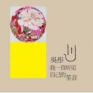

我一直听见自己的 笙音
============================

|  |  |
| :--: | :-- |
| [ 我一直听见自己的 笙音](https://emumo.xiami.com/album/403565) | **艺人**: [吴彤](../index.md) **语种**: 国语 **唱片公司**: 大国大熊星 **发行时间**: 2010年08月27日 **专辑类别**: 录音室专辑 **专辑风格**: 中国民乐 Chinese Folk Music, 华语唱作人 Chinese Singer-Songwriter, 国语流行 Mandarin Pop **播放数**: 256716 **收藏数**: 551 **评论数**: 61  |

## 简介

吴彤 个人简介  
著名艺人吴彤往年常以摇滚乐队「轮回」主唱的身份出现，其实他出生在管乐世家，为了继承家族的演艺事业和中国传统乐器「笙」的演奏，他渐渐褪去摇滚歌手的形象。近年不仅仅加盟享誉国际的大提琴家马友友「丝路之旅」演奏团，并且以「笙」及「巴乌」做为丝路巡演中的主要演奏乐器，把中国传统管乐之美展现在国际舞台上。  
1994年于中国中央音乐学院民乐系毕业，现为中国国家一级演员。吴彤常年热爱摇滚音乐演唱，但同时也并没有放弃民族管乐器的演奏，音乐风格跨界之广，令人惊叹！  
  
★ 作品赏析  
赋予台湾民谣新生命：望春风  
2010年4月底，吴彤曾随着马友友「丝路之旅音乐会」，在台中以及高雄作表演；在音乐会上，马友友与吴彤首次合作名曲「望春风」这首歌，由马友友拉大提琴，吴彤演奏笙，并演唱「望春风」，表演结束立即搏得满堂彩！专辑中收录这首台湾歌谣，以笙与大提琴应衬演奏，将台湾乐迷耳熟能详的「望春风」一曲打造全新风貌，而吴彤高亢的嗓音与演唱功力，将「望春风」诠释地扣人心弦！  
  
感动冲击心肺推荐：笙音  
笙音，这一首纯净无瑕的笙与吉他相映之演奏乐章，竟像似喧嚣城市中最难寻觅的自然之泉。难怪资深音乐人，姚谦，形容吴彤的音乐道：「相对喧嚷满天，标签分界的声音中，我听的是真诚的有机音乐。」聆听吴彤的音乐如沐春风，又如同随着他的笙音四处旅行，好不自在！  
  
重新诠释的异域爱情：燕子  
第一次听到《燕子》是偶然的在一次民族音乐会上，对比强劲的高低音让吴彤感受到了强烈并且畅快的音域跨度。带有独特民族风情的旋律瞬间便能带给人别样的异域爱情。歌词中“你是我的 我是你的”正是这首歌的本质，表达着最简单的爱情方式，那就是相互重迭着、不顾及生命、即使宣判死亡也要许下诀别的誓言。让人相信原来爱情可以轮回。这是种忧伤的浪漫，但却绝对是彻底简单和最为真挚的爱情。现在快餐、物质化的爱情生活让人似乎已经想要对爱情从新定义,而能将最简单、最纯真的爱情透过音乐表达出来就是吴彤最想做的事情。  
  
男性回应女性爱的真诚：早餐  
母亲的早餐让吴彤感受到爱，这《早餐》是吴彤对母亲爱的回应。更是以男性的角度对女性爱的回应。含蓄而真诚的表达了被爱的响应。  
  
宽阔的音乐跨界能量：下雪了  
本来这首歌被邀歌收录在袁泉09年的专辑中，却因为交歌时已经截稿。未能收入，但是音乐的本身还是感动了姚谦。歌曲创作于09年冬，闭关冥想生与死这个沉重的人生感悟时透过窗突然发现飞雪连天。眼前一片纯净的白色让吴彤豁然开朗，他决定出去走走。就像人生的态度一样应该出去走走，生与死似乎不再重要。重要的是简单的感受这个世界。《下雪了》不仅在感知上是深邃的，音乐上更体现出了吴彤的跨界能量，和声部分的处理很西方，但是在配器上大胆的采用了印度的打击乐，主旋律则是标准的中国音。元素虽然繁多。但是没有一点的哗众取宠，反而是纯净的成熟的感人的。充分的表现了吴彤对音乐理解的宽度 

## 曲目

## 评论

|  |  |  |  |
| :-- | :-- | :-- | :-- |
|  [虾米用户](https://emumo.xiami.com/u/43492923) 行到水穷我才开始害怕，夕... 2020-07-25 05:44 赞(0) 踩(0) | 
--
 |
|  [虾米用户](https://emumo.xiami.com/u/13327484) 暂无签名~ 2016-03-02 14:39 赞(0) 踩(0) | 
吴彤唱功是真的棒，很喜欢春秋配。
 |
|  [虾米用户](https://emumo.xiami.com/u/1937372) 趾：染缘易就 2015-09-19 11:10 赞(1) 踩(0) | 
望春风， 一开腔 太棒了
 |
|  [虾米用户](https://emumo.xiami.com/u/35891592) 人生苦短 先吃甜品 2015-08-30 15:15 赞(1) 踩(0) | 
最愛 燕子 聽過馬友友音樂會現場 潸然淚下
 |
|  [虾米用户](https://emumo.xiami.com/u/46316514) 暂无签名~ 2015-04-13 12:02 赞(0) 踩(0) | 
真是太棒了。。这两天一直听
 |
|  [虾米用户](https://emumo.xiami.com/u/1295261)  2015-03-30 09:47 赞(0) 踩(0) | 
这样唱也是蛮美得
 |
|  [虾米用户](https://emumo.xiami.com/u/46606701)   2015-03-03 21:57 赞(0) 踩(0) | 
收藏
 |
|  [虾米用户](https://emumo.xiami.com/u/39235894) 响者，为乐。 2015-03-03 15:50 赞(0) 踩(0) | 
收藏
 |
|  [虾米用户](https://emumo.xiami.com/u/9575413) 我还没想好要写什么... 2015-03-03 13:35 赞(0) 踩(0) | 
xh
 |
|  [虾米用户](https://emumo.xiami.com/u/20681357)  2015-03-03 12:21 赞(1) 踩(0) | 
哥们，太赞了。。。
 |
|  [虾米用户](https://emumo.xiami.com/u/1104214)  2015-02-15 15:59 赞(0) 踩(0) | 
请问《望春风》里前奏提琴的部分是哪首著名的曲子，很耳熟，就是想不起名字来
 |
| ⇒ |  [虾米用户](https://emumo.xiami.com/u/3188559) 一个无趣的人 2015-03-03 17:55 赞(0) 踩(0) | 
巴赫的无伴奏大提琴组曲第一号的第一首
 |
| ⇒ |  [虾米用户](https://emumo.xiami.com/u/2516342)  2015-03-04 10:25 赞(0) 踩(0) | 
<q><b>孔志轩说：</b></q>
 |
|  [虾米用户](https://emumo.xiami.com/u/3559718) 此情深处，红笺为无色。 2015-01-28 17:29 赞(0) 踩(0) | 
感觉好棒
 |
|  [虾米用户](https://emumo.xiami.com/u/4191843) 物欲时代坚守灵魂 2015-01-25 17:49 赞(0) 踩(0) | 
与摇滚无关，另一种境界
 |
| ⇒ |  [虾米用户](https://emumo.xiami.com/u/1104214)  2015-02-15 16:04 赞(0) 踩(0) | 
请问《望春风》里前奏提琴的部分是哪首著名的曲子，很耳熟，就是想不起名字来
 |
| ⇒ |  [虾米用户](https://emumo.xiami.com/u/11763342)  2015-02-15 19:23 赞(0) 踩(0) | 
<q><b>H2O滴说：</b></q>
 |
| ⇒ |  [虾米用户](https://emumo.xiami.com/u/4191843) 物欲时代坚守灵魂 2015-02-20 22:15 赞(0) 踩(0) | 
<q><b>H2O滴说：</b></q>
 |
|  [虾米用户](https://emumo.xiami.com/u/22335169)  2014-11-27 10:39 赞(0) 踩(0) | 
我一直听见自己的 笙音
 |
|  [虾米用户](https://emumo.xiami.com/u/16012805) 我还没想好要写什么... 2014-11-20 14:09 赞(0) 踩(0) | 
对的民族的世界的。
 |
|  [虾米用户](https://emumo.xiami.com/u/5885797) 听是谁在唱歌 2014-09-02 15:53 赞(0) 踩(0) | 
配乐那叫一个赞
 |
|  [虾米用户](https://emumo.xiami.com/u/2100051)  2014-08-21 14:59 赞(1) 踩(0) | 
声音好！听！炸！天！
 |
|  [虾米用户](https://emumo.xiami.com/u/2100051)  2014-08-21 14:57 赞(1) 踩(0) | 
好有气质的声音好上瘾根本停不下来
 |
|  [虾米用户](https://emumo.xiami.com/u/39553183) 小虾 2014-07-31 15:51 赞(1) 踩(0) | 
退去了摇滚的狂躁，多了一份岁月静好。摇滚最抵不过的就是人到中年。
 |
|  [虾米用户](https://emumo.xiami.com/u/17551482)  2014-07-23 08:12 赞(0) 踩(0) | 
曾经喜欢的歌手之一.
 |
|  [虾米用户](https://emumo.xiami.com/u/10703) 土窑爱好者 2014-07-13 13:54 赞(0) 踩(0) | 
竟然挺好听，很适合晚会唱
 |
|  [虾米用户](https://emumo.xiami.com/u/9) 不来都得死 2014-01-26 11:00 赞(1) 踩(0) | 
作为轮回的歌迷，我竟然完全不知道吴彤单飞，更不知道他竟然出过专辑，好诡异啊
 |
|  [虾米用户](https://emumo.xiami.com/u/413795) 啦啦啦 2013-09-27 21:53 赞(0) 踩(0) | 
重听的赶脚还是不错的
 |
|  [虾米用户](https://emumo.xiami.com/u/549376)  2013-08-11 19:30 赞(0) 踩(0) | 
我一直听见自己的 笙音
 |
|  [虾米用户](https://emumo.xiami.com/u/3622476)  2013-04-08 00:39 赞(1) 踩(0) | 
真心棒，这才是我喜欢的音乐，民族乐与通俗的融合。尤其是改编北方曲艺的塔玲珑，易于让现代人接触，也不失传统的魅力
 |
|  [虾米用户](https://emumo.xiami.com/u/10266153) bingshan 2012-09-29 15:25 赞(1) 踩(0) | 
独，特演奏，演唱新颖
 |
|  [虾米用户](https://emumo.xiami.com/u/298346)  2012-09-09 21:59 赞(1) 踩(0) | 
喜欢他的嗓音
 |
|  [虾米用户](https://emumo.xiami.com/u/298346)  2012-09-09 21:59 赞(0) 踩(0) | 
喜欢他的嗓音
 |
|  [虾米用户](https://emumo.xiami.com/u/1202068)  2012-08-13 13:43 赞(0) 踩(0) | 
熟悉的声音
 |
|  [虾米用户](https://emumo.xiami.com/u/3036159)  2012-06-10 23:29 赞(0) 踩(0) | 
大家给打个分
 |
|  [虾米用户](https://emumo.xiami.com/u/3036159)  2012-06-10 23:28 赞(0) 踩(0) | 
真正的音乐人
 |
|  [虾米用户](https://emumo.xiami.com/u/6764717)  2012-05-25 19:04 赞(0) 踩(0) | 
这才是真正的音乐
 |
|  [虾米用户](https://emumo.xiami.com/u/2658937)  2012-05-10 03:11 赞(1) 踩(0) | 
那个东邪西毒终极版原创新增配乐和编曲是他做的吗
 |
| ⇒ |  [虾米用户](https://emumo.xiami.com/u/36617792)  2014-07-02 17:59 赞(0) 踩(0) | 
是的
 |
|  [虾米用户](https://emumo.xiami.com/u/197546)  2012-04-20 18:30 赞(0) 踩(0) | 
很好听
 |
|  [虾米用户](https://emumo.xiami.com/u/8921915)  2012-04-19 20:14 赞(0) 踩(0) | 
非常好听的声音
 |
|  [虾米用户](https://emumo.xiami.com/u/893250)  2011-12-08 22:08 赞(0) 踩(0) | 
吴彤
 |
|  [虾米用户](https://emumo.xiami.com/u/1489937)  2011-11-27 09:35 赞(0) 踩(0) | 
大家来看看，这个网站居然把他的专辑分到香港歌手吴彤的专辑去了<a href="http://www.51lrcgc.com/htm/singer/b/bpScZf.htm" target="_blank" rel="nofollow noreferrer noopener">http://www.51lrcgc.com/htm/singer/b/bpScZf.htm</a>
 |
|  [虾米用户](https://emumo.xiami.com/u/721351)  2011-09-13 23:28 赞(0) 踩(0) | 
看《大兵小将》的时候，老是以为《油菜花》是吴彤操刀的
 |
|  [虾米用户](https://emumo.xiami.com/u/5454006)  2011-08-17 10:07 赞(1) 踩(0) | 
喜欢吴彤的嗓音
 |
|  [虾米用户](https://emumo.xiami.com/u/3977843) 想得太多而读书太少~ 2011-06-16 04:50 赞(0) 踩(0) | 
心都亮了。
 |
| ⇒ |  [虾米用户](https://emumo.xiami.com/u/5571463)  2011-08-25 21:06 赞(0) 踩(0) | 
同感啊，心情糟烂的自己，偶然间在听到了吴彤的我行我路，就如同这最简单的一句“心都亮了”，谢谢
 |
| ⇒ |  [虾米用户](https://emumo.xiami.com/u/216596)  2011-12-22 23:34 赞(0) 踩(0) | 
<q><b>jojo说：</b></q>
 |
|  [虾米用户](https://emumo.xiami.com/u/80234)  2011-06-10 11:47 赞(0) 踩(0) | 
华语音乐
 |
|  [虾米用户](https://emumo.xiami.com/u/413795) 啦啦啦 2011-05-31 12:03 赞(0) 踩(0) | 
~~
 |
|  [虾米用户](https://emumo.xiami.com/u/3593321)  2011-04-13 17:01 赞(0) 踩(0) | 
富有充沛的情感！很好听！
 |
|  [虾米用户](https://emumo.xiami.com/u/2975433)  2011-02-26 12:05 赞(0) 踩(0) | 
香港的能与他比的啊！
 |
|  [虾米用户](https://emumo.xiami.com/u/2838695)  2011-02-14 15:20 赞(1) 踩(0) | 
一直喜欢吴彤的声音。
 |
|  [虾米用户](https://emumo.xiami.com/u/333709)  2011-02-07 14:59 赞(1) 踩(0) | 
今天的吴彤已经算得上艺术家了
 |
|  [虾米用户](https://emumo.xiami.com/u/2745110)  2011-02-05 23:22 赞(1) 踩(0) | 
这个才是真正的中国风啊
 |
|  [虾米用户](https://emumo.xiami.com/u/1885435) 君子敏于行 衲于言 2011-02-02 12:04 赞(0) 踩(0) | 
好的东西是不会被埋没的
 |
|  [虾米用户](https://emumo.xiami.com/u/2560996)  2011-01-24 22:07 赞(1) 踩(0) | 
喜欢他是从他在轮回乐队时开始。。。。 无人能比的嗓子
 |
|  [虾米用户](https://emumo.xiami.com/u/145859)  2011-01-09 16:18 赞(1) 踩(0) | 
他的嗓子
 |
|  [虾米用户](https://emumo.xiami.com/u/478158)  2011-01-07 13:26 赞(1) 踩(0) | 
北京 吴彤 民乐 轮回乐队前主唱
 |
|  [虾米用户](https://emumo.xiami.com/u/478158)  2011-01-07 13:23 赞(1) 踩(0) | 
喜欢他的 《小河淌水》 而且这个吴彤是中国北京的 轮回乐队的主唱 不是香港那个吴彤啊~~~〒_〒  居然没分类么？吴彤 新浪博客 <a href="http://blog.sina.com.cn/wtong" target="_blank" rel="nofollow noreferrer noopener">http://blog.sina.com.cn/wtong</a>
 |
| ⇒ |  [虾米用户](https://emumo.xiami.com/u/1489937)  2011-11-27 09:34 赞(0) 踩(0) | 
他参与过的专辑没有人分类
 |
