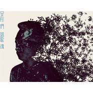
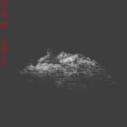
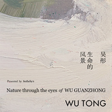
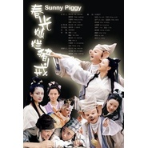

吴彤
============================

|  |  |
| :--: | :-- |
| [ 吴彤](https://i.xiami.com/wutong) | **地区**: China 中国大陆 **风格**: 古典跨界 Classical Crossover **播放数**: 12848911 **粉丝数**: 7057 **评论数**: 187  |

## 档案

吴彤——曾用名吴桐，满族，正黄旗，著名音乐人，出生于满清贵族家庭，音乐世家，五岁跟随父亲学习笙唢呐等各种民族乐器的演奏。 
1983年考入中央音乐学院附小，直至1994年于中央音乐学院民乐系毕业。其中先后师从杨守成先生和曹建国先生。 
1992年参与创建“轮回乐队”，担任乐队主唱。由吴彤改编的一曲烽火扬州路，一金戈铁马的大气磅礴之势在中国摇滚史上掀开了民族化摇滚的新的一页。使乐队在当时众多乐队中脱颖而出。 
之后吴彤作为乐队主创，共出版四张专辑《创造》《心乐集》《again.我的太阳》《超越轮回》。 
吴彤在摇滚音乐之外更与许多世界上的艺术家有着长期合作，如马友友，赵季平，谭盾，叶小钢，纽约爱乐，伦敦交响乐团，新加坡交响乐团等。1999年吴彤在美国密执安大学音乐学院举行中国民族管乐器讲座的同时结识了华裔大提琴马友友，并成了丝绸之路乐队的成员。之后几年里吴彤与丝路乐团一起踏上了开往西方的跨文化大篷车，足迹遍布亚洲美洲欧洲，期间学习了大量的不同民祖的音乐，也将中国音乐更进一步介绍给了西方观众。 
其中与丝路乐团合作有关笙的作品有近二十首，其中著名华裔作曲家Bright sheng为笙、大提琴而创作的协奏曲《Song And Dance Of Tears》在美国欧洲成功演出后，引起了观众对笙的极大兴趣。 
2001年吴彤参与了在纽约录制的专辑《When Stranger Meeting》，其中收录了由吴彤改编的两首作品《Midu Mouten》和《Blue Little Flower》。2004年录制的丝路乐团第二张当中收录了由吴彤演唱马友友演奏的二重奏《燕子》。 
2004年初，吴彤应邀在美国西门子公司研究电子笙的开发与应用。此项计划是将传统的笙与电脑以及相关的音频设备相连接，从而寻找到一种将传统与现代同时推向极致的新方法，并运用这种方法创作了新作品《Walking Clouse》。这件新生乐器伴随吴彤变换自如的演唱风格在新泽西纽约香港新加坡的演出都受到了观众的热烈欢迎。 
2004年吴彤又创建了一直全部由中国演奏家组成的乐队“中国喜鹊”，致力于将传统经典名曲加以现代的演奏方法以及与西方乐器的合作重新演绎。目前作品有《江南》、《燕子》、《十面埋伏》、《兰花花》、《酒狂》等，并应邀在各国演出。 2003年非典期间创作歌曲《奇迹》。 
2008年又与演员尹相杰创作抗震歌曲《中国骨气》，该曲收录于中国唱片抗震歌曲公益专辑。 
2006年吴彤签约香港大国文化，并与港台音乐人共同进行创作个人专辑。单曲《记得》推出后便名列榜首。 
2008年应邀为王家卫的电影《东邪西毒》终极版重新配乐，原声大碟已于2009年3月正式发行。 
2008年九月应旧金山歌剧院邀请，参加歌剧《接骨师之女》的演出，成功饰演两个角色，用中英文演唱，并接加入了民族管乐器唢呐的演奏，得到美国纽约时报等媒体的赞扬。 
博客： http://blog.sina.com.cn/Wtong  官网：http://www.wutongmusic.com/

## 专辑

| 名称 | 语种 | 唱片公司 | 发行时间 | 专辑类别 | 专辑风格 |
| :--: | :-- | :-- | :-- | :-- | :-- |
| [ 好春光 (贺岁版)](./albums/2104565604.md) | 国语 | 竹书娱乐 | 2019年01月11日 | EP, 单曲 | 国语流行 Mandarin Pop |
| [ 古诗童韵系列三](./albums/2108211007.md) | 国语 | 成桥文化 | 2018年07月12日 | 录音室专辑 | 氛围音乐 Ambient |
| [ 古诗童韵 系列 一](./albums/2108154268.md) | 国语 | 成桥文化 | 2018年05月15日 | EP, 单曲 | 电子 Electronic |
| [ 吴彤们･唱歌魂](./albums/2100292820.md) | 国语 | 大熊星 | 2016年03月15日 | 录音室专辑 | 流行摇滚 Pop Rock, 华语唱作人 Chinese Singer-Songwriter, 国语流行 Mandarin Pop |
| [ 吴彤们･音乐云](./albums/2100292812.md) | 其他 | 大熊星 | 2016年03月15日 | EP, 单曲 | 中国民乐 Chinese Folk Music, 中国风 China-Wave |
| [ 生命的风景Scenery In My Life](./albums/25349430.md) | 其他 | 大熊星 | 2015年03月03日 | EP, 单曲 | 古典跨界 Classical Crossover, 华语唱作人 Chinese Singer-Songwriter |
| [ 那条长路](./albums/1604804136.md) | 国语 | 大国大熊星 | 2014年07月08日 | EP, 单曲 | 电视原声 Television Music, 红歌 Red Song |
| [ 我一直听见自己的 笙音](./albums/403565.md) | 国语 | 大国大熊星 | 2010年08月27日 | 录音室专辑 | 中国民乐 Chinese Folk Music, 华语唱作人 Chinese Singer-Songwriter, 国语流行 Mandarin Pop |
| [ 好春光](./albums/577120.md) | 国语 | 天空创作室 | 2000年02月07日 | EP, 单曲 | 国语流行 Mandarin Pop, 电视原声 Television Music |

## 评论

|  |  |  |
| :-- | :-- | :-- |
|  [虾米用户](https://emumo.xiami.com/u/2449863)  2021-01-07 17:24 赞(0) 踩(0) | 
35岁以前喜欢唐朝，魔岩三杰、Metallica 35岁以后唯一没有改变的是对吴彤和许巍的着迷
 |
|  [虾米用户](https://emumo.xiami.com/u/358104299) 悲观的唯心存在现实解构虚... 2020-12-15 11:17 赞(0) 踩(0) | 
43092
 |
|  [虾米用户](https://emumo.xiami.com/u/2242564) 我还没想好要写什么... 2020-11-25 02:22 赞(0) 踩(0) | 
太传奇了
 |
|  [虾米用户](https://emumo.xiami.com/u/124564694)  2020-10-15 15:51 赞(0) 踩(0) | 
大神   
 |
|  [虾米用户](https://emumo.xiami.com/u/38164) 钻石牌钻石型钻石牙刷。 2020-10-04 23:21 赞(0) 踩(0) | 
仙人掌观光团 现场太炸裂了
 |
|  [虾米用户](https://emumo.xiami.com/u/931063) 静静生长 2020-09-12 06:08 赞(0) 踩(0) | 
大师大师
 |
|  [虾米用户](https://emumo.xiami.com/u/210068359) 电影人，摄影师，艺术家，... 2020-08-22 11:16 赞(0) 踩(0) | 
想听檐头雨
 |
|  [虾米用户](https://emumo.xiami.com/u/73740960)  2020-08-05 10:54 赞(0) 踩(0) | 
。
 |
|  [虾米用户](https://emumo.xiami.com/u/252290968) 何处吟春雪，何处有牧歌。 2020-04-05 19:21 赞(0) 踩(0) | 
最熟悉的印象还是当年轮回的主唱了。今天才知道居然这是最无足轻重的。
 |
|  [虾米用户](https://emumo.xiami.com/u/207886487)   2020-02-23 17:20 赞(0) 踩(0) | 
我一辈子爱将进酒
 |
|  [虾米用户](https://emumo.xiami.com/u/207886487)   2020-02-23 17:20 赞(0) 踩(0) | 
吴桐大大的烽火扬州路真的好先锋啊hhhh给我听朋友们！
 |
|  [虾米用户](https://emumo.xiami.com/u/50575869) 却顾所来径，苍苍横翠微 2020-01-21 20:41 赞(0) 踩(0) | 
吴彤好帅……陌上人如玉 花开缓缓归……
 |
|  [虾米用户](https://emumo.xiami.com/u/495299)  2019-11-23 12:19 赞(2) 踩(0) | 
真的事艺术家呢
 |
|  [虾米用户](https://emumo.xiami.com/u/45704193)   2019-10-08 22:57 赞(0) 踩(0) | 
我的天，无所不能的wutong
 |
|  [虾米用户](https://emumo.xiami.com/u/343515734)  2019-07-06 01:20 赞(0) 踩(0) | 
你唱的万泉河水催人奋进是一种精神，是一种力量！谢谢你
 |
|  [虾米用户](https://emumo.xiami.com/u/297082902) 我梦寐以求，是真爱和自由 2019-06-07 16:51 赞(0) 踩(0) | 
哇原來跟墨鏡合作過啊，還是東邪西毒，我最喜歡的武俠電影
 |
|  [虾米用户](https://emumo.xiami.com/u/1217793) 暂无签名~ 2019-05-01 19:43 赞(0) 踩(0) | 
太厉害了吧(ง •̀_•́)ง！！
 |
|  [虾米用户](https://emumo.xiami.com/u/220427802)   2019-04-08 22:44 赞(1) 踩(0) | 
卷睫盼
 |
|  [虾米用户](https://emumo.xiami.com/u/43492923) 行到水穷我才开始害怕，夕... 2019-04-08 15:01 赞(1) 踩(0) | 
吴彤牛逼。
 |
|  [虾米用户](https://emumo.xiami.com/u/18292024) 最不屑一顾是相思 2019-04-05 01:37 赞(1) 踩(0) | 
一直觉得他的声音很特别……后来才知道原来听过的轮回乐队是他主场……再后来知道了在国外扬名～真是厉害了
 |
|  [虾米用户](https://emumo.xiami.com/u/45704193)   2019-04-02 10:32 赞(1) 踩(0) | 
春光灿烂，2019. 等待2020的春光。。
 |
|  [虾米用户](https://emumo.xiami.com/u/3566813) 菩萨，祝您身体健康！34... 2019-02-04 19:49 赞(0) 踩(0) | 
远山听了这么久，竟然没关注，失敬
 |
|  [虾米用户](https://emumo.xiami.com/u/355865) Let it go, l... 2019-02-02 10:47 赞(20) 踩(0) | 
如果你觉得他只是一位流行音乐歌手，你错了——注意他是著名的笙（民乐）演奏家。 如果你觉得他只是会演奏民族乐器的流行音乐歌手，你又错了——注意他曾参与创作王家卫《东邪西毒》终极版的配乐。 如果你觉得他只是会演奏笙且会作曲的流行音乐歌手，你又又错了——注意他曾组建中国早期的摇滚乐队之一轮回乐队。 如果你觉得……  所谓跨界音乐人，当如是。
 |
|  [虾米用户](https://emumo.xiami.com/u/7001081)  2019-01-17 07:37 赞(0) 踩(0) | 
吴彤是音乐家，演奏家
 |
|  [虾米用户](https://emumo.xiami.com/u/353744624) 吹灭读书灯，一身都是月。 2018-11-12 13:00 赞(2) 踩(0) | 
自从摇滚乐伊始，吴老师的歌声一直是多年来随身播放设备和车里的必备！那声音萦绕里，不但可以找到曾经年少的不羁，岁月静好的沧桑，而且还可以在倦怠时重燃斗志的昂扬和血脉贲张！！！！
 |
|  [虾米用户](https://emumo.xiami.com/u/29345374) 大道合乎自然 2018-08-23 09:25 赞(0) 踩(0) | 
我比你小，我爱你
 |
|  [虾米用户](https://emumo.xiami.com/u/21775307) 我还没想好要写什么... 2018-08-15 11:57 赞(1) 踩(0) | 
最近真的对吴彤老师的声音入魔般地着迷，除了他个人作品，还疯狂找轮回时期的歌天天循环！！
 |
|  [虾米用户](https://emumo.xiami.com/u/1343938)  2018-08-13 16:14 赞(1) 踩(0) | 
燕子，，听不到了
 |
|  [虾米用户](https://emumo.xiami.com/u/296789867) 气球 2018-08-04 13:33 赞(2) 踩(0) | 
看了格致论道的讲座~好有魅力，自信强大谦逊，又一步步引导还在迷茫的人去发现自己，把握当下~我的新男神 
 |
|  [虾米用户](https://emumo.xiami.com/u/380107886)  2018-08-01 22:14 赞(0) 踩(0) | 
我是听了这首歌才知道您的，太低调了。是用灵魂唱歌的，听的直达内心深处。
 |
|  [虾米用户](https://emumo.xiami.com/u/103301446)  2018-06-04 23:24 赞(2) 踩(0) | 
话不多说 妙人儿一位
 |
|  [虾米用户](https://emumo.xiami.com/u/280364271) 一段心情，一首歌 2018-05-20 14:53 赞(0) 踩(0) | 
我收藏你的歌，只因这首歌很好，也就此而以
 |
|  [虾米用户](https://emumo.xiami.com/u/201391232) 最快的方法是先抱抱 2018-05-06 23:35 赞(0) 踩(0) | 
彡
 |
|  [虾米用户](https://emumo.xiami.com/u/303217997)   2018-03-29 01:39 赞(3) 踩(0) | 
他几岁？还出生在满清贵族家庭？！怕怕哦！难道是从什么里面爬出来的？我勒个去！写简介的货脑袋上还甩着根猪尾巴辫子吗？
 |
| ⇒ |  [虾米用户](https://emumo.xiami.com/u/14255012)   2018-04-17 12:35 赞(0) 踩(0) | 
最起码你爸妈当工人的年纪 他能学音乐
 |
|  [虾米用户](https://emumo.xiami.com/u/134149700)  2018-03-28 08:16 赞(0) 踩(0) | 
我的第一个偶像就是吴彤
 |
|  [虾米用户](https://emumo.xiami.com/u/3583995) 一個人的戰爭 2018-03-24 07:34 赞(0) 踩(0) | 
.
 |
|  [虾米用户](https://emumo.xiami.com/u/323987299)  2018-03-10 10:04 赞(0) 踩(0) | 
他嗓音沙哑玩命叫唤
 |
|  [虾米用户](https://emumo.xiami.com/u/227542964) 无 2018-02-28 18:30 赞(0) 踩(0) | 
好听
 |
|  [虾米用户](https://emumo.xiami.com/u/348197526) 我看着时光走过窗前，留下... 2018-02-07 11:28 赞(3) 踩(0) | 
向吴老师致敬！啥也不说了，都在歌儿里头了。再次向你致以十二万分的敬意！
 |
|  [虾米用户](https://emumo.xiami.com/u/348197526) 我看着时光走过窗前，留下... 2018-02-07 11:27 赞(1) 踩(0) | 
向吴老师致敬！啥也不说了，都在歌儿里头了。再次向您致敬！
 |
|  [虾米用户](https://emumo.xiami.com/u/346411408)  2018-02-06 16:21 赞(0) 踩(0) | 
能不能把卷睫盼完整版放出来？？？？
 |
| ⇒ |  [虾米用户](https://emumo.xiami.com/u/204721704)   2018-04-05 22:59 赞(0) 踩(0) | 
据说已经被误删了 很可惜，我也一直在找
 |
|  [虾米用户](https://emumo.xiami.com/u/99392050) 境來不拒，境去不留。隨緣... 2018-01-24 01:27 赞(1) 踩(0) | 
我的偶像啊
 |
|  [虾米用户](https://emumo.xiami.com/u/102960676) 一切终将逝去 2017-11-15 05:51 赞(0) 踩(0) | 
好个公鸭嗓&amp;hellip;
 |
| ⇒ |  [虾米用户](https://emumo.xiami.com/u/349685604)   2018-04-30 21:25 赞(0) 踩(0) | 
你窦哈哈哈，没别的，看见头像，激动
 |
|  [虾米用户](https://emumo.xiami.com/u/9617959)  2017-10-27 23:14 赞(2) 踩(0) | 
吴彤的低调和他的音乐一样,但其中又蕴藏无限的力量,可惜太少了,没有&lt;&lt;花犄角&gt;&gt;
 |
|  [虾米用户](https://emumo.xiami.com/u/184906292)  2017-10-21 11:47 赞(0) 踩(0) | 
这歌有完整版吗，一直没找到。。，还有卷睫盼也找不到
 |
|  [虾米用户](https://emumo.xiami.com/u/328491352)  2017-10-05 00:05 赞(0) 踩(0) | 
那曲山风琴在哪能下载？
 |
|  [虾米用户](https://emumo.xiami.com/u/221695408) 我还没想好要写什么... 2017-08-23 01:30 赞(0) 踩(0) | 
♪
 |
|  [虾米用户](https://emumo.xiami.com/u/261148138) 寐春风兮发鲜荣，洁斋俟兮... 2017-08-02 23:43 赞(0) 踩(0) | 
咱们同名，一直很喜欢你的歌。希望你越来越好
 |
|  [虾米用户](https://emumo.xiami.com/u/310898625) 人间处处有真情，真情时时... 2017-07-22 15:08 赞(0) 踩(0) | 
         
 |
| ⇒ |  [虾米用户](https://emumo.xiami.com/u/301809541)   2017-08-12 17:22 赞(0) 踩(0) | 

 |
|  [虾米用户](https://emumo.xiami.com/u/44720676) 人生处处听雨声，心境感悟... 2017-07-18 11:53 赞(0) 踩(0) | 
用大提琴和唢呐演奏闽南民歌，立马有了不一样的感觉
 |
|  [虾米用户](https://emumo.xiami.com/u/9205105) 啦啦啦 2017-07-02 15:57 赞(2) 踩(0) | 
好返璞归真
 |
|  [虾米用户](https://emumo.xiami.com/u/269556064) 悲喜，一念 2017-05-20 17:54 赞(1) 踩(0) | 
你们可以去听听那个多国乐团，里面有他，他吹的唢呐太绝了！
 |
| ⇒ |  [虾米用户](https://emumo.xiami.com/u/220) 微信公众号：最后的梦田 2017-06-29 09:46 赞(0) 踩(0) | 
是笙不是唢呐
 |
| ⇒ |  [虾米用户](https://emumo.xiami.com/u/269556064) 悲喜，一念 2017-06-29 10:30 赞(0) 踩(0) | 
<q><b>浮云歌天使回声说：</b></q>
 |
| ⇒ |  [虾米用户](https://emumo.xiami.com/u/220) 微信公众号：最后的梦田 2017-06-29 11:31 赞(0) 踩(0) | 
<q><b>卷心菜说：</b></q>
 |
| ⇒ |  [虾米用户](https://emumo.xiami.com/u/269556064) 悲喜，一念 2017-06-29 15:01 赞(0) 踩(0) | 
<q><b>浮云歌天使回声说：</b></q>
 |
| ⇒ |  [虾米用户](https://emumo.xiami.com/u/327854819)  2017-10-01 23:19 赞(0) 踩(0) | 
<q><b>浮云歌天使回声说：</b></q>
 |
|  [虾米用户](https://emumo.xiami.com/u/256305659) 一杯浊酒尽余欢。 2017-03-22 00:23 赞(7) 踩(0) | 
吴彤，从轮回乐队的时候就很喜欢你哦
 |
|  [虾米用户](https://emumo.xiami.com/u/118677364)  2017-03-20 17:10 赞(0) 踩(0) | 
还是看了马友友丝绸之路乐团的演出才知道他，没想到居然是唱春光灿烂猪八戒的23333服了
 |
|  [虾米用户](https://emumo.xiami.com/u/30074304) 寄蜉蝣于天地，渺沧海之一... 2017-03-18 19:23 赞(0) 踩(0) | 
✈
 |
|  [虾米用户](https://emumo.xiami.com/u/17091710)  2017-03-11 21:19 赞(3) 踩(0) | 
正黄旗的满清贵族。。。。
 |
|  [虾米用户](https://emumo.xiami.com/u/48210388) 天天都是情人节！ 2017-03-07 01:52 赞(17) 踩(0) | 
记得那年初中去秋游，在去的大巴车上，全车同学一起高唱好春光不如梦一场！现在回想起来真的太美好了 
 |
|  [虾米用户](https://emumo.xiami.com/u/1275486)  2017-03-06 16:29 赞(2) 踩(0) | 
从林志炫live的御龙铭千古现场赶来，非常赞的配乐，吴氏管乐后人棒棒的
 |
|  [虾米用户](https://emumo.xiami.com/u/45052758) 我还没想好要写什么... 2017-03-05 08:53 赞(0) 踩(0) | 
[带墨镜笑]
 |
|  [虾米用户](https://emumo.xiami.com/u/221759386)  2017-02-26 14:17 赞(0) 踩(0) | 
谢谢你，很欣赏很回忆很享受，在水一方听哭过，祝你快乐，健康
 |
|  [虾米用户](https://emumo.xiami.com/u/20669918) 看见世界，面对危险，跨越... 2017-02-24 22:27 赞(0) 踩(0) | 
早餐，吴彤
 |
|  [虾米用户](https://emumo.xiami.com/u/42273)  2017-02-18 20:20 赞(0) 踩(0) | 
琳琅之声
 |
|  [虾米用户](https://emumo.xiami.com/u/4146038)  2017-02-17 16:30 赞(1) 踩(0) | 
你果然是唱好春光的吴彤
 |
|  [虾米用户](https://emumo.xiami.com/u/30330393)  2017-02-16 14:27 赞(1) 踩(0) | 
音乐还不错，就是炒作团队太恶心！！
 |
|  [虾米用户](https://emumo.xiami.com/u/231910305) one happy 2017-02-16 07:28 赞(19) 踩(0) | 
格莱美呢厉害了我的哥
 |
|  [虾米用户](https://emumo.xiami.com/u/40464323) Seizeyourday 2017-02-12 22:59 赞(0) 踩(0) | 
鸡年春晚上有吴彤
 |
|  [虾米用户](https://emumo.xiami.com/u/268568139)  2017-01-28 01:48 赞(0) 踩(0) | 
特喜欢他的风格！
 |
|  [虾米用户](https://emumo.xiami.com/u/268568139)  2017-01-28 01:46 赞(0) 踩(0) | 
超级棒
 |
|  [虾米用户](https://emumo.xiami.com/u/7707257) 哈牛痴迷中毒中 2017-01-28 01:03 赞(1) 踩(0) | 
春晚结束前看到吴彤 真的好激动 很小就欣赏他！
 |
|  [虾米用户](https://emumo.xiami.com/u/49443496) I'm leaving ... 2017-01-12 23:48 赞(0) 踩(0) | 
很惊艳啊，不一样的感觉
 |
|  [虾米用户](https://emumo.xiami.com/u/2279444) 爱在左，同情在右。 2016-12-24 05:18 赞(0) 踩(0) | 
说实话，我第一次知道您是吴泽琨二叔，我笑劈了
 |
|  [虾米用户](https://emumo.xiami.com/u/40379612) 永远的虾米音乐 2016-11-15 00:45 赞(2) 踩(0) | 
他是不是和马友友合作过啊 吹那个啥乐器来着   丝绸之路
 |
|  [虾米用户](https://emumo.xiami.com/u/7871523) 歪星扔 2016-09-08 16:25 赞(2) 踩(0) | 
前奏一响起，整个童年像放电影一样，可当年看电视时候的天真和听到前奏时候的激动已经变成了现在的一种落寞
 |
|  [虾米用户](https://emumo.xiami.com/u/20773661) 事无所祈 心有坚毅 2016-09-05 21:48 赞(0) 踩(0) | 
时隔多年 依旧惊艳
 |
|  [虾米用户](https://emumo.xiami.com/u/744592) 虾米关了，陪伴了我10年... 2016-05-29 22:50 赞(2) 踩(0) | 
我只认得轮回乐队的主唱吴桐。
 |
|  [虾米用户](https://emumo.xiami.com/u/10471420)  2016-05-10 09:11 赞(0) 踩(0) | 
之前在学校室看杂志上面认识的，  有才华，，讲了好多关于笙和唢呐
 |
|  [虾米用户](https://emumo.xiami.com/u/22736988) 我还没想好要写什么... 2016-03-21 21:44 赞(0) 踩(0) | 
爱
 |
|  [虾米用户](https://emumo.xiami.com/u/114599724)  2016-03-12 19:31 赞(0) 踩(0) | 
才子！
 |
|  [虾米用户](https://emumo.xiami.com/u/16862522)  2016-02-18 10:50 赞(0) 踩(0) | 
轮回
 |
|  [虾米用户](https://emumo.xiami.com/u/32894468) 不乱于惑，无愧于心。 2015-11-29 14:50 赞(0) 踩(0) | 
好经典的故事，好经典的歌。
 |
|  [虾米用户](https://emumo.xiami.com/u/7639752)  2015-11-10 13:57 赞(0) 踩(0) | 
居然轮回乐队
 |
|  [虾米用户](https://emumo.xiami.com/u/3957180) 十月小阳春 2015-11-03 21:44 赞(0) 踩(0) | 
童年时期印象极深的三首影视主题曲 《好春光》《上海沧桑》《长缨在手》都是他唱的，一开口就不由自主马上收藏的声音
 |
|  [虾米用户](https://emumo.xiami.com/u/42889328) 你真的   自由了 2015-10-24 06:41 赞(0) 踩(0) | 
听了原唱才发现更有味道，真正唱进人心里的歌。 
 |
|  [虾米用户](https://emumo.xiami.com/u/75585144)  2015-10-22 14:05 赞(1) 踩(0) | 
声线有磁性，太迷人了，乐器玩的也好，长得也挺好看，我男神 
 |
|  [虾米用户](https://emumo.xiami.com/u/75585144)  2015-10-22 14:03 赞(0) 踩(0) | 
啊原来吴彤还是个贵族啊，满族人，声线真心好听   
 |
|  [虾米用户](https://emumo.xiami.com/u/36081194) 酷狗音乐，一个有老歌的地... 2015-10-16 16:42 赞(0) 踩(0) | 
喜欢
 |
|  [虾米用户](https://emumo.xiami.com/u/18674600)  2015-09-29 11:48 赞(0) 踩(0) | 
喜歡
 |
|  [虾米用户](https://emumo.xiami.com/u/9593784) 暂无签名~ 2015-09-25 12:32 赞(0) 踩(0) | 
很放松
 |
|  [虾米用户](https://emumo.xiami.com/u/1937372) 趾：染缘易就 2015-09-19 15:32 赞(0) 踩(0) | 
高晓攀们应该以吴桐为榜样
 |
|  [虾米用户](https://emumo.xiami.com/u/47922964) 我是萌萌的小侠 2015-09-15 15:04 赞(0) 踩(0) | 
喜欢古典
 |
|  [虾米用户](https://emumo.xiami.com/u/60767636)  2015-09-04 14:22 赞(0) 踩(0) | 

 |
|  [虾米用户](https://emumo.xiami.com/u/11539729) 我还没想好要写什么... 2015-09-03 14:06 赞(0) 踩(0) | 
Great Chinese music, Great musician.
 |
|  [虾米用户](https://emumo.xiami.com/u/52883401)  2015-08-31 18:18 赞(0) 踩(0) | 
小时候看春光灿烂猪八戒，喜欢连续剧而喜欢里面的歌，喜欢里面的歌而喜欢歌手。
 |
|  [虾米用户](https://emumo.xiami.com/u/46775984) 鼠年大吉吧 2015-08-31 16:02 赞(0) 踩(0) | 
正黄旗 呵呵
 |
|  [虾米用户](https://emumo.xiami.com/u/36177682)  2015-08-01 10:15 赞(9) 踩(0) | 
鲜为人知的乐器制作技艺传承人~~原来轮回的标签才是分量最轻的一个~
 |
|  [虾米用户](https://emumo.xiami.com/u/44195361) 待到秋来九月八，我花开后... 2015-07-31 15:11 赞(1) 踩(0) | 
多面手吴彤吹拉弹唱样样精通！
 |
|  [虾米用户](https://emumo.xiami.com/u/713008) 暂无签名~ 2015-07-05 18:51 赞(0) 踩(0) | 
中国作曲大师
 |
|  [虾米用户](https://emumo.xiami.com/u/41459074) 新专辑已发布 2015-06-19 11:50 赞(0) 踩(0) | 
支持实力派
 |
|  [虾米用户](https://emumo.xiami.com/u/2521723)  2015-06-06 13:19 赞(83) 踩(0) | 
吴彤是中国摇滚圈内最具国际范儿的一位，名气远在海外，国内却一直不温不火，反差很大，这个反差也体现出国内乐迷的整体素质。
 |
| ⇒ |  [虾米用户](https://emumo.xiami.com/u/7161601) 再见 2016-05-02 00:58 赞(0) 踩(0) | 
应该不是一个梧桐
 |
| ⇒ |  [虾米用户](https://emumo.xiami.com/u/1308565)  2016-05-22 16:24 赞(0) 踩(0) | 
音色和唱法跟窦唯很像，两位我都特别喜欢~        外国人对有新意有中国味道的印象更深刻，但国内歌迷还是喜欢原汁原味的摇滚~
 |
| ⇒ |  [虾米用户](https://emumo.xiami.com/u/1308565)  2016-05-22 16:25 赞(0) 踩(0) | 
<q><b>看见自己，所以存在，哟西说：</b></q>
 |
| ⇒ |  [虾米用户](https://emumo.xiami.com/u/199857207)  2016-07-11 18:01 赞(0) 踩(0) | 
<q><b>看见自己，所以存在，哟西说：</b></q>
 |
| ⇒ |  [虾米用户](https://emumo.xiami.com/u/967211)  2016-12-28 14:43 赞(0) 踩(0) | 
啥也能扯到素质上。
 |
| ⇒ |  [虾米用户](https://emumo.xiami.com/u/326046963)  2017-09-29 00:23 赞(0) 踩(0) | 
你真TM能扯听个歌 听出优越感来了？
 |
| ⇒ |  [虾米用户](https://emumo.xiami.com/u/2521723)  2018-02-05 10:58 赞(0) 踩(0) | 
<q><b>青玉案说：</b></q>
 |
| ⇒ |  [虾米用户](https://emumo.xiami.com/u/349685604)   2018-04-30 21:23 赞(0) 踩(0) | 
<q><b>慊人说：</b></q>
 |
| ⇒ |  [虾米用户](https://emumo.xiami.com/u/128718470) 我还没想好要写什么... 2018-11-20 17:21 赞(0) 踩(0) | 
<q><b>青玉案说：</b></q>
 |
| ⇒ |  [虾米用户](https://emumo.xiami.com/u/848770) 啊？ 2019-03-06 22:12 赞(0) 踩(0) | 
他在海外火并不是因为摇滚……主要是因为丝路乐团。很多听众甚至不知道吴彤以前的摇滚经历。
 |
| ⇒ |  [虾米用户](https://emumo.xiami.com/u/7248680) 音乐 2020-12-17 19:53 赞(0) 踩(0) | 
<q><b>慊人说：</b></q>
 |
|  [虾米用户](https://emumo.xiami.com/u/8440473)   2015-05-09 06:30 赞(0) 踩(0) | 
大家风范才华横溢喜欢
 |
|  [虾米用户](https://emumo.xiami.com/u/10413215) 留连戏蝶时时舞，自在娇莺... 2015-04-22 19:51 赞(0) 踩(0) | 
manju
 |
|  [虾米用户](https://emumo.xiami.com/u/10020769) 银河战舰 2015-04-13 12:29 赞(0) 踩(0) | 
喜欢的歌手
 |
|  [虾米用户](https://emumo.xiami.com/u/1851561)  2015-04-09 21:18 赞(1) 踩(0) | 
为什么你要唱猪八戒！！ ！！！！！！！！！！！！！(⊙o⊙)…
 |
|  [虾米用户](https://emumo.xiami.com/u/413188)  2015-03-29 21:41 赞(2) 踩(0) | 
反差太大了,凌乱了~
 |
|  [虾米用户](https://emumo.xiami.com/u/6100602)  2015-03-18 12:59 赞(0) 踩(0) | 
果然很跨界，希望在民乐上有大成就
 |
|  [虾米用户](https://emumo.xiami.com/u/2104186)  2015-03-16 18:24 赞(1) 踩(0) | 
其实最爱的 是《长缨在手》主题曲 那部电视剧让我认识了小春 晓明 还有你
 |
| ⇒ |  [虾米用户](https://emumo.xiami.com/u/3957180) 十月小阳春 2015-11-03 21:42 赞(0) 踩(0) | 
对对对，原来还有人记得这首歌！激动
 |
|  [虾米用户](https://emumo.xiami.com/u/7807175) 我还没想好要写什么... 2015-03-09 23:15 赞(1) 踩(0) | 
.你吓我，烽火扬州路和好春光？！教我如何相信这是一个人……
 |
|  [虾米用户](https://emumo.xiami.com/u/2656756)  2015-03-08 18:58 赞(0) 踩(0) | 
不知道为什么喜欢他，虽然比较骄傲，但是我喜欢
 |
|  [虾米用户](https://emumo.xiami.com/u/38524476) 我想和你一起虚度时光 2015-03-07 21:20 赞(0) 踩(0) | 
为什么没有卷睫盼呢？
 |
| ⇒ |  [虾米用户](https://emumo.xiami.com/u/1489937)  2016-01-25 17:19 赞(0) 踩(0) | 
<a href="http://www.xiami.com/album/727686267?spm=a1z1s.6632057.350708709.27.4pJJly" target="_blank" rel="nofollow noreferrer noopener">http://www.xiami.com/album/727686267?spm=a1z1s.6632057.350708709.27.4pJJly</a>，看看这个是不是你要的
 |
|  [虾米用户](https://emumo.xiami.com/u/4191843) 物欲时代坚守灵魂 2015-03-06 12:00 赞(0) 踩(0) | 
吴老师又出新专辑了？
 |
|  [虾米用户](https://emumo.xiami.com/u/456860) 自己耕耘，自己收获 2015-03-05 21:37 赞(0) 踩(0) | 
独特，吸引人
 |
|  [虾米用户](https://emumo.xiami.com/u/4852759)  2015-03-05 09:43 赞(38) 踩(0) | 
就喜欢这种有才华的老鲜肉
 |
|  [虾米用户](https://emumo.xiami.com/u/229001)  2015-03-05 08:37 赞(0) 踩(0) | 
新专辑重回你出来的地方：鲍家街43号，不对应该是满清那音乐世家。
 |
|  [虾米用户](https://emumo.xiami.com/u/1220462) 看看这个世界 2015-03-04 22:46 赞(0) 踩(0) | 
好春光，不如梦一场。。。不知不觉就唱起来了。。。
 |
|  [虾米用户](https://emumo.xiami.com/u/46220775) 买水泥找齐彬 2015-03-04 08:32 赞(1) 踩(0) | 
个人造诣远远超过了轮回
 |
|  [虾米用户](https://emumo.xiami.com/u/6515158) weibo：杯砸_aer... 2015-03-03 17:05 赞(0) 踩(0) | 
妈妈！这人名字和我一样！(⊙o⊙)
 |
| ⇒ |  [虾米用户](https://emumo.xiami.com/u/722837) 886 2015-03-03 19:13 赞(0) 踩(0) | 
儿子！这人的名字真的和你一样耶
 |
| ⇒ |  [虾米用户](https://emumo.xiami.com/u/6515158) weibo：杯砸_aer... 2015-03-03 22:57 赞(0) 踩(0) | 
<q><b>已注销说：</b></q>
 |
| ⇒ |  [虾米用户](https://emumo.xiami.com/u/48243492)  2015-03-26 22:14 赞(0) 踩(0) | 
我也是。。
 |
|  [虾米用户](https://emumo.xiami.com/u/4323514) 凡所有相，皆是虚妄 2015-03-03 11:35 赞(0) 踩(0) | 
话说 吴京演得那部张三丰还是方世玉 是他唱的主题曲么？ 卞留念作曲的那个···叫 英雄谁属 好像··
 |
|  [虾米用户](https://emumo.xiami.com/u/208655)  2015-02-14 20:09 赞(0) 踩(0) | 
因为他吹的笙。
 |
|  [虾米用户](https://emumo.xiami.com/u/4191843) 物欲时代坚守灵魂 2015-01-25 17:57 赞(0) 踩(0) | 
他不在轮回之后多年没怎么关注，没想到已成为跨界音乐大师
 |
|  [虾米用户](https://emumo.xiami.com/u/5763539) 我还没想好要写什么... 2014-11-18 18:59 赞(0) 踩(0) | 
没错就是我123~~
 |
|  [虾米用户](https://emumo.xiami.com/u/7740898) 有音乐就不会有世界末日 2014-05-28 23:41 赞(0) 踩(0) | 
不知道有谁还记得小时候有个电视剧《上海沧桑》的，主题曲就是吴彤唱的，听的如此如醉！
 |
|  [虾米用户](https://emumo.xiami.com/u/563562) How we roll 2014-05-26 11:08 赞(0) 踩(0) | 
笙音这首太棒了.......
 |
|  [虾米用户](https://emumo.xiami.com/u/684222) 只有偶然相遇触碰了心里 2014-05-05 13:47 赞(0) 踩(0) | 
贵族气质，他真有。
 |
|  [虾米用户](https://emumo.xiami.com/u/6451950)   2014-04-11 20:04 赞(1) 踩(0) | 
为什么没有聊斋志异的《姑妄言之姑听之》 %&amp;gt;_&amp;lt;%
 |
|  [虾米用户](https://emumo.xiami.com/u/35783) 身体给雨，灵魂给风。 2014-02-17 17:58 赞(2) 踩(0) | 
刚才我说吴彤上我是歌手的话会很有看点，掌自己嘴~！刚看了吴彤官网，如今他是活跃在国际上的音乐家。
 |
|  [虾米用户](https://emumo.xiami.com/u/35783) 身体给雨，灵魂给风。 2014-02-17 17:37 赞(1) 踩(0) | 
完全高大上了。力挺。
 |
|  [虾米用户](https://emumo.xiami.com/u/857997) 人类和植物一样幸福 2013-12-02 21:39 赞(89) 踩(0) | 
原来春光灿烂猪八戒是你唱的   太熟悉了  这个电视剧确定了我的恋爱观。谢谢你啊。
 |
| ⇒ |  [虾米用户](https://emumo.xiami.com/u/11354192) 云在青天水在瓶 2014-12-01 10:50 赞(0) 踩(0) | 
你到是总结下是什么爱情观啊
 |
| ⇒ |  [虾米用户](https://emumo.xiami.com/u/6830783) I can break ... 2015-03-04 22:13 赞(0) 踩(0) | 
什么恋爱观，很好奇。呵呵
 |
| ⇒ |  [虾米用户](https://emumo.xiami.com/u/313549560)  2017-07-26 09:09 赞(0) 踩(0) | 
真的很好听
 |
| ⇒ |  [虾米用户](https://emumo.xiami.com/u/320328634)   2017-10-09 19:34 赞(0) 踩(0) | 
我也很好奇你的恋爱观
 |
| ⇒ |  [虾米用户](https://emumo.xiami.com/u/268556096) 腐gay 2017-11-17 17:45 赞(0) 踩(0) | 
就是小龙女和猪八戒的爱情吧
 |
| ⇒ |  [虾米用户](https://emumo.xiami.com/u/336168093)  2018-03-12 19:16 赞(0) 踩(0) | 
<q><b>大西瓜甜说：</b></q>
 |
| ⇒ |  [虾米用户](https://emumo.xiami.com/u/372731304) 金古梁温，CBA，林青霞 2019-11-28 01:33 赞(0) 踩(0) | 
什么爱情观？不听虾米了？
 |
|  [虾米用户](https://emumo.xiami.com/u/14053946)  2013-06-21 14:10 赞(0) 踩(0) | 
我就觉得这么耳熟，原来是唱好春光的。声音很好听。
 |
|  [虾米用户](https://emumo.xiami.com/u/16044236) 我是不是很聪明，什么都没... 2013-06-16 19:27 赞(0) 踩(0) | 
真诚。声音很好
 |
|  [虾米用户](https://emumo.xiami.com/u/7250028)  2013-05-19 01:45 赞(0) 踩(0) | 
1
 |
|  [虾米用户](https://emumo.xiami.com/u/6440943)  2013-02-26 11:05 赞(0) 踩(0) | 
有特点
 |
|  [虾米用户](https://emumo.xiami.com/u/11153561)  2012-10-22 10:11 赞(0) 踩(0) | 
素静
 |
|  [虾米用户](https://emumo.xiami.com/u/5464901)  2012-10-05 11:16 赞(0) 踩(0) | 
好声音
 |
|  [虾米用户](https://emumo.xiami.com/u/332689)  2012-09-28 11:51 赞(0) 踩(0) | 
还是叫“吴桐”比较亲切！！
 |
|  [虾米用户](https://emumo.xiami.com/u/332689)  2012-09-28 11:50 赞(0) 踩(0) | 
～彤贝勒吉祥～
 |
|  [虾米用户](https://emumo.xiami.com/u/5889269)  2012-06-15 08:13 赞(0) 踩(0) | 
高人
 |
|  [虾米用户](https://emumo.xiami.com/u/1835150)  2012-06-10 14:20 赞(0) 踩(0) | 
吴彤
 |
|  [虾米用户](https://emumo.xiami.com/u/9004094) 继续努力的人 2012-05-19 12:53 赞(0) 踩(0) | 
流淌一样的血液
 |
|  [虾米用户](https://emumo.xiami.com/u/3061397) 年华似水流... 2012-05-13 00:14 赞(0) 踩(0) | 
我想听《故乡是北京》
 |
|  [虾米用户](https://emumo.xiami.com/u/4915069)  2012-05-09 18:08 赞(0) 踩(0) | 
xihuan
 |
|  [虾米用户](https://emumo.xiami.com/u/5892634)  2012-05-06 11:34 赞(0) 踩(0) | 
膜拜。
 |
|  [虾米用户](https://emumo.xiami.com/u/4059331) 斯堪的纳维亚 2012-04-18 16:30 赞(0) 踩(0) | 
专心 专业
 |
|  [虾米用户](https://emumo.xiami.com/u/8341635)  2012-04-13 19:12 赞(0) 踩(0) | 
那还有什么可说的两个字好听
 |
|  [虾米用户](https://emumo.xiami.com/u/461395) 没谁了 2012-01-17 21:21 赞(0) 踩(0) | 
难以忘记的声音。
 |
|  [虾米用户](https://emumo.xiami.com/u/1609182) 后来呢？ 2011-12-07 00:40 赞(0) 踩(0) | 
突然想听《长缨在手》，可惜没有。
 |
|  [虾米用户](https://emumo.xiami.com/u/226721)  2011-10-05 19:31 赞(0) 踩(0) | 
喜欢我行我路~斯巴鲁有点眼光~
 |
|  [虾米用户](https://emumo.xiami.com/u/4436511)  2011-06-26 10:16 赞(0) 踩(0) | 
有啊，我云呵呵，最喜欢这首
 |
|  [虾米用户](https://emumo.xiami.com/u/4436511)  2011-06-26 10:15 赞(0) 踩(0) | 
上面怎么没有春秋配？遗憾
 |
| ⇒ |  [虾米用户](https://emumo.xiami.com/u/1489937)  2014-11-19 11:17 赞(0) 踩(0) | 
春秋配-吴彤, 春秋配MP3下载,歌词下载 - 虾米音乐 <a href="http://www.xiami.com/song/1769781664?spm=a1z1s.6659513.0.0.g6oiXo" target="_blank" rel="nofollow noreferrer noopener">http://www.xiami.com/song/1769781664?spm=a1z1s.6659513.0.0.g6oiXo</a>
 |
|  [虾米用户](https://emumo.xiami.com/u/4436511)  2011-06-26 10:13 赞(0) 踩(0) | 
就是喜欢
 |
|  [虾米用户](https://emumo.xiami.com/u/4130343)  2011-06-01 00:46 赞(0) 踩(0) | 
音色好
 |
|  [虾米用户](https://emumo.xiami.com/u/173555)  2011-05-06 00:06 赞(0) 踩(0) | 
真是有唱功的歌手
 |
|  [虾米用户](https://emumo.xiami.com/u/2224813)  2011-03-13 11:43 赞(0) 踩(0) | 
轮回
 |
|  [虾米用户](https://emumo.xiami.com/u/1559432)  2011-02-15 14:00 赞(1) 踩(0) | 
唱民歌非常有感觉……玩音乐的心态让所有人都感到快乐
 |
|  [虾米用户](https://emumo.xiami.com/u/2489121)  2011-02-04 20:34 赞(0) 踩(0) | 
喜欢他的声音~沧桑却又很圆润~
 |
