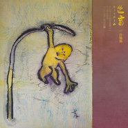

许佩佩
============================

|  |  |
| :--: | :-- |
| [ 许佩佩](https://i.xiami.com/xupeipei) | **播放数**: 1606278 **粉丝数**: 473 **评论数**: 36 **地区**: China 中国大陆 **风格**: 独立民谣 Indie Folk  |

## 档案

『 我是一个没有终点的旅人/ 我在东方的东方/ 在黑暗里歌唱 』 
——风中传来这样的声音，淳朴独立的民谣质地，没有目的地却一直探索着。她如一株小小草，温暖浅唱，飘摇闪亮。低语述说中发出巨大但是温柔的力量，阅过心相与世相，点亮黑暗中一盏飘摇的人文之灯。 
许佩佩Annie Hsu，独立音乐人。 
2015年7月，作品《晚安，riverside》收录于民谣合辑《河岸》。 
2016年10月，发行首张个人专辑《色盲》。 
微信公众号：wandererpeipei 
微博 @流浪的美术馆 
Email： anniesea@foxmail.com

## 专辑

| 名称 | 语种 | 唱片公司 | 发行时间 | 专辑类别 | 专辑风格 |
| :--: | :-- | :-- | :-- | :-- | :-- |
| [ 色盲モノクローム](./albums/2102407504.md) | 国语 | 独立发行 | 2016年10月08日 | 录音室专辑 | 独立民谣 Indie Folk |
| [ 游人间生命の旅](./albums/2100372721.md) | 国语 | 独立发行 | 2016年07月19日 | EP, 单曲 |  |
| [ 河岸Riverside](./albums/2100368867.md) | 国语 | 拉拉索 | 2015年07月31日 | 合集, 杂锦 |  |

## 评论

|  |  |  |  |
| :-- | :-- | :-- | :-- |
|  [虾米用户](https://emumo.xiami.com/u/8337431) 以乐会友 2020-08-20 22:58 赞(0) 踩(0) | 
华语原创独立民谣魅力女声
 |
|  [虾米用户](https://emumo.xiami.com/u/8337431) 以乐会友 2020-08-20 22:45 赞(0) 踩(0) | 
国产独立民谣，20200820.35
 |
|  [虾米用户](https://emumo.xiami.com/u/1810762) 一片閑雲 2020-04-24 21:51 赞(0) 踩(0) | 
綿綿細雨的聲音，動人！
 |
|  [虾米用户](https://emumo.xiami.com/u/2373618) 幸福是一朵巨大的云 2019-07-10 13:44 赞(0) 踩(0) | 
7-9月，河岸艺术平台发起了“河岸回声”咖啡馆巡演计划。将在上海的咖啡馆做20场的巡回演出。参与的音乐人有：莫染、北戈、江生、铭钰、荷马先生、周勇、佩佩、囚牛乐队、一纯、铭钰、白羽等。第一场7月20日。具体详情：<a href="https://www.douban.com/event/32524300/" target="_blank" rel="nofollow noreferrer noopener">https://www.douban.com/event/32524300/</a>请加许佩佩微博咨询。
 |
|  [虾米用户](https://emumo.xiami.com/u/1499382)   2019-04-30 02:08 赞(4) 踩(0) | 
这才是民谣啊，听着舒服
 |
|  [虾米用户](https://emumo.xiami.com/u/374246817) 有时间就来听歌。 2019-04-28 14:35 赞(2) 踩(0) | 
好听
 |
|  [虾米用户](https://emumo.xiami.com/u/4487129)  2019-03-15 11:27 赞(1) 踩(0) | 
！！！
 |
|  [虾米用户](https://emumo.xiami.com/u/264936265) 在寂寞中死去，在人世里生... 2019-02-26 00:05 赞(3) 踩(0) | 
你的歌声是美丽的艺术，是听的见，感触的到的艺术。让我这个艺术的盲人，也能感觉的到艺术是如此美丽动听！
 |
|  [虾米用户](https://emumo.xiami.com/u/5851253) 前路亦是故乡 2018-11-07 17:39 赞(1) 踩(0) | 
网上竟然搜不到你的现场视频!!
 |
|  [虾米用户](https://emumo.xiami.com/u/364989013)  2018-08-05 19:04 赞(2) 踩(0) | 
突然听到你的歌，也突然喜欢上了；特别是陌生的城和浪子。那种惆怅，那种感情。每个人喜欢的不一样，感觉这样的歌很少人听到太可惜了。不管怎样，支持你！
 |
|  [虾米用户](https://emumo.xiami.com/u/100356) 牀畔戲寶未合襯 紅裙再花... 2018-03-13 15:55 赞(0) 踩(0) | 
彳亍於珠海情侶路中看遍世情風景淡白初見衝動交通燈太鮮紅藍到凍失心瘋而你我迷戀於自己嘅色盲中凍糕好好食但係唔及你暗湧好久不見你好嗎
 |
|  [虾米用户](https://emumo.xiami.com/u/344112787)  2018-02-11 06:53 赞(0) 踩(0) | 
每首歌都是故事，每首歌都是画！喜欢
 |
|  [虾米用户](https://emumo.xiami.com/u/9024420) music 2017-08-28 20:49 赞(1) 踩(0) | 
好听好听
 |
|  [虾米用户](https://emumo.xiami.com/u/282508363)  2017-06-13 18:49 赞(1) 踩(0) | 
难得让我感动的女声，希望你能有更好的作品
 |
|  [虾米用户](https://emumo.xiami.com/u/282508363)  2017-06-10 12:14 赞(1) 踩(0) | 
唱的歌都有味道，有意境
 |
|  [虾米用户](https://emumo.xiami.com/u/242446091) 乐天知命，故无忧 2017-04-21 09:44 赞(4) 踩(0) | 
你这么棒的歌曲，应该放在话语歌坛的顶端。在资本面前感叹人是如此渺小！不过放心时间会证明，金子会发光
 |
|  [虾米用户](https://emumo.xiami.com/u/242446091) 乐天知命，故无忧 2017-04-18 14:22 赞(0) 踩(0) | 
打动人心。
 |
|  [虾米用户](https://emumo.xiami.com/u/4232584)  2017-02-18 22:17 赞(0) 踩(0) | 
喜欢冬天，加油！
 |
|  [虾米用户](https://emumo.xiami.com/u/6767293) 我还没想好要写什么... 2016-11-23 14:38 赞(0) 踩(0) | 
许佩佩&amp;amp;白羽 《浪子归途》 演出地点：杭州·木马剧场 2016年12月2日 19:30 购票渠道：周末去哪儿；豆瓣同城；格瓦拉；大麦
 |
|  [虾米用户](https://emumo.xiami.com/u/775394) 聆听耳边风景 2016-11-21 23:40 赞(0) 踩(0) | 
听了浪子来的 声音穿越了人间 却不沾染俗尘凡世
 |
|  [虾米用户](https://emumo.xiami.com/u/5024386) 你不要比我放荡   2016-11-18 09:59 赞(1) 踩(0) | 
好棒啊 
 |
|  [虾米用户](https://emumo.xiami.com/u/86111044)  2016-09-01 13:07 赞(1) 踩(0) | 
期待新专辑
 |
|  [虾米用户](https://emumo.xiami.com/u/219854245)  2016-08-28 22:48 赞(1) 踩(0) | 
好听，加油
 |
|  [虾米用户](https://emumo.xiami.com/u/7780708)   2016-04-24 22:02 赞(0) 踩(0) | 
佩佩，请问你的歌怎么不在QQ音乐里面
 |
|  [虾米用户](https://emumo.xiami.com/u/7780708)   2016-04-24 21:58 赞(0) 踩(0) | 
好听
 |
|  [虾米用户](https://emumo.xiami.com/u/77498984) 痴傻疯癫狂 2015-10-28 19:49 赞(0) 踩(0) | 
很好听的歌
 |
|  [虾米用户](https://emumo.xiami.com/u/51897947)  2015-06-30 08:52 赞(1) 踩(0) | 
非常
 |
|  [虾米用户](https://emumo.xiami.com/u/51897947)  2015-06-30 08:52 赞(1) 踩(0) | 
好棒，支持你。
 |
|  [虾米用户](https://emumo.xiami.com/u/1539805) 我和從前一樣 在天空 飛... 2014-12-10 13:57 赞(5) 踩(0) | 
我刚入驻了虾米音乐人，欢迎大家来我的个人主页，收听我的最新音乐
 |
| ⇒ |  [虾米用户](https://emumo.xiami.com/u/240896)  2014-12-11 16:31 赞(0) 踩(0) | 
佩佩我喜欢你的跳舞吧
 |
| ⇒ |  [虾米用户](https://emumo.xiami.com/u/1539805) 我和從前一樣 在天空 飛... 2014-12-13 23:27 赞(0) 踩(0) | 
<q><b>梦和牧人说：</b></q>
 |
| ⇒ |  [虾米用户](https://emumo.xiami.com/u/240896)  2014-12-14 18:59 赞(0) 踩(0) | 
<q><b>许佩佩说：</b></q>
 |
| ⇒ |  [虾米用户](https://emumo.xiami.com/u/1539805) 我和從前一樣 在天空 飛... 2014-12-19 23:19 赞(0) 踩(0) | 
<q><b>梦和牧人说：</b></q>
 |
|  [虾米用户](https://emumo.xiami.com/u/5611598) ☞☜ 2013-07-25 16:59 赞(1) 踩(0) | 
folk
 |
|  [虾米用户](https://emumo.xiami.com/u/2958995)  2011-10-20 22:46 赞(1) 踩(0) | 
追讨一生所爱到这。。。。。。。。。。。。。。。。。。
 |
| ⇒ |  [虾米用户](https://emumo.xiami.com/u/1539805) 我和從前一樣 在天空 飛... 2011-11-08 22:49 赞(0) 踩(0) | 
哈哈，真的吗？好玩~
 |
