刺猬
============================

|  |  |
| :--: | :-- |
| [ 刺猬](https://i.xiami.com/hedgehog) | **地区**: China 中国大陆 **风格**: 独立摇滚 Indie Rock, 梦幻流行 Dream Pop, 噪音流行 Noise Pop, 另类摇滚 Alternative Rock, 迷幻摇滚 Psychedelic Rock **播放数**: 10162824 **粉丝数**: 44108 **评论数**: 1135  |

## 档案

One of the most iconic and influential indie rock trio in the Beijing Explosion indie rock scene in 2007.     Hugely popular with both musical hipsters, for the brilliance of their compositions and performances, and with rock and roll party animals, for their wild, out of control pop frenzy, Hedgehog’s music is totally approachable and totally unique. it is their song-writing skills that make this band more than just a great performance band and one of the most important in China.     -- taken from D22 ( http://www.rockinchina.com/w/D-22)      乐队成员：    Guitar/Vocal:ZO 子健    Bass:Fun 何一帆    Drum/Vocal:Atom 阿童木     past member:    Box(2006-2009 Bass)      2005年10月由3个热爱摇滚乐的年轻人成立，歌声真诚、悦耳、醒目。现场猛、扎、碎。硬汉的“噩”梦，少男的“春”天，知青的“醉”爱。摇滚乐是一面镜子，让你找到自己，看清自己，打开自己。      “简单的三大件，简单的旋律，真诚的歌词，配上独一无二的双声部男女主唱”刺猬始终遵循着独立、简单、原始、带劲的创作原则。      2004 年底经后海大鲨鱼乐队鼓手小武介绍，阿童木（鼓手、和声）加入了当时子健（吉他、唱）组建的朋克乐队失控体，后乐队更名为刺猬，2005年10月子健叫来了自己的高中同学博宣担任贝司手，刺猬成立。      06 年1月乐队在 wing录音室用14个小时录制了首张唱片《Happy Idle Kid》，随后录音专业毕业的阿童木自己在家里完成了唱片的后期制作，并手工制作100张唱片限量地下发行，由于乐队的曲风与当时风靡北京的重金属、朋克、车库摇滚等音乐氛围不相融洽，在发行唱片初期乐队的演出机会很少，只能在各种大学摇滚聚会上做小型演出，但惊喜的是首轮发行的 100张《Happy idle kid》在两个月内销售一空了。5月份乐队参加了midi音乐节小舞台的演出，现场十分火爆，乐队自此开始小有名气。《HIK》这张被舆论戏称为阳光板 nirvana的唱片随后再版发行，还是由乐队成员手工制作，并在淘宝网上销售至今。乐队的首张唱片充满了典型的Grunge式音乐架构，但更多的是属于刺猬自己的旋律特点，他们从最开始就保持了音乐的简单性，并十分善于创作惊喜好听的旋律。      2007年3月，阿童木在摩登天空的官网上查了电话后致电唱片公司说“我们想签约。”时任摩登天空艺人总监的孟金辉在听过《噪音袭击世界》的小样后，乐队顺利签约摩登天空。      07 年是北京新音乐的爆炸年，D22是当时所有新乐队诞生的温床，Carsick Cars、Snapline、Scoff、后海大鲨鱼等新乐队频繁的在D22制造着越来越火爆的演出场面，2月一直演出无门的刺猬经过挂在盒子上主唱王悦的介绍得到了在D22演出的宝贵机会，乐队的首次表演遍得到了老板Micheal的认可，随后的半年内刺猬逐渐被认可为北京现场最好的新乐队之一。随着签约摩登天空，07年乐队参加了朝阳流行音乐节、首届摩登天空音乐节、上海十跃音乐节等大型演出，并于同年7月和新裤子与PK14赴香港参加了 “Beijing Explosion”的系列演出活动。      2007年10月《噪音袭击世界》正式发行，唱片中乐队在保持了简洁的摇滚乐架构基础上加入了少量合成器点缀，歌曲则更加流畅，同时增加了阿童木的女声和声效果，歌曲保持了甜美与叛逆共存的独立特性，新裤子乐队庞宽复古的封套设计与追忆童年俏皮中带着忧伤的歌词都成为了刺猬音乐的标签，乐队独立的创作的概念得以放大，《玩具和61儿童节》《噪音袭击世界》《Our Last Word》《爱之废语》等歌曲成为乐队被普遍认可的首批金曲，同时这张唱片中的一些歌曲更是得到了很多国际企业的青睐，单曲《Elf》《Our Last Word》被用于Converse和Nike的广告，《Our Last Word》中的歌词“青春看起来如此完美，没空闲去浪费时间”成为Converse 2009年末推广活动的主题句之一，《玩具和61儿童节》被全球的畅销游戏《Little Big World》作为“中国关”的主题曲。      08 年4月乐队进行了首次国内巡演，10月再次参加摩登天空音乐节，乐队的迅速成长也不断伴随着舆论的质疑，由于早期专辑制作经验与经费的不足导致的唱片质量差的问题质疑声不断，很多人认为刺猬是只能看现场的乐队。在摩登天空的帮助下，乐队决定做一张好唱片来回应，8月乐队在敦煌音像录音棚录制了《白日梦蓝》。      09年3月乐队的第三张唱片《白日梦蓝》正式发行。有别于《噪音袭击世界》的全英文歌词，《白日梦蓝》中有7首中文歌，诚恳的歌词动人的旋律使乐队得到了更广泛的认可，唱片中被放大处理的明亮剔透的吉他音色与如暴风骤雨般的鼓点编配也成为大众议论的焦点，刺猬独有的音乐气质与编曲模式更加明显。    09年4月乐队进行了第二次国内巡演，并于5月参加了首届草莓音乐节和成都热播音乐节，随后的一年内《白日梦蓝》《春天来了》《树》《24小时摇滚聚会》《最后一班车》《金色年华，无限伤感》等诸多作品被广为传唱。    09 年9月在摩登天空的安排下乐队同赌鬼、后海大鲨鱼进行了一个月的美国巡演，横跨东西海岸，历经16个城市22场演出。10月初回国后乐队第三次参加了摩登天空音乐节。    2009年11月，博宣退出乐队。      2010年4月子健和阿童木在敦煌音箱录音棚录制了刺猬的第四张专辑    6月原怪力乐队贝斯手何一帆加入但当贝斯手    8月参加第9届新加坡Bay Beats音乐节和首届长城音乐节。    10月乐队和重塑雕像的权利乐队一起受bluroc唱片老板Demon Dash邀请赴纽约，参加了2010CMJ音乐节。      2011年1月，乐队在西四排练室用一个下午的时间录制了9首歌的demo。    2011年3月，专辑《甜蜜与杀害》与限量版demo《2011 DEstroy meMOries》同步发行，乐队视《蜜杀》专辑为乐队的青春三部曲中的总结篇，《杀死你的时代》《最后，我们会一起去海边》等歌曲基本延续了刺猬一贯的音乐表现手法，但他们似乎不像原来那么欢乐了。限量的DEMO则偏向噪音实验。    2011年3月-4月，“甜蜜与杀害”17城中国公路巡演，5月乐队参加了草莓音乐节。    2011年9月赴美，在纽约曼哈顿的Cake Shop和布鲁克林的Bruar Falls进行了两场地下演出，并受邀同XiuXiu进行为期两周13场的美国东海岸小城市巡演，10月乐队回到纽约录制新专辑，制作人是John Grew 和Jon Spencer Blues Explosion乐队的Russell Simins。    2011年9月赴美，在纽约曼哈顿的Cake Shop和布鲁克林的Bruar Falls进行了两场地下演出，并受邀同XiuXiu进行为期两周13场的美国东海岸小城市巡演，10月乐队回到纽约录制新专辑「Sun Fun Gun 阳光、欢乐、枪。」 ，录音师是John Grew，专辑由刘峰铄在北京混缩制作完成。   2012.4.5 「Sun Fun Gun 阳光、欢乐、枪。」发表，不同于以往刺猬任何的唱片，Sun Fun Gun在保持诱人旋律的同时并没有失去音乐的力度，并融合掺杂了更多的让人意想不到眼前一亮的吉他演奏与音乐氛围营造。“这有可能是刺猬目前为止最好的专辑” --- TimeOut北京英文版 2012年4月刊   2012.3-4 Sun Fun Gun中国巡演11城，w/ The Mistery Lights   2012.4.30/5.1 草莓音乐节（北京/上海）   2012年9月27日-10月13日 澳大利亚巡演(11城) w REGURGITATOR   2012.11.09-12.22 Sun Fun Gun 冬季中国巡演(11城市)   2013.3 受邀参加台湾大港开唱音乐节，并在台北 the wall做专场演出

## 专辑

| 名称 | 语种 | 唱片公司 | 发行时间 | 专辑类别 | 专辑风格 |
| :--: | :-- | :-- | :-- | :-- | :-- |
| [ 刺](./albums/5022546207.md) | 国语 |  | 2020年10月24日 | 录音室专辑 |  |
| [ 真心英雄电影《夺冠》推广曲](./albums/5021503422.md) | 国语 | 奔跑怪物 | 2020年09月27日 | EP, 单曲 | 国语流行 Mandarin Pop |
| [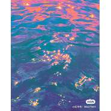 机器人绑着电线](./albums/5022415946.md) | 国语 |  | 2020年08月25日 | 录音室专辑 |  |
| [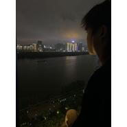 love](./albums/5022455693.md) | 国语 |  | 2020年08月18日 | 录音室专辑 |  |
| [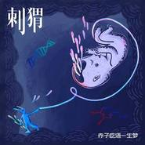 赤子呓语一生梦](./albums/5020854450.md) | 国语 | 赤瞳音乐 | 2020年06月08日 | 录音室专辑 | 国语流行 Mandarin Pop |
| [ 喜剧说唱](./albums/5022392376.md) | 国语 |  | 2020年03月03日 | 录音室专辑 |  |
| [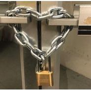 故事](./albums/5022464026.md) | 国语 |  | 2020年03月01日 | EP, 单曲 |  |
| [ 甜狗](./albums/5022438382.md) | 国语 |  | 2019年12月06日 | 录音室专辑 |  |
| [ 失眠症](./albums/5022420665.md) | 国语 |  | 2019年04月05日 | 录音室专辑 |  |
| [ 弯路](./albums/5022405542.md) | 国语 |  | 2019年03月30日 | 录音室专辑 |  |
| [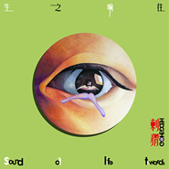 生之响往](./albums/2103697979.md) | 国语 | 赤瞳音乐, 太合麦田 | 2018年04月25日 | 录音室专辑 |  |
| [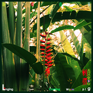 盼暖春来](./albums/2103515082.md) | 国语 | 赤瞳音乐, 太合麦田 | 2018年02月04日 | EP, 单曲 |  |
| [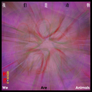 我们是动物](./albums/2103515087.md) | 国语 | 赤瞳音乐, 太合麦田 | 2018年01月29日 | EP, 单曲 |  |
| [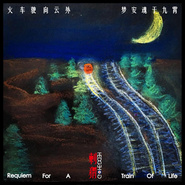 火车驶向云外，梦安魂于九霄](./albums/2103472185.md) | 国语 | 赤瞳音乐 | 2018年01月08日 | EP, 单曲 | 另类摇滚 Alternative Rock |
| [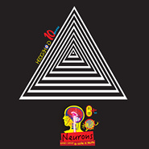 神经元 Neurons2005-2015 B-side & More](./albums/1728927142.md) | 英语 | 摩登天空 | 2015年06月24日 | 精选集 | 独立摇滚 Indie Rock, 另类摇滚 Alternative Rock, 迷幻摇滚 Psychedelic Rock |
| [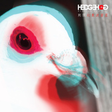 幻象波普星Phantom Pop Star](./albums/196481258.md) | 国语 | 摩登天空 | 2014年04月25日 | 录音室专辑 | 梦幻流行 Dream Pop, 另类摇滚 Alternative Rock |
| [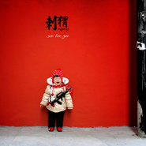 Sun Fun Gun阳光、欢乐、枪](./albums/501896.md) | 国语 | 独立发行 | 2012年04月05日 | 录音室专辑 | 噪音摇滚 Noise Rock, 朋克 Punk Rock, 新迷幻 Neo-Psychedelia |
| [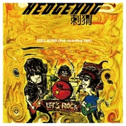 Still Alive (Live Recording 2011)还活着](./albums/480050.md) | 国语 | 独立发行 | 2011年09月28日 | 现场专辑 | 摇滚 Rock & Roll |
| [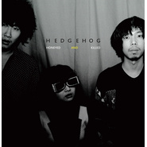 甜蜜与杀害Honeyed And Killed](./albums/430469.md) | 国语 | 摩登天空 | 2011年03月12日 | 录音室专辑 | 摇滚 Rock & Roll |
| [ 2011 DEstroy meMOries2011 摧毁记忆 / 2011 DEMOs](./albums/430593.md) | 国语 | 独立发行 | 2011年03月11日 | EP, 单曲 | 摇滚 Rock & Roll |
| [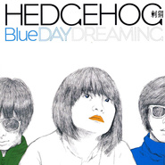 白日梦蓝Blue Daydreaming](./albums/320368.md) | 国语 | 摩登天空 | 2009年03月01日 | 录音室专辑 | 摇滚 Rock & Roll |
| [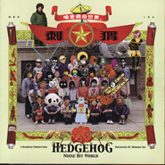 噪音袭击世界Noise Hit World](./albums/32632.md) | 国语 | 摩登天空 | 2007年09月29日 | 录音室专辑 | 摇滚 Rock & Roll |
| [ Happy Idle Kid快乐的懒孩子](./albums/312414.md) | 英语 | 独立发行 | 2006年03月12日 | 录音室专辑 | 摇滚 Rock & Roll |

## 评论

|  |  |  |
| :-- | :-- | :-- |
|  [虾米用户](https://emumo.xiami.com/u/2955288) 音乐是最私密的交流 2021-01-06 18:23 赞(1) 踩(0) | 
刺猬刚回来虾米却没了&amp;hellip;&amp;hellip;
 |
|  [虾米用户](https://emumo.xiami.com/u/551581) 要么是孤独 要么是庸俗 2020-11-20 04:40 赞(0) 踩(0) | 
来了
 |
|  [虾米用户](https://emumo.xiami.com/u/26739712)   2020-10-10 00:24 赞(2) 踩(0) | 
好多版权都回来了，真好(o^^o)
 |
|  [虾米用户](https://emumo.xiami.com/u/442651198)  2020-09-27 21:53 赞(0) 踩(0) | 
好巧哦
 |
|  [虾米用户](https://emumo.xiami.com/u/50433398)   2020-09-22 13:08 赞(1) 踩(0) | 
牛逼，刺猬又回虾米了
 |
|  [虾米用户](https://emumo.xiami.com/u/349339882) 后荣迷。努力学习中。 2020-08-29 17:13 赞(0) 踩(0) | 
(&amp;acute;-&amp;omega;-`)新舍友钟意的乐队~ 9.5要来楠溪江了呀，赞~
 |
|  [虾米用户](https://emumo.xiami.com/u/408998650)   2020-08-08 09:56 赞(0) 踩(0) | 
粉了粉了，啤
 |
|  [虾米用户](https://emumo.xiami.com/u/71684456) 我还没想好要写什么... 2020-08-03 20:51 赞(0) 踩(0) | 
刺猬是从摩登天空转赤瞳了么
 |
|  [虾米用户](https://emumo.xiami.com/u/71684456) 我还没想好要写什么... 2020-08-03 20:45 赞(1) 踩(0) | 
看乐夏1，收获了宝藏刺猬乐队～
 |
|  [虾米用户](https://emumo.xiami.com/u/2207073) 没有曾经，只有未来。其实... 2020-08-02 02:09 赞(0) 踩(0) | 
谢谢你们。
 |
|  [虾米用户](https://emumo.xiami.com/u/215379991) 簽名不重要重要的是你聽什... 2020-08-01 04:59 赞(0) 踩(0) | 
ﻌﻌﻌ❤︎
 |
|  [虾米用户](https://emumo.xiami.com/u/47448303)   2020-06-14 19:20 赞(4) 踩(0) | 
热评第一说只听前奏的 大概是get不到子健的唱吧 我个人觉得很好 尤其是*幻象波普星 中的唱 子健懂得如何补足原本不出彩的唱功 唱出来的声音质感和精心编制的曲子是非常和谐的 加上他的词 锦上添花 情绪由浅入深 他们的歌听了犹如注射了肾上腺素
 |
|  [虾米用户](https://emumo.xiami.com/u/24325936) 无忧无虑，向前游。。。 2020-05-29 13:15 赞(0) 踩(0) | 
如果让鼓手当主唱，关注度应该会更高。
 |
|  [虾米用户](https://emumo.xiami.com/u/7960941) 我还没想好要写什么... 2020-05-28 22:05 赞(0) 踩(0) | 
支持
 |
|  [虾米用户](https://emumo.xiami.com/u/5394363) 滑板 冲浪 拍照 2020-04-22 05:58 赞(0) 踩(0) | 
不要让爱奇艺影响冲浪了，我从02年就开始你们了，他们让你赚了钱，但是你们觉得是真的么？这个社会给所有人太多改变了，我的发声我只是喝酒里流淌的水，但是真的，你们渴求世界还有点真的话，请把我的微信推给马东，我希望他能理解我们浪人，而不是用流量来冲击整个文化，感谢你们对音乐的付出，但是这个真的不一样！
 |
| ⇒ |  [虾米用户](https://emumo.xiami.com/u/563649)  2020-07-31 20:25 赞(0) 踩(0) | 
你把这段话捋得让人能看明白再说吧
 |
| ⇒ |  [虾米用户](https://emumo.xiami.com/u/330386135)  2020-08-06 19:06 赞(0) 踩(0) | 
看不懂你在说什么！艺术和挣钱之间从来都不矛盾，你自己想拧巴着过那是你自己的事，麻烦不要拉着别人一起过你想要的日子！没有乐夏，像我这样的乐迷不知道还要多少年才能发现刺猬这样的宝藏乐队！
 |
|  [虾米用户](https://emumo.xiami.com/u/998991)  2020-04-13 00:33 赞(0) 踩(0) | 
我们都是孤独的刺猬，只有频率相同的人，才能看见彼此内心深处不为人知的优雅。
 |
|  [虾米用户](https://emumo.xiami.com/u/8394057)  2020-03-21 14:18 赞(0) 踩(0) | 
越听越上头
 |
|  [虾米用户](https://emumo.xiami.com/u/23044280) 爱生活 爱老婆 爱女儿 2020-02-09 13:46 赞(1) 踩(0) | 
感谢乐队的夏天 那么多乐队最喜欢刺猬
 |
|  [虾米用户](https://emumo.xiami.com/u/434921364)  2019-12-30 13:36 赞(0) 踩(0) | 
内容已删除
 |
| ⇒ |  [虾米用户](https://emumo.xiami.com/u/28249588) 来自1998 2019-12-31 22:07 赞(0) 踩(0) | 
不是这样，你都忘了你有多美
 |
| ⇒ |  [虾米用户](https://emumo.xiami.com/u/434921364)  2020-01-01 17:20 赞(0) 踩(0) | 
<q><b>皮痒卡丘说：</b></q>
 |
| ⇒ |  [虾米用户](https://emumo.xiami.com/u/143338) ~~~~~~~~~~~~ 2020-01-02 13:54 赞(0) 踩(0) | 
你这是遇到PUA了吧，建议搜集证据挂出来发到微博上面
 |
| ⇒ |  [虾米用户](https://emumo.xiami.com/u/434921364)  2020-01-03 00:01 赞(0) 踩(0) | 
<q><b>Art of Life说：</b></q>
 |
|  [虾米用户](https://emumo.xiami.com/u/306606246) 不喜全世界 2019-10-22 17:26 赞(3) 踩(0) | 
求你们来长沙好不好~ 好久没听到这么心动这么想去看现场的乐队了~ 国内能有你们真的很开心很惊喜~ 我在高中那会听过你们的歌，现在转眼已经好几年了，期间经历了很多事，也听了不少歌，现在又听了你们的歌，它们真的给了我莫大的惊喜。我好喜欢你们！！ （然而我没有看大火的《乐队的夏天》，我一向不喜欢综艺节目） 希望你们是代表你们个人来长沙开演唱会~！最晚明年吧，我已经等不及了，求你们赶快来。（看到我，拜托）
 |
|  [虾米用户](https://emumo.xiami.com/u/260992790) I'll Be Your... 2019-10-11 12:05 赞(3) 踩(0) | 
现在这评论区太有趣了
 |
|  [虾米用户](https://emumo.xiami.com/u/1381906) Skin to skin 2019-10-11 05:57 赞(0) 踩(0) | 
相见恨晚
 |
|  [虾米用户](https://emumo.xiami.com/u/10643094) 要加组织的朋友发站内信 2019-10-08 20:54 赞(0) 踩(0) | 
可
 |
|  [虾米用户](https://emumo.xiami.com/u/9189629) 1184450777 2019-09-07 08:52 赞(0) 踩(0) | 
这个夏天最摇滚的乐队！~
 |
|  [虾米用户](https://emumo.xiami.com/u/48713411) 你的温暖，逆光而来。 2019-09-06 21:08 赞(1) 踩(0) | 
我想说璐璐  我们同月同日生
 |
| ⇒ |  [虾米用户](https://emumo.xiami.com/u/9189629) 1184450777 2019-09-07 08:51 赞(0) 踩(0) | 
那，我也喜欢你
 |
|  [虾米用户](https://emumo.xiami.com/u/28121031)   2019-09-03 10:53 赞(5) 踩(0) | 
版权能再争取多点嘛…要培养我女儿的架子鼓了…
 |
|  [虾米用户](https://emumo.xiami.com/u/2617510) secret stand 2019-08-27 17:21 赞(0) 踩(0) | 
真的很棒
 |
|  [虾米用户](https://emumo.xiami.com/u/374968637) 听音乐这事儿当然看心情啦 2019-08-24 09:32 赞(0) 踩(0) | 
评论好多 吓我一跳 这还是虾米吗 Hahahaha
 |
|  [虾米用户](https://emumo.xiami.com/u/309213480) 我还没想好要写什么... 2019-08-11 00:37 赞(3) 踩(0) | 
感谢乐夏让我在有生之年认识你们。。。。爱你们三只 。
 |
| ⇒ |  [虾米用户](https://emumo.xiami.com/u/419818987)  2019-09-02 15:19 赞(0) 踩(0) | 
我也是在乐夏里看见的，然后特喜欢٩( 'ω' )و
 |
|  [虾米用户](https://emumo.xiami.com/u/400652567)  2019-08-10 23:22 赞(0) 踩(0) | 
绝了
 |
|  [虾米用户](https://emumo.xiami.com/u/47875756) 没有固定喜欢的，只喜欢自... 2019-08-08 06:26 赞(2) 踩(0) | 
璐姐还是我爱的那个北京大妞。虽然现在也当了妈，但再听还是会想起那些年，依然热泪盈眶，此间依然少年
 |
|  [虾米用户](https://emumo.xiami.com/u/45058527) 青春不在年华，而在心境。 2019-08-08 01:06 赞(1) 踩(0) | 
在乐队的夏天知道了刺猬。粉了刺猬。觉得主唱子健是非常有内涵的摇滚人。他的创作会被传唱下去。
 |
|  [虾米用户](https://emumo.xiami.com/u/292805117)  2019-08-07 22:53 赞(2) 踩(0) | 
感谢乐队的夏天，让我认识了刺猬   好像再看你们跟斯斯与帆合作几首歌
 |
|  [虾米用户](https://emumo.xiami.com/u/330898350)  2019-08-07 17:51 赞(0) 踩(0) | 
听刺猬，感受时间之殇
 |
|  [虾米用户](https://emumo.xiami.com/u/330898350)  2019-08-07 17:49 赞(1) 踩(0) | 
感谢乐队的夏天，让我认识了刺猬
 |
|  [虾米用户](https://emumo.xiami.com/u/3030861) 也无风雨亦无晴。 2019-08-06 22:12 赞(0) 踩(0) | 
还有一张《NOISE HIT WORLD》被狗吃了呀？挺棒的一张砖呀！
 |
|  [虾米用户](https://emumo.xiami.com/u/397095)  2019-08-04 04:42 赞(2) 踩(0) | 
不会编程的主唱不是好程序员[带墨镜笑]
 |
|  [虾米用户](https://emumo.xiami.com/u/1153427)   2019-08-02 03:26 赞(0) 踩(0) | 
子建你和石路喜不喜欢coldplay
 |
| ⇒ |  [虾米用户](https://emumo.xiami.com/u/372711637) Sayonara~ 2020-03-10 04:43 赞(0) 踩(0) | 
都不喜欢
 |
|  [虾米用户](https://emumo.xiami.com/u/11045005) 我还没想好要写什么... 2019-07-30 19:39 赞(2) 踩(0) | 
我爱了你们八年啦，我会爱你们一直一直爱下去 
 |
|  [虾米用户](https://emumo.xiami.com/u/297438585)  2019-07-27 15:54 赞(0) 踩(0) | 
怎么乐队介绍都是英文的啊！
 |
|  [虾米用户](https://emumo.xiami.com/u/297214791) 我还没想好要写什么... 2019-07-23 07:44 赞(1) 踩(0) | 
中国版碎南瓜
 |
| ⇒ |  [虾米用户](https://emumo.xiami.com/u/17840605) 身已腐朽 其爱不渝 2019-08-04 23:18 赞(0) 踩(0) | 
感觉嘎调乐队更像
 |
|  [虾米用户](https://emumo.xiami.com/u/42972087)  2019-07-22 17:40 赞(0) 踩(0) | 
太好了 从爱奇艺、酷狗、微博一路追到这 网络真是太好了 近距离接触刺猬
 |
|  [虾米用户](https://emumo.xiami.com/u/3048308)   2019-07-22 00:29 赞(1) 踩(0) | 
今天一家三口出动会刺猬。三岁半的女儿很喜欢石璐，每天上车就喊我放姐姐打鼓的歌还要跟着一起唱 dear boy i wanna be。现场真炸！欢迎你们再来重庆。
 |
|  [虾米用户](https://emumo.xiami.com/u/9134781)  2019-07-21 21:48 赞(2) 踩(0) | 
几年前前听刺猬只能找虾米，而现在。。。
 |
| ⇒ |  [虾米用户](https://emumo.xiami.com/u/19500286) 拿衣服 2019-08-04 06:29 赞(0) 踩(0) | 
都下架了？
 |
|  [虾米用户](https://emumo.xiami.com/u/5531580) 四体不勤五谷不分 2019-07-19 15:43 赞(0) 踩(0) | 
看完视频真的不一样！现场太炸了！棒！这几天好开心，太久没听到让人激动的歌了！
 |
|  [虾米用户](https://emumo.xiami.com/u/9375301) 我还没想好要写什么... 2019-07-18 10:14 赞(4) 踩(0) | 
为什么虾米连国内的乐队也没有版权啊？
 |
|  [虾米用户](https://emumo.xiami.com/u/766477) 再见了 虾米! 2019-07-17 12:41 赞(1) 踩(0) | 
那么多歌的版权呢？
 |
|  [虾米用户](https://emumo.xiami.com/u/1153427)   2019-07-16 02:19 赞(0) 踩(0) | 
有好多话要你说，对，想和你们说
 |
|  [虾米用户](https://emumo.xiami.com/u/374219263)  2019-07-15 19:04 赞(0) 踩(0) | 
石璐石璐 
 |
|  [虾米用户](https://emumo.xiami.com/u/341736754)  2019-07-13 10:26 赞(0) 踩(0) | 
通过夏天的乐队认识了刺猬，NB!
 |
|  [虾米用户](https://emumo.xiami.com/u/271579318) 爱你永不停歇 对吗 2019-07-12 20:42 赞(1) 踩(0) | 
希望会继续下去 坚持向前  乐队的夏天 让我认识了你们 每次听到你们的歌 眼眶都会湿润 总是能唱到我心里 加油啊   
 |
|  [虾米用户](https://emumo.xiami.com/u/1380712)  2019-07-10 22:55 赞(3) 踩(0) | 
石璐很美。眼睛美笑容美。
 |
|  [虾米用户](https://emumo.xiami.com/u/3012327) 何だ⁉️ 2019-07-10 00:16 赞(2) 踩(0) | 
这仨人生活的样子还挺让人心疼的
 |
|  [虾米用户](https://emumo.xiami.com/u/14754495)  2019-07-09 20:24 赞(3) 踩(0) | 
表白石璐
 |
|  [虾米用户](https://emumo.xiami.com/u/77630102) 视之不见，听之不闻，搏之... 2019-07-09 15:29 赞(2) 踩(0) | 
火车驶向云外，梦安魂于九霄！把哥们震了，有年头没听到这么纯真的音乐了，有点悲了，心酸，人生=喜怒哀乐和分离别，何必再为此受伤。
 |
|  [虾米用户](https://emumo.xiami.com/u/40925779)   2019-07-08 04:36 赞(1) 踩(0) | 
咚哒咚咚哒
 |
|  [虾米用户](https://emumo.xiami.com/u/9142282) 微博：FEVER_DOG... 2019-07-06 19:23 赞(0) 踩(0) | 
mmm
 |
|  [虾米用户](https://emumo.xiami.com/u/1153427)   2019-07-05 10:43 赞(4) 踩(0) | 
从来不听国内乐队，这次看了乐队夏天被刺猬惊艳泪目，一来看虾米艺人主页，果然系统分析和刺猬听歌相似度很高。
 |
| ⇒ |  [虾米用户](https://emumo.xiami.com/u/13648191) 拍張狂 2019-07-07 22:03 赞(0) 踩(0) | 
一集没看过的老粉请问能看重播录像吗？哪个点泪目的
 |
| ⇒ |  [虾米用户](https://emumo.xiami.com/u/1153427)   2019-07-15 16:50 赞(0) 踩(0) | 
<q><b>daysleeper说：</b></q>
 |
| ⇒ |  [虾米用户](https://emumo.xiami.com/u/1153427)   2019-07-15 16:50 赞(0) 踩(0) | 
<q><b>daysleeper说：</b></q>
 |
|  [虾米用户](https://emumo.xiami.com/u/39605186) 呜啦啦~ 2019-07-04 20:28 赞(1) 踩(0) | 
谢谢你们，加油鸭！
 |
|  [虾米用户](https://emumo.xiami.com/u/9286704) A lo lejos..... 2019-07-01 00:40 赞(4) 踩(0) | 
今天才发现2011年5月我收藏了专辑《白日梦蓝》，那是我在豆瓣收藏的第五张专辑。
 |
|  [虾米用户](https://emumo.xiami.com/u/13313040) 再好的相机也只能记录最美... 2019-06-30 23:33 赞(0) 踩(0) | 
刺猬牛逼
 |
|  [虾米用户](https://emumo.xiami.com/u/1568042) 不信抬头看，苍天绕过谁 2019-06-30 16:20 赞(2) 踩(0) | 
你说你没有版权 你在主页推荐个啥
 |
|  [虾米用户](https://emumo.xiami.com/u/274535133)  2019-06-30 11:17 赞(0) 踩(0) | 
啥时候来中国摇滚重镇石家庄搞一波啊，刺猬，国内最喜欢的乐队，没有之一。
 |
|  [虾米用户](https://emumo.xiami.com/u/3566813) 菩萨，祝您身体健康！34... 2019-06-30 03:42 赞(0) 踩(0) | 
你们的现场太棒了！
 |
|  [虾米用户](https://emumo.xiami.com/u/27694836)   2019-06-29 13:52 赞(3) 踩(0) | 
虾米啊，是你逼我出轨的，不过你放心，我听完刺猬的歌还会回家的‍♂️
 |
| ⇒ |  [虾米用户](https://emumo.xiami.com/u/43816145) 品味是一个无底洞 2019-07-17 01:39 赞(0) 踩(0) | 
最近我都跑qq音乐听刺猬新裤子。但是回归是必须回归的 
 |
| ⇒ |  [虾米用户](https://emumo.xiami.com/u/14907430) 阳光明媚 2019-07-17 10:01 赞(0) 踩(0) | 
<q><b>D说：</b></q>
 |
| ⇒ |  [虾米用户](https://emumo.xiami.com/u/5696465)  2019-07-26 01:35 赞(0) 踩(0) | 
<q><b>atmos13说：</b></q>
 |
| ⇒ |  [虾米用户](https://emumo.xiami.com/u/48572783) 敞开心胸相视而笑  那段... 2019-07-27 21:54 赞(0) 踩(0) | 
<q><b>D说：</b></q>
 |
|  [虾米用户](https://emumo.xiami.com/u/59518656) 买不起梦想的穷B，做不了... 2019-06-25 17:47 赞(1) 踩(0) | 
加油加油
 |
|  [虾米用户](https://emumo.xiami.com/u/370892) 心如宝月映琉璃 2019-06-24 18:10 赞(1) 踩(0) | 
火速赶来
 |
|  [虾米用户](https://emumo.xiami.com/u/69836094) 「终极手残」 2019-06-24 15:38 赞(1) 踩(0) | 
挺好，以后也请这样继续下去吧。
 |
|  [虾米用户](https://emumo.xiami.com/u/4188551) 暂无签名~ 2019-06-22 17:56 赞(1) 踩(0) | 
听哭了、神仙歌词 、太打动人了
 |
|  [虾米用户](https://emumo.xiami.com/u/2856255)  2019-06-21 00:26 赞(1) 踩(0) | 
MD 刺猬也是太有才了吧! 生平第一次虾米留言，这就是我有多陷入!
 |
|  [虾米用户](https://emumo.xiami.com/u/13313040) 再好的相机也只能记录最美... 2019-06-20 11:40 赞(1) 踩(0) | 
刺猬牛逼
 |
|  [虾米用户](https://emumo.xiami.com/u/49455420)   2019-06-19 17:54 赞(0) 踩(0) | 
呼叫刺猬，啥时来宁波搞一场 
 |
|  [虾米用户](https://emumo.xiami.com/u/6340830) Made in xi a... 2019-06-19 12:33 赞(3) 踩(0) | 
听乐队十几年，知道我刺猬从来没听过歌，看了乐队发现自己前十几年白活了
 |
| ⇒ |  [虾米用户](https://emumo.xiami.com/u/701251)  2019-08-18 14:34 赞(0) 踩(0) | 
很早时候看到过他们专辑，似乎也听说过刺猬这支团，非常抱歉的是那时候消息比较闭塞，不是圈里或身边的很少有人知道这样即使已经比较有名有经验的团，那时还有打口，去唱片店买正版的钱基本上买了打口，除非那时特别期待的一些国内团，子曰，超载，苍蝇，盘古等，所以以后就再也没留意到刺猬了，后来也听的国外的金属，民谣等比较多，国内听的也就是特别有名的如谢天笑和冷血动物，二手，万青（记得当时一本杂志附赠cd推荐了不万能的喜剧，一下就吸引了）也就是所谓出圈了，或者成为了某种文化符号的野孩子，木推瓜，左小等，直到这次音乐综艺乐夏的扩圈，嗯，算是把我这个也算老炮的家伙也拉进来又充了回电，千言万语，感触很多，希望刺猬长久
 |
|  [虾米用户](https://emumo.xiami.com/u/13136998)   2019-06-19 02:05 赞(1) 踩(0) | 
节目播出以后反而可能遇到危机，一定要坚持住 在一起，做自己。
 |
|  [虾米用户](https://emumo.xiami.com/u/4213420)  2019-06-18 12:57 赞(0) 踩(0) | 
呆歌单里好几年了，有才华始终盖不住
 |
|  [虾米用户](https://emumo.xiami.com/u/2373624) 我还没想好要写什么... 2019-06-17 01:41 赞(4) 踩(0) | 
看乐队的夏天，改编张杰曲目那段，瞬间对刺猬转粉了！！太有感染力了，鼓手是真的厉害！（都有点想跑去听听张杰原曲了...）听过的刺猬不多，，主要是虾米没有资源吧
 |
|  [虾米用户](https://emumo.xiami.com/u/25715982) 再见辣（超小声） 2019-06-17 00:42 赞(2) 踩(0) | 
跟十年前一样喜欢你们，那天真的听的我老泪纵横
 |
|  [虾米用户](https://emumo.xiami.com/u/407419071) 你好请叫我小吴 2019-06-16 21:23 赞(1) 踩(0) | 
我好后悔 现在才发现刺猬
 |
|  [虾米用户](https://emumo.xiami.com/u/53590447) 梦归隐 2019-06-16 17:34 赞(1) 踩(0) | 
回忆与感伤愉快
 |
|  [虾米用户](https://emumo.xiami.com/u/2835108) ♪( ´▽｀) 2019-06-16 12:12 赞(1) 踩(0) | 
厉害(ง •̀_•́)ง
 |
|  [虾米用户](https://emumo.xiami.com/u/269245130) 喜欢一样事情就拼了命去做... 2019-06-15 23:29 赞(1) 踩(0) | 
今晚最佳  
 |
|  [虾米用户](https://emumo.xiami.com/u/86407) 小弟，乖！ 2019-06-15 23:03 赞(0) 踩(0) | 
我的评论不见了！？
 |
|  [虾米用户](https://emumo.xiami.com/u/86407) 小弟，乖！ 2019-06-15 23:01 赞(2) 踩(0) | 
从《甜蜜与杀害》开始听，喜欢就收藏了。不过收藏以后也没好好听过。乐队的夏天上的两首真的超赞 。 不过我觉得石璐和子建去这节目是不是就只是想证明我们仍然互相深爱，相爱相杀啊。我不会祝福你们破镜重圆，毕竟那么多人都那么深爱同时不能在一起。祝你们开心就好。 贝斯手也很nice啊，真的猛士，不求功与名。所以我连你的名字也记不住。
 |
|  [虾米用户](https://emumo.xiami.com/u/52694272) 还挺帅一男的。 2019-06-15 21:06 赞(0) 踩(0) | 
真的棒呆…
 |
|  [虾米用户](https://emumo.xiami.com/u/5902337) 我的微信longerpp... 2019-06-15 10:14 赞(0) 踩(0) | 
感谢，感动，互粉
 |
|  [虾米用户](https://emumo.xiami.com/u/1631900) . 2019-06-13 17:11 赞(1) 踩(0) | 
从乐队的夏天而来!
 |
| ⇒ |  [虾米用户](https://emumo.xiami.com/u/229678546) 爱好平静多彩生活的天秤座 2019-06-18 17:27 赞(0) 踩(0) | 
我也是
 |
|  [虾米用户](https://emumo.xiami.com/u/292005611) 玩不转虾米 2019-06-12 11:43 赞(1) 踩(0) | 
火一点，再火一点
 |
|  [虾米用户](https://emumo.xiami.com/u/10510839) 我还没想好要写什么... 2019-06-12 02:11 赞(2) 踩(0) | 
乐队的夏天，来这儿报道，我在重庆，你在哪。
 |
|  [虾米用户](https://emumo.xiami.com/u/2945712) 今年目标拼凑散装绿洲 2019-06-11 11:38 赞(1) 踩(0) | 
从乐队的夏天而来 
 |
|  [虾米用户](https://emumo.xiami.com/u/1721605)  2019-06-10 22:21 赞(1) 踩(0) | 
牛逼！
 |
|  [虾米用户](https://emumo.xiami.com/u/405881236) 野生朋克怪人 2019-06-10 12:34 赞(3) 踩(0) | 
国摇初恋
 |
|  [虾米用户](https://emumo.xiami.com/u/296938) 收藏每一份美好。 2019-06-09 22:48 赞(0) 踩(0) | 
加油(ง •̀_•́)ง
 |
|  [虾米用户](https://emumo.xiami.com/u/326857033)  2019-06-09 20:25 赞(2) 踩(0) | 
刺猬终于要火了，终！于！要！火！了！！！
 |
|  [虾米用户](https://emumo.xiami.com/u/4741112)   2019-06-09 19:46 赞(0) 踩(0) | 
杀死你和谐了
 |
|  [虾米用户](https://emumo.xiami.com/u/1271812) WX:Likejazzm... 2019-06-09 14:54 赞(1) 踩(0) | 
萝莉妹子鼓手，简直是乐队的重要标识 
 |
|  [虾米用户](https://emumo.xiami.com/u/47377673) 世界不是黑白的，而是灰色... 2019-06-09 03:04 赞(2) 踩(0) | 
子健可爱呀
 |
|  [虾米用户](https://emumo.xiami.com/u/341121484) Take me 2019-06-09 00:53 赞(2) 踩(0) | 
子健真性情！
 |
|  [虾米用户](https://emumo.xiami.com/u/323268822)  2019-06-08 23:12 赞(2) 踩(0) | 
能听哭
 |
|  [虾米用户](https://emumo.xiami.com/u/267319864)  2019-06-08 23:02 赞(0) 踩(0) | 
nice
 |
|  [虾米用户](https://emumo.xiami.com/u/4484136) 向内 2019-06-08 22:40 赞(1) 踩(0) | 
你们没变，刺猬还是刺猬。
 |
|  [虾米用户](https://emumo.xiami.com/u/5739325) 看学长笑得多开心呀 2019-06-08 20:57 赞(4) 踩(0) | 
被石璐和子健的那种默契整哭了 
 |
|  [虾米用户](https://emumo.xiami.com/u/5739325) 看学长笑得多开心呀 2019-06-08 20:50 赞(1) 踩(0) | 
去听刺猬的演唱会吧
 |
|  [虾米用户](https://emumo.xiami.com/u/316721172)  2019-05-19 00:20 赞(0) 踩(0) | 
杭州打卡
 |
|  [虾米用户](https://emumo.xiami.com/u/3376323)  2019-05-07 03:04 赞(1) 踩(0) | 
五月八日，广州，来看刺猬吧
 |
|  [虾米用户](https://emumo.xiami.com/u/346165752)  2019-05-05 17:57 赞(1) 踩(0) | 
故事继续吧
 |
|  [虾米用户](https://emumo.xiami.com/u/20279251) 世界以痛吻我 2019-04-02 17:08 赞(2) 踩(0) | 
本命乐队
 |
|  [虾米用户](https://emumo.xiami.com/u/81818)  2018-12-14 12:21 赞(1) 踩(0) | 
刺猬是最爱  活泼年轻  连蹦带跳
 |
|  [虾米用户](https://emumo.xiami.com/u/330888932) 别再晃我的可乐啦 2018-12-06 21:18 赞(1) 踩(0) | 
刺猬！刺猬！
 |
|  [虾米用户](https://emumo.xiami.com/u/247276672)  2018-11-30 14:23 赞(0) 踩(0) | 
刺猬们分布在不同的软件
 |
|  [虾米用户](https://emumo.xiami.com/u/54165804) 我还没想好要写什么... 2018-10-28 20:44 赞(0) 踩(0) | 
刺猬是天才，年轻活泼。
 |
|  [虾米用户](https://emumo.xiami.com/u/16160) 大噶好，我是穷逼 VIP... 2018-10-16 21:41 赞(1) 踩(0) | 
QQ音乐垃圾哦
 |
|  [虾米用户](https://emumo.xiami.com/u/257337206) ～怂了～ 2018-10-08 21:34 赞(1) 踩(0) | 
据说是窦唯说过好的乐队&amp;hellip;下架了也听不了哇 
 |
|  [虾米用户](https://emumo.xiami.com/u/21045456) 我还没想好要写什么... 2018-09-21 19:47 赞(0) 踩(0) | 
网易版权咋也没了 全都没了
 |
| ⇒ |  [虾米用户](https://emumo.xiami.com/u/10292779)  2018-12-04 10:29 赞(0) 踩(0) | 
被QQ音乐占去了
 |
|  [虾米用户](https://emumo.xiami.com/u/812392) 【封面控】毛驴牌❤小众好... 2018-06-27 01:07 赞(0) 踩(0) | 
刚发现又有资源了 赞！
 |
|  [虾米用户](https://emumo.xiami.com/u/2857420) 昨天晚上我梦见你 2018-06-21 19:19 赞(0) 踩(0) | 
北京6/23 演出有转票的请私信我谢谢！
 |
|  [虾米用户](https://emumo.xiami.com/u/13173319) mmmm hasjmj 2018-06-19 11:28 赞(0) 踩(0) | 
哈哈哈哈
 |
|  [虾米用户](https://emumo.xiami.com/u/6061758) 你的微笑，慌乱了我的青春... 2018-05-18 19:29 赞(0) 踩(0) | 
明天见啊
 |
| ⇒ |  [虾米用户](https://emumo.xiami.com/u/369819875)  2018-05-22 06:36 赞(0) 踩(0) | 
西安的呀？
 |
| ⇒ |  [虾米用户](https://emumo.xiami.com/u/6061758) 你的微笑，慌乱了我的青春... 2018-09-14 17:29 赞(0) 踩(0) | 
<q><b>夺命小二毛说：</b></q>
 |
|  [虾米用户](https://emumo.xiami.com/u/261713291)  2018-05-08 17:45 赞(0) 踩(0) | 
石璐女神     
 |
|  [虾米用户](https://emumo.xiami.com/u/13613638) 有猫病 2018-05-06 00:22 赞(2) 踩(0) | 
刚刚从nu出来，过来打卡。 蒸了个桑拿 石璐说3年前在小酒馆万象城店演出，演完之后很沮丧，坐在广场上吐槽，没想到3年后再次来成都，来nuspace，&amp;ldquo;这里太专业了！&amp;rdquo; 是的，来过nu一次之后就不想去小酒馆了音响灯光甩几条街，唯一缺点就是闷热，空调全开也抵挡不住乐迷的热情！ 还有那些洒啤酒的，麻烦下次洒点雪花哈啤之类清爽的，不要洒精酿好吗！！头发都粘住了！
 |
| ⇒ |  [虾米用户](https://emumo.xiami.com/u/40586498) 我还没想好要写什么... 2018-06-25 19:42 赞(0) 踩(0) | 
哇 还没去过小酒馆 原来nu这么好的吗
 |
| ⇒ |  [虾米用户](https://emumo.xiami.com/u/13613638) 有猫病 2018-07-01 01:48 赞(0) 踩(0) | 
<q><b>彧彧说：</b></q>
 |
| ⇒ |  [虾米用户](https://emumo.xiami.com/u/40586498) 我还没想好要写什么... 2018-07-01 23:24 赞(0) 踩(0) | 
<q><b>怪阿姨王孃孃说：</b></q>
 |
| ⇒ |  [虾米用户](https://emumo.xiami.com/u/19362917)   2018-09-14 10:41 赞(0) 踩(0) | 
那天我也在
 |
|  [虾米用户](https://emumo.xiami.com/u/21045456) 我还没想好要写什么... 2018-04-30 11:07 赞(0) 踩(0) | 
内容已删除
 |
| ⇒ |  [虾米用户](https://emumo.xiami.com/u/81818)  2018-12-14 12:19 赞(0) 踩(0) | 
好好儿的为啥要解散？？
 |
|  [虾米用户](https://emumo.xiami.com/u/256746836)   2018-04-29 19:31 赞(0) 踩(0) | 
會
 |
|  [虾米用户](https://emumo.xiami.com/u/2393294) 和彭彭一起加油! 2018-04-27 11:03 赞(0) 踩(0) | 
啥时候来北京  大学毕业后就没看到过你们了
 |
|  [虾米用户](https://emumo.xiami.com/u/33468444)  2018-04-16 14:56 赞(0) 踩(0) | 
我要气死了，你啥时候巡演啊，能不能别只去参加音乐节啊。都3.4年没看到你们了 
 |
| ⇒ |  [虾米用户](https://emumo.xiami.com/u/1270456)   2018-04-24 23:43 赞(0) 踩(0) | 
5月3日开始新一轮巡演，秀动有卖票。
 |
| ⇒ |  [虾米用户](https://emumo.xiami.com/u/33468444)  2018-05-22 16:13 赞(0) 踩(0) | 
<q><b>萝卜是她哥说：</b></q>
 |
| ⇒ |  [虾米用户](https://emumo.xiami.com/u/1270456)   2018-05-22 21:37 赞(0) 踩(0) | 
<q><b>废物晒太阳说：</b></q>
 |
|  [虾米用户](https://emumo.xiami.com/u/12221090) 逍遥于天地而心意自得 2018-04-05 14:28 赞(0) 踩(0) | 
赞
 |
|  [虾米用户](https://emumo.xiami.com/u/2246028) 本无常  2018-03-24 00:44 赞(0) 踩(0) | 
谁知道阿童木虾米
 |
| ⇒ |  [虾米用户](https://emumo.xiami.com/u/37866414) Night Rider 2018-03-28 00:19 赞(0) 踩(0) | 
就叫阿童木
 |
|  [虾米用户](https://emumo.xiami.com/u/26166944) 游走在社会边缘的神秘者 2018-03-16 21:36 赞(0) 踩(0) | 
这女的长得好小
 |
|  [虾米用户](https://emumo.xiami.com/u/8773879)  2018-03-03 17:19 赞(0) 踩(0) | 
为什么都听不到刺猬了 还能去哪听刺猬啊 想哭 全下架
 |
| ⇒ |  [虾米用户](https://emumo.xiami.com/u/37866414) Night Rider 2018-03-08 03:05 赞(0) 踩(0) | 
网易云呀&amp;hellip;
 |
|  [虾米用户](https://emumo.xiami.com/u/33468444)  2018-02-19 13:37 赞(0) 踩(0) | 
求你们快演出好不好 
 |
| ⇒ |  [虾米用户](https://emumo.xiami.com/u/37866414) Night Rider 2018-02-27 02:03 赞(0) 踩(0) | 
五月！
 |
|  [虾米用户](https://emumo.xiami.com/u/47807944)  2018-01-09 09:51 赞(1) 踩(0) | 
我就是觉得子健声音好听啊
 |
|  [虾米用户](https://emumo.xiami.com/u/50722) 每个人的自然之境 2018-01-08 11:14 赞(24) 踩(0) | 
唱英文是不是得先考个播音员资格证，黑的很奇怪。就像说noise pop里噪点太多一样奇怪。莫名其妙。
 |
|  [虾米用户](https://emumo.xiami.com/u/12730895) 不要离开！ 2018-01-08 00:21 赞(2) 踩(0) | 
《火车驶向云外，梦安魂于九霄》！！！！
 |
|  [虾米用户](https://emumo.xiami.com/u/2999518) 愛我少一點，但是久一點。 2017-12-29 16:33 赞(4) 踩(0) | 
去你们大爷的，能别这样吗，gala的英文都能听下去，我刺猬的英文多好听啊。英文、歌词、前奏全他妈好听
 |
|  [虾米用户](https://emumo.xiami.com/u/12167210)  2017-12-24 13:54 赞(4) 踩(0) | 
怎么会有人对朋克出身的子健唱功抓着不放的？
 |
|  [虾米用户](https://emumo.xiami.com/u/13318558)  2017-12-08 11:13 赞(1) 踩(0) | 
评&amp;hellip;&amp;hellip;评论是什么鬼&amp;hellip;&amp;hellip;
 |
|  [虾米用户](https://emumo.xiami.com/u/332525775) 我还没想好要写什么... 2017-12-06 19:52 赞(1) 踩(0) | 
我想听24小时摇滚聚会！
 |
|  [虾米用户](https://emumo.xiami.com/u/5168071) Keep walking 2017-12-05 13:07 赞(0) 踩(0) | 
他们有自己的方式，有自己的态度，他们的音乐很有特色。对我来说，这些都没问题。期待他们赶紧出新专辑、他们的现场。 年轻的乐队自然会吸引一些年轻的歌迷，年轻的歌迷发发牢骚可以理解。他们还会偷偷听你们的。哈哈。（不过，出了6张专辑了，不应该算&amp;ldquo;年轻&amp;rdquo;的乐队了吧）
 |
|  [虾米用户](https://emumo.xiami.com/u/307547160)  2017-11-20 13:49 赞(4) 踩(0) | 
这个乐队值得肯定的是前奏很有表现力，编曲也有造诣。就是歌词写的不咋样，另外主唱的唱功确实&amp;hellip;&amp;hellip;至于英文发音，本来觉得烂就烂吧毕竟是个中国乐队，但看了这恶心的公告真是一秒就半粉转路。是，这是你自己的音乐，但你有发音烂的自由别人也有吐槽的自由，而这种试图通过狂妄态度来堵别人嘴的做法，真是让人大开眼界。反正你们的歌我是不会再听了。现场曾经看过，水准真心一般，效果差太远了，以后也不会再去。你们说我是伪摇也随意。看过那么多乐队的现场，国内国外都有，刺猬真的中下游。
 |
|  [虾米用户](https://emumo.xiami.com/u/151152206)  2017-11-12 02:14 赞(0) 踩(0) | 
******
 |
|  [虾米用户](https://emumo.xiami.com/u/8490085) 独立，坚强，自由！ 2017-10-30 10:07 赞(0) 踩(0) | 
我记得你以前提到过这个乐队，还是跟他们认得到哦。今天无意间听了一下，还是多合我的胃口的嘛。然后又听了听万年青。对我这个sisisisisisisisisisi（十四是十四，四十是四十）的 人来数。他们两个主唱肯定都是地道的北京人，卷舌很严重啊。哈哈哈@5月五月
 |
|  [虾米用户](https://emumo.xiami.com/u/1277550) 逗你玩 2017-10-28 00:31 赞(0) 踩(0) | 
哈哈哈~      你还在采访里提到holy fuck
 |
|  [虾米用户](https://emumo.xiami.com/u/2383925) 独音唱片 2017-10-28 00:22 赞(1) 踩(0) | 
独音唱片三周年3月16号周日愚公移山专场 演出乐队：重塑雕像的权利 刺猬乐队Nova Heart 丢火车 盘尼西林 活动连接：<a href="http://www.douban.com/event/20820593/" target="_blank" rel="nofollow noreferrer noopener">http://www.douban.com/event/20820593/</a>
 |
|  [虾米用户](https://emumo.xiami.com/u/56788)  2017-10-28 00:12 赞(0) 踩(0) | 
子健现在是什么颜色的头发叻? 狠最喜欢拽着喜欢的人一起听刺猬~ 离开武汉之前看的最后一场演出是刺猬的 今天下午工作的时候也听了很久``真好啊~ 阿童木在这吗她最可爱啦最喜欢她咯~
 |
|  [虾米用户](https://emumo.xiami.com/u/8689327)   2017-10-28 00:04 赞(0) 踩(0) | 
我阅历广逼格高总之我就是喜欢。
 |
|  [虾米用户](https://emumo.xiami.com/u/2441454) Nothing come 2017-10-27 23:16 赞(0) 踩(0) | 
无条件支持独立音乐
 |
|  [虾米用户](https://emumo.xiami.com/u/879793) 回到美麗溫柔的南方。 2017-10-27 23:04 赞(0) 踩(0) | 
最近很喜欢这个乐队。
 |
|  [虾米用户](https://emumo.xiami.com/u/86251232)  2017-09-29 21:12 赞(0) 踩(0) | 
前奏都是弦乐，好入耳而已
 |
|  [虾米用户](https://emumo.xiami.com/u/6534148)   2017-09-25 09:05 赞(2) 踩(0) | 
我喜欢你的公告，看评论确实惨不忍睹，如果连摇滚乐都字斟句酌的用技术来解释，都找哪里发音有问题，那你去听交响和戏剧好了，我理解的摇滚和流行之间最大的区别就是绝大多数摇滚乐手在创作的时候都是走心的，他写的是他自己心里的感想，换句话说首先是写给他自己的，它可以说mmp，也可以说&amp;ldquo;mmp&amp;rdquo;;，只是歌迷听了产生了共鸣，流行乐才是给人随意发表评论玩的，如果你要说流行乐也怎样怎样，那我只能说你听音乐是为了玩大家来找茬，赶紧洗洗睡吧，最后用一个俗家道长的话给你们一点提示：爱信信不信滚，别耽误老子修仙！！
 |
|  [虾米用户](https://emumo.xiami.com/u/205951213) 我还没想好要写什么... 2017-09-23 18:59 赞(0) 踩(0) | 
啥时候能给整回来 
 |
|  [虾米用户](https://emumo.xiami.com/u/49959840) 无聊人 2017-09-07 21:43 赞(0) 踩(0) | 
啊
 |
|  [虾米用户](https://emumo.xiami.com/u/47559444) ;-) 2017-08-02 13:17 赞(0) 踩(0) | 
伤心 好多喜欢的歌都听不了了
 |
|  [虾米用户](https://emumo.xiami.com/u/17691156) あなたに出会えて よかっ... 2017-08-01 15:11 赞(0) 踩(0) | 
在YouTube上看到有个歪果仁评论说喜欢你们～
 |
| ⇒ |  [虾米用户](https://emumo.xiami.com/u/37866414) Night Rider 2017-09-16 21:02 赞(0) 踩(0) | 
是的，现场总有老外特嗨
 |
|  [虾米用户](https://emumo.xiami.com/u/5568521)  2017-06-09 20:29 赞(0) 踩(0) | 
伤心，去海边听不了
 |
|  [虾米用户](https://emumo.xiami.com/u/10028400) 我还没想好要写什么... 2017-06-08 20:26 赞(0) 踩(0) | 
棒
 |
|  [虾米用户](https://emumo.xiami.com/u/11798035)  我们一起奔跑吧 2017-05-28 00:29 赞(4) 踩(0) | 
公告没问题
 |
|  [虾米用户](https://emumo.xiami.com/u/5575456) 祝你天天开心 2017-04-17 14:45 赞(1) 踩(0) | 
自己喜欢自己 就算狂妄点也没什么不对啊 没影响到任何人 免费的东西整天喷来喷去 爱听就听不爱听走就行咯
 |
|  [虾米用户](https://emumo.xiami.com/u/83893196) 我还没想好要写什么... 2017-03-04 20:58 赞(0) 踩(0) | 
来来来来来来来
 |
|  [虾米用户](https://emumo.xiami.com/u/41033543) 你的岛再也回不去了 2017-02-06 02:11 赞(1) 踩(0) | 
白日梦蓝木有 
 |
|  [虾米用户](https://emumo.xiami.com/u/9372715) 孤独的人听后摇。 2016-10-31 15:23 赞(3) 踩(0) | 
看完草莓音乐节，觉得刺猬是时候转型后摇乐队了。
 |
|  [虾米用户](https://emumo.xiami.com/u/16852456) 理想是御用配乐师(/ω＼... 2016-10-05 11:41 赞(0) 踩(0) | 
刺猬也下架了？…
 |
|  [虾米用户](https://emumo.xiami.com/u/2193835) 马老湿 2016-10-02 13:39 赞(0) 踩(0) | 
怎么都下架了……
 |
|  [虾米用户](https://emumo.xiami.com/u/20090682) 听小众 2016-09-25 08:22 赞(0) 踩(0) | 
神奇…全都下架了么…
 |
|  [虾米用户](https://emumo.xiami.com/u/625136) 虾米陪我的第十个年头啦 2016-09-10 16:47 赞(0) 踩(0) | 
想起the cure
 |
|  [虾米用户](https://emumo.xiami.com/u/122542694) 摇滚专属 2016-08-15 23:58 赞(1) 踩(0) | 
听刺猬乐队的歌，最多的就是怀念青春的味道
 |
|  [虾米用户](https://emumo.xiami.com/u/49141193) loading… 2016-08-01 09:49 赞(0) 踩(0) | 
因为某件事儿 又返回来听刺猬 啊～
 |
|  [虾米用户](https://emumo.xiami.com/u/4815647) 暂无签名~ 2016-07-19 02:25 赞(26) 踩(0) | 
公告 特好 哈哈哈 我就喜欢刺猬 国内最爱的乐队 没有之一
 |
|  [虾米用户](https://emumo.xiami.com/u/40729438) 听音乐可以活到100岁 2016-07-17 20:12 赞(0) 踩(0) | 
我就喜欢你们这么NB的态度，爱听不听，不听哥屋恩。。。
 |
|  [虾米用户](https://emumo.xiami.com/u/50898265) 杂食动物 2016-07-13 21:03 赞(3) 踩(0) | 
这公告搞笑，发音差还不让说了，还什么欣赏不来，真把自己当多了不起的团了？
 |
|  [虾米用户](https://emumo.xiami.com/u/24859792) 派大星我们一起去抓水母吧 2016-06-25 21:48 赞(0) 踩(0) | 
排名是为了推广新歌吗  怎么和我以前看的完全不一样。。。
 |
|  [虾米用户](https://emumo.xiami.com/u/7375384) Ծ ̮ Ծ 好好听歌 听... 2016-06-17 03:17 赞(0) 踩(0) | 
还是更喜欢以前的歌
 |
|  [虾米用户](https://emumo.xiami.com/u/97747450) 我还没想好要写什么... 2016-06-12 23:46 赞(0) 踩(0) | 
1242
 |
|  [虾米用户](https://emumo.xiami.com/u/10078441) 不扔掉幻想也不扔掉幼稚 2016-05-14 17:38 赞(0) 踩(0) | 
我去！负责的说，这一届呼B欣赏口水歌的能力弱B！
 |
|  [虾米用户](https://emumo.xiami.com/u/2950315) 我还没想好要写什么... 2016-05-13 16:51 赞(0) 踩(0) | 
开口跪 
 |
|  [虾米用户](https://emumo.xiami.com/u/37866414) Night Rider 2016-04-26 19:39 赞(0) 踩(0) | 
五一见！ 
 |
| ⇒ |  [虾米用户](https://emumo.xiami.com/u/194853516) 心要野 2016-07-01 00:09 赞(0) 踩(0) | 
哪里的演出？
 |
|  [虾米用户](https://emumo.xiami.com/u/15837334)  2016-04-25 23:31 赞(0) 踩(0) | 
请你不要离开，这里胜似花开
 |
|  [虾米用户](https://emumo.xiami.com/u/6096141) 嘻嘻 2016-04-23 19:47 赞(16) 踩(0) | 
怎么讲，这个世界要是每个人都只顾自己高兴就好了，就没有人有空去烦别人了
 |
|  [虾米用户](https://emumo.xiami.com/u/135516616)  2016-04-06 10:40 赞(0) 踩(0) | 
另类
 |
|  [虾米用户](https://emumo.xiami.com/u/31277956) Oops! Sorry  2016-03-30 22:21 赞(0) 踩(0) | 
埋葬在陽光下後面比較好聽⋯⋯
 |
|  [虾米用户](https://emumo.xiami.com/u/45298985) Wechat:dqx19... 2016-02-23 13:01 赞(0) 踩(0) | 
+
 |
|  [虾米用户](https://emumo.xiami.com/u/18583250) 講嘢 2016-01-28 08:02 赞(1) 踩(0) | 

 |
|  [虾米用户](https://emumo.xiami.com/u/10312835) 愿你拥有健康的身体和宽阔... 2016-01-27 00:30 赞(4) 踩(0) | 
就是喜欢听刺猬的贝斯
 |
|  [虾米用户](https://emumo.xiami.com/u/421259)  2016-01-06 00:31 赞(0) 踩(0) | 
路转粉
 |
|  [虾米用户](https://emumo.xiami.com/u/42725114) ThistheshitI... 2016-01-02 23:41 赞(0) 踩(0) | 

 |
|  [虾米用户](https://emumo.xiami.com/u/8378112)  2015-12-27 22:37 赞(0) 踩(0) | 
这个乐队怎么贴吧都没有
 |
|  [虾米用户](https://emumo.xiami.com/u/8611256) 醉倒在乐池。 2015-12-14 23:43 赞(0) 踩(0) | 
有人知道今年B10神经元他们的巡演上石璐弹吉他唱的那首英文歌是什么？当时她还说这首歌唱给自己跟自己玩儿的人
 |
|  [虾米用户](https://emumo.xiami.com/u/89085) 我还没想好要写什么... 2015-12-09 04:15 赞(0) 踩(0) | 
indie-rNr
 |
|  [虾米用户](https://emumo.xiami.com/u/13821845)            人... 2015-12-02 20:43 赞(1) 踩(0) | 
风格像音速青年
 |
|  [虾米用户](https://emumo.xiami.com/u/88143972) Savage lady.... 2015-12-02 19:11 赞(0) 踩(0) | 
刺猬公告好玩
 |
|  [虾米用户](https://emumo.xiami.com/u/10294372)  2015-11-29 08:28 赞(38) 踩(0) | 
“老子读不了大学考不出四级但是老子搞得是超级艺术的摇滚乐你们这些垃圾爱听听不听滚”
 |
| ⇒ |  [虾米用户](https://emumo.xiami.com/u/47720054) my days 2015-12-25 21:01 赞(0) 踩(0) | 
對
 |
| ⇒ |  [虾米用户](https://emumo.xiami.com/u/420582448) 喜欢雨 2019-03-11 20:43 赞(0) 踩(0) | 
可是子健是北航的哦，人家不也一样摇滚
 |
| ⇒ |  [虾米用户](https://emumo.xiami.com/u/359739135) PEACE&LOVE 2019-07-12 02:04 赞(0) 踩(0) | 
啥意思？
 |
| ⇒ |  [虾米用户](https://emumo.xiami.com/u/8180627)  2019-08-07 23:13 赞(0) 踩(0) | 
子健学霸啊…
 |
|  [虾米用户](https://emumo.xiami.com/u/51996767) 情歌2021.01.05... 2015-11-28 00:00 赞(1) 踩(0) | 
封面子健好帅。。阿童木好丑。。
 |
|  [虾米用户](https://emumo.xiami.com/u/61313652) 随时分裂。 2015-11-24 01:33 赞(1) 踩(0) | 
迷幻 多弹 少唱 哈哈哈哈哈哈[。开个玩笑 非黑
 |
|  [虾米用户](https://emumo.xiami.com/u/11798035)  我们一起奔跑吧 2015-11-18 21:49 赞(0) 踩(0) | 
越来越觉得 ，后两张专辑有其出彩的地方。
 |
|  [虾米用户](https://emumo.xiami.com/u/32549553)   2015-11-17 14:10 赞(0) 踩(0) | 
不管唱的好不好 还不许别人说了？
 |
|  [虾米用户](https://emumo.xiami.com/u/12690979)  2015-10-24 20:55 赞(0) 踩(0) | 
反正我觉得挺好
 |
|  [虾米用户](https://emumo.xiami.com/u/26286751) 我还没想好要写什么... 2015-10-09 21:29 赞(1) 踩(0) | 
就喜欢beijing english咋地
 |
|  [虾米用户](https://emumo.xiami.com/u/6958676)  2015-10-07 16:09 赞(3) 踩(0) | 
也就听个前奏了
 |
|  [虾米用户](https://emumo.xiami.com/u/38702930) ～ 2015-09-28 20:35 赞(4) 踩(0) | 
批评吧该接受就接受 过分了就让他滚
 |
|  [虾米用户](https://emumo.xiami.com/u/81818)  2015-09-26 09:36 赞(0) 踩(0) | 
啊啊啊啊啊啊好爱你们QAQ
 |
|  [虾米用户](https://emumo.xiami.com/u/41471307) 焊上你的鼻孔 2015-09-22 12:30 赞(23) 踩(0) | 
内容已删除
 |
| ⇒ |  [虾米用户](https://emumo.xiami.com/u/6767293) 我还没想好要写什么... 2015-09-28 14:05 赞(0) 踩(0) | 
那你就圆润地滚吧，就是要把你这种伪粉剔除
 |
| ⇒ |  [虾米用户](https://emumo.xiami.com/u/28810281) 明天太远   今天太短 2015-11-02 19:24 赞(0) 踩(0) | 
  
 |
| ⇒ |  [虾米用户](https://emumo.xiami.com/u/81818)  2015-11-03 21:34 赞(0) 踩(0) | 
朋友，听个歌而已，这是何必。
 |
| ⇒ |  [虾米用户](https://emumo.xiami.com/u/41471307) 焊上你的鼻孔 2015-11-03 22:09 赞(0) 踩(0) | 
<q><b>裸奔仲夏夜说：</b></q>
 |
| ⇒ |  [虾米用户](https://emumo.xiami.com/u/81818)  2015-11-03 23:18 赞(0) 踩(0) | 
<q><b>samsara说：</b></q>
 |
|  [虾米用户](https://emumo.xiami.com/u/2648598) 无话可说 2015-09-18 22:59 赞(0) 踩(0) | 
我有没有 真的看到了dan妹 诚惶诚恐
 |
|  [虾米用户](https://emumo.xiami.com/u/3242167)   2015-09-17 22:16 赞(4) 踩(0) | 
本来嘛 很多外国的乐队的歌曲 语法都是有问题  总有一些傻逼在那边自己觉得自己很高大上
 |
|  [虾米用户](https://emumo.xiami.com/u/60602830)  2015-09-11 17:18 赞(0) 踩(0) | 
Iam ok!
 |
|  [虾米用户](https://emumo.xiami.com/u/51522232) yahou 2015-09-09 14:51 赞(3) 踩(0) | 
听歌还要喷发音简直迷人
 |
|  [虾米用户](https://emumo.xiami.com/u/47995283)  2015-08-30 19:13 赞(0) 踩(0) | 
公告栏怎么看不完
 |
|  [虾米用户](https://emumo.xiami.com/u/47995283)  2015-08-30 19:12 赞(0) 踩(0) | 
尼玛为什么这么好听
 |
|  [虾米用户](https://emumo.xiami.com/u/40764659) 双腿夹着灵魂赶路匆忙 2015-08-27 11:06 赞(0) 踩(0) | 
阿童木你嫁我嘛嫁我嘛 
 |
|  [虾米用户](https://emumo.xiami.com/u/5182961)  2015-08-23 11:19 赞(0) 踩(0) | 
喜欢
 |
|  [虾米用户](https://emumo.xiami.com/u/44025838) Sweet soul w... 2015-08-20 17:53 赞(1) 踩(0) | 
混不下去就做后摇吧，太太太太牛逼啦
 |
|  [虾米用户](https://emumo.xiami.com/u/4257394) 永远年轻 永远热泪盈眶 2015-08-19 15:16 赞(0) 踩(0) | 
主唱声音纤细柔弱，不是那种有很有暴发力的风格，个人看来有些复古文艺的气息，是我的菜。哈哈
 |
|  [虾米用户](https://emumo.xiami.com/u/4257394) 永远年轻 永远热泪盈眶 2015-08-19 15:16 赞(0) 踩(0) | 
主唱声音纤细柔弱，不是那种有很有暴发力的风格，个人看来有些复古文艺的气息，是我的菜。哈哈
 |
|  [虾米用户](https://emumo.xiami.com/u/17330254) 我还没想好要写什么... 2015-08-18 08:27 赞(0) 踩(0) | 
石璐還沒男(nv)朋友呐
 |
| ⇒ |  [虾米用户](https://emumo.xiami.com/u/8859500) vx:thejesusa... 2015-08-19 23:43 赞(0) 踩(0) | 
有男人的
 |
| ⇒ |  [虾米用户](https://emumo.xiami.com/u/17330254) 我还没想好要写什么... 2015-08-20 00:31 赞(0) 踩(0) | 
<q><b>cultoy 说：</b></q>
 |
| ⇒ |  [虾米用户](https://emumo.xiami.com/u/17330254) 我还没想好要写什么... 2015-08-20 00:31 赞(0) 踩(0) | 
<q><b>cultoy 说：</b></q>
 |
| ⇒ |  [虾米用户](https://emumo.xiami.com/u/8859500) vx:thejesusa... 2015-08-26 13:00 赞(0) 踩(0) | 
<q><b>3母说：</b></q>
 |
| ⇒ |  [虾米用户](https://emumo.xiami.com/u/12690979)  2015-10-24 20:48 赞(0) 踩(0) | 
男朋友是大卫啊 北京玩儿说唱的一个
 |
|  [虾米用户](https://emumo.xiami.com/u/41546346) Cool 2015-08-06 10:56 赞(21) 踩(0) | 
这个世界的可笑之处在于，只要有一小部分人瞎bb，就会有一大部分人跟着瞎bb，就好像内心有个声音在告诉自己“对对对就是这样”。对你阿姨个奶。
 |
| ⇒ |  [虾米用户](https://emumo.xiami.com/u/68345040)   2015-11-01 14:43 赞(0) 踩(0) | 
觉得很赞，怎么办呢
 |
|  [虾米用户](https://emumo.xiami.com/u/1112506) 听啥呢，听啥好呢~ 2015-08-06 10:32 赞(13) 踩(0) | 
喂，封面是谁怕的！！？为什么把阿童木拍成孔连顺了！！
 |
| ⇒ |  [虾米用户](https://emumo.xiami.com/u/44845951) My naive hea... 2019-06-10 00:53 赞(0) 踩(0) | 
不觉得封面的子建才搞笑么，hhhhhhhhhhhhhhhhh
 |
|  [虾米用户](https://emumo.xiami.com/u/10670392) 是个好人 2015-07-30 21:43 赞(0) 踩(0) | 
有态度！搞原创的都是一半爱的死去活来 一半喷的昏头黑地
 |
|  [虾米用户](https://emumo.xiami.com/u/35249125)  2015-07-28 23:36 赞(0) 踩(0) | 
什么东西都有人叫好有人骂 我只能说我❤️你们
 |
|  [虾米用户](https://emumo.xiami.com/u/333723) Rido 2015-07-26 15:46 赞(0) 踩(0) | 
什么时候再来VOX嘛！！QAQ
 |
|  [虾米用户](https://emumo.xiami.com/u/43988745)  2015-07-25 19:40 赞(0) 踩(0) | 
不要停，永远唱下去。 
 |
|  [虾米用户](https://emumo.xiami.com/u/35218402)  2015-07-23 21:06 赞(1) 踩(0) | 
这公告栏是阿童木的语气吧
 |
|  [虾米用户](https://emumo.xiami.com/u/7206504) 一天两包中南海 2015-07-19 20:39 赞(0) 踩(0) | 
子键  公告栏不爆粗骂几句这就是你的不对了。
 |
|  [虾米用户](https://emumo.xiami.com/u/3882720) 人生如逆旅 我亦是行人 2015-07-17 17:26 赞(0) 踩(0) | 
弄啥勒
 |
|  [虾米用户](https://emumo.xiami.com/u/30550450) 这家伙 2015-07-15 09:21 赞(2) 踩(0) | 
前奏王，哈哈！
 |
|  [虾米用户](https://emumo.xiami.com/u/8094301) Bye bye wx n... 2015-07-14 09:35 赞(3) 踩(0) | 
能给公告栏点赞么哈哈哈
 |
|  [虾米用户](https://emumo.xiami.com/u/10670392) 是个好人 2015-07-14 00:58 赞(0) 踩(0) | 
公告栏太牛逼了  特立独行！
 |
|  [虾米用户](https://emumo.xiami.com/u/6257694)   2015-07-13 23:09 赞(0) 踩(0) | 
赞公告栏！
 |
|  [虾米用户](https://emumo.xiami.com/u/33316771) 也许我们永远不会再见 2015-07-13 16:58 赞(0) 踩(0) | 
公告好棒！
 |
|  [虾米用户](https://emumo.xiami.com/u/26361906) 绝口不提，向平白倒去。 2015-07-13 11:58 赞(2) 踩(0) | 
刺猬的缺点就是特点太少，和其他国内乐队区别不大。以后多玩自己的，少管喷子们说什么，没意思。你们做的再好，也永远无法让喷子闭嘴。
 |
|  [虾米用户](https://emumo.xiami.com/u/7927529) 我还没想好要写什么... 2015-07-12 19:39 赞(2) 踩(0) | 
不爱听就别听 就别跟这bb了 歌又不是都为那些欣赏不了的人写的
 |
|  [虾米用户](https://emumo.xiami.com/u/47449692) 一杯清酒道汉唐。 2015-07-12 01:37 赞(0) 踩(0) | 
刺猬！牛逼！
 |
|  [虾米用户](https://emumo.xiami.com/u/46867157) 这家伙很聪明，只留下这句... 2015-07-11 12:46 赞(0) 踩(0) | 
哈哈这公告栏好棒！
 |
|  [虾米用户](https://emumo.xiami.com/u/19500344) Poser 2015-07-11 11:28 赞(0) 踩(0) | 
这充满优越感的公告，喷了
 |
|  [虾米用户](https://emumo.xiami.com/u/24826347) 我还没想好要写什么... 2015-07-10 21:50 赞(0) 踩(0) | 
哈哈 这公告 刺味~
 |
|  [虾米用户](https://emumo.xiami.com/u/9806134)  2015-07-10 18:10 赞(0) 踩(0) | 
｡･ω･
 |
|  [虾米用户](https://emumo.xiami.com/u/16377579)   2015-07-10 14:32 赞(4) 踩(0) | 
你们也是，这公告根本就没发的必要，跟喷子开始计较，你就已经输了。是黑子解释了也是个屁。是粉还需要解释？
 |
|  [虾米用户](https://emumo.xiami.com/u/16377579)   2015-07-10 14:30 赞(1) 踩(0) | 
你们确定没有子健的声音 最后，我们会一起去海边 还能听？
 |
|  [虾米用户](https://emumo.xiami.com/u/7924184) 虾米有bug，暂时改用网... 2015-07-10 11:06 赞(2) 踩(0) | 
说刺猬发音的就好像在说：毕加索的画怎么连基本的透视都不懂，梵高的画轮廓怎么那么粗糙？
 |
| ⇒ |  [虾米用户](https://emumo.xiami.com/u/41471307) 焊上你的鼻孔 2015-09-22 12:46 赞(0) 踩(0) | 
"音速青年写的这是什么玩意啊，四根弦调一个音高，和弦都按错完了"是这个道理吗？ 那你知道瑟斯顿摩尔的基本功有多扎实吗？这二位道理一样，他们在追求新东西之前你说的透视和轮廓什么人家早吃透了。
 |
|  [虾米用户](https://emumo.xiami.com/u/38727585) 记忆再轻,轻不过脉搏声。... 2015-07-10 10:55 赞(0) 踩(0) | 
去年草莓没有看成现场，不过很喜欢你们的歌。努力做自己何顾他人把嫌！加油
 |
|  [虾米用户](https://emumo.xiami.com/u/111411)  2015-07-10 08:48 赞(0) 踩(0) | 
这刚更新的公告栏是什么鬼？
 |
|  [虾米用户](https://emumo.xiami.com/u/1006550) 束缚胜无界 2015-07-09 08:28 赞(0) 踩(0) | 
你们现场态度真的不太行，迟到就算了国内乐队通病，还没到莫名其妙离结束还半小时就结束了，希望尊重一下买票看你们演出的观众，不要太随意，台上喝饮料什么装装逼都ok，演出不是排练
 |
| ⇒ |  [虾米用户](https://emumo.xiami.com/u/416948) 另一个世界的噪音流行 2015-07-10 08:01 赞(0) 踩(0) | 
我们不会提前宣布演出什么时候结束，开始时间是主办场地规定，我们下午就在现场候场调音了，不可能迟到。人渴了喝口装逼水正常，我们排练一般都比演出效果好。刺猬以前是这样，以后也还这样，保证尊重乐迷但不保证一定场场演好。
 |
| ⇒ |  [虾米用户](https://emumo.xiami.com/u/13470189)  2015-07-10 10:36 赞(0) 踩(0) | 
<q><b>刺猬说：</b></q>
 |
| ⇒ |  [虾米用户](https://emumo.xiami.com/u/11715226) 永远扎刺 2015-07-16 12:10 赞(0) 踩(0) | 
<q><b>航行月上说：</b></q>
 |
| ⇒ |  [虾米用户](https://emumo.xiami.com/u/11715226) 永远扎刺 2015-07-17 00:41 赞(0) 踩(0) | 
<q><b>刺猬说：</b></q>
 |
| ⇒ |  [虾米用户](https://emumo.xiami.com/u/333651824)  2019-09-02 17:14 赞(0) 踩(0) | 
<q><b>叶子说：</b></q>
 |
| ⇒ |  [虾米用户](https://emumo.xiami.com/u/348531071) 没有音乐  我不知道怎么... 2019-10-14 22:43 赞(0) 踩(0) | 
<q><b>刺猬说：</b></q>
 |
| ⇒ |  [虾米用户](https://emumo.xiami.com/u/2891196)  2019-10-25 02:40 赞(0) 踩(0) | 
刺猬乐队很不错
 |
| ⇒ |  [虾米用户](https://emumo.xiami.com/u/143338) ~~~~~~~~~~~~ 2020-01-02 13:53 赞(0) 踩(0) | 
下次要骂去骂主办方去
 |
|  [虾米用户](https://emumo.xiami.com/u/44033778) 无论什么最好 我希望它属... 2015-07-03 21:45 赞(0) 踩(0) | 
听主唱声音觉得有点像张楚
 |
| ⇒ |  [虾米用户](https://emumo.xiami.com/u/34965090) 爱好：喜欢板命 2015-07-08 21:51 赞(0) 踩(0) | 
不像
 |
|  [虾米用户](https://emumo.xiami.com/u/4246682) 乜X都聽 2015-07-01 10:05 赞(1) 踩(0) | 
非常喜歡 
 |
|  [虾米用户](https://emumo.xiami.com/u/3529429) 他们的脸色，像我一样 2015-06-30 19:45 赞(4) 踩(0) | 
大哥大姐们你们干脆弄个后摇得了
 |
| ⇒ |  [虾米用户](https://emumo.xiami.com/u/212963)  2015-06-30 20:12 赞(0) 踩(0) | 
等主唱死了 我们就可以玩后摇了 
 |
| ⇒ |  [虾米用户](https://emumo.xiami.com/u/3529429) 他们的脸色，像我一样 2015-06-30 21:43 赞(0) 踩(0) | 
<q><b>chengyuan说：</b></q>
 |
|  [虾米用户](https://emumo.xiami.com/u/212963)  2015-06-29 12:24 赞(1) 踩(0) | 
7.11 北京站 想组队的同学们请举手！
 |
| ⇒ |  [虾米用户](https://emumo.xiami.com/u/47449692) 一杯清酒道汉唐。 2015-06-30 01:04 赞(0) 踩(0) | 

 |
| ⇒ |  [虾米用户](https://emumo.xiami.com/u/212963)  2015-07-03 22:55 赞(0) 踩(0) | 
<q><b>南音。说：</b></q>
 |
|  [虾米用户](https://emumo.xiami.com/u/6358975) 小粉菌 2015-06-26 10:57 赞(0) 踩(0) | 
不唱还是好乐队
 |
|  [虾米用户](https://emumo.xiami.com/u/40729438) 听音乐可以活到100岁 2015-06-21 01:56 赞(2) 踩(0) | 
阿童木石璐够辛苦的啊，刺猬今晚深圳巡演完了，马上Novaheart乐队6月22开始又是欧洲巡演啊。注意保护自己啊，注意休息。欧洲巡演和英国Glastonbury音乐节和冯海宁一起玩的愉快。
 |
|  [虾米用户](https://emumo.xiami.com/u/31894565) 转移了 2015-06-20 00:46 赞(0) 踩(0) | 
今晚广州太棒 在演出前还在街上偶遇子健 演出时候看到石璐对我笑 太开心啦
 |
| ⇒ |  [虾米用户](https://emumo.xiami.com/u/819805) 我们点起火把，烧死爱情。 2015-06-20 12:18 赞(0) 踩(0) | 
昨晚po得太嗨
 |
| ⇒ |  [虾米用户](https://emumo.xiami.com/u/31894565) 转移了 2015-06-20 12:32 赞(0) 踩(0) | 
<q><b>douglas™说：</b></q>
 |
| ⇒ |  [虾米用户](https://emumo.xiami.com/u/8094301) Bye bye wx n... 2015-06-21 09:45 赞(0) 踩(0) | 
我遇到何一帆了 讲了几句话
 |
|  [虾米用户](https://emumo.xiami.com/u/6179259) 丧失理智 2015-06-19 21:09 赞(0) 踩(0) | 
石璐你是头破闺女！哈哈哈
 |
|  [虾米用户](https://emumo.xiami.com/u/7437508)  2015-06-15 15:42 赞(4) 踩(0) | 
自信就是用大京片子念英语。
 |
|  [虾米用户](https://emumo.xiami.com/u/50828155)  2015-06-15 15:17 赞(1) 踩(0) | 
前奏不错，
 |
|  [虾米用户](https://emumo.xiami.com/u/24826347) 我还没想好要写什么... 2015-06-14 04:54 赞(0) 踩(0) | 
20号深圳的有一起的吗
 |
| ⇒ |  [虾米用户](https://emumo.xiami.com/u/3657696)  2015-06-15 22:02 赞(0) 踩(0) | 
必须有 哈哈哈
 |
| ⇒ |  [虾米用户](https://emumo.xiami.com/u/24826347) 我还没想好要写什么... 2015-06-19 23:24 赞(0) 踩(0) | 
<q><b>微醺说：</b></q>
 |
| ⇒ |  [虾米用户](https://emumo.xiami.com/u/50449634) 冷冷清清的风风火火 2015-06-20 00:15 赞(0) 踩(0) | 

 |
|  [虾米用户](https://emumo.xiami.com/u/40324956)  2015-06-13 23:33 赞(0) 踩(0) | 
刚从成都小酒馆回来，离子健只有一米
 |
|  [虾米用户](https://emumo.xiami.com/u/710691)  2015-06-13 16:41 赞(0) 踩(0) | 
石璐女神保留节目万岁
 |
|  [虾米用户](https://emumo.xiami.com/u/33902347) あいつはイケメン男人だね 2015-06-13 01:23 赞(0) 踩(0) | 
刺猬怎么还听 李荣浩
 |
| ⇒ |  [虾米用户](https://emumo.xiami.com/u/8094301) Bye bye wx n... 2015-06-21 09:48 赞(0) 踩(0) | 
不听怎么知道对不对胃口呢
 |
|  [虾米用户](https://emumo.xiami.com/u/50182790) 努力变成画触章触技术宅的... 2015-06-12 21:39 赞(2) 踩(0) | 
新发现。是我发现太晚。最爱鼓点。
 |
|  [虾米用户](https://emumo.xiami.com/u/43806858)  2015-06-09 22:47 赞(0) 踩(0) | 
xihuan
 |
|  [虾米用户](https://emumo.xiami.com/u/40324956)  2015-06-03 23:22 赞(0) 踩(0) | 
当初发现oasis时的感觉。
 |
|  [虾米用户](https://emumo.xiami.com/u/10183109) 我一直假装自己是个学霸… 2015-05-26 22:04 赞(0) 踩(0) | 
醉酒
 |
|  [虾米用户](https://emumo.xiami.com/u/7206504) 一天两包中南海 2015-05-25 19:56 赞(0) 踩(0) | 
广州见
 |
|  [虾米用户](https://emumo.xiami.com/u/50319076)  2015-05-25 01:03 赞(0) 踩(0) | 
1111
 |
|  [虾米用户](https://emumo.xiami.com/u/6083751)  2015-05-19 15:25 赞(0) 踩(0) | 
儿歌
 |
|  [虾米用户](https://emumo.xiami.com/u/5801545)  2015-05-14 13:03 赞(2) 踩(0) | 
去年深圳迷笛  在战舞台 听着刺猬。整个跳跃嗨翻了， 事后摸摸口袋5S被莫名扒了。  想想也是醉了。。。今年武汉草莓。还是刺猬一首 最后 我们一起去海边 我默默的站着跟着唱完了。
 |
| ⇒ |  [虾米用户](https://emumo.xiami.com/u/7068406) 我还没想好要写什么... 2015-06-16 18:28 赞(0) 踩(0) | 
今年我的6也被摸走了...刺猬的pogo就是这么爽..
 |
|  [虾米用户](https://emumo.xiami.com/u/10118701)  2015-05-14 02:02 赞(4) 踩(0) | 
前奏高能开口就。。。。
 |
|  [虾米用户](https://emumo.xiami.com/u/11045005) 我还没想好要写什么... 2015-05-14 00:31 赞(2) 踩(0) | 
所有歌都好喜欢，管别人说什么，我就喜欢我自己的
 |
|  [虾米用户](https://emumo.xiami.com/u/6280973) 我还没想好要写什么... 2015-05-07 13:32 赞(1) 踩(0) | 
英文太搞笑了哈哈哈哈哈哈哈哈哈哈
 |
|  [虾米用户](https://emumo.xiami.com/u/9079353) 氓之嗤嗤 2015-05-03 18:36 赞(1) 踩(0) | 
封面画风骤变
 |
|  [虾米用户](https://emumo.xiami.com/u/403080)   2015-05-02 04:23 赞(0) 踩(0) | 
上海的，等乐队再来，太想你们了
 |
|  [虾米用户](https://emumo.xiami.com/u/8969791) 最怕生命的生死病痛，也最... 2015-05-02 01:11 赞(1) 踩(0) | 
今天去刺猬的现场手机被偷了，感觉再也不爱了，伤心
 |
|  [虾米用户](https://emumo.xiami.com/u/41563980) 音痴。 2015-04-27 02:03 赞(2) 踩(0) | 
封面咋了！石路咋胖这样了…
 |
|  [虾米用户](https://emumo.xiami.com/u/8943891) 你咋那么可爱？ 2015-04-24 14:35 赞(0) 踩(0) | 
女子
 |
|  [虾米用户](https://emumo.xiami.com/u/150942) LOOFAMAI 2015-04-24 11:14 赞(2) 踩(0) | 
英文一开口，我就醉醉的~~
 |
|  [虾米用户](https://emumo.xiami.com/u/9906320)  2015-04-21 18:44 赞(1) 踩(0) | 
真是高产，不知道为什么明明很喜欢西方的音乐，但是听到中国乐队做的西方音乐却不知道怎么评价，只知道如何评价做本土音乐的乐队。看来还是不懂音乐。
 |
|  [虾米用户](https://emumo.xiami.com/u/49338107)  2015-04-18 17:08 赞(0) 踩(0) | 
骆子博推荐
 |
|  [虾米用户](https://emumo.xiami.com/u/39165874)  2015-04-16 21:35 赞(0) 踩(0) | 
等待  今年草莓
 |
|  [虾米用户](https://emumo.xiami.com/u/9281390)  2015-04-15 23:08 赞(0) 踩(0) | 
梵蒂冈豆腐干等方式
 |
|  [虾米用户](https://emumo.xiami.com/u/48714873)   2015-04-10 15:50 赞(4) 踩(0) | 
听摇滚就是听纯粹的音乐，那些放什么狗屁唱功的真的懂听歌？
 |
|  [虾米用户](https://emumo.xiami.com/u/10525855) irvin 2015-04-08 10:57 赞(0) 踩(0) | 
是是是
 |
|  [虾米用户](https://emumo.xiami.com/u/871412) 最多12个字符。 2015-04-07 20:12 赞(0) 踩(0) | 
去年跑步听，有两张专挺喜欢。
 |
|  [虾米用户](https://emumo.xiami.com/u/4093376) 似水流年的前后 2015-04-07 11:59 赞(1) 踩(0) | 
也是醉了 刺猬让你们真摇伪摇傻傻分不清么？ 听个歌优越感最可怕了。
 |
|  [虾米用户](https://emumo.xiami.com/u/4881928) 我还没想好要写什么... 2015-03-29 23:46 赞(1) 踩(0) | 
3.28口鸟一周年上的新歌好听～ 什么时候发！新！专！
 |
|  [虾米用户](https://emumo.xiami.com/u/7732508) 生是過客 跋涉虛無之境 2015-03-28 13:43 赞(0) 踩(0) | 
atom我要給你生猴猴
 |
|  [虾米用户](https://emumo.xiami.com/u/7924184) 虾米有bug，暂时改用网... 2015-03-28 10:52 赞(2) 踩(0) | 
子健我要给你生猴子
 |
| ⇒ |  [虾米用户](https://emumo.xiami.com/u/3441) 茹毛饮血 2015-04-15 13:43 赞(0) 踩(0) | 
那你要问问阿童木同意不
 |
|  [虾米用户](https://emumo.xiami.com/u/39038730) 我还没想好要写什么... 2015-03-25 23:26 赞(0) 踩(0) | 
❤
 |
|  [虾米用户](https://emumo.xiami.com/u/32907350)   2015-03-15 21:37 赞(1) 踩(0) | 
惊了 喜欢就听不喜欢走开 哪儿那么多事儿 反正逼格不逼格的 我喜欢就是了 不要总对别人的喜好指手画脚嘛
 |
|  [虾米用户](https://emumo.xiami.com/u/416948) 另一个世界的噪音流行 2015-03-11 03:40 赞(93) 踩(0) | 
真是绝了，这个世界。[赞]
 |
| ⇒ |  [虾米用户](https://emumo.xiami.com/u/10204743) 啊？ 2015-04-24 23:53 赞(0) 踩(0) | 
我好喜欢阿童木啊，你们的前奏都做的好精致啊
 |
|  [虾米用户](https://emumo.xiami.com/u/7469295) @王玄乎 2015-02-10 22:19 赞(1) 踩(0) | 
惊了    楼下蠢得简直离奇。。。
 |
| ⇒ |  [虾米用户](https://emumo.xiami.com/u/7056029) 再 见 2015-03-21 19:37 赞(0) 踩(0) | 
<q><b>RENDERing说：</b></q>
 |
| ⇒ |  [虾米用户](https://emumo.xiami.com/u/2362962) 未 来 很 长 ， 一 ... 2015-05-02 20:49 赞(0) 踩(0) | 
我真名叫王玄  
 |
| ⇒ |  [虾米用户](https://emumo.xiami.com/u/7469295) @王玄乎 2015-05-08 15:30 赞(0) 踩(0) | 
<q><b>Ez Kill说：</b></q>
 |
| ⇒ |  [虾米用户](https://emumo.xiami.com/u/2362962) 未 来 很 长 ， 一 ... 2015-05-09 22:40 赞(0) 踩(0) | 
<q><b>王玄乎说：</b></q>
 |
| ⇒ |  [虾米用户](https://emumo.xiami.com/u/1130904)  2017-10-28 00:04 赞(0) 踩(0) | 
哈哈哈阅历广逼格高，简直自黑╮(╯▽╰)╭
 |
|  [虾米用户](https://emumo.xiami.com/u/1332554) 欢迎在荔枝FM、蜻蜓FM... 2015-01-30 00:37 赞(0) 踩(0) | 
不是我的菜！臭虾米根据什么信息推荐的歌单呀！！！
 |
|  [虾米用户](https://emumo.xiami.com/u/34118847) 自我实现 2015-01-26 22:17 赞(0) 踩(0) | 
童年的快乐
 |
|  [虾米用户](https://emumo.xiami.com/u/24191704)  2015-01-22 15:40 赞(0) 踩(0) | 
国摇
 |
|  [虾米用户](https://emumo.xiami.com/u/10670392) 是个好人 2015-01-21 15:58 赞(0) 踩(0) | 
乐感真强，！！
 |
|  [虾米用户](https://emumo.xiami.com/u/11768746)  2015-01-13 12:25 赞(1) 踩(0) | 
独立摇滚
 |
|  [虾米用户](https://emumo.xiami.com/u/35584215) 老泪迷·EF·东方那一套 2015-01-10 18:48 赞(0) 踩(0) | 
果然还是来支持一下国产~
 |
|  [虾米用户](https://emumo.xiami.com/u/3583567) morris 2015-01-10 15:44 赞(1) 踩(0) | 
深圳迷笛真的hi爆！！！ 全程高能，pogo停不下来，结束后感觉好像跑完马拉松。。、
 |
|  [虾米用户](https://emumo.xiami.com/u/584812) 可能也许大概是 2015-01-04 01:55 赞(0) 踩(0) | 
前两天迷笛第一次看刺猬现场，竟然辣么带感。手机没被偷的我感觉自己好屌。
 |
|  [虾米用户](https://emumo.xiami.com/u/7553017) totototot 2015-01-03 16:57 赞(2) 踩(0) | 
迷笛的现场！超屌诶！
 |
|  [虾米用户](https://emumo.xiami.com/u/10064279) 嘿，别泄气！这是新的一天 2015-01-01 22:09 赞(0) 踩(0) | 
昨晚第一次跳水，刺猬整场高潮
 |
|  [虾米用户](https://emumo.xiami.com/u/12500408) ------------ 2015-01-01 20:31 赞(0) 踩(0) | 
昨晚迷笛看你们   手机被偷了＠(￣-￣)＠ 去登记的時候发现好多人丢了手机都在你们那一场
 |
| ⇒ |  [虾米用户](https://emumo.xiami.com/u/6865761) 暂无签名~ 2015-01-02 09:58 赞(0) 踩(0) | 
我手机就是差点被偷！！
 |
| ⇒ |  [虾米用户](https://emumo.xiami.com/u/45688257)   2015-01-06 02:06 赞(0) 踩(0) | 
节哀，我死死抓着
 |
|  [虾米用户](https://emumo.xiami.com/u/28963490)  2014-12-25 19:20 赞(0) 踩(0) | 
子健有气质有内涵帅气！
 |
|  [虾米用户](https://emumo.xiami.com/u/9520985) 搬家了 2014-12-21 22:46 赞(0) 踩(0) | 
深圳迷笛有人一起看刺猬吗
 |
| ⇒ |  [虾米用户](https://emumo.xiami.com/u/6865761) 暂无签名~ 2014-12-22 20:48 赞(0) 踩(0) | 
我！
 |
| ⇒ |  [虾米用户](https://emumo.xiami.com/u/9520985) 搬家了 2014-12-23 19:22 赞(0) 踩(0) | 
<q><b>Q_lear说：</b></q>
 |
| ⇒ |  [虾米用户](https://emumo.xiami.com/u/11576854) 自由之思想/独立之人格 2015-01-01 19:19 赞(0) 踩(0) | 
<q><b>Q_lear说：</b></q>
 |
| ⇒ |  [虾米用户](https://emumo.xiami.com/u/6865761) 暂无签名~ 2017-10-30 10:03 赞(0) 踩(0) | 
<q><b>Quandtudors说：</b></q>
 |
|  [虾米用户](https://emumo.xiami.com/u/3055754) Eyes of the ... 2014-12-19 08:08 赞(0) 踩(0) | 
See u tonight
 |
|  [虾米用户](https://emumo.xiami.com/u/6053498) 丢 2014-12-14 13:48 赞(0) 踩(0) | 
.................................................
 |
|  [虾米用户](https://emumo.xiami.com/u/31749205)  2014-12-11 21:40 赞(0) 踩(0) | 
******
 |
|  [虾米用户](https://emumo.xiami.com/u/39165874)  2014-11-30 22:18 赞(0) 踩(0) | 

 |
|  [虾米用户](https://emumo.xiami.com/u/10860336) 暂无签名~ 2014-11-27 13:19 赞(0) 踩(0) | 
❤
 |
|  [虾米用户](https://emumo.xiami.com/u/43743294)  2014-11-16 01:18 赞(0) 踩(0) | 
从玩具与六一儿童节开始就一直喜欢，非常喜欢
 |
|  [虾米用户](https://emumo.xiami.com/u/31390138)  2014-11-07 22:48 赞(5) 踩(0) | 
什么样的破乐队在中国都能火
 |
| ⇒ |  [虾米用户](https://emumo.xiami.com/u/43282225) I am caring ... 2014-12-15 21:11 赞(0) 踩(0) | 
破乐队…这话你也说的起？
 |
| ⇒ |  [虾米用户](https://emumo.xiami.com/u/45129871) Westworld 2014-12-21 13:16 赞(0) 踩(0) | 
你再放个屁试试
 |
| ⇒ |  [虾米用户](https://emumo.xiami.com/u/31390138)  2014-12-21 15:39 赞(0) 踩(0) | 
<q><b>William说：</b></q>
 |
| ⇒ |  [虾米用户](https://emumo.xiami.com/u/11783759)  2014-12-23 16:03 赞(0) 踩(0) | 
<q><b>未知生物说：</b></q>
 |
| ⇒ |  [虾米用户](https://emumo.xiami.com/u/11798035)  我们一起奔跑吧 2014-12-25 13:07 赞(0) 踩(0) | 
你也组个破乐队 给我看看
 |
| ⇒ |  [虾米用户](https://emumo.xiami.com/u/31390138)  2014-12-25 13:19 赞(0) 踩(0) | 
<q><b>Lithuania说：</b></q>
 |
| ⇒ |  [虾米用户](https://emumo.xiami.com/u/11798035)  我们一起奔跑吧 2014-12-25 13:59 赞(0) 踩(0) | 
<q><b>未知生物说：</b></q>
 |
| ⇒ |  [虾米用户](https://emumo.xiami.com/u/32112079) WHERE THE WI... 2015-04-15 16:44 赞(0) 踩(0) | 
<q><b>白说：</b></q>
 |
| ⇒ |  [虾米用户](https://emumo.xiami.com/u/10735103) 永遠在嚮往一個不存在的夏... 2015-04-16 13:15 赞(0) 踩(0) | 
<q><b>River Stone说：</b></q>
 |
| ⇒ |  [虾米用户](https://emumo.xiami.com/u/32112079) WHERE THE WI... 2015-04-16 13:19 赞(0) 踩(0) | 
<q><b>街貓说：</b></q>
 |
| ⇒ |  [虾米用户](https://emumo.xiami.com/u/8758083) Black 2015-04-17 12:58 赞(0) 踩(0) | 
你懂个锤子
 |
| ⇒ |  [虾米用户](https://emumo.xiami.com/u/10686071) crazy diamon... 2015-06-01 19:18 赞(0) 踩(0) | 
<q><b>River Stone说：</b></q>
 |
| ⇒ |  [虾米用户](https://emumo.xiami.com/u/37325497)   2015-06-04 19:39 赞(0) 踩(0) | 
莫名觉得你很萌哈哈哈哈哈哈
 |
|  [虾米用户](https://emumo.xiami.com/u/6545705) ooooo……在于不不不 2014-11-05 16:29 赞(0) 踩(0) | 
Mm
 |
|  [虾米用户](https://emumo.xiami.com/u/36531581) 这家伙很傻逼什么也没留下... 2014-10-24 21:49 赞(0) 踩(0) | 
终于被我找到可以坐沙发的歌手了
 |
| ⇒ |  [虾米用户](https://emumo.xiami.com/u/5398540) 民歌警察出警中 2014-11-02 22:40 赞(0) 踩(0) | 
怎么个沙发法= =
 |
| ⇒ |  [虾米用户](https://emumo.xiami.com/u/7706300) 夹着尾巴逃跑啦 2014-11-21 23:52 赞(0) 踩(0) | 
<q><b>漫s星人说：</b></q>
 |
|  [虾米用户](https://emumo.xiami.com/u/35070281) 英oooooohhhhh... 2014-10-23 15:38 赞(1) 踩(0) | 
加精规划局
 |
| ⇒ |  [虾米用户](https://emumo.xiami.com/u/35070281) 英oooooohhhhh... 2014-10-23 15:38 赞(0) 踩(0) | 
关怀季
 |
|  [虾米用户](https://emumo.xiami.com/u/35070281) 英oooooohhhhh... 2014-10-21 17:31 赞(1) 踩(0) | 
美
 |
| ⇒ |  [虾米用户](https://emumo.xiami.com/u/35070281) 英oooooohhhhh... 2014-10-21 17:31 赞(0) 踩(0) | 
噢噢噢
 |
| ⇒ |  [虾米用户](https://emumo.xiami.com/u/35070281) 英oooooohhhhh... 2014-10-21 17:32 赞(0) 踩(0) | 
<q><b>prewantingmusician说：</b></q>
 |
|  [虾米用户](https://emumo.xiami.com/u/4788803) 虾米，我爱你。 2014-10-18 11:23 赞(2) 踩(0) | 
hhhhhhh前奏杀手
 |
|  [虾米用户](https://emumo.xiami.com/u/35152497) 暂无签名~jhdhjk 2014-10-16 17:24 赞(0) 踩(0) | 
一点点黑杰克4
 |
| ⇒ |  [虾米用户](https://emumo.xiami.com/u/35152497) 暂无签名~jhdhjk 2014-10-16 17:25 赞(0) 踩(0) | 
让他大管家
 |
|  [虾米用户](https://emumo.xiami.com/u/42605601) 暂无签名~ 2014-10-16 14:57 赞(0) 踩(0) | 
偶家放寒假
 |
| ⇒ |  [虾米用户](https://emumo.xiami.com/u/35070281) 英oooooohhhhh... 2014-10-21 17:32 赞(0) 踩(0) | 
功夫大眼睛
 |
|  [虾米用户](https://emumo.xiami.com/u/9240531)  2014-10-10 17:21 赞(3) 踩(0) | 
出一张纯器乐专辑吧
 |
|  [虾米用户](https://emumo.xiami.com/u/8767968) 残酷死亡金属爱好者 2014-10-09 02:53 赞(1) 踩(0) | 
阿童木太骚
 |
|  [虾米用户](https://emumo.xiami.com/u/10543171)  2014-10-08 09:30 赞(0) 踩(0) | 
这家伙终于爬到篮框上面去了
 |
|  [虾米用户](https://emumo.xiami.com/u/34961561) 我希望音乐没有间隙 我不... 2014-10-04 23:12 赞(0) 踩(0) | 
敢不敢再萌一点
 |
|  [虾米用户](https://emumo.xiami.com/u/7971186)  2014-09-25 10:47 赞(0) 踩(0) | 
bucuo
 |
|  [虾米用户](https://emumo.xiami.com/u/8635478) 换个地方思考 2014-09-24 10:33 赞(0) 踩(0) | 
酷~
 |
|  [虾米用户](https://emumo.xiami.com/u/3803809) 人生得意须尽欢 2014-09-14 23:43 赞(0) 踩(0) | 
喜欢阿童木！
 |
|  [虾米用户](https://emumo.xiami.com/u/13552)  2014-09-14 08:56 赞(0) 踩(0) | 
电影
 |
|  [虾米用户](https://emumo.xiami.com/u/2621842)  2014-09-12 11:01 赞(0) 踩(0) | 
主唱是故意把英文唱成那样的吗？中文歌一切都好，英文歌怎么那么别扭
 |
|  [虾米用户](https://emumo.xiami.com/u/13333456)    . 2014-09-09 19:53 赞(0) 踩(0) | 
前奏真不错
 |
|  [虾米用户](https://emumo.xiami.com/u/4151677)  2014-08-26 15:03 赞(0) 踩(0) | 
前奏大多很酷炫，但是为毛一进唱就酷感全无呢。。。
 |
|  [虾米用户](https://emumo.xiami.com/u/9720624) 请叫我射鸡师 2014-08-20 14:01 赞(0) 踩(0) | 
调调很好，被吸引了进来看看
 |
|  [虾米用户](https://emumo.xiami.com/u/28249588) 来自1998 2014-08-18 01:58 赞(41) 踩(0) | 
喜欢你们第四年了你们造不造造不造！！！！！今天用电脑登虾米竟然看到你们访问了我主页，小粉丝竟然被自己偶像瞄了一眼。。。这种感觉。。。今晚真他妈要睡不着了。。。跑去跟朋友说天了噜刺猬注意到我了，朋友说真好换他他肯定也得兴奋上半天。我当初最先接触的独立音乐就是你们开始听起，那时候朋友们也还没有各奔东西，每天一直反反复复听那几张专辑，单曲循环的美梦或许也是我作茧自缚的幻蛹。四年来我换过很多手机，但桌面壁纸用得最多的就是你们合照(╯з╰)不知道以后长大了还能不能像现在一样喜欢你们喜欢得那么脑残，不过这辈子都打算拴“摇滚”二字上了。真希望永远年轻，永远热泪盈眶。
 |
| ⇒ |  [虾米用户](https://emumo.xiami.com/u/441804901) 真棒啊！ 2020-04-18 17:29 赞(0) 踩(0) | 
原原原来访问别人主页可以看到的啊，有些惶恐(　ﾟ皿ﾟ)
 |
|  [虾米用户](https://emumo.xiami.com/u/5658972)  2014-08-17 22:18 赞(1) 踩(0) | 
白日梦蓝第一次听的时候的确是觉得只爱前奏，但是过了很久之后突然就会很想听这首歌而且会不停地跟着哼，请你不要离开 这里胜似花开 没有人会去涂改 梦境中的色彩~
 |
|  [虾米用户](https://emumo.xiami.com/u/9619198) 蛋疼君~ 2014-08-11 23:30 赞(0) 踩(0) | 
有几首有点my little airpor的味道，虽然类型不同
 |
| ⇒ |  [虾米用户](https://emumo.xiami.com/u/28249588) 来自1998 2014-08-13 17:53 赞(0) 踩(0) | 
飞机跟他们差远了
 |
|  [虾米用户](https://emumo.xiami.com/u/7924184) 虾米有bug，暂时改用网... 2014-08-07 11:27 赞(2) 踩(0) | 
刺猬是不是有些累了
 |
|  [虾米用户](https://emumo.xiami.com/u/816116) 暂无签名~ 2014-07-22 14:03 赞(1) 踩(0) | 
他们是否受了the cure的影响？
 |
| ⇒ |  [虾米用户](https://emumo.xiami.com/u/35669753)  2014-08-11 10:52 赞(0) 踩(0) | 
我也觉得有cure的味道
 |
|  [虾米用户](https://emumo.xiami.com/u/493100)  2014-07-20 15:07 赞(0) 踩(0) | 
前奏赞！最爱白日蓝梦！
 |
|  [虾米用户](https://emumo.xiami.com/u/32781178)  2014-06-26 16:54 赞(0) 踩(0) | 
第一首《24小时摇滚聚会》
 |
|  [虾米用户](https://emumo.xiami.com/u/4093376) 似水流年的前后 2014-06-25 22:26 赞(2) 踩(0) | 
慢慢听着歌 越来越觉得上面的评论真讨厌
 |
|  [虾米用户](https://emumo.xiami.com/u/9079353) 氓之嗤嗤 2014-06-23 18:00 赞(3) 踩(0) | 
鼓手的卷发真是弱爆了
 |
|  [虾米用户](https://emumo.xiami.com/u/37913384) 育音堂livehouse 2014-06-23 16:43 赞(0) 踩(0) | 
刺猬
 |
|  [虾米用户](https://emumo.xiami.com/u/37887949)  2014-06-22 20:36 赞(0) 踩(0) | 
最喜欢的摇滚乐队
 |
|  [虾米用户](https://emumo.xiami.com/u/3512990)   2014-06-16 23:37 赞(0) 踩(0) | 
萌萌哒
 |
|  [虾米用户](https://emumo.xiami.com/u/417876)  2014-06-12 11:01 赞(0) 踩(0) | 
听了新demo～刺猬朝4AD进军呀～
 |
|  [虾米用户](https://emumo.xiami.com/u/2860963) 690313618/No... 2014-06-09 10:14 赞(0) 踩(0) | 
咦- - 咋删了几首demo？
 |
| ⇒ |  [虾米用户](https://emumo.xiami.com/u/12701152)  2014-06-09 22:33 赞(0) 踩(0) | 
我也想说 刚想听 没了..
 |
|  [虾米用户](https://emumo.xiami.com/u/19390467) into sound 2014-06-08 20:48 赞(2) 踩(0) | 
GHOST TERMINATOR和TRUE SOUND好棒啊 简直就是迷幻版的 Felt
 |
| ⇒ |  [虾米用户](https://emumo.xiami.com/u/5848254) 网易云音乐（之后可能会开... 2014-06-24 10:23 赞(0) 踩(0) | 
去看啵?
 |
|  [虾米用户](https://emumo.xiami.com/u/11685227) 777 2014-06-08 20:34 赞(1) 踩(0) | 
新 demo 赞
 |
|  [虾米用户](https://emumo.xiami.com/u/35521555) 只是一个兴趣使然的键盘侠 2014-06-01 23:24 赞(1) 踩(0) | 
非常棒的乐队，听了现场嗨得不能自我，尤其是看阿童木打鼓，简直是人肉鼓机，太给力了
 |
|  [虾米用户](https://emumo.xiami.com/u/3437277)  2014-05-27 10:08 赞(0) 踩(0) | 
最近停不下来
 |
|  [虾米用户](https://emumo.xiami.com/u/37007653)  2014-05-25 10:53 赞(0) 踩(0) | 
耶
 |
|  [虾米用户](https://emumo.xiami.com/u/11094080)  2014-05-23 19:48 赞(0) 踩(0) | 
最爱的摇滚乐队。
 |
|  [虾米用户](https://emumo.xiami.com/u/11094080)  2014-05-23 19:44 赞(0) 踩(0) | 
最爱的摇滚乐队，没有之一。
 |
|  [虾米用户](https://emumo.xiami.com/u/3578180) 我还没想好要写什么... 2014-05-23 11:19 赞(0) 踩(0) | 
果然现场要high得多！
 |
|  [虾米用户](https://emumo.xiami.com/u/9079353) 氓之嗤嗤 2014-05-15 17:42 赞(0) 踩(0) | 
不能容忍的封面照~~
 |
|  [虾米用户](https://emumo.xiami.com/u/5993533) 暂无签名~ 2014-05-06 21:09 赞(0) 踩(0) | 
那说明你们不懂得欣赏
 |
|  [虾米用户](https://emumo.xiami.com/u/3379529) 略略略 2014-05-06 19:14 赞(2) 踩(0) | 
前奏简直燃成渣
 |
|  [虾米用户](https://emumo.xiami.com/u/6586753) 冷起来是个迷 2014-05-05 13:06 赞(0) 踩(0) | 
lovetosh
 |
| ⇒ |  [虾米用户](https://emumo.xiami.com/u/4744259) 喜欢萌的事物 WeCha... 2014-05-06 23:41 赞(0) 踩(0) | 
又是你！
 |
| ⇒ |  [虾米用户](https://emumo.xiami.com/u/6586753) 冷起来是个迷 2014-05-07 06:09 赞(0) 踩(0) | 
<q><b>林书百说：</b></q>
 |
| ⇒ |  [虾米用户](https://emumo.xiami.com/u/874886) 如果死亡如此容易，那生存... 2014-05-17 23:26 赞(0) 踩(0) | 
<q><b>Sour说：</b></q>
 |
| ⇒ |  [虾米用户](https://emumo.xiami.com/u/6586753) 冷起来是个迷 2014-05-18 15:06 赞(0) 踩(0) | 
<q><b>太阳射湿我的床说：</b></q>
 |
| ⇒ |  [虾米用户](https://emumo.xiami.com/u/874886) 如果死亡如此容易，那生存... 2014-05-18 20:19 赞(0) 踩(0) | 
<q><b>Sour说：</b></q>
 |
| ⇒ |  [虾米用户](https://emumo.xiami.com/u/6586753) 冷起来是个迷 2014-05-18 23:04 赞(0) 踩(0) | 
<q><b>太阳射湿我的床说：</b></q>
 |
| ⇒ |  [虾米用户](https://emumo.xiami.com/u/874886) 如果死亡如此容易，那生存... 2014-05-19 12:36 赞(0) 踩(0) | 
<q><b>Sour说：</b></q>
 |
| ⇒ |  [虾米用户](https://emumo.xiami.com/u/6586753) 冷起来是个迷 2014-05-19 12:37 赞(0) 踩(0) | 
<q><b>太阳射湿我的床说：</b></q>
 |
| ⇒ |  [虾米用户](https://emumo.xiami.com/u/874886) 如果死亡如此容易，那生存... 2014-05-19 12:39 赞(0) 踩(0) | 
<q><b>Sour说：</b></q>
 |
| ⇒ |  [虾米用户](https://emumo.xiami.com/u/4315880)   2014-06-09 12:10 赞(0) 踩(0) | 
哈喽
 |
|  [虾米用户](https://emumo.xiami.com/u/8348211)  2014-05-04 21:10 赞(0) 踩(0) | 
草莓第一次听刺猬的现场，以为主唱换人了
 |
| ⇒ |  [虾米用户](https://emumo.xiami.com/u/9327133) 不对外开放博物馆 2014-05-13 22:29 赞(0) 踩(0) | 
哈哈哈哈哈哈哈哈哈哈哈我有点懂
 |
|  [虾米用户](https://emumo.xiami.com/u/18400248)  2014-05-03 22:17 赞(0) 踩(0) | 
草莓的现场刚回来！中毒！
 |
|  [虾米用户](https://emumo.xiami.com/u/2961632) 布衣饭菜，可乐终身。 2014-05-03 20:20 赞(1) 踩(0) | 
今天的上海草莓唯一躁起来的一场。属于刺猬！
 |
| ⇒ |  [虾米用户](https://emumo.xiami.com/u/3049124)  2014-05-04 20:30 赞(0) 踩(0) | 
那是你没看别的··· 来听刺猬也不是为了躁
 |
|  [虾米用户](https://emumo.xiami.com/u/7033282)  2014-05-03 01:26 赞(2) 踩(0) | 
他们的音乐氛围感很不错，但是总觉得缺点什么。。。。。。。。
 |
|  [虾米用户](https://emumo.xiami.com/u/14095978)  2014-05-02 12:47 赞(0) 踩(0) | 
听起来很有节奏感
 |
|  [虾米用户](https://emumo.xiami.com/u/8767968) 残酷死亡金属爱好者 2014-04-29 22:02 赞(1) 踩(0) | 
3p
 |
|  [虾米用户](https://emumo.xiami.com/u/2533665) 帮他体面 2014-04-29 14:26 赞(5) 踩(0) | 
本身刺猬就是这种风格，不爱听后面的可以不听，只能接受旋律性的人啊，听首死金还不吓死你
 |
|  [虾米用户](https://emumo.xiami.com/u/25518499) give up 2014-04-28 15:18 赞(1) 踩(0) | 
喜欢不解释！
 |
|  [虾米用户](https://emumo.xiami.com/u/35939617) 暂无签名~ 2014-04-27 23:32 赞(0) 踩(0) | 
摇滚太high
 |
|  [虾米用户](https://emumo.xiami.com/u/26511057) Hey～ 2014-04-27 00:00 赞(0) 踩(0) | 
牛逼！！！
 |
|  [虾米用户](https://emumo.xiami.com/u/22219308) 笑一个吧！~ 2014-04-26 16:45 赞(0) 踩(0) | 
来昆明办一场，一定拖家带口、呼朋唤友去看你
 |
|  [虾米用户](https://emumo.xiami.com/u/1104006)  2014-04-25 21:46 赞(0) 踩(0) | 
原来上周在草莓唱的那首歌是星光
 |
|  [虾米用户](https://emumo.xiami.com/u/7590508)  2014-04-25 14:55 赞(7) 踩(0) | 
刺猬的歌前奏真好，也只有前奏好。要不直接编曲转后摇吧，大实话。
 |
| ⇒ |  [虾米用户](https://emumo.xiami.com/u/823994)  2014-05-10 02:13 赞(0) 踩(0) | 
不能同意更多
 |
|  [虾米用户](https://emumo.xiami.com/u/5638542)  2014-04-25 13:43 赞(0) 踩(0) | 
我只想说2个字！！！好听！！！
 |
|  [虾米用户](https://emumo.xiami.com/u/1451362)  2014-04-24 02:50 赞(0) 踩(0) | 
狂风暴雨般的鼓点，慵懒的吉他 喜欢他们的女鼓手
 |
|  [虾米用户](https://emumo.xiami.com/u/3621366)  2014-04-23 14:15 赞(0) 踩(0) | 
幻想波普星在虾米还不能听！
 |
| ⇒ |  [虾米用户](https://emumo.xiami.com/u/14522418) 我还没想好要写什么... 2014-05-02 18:46 赞(0) 踩(0) | 
可以了吧
 |
|  [虾米用户](https://emumo.xiami.com/u/452171)  2014-04-23 07:27 赞(0) 踩(0) | 
闷     骚     ，无 法 抗 拒
 |
|  [虾米用户](https://emumo.xiami.com/u/2246028) 本无常  2014-04-21 20:48 赞(0) 踩(0) | 
前天晚上在育音堂看刺猬现场 真的非常棒。。。。一不小心爱上石璐了   唉。。
 |
|  [虾米用户](https://emumo.xiami.com/u/4298941)   2014-04-15 14:59 赞(2) 踩(0) | 
09年这张，是我听刺猬的第一张专~那个时候觉得鼓手妹子帅到不行~~
 |
|  [虾米用户](https://emumo.xiami.com/u/3936282) 要死一起死 2014-04-14 19:46 赞(3) 踩(0) | 
现场明明不如专辑，你们是在说反话么？
 |
|  [虾米用户](https://emumo.xiami.com/u/164565) 没有脚的鸟 2014-04-14 11:55 赞(0) 踩(0) | 
现场出乎意料的好听~
 |
| ⇒ |  [虾米用户](https://emumo.xiami.com/u/5848254) 网易云音乐（之后可能会开... 2014-06-26 14:45 赞(0) 踩(0) | 
真的啊？
 |
| ⇒ |  [虾米用户](https://emumo.xiami.com/u/164565) 没有脚的鸟 2014-06-28 23:03 赞(0) 踩(0) | 
<q><b>Hui说：</b></q>
 |
|  [虾米用户](https://emumo.xiami.com/u/2246028) 本无常  2014-04-11 22:13 赞(0) 踩(0) | 
great !
 |
|  [虾米用户](https://emumo.xiami.com/u/3910283) 基本款 2014-04-09 20:48 赞(1) 踩(0) | 
期待现场
 |
|  [虾米用户](https://emumo.xiami.com/u/3624867) 狗向西奔走,奔向自由… 2014-04-09 20:13 赞(0) 踩(0) | 
永远年轻永远热泪盈眶...
 |
|  [虾米用户](https://emumo.xiami.com/u/1060791) 时间以消耗的方式，抚平整... 2014-04-08 16:26 赞(1) 踩(0) | 
自己没有去live 又在这边瞎比议论的都是一群shit。
 |
|  [虾米用户](https://emumo.xiami.com/u/2398173)  2014-04-07 14:09 赞(0) 踩(0) | 
最爱刺猬！
 |
|  [虾米用户](https://emumo.xiami.com/u/9988585) 渔王还想继续做渔王 2014-04-06 13:37 赞(0) 踩(0) | 
新歌出来咯we fly into space
 |
|  [虾米用户](https://emumo.xiami.com/u/9306238) 一念清静，烈焰城池 2014-03-27 14:18 赞(3) 踩(0) | 
他们的新专辑巡演《波普星》本来还挺期待，听了发现无比烦躁无比的不知所云，大家们呢？
 |
| ⇒ |  [虾米用户](https://emumo.xiami.com/u/2229698)   2014-03-30 15:03 赞(0) 踩(0) | 
听了live才好下判断~
 |
| ⇒ |  [虾米用户](https://emumo.xiami.com/u/9306238) 一念清静，烈焰城池 2014-04-01 13:22 赞(0) 踩(0) | 
<q><b>3.84说：</b></q>
 |
| ⇒ |  [虾米用户](https://emumo.xiami.com/u/2229698)   2014-04-01 17:00 赞(0) 踩(0) | 
<q><b>LIli.an说：</b></q>
 |
| ⇒ |  [虾米用户](https://emumo.xiami.com/u/32961761) 一切终将化为乌有 2014-04-05 18:57 赞(0) 踩(0) | 
在哪听啊，姐
 |
| ⇒ |  [虾米用户](https://emumo.xiami.com/u/9306238) 一念清静，烈焰城池 2014-04-05 21:14 赞(0) 踩(0) | 
<q><b>弄潮儿说：</b></q>
 |
| ⇒ |  [虾米用户](https://emumo.xiami.com/u/9306238) 一念清静，烈焰城池 2014-04-05 21:15 赞(0) 踩(0) | 
<q><b>3.84说：</b></q>
 |
| ⇒ |  [虾米用户](https://emumo.xiami.com/u/9306238) 一念清静，烈焰城池 2014-04-05 21:16 赞(0) 踩(0) | 
<q><b>弄潮儿说：</b></q>
 |
| ⇒ |  [虾米用户](https://emumo.xiami.com/u/9306238) 一念清静，烈焰城池 2014-04-05 22:52 赞(0) 踩(0) | 
<q><b>娜塔丽波特曼说：</b></q>
 |
| ⇒ |  [虾米用户](https://emumo.xiami.com/u/2229698)   2014-04-06 10:50 赞(0) 踩(0) | 
<q><b>LIli.an说：</b></q>
 |
| ⇒ |  [虾米用户](https://emumo.xiami.com/u/2229698)   2014-04-06 10:54 赞(0) 踩(0) | 
<q><b>LIli.an说：</b></q>
 |
| ⇒ |  [虾米用户](https://emumo.xiami.com/u/32961761) 一切终将化为乌有 2014-04-06 15:23 赞(0) 踩(0) | 
<q><b>LIli.an说：</b></q>
 |
| ⇒ |  [虾米用户](https://emumo.xiami.com/u/4244381)  2017-10-28 00:07 赞(0) 踩(0) | 
哈哈哈我女朋友现在正在看 刚发短信给我“有点烂”
 |
|  [虾米用户](https://emumo.xiami.com/u/2732414) 我还没想好要写什么... 2014-03-26 15:15 赞(0) 踩(0) | 
刺猬新专辑幻想波普星全国巡演深圳站@B10现场 <a href="http://www.douban.com/event/21048433/" target="_blank" rel="nofollow noreferrer noopener">http://www.douban.com/event/21048433/</a>
 |
|  [虾米用户](https://emumo.xiami.com/u/1408260) 没有人正在跟TA听歌 2014-03-26 14:58 赞(0) 踩(0) | 
喜欢不需要理由
 |
|  [虾米用户](https://emumo.xiami.com/u/3670865) 我还没想好要写什么... 2014-03-22 10:53 赞(0) 踩(0) | 
幻象波普星 Phantom Pop Star 04.05，<a href="http://hedgehogrock.com/lp/12" target="_blank" rel="nofollow noreferrer noopener">http://hedgehogrock.com/lp/12</a>
 |
|  [虾米用户](https://emumo.xiami.com/u/23102388) I'mbigfish y... 2014-03-22 08:43 赞(0) 踩(0) | 
很赞的一只队！
 |
|  [虾米用户](https://emumo.xiami.com/u/947031)  2014-03-19 16:49 赞(0) 踩(0) | 
新砖呀~
 |
|  [虾米用户](https://emumo.xiami.com/u/3190533) 蜂蜜厚多士 2014-03-18 14:57 赞(1) 踩(0) | 
唉 虽然看了好多现场 莫名其妙每回刺猬一演就有事 想起春天都来了我还是没看过一次刺猬就忧愁 今年一定把这事干了
 |
|  [虾米用户](https://emumo.xiami.com/u/33569491) 随便听听 2014-03-12 16:43 赞(0) 踩(0) | 
ee
 |
|  [虾米用户](https://emumo.xiami.com/u/3670865) 我还没想好要写什么... 2014-03-11 13:34 赞(1) 踩(0) | 
Hedgehog:New record will come out this April, the lyrics are all in Chinese, the sound gonna drive you into space
 |
|  [虾米用户](https://emumo.xiami.com/u/24395239) 如果我吻你你就微笑我就吻... 2014-02-26 08:59 赞(0) 踩(0) | 
刺痛属于我的味！！
 |
|  [虾米用户](https://emumo.xiami.com/u/2597754)  2014-02-21 00:09 赞(0) 踩(0) | 
表达内涵，音乐元素，包装要素上和后鲨越来越像了。 最喜欢的还是青春三部曲时期的。
 |
|  [虾米用户](https://emumo.xiami.com/u/570065) 往事怒风 2014-02-13 11:05 赞(0) 踩(0) | 
中国摇滚生力军
 |
|  [虾米用户](https://emumo.xiami.com/u/11685227) 777 2014-01-23 16:49 赞(3) 踩(0) | 
我试了试用标准的英文唱他们的歌，一点都不好听，总少了内个韵味。很喜欢子键的咬字发音啊！
 |
|  [虾米用户](https://emumo.xiami.com/u/31342189) 飞去南方。 2014-01-09 18:03 赞(0) 踩(0) | 
刺猬
 |
|  [虾米用户](https://emumo.xiami.com/u/3781923) 别拒绝上帝。 2014-01-08 13:05 赞(0) 踩(0) | 
白日梦蓝、超想旅行
 |
|  [虾米用户](https://emumo.xiami.com/u/3741289)  2014-01-08 07:55 赞(0) 踩(0) | 
流畅,清新,又特色，类似达达和新裤子的气质
 |
|  [虾米用户](https://emumo.xiami.com/u/4788803) 虾米，我爱你。 2014-01-05 20:09 赞(0) 踩(0) | 
很多歌旋律歌词我都挺喜欢的。。。至于主唱的声音，只能说也是一种特色吧。。。恩。。。加油。。。
 |
|  [虾米用户](https://emumo.xiami.com/u/874886) 如果死亡如此容易，那生存... 2013-12-26 21:54 赞(0) 踩(0) | 
好萌的鼓手
 |
|  [虾米用户](https://emumo.xiami.com/u/2815836)  2013-12-26 17:37 赞(0) 踩(0) | 
金色年华
 |
|  [虾米用户](https://emumo.xiami.com/u/29711598) 唐维 2013-12-25 20:17 赞(0) 踩(0) | 
大概两个规划而后任何地方不得发布东方红发回复好发
 |
|  [虾米用户](https://emumo.xiami.com/u/8276787) 花开两朵；天各一方。 2013-12-21 11:42 赞(0) 踩(0) | 
你猜 .
 |
|  [虾米用户](https://emumo.xiami.com/u/3739999) 暂无签名~ 2013-12-10 13:44 赞(0) 踩(0) | 
金色年华，无限伤感，在毕业季听得，所以很喜欢
 |
|  [虾米用户](https://emumo.xiami.com/u/14460988) 一本正经唱黄歌。 2013-11-20 11:36 赞(0) 踩(0) | 
来吧。
 |
|  [虾米用户](https://emumo.xiami.com/u/1438067)  2013-11-14 12:39 赞(1) 踩(0) | 
不同意．．谁说声嘶力竭才算是有力？我特么就是喜欢主唱的声音和唱法．这也是刺猬最吸引我的地方，千万不要丢．
 |
|  [虾米用户](https://emumo.xiami.com/u/5794363)  2013-11-11 03:02 赞(0) 踩(0) | 
就是喜欢
 |
|  [虾米用户](https://emumo.xiami.com/u/6358975) 小粉菌 2013-11-01 15:02 赞(0) 踩(0) | 
主唱的嗓子不喜欢，其他的都好
 |
|  [虾米用户](https://emumo.xiami.com/u/9946063) 空谈误国。实干兴邦 2013-10-26 21:23 赞(1) 踩(0) | 
，
 |
|  [虾米用户](https://emumo.xiami.com/u/24417451) Crystal 2013-10-20 13:44 赞(0) 踩(0) | 
Hedgehog
 |
|  [虾米用户](https://emumo.xiami.com/u/24807049) 我无处不在 2013-10-18 21:22 赞(0) 踩(0) | 
刺猬
 |
|  [虾米用户](https://emumo.xiami.com/u/9061579) 青口你个肉灵芝啊。 2013-10-07 18:22 赞(0) 踩(0) | 
旋律编曲 solo都好
 |
|  [虾米用户](https://emumo.xiami.com/u/4363123) Heya 2013-10-04 19:18 赞(0) 踩(0) | 
ea yeahhh
 |
|  [虾米用户](https://emumo.xiami.com/u/8533514)  2013-09-22 12:15 赞(1) 踩(0) | 
好听呀，专业的我不懂
 |
|  [虾米用户](https://emumo.xiami.com/u/50591) FUCK！ 2013-09-07 21:39 赞(0) 踩(0) | 
有范，有才，有爱。。
 |
|  [虾米用户](https://emumo.xiami.com/u/18527624)  2013-09-05 12:57 赞(0) 踩(0) | 
为什么刺猬能叫新浪潮呢？求教！
 |
| ⇒ |  [虾米用户](https://emumo.xiami.com/u/13585144)  2013-10-16 12:45 赞(0) 踩(0) | 
后朋克吧，算是朋克的一种曲风，记得看过一个视频是老外拍的的纪录片讲的是北京朋克，里面就有讲到刺猬的鼓手，。
 |
| ⇒ |  [虾米用户](https://emumo.xiami.com/u/26511057) Hey～ 2014-08-03 20:25 赞(0) 踩(0) | 
<q><b>落单的候鸟说：</b></q>
 |
|  [虾米用户](https://emumo.xiami.com/u/6368125) 当年绰号：老S 2013-08-30 01:01 赞(0) 踩(0) | 
虾米就是好。
 |
|  [虾米用户](https://emumo.xiami.com/u/3405842)   2013-08-23 10:53 赞(0) 踩(0) | 
挺好听的，顶。
 |
|  [虾米用户](https://emumo.xiami.com/u/10454639)  2013-08-23 08:20 赞(0) 踩(0) | 
希望继续好听就行~
 |
|  [虾米用户](https://emumo.xiami.com/u/3135420)  2013-08-23 00:19 赞(0) 踩(0) | 
赞
 |
|  [虾米用户](https://emumo.xiami.com/u/9687821) CARPE DIEN 2013-08-20 15:07 赞(2) 踩(0) | 
中文的都挺好听，英文的旋律没问题，但是咬字毕竟明显和外国人不一样，像我这样学外语的人听力听多了老觉得浑身难受。其实这个也是个纠结点，中国人要是能主要写中文歌自然好，但是主流文化是英语，很多时候很不得以，国欧洲很多非英语系的乐队也唱过很多英文歌。但是怎么说，咬字方面就是听不惯。
 |
|  [虾米用户](https://emumo.xiami.com/u/5188390)  2013-08-17 12:23 赞(0) 踩(0) | 
碎！扎！
 |
|  [虾米用户](https://emumo.xiami.com/u/14497853) 暴躁 2013-08-15 15:09 赞(0) 踩(0) | 
蛮有意思
 |
|  [虾米用户](https://emumo.xiami.com/u/5090592) 热爱节奏的杂食动物 2013-08-08 17:55 赞(1) 踩(0) | 
咬字很像朴树
 |
|  [虾米用户](https://emumo.xiami.com/u/18094298) 有只雀仔跌落水 2013-07-27 20:34 赞(0) 踩(0) | 
喜欢
 |
|  [虾米用户](https://emumo.xiami.com/u/416948) 另一个世界的噪音流行 2013-07-25 11:15 赞(3) 踩(0) | 
玩
 |
|  [虾米用户](https://emumo.xiami.com/u/6033235)   2013-07-24 17:07 赞(0) 踩(0) | 
虾米管理员在哪呢，只让说你们好是吧？笑死我了
 |
|  [虾米用户](https://emumo.xiami.com/u/6033235)   2013-07-24 17:06 赞(0) 踩(0) | 
哦呵呵，我不过说了句换主唱，这还可以删评论的？ 你们真厉害哦~ 呵呵呵呵 求删，继续删
 |
| ⇒ |  [虾米用户](https://emumo.xiami.com/u/321360) Segmentation 2013-08-09 15:49 赞(0) 踩(0) | 
换头像！！！！换头像！！！
 |
| ⇒ |  [虾米用户](https://emumo.xiami.com/u/6033235)   2013-08-12 18:51 赞(0) 踩(0) | 
<q><b>段错误 (核心已转储)说：</b></q>
 |
| ⇒ |  [虾米用户](https://emumo.xiami.com/u/321360) Segmentation 2013-08-12 19:20 赞(0) 踩(0) | 
<q><b>Eric100%说：</b></q>
 |
| ⇒ |  [虾米用户](https://emumo.xiami.com/u/6033235)   2013-08-12 19:25 赞(0) 踩(0) | 
<q><b>段错误 (核心已转储)说：</b></q>
 |
| ⇒ |  [虾米用户](https://emumo.xiami.com/u/321360) Segmentation 2013-08-12 19:55 赞(0) 踩(0) | 
<q><b>Eric100%说：</b></q>
 |
| ⇒ |  [虾米用户](https://emumo.xiami.com/u/642233) . 2013-08-14 13:33 赞(0) 踩(0) | 
这个是刺猬的音乐人页面，也就是他们在直接管理的，别人跑去你的微博要你换个老婆你当然有选择不开心的权力，你有评论的权力，别人也有扫垃圾的权力。
 |
|  [虾米用户](https://emumo.xiami.com/u/1589196) Monster 2013-07-24 13:22 赞(0) 踩(0) | 
刺猬
 |
|  [虾米用户](https://emumo.xiami.com/u/9279381) 疲惫生活中的英雄美梦 2013-07-16 04:44 赞(0) 踩(0) | 
感冒寻复苏.
 |
|  [虾米用户](https://emumo.xiami.com/u/15837210)  2013-07-15 20:24 赞(0) 踩(0) | 
我觉得在其中有一种单纯的执着
 |
|  [虾米用户](https://emumo.xiami.com/u/12452292) 我要让你明白，我爱你 2013-07-13 11:00 赞(0) 踩(0) | 
感觉可以，继续努力
 |
|  [虾米用户](https://emumo.xiami.com/u/3848399)  2013-07-11 22:44 赞(0) 踩(0) | 
另一个世界的噪音流行
 |
|  [虾米用户](https://emumo.xiami.com/u/9715195)  2013-07-07 18:27 赞(0) 踩(0) | 
╮(╯_╰)╭
 |
|  [虾米用户](https://emumo.xiami.com/u/10435106) 听靓歌 2013-07-05 03:26 赞(0) 踩(0) | 
不错.
 |
|  [虾米用户](https://emumo.xiami.com/u/4831375)  2013-07-01 22:39 赞(0) 踩(0) | 
建议招募一主唱
 |
|  [虾米用户](https://emumo.xiami.com/u/16053368)  2013-06-30 15:34 赞(1) 踩(0) | 
西湖音乐节，女鼓手，树，很酷
 |
|  [虾米用户](https://emumo.xiami.com/u/16053368)  2013-06-30 15:33 赞(0) 踩(0) | 
女鼓手很酷
 |
|  [虾米用户](https://emumo.xiami.com/u/6375001)  2013-06-27 10:55 赞(0) 踩(0) | 
哇咔咔 换头像了
 |
|  [虾米用户](https://emumo.xiami.com/u/2064842)  2013-06-26 14:21 赞(0) 踩(0) | 
欢迎欢迎  ！！！
 |
|  [虾米用户](https://emumo.xiami.com/u/4005436) Sorrow Ego 2013-06-24 17:01 赞(0) 踩(0) | 
welcome!!!
 |
|  [虾米用户](https://emumo.xiami.com/u/14017551) 哥的微笑·百度搜不到 2013-06-24 15:45 赞(0) 踩(0) | 
ooooooo
 |
|  [虾米用户](https://emumo.xiami.com/u/2500470)  2013-06-24 13:11 赞(0) 踩(0) | 
最后，我们会一起去海边
 |
|  [虾米用户](https://emumo.xiami.com/u/5737411) rice maple 2013-06-24 09:39 赞(0) 踩(0) | 
刺猬也入驻虾米音乐人啦~~(ˇˍˇ） (ˇˍˇ） (ˇˍˇ）
 |
|  [虾米用户](https://emumo.xiami.com/u/659345) 我还没想好要写什么... 2013-06-24 05:55 赞(0) 踩(0) | 
越来越棒永远摇滚~~~~
 |
|  [虾米用户](https://emumo.xiami.com/u/1461388) 我害怕你们的到来 2013-06-24 00:56 赞(0) 踩(0) | 
恭喜入驻.
 |
|  [虾米用户](https://emumo.xiami.com/u/5022472)  2013-06-23 23:46 赞(0) 踩(0) | 
恭喜入驻
 |
|  [虾米用户](https://emumo.xiami.com/u/7375955)  2013-06-23 22:06 赞(0) 踩(0) | 
大爱燃烧的心
 |
|  [虾米用户](https://emumo.xiami.com/u/9628593)  2013-06-23 21:42 赞(0) 踩(0) | 
恭喜入驻
 |
|  [虾米用户](https://emumo.xiami.com/u/3581084)   2013-06-23 21:35 赞(0) 踩(0) | 
热烈欢迎！
 |
|  [虾米用户](https://emumo.xiami.com/u/12727332) 在音乐的世界里，没有情绪 2013-06-23 21:28 赞(0) 踩(0) | 
好听
 |
|  [虾米用户](https://emumo.xiami.com/u/687576) 分享疲惫灵魂中高贵的梦想 2013-06-23 19:14 赞(0) 踩(0) | 
加油！
 |
|  [虾米用户](https://emumo.xiami.com/u/2506125)  2013-06-23 18:57 赞(0) 踩(0) | 
一首重庆深得我心
 |
|  [虾米用户](https://emumo.xiami.com/u/647351) 还有梦的小警察。 2013-06-23 17:38 赞(0) 踩(0) | 
刺猬加油。
 |
|  [虾米用户](https://emumo.xiami.com/u/980117) unbeatable c... 2013-06-23 16:49 赞(0) 踩(0) | 
恭喜入驻、
 |
|  [虾米用户](https://emumo.xiami.com/u/653044)  2013-06-23 16:46 赞(0) 踩(0) | 
恭喜入驻！！！
 |
|  [虾米用户](https://emumo.xiami.com/u/681476) 衣不如新，人不如故 2013-06-23 16:39 赞(0) 踩(0) | 
恭喜入驻的说！~
 |
|  [虾米用户](https://emumo.xiami.com/u/1447058) 已迁移至网易云，祝好——... 2013-06-23 16:31 赞(0) 踩(0) | 
恭喜入驻！
 |
|  [虾米用户](https://emumo.xiami.com/u/4175084) 藏 2013-06-22 12:23 赞(0) 踩(0) | 
看了次现场，表现力一般。有人觉得主唱软……或许……有自己的风格也不错……
 |
|  [虾米用户](https://emumo.xiami.com/u/665580)   2013-06-19 11:16 赞(2) 踩(0) | 
现场演奏水平实在太烂了
 |
|  [虾米用户](https://emumo.xiami.com/u/1959897) 衷心期待，不轻言放弃 2013-06-18 18:24 赞(1) 踩(0) | 
我是来看看有多少人是因为看了阿川的Dota视频才来听歌的..
 |
| ⇒ |  [虾米用户](https://emumo.xiami.com/u/3626131)   2013-06-23 17:00 赞(0) 踩(0) | 
阿川是谁。
 |
|  [虾米用户](https://emumo.xiami.com/u/5912983)  2013-06-14 10:46 赞(0) 踩(0) | 
我忘记了 我相信了
 |
|  [虾米用户](https://emumo.xiami.com/u/9866382)  2013-06-11 23:35 赞(0) 踩(0) | 
阿童木
 |
|  [虾米用户](https://emumo.xiami.com/u/9448203) 借酒消愁，大梦一场~ 2013-06-10 22:51 赞(4) 踩(0) | 
今天草莓现场，萝莉鼓手惊艳到我了。。
 |
|  [虾米用户](https://emumo.xiami.com/u/246887) 音乐是一种想象 2013-06-10 21:33 赞(1) 踩(0) | 
今天武汉草莓，刺猬真给力！
 |
|  [虾米用户](https://emumo.xiami.com/u/2709002)  2013-06-10 20:31 赞(0) 踩(0) | 
阿童木真是萝莉脸啊。。
 |
|  [虾米用户](https://emumo.xiami.com/u/15959577)  2013-06-10 19:27 赞(0) 踩(0) | 
很感动 很舒服
 |
|  [虾米用户](https://emumo.xiami.com/u/8965751) 我还没想好要写什么... 2013-06-09 10:41 赞(0) 踩(0) | 
明天就能看到阿童木打鼓了
 |
|  [虾米用户](https://emumo.xiami.com/u/11141081)  2013-06-08 18:51 赞(0) 踩(0) | 
[请你不要离开 这里胜似花开] 原来这首歌在这儿呢
 |
|  [虾米用户](https://emumo.xiami.com/u/6179259) 丧失理智 2013-06-08 18:21 赞(0) 踩(0) | 
我就喜欢 最后一班车里  矿泉水瓶的声音
 |
|  [虾米用户](https://emumo.xiami.com/u/8492393) IDoBelieveIn 2013-06-08 12:16 赞(0) 踩(0) | 
这个小声音，不错啊~
 |
|  [虾米用户](https://emumo.xiami.com/u/5862093) 我还没想好要写什么... 2013-06-06 21:29 赞(0) 踩(0) | 
最喜欢  埋葬在阳光下
 |
|  [虾米用户](https://emumo.xiami.com/u/11656817) 我不愿意 2013-06-03 22:08 赞(0) 踩(0) | 
看了现场，很有感。
 |
|  [虾米用户](https://emumo.xiami.com/u/15498774)  2013-05-31 19:53 赞(0) 踩(0) | 
好听
 |
|  [虾米用户](https://emumo.xiami.com/u/15274262) 完成一次完美的旅行... 2013-05-29 15:26 赞(0) 踩(0) | 
爱
 |
|  [虾米用户](https://emumo.xiami.com/u/2947922) 猴力 2013-05-28 20:23 赞(0) 踩(0) | 
听一下
 |
|  [虾米用户](https://emumo.xiami.com/u/3606998)   2013-05-27 09:03 赞(0) 踩(0) | 
好听~
 |
|  [虾米用户](https://emumo.xiami.com/u/8337431) 以乐会友 2013-05-27 00:41 赞(0) 踩(0) | 
中国清新独立摇滚，鼓不错。 816914,13378,508
 |
|  [虾米用户](https://emumo.xiami.com/u/449856)  2013-05-26 15:08 赞(0) 踩(0) | 
白日梦蓝
 |
|  [虾米用户](https://emumo.xiami.com/u/1986008)   2013-05-20 16:02 赞(2) 踩(0) | 
我听了那么久我都不明白为什么他们一定要唱英文？？
 |
|  [虾米用户](https://emumo.xiami.com/u/9493811)  2013-05-17 23:30 赞(0) 踩(0) | 
想看现场啊
 |
|  [虾米用户](https://emumo.xiami.com/u/8490085) 独立，坚强，自由！ 2013-05-16 22:15 赞(1) 踩(0) | 
我记得你以前提到过这个乐队，今天无意间听了一下，还是多合我的胃口的嘛。然后又听了听万年青。对我这个sisisisisi（十四是十四）的人来说，他们肯定是地道的北京人吧卷舌得厉害，啊哈哈@5月五月
 |
| ⇒ |  [虾米用户](https://emumo.xiami.com/u/3256844) 恩斯波肯 多姆 2013-05-23 19:54 赞(0) 踩(0) | 
万能青吧=_=
 |
| ⇒ |  [虾米用户](https://emumo.xiami.com/u/8490085) 独立，坚强，自由！ 2013-06-04 20:15 赞(0) 踩(0) | 
<q><b>godtoldmeto说：</b></q>
 |
|  [虾米用户](https://emumo.xiami.com/u/6586753) 冷起来是个迷 2013-05-16 19:29 赞(0) 踩(0) | 
少数比较喜欢的中国摇滚之一
 |
|  [虾米用户](https://emumo.xiami.com/u/13585144)  2013-05-14 23:17 赞(0) 踩(0) | 
喜欢刺猬 ，也喜欢gala。。哈哈
 |
|  [虾米用户](https://emumo.xiami.com/u/9142155) 郝虾米 未知生物是敏感词 2013-05-12 15:01 赞(1) 踩(0) | 
不算牛逼 但是真的很喜欢！
 |
|  [虾米用户](https://emumo.xiami.com/u/2442701) 认真听音乐 2013-05-10 13:37 赞(2) 踩(0) | 
少数比较喜欢的中国摇滚之一
 |
|  [虾米用户](https://emumo.xiami.com/u/14592931) 在路上，诠释自由的青春 2013-05-06 15:56 赞(0) 踩(0) | 
我把某种东西比喻成刺猬，就叫刺猬青春吧
 |
|  [虾米用户](https://emumo.xiami.com/u/1250150) 个 2013-05-05 23:38 赞(0) 踩(0) | 
喜欢呗
 |
|  [虾米用户](https://emumo.xiami.com/u/1394088) 世间智障合集 2013-05-03 09:44 赞(0) 踩(0) | 
鼓手很萌的说
 |
|  [虾米用户](https://emumo.xiami.com/u/1949345) Skong(司空) 2013-05-02 20:48 赞(0) 踩(0) | 
女鼓手不要太萌……
 |
| ⇒ |  [虾米用户](https://emumo.xiami.com/u/9142155) 郝虾米 未知生物是敏感词 2013-05-12 15:01 赞(0) 踩(0) | 
【北京朋克】纪录片里鼓手萌死了
 |
| ⇒ |  [虾米用户](https://emumo.xiami.com/u/3256844) 恩斯波肯 多姆 2013-05-12 22:59 赞(0) 踩(0) | 
<q><b>未知生物说：</b></q>
 |
|  [虾米用户](https://emumo.xiami.com/u/13603829) 喜欢就行 2013-04-30 22:04 赞(0) 踩(0) | 
刺猬的风格
 |
|  [虾米用户](https://emumo.xiami.com/u/50591) FUCK！ 2013-04-30 17:28 赞(0) 踩(0) | 
有特点。赞。
 |
|  [虾米用户](https://emumo.xiami.com/u/14040671) 再见 可爱的小伙子 2013-04-27 22:50 赞(0) 踩(0) | 
喜欢！不错的队！
 |
|  [虾米用户](https://emumo.xiami.com/u/3410768) u never know 2013-04-22 20:42 赞(0) 踩(0) | 
甩头吧摇晃吧
 |
|  [虾米用户](https://emumo.xiami.com/u/13931855)  2013-04-13 14:54 赞(0) 踩(0) | 
青春
 |
|  [虾米用户](https://emumo.xiami.com/u/8819956) 戴上耳机，开启虾米，我的... 2013-04-13 14:32 赞(1) 踩(0) | 
我说能不能来个惊艳的主唱啊
 |
| ⇒ |  [虾米用户](https://emumo.xiami.com/u/8859500) vx:thejesusa... 2013-04-18 13:00 赞(0) 踩(0) | 
换主唱就不是刺猬了，刺猬的头儿能随便换么
 |
| ⇒ |  [虾米用户](https://emumo.xiami.com/u/3936180)  2013-04-25 11:16 赞(0) 踩(0) | 
刺猬卖艺不卖身，谢谢
 |
|  [虾米用户](https://emumo.xiami.com/u/13932598)  2013-04-12 20:53 赞(0) 踩(0) | 
！
 |
|  [虾米用户](https://emumo.xiami.com/u/6910822)  2013-04-10 21:43 赞(0) 踩(0) | 
最后一班车。。。。。。。。。。。。。
 |
|  [虾米用户](https://emumo.xiami.com/u/11403538) 如梦如幻 2013-04-10 19:10 赞(0) 踩(0) | 
真的是只能听前奏
 |
| ⇒ |  [虾米用户](https://emumo.xiami.com/u/3936180)  2013-04-25 11:15 赞(0) 踩(0) | 
你啥耳朵啊！
 |
|  [虾米用户](https://emumo.xiami.com/u/3135431)  2013-04-04 01:48 赞(0) 踩(0) | 
不能不爱
 |
|  [虾米用户](https://emumo.xiami.com/u/13784570) SO BAD 2013-04-02 21:51 赞(0) 踩(0) | 
喜欢
 |
|  [虾米用户](https://emumo.xiami.com/u/7895403)  2013-04-02 13:17 赞(0) 踩(0) | 
........
 |
|  [虾米用户](https://emumo.xiami.com/u/13507579) 尊重音乐带给我们的一切 2013-03-31 11:42 赞(0) 踩(0) | 
支持中国摇滚乐
 |
|  [虾米用户](https://emumo.xiami.com/u/478527) 好想跟衣服在洗衣机里滚 2013-03-30 13:23 赞(300) 踩(0) | 
听刺猬的歌要有技巧——只听前奏！！这样真实的话，我会随便跟你们说吗？？！！！
 |
| ⇒ |  [虾米用户](https://emumo.xiami.com/u/724357)  2013-04-05 14:35 赞(0) 踩(0) | 
哈哈  说的太对了
 |
| ⇒ |  [虾米用户](https://emumo.xiami.com/u/478527) 好想跟衣服在洗衣机里滚 2013-04-05 22:52 赞(0) 踩(0) | 
<q><b>嘉禾说：</b></q>
 |
| ⇒ |  [虾米用户](https://emumo.xiami.com/u/2246028) 本无常  2014-04-11 20:40 赞(0) 踩(0) | 
刺猬的歌的前奏！！不能再同意不过了  能认识你么 而且你说评价一个乐队 鼓！我也这么认为 还有我还特别欣赏你的图片那性感的无可救药的后背！！！
 |
| ⇒ |  [虾米用户](https://emumo.xiami.com/u/478527) 好想跟衣服在洗衣机里滚 2014-04-11 21:26 赞(0) 踩(0) | 
<q><b>瀚说：</b></q>
 |
| ⇒ |  [虾米用户](https://emumo.xiami.com/u/2246028) 本无常  2014-04-11 22:08 赞(0) 踩(0) | 
<q><b>WIKI魏说：</b></q>
 |
| ⇒ |  [虾米用户](https://emumo.xiami.com/u/7931418)  2014-05-22 19:43 赞(0) 踩(0) | 
总之别唱，张嘴就泄～
 |
| ⇒ |  [虾米用户](https://emumo.xiami.com/u/478527) 好想跟衣服在洗衣机里滚 2014-05-23 00:01 赞(0) 踩(0) | 
<q><b>vanilla说：</b></q>
 |
| ⇒ |  [虾米用户](https://emumo.xiami.com/u/42462876) 诗酒趁年华 2015-06-15 10:49 赞(0) 踩(0) | 
确实，有点像sonic youth
 |
| ⇒ |  [虾米用户](https://emumo.xiami.com/u/47995283)  2015-08-30 19:11 赞(0) 踩(0) | 
赞成，用心听编曲
 |
| ⇒ |  [虾米用户](https://emumo.xiami.com/u/47995283)  2015-08-30 19:11 赞(0) 踩(0) | 
赞成，用心听编曲
 |
| ⇒ |  [虾米用户](https://emumo.xiami.com/u/8547900) 帅 2015-11-26 05:36 赞(0) 踩(0) | 
我对发音什么的没有强迫症，但对主唱音色还是比较在意的
 |
| ⇒ |  [虾米用户](https://emumo.xiami.com/u/47720054) my days 2015-12-25 21:00 赞(0) 踩(0) | 
真的
 |
| ⇒ |  [虾米用户](https://emumo.xiami.com/u/277139534) 归置零点，一同带入太空 2020-08-03 09:12 赞(0) 踩(0) | 

 |
|  [虾米用户](https://emumo.xiami.com/u/4363123) Heya 2013-03-28 23:01 赞(1) 踩(0) | 
I was looking for this kind of attitude in a chinese band ♥
 |
|  [虾米用户](https://emumo.xiami.com/u/8306419)  2013-03-25 17:23 赞(0) 踩(0) | 
love
 |
|  [虾米用户](https://emumo.xiami.com/u/2238854) 过如春草芟难尽、学似秋云... 2013-03-22 18:00 赞(1) 踩(0) | 
他剪了新头发…………何必说狠话 啊…………何必要挣扎……爱了就爱了 额额额 ……
 |
|  [虾米用户](https://emumo.xiami.com/u/10386273) 摇啊摇 2013-03-18 00:38 赞(0) 踩(0) | 
很喜欢的风格
 |
|  [虾米用户](https://emumo.xiami.com/u/267188)  2013-03-17 20:32 赞(0) 踩(0) | 
火花不要太快燃尽啊
 |
|  [虾米用户](https://emumo.xiami.com/u/267188)  2013-03-17 20:27 赞(0) 踩(0) | 
“被放大处理的明亮剔透的吉他音色与如暴风骤雨般的鼓点”原来是这东西在作怪，难怪觉得这马好听又不敢确定是啥声音！
 |
|  [虾米用户](https://emumo.xiami.com/u/6992173)  2013-03-17 01:10 赞(1) 踩(0) | 
好想回到过去••••••虽然我青春的棱角可能刺伤过你的手，但也好过现在圆滑虚伪对你微笑
 |
| ⇒ |  [虾米用户](https://emumo.xiami.com/u/13990953)  2013-04-18 14:30 赞(0) 踩(0) | 
虽然我青春的棱角可能刺伤过你的手，但也好过现在圆滑虚伪对你微笑
 |
|  [虾米用户](https://emumo.xiami.com/u/289967) 你还好吗？ 2013-03-15 01:04 赞(0) 踩(0) | 
听了很久了。
 |
|  [虾米用户](https://emumo.xiami.com/u/3047954) Fade to DiE 2013-03-13 21:25 赞(0) 踩(0) | 
摇滚是一面镜子
 |
|  [虾米用户](https://emumo.xiami.com/u/13491618)  2013-03-12 16:17 赞(0) 踩(0) | 
坚硬的刺和柔软的内心。
 |
|  [虾米用户](https://emumo.xiami.com/u/8883192) 我还没想好要写什么... 2013-03-09 12:16 赞(0) 踩(0) | 
香港见
 |
|  [虾米用户](https://emumo.xiami.com/u/2283719)  2013-03-07 18:05 赞(0) 踩(0) | 
欢乐，好听，节奏，阿童木的鼓
 |
|  [虾米用户](https://emumo.xiami.com/u/13168170) 1930 2013-02-21 20:34 赞(0) 踩(0) | 
听听
 |
|  [虾米用户](https://emumo.xiami.com/u/11750730)  2013-02-11 10:38 赞(0) 踩(0) | 
嗯，试听一下
 |
|  [虾米用户](https://emumo.xiami.com/u/8662295) 哈哈哈哈哈哈哈 2013-02-06 07:43 赞(0) 踩(0) | 
收了
 |
|  [虾米用户](https://emumo.xiami.com/u/12690139)  2013-01-25 17:18 赞(0) 踩(0) | 
喜欢
 |
|  [虾米用户](https://emumo.xiami.com/u/12550990) 打败不了你的敌人就加入 2013-01-25 02:53 赞(0) 踩(0) | 
喜欢名字。。
 |
|  [虾米用户](https://emumo.xiami.com/u/3070634) xixi 2013-01-24 23:03 赞(0) 踩(0) | 
清新，青春，清纯，清清。。。
 |
|  [虾米用户](https://emumo.xiami.com/u/3811479)  2013-01-22 11:40 赞(0) 踩(0) | 
很清新的感觉
 |
|  [虾米用户](https://emumo.xiami.com/u/8662913) 深夜食堂 2013-01-18 00:22 赞(0) 踩(0) | 
呦 是子键 真好~
 |
|  [虾米用户](https://emumo.xiami.com/u/12456939) 空想者 2013-01-16 06:17 赞(0) 踩(0) | 
说不好，年轻吧
 |
|  [虾米用户](https://emumo.xiami.com/u/11628237) 一个傻逼 2013-01-10 18:05 赞(44) 踩(0) | 
哈
 |
| ⇒ |  [虾米用户](https://emumo.xiami.com/u/25586251)  2015-01-07 12:25 赞(0) 踩(0) | 
麻
 |
| ⇒ |  [虾米用户](https://emumo.xiami.com/u/252488850) We still bra... 2017-10-10 07:31 赞(0) 踩(0) | 
批
 |
|  [虾米用户](https://emumo.xiami.com/u/8374770) 这家伙很懒，什么都没留下 2012-12-31 09:41 赞(0) 踩(0) | 
年轻充满活力
 |
|  [虾米用户](https://emumo.xiami.com/u/8662913) 深夜食堂 2012-12-29 17:34 赞(0) 踩(0) | 
越来越喜欢赵子健 可能因为他涂了黑色指甲油
 |
|  [虾米用户](https://emumo.xiami.com/u/12052236)  2012-12-29 12:47 赞(0) 踩(0) | 
中国独立乐队的另类
 |
|  [虾米用户](https://emumo.xiami.com/u/2117208) hello 2012-12-27 23:06 赞(0) 踩(0) | 
子健
 |
|  [虾米用户](https://emumo.xiami.com/u/10742567) 岂能尽如人意，但求无愧于... 2012-12-21 21:32 赞(0) 踩(0) | 
我不曾留意的，中国
 |
|  [虾米用户](https://emumo.xiami.com/u/453460) Is breath 2012-12-21 11:07 赞(0) 踩(0) | 
甜蜜與殺害
 |
|  [虾米用户](https://emumo.xiami.com/u/3765954) 装下那片湖 2012-12-15 22:40 赞(0) 踩(0) | 
摇滚我不是很懂，不过他们的旗帜很是鲜明。
 |
|  [虾米用户](https://emumo.xiami.com/u/1076627)   2012-12-12 22:19 赞(0) 踩(0) | 
永远年轻 永远热泪盈眶
 |
|  [虾米用户](https://emumo.xiami.com/u/11038491)  2012-12-10 20:54 赞(0) 踩(0) | 
白日梦蓝     金色年华，无限伤感
 |
|  [虾米用户](https://emumo.xiami.com/u/3857032) Stay Strong 2012-12-09 14:13 赞(0) 踩(0) | 
埋葬在阳光下太有赶脚鸟~~~~
 |
|  [虾米用户](https://emumo.xiami.com/u/1918017)  2012-12-05 15:16 赞(0) 踩(0) | 
据说是很好听的中国乐队
 |
|  [虾米用户](https://emumo.xiami.com/u/8662913) 深夜食堂 2012-11-29 21:18 赞(0) 踩(0) | 
12.22日 相见
 |
| ⇒ |  [虾米用户](https://emumo.xiami.com/u/6410243) 我还没想好要写什么... 2012-12-04 22:11 赞(0) 踩(0) | 
不会让你失望的！！！觉得对high翻全场！
 |
| ⇒ |  [虾米用户](https://emumo.xiami.com/u/8662913) 深夜食堂 2012-12-05 19:11 赞(0) 踩(0) | 
<q><b>7788说：</b></q>
 |
|  [虾米用户](https://emumo.xiami.com/u/47675)  2012-11-28 09:36 赞(1) 踩(0) | 
我是只刺猬
 |
|  [虾米用户](https://emumo.xiami.com/u/10026171)  2012-11-26 00:09 赞(0) 踩(0) | 
kjkkkkkkk
 |
|  [虾米用户](https://emumo.xiami.com/u/10026171)  2012-11-26 00:08 赞(0) 踩(0) | 
vg
 |
|  [虾米用户](https://emumo.xiami.com/u/4708219)  2012-11-18 11:36 赞(0) 踩(0) | 
青春
 |
|  [虾米用户](https://emumo.xiami.com/u/7393614) 镜花水月 2012-11-09 18:02 赞(0) 踩(0) | 
这个可以有~~
 |
|  [虾米用户](https://emumo.xiami.com/u/3028716)  2012-11-06 17:20 赞(0) 踩(0) | 
好
 |
|  [虾米用户](https://emumo.xiami.com/u/1187388)  2012-11-01 21:48 赞(0) 踩(0) | 
永远年轻 永远热泪盈眶
 |
|  [虾米用户](https://emumo.xiami.com/u/878073)  2012-10-28 20:05 赞(0) 踩(0) | 
晚风吹拂
 |
|  [虾米用户](https://emumo.xiami.com/u/10080489) MNS 2012-10-27 19:43 赞(0) 踩(0) | 
MUSIC NEVER SLEEPS
 |
|  [虾米用户](https://emumo.xiami.com/u/6861097) 我还没想好要写什么... 2012-10-27 15:22 赞(0) 踩(0) | 
24小时摇滚聚会！
 |
|  [虾米用户](https://emumo.xiami.com/u/5848254) 网易云音乐（之后可能会开... 2012-10-24 19:35 赞(0) 踩(0) | 
旋律很喜欢,主唱不喜欢.
 |
|  [虾米用户](https://emumo.xiami.com/u/819805) 我们点起火把，烧死爱情。 2012-10-24 12:49 赞(0) 踩(0) | 
刺猬★2012专辑《阳光、欢乐、枪》冬季巡演桂林站
 |
|  [虾米用户](https://emumo.xiami.com/u/3577931)  2012-10-22 20:21 赞(0) 踩(0) | 
111
 |
|  [虾米用户](https://emumo.xiami.com/u/3577931)  2012-10-22 20:20 赞(0) 踩(0) | 
小清新
 |
|  [虾米用户](https://emumo.xiami.com/u/5938939)  2012-10-22 12:48 赞(0) 踩(0) | 
p r
 |
|  [虾米用户](https://emumo.xiami.com/u/2238854) 过如春草芟难尽、学似秋云... 2012-10-20 09:20 赞(0) 踩(0) | 
不错
 |
|  [虾米用户](https://emumo.xiami.com/u/10947546) 暂无签名~ 2012-10-06 12:10 赞(0) 踩(0) | 
..
 |
|  [虾米用户](https://emumo.xiami.com/u/4937185) 不吃饭不会死的后摇星人 2012-10-05 02:32 赞(0) 踩(0) | 
他们专辑的连续性和保持不变的真挚的态度才是我们每次演出必去的动力
 |
|  [虾米用户](https://emumo.xiami.com/u/10857419)  2012-09-29 23:17 赞(0) 踩(0) | 
喜欢这种感觉
 |
|  [虾米用户](https://emumo.xiami.com/u/1187388)  2012-09-24 17:37 赞(0) 踩(0) | 
稀饭
 |
|  [虾米用户](https://emumo.xiami.com/u/9079353) 氓之嗤嗤 2012-09-17 23:03 赞(0) 踩(0) | 
刺猬刺猬
 |
|  [虾米用户](https://emumo.xiami.com/u/5583371)  2012-09-17 20:30 赞(0) 踩(0) | 
引用某网友评论：旋律简单，百听不厌。
 |
|  [虾米用户](https://emumo.xiami.com/u/6444853)  2012-09-17 19:50 赞(0) 踩(0) | 
刺猬让我对大陆摇滚的看法有了变化
 |
|  [虾米用户](https://emumo.xiami.com/u/5776787) 背水称雄，不胜则亡！ 2012-09-14 12:55 赞(0) 踩(0) | 
如果有一天中国摇滚崛起了，那肯定与刺猬有关！
 |
|  [虾米用户](https://emumo.xiami.com/u/10609847) 择善固执。 2012-09-14 11:38 赞(0) 踩(0) | 
刺猬！
 |
|  [虾米用户](https://emumo.xiami.com/u/7007254) 你要的我都有啊~~ 2012-09-12 22:43 赞(0) 踩(0) | 
喜欢这一句：“你想听我唱歌儿吗？。。啃啃。。”
 |
|  [虾米用户](https://emumo.xiami.com/u/9905080) 暂无签名~ 2012-09-02 21:03 赞(0) 踩(0) | 
声音干净，唱出了青春的那种味道！
 |
|  [虾米用户](https://emumo.xiami.com/u/6098024)  2012-09-02 20:27 赞(0) 踩(0) | 
******
 |
|  [虾米用户](https://emumo.xiami.com/u/1673693) 把夜晚染黑。 2012-09-02 09:36 赞(0) 踩(0) | 
总结了一下，新浪潮的声音都有几分的诱惑~
 |
|  [虾米用户](https://emumo.xiami.com/u/10422643) 蹦嚓  蹦擦擦 2012-08-30 00:20 赞(0) 踩(0) | 
青春的一个标识...
 |
|  [虾米用户](https://emumo.xiami.com/u/6090289)  2012-08-26 02:40 赞(0) 踩(0) | 
草莓百分百片尾曲
 |
|  [虾米用户](https://emumo.xiami.com/u/1546360) 就是如此清新脱俗 2012-08-25 22:54 赞(0) 踩(0) | 
喜欢得很。
 |
|  [虾米用户](https://emumo.xiami.com/u/3910283) 基本款 2012-08-22 10:39 赞(0) 踩(0) | 
中国的好乐队越来越多了，赞！
 |
|  [虾米用户](https://emumo.xiami.com/u/4860213)  2012-08-19 23:14 赞(0) 踩(0) | 
不错，听不厌啊
 |
|  [虾米用户](https://emumo.xiami.com/u/1848672)  2012-08-14 22:49 赞(0) 踩(0) | 
享受
 |
|  [虾米用户](https://emumo.xiami.com/u/2902835) 我还没想好要写什么... 2012-08-09 12:03 赞(0) 踩(0) | 
永远那么HIGH，噪声刺激，醒目提神，刺猬专属！！
 |
|  [虾米用户](https://emumo.xiami.com/u/4040602)  2012-08-03 21:18 赞(0) 踩(0) | 
刺猬，好听
 |
|  [虾米用户](https://emumo.xiami.com/u/5589783)  2012-07-24 11:59 赞(0) 踩(0) | 
我的菜
 |
|  [虾米用户](https://emumo.xiami.com/u/5776787) 背水称雄，不胜则亡！ 2012-07-18 20:07 赞(0) 踩(0) | 
如果有一天中国摇滚冲出世界，那肯定与你们有关！！！！
 |
|  [虾米用户](https://emumo.xiami.com/u/6069100)  2012-07-16 12:43 赞(0) 踩(0) | 
白色梦蓝
 |
|  [虾米用户](https://emumo.xiami.com/u/464787)  2012-07-16 03:26 赞(0) 踩(0) | 
你已经不属于独立的范畴了
 |
|  [虾米用户](https://emumo.xiami.com/u/2395160)  2012-07-14 08:25 赞(0) 踩(0) | 
&amp;gt; &amp;lt;~
 |
|  [虾米用户](https://emumo.xiami.com/u/175808)  2012-07-09 11:25 赞(0) 踩(0) | 
既然矫情的时代已然遗失殆尽，为什么我们还是不敢回忆旧日时光？  因为我终将变得和你一样，离开这胜似花开的地方
 |
|  [虾米用户](https://emumo.xiami.com/u/1704845) 一个脱离了搞基趣味的人 2012-07-04 15:57 赞(0) 踩(0) | 
zuihouwomenhuiyiqiquhaibian
 |
|  [虾米用户](https://emumo.xiami.com/u/9679362)  2012-07-03 19:31 赞(0) 踩(0) | 
喜欢就是喜欢，哪有这么多为什么
 |
|  [虾米用户](https://emumo.xiami.com/u/9392691)  2012-06-30 00:27 赞(1) 踩(0) | 
第一次听  白日梦蓝 第三分钟时的突然加大的音量真心性感啊
 |
|  [虾米用户](https://emumo.xiami.com/u/2964686) 呼 2012-06-29 11:56 赞(0) 踩(0) | 
NB！
 |
|  [虾米用户](https://emumo.xiami.com/u/1936265) 生命很短，只盼相伴 2012-06-28 16:34 赞(0) 踩(0) | 
和鲨鱼一起冲浪=沙锤  伙计们真摇滚，那天我也在=24小时摇滚聚会
 |
|  [虾米用户](https://emumo.xiami.com/u/5821061)  2012-06-24 08:10 赞(1) 踩(0) | 
对这种乐队真是无语了
 |
|  [虾米用户](https://emumo.xiami.com/u/1959510) 偏执狂有什么不好,,Ծ^... 2012-06-22 12:01 赞(1) 踩(0) | 
没办法说，因为一说就显得矫情，那种反叛精神是我的爱~~~~~尖锐的歌词是我的爱~~~~Grunge摇滚味儿是我的爱~~~~~
 |
|  [虾米用户](https://emumo.xiami.com/u/866063)   2012-06-21 22:07 赞(0) 踩(0) | 
换头像了？
 |
|  [虾米用户](https://emumo.xiami.com/u/1054447) 虾米聊天好高级- = - 2012-06-20 15:57 赞(1) 踩(0) | 
楼下  主唱看到要一口血**来了喂～
 |
|  [虾米用户](https://emumo.xiami.com/u/53464) 我还没想好要写什么... 2012-06-20 11:36 赞(0) 踩(0) | 
主唱不行
 |
| ⇒ |  [虾米用户](https://emumo.xiami.com/u/3454496) 我还没想好要写什么... 2012-06-25 20:54 赞(0) 踩(0) | 
主唱很行
 |
|  [虾米用户](https://emumo.xiami.com/u/2064842)  2012-06-20 06:48 赞(0) 踩(0) | 
国内挺有爱的摇滚乐队。
 |
|  [虾米用户](https://emumo.xiami.com/u/2916977) 杨湘 2012-06-17 22:01 赞(0) 踩(0) | 
爱
 |
|  [虾米用户](https://emumo.xiami.com/u/7415865)  2012-06-17 01:53 赞(0) 踩(0) | 
here is room，full of cool！！！
 |
|  [虾米用户](https://emumo.xiami.com/u/6947582) 自信，真诚，摇滚 2012-06-16 15:30 赞(0) 踩(0) | 
经典
 |
|  [虾米用户](https://emumo.xiami.com/u/3348656)  2012-06-15 23:30 赞(0) 踩(0) | 
男声 很像铁风筝的感觉 。。听了会年轻哟~
 |
|  [虾米用户](https://emumo.xiami.com/u/8283799)   2012-06-13 01:24 赞(0) 踩(0) | 
节奏好好听
 |
|  [虾米用户](https://emumo.xiami.com/u/518498)  2012-06-11 17:08 赞(1) 踩(0) | 
长相是硬伤
 |
| ⇒ |  [虾米用户](https://emumo.xiami.com/u/13049)  2012-06-16 17:56 赞(0) 踩(0) | 
听音乐还看长相？
 |
| ⇒ |  [虾米用户](https://emumo.xiami.com/u/6992461) 万岁~ 2012-06-19 11:26 赞(0) 踩(0) | 
听音乐还看长相？
 |
| ⇒ |  [虾米用户](https://emumo.xiami.com/u/7539325)  2012-06-19 21:35 赞(0) 踩(0) | 
听音乐还看长相？
 |
| ⇒ |  [虾米用户](https://emumo.xiami.com/u/7558700)   2012-06-20 01:42 赞(0) 踩(0) | 
智商是硬伤
 |
| ⇒ |  [虾米用户](https://emumo.xiami.com/u/9892133) - 2012-08-05 02:09 赞(0) 踩(0) | 
听音乐还看长相？智商是硬伤！
 |
|  [虾米用户](https://emumo.xiami.com/u/9440619)  2012-06-11 10:28 赞(0) 踩(0) | 
支持中国
 |
|  [虾米用户](https://emumo.xiami.com/u/4794213) taobao:EChic... 2012-06-10 20:52 赞(0) 踩(0) | 
- -nice
 |
|  [虾米用户](https://emumo.xiami.com/u/9418129)  2012-06-08 21:25 赞(0) 踩(0) | 
非常的好听，喜欢这种旋律，又回忆起了大学年代
 |
|  [虾米用户](https://emumo.xiami.com/u/6797350)   2012-06-08 08:05 赞(1) 踩(0) | 
永远年轻永远热泪盈眶
 |
|  [虾米用户](https://emumo.xiami.com/u/8762509)  2012-06-02 15:13 赞(0) 踩(0) | 
那一年，毕业的时候，一遍遍地听，金色年华，无限伤感这首歌
 |
|  [虾米用户](https://emumo.xiami.com/u/5632357)  2012-05-30 02:15 赞(0) 踩(0) | 
小敏那里听到的好音乐。
 |
|  [虾米用户](https://emumo.xiami.com/u/1438067)  2012-05-27 01:15 赞(0) 踩(0) | 
我怎么就这么中意刺猬的声音呢
 |
|  [虾米用户](https://emumo.xiami.com/u/2691719) HEY LITTLE C... 2012-05-24 17:07 赞(0) 踩(0) | 
石璐姐！！！！
 |
|  [虾米用户](https://emumo.xiami.com/u/2240049)  2012-05-21 20:58 赞(0) 踩(0) | 
新专辑什么时候上来啊！
 |
|  [虾米用户](https://emumo.xiami.com/u/5092540) 我还没想好要写什么... 2012-05-15 17:42 赞(0) 踩(0) | 
其实听一首歌儿也简单得很
 |
|  [虾米用户](https://emumo.xiami.com/u/4272239)  2012-05-14 16:09 赞(0) 踩(0) | 
就是喜欢
 |
|  [虾米用户](https://emumo.xiami.com/u/1580871)  2012-05-14 09:49 赞(0) 踩(0) | 
就喜欢没理由
 |
|  [虾米用户](https://emumo.xiami.com/u/1040344)  2012-05-12 13:49 赞(0) 踩(0) | 
真是不错的乐队。
 |
|  [虾米用户](https://emumo.xiami.com/u/1524452)   2012-05-11 21:41 赞(0) 踩(0) | 
喜欢这种欢快的感觉
 |
|  [虾米用户](https://emumo.xiami.com/u/8653453) 音乐是一种生活态度 2012-05-10 13:08 赞(0) 踩(0) | 
阿童木！
 |
|  [虾米用户](https://emumo.xiami.com/u/1292094)  2012-05-10 05:28 赞(0) 踩(0) | 
混合气质的独立摇滚
 |
|  [虾米用户](https://emumo.xiami.com/u/5432118) 我还没想好要写什么... 2012-05-09 15:29 赞(0) 踩(0) | 
白日梦蓝
 |
|  [虾米用户](https://emumo.xiami.com/u/2924448)  2012-05-08 19:58 赞(0) 踩(0) | 
阿童木
 |
|  [虾米用户](https://emumo.xiami.com/u/9052539)  2012-05-07 02:25 赞(0) 踩(0) | 
at0m啊at0m
 |
|  [虾米用户](https://emumo.xiami.com/u/3073617)  2012-05-06 17:43 赞(0) 踩(0) | 
新专 \&amp;quot;阳光、欢乐、枪\&amp;quot;  2012-04-20 <a href="http://hedgehogrock.bandcamp.com/album/sun-fun-gun" target="_blank" rel="nofollow noreferrer noopener">http://hedgehogrock.bandcamp.com/album/sun-fun-gun</a>
 |
|  [虾米用户](https://emumo.xiami.com/u/2124564)  2012-05-06 13:39 赞(0) 踩(0) | 
哇，爱上这个乐队了！
 |
|  [虾米用户](https://emumo.xiami.com/u/7124264)  2012-05-04 14:44 赞(0) 踩(0) | 
小清新
 |
| ⇒ |  [虾米用户](https://emumo.xiami.com/u/1153273)  2012-05-04 23:18 赞(0) 踩(0) | 
。。。。。
 |
| ⇒ |  [虾米用户](https://emumo.xiami.com/u/2871206) 我还没想好要写什么... 2012-05-06 23:34 赞(0) 踩(0) | 
。。。。。。。
 |
|  [虾米用户](https://emumo.xiami.com/u/8960820) 我还没想好要写什么... 2012-05-03 23:52 赞(0) 踩(0) | 
动听
 |
|  [虾米用户](https://emumo.xiami.com/u/1737268) 我还没想好要写什么... 2012-05-03 10:33 赞(0) 踩(0) | 
舒服的声音干净 只有这样的童年是每个人都渴望永恒的
 |
|  [虾米用户](https://emumo.xiami.com/u/4023651)  2012-05-01 22:04 赞(0) 踩(0) | 
很喜欢白日梦蓝
 |
|  [虾米用户](https://emumo.xiami.com/u/8653453) 音乐是一种生活态度 2012-04-28 13:00 赞(0) 踩(0) | 
青春 灵动 活力
 |
|  [虾米用户](https://emumo.xiami.com/u/4442196)  2012-04-26 15:16 赞(0) 踩(0) | 
声音真诚  悦耳   干净
 |
|  [虾米用户](https://emumo.xiami.com/u/1158699)  2012-04-25 23:00 赞(0) 踩(0) | 
青春的味道
 |
|  [虾米用户](https://emumo.xiami.com/u/6683358)  2012-04-25 21:28 赞(0) 踩(0) | 
各有萌点，骚点。 仨人都喜欢
 |
|  [虾米用户](https://emumo.xiami.com/u/7713074) རྡོ་རྗེ་ཚེ་ར 2012-04-25 15:20 赞(0) 踩(0) | 
悬乎。
 |
|  [虾米用户](https://emumo.xiami.com/u/587402) Då Som Nu Fö... 2012-04-22 20:03 赞(0) 踩(0) | 
啊啊啊啊！
 |
|  [虾米用户](https://emumo.xiami.com/u/3435131) 翻越见你 2012-04-21 16:02 赞(0) 踩(0) | 
rock roll
 |
|  [虾米用户](https://emumo.xiami.com/u/6891623)  2012-04-21 02:11 赞(0) 踩(0) | 
今晚不是很爽，但格里芬很出色
 |
|  [虾米用户](https://emumo.xiami.com/u/971253)  2012-04-17 21:32 赞(0) 踩(0) | 
新专辑巡演北京见！
 |
|  [虾米用户](https://emumo.xiami.com/u/7173023) oh ma douce ... 2012-04-16 18:18 赞(0) 踩(0) | 
刺猬的心肠适合在春日早晨的混沌中悬浮
 |
|  [虾米用户](https://emumo.xiami.com/u/7743891)  2012-04-12 10:27 赞(0) 踩(0) | 
说什么好呢，摇滚，总是Live的好
 |
|  [虾米用户](https://emumo.xiami.com/u/338497)  2012-04-10 21:38 赞(0) 踩(0) | 
朋可
 |
|  [虾米用户](https://emumo.xiami.com/u/4998863) 该用户很有个性，所以没有... 2012-04-10 18:05 赞(0) 踩(0) | 
春天来了，去海边！
 |
| ⇒ |  [虾米用户](https://emumo.xiami.com/u/4998863) 该用户很有个性，所以没有... 2012-04-20 15:12 赞(0) 踩(0) | 
<q><b>说：</b></q>
 |
| ⇒ |  [虾米用户](https://emumo.xiami.com/u/4029060) 我还没想好要写什么... 2012-05-11 12:48 赞(0) 踩(0) | 
<q><b>王小切说：</b></q>
 |
|  [虾米用户](https://emumo.xiami.com/u/532661) 不要停止我的音乐 2012-04-09 10:27 赞(0) 踩(0) | 
新砖在哪里啊新砖在哪里 ！！+10086 决定我去现场与否昂！
 |
| ⇒ |  [虾米用户](https://emumo.xiami.com/u/300900) back to 2004 2012-04-09 15:56 赞(0) 踩(0) | 
新砖：<a href="http://www.ctdisk.com/file/5828142" target="_blank" rel="nofollow noreferrer noopener">http://www.ctdisk.com/file/5828142</a>
 |
| ⇒ |  [虾米用户](https://emumo.xiami.com/u/532661) 不要停止我的音乐 2012-04-13 22:58 赞(0) 踩(0) | 
<q><b>Ethan说：</b></q>
 |
|  [虾米用户](https://emumo.xiami.com/u/8620629) 我就是我 2012-04-08 17:51 赞(0) 踩(0) | 
昨晚我也去了小酒馆 衣服都湿了 女鼓手好屌！
 |
|  [虾米用户](https://emumo.xiami.com/u/7886932)  2012-04-08 15:31 赞(0) 踩(0) | 
刺猬 新专辑 sunfungun
 |
|  [虾米用户](https://emumo.xiami.com/u/2880951) … 2012-04-07 23:52 赞(0) 踩(0) | 
刚从小酒馆回来，嗨爆了，全身湿透，肩膀超痛
 |
|  [虾米用户](https://emumo.xiami.com/u/284231)  2012-04-07 18:33 赞(0) 踩(0) | 
新砖在哪里啊新砖在哪里
 |
|  [虾米用户](https://emumo.xiami.com/u/3205820)  2012-04-07 13:52 赞(0) 踩(0) | 
昨天晚上在重庆坚果看了乐队演出。 音乐的魅力真是无穷的，如此娇弱的一个女子爆发出令人叹为观止的力量。  和中国那些最出色地男鼓手比较起来，阿童木也毫不逊色，看着她短发飘飘，激情打鼓，真是美极了。
 |
|  [虾米用户](https://emumo.xiami.com/u/482867)  2012-04-05 12:04 赞(0) 踩(0) | 
就删了???!!不会和那个新的什么什么法有关吧..-  -
 |
|  [虾米用户](https://emumo.xiami.com/u/1153273)  2012-04-04 00:14 赞(0) 踩(0) | 
在我下完新砖之后就删了..................不过我还是要现场买唱片的
 |
| ⇒ |  [虾米用户](https://emumo.xiami.com/u/3465699)  2012-04-04 12:59 赞(0) 踩(0) | 
求试听
 |
| ⇒ |  [虾米用户](https://emumo.xiami.com/u/1153273)  2012-04-04 18:29 赞(0) 踩(0) | 
<q><b>Rex说：</b></q>
 |
|  [虾米用户](https://emumo.xiami.com/u/6654870)  2012-04-03 15:13 赞(0) 踩(0) | 
新专辑阿~~~~！！！！
 |
|  [虾米用户](https://emumo.xiami.com/u/2746539)   2012-04-01 23:29 赞(0) 踩(0) | 
手懒了没下下来新专QAQ
 |
| ⇒ |  [虾米用户](https://emumo.xiami.com/u/1491312) 暂无签名~ 2012-04-02 22:38 赞(0) 踩(0) | 
懒 +1
 |
| ⇒ |  [虾米用户](https://emumo.xiami.com/u/2746539)   2012-04-04 07:05 赞(0) 踩(0) | 
<q><b>春蚕说：</b></q>
 |
|  [虾米用户](https://emumo.xiami.com/u/587402) Då Som Nu Fö... 2012-04-01 21:39 赞(0) 踩(0) | 
啊····新专·····不见了  下午才听了的
 |
|  [虾米用户](https://emumo.xiami.com/u/6295214) 该浪的时候得浪 2012-03-31 21:59 赞(0) 踩(0) | 
浪！
 |
|  [虾米用户](https://emumo.xiami.com/u/6303498) 暂无签名~ 2012-03-31 10:57 赞(0) 踩(0) | 
乐队
 |
|  [虾米用户](https://emumo.xiami.com/u/5032948)  2012-03-30 17:43 赞(0) 踩(0) | 
！！
 |
|  [虾米用户](https://emumo.xiami.com/u/8623362)  2012-03-27 22:53 赞(0) 踩(0) | 
miyuek
 |
|  [虾米用户](https://emumo.xiami.com/u/5746403)  2012-03-27 19:58 赞(0) 踩(0) | 
是子键。喜欢刺猬的音乐，刺猬加油。
 |
|  [虾米用户](https://emumo.xiami.com/u/1043181)  2012-03-24 22:45 赞(0) 踩(0) | 
拉勒颅压
 |
|  [虾米用户](https://emumo.xiami.com/u/47019)  2012-03-16 10:10 赞(0) 踩(0) | 
呀，改名啦~？
 |
|  [虾米用户](https://emumo.xiami.com/u/504627) 凹⊙△⊙凹妮可妮可妮~ 2012-03-13 12:24 赞(0) 踩(0) | 
最受欢迎的这首 白日梦蓝 想必你们也知道是the cure的名曲旋律完全的照抄！
 |
| ⇒ |  [虾米用户](https://emumo.xiami.com/u/416948) 另一个世界的噪音流行 2012-03-13 15:01 赞(0) 踩(0) | 
哪首？我听听去
 |
| ⇒ |  [虾米用户](https://emumo.xiami.com/u/2757327) 是不是该谢谢你提醒我 2012-03-13 19:34 赞(0) 踩(0) | 
<q><b>刺猬说：</b></q>
 |
| ⇒ |  [虾米用户](https://emumo.xiami.com/u/416948) 另一个世界的噪音流行 2012-03-15 15:34 赞(0) 踩(0) | 
<q><b>黑帝是个宇航员说：</b></q>
 |
| ⇒ |  [虾米用户](https://emumo.xiami.com/u/2757327) 是不是该谢谢你提醒我 2012-03-15 19:32 赞(0) 踩(0) | 
<q><b>刺猬说：</b></q>
 |
| ⇒ |  [虾米用户](https://emumo.xiami.com/u/355758)  2012-03-23 09:16 赞(0) 踩(0) | 
今天第一次听刺猬 同感....
 |
| ⇒ |  [虾米用户](https://emumo.xiami.com/u/5746403)  2012-03-27 20:11 赞(0) 踩(0) | 
作为一个喜欢听摇滚乐的人，奔着the cure的大名，我也听了两张the cure的专辑。当听过之后的感觉不太深吧。lovesong这首歌自己也去听了一下，听起来还是没有白日蓝梦带劲，也不起来相似。氛围上，气质上就不像。自己从单纯的喜欢摇滚这种形式，听了很多外国的乐队，英文的歌词没有几首自己能听的懂的。自己也上过大学，懂得英语。但还是体会不到歌词。 刺猬的音乐首先是气质上让人喜爱，很好的表达了青年人的情绪。自己刚听的时候也是听不懂英文的歌词，但几首中文的歌词就让我喜欢。而且因为音乐好听，耐听，自己反复的听，也渐渐的去了解英文的歌词。发现也是感动。感谢刺猬，做出打动人的音乐。我想每个音乐人都想做出动人的音乐，但经典的，真正好的音乐必定是会打动大多数人的。
 |
| ⇒ |  [虾米用户](https://emumo.xiami.com/u/2442575)  2012-03-30 01:47 赞(0) 踩(0) | 
去听了Lovesong ，根本就不像啊。
 |
| ⇒ |  [虾米用户](https://emumo.xiami.com/u/769067)  2012-03-31 14:53 赞(0) 踩(0) | 
请问哪里抄了……
 |
| ⇒ |  [虾米用户](https://emumo.xiami.com/u/4311898)  2012-04-02 05:17 赞(0) 踩(0) | 
整体歌曲架构有相似，贝斯部分相似。但是什么旋律完全照抄就是胡扯了。
 |
|  [虾米用户](https://emumo.xiami.com/u/7542090) 我还没想好要写什么... 2012-03-11 13:20 赞(0) 踩(0) | 
新砖快来~
 |
|  [虾米用户](https://emumo.xiami.com/u/7338037)  2012-03-06 18:44 赞(0) 踩(0) | 
～
 |
|  [虾米用户](https://emumo.xiami.com/u/7338037)  2012-03-06 18:44 赞(0) 踩(0) | 
～
 |
|  [虾米用户](https://emumo.xiami.com/u/4912971)  2012-03-02 11:52 赞(0) 踩(0) | 
给劲
 |
|  [虾米用户](https://emumo.xiami.com/u/8216257)  2012-02-28 09:40 赞(0) 踩(0) | 
喜欢，不用解释什么
 |
|  [虾米用户](https://emumo.xiami.com/u/7123948)  2012-02-27 00:13 赞(0) 踩(0) | 
白日梦
 |
|  [虾米用户](https://emumo.xiami.com/u/8179565)  2012-02-25 19:12 赞(0) 踩(0) | 
因为爱
 |
|  [虾米用户](https://emumo.xiami.com/u/1076283) 神经偏执的音乐妄想者… 2012-02-19 20:36 赞(0) 踩(0) | 
白日梦蓝
 |
|  [虾米用户](https://emumo.xiami.com/u/5842267) 暂无签名~ 2012-02-19 02:08 赞(0) 踩(0) | 
朋克？
 |
|  [虾米用户](https://emumo.xiami.com/u/5556140) keep indepen... 2012-02-15 15:57 赞(0) 踩(0) | 
文艺小年青儿！~
 |
|  [虾米用户](https://emumo.xiami.com/u/123623) OI/W 2012-02-05 23:33 赞(0) 踩(0) | 
哟~~发现子键了~
 |
|  [虾米用户](https://emumo.xiami.com/u/7523280)  2012-02-05 11:44 赞(0) 踩(0) | 
非常喜欢的内地摇滚乐队！赞！
 |
|  [虾米用户](https://emumo.xiami.com/u/7881469)  2012-02-02 02:26 赞(0) 踩(0) | 
喜欢这个感觉
 |
|  [虾米用户](https://emumo.xiami.com/u/6548275)  2012-01-19 20:44 赞(0) 踩(0) | 
!!
 |
|  [虾米用户](https://emumo.xiami.com/u/6359356) 暂无签名~ 2012-01-12 23:10 赞(0) 踩(0) | 
爽！给力！
 |
|  [虾米用户](https://emumo.xiami.com/u/6359925)  2012-01-10 21:25 赞(0) 踩(0) | 
刺猬的歌相当不错，以前没听过
 |
|  [虾米用户](https://emumo.xiami.com/u/6359925)  2012-01-10 17:16 赞(0) 踩(0) | 
好听，喜欢
 |
|  [虾米用户](https://emumo.xiami.com/u/6315801)  2012-01-07 13:26 赞(0) 踩(0) | 
轻松摇滚
 |
|  [虾米用户](https://emumo.xiami.com/u/7176194)  2011-12-31 01:56 赞(0) 踩(0) | 
北航失控体时期的他们更带感！Layla销魂的很哦
 |
|  [虾米用户](https://emumo.xiami.com/u/3901761) 懵懂顽童，游手好闲 2011-12-25 18:52 赞(0) 踩(0) | 
开玩笑吧，刺猬的那个么，原来你是80后啊
 |
| ⇒ |  [虾米用户](https://emumo.xiami.com/u/6138397) 无 2011-12-28 19:38 赞(0) 踩(0) | 
你以为是00后？
 |
| ⇒ |  [虾米用户](https://emumo.xiami.com/u/3901761) 懵懂顽童，游手好闲 2011-12-28 19:39 赞(0) 踩(0) | 
<q><b>Ungaro说：</b></q>
 |
|  [虾米用户](https://emumo.xiami.com/u/3441459)  2011-12-24 22:20 赞(0) 踩(0) | 
不错
 |
|  [虾米用户](https://emumo.xiami.com/u/47019)  2011-12-23 16:03 赞(0) 踩(0) | 
lol  子键也虾米哇
 |
|  [虾米用户](https://emumo.xiami.com/u/7367720)  2011-12-23 12:54 赞(0) 踩(0) | 
文艺吧文艺
 |
|  [虾米用户](https://emumo.xiami.com/u/6887706)  2011-12-19 19:34 赞(0) 踩(0) | 
草莓的时候……
 |
|  [虾米用户](https://emumo.xiami.com/u/532661) 不要停止我的音乐 2011-12-18 17:28 赞(0) 踩(0) | 
第一次看的摇滚专场就是他们 很想再重温他们的现场 ~带有小忧伤又充满希望的摇滚青年们~
 |
|  [虾米用户](https://emumo.xiami.com/u/1430773)  2011-12-16 15:17 赞(0) 踩(0) | 
很给力 节奏
 |
|  [虾米用户](https://emumo.xiami.com/u/6320126) 无乐自欣豫 2011-12-14 19:33 赞(0) 踩(0) | 
旋律好听
 |
|  [虾米用户](https://emumo.xiami.com/u/2891677)  2011-12-11 13:39 赞(0) 踩(0) | 
.
 |
|  [虾米用户](https://emumo.xiami.com/u/7062878)   2011-12-08 12:32 赞(0) 踩(0) | 
狠不错的乐团噢
 |
|  [虾米用户](https://emumo.xiami.com/u/902807)  2011-12-08 06:06 赞(0) 踩(0) | 
简单好听的 音乐
 |
|  [虾米用户](https://emumo.xiami.com/u/4205402)  2011-12-05 11:24 赞(0) 踩(0) | 
电影
 |
|  [虾米用户](https://emumo.xiami.com/u/7095271)  2011-12-04 15:06 赞(0) 踩(0) | 
good!!
 |
|  [虾米用户](https://emumo.xiami.com/u/2691927) 什么 2011-12-02 00:36 赞(0) 踩(0) | 
国产，支持，支持
 |
|  [虾米用户](https://emumo.xiami.com/u/2400646)  2011-11-27 09:57 赞(0) 踩(0) | 
55
 |
|  [虾米用户](https://emumo.xiami.com/u/487439)  2011-11-24 20:26 赞(0) 踩(0) | 
喜欢，没的说。
 |
|  [虾米用户](https://emumo.xiami.com/u/1274209) 我还没想好要写什么... 2011-11-24 00:20 赞(0) 踩(0) | 
好带感
 |
|  [虾米用户](https://emumo.xiami.com/u/6167306) 我还没想好要写什么… 2011-11-20 18:51 赞(0) 踩(0) | 
我喜欢的风格~~~！
 |
|  [虾米用户](https://emumo.xiami.com/u/312179) 潜入深蓝，放肆幻听 2011-11-20 09:53 赞(0) 踩(0) | 
埋葬在阳光下的前奏很像许巍的情人。
 |
|  [虾米用户](https://emumo.xiami.com/u/4188772)  2011-11-18 19:43 赞(0) 踩(0) | 
动听的年轻之声
 |
|  [虾米用户](https://emumo.xiami.com/u/6826507)   2011-11-17 20:41 赞(0) 踩(0) | 
就是喜欢
 |
|  [虾米用户](https://emumo.xiami.com/u/6824439)  2011-11-17 18:19 赞(0) 踩(0) | 
白日梦蓝
 |
|  [虾米用户](https://emumo.xiami.com/u/880110) 我还没想好要写什么... 2011-11-15 22:24 赞(0) 踩(0) | 
青春
 |
|  [虾米用户](https://emumo.xiami.com/u/3930120) 我还没想好要写什么... 2011-11-14 16:19 赞(0) 踩(0) | 
dfafds
 |
|  [虾米用户](https://emumo.xiami.com/u/2548738) 爱音乐，爱游戏~ 2011-11-13 08:34 赞(0) 踩(0) | 
喜欢摩登天空的一些乐团。虽然有些已经不活跃了。
 |
|  [虾米用户](https://emumo.xiami.com/u/1424508)  2011-11-10 21:00 赞(0) 踩(0) | 
春天来了
 |
|  [虾米用户](https://emumo.xiami.com/u/469851) 这世间，唯有梦想和好姑娘... 2011-11-09 16:10 赞(0) 踩(0) | 
...
 |
|  [虾米用户](https://emumo.xiami.com/u/751987) 炭酸カキ氷 2011-11-09 12:09 赞(0) 踩(0) | 
甜蜜与杀害
 |
|  [虾米用户](https://emumo.xiami.com/u/3497762)  2011-11-06 01:04 赞(0) 踩(0) | 
就是喜欢
 |
|  [虾米用户](https://emumo.xiami.com/u/3525310) 一个人要像一支队伍 2011-10-31 15:23 赞(0) 踩(0) | 
最后，我们会一起去海边 喜欢
 |
|  [虾米用户](https://emumo.xiami.com/u/4051783)  2011-10-31 12:26 赞(0) 踩(0) | 
像刺猬一样生存
 |
|  [虾米用户](https://emumo.xiami.com/u/1246538)  2011-10-30 22:30 赞(0) 踩(0) | 
现场真好听~~
 |
|  [虾米用户](https://emumo.xiami.com/u/3829442) 我还没想好要写什么... 2011-10-30 20:29 赞(0) 踩(0) | 
伤青春。总爱前奏 不爱歌词和演唱。不是所有的愤青都愤的有意义。我宁愿刺猬能唱点苦涩而仍值得热爱的春天 而不是 明天不会有色彩 社会是伤害的比赛。
 |
|  [虾米用户](https://emumo.xiami.com/u/6490827)  2011-10-29 10:51 赞(0) 踩(0) | 
喜欢！
 |
|  [虾米用户](https://emumo.xiami.com/u/3368808)  2011-10-23 23:39 赞(0) 踩(0) | 
摇滚诗。青春。海浪。白日梦蓝。
 |
|  [虾米用户](https://emumo.xiami.com/u/151258) Life is Evil 2011-10-21 16:39 赞(0) 踩(0) | 
lol
 |
|  [虾米用户](https://emumo.xiami.com/u/987294) 暂无签名~ 2011-10-20 12:28 赞(0) 踩(0) | 
有些Stone Roses 的味道呢。。
 |
|  [虾米用户](https://emumo.xiami.com/u/6018548) 我还没想好要写什么... 2011-10-19 14:19 赞(0) 踩(0) | 
喜欢
 |
|  [虾米用户](https://emumo.xiami.com/u/6249760)  2011-10-15 01:57 赞(0) 踩(0) | 
喜欢
 |
|  [虾米用户](https://emumo.xiami.com/u/5124512)  因为你的错，所以你去死... 2011-10-14 18:05 赞(0) 踩(0) | 
我呸呸呸
 |
|  [虾米用户](https://emumo.xiami.com/u/6204824) 我抽了你的筋，看你还害人... 2011-10-11 13:51 赞(0) 踩(0) | 
最爱。
 |
|  [虾米用户](https://emumo.xiami.com/u/6176091)  2011-10-09 14:27 赞(0) 踩(0) | 
:P
 |
|  [虾米用户](https://emumo.xiami.com/u/5716753)  2011-10-08 20:50 赞(0) 踩(0) | 
喜欢3
 |
|  [虾米用户](https://emumo.xiami.com/u/1206695)  2011-10-04 17:17 赞(0) 踩(0) | 
我真喜欢这新乐队图片
 |
|  [虾米用户](https://emumo.xiami.com/u/4205402)  2011-09-25 20:49 赞(0) 踩(0) | 
期待新作品
 |
|  [虾米用户](https://emumo.xiami.com/u/1128005)  2011-09-25 17:55 赞(0) 踩(0) | 
因为张内咸的《草莓100%》认识了这个乐队，吉他手在DV中说自己给女朋友顺了个小石头的场景，让我鼻子酸酸的。
 |
|  [虾米用户](https://emumo.xiami.com/u/5740195)  2011-09-25 01:39 赞(0) 踩(0) | 
good
 |
|  [虾米用户](https://emumo.xiami.com/u/2973910)  2011-09-23 13:01 赞(0) 踩(0) | 
呵呵
 |
|  [虾米用户](https://emumo.xiami.com/u/5761692)  2011-09-23 11:41 赞(0) 踩(0) | 
舒服！ 让我想起80年代的乐队， 比如the sundays， the cure ：）：）
 |
|  [虾米用户](https://emumo.xiami.com/u/284231)  2011-09-17 14:36 赞(0) 踩(0) | 
马！！！！
 |
|  [虾米用户](https://emumo.xiami.com/u/1357523)  2011-09-13 21:49 赞(0) 踩(0) | 
挺奇怪的这个乐队   说不出喜不喜欢   可能喜欢过
 |
|  [虾米用户](https://emumo.xiami.com/u/5446571) 音乐是我家.我爱我全家 2011-09-11 12:22 赞(0) 踩(0) | 
也喜欢·~
 |
|  [虾米用户](https://emumo.xiami.com/u/5552592)  2011-09-05 10:58 赞(0) 踩(0) | 
摇滚
 |
|  [虾米用户](https://emumo.xiami.com/u/239305) Mewo 2011-09-04 21:05 赞(0) 踩(0) | 
鼓手阿童木巨可爱～～～
 |
|  [虾米用户](https://emumo.xiami.com/u/3269995)  2011-09-02 23:32 赞(0) 踩(0) | 
后悔了，应该先预习一下，再去看现场。。。。
 |
|  [虾米用户](https://emumo.xiami.com/u/172701)  2011-09-01 10:00 赞(0) 踩(0) | 
在一次摇滚音乐节认识了他们，觉得女鼓手太他妈的帅了，一下就被感染了，也许这就是摇滚的魅力所在。
 |
|  [虾米用户](https://emumo.xiami.com/u/917641)  2011-08-31 22:42 赞(0) 踩(0) | 
摇滚是一面镜子
 |
|  [虾米用户](https://emumo.xiami.com/u/5471942)  2011-08-31 10:58 赞(0) 踩(0) | 
喜欢这种透彻的音乐
 |
|  [虾米用户](https://emumo.xiami.com/u/5639319)  2011-08-30 20:42 赞(0) 踩(0) | 
歌不错
 |
|  [虾米用户](https://emumo.xiami.com/u/5592702)  2011-08-27 14:37 赞(0) 踩(0) | 
小众摇滚 绝对自由
 |
|  [虾米用户](https://emumo.xiami.com/u/1384173)   2011-08-26 12:15 赞(0) 踩(0) | 
就是很平静
 |
|  [虾米用户](https://emumo.xiami.com/u/2688180) 喜新不厌旧 2011-08-25 16:49 赞(0) 踩(0) | 
刺猬
 |
|  [虾米用户](https://emumo.xiami.com/u/2611291) 在也停不下来 2011-08-22 20:41 赞(0) 踩(0) | 
呵呵  好
 |
|  [虾米用户](https://emumo.xiami.com/u/5153522)  2011-08-19 12:02 赞(0) 踩(0) | 
纯粹的英伦风！就是喜欢！
 |
| ⇒ |  [虾米用户](https://emumo.xiami.com/u/1153273)  2011-08-31 21:18 赞(0) 踩(0) | 
英伦？？我晕啊
 |
|  [虾米用户](https://emumo.xiami.com/u/5192838)  2011-08-18 22:23 赞(0) 踩(0) | 
good
 |
|  [虾米用户](https://emumo.xiami.com/u/5093679) 天下没有免费的音乐 2011-08-15 18:03 赞(0) 踩(0) | 
太有才了！
 |
|  [虾米用户](https://emumo.xiami.com/u/483473)  2011-08-12 12:50 赞(0) 踩(0) | 
最喜欢白日梦蓝这张专辑！喜欢他们的女鼓手 Atom同学！太好看了！
 |
|  [虾米用户](https://emumo.xiami.com/u/4994236)  2011-08-09 01:52 赞(0) 踩(0) | 
够爽
 |
|  [虾米用户](https://emumo.xiami.com/u/5083069)  2011-08-07 07:34 赞(0) 踩(0) | 
前奏 。  前奏  。美  。
 |
|  [虾米用户](https://emumo.xiami.com/u/681116)   2011-08-06 23:55 赞(0) 踩(0) | 
像刚经过就回头逗留了。
 |
|  [虾米用户](https://emumo.xiami.com/u/1517482) 微风和煦，彩筝当空。 2011-08-05 15:55 赞(0) 踩(0) | 
刺猬。
 |
|  [虾米用户](https://emumo.xiami.com/u/4142018)  2011-08-03 15:14 赞(0) 踩(0) | 
刺猬的曲风 一直都在变
 |
|  [虾米用户](https://emumo.xiami.com/u/5091410)  2011-08-01 20:40 赞(0) 踩(0) | 
白日梦蓝
 |
|  [虾米用户](https://emumo.xiami.com/u/2375635) 一匹死在南方的母马 2011-07-29 18:37 赞(0) 踩(0) | 
哎呀 咋这么欢快呢 收了
 |
|  [虾米用户](https://emumo.xiami.com/u/5034895)  2011-07-27 22:19 赞(0) 踩(0) | 
不想说
 |
|  [虾米用户](https://emumo.xiami.com/u/1628715) 呆B 2011-07-24 21:37 赞(0) 踩(0) | 
五分钟前，听第一首白日梦蓝 就被吸引住了！
 |
|  [虾米用户](https://emumo.xiami.com/u/4317398)  2011-07-23 11:29 赞(0) 踩(0) | 
好听 有点清新 旋律很好
 |
|  [虾米用户](https://emumo.xiami.com/u/4317398)  2011-07-23 11:27 赞(0) 踩(0) | 
很喜欢新专 蜜杀
 |
|  [虾米用户](https://emumo.xiami.com/u/1066257)  2011-07-22 21:44 赞(0) 踩(0) | 
是在看了草莓之后才关注的刺猬但是一听就不可收拾了~~赞！每天必听！
 |
|  [虾米用户](https://emumo.xiami.com/u/4709461)   2011-07-22 12:32 赞(0) 踩(0) | 
可爱的鼓手
 |
|  [虾米用户](https://emumo.xiami.com/u/1049042)  2011-07-21 20:36 赞(0) 踩(0) | 
小清新
 |
|  [虾米用户](https://emumo.xiami.com/u/4912002) 知黑守白 2011-07-20 22:56 赞(0) 踩(0) | 
去海边！
 |
|  [虾米用户](https://emumo.xiami.com/u/4856324)  2011-07-17 13:14 赞(0) 踩(0) | 
一直很喜欢 看着他们成长蜕变 甜蜜的杀害
 |
|  [虾米用户](https://emumo.xiami.com/u/4857115)  2011-07-15 21:14 赞(0) 踩(0) | 
喜欢~~
 |
|  [虾米用户](https://emumo.xiami.com/u/940886)  2011-07-14 15:44 赞(0) 踩(0) | 
哪哪都嫩 亮点就是这股稚嫩
 |
|  [虾米用户](https://emumo.xiami.com/u/4812159)  2011-07-12 14:16 赞(0) 踩(0) | 
了解了解
 |
|  [虾米用户](https://emumo.xiami.com/u/2019753)  2011-07-07 21:02 赞(0) 踩(0) | 
久违的小感动
 |
|  [虾米用户](https://emumo.xiami.com/u/2019753)  2011-07-07 21:02 赞(0) 踩(0) | 
嗯，给我的是久违的小感动
 |
|  [虾米用户](https://emumo.xiami.com/u/3575066) 暂无签名~ 2011-07-06 21:27 赞(0) 踩(0) | 
喜欢
 |
|  [虾米用户](https://emumo.xiami.com/u/642682)  2011-07-06 11:12 赞(0) 踩(0) | 
2010-11最喜欢的乐队
 |
|  [虾米用户](https://emumo.xiami.com/u/3633167)  2011-07-04 23:21 赞(0) 踩(0) | 
the cure 的感觉，还不错阿
 |
|  [虾米用户](https://emumo.xiami.com/u/1958079)  2011-07-03 18:56 赞(0) 踩(0) | 
简单，给力啊
 |
|  [虾米用户](https://emumo.xiami.com/u/3001646)  2011-07-02 11:03 赞(0) 踩(0) | 
简单快乐
 |
|  [虾米用户](https://emumo.xiami.com/u/2847661) 我爱摇滚乐 2011-06-29 16:33 赞(0) 踩(0) | 
年轻
 |
|  [虾米用户](https://emumo.xiami.com/u/4472923)  2011-06-28 18:24 赞(0) 踩(0) | 
年轻
 |
|  [虾米用户](https://emumo.xiami.com/u/4390642) ~ 2011-06-23 16:30 赞(0) 踩(0) | 
带劲
 |
|  [虾米用户](https://emumo.xiami.com/u/3116414)  2011-06-23 13:03 赞(0) 踩(0) | 
刺猬始终遵循着独立、简单、原始、带劲的创作原则。
 |
|  [虾米用户](https://emumo.xiami.com/u/1624065)   2011-06-17 19:32 赞(0) 踩(0) | 
青春带刺 说的好 我们无猬
 |
|  [虾米用户](https://emumo.xiami.com/u/3903987) 独立之人格，自由之思想 2011-06-14 10:15 赞(0) 踩(0) | 
鼓手很牛逼
 |
| ⇒ |  [虾米用户](https://emumo.xiami.com/u/199757)  2011-06-17 03:19 赞(0) 踩(0) | 
确实，鼓点太添亮点了
 |
|  [虾米用户](https://emumo.xiami.com/u/3799137) 我还没想好要写什么... 2011-06-12 11:01 赞(0) 踩(0) | 
刺猬
 |
|  [虾米用户](https://emumo.xiami.com/u/1972182)  2011-06-12 00:11 赞(0) 踩(0) | 
青春带刺,才好看.
 |
|  [虾米用户](https://emumo.xiami.com/u/1972182)  2011-06-12 00:11 赞(0) 踩(0) | 
金色年华,无限伤感.
 |
|  [虾米用户](https://emumo.xiami.com/u/722907) 我还没想好要写什么... 2011-06-03 21:35 赞(0) 踩(0) | 
一觉睡醒，如同洗了个澡，听着真舒服。
 |
|  [虾米用户](https://emumo.xiami.com/u/4068532)  2011-05-27 14:51 赞(0) 踩(0) | 
喜欢他们歌曲的独特两重属性，似乎同时具有黑暗与光明的味道，正如甜蜜与杀害，埋葬在阳光下，这些独特的文字所描述。
 |
|  [虾米用户](https://emumo.xiami.com/u/3573864)  2011-05-23 17:54 赞(0) 踩(0) | 
喜欢
 |
|  [虾米用户](https://emumo.xiami.com/u/3573864)  2011-05-23 17:54 赞(0) 踩(0) | 
不错
 |
|  [虾米用户](https://emumo.xiami.com/u/4029060) 我还没想好要写什么... 2011-05-23 11:00 赞(0) 踩(0) | 
接触的第一个国内文化青年型的摇滚乐队便是刺猬了。
 |
|  [虾米用户](https://emumo.xiami.com/u/2086873)  2011-05-20 23:09 赞(0) 踩(0) | 
第四张蜜杀有点烂。
 |
| ⇒ |  [虾米用户](https://emumo.xiami.com/u/1206695)  2011-05-21 18:41 赞(0) 踩(0) | 
demo很棒
 |
|  [虾米用户](https://emumo.xiami.com/u/1588560)  2011-05-18 16:43 赞(0) 踩(0) | 
刺猬我也很喜欢！
 |
|  [虾米用户](https://emumo.xiami.com/u/3454496) 我还没想好要写什么... 2011-05-17 17:04 赞(0) 踩(0) | 
没理由 就是喜欢
 |
|  [虾米用户](https://emumo.xiami.com/u/1652507)  2011-05-15 20:03 赞(0) 踩(0) | 
不错的国内乐队。
 |
|  [虾米用户](https://emumo.xiami.com/u/2205173)  2011-05-15 19:10 赞(0) 踩(0) | 
温暖的摇滚
 |
|  [虾米用户](https://emumo.xiami.com/u/670727) 我还没想好要写什么... 2011-05-13 22:30 赞(0) 踩(0) | 
超爱
 |
|  [虾米用户](https://emumo.xiami.com/u/1611653)  2011-05-13 22:10 赞(0) 踩(0) | 
刺猬
 |
|  [虾米用户](https://emumo.xiami.com/u/3078886)  2011-05-13 11:03 赞(0) 踩(0) | 
青春的灵魂
 |
|  [虾米用户](https://emumo.xiami.com/u/3078886)  2011-05-13 10:31 赞(0) 踩(0) | 
青春等待叛逆
 |
|  [虾米用户](https://emumo.xiami.com/u/3860311)  2011-05-11 22:37 赞(0) 踩(0) | 
还是一群小人物的小音乐
 |
|  [虾米用户](https://emumo.xiami.com/u/3860311)  2011-05-08 13:01 赞(0) 踩(0) | 
不是为了摇滚而摇滚
 |
|  [虾米用户](https://emumo.xiami.com/u/3548117)  2011-05-04 17:43 赞(0) 踩(0) | 
看完草莓。更爱你们。石璐。两字。牛X
 |
|  [虾米用户](https://emumo.xiami.com/u/2223562) 我啊，就是谦虚。 2011-05-04 13:15 赞(0) 踩(0) | 
鼓手靓丽  吉他骚包 贝斯那是鼹鼠的爱~
 |
|  [虾米用户](https://emumo.xiami.com/u/3822188)  2011-05-03 21:39 赞(0) 踩(0) | 
粑粑~尿和屁的混合体~不是一般的嫩~
 |
|  [虾米用户](https://emumo.xiami.com/u/1998166)  2011-04-29 21:54 赞(0) 踩(0) | 
有味道
 |
|  [虾米用户](https://emumo.xiami.com/u/380386)   2011-04-27 23:22 赞(0) 踩(0) | 
啊
 |
|  [虾米用户](https://emumo.xiami.com/u/155520)  2011-04-26 22:53 赞(0) 踩(0) | 
音色有味道
 |
|  [虾米用户](https://emumo.xiami.com/u/2515311)  2011-04-26 10:35 赞(0) 踩(0) | 
中国力量
 |
|  [虾米用户](https://emumo.xiami.com/u/1364036)  2011-04-21 19:42 赞(0) 踩(0) | 
味道异常
 |
|  [虾米用户](https://emumo.xiami.com/u/2498380)  2011-04-19 20:22 赞(0) 踩(0) | 
喜欢
 |
|  [虾米用户](https://emumo.xiami.com/u/3117783)  2011-04-17 19:14 赞(0) 踩(0) | 
迷幻~
 |
|  [虾米用户](https://emumo.xiami.com/u/3086468)  2011-04-16 14:01 赞(0) 踩(0) | 
慢慢来
 |
|  [虾米用户](https://emumo.xiami.com/u/3286618)  2011-04-13 18:02 赞(0) 踩(0) | 
一直都喜欢
 |
|  [虾米用户](https://emumo.xiami.com/u/3507121)  2011-04-12 22:18 赞(0) 踩(0) | 
我爱中国摇滚
 |
|  [虾米用户](https://emumo.xiami.com/u/3568472)  2011-04-11 14:40 赞(0) 踩(0) | 
5
 |
|  [虾米用户](https://emumo.xiami.com/u/1259073) 线段 2011-04-10 19:18 赞(0) 踩(0) | 
刺猬的音乐里有长了刺，听后有种刺痛的感觉。
 |
|  [虾米用户](https://emumo.xiami.com/u/3513564)  2011-04-07 16:50 赞(0) 踩(0) | 
白日梦兰？ 恩， 就它
 |
|  [虾米用户](https://emumo.xiami.com/u/50043) 都是有原因的 2011-04-07 14:25 赞(0) 踩(0) | 
去了小酒馆看了你们的演出，感觉很棒，除了一些只知道往我鞋子上蹦达的人类，话说帆哥你有大肚腩。。。。。。。
 |
| ⇒ |  [虾米用户](https://emumo.xiami.com/u/594556)   2011-04-07 19:06 赞(0) 踩(0) | 
我可能踩着你了 不好意思
 |
| ⇒ |  [虾米用户](https://emumo.xiami.com/u/3117783)  2011-04-17 19:16 赞(0) 踩(0) | 
我也去了，前面好HIGH啊~挤不上去呢，呵呵
 |
| ⇒ |  [虾米用户](https://emumo.xiami.com/u/1629551) いつの日か誰かがこの道を 2011-04-25 11:37 赞(0) 踩(0) | 
哈哈哈 你也一定踩了别人~
 |
|  [虾米用户](https://emumo.xiami.com/u/594556)   2011-04-07 13:58 赞(0) 踩(0) | 
哈哈 成都现场HIGH翻了
 |
|  [虾米用户](https://emumo.xiami.com/u/3511478)  2011-04-07 13:52 赞(0) 踩(0) | 
。。。
 |
|  [虾米用户](https://emumo.xiami.com/u/3484756)  2011-04-05 21:04 赞(0) 踩(0) | 
请你不要离开，这里胜似花开~刺猬，明天见~
 |
|  [虾米用户](https://emumo.xiami.com/u/1437751)  2011-04-04 12:40 赞(0) 踩(0) | 
这么带感的中国乐队
 |
|  [虾米用户](https://emumo.xiami.com/u/3472969)  2011-04-04 10:00 赞(0) 踩(0) | 
喜欢听他的歌
 |
|  [虾米用户](https://emumo.xiami.com/u/3469145)  2011-04-03 22:25 赞(0) 踩(0) | 
就是喜欢噪
 |
|  [虾米用户](https://emumo.xiami.com/u/2457981)  2011-04-03 14:22 赞(0) 踩(0) | 
indie
 |
|  [虾米用户](https://emumo.xiami.com/u/2648044) nothing stay... 2011-04-03 13:50 赞(0) 踩(0) | 
昨天在vox牛逼。
 |
|  [虾米用户](https://emumo.xiami.com/u/1959029) 与其仰望 不如并肩 2011-04-02 23:47 赞(0) 踩(0) | 
摇滚
 |
|  [虾米用户](https://emumo.xiami.com/u/2056961) 杂食动物 2011-04-01 09:32 赞(0) 踩(0) | 
喜欢他们的音乐
 |
|  [虾米用户](https://emumo.xiami.com/u/3432400)  2011-04-01 02:28 赞(0) 踩(0) | 
GOOD
 |
|  [虾米用户](https://emumo.xiami.com/u/532661) 不要停止我的音乐 2011-03-31 21:23 赞(0) 踩(0) | 
现场真的很赞！high爆！！！
 |
|  [虾米用户](https://emumo.xiami.com/u/1182212) · 2011-03-31 13:38 赞(0) 踩(0) | 
很不错，前途无量。
 |
|  [虾米用户](https://emumo.xiami.com/u/2458396)   2011-03-30 10:48 赞(0) 踩(0) | 
白日梦蓝专辑好听啊~ 二十四小时摇滚聚会啊……
 |
|  [虾米用户](https://emumo.xiami.com/u/3400695)  2011-03-29 12:37 赞(0) 踩(0) | 
很 有感觉
 |
|  [虾米用户](https://emumo.xiami.com/u/175808)  2011-03-28 18:33 赞(0) 踩(0) | 
太嫩了
 |
|  [虾米用户](https://emumo.xiami.com/u/826018)  2011-03-28 13:23 赞(0) 踩(0) | 
24小时摇滚派对
 |
|  [虾米用户](https://emumo.xiami.com/u/3207468)  2011-03-27 21:27 赞(0) 踩(0) | 
青春就像刺猬
 |
|  [虾米用户](https://emumo.xiami.com/u/3344315)  2011-03-27 21:01 赞(0) 踩(0) | 
恩 还有点清新的味道
 |
|  [虾米用户](https://emumo.xiami.com/u/492599) 我还没想好要写什么... 2011-03-27 12:50 赞(0) 踩(0) | 
昨晚跟你合影了。。
 |
|  [虾米用户](https://emumo.xiami.com/u/356012) 低调地耍着流氓 2011-03-27 06:40 赞(0) 踩(0) | 
我好喜欢你们啊！
 |
|  [虾米用户](https://emumo.xiami.com/u/3370655)   2011-03-26 23:39 赞(0) 踩(0) | 
喜欢听他们 刺猬
 |
|  [虾米用户](https://emumo.xiami.com/u/1207834)  2011-03-26 22:23 赞(0) 踩(0) | 
赞赞赞
 |
|  [虾米用户](https://emumo.xiami.com/u/1435707)  2011-03-26 14:13 赞(0) 踩(0) | 
我去 经典了
 |
|  [虾米用户](https://emumo.xiami.com/u/12281)  2011-03-26 12:11 赞(0) 踩(0) | 
杀死你的时代 歌词好隐晦
 |
|  [虾米用户](https://emumo.xiami.com/u/787914) 我还没想好要写什么... 2011-03-26 11:25 赞(0) 踩(0) | 
哈哈
 |
|  [虾米用户](https://emumo.xiami.com/u/1229617) 我在城市里，纪念你 2011-03-25 23:31 赞(0) 踩(0) | 
i\'m jealous.
 |
|  [虾米用户](https://emumo.xiami.com/u/906956)  2011-03-25 17:06 赞(0) 踩(0) | 
鼓手还真是卡哇伊勒！！！！！！！！好cute
 |
|  [虾米用户](https://emumo.xiami.com/u/283527)  2011-03-25 14:38 赞(0) 踩(0) | 
今晚去看live
 |
|  [虾米用户](https://emumo.xiami.com/u/369154)  2011-03-25 13:29 赞(0) 踩(0) | 
迷幻 电音
 |
|  [虾米用户](https://emumo.xiami.com/u/478527) 好想跟衣服在洗衣机里滚 2011-03-25 11:26 赞(0) 踩(0) | 
捧场哦
 |
|  [虾米用户](https://emumo.xiami.com/u/329837) 一加一等于几 2011-03-25 10:08 赞(0) 踩(0) | 
新专辑
 |
|  [虾米用户](https://emumo.xiami.com/u/640699)  2011-03-23 08:15 赞(0) 踩(0) | 
白日梦蓝
 |
|  [虾米用户](https://emumo.xiami.com/u/475852) 活着就应问心无愧！ 2011-03-22 14:13 赞(0) 踩(0) | 
轻摇滚
 |
|  [虾米用户](https://emumo.xiami.com/u/2016672)  2011-03-20 10:46 赞(0) 踩(0) | 
啊啊啊啊啊啊啊啊啊啊 我找到你了
 |
|  [虾米用户](https://emumo.xiami.com/u/1330747)  2011-03-19 12:05 赞(0) 踩(0) | 
独立
 |
|  [虾米用户](https://emumo.xiami.com/u/371733)  2011-03-18 01:36 赞(0) 踩(0) | 
很有感觉的歌曲
 |
|  [虾米用户](https://emumo.xiami.com/u/371733)  2011-03-18 01:34 赞(0) 踩(0) | 
很有感觉
 |
|  [虾米用户](https://emumo.xiami.com/u/2299077)  2011-03-16 20:59 赞(0) 踩(0) | 
青春的声音
 |
|  [虾米用户](https://emumo.xiami.com/u/517332) 这家伙很帅，什么业咩留下... 2011-03-16 14:56 赞(0) 踩(0) | 
收藏2
 |
|  [虾米用户](https://emumo.xiami.com/u/2371039) 我还没想好要写什么... 2011-03-16 10:24 赞(0) 踩(0) | 
好诡异的和声，有特点
 |
|  [虾米用户](https://emumo.xiami.com/u/2277325)  2011-03-15 22:16 赞(0) 踩(0) | 
hao !
 |
|  [虾米用户](https://emumo.xiami.com/u/3173285)  2011-03-12 12:16 赞(0) 踩(0) | 
石璐！
 |
|  [虾米用户](https://emumo.xiami.com/u/2891677)  2011-03-12 12:11 赞(0) 踩(0) | 
喜欢那种感觉
 |
|  [虾米用户](https://emumo.xiami.com/u/2424492)  2011-03-11 10:47 赞(0) 踩(0) | 
刺猬  3月23号全国巡演厦门站
 |
|  [虾米用户](https://emumo.xiami.com/u/3152121)  2011-03-11 00:17 赞(0) 踩(0) | 
\'刺猬\' \'刺猬\' 哈哈
 |
|  [虾米用户](https://emumo.xiami.com/u/198653)  2011-03-09 23:30 赞(0) 踩(0) | 
过几天去听现场，啦啦啦
 |
|  [虾米用户](https://emumo.xiami.com/u/3104524)  2011-03-08 02:41 赞(0) 踩(0) | 
咦！子鍵
 |
|  [虾米用户](https://emumo.xiami.com/u/3108648)  2011-03-08 00:24 赞(0) 踩(0) | 
色彩缤纷的梦
 |
|  [虾米用户](https://emumo.xiami.com/u/48890) 我还没想好要写什么... 2011-03-07 10:02 赞(0) 踩(0) | 
我喜欢主唱的嗓子  调调也有有感觉
 |
|  [虾米用户](https://emumo.xiami.com/u/806724)  2011-03-06 21:39 赞(0) 踩(0) | 
带劲
 |
|  [虾米用户](https://emumo.xiami.com/u/845311)  2011-03-05 12:09 赞(0) 踩(0) | 
支持..
 |
|  [虾米用户](https://emumo.xiami.com/u/1070578)  2011-03-04 10:06 赞(0) 踩(0) | 
萌动中国。。。
 |
|  [虾米用户](https://emumo.xiami.com/u/3064692)  2011-03-04 06:16 赞(0) 踩(0) | 
支持学长
 |
|  [虾米用户](https://emumo.xiami.com/u/3047390)  2011-03-02 20:38 赞(0) 踩(0) | 
我感觉刺猬乐队的歌儿旋律很优美，而同时配器很重，听起来比较有激情。
 |
|  [虾米用户](https://emumo.xiami.com/u/336059)  2011-02-24 21:15 赞(0) 踩(0) | 
没想到中国还有这么带劲的摇滚乐队～
 |
|  [虾米用户](https://emumo.xiami.com/u/675670) 我不会再来这里 2011-02-16 04:57 赞(0) 踩(0) | 
太好了耶！！！
 |
|  [虾米用户](https://emumo.xiami.com/u/2812252)  2011-02-12 11:39 赞(0) 踩(0) | 
没好好
 |
|  [虾米用户](https://emumo.xiami.com/u/1900720)  2011-02-08 19:32 赞(0) 踩(0) | 
刺猬
 |
|  [虾米用户](https://emumo.xiami.com/u/275850)  2011-02-05 23:19 赞(0) 踩(0) | 
没什么鄙视不鄙视的，玩什么只要不要忘了那颗当初的心就行了。
 |
|  [虾米用户](https://emumo.xiami.com/u/1329127) 你要一輪太陽和幻想 2011-02-04 12:38 赞(0) 踩(0) | 
ceng jing de ai
 |
|  [虾米用户](https://emumo.xiami.com/u/2632417)  2011-02-01 10:42 赞(0) 踩(0) | 
如果要走向流行乐道路，我就鄙视你们~~~~
 |
|  [虾米用户](https://emumo.xiami.com/u/2632417)  2011-02-01 02:31 赞(0) 踩(0) | 
感觉不错嘛~~
 |
|  [虾米用户](https://emumo.xiami.com/u/1078476)  2011-01-31 10:25 赞(0) 踩(0) | 
中国摇滚乐，独立摇滚
 |
|  [虾米用户](https://emumo.xiami.com/u/2460308)  2011-01-29 06:15 赞(0) 踩(0) | 
inde
 |
|  [虾米用户](https://emumo.xiami.com/u/2582044)  2011-01-27 01:29 赞(0) 踩(0) | 
青春
 |
|  [虾米用户](https://emumo.xiami.com/u/981310)  2011-01-22 17:21 赞(0) 踩(0) | 
中国的摇滚啊！
 |
|  [虾米用户](https://emumo.xiami.com/u/1604338)  2011-01-20 13:28 赞(0) 踩(0) | 
白日梦蓝
 |
|  [虾米用户](https://emumo.xiami.com/u/2097691)  2011-01-19 20:09 赞(0) 踩(0) | 
听听看
 |
|  [虾米用户](https://emumo.xiami.com/u/769401)  2011-01-17 11:21 赞(0) 踩(0) | 
Hedgehog
 |
|  [虾米用户](https://emumo.xiami.com/u/1945178) 不见山海冷只见山海深 2011-01-12 21:03 赞(0) 踩(0) | 
好吧，节奏很好
 |
|  [虾米用户](https://emumo.xiami.com/u/1422523)  2010-12-18 18:26 赞(0) 踩(0) | 
太無語愛死他
 |
|  [虾米用户](https://emumo.xiami.com/u/996995)  2010-12-11 21:13 赞(0) 踩(0) | 
永远的刺猬，春天来了！摩登再见！
 |
|  [虾米用户](https://emumo.xiami.com/u/874332) 虾米要关站，再见各位！ 2010-11-29 18:33 赞(0) 踩(0) | 
哈哈，听火星鼠发现你了！
 |
|  [虾米用户](https://emumo.xiami.com/u/1020194)   2010-11-13 03:35 赞(0) 踩(0) | 
第一次听，行。
 |
|  [虾米用户](https://emumo.xiami.com/u/874332) 虾米要关站，再见各位！ 2010-11-12 23:12 赞(0) 踩(0) | 
喜欢24小时摇滚聚会···蛮喜欢刺猬的。
 |
|  [虾米用户](https://emumo.xiami.com/u/693735)  2010-10-27 15:18 赞(0) 踩(0) | 
老是觉得 鼓手 没18岁 好小啊。。。。。。。。。。。。。。。。。
 |
| ⇒ |  [虾米用户](https://emumo.xiami.com/u/321360) Segmentation 2010-11-15 16:44 赞(0) 踩(0) | 
遗憾的告诉你,超25了!
 |
| ⇒ |  [虾米用户](https://emumo.xiami.com/u/334816) 13号 2010-11-20 02:06 赞(0) 踩(0) | 
<q><b>段错误 (核心已转储)说：</b></q>
 |
| ⇒ |  [虾米用户](https://emumo.xiami.com/u/693735)  2010-11-20 23:51 赞(0) 踩(0) | 
<q><b>段错误 (核心已转储)说：</b></q>
 |
|  [虾米用户](https://emumo.xiami.com/u/1206695)  2010-10-15 17:16 赞(0) 踩(0) | 
呵，终于换照片了，何一帆来了
 |
|  [虾米用户](https://emumo.xiami.com/u/193398)  2010-10-14 23:24 赞(0) 踩(0) | 
越听越可以
 |
|  [虾米用户](https://emumo.xiami.com/u/1422907)  2010-10-09 09:58 赞(0) 踩(0) | 
这个乐队我也是在热波上第一次看到，毫不犹豫的喜欢上
 |
|  [虾米用户](https://emumo.xiami.com/u/393201)  2010-10-07 17:59 赞(0) 踩(0) | 
在杭州热波音乐节上第一次看刺猬的现场就毫不犹豫的迷上了这个乐队。
 |
|  [虾米用户](https://emumo.xiami.com/u/1206695)  2010-10-05 11:30 赞(0) 踩(0) | 
真时髦~so fashion~4号有去看的吗
 |
| ⇒ |  [虾米用户](https://emumo.xiami.com/u/595330)  2010-10-05 13:14 赞(0) 踩(0) | 
4号真的high翻了
 |
| ⇒ |  [虾米用户](https://emumo.xiami.com/u/856482)  2010-10-05 14:39 赞(0) 踩(0) | 
去了，爽歪了~~
 |
| ⇒ |  [虾米用户](https://emumo.xiami.com/u/1206695)  2010-10-09 17:55 赞(0) 踩(0) | 
<q><b>Timon说：</b></q>
 |
| ⇒ |  [虾米用户](https://emumo.xiami.com/u/1206695)  2010-10-09 17:56 赞(0) 踩(0) | 
<q><b>幻free说：</b></q>
 |
| ⇒ |  [虾米用户](https://emumo.xiami.com/u/856482)  2010-10-10 21:56 赞(0) 踩(0) | 
<q><b>rapture说：</b></q>
 |
|  [虾米用户](https://emumo.xiami.com/u/626748)  2010-08-19 11:03 赞(0) 踩(0) | 
喜欢~~~听着都觉得开心
 |
|  [虾米用户](https://emumo.xiami.com/u/743578)  2010-08-16 18:03 赞(0) 踩(0) | 
不错
 |
|  [虾米用户](https://emumo.xiami.com/u/752483)  2010-07-20 22:25 赞(0) 踩(0) | 
树 树 树 树！！
 |
|  [虾米用户](https://emumo.xiami.com/u/369154)  2010-07-09 17:28 赞(0) 踩(0) | 
你们怎么还不出新专辑、、、
 |
| ⇒ |  [虾米用户](https://emumo.xiami.com/u/94663)  2011-03-07 19:56 赞(0) 踩(0) | 
新砖4月出啊～～
 |
|  [虾米用户](https://emumo.xiami.com/u/43287)  2010-07-08 20:09 赞(0) 踩(0) | 
喝死算谁的
 |
|  [虾米用户](https://emumo.xiami.com/u/94663)  2010-07-04 13:09 赞(0) 踩(0) | 
很喜欢这鼓点。。
 |
| ⇒ |  [虾米用户](https://emumo.xiami.com/u/94663)  2010-07-21 12:39 赞(0) 踩(0) | 
<q><b>说：</b></q>
 |
| ⇒ |  [虾米用户](https://emumo.xiami.com/u/94663)  2010-07-21 12:46 赞(0) 踩(0) | 
<q><b>说：</b></q>
 |
| ⇒ |  [虾米用户](https://emumo.xiami.com/u/94663)  2010-07-21 12:50 赞(0) 踩(0) | 
<q><b>说：</b></q>
 |
| ⇒ |  [虾米用户](https://emumo.xiami.com/u/693735)  2010-10-27 15:11 赞(0) 踩(0) | 
<q><b>说：</b></q>
 |
|  [虾米用户](https://emumo.xiami.com/u/356023)  2010-06-18 22:52 赞(0) 踩(0) | 
这乐队不错！
 |
|  [虾米用户](https://emumo.xiami.com/u/752483)  2010-06-15 22:18 赞(0) 踩(0) | 
树！
 |
|  [虾米用户](https://emumo.xiami.com/u/14065) 人生并不甜~ 2010-05-25 21:44 赞(0) 踩(0) | 
很喜欢打鼓的女孩子 真有范
 |
|  [虾米用户](https://emumo.xiami.com/u/846316)  2010-05-01 02:05 赞(0) 踩(0) | 
太喜欢刺猬了！能在你们的歌里感受到力量和伤感……反正超级喜欢
 |
|  [虾米用户](https://emumo.xiami.com/u/319863)  2010-04-28 14:44 赞(0) 踩(0) | 
流行和摇滚的区别不在于是不是流行好不好。 强烈鄙视楼下的楼下的楼下。 就好像MUSE,披头士也是无比流行，但属于摇滚，不是流行。。 看看五月天海报，也知道这样的乐队是唱不出摇滚的。他们从商业模式到发行到歌词到旋律到表达的思想有摇滚吗？以为拿个架子鼓敲敲，吉他扒扒，有点嘈人就叫摇滚？ 你不要告诉我你听出了朋克车库还是新浪潮的味道。 奇怪的是你的留言居然让我愤乐。。我为什么要愤为什么要愤为什么要愤。。。 你还是坐着大家的中指去月球八。
 |
| ⇒ |  [虾米用户](https://emumo.xiami.com/u/492732)  2010-05-04 21:13 赞(0) 踩(0) | 
……
 |
| ⇒ |  [虾米用户](https://emumo.xiami.com/u/248810) 豆姐与宝宝 2010-06-19 11:02 赞(0) 踩(0) | 
说得太好了
 |
| ⇒ |  [虾米用户](https://emumo.xiami.com/u/1271474)  2010-08-13 23:50 赞(0) 踩(0) | 
我不知道 你说的看他们的海报,就知道他们唱不出摇滚这个观点是怎么得到的,也许你真的是有透过现象看本质的本事吧,如果是的话, 当警察去吧, 不当警察去破案,真浪费了你这样的人才了,我不说五月天唱的是不是摇滚,这个我们我法去定义,你也不能, 也许有的人连摇滚是什么呢,就说这说那,只会让人鄙视,但是五月天绝对是让很大一部分人知道了摇滚这个词,很多他们的歌迷从他们那里,知道还有摇滚这个概念,从而去了解摇滚,去了解别的摇滚歌手,难道这样对摇滚不是有很大的推动么, 还有就像很多所谓的摇滚迷说BEYOND不是摇滚一样,但是他们确实带动了很多人去听摇滚,他们这点的贡献,我们无法抹杀,再说说五月天,他们商业他们流行,是,这点谁都不反对,但是他们不这样行吗,整天唱金属,哥特,谁会去买他们的专辑,卖不出去,又怎么能生存,天天吃屎去啊,五月天在十年前绝对的摇滚没的说,但是现在开始趋于流行了,难道不是被生存的规则逼出来的么,因为他们有实力,什么样的歌他们都能作出来, 他们在背后是玩旋死的, 但是在人前他们要生存,只能唱这些趋于流行的歌, 这是游戏的规则,  而中国的摇滚为什么发展不起来, 就是差了商业运作, 这点真的要好好学学国外,  走出地下,而且在我们伟大的天朝,太愤世嫉俗会被和谐的, 军械所不就是个很好的例子么,别告诉我你不知道啊, 而且老一辈人所打下的天下,现在又剩下了多少了,崔健的时代,魔岩三杰的时代,现在还能重现么,现在这辈人不争气,明白吗, 而更可笑的是,在你们口中所谓的伪摇却撑起了摇滚的大片天,这是多么可笑的事, 我的逻辑比较乱, 想到什么说什么, 希望你能明白,其实摇滚是没有界定的,回去好好理解理解摇滚到底是什么玩意,在充分对别人有一定了解以后,在出来评价别人,
 |
| ⇒ |  [虾米用户](https://emumo.xiami.com/u/319863)  2010-08-16 05:05 赞(0) 踩(0) | 
<q><b>夕无咎说：</b></q>
 |
| ⇒ |  [虾米用户](https://emumo.xiami.com/u/1207834)  2011-03-30 23:51 赞(0) 踩(0) | 
从nirvana开始indie 就开始走两个方向了么，一个是主流的，一个还是比较小众，我觉得刺猬风格和 the pain of being pure at heart像，有点迷幻。没有mgmt那么电子
 |
| ⇒ |  [虾米用户](https://emumo.xiami.com/u/1271474)  2017-10-27 23:04 赞(0) 踩(0) | 
<q><b>vividjoo说：</b></q>
 |
|  [虾米用户](https://emumo.xiami.com/u/627912)  2010-01-21 10:12 赞(0) 踩(0) | 
杯具了
 |
|  [虾米用户](https://emumo.xiami.com/u/248400)  2010-01-11 20:56 赞(0) 踩(0) | 
五月天。。。。。。。。。
 |
| ⇒ |  [虾米用户](https://emumo.xiami.com/u/1207834)  2011-03-30 23:47 赞(0) 踩(0) | 
。。。去听听mgmt和the naked famouse
 |
|  [虾米用户](https://emumo.xiami.com/u/381239)  2009-12-08 13:35 赞(0) 踩(0) | 
很高
 |
|  [虾米用户](https://emumo.xiami.com/u/492732)  2009-11-10 18:27 赞(0) 踩(0) | 
！！！！！
 |
| ⇒ |  [虾米用户](https://emumo.xiami.com/u/13049)  2010-03-06 17:36 赞(0) 踩(0) | 
您是流行歌曲听多了吗？五月天跟他们完全没有可比性......
 |
| ⇒ |  [虾米用户](https://emumo.xiami.com/u/492732)  2010-03-12 16:01 赞(0) 踩(0) | 
<q><b>Jegatal?说：</b></q>
 |
| ⇒ |  [虾米用户](https://emumo.xiami.com/u/13049)  2010-03-12 22:28 赞(0) 踩(0) | 
<q><b>白云说：</b></q>
 |
| ⇒ |  [虾米用户](https://emumo.xiami.com/u/13049)  2010-03-12 22:32 赞(0) 踩(0) | 
<q><b>白云说：</b></q>
 |
| ⇒ |  [虾米用户](https://emumo.xiami.com/u/492732)  2010-04-29 15:48 赞(0) 踩(0) | 
<q><b>说：</b></q>
 |
| ⇒ |  [虾米用户](https://emumo.xiami.com/u/492732)  2010-04-29 15:51 赞(0) 踩(0) | 
<q><b>说：</b></q>
 |
| ⇒ |  [虾米用户](https://emumo.xiami.com/u/451239)  2010-04-29 23:01 赞(0) 踩(0) | 
<q><b>白云说：</b></q>
 |
| ⇒ |  [虾米用户](https://emumo.xiami.com/u/451239)  2010-04-29 23:01 赞(0) 踩(0) | 
<q><b>白云说：</b></q>
 |
|  [虾米用户](https://emumo.xiami.com/u/401516)  2009-09-23 12:57 赞(0) 踩(0) | 
很好。。昨天才知道这个乐队
 |
|  [虾米用户](https://emumo.xiami.com/u/124173) 他在我身旁 我却在月亮上 2009-05-16 12:26 赞(0) 踩(0) | 
喜欢。。深深的、。。
 |
|  [虾米用户](https://emumo.xiami.com/u/154829) 黄昏都市人 2009-05-16 00:52 赞(0) 踩(0) | 
为内地有这么强大的乐队 感到骄傲
 |
|  [虾米用户](https://emumo.xiami.com/u/12632)  2009-04-22 18:14 赞(0) 踩(0) | 
好听。喜欢~~
 |
