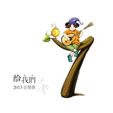

给我们 2013音乐会
============================

|  |  |
| :--: | :-- |
| [ 给我们 2013音乐会](https://emumo.xiami.com/album/1009495246) | **艺人**: [朱七](../index.md) **语种**: 国语 **唱片公司**: 散问音乐 **发行时间**: 2014年09月01日 **专辑类别**: 现场专辑 **专辑风格**: 独立民谣 Indie Folk, 国语流行 Mandarin Pop **播放数**: 88718 **收藏数**: 348 **评论数**: 123  |

## 简介

<strong>  
给我们</strong>
 
  

2005年8月，夏天将要过去的某个日子。 
 
  
  

我跑去找老板谈话，在他那个堆满书籍的办公室中，点上烟，表达我辞职的意图，然后，我们开始了关于某个日子的讨论，这个日子，是9月1日。 
 
  

9月1日，对于中国这一代的人，是一个标志性的日子。一是，秋天要来了；二是，暑假结束了。我们生活的规矩，是生活上的一年，从春节开始；学习上的一年，是从9月1日开始。这个日子，我们背上书包，进入新的年级，或者升入新的学校，遇见新的同学，拿到新的课程表，接收新的要求。  

 
  

所以我说，我要离开了，9月1号是中国小孩重新启程的日子，我要去写几个月的歌。 
 
  
  

于是，他让我离职了，后面几个月我写出的歌，在2007年发表，叫逗号。 
 
  
  

1992年9月1日，初三，开学。台风，江林兵离开了我们。  

 
  

2013年9月1日，北京，九剧场，朱七，一场不自量力但自娱自乐的很开心的音乐会，开唱。  

 
  

2014年9月1日，这张live专辑，辗转制作完成，正式登录虾米网。  

 
  
  

我是一个害怕演出的业余歌手。总是希望，躲在光盘背后，修饰再三，把文字印刷出来，就已经画下句号了。每一次发专辑，都有点像那个顽童，狠狠朝着那个窗户，丢出一块石头，然后马上转身跑掉的心情，也不管玻璃有没有碎，主人家有没有追出来打骂。因为，由始至终，我只是想要，轻轻表达一下，而已。  

 
  

演出不一样，演出像一次战斗，从头至尾，你不能离开舞台，你要很认真的面对每一首歌，每一个场次。你要确定在这一次性的机会中，你表达到位，你与观众的沟通适度。既要保证不冷场，又要保证歌曲意念的正确传达，就像毛主席说的，团结紧张，严肃活泼。这也，太难了些吧。  

 
  
  

所以，我的演出，通常都基于两个理由，一是我内心的仪式感，在每张专辑发布后，需要有一场小规模音乐会，来承载我的碎烦，表达我的思考。二是，盛情难却，无论拼盘也好，音乐节也好，当嘉宾也好。这就是为什么，我在2013年夏天之前，从未在杭州之外的地方，唱过歌的原因吧。  

 
  

这一趟，虽然怯生生的，但其实走的非常开心，而过程中的收获，也一如既往，在往后的日子里，才慢慢渗透我。
 
  
  

这是一张意外获得的专辑。所以，并未像那些录音室专辑那样，处心积虑好多年，完整概念一再推敲，词曲反复修改，连平面和设计都苦心思索。或许，也正是因为这样的意外，这张专辑带给我自己的，是另外一种感受。
 
  
  

原来，我唱每首歌之前，都说了那么多话，长到，我都不好意思发表出来。可是这又是真真切切发生过的事情，我们需要尊重某些哪怕是缺点的事实吧。原来，一次性的记录，存下来的是这样的情景，我或许过于激动或许过于冷静或许过于矫情，都存在那里，不增不减，完全独立于此刻的时空存在，像人生，只此一次。
 
  
  

原来，现场唱歌，我需要注意的是这里那里那么多的东西。原来，团队的意义，在演出中的交融是那么有趣而重要。原来，我竟然连live专辑都有了，这一趟自娱自乐的音乐旅程，真是越来越圆满了……
 
  
  
  

2014年9月1日，我鼓起勇气，把一年前那个一次性的自己，丢给大家听，听那时表达的悲喜，听那时的絮絮叨叨。我想，或许，大家可以把这张专辑，当成一个电台节目来听，听这个叫做朱七的人，想了什么，经历了什么，才写了这些歌，才唱了这些歌。
 
  
  
  

嗯，这个日子，是重新启程的日子，对我来说是，希望对你们来说，也一般无二。 
 
  

————————————————————————————————————————
 
  
  

<strong> 感谢他们</strong>
 
  

一趟意外的巡演，一张意外的live专辑，要感谢的人很多，容我按照时光顺序，一一道来。
 
  

张征——杭州黄楼、上海onstage的老板，是他打电话给我，说今年的7月7日，onstage的场地给你留好了，演不演？这就是我2013年三场演出的初始，也是我离开杭州演出的起心动念吧。他是一个值得尊敬，并且很有审美与品味的大哥。
 
  

王涤——还有楼智杰。要演出是必须包含杭州本地的，杭州本地，一定是酒球会了，王涤每一次，都是永远的“没问题”与豪华招待，并且为了我这一场，做了一个促销活动。楼智杰每一次都是解决各种困难，架设各种乐器与话筒。最近得知，酒球会或许要关门了，杭州的livehouse何去何从，请一起祝福。
 
  

卢中强——还有吴婷。一次在北京出差与卢总吃饭聊天，说起演出场地，细数了几个北京的选项，都被他批判，聊到后面，自然就是他拍着胸脯说“我帮你搞定了”，然后是各种联络确认时间、音响工程、以及宣传，有吴婷前前后后的帮衬着，事情才逐渐落实。简单说，没有十三月卢总这一句话，北京之行，是没有可执行性的。所以这就是一场纯演出，因为虽然我把全部票房都还给了他们，我依然不确定，他们是否亏钱了。
 
  

乐队成员——乐队是卢山、小辉、裘贝和可乐，他们帮我做了很多义务的演出，并且时不时会说：要不要再来演一场？这是一种很舒适的体验，他们并不纠缠于费用（实际上基本没有），把我们一起演出当成了一种乐趣，同时也是这一路欢声笑语的来源。北京那场，当我还在思量再三无法决定的时候，他们跑过来诡异的看着我：要么还是去北京演一场吧，不然我们帮你承担点成本？？这句话让我真正下定决心，去北京演出。
 
  

小皮——这几年跟皮哥一直相互刺激、相互学习。去年演出，他放出豪言壮语，不管我演到哪里，他都会自费跑去当嘉宾。他比我们去得早，在北京玩了几天，办了一点事。然后在我们到达住宿的宾馆时，在大堂抽着烟等着我们，那眼神，跟被放逐的小孩看到小伙伴的眼神也没什么区别。我们一直相互当嘉宾，但是我演的少，有机会慢慢补上吧。
 
  

万里——万里是我们的朋友，帮着我们拍一些MV，拍一些演出记录，这次，也是，毫不犹豫的，就跟着我们去了北京，说书的现场已经有一个版本在网上了，我们在商议，重新弄一下字体，把歌词打上去，再拍一些小人书的素材，做一个完整版出来。
 
  

沈庆与小钟——感谢两位重量级嘉宾的鼎立支持，小钟老师是一开始就约好的，本来也是十三月的主场，我想他一定是来帮忙拉票房的。庆爷是说来看看演出，唱不唱还不知道，结果刚好和他的吉他手一起过来，就上台唱歌了，很开心。因为版权的关系，live专辑里面不可以收录他们两位的歌，略遗憾。
 
  

温青云——开始，是说找姜北生帮忙现场音响工程的，结果应该是有音乐节的工作，所以换了团队里面的其他人。我必须得说明，北京这场，音响比我想象中的要好很多，包括用耳机返听，用现场录音来调音，以及演完以后，温青云大哥很随便的问了我一句，都录下来了，你要拷贝走吗？当时真是惊喜，感谢他们的专业标准，才有了这张音频。
 
  

阿福——就live专辑而言，阿福才是最大的贡献者，30多个G的音频文档丢给他以后，我基本没干什么。音色琢磨、混音一混音二混音三、修音、母带一母带二母带三，全部是他一手搞定，还包括请小皮重录部分和声，和卢山那个现场弹错的尾奏补录。感谢阿福，现在他虽然是业余的心态，却忍不住开始了更专业的研究，让我们拭目以待吧，哈哈。
 
  

感谢上面那些朋友，也感谢有兴趣听一下这张专辑的朋友，朱七依然是在自言自语，不论人前或人后。。涉及完整作品，我还会继续努力，后面两张专辑都在规划筹备，进度很慢，还请有心的人，继续耐心等候。 
 
  

_________________________________________
 
  

<strong>工作清单</strong>
 
  

时间：2013年9月1日
 

地点：北京市九剧场
 

主办：十三月唱片、散问音乐
 
  

后期混音/制作/母带：阿福@麦麦童声
 
  

现场协调：吴婷@十三月
 

现场嘉宾：沈庆、钟立风、小皮
 

现场调音：张博
 

现场录音：温青云
 

系统工程师：张程
 

系统工程助理：戴宁、方正、温建辉、刘景建
 
  

主唱/木吉他/口琴：朱七
 

和声：小皮
 

电吉他/木吉他/合唱：卢山@琴庐乐器
 

键盘/和声：曹宇辉
 

贝斯：裘冶良
 

鼓：马志桐
 

口白：柳顺利
 
  

文案：朱七
 

插画：高嘉
 

平面设计：言西早
 

版权所有P&amp;C：朱鹏（朱七）
 

专辑首发：虾米音乐www.xiami.com 
 
  
 

## 曲目

## 评论

|  |  |  |
| :-- | :-- | :-- |
|  [虾米用户](https://emumo.xiami.com/u/45138247)  2017-11-17 13:54 赞(0) 踩(0) | 
太想去听你的现场了
 |
| ⇒ |  [虾米用户](https://emumo.xiami.com/u/7) 单恋木吉他 2017-12-23 20:42 赞(0) 踩(0) | 
来吧，，不过好像12月17日刚演过一场~~~~
 |
|  [虾米用户](https://emumo.xiami.com/u/13992891)  2017-10-27 23:46 赞(1) 踩(0) | 
live版的真是不一样，很真实，配乐也丰富了许多，还有和声。虽然在最近才知道你，开始听你的歌。不过，声音比10年前，多了些成熟，沧桑，稳重，唱功提高了不少。 很喜欢这个live里面歌的感觉，以及配乐。个人感受，若有冒犯，还请见谅。不知道什么时候能有幸去听你的演唱会。
 |
| ⇒ |  [虾米用户](https://emumo.xiami.com/u/7) 单恋木吉他 2017-11-06 23:25 赞(0) 踩(0) | 
没有冒犯啊～～怎么会。。。。我演出比较少，，哈哈，，有机会的。
 |
|  [虾米用户](https://emumo.xiami.com/u/720151)  2017-03-02 14:02 赞(0) 踩(0) | 
诚意
 |
|  [虾米用户](https://emumo.xiami.com/u/2010656) 笑定千秋 2015-08-30 17:26 赞(1) 踩(0) | 
说书，我最喜欢的一首！谢谢朱七！
 |
| ⇒ |  [虾米用户](https://emumo.xiami.com/u/7) 单恋木吉他 2015-08-31 09:45 赞(0) 踩(0) | 
谢谢你的关注，我会弄个正式版出来的～～说书这首歌～～～
 |
| ⇒ |  [虾米用户](https://emumo.xiami.com/u/50145085) 夏虫不可语冰 2016-06-11 16:54 赞(0) 踩(0) | 
<q><b>朱七说：</b></q>
 |
|  [虾米用户](https://emumo.xiami.com/u/8996713) 如果音乐是我们共同的朋友... 2015-01-17 17:39 赞(1) 踩(0) | 
真正的音乐人，
 |
|  [虾米用户](https://emumo.xiami.com/u/8996713) 如果音乐是我们共同的朋友... 2015-01-17 17:39 赞(0) 踩(0) | 
，
 |
|  [虾米用户](https://emumo.xiami.com/u/46593)  2014-12-19 15:10 赞(0) 踩(0) | 
然后，就是，然后，反正，就是，然后，就是，反正，然后~ @朱七
 |
|  [虾米用户](https://emumo.xiami.com/u/5505899)  2014-12-19 08:01 赞(0) 踩(0) | 
我分享了“我们”，朋友们说喜欢这有点沧桑的男声哈哈哈哈哈
 |
|  [虾米用户](https://emumo.xiami.com/u/34369391)  2014-11-30 16:16 赞(1) 踩(0) | 
朱七 我想听你现场 我想跟你交朋友 我想跟你喝一杯！
 |
| ⇒ |  [虾米用户](https://emumo.xiami.com/u/7) 单恋木吉他 2014-11-30 21:41 赞(0) 踩(0) | 
最近没演出计划啊，，，并且我戒酒了～哈哈～～
 |
| ⇒ |  [虾米用户](https://emumo.xiami.com/u/34369391)  2014-11-30 21:47 赞(0) 踩(0) | 
<q><b>朱七说：</b></q>
 |
|  [虾米用户](https://emumo.xiami.com/u/1523567)  2014-11-30 00:09 赞(0) 踩(0) | 
真的别剪，晚上听好有听电台的感觉。。。而且，你说话的声音本来就很好听~
 |
|  [虾米用户](https://emumo.xiami.com/u/13992891)  2014-11-26 06:08 赞(0) 踩(0) | 
听江林兵前的描述我都哭……觉得自己真没出息……我想起村上春树的《挪威的森林》里，女主角的前男友在17岁那年因为害怕成长而自杀，于是大家对他的印象永远停留在了17岁。男主角说他真自私，让自己永远活了17岁永远不会长大了。
 |
| ⇒ |  [虾米用户](https://emumo.xiami.com/u/7) 单恋木吉他 2014-11-26 12:27 赞(0) 踩(0) | 
谢谢你~~~
 |
| ⇒ |  [虾米用户](https://emumo.xiami.com/u/291164169)  2017-04-27 13:15 赞(0) 踩(0) | 
<q><b>朱七说：</b></q>
 |
|  [虾米用户](https://emumo.xiami.com/u/13992891)  2014-11-26 05:34 赞(1) 踩(0) | 
发现，太喜欢这盘live专辑了。永恒，每听一遍都想哭。我听了你对永恒的诠释。我当年，是真的真的，以同样的话，同样的概念，对他说永恒。我说，虽然我们注定要分开，但从这个意义上，我们就是永恒。可他不这么认为，他说，就算是念着对方，不在一起了就是没用，到时候就是，你走你的路，我一个人孤独，想念有什么用。我也能理解他这样想。这就是我跟他的差别。他是个现实理性到有时让我寒颤的人，而我则多些浪漫主义情怀和多愁善感。
 |
|  [虾米用户](https://emumo.xiami.com/u/355865) Let it go, l... 2014-11-19 12:19 赞(0) 踩(0) | 
<a href="http://emumo.xiami.com/u/4275776" target="_blank" rel="nofollow" name_card="4275776">@320K专门店</a> 收一下子
 |
|  [虾米用户](https://emumo.xiami.com/u/16460858) 虾米音乐，再见了 2014-11-18 02:24 赞(0) 踩(0) | 
可以认识你吗。我也姓朱
 |
|  [虾米用户](https://emumo.xiami.com/u/25401672) 孤独的人可耻麽？ 2014-10-19 21:28 赞(0) 踩(0) | 
就喜欢现场 很真实，虽然说啦好多 “然后”还是很喜欢，其实我也爱说“然后”！加油哦
 |
| ⇒ |  [虾米用户](https://emumo.xiami.com/u/7) 单恋木吉他 2014-11-04 10:08 赞(0) 踩(0) | 
恩，我也发现了，，，，，，，好多然后～
 |
| ⇒ |  [虾米用户](https://emumo.xiami.com/u/25401672) 孤独的人可耻麽？ 2014-11-04 12:25 赞(0) 踩(0) | 
<q><b>朱七说：</b></q>
 |
|  [虾米用户](https://emumo.xiami.com/u/4151458)  2014-10-16 21:50 赞(0) 踩(0) | 
朱七老师什么时候出新专辑？（期待ing……）
 |
| ⇒ |  [虾米用户](https://emumo.xiami.com/u/7) 单恋木吉他 2014-10-16 22:25 赞(0) 踩(0) | 
其实有在筹备，只是时间真的不好说也～～～哈哈～～～
 |
|  [虾米用户](https://emumo.xiami.com/u/3449737) ww 2014-10-04 12:30 赞(0) 踩(0) | 
比录音室版本自由太多了吧…………
 |
| ⇒ |  [虾米用户](https://emumo.xiami.com/u/7) 单恋木吉他 2014-10-08 11:45 赞(0) 踩(0) | 
现场嘛～～～
 |
|  [虾米用户](https://emumo.xiami.com/u/36679188) 暂无签名~ 2014-09-20 15:59 赞(0) 踩(0) | 
放飞心情
 |
|  [虾米用户](https://emumo.xiami.com/u/9575413) 我还没想好要写什么... 2014-09-16 02:17 赞(0) 踩(0) | 
转个弯就好了《祝你幸福》
 |
|  [虾米用户](https://emumo.xiami.com/u/7) 单恋木吉他 2014-09-13 23:34 赞(0) 踩(0) | 
各位，看到这个评论的，请考虑回复我一下？？？跟大家咨询一个问题。 是不是，，我真的把口白，全部剪出来，，与歌曲分离，，，你们会听起来更舒服呢？？？  如果大家都觉得要剪出来，我就听大家的意见。。。。。。
 |
| ⇒ |  [虾米用户](https://emumo.xiami.com/u/2612008)   2014-09-14 12:03 赞(0) 踩(0) | 
都挺好的，坚持自己最重要！
 |
| ⇒ |  [虾米用户](https://emumo.xiami.com/u/9575413) 我还没想好要写什么... 2014-09-16 02:31 赞(0) 踩(0) | 
两个版本也好，一个现场，一个录音棚的感觉，看听者自己的喜好了。 两个版本各有不同，感受也相对有些变化吧。怎么样做，都会支持你！
 |
| ⇒ |  [虾米用户](https://emumo.xiami.com/u/4377841)  2014-09-16 12:50 赞(0) 踩(0) | 
不用，很喜欢口白，这些歌本来也都有录音棚版的嘛
 |
| ⇒ |  [虾米用户](https://emumo.xiami.com/u/7) 单恋木吉他 2014-09-18 10:15 赞(0) 踩(0) | 
<q><b>muyuxgai说：</b></q>
 |
| ⇒ |  [虾米用户](https://emumo.xiami.com/u/37835411) 愿得一人心，白首不分离。 2014-09-19 18:32 赞(0) 踩(0) | 
喜欢你的音乐。坚持原创。
 |
| ⇒ |  [虾米用户](https://emumo.xiami.com/u/2560652) 原虾小词@虾米歌词组 2014-09-21 09:18 赞(0) 踩(0) | 
<q><b>朱七说：</b></q>
 |
| ⇒ |  [虾米用户](https://emumo.xiami.com/u/39024515) 只有我 2014-09-26 19:09 赞(0) 踩(0) | 
不用剪出来～现在这样就非常好了～～～真希望有一天能去听你的演唱会:)
 |
| ⇒ |  [虾米用户](https://emumo.xiami.com/u/25401672) 孤独的人可耻麽？ 2014-11-10 12:44 赞(0) 踩(0) | 
不要剪
 |
| ⇒ |  [虾米用户](https://emumo.xiami.com/u/7) 单恋木吉他 2014-11-10 13:40 赞(0) 踩(0) | 
<q><b>paul陆瑶说：</b></q>
 |
| ⇒ |  [虾米用户](https://emumo.xiami.com/u/3227043)  2014-11-20 02:41 赞(0) 踩(0) | 
不需要剪 本来就是live版本 有口白更有感觉呢！
 |
| ⇒ |  [虾米用户](https://emumo.xiami.com/u/16078244)  2015-10-04 22:42 赞(0) 踩(0) | 
有口白的民谣才好听嘛。听惯了升哥的Bobby‘s talk。表示这类型的歌怎么可以没口白， 
 |
| ⇒ |  [虾米用户](https://emumo.xiami.com/u/351570550)  2019-02-11 20:47 赞(0) 踩(0) | 
真的不要剪，反正我很喜欢，很棒！
 |
| ⇒ |  [虾米用户](https://emumo.xiami.com/u/3966185)  2019-10-16 17:13 赞(0) 踩(0) | 
这样就很好
 |
|  [虾米用户](https://emumo.xiami.com/u/3655806) 中正平和 2014-09-11 20:46 赞(0) 踩(0) | 
有现场影像版本的吗？ 好听的说
 |
| ⇒ |  [虾米用户](https://emumo.xiami.com/u/7) 单恋木吉他 2014-09-12 11:35 赞(0) 踩(0) | 
部分几首歌会有的，应该~~~~~
 |
|  [虾米用户](https://emumo.xiami.com/u/2612008)   2014-09-10 13:48 赞(1) 踩(0) | 
没有永恒guitar......
 |
|  [虾米用户](https://emumo.xiami.com/u/3435982) 夹在理想与现实中间 2014-09-06 06:56 赞(0) 踩(0) | 
30岁后，很少被某一首歌曲打动，今天早晨被《祝你幸福》感动了。谢谢朱七。希望有一天能在武汉到现场听你的歌。
 |
| ⇒ |  [虾米用户](https://emumo.xiami.com/u/7) 单恋木吉他 2014-09-12 11:35 赞(0) 踩(0) | 
嗯，相信都有机会的~~~~
 |
|  [虾米用户](https://emumo.xiami.com/u/121)  2014-09-05 11:16 赞(1) 踩(0) | 
很难忘的一个现场。至今还收着当时的门票。
 |
|  [虾米用户](https://emumo.xiami.com/u/1929241) 老人 2014-09-03 21:41 赞(0) 踩(0) | 
和老婆听了现场
 |
| ⇒ |  [虾米用户](https://emumo.xiami.com/u/7) 单恋木吉他 2014-09-04 10:53 赞(0) 踩(0) | 
那就是咱们共同的回忆了～～
 |
|  [虾米用户](https://emumo.xiami.com/u/36420144)  2014-09-03 12:23 赞(0) 踩(0) | 
好听。不过，没有正式版么？
 |
| ⇒ |  [虾米用户](https://emumo.xiami.com/u/7) 单恋木吉他 2014-09-03 16:03 赞(0) 踩(0) | 
这就是正式版～～只是没有实体～～～
 |
| ⇒ |  [虾米用户](https://emumo.xiami.com/u/2612008)   2014-09-13 14:03 赞(0) 踩(0) | 
<q><b>朱七说：</b></q>
 |
| ⇒ |  [虾米用户](https://emumo.xiami.com/u/7) 单恋木吉他 2014-10-31 09:44 赞(0) 踩(0) | 
<q><b>Millpond说：</b></q>
 |
|  [虾米用户](https://emumo.xiami.com/u/42347) 寻找无双 2014-09-02 20:54 赞(0) 踩(0) | 
听得出来很紧张哦~
 |
|  [虾米用户](https://emumo.xiami.com/u/1742780)  2014-09-02 20:21 赞(1) 踩(0) | 
如果能把前面的独白去掉就好了。。神烦现场废话多的歌手了，钟立风也是一个。很喜欢朱七的歌，但是实在受不了每首歌前都一堆独白，还好有快进功能
 |
| ⇒ |  [虾米用户](https://emumo.xiami.com/u/7) 单恋木吉他 2014-09-03 09:36 赞(0) 踩(0) | 
哈哈，这不就是live的意思嘛？？不然听录音室版本就好？我唱live不至于比录音室好很多吧？
 |
| ⇒ |  [虾米用户](https://emumo.xiami.com/u/9) 不来都得死 2014-09-03 12:24 赞(0) 踩(0) | 
<q><b>朱七说：</b></q>
 |
|  [虾米用户](https://emumo.xiami.com/u/369150) ♥︎stay hunge... 2014-09-01 22:37 赞(2) 踩(0) | 
然后然后然后然后然后然后然后然后然后然后然后然后然后然后然后然后然后然后然后然后然后然后然后然后然后然后然后然后然后然后然后然后然后然后然后然后然后然后然后然后然后然后然后然后然后然后然后然后歇菜！
 |
| ⇒ |  [虾米用户](https://emumo.xiami.com/u/7) 单恋木吉他 2014-09-02 11:32 赞(0) 踩(0) | 
被发现了～～～～
 |
| ⇒ |  [虾米用户](https://emumo.xiami.com/u/3449737) ww 2014-10-04 12:25 赞(0) 踩(0) | 
哈哈
 |
|  [虾米用户](https://emumo.xiami.com/u/9249469)  2014-09-01 22:16 赞(0) 踩(0) | 
又一个夏天过去了，《夏天已过去》自然不能少听一遍。
 |
| ⇒ |  [虾米用户](https://emumo.xiami.com/u/3435982) 夹在理想与现实中间 2014-09-01 22:54 赞(0) 踩(0) | 
我也在听，真不错这首
 |
|  [虾米用户](https://emumo.xiami.com/u/114758) 这家伙超级懒什么也没留下... 2014-09-01 21:45 赞(0) 踩(0) | 
好
 |
|  [虾米用户](https://emumo.xiami.com/u/3227043)  2014-09-01 21:27 赞(0) 踩(0) | 
求来一次广州！！！
 |
|  [虾米用户](https://emumo.xiami.com/u/26638034) 放下 2014-09-01 21:11 赞(1) 踩(0) | 
夜凉如水，树影婆娑，从图书馆出来得时候塞上耳机开始听这张集子。走着走着就想起一个人，眼泪就止不住奔涌，绕着小道走了半圈。有些声音之所以有让人流泪的力量，莫过于有些经历引起了共鸣。青春，我们，说书，双数，感谢朱七低低的嗓音伴我考研的日子，愿以后能看一次你的现场，愿能重逢那个人。
 |
| ⇒ |  [虾米用户](https://emumo.xiami.com/u/7) 单恋木吉他 2014-09-02 11:33 赞(0) 踩(0) | 
希望你能重逢…………据说，世间所有的相遇，都是久别重逢～～哈哈～～
 |
| ⇒ |  [虾米用户](https://emumo.xiami.com/u/26638034) 放下 2014-09-02 19:10 赞(0) 踩(0) | 
<q><b>朱七说：</b></q>
 |
|  [虾米用户](https://emumo.xiami.com/u/9301514) 独立唱作人 2014-09-01 19:52 赞(0) 踩(0) | 
wonderful
 |
|  [虾米用户](https://emumo.xiami.com/u/18587320)  2014-09-01 19:44 赞(0) 踩(0) | 
七大爷的歌听了让人安心
 |
|  [虾米用户](https://emumo.xiami.com/u/11494968) 音乐不败。 2014-09-01 19:22 赞(0) 踩(0) | 
有实体专辑可买吗
 |
| ⇒ |  [虾米用户](https://emumo.xiami.com/u/7) 单恋木吉他 2014-09-01 19:58 赞(0) 踩(0) | 
没有呢～～没打算做～～～就数字专辑吧～
 |
| ⇒ |  [虾米用户](https://emumo.xiami.com/u/11353)  2014-09-02 16:47 赞(0) 踩(0) | 
<q><b>朱七说：</b></q>
 |
| ⇒ |  [虾米用户](https://emumo.xiami.com/u/7) 单恋木吉他 2014-09-02 16:52 赞(0) 踩(0) | 
<q><b>老七同学说：</b></q>
 |
| ⇒ |  [虾米用户](https://emumo.xiami.com/u/11353)  2014-09-02 16:54 赞(0) 踩(0) | 
<q><b>朱七说：</b></q>
 |
| ⇒ |  [虾米用户](https://emumo.xiami.com/u/7) 单恋木吉他 2014-09-02 17:11 赞(0) 踩(0) | 
<q><b>老七同学说：</b></q>
 |
| ⇒ |  [虾米用户](https://emumo.xiami.com/u/11353)  2014-09-02 17:48 赞(0) 踩(0) | 
<q><b>朱七说：</b></q>
 |
| ⇒ |  [虾米用户](https://emumo.xiami.com/u/7) 单恋木吉他 2014-09-03 09:35 赞(0) 踩(0) | 
<q><b>老七同学说：</b></q>
 |
| ⇒ |  [虾米用户](https://emumo.xiami.com/u/11353)  2014-09-03 09:40 赞(0) 踩(0) | 
<q><b>朱七说：</b></q>
 |
| ⇒ |  [虾米用户](https://emumo.xiami.com/u/7) 单恋木吉他 2014-09-03 10:47 赞(0) 踩(0) | 
<q><b>老七同学说：</b></q>
 |
| ⇒ |  [虾米用户](https://emumo.xiami.com/u/11353)  2014-09-03 11:03 赞(0) 踩(0) | 
<q><b>朱七说：</b></q>
 |
|  [虾米用户](https://emumo.xiami.com/u/36442147)  2014-09-01 16:09 赞(0) 踩(0) | 
很喜欢朱七的声音，很厚实也很朴实的赶脚。很棒的民谣，华丽又忧伤的词句，总是在不经意间就戳中人的泪点。鹏哥喜欢你，欢迎你再来大蚌埠帝国吃帝国鸡。
 |
| ⇒ |  [虾米用户](https://emumo.xiami.com/u/36442147)  2014-09-01 16:10 赞(0) 踩(0) | 
乌鸦、烟都是我喜欢的歌。。。
 |
| ⇒ |  [虾米用户](https://emumo.xiami.com/u/7) 单恋木吉他 2014-09-01 16:55 赞(0) 踩(0) | 
哇～～你是鹏哥啊～～哈哈～～我必须再来的～～～～
 |
| ⇒ |  [虾米用户](https://emumo.xiami.com/u/4294931) 胯下一匹駿馬，心中一只蝸... 2014-09-01 17:25 赞(0) 踩(0) | 
藏的很深啊，哈哈
 |
| ⇒ |  [虾米用户](https://emumo.xiami.com/u/36442147)  2014-09-01 23:13 赞(0) 踩(0) | 
<q><b>麦麦童声阿福说：</b></q>
 |
| ⇒ |  [虾米用户](https://emumo.xiami.com/u/4294931) 胯下一匹駿馬，心中一只蝸... 2014-09-02 10:04 赞(0) 踩(0) | 
<q><b>╰牵、你手说：</b></q>
 |
| ⇒ |  [虾米用户](https://emumo.xiami.com/u/36442147)  2014-09-02 19:06 赞(0) 踩(0) | 
<q><b>麦麦童声阿福说：</b></q>
 |
| ⇒ |  [虾米用户](https://emumo.xiami.com/u/4294931) 胯下一匹駿馬，心中一只蝸... 2014-09-02 20:00 赞(0) 踩(0) | 
<q><b>╰牵、你手说：</b></q>
 |
|  [虾米用户](https://emumo.xiami.com/u/350762) 我们都是岁月的孩子 2014-09-01 16:03 赞(7) 踩(0) | 
真是太好了，一下子那些2013就都又回来了。我是觉得人生里总是应该留下尽量多的记录~ 感谢这样一张LIVE静静地躺在这里
 |
| ⇒ |  [虾米用户](https://emumo.xiami.com/u/7) 单恋木吉他 2014-09-01 17:17 赞(0) 踩(0) | 
是啊，一下就回来了，，碎烦的～～～～
 |
| ⇒ |  [虾米用户](https://emumo.xiami.com/u/11353)  2014-09-02 16:49 赞(0) 踩(0) | 
话说，小皮看起来，就是很“成熟（lao）”。
 |
| ⇒ |  [虾米用户](https://emumo.xiami.com/u/11353)  2014-09-02 16:56 赞(0) 踩(0) | 
<q><b>朱七说：</b></q>
 |
| ⇒ |  [虾米用户](https://emumo.xiami.com/u/11353)  2014-09-02 17:05 赞(0) 踩(0) | 
<q><b>朱七说：</b></q>
 |
| ⇒ |  [虾米用户](https://emumo.xiami.com/u/7) 单恋木吉他 2014-09-02 17:10 赞(0) 踩(0) | 
<q><b>老七同学说：</b></q>
 |
| ⇒ |  [虾米用户](https://emumo.xiami.com/u/11353)  2014-09-02 17:42 赞(0) 踩(0) | 
<q><b>朱七说：</b></q>
 |
| ⇒ |  [虾米用户](https://emumo.xiami.com/u/350762) 我们都是岁月的孩子 2014-09-02 22:16 赞(0) 踩(0) | 
<q><b>老七同学说：</b></q>
 |
| ⇒ |  [虾米用户](https://emumo.xiami.com/u/350762) 我们都是岁月的孩子 2014-09-03 16:01 赞(0) 踩(0) | 
<q><b>老七同学说：</b></q>
 |
| ⇒ |  [虾米用户](https://emumo.xiami.com/u/11353)  2014-09-03 18:48 赞(0) 踩(0) | 
<q><b>小皮说：</b></q>
 |
| ⇒ |  [虾米用户](https://emumo.xiami.com/u/11353)  2017-12-18 10:20 赞(0) 踩(0) | 
<q><b>小皮说：</b></q>
 |
|  [虾米用户](https://emumo.xiami.com/u/6919121)  2014-09-01 15:32 赞(0) 踩(0) | 
老朱同学，你那首半截人生之前说的那句“失恋之后就徒步雨崩”。。。不许戳到别人的伤口。。。抗议！
 |
| ⇒ |  [虾米用户](https://emumo.xiami.com/u/7) 单恋木吉他 2014-09-01 16:55 赞(0) 踩(0) | 
呃，这个，你看，果然有好多人都这样～～～～哈哈哈～～～
 |
|  [虾米用户](https://emumo.xiami.com/u/6919121)  2014-09-01 15:25 赞(0) 踩(0) | 
9月的一份惊喜。时间好像就这么轮回到两年前，依然用朱七的音乐伴随即将开始的旅行。
 |
|  [虾米用户](https://emumo.xiami.com/u/12743296) 暂无签名~ 2014-09-01 13:12 赞(0) 踩(0) | 
听萌萌哒胖子唱歌。
 |
|  [虾米用户](https://emumo.xiami.com/u/168368) 原谅我渐渐少去的问候 2014-09-01 12:56 赞(0) 踩(0) | 
喜欢七哥的真诚。
 |
|  [虾米用户](https://emumo.xiami.com/u/3791962)  2014-09-01 12:45 赞(0) 踩(0) | 
抢鲜听下live版的。。。
 |
|  [虾米用户](https://emumo.xiami.com/u/168368) 原谅我渐渐少去的问候 2014-09-01 12:31 赞(0) 踩(0) | 
七哥讲话声音有点轻，听起来好费力。
 |
|  [虾米用户](https://emumo.xiami.com/u/168368) 原谅我渐渐少去的问候 2014-09-01 12:22 赞(0) 踩(0) | 
喜欢七哥的真诚。
 |
|  [虾米用户](https://emumo.xiami.com/u/168368) 原谅我渐渐少去的问候 2014-09-01 12:21 赞(0) 踩(0) | 
9.1号对我而言是个悲催忙碌的日子。
 |
|  [虾米用户](https://emumo.xiami.com/u/7826667) Night flower 2014-09-01 12:01 赞(0) 踩(0) | 
2013年9月1日的音乐会，我居然不知道，好无辜····
 |
|  [虾米用户](https://emumo.xiami.com/u/73) 等风景都看透 谁陪我看细... 2014-09-01 11:07 赞(1) 踩(0) | 
昨晚还说起这张live，今天就发布了，哈哈，明年还有新专辑，朱小七加油！！
 |
|  [虾米用户](https://emumo.xiami.com/u/260853) 少听音乐多上火 2014-09-01 10:49 赞(1) 踩(0) | 
→_→ 七哥是虾米各种功能的专业测试员
 |
|  [虾米用户](https://emumo.xiami.com/u/4294931) 胯下一匹駿馬，心中一只蝸... 2014-09-01 10:05 赞(0) 踩(0) | 
原来是温青云，怪不得录的好啊，七兄，论坛里的大拿。
 |
|  [虾米用户](https://emumo.xiami.com/u/892)  2014-09-01 09:54 赞(1) 踩(0) | 
总觉得，一个音乐人真诚很重要，对人对自己。 所谓的“絮叨”间，铺满了诚意。 支持朱七，也感动于常常名单里一群热爱音乐的人们带来的温暖。
 |
| ⇒ |  [虾米用户](https://emumo.xiami.com/u/11353)  2014-09-02 22:34 赞(0) 踩(0) | 
那天我去了，哈哈。现场听的感觉很好的，那才是朱七的真正实力。
 |
| ⇒ |  [虾米用户](https://emumo.xiami.com/u/892)  2014-09-03 09:24 赞(0) 踩(0) | 
<q><b>老七同学说：</b></q>
 |
| ⇒ |  [虾米用户](https://emumo.xiami.com/u/11353)  2014-09-03 09:28 赞(0) 踩(0) | 
<q><b>sophie说：</b></q>
 |
|  [虾米用户](https://emumo.xiami.com/u/2470118)  2014-09-01 09:23 赞(0) 踩(0) | 
听听，回味下2013年朱七的那些音乐
 |
|  [虾米用户](https://emumo.xiami.com/u/819805) 网易云ID：荡漾Di摇滚... 2014-09-01 09:05 赞(0) 踩(0) | 
听到泪奔了
 |
|  [虾米用户](https://emumo.xiami.com/u/2144101)  2014-09-01 08:53 赞(0) 踩(0) | 
抢个沙发先，哈哈哈
 |
