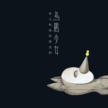

乌鸦少女朱七和他的朋友们
============================

|  |  |
| :--: | :-- |
| [ 乌鸦少女朱七和他的朋友们](https://emumo.xiami.com/album/2100325964) | **艺人**: [朱七](../index.md) **语种**: 国语 **唱片公司**: 散问音乐 **发行时间**: 2016年05月07日 **专辑类别**: 录音室专辑 **专辑风格**: 独立流行 Indie Pop **播放数**: 283552 **收藏数**: 638 **评论数**: 97  |

## 简介

<strong style="line-height: 1.5;">专辑预售：<a href="https://item.taobao.com/item.htm?spm=a1z1s.6632057.389823137.3.Zg8jxu&amp;pm=a230r.1.14.1.0ijJFC&amp;id=530970677484&amp;ns=1&amp;abbucket=9#detail" target="_blank" rel="nofollow" data-spm-anchor-id="a1z1s.6632057.389823137.3" style="text-decoration: none; border: 0px; font-size: 12px; margin: 0px; outline: 0px; padding: 0px; color: rgb(51, 102, 204); cursor: pointer; -webkit-tap-highlight-color: rgb(254, 150, 0); font-family: " e;helvetica="" neue"e;,="" helvetica,="" arial,="" sans-serif;="" line-height:="" 24px;="" background-color:="" rgb(255,="" 247,="" 245);"=""></a><a href="https://item.taobao.com/item.htm?pm=a230r.1.14.1.0ijJFC&amp;id=530970677484&amp;ns=1&amp;abbucket=9#detail" target="_blank" rel="nofollow noreferrer noopener">https://item.taobao.com/item.htm?pm=a230r.1.14.1.0ijJFC&amp;id=530970677484&amp;ns=1&amp;abbucket=9#detail</a></strong>
 

 

 

等待了四年的朱七等了十三年
 

 
 

 
 

距离《朱七的笔记IV我们》之后的四年，朱七终于交出了全新的一张跨界专辑《乌鸦少女》。
 

 
 

 
 

这张专辑，在计划中的正确打开时间，应当是在2003年到2007年之间的某一刻。因为词出现在2003年，谱完曲在2006年。然后，乌鸦少女或者乌鸦少年，这个名字，便一直在各种场合，被陆陆续续的提起，每次，都是下一张专辑的名称，一直到《朱七的笔记III逗号》出现，《十七 弹唱选辑》出现，《我们I》《我们II》分别出现，这张专辑始终处于一种难产的状态。甚至，在《我们II》中的第一首歌，便叫做《乌鸦少女》，关于积灰的花园、乌鸦的出现、少女的阴暗……
 

 
 

然后，当时间音乐的小皮，义气加入制作，跌跌撞撞的demo，终于重新启动。2014年11月开始编曲，2015年6月正式进棚，2015年12月录制完成，2016年4月，完成最终的混音。于是，这张专辑，终于要脱离“一再被修改”的状态，呈现在人们面前。
 

 
 

对一些人来说，是等了四年的，朱七的新歌。对朱七自己来说，这是一张，等了13年的专辑。
 

 
 

 
 

是专辑，是画册，是诗集
 

 
 

《乌鸦少女》是一张跨界的专辑，与13年前心念一动的瞬间，完全一致。
 

 
 

这是一本诗集，是一位十几年前的少女，写下的点滴文字。它不是流行歌曲的歌词，不遵从那些结构，也不在乎是否押韵，打开那本册子，如果你有读诗的习惯，可以完全忘记那张CD，或许用朗读的，会有更自由的情绪；
 

 
 

这是一本画册，专辑内厚厚的，接近100页的内容，满满都是插画师这几年笔下的意念，或许你可以对着那些小人说说话，你甚至可以把其中几张喜欢的画撕下来，装框，摆在家里的某些角落，偶尔路过，偶尔交流；
 

 
 

这是一本专辑，建立在诗歌与插画基础上，意境统一的12首歌曲，有木吉他分解，有电吉他音墙，有钢琴琶音，有弦乐轰鸣，有电子效果的鼓loop，也有一些音效。以及有3个人，在用最业余的方式，唱出的词曲。
 

 
 

是的，这是一张，需要拿到实体CD的专辑。
 

 
 

温暖的阴暗面
 

 
 

一开始，大家都以为，这是一张阴暗的专辑。到最后，大家都觉得，这是一张温暖的专辑。
 

 
 

最初的文字，带着清爽的绝望，浓浓的孤独感揉合着亮丽的画面感；最初的插画，是铅笔画在白纸上，小荒诞的背后，透出的一丝锐利锋芒；最初的旋律，也便跟着这些情绪，去了一些不规则的地方，或短促，或扭曲；随后的编曲，也在绞尽脑汁的过程中，试炼了各色和弦，复杂到编曲人自己都背不出来……
 

 
 

然后，一轨木吉他录进去，一轨钢琴录进去，一轨人声录进去，然后，混音师用了复古的滤镜，轻轻盖了上去。自以为站在阴暗里的，经历了那些过程的人，从黑色的影子里，打开耳朵，竟然感受到了阳光般的温暖，也是奇了怪了。
 

 
 

这是12首，一共揉合了7个人的意念的专辑，当当年的阴暗都变成了现在的坚强，当年的迷茫都变成了现在的清澈，当年的远方都变成了现在的生活，这是一个必然的结果吧。青春期结的果，却在奔四而去的途中上了桌，自以为是的阴暗，已成了温暖。
 

 
 

嗯，这样很好。
 

 
 

 
 

 
 

一体式的画展&amp;音乐会
 

 
 

2016年5月14日，杭州，城西，东信·和创园， 31间。
 

 
 

“乌鸦少女”，在那一天的下午，是一场画展的开幕；在那一天的晚上，是一张专辑的首发。在那个方方正正的空间里，被方方正正的切成了两块区域，摆出来的是演出，藏起来的是画展；
 

 
 

下午的画展，在3点整开幕，独立插画师绮爻，将带着她这几年的作品，和鼓足了的一点勇气，站在人群面前，掀开她的内心世界。那些同样方方正正的画，会带着最多复制7份的承诺，被精心的挂在那里，等着某一个有缘人，用不太多的钱带走他们其中的1/7，展开属于那幅画，本身的旅程，和命运。
 

 
 

晚上的音乐会，在8点整开场，参与专辑的7个人，都在现场。插画师绮爻在晚上变成了歌手，会演唱新专辑中的歌；作曲者朱七，就像过去每一场音乐会一样，和吉他手卢山，键盘手小辉一起，唱一些新歌老歌，说一些碎烦的话；编曲人小皮，这一次不太像是一个表演嘉宾，所以虽然专辑里他没有参与演唱，现场还是要逼他来一首，新专辑的歌。
 

 
 

台下，录音师阿福一定在调音台的那头，紧张兮兮的操心着一些什么。而作词者小尘，肯定会事不关己的，把自己藏在人群的里面，不知道会做些什么。
 

 
 

然后，那些歌，便和那些画一样，和你们，有了一些，似有若无的，化学反应。
 

 
 

欢迎光临，乌鸦少女的世界！
 

 
 

 
 

花钱最多的一次
 

 
 

朱七说，这是他至今为止花钱最多的一次。
 

 
 

说是为了某一种仪式感，又或许是等待了太久的欲望积累，也有可能是身边一群朋友相互帮助的自然结果。总之，当布展公司加入，当策展人加入，当音响公司加入，当金桃餐厅加入，这已经不仅仅是一场，简简单单的专辑首发了。
 

 
 

在一块空地上搭一个画展，搭一个舞台，摆上那么多设备，就像DVD里面常常看到的，某一场演唱会的筹备镜头。平整的展区、巨幅画面、专业音响、大面积LED、3分钟音乐短片……这是杭州本地的独立音乐人，和独立插画师，在不计代价的，去做一件很小的事，一件很小却很重要的事。
 

 
 

欢迎光临，乌鸦少女的世界！
 

 
 

 
 

关于499元的套餐
 

 
 

我们设计了，限量77份的礼品。
 

 
 

这不是团购价，也不是电视购物价，更不是黑心商人的捆绑销售逻辑，只是，在某一种仪式感之下，希望某一些来的人，可以有较为完整的体验，较为完整的纪念。
 

 
 

这里的499元，包含了金桃餐厅价值150元的晚餐、价值100元的精装CD与画册、价值100元的音乐会门票，以及并不对外发售的乌鸦少女限量手办，和睡前练会琴的纪念笔记本。
 

 
 

限量之外，就是随机的，唱片与门票。若是时间允许，相信站在舞台上的人，会愿意为每一份购买的内容，写上一句话，签上自己的名字，纪念这场，等了整整13年的相遇。
 

 
 

欢迎光临，乌鸦少女的世界！
 

 
 

 
 

关于七人行
 

 
 

绮爻，女，服装设计师/独立插画师，《乌鸦少女》画展主人，《乌鸦少女》专辑歌手；
 

 
 

小尘，女，电影制片人/独立诗人，《乌鸦少女》专辑作词者、歌手；
 

 
 

朱七，男，虾米音乐创始人之一/独立音乐人，《乌鸦少女》专辑作曲者、制作人、歌手；
 

 
 

小皮，男，时间音乐创始人/独立音乐人，《乌鸦少女》专辑编曲人、制作人；
 

 
 

阿福，男，麦麦童声创始人/独立混音师，《乌鸦少女》专辑录音师、混音师、母带工程师；
 

 
 

卢山，男，琴庐乐器创始人/杭州知名吉他手，《乌鸦少女》专辑吉他手；
 

 
 

小辉，男，钢琴教室/独立音乐人，《乌鸦少女》专辑键盘手；
 

 
 

温暖的老歌手，编了一些另类的曲子；阳光的吉他手，弹了一些阴暗的solo；开朗的键盘手，一遍遍改了弦乐钢琴；初为人父的录音师，居然混音混了整整4个月；两位不会唱歌的前少女，被逼进录音棚，带上耳机对着话筒；而那个所谓的作曲者和制作人，在无比忙碌的工作间隙，终于要写完最后一句文案，等着，所有的歌、文字、插画，正式亮相的那一天，内心满满的是期待。
 

 
 

欢迎光临，乌鸦少女的世界！
 

 
 

 
 

 
 

 
 

<strong>工作人员列表：</strong>
 

 
 

作曲/制作/木吉他/演唱/和声—————————朱七
 

作词/文案/演唱/和声————————————小尘
 

插画/平面设计/演唱/和声——————————绮爻
 

制作/编曲/midi/和声编写/和声————————小皮
 

录音/混音/母带制作—————————————阿福
 

木吉他/电吉他———————————————卢山
 

钢琴/键盘—————————————————小辉
 

嘉宾和声—————————————————秀秀/李姝娴小朋友/李月/陈余文
 

字体设计—————————————————言西早
 

现场视频记录———————————————万里
 

 
 

 
 

<strong>特别感谢：</strong>
 

绮爻插画图形设计工作室（杭州）  时间音乐（上海）   琴庐乐器（杭州）   麦麦童声（杭州）
 

31 space  金桃餐厅  元白  睡前练会琴  蓝碧源特纸
 

张大鹏 汪浩 裘航 君君 施经羽 郑轶 金耀 杜文正
 

 
 

 
 

出品：散问音乐
 

监制：朱七
 

版权提供：朱七（朱鹏）
 

P&amp;© 2012 zhu peng
 

发行日期：2016年5月7日
 

 
 

 
 

 

## 曲目

## 评论

|  |  |  |
| :-- | :-- | :-- |
|  [虾米用户](https://emumo.xiami.com/u/342561149) 走啦走啦还是得谢谢虾米让... 2018-05-06 02:52 赞(0) 踩(0) | 
朱七看成头七。也没谁了。
 |
|  [虾米用户](https://emumo.xiami.com/u/265941721) “像风一样” 2017-02-16 21:27 赞(0) 踩(0) | 
为何没有早发现～
 |
|  [虾米用户](https://emumo.xiami.com/u/265941721) “像风一样” 2017-02-16 21:26 赞(0) 踩(0) | 
昂昂昂，好听
 |
|  [虾米用户](https://emumo.xiami.com/u/103396912) 这家伙很屌什么东西都不想... 2016-10-18 21:49 赞(0) 踩(0) | 
好听
 |
|  [虾米用户](https://emumo.xiami.com/u/2010656) 笑定千秋 2016-06-21 09:35 赞(0) 踩(0) | 
我想买张专辑，可是家里并没有CD机。
 |
| ⇒ |  [虾米用户](https://emumo.xiami.com/u/7) 单恋木吉他 2016-06-22 21:59 赞(0) 踩(0) | 
那就别买了，，浪费~~~
 |
|  [虾米用户](https://emumo.xiami.com/u/15270473) 听到喜欢的歌 身体不跟着... 2016-05-29 23:02 赞(1) 踩(0) | 
一堆生活用品拿来唱，真的好意思？
 |
|  [虾米用户](https://emumo.xiami.com/u/5429478) 唯有音乐和亲情不可遗落！ 2016-05-26 16:11 赞(2) 踩(0) | 
很喜欢，很喜欢。
 |
|  [虾米用户](https://emumo.xiami.com/u/8229090) 娑婆渡孤舟，一苇到彼岸！ 2016-05-16 15:59 赞(0) 踩(0) | 
这首“小雪”的旋律特像第一届中国好歌曲杨坤组那位房地产文员的歌的变奏，有木有
 |
|  [虾米用户](https://emumo.xiami.com/u/8229090) 娑婆渡孤舟，一苇到彼岸！ 2016-05-16 15:46 赞(1) 踩(0) | 
很有思想，“阿赖耶”，佛家思想。”乌鸦少女“太感人了，我听到鼻头突然有酸的感觉，多少年没有过的感觉，只觉得”乌鸦少女“中的这个”我“该是多心酸，多无奈。虽然以前没听过你们，但今天确实把我镇住了。俺可是个爷们！
 |
|  [虾米用户](https://emumo.xiami.com/u/4271989)  2016-05-16 07:54 赞(0) 踩(0) | 
小雪还不错，有点味道。
 |
|  [虾米用户](https://emumo.xiami.com/u/985576)  2016-05-14 22:33 赞(0) 踩(0) | 
我怎么觉得朱七的录音室演唱水准提高了？？？是录音师和混音师的功劳吗！？
 |
| ⇒ |  [虾米用户](https://emumo.xiami.com/u/4294931) 胯下一匹駿馬，心中一只蝸... 2016-05-16 00:34 赞(0) 踩(0) | 
确实是提高了 
 |
|  [虾米用户](https://emumo.xiami.com/u/19006667)  2016-05-11 13:53 赞(1) 踩(0) | 
里面的女声真不错啊。绮爻和小尘。
 |
|  [虾米用户](https://emumo.xiami.com/u/3019455) 火烧的寂寞，冷冻的承诺 2016-05-10 22:49 赞(0) 踩(0) | 
《乌鸦少年》非常棒，和声很漂亮，节奏让人忍不住抖腿。可问题来了，专辑名称是《乌鸦少女》，却只有少年，少女去哪儿了？
 |
| ⇒ |  [虾米用户](https://emumo.xiami.com/u/4294931) 胯下一匹駿馬，心中一只蝸... 2016-05-11 10:59 赞(0) 踩(0) | 
忍不住寂寞的少年已于2012年出世，哈哈！
 |
| ⇒ |  [虾米用户](https://emumo.xiami.com/u/7) 单恋木吉他 2016-05-11 11:30 赞(0) 踩(0) | 
少女在每首歌里……
 |
|  [虾米用户](https://emumo.xiami.com/u/103639920) 生活有点酷 2016-05-09 15:10 赞(0) 踩(0) | 
呀，12首全了，恭喜朱七。不知道你们的发布会自助餐吃得怎么样啊?
 |
| ⇒ |  [虾米用户](https://emumo.xiami.com/u/7) 单恋木吉他 2016-05-09 16:22 赞(0) 踩(0) | 
不是自助餐吧，，应该是正餐～～～一道一道上的～
 |
|  [虾米用户](https://emumo.xiami.com/u/32824823) the abyss 2016-05-09 00:54 赞(1) 踩(0) | 
love this
 |
|  [虾米用户](https://emumo.xiami.com/u/260853) 少听音乐多上火 2016-05-09 00:07 赞(1) 踩(0) | 
这个评分怎么回事，明天好好听一下。
 |
|  [虾米用户](https://emumo.xiami.com/u/154011796) 发现美好 创造美好 传递... 2016-05-08 20:36 赞(0) 踩(0) | 
还不错
 |
|  [虾米用户](https://emumo.xiami.com/u/1393420) 似是遥远往事，白云在天上... 2016-05-08 16:46 赞(0) 踩(0) | 
躺在湖里……  光专辑封面就有好几个相似的了。  深山的《忘忧湖》和鬼浴的《Funeral》！！！！
 |
|  [虾米用户](https://emumo.xiami.com/u/164626288)  2016-05-08 15:58 赞(0) 踩(0) | 
蛮好听的
 |
|  [虾米用户](https://emumo.xiami.com/u/12820378) бесплатно 2016-05-08 13:54 赞(0) 踩(0) | 
乌鸦少女的暗黑馆，生活温暖的黑暗面。
 |
|  [虾米用户](https://emumo.xiami.com/u/39973427)  2016-05-07 23:38 赞(0) 踩(0) | 
甜到想死…
 |
|  [虾米用户](https://emumo.xiami.com/u/163676224)  2016-05-07 16:29 赞(0) 踩(0) | 
廷俚照我是一個不是我是一個不會
 |
|  [虾米用户](https://emumo.xiami.com/u/45368495)  2016-05-07 15:55 赞(0) 踩(0) | 
麻痹本来挺困的下午，瞬间精神了，听着真提神。。。
 |
|  [虾米用户](https://emumo.xiami.com/u/6288294)   2016-05-07 15:47 赞(1) 踩(0) | 
乌鸦少年  双数  阿赖耶  嘿，兔子 ，很棒！
 |
|  [虾米用户](https://emumo.xiami.com/u/8565892) 不学无术不发愁，坑蒙拐骗... 2016-05-07 13:22 赞(2) 踩(0) | 
按说我是很喜欢这种调调的，可是这张真的听着很难受，听不下去，曲子总觉得哪里差了一点，歌词又黑得毫无逻辑。。我老了么
 |
| ⇒ |  [虾米用户](https://emumo.xiami.com/u/7) 单恋木吉他 2016-05-07 23:41 赞(0) 踩(0) | 
是我老了，你是无辜的~~~~
 |
|  [虾米用户](https://emumo.xiami.com/u/15002)  2016-05-07 12:34 赞(0) 踩(0) | 
喜欢小雪
 |
|  [虾米用户](https://emumo.xiami.com/u/162) 发现音乐，发现自我~~~... 2016-05-07 11:23 赞(1) 踩(0) | 
真的，绮爻还是让人惊讶的！！
 |
|  [虾米用户](https://emumo.xiami.com/u/1032029) 我还没想好要写什么... 2016-05-07 02:22 赞(0) 踩(0) | 
整体听完感觉朱七的部分还是挺精彩的，有些地方让人想起了《？》
 |
|  [虾米用户](https://emumo.xiami.com/u/15351906) khepera.cn 2016-05-07 01:09 赞(0) 踩(0) | 
四年前蜜桃听过青春 船 不老，现在还有感处，终于又看到有新歌···
 |
|  [虾米用户](https://emumo.xiami.com/u/7) 单恋木吉他 2016-05-07 00:49 赞(10) 踩(0) | 
全碟，已发。请指教。
 |
|  [虾米用户](https://emumo.xiami.com/u/34579356)   2016-05-06 23:41 赞(0) 踩(0) | 
等了这么久终于听到了，一万个好听♥️
 |
|  [虾米用户](https://emumo.xiami.com/u/6164147) 酋长叫你回去。 2016-05-06 14:36 赞(2) 踩(0) | 
封面的插画太棒了！
 |
|  [虾米用户](https://emumo.xiami.com/u/223023) 浮 光  掠影  中… ... 2016-05-06 13:53 赞(0) 踩(0) | 
特别想知道你的封面是谁给设计的，很有风格，也很有意境
 |
| ⇒ |  [虾米用户](https://emumo.xiami.com/u/7) 单恋木吉他 2016-05-06 14:12 赞(0) 踩(0) | 
专辑介绍里面有～～～一个女生叫绮爻，是插画师～～～～三张专辑的封面都是她，，
 |
|  [虾米用户](https://emumo.xiami.com/u/31113703) 无个性，不签名 2016-05-05 09:33 赞(0) 踩(0) | 
现在虾米音乐评论区都变段子手的地盘了吗
 |
|  [虾米用户](https://emumo.xiami.com/u/103639920) 生活有点酷 2016-05-05 08:41 赞(0) 踩(0) | 
disc2在哪儿啊？
 |
| ⇒ |  [虾米用户](https://emumo.xiami.com/u/7) 单恋木吉他 2016-05-05 10:14 赞(0) 踩(0) | 
这个专辑只有1个disc啊～～～没有disc 2这件事～～～
 |
| ⇒ |  [虾米用户](https://emumo.xiami.com/u/4294931) 胯下一匹駿馬，心中一只蝸... 2016-05-05 11:42 赞(0) 踩(0) | 
disc2实体才有，是画册，哈哈！
 |
| ⇒ |  [虾米用户](https://emumo.xiami.com/u/103639920) 生活有点酷 2016-05-05 12:00 赞(0) 踩(0) | 
<q><b>朱七说：</b></q>
 |
| ⇒ |  [虾米用户](https://emumo.xiami.com/u/7) 单恋木吉他 2016-05-06 10:16 赞(0) 踩(0) | 
<q><b>飞流235说：</b></q>
 |
|  [虾米用户](https://emumo.xiami.com/u/3496718) idle space 2016-05-03 00:20 赞(1) 踩(0) | 
一群志同道合的朋友玩音乐，羡慕~~~~
 |
|  [虾米用户](https://emumo.xiami.com/u/3496718) idle space 2016-05-03 00:20 赞(0) 踩(0) | 
一群志同道合的朋友玩音乐，羡慕~~~~
 |
|  [虾米用户](https://emumo.xiami.com/u/3496718) idle space 2016-05-03 00:19 赞(0) 踩(0) | 
朱七小哥的歌必须收~~~
 |
|  [虾米用户](https://emumo.xiami.com/u/1154162) 蝉在叫 2016-05-02 22:38 赞(2) 踩(0) | 
很喜欢，非常喜欢。让我能进入另外的相位。
 |
| ⇒ |  [虾米用户](https://emumo.xiami.com/u/7) 单恋木吉他 2016-05-03 13:20 赞(0) 踩(0) | 
幸好，还有人喜欢！！哈哈！
 |
|  [虾米用户](https://emumo.xiami.com/u/12876004) ` 2016-05-02 21:31 赞(0) 踩(0) | 
...
 |
|  [虾米用户](https://emumo.xiami.com/u/141558968)  2016-05-02 20:36 赞(0) 踩(0) | 
它让我想到纪念碑谷，关于救赎
 |
|  [虾米用户](https://emumo.xiami.com/u/2236868) 躁抑的夏天来了 2016-05-02 18:54 赞(1) 踩(0) | 
舒服，喜欢~
 |
|  [虾米用户](https://emumo.xiami.com/u/68184386)  2016-05-02 16:02 赞(0) 踩(0) | 

 |
|  [虾米用户](https://emumo.xiami.com/u/8105280) 朱宝宝、刚好遇见你 2016-05-02 06:19 赞(0) 踩(0) | 
被乌鸦和少女吸引进来的
 |
|  [虾米用户](https://emumo.xiami.com/u/299617) 浮云一别后，流水十年间 2016-05-02 01:28 赞(28) 踩(0) | 
公司前台是个美女。她刚来时我为了和她搭讪，在网上买东西后让快递小哥把包裹放前台，我下班了去拿。牙刷，牙膏，甚至一包烟都在网上买，就为了能接近她。经过我2个月的不懈努力，后来她终于成了快递小哥的女朋友。生活就是这么文艺 
 |
| ⇒ |  [虾米用户](https://emumo.xiami.com/u/47744203)  2016-05-02 07:28 赞(0) 踩(0) | 
段子手
 |
| ⇒ |  [虾米用户](https://emumo.xiami.com/u/4294931) 胯下一匹駿馬，心中一只蝸... 2016-05-03 12:43 赞(0) 踩(0) | 
哈哈哈哈哈，这是一个好故事
 |
| ⇒ |  [虾米用户](https://emumo.xiami.com/u/3903478) 我心向佛 2016-05-03 20:39 赞(0) 踩(0) | 
类似的故事听过不少，虽然不少人觉得很浪漫，但更多的人心里直嘀咕：如果追女孩这么处心积虑，有意思吗？男大当婚，女大当嫁，人字结构互相支撑，走近对方让人感到艰辛、磨炼，只能消磨人的锐气。最终吃亏的还是女人，男人当然也吃亏。现实已无情的证明了这一点。男女之间还是心照不宣，共享爱意，同赴爱河，才是真美妙。
 |
| ⇒ |  [虾米用户](https://emumo.xiami.com/u/9725504) 千江有水千江月，万里无云... 2016-05-05 18:58 赞(0) 踩(0) | 
哈哈哈   
 |
| ⇒ |  [虾米用户](https://emumo.xiami.com/u/164626288)  2016-05-08 15:57 赞(0) 踩(0) | 
ha  ha
 |
|  [虾米用户](https://emumo.xiami.com/u/6919121)  2016-05-01 19:55 赞(1) 踩(0) | 
那个抱着木吉他，淡淡歌唱的朱七去哪里了？“双数”的编曲实在是不如demo的感觉，变得刺耳（这只是个人的喜好）。只有“小雪”还有之前的影子。也许世间一切的不变是万物都在变化着。希望剩下的六首歌都是朱七自己唱的歌。如果不是也没有关系，希望下张专辑叫“寻找朱七”。  朱七同学，加油！
 |
| ⇒ |  [虾米用户](https://emumo.xiami.com/u/7) 单恋木吉他 2016-05-01 23:45 赞(0) 踩(0) | 
在所谓的民谣大行其道的时候，多少有些不满足抱着木吉他谈谈唱唱了，其实早就不满足了。。这张专辑我就唱了1/3。。[带墨镜笑]。。下张专辑不叫寻找朱七，叫做朱七的笔记V书名号。
 |
| ⇒ |  [虾米用户](https://emumo.xiami.com/u/6919121)  2016-05-02 08:23 赞(0) 踩(0) | 
<q><b>朱七说：</b></q>
 |
|  [虾米用户](https://emumo.xiami.com/u/6919121)  2016-05-01 19:46 赞(0) 踩(0) | 
千呼万唤～～
 |
|  [虾米用户](https://emumo.xiami.com/u/8651772) 归零 2016-05-01 15:11 赞(0) 踩(0) | 
不是说12首吗？只有一半啊 
 |
| ⇒ |  [虾米用户](https://emumo.xiami.com/u/41190273) 你！到底，怎么肥四啊？！ 2016-05-01 15:15 赞(0) 踩(0) | 
5.7全部啦
 |
| ⇒ |  [虾米用户](https://emumo.xiami.com/u/8651772) 归零 2016-05-01 15:15 赞(0) 踩(0) | 
<q><b>爆棚的傲娇气说：</b></q>
 |
|  [虾米用户](https://emumo.xiami.com/u/103396912) 这家伙很屌什么东西都不想... 2016-05-01 14:03 赞(0) 踩(0) | 
很棒
 |
|  [虾米用户](https://emumo.xiami.com/u/4718935)  2016-05-01 12:06 赞(0) 踩(0) | 
就开头好听。
 |
|  [虾米用户](https://emumo.xiami.com/u/7412511) Every breath... 2016-05-01 11:10 赞(1) 踩(0) | 
姑娘练练咬字吧 咬字不好听
 |
| ⇒ |  [虾米用户](https://emumo.xiami.com/u/7) 单恋木吉他 2016-05-02 14:34 赞(0) 踩(0) | 
姑娘们都不唱歌的人，，连KTV都不进，，，哈哈~~算是不错了~~~~
 |
|  [虾米用户](https://emumo.xiami.com/u/6190155) RoM 2016-05-01 10:20 赞(0) 踩(0) | 
终于发布了 实体碟啥时候有啊
 |
| ⇒ |  [虾米用户](https://emumo.xiami.com/u/7) 单恋木吉他 2016-05-02 14:34 赞(0) 踩(0) | 
5.14日以后，，现在淘宝有预售，，可以搜一下，，，朱七+乌鸦少女。。。。
 |
| ⇒ |  [虾米用户](https://emumo.xiami.com/u/6190155) RoM 2016-05-02 14:35 赞(0) 踩(0) | 
<q><b>朱七说：</b></q>
 |
|  [虾米用户](https://emumo.xiami.com/u/47365062) windy 2016-05-01 08:59 赞(0) 踩(0) | 
声音总感觉缺点什么
 |
|  [虾米用户](https://emumo.xiami.com/u/2943953)  2016-05-01 01:48 赞(0) 踩(0) | 
封面好看，歌不错
 |
|  [虾米用户](https://emumo.xiami.com/u/14509786) 时间改变了很多又什么都没... 2016-04-30 23:06 赞(0) 踩(0) | 
终于来了
 |
|  [虾米用户](https://emumo.xiami.com/u/7424536)  2016-04-30 23:03 赞(0) 踩(0) | 
目前还是阿赖耶最好听
 |
|  [虾米用户](https://emumo.xiami.com/u/1031) asca.lu 2016-04-30 21:55 赞(38) 踩(0) | 
乌鸦少女很像纪念碑谷啊
 |
| ⇒ |  [虾米用户](https://emumo.xiami.com/u/7) 单恋木吉他 2016-05-01 09:50 赞(0) 踩(0) | 
纪念碑谷恰好也在说乌鸦~~~哈哈~~~13年前要是知道就好了~~
 |
| ⇒ |  [虾米用户](https://emumo.xiami.com/u/159) Never give u... 2016-05-03 23:18 赞(0) 踩(0) | 
第一次看纪念碑谷的时候 发现自己画了多年的小人儿他们也很像  
 |
| ⇒ |  [虾米用户](https://emumo.xiami.com/u/49086299) 语虚，何以言知 2016-05-23 12:34 赞(0) 踩(0) | 
真的很像
 |
|  [虾米用户](https://emumo.xiami.com/u/819805) 网易云ID：荡漾Di摇滚... 2016-04-30 15:57 赞(1) 踩(0) | 
来得触不及防
 |
|  [虾米用户](https://emumo.xiami.com/u/6215042) 欢迎关注同名音乐公众号 2016-04-30 13:34 赞(0) 踩(0) | 
才三首？
 |
|  [虾米用户](https://emumo.xiami.com/u/172181)  2016-04-30 12:29 赞(0) 踩(0) | 
来了
 |
|  [虾米用户](https://emumo.xiami.com/u/48233289) 就这样孤独地记着你，直到... 2016-04-30 12:19 赞(0) 踩(0) | 
千呼万唤
 |
|  [虾米用户](https://emumo.xiami.com/u/10384607) 空山無人，水流花開。 2016-04-30 11:38 赞(0) 踩(0) | 
好喜欢，我也记得是少年
 |
|  [虾米用户](https://emumo.xiami.com/u/36057872) 网易/BC: Breat... 2016-04-30 11:24 赞(0) 踩(0) | 
~
 |
|  [虾米用户](https://emumo.xiami.com/u/4334438) 贫穷而倔强 2016-04-30 10:57 赞(0) 踩(0) | 
为什么我记得是“少年”？ 
 |
|  [虾米用户](https://emumo.xiami.com/u/68271224) 这是我一生的朋友 2016-04-30 09:36 赞(0) 踩(0) | 
但是这张专辑明显是有所突破的
 |
|  [虾米用户](https://emumo.xiami.com/u/49086299) 语虚，何以言知 2016-04-30 09:16 赞(0) 踩(0) | 
早起浇花，做早餐，听朱七的歌
 |
|  [虾米用户](https://emumo.xiami.com/u/9943562) 多数盗版碟在02年发行 2016-04-30 09:13 赞(0) 踩(0) | 
℗&amp;amp;© 2016 Zhu Peng
 |
|  [虾米用户](https://emumo.xiami.com/u/269855)   2016-04-30 02:20 赞(7) 踩(0) | 
阿赖耶太好听了，在深夜里听，有种破茧重生的力量、让人无比振奋！
 |
| ⇒ |  [虾米用户](https://emumo.xiami.com/u/159) Never give u... 2016-05-03 23:33 赞(0) 踩(0) | 
做为朱七多年好友 做为业余歌手 非常感谢 
 |
|  [虾米用户](https://emumo.xiami.com/u/1032029) 我还没想好要写什么... 2016-04-29 23:00 赞(0) 踩(0) | 
有种在听……朱七.remix的感觉
 |
