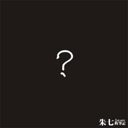

问号？朱七的笔记II
============================

|  |  |
| :--: | :-- |
| [ 问号？朱七的笔记II](https://emumo.xiami.com/album/32712) | **艺人**: [朱七](../index.md) **语种**: 国语 **唱片公司**: 柒音乐工作室 **发行时间**: 2003年11月02日 **专辑类别**: 录音室专辑 **专辑风格**: 城市民谣 Urban Folk **播放数**: 213239 **收藏数**: 264 **评论数**: 16  |

## 简介

？20多岁的时候，我迷惑极了？问号一直存在心中，不停的提醒着我，再多看看这个世界。关于上帝，是很小就知道的，可是存不存在呢？关于世界，我们不停的看到，看到很多很多，看到的和听到的是不是真的呢？关于自己，所谓的理想和现实摆在眼前，对和不对总要有个选择，怎么选择呢？关于死亡，总是要面对的，那么是现在面对还是以后面对？这些莫名其妙的问题，是属于哲学还是属于胡思乱想，我不知道，这些问题，会让我豁然开朗还是精神分裂，我也不知道。  
  
这张专辑，就是这些问题的提出，我没有办法解决，只能提出问题，概念一圈一圈的缠绕，脱离不出来。音乐上，我希望以玩的态度享受这个过程，做乐队的经验在这里起到了很好的作用，我尝试变调、尝试抛弃吉他，尝试舞曲、金属、布鲁斯和民谣套路，而这些风格，在我看来，都不是真正的风格内的作品，我只是在模仿一个感觉，实际上，这些歌，还是民谣。
 
  

&nbsp;
 
  

<strong>01—陌生人</strong>&nbsp;&nbsp;&nbsp;&nbsp;&nbsp;&nbsp;&nbsp;&nbsp;&nbsp;&nbsp;  
是的，即使构造一样，我们还是陌生人！
 
  

&nbsp;
 
  

<strong>02—小丑的笔记</strong>&nbsp;&nbsp;&nbsp;&nbsp;&nbsp;&nbsp;&nbsp;&nbsp;&nbsp;&nbsp;&nbsp;&nbsp;&nbsp;&nbsp;&nbsp;&nbsp;&nbsp;&nbsp;&nbsp;&nbsp;&nbsp;&nbsp;&nbsp;&nbsp;  
意像从心灵中跃出 进入外在的世界 出自幻想的人物外表固然美丽 但除了一个之外 全部都迷失了心智 只有孤独的丑角看穿这个骗局  
——1997年 乔斯坦贾德 《纸牌的秘密》
 
  

&nbsp;
 
  

<strong>03—镜子</strong>&nbsp;&nbsp;&nbsp;&nbsp;&nbsp;&nbsp;&nbsp;&nbsp;&nbsp;&nbsp;&nbsp;&nbsp;&nbsp;&nbsp;&nbsp;&nbsp;&nbsp;&nbsp;&nbsp;&nbsp;&nbsp;&nbsp;&nbsp;&nbsp;&nbsp;&nbsp;&nbsp;  
我常常会为这些莫名其妙的想法情烦恼，呵呵，号称是哲学，也许是胡思乱想，其实，也没有什么分别，既然怀疑了，那么就随便发泄一下吧，想来，总是无伤大雅的！
 
  

&nbsp;
 
  

<strong>04—坐井观天</strong>&nbsp;&nbsp;&nbsp;&nbsp;&nbsp;&nbsp;&nbsp;&nbsp;&nbsp;&nbsp;&nbsp;&nbsp;&nbsp;&nbsp;&nbsp;&nbsp;&nbsp;&nbsp;&nbsp;&nbsp;&nbsp;&nbsp;&nbsp;&nbsp;  
我在井底 照样谈恋爱 哈哈哈  
常常在想 我们最大的幸运，是我们无法了解到我们生存环境的真实参数吧  
不然做人还有什么意思？
 
  

&nbsp;
 
  

<strong>05--写于罗大佑演唱会之后</strong>&nbsp;  
2000年的时候，终于有机会看到罗大佑的演唱会了，退场后，在酒吧，一个同事说那么多年的等待，有结果了，那么以后呢？我回答不出来，只好一直喝酒，一直喝酒。
 
  

&nbsp;
 
  

  
<strong>06—诱惑</strong>&nbsp;&nbsp;&nbsp;&nbsp;&nbsp;&nbsp;&nbsp;&nbsp;&nbsp;&nbsp;&nbsp;&nbsp;&nbsp;&nbsp;&nbsp;&nbsp;&nbsp;&nbsp;  
这首歌好像写作文一样写出来的。乐队的人说，三天，写出一首新歌来，演出去。就在最后一天写完。后来乐队演出老是唱这个歌。乐队解散以后，我把它改编了，改成三拍的。
 
  

&nbsp;
 
  

<strong>07—残妆</strong>&nbsp;&nbsp;&nbsp;&nbsp;&nbsp;&nbsp;&nbsp;&nbsp;&nbsp;&nbsp;&nbsp;&nbsp;&nbsp;&nbsp;&nbsp;&nbsp;  
这么大的城市  
每24小时都有一个漫长的黑夜  
总会有人寂寞吧
 
  

&nbsp;
 
  

<strong>08—我怀疑</strong>&nbsp;&nbsp;&nbsp;&nbsp;&nbsp;&nbsp;&nbsp;&nbsp;&nbsp;&nbsp;&nbsp;&nbsp;&nbsp;&nbsp;&nbsp;&nbsp;&nbsp;&nbsp;&nbsp;&nbsp;&nbsp;&nbsp;  
你怀疑过什么吗   
我们不知不觉 在不断的怀疑中  
创造了过去 经历了现在 决定了将来   
可是 20多岁的时候 我还是迷惑极了！
 
  

&nbsp;
 
  

<strong>09—命</strong>&nbsp;&nbsp;&nbsp;&nbsp;&nbsp;&nbsp;&nbsp;&nbsp;&nbsp;&nbsp;&nbsp;&nbsp;&nbsp;&nbsp;&nbsp;&nbsp;&nbsp;&nbsp;&nbsp;&nbsp;&nbsp;&nbsp;&nbsp;&nbsp;  
命运 和时间一样 都是很绝对的概念  
你决定在这一刻改变自己 从此向左转 不再右转  
你以为在改变命运底那一瞬间 还是进了命运的套子  
因为这个概念最初的定义就是不可抗拒的  
所以在我这里 命运是结论 是事后的概念
 
  

&nbsp;
 
  

<strong>10—梦</strong>&nbsp;&nbsp;&nbsp;&nbsp;&nbsp;&nbsp;&nbsp;&nbsp;&nbsp;&nbsp;&nbsp;&nbsp;&nbsp;&nbsp;&nbsp;&nbsp;&nbsp;&nbsp;&nbsp;&nbsp;&nbsp;&nbsp;&nbsp;  
常常怀疑自己的存在  
关于生命的终点 每个人都有自己的看法  
我比较胆怯 所以 如果在死去的时候  
发现 自己只是在梦里醒来了  
那么 死亡将会变得多么轻松
 
  

&nbsp;
 
  

<strong>11—黑水</strong>&nbsp;&nbsp;&nbsp;&nbsp;&nbsp;&nbsp;&nbsp;&nbsp;&nbsp;&nbsp;&nbsp;&nbsp;&nbsp;&nbsp;&nbsp;&nbsp;&nbsp;&nbsp;&nbsp;  
乐队叫做“黑水”，  
就写了一首同名的歌   
我喜欢命题作文 概念在缠绕中逐渐扭曲   
最后出现了自己所想要的 很好玩
 
  

&nbsp;
 
  

<strong>12—一半</strong>&nbsp;&nbsp;&nbsp;&nbsp;&nbsp;&nbsp;&nbsp;&nbsp;&nbsp;&nbsp;&nbsp;&nbsp;&nbsp;&nbsp;&nbsp;&nbsp;&nbsp;&nbsp;&nbsp;&nbsp;&nbsp;&nbsp;&nbsp;&nbsp;&nbsp;&nbsp;  
回归 会不会一切 都会回到最初的平静状态？  
那个晚上 睡不着 反复弹着这几个和弦  
所有的胡思乱想，都回到了现实中来
 
  

&nbsp;

## 曲目

## 评论

|  |  |  |  |
| :-- | :-- | :-- | :-- |
|  [虾米用户](https://emumo.xiami.com/u/1255596)  2015-03-03 20:37 赞(0) 踩(0) | 
风格转换的接受不了
 |
|  [虾米用户](https://emumo.xiami.com/u/8244559)  2015-01-11 22:28 赞(0) 踩(0) | 
******
 |
|  [虾米用户](https://emumo.xiami.com/u/1255596)  2014-08-23 08:11 赞(0) 踩(0) | 
超喜欢《烟》那首歌，每次听都会落泪
 |
|  [虾米用户](https://emumo.xiami.com/u/34150020)  2014-03-22 20:27 赞(0) 踩(0) | 
今天反复听美丽新乐园，好像看到了心路历程一般，这首歌创作背景是怎样的呢？
 |
| ⇒ |  [虾米用户](https://emumo.xiami.com/u/7) 单恋木吉他 2014-03-24 09:31 赞(0) 踩(0) | 
<a href="http://www.xiami.com/song/1769916208" target="_blank" rel="nofollow noreferrer noopener">http://www.xiami.com/song/1769916208</a>  这里有新版的，，这首歌是用陈升的歌名串起来的～～～～
 |
|  [虾米用户](https://emumo.xiami.com/u/1609946) 一即一切 2014-03-10 09:57 赞(0) 踩(0) | 
心 境不二
 |
|  [虾米用户](https://emumo.xiami.com/u/2249826) 有人辞官归故里，有人星夜... 2013-06-10 10:58 赞(0) 踩(0) | 
@老李-Sean 端午节送你的礼物！
 |
|  [虾米用户](https://emumo.xiami.com/u/3110397)  2012-10-03 23:20 赞(0) 踩(0) | 
还有卖吗为啥我搜不到捏
 |
| ⇒ |  [虾米用户](https://emumo.xiami.com/u/7) 单恋木吉他 2012-10-08 22:36 赞(0) 踩(0) | 
可能没有了吧，，，，
 |
|  [虾米用户](https://emumo.xiami.com/u/3110397)  2012-10-03 23:20 赞(0) 踩(0) | 
真棒啊为啥没人听呢~
 |
|  [虾米用户](https://emumo.xiami.com/u/3110397)  2012-10-03 22:38 赞(0) 踩(0) | 
棒棒棒！
 |
|  [虾米用户](https://emumo.xiami.com/u/3255139)  2011-07-15 23:39 赞(0) 踩(0) | 
感觉
 |
|  [虾米用户](https://emumo.xiami.com/u/6031) 感谢相遇，有缘再见。豆瓣... 2010-10-18 19:54 赞(0) 踩(0) | 
喜欢这张专辑为什吗《？》和《！》风格迥异捏
 |
| ⇒ |  [虾米用户](https://emumo.xiami.com/u/7) 单恋木吉他 2010-10-19 10:18 赞(0) 踩(0) | 
因为是同时做的，，，，从选曲开始，，就是区别开来的双碟。。。。
 |
| ⇒ |  [虾米用户](https://emumo.xiami.com/u/11698393) 人生如歌，你这样唱着。 2013-07-02 00:31 赞(0) 踩(0) | 
<q><b>朱七说：</b></q>
 |
| ⇒ |  [虾米用户](https://emumo.xiami.com/u/7) 单恋木吉他 2013-07-02 10:30 赞(0) 踩(0) | 
<q><b>Mr Nobody说：</b></q>
 |
